# 专题05 立体几何中的截面问题

# 【方法总结】

# 确定截面的主要依据

用一个平面去截几何体，此平面与几何体的交集叫做这个几何体的截面，利用平面的性质确定截面形状是解决截面问题的关键.  
（1）平面的四个公理及推论．（2）直线和平面平行的判定和性质．（3）两个平面平行的性质．（4）球的截面的性质.

# 【例题选讲】

[例 1]（1）如图，在正方体 $ABCD-A_{1}B_{1}C_{1}D_{1}$ 中，E, F, G 分别在 AB, BC, $DD_{1}$ 上，则作过 E, F, G 三点的截面图形为()

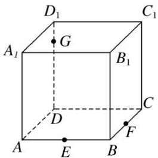

A. 四边形

B. 三角形

C. 五边形

D. 六边形

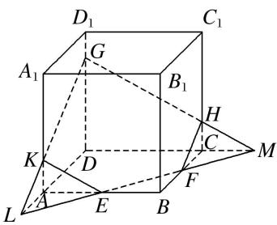  
（2）如图，在正方体 $ABCD - A_{1}B_{1}C_{1}D_{1}$ 中，点 $E$ ， $F$ 分别是棱 $B_{1}B$ ， $B_{1}C_{1}$ 的中点，点 $G$ 是棱 $C_1C$ 的中点，则过线段 $AG$ 且平行于平面 $A_{1}EF$ 的截面图形为（）

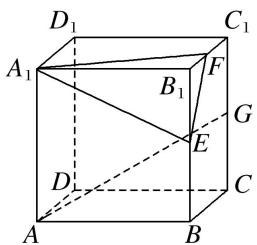

A. 矩形

B. 三角形

C. 正方形

D. 等腰梯形

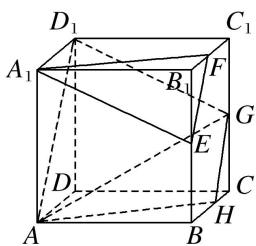  
（3）(2018·全国Ⅰ)已知正方体的棱长为1，每条棱所在直线与平面α所成的角都相等，则α截此正方体所得截面面积的最大值为()

A. $\frac{3\sqrt{3}}{4}$

B. $\frac{2\sqrt{3}}{3}$

C. $\frac{3\sqrt{2}}{4}$

D. $\frac{\sqrt{3}}{2}$
> 

> 
> | 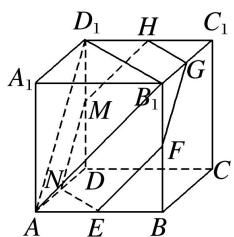 | 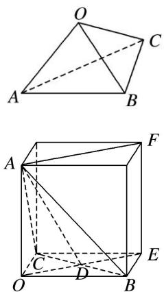 |
> | --- | --- |
> | （4）如图，在三棱锥 O-ABC 中，三条棱 OA，OB，OC 两两垂直，且 OA>OB>OC，分别经过三条棱 OA，OB，OC 作一个截面平分三棱锥的体积，截面面积依次为 $S_{1}, S_{2}, S_{3}$ ，则 $S_{1}, S_{2}, S_{3}$ 的大小关系为 \_\_\_\_. | （5）(2016·全国 I )平面 $\alpha$ 过正方体 $ABCD - A_{1}B_{1}C_{1}D_{1}$ 的顶点 $A, \alpha //$ 平面 $CB_{1}D_{1}, \alpha \cap$ 平面 $ABCD = m, \alpha \cap$ 平面 $ABB_{1}A_{1} = n$ , 则 $m, n$ 所成角的正弦值为( ) |
> 

A. $\frac{\sqrt{3}}{2}$

B. $\frac{\sqrt{2}}{2}$

C. $\frac{\sqrt{3}}{3}$

D. $\frac{1}{3}$

# 【对点精练】

1. 如图是长方体被一平面所截得的几何体, 四边形 $EFGH$ 为截面, 则四边形 $EFGH$ 的图形为( )

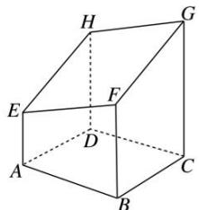

A. 矩形

B. 平行四边形

C. 正方形

D. 等腰梯形

2. $P, Q, R$ 三点分别在直四棱柱 $AC_{1}$ 的棱 $BB_{1}, CC_{1}$ 和 $DD_{1}$ 上，则过 $P, Q, R$ 三点的截面的图形为( )

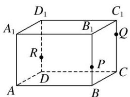

A. 四边形

B. 三角形

C. 五边形

D. 六边形

3. (多选)如图, 正方体 $ABCD - A_{1}B_{1}C_{1}D_{1}$ 的棱长为 1 , $P$ 为 $BC$ 的中点, $Q$ 为线段 $CC_{1}$ 上的动点, 过点 $A$ , $P$ , $Q$ 的平面截该正方体所得的截面记为 $S$ . 则下列命题正确的是( )

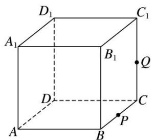

A. 当 $0 < C Q < \frac{1}{2}$ 时， $S$ 为四边形

B. 当 $CQ=\frac{1}{2}$ 时，S 为等腰梯形

C. 当 $CQ=\frac{3}{4}$ 时，S 与 $C_{1}D_{1}$ 的交点 R 满足 $C_{1}R=\frac{1}{3}$

D. 当 $\frac{3}{4} < C Q < 1$ 时， $S$ 为六边形

4. 如图, 将一个长方体用过相邻三条棱的中点的平面截出一个棱锥, 则该棱锥的体积与剩下的几何体体积的比为 \_\_\_\_.

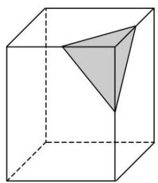

5. 在正方体 $ABCD - A_{1}B_{1}C_{1}D_{1}$ 中， $E, F$ 分别是 $AD, DD_{1}$ 的中点， $AB = 4$ ，则过 $B, E, F$ 的平面截该正方体所得的截面周长为（）

A. $6 \sqrt{2} + 4 \sqrt{5}$

B. $6\sqrt{2} + 2\sqrt{5}$

C. $3 \sqrt{2} + 4 \sqrt{5}$

D. $3\sqrt{2} + 2\sqrt{5}$

6. 如图，在棱长为 1 的正方体 $ABCD - A_{1}B_{1}C_{1}D_{1}$ 中， $M, N$ 分别是 $A_{1}D_{1}, A_{1}B_{1}$ 的中点，过直线 $BD$ 的平面 $\alpha //$ 平面 $AMN$ ，则平面 $\alpha$ 截该正方体所得截面的面积为（）

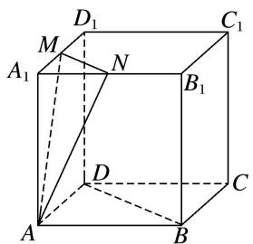

A. $\sqrt{2}$

B. $\frac{9}{8}$

C. $\sqrt{3}$

D. $\frac{\sqrt{6}}{2}$

7. 在三棱锥 $S - ABC$ 中, $\triangle ABC$ 是边长为 6 的正三角形, $SA = SB = SC = 15$ , 平面 $DEFH$ 分别与 $AB$ , $BC$ , $SC$ , $SA$ 交于点 $D$ , $E$ , $F$ , $H$ . $D$ , $E$ 分别是 $AB$ , $BC$ 的中点, 如果直线 $SB //$ 平面 $DEFH$ , 那么四边形 $DEFH$ 的面积为 \_\_\_\_.

8. 在四面体 $ABCD$ 中, 截面 $PQMN$ 是正方形, 则在下列结论中, 错误的是( )

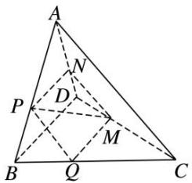

A. $AC \perp BD$

B. AC//截面 PQMN

C. AC=BD

D. 异面直线 $PM$ 与 $BD$ 所成的角为 $45^{\circ}$

9. 如图, 在正方体 $ABCD - A_1B_1C_1D_1$ 中, $M, N, P, Q$ 分别是 $AA_1, A_1D_1, CC_1, BC$ 的中点, 给出以下四个结论: ① $A_1C \perp MN$ ; ② $A_1C \parallel$ 平面 $MNPQ$ ; ③ $A_1C$ 与 $PM$ 相交; ④ $NC$ 与 $PM$ 异面. 其中不正确的结论是( )

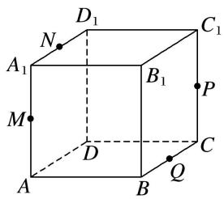

A. ①

B. ②

C. ③

D. ④

10. 如图所示, 正方体 $ABCD - A_{1}B_{1}C_{1}D_{1}$ 的棱长为 $a$ , 点 $P$ 是棱 $AD$ 上一点, 且 $AP = \frac{a}{3}$ , 过 $B_{1} 、 D_{1} , P$ 的平面交底面 $ABCD$ 于 $PQ$ , $Q$ 在直线 $CD$ 上, 则 $PQ = \_$ .

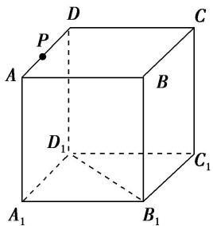

