# 专题05 立体几何中的截面问题

# 【方法总结】

# 确定截面的主要依据

用一个平面去截几何体，此平面与几何体的交集叫做这个几何体的截面，利用平面的性质确定截面形状是解决截面问题的关键.

(1)平面的四个公理及推论．(2)直线和平面平行的判定和性质．(3)两个平面平行的性质．(4)球的截面的性质.

# 【例题选讲】

[例 1](1)如图，在正方体 $ABCD-A_{1}B_{1}C_{1}D_{1}$ 中，E, F, G 分别在 AB, BC, $DD_{1}$ 上，则作过 E, F, G 三点的截面图形为()

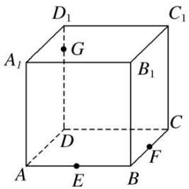

text_image

D₁
C₁
A₁ G B₁
D C
A E B F

A. 四边形

B. 三角形

C. 五边形

D. 六边形

答案 C 解析 作法: ①在底面 $AC$ 内, 过 $E$ , $F$ 作直线 $EF$ , 分别与 $DA$ , $DC$ 的延长线交于 $L$ , $M$ . ②在侧面 $A_{1}D$ 内, 连接 $LG$ 交 $AA_{1}$ 于 $K$ . ③在侧面 $D_{1}C$ 内, 连接 $GM$ 交 $CC_{1}$ 于 $H$ . ④连接 $KE$ , $FH$ . 则五边形 $EFHGK$ 即为所求的截面.

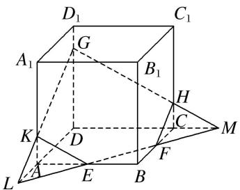

text_image

D₁
C₁
A₁
G
B₁
H
K
D
C
M
F
L
A
E
B

(2)如图，在正方体 $ABCD - A_{1}B_{1}C_{1}D_{1}$ 中，点 $E$ ， $F$ 分别是棱 $B_{1}B$ ， $B_{1}C_{1}$ 的中点，点 $G$ 是棱 $C_1C$ 的中点，则过线段 $AG$ 且平行于平面 $A_{1}EF$ 的截面图形为（）

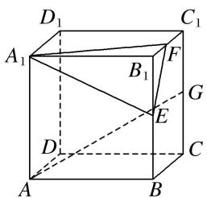

text_image

D₁
C₁
A₁
B₁
F
G
E
D
C
A
B

A. 矩形

B. 三角形

C. 正方形

D. 等腰梯形

答案 D 解析 取 BC 的中点 H，连接 AH，GH， $AD_{1}$ ， $D_{1}G$ ，

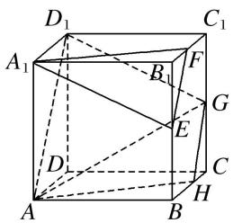

text_image

D₁
A₁
B₁
F
G
E
D
C
H
A
B

由题意得 $GH \parallel EF$ , $AH \parallel A_1F$ , 又 $GH \nsubseteq$ 平面 $A_1EF$ , $EF \subset$ 平面 $A_1EF$ , $\therefore GH \parallel$ 平面 $A_1EF$ , 同理 $AH \parallel$ 平面 $A_1EF$ , 又 $GH \cap AH = H$ , $GH$ , $AH \subset$ 平面 $AHGD_1$ , $\therefore$ 平面 $AHGD_1 \parallel$ 平面 $A_1EF$ , 故过线段 $AG$ 且与平面 $A_1EF$ 平行的截面图形为四边形 $AHGD_1$ , 显然为等腰梯形.

(3)(2018·全国Ⅰ)已知正方体的棱长为1，每条棱所在直线与平面α所成的角都相等，则α截此正方体所得截面面积的最大值为()

A. $\frac{3\sqrt{3}}{4}$

B. $\frac{2\sqrt{3}}{3}$

C. $\frac{3\sqrt{2}}{4}$

D. $\frac{\sqrt{3}}{2}$

答案 A 解析 如图所示，在正方体 $ABCD-A_{1}B_{1}C_{1}D_{1}$ 中，平面 $AB_{1}D_{1}$ 与棱 $A_{1}A, A_{1}B_{1}, A_{1}D_{1}$ 所成的角都相等，又正方体的其余棱都分别与 $A_{1}A, A_{1}B_{1}, A_{1}D_{1}$ 平行，故正方体 $ABCD-A_{1}B_{1}C_{1}D_{1}$ 的每条棱所在直线与平面 $AB_{1}D_{1}$ 所成的角都相等．取棱 AB, $BB_{1}, B_{1}C_{1}, C_{1}D_{1}, DD_{1}, AD$ 的中点 E, F, G, H, M, N，则正六边形 EFGHMN 所在平面与平面 $AB_{1}D_{1}$ 平行且面积最大，此截面面积为 $S_{正六边形 EFGHMN}=6\times\frac{1}{2}\times\frac{\sqrt{2}}{2}\times\frac{\sqrt{2}}{2}\sin60^{\circ}=\frac{3\sqrt{3}}{4}$ . 故选 A.

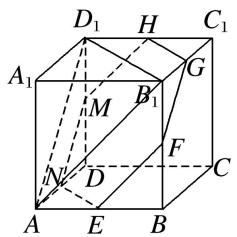

text_image

D₁ H C₁
A₁ M B₁ G
N D F C
A E B

(4)如图，在三棱锥 O-ABC 中，三条棱 OA，OB，OC 两两垂直，且 OA>OB>OC，分别经过三条棱 OA，OB，OC 作一个截面平分三棱锥的体积，截面面积依次为 $S_{1}, S_{2}, S_{3}$ ，则 $S_{1}, S_{2}, S_{3}$ 的大小关系为 \_\_\_\_.

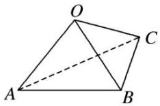

答案 $S_{3} < S_{2} < S_{1}$ 解析 由题意知 $OA, OB, OC$ 两两垂直，可将其放置在以 $O$ 为顶点的长方体中，设三边 $OA, OB, OC$ 分别为 $a, b, c$ ，且 $a > b > c$ ，利用等体积法易得

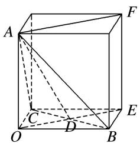

text_image

Geometric diagram of a cube with labeled vertices and internal diagonals, used for spatial geometry problems.

$$
S _ {1} = \frac {1}{4} a \sqrt {b ^ {2} + c ^ {2}}, S _ {2} = \frac {1}{4} b \sqrt {a ^ {2} + c ^ {2}}, S _ {3} = \frac {1}{4} c \sqrt {a ^ {2} + b ^ {2}}, \therefore S _ {1} ^ {2} - S _ {2} ^ {2} = \frac {1}{1 6} (a ^ {2} b ^ {2} + a ^ {2} c ^ {2}) - \frac {1}{1 6} (b ^ {2} a ^ {2} + b ^ {2} c ^ {2}) = \frac {1}{1 6} c ^ {2} (a ^ {2} -
$$

$b^{2}$ ，又 a > b，∴ $S_{1}^{2} - S_{2}^{2} > 0$ ，即 $S_{1} > S_{2}$ ，同理，平方后作差可得， $S_{2} > S_{3}$ ，∴ $S_{3} < S_{2} < S_{1}$ .

(5)(2016·全国 I )平面 $\alpha$ 过正方体 $ABCD - A_{1}B_{1}C_{1}D_{1}$ 的顶点 $A$ , $\alpha //$ 平面 $CB_{1}D_{1}$ , $\alpha \cap$ 平面 $ABCD = m$ , $\alpha \cap$ 平面 $ABB_{1}A_{1} = n$ , 则 $m, n$ 所成角的正弦值为( )

A. $\frac{\sqrt{3}}{2}$

B. $\frac{\sqrt{2}}{2}$

C. $\frac{\sqrt{3}}{3}$

D. $\frac{1}{3}$

答案 A 解析 如图所示，设平面 $CB_{1}D_{1} \cap$ 平面 ABCD = m₁，∵ $\alpha \parallel$ 平面 $CB_{1}D_{1}$ ，则 $m_{1} \parallel m$ ，

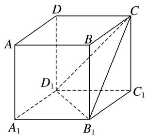

text_image

D
A
B
C
D₁
C₁
A₁
B₁

又∵平面 ABCD // 平面 $A_{1}B_{1}C_{1}D_{1}$ ，平面 $CB_{1}D_{1} \cap$ 平面 $A_{1}B_{1}C_{1}D_{1} = B_{1}D_{1}$ ，∴ $B_{1}D_{1} // m_{1}$ ，∴ $B_{1}D_{1} // m$ ，同理可得 $CD_{1} // n$ 。故 m，n 所成角的大小与 $B_{1}D_{1}$ ， $CD_{1}$ 所成角的大小相等，即 $\angle CD_{1}B_{1}$ 的大小。而 $B_{1}C = B_{1}D_{1} = CD_{1}$ （均为面对角线），因此 $\angle CD_{1}B_{1} = \frac{\pi}{3}$ ，得 $\sin \angle CD_{1}B_{1} = \frac{\sqrt{3}}{2}$ ，故选 A。

# 【对点精练】

1. 如图是长方体被一平面所截得的几何体, 四边形 $EFGH$ 为截面, 则四边形 $EFGH$ 的图形为( )

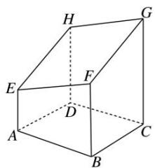

text_image

Geometric diagram of a cube with labeled vertices and internal points, used for spatial geometry problems.

A. 矩形

B. 平行四边形

C. 正方形

D. 等腰梯形

1. 答案 B 解析 ∵ 平面 $ABFE \parallel$ 平面 DCGH，又平面 $EFGH \cap$ 平面 ABFE = EF，平面 $EFGH \cap$ 平面 DC GH = HG，∴ $EF \parallel HG$ 。同理 $EH \parallel FG$ ，∴ 四边形 EFGH 是平行四边形。

2. $P, Q, R$ 三点分别在直四棱柱 $AC_{1}$ 的棱 $BB_{1}, CC_{1}$ 和 $DD_{1}$ 上，则过 $P, Q, R$ 三点的截面的图形为( )

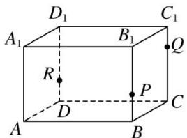

text_image

D₁
A₁ B₁ C₁
R Q
P
D C
A B

A. 四边形

B. 三角形

C. 五边形

D. 六边形

2. 答案 C 解析 作法: (1) 连接 $QP$ , $QR$ 并延长, 分别交 $CB$ , $CD$ 的延长线于 $E$ , $F$ . (2) 连接 $EF$ 交 $AB$ 于 $T$ , 交 $AD$ 于 $S$ . (3) 连接 $RS$ , $TP$ . 则五边形 $PQRST$ 即为所求截面.

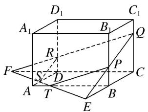

text_image

D₁
A₁
B₁
C₁
R
F
S
D
P
A
T
B
E
C

3. (多选)如图, 正方体 $ABCD - A_{1}B_{1}C_{1}D_{1}$ 的棱长为 1 , $P$ 为 $BC$ 的中点, $Q$ 为线段 $CC_{1}$ 上的动点, 过点 $A$ , $P$ , $Q$ 的平面截该正方体所得的截面记为 $S$ . 则下列命题正确的是( )

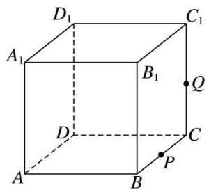

text_image

D₁
A₁
B₁
C₁
Q
D
C
P
A
B

A. 当 $0 < CQ < \frac{1}{2}$ 时， $S$ 为四边形

B. 当 $CQ = \frac{1}{2}$ 时， $S$ 为等腰梯形

C. 当 $CQ = \frac{3}{4}$ 时， $S$ 与 $C_1D_1$ 的交点 $R$ 满足 $C_1R = \frac{1}{3}$

D. 当 $\frac{3}{4} < CQ < 1$ 时， $S$ 为六边形

3. 答案 ABC 解析 当 Q 为中点，即 $CQ=\frac{1}{2}$ 时，截面 $APQD_{1}$ 为等腰梯形，故 B 正确；

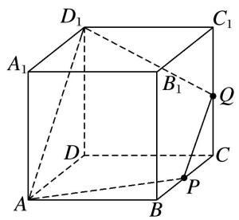

text_image

D₁
A₁
B₁
Q
D
C
P
A
B

当 $0 < CQ < \frac{1}{2}$ 时，只需在 $DD_{1}$ 上取点 $M$ 使 $PQ // AM$ ，即可得截面APQM为四边形，故A正确；当 $CQ = \frac{3}{4}$ 时，如图，延长AP交DC于 $M$ ，连接MQ，并延长交 $C_1D_1$ 于 $R$ ，交 $DD_{1}$ 于 $N$

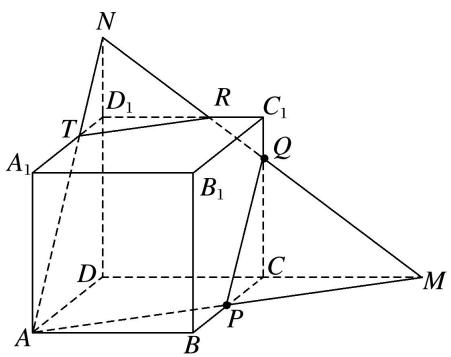

text_image

N
D₁
R
C₁
T
Q
A₁
B₁
D
C
M
A
B
P

$\because C Q = \frac{3}{4}, \therefore D N = \frac{3}{4} \times 2 = \frac{3}{2}, \therefore D _{1} N = \frac{1}{2}, \therefore \frac{D _{1} N}{D N} = \frac{1}{3}, \therefore \frac{D _{1} R}{D M} = \frac{1}{3}, \therefore D _{1} R = \frac{1}{3} D M = \frac{2}{3}, \therefore C _{1} R = \frac{1}{3}$ , 故 C 正确；当 $\frac{3}{4} < C Q < 1$ 时，在上图中只需将 $Q$ 上移，此时截面形状仍是 $A P Q R T$ ，为五边形，故 D 不正确.

4. 如图，将一个长方体用过相邻三条棱的中点的平面截出一个棱锥，则该棱锥的体积与剩下的几何体体

积的比为\_\_\_\_。

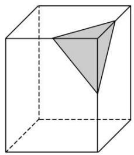

natural_image

Geometric diagram of a cube with one triangular prism inside, no text or symbols present

4. 答案 1:47 解析 设长方体的相邻三条棱长分别为 $a, b, c$ ，它截出棱锥的体积 $V_{1} = \frac{1}{3} \times \frac{1}{2} \times \frac{1}{2} a \times \frac{1}{2} b \times \frac{1}{2} c = \frac{1}{48} abc$ ，剩下的几何体的体积 $V_{2} = abc - \frac{1}{48} abc = \frac{47}{48} abc$ ，所以 $V_{1}: V_{2} = 1:47$ .

5. 在正方体 $ABCD - A_{1}B_{1}C_{1}D_{1}$ 中， $E, F$ 分别是 $AD, DD_{1}$ 的中点， $AB = 4$ ，则过 $B, E, F$ 的平面截该正方体所得的截面周长为（）

A. $6 \sqrt{2} + 4 \sqrt{5}$

B. $6\sqrt{2}+2\sqrt{5}$

C. $3\sqrt{2}+4\sqrt{5}$

D. $3\sqrt{2} + 2\sqrt{5}$

5. 答案 A 解析 ∵ 正方体 $ABCD-A_{1}B_{1}C_{1}D_{1}$ 中，E, F 分别是棱 AD, $DD_{1}$ 的中点，

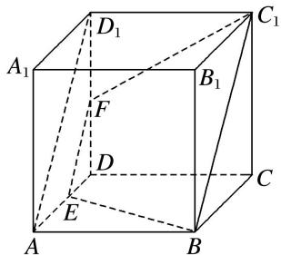

text_image

D₁
A₁
F
B₁
C₁
D
E
A
B

$\therefore EF \parallel AD_{1} \parallel BC_{1}$ . $\because EF \notin$ 平面 $BCC_{1}B_{1}$ , $BC_{1} \subset$ 平面 $BCC_{1}B_{1}$ , $\therefore EF \parallel$ 平面 $BCC_{1}B_{1}$ . 由正方体的棱长为 4, 可得截面是以 $BE = C_{1}F = 2\sqrt{5}$ 为腰, $EF = 2\sqrt{2}$ 为上底, $BC_{1} = 2EF = 4\sqrt{2}$ 为下底的等腰梯形, 故周长为 $6\sqrt{2} + 4\sqrt{5}$ .

6. 如图，在棱长为 1 的正方体 $ABCD - A_1B_1C_1D_1$ 中， $M, N$ 分别是 $A_1D_1, A_1B_1$ 的中点，过直线 $BD$ 的平面 $\alpha //$ 平面 $AMN$ ，则平面 $\alpha$ 截该正方体所得截面的面积为（）

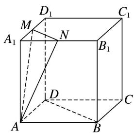

text_image

D₁
M
A₁
N
B₁
C₁
D
A
B
C

A. $\sqrt{2}$

B. $\frac{9}{8}$

C. $\sqrt{3}$

D. $\frac{\sqrt{6}}{2}$

6. 答案 B 解析 如图，分别取 $C_{1}D_{1}$ ， $B_{1}C_{1}$ 的中点 P，Q，连接 PQ， $B_{1}D_{1}$ ，DP，BQ，NP，易知 MN // $B_{1}D_{1}$

// BD, AD // NP, AD = NP, 所以四边形 ANPD 为平行四边形, 所以 AN // DP. 又 BD 和 DP 为平面 DBQP 内的两条相交直线, AN, MN 为平面 AMN 内的两条相交直线, 所以平面 DBQP // 平面 AMN, 四边形

DBQP 的面积即所求．因为 $PQ \parallel DB$ ，所以四边形 DBQP 为梯形， $PQ = \frac{1}{2} BD = \frac{\sqrt{2}}{2}$ ，梯形的高 $h = \sqrt{1^{2} + \left(\frac{1}{2}\right)^{2} - \left(\frac{\sqrt{2}}{4}\right)^{2}} = \frac{3\sqrt{2}}{4}$ ，所以四边形 DBQP 的面积为 $\frac{1}{2}(PQ + BD)h = \frac{9}{8}$ .

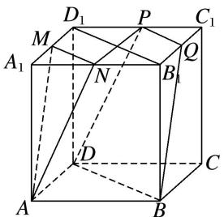

text_image

D₁
P
C₁
M
A₁
N
Q
B₁
D
C
A
B

7. 在三棱锥 $S - ABC$ 中， $\triangle ABC$ 是边长为 6 的正三角形， $SA = SB = SC = 15$ ，平面 $DEFH$ 分别与 $AB, BC, SC, SA$ 交于点 $D, E, F, H, D, E$ 分别是 $AB, BC$ 的中点，如果直线 $SB //$ 平面 $DEFH$ ，那么四边形 $DEFH$ 的面积为 \_\_\_\_.

7. 答案 $\frac{45}{2}$ 解析 如图，取 $AC$ 的中点 $G$ ，连接 $SG, BG$ . 易知 $SG \perp AC, BG \perp AC, SG \cap BG = G, SG, BG \subset$ 平面 $SGB$ ，故 $AC \perp$ 平面 $SGB$ ，所以 $AC \perp SB$ . 因为 $SB //$ 平面 $DEFH, SB \subset$ 平面 $SAB$ ，平面 $SAB \cap$ 平面 $DEFH = HD$ ，则 $SB // HD$ . 同理 $SB // FE$ . 又 $D, E$ 分别为 $AB, BC$ 的中点，则 $H, F$ 也为 $AS, SC$ 的中点，从而得 $HF \cong \frac{1}{2} AC \cong DE$ ，所以四边形 $DEFH$ 为平行四边形. 又 $AC \perp SB, SB // HD, DE // AC$ ，所以 $DE \perp HD$ ，所以四边形 $DEFH$ 为矩形，其面积 $S = HF \cdot HD = \left(\frac{1}{2} AC\right) \cdot \left(\frac{1}{2} SB\right) = \frac{45}{2}$ .

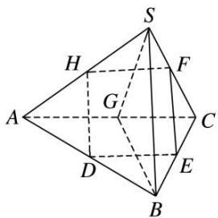

text_image

S
H
F
G
A
C
D
E
B

8. 在四面体 $ABCD$ 中, 截面 $PQMN$ 是正方形, 则在下列结论中, 错误的是( )

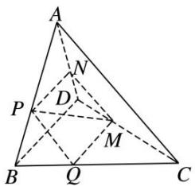

text_image

Geometric diagram of a tetrahedron with labeled vertices and internal points, used for mathematical analysis.

A. $AC \perp BD$

B. AC//截面 PQMN

C. AC=BD

D. 异面直线 $PM$ 与 $BD$ 所成的角为 $45^{\circ}$

8. 答案 C 解析 因为截面 PQMN 是正方形，所以 $MN \parallel QP$ ，又 $PQ \subset$ 平面 ABC， $MN \not\subset$ 平面 ABC，则 $MN \parallel$ 平面 ABC，由线面平行的性质知 $MN \parallel AC$ ，又 $MN \subset$ 平面 PQMN， $AC \not\subset$ 平面 PQMN，则 $AC \parallel$ 截面 PQMN，同理可得 $MQ \parallel BD$ ，又 $MN \perp QM$ ，则 $AC \perp BD$ ，故 A，B 正确。又因为 $BD \parallel MQ$ ，所以异面直线 PM 与 BD 所成的角等于 PM 与 QM 所成的角，即为 $45^{\circ}$ ，故 D 正确。

9. 如图，在正方体 $ABCD - A_1B_1C_1D_1$ 中， $M, N, P, Q$ 分别是 $AA_1, A_1D_1, CC_1, BC$ 的中点，给出以下四个结论：① $A_1C \perp MN$ ；② $A_1C //$ 平面 $MNPQ$ ；③ $A_1C$ 与 $PM$ 相交；④ $NC$ 与 $PM$ 异面。其中不正确的结论是（）

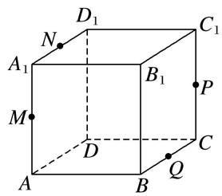

text_image

D₁
N
A₁
B₁
C₁
M
D
P
C
Q
A
B

A. ①

B. ②

C. ③

D. ④

9. 答案 B 解析 作出过 M, N, P, Q 四点的截面交 $C_{1}D_{1}$ 于点 S，交 AB 于点 R，如图中的六边形 MNSPQR，显然点 $A_{1}$ ，C 分别位于这个平面的两侧，故 $A_{1}C$ 与平面 MNPQ 一定相交，不可能平行，故结论②不正确.

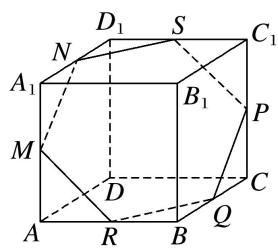

text_image

D₁ S C₁
N
A₁ B₁ P
M D C
A R B Q

10. 如图所示, 正方体 $ABCD - A_{1}B_{1}C_{1}D_{1}$ 的棱长为 $a$ , 点 $P$ 是棱 $AD$ 上一点, 且 $AP = \frac{a}{3}$ , 过 $B_{1}, D_{1}, P$ 的平面交底面 $ABCD$ 于 $PQ$ , $Q$ 在直线 $CD$ 上, 则 $PQ = \_$ .

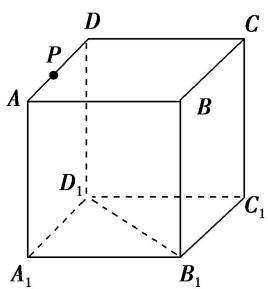

text_image

P
A
D
C
B
D₁
C₁
A₁
B₁

10. 答案 $\frac{2\sqrt{2}}{3} a$ 解析 $\because$ 平面 $A_{1}B_{1}C_{1}D_{1} //$ 平面 $ABCD$ ，而平面 $B_{1}D_{1}P \cap$ 平面 $ABCD = PQ$ ，平面 $B_{1}D_{1}P \cap$ 平面 $A_{1}B_{1}C_{1}D_{1} = B_{1}D_{1}$ ， $\therefore B_{1}D_{1} // PQ$ .

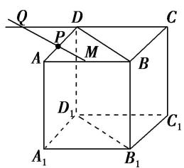

text_image

Q
D
C
P
M
A
B
D₁
C₁
A₁
B₁

又∵ $B_{1}D_{1}$ // BD，∴BD//PQ，设 $PQ\cap AB=M$ ，∵AB//CD，∴△APM∽△DPQ．∴ $\frac{PM}{PQ}=\frac{AP}{PD}=\frac{1}{2}$ ，即PQ=

2PM. 又知 $\triangle APM \sim \triangle ADB$ , $\therefore \frac{PM}{BD} = \frac{AP}{AD} = \frac{1}{3}$ , $\therefore PM = \frac{1}{3} BD$ , 又 $BD = \sqrt{2} a$ , $\therefore PQ = \frac{2\sqrt{2}}{3} a$ .

