专题05　立体几何中的截面问题

【方法总结】

确定截面的主要依据

用一个平面去截几何体，此平面与几何体的交集叫做这个几何体的截面，利用平面的性质确定截面形状是解决截面问题的关键．  
（1）平面的四个公理及推论．（2）直线和平面平行的判定和性质．（3）两个平面平行的性质．（4）球的截面的性质．

【例题选讲】

<strong>[例1]</strong>（1）如图，在正方体<em>ABCD</em>－<em>A</em>1<em>B</em>1<em>C</em>1<em>D</em>1中，<em>E</em>，<em>F</em>，<em>G</em>分别在<em>AB</em>，<em>BC</em>，<em>DD</em>1上，则作过<em>E</em>，<em>F</em>，<em>G</em>三点的截面图形为(　　)

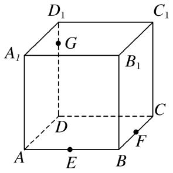

A．四边形　　　　　　
B．三角形　　　　　　
C．五边形　　　　　　
D．六边形
答案　C　解析　作法：①在底面<em>AC</em>内，过<em>E</em>，<em>F</em>作直线<em>EF</em>，分别与<em>DA</em>，<em>DC</em>的延长线交于<em>L</em>，<em>M</em>．②在侧面<em>A</em>1<em>D</em>内，连接<em>LG</em>交<em>AA</em>1于<em>K</em>．③在侧面<em>D</em>1<em>C</em>内，连接<em>GM</em>交<em>CC</em>1于<em>H</em>．④连接<em>KE</em>，<em>FH</em>．则五边形<em>EFHGK</em>即为所求的截面．

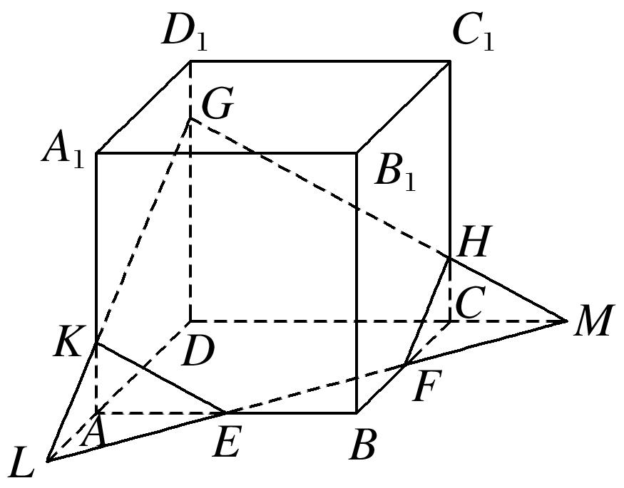  
（2）如图，在正方体<em>ABCD</em>－<em>A</em>1<em>B</em>1<em>C</em>1<em>D</em>1中，点<em>E</em>，<em>F</em>分别是棱<em>B</em>1<em>B</em>，<em>B</em>1<em>C</em>1的中点，点<em>G</em>是棱<em>C</em>1<em>C</em>的中点，则过线段<em>AG</em>且平行于平面<em>A</em>1<em>EF</em>的截面图形为(　　)

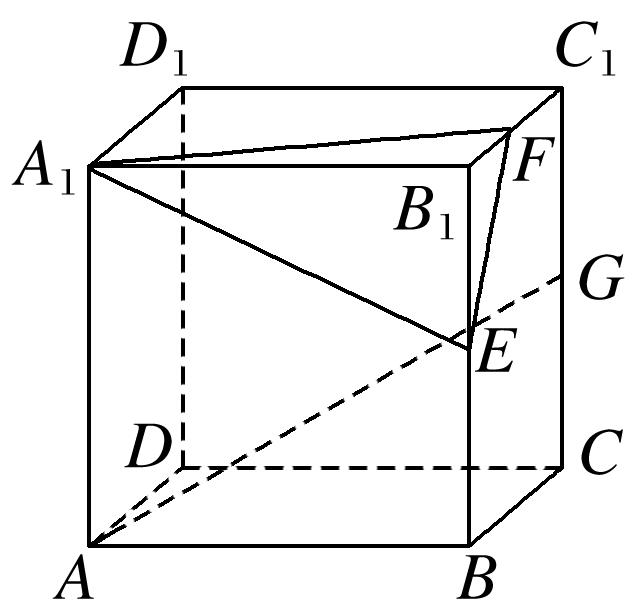

A．矩形　　　　　　　
B．三角形　　　　　　　　
C．正方形　　　　　　　
D．等腰梯形
答案　D　解析　取<em>BC</em>的中点<em>H</em>，连接<em>AH</em>，<em>GH</em>，<em>AD</em>1，<em>D</em>1<em>G</em>，

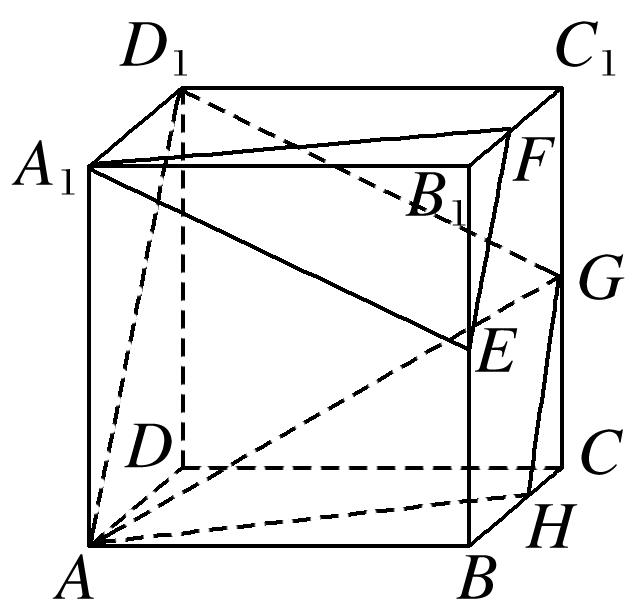
由题意得<em>GH</em>∥<em>EF</em>，<em>AH</em>∥<em>A</em>1<em>F</em>，又<em>GH</em>⊄平面<em>A</em>1<em>EF</em>，<em>EF</em>⊂平面<em>A</em>1<em>EF</em>，∴<em>GH</em>∥平面<em>A</em>1<em>EF</em>，同理<em>AH</em>∥平面<em>A</em>1<em>EF</em>，又<em>GH</em>∩<em>AH</em>＝<em>H</em>，<em>GH</em>，<em>AH</em>⊂平面<em>AHGD</em>1，∴平面<em>AHGD</em>1∥平面<em>A</em>1<em>EF</em>，故过线段<em>AG</em>且与平面<em>A</em>1<em>EF</em>平行的截面图形为四边形<em>AHGD</em>1，显然为等腰梯形．  
（3）(2018·全国Ⅰ)已知正方体的棱长为1，每条棱所在直线与平面*α*所成的角都相等，则*α*截此正方体所得截面面积的最大值为(　　)

A．　　　　　　　　
B．　　　　　　　　
C．　　　　　　　　
D．
答案　A　解析　如图所示，在正方体<em>ABCD</em>－<em>A</em>1<em>B</em>1<em>C</em>1<em>D</em>1中，平面<em>AB</em>1<em>D</em>1与棱<em>A</em>1<em>A</em>，<em>A</em>1<em>B</em>1，<em>A</em>1<em>D</em>1所成的角都相等，又正方体的其余棱都分别与<em>A</em>1<em>A</em>，<em>A</em>1<em>B</em>1，<em>A</em>1<em>D</em>1平行，故正方体<em>ABCD</em>－<em>A</em>1<em>B</em>1<em>C</em>1<em>D</em>1的每条棱所在直线与平面<em>AB</em>1<em>D</em>1所成的角都相等．取棱<em>AB</em>，<em>BB</em>1，<em>B</em>1<em>C</em>1，<em>C</em>1<em>D</em>1，<em>DD</em>1，<em>AD</em>的中点<em>E</em>，<em>F</em>，<em>G</em>，<em>H</em>，<em>M</em>，<em>N</em>，则正六边形<em>EFGHMN</em>所在平面与平面<em>AB</em>1<em>D</em>1平行且面积最大，此截面面积为<em>S</em>正六边形<em>EFGHMN</em>＝6×××sin 60°＝．故选A．

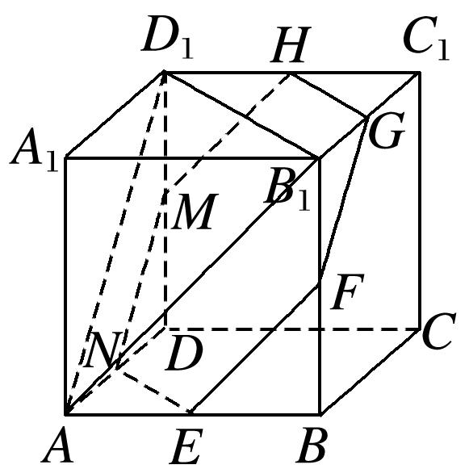  
（4）如图，在三棱锥<em>O</em>－<em>ABC</em>中，三条棱<em>OA</em>，<em>OB</em>，<em>OC</em>两两垂直，且<em>OA</em>&gt;<em>OB</em>&gt;<em>OC</em>，分别经过三条棱<em>OA</em>，<em>OB</em>，<em>OC</em>作一个截面平分三棱锥的体积，截面面积依次为<em>S</em>1，<em>S</em>2，<em>S</em>3，则<em>S</em>1，<em>S</em>2，<em>S</em>3的大小关系为\_\_\_\_\_\_\_\_．

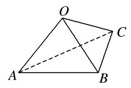
答案　<em>S</em>3&lt;<em>S</em>2&lt;<em>S</em>1　　解析　由题意知<em>OA</em>，<em>OB</em>，<em>OC</em>两两垂直，可将其放置在以<em>O</em>为顶点的长方体中，设三边<em>OA</em>，<em>OB</em>，<em>OC</em>分别为<em>a</em>，<em>b</em>，<em>c</em>，且<em>a</em>&gt;<em>b</em>&gt;<em>c</em>，利用等体积法易得

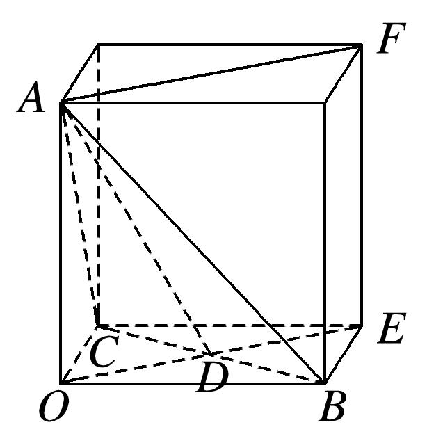

<em>S</em>1＝<em>a</em>，<em>S</em>2＝<em>b</em>，<em>S</em>3＝<em>c</em>，∴<em>S</em>－<em>S</em>＝(<em>a</em>2<em>b</em>2＋<em>a</em>2<em>c</em>2)－(<em>b</em>2<em>a</em>2＋<em>b</em>2<em>c</em>2)＝<em>c</em>2(<em>a</em>2－<em>b</em>2)，又<em>a</em>&gt;<em>b</em>，∴<em>S</em>－<em>S</em>&gt;0，即<em>S</em>1&gt;<em>S</em>2，同理，平方后作差可得，<em>S</em>2&gt;<em>S</em>3，∴<em>S</em>3&lt;<em>S</em>2&lt;<em>S</em>1．  
（5）(2016·全国Ⅰ)平面<em>α</em>过正方体<em>ABCD</em>－<em>A</em>1<em>B</em>1<em>C</em>1<em>D</em>1的顶点<em>A</em>，<em>α</em>∥平面<em>CB</em>1<em>D</em>1，<em>α</em>∩平面<em>ABCD</em>＝<em>m</em>，<em>α</em>∩平面<em>ABB</em>1<em>A</em>1＝<em>n</em>，则<em>m</em>，<em>n</em>所成角的正弦值为(　　)

A．　　　　　　　　
B．　　　　　　　　
C．　　　　　　　　
D．
答案　A　解析　如图所示，设平面<em>CB</em>1<em>D</em>1∩平面<em>ABCD</em>＝<em>m</em>1，∵<em>α</em>∥平面<em>CB</em>1<em>D</em>1，则<em>m</em>1∥<em>m</em>，

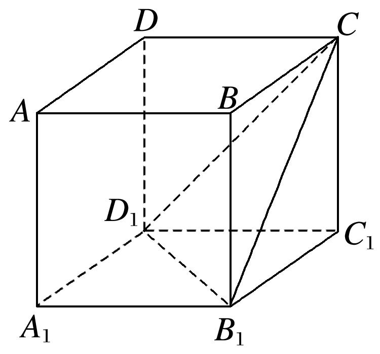
又∵平面<em>ABCD</em>∥平面<em>A</em>1<em>B</em>1<em>C</em>1<em>D</em>1，平面<em>CB</em>1<em>D</em>1∩平面<em>A</em>1<em>B</em>1<em>C</em>1<em>D</em>1＝<em>B</em>1<em>D</em>1，∴<em>B</em>1<em>D</em>1∥<em>m</em>1，∴<em>B</em>1<em>D</em>1∥<em>m</em>，同理可得<em>CD</em>1∥<em>n</em>．故<em>m</em>，<em>n</em>所成角的大小与<em>B</em>1<em>D</em>1，<em>CD</em>1所成角的大小相等，即∠<em>CD</em>1<em>B</em>1的大小．而<em>B</em>1<em>C</em>＝<em>B</em>1<em>D</em>1＝<em>CD</em>1(均为面对角线)，因此∠<em>CD</em>1<em>B</em>1＝，得sin∠<em>CD</em>1<em>B</em>1＝，故选A．

【对点精练】

1．如图是长方体被一平面所截得的几何体，四边形*EFGH*为截面，则四边形*EFGH*的图形为(　　)

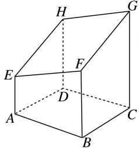

A．矩形　　　　　　
B．平行四边形　　　　　　　
C．正方形　　　　　　
D．等腰梯形

1．答案　B　解析　∵平面*ABFE*∥平面*DCGH*，又平面*EFGH*∩平面*ABFE*＝*EF*，平面*EFGH*∩平面*DC*

*GH*＝*HG*，∴*EF*∥*HG*．同理*EH*∥*FG*，∴四边形*EFGH*是平行四边形．

2．<em>P</em>，<em>Q</em>，<em>R</em>三点分别在直四棱柱<em>AC</em>1的棱<em>BB</em>1，<em>CC</em>1和<em>DD</em>1上，则过<em>P</em>，<em>Q</em>，<em>R</em>三点的截面的图形为(　　)

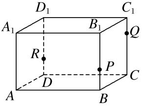

A．四边形　　　　　　
B．三角形　　　　　　
C．五边形　　　　　　
D．六边形

2．答案　C　解析　作法：（1）连接*QP*，*QR*并延长，分别交*CB*，*CD*的延长线于*E*，*F*．（2）连接*EF*交*AB*

于*T*，交*AD*于*S*．（3）连接*RS*，*TP*．则五边形*PQRST*即为所求截面．

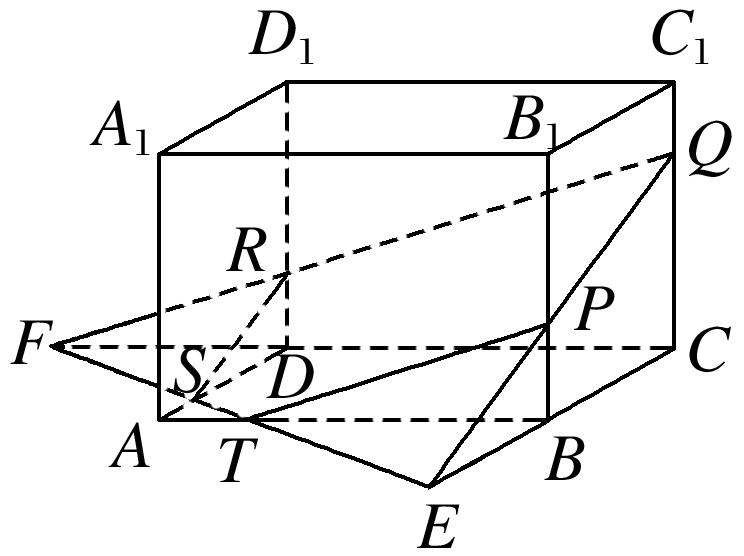

3．(多选)如图，正方体<em>ABCD</em>－<em>A</em>1<em>B</em>1<em>C</em>1<em>D</em>1的棱长为1，<em>P</em>为<em>BC</em>的中点，<em>Q</em>为线段<em>CC</em>1上的动点，过点<em>A</em>，

*P*，*Q*的平面截该正方体所得的截面记为*S*．则下列命题正确的是(　　)

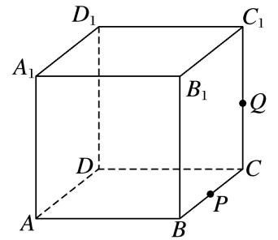

A．当0<*CQ*<时，*S*为四边形　　　　　　　　　　　
B．当*CQ*＝时，*S*为等腰梯形

C．当<em>CQ</em>＝时，<em>S</em>与<em>C</em>1<em>D</em>1的交点<em>R</em>满足<em>C</em>1<em>R</em>＝　　　
D．当&lt;<em>CQ</em>&lt;1时，<em>S</em>为六边形

3．答案　ABC　解析　当<em>Q</em>为中点，即<em>CQ</em>＝时，截面<em>APQD</em>1为等腰梯形，故B正确；
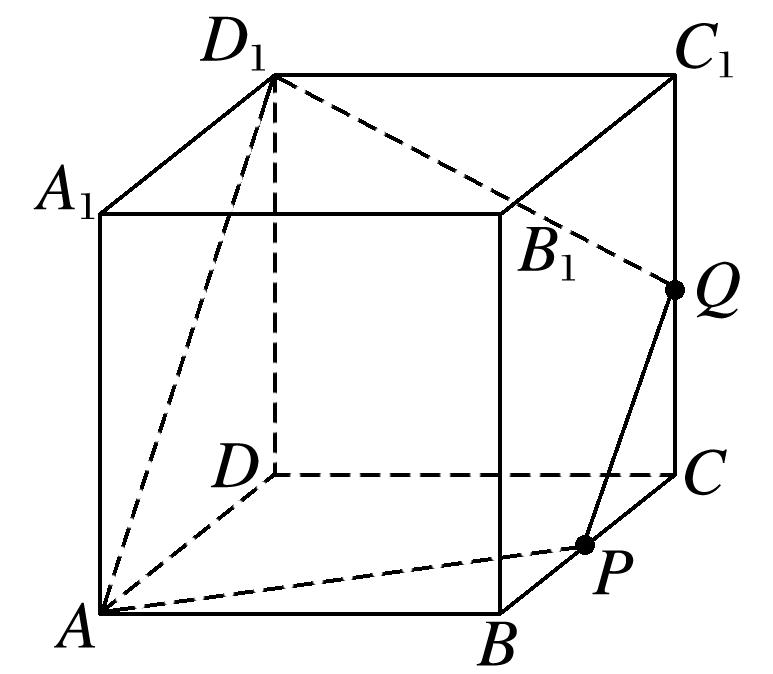
当0&lt;<em>CQ</em>&lt;时，只需在<em>DD</em>1上取点<em>M</em>使<em>PQ</em>∥<em>AM</em>，即可得截面<em>APQM</em>为四边形，故A正确；当<em>CQ</em>＝时，如图，延长<em>AP</em>交<em>DC</em>于<em>M</em>，连接<em>MQ</em>，并延长交<em>C</em>1<em>D</em>1于<em>R</em>，交<em>DD</em>1于<em>N</em>，

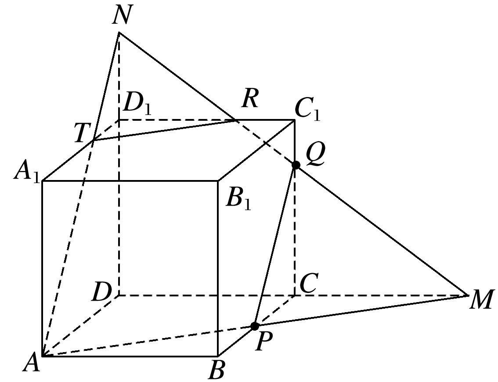
∵<em>CQ</em>＝，∴<em>DN</em>＝×2＝，∴<em>D</em>1<em>N</em>＝，∴＝，∴＝，∴<em>D</em>1<em>R</em>＝<em>DM</em>＝，∴<em>C</em>1<em>R</em>＝，故C正确；当&lt;<em>CQ</em>&lt;1时，在上图中只需将<em>Q</em>上移，此时截面形状仍是<em>APQRT</em>，为五边形，故D不正确．

4．如图，将一个长方体用过相邻三条棱的中点的平面截出一个棱锥，则该棱锥的体积与剩下的几何体体

积的比为\_\_\_\_\_\_\_\_．

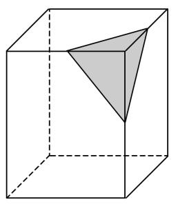

4．答案　1∶47　解析　设长方体的相邻三条棱长分别为<em>a</em>，<em>b</em>，<em>c</em>，它截出棱锥的体积<em>V</em>1＝××<em>a</em>×<em>b</em>

×<em>c</em>＝<em>abc</em>，剩下的几何体的体积<em>V</em>2＝<em>abc</em>－<em>abc</em>＝<em>abc</em>，所以<em>V</em>1∶<em>V</em>2＝1∶47．

5．在正方体<em>ABCD</em>－<em>A</em>1<em>B</em>1<em>C</em>1<em>D</em>1中，<em>E</em>，<em>F</em>分别是<em>AD</em>，<em>DD</em>1的中点，<em>AB</em>＝4，则过<em>B</em>，<em>E</em>，<em>F</em>的平面截该正

方体所得的截面周长为(　　)

A．6＋4　　　　
B．6＋2　　　　
C．3＋4　　　　
D．3＋2

5．答案　A　解析　∵正方体<em>ABCD</em>－<em>A</em>1<em>B</em>1<em>C</em>1<em>D</em>1中，<em>E</em>，<em>F</em>分别是棱<em>AD</em>，<em>DD</em>1的中点，

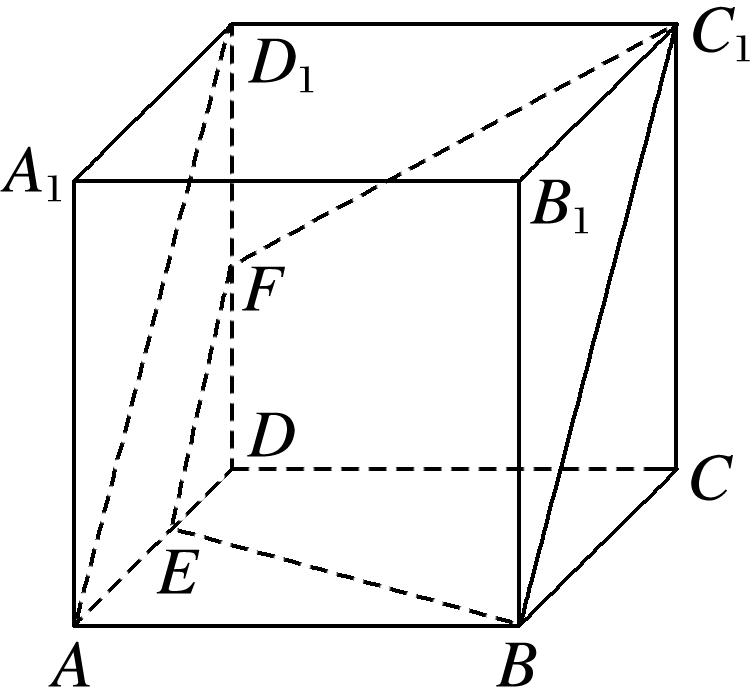
∴<em>EF</em>∥<em>AD</em>1∥<em>BC</em>1．∵<em>EF</em>⊄平面<em>BCC</em>1<em>B</em>1，<em>BC</em>1⊂平面<em>BCC</em>1<em>B</em>1，∴<em>EF</em>∥平面<em>BCC</em>1<em>B</em>1．由正方体的棱长为4，可得截面是以<em>BE</em>＝<em>C</em>1<em>F</em>＝2为腰，<em>EF</em>＝2为上底，<em>BC</em>1＝2<em>EF</em>＝4为下底的等腰梯形，故周长为6＋4．

6．如图，在棱长为1的正方体<em>ABCD</em>－<em>A</em>1<em>B</em>1<em>C</em>1<em>D</em>1中，<em>M</em>，<em>N</em>分别是<em>A</em>1<em>D</em>1，<em>A</em>1<em>B</em>1的中点，过直线<em>BD</em>的平面

*α*∥平面*AMN*，则平面*α*截该正方体所得截面的面积为(　　)

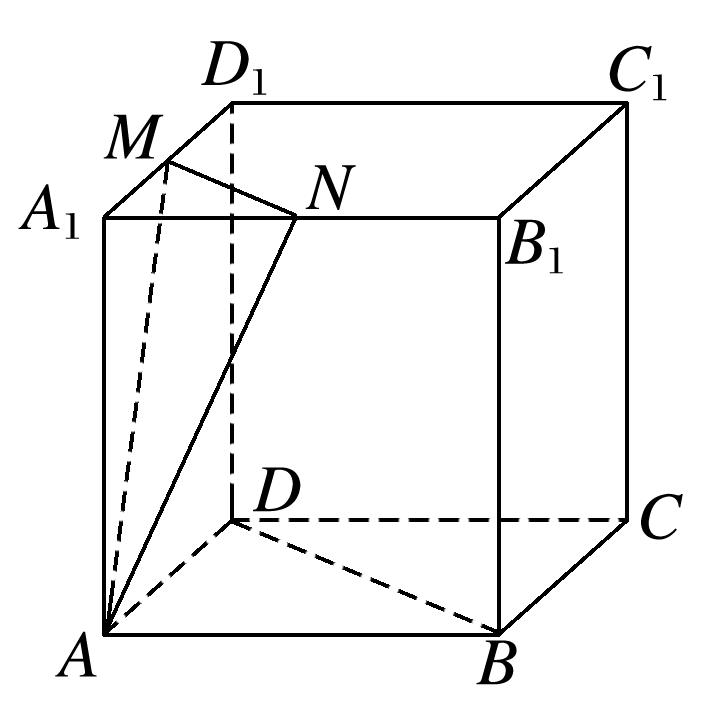

A．　　　　　　　　　
B．　　　　　　　　
C．　　　　　　　　
D．

6．答案　B　解析　如图，分别取<em>C</em>1<em>D</em>1，<em>B</em>1<em>C</em>1的中点<em>P</em>，<em>Q</em>，连接<em>PQ</em>，<em>B</em>1<em>D</em>1，<em>DP</em>，<em>BQ</em>，<em>NP</em>，易知<em>MN</em>∥<em>B</em>1<em>D</em>1

∥*BD*，*AD*∥*NP*，*AD*＝*NP*，所以四边形*ANPD*为平行四边形，所以*AN*∥*DP*．又*BD*和*DP*为平面*DBQP*内的两条相交直线，*AN*，*MN*为平面*AMN*内的两条相交直线，所以平面*DBQP*∥平面*AMN*，四边形*DBQP*的面积即所求．因为*PQ*∥*DB*，所以四边形*DBQP*为梯形，*PQ*＝*BD*＝，梯形的高*h*＝＝，所以四边形*DBQP*的面积为(*PQ*＋*BD*)*h*＝．

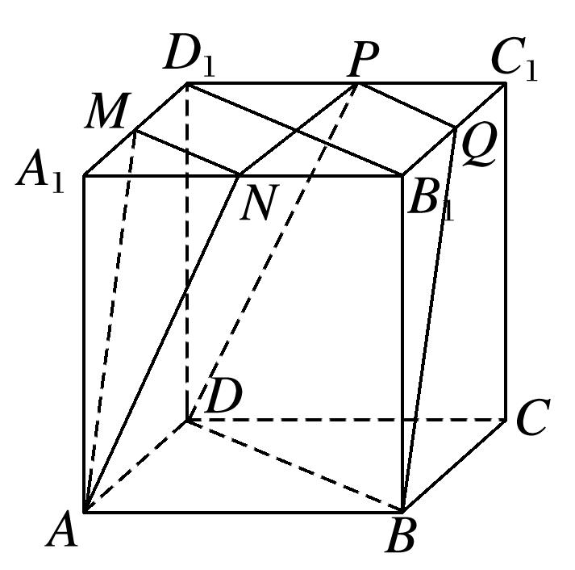

7．在三棱锥*S*－*ABC*中，△*ABC*是边长为6的正三角形，*SA*＝*SB*＝*SC*＝15，平面*DEFH*分别与*AB*，*BC*，

*SC*，*SA*交于点*D*，*E*，*F*，*H*．*D*，*E*分别是*AB*，*BC*的中点，如果直线*SB*∥平面*DEFH*，那么四边形*DEFH*的面积为\_\_\_\_\_\_\_\_．

7．答案　　解析　如图，取*AC*的中点*G*，连接*SG*，*BG*．易知*SG*⊥*AC*，*BG*⊥*AC*，*SG*∩*BG*＝*G*，*SG*，

*BG*⊂平面*SGB*，故*AC*⊥平面*SGB*，所以*AC*⊥*SB*．因为*SB*∥平面*DEFH*，*SB*⊂平面*SAB*，平面*SAB*∩平面*DEFH*＝*HD*，则*SB*∥*HD*．同理*SB*∥*FE*．又*D*，*E*分别为*AB*，*BC*的中点，则*H*，*F*也为*AS*，*SC*的中点，从而得*HFACDE*，所以四边形*DEFH*为平行四边形．又*AC*⊥*SB*，*SB*∥*HD*，*DE*∥*AC*，所以*DE*⊥*HD*，所以四边形*DEFH*为矩形，其面积*S*＝*HF*·*HD*＝·＝．

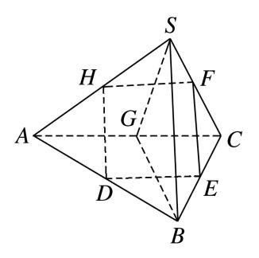

8．在四面体*ABCD*中，截面*PQMN*是正方形，则在下列结论中，错误的是(　　)

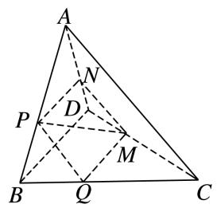

A．*AC*⊥*BD*　　　　　　　　 　　　
B．*AC*∥截面*PQMN*

C．*AC*＝*BD*　　　　　　   　　　　
D．异面直线*PM*与*BD*所成的角为45°

8．答案　C　解析　因为截面*PQMN*是正方形，所以*MN*∥*QP*，又*PQ*⊂平面*ABC*，*MN*⊄平面*ABC*，则

*MN*∥平面*ABC*，由线面平行的性质知*MN*∥*AC*，又*MN*⊂平面*PQMN*，*AC*⊄平面*PQMN*，则*AC*∥截面*PQMN*，同理可得*MQ*∥*BD*，又*MN*⊥*QM*，则*AC*⊥*BD*，故A，B正确．又因为*BD*∥*MQ*，所以异面直线*PM*与*BD*所成的角等于*PM*与*QM*所成的角，即为45°，故D正确．

9．如图，在正方体<em>ABCD</em>－<em>A</em>1<em>B</em>1<em>C</em>1<em>D</em>1中，<em>M</em>，<em>N</em>，<em>P</em>，<em>Q</em>分别是<em>AA</em>1，<em>A</em>1<em>D</em>1，<em>CC</em>1，<em>BC</em>的中点，给出以下

四个结论：①<em>A</em>1<em>C</em>⊥<em>MN</em>；②<em>A</em>1<em>C</em>∥平面<em>MNPQ</em>；③<em>A</em>1<em>C</em>与<em>PM</em>相交；④<em>NC</em>与<em>PM</em>异面．其中不正确的结论是(　　)

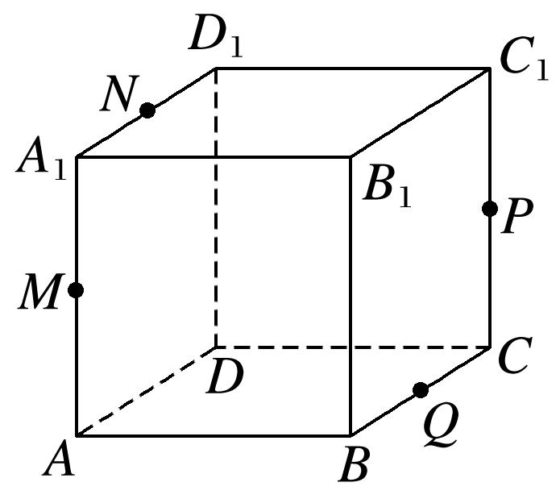

A．①　　　　　　　　
B．②　　　　　　　　
C．③　　　　　　　　
D．④

9．答案　B　解析　作出过<em>M</em>，<em>N</em>，<em>P</em>，<em>Q</em>四点的截面交<em>C</em>1<em>D</em>1于点<em>S</em>，交<em>AB</em>于点<em>R</em>，如图中的六边形

<em>MNSPQR</em>，显然点<em>A</em>1，<em>C</em>分别位于这个平面的两侧，故<em>A</em>1<em>C</em>与平面<em>MNPQ</em>一定相交，不可能平行，故结论②不正确．

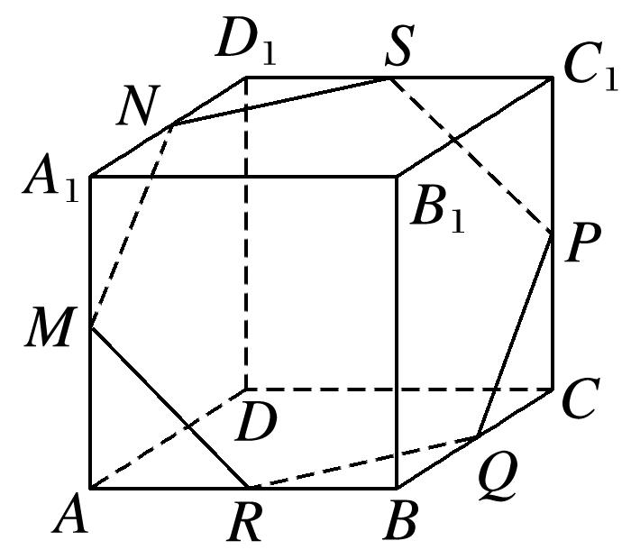

10．如图所示，正方体<em>ABCD－A</em>1<em>B</em>1<em>C</em>1<em>D</em>1的棱长为<em>a</em>，点<em>P</em>是棱<em>AD</em>上一点，且<em>AP</em>＝，过<em>B</em>1、<em>D</em>1，<em>P</em>的

平面交底面*ABCD*于*PQ*，*Q*在直线*CD*上，则*PQ*＝\_\_\_\_\_\_\_\_．

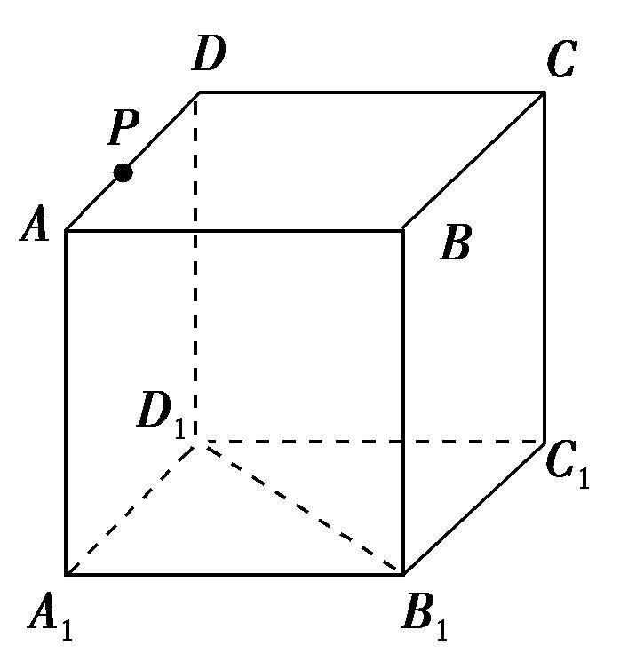

10．答案　<em>a</em>　解析　∵平面<em>A</em>1<em>B</em>1<em>C</em>1<em>D</em>1∥平面<em>ABCD</em>，而平面<em>B</em>1<em>D</em>1<em>P</em>∩平面<em>ABCD</em>＝<em>PQ</em>，平面<em>B</em>1<em>D</em>1<em>P</em>∩

平面<em>A</em>1<em>B</em>1<em>C</em>1<em>D</em>1＝<em>B</em>1<em>D</em>1，∴<em>B</em>1<em>D</em>1∥<em>PQ</em>．

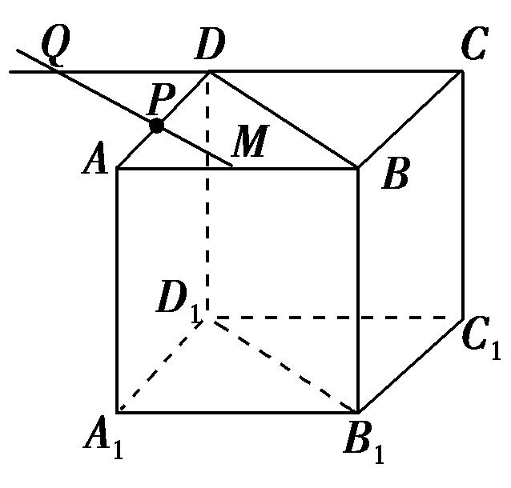
又∵<em>B</em>1<em>D</em>1∥<em>BD</em>，∴<em>BD</em>∥<em>PQ</em>，设<em>PQ</em>∩<em>AB</em>＝<em>M</em>，∵<em>AB</em>∥<em>CD</em>，∴△<em>APM</em>∽△<em>DPQ</em>．∴＝＝，即<em>PQ</em>＝2<em>PM</em>．又知△<em>APM</em>∽△<em>ADB</em>，∴＝＝，∴<em>PM</em>＝<em>BD</em>，又<em>BD</em>＝<em>a</em>，∴<em>PQ</em>＝<em>a</em>．

