# 专题06 立体几何中的面积与体积问题

# 考点一 几何体的面积问题

# 【方法总结】

# 求几何体的表面积的方法  
（1）求表面积问题的思路是将立体几何问题转化为平面图形问题，即空间图形平面化，这是解决立体几何的主要出发点.  
（2）求不规则几何体的表面积时，通常将所给几何体分割成柱、锥、台体，先求这些柱、锥、台体的表面积，再通过求和或作差求得所给几何体的表面积.

# 【例题选讲】

[例 1]（1）(2018·全国 I)已知圆柱的上、下底面的中心分别为 $O_{1}$ , $O_{2}$ , 过直线 $O_{1}O_{2}$ 的平面截该圆柱所得的截面是面积为 8 的正方形, 则该圆柱的表面积为( )

A. $12\sqrt{2}\pi$

B. $12\pi$

C. $8\sqrt{2}\pi$

D. $10\pi$  
（2）(2018·全国Ⅱ)已知圆锥的顶点为 S，母线 SA，SB 所成角的余弦值为 $\frac{7}{8}$ ，SA 与圆锥底面所成角为 $45^{\circ}$ ，若 $\triangle SAB$ 的面积为 $5\sqrt{15}$ ，则该圆锥的侧面积为 \_\_\_\_.

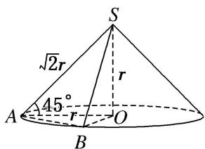  
（3）《九章算术》是我国古代内容极为丰富的数学名著，书中提到了一种名为“刍甍”的五面体，如图所示，四边形ABCD为矩形，棱 $EF \parallel AB$ .若此几何体中，AB=4，EF=2， $\triangle ADE$ 和 $\triangle BCF$ 都是边长为2的等边三角形，则该几何体的表面积为()

A. $8 \sqrt{3}$

B. $8 + 8\sqrt{3}$

C. $6\sqrt{2}+2\sqrt{3}$

D. $8 + 6\sqrt{2} + 2\sqrt{3}$

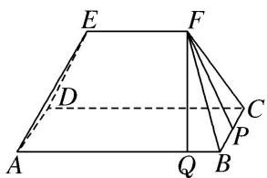  
（4）如图所示，在直角梯形 ABCD 中， $AD \perp DC$ ， $AD \parallel BC$ ，BC = 2CD = 2AD = 2，若将该直角梯形绕 BC 边旋转一周，则所得的几何体的表面积为 \_\_\_\_。

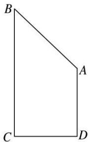

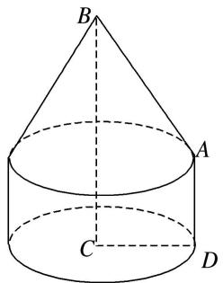  
（5）若圆锥的侧面展开图是半径为 $l$ 的半圆，则这个圆锥的表面积与侧面积的比值是（ ）

A. $\frac{3}{2}$

B. 2

C. $\frac{4}{3}$

D. $\frac{5}{3}$  
（6）把一个半径为 20 的半圆卷成圆锥的侧面，则这个圆锥的高为( )

A. 10

B. $10 \sqrt{3}$

C. $10\sqrt{2}$

D. $5\sqrt{3}$  
（7）在如图所示的斜截圆柱中, 已知圆柱底面的直径为 $40 \mathrm{~cm}$ , 母线长最短 $50 \mathrm{~cm}$ , 最长 $80 \mathrm{~cm}$ , 则斜截圆柱的侧面面积 $S =$ \_\_\_\_ $\mathrm{cm}^{2}$ .

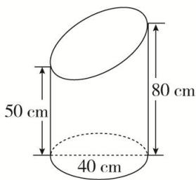  
（8）(2020·全国I)埃及胡夫金字塔是古代世界建筑奇迹之一，它的形状可视为一个正四棱锥，以该四棱锥的高为边长的正方形面积等于该四棱锥一个侧面三角形的面积，则其侧面三角形底边上的高与底面正方形的边长的比值为()

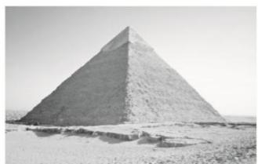

A. $\frac{\sqrt{5}-1}{4}$

B. $\frac{\sqrt{5} - 1}{2}$

C. $\frac{\sqrt{5}+1}{4}$

D. $\frac{\sqrt{5}+1}{2}$  
（9）已知三棱柱 $ABC - A_{1}B_{1}C_{1}$ 的侧棱垂直于底面，且底面边长与侧棱长都等于3．蚂蚁从 $A$ 点沿侧面经过棱 $BB_{1}$ 上的点 $N$ 和 $CC_{1}$ 上的点 $M$ 爬到点 $A_{1}$ ，如图所示，则蚂蚁爬过的路程最短为 \_\_\_\_.

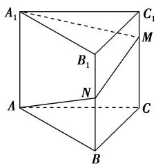

  
（10）已知圆锥的顶点为 S，母线 SA，SB 所成角的余弦值为 $\frac{7}{8}$ ，SA 与圆锥底面所成角为 $45^{\circ}$ 。若 $\triangle SAB$ 的面积为 $5\sqrt{15}$ ，则该圆锥的侧面积为 \_\_\_\_。

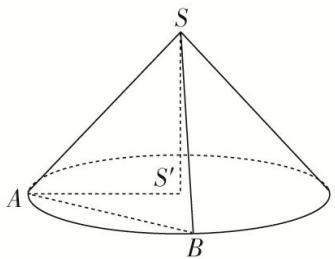

# 考点二 几何体的体积问题

# 【方法总结】

# 求空间几何体体积的常用方法  
（1）公式法：直接根据相关的体积公式计算.  
（2）等积法：根据体积计算公式，通过转换空间几何体的底面和高使得体积计算更容易，或是求出一些体积比等.  
（3）割补法：把不能直接计算体积的空间几何体进行适当分割或补形，转化为易计算体积的几何体.

# 【例题选讲】

[例 1] （1） 已知圆锥的底面半径为 2，高为 4．一个圆柱的下底面在圆锥的底面上，上底面的圆周在圆锥的侧面上，当圆柱侧面积为 $4\pi$ 时，该圆柱的体积为()

A. $\pi$

B. $2\pi$

C. $3\pi$

D. $4\pi$
> 

> 
> | 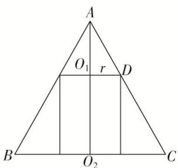 | 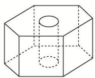 |
> | --- | --- |
> | （2）(2020·江苏)如图, 六角螺帽毛坯是由一个正六棱柱挖去一个圆柱所构成的. 已知螺帽的底面正六边形边长为 $2 \mathrm{~cm}$ , 高为 $2 \mathrm{~cm}$ , 内孔半径为 $0.5 \mathrm{~cm}$ , 则此六角螺帽毛坯的体积是 $\mathrm{cm}^{3}$ . | （3）如图，在直三棱柱 $ABC-A_{1}B_{1}C_{1}$ 中，AB=1，BC=2， $BB_{1}=3$ ， $\angle ABC=90^{\circ}$ ，点 D 为侧棱 $BB_{1}$ 上 |
> 

的动点．当 $AD+DC_{1}$ 最小时，三棱锥 $D-ABC_{1}$ 的体积为 \_\_\_\_.

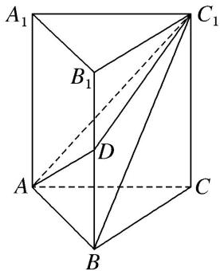  
（4）如图, 四棱锥 P—ABCD 的底面 ABCD 为平行四边形, NB=2PN, 则三棱锥 N—PAC 与三棱锥 D—PAC 的体积比为()

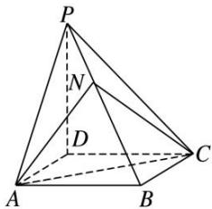

A. 1:2

B. 1:8

C. 1:6

D. 1:3  
（5）已知三棱锥 O—ABC 的顶点 A, B, C 都在半径为 2 的球面上，O 是球心， $\angle AOB=120^{\circ}$ ，当 $\triangle AOC$ 与 $\triangle BOC$ 的面积之和最大时，三棱锥 O—ABC 的体积为()

A. $\frac{\sqrt{3}}{2}$

B. $\frac{2\sqrt{3}}{3}$

C. $\frac{2}{3}$

D. $\frac{1}{3}$  
（6）(2018·全国Ⅰ)在长方体 $ABCD-A_{1}B_{1}C_{1}D_{1}$ 中，AB=BC=2， $AC_{1}$ 与平面 $BB_{1}C_{1}C$ 所成的角为 $30^{\circ}$ ，则该长方体的体积为()

A. 8

B. $6\sqrt{2}$

C. $8\sqrt{2}$

D. $8\sqrt{3}$
> 

> 
> | 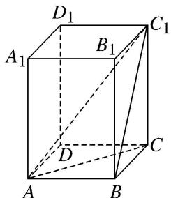 | 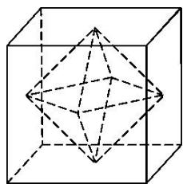 |
> | --- | --- |
> | （7）(2018·江苏)如图所示，正方体的棱长为 2，以其所有面的中心为顶点的多面体的体积为 \_\_\_\_. | （8）(2018·天津)如图, 已知正方体 $ABCD - A_{1}B_{1}C_{1}D_{1}$ 的棱长为 1 , 则四棱锥 $A_{1} - BB_{1}D_{1}D$ 的体积为 \_\_\_\_. |
> 

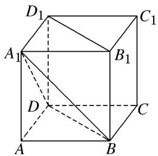

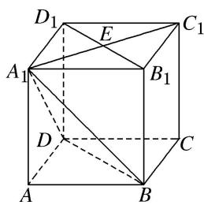

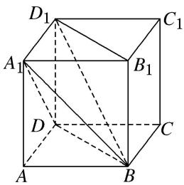  
（9）在梯形 $ABCD$ 中， $\angle ABC = \frac{\pi}{2}$ ， $AD // BC$ ， $BC = 2AD = 2AB = 2$ 。将梯形 $ABCD$ 绕 $AD$ 所在的直线旋转一周而形成的曲面所围成的几何体的体积为（）

A. $\frac{2\pi}{3}$

B. $\frac{4\pi}{3}$

C. $\frac{5\pi}{3}$

D. $2 \pi$

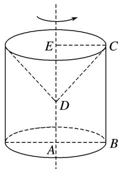  
（10）如图，在多面体 $ABCDEF$ 中，已知 $ABCD$ 是边长为 1 的正方形，且 $\triangle ADE$ ， $\triangle BCF$ 均为正三角形， $EF // AB$ ， $EF = 2$ ，则该多面体的体积为（）

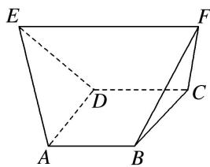

A. $\frac{\sqrt{2}}{3}$

B. $\frac{\sqrt{3}}{3}$

C. $\frac{4}{3}$

D. $\frac{3}{2}$

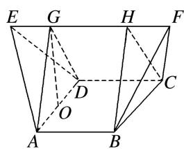

# 【对点训练】

1. 《九章算术》是我国古代第一部数学专著，它有如下问题：“今有圆堡璇(cōng)，周四丈八尺，高一丈一尺．问积几何？”意思是“今有圆柱体形的土筑小城堡，底面周长为4丈8尺，高1丈1尺．问它的体积

是多少？”(注：1 丈=10 尺，取 $\pi=3$ )( )

A. 704 立方尺

B. 2112 立方尺

C. 2115 立方尺

D. 2118 立方尺

2. 体积为 52 的圆台, 一个底面积是另一个底面积的 9 倍, 那么截得这个圆台的圆锥的体积是( )

A. 54

B. $54\pi$

C. 58

D. $58\pi$

3. 已知正方体 $ABCD - A_{1}B_{1}C_{1}D_{1}$ 的表面积为 24，若圆锥的底面圆周经过 $A, A_{1}, C_{1}, C$ 四个顶点，圆锥的顶点在棱 $BB_{1}$ 上，则该圆锥的体积为（）

A. $3\sqrt{2}\pi$

B. $\frac{\sqrt{2}\pi}{3}$

C. $\sqrt{2}\pi$

D. $\frac{\sqrt{2}\pi}{2}$

4. 如图，在棱长为 1 的正方体 $ABCD - A_{1}B_{1}C_{1}D_{1}$ 中， $M$ 为 $CD$ 的中点，则三棱锥 $A - BC_{1}M$ 的体积 $V_{A - BC_{1}M} = (\quad)$

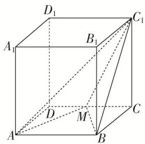

A. $\frac{1}{2}$

B. $\frac{1}{4}$

C. $\frac{1}{6}$

D. $\frac{1}{12}$

5. 已知正三棱柱 $ABC - A_{1}B_{1}C_{1}$ 的底面边长为 2，侧棱长为 $\sqrt{3}$ ， $D$ 为 $BC$ 的中点，则三棱锥 $A - B_{1}DC_{1}$ 的体积为（）

A. 3

B. $\frac{3}{2}$

C. 1

D. $\frac{\sqrt{3}}{2}$

6. 如图, 在正三棱柱 $ABC - A_{1}B_{1}C_{1}$ 中, 已知 $AB = AA_{1} = 3$ , 点 $P$ 在棱 $CC_{1}$ 上, 则三棱锥 $P - ABA_{1}$ 的体积为 \_\_\_\_.

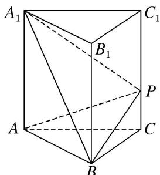

7. 在棱长为 3 的正方体 $ABCD - A_{1}B_{1}C_{1}D_{1}$ 中， $P$ 在线段 $BD_{1}$ 上，且 $\frac{BP}{PD_{1}} = \frac{1}{2}$ ， $M$ 为线段 $B_{1}C_{1}$ 上的动点，则三棱锥 $M - PBC$ 的体积为（）

A. 1

B. $\frac{3}{2}$

C. $\frac{9}{2}$

D. 与 $M$ 点的位置有关

8. 如图所示, 已知三棱柱 $ABC - A_{1}B_{1}C_{1}$ 的所有棱长均为 1 , 且 $AA_{1} \perp$ 底面 $ABC$ , 则三棱锥 $B_{1} - ABC_{1}$ 的体积为 ( )

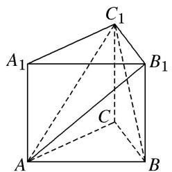

A. $\frac{\sqrt{3}}{12}$

B. $\frac{\sqrt{3}}{4}$

C. $\frac{\sqrt{6}}{12}$

D. $\frac{\sqrt{6}}{4}$

9. 如图, 已知正三棱柱 $ABC - A_{1}B_{1}C_{1}$ 的各棱长均为 2 , 点 $D$ 在棱 $AA_{1}$ 上, 则三棱锥 $D - BB_{1}C_{1}$ 的体积为 \_\_\_\_.

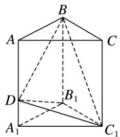

10. 如图所示，在正方体 $ABCD - A_1B_1C_1D_1$ 中，动点 $E$ 在 $BB_{1}$ 上，动点 $F$ 在 $A_{1}C_{1}$ 上， $O$ 为底面 $ABCD$ 的中心，若 $BE = x$ ， $A_{1}F = y$ ，则三棱锥 $O - AEF$ 的体积（）

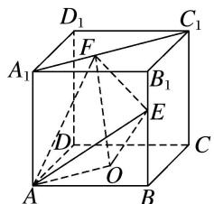

A. 与 $x, y$ 都有关

B. 与 $x, y$ 都无关

C. 与 $x$ 有关，与 $y$ 无关

D. 与 $y$ 有关，与 $x$ 无关

11. 如图, $\angle ACB = 90^{\circ}$ , $DA \perp$ 平面 $ABC$ , $AE \perp DB$ 交 $DB$ 于 $E$ , $AF \perp DC$ 交 $DC$ 于 $F$ , 且 $AD = AB = 2$ , 则三棱锥 $D - AEF$ 体积的最大值为 \_\_\_\_.

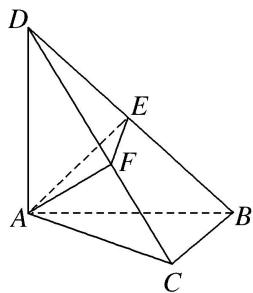

12. 在三棱锥 $P - ABC$ 中，平面 $PBC \perp$ 平面 $ABC$ ， $\angle ACB = 90^{\circ}$ ， $BC = PC = 2$ ，若 $AC = PB$ ，则三棱锥 $P - ABC$ 体积的最大值为（）

A. $\frac{4\sqrt{2}}{3}$

B. $\frac{16\sqrt{3}}{9}$

C. $\frac{16\sqrt{3}}{27}$

D. $\frac{32\sqrt{3}}{27}$

13. 如图, 在 $\triangle ABC$ 中, $AB=BC=2$ , $\angle ABC=120^{\circ}$ . 若平面 $ABC$ 外的点 $P$ 和线段 $AC$ 上的点 $D$ , 满足 $PD=DA$ , $PB=BA$ , 则四面体 $P-BCD$ 的体积的最大值是 \_\_\_\_.

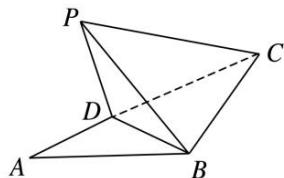

14. 如图，在正三棱柱 $ABC - A_{1}B_{1}C_{1}$ 中， $D$ 为棱 $AA_{1}$ 的中点．若 $AA_{1} = 4$ ， $AB = 2$ ，则四棱锥 $B - ACC_{1}D$ 的体积为 \_\_\_\_.

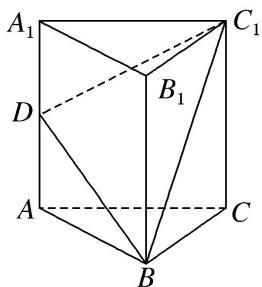

15. 已知正方体 $ABCD - A_1B_1C_1D_1$ 的棱长为 1，除面 $ABCD$ 外，该正方体其余各面的中心分别为点 $E, F, G, H, M$ （如图），则四棱锥 $M - EFGH$ 的体积为 \_\_\_\_.

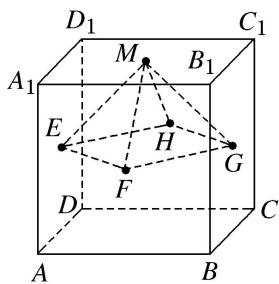

16. 如图是棱长为 2 的正方体的表面展开图, 则多面体 $ABCDE$ 的体积为( )

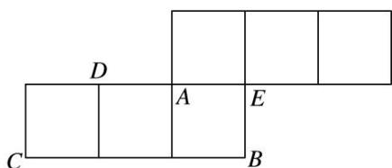

A. 2

B. $\frac{2}{3}$

C. $\frac{4}{3}$

D. $\frac{8}{3}$

17. 已知 $E$ , $F$ 分别是棱长为 $a$ 的正方体 $ABCD—A_{1}B_{1}C_{1}D_{1}$ 的棱 $AA_{1}$ , $CC_{1}$ 的中点, 则四棱锥 $C_{1}—B_{1}EDF$ 的体积为 \_\_\_\_.

18. 如图，在 Rt△ABC 中，AB=BC=1，D 和 E 分别是边 BC 和 AC 上异于端点的点，DE⊥BC，将△CDE 沿 DE 折起，使点 C 到点 P 的位置，得到四棱锥 P-ABDE，则四棱锥 P-ABDE 的体积的最大值为 \_\_\_\_.

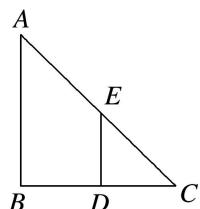

19. 如图，在四棱锥 $P - ABCD$ 中，底面 $ABCD$ 为菱形， $\angle BAD = 60^{\circ}$ ， $Q$ 为 $AD$ 的中点。若平面 $PAD \perp$ 平面 $ABCD$ ， $PA = PD = AD = 2$ ，点 $M$ 在线段 $PC$ 上，且 $PM = 2MC$ ，则四棱锥 $P - ABCD$ 与三棱锥 $P - QBM$ 的体积之比是 \_\_\_\_。

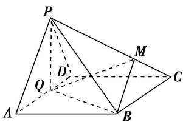

20. 如图, 用平行于母线的竖直平面截一个圆柱, 得到底面为弓形的圆柱体的一部分, 其中 $M$ , $N$ 为弧, 的中点, $\angle EMF = 120^{\circ}$ , 且 $\frac{\sqrt{3}}{3} EF + EG = 6$ , 当所得几何体的体积最大值时, 该几何体的高为 \_\_\_\_.

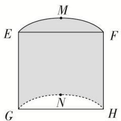

21. 如图, 在直角梯形 $ABCD$ 中, $AD = AB = 4$ , $BC = 2$ , 沿中位线 $EF$ 折起, 使得 $\angle AEB$ 为直角, 连接 $AB$ , $CD$ , 则所得的几何体的表面积为 \_\_\_\_, 体积为 \_\_\_\_.

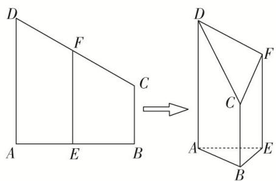

22. 已知 Rt△ABC，其三边长分别为 a, b, c (a > b > c). 分别以三角形的边 a, b, c 所在直线为轴，其余各边旋转一周形成的曲面围成三个几何体，其表面积和体积分别为 $S_{1}$ , $S_{2}$ , $S_{3}$ 和 $V_{1}$ , $V_{2}$ , $V_{3}$ . 则它们的关系为( )

A. $S_{1} > S_{2} > S_{3}, V_{1} > V_{2} > V_{3}$

B. $S_{1} <   S_{2} <   S_{3},\quad V_{1} <   V_{2} <   V_{3}$

C. $S_{1}>S_{2}>S_{3},\quad V_{1}=V_{2}=V_{3}$

D. $S_{1} <   S_{2} <   S_{3},V_{1} = V_{2} = V_{3}$

