专题06　立体几何中的面积与体积问题

考点一　几何体的面积问题

【方法总结】

求几何体的表面积的方法  
（1）求表面积问题的思路是将立体几何问题转化为平面图形问题，即空间图形平面化，这是解决立体几何的主要出发点．  
（2）求不规则几何体的表面积时，通常将所给几何体分割成柱、锥、台体，先求这些柱、锥、台体的表面积，再通过求和或作差求得所给几何体的表面积．

【例题选讲】

<strong>[例1]</strong>（1）(2018·全国Ⅰ)已知圆柱的上、下底面的中心分别为<em>O</em>1，<em>O</em>2，过直线<em>O</em>1<em>O</em>2的平面截该圆柱所得的截面是面积为8的正方形，则该圆柱的表面积为(　　)

A．12π　　　　　　　　
B．12π　　　　　　　　
C．8π　　　　　　　　
D．10π
答案　B　解析　设圆柱的轴截面的边长为<em>x</em>，则<em>x</em>2＝8，得<em>x</em>＝2，∴<em>S</em>圆柱表＝2<em>S</em>底＋<em>S</em>侧＝2×π×()2＋2π××2＝12π．故选B．  
（2）(2018·全国Ⅱ)已知圆锥的顶点为*S*，母线*SA*，*SB*所成角的余弦值为，*SA*与圆锥底面所成角为45°，若△*SAB*的面积为5，则该圆锥的侧面积为\_\_\_\_\_\_\_\_．
答案　40π　解析　如图，∵<em>SA</em>与底面成45°角，∴△<em>SAO</em>为等腰直角三角形．设<em>OA</em>＝<em>r</em>，则<em>SO</em>＝<em>r</em>，<em>SA</em>＝<em>SB</em>＝<em>r</em>．在△<em>SAB</em>中，cos ∠<em>ASB</em>＝，∴sin ∠<em>ASB</em>＝，∴<em>S</em>△<em>SAB</em>＝<em>SA</em>·<em>SB</em>·sin ∠<em>ASB</em>＝×(<em>r</em>)2×＝5，解得<em>r</em>＝2，∴<em>SA</em>＝<em>r</em>＝4，即母线长<em>l</em>＝4，∴<em>S</em>圆锥侧＝π<em>rl</em>＝π×2×4＝40π．

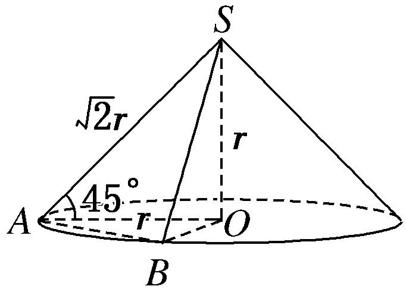  
（3）《九章算术》是我国古代内容极为丰富的数学名著，书中提到了一种名为“刍甍”的五面体，如图所示，四边形*ABCD*为矩形，棱*EF*∥*AB*.若此几何体中，*AB*＝4，*EF*＝2，△*ADE*和△*BCF*都是边长为2的等边三角形，则该几何体的表面积为(　　)

A．8　　　　　
B．8＋8　　　　　
C．6＋2　　　　　
D．8＋6＋2
答案　B　解析　如图所示，取<em>BC</em>的中点<em>P</em>，连接<em>PF</em>，则<em>PF</em>⊥<em>BC</em>，过<em>F</em>作<em>FQ</em>⊥<em>AB</em>，垂足为<em>Q</em>．因为△<em>ADE</em>和△<em>BCF</em>都是边长为2的等边三角形，且<em>EF</em>∥<em>AB</em>，所以四边形<em>ABFE</em>为等腰梯形，<em>FP</em>＝，则<em>BQ</em>＝(<em>AB</em>－<em>EF</em>)＝1，<em>FQ</em>＝＝，所以<em>S</em>梯形<em>EFBA</em>＝<em>S</em>梯形<em>EFCD</em>＝×(2＋4)×＝3，又<em>S</em>△<em>ADE</em>＝<em>S</em>△<em>BCF</em>＝×2×＝，<em>S</em>矩形<em>ABCD</em>＝4×2＝8，所以该几何体的表面积<em>S</em>＝3×2＋×2＋8＝8＋8．故选B．

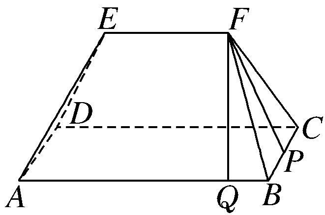  
（4）如图所示，在直角梯形*ABCD*中，*AD*⊥*DC*，*AD*∥*BC*，*BC*＝2*CD*＝2*AD*＝2，若将该直角梯形绕*BC*边旋转一周，则所得的几何体的表面积为\_\_\_\_\_\_．

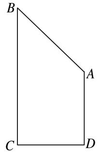
答案　(＋3)π　解析　根据题意可知，此旋转体的上半部分为圆锥(底面半径为1，高为1)，下半部分为圆柱(底面半径为1，高为1)，如图所示．则所得几何体的表面积为圆锥的侧面积、圆柱的侧面积以及圆柱的下底面积之和，即表面积为·2π·1·＋2π·12＋π·12＝(＋3)π．

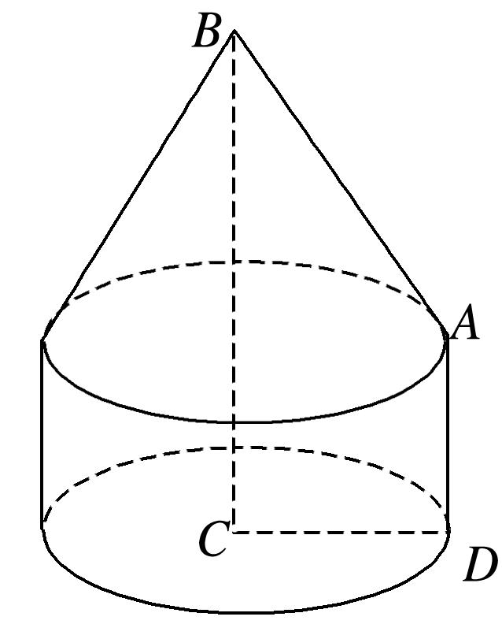  
（5）若圆锥的侧面展开图是半径为*l*的半圆，则这个圆锥的表面积与侧面积的比值是(　　)

A．　　　　　　　　
B．2　　　　　　　　
C．　　　　　　　　
D．
答案　A　解析　设该圆锥的底面半径为<em>r</em>，由题意可得其母线长为<em>l</em>，且2π<em>r</em>＝π<em>l</em>，所以<em>l</em>＝2<em>r</em>，所以这个圆锥的表面积与侧面积的比值是(π<em>rl</em>＋π<em>r</em>2)∶π<em>rl</em>＝3π<em>r</em>2∶2π<em>r</em>2＝3∶2，故选A．  
（6）把一个半径为20的半圆卷成圆锥的侧面，则这个圆锥的高为(　　)

A．10　　　　　　　　
B．10　　　　　　　　
C．10　　　　　　　　
D．5
答案　B　解析　设圆锥的底面半径为*r*，高为*h*．因为半圆的弧长等于圆锥的底面周长，半圆的半径等于圆锥的母线，所以2π*r*＝20π，所以*r*＝10，所以*h*＝＝10．  
（7）在如图所示的斜截圆柱中，已知圆柱底面的直径为40 cm，母线长最短50 cm，最长80 cm，则斜截圆柱的侧面面积<em>S</em>＝\_\_\_\_\_\_\_\_ cm2．

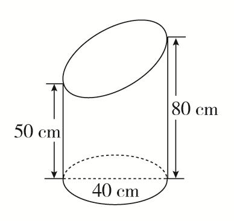
答案　2600π　解析　将题图所示的相同的两个几何体对接为圆柱，则圆柱的侧面展开图为矩形．由题意得所求侧面展开图的面积<em>S</em>＝×(50＋80)×(π×40)＝2600π(cm2)．  
（8）(2020·全国Ⅰ)埃及胡夫金字塔是古代世界建筑奇迹之一，它的形状可视为一个正四棱锥，以该四棱锥的高为边长的正方形面积等于该四棱锥一个侧面三角形的面积，则其侧面三角形底边上的高与底面正方形的边长的比值为(　　)

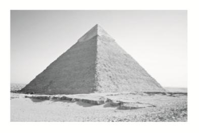

A．　　　　　　　　
B．　　　　　　　　
C．　　　　　　　　
D．
答案　C　解析　如图，设<em>CD</em>＝<em>a</em>，<em>PE</em>＝<em>b</em>，则<em>PO</em>＝＝，由题意，得<em>PO</em>2＝<em>ab</em>，即<em>b</em>2－＝<em>ab</em>，化简，得4－2·－1＝0，解得＝(负值舍去)．故选C．

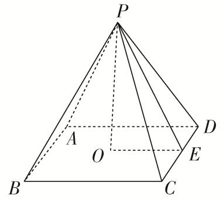  
（9）已知三棱柱<em>ABC－A</em>1<em>B</em>1<em>C</em>1的侧棱垂直于底面，且底面边长与侧棱长都等于3．蚂蚁从<em>A</em>点沿侧面经过棱<em>BB</em>1上的点<em>N</em>和<em>CC</em>1上的点<em>M</em>爬到点<em>A</em>1，如图所示，则蚂蚁爬过的路程最短为\_\_\_\_\_\_\_\_．

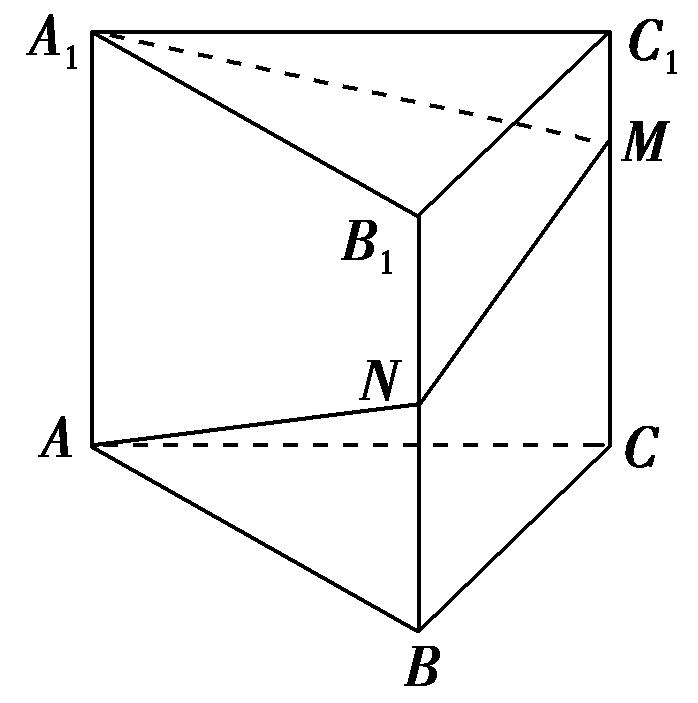
答案　3　解析　将三棱柱<em>ABCA</em>1<em>B</em>1<em>C</em>1的侧面展开如图所示，则有<em>A</em>′<em>A</em>′1＝3，<em>AA</em>′1＝＝3．所以蚂蚁爬过的路程最短为<em>AA</em>′1．

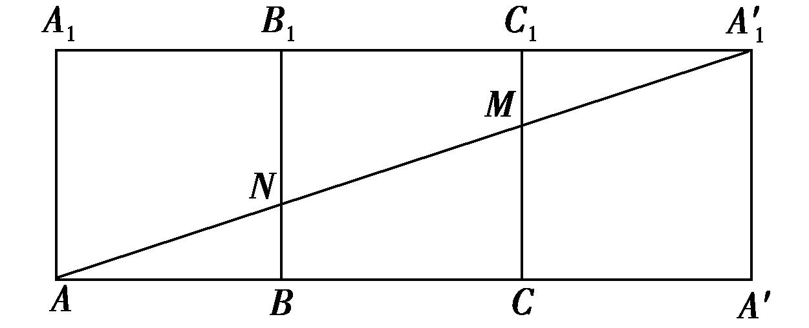  
（10）已知圆锥的顶点为*S*，母线*SA*，*SB*所成角的余弦值为，*SA*与圆锥底面所成角为45°．若△*SAB*的面积为5，则该圆锥的侧面积为\_\_\_\_\_\_\_\_．
答案　40π　解析　如图所示，设<em>S</em>在底面的射影为<em>S</em>′，连接<em>AS</em>′，<em>SS</em>′．△<em>SAB</em>的面积为·<em>SA</em>·<em>SB</em>·sin∠<em>ASB</em>＝·<em>SA</em>2·＝·<em>SA</em>2＝5，所以<em>SA</em>2＝80，<em>SA</em>＝4．因为<em>SA</em>与底面所成的角为45°，所以∠<em>SAS</em>′＝45°，<em>AS</em>′＝<em>SA</em>·cos 45°＝4×＝2．所以底面周长<em>l</em>＝2π·<em>AS</em>′＝4π，所以圆锥的侧面积为×4×4π＝40π．

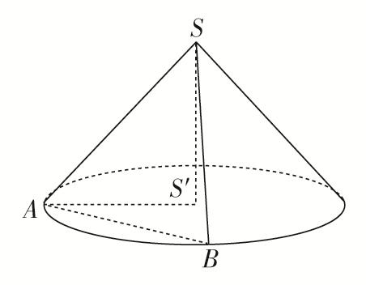

考点二　几何体的体积问题

【方法总结】

求空间几何体体积的常用方法  
（1）公式法：直接根据相关的体积公式计算．  
（2）等积法：根据体积计算公式，通过转换空间几何体的底面和高使得体积计算更容易，或是求出一些体积比等．  
（3）割补法：把不能直接计算体积的空间几何体进行适当分割或补形，转化为易计算体积的几何体．

【例题选讲】

[例1] （1）已知圆锥的底面半径为2，高为4．一个圆柱的下底面在圆锥的底面上，上底面的圆周在圆锥的侧面上，当圆柱侧面积为4π时，该圆柱的体积为(　　)

A．π　　　　　　　　
B．2π　　　　　　　　
C．3π　　　　　　　　
D．4π
答案　B　解析　圆锥的轴截面如图所示，设圆柱底面半径为<em>r</em>，其中0&lt;<em>r</em>&lt;2．由题意可知△<em>AO</em>1<em>D</em>∽△<em>AO</em>2<em>C</em>，则有＝＝2，所以<em>AO</em>1＝2<em>r</em>，则圆柱的高<em>h</em>＝4－2<em>r</em>，圆柱的侧面积<em>S</em>＝2π<em>r</em>(4－2<em>r</em>)＝4π(－<em>r</em>2＋2<em>r</em>)＝4π，整理得<em>r</em>2－2<em>r</em>＋1＝0，解得<em>r</em>＝1．当<em>r</em>＝1时，<em>h</em>＝2，所以该圆柱的体积<em>V</em>＝π<em>r</em>2<em>h</em>＝2π．故选B．

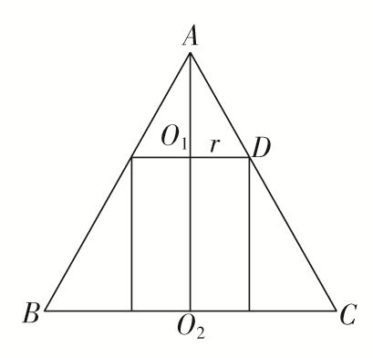  
（2）(2020·江苏)如图，六角螺帽毛坯是由一个正六棱柱挖去一个圆柱所构成的．已知螺帽的底面正六边形边长为2 cm，高为2 cm，内孔半径为0．5 cm，则此六角螺帽毛坯的体积是\_\_\_\_\_\_\_\_cm3．

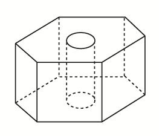
答案　12－　解析　正六棱柱的体积为6××22×2＝12 cm3，挖去的圆柱的体积为π×2＝cm3，故所求几何体的体积为 cm3．  
（3）如图，在直三棱柱<em>ABC－A</em>1<em>B</em>1<em>C</em>1中，<em>AB</em>＝1，<em>BC</em>＝2，<em>BB</em>1＝3，∠<em>ABC</em>＝90°，点<em>D</em>为侧棱<em>BB</em>1上的动点．当<em>AD</em>＋<em>DC</em>1最小时，三棱锥<em>D－ABC</em>1的体积为\_\_\_\_\_\_\_\_．

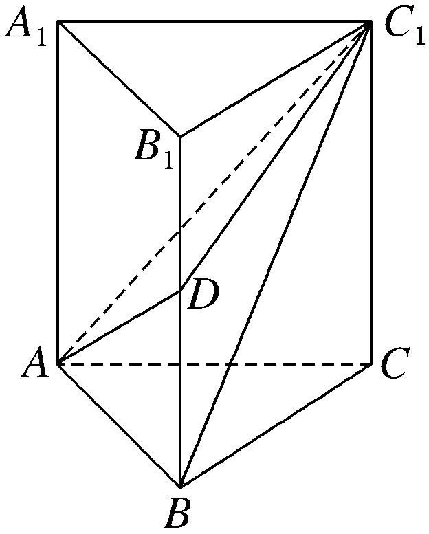
答案　　解析　将平面<em>AA</em>1<em>B</em>1<em>B</em>沿着<em>B</em>1<em>B</em>旋转到与平面<em>CC</em>1<em>B</em>1<em>B</em>在同一平面上(点<em>B</em>在线段<em>AC</em>上)，

连接<em>AC</em>1与<em>B</em>1<em>B</em>相交于点<em>D</em>，此时<em>AD</em>＋<em>DC</em>1最小，<em>BD</em>＝<em>CC</em>1＝1．因为在直三棱柱中，<em>BC</em>⊥<em>AB</em>，<em>BC</em>⊥<em>BB</em>1，且<em>BB</em>1∩<em>AB</em>＝<em>B</em>，所以<em>BC</em>⊥平面<em>AA</em>1<em>B</em>1<em>B</em>，又<em>CC</em>1∥平面<em>AA</em>1<em>B</em>1<em>B</em>，所以<em>V</em>三棱锥<em>DABC</em>1＝<em>V</em>三棱锥<em>C</em>1<em>ABD</em>＝<em>V</em>三棱锥<em>CABD</em>＝<em>S</em>△<em>ABD</em>·<em>BC</em>＝××1×1×2＝．  
（4）如图，四棱锥*P*—*ABCD*的底面*ABCD*为平行四边形，*NB*＝2*PN*，则三棱锥*N*—*PAC*与三棱锥*D*—*PAC*的体积比为(　　)

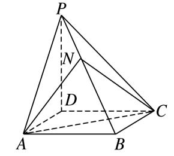

A．1∶2　　　　　　
B．1∶8　　　　　　
C．1∶6　　　　　　
D．1∶3
答案　D　解析　设点<em>P</em>，<em>N</em>在平面<em>ABCD</em>内的射影分别为点<em>P</em>′，<em>N</em>′，则<em>PP</em>′⊥平面<em>ABCD</em>，<em>NN</em>′⊥平面<em>ABCD</em>，所以<em>PP</em>′∥<em>NN</em>′．连接<em>BP</em>′，则在△<em>BPP</em>′中，由<em>BN</em>＝2<em>PN</em>，得＝．<em>V</em>三棱锥<em>N</em>—<em>PAC</em>＝<em>V</em>三棱锥<em>P</em>—<em>ABC</em>－<em>V</em>三棱锥<em>N</em>—<em>ABC</em>＝<em>S</em>△<em>ABC</em>·<em>PP</em>′－<em>S</em>△<em>ABC</em>·<em>NN</em>′＝<em>S</em>△<em>ABC</em>·(<em>PP</em>′－<em>NN</em>′)＝<em>S</em>△<em>ABC</em>·<em>PP</em>′＝<em>S</em>△<em>ABC</em>·<em>PP</em>′，<em>V</em>三棱锥<em>D</em>—<em>PAC</em>＝<em>V</em>三棱锥<em>P</em>—<em>ACD</em>＝<em>S</em>△<em>ACD</em>·<em>PP</em>′＝<em>S</em>△<em>ABC</em>·<em>PP</em>′．∴<em>V</em>三棱锥<em>N</em>—<em>PAC</em>∶<em>V</em>三棱锥<em>D</em>—<em>PAC</em>＝∶＝1∶3．  
（5）已知三棱锥*O*—*ABC*的顶点*A*，*B*，*C*都在半径为2的球面上，*O*是球心，∠*AOB*＝120°，当△*AOC*与△*BOC*的面积之和最大时，三棱锥*O*—*ABC*的体积为(　　)

A．　　　　　　　　
B．　　　　　　　　
C．　　　　　　　　
D．
答案　B　解析　设球<em>O</em>的半径为<em>R</em>，因为<em>S</em>△<em>AOC</em>＋<em>S</em>△<em>BOC</em>＝<em>R</em>2(sin∠<em>AOC</em>＋sin∠<em>BOC</em>)，所以当∠<em>AOC</em>＝∠<em>BOC</em>＝90°时，<em>S</em>△<em>AOC</em>＋<em>S</em>△<em>BOC</em>取得最大值，此时<em>OA</em>⊥<em>OC</em>．<em>OB</em>⊥<em>OC</em>，<em>OB</em>∩<em>OA</em>＝<em>O</em>，<em>OA</em>，<em>OB</em>⊂平面<em>AOB</em>，所以<em>OC</em>⊥平面<em>AOB</em>，所以<em>V</em>三棱锥<em>O</em>—<em>ABC</em>＝<em>V</em>三棱锥<em>C</em>—<em>OAB</em>＝<em>OC</em>·<em>OA</em>·<em>OB</em>sin∠<em>AOB</em>＝<em>R</em>3sin∠<em>AOB</em>＝，故选B．  
（6）(2018·全国Ⅰ)在长方体<em>ABCD－A</em>1<em>B</em>1<em>C</em>1<em>D</em>1中，<em>AB</em>＝<em>BC</em>＝2，<em>AC</em>1与平面<em>BB</em>1<em>C</em>1<em>C</em>所成的角为30°，则该长方体的体积为(　　)

A．8　　　　　　　　
B．6　　　　　　　　
C．8　　　　　　　　
D．8
答案　C　解析　如图，连接<em>AC</em>1，<em>BC</em>1，<em>AC</em>．∵<em>AB</em>⊥平面<em>BB</em>1<em>C</em>1<em>C</em>，∴∠<em>AC</em>1<em>B</em>为直线<em>AC</em>1与平面<em>BB</em>1<em>C</em>1<em>C</em>所成的角，∴∠<em>AC</em>1<em>B</em>＝30°．又<em>AB</em>＝<em>BC</em>＝2，在Rt△<em>ABC</em>1中，<em>AC</em>1＝＝4．在Rt△<em>ACC</em>1中，<em>CC</em>1＝＝＝2，∴<em>V</em>长方体＝<em>AB</em>×<em>BC</em>×<em>CC</em>1＝2×2×2＝8．

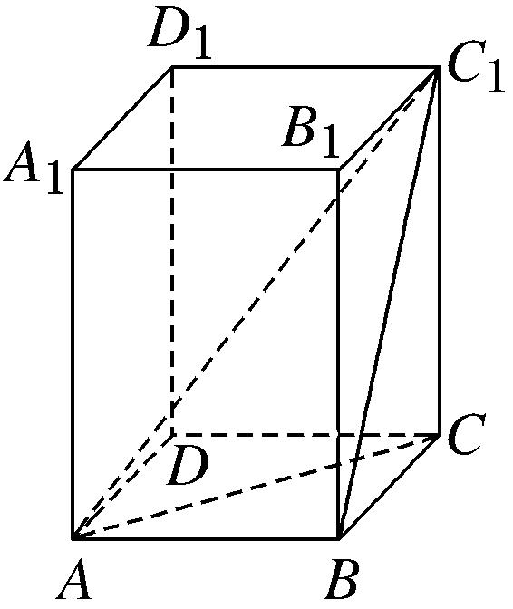  
（7）(2018·江苏)如图所示，正方体的棱长为2，以其所有面的中心为顶点的多面体的体积为\_\_\_\_\_\_\_\_．

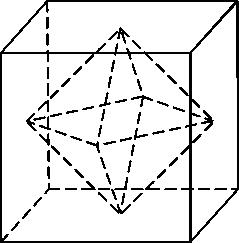
答案　　解析　由题意知所给的几何体是棱长均为的八面体，它是由两个有公共底面的正四棱锥组合而成的，正四棱锥的高为1，所以这个八面体的体积为2<em>V</em>正四棱锥＝2××()2×1＝．  
（8）(2018·天津)如图，已知正方体<em>ABCD－A</em>1<em>B</em>1<em>C</em>1<em>D</em>1的棱长为1，则四棱锥<em>A</em>1－<em>BB</em>1<em>D</em>1<em>D</em>的体积为\_\_\_\_\_\_\_\_．

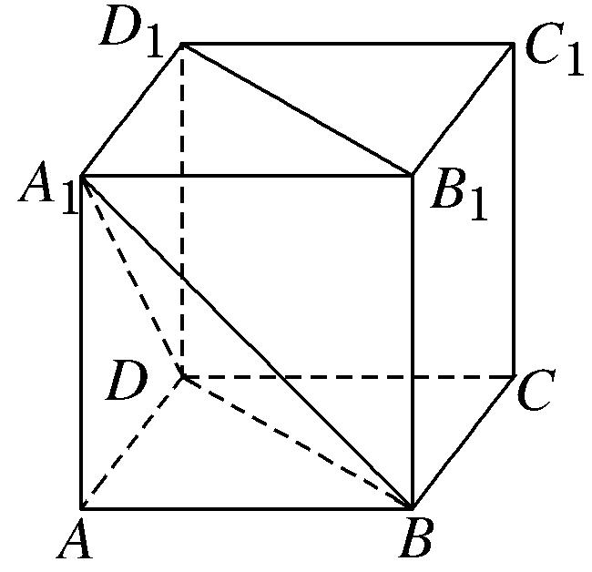
答案　　解析　法一：直接法　连接<em>A</em>1<em>C</em>1交<em>B</em>1<em>D</em>1于点<em>E</em>，则<em>A</em>1<em>E</em>⊥<em>B</em>1<em>D</em>1，<em>A</em>1<em>E</em>⊥<em>BB</em>1，则<em>A</em>1<em>E</em>⊥平面<em>BB</em>1<em>D</em>1<em>D</em>，所以<em>A</em>1<em>E</em>为四棱锥<em>A</em>1－<em>BB</em>1<em>D</em>1<em>D</em>的高，且<em>A</em>1<em>E</em>＝，矩形<em>BB</em>1<em>D</em>1<em>D</em>的长和宽分别为，1，故<em>VA</em>1－<em>BB</em>1<em>D</em>1<em>D</em>＝×(1×)×＝．

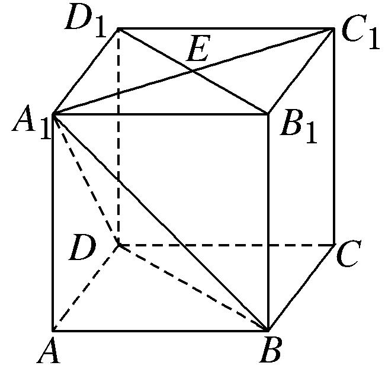

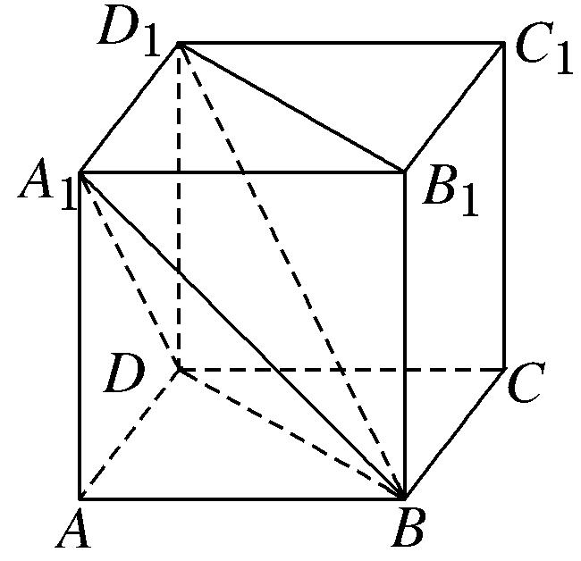

法二：割补法　连接<em>BD</em>1，则四棱锥<em>A</em>1－<em>BB</em>1<em>D</em>1<em>D</em>分成两个三棱锥<em>B－A</em>1<em>DD</em>1与<em>BA</em>1<em>B</em>1<em>D</em>1，所以<em>VA</em>1<em>BB</em>1<em>D</em>1<em>D</em>＝<em>VBA</em>1<em>DD</em>1＋<em>VBA</em>1<em>B</em>1<em>D</em>1＝××1×1×1＋××1×1×1＝．  
（9）在梯形*ABCD*中，∠*ABC*＝，*AD*∥*BC*，*BC*＝2*AD*＝2*AB*＝2．将梯形*ABCD*绕*AD*所在的直线旋转一周而形成的曲面所围成的几何体的体积为(　　)

A．　　　　　　　　
B．　　　　　　　　
C．　　　　　　　　
D．2π
答案　C　解析　如图，过点<em>C</em>作<em>CE</em>垂直<em>AD</em>所在直线于点<em>E</em>，梯形<em>ABCD</em>绕<em>AD</em>所在直线旋转一周而形成的旋转体是由以线段<em>AB</em>的长为底面圆半径，线段<em>BC</em>为母线的圆柱挖去以线段<em>CE</em>的长为底面圆半径，<em>ED</em>为高的圆锥，该几何体的体积为<em>V</em>＝<em>V</em>圆柱－<em>V</em>圆锥＝π·<em>AB</em>2·<em>BC</em>－·π·<em>CE</em>2·<em>DE</em>＝π×12×2－π×12×1＝．

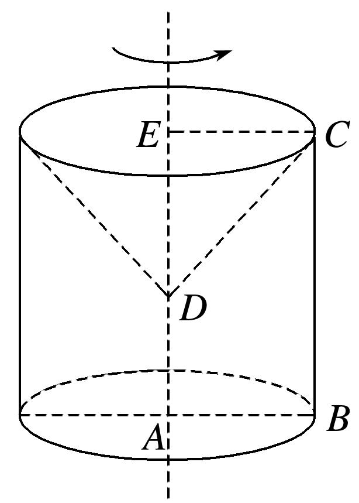  
（10）如图，在多面体*ABCDEF*中，已知*ABCD*是边长为1的正方形，且△*ADE*，△*BCF*均为正三角形，*EF*∥*AB*，*EF*＝2，则该多面体的体积为(　　)

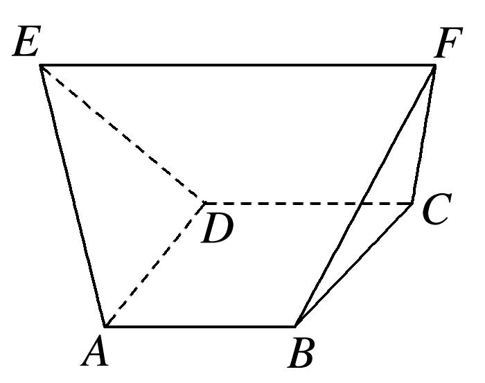

A．　　　　　　　　
B．　　　　　　　　
C．　　　　　　　　
D．
答案　A　解析　如图，分别过点<em>A</em>，<em>B</em>作<em>EF</em>的垂线，垂足分别为<em>G</em>，<em>H</em>，连接<em>DG</em>，<em>CH</em>，容易求得<em>EG</em>＝<em>HF</em>＝，<em>AG</em>＝<em>GD</em>＝<em>BH</em>＝<em>HC</em>＝，取<em>AD</em>的中点<em>O</em>，连接<em>GO</em>，易得<em>GO</em>＝，∴<em>S</em>△<em>AGD</em>＝<em>S</em>△<em>BHC</em>＝××1＝，∴多面体的体积<em>V</em>＝<em>V</em>三棱锥<em>E</em>－<em>ADG</em>＋<em>V</em>三棱锥<em>F</em>－<em>BCH</em>＋<em>V</em>三棱柱<em>AGD</em>－<em>BHC</em>＝2<em>V</em>三棱锥<em>E</em>－<em>ADG</em>＋<em>V</em>三棱柱<em>AGD</em>－<em>BHC</em>＝×××2＋×1＝．故选A．

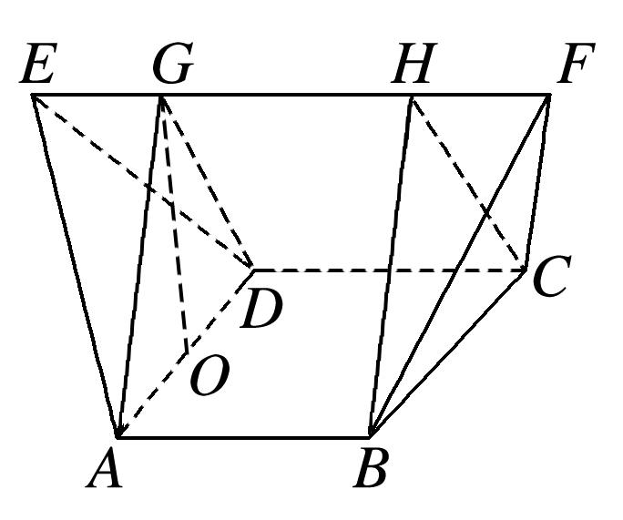

【对点训练】

1．《九章算术》是我国古代第一部数学专著，它有如下问题：“今有圆堡瑽(cōnɡ)，周四丈八尺，高一丈一

尺．问积几何？”意思是“今有圆柱体形的土筑小城堡，底面周长为4丈8尺，高1丈1尺．问它的体积是多少？”(注：1丈＝10尺，取π＝3)(　　)

A．704立方尺　　　　
B．2112立方尺　　　　
C．2115立方尺　　　　
D．2118立方尺

1．答案　B　解析　设圆柱体底面半径为<em>r</em>，高为<em>h</em>，周长为<em>C</em>．因为<em>C</em>＝2π<em>r</em>，所以<em>r</em>＝，因此<em>V</em>＝π<em>r</em>2<em>h</em>

＝π·*h*＝＝＝2112(立方尺)．

2．体积为52的圆台，一个底面积是另一个底面积的9倍，那么截得这个圆台的圆锥的体积是(　　)

A．54　　　　　　　　
B．54π　　　　　　　　
C．58 　　　　　　　　
D．58π

2．答案　A　解析　设上底面半径为<em>r</em>，则由题意求得下底面半径为3<em>r</em>，设圆台高为<em>h</em>1，则52＝π<em>h</em>1(<em>r</em>2

＋9<em>r</em>2＋3<em>r</em>·<em>r</em>)，∴π<em>r</em>2<em>h</em>1＝12．令原圆锥的高为<em>h</em>，由相似知识得＝，∴<em>h</em>＝<em>h</em>1，∴<em>V</em>原圆锥＝π(3<em>r</em>)2×<em>h</em>＝3π<em>r</em>2×<em>h</em>1＝×12＝54．

3．已知正方体<em>ABCD</em>－<em>A</em>1<em>B</em>1<em>C</em>1<em>D</em>1的表面积为24，若圆锥的底面圆周经过<em>A</em>，<em>A</em>1，<em>C</em>1，<em>C</em>四个顶点，圆锥

的顶点在棱<em>BB</em>1上，则该圆锥的体积为(　　)

A．3π　　　　　　　　
B．　　　　　　　　
C．π　　　　　　　　
D．

3．答案　C　解析　∵正方体<em>ABCD</em>－<em>A</em>1<em>B</em>1<em>C</em>1<em>D</em>1的表面积为24，∴正方体<em>ABCD</em>－<em>A</em>1<em>B</em>1<em>C</em>1<em>D</em>1的棱长为2，
∵圆锥的底面圆周经过<em>A</em>，<em>A</em>1，<em>C</em>1，<em>C</em>四个顶点，∴圆锥的底面圆半径<em>R</em>＝＝，∵圆锥的顶点在棱<em>BB</em>1上，∴圆锥的高<em>h</em>＝＝，∴该圆锥的体积为<em>V</em>＝<em>Sh</em>＝×π×()2×＝π．故选C．

4．如图，在棱长为1的正方体<em>ABCD</em>－<em>A</em>1<em>B</em>1<em>C</em>1<em>D</em>1中，<em>M</em>为<em>CD</em>的中点，则三棱锥<em>A</em>－<em>BC</em>1<em>M</em>的体积<em>VA</em>－<em>BC</em>1<em>M</em>

＝(　　)

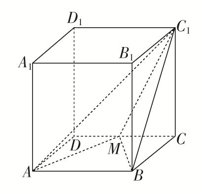

A．　　　　　　　　
B．　　　　　　　　
C．　　　　　　　　
D．

4．答案　C　解析　<em>VA</em>－<em>BC</em>1<em>M</em>＝<em>VC</em>1－<em>ABM</em>＝<em>S</em>△<em>ABM</em>·<em>C</em>1<em>C</em>＝×<em>AB</em>×<em>AD</em>×<em>C</em>1<em>C</em>＝．故选C．

5．已知正三棱柱<em>ABC</em>－<em>A</em>1<em>B</em>1<em>C</em>1的底面边长为2，侧棱长为，<em>D</em>为<em>BC</em>的中点，则三棱锥<em>A</em>－<em>B</em>1<em>DC</em>1

的体积为(　　)

A．3　　　　　　　　
B．　　　　　　　　
C．1　　　　　　　　
D．

5．答案　C　解析　∵<em>D</em>是等边三角形<em>ABC</em>的边<em>BC</em>的中点，∴<em>AD</em>⊥<em>BC</em>．又<em>ABC</em>－<em>A</em>1<em>B</em>1<em>C</em>1为正三棱柱，

∴<em>AD</em>⊥平面<em>BB</em>1<em>C</em>1<em>C</em>．∵四边形<em>BB</em>1<em>C</em>1<em>C</em>为矩形，∴＝×2×＝．又<em>AD</em>＝2×＝，∴＝××＝1．故选C．

6．如图，在正三棱柱<em>ABC－A</em>1<em>B</em>1<em>C</em>1中，已知<em>AB</em>＝<em>AA</em>1＝3，点<em>P</em>在棱<em>CC</em>1上，则三棱锥<em>P－ABA</em>1的体积

为\_\_\_\_\_\_\_．

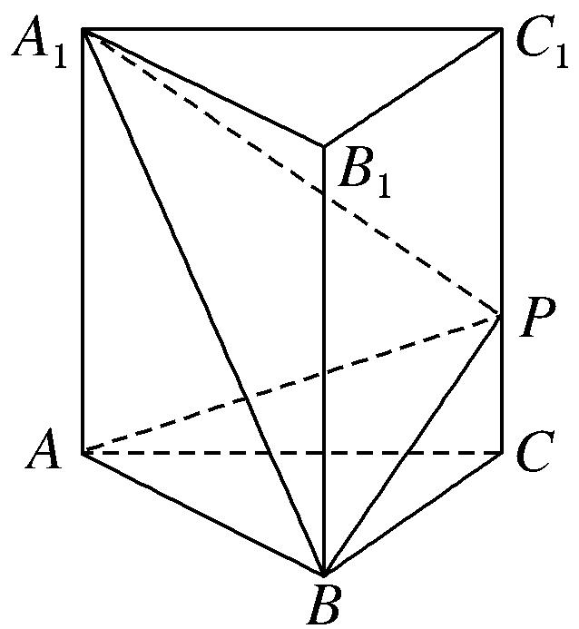

6．答案　　解析　由题意，得<em>V</em>三棱锥<em>PABA</em>1＝<em>V</em>三棱锥<em>CABA</em>1＝<em>V</em>三棱锥<em>A</em>1<em>ABC</em>＝<em>S</em>△<em>ABC</em>·<em>AA</em>1＝××32×3

＝．

7．在棱长为3的正方体<em>ABCD－A</em>1<em>B</em>1<em>C</em>1<em>D</em>1中，<em>P</em>在线段<em>BD</em>1上，且＝，<em>M</em>为线段<em>B</em>1<em>C</em>1上的动点，
则三棱锥*M*－*PBC*的体积为(　　)

A．1　　　　　　　
B．　　　　　　　
C．　　　　　　　
D．与*M*点的位置有关

7．答案　B　解析　∵＝，∴点<em>P</em>到平面<em>BCC</em>1<em>B</em>1的距离是<em>D</em>1到平面<em>BCC</em>1<em>B</em>1距离的，即为＝

1．<em>M</em>为线段<em>B</em>1<em>C</em>1上的点，∴<em>S</em>△<em>MBC</em>＝×3×3＝，∴<em>VMPBC</em>＝<em>VPMBC</em>＝××1＝．

8．如图所示，已知三棱柱<em>ABC</em>－<em>A</em>1<em>B</em>1<em>C</em>1的所有棱长均为1，且<em>AA</em>1⊥底面<em>ABC</em>，则三棱锥<em>B</em>1－<em>ABC</em>1的

体积为(　　)

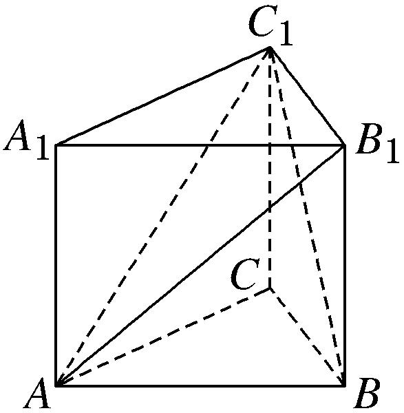

A．　　　　　　　　
B．　　　　　　　　
C．　　　　　　　　
D．

8．答案　A　解析　三棱锥<em>B</em>1－<em>ABC</em>1的体积等于三棱锥<em>A</em>－<em>B</em>1<em>BC</em>1的体积，三棱锥<em>A</em>－<em>B</em>1<em>BC</em>1的高为，

底面积为，故其体积为××＝．

9．如图，已知正三棱柱<em>ABC</em>－<em>A</em>1<em>B</em>1<em>C</em>1的各棱长均为2，点<em>D</em>在棱<em>AA</em>1上，则三棱锥<em>D</em>－<em>BB</em>1<em>C</em>1的体积为

\_\_\_\_\_\_\_\_．

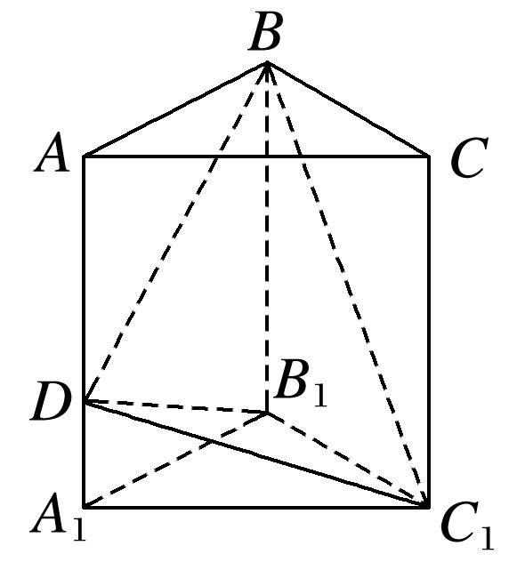

9．答案　　解析　如图，取*BC*的中点*O*，

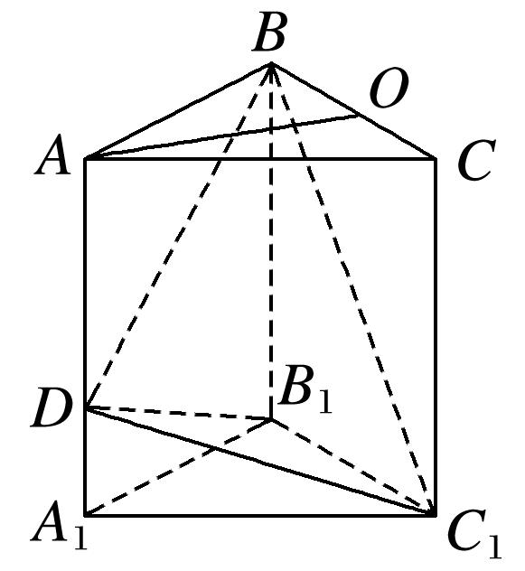

连接<em>AO</em>．∵正三棱柱<em>ABC</em>－<em>A</em>1<em>B</em>1<em>C</em>1的各棱长均为2，∴<em>AC</em>＝2，<em>OC</em>＝1，则<em>AO</em>＝．∵<em>AA</em>1∥平面<em>BCC</em>1<em>B</em>1，∴点<em>D</em>到平面<em>BCC</em>1<em>B</em>1的距离为．又＝×2×2＝2，∴＝×2×＝．

10．如图所示，在正方体<em>ABCD</em>－<em>A</em>1<em>B</em>1<em>C</em>1<em>D</em>1中，动点<em>E</em>在<em>BB</em>1上，动点<em>F</em>在<em>A</em>1<em>C</em>1上，<em>O</em>为底面<em>ABCD</em>的

中心，若<em>BE</em>＝<em>x</em>，<em>A</em>1<em>F</em>＝<em>y</em>，则三棱锥<em>O</em>－<em>AEF</em>的体积(　　)

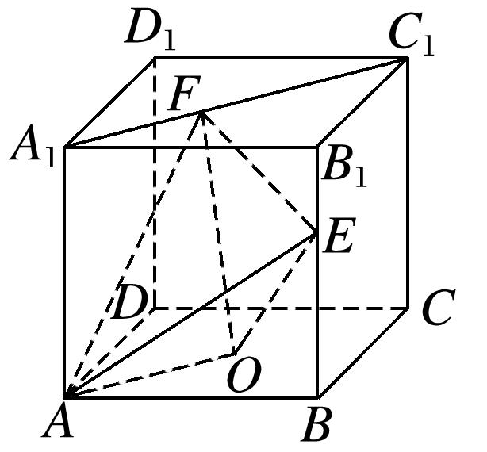

A．与*x*，*y*都有关　　
B．与*x*，*y*都无关　　
C．与*x*有关，与*y*无关　　
D．与*y*有关，与*x*无关

10．答案　B　解析　由已知得<em>V</em>三棱锥<em>O</em>－<em>AEF</em>＝<em>V</em>三棱锥<em>E</em>－<em>OAF</em>＝<em>S</em>△<em>AOF</em>·<em>h</em>(<em>h</em>为点<em>E</em>到平面<em>AOF</em>的距离)．连接

<em>OC</em>，因为<em>BB</em>1∥平面<em>ACC</em>1<em>A</em>1，所以点<em>E</em>到平面<em>AOF</em>的距离为定值．又<em>AO</em>∥<em>A</em>1<em>C</em>1，<em>OA</em>为定值，点<em>F</em>到直线<em>AO</em>的距离也为定值，所以△<em>AOF</em>的面积是定值，所以三棱锥<em>O</em>－<em>AEF</em>的体积与<em>x</em>，<em>y</em>都无关．

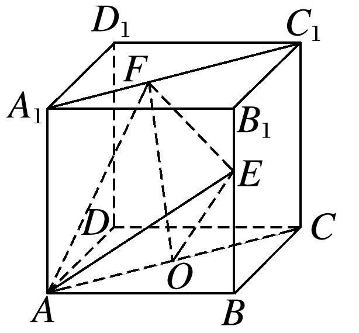

11．如图，∠*ACB*＝90°，*DA*⊥平面*ABC*，*AE*⊥*DB*交*DB*于*E*，*AF*⊥*DC*交*DC*于*F*，且*AD*＝*AB*＝2，则

三棱锥*D*－*AEF*体积的最大值为\_\_\_\_\_\_\_\_．

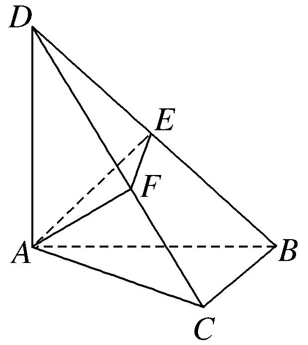

11．答案　　解析　因为*DA*⊥平面*ABC*，所以*DA*⊥*BC*，又*BC*⊥*AC*，*DA*∩*AC*＝*A*，所以*BC*⊥平面

<em>ADC</em>，所以<em>BC</em>⊥<em>AF</em>．又<em>AF</em>⊥<em>CD</em>，<em>BC</em>∩<em>CD</em>＝<em>C</em>，所以<em>AF</em>⊥平面<em>DCB</em>，所以<em>AF</em>⊥<em>EF</em>，<em>AF</em>⊥<em>DB</em>．又<em>DB</em>⊥<em>AE</em>，<em>AE</em>∩<em>AF</em>＝<em>A</em>，所以<em>DB</em>⊥平面<em>AEF</em>，所以<em>DE</em>为三棱锥<em>D－AEF</em>的高．因为<em>AE</em>为等腰直角三角形<em>ABD</em>斜边上的高，所以<em>AE</em>＝，设<em>AF</em>＝<em>a</em>，<em>FE</em>＝<em>b</em>，则△<em>AEF</em>的面积<em>S</em>＝<em>ab</em>≤×＝×＝(当且仅当<em>a</em>＝<em>b</em>＝1时等号成立)，所以(<em>VDAEF</em>)max＝××＝．

12．在三棱锥*P*－*ABC*中，平面*PBC*⊥平面*ABC*，∠*ACB*＝90°，*BC*＝*PC*＝2，若*AC*＝*PB*，则三棱锥*P*

－*ABC*体积的最大值为(　　)

A．　　　　　　　　
B．　　　　　　　　
C．　　　　　　　　
D．

12．答案　D　解析　如图，取*PB*中点*M*，连接*CM*，∵平面*PBC*⊥平面*ABC*，平面*PBC*∩平面*ABC*＝

<em>BC</em>，<em>AC</em>⊂平面<em>ABC</em>，<em>AC</em>⊥<em>BC</em>，∴<em>AC</em>⊥平面<em>PBC</em>，设点<em>A</em>到平面<em>PBC</em>的距离为<em>h</em>＝<em>AC</em>＝2<em>x</em>，∵<em>PC</em>＝<em>BC</em>＝2，<em>PB</em>＝2<em>x</em>(0＜<em>x</em>＜2)，<em>M</em>为<em>PB</em>的中点，∴<em>CM</em>⊥<em>PB</em>，<em>CM</em>＝，解得<em>S</em>△<em>PBC</em>＝×2<em>x</em>×＝<em>x</em>，<em>VA</em>－<em>PBC</em>＝×(<em>x</em>)×2<em>x</em>＝，设<em>t</em>＝(0＜<em>t</em>＜2)，则<em>x</em>2＝4－<em>t</em>2，∴<em>VA</em>－<em>PBC</em>＝＝(0＜<em>t</em>＜2)，关于<em>t</em>求导，得<em>V</em>′(<em>t</em>)＝，令<em>V</em>′(<em>t</em>)＝0，解得<em>t</em>＝或<em>t</em>＝－(舍去)，当0&lt;<em>t</em>&lt;时，<em>V</em>′(<em>t</em>)&gt;0，<em>V</em>(<em>t</em>)单调递增，当&lt;<em>t</em>&lt;2时，<em>V</em>′(<em>t</em>)&lt;0，<em>V</em>(<em>t</em>)单调递减．所以当<em>t</em>＝时，(<em>VA</em>－<em>PBC</em>)max＝．故选D．

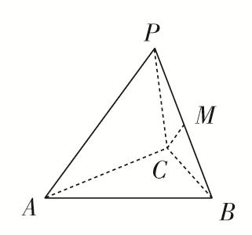

13．如图，在△*ABC*中，*AB*＝*BC*＝2，∠*ABC*＝120°．若平面*ABC*外的点*P*和线段*AC*上的点*D*，满足*PD*

＝*DA*，*PB*＝*BA*，则四面体*P*—*BCD*的体积的最大值是\_\_\_\_\_\_\_\_．

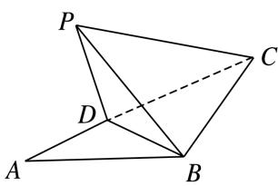

13．答案　　解析　设*PD*＝*DA*＝*x*，在△*ABC*中，*AB*＝*BC*＝2，∠*ABC*＝120°，∴*AC*＝

＝＝2，∴<em>CD</em>＝2－<em>x</em>，且∠<em>ACB</em>＝(180°－120°)＝30°，∴<em>S</em>△<em>BCD</em>＝<em>BC</em>·<em>DC</em>·sin∠<em>ACB</em>＝×2×(2－<em>x</em>)×＝(2－<em>x</em>)．要使四面体体积最大，当且仅当点<em>P</em>到平面<em>BCD</em>的距离最大，而<em>P</em>到平面<em>BCD</em>的最大距离为<em>x</em>．则<em>V</em>四面体<em>P</em>—<em>BCD</em>＝×(2－<em>x</em>)<em>x</em>＝[－(<em>x</em>－)2＋3]，由于0＜<em>x</em>＜2，故当<em>x</em>＝时，<em>V</em>四面体<em>P</em>—<em>BCD</em>取最大值为×3＝．

14．如图，在正三棱柱<em>ABC－A</em>1<em>B</em>1<em>C</em>1中，<em>D</em>为棱<em>AA</em>1的中点．若<em>AA</em>1＝4，<em>AB</em>＝2，则四棱锥<em>B</em>－<em>ACC</em>1<em>D</em>的

体积为\_\_\_\_\_\_\_\_．

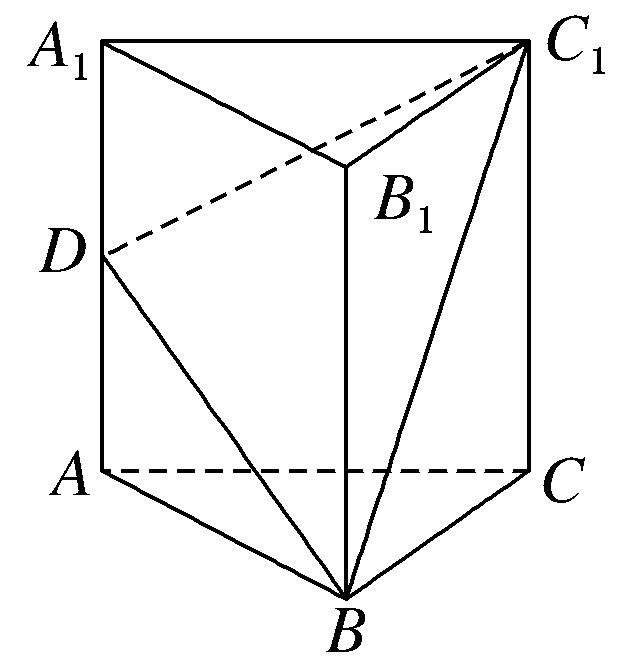

14．答案　2　解析　取<em>AC</em>的中点<em>O</em>，连接<em>BO</em>(图略)，则<em>BO</em>⊥<em>AC</em>，所以<em>BO</em>⊥平面<em>ACC</em>1<em>D</em>．因为<em>AB</em>

＝2，所以<em>BO</em>＝．因为<em>D</em>为棱<em>AA</em>1的中点，<em>AA</em>1＝4，所以<em>AD</em>＝2，所以<em>S</em>梯形<em>ACC</em>1<em>D</em>＝×(2＋4)×2＝6，所以四棱锥<em>BACC</em>1<em>D</em>的体积为×6×＝2．

15．已知正方体<em>ABCD－A</em>1<em>B</em>1<em>C</em>1<em>D</em>1的棱长为1，除面<em>ABCD</em>外，该正方体其余各面的中心分别为点<em>E</em>，<em>F</em>，

*G*，*H*，*M*(如图)，则四棱锥*M－EFGH*的体积为\_\_\_\_\_\_\_\_．

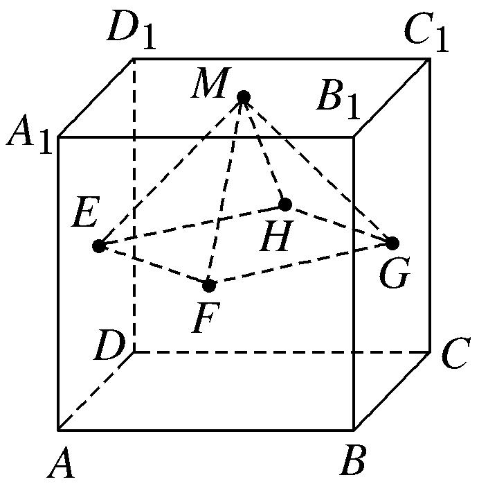

15．答案　　解析　连接<em>AD</em>1，<em>CD</em>1，<em>B</em>1<em>A</em>，<em>B</em>1<em>C</em>，<em>AC</em>，因为<em>E</em>，<em>H</em>分别为<em>AD</em>1，<em>CD</em>1的中点，所以<em>EH</em>

∥<em>AC</em>，<em>EH</em>＝<em>AC</em>，因为<em>F</em>，<em>G</em>分别为<em>B</em>1<em>A</em>，<em>B</em>1<em>C</em>的中点，所以<em>FG</em>∥<em>AC</em>，<em>FG</em>＝<em>AC</em>，所以<em>EH</em>∥<em>FG</em>，<em>EH</em>＝<em>FG</em>，所以四边形<em>EHGF</em>为平行四边形，又<em>EG</em>＝<em>HF</em>，<em>EH</em>＝<em>HG</em>，所以四边形<em>EHGF</em>为正方形，又点<em>M</em>到平面<em>EHGF</em>的距离为，所以四棱锥<em>M－EFGH</em>的体积为×2×＝．

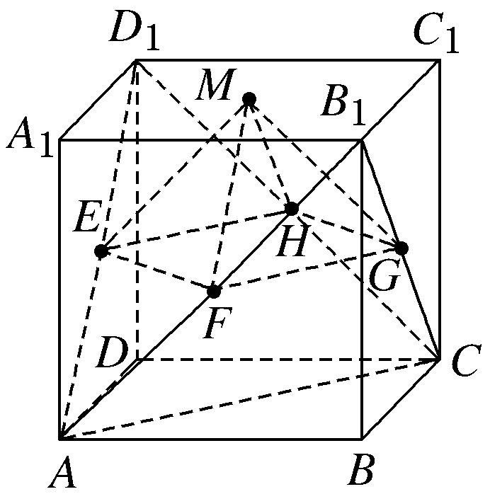

16．如图是棱长为2的正方体的表面展开图，则多面体*ABCDE*的体积为(　　)

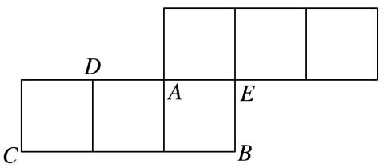

A．2　　　　　　　　
B．　　　　　　　　
C．　　　　　　　　
D．

16．答案　D　解析　多面体*ABCDE*为四棱锥(如图)，利用割补法可得其体积*V*＝4－＝，故选D．

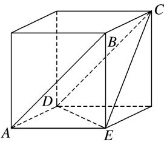

17．已知<em>E</em>，<em>F</em>分别是棱长为<em>a</em>的正方体<em>ABCD</em>—<em>A</em>1<em>B</em>1<em>C</em>1<em>D</em>1的棱<em>AA</em>1，<em>CC</em>1的中点，则四棱锥<em>C</em>1—<em>B</em>1<em>EDF</em>

的体积为\_\_\_\_\_\_\_\_．

17．答案　<em>a</em>3　解析　方法一　如图所示，连接<em>A</em>1<em>C</em>1，<em>B</em>1<em>D</em>1交于点<em>O</em>1，连接<em>B</em>1<em>D</em>，<em>EF</em>，过点<em>O</em>1作<em>O</em>1<em>H</em>

⊥<em>B</em>1<em>D</em>于点<em>H</em>．因为<em>EF</em>∥<em>A</em>1<em>C</em>1，且<em>A</em>1<em>C</em>1⊄平面<em>B</em>1<em>EDF</em>，<em>EF</em>⊂平面<em>B</em>1<em>EDF</em>，所以<em>A</em>1<em>C</em>1∥平面<em>B</em>1<em>EDF</em>．所以<em>C</em>1到平面<em>B</em>1<em>EDF</em>的距离就是<em>A</em>1<em>C</em>1到平面<em>B</em>1<em>EDF</em>的距离．易知平面<em>B</em>1<em>D</em>1<em>D</em>⊥平面<em>B</em>1<em>EDF</em>，又平面<em>B</em>1<em>D</em>1<em>D</em>∩平面<em>B</em>1<em>EDF</em>＝<em>B</em>1<em>D</em>，所以<em>O</em>1<em>H</em>⊥平面<em>B</em>1<em>EDF</em>，所以<em>O</em>1<em>H</em>等于四棱锥<em>C</em>1—<em>B</em>1<em>EDF</em>的高．因为△<em>B</em>1<em>O</em>1<em>H</em>∽△<em>B</em>1<em>DD</em>1，所以<em>O</em>1<em>H</em>＝＝<em>a</em>．所以＝·<em>O</em>1<em>H</em>＝×·<em>EF</em>·<em>B</em>1<em>D</em>·<em>O</em>1<em>H</em>＝×·<em>a</em>·<em>a</em>·<em>a</em>＝<em>a</em>3．

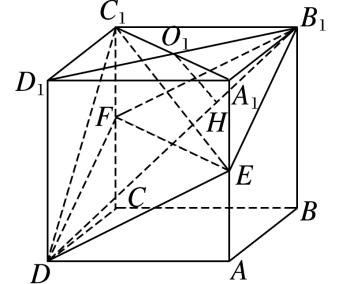

方法二　连接<em>EF</em>，<em>B</em>1<em>D</em>．设<em>B</em>1到平面<em>C</em>1<em>EF</em>的距离为<em>h</em>1，<em>D</em>到平面<em>C</em>1<em>EF</em>的距离为<em>h</em>2，则<em>h</em>1＋<em>h</em>2＝<em>B</em>1<em>D</em>1＝<em>a</em>．由题意得，＝··(<em>h</em>1＋<em>h</em>2)＝<em>a</em>3．

18．如图，在Rt△*ABC*中，*AB*＝*BC*＝1，*D*和*E*分别是边*BC*和*AC*上异于端点的点，*DE*⊥*BC*，将△*CDE*

沿*DE*折起，使点*C*到点*P*的位置，得到四棱锥*P*－*ABDE*，则四棱锥*P*－*ABDE*的体积的最大值为\_\_\_\_\_\_\_\_．

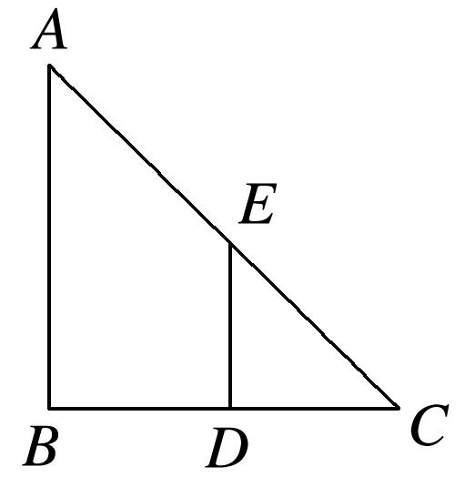

18．答案　　解析　答案　　解析　设*CD*＝*DE*＝*x*(0<*x*<1)，则四边形*ABDE*的面积*S*＝(1＋*x*)(1－*x*)

＝(1－<em>x</em>2)，当平面<em>PDE</em>⊥平面<em>ABDE</em>时，四棱锥<em>P</em>－<em>ABDE</em>的体积最大，此时<em>PD</em>⊥平面<em>ABDE</em>，且<em>PD</em>＝<em>CD</em>＝<em>x</em>，故四棱锥<em>P</em>－<em>ABDE</em>的体积<em>V</em>＝<em>S</em>·<em>PD</em>＝(<em>x</em>－<em>x</em>3)，则<em>V</em>′＝(1－3<em>x</em>2)．当<em>x</em>∈时，<em>V</em>′&gt;0；当<em>x</em>∈时，<em>V</em>′&lt;0．∴当<em>x</em>＝时，<em>V</em>max＝．

19．如图，在四棱锥*P－ABCD*中，底面*ABCD*为菱形，∠*BAD*＝60°，*Q*为*AD*的中点．若平面*PAD*⊥平

面*ABCD*，*PA*＝*PD*＝*AD*＝2，点*M*在线段*PC*上，且*PM*＝2*MC*，则四棱锥*P*－*ABCD*与三棱锥*P*－*QBM*的体积之比是\_\_\_\_\_\_\_\_．

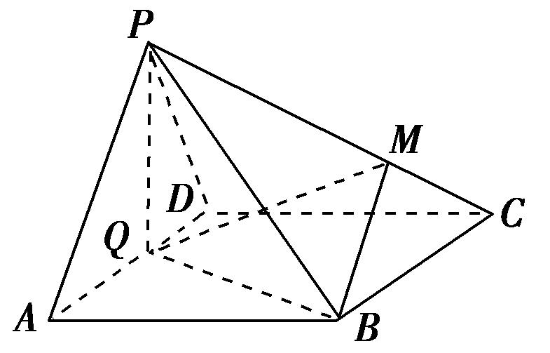

19．答案　3∶1　解析　过点*M*作*MH*∥*BC*交*PB*于点*H*．∵平面*PAD*⊥平面*ABCD*，平面*PAD*∩平面

*ABCD*＝*AD*，*PQ*⊥*AD*，∴*PQ*⊥平面*ABCD*．∵*PA*＝*PD*＝*AD*＝*AB*＝2，∠*BAD*＝60°，∴*PQ*＝*BQ*＝．

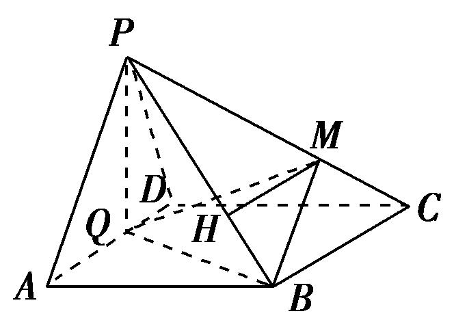
∴<em>VPABCD</em>＝<em>PQ</em>·<em>S</em>菱形<em>ABCD</em>＝××2×＝2．又<em>PQ</em>⊥<em>BC</em>，<em>BQ</em>⊥<em>AD</em>，<em>AD</em>∥<em>BC</em>．∴<em>BQ</em>⊥<em>BC</em>，又<em>QB</em>∩<em>QP</em>＝<em>Q</em>，∴<em>BC</em>⊥平面<em>PQB</em>，由<em>MH</em>∥<em>BC</em>，∴<em>MH</em>⊥平面<em>PQB</em>，＝＝，∵<em>BC</em>＝2，∴<em>MH</em>＝，∴<em>VPQBM</em>＝<em>VMPQB</em>＝××××＝，∴<em>VPABCD</em>∶<em>VPQBM</em>＝3∶1．

20．如图，用平行于母线的竖直平面截一个圆柱，得到底面为弓形的圆柱体的一部分，其中*M*，*N*为弧，

的中点，∠*EMF*＝120°，且*EF*＋*EG*＝6，当所得几何体的体积最大值时，该几何体的高为\_\_\_\_\_\_\_\_．

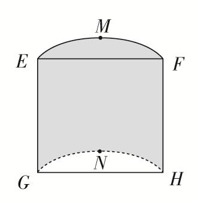

20．答案　2　解析　过*M*作*MT*⊥*EF*于*T*，设*MT*＝*x*，则*ET*＝*TF*＝*x*，设*O*为所在扇形的圆心，*R*

为扇形半径，又<em>OE</em>＝<em>OM</em>＝<em>OF</em>＝<em>R</em>，∠<em>EMO</em>＝∠<em>FMO</em>＝∠<em>EMF</em>＝60°，所以△<em>EMO</em>与△<em>FMO</em>为等边三角形，所以∠<em>EOT</em>＝∠<em>FOT</em>＝60°，则∠<em>EOF</em>＝∠<em>EOT</em>＋∠<em>FOT</em>＝120°，所以<em>OT</em>＝，则<em>MT</em>＝<em>OM</em>－<em>OT</em>＝＝<em>x</em>，即<em>R</em>＝2<em>x</em>．所得几何体的底面积为<em>S</em>＝<em>S</em>扇形<em>OEF</em>－<em>S</em>△<em>OEF</em>＝π<em>R</em>2－<em>R</em>2sin120°＝<em>x</em>2．又<em>EF</em>＋<em>EG</em>＝6，所以所得几何体的高<em>EG</em>＝6－2<em>x</em>，所以<em>V</em>＝<em>S</em>×<em>EG</em>＝(－<em>x</em>3＋3<em>x</em>2)，其中0&lt;<em>x</em>&lt;3．
令<em>f</em>(<em>x</em>)＝－<em>x</em>3＋3<em>x</em>2，<em>x</em>∈(0，3)，则由<em>f</em>′(<em>x</em>)＝－3<em>x</em>2＋6<em>x</em>＝－3<em>x</em>(<em>x</em>－2)＝0，解得<em>x</em>＝2．列表如下：

<table><tr><td>
<em>x</em>
</td><td>
(0，2)
</td><td>
2
</td><td>
(2，3)
</td></tr><tr><td>
<em>f</em>′(<em>x</em>)
</td><td>
＋
</td><td>
0
</td><td>
－
</td></tr><tr><td>
<em>f</em>(<em>x</em>)
</td><td>
增函数
</td><td>
极大值
</td><td>
减函数
</td></tr></table>
所以当*x*＝2时，*f*(*x*)取得最大值，此时该几何体的高*EG*＝2．

21．如图，在直角梯形*ABCD*中，*AD*＝*AB*＝4，*BC*＝2，沿中位线*EF*折起，使得∠*AEB*为直角，连接*AB*，

*CD*，则所得的几何体的表面积为\_\_\_\_\_\_\_\_，体积为\_\_\_\_\_\_\_\_．

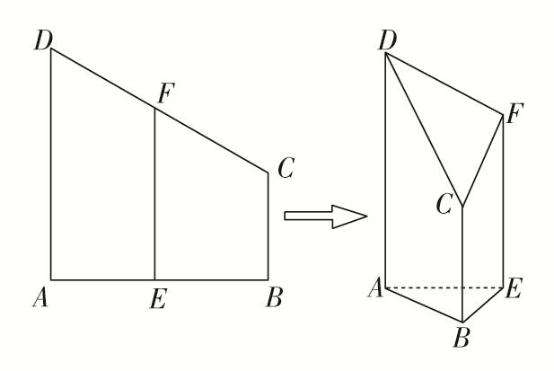

21．答案　14＋6＋　6　解析　如图，过点*C*作*CM*平行于*AB*，交*AD*于点*M*，作*CN*平行于*BE*，

交*EF*于点*N*，连接*MN*．由题意可知四边形*ABCM*，*BENC*都是矩形，*AM*＝*DM*＝2，*CN*＝2，*FN*＝1，*AB*＝*CM*＝2，

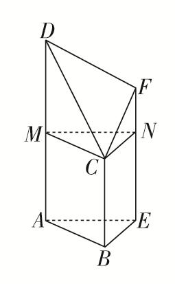

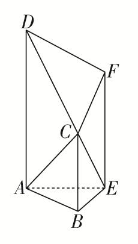

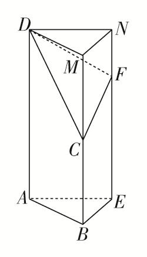
所以<em>S</em>△<em>AEB</em>＝×2×2＝2，<em>S</em>梯形<em>ABCD</em>＝×(2＋4)×2＝6，<em>S</em>梯形<em>BEFC</em>＝×(2＋3)×2＝5，<em>S</em>梯形<em>AEFD</em>＝×(3＋4)×2＝7，在直角三角形<em>CMD</em>中，<em>CM</em>＝2，<em>MD</em>＝2，所以<em>CD</em>＝2．又因为<em>DF</em>＝<em>FC</em>＝，所以<em>S</em>△<em>DFC</em>＝×2×＝，所以这个几何体的表面积为2＋6＋5＋7＋＝14＋6＋．
解法一：因为截面<em>CMN</em>把这个几何体分割为直三棱柱<em>ABE</em>－<em>MCN</em>和四棱锥<em>C</em>－<em>MNFD</em>，又因为直三棱柱<em>ABE</em>－<em>MCN</em>的体积为<em>V</em>1＝<em>S</em>△<em>ABE</em>·<em>AM</em>＝×2×2×2＝4，四棱锥<em>C</em>－<em>MNFD</em>的体积为<em>V</em>2＝<em>S</em>四边形<em>MNFD</em>·<em>BE</em>＝××(1＋2)×2×2＝2，所以所求几何体的体积为<em>V</em>1＋<em>V</em>2＝6．
解法二：如图，连接<em>AC</em>，<em>EC</em>，则几何体分割为四棱锥<em>C</em>－<em>ADFE</em>和三棱锥<em>C</em>－<em>ABE</em>，因为<em>VC</em>－<em>ADFE</em>＝××2＝，<em>VC</em>－<em>ABE</em>＝××2＝，所以所求几何体的体积为<em>VC</em>－<em>ADFE</em>＋<em>VC</em>－<em>ABE</em>＝＋＝6．
解法三：如图，延长<em>BC</em>至点<em>M</em>，使得<em>CM</em>＝2，延长<em>EF</em>至点<em>N</em>，使得<em>FN</em>＝1，连接<em>DM</em>，<em>MN</em>，<em>DN</em>，得到直三棱柱<em>ABE</em>－<em>DMN</em>，所以几何体的体积等于直三棱柱<em>ABE</em>－<em>DMN</em>的体积减去四棱锥<em>D</em>－<em>CMNF</em>的体积．因为<em>VABE</em>－<em>DMN</em>＝×4＝8，<em>VD</em>－<em>CMNF</em>＝××2＝2，所以所求几何体的体积为<em>VABE</em>－<em>DMN</em>－<em>VD</em>－<em>CMNF</em>＝8－2＝6．

22．已知Rt△*ABC*，其三边长分别为*a*，*b*，*c*(*a*>*b*>*c*)．分别以三角形的边*a*，*b*，*c*所在直线为轴，其余各

边旋转一周形成的曲面围成三个几何体，其表面积和体积分别为<em>S</em>1，<em>S</em>2，<em>S</em>3和<em>V</em>1，<em>V</em>2，<em>V</em>3．则它们的关系为(　　)

A．<em>S</em>1&gt;<em>S</em>2&gt;<em>S</em>3，<em>V</em>1&gt;<em>V</em>2&gt;<em>V</em>3　　　　　　　　　
B．<em>S</em>1&lt;<em>S</em>2&lt;<em>S</em>3，<em>V</em>1&lt;<em>V</em>2&lt;<em>V</em>3

C．<em>S</em>1&gt;<em>S</em>2&gt;<em>S</em>3，<em>V</em>1＝<em>V</em>2＝<em>V</em>3　　　　　　　　
D．<em>S</em>1&lt;<em>S</em>2&lt;<em>S</em>3，<em>V</em>1＝<em>V</em>2＝<em>V</em>3

22．答案　B　解析　<em>S</em>1＝π··(<em>b</em>＋<em>c</em>)，<em>V</em>1＝π2<em>a</em>，<em>S</em>2＝π<em>ac</em>＋π<em>c</em>2，<em>V</em>2＝π<em>bc</em>2，<em>S</em>3＝π<em>ab</em>＋π<em>b</em>2，<em>V</em>3＝π<em>b</em>2<em>c</em>．由

<em>a</em>&gt;<em>b</em>&gt;<em>c</em>，可得<em>S</em>1&lt;<em>S</em>2&lt;<em>S</em>3，<em>V</em>1&lt;<em>V</em>2&lt;<em>V</em>3．

