# 专题 07 立体几何中空间角的计算

# 考点一 异面直线所成的角

# 【方法总结】

# 求异面直线所成的角的方法

求异面直线所成的角常用方法是平移法，通过作三角形的中位线，平行四边形等进行平移，作出异面直线所成的角，转化为解三角形问题，进而求解．解三角形，求出作出的角．如果求出的角是锐角或直角，则它就是要求的角；如果求出的角是钝角，则它的补角才是要求的角．

# 【例题选讲】

[例 1](1)(2018·全国Ⅱ)在正方体 $ABCD-A_{1}B_{1}C_{1}D_{1}$ 中，E 为棱 $CC_{1}$ 的中点，则异面直线 AE 与 CD 所成角的正切值为()

A. $\frac{\sqrt{2}}{2}$

B. $\frac{\sqrt{3}}{2}$

C. $\frac{\sqrt{5}}{2}$

D. $\frac{\sqrt{7}}{2}$

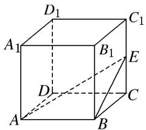

text_image

D₁
A₁
B₁
C₁
E
D
A
B
C

(2)如图，在底面为正方形，侧棱垂直于底面的四棱柱 $ABCD-A_{1}B_{1}C_{1}D_{1}$ 中， $AA_{1}=2AB=2$ ，则异面直线 $A_{1}B$ 与 $AD_{1}$ 所成角的余弦值为()

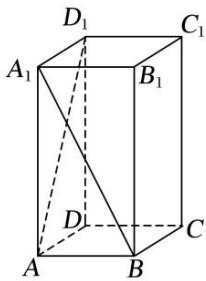

text_image

D₁
A₁
B₁
C₁
D₁
A
B
C

A. $\frac{1}{5}$

B. $\frac{2}{5}$

C. $\frac{3}{5}$

D. $\frac{4}{5}$

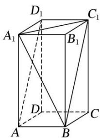

text_image

D₁
A₁
B₁
C₁
D
A
B
C

(3)在我国古代数学名著《九章算术》中，将四个面都为直角三角形的四面体称为鳖臑．如图，在鳖臑ABCD中， $AB \perp$ 平面BCD，且 $AB = BC = CD$ ，则异面直线AC与BD所成角的余弦值为()

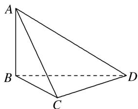

natural_image

Geometric diagram of a tetrahedron with vertices labeled A, B, C, D (no text or symbols present)

A. $\frac{1}{2}$

B. $-\frac{1}{2}$

C. $\frac{\sqrt{3}}{2}$

D. $-\frac{\sqrt{3}}{2}$

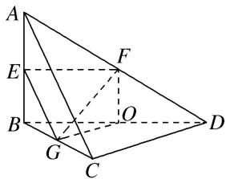

text_image

Geometric diagram of a tetrahedron with labeled vertices and internal points, used for spatial geometry problems.

(4)直三棱柱 $ABC - A_{1}B_{1}C_{1}$ 中，若 $\angle BAC = 90^{\circ}$ ， $AB = AC = AA_{1}$ ，则异面直线 $BA_{1}$ 与 $AC_{1}$ 所成的角等于（）

A. $30^{\circ}$

B. $45^{\circ}$

C. $60^{\circ}$

D. $90^{\circ}$

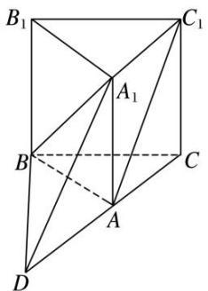

text_image

B₁
C₁
A₁
B
C
A
D

# 【对点训练】

1. 如图所示，在正三棱柱 $ABC - A_{1}B_{1}C_{1}$ 中， $D$ 是 $AC$ 的中点， $AA_{1}:AB = \sqrt{2}:1$ ，则异面直线 $AB_{1}$ 与 $BD$ 所成的角为 \_\_\_\_.

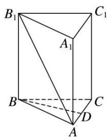

text_image

B₁
C₁
A₁
B
C
D
A

2. 如图所示, 在正方体 $ABCD - A_1B_1C_1D_1$ 中, 则 $AC$ 与 $A_1D$ 所成角的大小为\_\_\_\_; 若 $E$ , $F$ 分别为 $AB$ , $AD$ 的中点, 则 $A_1C_1$ 与 $EF$ 所成角的大小为\_\_\_\_.

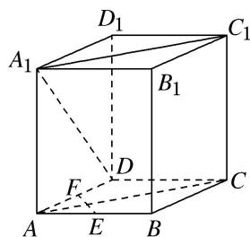

text_image

D₁
A₁
B₁
C₁
D
F
A
E
B
C

3. 如图所示, 等腰直角三角形 $ABC$ 中, $\angle A = 90^{\circ}$ , $BC = \sqrt{2}$ , $DA \perp AC$ , $DA \perp AB$ , 若 $DA = 1$ , 且 $E$ 为 $DA$ 的中点, 则异面直线 $BE$ 与 $CD$ 所成角的余弦值为 \_\_\_\_.

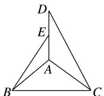

text_image

D
E
A
B
C

4. 如图, 已知圆柱的轴截面 $ABB_{1}A_{1}$ 是正方形, $C$ 是圆柱下底面弧 $AB$ 的中点, $C_{1}$ 是圆柱上底面弧 $A_{1}B_{1}$ 的

中点，那么异面直线 $AC_{1}$ 与 BC 所成角的正切值为 \_\_\_\_.

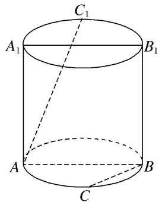

text_image

C₁
A₁ B₁
A
B
C

5. 在正三棱柱 $ABC - A_{1}B_{1}C_{1}$ 中, $AB = AA_{1} = 2$ , $M$ , $N$ 分别为 $AA_{1}$ , $BB_{1}$ 的中点, 则异面直线 $BM$ 与 $C_{1}N$ 所成角的余弦值为 \_\_\_\_.

6. 如图, 四边形 $ABCD$ 为矩形, 平面 $PCD \perp$ 平面 $ABCD$ , 且 $PC = PD = CD = 2$ , $BC = 2\sqrt{2}$ , $O$ , $M$ 分别为 $CD$ , $BC$ 的中点, 则异面直线 $OM$ 与 $PD$ 所成的角的余弦值为( )

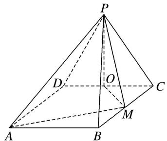

text_image

Geometric diagram of a pyramid with labeled vertices and internal points, used in spatial geometry problems.

A. $\frac{\sqrt{6}}{4}$

B. $\frac{\sqrt{6}}{3}$

C. $\frac{\sqrt{3}}{6}$

D. $\frac{\sqrt{3}}{3}$

7. 点 $E, F$ 分别是三棱锥 $P-ABC$ 的棱 $AP, BC$ 的中点, $AB=6$ , $PC=8$ , $EF=5$ , 则异面直线 $AB$ 与 $PC$ 所成的角为( )

A. $90^{\circ}$

B. $45^{\circ}$

C. $30^{\circ}$

D. $60^{\circ}$

8. 已知在四面体 $ABCD$ 中, $E$ , $F$ 分别是 $AC$ , $BD$ 的中点, 若 $AB = 2$ , $CD = 4$ , $EF \perp AB$ , 则 $EF$ 与 $CD$ 所成的角的大小为( )

A. $90^{\circ}$

B. $45^{\circ}$

C. $60^{\circ}$

D. $30^{\circ}$

9. 在正三棱柱 $ABC-A_{1}B_{1}C_{1}$ 中， $AB=\sqrt{2BB_{1}}$ ，则 $AB_{1}$ 与 $BC_{1}$ 所成角的大小为()

A. $30^{\circ}$

B. $60^{\circ}$

C. $75^{\circ}$

D. $90^{\circ}$

10. 如图所示, 在四棱锥 $P \quad ABCD$ 中, $\angle ABC = \angle BAD = 90^{\circ}$ , $BC = 2AD$ , $\triangle PAB$ 和 $\triangle PAD$ 都是等边三角形, 则异面直线 $CD$ 与 $PB$ 所成角的大小为 \_\_\_\_.

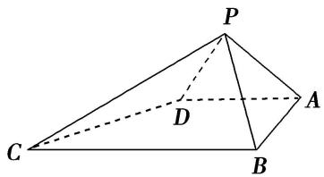

text_image

P
D
C
A
B

# 考点二 直线与平面所成的角

# 【方法总结】

# 求直线与平面所成角的方法

求直线与平面所成角的关键是寻找过直线上一点与平面垂直的垂线、垂足与斜足的连线即为直线在平

面内的射影，直线与直线在平面内射影所成的角即为线面角．然后转化为解三角形问题，进而求解.

# 【例题选讲】

[例 2](1)已知三棱柱 $ABC-A_{1}B_{1}C_{1}$ 的侧棱与底面垂直，体积为 $\frac{9}{4}$ ，底面是边长为 $\sqrt{3}$ 的正三角形．若 P 为底面 $A_{1}B_{1}C_{1}$ 的中心，则 PA 与平面 ABC 所成角的大小为 \_\_\_\_．

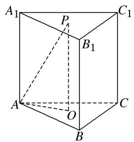

text_image

A₁
P
C₁
B₁
A
O
C
B

(2)(2018·全国 I )在长方体 $ABCD-A_{1}B_{1}C_{1}D_{1}$ 中，AB=BC=2， $AC_{1}$ 与平面 $BB_{1}C_{1}C$ 所成的角为 $30^{\circ}$ ，则该长方体的体积为()

A. 8

B. $6\sqrt{2}$

C. $8\sqrt{2}$

D. $8\sqrt{3}$

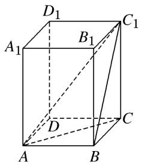

text_image

D₁
A₁ B₁ C₁
D
A B C

# 【对点训练】

1. 在正三棱柱 $ABC - A_{1}B_{1}C_{1}$ 中， $AB = 1$ ，点 $D$ 在棱 $BB_{1}$ 上，且 $BD = 1$ ，则 $AD$ 与平面 $AA_{1}C_{1}C$ 所成角的正弦值为（）

A. $\frac{\sqrt{10}}{4}$

B. $\frac{\sqrt{6}}{4}$

C. $\frac{\sqrt{10}}{5}$

D. $\frac{\sqrt{6}}{5}$

2. 如图, 正四棱锥 $P - ABCD$ 的体积为 2 , 底面积为 6 , $E$ 为侧棱 $PC$ 的中点, 则直线 $BE$ 与平面 $PAC$ 所成的角为 ( )

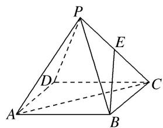

text_image

Geometric diagram of a pyramid with labeled vertices and internal points, used in spatial geometry problems.

A. $60^{\circ}$

B. $30^{\circ}$

C. $45^{\circ}$

D. $90^{\circ}$

3. 已知正方体 $ABCD - A_{1}B_{1}C_{1}D_{1}$ 的体积为 $16\sqrt{2}$ ，点 $P$ 在正方形 $A_{1}B_{1}C_{1}D_{1}$ 上且 $A_{1}$ ， $C$ 到 $P$ 的距离分别为 2， $2\sqrt{3}$ ，则直线 $CP$ 与平面 $BDD_{1}B_{1}$ 所成角的正切值为（）

A. $\frac{\sqrt{2}}{2}$

B. $\frac{\sqrt{3}}{3}$

C. $\frac{1}{2}$

D. $\frac{1}{3}$

4. 在正方体 $ABCD - A_{1}B_{1}C_{1}D_{1}$ 中， $E$ 为棱 $CD$ 上的一点，且 $CE = 2DE$ ， $F$ 为棱 $AA_{1}$ 的中点，且平面 $BEF$ 与 $DD_{1}$ 交于点 $G$ ，则 $B_{1}G$ 与平面 $ABCD$ 所成角的正切值为（）

A. $\frac{\sqrt{2}}{12}$

B. $\frac{\sqrt{2}}{6}$

C. $\frac{5\sqrt{2}}{12}$

D. $\frac{5\sqrt{2}}{6}$

5. 如图, 在正方体 $ABCD—A_{1}B_{1}C_{1}D_{1}$ 中, $E$ , $F$ , $G$ , $H$ 分别为棱 $AA_{1}$ , $B_{1}C_{1}$ , $C_{1}D_{1}$ , $DD_{1}$ 的中点, 则 $GH$ 与平面 $EFH$ 所成的角的余弦值为 \_\_\_\_.

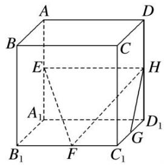

text_image

A
B
C
D
E
H
A₁
B₁
F
C₁
G
D₁

6. 在正三棱柱 $ABC - A_{1}B_{1}C_{1}$ 中， $AB = 4$ ，点 $D$ 在棱 $BB_{1}$ 上，若 $BD = 3$ ，则 $AD$ 与平面 $AA_{1}C_{1}C$ 所成角的正切值为（）

A. $\frac{2\sqrt{3}}{5}$

B. $\frac{2\sqrt{39}}{13}$

C. $\frac{5}{4}$

D. $\frac{4}{3}$

7. 已知 $E$ ， $F$ 分别是正方体 $ABCD - A_1B_1C_1D_1$ 的棱 $BB_1$ ， $AD$ 的中点，则直线 $EF$ 和平面 $BDD_1B_1$ 所成的角的正弦值是（）

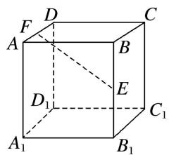

text_image

D
F
A
B
C
E
D₁
C₁
A₁
B₁

A. $\frac{\sqrt{2}}{6}$

B. $\frac{\sqrt{3}}{6}$

C. $\frac{1}{3}$

D. $\frac{\sqrt{6}}{6}$

8. 如图，在三棱锥 $S - ABC$ 中，若 $AC = 2\sqrt{3}$ ， $SA = SB = SC = AB = BC = 4$ ， $E$ 为棱 $SC$ 的中点，则直线 $AC$ 与 $BE$ 所成角的余弦值为 \_\_\_\_，直线 $AC$ 与平面 $SAB$ 所成的角为 \_\_\_\_.

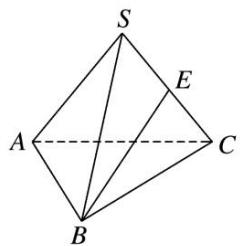

text_image

S
E
A
C
B

9. (2018·全国 II)已知圆锥的顶点为 $S$ , 母线 $SA$ , $SB$ 所成角的余弦值为 $\frac{7}{8}$ , $SA$ 与圆锥底面所成角为 $45^{\circ}$ , 若 $\triangle SAB$ 的面积为 $5 \sqrt{15}$ , 则该圆锥的侧面积为 \_\_\_\_.

10. 如图, 设 $E$ , $F$ 分别是正方形 $ABCD$ 中 $CD$ , $AB$ 边的中点, 将 $\triangle ADC$ 沿对角线 $AC$ 对折, 使得直线 $EF$ 与 $AC$ 异面, 记直线 $EF$ 与平面 $ABC$ 所成的角为 $\alpha$ , 与异面直线 $AC$ 所成的角为 $\beta$ , 则当 $\tan \beta = \frac{1}{2}$ 时, $\tan \alpha$ 等于( )

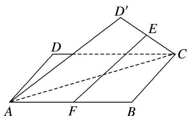

text_image

Geometric diagram of a parallelepiped with labeled vertices and internal points, showing solid and dashed edges.

A. $\frac{3\sqrt{5}}{16}$

B. $\frac{\sqrt{5}}{5}$

C. $\frac{\sqrt{51}}{17}$

D. $\frac{\sqrt{57}}{19}$

# 考点三 二面角

# 【方法总结】

# 求二面角的方法

求二面角是常见题型，根据所求两面是否有公共棱可分为两类：有棱二面角、无棱二面角，对于前者的二面角通常采用定义法或三垂线法等手段来定位出二面角的平面角，转化为解三角形问题，进而求解；而对于无棱二面角，一般通过延展平面找到棱使其转化为有棱二面角。或用面积射影定理(若多边形的面积为 $S$ ，它在一个平面内的射影图形的面积为 $S^{\prime}$ ，且多边形与该平面所成的二面角为 $\theta$ ，则 $\cos \theta = \frac{S'}{S}$ 。)去解决(如例3(5))。

# 【例题选讲】

[例 3](1)如图，在三棱锥 V-ABC 中，VA=AB=VB=AC=BC=2， $VC=\sqrt{3}$ ，则二面角 V-AB-C 的大小为 \_\_\_\_.

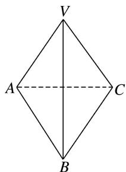

text_image

V
A
C
B

(2)二面角 $\alpha - l - \beta$ 的大小为 $60^{\circ}$ , $A$ , $B$ 分别在两个面内且 $A$ 和 $B$ 到棱的距离为 2 和 4, 且 $AB = 10$ , 则 $AB$ 与棱 $l$ 所成角的正弦值为 \_\_\_\_.

(3)在矩形ABCD中， $AB = 3,AD = 4,PA\bot$ 平面ABCD， $PA = \frac{4\sqrt{3}}{5}$ ，那么二面角 $A - BD - P$ 的大小为（

A. $30^{\circ}$

B. $45^{\circ}$

C. $60^{\circ}$

D. $75^{\circ}$

(4)如图, 平面 $\beta$ 内一条直线 $AC$ , $AC$ 与平面 $\alpha$ 所成的角为 $30^{\circ}$ , $AC$ 与棱 $BD$ 所成的角为 $45^{\circ}$ , 则平面 $\alpha$ 与平面 $\beta$ 所成的角的大小为 \_\_\_\_.

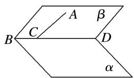

text_image

A
β
C
B
D
α

(5)在四棱锥 P-ABCD 中，四边形 ABCD 为正方形，PA⊥平面 ABCD，PA=AB=a，则平面 PBA 与平面 PDC 所成二面角的大小为 \_\_\_\_.

# 【对点训练】

1. 从空间一点 $P$ 向二面角 $\alpha - l - \beta$ 的两个面 $\alpha, \beta$ 分别作垂线 $PE, PF, E, F$ 为垂足，若 $\angle EPF = 60^{\circ}$ ，则二面角 $\alpha - l - \beta$ 的平面角的大小是（）

A. $60^{\circ}$

B. $120^{\circ}$

C. $60^{\circ}$ 或 $120^{\circ}$

D. 不确定

2. 如图所示, 已知三棱锥 $A - BCD$ 的各棱长均为 2 , 则二面角 $A - CD - B$ 的平面角的余弦值为

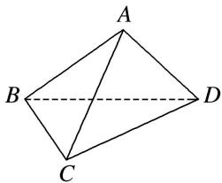

text_image

A
B
C
D

3. 已知二面角的棱上有 $A, B$ 两点，直线 $AC, BD$ 分别在这个二面角的两个半平面内，且都垂直于 $AB$ ，已知 $AB = 4, AC = 6, BD = 8, CD = 2\sqrt{17}$ ，则该二面角的大小为（）

A. $150^{\circ}$

B. $45^{\circ}$

C. $120^{\circ}$

D. $60^{\circ}$

4. 已知正四棱锥的体积为 12，底面对角线的长为 $2 \sqrt{6}$ ，则侧面与底面所成的二面角的平面角为 \_\_\_\_.

5. 如图, $AB$ 是 $\odot O$ 的直径, $PA$ 垂直于 $\odot O$ 所在平面, $C$ 是圆周上不同于 $A$ , $B$ 两点的任意一点, 且 $AB = 2$ , $PA = BC = \sqrt{3}$ , 则二面角 $A - BC - P$ 的大小为 \_\_\_\_.

6. 已知 $\triangle ABC$ 中, $\angle C = 90^{\circ}$ , $\tan A = \sqrt{2}$ , $M$ 为 $AB$ 的中点, 现将 $\triangle ACM$ 沿 $CM$ 折起, 得到三棱锥 $P - CBM$ , 如图所示. 则当二面角 $P - CM - B$ 的大小为 $60^{\circ}$ 时, $\frac{AB}{PB} =$ \_\_\_\_.

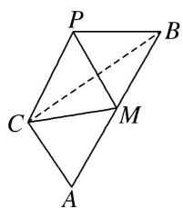

text_image

Geometric diagram of a parallelogram with labeled vertices and internal points, including dashed lines for hidden segments.

7. (多选)在正方体 $ABCD - A_{1}B_{1}C_{1}D_{1}$ 中, 下列说法正确的是( )

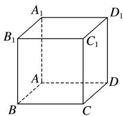

text_image

A₁
B₁
C₁
D₁
A
B
C
D

A. $A_{1}C_{1} \perp BD$

B. $B_{1}C$ 与 $BD$ 所成的角为 $60^{\circ}$

C. 二面角 $A_{1} - BC - D$ 的平面角为 $45^{\circ}$

D. $AC_{1}$ 与平面ABCD所成的角为 $45^{\circ}$

8. 如图, 矩形 $ABCD$ 中, $AB = 1$ , $BC = 2$ , 点 $E$ 为 $AD$ 的中点, 将 $\triangle ABE$ 沿 $BE$ 折起, 在翻折过程中, 记点 $A$ 对应的点为 $A'$ , 二面角 $A' - DC - B$ 的平面角的大小为 $\alpha$ , 则当 $\alpha$ 最大时, $\tan \alpha = (\quad)$

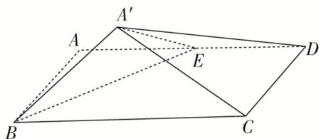

text_image

A'
A
E
D
B
C

A. $\frac{\sqrt{2}}{2}$

B. $\frac{\sqrt{2}}{3}$

C. $\frac{1}{3}$

D. $\frac{1}{2}$

9. 已知在矩形 ABCD 中， $AD=\sqrt{2}AB$ ，沿直线 BD 将 $\triangle ABD$ 折成 $\triangle A^{\prime}BD$ ，使得点 $A^{\prime}$ 在平面 BCD 上的射影在 $\triangle BCD$ 内(不含边界)，设二面角 $A'-BD-C$ 的大小为 $\theta$ ，直线 $A'D$ ， $A'C$ 与平面 $BCD$ 所成的角分别为 $\alpha$ ， $\beta$ ，则( )

A. $\alpha<\theta<\beta$

B. $\beta <  \theta <  \alpha$

C. $\beta<\alpha<\theta$

D. $\alpha <  \beta <  \theta$

10. 如图, 在三棱锥 $S - ABC$ 中, $SA \perp$ 底面 $ABC$ , $AB \perp BC$ , $DE$ 垂直平分 $SC$ 且分别交 $AC$ , $SC$ 于点 $D$ , $E$ , 又 $SA = AB$ , $SB = BC$ , 则二面角 $E - BD - C$ 的大小为 \_\_\_\_.

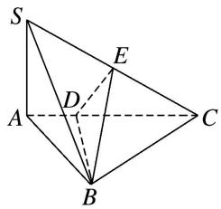

text_image

Geometric diagram of a tetrahedron with labeled vertices and internal points, used for spatial geometry problems.

