# 专题 07 立体几何中空间角的计算

# 考点一 异面直线所成的角

# 【方法总结】

# 求异面直线所成的角的方法

求异面直线所成的角常用方法是平移法，通过作三角形的中位线，平行四边形等进行平移，作出异面直线所成的角，转化为解三角形问题，进而求解．解三角形，求出作出的角．如果求出的角是锐角或直角，则它就是要求的角；如果求出的角是钝角，则它的补角才是要求的角．

# 【例题选讲】

[例 1]（1）(2018·全国Ⅱ)在正方体 $ABCD-A_{1}B_{1}C_{1}D_{1}$ 中，E 为棱 $CC_{1}$ 的中点，则异面直线 AE 与 CD 所成角的正切值为()

A. $\frac{\sqrt{2}}{2}$

B. $\frac{\sqrt{3}}{2}$

C. $\frac{\sqrt{5}}{2}$

D. $\frac{\sqrt{7}}{2}$
答案 C 解析 如图，连接 BE，因为 $AB \parallel CD$ ，所以 AE 与 CD 所成的角为 $\angle EAB$ 。在 Rt△ABE 中，设 AB = 2，则 $BE = \sqrt{5}$ ，则 $\tan \angle EAB = \frac{BE}{AB} = \frac{\sqrt{5}}{2}$ ，所以异面直线 AE 与 CD 所成角的正切值为 $\frac{\sqrt{5}}{2}$ 。

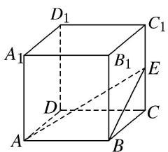  
（2）如图，在底面为正方形，侧棱垂直于底面的四棱柱 $ABCD - A_{1}B_{1}C_{1}D_{1}$ 中， $AA_{1} = 2AB = 2$ ，则异面直线 $A_{1}B$ 与 $AD_{1}$ 所成角的余弦值为（）

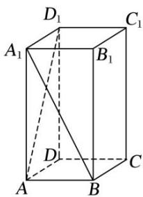

A. $\frac{1}{5}$

B. $\frac{2}{5}$

C. $\frac{3}{5}$

D. $\frac{4}{5}$
答案 D 解析 连接 $BC_{1}$ , 易证 $BC_{1} // AD_{1}$ , 则 $\angle A_{1}BC_{1}$ 即为异面直线 $A_{1}B$ 与 $AD_{1}$ 所成的角. 连接 $A_{1}C_{1}$ , 由 $AB = 1$ , $AA_{1} = 2$ , 易得 $A_{1}C_{1} = \sqrt{2}$ , $A_{1}B = BC_{1} = \sqrt{5}$ , 故 $\cos \angle A_{1}BC_{1} = \frac{5 + 5 - 2}{2 \times \sqrt{5} \times \sqrt{5}} = \frac{4}{5}$ , 即异面直线 $A_{1}B$ 与 $AD_{1}$ 所成角的余弦值为 $\frac{4}{5}$ .

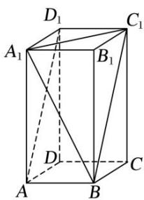  
（3）在我国古代数学名著《九章算术》中，将四个面都为直角三角形的四面体称为鳖臑．如图，在鳖臑ABCD中， $AB \perp$ 平面BCD，且AB=BC=CD，则异面直线AC与BD所成角的余弦值为()

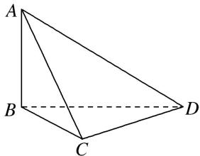

A. $\frac{1}{2}$

B. $-\frac{1}{2}$

C. $\frac{\sqrt{3}}{2}$

D. $-\frac{\sqrt{3}}{2}$
答案 A 解析 如图，分别取 AB, AD, BC, BD 的中点 E, F, G, O，连接 EF, EG, OG, FO, FG，则 $EF \parallel BD$ ， $EG \parallel AC$ ，所以 $\angle FEG$ 为异面直线 AC 与 BD 所成的角．易知 $FO \parallel AB$ ，因为 $AB \perp$ 平面 BCD，所以 $FO \perp$ 平面 BCD，所以 $FO \perp OG$ ，设 AB = 2a，则 $EG = EF = \sqrt{2}a$ ， $FG = \sqrt{a^{2} + a^{2}} = \sqrt{2}a$ ，所以 $\angle FEG = 60^{\circ}$ ，所以异面直线 AC 与 BD 所成角的余弦值为 $\frac{1}{2}$ ，故选 A.

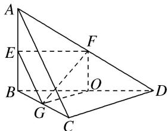  
（4）直三棱柱 $ABC - A_{1}B_{1}C_{1}$ 中，若 $\angle BAC = 90^{\circ}$ ， $AB = AC = AA_{1}$ ，则异面直线 $BA_{1}$ 与 $AC_{1}$ 所成的角等于（）

A. $30^{\circ}$

B. $45^{\circ}$

C. $60^{\circ}$

D. $90^{\circ}$
答案 C 解析 如图，延长 CA 到点 D，使得 AD = AC，连接 $DA_{1}$ ，BD，则四边形 $ADA_{1}C_{1}$ 为平行四边形，所以 $\angle DA_{1}B$ 就是异面直线 $BA_{1}$ 与 $AC_{1}$ 所成的角。又 $A_{1}D = A_{1}B = DB$ ，所以 $\triangle A_{1}DB$ 为等边三角形，所以 $\angle DA_{1}B = 60^{\circ}$ 。故选 C.

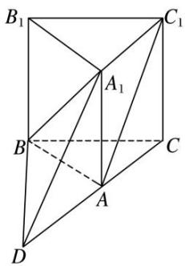

# 【对点训练】

1. 如图所示，在正三棱柱 $ABC - A_{1}B_{1}C_{1}$ 中， $D$ 是 $AC$ 的中点， $AA_{1}:AB = \sqrt{2}:1$ ，则异面直线 $AB_{1}$ 与 $BD$ 所成的角为 \_\_\_\_.

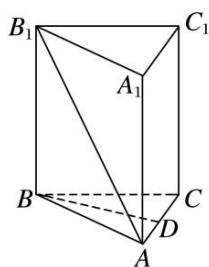

1. 答案 $60^{\circ}$ 解析 取 $A_{1}C_{1}$ 的中点 $E$ , 连接 $B_{1}E$ , $ED$ , $AE$ , 在 Rt $\triangle AB_{1}E$ 中, $\angle AB_{1}E$ 为异面直线 $AB_{1}$ 与 BD 所成的角．设 AB=1，则 $A_{1}A=\sqrt{2}$ ， $AB_{1}=\sqrt{3}$ ， $B_{1}E=\frac{\sqrt{3}}{2}$ ，故 $\angle AB_{1}E=60^{\circ}$ .

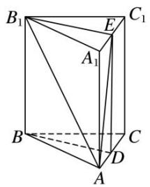

2. 如图所示, 在正方体 $ABCD - A_{1}B_{1}C_{1}D_{1}$ 中, 则 $AC$ 与 $A_{1}D$ 所成角的大小为\_\_\_\_; 若 $E$ , $F$ 分别为 $AB$ , $AD$ 的中点, 则 $A_{1}C_{1}$ 与 $EF$ 所成角的大小为\_\_\_\_.

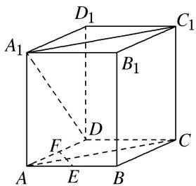

2. 答案 $60^{\circ} 90^{\circ}$ 解析 （1）如图所示, 连接 $B_{1}C$ , $AB_{1}$ , 由 $ABCD - A_{1}B_{1}C_{1}D_{1}$ 是正方体, 易知 $A_{1}D // B_{1}C$ , 从而 $B_{1}C$ 与 $AC$ 所成的角就是 $AC$ 与 $A_{1}D$ 所成的角. $\because AB_{1} = AC = B_{1}C$ , $\therefore \angle B_{1}CA = 60^{\circ}$ . 即 $A_{1}D$ 与 $AC$ 所成的角为 $60^{\circ}$ .

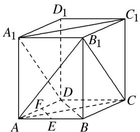

连接 BD，在正方体 $ABCD-A_{1}B_{1}C_{1}D_{1}$ 中， $AC \perp BD, AC \parallel A_{1}C_{1}, \because E, F$ 分别为 AB, AD 的中点，∴ $EF \parallel BD, \therefore EF \perp AC. \therefore EF \perp A_{1}C_{1}$ . 即 $A_{1}C_{1}$ 与 EF 所成的角为 $90^{\circ}$ .

3. 如图所示, 等腰直角三角形 $ABC$ 中, $\angle A = 90^{\circ}$ , $BC = \sqrt{2}$ , $DA \perp AC$ , $DA \perp AB$ , 若 $DA = 1$ , 且 $E$ 为 $DA$ 的中点, 则异面直线 $BE$ 与 $CD$ 所成角的余弦值为 \_\_\_\_.

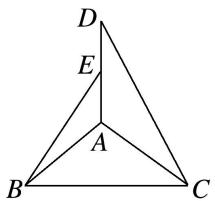

3. 如图所示，取 $AC$ 的中点 $F$ ，连接 $EF, BF, \because$ 在 $\triangle ACD$ 中， $E, F$ 分别是 $AD, AC$ 的中点， $\therefore EF \parallel CD$ . $\therefore \angle BEF$ 或其补角即为异面直线 $BE$ 与 $CD$ 所成的角．在 Rt $\triangle EAB$ 中， $AB = AC = 1, AE = \frac{1}{2} AD = \frac{1}{2}$ ， $\therefore BE = \frac{\sqrt{5}}{2}$ ．在 Rt $\triangle EAF$ 中， $AF = \frac{1}{2} AC = \frac{1}{2}, AE = \frac{1}{2}, \therefore EF = \frac{\sqrt{2}}{2}$ ．在 Rt $\triangle BAF$ 中， $AB = 1, AF = \frac{1}{2}, \therefore BF = \frac{\sqrt{5}}{2}$ ．在等腰三角形 $EBF$ 中， $\cos \angle FEB = \frac{\frac{1}{2} EF}{BE} = \frac{\frac{\sqrt{2}}{4}}{\frac{\sqrt{5}}{2}} = \frac{\sqrt{10}}{10}$ .

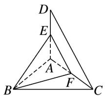

4. 如图, 已知圆柱的轴截面 $ABB_{1}A_{1}$ 是正方形, $C$ 是圆柱下底面弧 $AB$ 的中点, $C_{1}$ 是圆柱上底面弧 $A_{1}B_{1}$ 的中点, 那么异面直线 $AC_{1}$ 与 $BC$ 所成角的正切值为 \_\_\_\_.

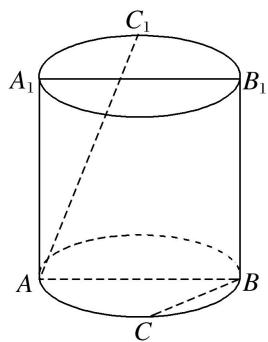

4. 答案 $\sqrt{2}$ 解析 取圆柱下底面弧 $AB$ 的另一中点 $D$ , 连接 $C_{1}D$ , $AD$ , 因为 $C$ 是圆柱下底面弧 $AB$ 的中点,

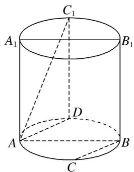
所以 $AD \parallel BC$ ，所以直线 $AC_{1}$ 与 $AD$ 所成的角即为异面直线 $AC_{1}$ 与 $BC$ 所成的角，因为 $C_{1}$ 是圆柱上底面弧 $A_{1}B_{1}$ 的中点，所以 $C_{1}D \perp$ 圆柱下底面，所以 $C_{1}D \perp AD$ 。因为圆柱的轴截面 $ABB_{1}A_{1}$ 是正方形，所以 $C_{1}D = \sqrt{2} AD$ ，所以直线 $AC_{1}$ 与 $AD$ 所成角的正切值为 $\sqrt{2}$ ，所以异面直线 $AC_{1}$ 与 $BC$ 所成角的正切值为 $\sqrt{2}$ 。

5. 在正三棱柱 $ABC - A_{1}B_{1}C_{1}$ 中， $AB = AA_{1} = 2$ ， $M$ ， $N$ 分别为 $AA_{1}$ ， $BB_{1}$ 的中点，则异面直线 $BM$ 与 $C_{1}N$ 所成角的余弦值为 \_\_\_\_.

5. 答案 $\frac{3}{5}$ 解析 如图，连接 $A_{1}N$ ，则 $A_{1}N // BM$ ，所以异面直线 $BM$ 与 $C_{1}N$ 所成的角就是直线 $A_{1}N$ 和 $C_{1}N$ 所成的角．由题意，得 $A_{1}N = C_{1}N = \sqrt{2^{2} + 1^{2}} = \sqrt{5}$ ，在 $\triangle A_{1}C_{1}N$ 中，由余弦定理得 $\cos \angle A_{1}NC_{1} = \frac{5 + 5 - 4}{2\times\sqrt{5}\times\sqrt{5}} = \frac{3}{5}$ 所以异面直线 $BM$ 与 $C_{1}N$ 所成角的余弦值为 $\frac{3}{5}$ .

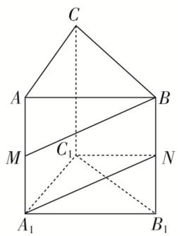

6. 如图，四边形 $ABCD$ 为矩形，平面 $PCD \perp$ 平面 $ABCD$ ，且 $PC = PD = CD = 2$ ， $BC = 2\sqrt{2}$ ， $O$ ， $M$ 分别为 $CD$ ， $BC$ 的中点，则异面直线 $OM$ 与 $PD$ 所成的角的余弦值为（）

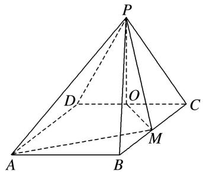

A. $\frac{\sqrt{6}}{4}$

B. $\frac{\sqrt{6}}{3}$

C. $\frac{\sqrt{3}}{6}$

D. $\frac{\sqrt{3}}{3}$

6. 答案 C 解析 连接 BD, OB, 则 OM//DB, ∴∠PDB 或其补角为异面直线 OM 与 PD 所成的角.

由已知条件可知 $PO \perp$ 平面ABCD， $OB = 3$ ， $PO = \sqrt{3}$ ， $BD = 2\sqrt{3}$ ， $PB = 2\sqrt{3}$ ，在 $\triangle PBD$ 中，由余弦定理可得 $\cos \angle PDB = \frac{PD^2 + BD^2 - PB^2}{2PD \cdot BD} = \frac{4 + 12 - 12}{2 \cdot 2 \cdot 2\sqrt{3}} = \frac{\sqrt{3}}{6}$ .

7. 点 $E, F$ 分别是三棱锥 $P - ABC$ 的棱 $AP, BC$ 的中点， $AB = 6, PC = 8, EF = 5$ ，则异面直线 $AB$ 与 $PC$ 所成的角为（）

A. $90^{\circ}$

B. $45^{\circ}$

C. $30^{\circ}$

D. $60^{\circ}$

7. 答案 A 解析 如图，取 $PB$ 的中点 $G$ ，连接 $EG, FG$ ，则 $EG = \frac{1}{2} AB, GF = \frac{1}{2} PC, EG // AB, GF // PC,$ 则 $\angle EGF$ （或其补角）即为 $AB$ 与 $PC$ 所成的角，在 $\triangle EFG$ 中， $EG = \frac{1}{2} AB = 3, FG = \frac{1}{2} PC = 4, EF = 5, EG^2 + FG^2 = EF^2$ ，所以 $\angle EGF = 90^{\circ}$

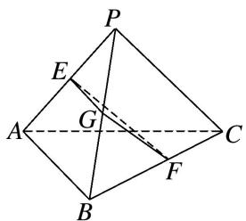

8. 已知在四面体 $ABCD$ 中, $E$ , $F$ 分别是 $AC$ , $BD$ 的中点, 若 $AB = 2$ , $CD = 4$ , $EF \perp AB$ , 则 $EF$ 与 $CD$ 所成的角的大小为( )

A. $90^{\circ}$

B. $45^{\circ}$

C. $60^{\circ}$

D. $30^{\circ}$

8. 答案 D 解析 设 G 为 AD 的中点，连接 GF, GE,

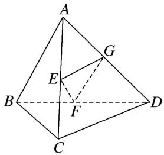
则 $GF$ ， $GE$ 分别为 $\triangle ABD$ ， $\triangle ACD$ 的中位线．由此可得 $GF \parallel AB$ ，且 $GF = \frac{1}{2} AB = 1$ ， $GE \parallel CD$ ，且 $GE = \frac{1}{2} CD = 2$ ， $\therefore \angle FEG$ 或其补角即为 $EF$ 与 $CD$ 所成的角．又 $EF \perp AB$ ， $GF \parallel AB$ ， $\therefore EF \perp GF$ ．因此，在 Rt $\triangle EFG$ 中， $GF = 1$ ， $GE = 2$ ， $\therefore \sin \angle GEF = \frac{GF}{GE} = \frac{1}{2}$ ，又 $\angle GEF$ 为锐角， $\therefore \angle GEF = 30^\circ$ ． $\therefore EF$ 与 $CD$ 所成的角的大小为 $30^\circ$ ．

9. 在正三棱柱 $ABC - A_{1}B_{1}C_{1}$ 中， $AB = \sqrt{2} BB_{1}$ ，则 $AB_{1}$ 与 $BC_{1}$ 所成角的大小为（）

A. $30^{\circ}$

B. $60^{\circ}$

C. $75^{\circ}$

D. $90^{\circ}$

9. 答案 D 解析 将正三棱柱 $ABC - A_{1}B_{1}C_{1}$ 补为四棱柱 $ABCD - A_{1}B_{1}C_{1}D_{1}$ ，连接 $C_{1}D$ ， $BD$ ，则 $C_{1}D \parallel B_{1}A$ ， $\angle BC_{1}D$ 为所求角或其补角。设 $BB_{1} = \sqrt{2}$ ，则 $BC = CD = 2$ ， $\angle BCD = 120^{\circ}$ ， $BD = 2\sqrt{3}$ ，又因为 $BC_{1} = C_{1}D = \sqrt{6}$ ，所以 $\angle BC_{1}D = 90^{\circ}$ 。

10. 如图所示，在四棱锥 $P$ ABCD 中， $\angle ABC = \angle BAD = 90^\circ$ ， $BC = 2AD$ ， $\triangle PAB$ 和 $\triangle PAD$ 都是等边三角形，则异面直线 $CD$ 与 $PB$ 所成角的大小为 \_\_\_\_.

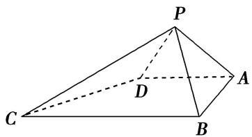

10. 答案 $90^{\circ}$ 解析 如图所示，延长 DA 至 E，使 AE=DA，连接 PE，BE.

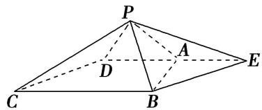
$\because \angle ABC = \angle BAD = 90^{\circ}, BC = 2AD, \therefore DE = BC, DE // BC.$ 四边形 $CBED$ 为平行四边形， $\therefore CD // BE.$ $\therefore \angle PBE$ 就是异面直线 $CD$ 与 $PB$ 所成的角．在 $\triangle PAE$ 中， $AE = PA, \angle PAE = 120^{\circ}$ ，由余弦定理，得 $PE = \sqrt{PA^{2} + AE^{2} - 2PA \cdot AE \cos \angle PAE} = \sqrt{AE^{2} + AE^{2} - 2AE \cdot AE \cdot \left(-\frac{1}{2}\right)} = \sqrt{3}AE.$ 在 $\triangle ABE$ 中， $AE = AB, \angle BAE = 90^{\circ}, \therefore BE = \sqrt{2}AE.$ $\because \triangle PAB$ 是等边三角形， $\therefore PB = AB = AE, \therefore PB^{2} + BE^{2} = AE^{2} + 2AE^{2} = 3AE^{2} = PE^{2}, \therefore \angle PBE = 90^{\circ}.$

# 考点二 直线与平面所成的角

【方法总结】

# 求直线与平面所成角的方法

求直线与平面所成角的关键是寻找过直线上一点与平面垂直的垂线、垂足与斜足的连线即为直线在平面内的射影，直线与直线在平面内射影所成的角即为线面角．然后转化为解三角形问题，进而求解.

# 【例题选讲】

[例 2]（1）已知三棱柱 $ABC-A_{1}B_{1}C_{1}$ 的侧棱与底面垂直，体积为 $\frac{9}{4}$ ，底面是边长为 $\sqrt{3}$ 的正三角形．若 P 为底面 $A_{1}B_{1}C_{1}$ 的中心，则 PA 与平面 ABC 所成角的大小为 \_\_\_\_．
答案 $60^{\circ}$ 解析 如图所示，设 $O$ 为 $\triangle ABC$ 的中心，连接 $PO, AO$ ，易知 $PO \perp$ 平面 $ABC$ ，则 $\angle PAO$ 为 $PA$ 与平面 $ABC$ 所成的角。 $S_{\triangle ABC} = \frac{1}{2} \times \sqrt{3} \times \sqrt{3} \times \sin 60^{\circ} = \frac{3\sqrt{3}}{4}, \therefore V_{ABCA_1B_1C_1} = S_{\triangle ABC} \cdot OP = \frac{3\sqrt{3}}{4} \times OP = \frac{9}{4}, \therefore OP = \sqrt{3}$ 。又 $OA = \sqrt{3} \times \frac{\sqrt{3}}{2} \times \frac{2}{3} = 1, \therefore \tan \angle OAP = \frac{OP}{OA} = \sqrt{3}, \therefore \angle OAP = 60^{\circ}$ 。故 $PA$ 与平面 $ABC$ 所成角为 $60^{\circ}$ 。

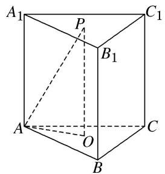  
（2）(2018·全国 I)在长方体 $ABCD-A_{1}B_{1}C_{1}D_{1}$ 中， $AB=BC=2$ ， $AC_{1}$ 与平面 $BB_{1}C_{1}C$ 所成的角为 $30^{\circ}$ ，则该长方体的体积为()

A. 8

B. $6\sqrt{2}$

C. $8\sqrt{2}$

D. $8 \sqrt{3}$
答案 C 解析 如图, 连接 $AC_{1}, BC_{1}, AC$ . ∵ $AB \perp$ 平面 $BB_{1}C_{1}C$ , ∴ $\angle AC_{1}B$ 为直线 $AC_{1}$ 与平面 $BB_{1}C_{1}C$ 所成的角, ∴ $\angle AC_{1}B = 30^{\circ}$ . 又 AB = BC = 2, 在 Rt△ABC₁ 中, $AC_{1} = \frac{2}{\sin 30^{\circ}} = 4$ . 在 Rt△ACC₁ 中, $CC_{1} = \sqrt{AC_{1}^{2} - AC^{2}} = \sqrt{4^{2} - (2^{2} + 2^{2})} = 2\sqrt{2}$ , ∴ $V_{长方体} = AB \times BC \times CC_{1} = 2 \times 2 \times 2\sqrt{2} = 8\sqrt{2}$ .

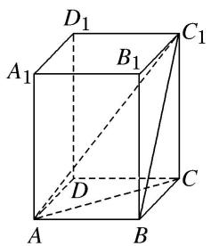

# 【对点训练】

1. 在正三棱柱 $ABC - A_{1}B_{1}C_{1}$ 中， $AB = 1$ ，点 $D$ 在棱 $BB_{1}$ 上，且 $BD = 1$ ，则 $AD$ 与平面 $AA_{1}C_{1}C$ 所成角的正弦值为（）

A. $\frac{\sqrt{10}}{4}$

B. $\frac{\sqrt{6}}{4}$

C. $\frac{\sqrt{10}}{5}$

D. $\frac{\sqrt{6}}{5}$

1. 答案 B 解析 如图，取 $AC, A_{1}C_{1}$ 的中点分别为 $M, M_{1}$ ，连接 $MM_{1}, BM$ ，过点 $D$ 作 $DN \parallel BM$ 交 $MM_{1}$ 于点 $N$ ，则易证 $DN \perp$ 平面 $AA_{1}C_{1}C$ ，连接 $AN$ ，则 $\angle DAN$ 为 $AD$ 与平面 $AA_{1}C_{1}C$ 所成的角。在 Rt $\triangle DNA$ 中， $\sin \angle DAN = \frac{DN}{AD} = \frac{\frac{\sqrt{3}}{2}}{\sqrt{2}} = \frac{\sqrt{6}}{4}$ 。

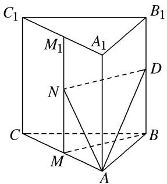

2. 如图, 正四棱锥 $P - ABCD$ 的体积为 2 , 底面积为 6 , $E$ 为侧棱 $PC$ 的中点, 则直线 $BE$ 与平面 $PAC$ 所成的角为 ( )

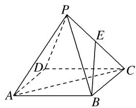

A. $60^{\circ}$

B. $30^{\circ}$

C. $45^{\circ}$

D. $90^{\circ}$

2. 答案 A 解析 如图，在正四棱锥 P-ABCD 中，根据底面积为 6 可得， $BC=\sqrt{6}$ 。连接 BD 交 AC 于点 O，连接 PO，则 PO 为正四棱锥 P-ABCD 的高，根据体积公式可得，PO=1。因为 $PO \perp$ 底面 ABCD，所以 $PO \perp BD$ ，又 $BD \perp AC$ ， $PO \cap AC = O$ ，所以 $BD \perp$ 平面 PAC，连接 EO，则 $\angle BEO$ 为直线 BE 与平面 PAC 所成的角。在 Rt△POA 中，因为 PO=1， $OA=\sqrt{3}$ ，所以 PA=2， $OE=\frac{1}{2}PA=1$ ，在 Rt△BOE 中，因为 $BO=\sqrt{3}$ ，所以 $\tan\angle BEO=\frac{BO}{OE}=\sqrt{3}$ ，即 $\angle BEO=60^{\circ}$ 。故直线 BE 与平面 PAC 所成角为 $60^{\circ}$ 。

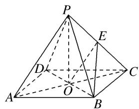

3. 已知正方体 $ABCD - A_{1}B_{1}C_{1}D_{1}$ 的体积为 $16\sqrt{2}$ ，点 $P$ 在正方形 $A_{1}B_{1}C_{1}D_{1}$ 上且 $A_{1}$ ， $C$ 到 $P$ 的距离分别为 2， $2\sqrt{3}$ ，则直线 $CP$ 与平面 $BDD_{1}B_{1}$ 所成角的正切值为（）

A. $\frac{\sqrt{2}}{2}$

B. $\frac{\sqrt{3}}{3}$

C. $\frac{1}{2}$

D. $\frac{1}{3}$

3. 答案 A 解析 易知 $AB = 2\sqrt{2}$ ，连接 $C_1P$ ，在 Rt△CC₁P 中，可计算 $C_1P = \sqrt{CP^2 - CC_1^2} = 2$ ，又 $A_1P = 2$ ， $A_1C_1 = 4$ ，所以 $P$ 是 $A_1C_1$ 的中点，连接 $AC$ 与 $BD$ 交于点 $O$ ，易证 $AC \perp$ 平面 BDD₁B₁，直线 CP 在平面 BDD₁B₁ 内的射影是 OP，所以 ∠CPO 就是直线 CP 与平面 BDD₁B₁ 所成的角，在 Rt△CPO 中，tan ∠CPO = $\frac{CO}{PO} = \frac{\sqrt{2}}{2}$ .

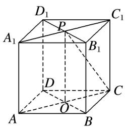

4. 在正方体 $ABCD - A_{1}B_{1}C_{1}D_{1}$ 中， $E$ 为棱 $CD$ 上的一点，且 $CE = 2DE$ ， $F$ 为棱 $AA_{1}$ 的中点，且平面 $BEF$

与 $DD_{1}$ 交于点 G，则 $B_{1}G$ 与平面 ABCD 所成角的正切值为()

A. $\frac{\sqrt{2}}{12}$

B. $\frac{\sqrt{2}}{6}$

C. $\frac{5\sqrt{2}}{12}$

D. $\frac{5\sqrt{2}}{6}$

4. 答案 C 解析 因为平面 $ABCD \parallel$ 平面 $A_{1}B_{1}C_{1}D_{1}$ ，所以 $B_{1}G$ 与平面 $ABCD$ 所成角即为 $B_{1}G$ 与平面 $A_{1}B_{1}C_{1}D_{1}$ 所成角，易知 $B_{1}G$ 与平面 $A_{1}B_{1}C_{1}D_{1}$ 所成角为 $\angle D_{1}B_{1}G$ 。设 $AB = 6$ ，则 $AF = 3$ ， $DE = 2$ ，平面 $BEF \cap$ 平面 $CDD_{1}C_{1} = GE$ 且 $BF \parallel$ 平面 $CDD_{1}C_{1}$ ，可知 $BF \parallel GE$ ，易得 $\triangle FAB \sim \triangle GDE$ ，则 $\frac{AF}{AB} = \frac{DG}{DE}$ ，即 $\frac{3}{6} = \frac{DG}{2} \Rightarrow DG = 1$ ， $D_{1}G = 5$ ，在 Rt $\triangle B_{1}D_{1}G$ 中， $\tan \angle D_{1}B_{1}G = \frac{D_{1}G}{B_{1}D_{1}} = \frac{5}{6\sqrt{2}} = \frac{5\sqrt{2}}{12}$ ，故 $B_{1}G$ 与平面 $ABCD$ 所成角的正切值为 $\frac{5\sqrt{2}}{12}$ ，故选 C.

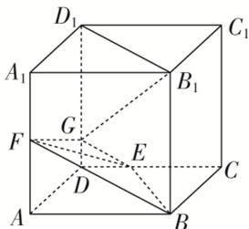

5. 如图, 在正方体 $ABCD—A_{1}B_{1}C_{1}D_{1}$ 中, $E$ , $F$ , $G$ , $H$ 分别为棱 $AA_{1}$ , $B_{1}C_{1}$ , $C_{1}D_{1}$ , $DD_{1}$ 的中点, 则 $GH$ 与平面 $EFH$ 所成的角的余弦值为 \_\_\_\_.

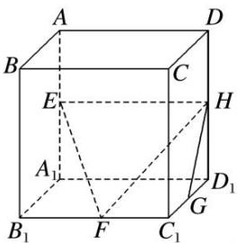

5. 答案 $\frac{3\sqrt{10}}{10}$ 解析 连接 $B_{1}E, HC_{1}$ , 平面 $EFH$ 即平面 $B_{1}C_{1}HE$ .

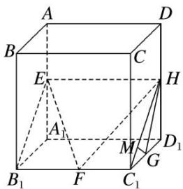
在正方体 $AC_{1}$ 中， $B_{1}C_{1}\perp$ 平面 $CDD_{1}C_{1}$ ，故平面 $B_{1}C_{1}HE\perp$ 平面 $CDD_{1}C_{1}$ ，过点 G 作 $GM\perp C_{1}H$ 于 M，则 $GM\perp$ 平面 $B_{1}C_{1}HE$ ，则 $\angle C_{1}HG$ 即为 GH 与平面 EFH 所成的角，设正方体棱长为 2，则 $GH=\sqrt{2}$ ， $C_{1}G=1$ ， $C_{1}H=\sqrt{5}$ ， $\therefore\cos\angle C_{1}HG=\frac{C_{1}H^{2}+GH^{2}-C_{1}G^{2}}{2C_{1}H\cdot GH}=\frac{5+2-1}{2\times\sqrt{5}\times\sqrt{2}}=\frac{3\sqrt{10}}{10}$ .

6. 在正三棱柱 $ABC - A_{1}B_{1}C_{1}$ 中， $AB = 4$ ，点 $D$ 在棱 $BB_{1}$ 上，若 $BD = 3$ ，则 $AD$ 与平面 $AA_{1}C_{1}C$ 所成角的正切值为（）

A. $\frac{2\sqrt{3}}{5}$

B. $\frac{2\sqrt{39}}{13}$

C. $\frac{5}{4}$

D. $\frac{4}{3}$

6. 答案 B 解析 如图，取 AC 的中点 E，连接 BE，可得 $\cdot=(+) \cdot = \cdot = 4 \times 2\sqrt{3} \times \frac{\sqrt{3}}{2}=$
$12 = 5 \times 2\sqrt{3} \times \cos \theta$ ( $\theta$ 为与的夹角)，所以 $\cos \theta = \frac{2\sqrt{3}}{5}$ ， $\sin \theta = \frac{\sqrt{13}}{5}$ ，又因为 $BE \perp$ 平面 $AA_{1}C_{1}C$ ，所以所求角即为 $\frac{\pi}{2} - \theta$ ，所以 $\tan \left(\frac{\pi}{2} - \theta\right) = \frac{\sin \left(\frac{\pi}{2} - \theta\right)}{\cos \left(\frac{\pi}{2} - \theta\right)} = \frac{\cos \theta}{\sin \theta} = \frac{2\sqrt{39}}{13}$ .

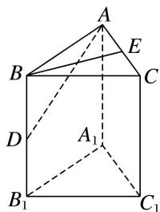

7. 已知 $E$ ， $F$ 分别是正方体 $ABCD - A_1B_1C_1D_1$ 的棱 $BB_1$ ， $AD$ 的中点，则直线 $EF$ 和平面 $BDD_1B_1$ 所成的角的正弦值是（）

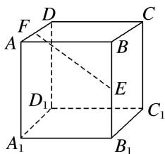

A. $\frac{\sqrt{2}}{6}$

B. $\frac{\sqrt{3}}{6}$

C. $\frac{1}{3}$

D. $\frac{\sqrt{6}}{6}$

7. 答案 B 解析 连接 AE, BD, 过点 F 作 $FH \perp BD$ 交 BD 于 H, 连接 EH, 则 $FH \perp$ 平面 $BDD_{1}B_{1}$ ,

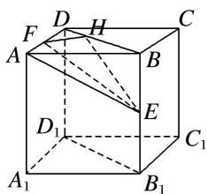
∴ $\angle FEH$ 是直线 EF 和平面 $BDD_{1}B_{1}$ 所成的角．设正方体 $ABCD-A_{1}B_{1}C_{1}D_{1}$ 的棱长为 2，∵ E，F 分别是棱 $BB_{1}$ ，AD 的中点，∴ 在 Rt△DFH 中， $DF=1,\quad\angle FDH=45^{\circ}$ ，可得 $FH=\frac{\sqrt{2}}{2}DF=\frac{\sqrt{2}}{2}$ ．在 Rt△AEF 中，AF=1， $AE=\sqrt{AB^{2}+BE^{2}}=\sqrt{5}$ ，可得 $EF=\sqrt{AF^{2}+AE^{2}}=\sqrt{6}$ ．在 Rt△EFH 中， $\sin\angle FEH=\frac{FH}{EF}=\frac{\sqrt{3}}{6}$ ，∴ 直线 EF 和平面 $BDD_{1}B_{1}$ 所成的角的正弦值是 $\frac{\sqrt{3}}{6}$ .

8. 如图, 在三棱锥 $S - ABC$ 中, 若 $AC = 2\sqrt{3}$ , $SA = SB = SC = AB = BC = 4$ , $E$ 为棱 $SC$ 的中点, 则直线 $AC$ 与 $BE$ 所成角的余弦值为 $\underline{\quad}$ , 直线 $AC$ 与平面 $SAB$ 所成的角为 $\underline{\quad}$ .

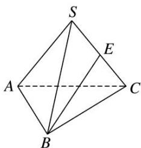

8. 答案 $\frac{1}{4} 60^{\circ}$ 解析 取 $SA$ 的中点 $M$ , 连接 $ME, BM$ , 则直线 $AC$ 与 $BE$ 所成的角等于直线 $ME$ 与 $BE$ 所成的角, 因为 $ME = \sqrt{3}$ , $BM = BE = 2\sqrt{3}$ , $\cos \angle MEB = \frac{3 + 12 - 12}{2 \times \sqrt{3} \times 2\sqrt{3}} = \frac{1}{4}$ , 所以直线 $AC$ 与 $BE$ 所成角的余弦值为 $\frac{1}{4}$ . 取 $SB$ 的中点 $N$ , 连接 $AN, CN$ , 则 $AN \perp SB$ , $CN \perp SB \Rightarrow SB \perp$ 平面 $ACN \Rightarrow$ 平面 $SAB \perp$ 平面 $ACN$ , 因此直线 $AC$ 与平面 $SAB$ 所成的角为 $\angle CAN$ , 因为 $AN = CN = AC = 2\sqrt{3}$ , 所以 $\angle CAN = 60^{\circ}$ , 因此直线 $AC$ 与平面 $SAB$ 所成的角为 $60^{\circ}$ .

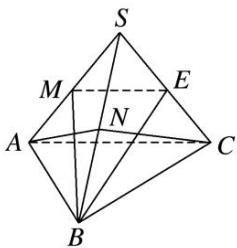

9. (2018·全国 II)已知圆锥的顶点为 $S$ ，母线 $SA$ ， $SB$ 所成角的余弦值为 $\frac{7}{8}$ ， $SA$ 与圆锥底面所成角为 $45^\circ$ ，若 $\triangle SAB$ 的面积为 $5\sqrt{15}$ ，则该圆锥的侧面积为 \_\_\_\_.

9. 解析：如图，∵SA与圆锥底面所成角为 $45^{\circ}$ ，∴△SAO为等腰直角三角形．设OA=r，则SO=r，SA=SB= $\sqrt{2}r$ . 在△SAB中， $\cos\angle ASB=\frac{7}{8}$ ，∴ $\sin\angle ASB=\frac{\sqrt{15}}{8}$ ，∴ $S_{\triangle SAB}=\frac{1}{2}SA\cdot SB\cdot\sin\angle ASB=\frac{1}{2}\times(\sqrt{2}r)^{2}\times\frac{\sqrt{15}}{8}=5\sqrt{15}$ ，解得 $r=2\sqrt{10}$ ，∴SA= $\sqrt{2}r=4\sqrt{5}$ ，即母线长 $l=4\sqrt{5}$ ，∴ $S_{圆锥侧}=\pi rl=\pi\times2\sqrt{10}\times4\sqrt{5}=40\sqrt{2}\pi$ .
答案： $40\sqrt{2}\pi$

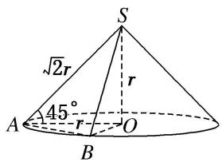

10. 如图, 设 $E$ , $F$ 分别是正方形 $ABCD$ 中 $CD$ , $AB$ 边的中点, 将 $\triangle ADC$ 沿对角线 $AC$ 对折, 使得直线 $EF$ 与 $AC$ 异面, 记直线 $EF$ 与平面 $ABC$ 所成的角为 $\alpha$ , 与异面直线 $AC$ 所成的角为 $\beta$ , 则当 $\tan \beta = \frac{1}{2}$ 时, $\tan \alpha$ 等于( )

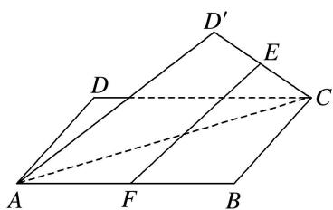

A. $\frac{3\sqrt{5}}{16}$

B. $\frac{\sqrt{5}}{5}$

C. $\frac{\sqrt{51}}{17}$

D. $\frac{\sqrt{57}}{19}$

10. 答案 C 解析 分别连接 BD 交 AC 于点 O，连接 D'O。因为 $AD' = CD'$ ，所以 $D'O \perp AC$ ，又因为 $AC \perp BD$ ， $BD \cap D'O = O$ ，所以 $AC \perp$ 平面 $BDD'$ ，又 $BD' \subset$ 平面 $BDD'$ ，所以 $AC \perp BD'$ 。取 BC 的中点 S，连接 FS，ES，则 $FS \parallel AC$ ， $ES \parallel BD'$ ，所以 $FS \perp ES$ ，又因为 $\angle EFS$ 为异面直线 AC 与 EF 所成的角，所以 $\tan \beta = \frac{ES}{FS} = \frac{1}{2}$ ，设 ES = 1，则 FS = 2，AC = 4，取 CO 的中点 G，连接 EG，SG，则 EG = SG = 1，所以 $\triangle EGS$ 为等边三角形，过点 E 作 $EH \perp GS$ ，由上可知 $AC \perp EG$ ， $AC \perp SG$ 且 $EG \cap SG = G$ ，则 $AC \perp$ 平面 EGS. 又 $EH \subset$ 平面 EGS，所以 $EH \perp AC$ ，又 $GS \cap AC = G$ ，所以 $EH \perp$ 平面 ABCD，所以 $\angle EFH$ 为 EF 与平面 ABCD 所成的角，因为 $EH = \frac{\sqrt{3}}{2}$ ， $FH = \sqrt{4 + \frac{1}{4}} = \frac{\sqrt{17}}{2}$ ，所以 $\tan \angle EFH = \frac{EH}{FH} = \frac{\sqrt{51}}{17}$ ，故选 C.

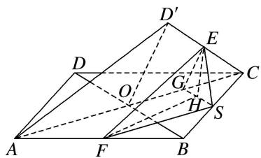

# 考点三 二面角

# 【方法总结】

# 求二面角的方法

求二面角是常见题型，根据所求两面是否有公共棱可分为两类：有棱二面角、无棱二面角，对于前者的二面角通常采用定义法或三垂线法等手段来定位出二面角的平面角，转化为解三角形问题，进而求解；而对于无棱二面角，一般通过延展平面找到棱使其转化为有棱二面角。或用面积射影定理(若多边形的面积为 $S$ ，它在一个平面内的射影图形的面积为 $S'$ ，且多边形与该平面所成的二面角为 $\theta$ ，则 $\cos \theta = \frac{S'}{S}$ 。)去解决(如例3(5)).

# 【例题选讲】

[例 3]（1）如图，在三棱锥 V-ABC 中，VA=AB=VB=AC=BC=2， $VC=\sqrt{3}$ ，则二面角 V-AB-C 的大小为 \_\_\_\_.

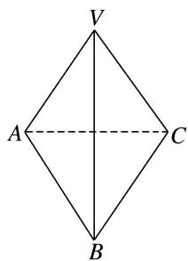
答案 $60^{\circ}$ 解析 取 AB 的中点 D，连接 VD，CD，

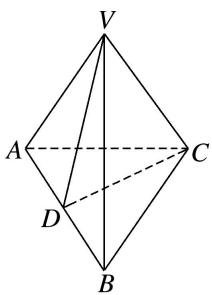
∵△VAB中，VA=VB=AB=2，∴△VAB为等边三角形，∴VD⊥AB且 $VD=\sqrt{3}$ ，同理 $CD\perp AB$ ， $CD=\sqrt{3}$ ，∴∠VDC为二面角V-AB-C的平面角，

而 $\triangle VDC$ 是等边三角形， $\angle VDC=60^{\circ}$ ，∴二面角V-AB-C的大小为 $60^{\circ}$ .  
（2）二面角 $\alpha - l - \beta$ 的大小为 $60^{\circ}$ , $A$ , $B$ 分别在两个面内且 $A$ 和 $B$ 到棱的距离为 2 和 4, 且 $AB = 10$ , 则 $AB$ 与棱 $l$ 所成角的正弦值为 \_\_\_\_.
答案 $\frac{\sqrt{3}}{5}$ 解析 如图，作 $AC \perp l, BD \perp l, C, D$ 为垂足，

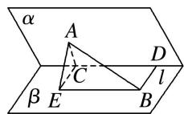
则 AC=2, BD=4, AB=10. 在 $\beta$ 内过 C 作 CE//DB，且 CE=DB，连接 BE, AE,
∴四边形 CEBD 为平行四边形，∴BE∥l，∴∠ABE 为 AB 与棱 l 所成的角，
∵ BD // CE, ∴ l⊥AC, l⊥CE, ∴ ∠ACE 为 α-l-β 的平面角,
$\therefore \angle A C E = 6 0 ^ {\circ}, A C = 2, B D = 4, \therefore A E = \sqrt {2 ^ {2} + 4 ^ {2} - 2 \times 2 \times 4 \times \frac {1}{2}} = 2 \sqrt {3}.$
又 $BE \parallel l, l \perp$ 平面 $ACE, \therefore BE \perp AE, \therefore \sin \angle ABE = \frac{AE}{AB} = \frac{2\sqrt{3}}{10} = \frac{\sqrt{3}}{5}$ .  
（3）在矩形ABCD中， $AB = 3,AD = 4,PA\bot$ 平面ABCD， $PA = \frac{4\sqrt{3}}{5}$ ，那么二面角 $A - BD - P$ 的大小为（

A. $30^{\circ}$

B. $45^{\circ}$

C. $60^{\circ}$

D. $75^{\circ}$
答案 A 解析 作 $AO \perp BD$ 交 $BD$ 于点 $O$ , $\because PA \perp$ 平面 $ABCD$ , $\therefore PA \perp BD$ . $\because PA \cap AO = A$ , $\therefore BD \perp$ 平面 $PAO$ , $\therefore PO \perp BD$ , $\therefore \angle AOP$ 即为所求二面角 $A - BD - P$ 的大小. $\because AO = \frac{AB \cdot AD}{BD} = \frac{12}{5}$ , $\therefore \tan \angle AOP = \frac{AP}{AO} = \frac{\sqrt{3}}{3}$ , 故二面角 $A - BD - P$ 的大小为 $30^\circ$ .

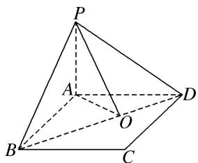  
（4）如图, 平面 $\beta$ 内一条直线 $AC$ , $AC$ 与平面 $\alpha$ 所成的角为 $30^{\circ}$ , $AC$ 与棱 $BD$ 所成的角为 $45^{\circ}$ , 则平面 $\alpha$ 与平面 $\beta$ 所成的角的大小为 \_\_\_\_.

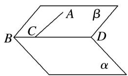
答案 $45^{\circ}$ 解析 如图，过 A 作 $AF \perp BD$ ，F 为垂足，作 $AE \perp$ 平面 $\alpha$ ，E 为垂足，连接 EF，CE，

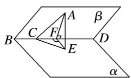
∴由三垂线定理知 $BD \perp EF$ ，∴ $\angle AFE$ 为平面 $\alpha$ 与平面 $\beta$ 所成的角．依题意 $\angle ACF = 45^{\circ}$ ， $\angle ACE = 30^{\circ}$ ，设 AC=2，∴ $AF=CF=\sqrt{2}$ ，AE=1，∴ $\sin\angle AFE=\frac{AE}{AF}=\frac{1}{\sqrt{2}}=\frac{\sqrt{2}}{2}$ ，∴ $AFE=45^{\circ}$ 。∴ 平面 $\alpha$ 与平面 $\beta$ 所成的角为 $45^{\circ}$ 。  
（5）在四棱锥 $P - ABCD$ 中, 四边形 $ABCD$ 为正方形, $PA \perp$ 平面 $ABCD$ , $PA = AB = a$ , 则平面 $PBA$ 与平面 $PDC$ 所成二面角的大小为 \_\_\_\_.
解析 如图，∵PA⊥平面ABCD，AD⊂平面ABCD，∴PA⊥AD，又AD⊥AB，且 $PA\cap AB=A$ ，
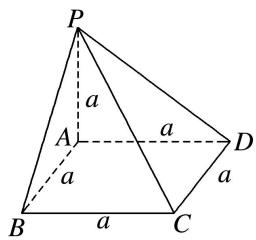
$PA, AB \subset$ 平面 $PAB$ , $\therefore AD \perp$ 平面 $PAB$ , 同理 $BC \perp$ 平面 $PAB$ . $\therefore \triangle PCD$ 在平面 $PBA$ 上的射影为 $\triangle PAB$ , 设平面 $PBA$ 与平面 $PCD$ 所成二面角为 $\theta$ , $\therefore \cos \theta = \frac{S_{\triangle PAB}}{S_{\triangle PCD}} = \frac{\frac{1}{2} a^2}{\frac{1}{2} \times a \times \sqrt{2} a} = \frac{\sqrt{2}}{2}$ , $\therefore \theta = 45^\circ$ . 故平面 $PBA$ 与平面 $PCD$ 所成二面角的大小为 $45^\circ$ .

# 【对点训练】

1. 从空间一点 $P$ 向二面角 $\alpha - l - \beta$ 的两个面 $\alpha, \beta$ 分别作垂线 $PE, PF, E, F$ 为垂足，若 $\angle EPF = 60^{\circ}$ ，则二面角 $\alpha - l - \beta$ 的平面角的大小是（）

A. $60^{\circ}$

B. $120^{\circ}$

C. $60^{\circ}$ 或 $120^{\circ}$

D. 不确定

1. 答案 C 解析 如图所示，过 PE, PF 作一个平面 $\gamma$ 与二面角 $\alpha - l - \beta$ 的棱交于点 O，连接 OE, OF.

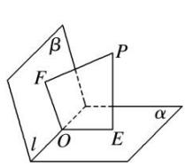

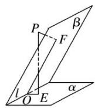
因为 $PE \perp \alpha$ ， $PF \perp \beta$ ，所以 $PE \perp l$ ， $PF \perp l$ ，所以 $l \perp$ 平面 $\gamma$ ，所以 $l \perp OE$ ， $l \perp OF$ ，则 $\angle EOF$ 为 $\alpha - l - \beta$ 的平面角，且它与 $\angle EPF$ 相等或互补，故二面角 $\alpha - l - \beta$ 的平面角的大小为 $60^{\circ}$ 或 $120^{\circ}$ ，故选 C.

2. 如图所示, 已知三棱锥 $A - BCD$ 的各棱长均为 2 , 则二面角 $A - CD - B$ 的平面角的余弦值为

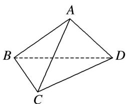

2. 答案 $\frac{1}{3}$ 解析 如图，取 CD 的中点 M，连接 AM，BM，则 $AM \perp CD$ ， $BM \perp CD$ 。由二面角的定义可知 $\angle AMB$ 为二面角 $A - CD - B$ 的平面角。设点 $H$ 是 $\triangle BCD$ 的中心，连接 $AH$ ，则 $AH \perp$ 平面 $BCD$ ，且点 $H$ 在线段 $BM$ 上。在 Rt $\triangle AMH$ 中， $AM = \frac{\sqrt{3}}{2} \times 2 = \sqrt{3}$ ， $HM = \frac{\sqrt{3}}{2} \times 2 \times \frac{1}{3} = \frac{\sqrt{3}}{3}$ ，则 $\cos \angle AMB = \frac{\sqrt{3}}{\sqrt{3}} = \frac{1}{3}$ ，即所求二面角的平面角的余弦值为 $\frac{1}{3}$ 。

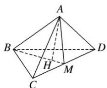

3. 已知二面角的棱上有 $A, B$ 两点，直线 $AC, BD$ 分别在这个二面角的两个半平面内，且都垂直于 $AB$ ，已知 $AB = 4, AC = 6, BD = 8, CD = 2\sqrt{17}$ ，则该二面角的大小为（）

A. $150^{\circ}$

B. $45^{\circ}$

C. $120^{\circ}$

D. $60^{\circ}$

3. 答案 D 解析 如图， $AC \perp AB$ ， $BD \perp AB$ ，过 A 在平面 ABD 内作 $AE \parallel BD$ ，过 D 作 $DE \parallel AB$ ，连接 CE，所以 DE = AB 且 $DE \perp$ 平面 AEC， $\angle CAE$ 即二面角的平面角。在 Rt△DEC 中， $CD = 2\sqrt{17}$ ，DE = 4，则 $CE = 2\sqrt{13}$ ，在 △ACE 中，由余弦定理可得 $\cos \angle CAE = \frac{CA^{2} + AE^{2} - CE^{2}}{2CA \times AE} = \frac{1}{2}$ ，所以 $\angle CAE = 60^{\circ}$ ，即所求二面角的大小为 $60^{\circ}$ 。

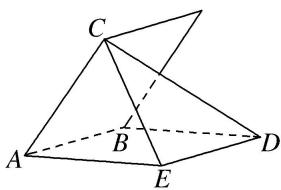

4. 已知正四棱锥的体积为 12，底面对角线的长为 $2 \sqrt{6}$ ，则侧面与底面所成的二面角的平面角为 \_\_\_\_.

4. 答案 C 解析 如图，O 为正方形 ABCD 的中心，M 为 BC 的中点，连接 PO, PM, OM, $\angle PMO$ 即为侧面与底面所成二面角的平面角．设底面边长为 a，则 $2a^{2}=(2\sqrt{6})^{2}$ ， $\therefore a=2\sqrt{3}$ ， $\therefore OM=\sqrt{3}$ ．又四棱锥的体积 $V=\frac{1}{3}\times(2\sqrt{3})^{2}\times PO=12$ ， $\therefore PO=3$ ， $\therefore \tan\angle PMO=\frac{3}{\sqrt{3}}=\sqrt{3}$ ， $\therefore \angle PMO=60^{\circ}$ ．故所求二面角为 $60^{\circ}$ .

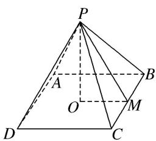

5. 如图, $AB$ 是 $\odot O$ 的直径, $PA$ 垂直于 $\odot O$ 所在平面, $C$ 是圆周上不同于 $A$ , $B$ 两点的任意一点, 且 $AB = 2$ , $PA = BC = \sqrt{3}$ , 则二面角 $A - BC - P$ 的大小为 \_\_\_\_.

5. 答案 $60^{\circ}$ 解析 因为 $AB$ 为 $\odot O$ 的直径, 所以 $AC \perp BC$ , 又因为 $PA \perp$ 平面 $ABC$ , 所以 $PA \perp BC$ , 因为 $AC \cap PA = A$ , 所以 $BC \perp$ 平面 $PAC$ , 所以 $BC \perp PC$ , 所以 $\angle PCA$ 为二面角 $ABCP$ 的平面角. 因为 $\angle ACB = 90^{\circ}$ , $AB = 2$ , $PA = BC = \sqrt{3}$ , 所以 $AC = 1$ , 所以在 Rt $\triangle PAC$ 中, $\tan \angle PCA = \frac{PA}{AC} = \sqrt{3}$ . 所以 $\angle PCA = 60^{\circ}$ . 即所求二面角的大小为 $60^{\circ}$ .

6. 已知 $\triangle ABC$ 中, $\angle C = 90^{\circ}$ , $\tan A = \sqrt{2}$ , $M$ 为 $AB$ 的中点, 现将 $\triangle ACM$ 沿 $CM$ 折起, 得到三棱锥 $P - CBM$ , 如图所示. 则当二面角 $P - CM - B$ 的大小为 $60^{\circ}$ 时, $\frac{AB}{PB} =$ \_\_\_\_.

6. 答案 C 解析 如图，取 BC 的中点 E，连接 AE, EM, PE，设 $AE \cap CM = O$ ，连接 PO，再设 AC = 2，由 $\angle C = 90^{\circ}$ ， $\tan A = \sqrt{2}$ ，可得 $BC = 2\sqrt{2}$ 。在 Rt△MEC 中，可得 $\tan \angle CME = \sqrt{2}$ ，在 Rt△ECA 中，可得 $\tan \angle AEC = \sqrt{2}$ ，∴ $\angle CME + \angle AEM = 90^{\circ}$ ，∴ $AE \perp CM$ ，∴ $PO \perp CM$ ， $EO \perp CM$ ，∠POE 即为二面角 P - CM - B 的平面角，∴ $\angle POE = 60^{\circ}$ 。∵ $AE = \sqrt{2^{2} + (\sqrt{2})^{2}} = \sqrt{6}$ ， $OE = 1 \times \sin \angle CME = \frac{\sqrt{6}}{3}$ ，∴ PO = AO = $\frac{2\sqrt{6}}{3}$ 。在 △POE 中，由余弦定理可得， $PE = \sqrt{\left(\frac{2\sqrt{6}}{3}\right)^{2} + \left(\frac{\sqrt{6}}{3}\right)^{2} - 2 \times \frac{2\sqrt{6}}{3} \times \frac{\sqrt{6}}{3} \times \frac{1}{2}} = \sqrt{2}$ ，∴ $PE^{2} + CE^{2} = PC^{2}$ ，即 $PE \perp BC$ 。又∵ E 为 BC 的中点，∴ PB = PC = 2。在 Rt△ACB 中，易得 $AB = 2\sqrt{3}$ ，∴ $\frac{AB}{PB} = \sqrt{3}$ 。

7. (多选)在正方体 $ABCD-A_{1}B_{1}C_{1}D_{1}$ 中，下列说法正确的是()

A. $A_{1}C_{1} \perp BD$

B. $B_{1} C$ 与 $BD$ 所成的角为 $60^{\circ}$

C. 二面角 $A_{1} - BC - D$ 的平面角为 $45^{\circ}$

D. $AC_{1}$ 与平面ABCD所成的角为 $45^{\circ}$

7. 答案 ABC 解析 $A_{1}C_{1} \perp B_{1}D_{1}$ 且 $B_{1}D_{1} // BD$ , $\therefore A_{1}C_{1} \perp BD$ , $\therefore A$ 正确; $B_{1}C // A_{1}D$ , $B_{1}C$ 与 $BD$ 所成的角即为 $\angle A_{1}DB = 60^{\circ}$ , $\therefore B$ 正确; $\angle A_{1}BA$ 即为二面角 $A_{1} - BC - D$ 的平面角, $\angle A_{1}BA = 45^{\circ}$ , $\therefore C$ 正确; $CC_{1} \perp$ 平面 $ABCD$ , $\therefore \angle C_{1}AC$ 为 $AC_{1}$ 与平面 $ABCD$ 所成的角, $\because CC_{1} \neq AC$ , $\therefore \angle C_{1}AC \neq 45^{\circ}$ , $\therefore D$ 错误.

8. 如图, 矩形 $ABCD$ 中, $AB = 1$ , $BC = 2$ , 点 $E$ 为 $AD$ 的中点, 将 $\triangle ABE$ 沿 $BE$ 折起, 在翻折过程中, 记

点 A 对应的点为 $A'$ ，二面角 $A' - DC - B$ 的平面角的大小为 $\alpha$ ，则当 $\alpha$ 最大时， $\tan\alpha = (\quad)$

A. $\frac{\sqrt{2}}{2}$

B. $\frac{\sqrt{2}}{3}$

C. $\frac{1}{3}$

D. $\frac{1}{2}$

8. 答案 D 解析 如图，取 BC 的中点 F，连接 AF，交 BE 于点 O，则 $AF \perp BE$ ，连接 $OA'$ ， $A'F$ ，则 $OA' = OA = \frac{\sqrt{2}}{2}$ ， $OA' \perp BE$ ， $OF \perp BE$ ，又 $OA' \cap OF = O$ ，所以 $BE \perp$ 平面 $OA'F$ ，又 $BE \subset$ 平面 ABCD，所以平面 $OA'F \perp$ 平面 ABCD。设 $A'$ 在 AF 上的投影为 M，连接 $A'M$ ，设 $\angle A'OM = \beta$ ，则 $A'M = \frac{\sqrt{2}}{2}\sin\beta$ ， $OM = \frac{\sqrt{2}}{2}\cos\beta$ ，过点 M 作 $MN \perp CD$ 交 CD 于点 N，连接 $A'N$ ，则 $\angle A'NM = \alpha$ 。易得 $\alpha \in \begin{pmatrix} 0, & \frac{\pi}{2} \end{pmatrix}$ ， $MN = \frac{3}{2} - \frac{1}{2}\cos\beta$ ，所以当 $\alpha$ 最大时， $\tan\alpha$ 最大， $\tan\alpha = \frac{\frac{\sqrt{2}}{2}\sin\beta}{\frac{3}{2} - \frac{1}{2}\cos\beta} = \frac{\sqrt{2}\sin\beta}{3 - \cos\beta}$ ，令 $\frac{\sqrt{2}\sin\beta}{3 - \cos\beta} = t$ ，所以 $\sqrt{2}\sin\beta = 3t - t\cos\beta$ ，所以 $3t = \sqrt{2}\sin\beta + t\cos\beta = \sqrt{2 + t^2}\sin(\beta + \theta)\left(\text{其中 }\tan\theta = \frac{t}{\sqrt{2}}\right)$ ，所以 $3t \leq \sqrt{2 + t^2}$ ，所以 $t \leq \frac{1}{2}$ ，即 $\tan\alpha \leq \frac{1}{2}$ ，故选 D。

9. 已知在矩形 $ABCD$ 中, $AD = \sqrt{2} AB$ , 沿直线 $BD$ 将 $\triangle ABD$ 折成 $\triangle A'BD$ , 使得点 $A'$ 在平面 $BCD$ 上的射影在 $\triangle BCD$ 内(不含边界), 设二面角 $A' - BD - C$ 的大小为 $\theta$ , 直线 $A'D$ , $A'C$ 与平面 $BCD$ 所成的角分别为 $\alpha$ , $\beta$ , 则( )

A. $\alpha <  \theta <  \beta$

B. $\beta<\theta<\alpha$

C. $\beta < \alpha < \theta$

D. $\alpha<\beta<\theta$

9. 答案 D 解析 如图，∵四边形 ABCD 为矩形，∴ $BA'\perp A'D$ ，当 $A'$ 点在底面上的射影 O 落在 BC 上时，有平面 $A'BC \perp$ 底面 BCD，又 $DC \perp BC$ ，平面 $A'BC \cap$ 平面 BCD = BC，DC ⊆ 平面 BCD，可得 $DC \perp$ 平面 $A'BC$ ，则 $DC \perp BA'$ ，∴ $BA' \perp$ 平面 $A'DC$ ，在 Rt△BA'C 中，设 $BA' = 1$ ，则 $BC = \sqrt{2}$ ，∴ $A'C = 1$ ，说明 O 为 BC 的中点；当 $A'$ 点在底面上的射影 E 落在 BD 上时，可知 $A'E \perp BD$ ，设 $BA' = 1$ ，则 $A'D = \sqrt{2}$ ，∴ $A'E = \frac{\sqrt{6}}{3}$ ， $BE = \frac{\sqrt{3}}{3}$ 。要使点 $A'$ 在平面 BCD 上的射影 F 在 △BCD 内（不含边界），则点 $A'$ 的射影 F 落在线段 OE 上（不含端点）。可知 ∠A'EF 为二面角 $A' - BD - C$ 的平面角 $\theta$ ，直线 $A'D$ 与平面 BCD 所成的角为 ∠A'DF = $\alpha$ ，直线 $A'C$ 与平面 BCD 所成的角为 ∠A'CF = $\beta$ ，可求得 DF > CF，∴ $A'C < A'D$ ，且 $A'E = \frac{\sqrt{6}}{3} < 1$ ，而 $A'C$ 的最小值为 1，∴ sin ∠A'DF < sin ∠A'CF < sin ∠A'EO，则 $\alpha < \beta < \theta$ 。

10. 如图, 在三棱锥 $S - ABC$ 中, $SA \perp$ 底面 $ABC$ , $AB \perp BC$ , $DE$ 垂直平分 $SC$ 且分别交 $AC$ , $SC$ 于点 $D$ , $E$ , 又 $SA = AB$ , $SB = BC$ , 则二面角 $E - BD - C$ 的大小为 \_\_\_\_.

10. 答案 $60^{\circ}$ 解析 $\because SB=BC$ 且 E 是 SC 的中点， $\therefore BE$ 是等腰三角形 SBC 底边 SC 的中线， $\therefore SC \perp BE$ 。又已知 $SC \perp DE, BE \cap DE = E, BE, DE \subset$ 平面 BDE， $\therefore SC \perp$ 平面 BDE， $\therefore SC \perp BD$ 。又 $SA \perp$ 平面 ABC， $BD \subset$ 平面 ABC， $\therefore SA \perp BD$ ，而 $SC \cap SA = S, SC, SA \subset$ 平面 SAC， $\therefore BD \perp$ 平面 SAC。 $\because$ 平面 $SAC \cap$ 平面 BDE = DE，平面 $SAC \cap$ 平面 BDC = DC， $\therefore BD \perp DE, BD \perp DC,$ $\therefore \angle EDC$ 是所求二面角的平面角。 $\because SA \perp$ 底面 ABC， $\therefore SA \perp AB, SA \perp AC.$ 设 SA = 2，则 AB = 2，BC = $SB = 2\sqrt{2}$ 。 $\because AB \perp BC, \therefore AC = 2\sqrt{3}, \therefore \angle ACS = 30^{\circ}.$ 又已知 $DE \perp SC, \therefore \angle EDC = 60^{\circ}.$ 即所求的二面角等于 $60^{\circ}.$

