## **专题07　立体几何中空间角的计算**

### **考点一　异面直线所成的角**

【**方法总结**】

求异面直线所成的角的方法

求异面直线所成的角常用方法是平移法，通过作三角形的中位线，平行四边形等进行平移，作出异面直线所成的角，转化为解三角形问题，进而求解．解三角形，求出作出的角．如果求出的角是锐角或直角，则它就是要求的角；如果求出的角是钝角，则它的补角才是要求的角．

**【例题选讲】**

<strong>[例1]</strong>(1)(2018·全国Ⅱ)在正方体<em>ABCD</em>－<em>A</em>1<em>B</em>1<em>C</em>1<em>D</em>1中，<em>E</em>为棱<em>CC</em>1的中点，则异面直线<em>AE</em>与<em>CD</em>所成角的正切值为(　　)

A．　　　　　　　　B．　　　　　　　　C．　　　　　　　　D．

答案　C　解析　如图，连接*BE*，因为*AB*∥*CD*，所以*AE*与*CD*所成的角为∠*EAB*．在Rt△*ABE*中，设*AB*＝2，则*BE*＝，则tan∠*EAB*＝＝，所以异面直线*AE*与*CD*所成角的正切值为．

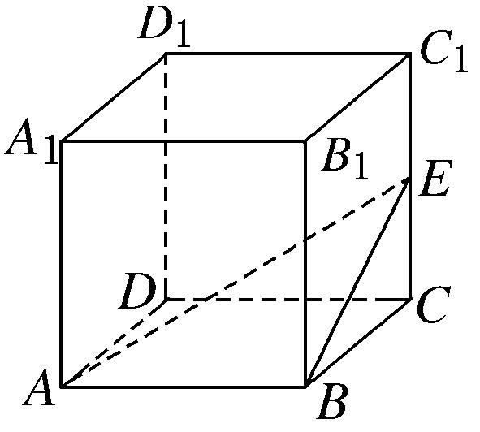

(2)如图，在底面为正方形，侧棱垂直于底面的四棱柱<em>ABCD</em>—<em>A</em>1<em>B</em>1<em>C</em>1<em>D</em>1中，<em>AA</em>1＝2<em>AB</em>＝2，则异面直线<em>A</em>1<em>B</em>与<em>AD</em>1所成角的余弦值为(　　)

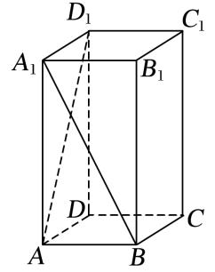

A．　　　　　　　　B．　　　　　　　　C．　　　　　　　　D．

答案　D　解析　连接<em>BC</em>1，易证<em>BC</em>1∥<em>AD</em>1，则∠<em>A</em>1<em>BC</em>1即为异面直线<em>A</em>1<em>B</em>与<em>AD</em>1所成的角．连接<em>A</em>1<em>C</em>1，由<em>AB</em>＝1，<em>AA</em>1＝2，易得<em>A</em>1<em>C</em>1＝，<em>A</em>1<em>B</em>＝<em>BC</em>1＝，故cos∠<em>A</em>1<em>BC</em>1＝＝，即异面直线<em>A</em>1<em>B</em>与<em>AD</em>1所成角的余弦值为．

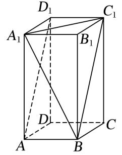

(3)在我国古代数学名著《九章算术》中，将四个面都为直角三角形的四面体称为鳖臑．如图，在鳖臑*ABCD*中，*AB*⊥平面*BCD*，且*AB*＝*BC*＝*CD*，则异面直线*AC*与*BD*所成角的余弦值为(　　)

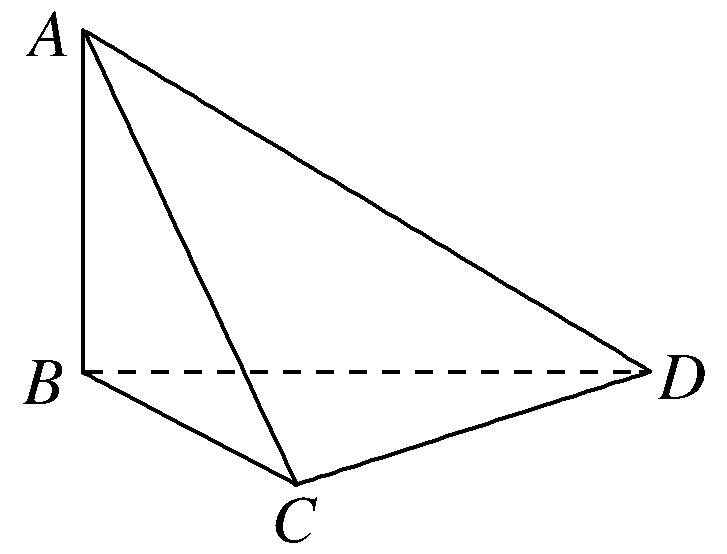

A．　　　　　　　　B．－　　　　　　　　C．　　　　　　　　D．－

答案　A　解析　如图，分别取*AB*，*AD*，*BC*，*BD*的中点*E*，*F*，*G*，*O*，连接*EF*，*EG*，*OG*，*FO*，*FG*，则*EF*∥*BD*，*EG*∥*AC*，所以∠*FEG*为异面直线*AC*与*BD*所成的角．易知*FO*∥*AB*，因为*AB*⊥平面*BCD*，所以*FO*⊥平面*BCD*，所以*FO*⊥*OG*，设*AB*＝2*a*，则*EG*＝*EF*＝*a*，*FG*＝＝*a*，所以∠*FEG*＝60°，所以异面直线*AC*与*BD*所成角的余弦值为，故选A．

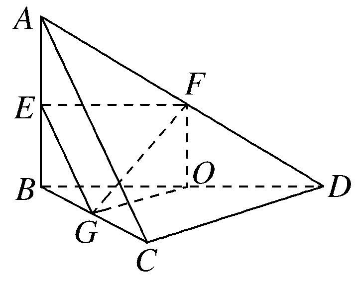

(4)直三棱柱<em>ABC</em>—<em>A</em>1<em>B</em>1<em>C</em>1中，若∠<em>BAC</em>＝90°，<em>AB</em>＝<em>AC</em>＝<em>AA</em>1，则异面直线<em>BA</em>1与<em>AC</em>1所成的角等于(　　)

A．30°　　　　　　　　B．45°　　　　　　　　C．60°　　　　　　　　D．90°

答案　C　解析　如图，延长<em>CA</em>到点<em>D</em>，使得<em>AD</em>＝<em>AC</em>，连接<em>DA</em>1，<em>BD</em>，则四边形<em>ADA</em>1<em>C</em>1为平行四边形，所以∠<em>DA</em>1<em>B</em>就是异面直线<em>BA</em>1与<em>AC</em>1所成的角．又<em>A</em>1<em>D</em>＝<em>A</em>1<em>B</em>＝<em>DB</em>，所以△<em>A</em>1<em>DB</em>为等边三角形，所以∠<em>DA</em>1<em>B</em>＝60°．故选C．

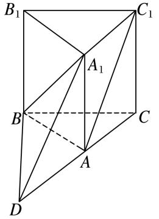

【**对点训练**】

1．如图所示，在正三棱柱<em>ABC</em>—<em>A</em>1<em>B</em>1<em>C</em>1中，<em>D</em>是<em>AC</em>的中点，<em>AA</em>1∶<em>AB</em>＝∶1，则异面直线<em>AB</em>1与<em>BD</em>

所成的角为\_\_\_\_\_\_\_\_．

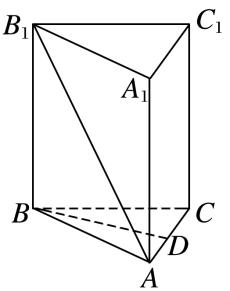

1．答案　60°　解析　取<em>A</em>1<em>C</em>1的中点<em>E</em>，连接<em>B</em>1<em>E</em>，<em>ED</em>，<em>AE</em>，在Rt△<em>AB</em>1<em>E</em>中，∠<em>AB</em>1<em>E</em>为异面直线<em>AB</em>1

与<em>BD</em>所成的角．设<em>AB</em>＝1，则<em>A</em>1<em>A</em>＝，<em>AB</em>1＝，<em>B</em>1<em>E</em>＝，故∠<em>AB</em>1<em>E</em>＝60°．

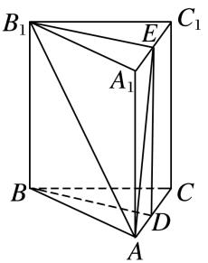

2．如图所示，在正方体<em>ABCD</em>－<em>A</em>1<em>B</em>1<em>C</em>1<em>D</em>1中，则<em>AC</em>与<em>A</em>1<em>D</em>所成角的大小为\_\_\_\_\_\_\_\_；若<em>E</em>，<em>F</em>分别为

<em>AB</em>，<em>AD</em>的中点，则<em>A</em>1<em>C</em>1与<em>EF</em>所成角的大小为\_\_\_\_\_\_\_\_．

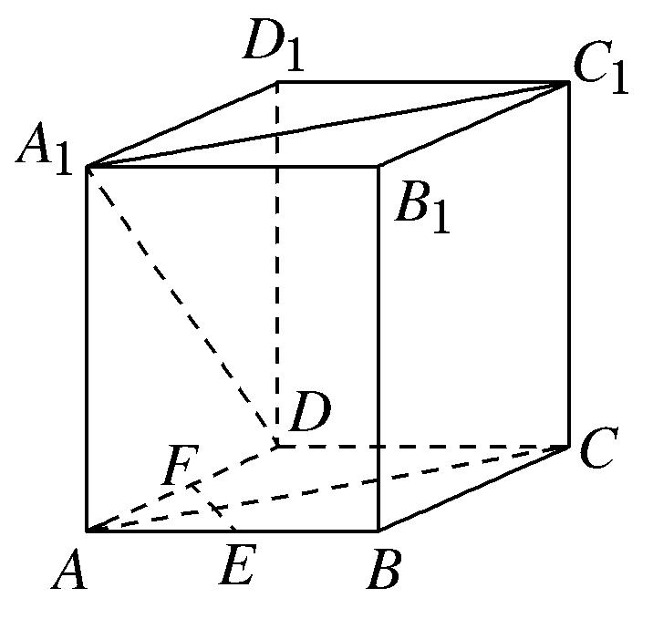

2．答案　60°　90°　解析　(1)如图所示，连接<em>B</em>1<em>C</em>，<em>AB</em>1，由<em>ABCD</em>－<em>A</em>1<em>B</em>1<em>C</em>1<em>D</em>1是正方体，易知<em>A</em>1<em>D</em>∥<em>B</em>1<em>C</em>，

从而<em>B</em>1<em>C</em>与<em>AC</em>所成的角就是<em>AC</em>与<em>A</em>1<em>D</em>所成的角．∵<em>AB</em>1＝<em>AC</em>＝<em>B</em>1<em>C</em>，∴∠<em>B</em>1<em>CA</em>＝60°．即<em>A</em>1<em>D</em>与<em>AC</em>所成的角为60°．

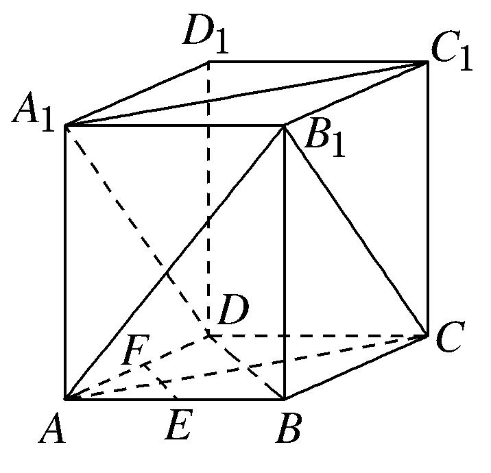

连接<em>BD</em>，在正方体<em>ABCD－A</em>1<em>B</em>1<em>C</em>1<em>D</em>1中，<em>AC</em>⊥<em>BD</em>，<em>AC</em>∥<em>A</em>1<em>C</em>1，∵<em>E</em>，<em>F</em>分别为<em>AB</em>，<em>AD</em>的中点，∴<em>EF</em>∥<em>BD</em>，∴<em>EF</em>⊥<em>AC</em>．∴<em>EF</em>⊥<em>A</em>1<em>C</em>1．即<em>A</em>1<em>C</em>1与<em>EF</em>所成的角为90°．

3．如图所示，等腰直角三角形*ABC*中，∠*A*＝90°，*BC*＝，*DA*⊥*AC*，*DA*⊥*AB*，若*DA*＝1，且*E*为*DA*

的中点，则异面直线*BE*与*CD*所成角的余弦值为\_\_\_\_\_\_\_\_．

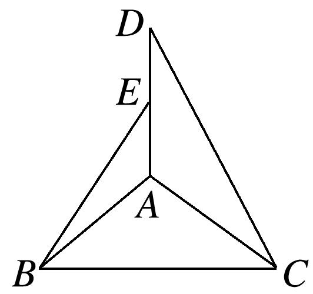

3．如图所示，取*AC*的中点*F*，连接*EF*，*BF*，∵在△*ACD*中，*E*，*F*分别是*AD*，*AC*的中点，∴*EF*∥*CD*．

∴∠*BEF*或其补角即为异面直线*BE*与*CD*所成的角．在Rt△*EAB*中，*AB*＝*AC*＝1，*AE*＝*AD*＝，∴*BE*＝．在Rt△*EAF*中，*AF*＝*AC*＝，*AE*＝，∴*EF*＝．在Rt△*BAF*中，*AB*＝1，*AF*＝，∴*BF*＝．在等腰三角形*EBF*中，cos∠*FEB*＝＝＝．

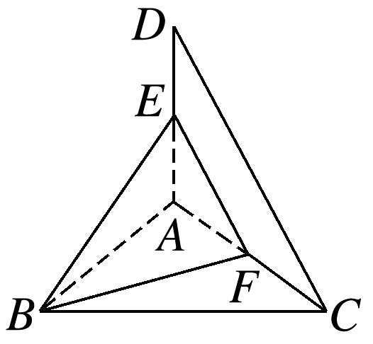

4．如图，已知圆柱的轴截面<em>ABB</em>1<em>A</em>1是正方形，<em>C</em>是圆柱下底面弧<em>AB</em>的中点，<em>C</em>1是圆柱上底面弧<em>A</em>1<em>B</em>1的

中点，那么异面直线<em>AC</em>1与<em>BC</em>所成角的正切值为\_\_\_\_\_\_\_\_．

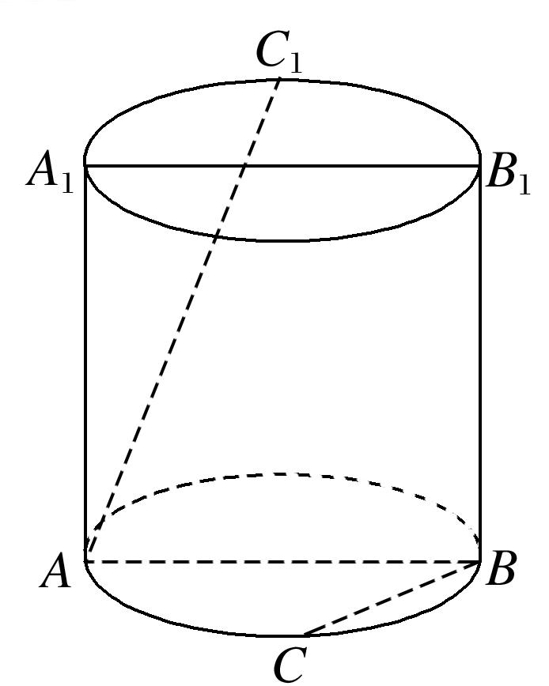

4．答案　　解析　取圆柱下底面弧<em>AB</em>的另一中点<em>D</em>，连接<em>C</em>1<em>D</em>，<em>AD</em>，因为<em>C</em>是圆柱下底面弧<em>AB</em>的

中点，

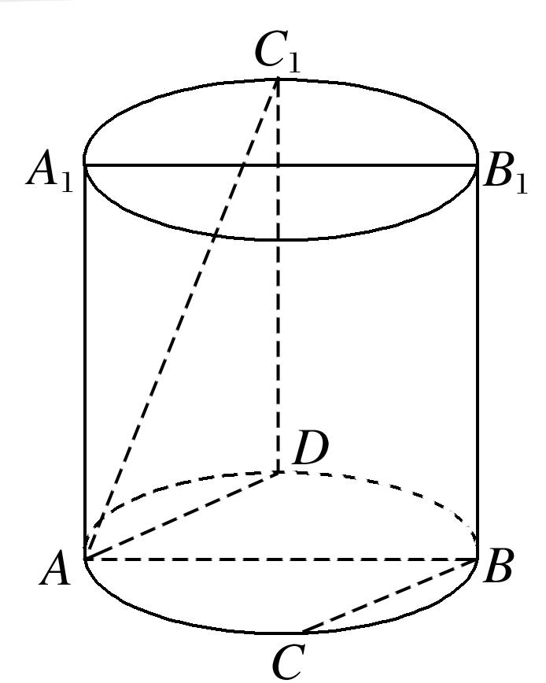

所以<em>AD</em>∥<em>BC</em>，所以直线<em>AC</em>1与<em>AD</em>所成的角即为异面直线<em>AC</em>1与<em>BC</em>所成的角，因为<em>C</em>1是圆柱上底面弧<em>A</em>1<em>B</em>1的中点，所以<em>C</em>1<em>D</em>⊥圆柱下底面，所以<em>C</em>1<em>D</em>⊥<em>AD</em>．因为圆柱的轴截面<em>ABB</em>1<em>A</em>1是正方形，所以<em>C</em>1<em>D</em>＝<em>AD</em>，所以直线<em>AC</em>1与<em>AD</em>所成角的正切值为，所以异面直线<em>AC</em>1与<em>BC</em>所成角的正切值为．

5．在正三棱柱<em>ABC</em>－<em>A</em>1<em>B</em>1<em>C</em>1中，<em>AB</em>＝<em>AA</em>1＝2，<em>M</em>，<em>N</em>分别为<em>AA</em>1，<em>BB</em>1的中点，则异面直线<em>BM</em>与<em>C</em>1<em>N</em>

所成角的余弦值为\_\_\_\_\_\_\_\_．

5．答案　　解析　如图，连接<em>A</em>1<em>N</em>，则<em>A</em>1<em>N</em>∥<em>BM</em>，所以异面直线<em>BM</em>与<em>C</em>1<em>N</em>所成的角就是直线<em>A</em>1<em>N</em>和

<em>C</em>1<em>N</em>所成的角．由题意，得<em>A</em>1<em>N</em>＝<em>C</em>1<em>N</em>＝＝，在△<em>A</em>1<em>C</em>1<em>N</em>中，由余弦定理得cos∠<em>A</em>1<em>NC</em>1＝＝．所以异面直线<em>BM</em>与<em>C</em>1<em>N</em>所成角的余弦值为．

6．如图，四边形*ABCD*为矩形，平面*PCD*⊥平面*ABCD*，且*PC*＝*PD*＝*CD*＝2，*BC*＝2，*O*，*M*分别为

*CD*，*BC*的中点，则异面直线*OM*与*PD*所成的角的余弦值为(　　)

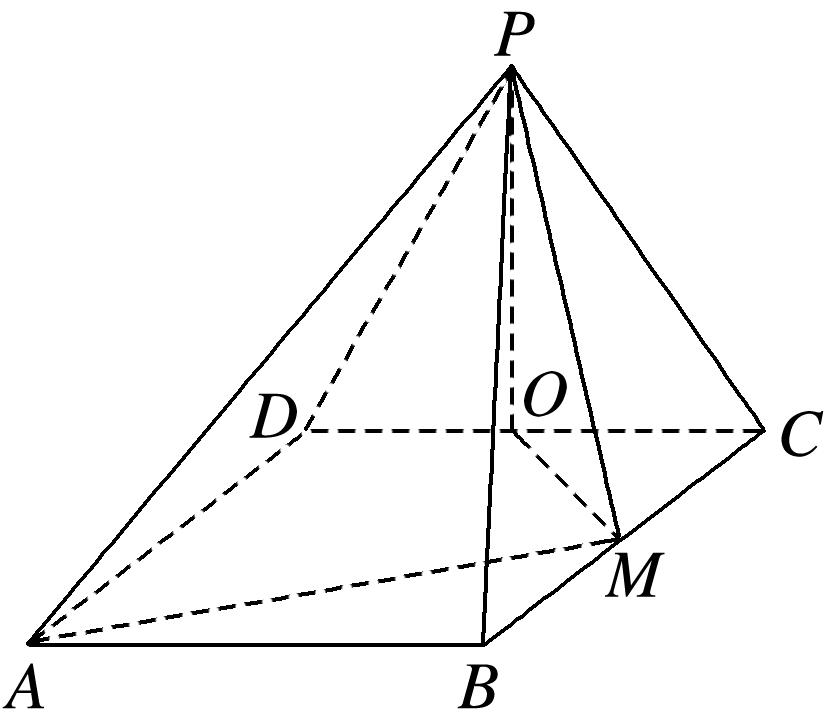

A．　　　　　　　　B．　　　　　　　　C．　　　　　　　　D．

6．答案　C　解析　连接*BD*，*OB*，则*OM*∥*DB*，∴∠*PDB*或其补角为异面直线*OM*与*PD*所成的角．

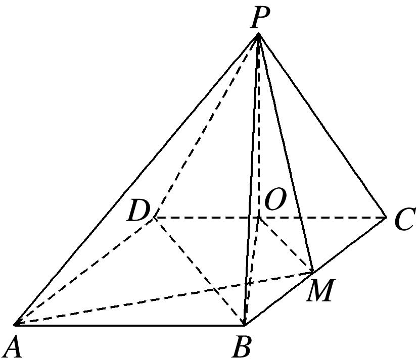

由已知条件可知*PO*⊥平面*ABCD*，*OB*＝3，*PO*＝，*BD*＝2，*PB*＝2，在△*PBD*中，由余弦定理可得cos∠*PDB*＝＝＝．

7．点*E*，*F*分别是三棱锥*P*－*ABC*的棱*AP*，*BC*的中点，*AB*＝6，*PC*＝8，*EF*＝5，则异面直线*AB*与*PC*

所成的角为(　　)

A．90°　　　　　　　　　B．45°　　　　　　　　　C．30°　　　　　　　　D．60°

7．答案　A　解析　如图，取*PB*的中点*G*，连接*EG*，*FG*，则*EG*＝*AB*，*GF*＝*PC*，*EG*∥*AB*，*GF*∥*PC*，

则∠<em>EGF</em>(或其补角)即为<em>AB</em>与<em>PC</em>所成的角，在△<em>EFG</em>中，<em>EG</em>＝<em>AB</em>＝3，<em>FG</em>＝<em>PC</em>＝4，<em>EF</em>＝5，<em>EG</em>2＋<em>FG</em>2＝<em>EF</em>2，所以∠<em>EGF</em>＝90°．

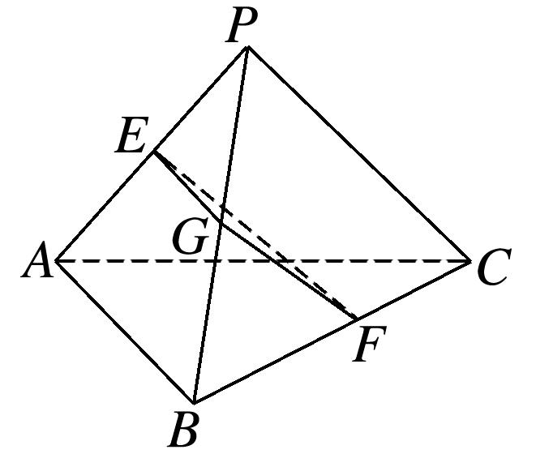

8．已知在四面体*ABCD*中，*E*，*F*分别是*AC*，*BD*的中点，若*AB*＝2，*CD*＝4，*EF*⊥*AB*，则*EF*与*CD*所

成的角的大小为(　　)

A．90°　　　　　　　　B．45°　　　　　　　　C．60°　　　　　　　　D．30°

8．答案　D　解析　设*G*为*AD*的中点，连接*GF*，*GE*，

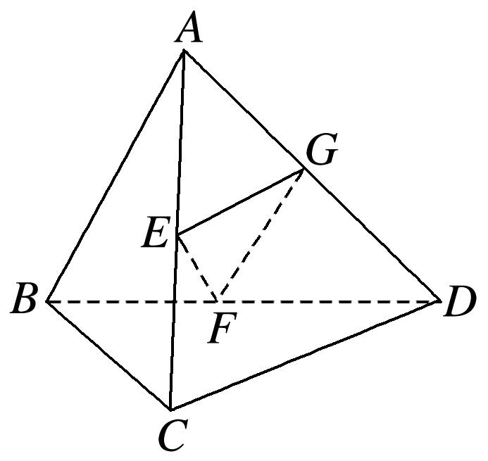

则*GF*，*GE*分别为△*ABD*，△*ACD*的中位线．由此可得*GF*∥*AB*，且*GF*＝*AB*＝1，*GE*∥*CD*，且*GE*＝*CD*＝2，∴∠*FEG*或其补角即为*EF*与*CD*所成的角．又*EF*⊥*AB*，*GF*∥*AB*，∴*EF*⊥*GF*．因此，在Rt△*EFG*中，*GF*＝1，*GE*＝2，∴sin∠*GEF*＝＝，又∠*GEF*为锐角，∴∠*GEF*＝30°．∴*EF*与*CD*所成的角的大小为30°．

9．在正三棱柱<em>ABC</em>－<em>A</em>1<em>B</em>1<em>C</em>1中，<em>AB</em>＝<em>BB</em>1，则<em>AB</em>1与<em>BC</em>1所成角的大小为(　　)

A．30°　　　　　　　　B．60°　　　　　　　　C．75°　　　　　　　　D．90°

9．答案　D　解析　将正三棱柱<em>ABC－A</em>1<em>B</em>1<em>C</em>1补为四棱柱<em>ABCD</em>－<em>A</em>1<em>B</em>1<em>C</em>1<em>D</em>1，连接<em>C</em>1<em>D</em>，<em>BD</em>，则<em>C</em>1<em>D</em>∥

<em>B</em>1<em>A</em>，∠<em>BC</em>1<em>D</em>为所求角或其补角．设<em>BB</em>1＝，则<em>BC</em>＝<em>CD</em>＝2，∠<em>BCD</em>＝120°，<em>BD</em>＝2，又因为<em>BC</em>1＝<em>C</em>1<em>D</em>＝，所以∠<em>BC</em>1<em>D</em>＝90°．

10．如图所示，在四棱锥*PABCD*中，∠*ABC*＝∠*BAD*＝90°，*BC*＝2*AD*，△*PAB*和△*PAD*都是等边三角

形，则异面直线*CD*与*PB*所成角的大小为\_\_\_\_\_\_\_\_．

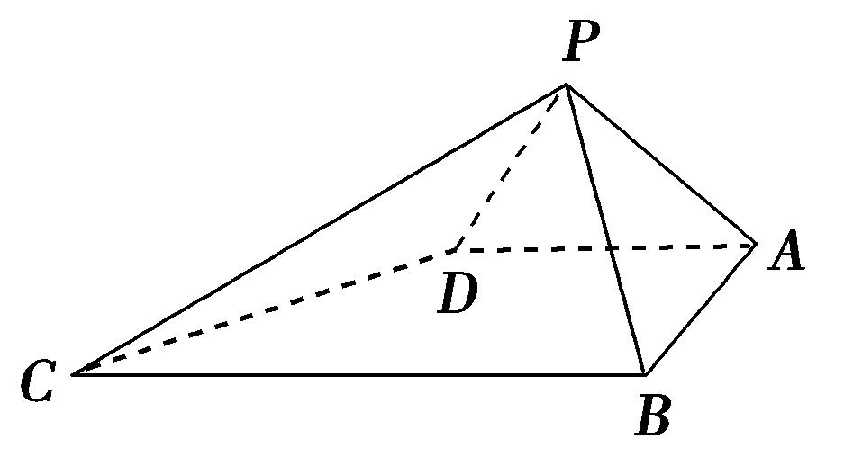

10．答案　90°　解析　如图所示，延长*DA*至*E*，使*AE*＝*DA*，连接*PE*，*BE*．

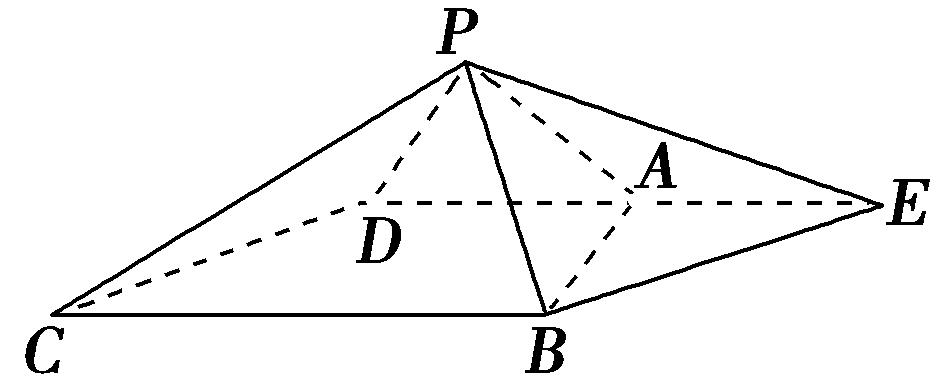

∵∠<em>ABC</em>＝∠<em>BAD</em>＝90°，<em>BC</em>＝2<em>AD</em>，∴<em>DE</em>＝<em>BC</em>，<em>DE</em>∥<em>BC</em>．∴四边形<em>CBED</em>为平行四边形，∴<em>CD</em>∥<em>BE</em>．∴∠<em>PBE</em>就是异面直线<em>CD</em>与<em>PB</em>所成的角．在△<em>PAE</em>中，<em>AE</em>＝<em>PA</em>，∠<em>PAE</em>＝120°，由余弦定理，得<em>PE</em>＝ ＝＝<em>AE</em>．在△<em>ABE</em>中，<em>AE</em>＝<em>AB</em>，∠<em>BAE</em>＝90°，∴<em>BE</em>＝<em>AE</em>．∵△<em>PAB</em>是等边三角形，∴<em>PB</em>＝<em>AB</em>＝<em>AE</em>，∴<em>PB</em>2＋<em>BE</em>2＝<em>AE</em>2＋2<em>AE</em>2＝3<em>AE</em>2＝<em>PE</em>2，∴∠<em>PBE</em>＝90°．

### **考点二　直线与平面所成的角**

【**方法总结**】

求直线与平面所成角的方法

求直线与平面所成角的关键是寻找过直线上一点与平面垂直的垂线、垂足与斜足的连线即为直线在平面内的射影，直线与直线在平面内射影所成的角即为线面角．然后转化为解三角形问题，进而求解．

**【例题选讲】**

<strong>[例2]</strong>(1)已知三棱柱<em>ABC</em>－<em>A</em>1<em>B</em>1<em>C</em>1的侧棱与底面垂直，体积为，底面是边长为的正三角形．若<em>P</em>为底面<em>A</em>1<em>B</em>1<em>C</em>1的中心，则<em>PA</em>与平面<em>ABC</em>所成角的大小为\_\_\_\_\_\_\_\_．

答案　60°　解析　如图所示，设<em>O</em>为△<em>ABC</em>的中心，连接<em>PO</em>，<em>AO</em>，易知<em>PO</em>⊥平面<em>ABC</em>，则∠<em>PAO</em>为<em>PA</em>与平面<em>ABC</em>所成的角．<em>S</em>△<em>ABC</em>＝×××sin 60°＝，∴<em>VABCA</em>1<em>B</em>1<em>C</em>1＝<em>S</em>△<em>ABC</em>·<em>OP</em>＝×<em>OP</em>＝，∴<em>OP</em>＝．又<em>OA</em>＝××＝1，∴tan∠<em>OAP</em>＝＝，∴∠<em>OAP</em>＝60°．故<em>PA</em>与平面<em>ABC</em>所成角为60°．

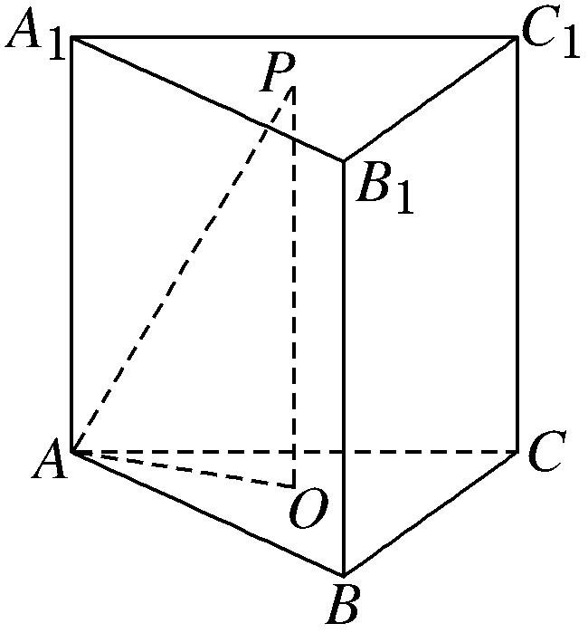

(2)(2018·全国Ⅰ)在长方体<em>ABCD－A</em>1<em>B</em>1<em>C</em>1<em>D</em>1中，<em>AB</em>＝<em>BC</em>＝2，<em>AC</em>1与平面<em>BB</em>1<em>C</em>1<em>C</em>所成的角为30°，则该长方体的体积为(　　)

A．8　　　　　　　　B．6　　　　　　　　C．8　　　　　　　　D．8

答案　C　解析　如图，连接<em>AC</em>1，<em>BC</em>1，<em>AC</em>．∵<em>AB</em>⊥平面<em>BB</em>1<em>C</em>1<em>C</em>，∴∠<em>AC</em>1<em>B</em>为直线<em>AC</em>1与平面<em>BB</em>1<em>C</em>1<em>C</em>所成的角，∴∠<em>AC</em>1<em>B</em>＝30°．又<em>AB</em>＝<em>BC</em>＝2，在Rt△<em>ABC</em>1中，<em>AC</em>1＝＝4．在Rt△<em>ACC</em>1中，<em>CC</em>1＝＝＝2，∴<em>V</em>长方体＝<em>AB</em>×<em>BC</em>×<em>CC</em>1＝2×2×2＝8．

【**对点训练**】

1．在正三棱柱<em>ABC</em>－<em>A</em>1<em>B</em>1<em>C</em>1中，<em>AB</em>＝1，点<em>D</em>在棱<em>BB</em>1上，且<em>BD</em>＝1，则<em>AD</em>与平面<em>AA</em>1<em>C</em>1<em>C</em>所成角的正

弦值为(　　)

A．　　　　　　　　B．　　　　　　　　C．　　　　　　　　D．

1．答案　B　解析　如图，取<em>AC</em>，<em>A</em>1<em>C</em>1的中点分别为<em>M</em>，<em>M</em>1，连接<em>MM</em>1，<em>BM</em>，过点<em>D</em>作<em>DN</em>∥<em>BM</em>交

<em>MM</em>1于点<em>N</em>，则易证<em>DN</em>⊥平面<em>AA</em>1<em>C</em>1<em>C</em>，连接<em>AN</em>，则∠<em>DAN</em>为<em>AD</em>与平面<em>AA</em>1<em>C</em>1<em>C</em>所成的角．在Rt△<em>DNA</em>中，sin∠<em>DAN</em>＝＝＝．

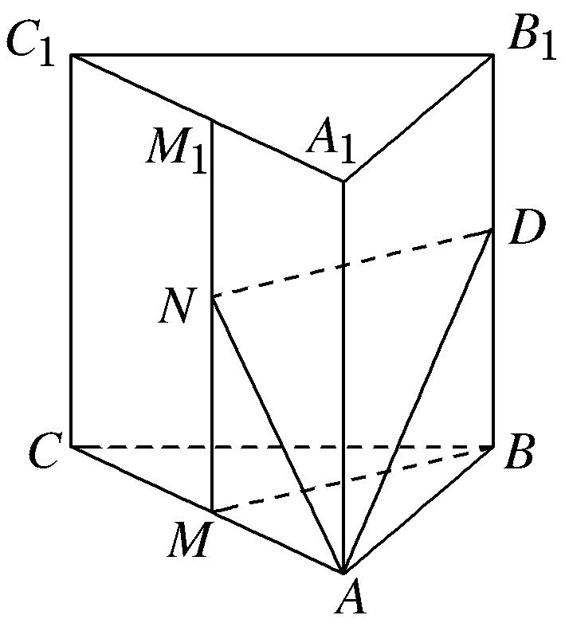

2．如图，正四棱锥*P*－*ABCD*的体积为2，底面积为6，*E*为侧棱*PC*的中点，则直线*BE*与平面*PAC*所成

的角为(　　)

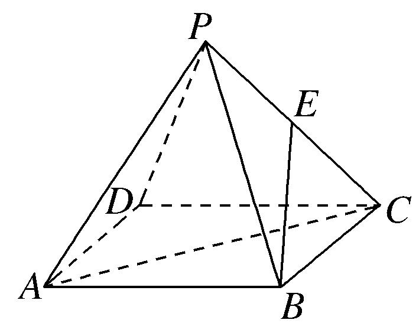

A．60°　　　　　　　　B．30°　　　　　　　　C．45°　　　　　　　　D．90°

2．答案　A　解析　如图，在正四棱锥*P*－*ABCD*中， 根据底面积为6可得，*BC*＝．连接*BD*交*AC*

于点*O*，连接*PO*，则*PO*为正四棱锥*P－ABCD*的高，根据体积公式可得，*PO*＝1．因为*PO*⊥底面*ABCD*，所以*PO*⊥*BD*，又*BD*⊥*AC*，*PO*∩*AC*＝*O*，所以*BD*⊥平面*PAC*，连接*EO*，则∠*BEO*为直线*BE*与平面*PAC*所成的角．在Rt△*POA*中，因为*PO*＝1，*OA*＝，所以*PA*＝2，*OE*＝*PA*＝1，在Rt△*BOE*中，因为*BO*＝，所以tan∠*BEO*＝＝，即∠*BEO*＝60°．故直线*BE*与平面*PAC*所成角为60°．

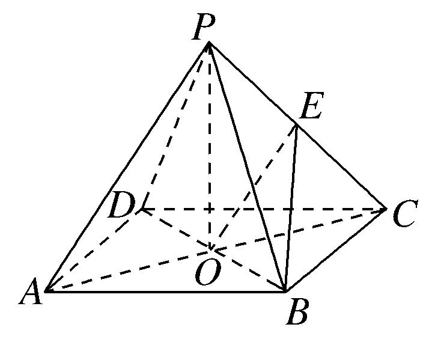

3．已知正方体<em>ABCD</em>－<em>A</em>1<em>B</em>1<em>C</em>1<em>D</em>1的体积为16，点<em>P</em>在正方形<em>A</em>1<em>B</em>1<em>C</em>1<em>D</em>1上且<em>A</em>1，<em>C</em>到<em>P</em>的距离分别为

2，2，则直线<em>CP</em>与平面<em>BDD</em>1<em>B</em>1所成角的正切值为(　　)

A．　　　　　　　　B．　　　　　　　　C．　　　　　　　　D．

3．答案　A　解析　易知<em>AB</em>＝2，连接<em>C</em>1<em>P</em>，在Rt△<em>CC</em>1<em>P</em>中，可计算<em>C</em>1<em>P</em>＝＝2，又<em>A</em>1<em>P</em>

＝2，<em>A</em>1<em>C</em>1＝4，所以<em>P</em>是<em>A</em>1<em>C</em>1的中点，连接<em>AC</em>与<em>BD</em>交于点<em>O</em>，易证<em>AC</em>⊥平面<em>BDD</em>1<em>B</em>1，直线<em>CP</em>在平面<em>BDD</em>1<em>B</em>1内的射影是<em>OP</em>，所以∠<em>CPO</em>就是直线<em>CP</em>与平面<em>BDD</em>1<em>B</em>1所成的角，在Rt△<em>CPO</em>中，tan∠<em>CPO</em>＝＝．

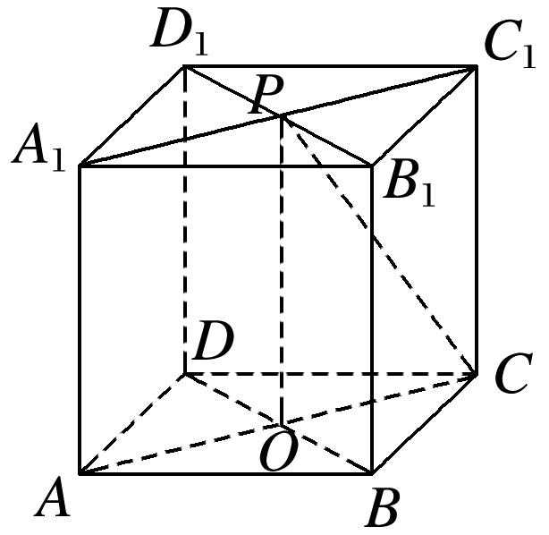

4．在正方体<em>ABCD</em>－<em>A</em>1<em>B</em>1<em>C</em>1<em>D</em>1中，<em>E</em>为棱<em>CD</em>上的一点，且<em>CE</em>＝2<em>DE</em>，<em>F</em>为棱<em>AA</em>1的中点，且平面<em>BEF</em>

与<em>DD</em>1交于点<em>G</em>，则<em>B</em>1<em>G</em>与平面<em>ABCD</em>所成角的正切值为(　　)

A．　　　　　　　　B．　　　　　　　　C．　　　　　　　　D．

4．答案　C　解析　因为平面<em>ABCD</em>∥平面<em>A</em>1<em>B</em>1<em>C</em>1<em>D</em>1，所以<em>B</em>1<em>G</em>与平面<em>ABCD</em>所成角即为<em>B</em>1<em>G</em>与平面

<em>A</em>1<em>B</em>1<em>C</em>1<em>D</em>1所成角，易知<em>B</em>1<em>G</em>与平面<em>A</em>1<em>B</em>1<em>C</em>1<em>D</em>1所成角为∠<em>D</em>1<em>B</em>1<em>G</em>．设<em>AB</em>＝6，则<em>AF</em>＝3，<em>DE</em>＝2，平面<em>BEF</em>∩平面<em>CDD</em>1<em>C</em>1＝<em>GE</em>且<em>BF</em>∥平面<em>CDD</em>1<em>C</em>1，可知<em>BF</em>∥<em>GE</em>，易得△<em>FAB</em>∽△<em>GDE</em>，则＝，即＝⇒<em>DG</em>＝1，<em>D</em>1<em>G</em>＝5，在Rt△<em>B</em>1<em>D</em>1<em>G</em>中，tan∠<em>D</em>1<em>B</em>1<em>G</em>＝＝＝，故<em>B</em>1<em>G</em>与平面<em>ABCD</em>所成角的正切值为，故选C．

5．如图，在正方体<em>ABCD</em>—<em>A</em>1<em>B</em>1<em>C</em>1<em>D</em>1中，<em>E</em>，<em>F</em>，<em>G</em>，<em>H</em>分别为棱<em>AA</em>1，<em>B</em>1<em>C</em>1，<em>C</em>1<em>D</em>1，<em>DD</em>1的中点，则<em>GH</em>

与平面*EFH*所成的角的余弦值为\_\_\_\_\_\_．

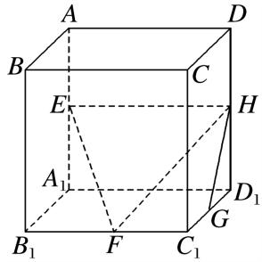

5．答案　　解析　连接<em>B</em>1<em>E</em>，<em>HC</em>1，平面<em>EFH</em>即平面<em>B</em>1<em>C</em>1<em>HE</em>．

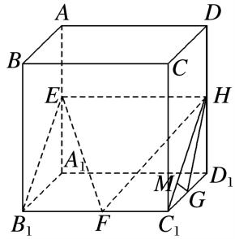

### 在正方体<em>AC</em>1中，<em>B</em>1<em>C</em>1⊥平面<em>CDD</em>1<em>C</em>1，故平面<em>B</em>1<em>C</em>1<em>HE</em>⊥平面<em>CDD</em>1<em>C</em>1，过点<em>G</em>作<em>GM</em>⊥<em>C</em>1<em>H</em>于<em>M</em>，则<em>GM</em>⊥平面<em>B</em>1<em>C</em>1<em>HE</em>，则∠<em>C</em>1<em>HG</em>即为<em>GH</em>与平面<em>EFH</em>所成的角，设正方体棱长为2，则<em>GH</em>＝，<em>C</em>1<em>G</em>＝1，<em>C</em>1<em>H</em>＝，∴cos∠<em>C</em>1<em>HG</em>＝＝＝．

6．在正三棱柱<em>ABC</em>－<em>A</em>1<em>B</em>1<em>C</em>1中，<em>AB</em>＝4，点<em>D</em>在棱<em>BB</em>1上，若<em>BD</em>＝3，则<em>AD</em>与平面<em>AA</em>1<em>C</em>1<em>C</em>所成角的正

切值为(　　)

A．　　　　　　　　B．　　　　　　　　C．　　　　　　　　D．

6．答案　B　解析　如图，取*AC*的中点*E*，连接*BE*，可得·＝(＋)·＝·＝4×2×＝

12＝5×2×cos <em>θ</em>(<em>θ</em>为与的夹角)，所以cos<em>θ</em>＝，sin<em>θ</em>＝，又因为<em>BE</em>⊥平面<em>AA</em>1<em>C</em>1<em>C</em>，所以所求角即为－<em>θ</em>，所以tan＝＝＝．

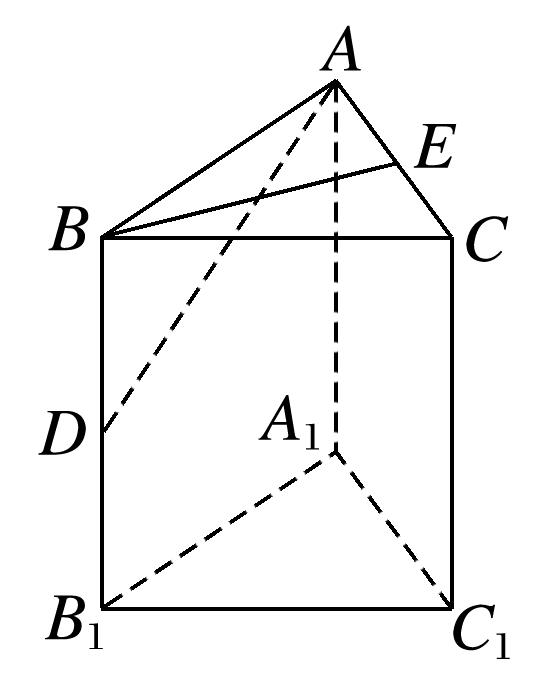

7．已知<em>E</em>，<em>F</em>分别是正方体<em>ABCD</em>－<em>A</em>1<em>B</em>1<em>C</em>1<em>D</em>1的棱<em>BB</em>1，<em>AD</em>的中点，则直线<em>EF</em>和平面<em>BDD</em>1<em>B</em>1所成的角

的正弦值是(　　)

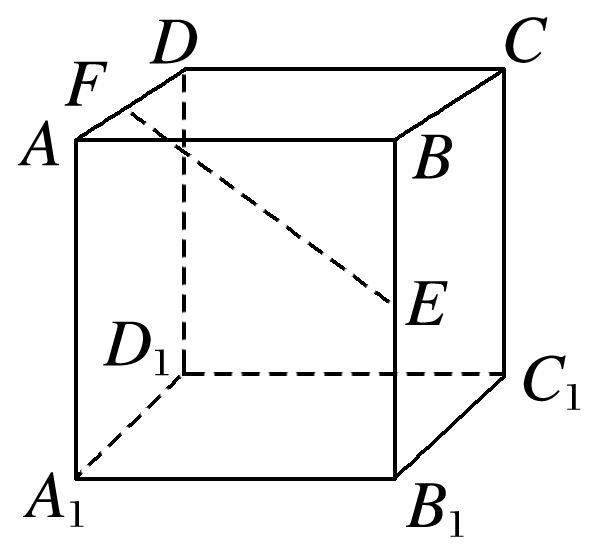

A．　　　　　　　　B．　　　　　　　　C．　　　　　　　　D．

7．答案　B　解析　连接<em>AE</em>，<em>BD</em>，过点<em>F</em>作<em>FH</em>⊥<em>BD</em>交<em>BD</em>于<em>H</em>，连接<em>EH</em>，则<em>FH</em>⊥平面<em>BDD</em>1<em>B</em>1，

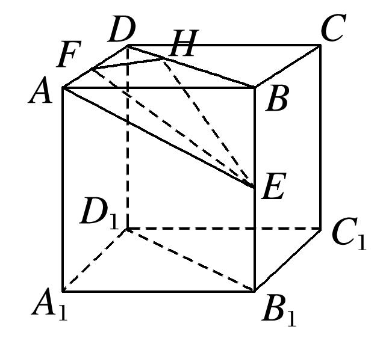

∴∠<em>FEH</em>是直线<em>EF</em>和平面<em>BDD</em>1<em>B</em>1所成的角．设正方体<em>ABCD</em>－<em>A</em>1<em>B</em>1<em>C</em>1<em>D</em>1的棱长为2，∵<em>E</em>，<em>F</em>分别是棱<em>BB</em>1，<em>AD</em>的中点，∴在Rt△<em>DFH</em>中，<em>DF</em>＝1，∠<em>FDH</em>＝45°，可得<em>FH</em>＝<em>DF</em>＝．在Rt△<em>AEF</em>中，<em>AF</em>＝1，<em>AE</em>＝＝，可得<em>EF</em>＝＝．在Rt△<em>EFH</em>中，sin∠<em>FEH</em>＝＝，∴直线<em>EF</em>和平面<em>BDD</em>1<em>B</em>1所成的角的正弦值是．

8．如图，在三棱锥*S*－*ABC*中，若*AC*＝2，*SA*＝*SB*＝*SC*＝*AB*＝*BC*＝4，*E*为棱*SC*的中点，则直线*AC*

与*BE*所成角的余弦值为\_\_\_\_\_\_，直线*AC*与平面*SAB*所成的角为\_\_\_\_\_\_\_．

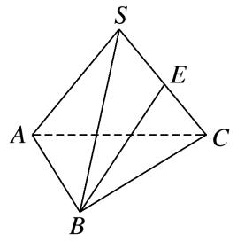

8．答案　　60°　解析　取*SA*的中点*M*，连接*ME*，*BM* ，则直线*AC*与*BE*所成的角等于直线*ME*与

*BE*所成的角，因为*ME*＝，*BM*＝*BE*＝2，cos∠*MEB*＝＝，所以直线*AC*与*BE*所成角的余弦值为．取*SB*的中点*N*，连接*AN*，*CN*，则*AN*⊥*SB*，*CN*⊥*SB*⇒*SB*⊥平面*ACN*⇒平面*SAB*⊥平面*ACN* ，因此直线*AC*与平面*SAB*所成的角为∠*CAN*，因为*AN*＝*CN*＝*AC*＝2 ，所以∠*CAN*＝60°，因此直线*AC*与平面*SAB*所成的角为60°．

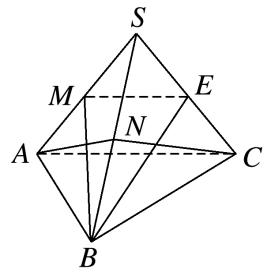

9．(2018·全国Ⅱ)已知圆锥的顶点为*S*，母线*SA*，*SB*所成角的余弦值为，*SA*与圆锥底面所成角为45°，

若△*SAB*的面积为5，则该圆锥的侧面积为\_\_\_\_\_\_\_\_．

9．解析：如图，∵*SA*与圆锥底面所成角为45°，∴△*SAO*为等腰直角三角形．设*OA*＝*r*，则*SO*＝*r*，*SA*

＝<em>SB</em>＝<em>r</em>．在△<em>SAB</em>中，cos ∠<em>ASB</em>＝，∴sin ∠<em>ASB</em>＝，∴<em>S</em>△<em>SAB</em>＝<em>SA</em>·<em>SB</em>·sin∠<em>ASB</em>＝×(<em>r</em>)2×＝5，解得<em>r</em>＝2，∴<em>SA</em>＝<em>r</em>＝4，即母线长<em>l</em>＝4，∴<em>S</em>圆锥侧＝π<em>rl</em>＝π×2×4＝40π．

答案：40π

10．如图，设*E*，*F*分别是正方形*ABCD*中*CD*，*AB*边的中点，将△*ADC*沿对角线*AC*对折，使得直线*EF*

与*AC*异面，记直线*EF*与平面*ABC*所成的角为*α*，与异面直线*AC*所成的角为*β*，则当tan*β*＝时，tan*α*等于(　　)

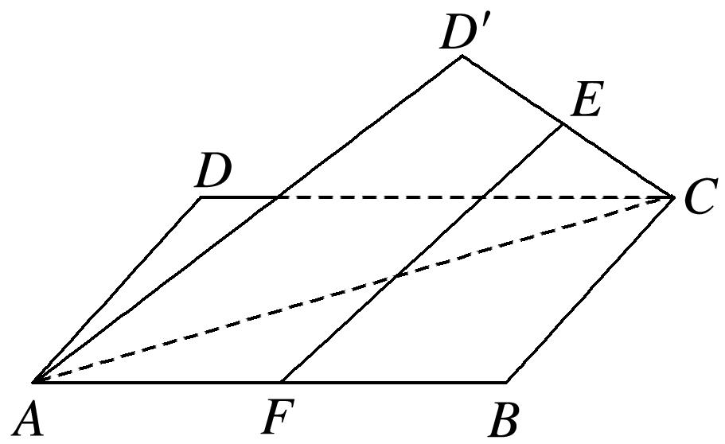

A．　　　　　　　　B．　　　　　　　　C．　　　　　　　　D．

10．答案　C　解析　分别连接*BD*交*AC*于点*O*，连接*D*′*O*．因为*AD*′＝*CD*′，所以*D*′*O*⊥*AC*，又因为*AC*

⊥*BD*，*BD*∩*D*′*O*＝*O*，所以*AC*⊥平面*BDD*′，又*BD*′⊂平面*BDD*′，所以*AC*⊥*BD*′．取*BC*的中点*S*，连接*FS*，*ES*，则*FS*∥*AC*，*ES*∥*BD*′，所以*FS*⊥*ES*，又因为∠*EFS*为异面直线*AC*与*EF*所成的角，所以tan *β*＝＝，设*ES*＝1，则*FS*＝2，*AC*＝4，取*CO*的中点*G*，连接*EG*，*SG*，则*EG*＝*SG*＝1，所以△*EGS*为等边三角形，过点*E*作*EH*⊥*GS*，由上可知*AC*⊥*EG*，*AC*⊥*SG*且*EG*∩*SG*＝*G*，则*AC*⊥平面*EGS*．又*EH*⊂平面*EGS*，所以*EH*⊥*AC*，又*GS*∩*AC*＝*G*，所以*EH*⊥平面*ABCD*，所以∠*EFH*为*EF*与平面*ABCD*所成的角，因为*EH*＝，*FH*＝＝，所以tan∠*EFH*＝＝，故选C．

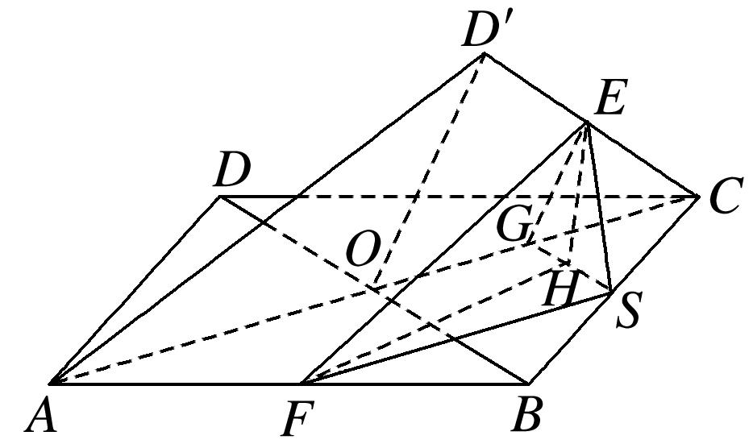

### **考点三　二面角**

### **【方法总结】**

### 求二面角的方法

### 求二面角是常见题型，根据所求两面是否有公共棱可分为两类：有棱二面角、无棱二面角，对于前者的二面角通常采用定义法或三垂线法等手段来定位出二面角的平面角，转化为解三角形问题，进而求解；而对于无棱二面角，一般通过延展平面找到棱使其转化为有棱二面角．或用面积射影定理(若多边形的面积为*S*，它在一个平面内的射影图形的面积为*S*′，且多边形与该平面所成的二面角为*θ*，则cos *θ*＝．)去解决(如例3(5))．

**【例题选讲】**

<strong>[例3]</strong>(1)如图，在三棱锥<em>V</em>－<em>ABC</em>中，<em>VA</em>＝<em>AB</em>＝<em>VB</em>＝<em>AC</em>＝<em>BC</em>＝2，<em>VC</em>＝，则二面角<em>V</em>－<em>AB</em>－<em>C</em>的大小为<strong>\_\_\_\_\_\_\_\_</strong>．

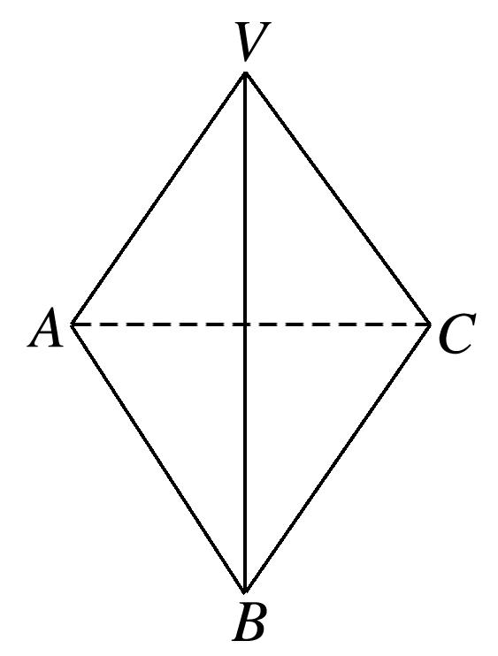

答案　60°　解析　取*AB*的中点*D*，连接*VD*，*CD*，

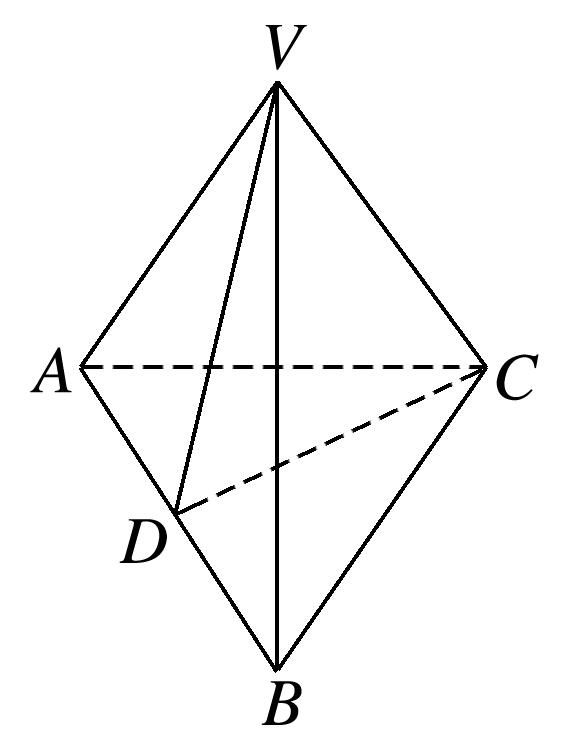

∵△*VAB*中，*VA*＝*VB*＝*AB*＝2，∴△*VAB*为等边三角形，∴*VD*⊥*AB*且*VD*＝，

同理*CD*⊥*AB*，*CD*＝，∴∠*VDC*为二面角*V*－*AB*－*C*的平面角，

### 而△*VDC*是等边三角形，∠*VDC*＝60°，∴二面角*V*－*AB*－*C*的大小为60°．

(2)二面角<em>α</em>－<em>l</em>－<em>β</em>的大小为60°，<em>A</em>，<em>B</em>分别在两个面内且<em>A</em>和<em>B</em>到棱的距离为2和4，且<em>AB</em>＝10，则<em>AB</em>与棱<em>l</em>所成角的正弦值为<strong>\_\_\_\_\_\_\_\_</strong>．

答案　　解析　如图，作*AC*⊥*l*，*BD*⊥*l*，*C*，*D*为垂足，

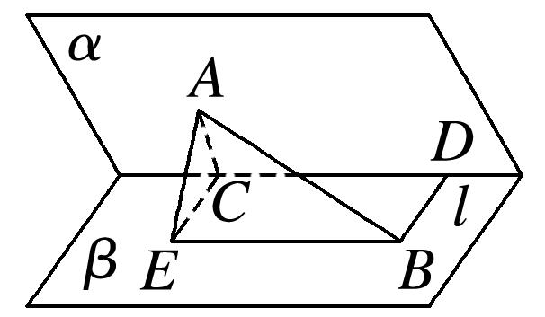

则*AC*＝2，*BD*＝4，*AB*＝10．在*β*内过*C*作*CE*∥*DB*，且*CE*＝*DB*，连接*BE*，*AE*，

∴四边形*CEBD*为平行四边形，∴*BE*∥*l*，∴∠*ABE*为*AB*与棱*l*所成的角，

∵*BD*∥*CE*，∴*l*⊥*AC*，*l*⊥*CE*，∴∠*ACE*为*α*－*l*－*β*的平面角，

∴∠*ACE*＝60°，*AC*＝2，*BD*＝4，∴*AE*＝＝2．

### 又*BE*∥*l*，*l*⊥平面*ACE*，∴*BE*⊥*AE*，∴sin∠*ABE*＝＝＝．

(3)在矩形*ABCD*中，*AB*＝3，*AD*＝4，*PA*⊥平面*ABCD*，*PA*＝，那么二面角*A－BD－P*的大小为(　　)

A．30°　　　　　　　　B．45°　　　　　　　　C．60°　　　　　　　　D．75°

答案　A　解析　作*AO*⊥*BD*交*BD*于点*O*，∵*PA*⊥平面*ABCD*，∴*PA*⊥*BD*．∵*PA*∩*AO*＝*A*，∴*BD*⊥平面*PAO*，∴*PO*⊥*BD*，∴∠*AOP*即为所求二面角*A－BD－P*的大小．∵*AO*＝＝，∴tan∠*AOP*＝＝，故二面角*A－BD－P*的大小为30°．

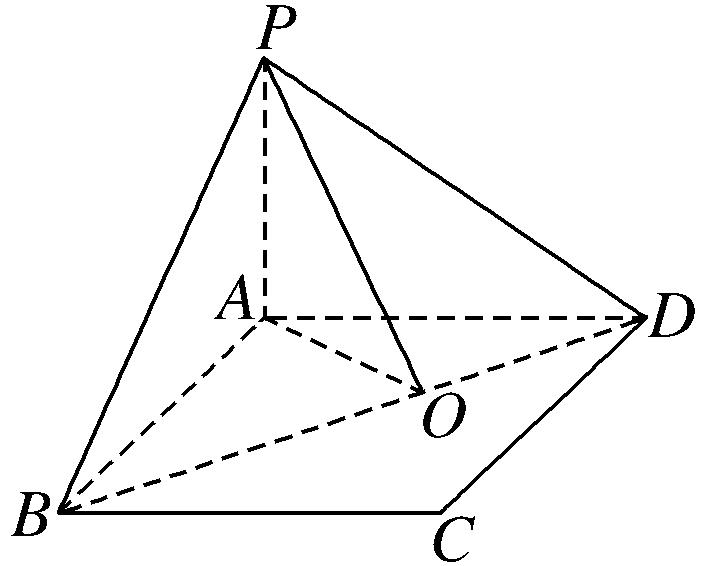

(4)如图，平面<em>β</em>内一条直线<em>AC</em>，<em>AC</em>与平面<em>α</em>所成的角为30°，<em>AC</em>与棱<em>BD</em>所成的角为45°，则平面<em>α</em>与平面<em>β</em>所成的角的大小为<strong>\_\_\_\_\_\_\_\_</strong>．

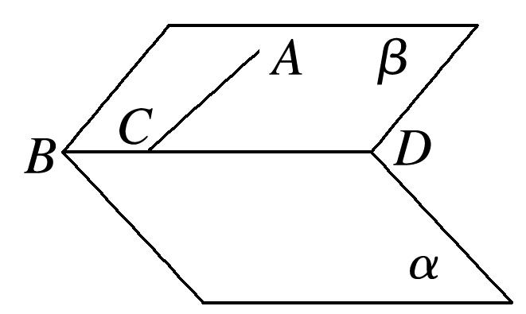

答案　45°　解析　如图，过*A*作*AF*⊥*BD*，*F*为垂足，作*AE*⊥平面*α*，*E*为垂足，连接*EF*，*CE*，

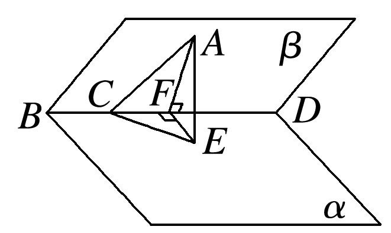

∴由三垂线定理知*BD*⊥*EF*，∴∠*AFE*为平面*α*与平面*β*所成的角．依题意∠*ACF*＝45°，∠*ACE*＝30°，设*AC*＝2，∴*AF*＝*CF*＝，*AE*＝1，∴sin∠*AFE*＝＝＝，∴*AFE*＝45°．∴平面*α*与平面*β*所成的角为45°．

(5)在四棱锥<em>P</em>－<em>ABCD</em>中，四边形<em>ABCD</em>为正方形，<em>PA</em>⊥平面<em>ABCD</em>，<em>PA</em>＝<em>AB</em>＝<em>a</em>，则平面<em>PBA</em>与平面<em>PDC</em>所成二面角的大小为<strong>\_\_\_\_\_\_\_\_</strong>．

解析　如图，∵*PA*⊥平面*ABCD*，*AD*⊂平面*ABCD*，∴*PA*⊥*AD*，又*AD*⊥*AB*，且*PA*∩*AB*＝*A*，

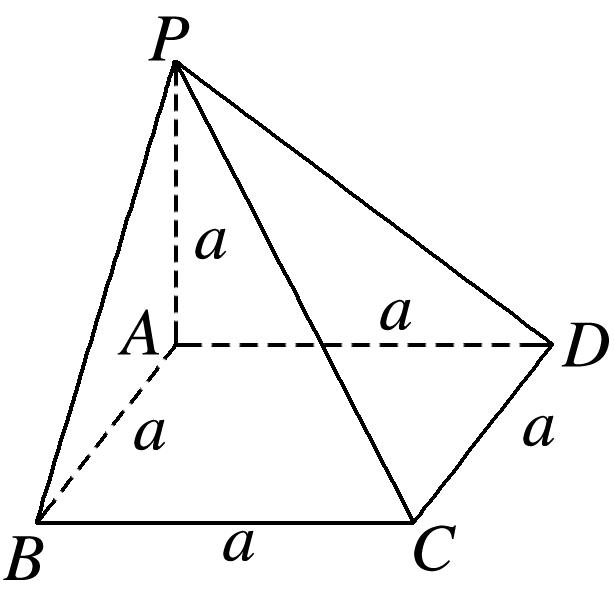

*PA*，*AB*⊂平面*PAB*，∴*AD*⊥平面*PAB*，同理*BC*⊥平面*PAB*．∴△*PCD*在平面*PBA*上的射影为△*PAB*，设平面*PBA*与平面*PCD*所成二面角为*θ*，∴cos *θ*＝＝＝，∴*θ*＝45°．故平面*PBA*与平面*PCD*所成二面角的大小为45°．

【**对点训练**】

1．从空间一点*P*向二面角*α*－*l*－*β*的两个面*α*，*β*分别作垂线*PE*，*PF*，*E*，*F*为垂足，若∠*EPF*＝60°，则

二面角*α*－*l*－*β*的平面角的大小是(　　)

A．60°　　　　　　　B．120°　　　　　　　C．60°或120°　　　　　　　D．不确定

1．答案　C　解析　如图所示，过*PE*，*PF*作一个平面*γ*与二面角*α*－*l*－*β*的棱交于点*O*，连接*OE*，*OF*．

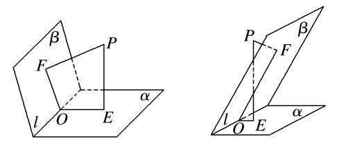

因为*PE*⊥*α*，*PF*⊥*β*，所以*PE*⊥*l*，*PF*⊥*l*，所以*l*⊥平面*γ*，所以*l*⊥*OE*，*l*⊥*OF*，则∠*EOF*为*α*－*l*－*β*的平面角，且它与∠*EPF*相等或互补，故二面角*α*－*l*－*β*的平面角的大小为60°或120°，故选C．

2．如图所示，已知三棱锥<em>A</em>－<em>BCD</em>的各棱长均为2，则二面角<em>A</em>－<em>CD</em>－<em>B</em>的平面角的余弦值为<strong>\_\_\_\_\_\_\_\_</strong>．

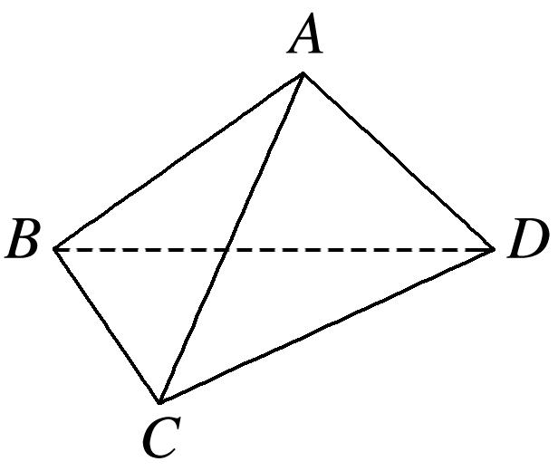

2．答案　　解析　如图，取*CD*的中点*M*，连接*AM*，*BM*，

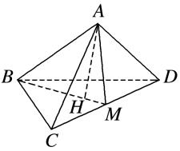

则*AM*⊥*CD*，*BM*⊥*CD*．由二面角的定义可知∠*AMB*为二面角*A*－*CD*－*B*的平面角．设点*H*是△*BCD*的中心，连接*AH*，则*AH*⊥平面*BCD*，且点*H*在线段*BM*上．在Rt△*AMH*中，*AM*＝×2＝，*HM*＝×2×＝，则cos ∠*AMB*＝＝，即所求二面角的平面角的余弦值为．

3．已知二面角的棱上有*A*，*B*两点，直线*AC*，*BD*分别在这个二面角的两个半平面内，且都垂直于*AB*，

已知*AB*＝4，*AC*＝6，*BD*＝8，*CD*＝2，则该二面角的大小为(　　)

A．150°　　　　　　　　B．45°　　　　　　　　C．120°　　　　　　　　D．60°

3．答案　D　解析　如图，*AC*⊥*AB*，*BD*⊥*AB*，过*A*在平面*ABD*内作*AE*∥*BD*，过*D*作*DE*∥*AB*，连接

*CE*，所以*DE*＝*AB*且*DE*⊥平面*AEC*，∠*CAE*即二面角的平面角．在Rt△*DEC*中，*CD*＝2，*DE*＝4，则*CE*＝2，在△*ACE*中，由余弦定理可得cos∠*CAE*＝＝，所以∠*CAE*＝60°，即所求二面角的大小为60°．

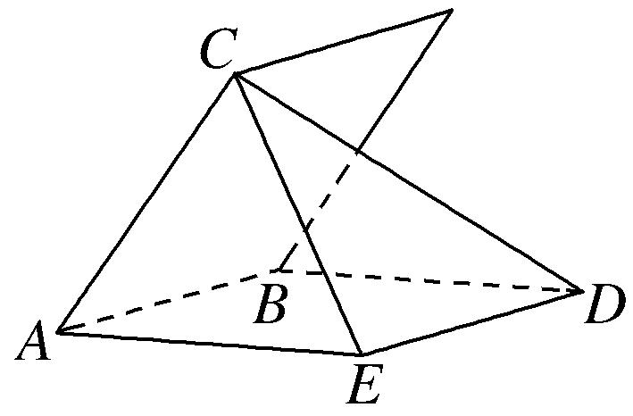

### 4．已知正四棱锥的体积为12，底面对角线的长为2，则侧面与底面所成的二面角的平面角为\_\_\_\_\_\_\_\_．

### 4．答案　C　解析　如图，*O*为正方形*ABCD*的中心，*M*为*BC*的中点，连接*PO*，*PM*，*OM*，∠*PMO*即

### 为侧面与底面所成二面角的平面角．设底面边长为<em>a</em>，则2<em>a</em>2＝(2)2，∴<em>a</em>＝2，∴<em>OM</em>＝．又四棱锥的体积<em>V</em>＝×(2)2×<em>PO</em>＝12，∴<em>PO</em>＝3，∴tan∠<em>PMO</em>＝＝，∴∠<em>PMO</em>＝60°．故所求二面角为60°．

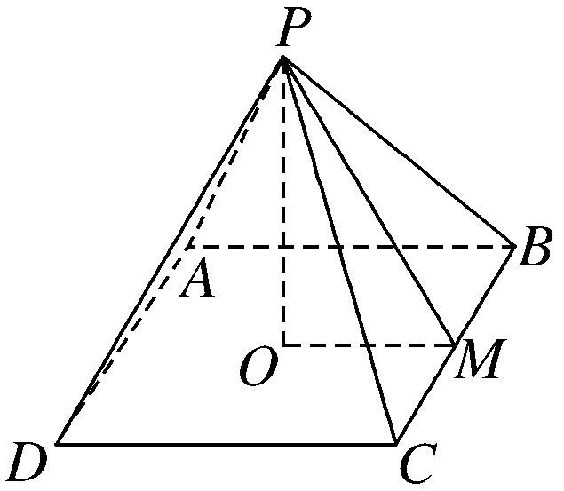

5．如图，*AB*是⊙*O*的直径，*PA*垂直于⊙*O*所在平面，*C*是圆周上不同于*A*，*B*两点的任意一点，且*AB*

＝2，*PA*＝*BC*＝，则二面角*A－BC－P*的大小为\_\_\_\_\_\_\_\_．

5．答案　60°　解析　因为*AB*为⊙*O*的直径，所以*AC*⊥*BC*，又因为*PA*⊥平面*ABC*，所以*PA*⊥*BC*，因

为*AC*∩*PA*＝*A*，所以*BC*⊥平面*PAC*，所以*BC*⊥*PC*，所以∠*PCA*为二面角*ABCP*的平面角．因为∠*ACB*＝90°，*AB*＝2，*PA*＝*BC*＝，所以*AC*＝1，所以在Rt△*PAC*中，tan∠*PCA*＝＝．所以∠*PCA*＝60°．即所求二面角的大小为60°．

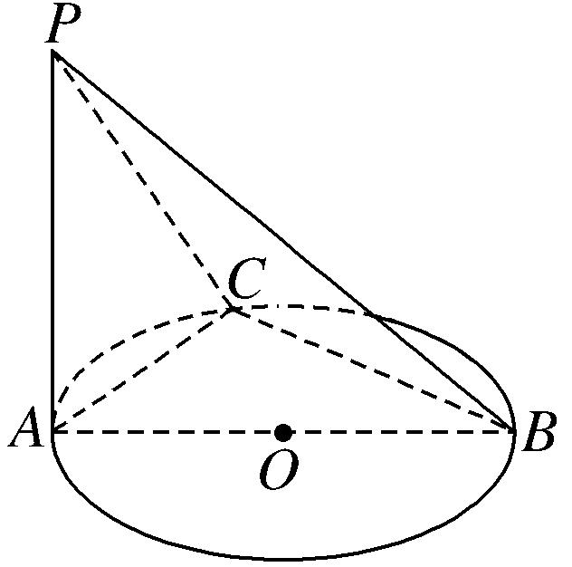

6．已知△*ABC*中，∠*C*＝90°，tan*A*＝，*M*为*AB*的中点，现将△*ACM*沿*CM*折起，得到三棱锥*P*－*CBM*，

如图所示．则当二面角*P－CM－B*的大小为60°时，＝\_\_\_\_\_\_\_\_．

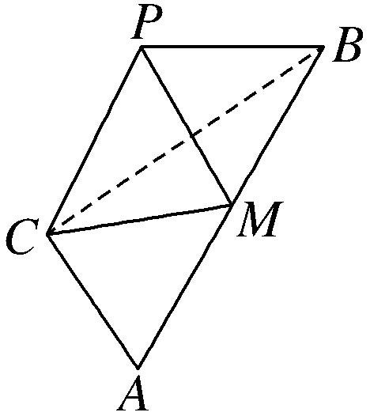

6．<strong>答案　C　解析</strong>　如图，取<em>BC</em>的中点<em>E</em>，连接<em>AE</em>，<em>EM</em>，<em>PE</em>，设<em>AE</em>∩<em>CM</em>＝<em>O</em>，连接<em>PO</em>，再设<em>AC</em>＝2，

由∠<em>C</em>＝90°，tan<em>A</em>＝，可得<em>BC</em>＝2．在Rt△<em>MEC</em>中，可得tan∠<em>CME</em>＝，在Rt△<em>ECA</em>中，可得tan∠<em>AEC</em>＝，∴∠<em>CME</em>＋∠<em>AEM</em>＝90°，∴<em>AE</em>⊥<em>CM</em>，∴<em>PO</em>⊥<em>CM</em>，<em>EO</em>⊥<em>CM</em>，∠<em>POE</em>即为二面角<em>P</em>－<em>CM</em>－<em>B</em>的平面角，∴∠<em>POE</em>＝60°．∵<em>AE</em>＝＝，<em>OE</em>＝1×sin∠<em>CME</em>＝，∴<em>PO</em>＝<em>AO</em>＝．在△<em>POE</em>中，由余弦定理可得，<em>PE</em>＝ ＝，∴<em>PE</em>2＋<em>CE</em>2＝<em>PC</em>2，即<em>PE</em>⊥<em>BC</em>．又∵<em>E</em>为<em>BC</em>的中点，∴<em>PB</em>＝<em>PC</em>＝2．在Rt△<em>ACB</em>中，易得<em>AB</em>＝2，∴＝．

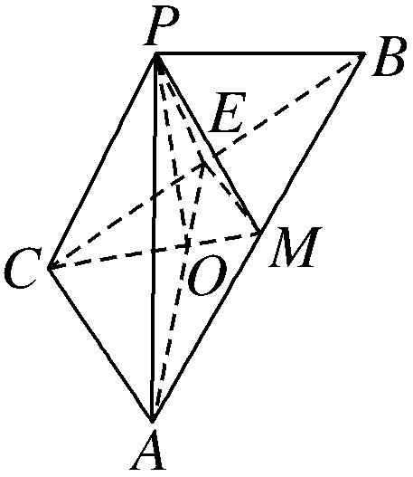

7．(多选)在正方体<em>ABCD</em>－<em>A</em>1<em>B</em>1<em>C</em>1<em>D</em>1中，下列说法正确的是(　　)

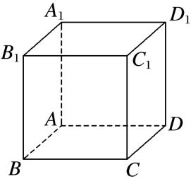

A．<em>A</em>1<em>C</em>1⊥<em>BD</em>　　　　　　　　　　　　　　　　B．<em>B</em>1<em>C</em>与<em>BD</em>所成的角为60°

C．二面角<em>A</em>1－<em>BC</em>－<em>D</em>的平面角为45°　　　　　D．<em>AC</em>1与平面<em>ABCD</em>所成的角为45°

7．答案　ABC　解析　<em>A</em>1<em>C</em>1⊥<em>B</em>1<em>D</em>1且<em>B</em>1<em>D</em>1∥<em>BD</em>，∴<em>A</em>1<em>C</em>1⊥<em>BD</em>，∴A正确；<em>B</em>1<em>C</em>∥<em>A</em>1<em>D</em>，<em>B</em>1<em>C</em>与<em>BD</em>所成

的角即为∠<em>A</em>1<em>DB</em>＝60°，∴B正确；∠<em>A</em>1<em>BA</em>即为二面角<em>A</em>1－<em>BC</em>－<em>D</em>的平面角，∠<em>A</em>1<em>BA</em>＝45°，∴C正确；<em>CC</em>1⊥平面<em>ABCD</em>，∴∠<em>C</em>1<em>AC</em>为<em>AC</em>1与平面<em>ABCD</em>所成的角，∵<em>CC</em>1≠<em>AC</em>，∴∠<em>C</em>1<em>AC</em>≠45°，∴D错误．

8．如图，矩形*ABCD*中，*AB*＝1，*BC*＝2，点*E*为*AD*的中点，将△*ABE*沿*BE*折起，在翻折过程中，记

点*A*对应的点为*A*′，二面角*A*′－*DC*－*B*的平面角的大小为*α*，则当*α*最大时，tan*α*＝(　　)

A．　　　　　　　　B．　　　　　　　　C．　　　　　　　　D．

8．答案　D　解析　如图，取*BC*的中点*F*，连接*AF*，交*BE*于点*O*，则*AF*⊥*BE*，连接*OA*′，*A*′*F*，则

*OA*′＝*OA*＝，*OA*′⊥*BE*，*OF*⊥*BE*，又*OA*′∩*OF*＝*O*，所以*BE*⊥平面*OA*′*F*，又*BE*⊂平面*ABCD*，所以平面*OA*′*F*⊥平面*ABCD*．设*A*′在*AF*上的投影为*M*，连接*A*′*M*，设∠*A*′*OM*＝*β*，则*A*′*M*＝sin *β*，*OM*＝cos *β*，过点*M*作*MN*⊥*CD*交*CD*于点*N*，连接*A*′*N*，则∠*A*′*NM*＝*α*．易得*α*∈，*MN*＝－cos *β*，所以当*α*最大时，tan *α*最大，tan *α*＝＝，令＝*t*，所以sin *β*＝3*t*－*t* cos *β*，所以3*t*＝sin *β*＋*t* cos *β*＝sin (*β*＋*θ*)，所以3*t*≤ ，所以*t*≤，即tan *α*≤，故选D．

9．已知在矩形*ABCD*中，*AD*＝*AB*，沿直线*BD*将△*ABD* 折成△*A*′*BD*，使得点*A*′在平面*BCD*上的射影

在△*BCD*内(不含边界)，设二面角*A*′－*BD*－*C*的大小为*θ*，直线*A*′*D*，*A*′*C*与平面*BCD*所成的角分别为*α*，*β*，则(　　)

A．*α*<*θ*<*β*　　　　　　　B．*β*<*θ*<*α*　　　　　　　C．*β*<*α*<*θ*　　　　　　　D．*α*<*β*<*θ*

9．答案　D　解析　如图，∵四边形*ABCD*为矩形，∴*BA*′⊥*A*′*D*，

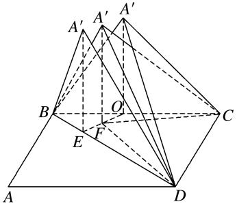

当*A*′点在底面上的射影*O*落在*BC*上时，有平面*A*′*BC*⊥底面*BCD*，又*DC*⊥*BC*，平面*A*′*BC*∩平面*BCD*＝*BC*，*DC*⊂平面*BCD*，可得*DC*⊥平面*A*′*BC*，则*DC*⊥*BA*′，∴*BA*′⊥平面*A*′*DC*，在Rt△*BA*′*C*中，设*BA*′＝1，则*BC*＝，∴*A*′*C*＝1，说明*O*为*BC*的中点；当*A*′点在底面上的射影*E*落在*BD*上时，可知*A*′*E*⊥*BD*，设*BA*′＝1，则*A*′*D*＝，∴*A*′*E*＝，*BE*＝．要使点*A*′在平面*BCD*上的射影*F*在△*BCD*内(不含边界)，则点*A*′的射影*F*落在线段*OE*上(不含端点)．可知∠*A*′*EF*为二面角*A*′－*BD*－*C*的平面角*θ*，直线*A*′*D*与平面*BCD*所成的角为∠*A*′*DF*＝*α*，直线*A*′*C*与平面*BCD*所成的角为∠*A*′*CF*＝*β*，可求得*DF*＞*CF*，∴*A*′*C*＜*A*′*D*，且*A*′*E*＝<1，而*A*′*C*的最小值为1，∴sin∠*A*′*DF*＜sin∠*A*′*CF*＜sin∠*A*′*EO*，则*α*＜*β*＜*θ*．

10．如图，在三棱锥*S*－*ABC*中，*SA*⊥底面*ABC*，*AB*⊥*BC*，*DE*垂直平分*SC*且分别交*AC*，*SC*于点*D*，

*E*，又*SA*＝*AB*，*SB*＝*BC*，则二面角*E*－*BD*－*C*的大小为\_\_\_\_\_\_\_\_．

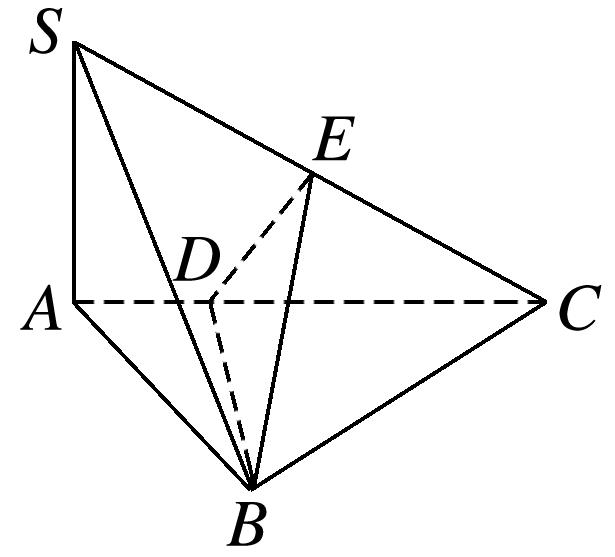

10．答案　60°　解析　∵*SB*＝*BC*且*E*是*SC*的中点，∴*BE*是等腰三角形*SBC*底边*SC*的中线，∴*SC*⊥

*BE*．又已知*SC*⊥*DE*，*BE*∩*DE*＝*E*，*BE*，*DE*⊂平面*BDE*，∴*SC*⊥平面*BDE*，∴*SC*⊥*BD*．又*SA*⊥平面*ABC*，*BD*⊂平面*ABC*，∴*SA*⊥*BD*，而*SC*∩*SA*＝*S*，*SC*，*SA*⊂平面*SAC*，

∴*BD*⊥平面*SAC*．∵平面*SAC*∩平面*BDE*＝*DE*，平面*SAC*∩平面*BDC*＝*DC*，∴*BD*⊥*DE*，*BD*⊥*DC*，∴∠*EDC*是所求二面角的平面角．∵*SA*⊥底面*ABC*，∴*SA*⊥*AB*，*SA*⊥*AC*．设*SA*＝2，则*AB*＝2，*BC*＝*SB*＝2．∵*AB*⊥*BC*，∴*AC*＝2，∴∠*ACS*＝30°．又已知*DE*⊥*SC*，∴∠*EDC*＝60°．即所求的二面角等于60°．

