# 专题08 立体几何中平行与垂直的证明问题

#### 1. 直线、平面平行的判定及其性质  
（1）线面平行的判定定理： $a \notin \alpha,\ b \subset \alpha,\ a \parallel b \Rightarrow a \parallel \alpha.$   
（2）线面平行的性质定理： $a \parallel \alpha, a \subset \beta, \alpha \cap \beta = b \Rightarrow a \parallel b.$   
（3）面面平行的判定定理： $a \subset \beta$ ， $b \subset \beta$ ， $a \cap b = P$ ， $a \parallel \alpha$ ， $b \parallel \alpha \Rightarrow \alpha \parallel \beta$ .  
（4）面面平行的性质定理： $\alpha//\beta,\quad\alpha\cap\gamma=a,\quad\beta\cap\gamma=b\Rightarrow a//b.$

平行问题的转化

利用线线平行、线面平行、面面平行的相互转化解决平行关系的判定问题时，一般遵循从“低维”到“高维”的转化，即从“线线平行”到“线面平行”，再到“面面平行”；而应用性质定理时，其顺序正好相反。在实际的解题过程中，判定定理和性质定理一般要相互结合，灵活运用。

平行关系的基础是线线平行，证明线线平行常用的方法：一是利用平行公理，即证两直线同时和第三条直线平行；二是利用平行四边形进行平行转换：三是利用三角形的中位线定理证线线平行；四是利用线段的比例关系证明线线平行；五是利用线面平行、面面平行的性质定理进行平行转换.

#### 2. 直线、平面垂直的判定及其性质  
（1）线面垂直的判定定理： $m \subset \alpha$ ， $n \subset \alpha$ ， $m \cap n = P$ ， $l \perp m$ ， $l \perp n \Rightarrow l \perp \alpha$ .  
（2）线面垂直的性质定理： $a \perp \alpha,\quad b \perp \alpha \Rightarrow a // b.$   
（3）面面垂直的判定定理： $a \subset \beta$ ， $a \perp \alpha \Rightarrow \alpha \perp \beta$ .  
（4）面面垂直的性质定理： $\alpha\perp\beta,\quad\alpha\cap\beta=l,\quad a\subset\alpha,\quad a\perp l\Rightarrow a\perp\beta.$

垂直问题的转化

在空间垂直关系中，线面垂直是核心，已知线面垂直，既可为证明线线垂直提供依据，又可为利用判定定理证明面面垂直作好铺垫。应用面面垂直的性质定理时，一般需作辅助线，基本作法是过其中一个平面内一点作交线的垂线，从而把面面垂直问题转化为线面垂直问题，进而可转化为线线垂直问题。

垂直关系的基础是线线垂直, 证明线线垂直常用的方法: 一是利用等腰三角形底边中线即高线的性质; 二是利用勾股定理; 三是利用线面垂直的性质: 即要证两线垂直, 只需证明一线垂直于另一线所在的平面即可, $l \perp a$ , $a \subset a \Rightarrow l \perp a$ .

# 考点一 线线垂直+线面平行问题

# 【例题选讲】

[例 1](2017·江苏)如图，在三棱锥 A—BCD 中， $AB \perp AD$ ， $BC \perp BD$ ，平面 $ABD \perp$ 平面 BCD，点 E， $F(E$

与 A, D 不重合)分别在棱 AD, BD 上, 且 $EF \perp AD$ .

求证：（1）EF//平面ABC；（2）AD⊥AC.

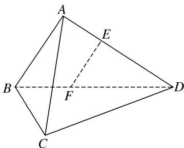

[例 2](2015·江苏)如图，在直三棱柱 $ABC-A_{1}B_{1}C_{1}$ 中，已知 $AC \perp BC$ ， $BC = CC_{1}$ 。设 $AB_{1}$ 的中点为 D， $B_{1}C \cap BC_{1} = E$ 。

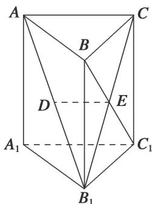

求证：（1） $DE \parallel$ 平面 $AA_{1}C_{1}C$ ; （2） $BC_{1} \perp AB_{1}$ .

[例 3]如图，在四棱锥 S-ABCD 中，已知 SA=SB，四边形 ABCD 是平行四边形，且平面 $SAB \perp$ 平面 ABCD，点 M，N 分别是 SC，AB 的中点.

求证：（1）MN//平面 SAD；（2） $SN \perp AC$ .

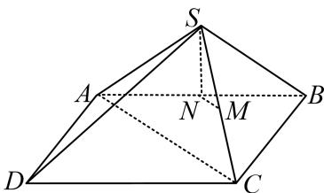

[例 4](2016·山东)在如图所示的几何体中，D 是 AC 的中点，EF//DB.  
（1）已知 AB=BC, AE=EC，求证： $AC \perp FB$ ;  
（2）已知 G，H 分别是 EC 和 FB 的中点，求证：GH// 平面 ABC.

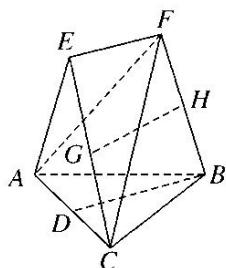

# 【对点训练】

1. 如图，在六面体 $ABCDE$ 中，平面 $DBC \perp$ 平面 $ABC$ ， $AE \perp$ 平面 $ABC$ .  
（1）求证： $AE \parallel$ 平面 DBC;  
（2）若 $AB \perp BC, BD \perp CD$ , 求证: $AD \perp DC$ .

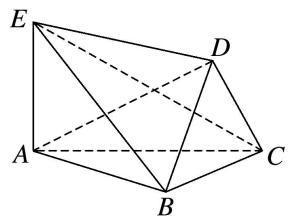

2. 如图，在正方体 $ABCD-A_{1}B_{1}C_{1}D_{1}$ 中， $AA_{1}=2$ ，E 为棱 $CC_{1}$ 的中点.

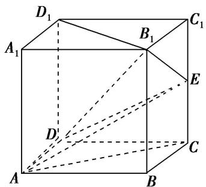  
（1）求证： $B_{1}D_{1}\perp AE;$ （2）求证：AC//平面 $B_{1}DE$ .

3. 如图, 在四棱锥 $P - ABCD$ 中, $\angle ADB = 90^{\circ}$ , $CB = CD$ , 点 $E$ 为棱 $PB$ 的中点.  
（1）若 $PB = PD$ ，求证： $PC\bot BD$ ；（2）求证： $CE / /$ 平面PAD.

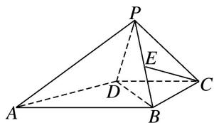

4. (2013·江苏)如图，在三棱锥 S-ABC 中，平面 $SAB \perp$ 平面 SBC， $AB \perp BC$ ，AS = AB。过 A 作 $AF \perp SB$ ，垂足为 F，点 E，G 分别是棱 SA，SC 的中点。

求证：（1）平面 $EFG \parallel$ 平面 $ABC$ ；（2） $BC \perp SA$ .

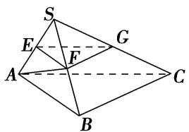

5. 如图 1 所示，在 Rt△ABC 中，∠ABC=90°，D 为 AC 的中点，AE⊥BD 于点 E(不同于点 D)，延长 AE 交 BC 于点 F，将△ABD 沿 BD 折起，得到三棱锥 A₁-BCD，如图 2 所示.  
（1）若 M 是 FC 的中点，求证：直线 DM// 平面 $A_{1}EF$ .  
（2）求证： $BD \perp A_{1}F.$   
（3）若平面 $A_{1}BD \perp$ 平面 $BCD$ ，试判断直线 $A_{1}B$ 与直线 $CD$ 能否垂直？请说明理由.
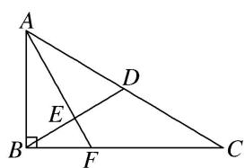

图1
 

> 
> | 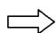 | 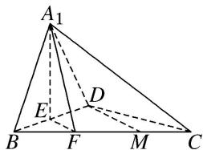 |
> | --- | --- |
> 
 
图2
 

# 考点二 线线(线面)(面面)平行+线面垂直问题

# 【例题选讲】

[例 1](2014·湖北)如图，在正方体 $ABCD-A_{1}B_{1}C_{1}D_{1}$ 中，E, F, P, Q, M, N 分别是棱 AB, AD, $DD_{1}$ , $BB_{1}$ , $A_{1}B_{1}$ , $A_{1}D_{1}$ 的中点．求证：  
（1）直线 $BC_{1} \parallel$ 平面 EFPQ;  
（2）直线 $AC_{1} \perp$ 平面 PQMN.

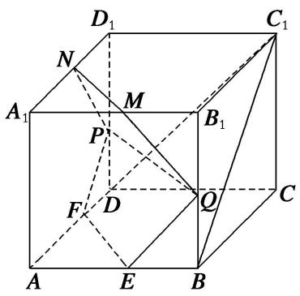

[例 2]如图，四棱锥 P-ABCD 中，AP⊥平面 PCD，AD∥BC， $AB=BC=\frac{1}{2}AD$ ，E，F 分别为线段 AD，PC 的中点．求证：  
（1）AP//平面 BEF;  
（2） $BE \perp$ 平面 PAC.

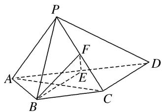

[例 3]如图, 在多面体 ABCDPE 中, 四边形 ABCD 和 CDPE 都是直角梯形, $AB \parallel DC$ , $PE \parallel DC$ , $AD \perp DC$ , $PD \perp$ 平面 ABCD, $AB = PD = DA = 2PE$ , CD = 3PE, F 是 CE 的中点.  
（1）求证： $BF \parallel$ 平面 ADP;  
（2）已知 O 是 BD 的中点，求证： $BD \perp$ 平面 AOF.

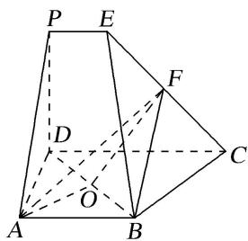

[例 4]如图所示的多面体中，底面 ABCD 为正方形， $\triangle GAD$ 为等边三角形， $BF \perp$ 平面 ABCD， $\angle GDC = 90^{\circ}$ ，若点 P 为线段 GD 的中点.  
（1）求证： $AP \perp$ 平面 $GCD$ ;  
（2）求证：平面 ADG// 平面 FBC.

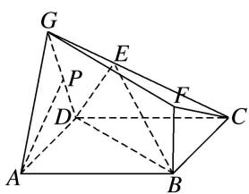

[例 5]如图 1，在平面五边形 ABCDE 中， $AB \parallel CE$ ，且 AE=2， $\angle AEC=60^{\circ}$ ， $CD=ED=\sqrt{7}$ ， $\cos\angle EDC$ $= \frac{5}{7}$ . 将 $\triangle CDE$ 沿 $CE$ 折起，使点 $D$ 到 $P$ 的位置，且 $AP = \sqrt{3}$ ，得到如图2所示的四棱锥 $P - ABCE$ .  
（1）求证： $AP \perp$ 平面 $ABCE$ ;  
（2）记平面 PAB 与平面 PCE 相交于直线 l，求证： $AB \parallel l$ .
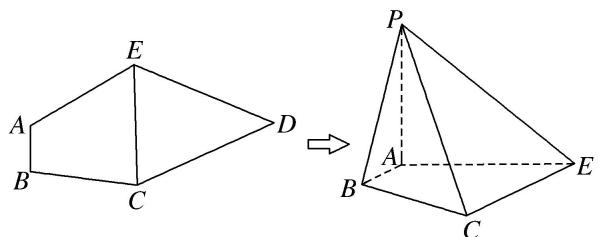

图1

图2

[例 6] (2015·四川)一个正方体的平面展开图及该正方体的直观图的示意图如图所示.  
（1）请将字母 F, G, H 标记在正方体相应的顶点处(不需说明理由);  
（2）判断平面 BEG 与平面 ACH 的位置关系．并证明你的结论；  
（3）证明：直线 $DF \perp$ 平面 BEG.

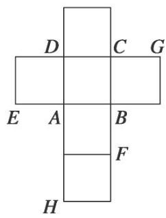

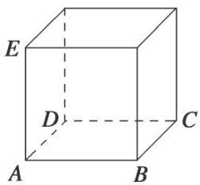

# 考点三 线面平行+面面垂直问题

# 【例题选讲】

[例 1](2018·江苏)在平行六面体 $ABCD-A_{1}B_{1}C_{1}D_{1}$ 中， $AA_{1}=AB,\ AB_{1}\perp B_{1}C_{1}$ .

求证：（1） $AB \parallel$ 平面 $A_{1}B_{1}C$ ; （2）平面 $ABB_{1}A_{1} \perp$ 平面 $A_{1}BC$ .

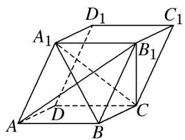

[例 2](2020·江苏)在三棱柱 $ABC-A_{1}B_{1}C_{1}$ 中， $AB\perp AC$ ， $B_{1}C\perp$ 平面 ABC，E，F 分别是 AC， $B_{1}C$ 的中点.  
（1）求证： $EF \parallel$ 平面 $AB_{1}C_{1}$ ;  
（2）求证：平面 $AB_{1}C \perp$ 平面 $ABB_{1}$ .

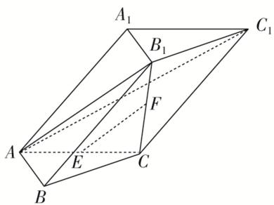

[例 3]如图所示，M，N，K 分别是正方体 ABCD— $A_{1}B_{1}C_{1}D_{1}$ 的棱 AB，CD， $C_{1}D_{1}$ 的中点.

求证：（1） $AN \parallel$ 平面 $A_{1}MK$ ;

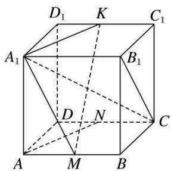  
（2）平面 $A_{1}B_{1}C \perp$ 平面 $A_{1}MK$ .

[例 4](2013·山东)如图，在四棱锥 P-ABCD 中， $AB \perp AC$ ， $AB \perp PA$ ， $AB \parallel CD$ ，AB=2CD，E，F，G，M，N 分别为 PB，AB，BC，PD，PC 的中点.  
（1）求证： $CE \parallel$ 平面 PAD；（2）求证：平面 $EFG \perp$ 平面 EMN.

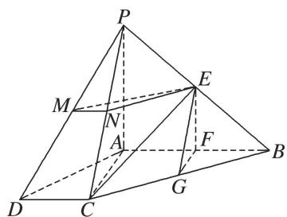

[例 5](2015·山东)如图，三棱台 DEF-ABC 中，AB=2DE，G，H 分别为 AC，BC 的中点.  
（1）求证： $BD \parallel$ 平面 FGH；（2）若 $CF \perp BC$ ， $AB \perp BC$ ，求证：平面 $BCD \perp$ 平面 EGH.

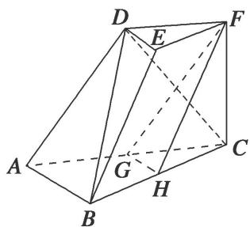

[例6]如图，在四棱锥 $P - ABCD$ 中，底面 $ABCD$ 是矩形，且 $AB = \sqrt{2} BC$ ， $E$ ， $F$ 分别在线段 $AB$ ， $CD$ 上， $G$ ， $H$ 在线段 $PC$ 上， $EF\bot PA$ ，且 $\frac{BE}{BA} = \frac{DF}{DC} = \frac{PG}{PC} = \frac{CH}{CP} = \frac{1}{4}$ 求证：  
（1） $EH \parallel$ 平面 PAD;  
（2）平面 EFG⊥平面 PAC.

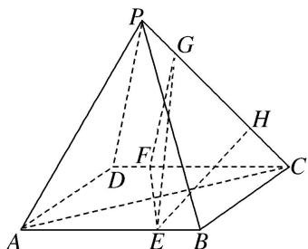

# 【对点训练】

1. 如图，在直三棱柱 $ABC - A_{1}B_{1}C_{1}$ 中， $D$ ， $E$ 分别为 $AB$ ， $BC$ 的中点，点 $F$ 在侧棱 $B_{1}B$ 上，且 $B_{1}D \perp A_{1}F$ ， $A_{1}C_{1} \perp A_{1}B_{1}$ .

求证：（1）直线 $DE \parallel$ 平面 $A_{1}C_{1}F$ ；（2）平面 $B_{1}DE \perp$ 平面 $A_{1}C_{1}F$ .

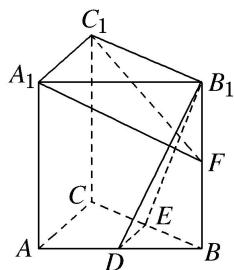

2. 如图所示，在三棱柱 $ABC - A_{1}B_{1}C_{1}$ 中， $AB = AC$ ，侧面 $BCC_{1}B_{1} \perp$ 底面 $ABC, E, F$ 分别为棱 $BC$ 和 $A_{1}C_{1}$ 的中点.  
（1）求证： $EF \parallel$ 平面 $ABB_{1}A_{1}$ ; （2）求证：平面 $AEF \perp$ 平面 $BCC_{1}B_{1}$ .

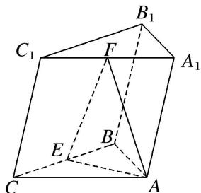

3. (2017·山东)由四棱柱 $ABCD-A_{1}B_{1}C_{1}D_{1}$ 截去三棱锥 $C_{1}-B_{1}CD_{1}$ 后得到的几何体如图所示. 四边形 ABCD 为正方形, O 为 AC 与 BD 的交点, E 为 AD 的中点, $A_{1}E \perp$ 平面 ABCD.  
（1）证明： $A_{1}O \parallel$ 平面 $B_{1}CD_{1}$ ;  
（2）设 M 是 OD 的中点，证明：平面 $A_{1}EM \perp$ 平面 $B_{1}CD_{1}$ .

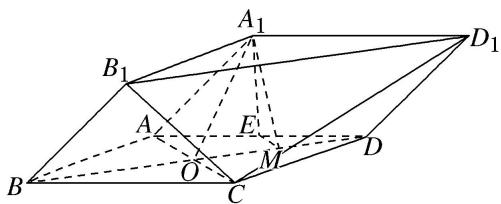

4. 如图，在四棱锥 $P - ABCD$ 中， $AB \parallel CD$ ， $AB \perp AD$ ， $CD = 2AB$ ，平面 $PAD \perp$ 底面 $ABCD$ ， $PA \perp AD$ ， $E$ ， $F$ 分别是 $CD$ ， $PC$ 的中点.

求证：（1） $BE \parallel$ 平面 PAD；（2）平面 $BEF \perp$ 平面 PCD.

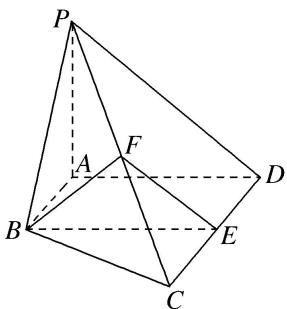

5. 如图，四边形 $ABCD$ 是正方形， $O$ 是正方形的中心， $PO \perp$ 底面 $ABCD$ ， $E$ 是 $PC$ 的中点．求证：  
（1） $PA \parallel$ 平面 BDE;  
（2）平面 PAC⊥平面 BDE.

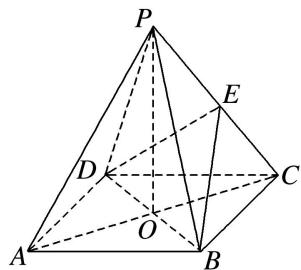

6. 如图, 四棱锥 $P - ABCD$ 的底面是矩形, $PA \perp$ 平面 $ABCD$ , $E$ , $F$ 分别是 $AB$ , $PD$ 的中点, 且 $PA = AD$ . 求证: （1） $AF //$ 平面 $PEC$ ; （2） 平面 $PEC \perp$ 平面 $PCD$ .

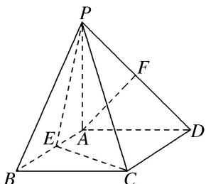

7. 如图，在几何体 $ABCDE$ 中， $AB = AD = 2$ ， $AB \perp AD$ ， $AE \perp$ 平面 $ABD$ ， $M$ 为线段 $BD$ 的中点， $MC \parallel AE$ ，且 $AE = MC = \sqrt{2}$ .  
（1）求证：平面 $BCD \perp$ 平面 CDE;  
（2）若 N 为线段 DE 的中点，求证：平面 AMN// 平面 BEC.

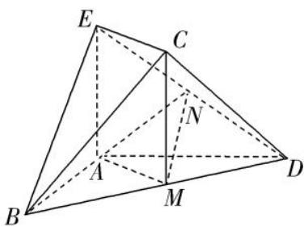

8. 在如图所示的几何体中, 四边形 $ABCD$ 是正方形, $MA \perp$ 平面 $ABCD$ , $PD \parallel MA$ , $E$ , $G$ , $F$ 分别为 $MB$ , $PB$ , $PC$ 的中点.  
（1）求证：平面 EFG // 平面 PMA;  
（2）求证：平面 $EFG \perp$ 平面 PDC.

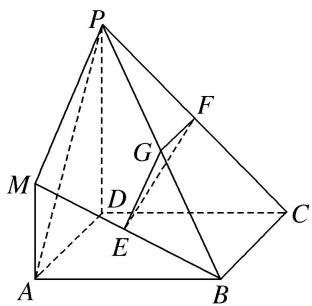

9. (2013·北京)如图, 在四棱锥 $P - ABCD$ 中, $AB \parallel CD$ , $AB \perp AD$ , $CD = 2AB$ , 平面 $PAD \perp$ 底面 $ABCD$ , $PA \perp AD$ , $E$ 和 $F$ 分别是 $CD$ 和 $PC$ 的中点, 求证:  
（1） $PA \perp$ 底面 ABCD;  
（2）BE//平面 PAD;  
（3）平面 BEF⊥平面 PCD.

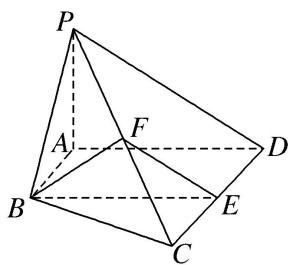

10. (2018·北京)如图，在四棱锥 $P - ABCD$ 中，底面 $ABCD$ 为矩形，平面 $PAD \perp$ 平面 $ABCD, PA \perp PD, PA = PD, E, F$ 分别为 $AD, PB$ 的中点.  
（1）求证： $PE \perp BC;$   
（2）求证：平面 $PAB \perp$ 平面 PCD;  
（3）求证：EF//平面PCD.

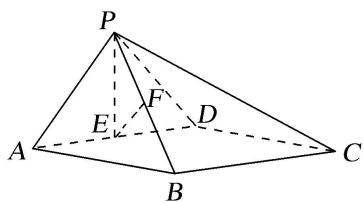

