# 专题08 立体几何中平行与垂直的证明问题

# 1. 直线、平面平行的判定及其性质

(1)线面平行的判定定理： $a \notin \alpha,\ b \subset \alpha,\ a \parallel b \Rightarrow a \parallel \alpha.$   
(2)线面平行的性质定理： $a \parallel \alpha, a \subset \beta, \alpha \cap \beta = b \Rightarrow a \parallel b.$   
(3)面面平行的判定定理： $a \subset \beta$ ， $b \subset \beta$ ， $a \cap b = P$ ， $a \parallel \alpha$ ， $b \parallel \alpha \Rightarrow \alpha \parallel \beta$ .  
(4)面面平行的性质定理： $\alpha//\beta,\quad\alpha\cap\gamma=a,\quad\beta\cap\gamma=b\Rightarrow a//b.$

平行问题的转化

flowchart

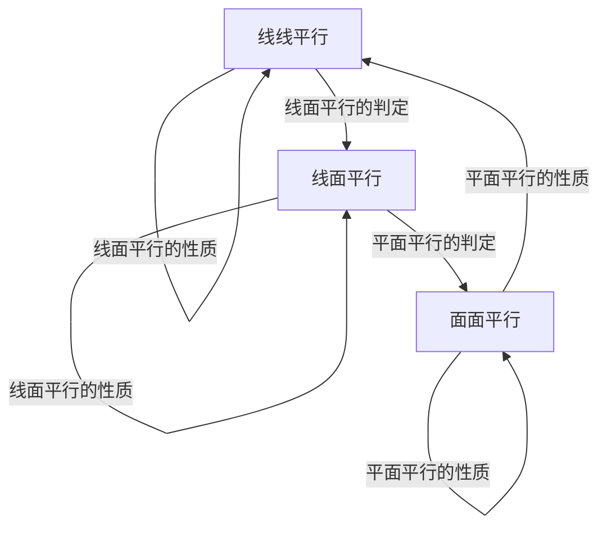

利用线线平行、线面平行、面面平行的相互转化解决平行关系的判定问题时，一般遵循从“低维”到“高维”的转化，即从“线线平行”到“线面平行”，再到“面面平行”；而应用性质定理时，其顺序正好相反。在实际的解题过程中，判定定理和性质定理一般要相互结合，灵活运用。

平行关系的基础是线线平行，证明线线平行常用的方法：一是利用平行公理，即证两直线同时和第三条直线平行；二是利用平行四边形进行平行转换：三是利用三角形的中位线定理证线线平行；四是利用线段的比例关系证明线线平行；五是利用线面平行、面面平行的性质定理进行平行转换.

# 2. 直线、平面垂直的判定及其性质

(1)线面垂直的判定定理： $m \subset \alpha$ ， $n \subset \alpha$ ， $m \cap n = P$ ， $l \perp m$ ， $l \perp n \Rightarrow l \perp \alpha$ .  
(2)线面垂直的性质定理： $a \perp \alpha,\quad b \perp \alpha \Rightarrow a // b.$   
(3)面面垂直的判定定理： $a \subset \beta$ ， $a \perp \alpha \Rightarrow \alpha \perp \beta$ .  
(4)面面垂直的性质定理： $\alpha\perp\beta,\quad\alpha\cap\beta=l,\quad a\subset\alpha,\quad a\perp l\Rightarrow a\perp\beta.$

垂直问题的转化

flowchart

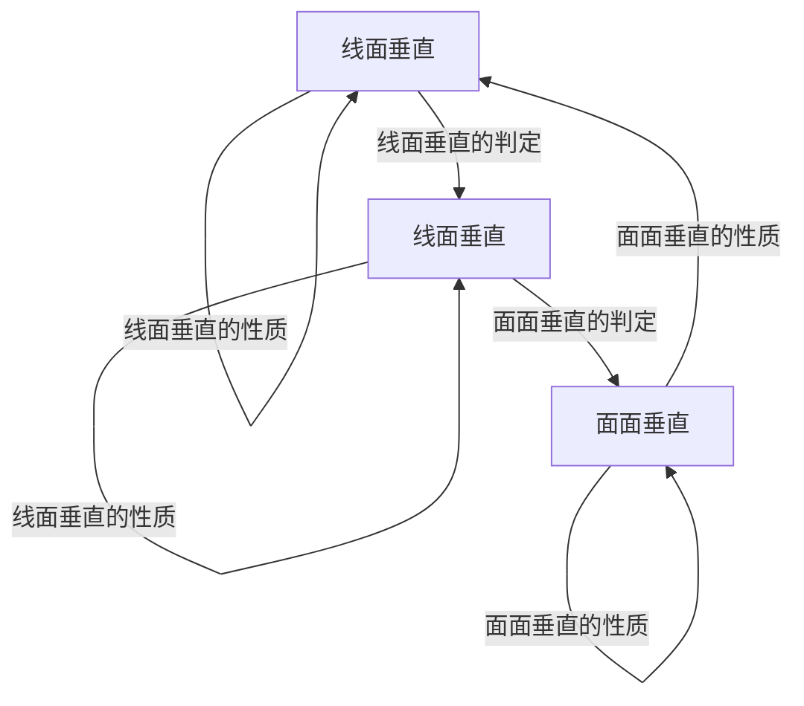

在空间垂直关系中，线面垂直是核心，已知线面垂直，既可为证明线线垂直提供依据，又可为利用判定定理证明面面垂直作好铺垫。应用面面垂直的性质定理时，一般需作辅助线，基本作法是过其中一个平面内一点作交线的垂线，从而把面面垂直问题转化为线面垂直问题，进而可转化为线线垂直问题。

垂直关系的基础是线线垂直, 证明线线垂直常用的方法: 一是利用等腰三角形底边中线即高线的性质; 二是利用勾股定理; 三是利用线面垂直的性质: 即要证两线垂直, 只需证明一线垂直于另一线所在的平面即可, $l \perp a$ , $a \subset a \Rightarrow l \perp a$ .

# 考点一 线线垂直+线面平行问题

# 【例题选讲】

[例 1](2017·江苏)如图，在三棱锥 A—BCD 中， $AB \perp AD$ ， $BC \perp BD$ ，平面 $ABD \perp$ 平面 BCD，点 E， $F(E$

与 A, D 不重合)分别在棱 AD, BD 上, 且 $EF \perp AD$ .

求证：(1)EF//平面ABC；(2)AD⊥AC.

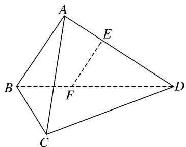

text_image

A
E
B
F
D
C

解析 (1)在平面 $ABD$ 内，因为 $AB \perp AD, EF \perp AD$ ，所以 $AB \parallel EF$ 。又 $EF \nparallel$ 平面 $ABC, ABC \subset$ 平面 $ABC$ 所以 $EF \parallel$ 平面 $ABC$ .

(2)因为平面 $ABD \perp$ 平面 BCD，平面 $ABD \cap$ 平面 BCD = BD， $BC \subset$ 平面 BCD， $BC \perp BD$ ，

所以 $BC \perp$ 平面 ABD.

因为 $AD \subset$ 平面 ABD，所以 $BC \perp AD$ 。又 $AB \perp AD$ ， $BC \cap AB = B$ ， $AB \subset$ 平面 ABC，

$BC \subset$ 平面 $ABC$ ，所以 $AD \perp$ 平面 $ABC$ 。又 $AC \subset$ 平面 $ABC$ ，所以 $AD \perp AC$ 。

[例 2](2015·江苏)如图，在直三棱柱 $ABC-A_{1}B_{1}C_{1}$ 中，已知 $AC \perp BC$ ， $BC = CC_{1}$ 。设 $AB_{1}$ 的中点为 D， $B_{1}C \cap BC_{1} = E$ 。

求证：(1) $DE \parallel$ 平面 $AA_{1}C_{1}C$ ; (2) $BC_{1} \perp AB_{1}$ .

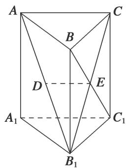

text_image

A
B
C
D
E
A₁
C₁
B₁

解析 (1)由题意知， $E$ 为 $B_{1}C$ 的中点，又 $D$ 为 $AB_{1}$ 的中点，因此 $DE \parallel AC$ .

又因为 $DE \not\subset$ 平面 $AA_{1}C_{1}C$ ， $AC \subset$ 平面 $AA_{1}C_{1}C$ ，所以 $DE \parallel$ 平面 $AA_{1}C_{1}C$ .

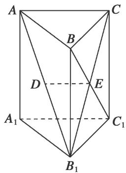

text_image

A
B
C
D
E
A₁
C₁
B₁

(2)因为棱柱 $ABCA_{1}B_{1}C_{1}$ 是直三棱柱，所以 $CC_{1} \perp$ 平面 ABC.

因为 $AC \subset$ 平面 ABC，所以 $AC \perp CC_{1}$ .

又因为 $AC \perp BC$ ， $CC_{1} \subset$ 平面 $BCC_{1}B_{1}$ ， $BC \subset$ 平面 $BCC_{1}B_{1}$ ， $BC \cap CC_{1} = C$ ，所以 $AC \perp$ 平面 $BCC_{1}B_{1}$ .

又因为 $BC_{1} \subset$ 平面 $BCC_{1}B_{1}$ , 所以 $BC_{1} \perp AC$ . 因为 $BC = CC_{1}$ , 所以矩形 $BCC_{1}B_{1}$ 是正方形, 因此 $BC_{1} \perp B_{1}C$ .

因为 $AC, B_{1}C \subset$ 平面 $B_{1}AC, AC \cap B_{1}C = C$ ，所以 $BC_{1} \perp$ 平面 $B_{1}AC$ 。又因为 $AB_{1} \subset$ 平面 $B_{1}AC$ ，所以 $BC_{1} \perp AB_{1}$ 。

[例3]如图，在四棱锥 $S - ABCD$ 中，已知 $SA = SB$ ，四边形ABCD是平行四边形，且平面 $SAB \perp$ 平面ABCD，点 $M, N$ 分别是 $SC, AB$ 的中点.

求证：(1)MN//平面 SAD；(2) $SN \perp AC$ .

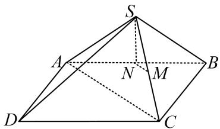

text_image

Geometric diagram of a pyramid with labeled vertices and internal points, used for spatial geometry problems.

解析 (1)取 $SD$ 的中点 $E$ , 连接 $EM, EA$ .

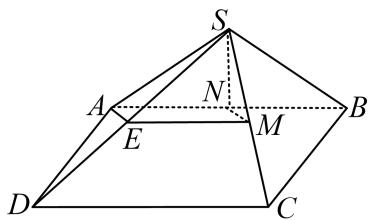

text_image

Geometric diagram of a pyramid with labeled vertices and internal points, used in spatial geometry problems.

∵M是SC的中点，∴EM//CD，且 $EM=\frac{1}{2}CD$ ．∵底面ABCD是平行四边形，N为AB的中点，

∴ AN // CD，且 $AN = \frac{1}{2}CD$ ，∴ EM // AN，EM = AN，∴ 四边形 EMNA 是平行四边形，∴ MN // AE.

∵MN≠平面SAD，AE⊂平面SAD，∴MN//平面SAD.

(2) $\because SA=SB,\ N$ 是AB的中点， $\therefore SN\perp AB,\ \because$ 平面 $SAB\perp$ 平面ABCD,

平面 $SAB \cap$ 平面 ABCD = AB，SN ⊂ 平面 SAB，∴ SN ⊥ 平面 ABCD，∵ AC ⊂ 平面 ABCD，∴ SN ⊥ AC.

[例 4](2016·山东)在如图所示的几何体中，D 是 AC 的中点， $EF \parallel DB$ .

(1)已知 AB=BC，AE=EC，求证： $AC \perp FB$ ;

(2)已知 G，H 分别是 EC 和 FB 的中点，求证：GH// 平面 ABC.

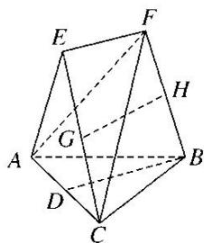

text_image

Geometric diagram of a polyhedron with labeled vertices and internal points, used for spatial geometry problems.

解析 (1)因为 $EF \parallel DB$ ，所以 $EF$ 与 $DB$ 确定平面 $BDEF$ 。如图①，连接 $DE$ 。

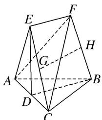

text_image

Geometric diagram of a polyhedron with labeled vertices and internal points, used in spatial geometry problems.

图①

因为 AE=EC，D 为 AC 的中点，所以 $DE \perp AC$ 。同理可得 $BD \perp AC$ 。

又 $BD \cap DE = D$ ，所以 $AC \perp$ 平面 BDEF。因为 $FB \subset$ 平面 BDEF，所以 $AC \perp FB$ 。

(2)如图②，设 FC 的中点为 I，连接 GI，HI.

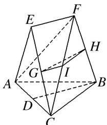

text_image

Geometric diagram of a polyhedron with labeled vertices and internal points, used for spatial geometry problems.

图②

在 $\triangle CEF$ 中，因为 $G$ 是 $CE$ 的中点，所以 $GI//EF$ ．又 $EF//DB$ ，所以 $GI//DB$ ．

在 $\triangle CFB$ 中，因为 $H$ 是 $FB$ 的中点，所以 $HI//BC$ ．又 $HI\cap GI=I$ ，所以平面 $GHI//$ 平面 $ABC$ ．

因为 $GH \subset$ 平面 GHI，所以 $GH \parallel$ 平面 ABC.

# 【对点训练】

1. 如图，在六面体 $ABCDE$ 中，平面 $DBC \perp$ 平面 $ABC$ ， $AE \perp$ 平面 $ABC$ .

(1)求证：AE//平面DBC:

(2)若 $AB \perp BC$ ， $BD \perp CD$ ，求证： $AD \perp DC$ .

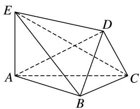

natural_image

Geometric diagram of a polyhedron with labeled vertices A, B, C, D, E (no text or symbols present)

1. 解析 (1) 过点 D 作 $DO \perp BC$ ，O 为垂足.

又∵平面 $DBC \perp$ 平面 ABC，平面 $DBC \cap$ 平面 ABC = BC，DO ⊂ 平面 DBC，

∴DO⊥平面ABC. 又AE⊥平面ABC. ∴AE∥DO.

又 $AE \not\subset$ 平面 $DBC, DO \subset$ 平面 $DBC$ , 故 $AE \parallel$ 平面 $DBC$ .

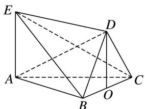

text_image

Geometric diagram of a polyhedron with labeled vertices A, B, C, D, E and center O, showing solid and dashed edges.

(2)由(1)知， $DO \perp$ 平面 ABC， $AB \subset$ 平面 ABC，∴ $DO \perp AB$ .

又 $AB \perp BC$ ，且 $DO \cap BC = O$ ， $DO$ ， $BC \subset$ 平面 $DBC$ ， $\therefore AB \perp$ 平面 $DBC$

∵DC⊂平面DBC，∴AB⊥DC.又BD⊥CD，AB∩DB=B，AB，DB⊂平面ABD，

$\therefore DC \perp$ 平面 $ABD$ . 又 $AD \subset$ 平面 $ABD$ , $\therefore AD \perp DC$ .

2. 如图，在正方体 $ABCD-A_{1}B_{1}C_{1}D_{1}$ 中， $AA_{1}=2$ ，E 为棱 $CC_{1}$ 的中点.

(1)求证： $B_{1}D_{1}\perp AE;$

(2)求证： $AC / /$ 平面 $B_{1}DE$

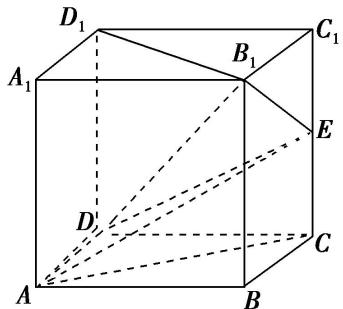

text_image

D₁
A₁
B₁
C₁
E
D
A
B
C

2. 解析 (1)连接 $BD$ , 则 $BD \parallel B_{1}D_{1}$ . $\because$ 四边形 $ABCD$ 是正方形, $\therefore AC \perp BD$ .

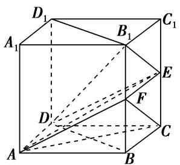

text_image

D₁
A₁
B₁
C₁
E
F
D
A
B
C

∵CE⊥平面ABCD，∴CE⊥BD．又AC∩CE=C，∴BD⊥平面ACE.

∵AE⊂平面ACE，∴BD⊥AE，∴B₁D₁⊥AE.

(2)取 $BB_{1}$ 的中点 F，连接 AF，CF，EF，则 $FC \parallel B_{1}E$ ，∴ $CF \parallel$ 平面 $B_{1}DE$ .

∵E，F是 $CC_{1}$ ， $BB_{1}$ 的中点，∴ $EF\parallel BC$ 。又 $BC\parallel AD$ ，∴ $EF\parallel AD$ ，

∴四边形 ADEF 是平行四边形，∴AF//ED.

∵ $AF \not\subset$ 平面 $B_{1}DE$ ， $ED \subset$ 平面 $B_{1}DE$ ，∴ $AF \parallel$ 平面 $B_{1}DE$ .

∵ $AF \cap CF = F$ ，∴ 平面 $ACF \parallel$ 平面 $B_{1}DE$ 。又∵ $AC \subset$ 平面 ACF，∴ $AC \parallel$ 平面 $B_{1}DE$ 。

3. 如图，在四棱锥 P-ABCD 中， $\angle ADB=90^{\circ}$ ，CB=CD，点 E 为棱 PB 的中点.

(1)若 $PB = PD$ ，求证： $PC\bot BD$ ；(2)求证： $CE / /$ 平面PAD.

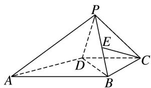

text_image

Geometric diagram of a pyramid with labeled vertices and internal points, used in spatial geometry problems.

3. 解析 (1) 取 BD 的中点 O，连接 CO，PO，

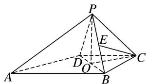

text_image

Geometric diagram of a pyramid with labeled vertices and internal points, used in spatial geometry problems.

因为 CD=CB，所以 $\triangle CBD$ 为等腰三角形，所以 $BD\perp CO$ .

因为 PB=PD，所以 $\triangle PBD$ 为等腰三角形，所以 $BD \perp PO$ .

又 $PO \cap CO = O$ ，PO，CO⊂平面 PCO，所以 BD⊥平面 PCO.

因为 $PC \subset$ 平面 PCO，所以 $PC \perp BD$ .

(2)由 E 为 PB 的中点，连接 EO，则 $EO \parallel PD$ ，

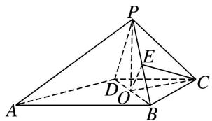

text_image

Geometric diagram of a pyramid with labeled vertices and internal points, used in spatial geometry problems.

又 $EO \nmid$ 平面 $PAD, PD \subset$ 平面 $PAD$ , 所以 $EO \parallel$ 平面 $PAD$ .

由 $\angle ADB=90^{\circ}$ 及 $BD\perp CO$ ，可得 $CO\parallel AD$ ，

又 $CO \nmid$ 平面 $PAD, AD \subset$ 平面 $PAD$ , 所以 $CO \parallel$ 平面 $PAD$ .

又 $CO \cap EO = O$ ，CO，EO⊂平面 COE，所以平面 CEO∥平面 PAD，

而 $CE \subset$ 平面 CEO，所以 $CE \parallel$ 平面 PAD.

4. (2013·江苏)如图, 在三棱锥 $S - ABC$ 中, 平面 $SAB \perp$ 平面 $SBC$ , $AB \perp BC$ , $AS = AB$ . 过 $A$ 作 $AF \perp SB$ , 垂足为 $F$ , 点 $E$ , $G$ 分别是棱 $SA$ , $SC$ 的中点.

求证：(1)平面 $EFG \parallel$ 平面 $ABC$ ；(2) $BC \perp SA$ .

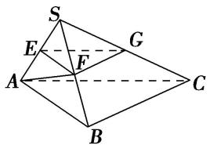

text_image

S
E
G
F
A
C
B

4. 解析 (1)由 AS=AB， $AF \perp SB$ 知 F 为 SB 中点，则 $EF \parallel AB$ ， $FG \parallel BC$ ，

又 $EF \cap FG = F$ ， $AB \cap BC = B$ ，因此平面 EFG // 平面 ABC.

(2)由平面 $SAB \perp$ 平面 SBC，且 $AF \perp SB$ ，知 $AF \perp$ 平面 SBC，则 $AF \perp BC$ .

又 $BC \perp AB$ ， $AF \cap AB = A$ ，则 $BC \perp$ 平面 SAB，又 $SA \subset$ 平面 SAB，因此 $BC \perp SA$ 。

5. 如图 1 所示，在 Rt△ABC 中，∠ABC=90°，D 为 AC 的中点，AE⊥BD 于点 E(不同于点 D)，延长 AE 交 BC 于点 F，将△ABD 沿 BD 折起，得到三棱锥 A₁-BCD，如图 2 所示.

(1)若 M 是 FC 的中点，求证：直线 $DM \parallel$ 平面 $A_{1}EF$ .  
(2)求证： $BD \perp A_{1}F.$   
(3)若平面 $A_{1}BD \perp$ 平面 BCD，试判断直线 $A_{1}B$ 与直线 CD 能否垂直？请说明理由.

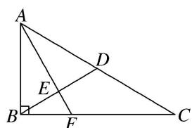

text_image

A
D
E
B
F
C

图1

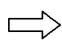

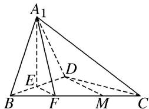

text_image

A₁
E
D
B
F
M
C

图2

5. 解析 (1)证明：∵D，M分别为AC，FC的中点，∴DM//EF,

又∵EF⊂平面 $A_{1}EF$ ，DM∉平面 $A_{1}EF$ ，∴DM//平面 $A_{1}EF$ .

(2)证明：∵ $EF\perp BD$ ， $A_{1}E\perp BD$ ， $A_{1}E\cap EF=E$ ，

$A_{1}E \subset$ 平面 $A_{1}EF$ , $EF \subset$ 平面 $A_{1}EF$ , $\therefore BD \perp$ 平面 $A_{1}EF$ , 又 $A_{1}F \subset$ 平面 $A_{1}EF$ , $\therefore BD \perp A_{1}F$ .

(3)直线 $A_{1}B$ 与直线 CD 不能垂直．理由如下：

∵平面 BCD⊥平面 $A_{1}BD$ ，平面 BCD∩平面 $A_{1}BD=BD$ ，EF⊥BD，EF⊂平面 BCD，∴EF⊥平面 $A_{1}BD$ ，又∵ $A_{1}B⊂$ 平面 $A_{1}BD$ ，∴ $A_{1}B\perp EF$ ，又∵DM∥EF，∴ $A_{1}B\perp DM$ .

假设 $A_{1}B \perp CD,\quad \because DM \cap CD = D,\quad \therefore A_{1}B \perp$ 平面 BCD, $\therefore A_{1}B \perp BD$ , 与 $\angle A_{1}BD$ 为锐角矛盾,

∴直线 $A_{1}B$ 与直线 CD 不能垂直.

# 考点二 线线(线面)(面面)平行+线面垂直问题

# 【例题选讲】

[例1](2014·湖北)如图，在正方体 $ABCD - A_{1}B_{1}C_{1}D_{1}$ 中， $E, F, P, Q, M, N$ 分别是棱 $AB, AD, DD_{1}, BB_{1}, A_{1}B_{1}, A_{1}D_{1}$ 的中点．求证：

(1)直线 $BC_{1} \parallel$ 平面 EFPQ;  
(2)直线 $AC_{1} \perp$ 平面 PQMN.

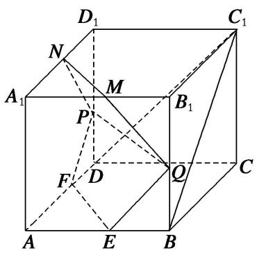

text_image

D₁
C₁
N
M
A₁
P
B₁
F
D
Q
C
A
E
B

解析 (1)如图，连接 $AD_{1}$ ，由 $ABCD - A_{1}B_{1}C_{1}D_{1}$ 是正方体，知 $AD_{1} // BC_{1}$ ，

因为 F, P 分别是 AD, $DD_{1}$ 的中点，所以 $FP \parallel AD_{1}$ ，从而 $BC_{1} \parallel FP$ .

而 $FP \subset$ 平面 EFPQ，且 $BC_{1} \not\subset$ 平面 EFPQ，故直线 $BC_{1} \parallel$ 平面 EFPQ.

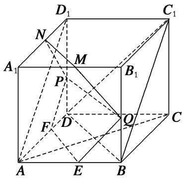

text_image

D₁
C₁
N
M
A₁
P
B₁
F
D
Q
C
A
E
B

(2)连接 AC, BD, 则 $AC \perp BD$ . 由 $CC_{1} \perp$ 平面 ABCD, $BD \subset$ 平面 ABCD, 可得 $CC_{1} \perp BD$ .

又 $AC \cap CC_{1} = C$ ，所以 $BD \perp$ 平面 $ACC_{1}$ 。而 $AC_{1} \subset$ 平面 $ACC_{1}$ ，所以 $BD \perp AC_{1}$ 。

因为 M, N 分别是 $A_{1}B_{1}$ , $A_{1}D_{1}$ 的中点，所以 $MN \parallel BD$ ，从而 $MN \perp AC_{1}$ .

同理可证 $PN \perp AC_{1}$ . 又 $PN \cap MN = N$ ，所以直线 $AC_{1} \perp$ 平面 PQMN.

[例 2]如图，四棱锥 P-ABCD 中，AP⊥平面 PCD，AD∥BC， $AB=BC=\frac{1}{2}AD$ ，E，F 分别为线段 AD，PC 的中点．求证：

(1)AP//平面 BEF;  
(2) $BE \perp$ 平面 PAC.

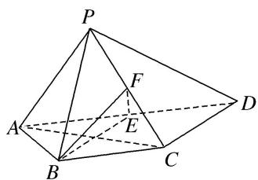

text_image

Geometric diagram of a pyramid with labeled vertices and internal points, used in spatial geometry problems.

解析 (1)设 $AC \cap BE = O$ ，连接 $OF, EC$ ，如图所示。由于 $E$ 为 $AD$ 的中点， $AB = BC = \frac{1}{2} AD, AD \parallel BC,$

所以 $AE \parallel BC$ ，AE = AB = BC，因此四边形 ABCE 为菱形，所以 O 为 AC 的中点.

又 F 为 PC 的中点，因此在 $\triangle PAC$ 中，可得 $AP \parallel OF$ .

又 $OF \subset$ 平面 $BEF$ , $AP \notin$ 平面 $BEF$ . 所以 $AP \parallel$ 平面 $BEF$ .

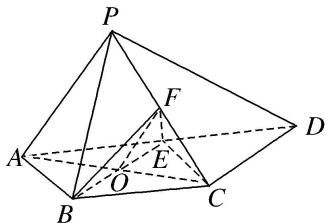

text_image

Geometric diagram of a pyramid with labeled vertices and internal points, used in spatial geometry problems.

(2)由题意知 $ED \parallel BC$ , $ED = BC$ . 所以四边形 $BCDE$ 为平行四边形, 因此 $BE \parallel CD$ .

又 $AP \perp$ 平面 PCD，所以 $AP \perp CD$ ，因此 $AP \perp BE$ .

因为四边形 ABCE 为菱形，所以 $BE \perp AC$ 。又 $AP \cap AC = A$ ，AP，AC < 平面 PAC，所以 $BE \perp$ 平面 PAC。

[例 3]如图,在多面体 ABCDPE 中,四边形 ABCD 和 CDPE 都是直角梯形, $AB \parallel DC, PE \parallel DC, AD \perp DC, PD \perp$ 平面 ABCD, $AB = PD = DA = 2PE, CD = 3PE, F$ 是 CE 的中点.

(1)求证： $BF \parallel$ 平面 ADP;

(2)已知 O 是 BD 的中点，求证： $BD \perp$ 平面 AOF.

text_image

P E
F
D
O
A B C

解析 (1)如图, 取 $PD$ 的中点为 $G$ , 连接 $FG$ , $AG$ ,

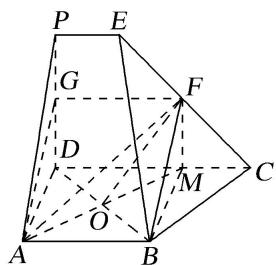

text_image

P E
G F
D M
O A B C

∵F是CE的中点，∴FG是梯形CDPE的中位线，∵CD=3PE，∴FG=2PE，FG//CD，

∵ CD // AB, AB = 2PE, ∴ AB // FG, AB = FG，即四边形 ABFG 是平行四边形，

∴BF//AG，又BF≠平面ADP，AG⊂平面ADP，∴BF//平面ADP.

(2)延长 AO 交 CD 于 M，连接 BM，FM，∵ BA⊥AD，CD⊥DA，AB=AD，O 为 BD 的中点，

∴ABMD 是正方形，则 $BD \perp AM$ ，MD = 2PE. ∴FM // PD，

∵PD⊥平面ABCD，∴FM⊥平面ABCD，∴FM⊥BD，

∵ $AM \cap FM = M$ , ∴ $BD \perp$ 平面 AMF, ∴ $BD \perp$ 平面 AOF.

[例 4]如图所示的多面体中，底面 ABCD 为正方形， $\triangle GAD$ 为等边三角形， $BF \perp$ 平面 ABCD， $\angle GDC = 90^{\circ}$ ，若点 P 为线段 GD 的中点.

(1)求证： $AP \perp$ 平面 GCD;

(2)求证：平面 ADG// 平面 FBC.

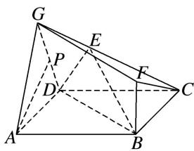

text_image

G
E
P
D
F
C
A
B

解析 (1)因为 $\triangle GAD$ 是等边三角形，点 $P$ 为线段 $GD$ 的中点，所以 $AP \perp GD$ .

因为 $AD \perp CD$ ， $GD \perp CD$ ，且 $AD \cap GD = D$ ，AD， $GD \subset$ 平面 GAD，故 $CD \perp$ 平面 GAD，

又 $AP \subset$ 平面 GAD，所以 $CD \perp AP$ ，又 $CD \cap GD = D$ ，CD， $GD \subset$ 平面 GCD，所以 $AP \perp$ 平面 GCD.

(2)因为 $BF \perp$ 平面 ABCD， $CD \subset$ 平面 ABCD，所以 $BF \perp CD$ ，

因为 $BC \perp CD$ ， $BF \cap BC = B$ ，BF， $BC \subset$ 平面 FBC，

所以 $CD \perp$ 平面 FBC，由(1)知 $CD \perp$ 平面 GAD，所以平面 ADG // 平面 FBC.

[例 5]如图 1，在平面五边形 ABCDE 中， $AB \parallel CE$ ，且 AE=2， $\angle AEC=60^{\circ}$ ， $CD=ED=\sqrt{7}$ ， $\cos\angle EDC=\frac{5}{7}$ 。将 $\triangle CDE$ 沿 CE 折起，使点 D 到 P 的位置，且 $AP=\sqrt{3}$ ，得到如图 2 所示的四棱锥 P-ABCE。

(1)求证： $AP \perp$ 平面 $ABCE$ ;  
(2)记平面 PAB 与平面 PCE 相交于直线 l，求证： $AB \parallel l$ .

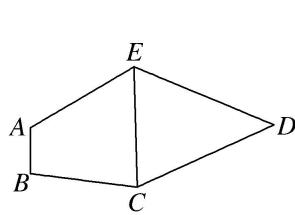

text_image

A
B
C
D
E

图1

text_image

P
A
B
C
E

图2

解析 (1) 在 $\triangle CDE$ 中， $\because CD = ED = \sqrt{7}$ ， $\cos \angle EDC = \frac{5}{7}$ ，

由余弦定理得 $CE = \sqrt{(\sqrt{7})^2 + (\sqrt{7})^2 - 2 \times \sqrt{7} \times \sqrt{7} \times \frac{5}{7}} = 2.$

连接 AC，∵AE=2， $\angle AEC=60^{\circ}$ ，∴AC=2。又 $AP=\sqrt{3}$ ，∴在 $\triangle PAE$ 中， $AP^{2}+AE^{2}=PE^{2}$ ，即 $AP\perp AE$ 。同理， $AP\perp AC$ 。

$\because AC\cap AE=A,\ AC\subset$ 平面 ABCE, $AE\subset$ 平面 ABCE, $\therefore AP\perp$ 平面 ABCE.

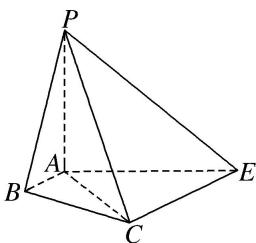

text_image

P
A
B
C
E

(2)∵AB//CE，且CE⊂平面PCE，AB∉平面PCE，∴AB//平面PCE.

又平面 $PAB \cap$ 平面 $PCE = l, \therefore AB \parallel l.$

[例 6] (2015·四川)一个正方体的平面展开图及该正方体的直观图的示意图如图所示.

(1)请将字母 F, G, H 标记在正方体相应的顶点处(不需说明理由);  
(2)判断平面 BEG 与平面 ACH 的位置关系．并证明你的结论；

(3)证明：直线 $DF \perp$ 平面 BEG.

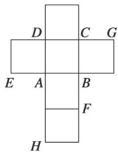

text_image

D C G
E A B
F
H

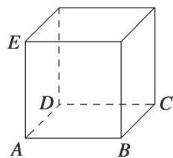

text_image

E
D
C
A
B

解析 (1)点 $F, G, H$ 的位置如图所示.

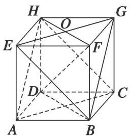

text_image

Geometric diagram of a cube with labeled vertices and internal diagonals, used for spatial geometry problems.

(2) 平面 BEG // 平面 ACH，证明如下：

因为 ABCD-EFGH 为正方体，所以 BC//FG，BC=FG，又 FG//EH，FG=EH，

所以 $BC \parallel EH$ ， $BC = EH$ ，于是 $BCH E$ 为平行四边形，所以 $BE \parallel CH$ ，又 $CH \subset$ 平面 $ACH$ ， $BE \nparallel$ 平面 $ACH$ ，所以 $BE \parallel$ 平面 $ACH$ ，同理 $BG \parallel$ 平面 $ACH$ ，又 $BE \cap BG = B$ ，所以平面 $BEG \parallel$ 平面 $ACH$ .

(3)连接 FH, BD. 因为 ABCD-EFGH 为正方体，所以 DH⊥平面 EFGH,

因为 $EG \subset$ 平面 EFGH，所以 $DH \perp EG$ ，又 $EG \perp FH$ ， $EG \cap FH = O$ ，所以 $EG \perp$ 平面 BFHD，又 $DF \subset$ 平面 BFHD，所以 $DF \perp EG$ ，同理 $DF \perp BG$ ，又 $EG \cap BG = G$ ，所以 $DF \perp$ 平面 BEG.

# 考点三 线面平行+面面垂直问题

# 【例题选讲】

[例 1](2018·江苏)在平行六面体 $ABCD-A_{1}B_{1}C_{1}D_{1}$ 中， $AA_{1}=AB$ ， $AB_{1}\perp B_{1}C_{1}$ .

求证：(1) $AB \parallel$ 平面 $A_{1}B_{1}C$ ; (2)平面 $ABB_{1}A_{1} \perp$ 平面 $A_{1}BC$ .

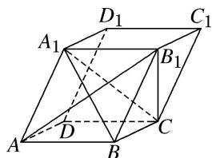

text_image

D₁
A₁
C₁
B₁
A
D
B
C

解析 (1)在平行六面体 $ABCD-A_{1}B_{1}C_{1}D_{1}$ 中， $AB \parallel A_{1}B_{1}$ .

因为 $AB \not\subset$ 平面 $A_{1}B_{1}C$ ， $A_{1}B_{1} \subset$ 平面 $A_{1}B_{1}C$ ，所以 $AB \parallel$ 平面 $A_{1}B_{1}C$ .

(2)在平行六面体 $ABCD-A_{1}B_{1}C_{1}D_{1}$ 中，四边形 $ABB_{1}A_{1}$ 为平行四边形.

又因为 $AA_{1}=AB$ ，所以四边形 $ABB_{1}A_{1}$ 为菱形，因此 $AB_{1}\perp A_{1}B$ 。

因为 $AB_{1} \perp B_{1}C_{1}$ ， $BC \parallel B_{1}C_{1}$ ，所以 $AB_{1} \perp BC$ .

因为 $A_{1}B \cap BC = B,\ A_{1}B \subset$ 平面 $A_{1}BC,\ BC \subset$ 平面 $A_{1}BC$ ，所以 $AB_{1} \perp$ 平面 $A_{1}BC$ .

因为 $AB_{1} \subset$ 平面 $ABB_{1}A_{1}$ ，所以平面 $ABB_{1}A_{1} \perp$ 平面 $A_{1}BC$ .

[例 2](2020·江苏)在三棱柱 $ABC-A_{1}B_{1}C_{1}$ 中， $AB\perp AC$ ， $B_{1}C\perp$ 平面 ABC，E，F 分别是 AC， $B_{1}C$ 的中

点.

(1)求证： $EF \parallel$ 平面 $AB_{1}C_{1}$ ;  
(2)求证：平面 $AB_{1}C \perp$ 平面 $ABB_{1}$ .

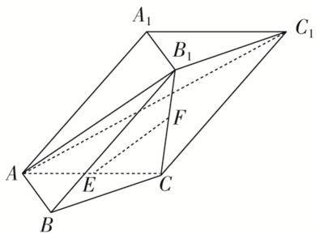

text_image

A₁
B₁
C₁
A
E
C
B

解析 (1)由于 E, F 分别是 AC, $B_{1}C$ 的中点，所以 $EF \parallel AB_{1}$ .

由于 $EF \not\subset$ 平面 $AB_{1}C_{1}$ ， $AB_{1} \subset$ 平面 $AB_{1}C_{1}$ ，所以 $EF \parallel$ 平面 $AB_{1}C_{1}$ .

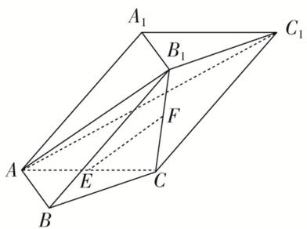

text_image

A₁
B₁
C₁
A
E
C
B

(2)由于 $B_{1}C \perp$ 平面 ABC， $AB \subset$ 平面 ABC，所以 $B_{1}C \perp AB$ .

由于 $AB \perp AC$ ， $AC \cap B_{1}C = C$ ，所以 $AB \perp$ 平面 $AB_{1}C$ ，

由于 $AB \subset$ 平面 $ABB_{1}$ ，所以平面 $AB_{1}C \perp$ 平面 $ABB_{1}$ .

[例 3]如图所示，M，N，K 分别是正方体 ABCD— $A_{1}B_{1}C_{1}D_{1}$ 的棱 AB，CD， $C_{1}D_{1}$ 的中点.

求证：(1)AN//平面 $A_{1}MK$ ;

(2)平面 $A_{1}B_{1}C \perp$ 平面 $A_{1}MK$ .

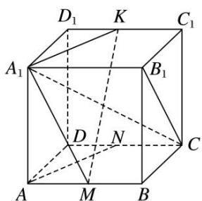

text_image

D₁ K C₁
A₁ B₁
D N C
A M B

解析 (1)如图所示, 连接 $NK$ . 在正方体 $ABCD—A_{1}B_{1}C_{1}D_{1}$ 中,

∵四边形 $AA_{1}D_{1}D$ ， $DD_{1}C_{1}C$ 都为正方形，∴ $AA_{1} // DD_{1}$ ， $AA_{1} = DD_{1}$ ，

$C_{1}D_{1}//CD,\quad C_{1}D_{1}=CD.\quad\because N,\quad K$ 分别为 CD， $C_{1}D_{1}$ 的中点，

∴ $DN \parallel D_{1}K$ ， $DN = D_{1}K$ ，∴ 四边形 $DD_{1}KN$ 为平行四边形，

$\therefore KN\parallel DD_{1},\quad KN=DD_{1},\quad\therefore AA_{1}\parallel KN,\quad AA_{1}=KN,$

∴四边形 $AA_{1}KN$ 为平行四边形，∴ $AN \parallel A_{1}K$ .

又∵ $A_{1}K\subset$ 平面 $A_{1}MK$ ， $AN\not\subset$ 平面 $A_{1}MK$ ，∴AN//平面 $A_{1}MK$ .

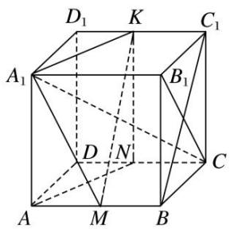

text_image

D₁ K C₁
A₁ B₁
D N C
A M B

(2)如图所示，连接 $BC_{1}$ 。在正方体 $ABCD - A_{1}B_{1}C_{1}D_{1}$ 中， $AB \parallel C_{1}D_{1}$ ， $AB = C_{1}D_{1}$ 。

∵M，K分别为AB， $C_{1}D_{1}$ 的中点，∴ $BM\parallel C_{1}K$ ， $BM=C_{1}K$ ，

∴四边形 $BC_{1}KM$ 为平行四边形，∴ $MK \parallel BC_{1}$ .

在正方体 ABCD— $A_{1}B_{1}C_{1}D_{1}$ 中， $A_{1}B_{1}\perp$ 平面 $BB_{1}C_{1}C$ ， $BC_{1}\subset$ 平面 $BB_{1}C_{1}C$ ， $\therefore A_{1}B_{1}\perp BC_{1}$ .

∵ $MK \parallel BC_{1}$ ，∴ $A_{1}B_{1} \perp MK$ ．∵ 四边形 $BB_{1}C_{1}C$ 为正方形，∴ $BC_{1} \perp B_{1}C$ ，∴ $MK \perp B_{1}C$ .

$\because A_{1}B_{1}\subset$ 平面 $A_{1}B_{1}C,\ B_{1}C\subset$ 平面 $A_{1}B_{1}C,\ A_{1}B_{1}\cap B_{1}C=B_{1},\ \therefore MK\perp$ 平面 $A_{1}B_{1}C.$

又∵MK⊂平面 $A_{1}MK$ ，∴平面 $A_{1}B_{1}C\perp$ 平面 $A_{1}MK$ .

[例 4](2013·山东)如图，在四棱锥 P-ABCD 中， $AB \perp AC$ ， $AB \perp PA$ ， $AB \parallel CD$ ，AB=2CD，E，F，G，M，N 分别为 PB，AB，BC，PD，PC 的中点.

(1)求证： $CE \parallel$ 平面 PAD;

(2)求证：平面 $EFG \perp$ 平面 $EMN$ .

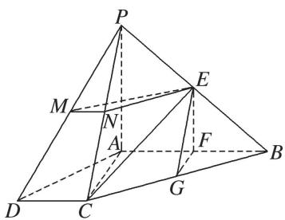

text_image

Geometric diagram of a pyramid with labeled vertices and internal points, used for spatial geometry problems.

解析 (1)方法一 取 $PA$ 的中点 $H$ , 连接 $EH, DH$ . 因为 $E$ 为 $PB$ 的中点, 所以 $EH \parallel \frac{1}{2} AB$ .

又 $CD \parallel \frac{1}{2} AB$ ，所以 $EH \parallel CD$ 。所以四边形 $DCEH$ 是平行四边形，所以 $CE \parallel DH$ .

又 $DH \subset$ 平面 PAD，CE ≠ 平面 PAD，所以 CE // 平面 PAD.

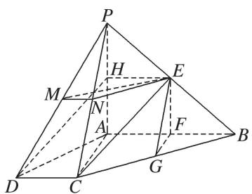

text_image

Geometric diagram of a pyramid with labeled vertices and internal points, used for spatial geometry problems.

方法二 连接 CF. 因为 F 为 AB 的中点，所以 $AF=\frac{1}{2}AB$ . 又 $CD=\frac{1}{2}AB$ ，所以 AF=CD.

又 $AF \parallel CD$ ，所以四边形 AFCD 为平行四边形.

因此 $CF \parallel AD$ ，又 $CF \nsubseteq$ 平面 $PAD$ ， $AD \subset$ 平面 $PAD$ ，所以 $CF \parallel$ 平面 $PAD$ .

因为 E, F 分别为 PB, AB 的中点, 所以 $EF \parallel PA$ .

又 $EF \not\subset$ 平面 PAD， $PA \subset$ 平面 PAD，所以 $EF \parallel$ 平面 PAD.

因为 $CF \cap EF = F$ ，故平面 CEF // 平面 PAD.

又 $CE \subset$ 平面 CEF，所以 $CE \parallel$ 平面 PAD.

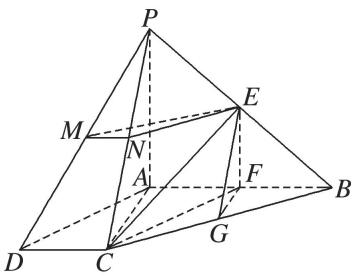

text_image

Geometric diagram of a pyramid with labeled vertices and internal points, used for spatial geometry problems.

(2)因为 E, F 分别为 PB, AB 的中点，所以 $EF \parallel PA$ .

又因为 $AB \perp PA$ ，所以 $EF \perp AB$ ，同理可证 $AB \perp FG$ .

又因为 $EF \cap FG = F$ ，EF， $FG \subset$ 平面 EFG，所以 $AB \perp$ 平面 EFG.

又因为 M, N 分别为 PD, PC 的中点，所以 $MN \parallel CD$ ，又 $AB \parallel CD$ ，所以 $MN \parallel AB$ ，

所以 $MN \perp$ 平面 EFG. 又因为 $MN \subset$ 平面 EMN, 所以平面 $EFG \perp$ 平面 EMN.

[例 5](2015·山东)如图，三棱台 DEF-ABC 中，AB=2DE，G，H 分别为 AC，BC 的中点.

(1)求证： $BD \parallel$ 平面 FGH;

(2)若 $CF \perp BC$ ， $AB \perp BC$ ，求证：平面 $BCD \perp$ 平面 EGH.

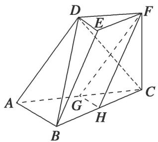

text_image

Geometric diagram of a triangular prism with labeled vertices and internal points

解析 (1)方法一 连接 $DG$ ，设 $CD \cap GF = M$ ，连接 $MH$ 。在三棱台 $DEF - ABC$ 中，

AB=2DE, G 为 AC 的中点，可得 $DF \parallel GC$ , DF=GC，所以四边形 DFCG 为平行四边形.

则 M 为 CD 的中点，又 H 为 BC 的中点，所以 HM // BD，又 HM ⊂ 平面 FGH，BD ⊙ 平面 FGH，所以 BD // 平面 FGH.

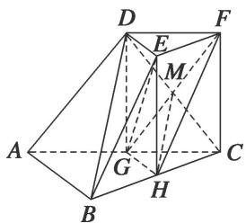

text_image

Geometric diagram of a polyhedron with labeled vertices and internal points, used in spatial geometry problems.

方法二 在三棱台 DEF-ABC 中，由 BC=2EF，H 为 BC 的中点，可得 BH//EF，BH=EF，

所以四边形 HBEF 为平行四边形，可得 BE // HF。在 $\triangle ABC$ 中，G 为 AC 的中点，

H 为 BC 的中点，所以 GH // AB。又 GH ∩ HF = H，所以平面 FGH // 平面 ABED。

又因为 $BD \subset$ 平面 ABED，所以 BD // 平面 FGH.

(2)连接 $HE, GE$ . 因为 $G, H$ 分别为 $AC, BC$ 的中点，所以 $GH \parallel AB$ .

由 $AB \perp BC$ ，得 $GH \perp BC$ 。又 H 为 BC 的中点，所以 $EF \parallel HC$ ，EF = HC，

因此四边形 EFCH 是平行四边形，所以 CF//HE. 又 CF⊥BC，所以 HE⊥BC.

又 $HE, GH \subset$ 平面 $EGH, HE \cap GH = H$ , 所以 $BC \perp$ 平面 $EGH$ .

又 $BC \subset$ 平面 BCD，所以平面 $BCD \perp$ 平面 EGH.

[例 6]如图，在四棱锥 P-ABCD 中，底面 ABCD 是矩形，且 $AB=\sqrt{2}BC$ ，E，F 分别在线段 AB，CD 上，G，H 在线段 PC 上， $EF\perp PA$ ，且 $\frac{BE}{BA}=\frac{DF}{DC}=\frac{PG}{PC}=\frac{CH}{CP}=\frac{1}{4}$ 。求证：

(1) $EH \parallel$ 平面 PAD;

(2)平面 $EFG \perp$ 平面 PAC.

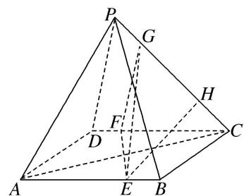

text_image

Geometric diagram of a pyramid with labeled vertices and internal points, used for spatial geometry problems.

解析 (1)如图，在 $PD$ 上取点 $M$ ，使得 $\frac{DM}{DP} = \frac{1}{4}$ ，连接 $AM$ ， $MH$ ，则 $\frac{DM}{DP} = \frac{CH}{CP} = \frac{1}{4}$ 所以 $MH=\frac{3}{4}DC$ ，MH//CD，又 $AE=\frac{3}{4}AB$ ，四边形 ABCD 是矩形，

所以 MH=AE, MH//AE, 所以四边形 AEHM 为平行四边形, 所以 EH//AM,又 $AM \subset$ 平面 PAD, $EH \notin$ 平面 PAD, 所以 $EH \parallel$ 平面 PAD.

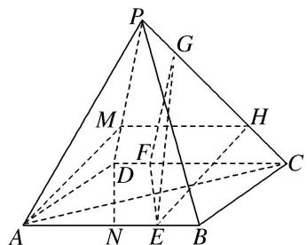

text_image

Geometric diagram of a pyramid with labeled vertices and internal points, used for spatial geometry problems.

(2)取 AB 的中点 N，连接 DN，则 NE=DF，NE//DF，则四边形 NEFD 为平行四边形，则 DN//EF，在 $\triangle DAN$ 和 $\triangle CDA$ 中， $\angle DAN = \angle CDA$ ， $\frac{AN}{DA} = \frac{1}{\sqrt{2}} = \frac{DA}{CD}$ ，则 $\triangle DAN \sim \triangle CDA$

则 $\angle ADN = \angle DCA$ ，则 $DN \perp AC$ ，则 $EF \perp AC$ ，又 $EF \perp PA, AC \cap PA = A$ ，所以 $EF \perp$ 平面 PAC，

又 $EF \subset$ 平面 EFG，所以平面 $EFG \perp$ 平面 PAC.

# 【对点训练】

1. 如图，在直三棱柱 $ABC - A_{1}B_{1}C_{1}$ 中， $D, E$ 分别为 $AB, BC$ 的中点，点 $F$ 在侧棱 $B_{1}B$ 上，且 $B_{1}D \perp A_{1}F, A_{1}C_{1} \perp A_{1}B_{1}$ .

求证：(1)直线 $DE \parallel$ 平面 $A_{1}C_{1}F$ ; (2)平面 $B_{1}DE \perp$ 平面 $A_{1}C_{1}F$ .

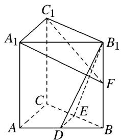

text_image

C₁
A₁
B₁
F
C
E
A
D
B

1. 解析 (1)在直三棱柱 $ABC - A_{1}B_{1}C_{1}$ 中， $AC \parallel A_{1}C_{1}$ ，在 $\triangle ABC$ 中，

因为 D, E 分别为 AB, BC 的中点. 所以 $DE \parallel AC$ , 于是 $DE \parallel A_{1}C_{1}$ ,

又因为 $DE \not\subset$ 平面 $A_{1}C_{1}F$ ， $A_{1}C_{1} \subset$ 平面 $A_{1}C_{1}F$ ，所以直线 $DE \parallel$ 平面 $A_{1}C_{1}F$ .

(2)在直三棱柱 $ABC-A_{1}B_{1}C_{1}$ 中， $AA_{1}\perp$ 平面 $A_{1}B_{1}C_{1}$ ，因为 $A_{1}C_{1}\subset$ 平面 $A_{1}B_{1}C_{1}$ ，所以 $AA_{1}\perp A_{1}C_{1}$ ，

又因为 $A_{1}C_{1}\perp A_{1}B_{1}$ ， $A_{1}B_{1}\cap AA_{1}=A_{1}$ ， $AA_{1}\subset$ 平面 $ABB_{1}A_{1}$ ， $A_{1}B_{1}\subset$ 平面 $ABB_{1}A_{1}$ ，所以 $A_{1}C_{1}\perp$ 平面 $ABB_{1}A_{1}$ ，因为 $B_{1}D\subset$ 平面 $ABB_{1}A_{1}$ ，所以 $A_{1}C_{1}\perp B_{1}D$ ，

又因为 $B_{1}D \perp A_{1}F$ ， $A_{1}C_{1} \cap A_{1}F = A_{1}$ ， $A_{1}C_{1} \subset$ 平面 $A_{1}C_{1}F$ ， $A_{1}F \subset$ 平面 $A_{1}C_{1}F$ ，

所以 $B_{1}D \perp$ 平面 $A_{1}C_{1}F$ ，因为直线 $B_{1}D \subset$ 平面 $B_{1}DE$ ，所以平面 $B_{1}DE \perp$ 平面 $A_{1}C_{1}F$ .

2. 如图所示，在三棱柱 $ABC - A_{1}B_{1}C_{1}$ 中， $AB = AC$ ，侧面 $BCC_{1}B_{1} \perp$ 底面 $ABC$ ， $E$ ， $F$ 分别为棱 $BC$ 和 $A_{1}C_{1}$ 的中点.

(1)求证： $EF \parallel$ 平面 $ABB_{1}A_{1}$ ;

(2)求证：平面 $AEF \perp$ 平面 $BCC_{1}B_{1}$ .

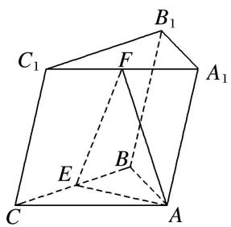

text_image

C₁
F
B₁
A₁
E
B
C
A

2. 解析 (1)如图, 取 $A_{1}B_{1}$ 的中点 $G$ , 连接 $BG$ , $FG$ , 在 $\triangle A_{1}B_{1}C_{1}$ 中,

因为 F, G 分别为 $A_{1}C_{1}$ , $A_{1}B_{1}$ 的中点，所以 $FG \parallel B_{1}C_{1}$ ，且 $FG = \frac{1}{2}B_{1}C_{1}$ .

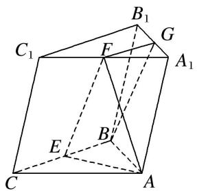

text_image

C₁
B₁
F
G
A₁
E
B
C
A

在三棱柱 $ABC-A_{1}B_{1}C_{1}$ 中， $BC \parallel B_{1}C_{1}$ . 又 E 为棱 BC 的中点，所以 $FG \parallel BE$ ，且 FG = BE，

所以四边形 BEFG 为平行四边形，所以 EF // BG，

又因为 $BG \subset$ 平面 $ABB_{1}A_{1}$ ， $EF \nsubseteq$ 平面 $ABB_{1}A_{1}$ ，所以 $EF \parallel$ 平面 $ABB_{1}A_{1}$ .

(2)在 $\triangle ABC$ 中，因为AB=AC，E为BC的中点，所以 $AE\perp BC$ ，

又侧面 $BCC_{1}B_{1} \perp$ 底面 ABC，侧面 $BCC_{1}B_{1} \cap$ 底面 ABC = BC，且 $AE \subset$ 平面 ABC，

所以 $AE \perp$ 平面 $BCC_{1}B_{1}$ ，又 $AE \subset$ 平面 AEF，所以平面 $AEF \perp$ 平面 $BCC_{1}B_{1}$ .

3. (2017·山东)由四棱柱 $ABCD-A_{1}B_{1}C_{1}D_{1}$ 截去三棱锥 $C_{1}-B_{1}CD_{1}$ 后得到的几何体如图所示. 四边形 ABCD 为正方形, O 为 AC 与 BD 的交点, E 为 AD 的中点, $A_{1}E \perp$ 平面 ABCD.

(1)证明： $A_{1}O \parallel$ 平面 $B_{1}CD_{1}$ ;  
(2)设 M 是 OD 的中点，证明：平面 $A_{1}EM \perp$ 平面 $B_{1}CD_{1}$ .

text_image

Geometric diagram of a polyhedron with labeled vertices and internal points, used in spatial geometry problems.

3. 解析 (1)取 $B_{1}D_{1}$ 的中点 $O_{1}$ , 连接 $CO_{1}, A_{1}O_{1}$ , 因为 $ABCD - A_{1}B_{1}C_{1}D_{1}$ 是四棱柱, 所以 $A_{1}O_{1} // OC$ , $A_{1}O_{1} = OC$ , 因此四边形 $A_{1}OCO_{1}$ 为平行四边形, 所以 $A_{1}O // O_{1}C$ , 因为 $O_{1}C \subset$ 平面 $B_{1}CD_{1}$ , $A_{1}O \not\subset$ 平面 $B_{1}CD_{1}$ , 所以 $A_{1}O //$ 平面 $B_{1}CD_{1}$ .

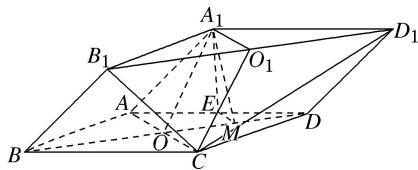

text_image

Geometric diagram of a polyhedron with labeled vertices and internal points, used in spatial geometry problems.

(2)因为 E, M 分别为 AD, OD 的中点，所以 $EM \parallel AO$ 。因为 $AO \perp BD$ ，所以 $EM \perp BD$ ，

又 $A_{1}E \perp$ 平面 ABCD， $BD \subset$ 平面 ABCD，所以 $A_{1}E \perp BD$ ，

因为 $B_{1}D_{1} \parallel BD$ ，所以 $EM \perp B_{1}D_{1}$ ， $A_{1}E \perp B_{1}D_{1}$ ，又 $A_{1}E \subset$ 平面 $A_{1}EM$ ， $EM \subset$ 平面 $A_{1}EM$ ， $A_{1}E \cap EM = E$ ，所以 $B_{1}D_{1} \perp$ 平面 $A_{1}EM$ ，又 $B_{1}D_{1} \subset$ 平面 $B_{1}CD_{1}$ ，所以平面 $A_{1}EM \perp$ 平面 $B_{1}CD_{1}$ 。

4. 如图，在四棱锥 $P - ABCD$ 中， $AB \parallel CD$ ， $AB \perp AD$ ， $CD = 2AB$ ，平面 $PAD \perp$ 底面 $ABCD$ ， $PA \perp AD$ ， $E$ ， $F$ 分别是 $CD$ ， $PC$ 的中点.

求证：(1) $BE \parallel$ 平面 PAD；(2)平面 $BEF \perp$ 平面 PCD.

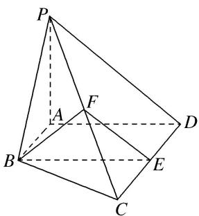

text_image

Geometric diagram of a pyramid with labeled vertices and internal points, used in spatial geometry problems.

4. 解析 (1)∵AB//CD, CD=2AB, E是CD的中点，∴AB//DE且AB=DE,

∴四边形 ABED 为平行四边形，∴AD//BE，又 BE∉平面 PAD，AD⊂平面 PAD，∴BE//平面 PAD.

(2)∵AB⊥AD，∴四边形ABED为矩形，∴BE⊥CD，AD⊥CD，

∵平面 PAD⊥底面 ABCD，平面 PAD∩底面 ABCD=AD，PA⊥AD，∴PA⊥底面 ABCD，

∴ $PA \perp CD$ ，又 $PA \cap AD = A$ ，∴ $CD \perp$ 平面 PAD，∴ $CD \perp PD$ ，

∵E，F分别是CD，PC的中点，∴PD∥EF，∴CD⊥EF，又EF∩BE=E，∴CD⊥平面BEF，
∵CD⊂平面PCD，∴平面BEF⊥平面PCD.

5. 如图，四边形 ABCD 是正方形，O 是正方形的中心， $PO \perp$ 底面 ABCD，E 是 PC 的中点．求证：

(1)PA//平面BDE;   
(2)平面 PAC⊥平面 BDE.

text_image

Geometric diagram of a pyramid with labeled vertices and internal points, used in spatial geometry problems.

5. 解析 (1)如图， $AC \cap BD = O$ ，连接 OE，

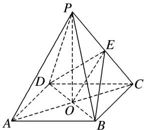

text_image

Geometric diagram of a pyramid with labeled vertices and internal points, used in spatial geometry problems.

在 $\triangle PAC$ 中，O 是 AC 的中点，E 是 PC 的中点，∴ $OE \parallel AP$ ，

又∵OE⊂平面BDE，PA≠平面BDE.∴PA∥平面BDE.

(2)∵PO⊥底面ABCD，BD⊂底面ABCD，∴PO⊥BD，

又∵ $AC\perp BD$ ，且 $AC\cap PO=O$ ， $AC\subset$ 平面PAC， $PO\subset$ 平面PAC，

∴ BD⊥平面 PAC，而 BD⊂平面 BDE，∴ 平面 PAC⊥平面 BDE.

6. 如图，四棱锥 $P - ABCD$ 的底面是矩形， $PA \perp$ 平面 $ABCD$ ， $E$ ， $F$ 分别是 $AB$ ， $PD$ 的中点，且 $PA = AD$ . 求证：(1) $AF //$ 平面 $PEC$ ；(2) 平面 $PEC \perp$ 平面 $PCD$ .

text_image

Geometric diagram of a pyramid with labeled vertices and internal points, used in spatial geometry problems.

6. 解析 (1)取 PC 的中点 G，连接 FG，EG，∵F 为 PD 的中点，G 为 PC 的中点，

∴FG 为△CDP 的中位线，∴FG // CD， $FG=\frac{1}{2}CD$ .

∵四边形ABCD为矩形，E为AB的中点，∴AE//CD， $AE=\frac{1}{2}CD$ .

∴ FG = AE, $FG \parallel AE$ , ∴ 四边形 AEGF 是平行四边形,

∴AF//EG，又EG⊂平面PEC，AF∉平面PEC，∴AF//平面PEC.

text_image

Geometric diagram of a pyramid with labeled vertices and internal points, used for spatial geometry problems.

(2) $\because PA=AD,\ F$ 为PD中点， $\therefore AF\perp PD,$

∵PA⊥平面ABCD，CD⊂平面ABCD，∴PA⊥CD，

又∵CD⊥AD，AD∩PA=A，∴CD⊥平面PAD，∵AF⊂平面PAD，∴CD⊥AF.

又 $PD \cap CD = D, \therefore AF \perp$ 平面 PCD.

由(1)知 $EG \parallel AF$ ，∴ $EG \perp$ 平面 PCD，又 $EG \subset$ 平面 PEC，∴ 平面 $PEC \perp$ 平面 PCD.

7. 如图，在几何体 $ABCDE$ 中， $AB = AD = 2$ ， $AB \perp AD$ ， $AE \perp$ 平面 $ABD$ ， $M$ 为线段 $BD$ 的中点， $MC // AE$ ，且 $AE = MC = \sqrt{2}$ .

(1)求证：平面 $BCD \perp$ 平面 CDE;

(2)若 N 为线段 DE 的中点，求证：平面 AMN// 平面 BEC.

text_image

Geometric diagram of a tetrahedron with labeled vertices and internal points, used for spatial geometry problems.

7. 解析 (1) $\because AB = AD = 2, AB \perp AD, M$ 为线段 $BD$ 的中点, $\therefore AM = \frac{1}{2} BD = \sqrt{2}, AM \perp BD$ .

∵AE⊥平面 ABD, MC∥AE, ∴MC⊥平面 ABD,

∵AM⊂平面ABD. ∴MC⊥AM，又MC∩BD=M，∴AM⊥平面BCD.

又 $AE=MC=\sqrt{2}$ ，∴四边形 AMCE 为平行四边形，∴ $EC \parallel AM$ ，

∴EC⊥平面BCD，∵EC⊂平面CDE，∴平面BCD⊥平面CDE.

(2)∵M为BD的中点，N为DE的中点，∴MN//BE. ∵MN∉平面BEC，BE⊂平面BEC.

∴MN//面 BEC. 由(1)知 EC//AM, ∵EC⊂平面 BEC, AM∉平面 BEC.

∴AM//面 BEC，又∵AM∩MN=M. AM⊂平面 AMN, MN⊂平面 AMN. ∴平面 AMN//平面 BEC.

8. 在如图所示的几何体中, 四边形 $ABCD$ 是正方形, $MA \perp$ 平面 $ABCD$ , $PD \parallel MA$ , $E$ , $G$ , $F$ 分别为 $MB$ , $PB$ , $PC$ 的中点.

(1)求证：平面 EFG // 平面 PMA;

(2)求证：平面 $EFG \perp$ 平面 PDC.

text_image

Geometric diagram of a pyramid with labeled vertices and internal points, used for spatial geometry problems.

8. 解析 (1)∵E, G, F分别为MB, PB, PC的中点，∴EG//PM, GF//BC.

又∵四边形 ABCD 是正方形，∴BC∥AD，∴GF∥AD.

∵EG, GF在平面PMA外, PM, AD在平面PMA内, ∴EG//平面PMA, GF//平面PMA.

又∵EG，GF都在平面EFG内且相交，∴平面 $EFG \parallel$ 平面PMA.

(2)由已知 $MA \perp$ 平面 $ABCD$ , $PD \parallel MA$ , $\therefore PD \perp$ 平面 $ABCD$ .

又 $BC \subset$ 平面 ABCD，∴ $PD \perp BC$ ．∵ 四边形 ABCD 为正方形，∴ $BC \perp DC$ ．

又 $PD \cap DC = D$ ， $\therefore BC \perp$ 平面 $PDC$ 。由(1)知 $GF \parallel BC$ ， $\therefore GF \perp$ 平面 $PDC$ 。

又 $GF \subset$ 平面 EFG，∴平面 $EFG \perp$ 平面 PDC.

9. (2013·北京)如图, 在四棱锥 $P - ABCD$ 中, $AB \parallel CD$ , $AB \perp AD$ , $CD = 2AB$ , 平面 $PAD \perp$ 底面 $ABCD$ , $PA \perp AD$ , $E$ 和 $F$ 分别是 $CD$ 和 $PC$ 的中点, 求证:

(1) $PA \perp$ 底面 ABCD;  
(2)BE//平面 PAD;  
(3)平面 BEF⊥平面 PCD.

text_image

Geometric diagram of a pyramid with labeled vertices and internal points, used in spatial geometry problems.

9. 解析 (1)∵平面 PAD⊥底面 ABCD，且 PA 垂直于这两个平面的交线 AD，PA⊂平面 PAD，

$\therefore PA \perp$ 底面 ABCD.

(2)∵AB//CD，CD=2AB，E为CD的中点，∴AB//DE，且AB=DE.

∴四边形 ABED 为平行四边形．∴BE // AD.

又∵BE∉平面 PAD，AD⊂平面 PAD，∴BE∥平面 PAD.

(3)∵AB⊥AD，且四边形ABED为平行四边形．∴BE⊥CD，AD⊥CD，

由(1)知 $PA \perp$ 底面 ABCD. $\therefore PA \perp CD$ . $\because PA \cap AD = A$ , $PA \subset$ 平面 PAD, $AD \subset$ 平面 PAD,

∴CD⊥平面 PAD，又 PD⊂平面 PAD，∴CD⊥PD.

∵E和F分别是CD和PC的中点，∴PD∥EF，∴CD⊥EF.

又 $BE \perp CD$ 且 $EF \cap BE = E$ ，∴ $CD \perp$ 平面 BEF。又 $CD \subset$ 平面 PCD，∴ 平面 $BEF \perp$ 平面 PCD。

10. (2018·北京)如图, 在四棱锥 $P - ABCD$ 中, 底面 $ABCD$ 为矩形, 平面 $PAD \perp$ 平面 $ABCD$ , $PA \perp PD$ , $PA = PD$ , $E$ , $F$ 分别为 $AD$ , $PB$ 的中点.

(1)求证： $PE \perp BC;$   
(2)求证：平面 $PAB \perp$ 平面 PCD;  
(3)求证： $EF \parallel$ 平面 PCD.

text_image

P
A
E
F
D
B
C

10. 解析 (1) 因为 $PA = PD$ , $E$ 为 $AD$ 的中点, 所以 $PE \perp AD$ .

因为底面 ABCD 为矩形，所以 BC // AD．所以 PE ⊥ BC.

(2)因为底面 ABCD 为矩形，所以 $AB \perp AD$ 。又因为平面 $PAD \perp$ 平面 ABCD，
平面 $PAD \cap$ 平面 ABCD = AD, $AB \subset$ 平面 ABCD, 所以 $AB \perp$ 平面 PAD, 且 $PD \subset$ 平面 PAD. 所以 $AB \perp PD$ .
又因为 $PA \perp PD$ ，且 $PA \cap AB = A$ ，所以 $PD \perp$ 平面 PAB。又 $PD \subset$ 平面 PCD，
所以平面 $PAB \perp$ 平面 PCD.

(3)如图，取 PC 中点 G，连接 FG，DG.

text_image

P
E
A
B
C
D
G
F

因为 F, G 分别为 PB, PC 的中点, 所以 $FG \parallel BC$ , $FG = \frac{1}{2} BC$ .

因为 ABCD 为矩形，且 E 为 AD 的中点，所以 $DE \parallel BC$ ， $DE = \frac{1}{2} BC$ .

所以 $DE \parallel FG$ ，且 $DE = FG$ 。所以四边形 $DEFG$ 为平行四边形。所以 $EF \parallel DG$ 。

又因为 $EF \not\subset$ 平面 PCD，DG⊂平面 PCD，所以 $EF \parallel$ 平面 PCD.

