**专题08　立体几何中平行与垂直的证明问题**

**1．直线、平面平行的判定及其性质**

(1)线面平行的判定定理：*a*⊄*α*，*b*⊂*α*，*a*∥*b*⇒*a*∥*α*．

(2)线面平行的性质定理：*a*∥*α*，*a*⊂*β*，*α*∩*β*＝*b*⇒*a*∥*b*．

(3)面面平行的判定定理：*a*⊂*β*，*b*⊂*β*，*a*∩*b*＝*P*，*a*∥*α*，*b*∥*α*⇒*α*∥*β*．

(4)面面平行的性质定理：*α*∥*β*，*α*∩*γ*＝*a*，*β*∩*γ*＝*b*⇒*a*∥*b．*

平行问题的转化

利用线线平行、线面平行、面面平行的相互转化解决平行关系的判定问题时，一般遵循从“低维”到“高维”的转化，即从“线线平行”到“线面平行”，再到“面面平行”；而应用性质定理时，其顺序正好相反．在实际的解题过程中，判定定理和性质定理一般要相互结合，灵活运用．

平行关系的基础是线线平行，证明线线平行常用的方法：一是利用平行公理，即证两直线同时和第三条直线平行；二是利用平行四边形进行平行转换：三是利用三角形的中位线定理证线线平行；四是利用线段的比例关系证明线线平行；五是利用线面平行、面面平行的性质定理进行平行转换．

**2．直线、平面垂直的判定及其性质**

(1)线面垂直的判定定理：*m*⊂*α*，*n*⊂*α*，*m*∩*n*＝*P*，*l*⊥*m*，*l*⊥*n*⇒*l*⊥*α*．

(2)线面垂直的性质定理：*a*⊥*α*，*b*⊥*α*⇒*a*∥*b*．

(3)面面垂直的判定定理：*a*⊂*β*，*a*⊥*α*⇒*α*⊥*β*．

(4)面面垂直的性质定理：*α*⊥*β*，*α*∩*β*＝*l*，*a*⊂*α*，*a*⊥*l*⇒*a*⊥*β*．

垂直问题的转化

在空间垂直关系中，线面垂直是核心，已知线面垂直，既可为证明线线垂直提供依据，又可为利用判定定理证明面面垂直作好铺垫．应用面面垂直的性质定理时，一般需作辅助线，基本作法是过其中一个平面内一点作交线的垂线，从而把面面垂直问题转化为线面垂直问题，进而可转化为线线垂直问题．

垂直关系的基础是线线垂直，证明线线垂直常用的方法：一是利用等腰三角形底边中线即高线的性质；二是利用勾股定理；三是利用线面垂直的性质：即要证两线垂直，只需证明一线垂直于另一线所在的平面即可，*l*⊥*α*，*a*⊂*α*⇒*l*⊥*a*．

**考点一　线线垂直＋线面平行问题**

**【例题选讲】**

<strong>[例1]</strong>(2017·江苏)如图，在三棱锥<em>A</em>—<em>BCD</em>中，<em>AB</em>⊥<em>AD</em>，<em>BC</em>⊥<em>BD</em>，平面<em>ABD</em>⊥平面<em>BCD</em>，点<em>E</em>，<em>F</em>(<em>E</em>与<em>A</em>，<em>D</em>不重合)分别在棱<em>AD</em>，<em>BD</em>上，且<em>EF</em>⊥<em>AD</em>．

求证：(1)*EF*∥平面*ABC*；(2)*AD*⊥*AC*．

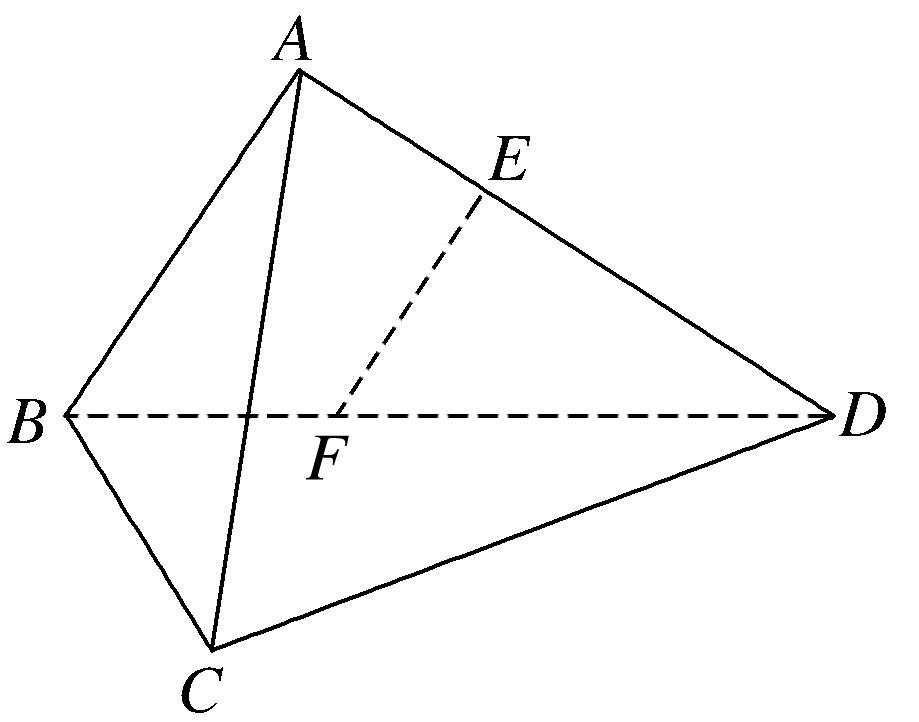

解析　(1)在平面*ABD*内，因为*AB*⊥*AD*，*EF*⊥*AD*，所以*AB*∥*EF*．又*EF*⊄平面*ABC*，*AB*⊂平面*ABC*，

所以*EF*∥平面*ABC*．

(2)因为平面*ABD*⊥平面*BCD*，平面*ABD*∩平面*BCD*＝*BD*，*BC*⊂平面*BCD*，*BC*⊥*BD*，

所以*BC*⊥平面*ABD*．

因为*AD*⊂平面*ABD*，所以*BC*⊥*AD*．又*AB*⊥*AD*，*BC*∩*AB*＝*B*，*AB*⊂平面*ABC*，

*BC*⊂平面*ABC*，所以*AD*⊥平面*ABC*．又*AC*⊂平面*ABC*，所以*AD*⊥*AC*．

<strong>[例2]</strong>(2015·江苏)如图，在直三棱柱<em>ABC－A</em>1<em>B</em>1<em>C</em>1中，已知<em>AC</em>⊥<em>BC</em>，<em>BC</em>＝<em>CC</em>1．设<em>AB</em>1的中点为<em>D</em>，<em>B</em>1<em>C</em>∩<em>BC</em>1＝<em>E</em>．

求证：(1)<em>DE</em>∥平面<em>AA</em>1<em>C</em>1<em>C</em>；(2)<em>BC</em>1⊥<em>AB</em>1．

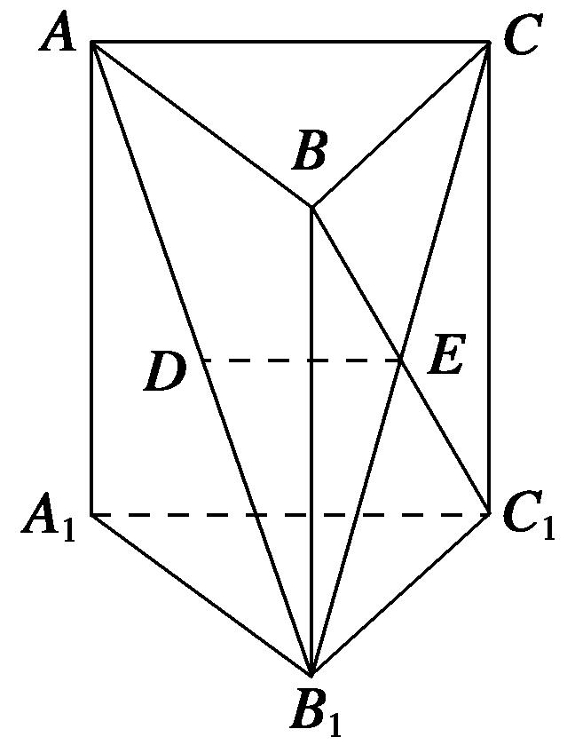

解析　(1)由题意知，<em>E</em>为<em>B</em>1<em>C</em>的中点，又<em>D</em>为<em>AB</em>1的中点，因此<em>DE</em>∥<em>AC</em>．

又因为<em>DE</em>⊄平面<em>AA</em>1<em>C</em>1<em>C</em>，<em>AC</em>⊂平面<em>AA</em>1<em>C</em>1<em>C</em>，所以<em>DE</em>∥平面<em>AA</em>1<em>C</em>1<em>C</em>．

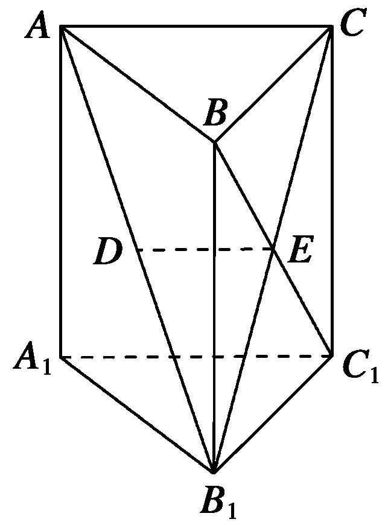

(2)因为棱柱<em>ABCA</em>1<em>B</em>1<em>C</em>1是直三棱柱，所以<em>CC</em>1⊥平面<em>ABC</em>．

因为<em>AC</em>⊂平面<em>ABC</em>，所以<em>AC</em>⊥<em>CC</em>1．

又因为<em>AC</em>⊥<em>BC</em>，<em>CC</em>1⊂平面<em>BCC</em>1<em>B</em>1，<em>BC</em>⊂平面<em>BCC</em>1<em>B</em>1，<em>BC</em>∩<em>CC</em>1＝<em>C</em>，所以<em>AC</em>⊥平面<em>BCC</em>1<em>B</em>1．

又因为<em>BC</em>1⊂平面<em>BCC</em>1<em>B</em>1，所以<em>BC</em>1⊥<em>AC</em>．因为<em>BC</em>＝<em>CC</em>1，所以矩形<em>BCC</em>1<em>B</em>1是正方形，因此<em>BC</em>1⊥<em>B</em>1<em>C</em>．

因为<em>AC</em>，<em>B</em>1<em>C</em>⊂平面<em>B</em>1<em>AC</em>，<em>AC</em>∩<em>B</em>1<em>C</em>＝<em>C</em>，所以<em>BC</em>1⊥平面<em>B</em>1<em>AC</em>．又因为<em>AB</em>1⊂平面<em>B</em>1<em>AC</em>，所以<em>BC</em>1⊥<em>AB</em>1．

<strong>[例3]</strong>如图，在四棱锥<em>S</em>－<em>ABCD</em>中，已知<em>SA</em>＝<em>SB</em>，四边形<em>ABCD</em>是平行四边形，且平面<em>SAB</em>⊥平面<em>ABCD</em>，点<em>M</em>，<em>N</em>分别是<em>SC</em>，<em>AB</em>的中点．

求证：(1)*MN*∥平面*SAD*；(2)*SN*⊥*AC*．

解析　(1)取*SD*的中点*E*，连接*EM*，*EA*．

∵*M*是*SC*的中点，∴*EM*∥*CD*，且*EM*＝*CD*．∵底面*ABCD*是平行四边形，*N*为*AB*的中点，

∴*AN*∥*CD*，且*AN*＝*CD*，∴*EM*∥*AN*，*EM*＝*AN*，∴四边形*EMNA*是平行四边形，∴*MN*∥*AE*．

∵*MN*⊄平面*SAD*，*AE*⊂平面*SAD*，∴*MN*∥平面*SAD*．

(2)∵*SA*＝*SB*，*N*是*AB*的中点，∴*SN*⊥*AB*，∵平面*SAB*⊥平面*ABCD*，

平面*SAB*∩平面*ABCD*＝*AB*，*SN*⊂平面*SAB*，∴*SN*⊥平面*ABCD*，∵*AC*⊂平面*ABCD*，∴*SN*⊥*AC*．

<strong>[例4]</strong>(2016·山东)在如图所示的几何体中，<em>D</em>是<em>AC</em>的中点，<em>EF</em>∥<em>DB</em>．

(1)已知*AB*＝*BC*，*AE*＝*EC*，求证：*AC*⊥*FB*；

(2)已知*G*，*H*分别是*EC*和*FB*的中点，求证：*GH*∥平面*ABC*．

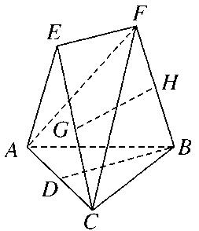

解析　(1)因为*EF*∥*DB*，所以*EF*与*DB*确定平面*BDEF*．如图①，连接*DE*．

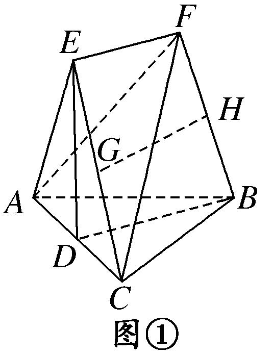

因为*AE*＝*EC*，*D*为*AC*的中点，所以*DE*⊥*AC*．同理可得*BD*⊥*AC*．

又*BD*∩*DE*＝*D*，所以*AC*⊥平面*BDEF*．因为*FB*⊂平面*BDEF*，所以*AC*⊥*FB*．

(2)如图②，设*FC*的中点为*I*，连接*GI*，*HI*．

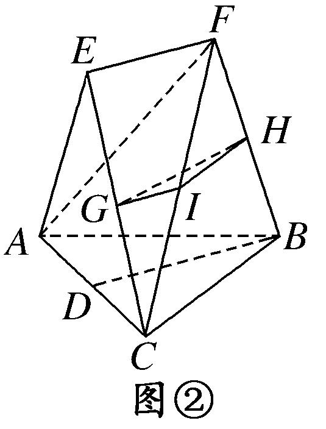

在△*CEF*中，因为*G*是*CE*的中点，所以*GI*∥*EF*．又*EF*∥*DB*，所以*GI*∥*DB*．

在△*CFB*中，因为*H*是*FB*的中点，所以*HI*∥*BC*．又*HI*∩*GI*＝*I*，所以平面*GHI*∥平面*ABC*．

因为*GH*⊂平面*GHI*，所以*GH*∥平面*ABC*．

【**对点训练**】

1．如图，在六面体*ABCDE*中，平面*DBC*⊥平面*ABC*，*AE*⊥平面*ABC*．

(1)求证：*AE*∥平面*DBC*；

(2)若*AB*⊥*BC*，*BD*⊥*CD*，求证：*AD*⊥*DC*．

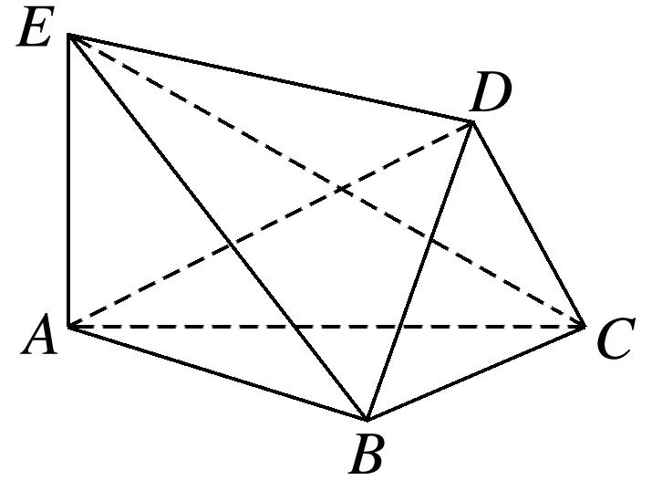

1．解析　(1)过点*D*作*DO*⊥*BC*，*O*为垂足．

又∵平面*DBC*⊥平面*ABC*，平面*DBC*∩平面*ABC*＝*BC*，*DO*⊂平面*DBC*，

∴*DO*⊥平面*ABC*．又*AE*⊥平面*ABC*，∴*AE*∥*DO*．

又*AE*⊄平面*DBC*，*DO*⊂平面*DBC*，故*AE*∥平面*DBC*．

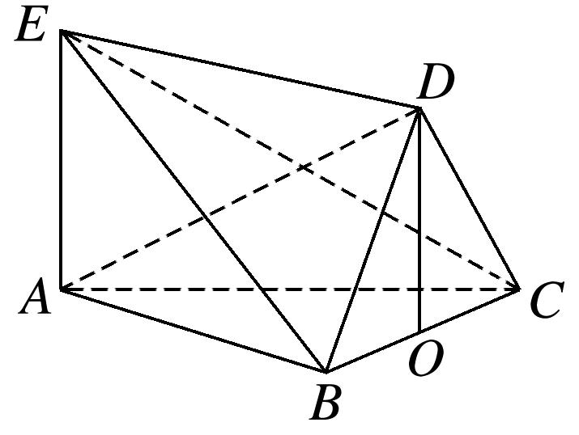

(2)由(1)知，*DO*⊥平面*ABC*，*AB*⊂平面*ABC*，∴*DO*⊥*AB*．

又*AB*⊥*BC*，且*DO*∩*BC*＝*O*，*DO*，*BC*⊂平面*DBC*，∴*AB*⊥平面*DBC*．

∵*DC*⊂平面*DBC*，∴*AB*⊥*DC*．又*BD*⊥*CD*，*AB*∩*DB*＝*B*，*AB*，*DB*⊂平面*ABD*，

∴*DC*⊥平面*ABD*．又*AD*⊂平面*ABD*，∴*AD*⊥*DC*．

2．如图，在正方体<em>ABCD－A</em>1<em>B</em>1<em>C</em>1<em>D</em>1中，<em>AA</em>1＝2，<em>E</em>为棱<em>CC</em>1的中点．

(1)求证：<em>B</em>1<em>D</em>1⊥<em>AE</em>；

(2)求证：<em>AC</em>∥平面<em>B</em>1<em>DE</em>．

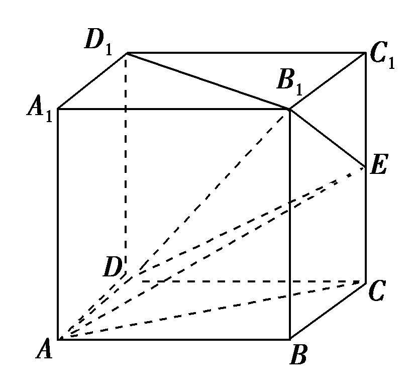

2．解析　(1)连接<em>BD</em>，则<em>BD</em>∥<em>B</em>1<em>D</em>1．∵四边形<em>ABCD</em>是正方形，∴<em>AC</em>⊥<em>BD</em>．

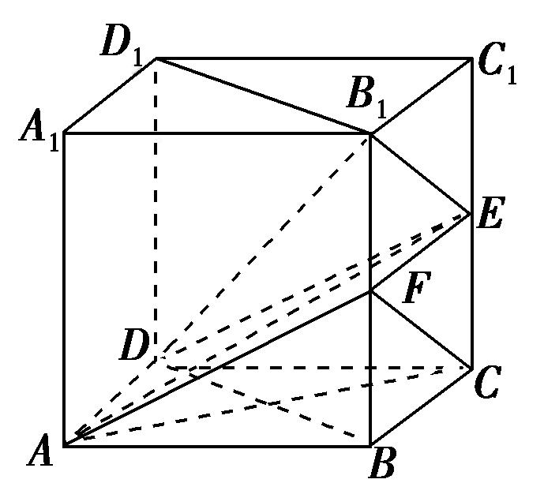

∵*CE*⊥平面*ABCD*，∴*CE*⊥*BD*．又*AC*∩*CE*＝*C*，∴*BD*⊥平面*ACE*．

∵<em>AE</em>⊂平面<em>ACE</em>，∴<em>BD</em>⊥<em>AE</em>，∴<em>B</em>1<em>D</em>1⊥<em>AE</em>．

(2)取<em>BB</em>1的中点<em>F</em>，连接<em>AF</em>，<em>CF</em>，<em>EF</em>，则<em>FC</em>∥<em>B</em>1<em>E</em>，∴<em>CF</em>∥平面<em>B</em>1<em>DE</em>．

∵<em>E</em>，<em>F</em>是<em>CC</em>1，<em>BB</em>1的中点，∴<em>EFBC</em>．又<em>BCAD</em>，∴<em>EFAD</em>，

∴四边形*ADEF*是平行四边形，∴*AF*∥*ED*．

∵<em>AF</em>⊄平面<em>B</em>1<em>DE</em>，<em>ED</em>⊂平面<em>B</em>1<em>DE</em>，∴<em>AF</em>∥平面<em>B</em>1<em>DE</em>．

∵<em>AF</em>∩<em>CF</em>＝<em>F</em>，∴平面<em>ACF</em>∥平面<em>B</em>1<em>DE</em>．又∵<em>AC</em>⊂平面<em>ACF</em>，∴<em>AC</em>∥平面<em>B</em>1<em>DE</em>．

3．如图，在四棱锥*P*－*ABCD*中，∠*ADB*＝90°，*CB*＝*CD*，点*E*为棱*PB*的中点．

(1)若*PB*＝*PD*，求证：*PC*⊥*BD*；(2)求证：*CE*∥平面*PAD*．

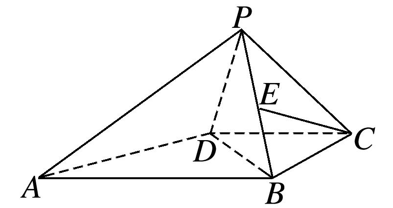

3．解析　(1)取*BD*的中点*O*，连接*CO*，*PO*，

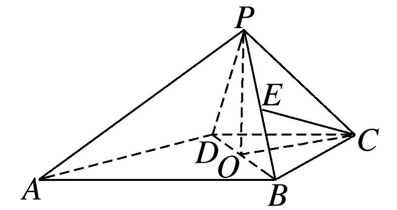

因为*CD*＝*CB*，所以△*CBD*为等腰三角形，所以*BD*⊥*CO*．

因为*PB*＝*PD*，所以△*PBD*为等腰三角形，所以*BD*⊥*PO*．

又*PO*∩*CO*＝*O*，*PO*，*CO*⊂平面*PCO*，所以*BD*⊥平面*PCO*．

因为*PC*⊂平面*PCO*，所以*PC*⊥*BD*．

(2)由*E*为*PB*的中点，连接*EO*，则*EO*∥*PD*，

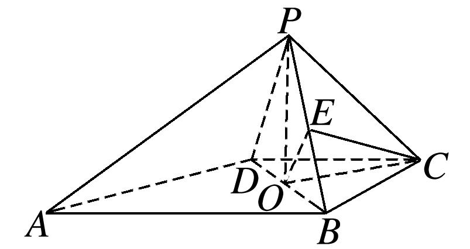

又*EO*⊄平面*PAD*，*PD*⊂平面*PAD*，所以*EO*∥平面*PAD*．

由∠*ADB*＝90°及*BD*⊥*CO*，可得*CO*∥*AD*，

又*CO*⊄平面*PAD*，*AD*⊂平面*PAD*，所以*CO*∥平面*PAD*．

又*CO*∩*EO*＝*O*，*CO*，*EO*⊂平面*COE*，所以平面*CEO*∥平面*PAD*，

而*CE*⊂平面*CEO*，所以*CE*∥平面*PAD*．

4．(2013·江苏)如图，在三棱锥*S*－*ABC*中，平面*SAB*⊥平面*SBC*，*AB*⊥*BC*，*AS*＝*AB*．过*A*作*AF*⊥*SB*，

垂足为*F*，点*E*，*G*分别是棱*SA*，*SC*的中点．

求证：(1)平面*EFG*∥平面*ABC*；(2)*BC*⊥*SA*．

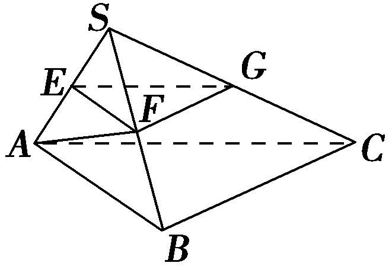

4．解析　(1)由*AS*＝*AB*，*AF*⊥*SB*知*F*为*SB*中点，则*EF*∥*AB*，*FG*∥*BC*，

又*EF*∩*FG*＝*F*，*AB*∩*BC*＝*B*，因此平面*EFG*∥平面*ABC*．

(2)由平面*SAB*⊥平面*SBC*，且*AF*⊥*SB*，知*AF*⊥平面*SBC*，则*AF*⊥*BC*．

又*BC*⊥*AB*，*AF*∩*AB*＝*A*，则*BC*⊥平面*SAB*，又*SA*⊂平面*SAB*，因此*BC*⊥*SA*．

5．如图1所示，在Rt△*ABC*中，∠*ABC*＝90°，*D*为*AC*的中点，*AE*⊥*BD*于点*E*(不同于点*D*)，延长*AE*

交<em>BC</em>于点<em>F</em>，将△<em>ABD</em>沿<em>BD</em>折起，得到三棱锥<em>A</em>1－<em>BCD</em>，如图2所示．

(1)若<em>M</em>是<em>FC</em>的中点，求证：直线<em>DM</em>∥平面<em>A</em>1<em>EF</em>．

(2)求证：<em>BD</em>⊥<em>A</em>1<em>F</em>．

(3)若平面<em>A</em>1<em>BD</em>⊥平面<em>BCD</em>，试判断直线<em>A</em>1<em>B</em>与直线<em>CD</em>能否垂直？请说明理由．

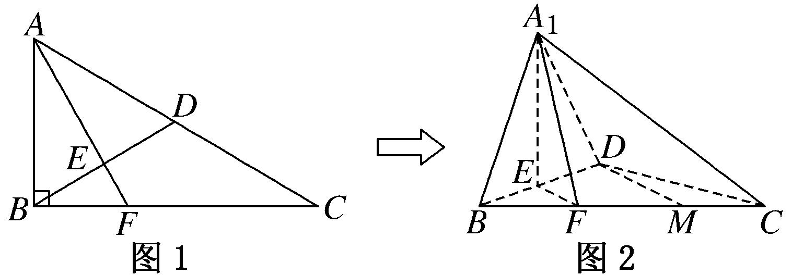

5．解析　(1)证明：∵*D*，*M*分别为*AC*，*FC*的中点，∴*DM*∥*EF*，

又∵<em>EF</em>⊂平面<em>A</em>1<em>EF</em>，<em>DM</em>⊄平面<em>A</em>1<em>EF</em>，∴<em>DM</em>∥平面<em>A</em>1<em>EF</em>．

(2)证明：∵<em>EF</em>⊥<em>BD</em>，<em>A</em>1<em>E</em>⊥<em>BD</em>，<em>A</em>1<em>E</em>∩<em>EF</em>＝<em>E</em>，

<em>A</em>1<em>E</em>⊂平面<em>A</em>1<em>EF</em>，<em>EF</em>⊂平面<em>A</em>1<em>EF</em>，∴<em>BD</em>⊥平面<em>A</em>1<em>EF</em>，又<em>A</em>1<em>F</em>⊂平面<em>A</em>1<em>EF</em>，∴<em>BD</em>⊥<em>A</em>1<em>F</em>．

(3)直线<em>A</em>1<em>B</em>与直线<em>CD</em>不能垂直．理由如下：

∵平面<em>BCD</em>⊥平面<em>A</em>1<em>BD</em>，平面<em>BCD</em>∩平面<em>A</em>1<em>BD</em>＝<em>BD</em>，<em>EF</em>⊥<em>BD</em>，<em>EF</em>⊂平面<em>BCD</em>，∴<em>EF</em>⊥平面<em>A</em>1<em>BD</em>，

又∵<em>A</em>1<em>B</em>⊂平面<em>A</em>1<em>BD</em>，∴<em>A</em>1<em>B</em>⊥<em>EF</em>，又∵<em>DM</em>∥<em>EF</em>，∴<em>A</em>1<em>B</em>⊥<em>DM</em>．

假设<em>A</em>1<em>B</em>⊥<em>CD</em>，∵<em>DM</em>∩<em>CD</em>＝<em>D</em>，∴<em>A</em>1<em>B</em>⊥平面<em>BCD</em>，∴<em>A</em>1<em>B</em>⊥<em>BD</em>，与∠<em>A</em>1<em>BD</em>为锐角矛盾，

∴直线<em>A</em>1<em>B</em>与直线<em>CD</em>不能垂直．

**考点二　线线(线面)(面面)平行＋线面垂直问题**

**【例题选讲】**

<strong>[例1]</strong>(2014·湖北)如图，在正方体<em>ABCD</em>－<em>A</em>1<em>B</em>1<em>C</em>1<em>D</em>1中，<em>E</em>，<em>F</em>，<em>P</em>，<em>Q</em>，<em>M</em>，<em>N</em>分别是棱<em>AB</em>，<em>AD</em>，<em>DD</em>1，<em>BB</em>1，<em>A</em>1<em>B</em>1，<em>A</em>1<em>D</em>1的中点．求证：

(1)直线<em>BC</em>1∥平面<em>EFPQ</em>；

(2)直线<em>AC</em>1⊥平面<em>PQMN</em>．

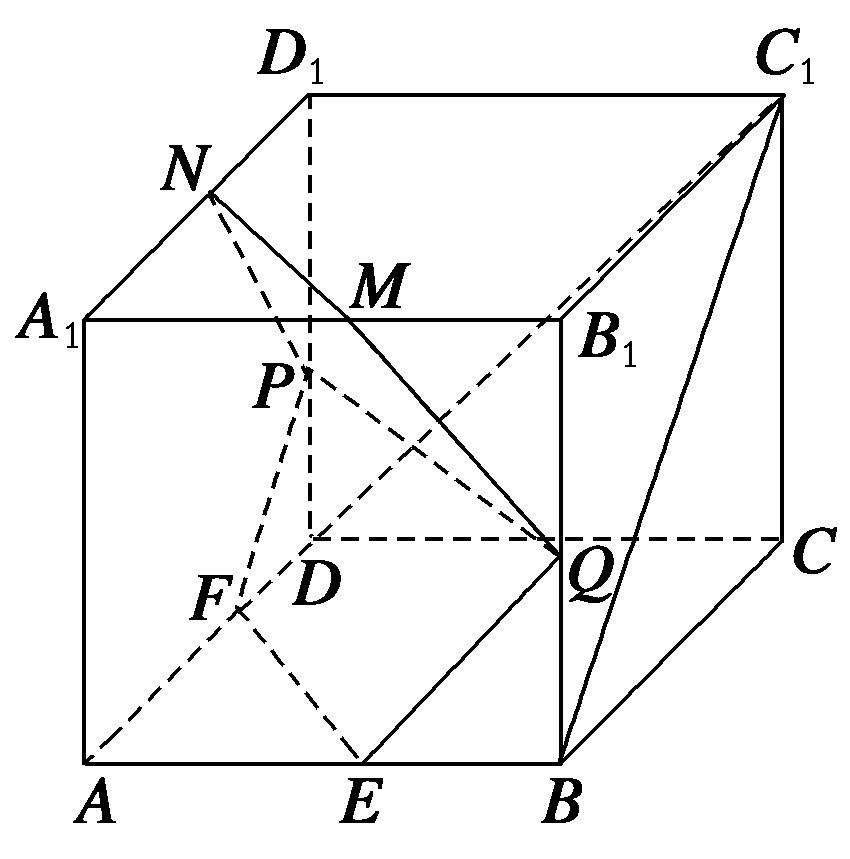

解析　(1)如图，连接<em>AD</em>1，由<em>ABCD</em>－<em>A</em>1<em>B</em>1<em>C</em>1<em>D</em>1是正方体，知<em>AD</em>1∥<em>BC</em>1，

因为<em>F</em>，<em>P</em>分别是<em>AD</em>，<em>DD</em>1的中点，所以<em>FP</em>∥<em>AD</em>1，从而<em>BC</em>1∥<em>FP</em>．

而<em>FP</em>⊂平面<em>EFPQ</em>，且<em>BC</em>1⊄平面<em>EFPQ</em>，故直线<em>BC</em>1∥平面<em>EFPQ</em>．

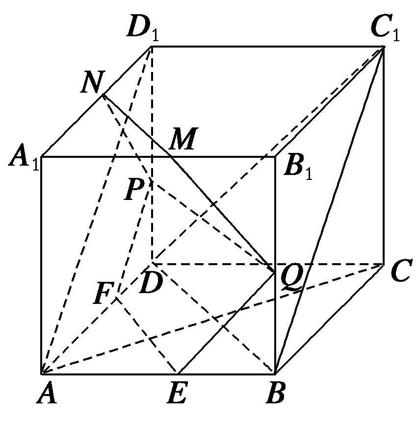

(2)连接<em>AC</em>，<em>BD</em>，则<em>AC</em>⊥<em>BD</em>．由<em>CC</em>1⊥平面<em>ABCD</em>，<em>BD</em>⊂平面<em>ABCD</em>，可得<em>CC</em>1⊥<em>BD</em>．

又<em>AC</em>∩<em>CC</em>1＝<em>C</em>，所以<em>BD</em>⊥平面<em>ACC</em>1．而<em>AC</em>1⊂平面<em>ACC</em>1，所以<em>BD</em>⊥<em>AC</em>1．

因为<em>M</em>，<em>N</em>分别是<em>A</em>1<em>B</em>1，<em>A</em>1<em>D</em>1的中点，所以<em>MN</em>∥<em>BD</em>，从而<em>MN</em>⊥<em>AC</em>1．

同理可证<em>PN</em>⊥<em>AC</em>1．又<em>PN</em>∩<em>MN</em>＝<em>N</em>，所以直线<em>AC</em>1⊥平面<em>PQMN</em>．

<strong>[例2]</strong>如图，四棱锥<em>P</em>－<em>ABCD</em>中，<em>AP</em>⊥平面<em>PCD</em>，<em>AD</em>∥<em>BC</em>，<em>AB</em>＝<em>BC</em>＝<em>AD</em>，<em>E</em>，<em>F</em>分别为线段<em>AD</em>，<em>PC</em>的中点．求证：

(1)*AP*∥平面*BEF*；

(2)*BE*⊥平面*PAC*．

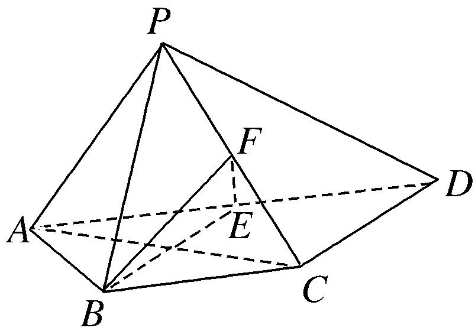

解析　(1)设*AC*∩*BE*＝*O*，连接*OF*，*EC*，如图所示．由于*E*为*AD*的中点，*AB*＝*BC*＝*AD*，*AD*∥*BC*，

所以*AE*∥*BC*，*AE*＝*AB*＝*BC*，因此四边形*ABCE*为菱形，所以*O*为*AC*的中点．

又*F*为*PC* 的中点，因此在△*PAC*中，可得*AP*∥*OF*．

又*OF*⊂平面*BEF*，*AP*⊄平面*BEF*．所以*AP*∥平面*BEF*．

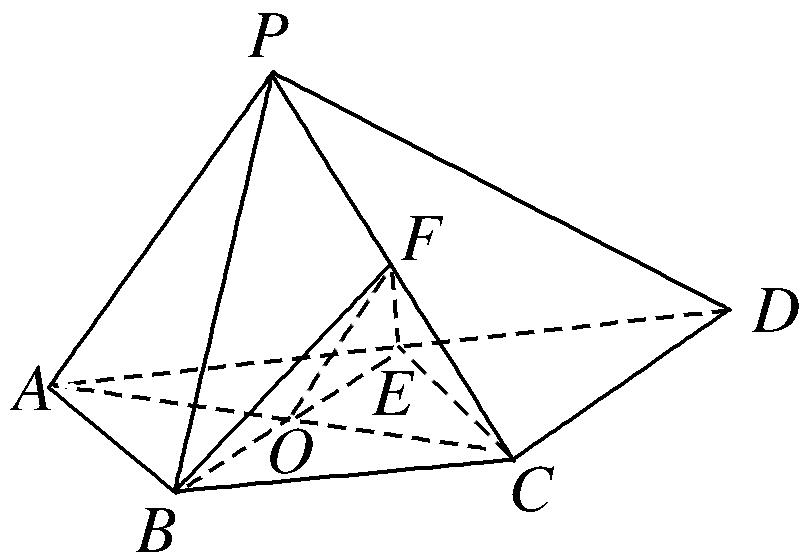

(2)由题意知*ED*∥*BC*，*ED*＝*BC*．所以四边形*BCDE*为平行四边形，因此*BE*∥*CD*．

又*AP*⊥平面*PCD*，所以*AP*⊥*CD*，因此*AP*⊥*BE*．

因为四边形*ABCE*为菱形，所以*BE*⊥*AC*．又*AP*∩*AC*＝*A*，*AP*，*AC*⊂平面*PAC*，所以*BE*⊥平面*PAC*．

<strong>[例3]</strong>如图，在多面体<em>ABCDPE</em>中，四边形<em>ABCD</em>和<em>CDPE</em>都是直角梯形，<em>AB</em>∥<em>DC</em>，<em>PE</em>∥<em>DC</em>，<em>AD</em>⊥<em>DC</em>，<em>PD</em>⊥平面<em>ABCD</em>，<em>AB</em>＝<em>PD</em>＝<em>DA</em>＝2<em>PE</em>，<em>CD</em>＝3<em>PE</em>，<em>F</em>是<em>CE</em>的中点．

(1)求证：*BF*∥平面*ADP*；

(2)已知*O*是*BD*的中点，求证：*BD*⊥平面*AOF*．

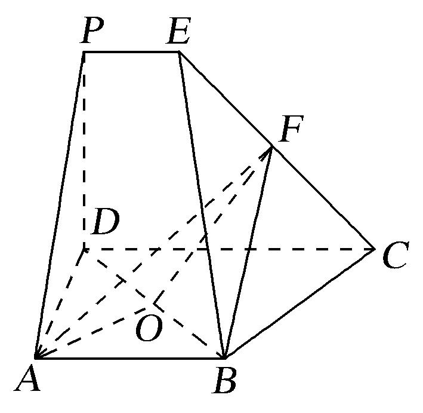

解析　(1)如图，取*PD*的中点为*G*，连接*FG*，*AG*，

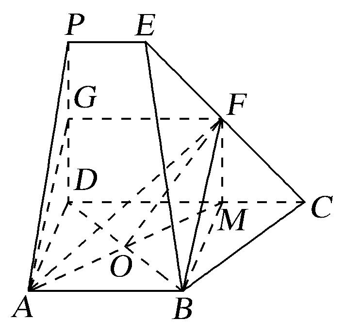

∵*F*是*CE*的中点，∴*FG*是梯形*CDPE*的中位线，∵*CD*＝3*PE*，∴*FG*＝2*PE*，*FG*∥*CD*，

∵*CD*∥*AB*，*AB*＝2*PE*，∴*AB*∥*FG*，*AB*＝*FG*，即四边形*ABFG*是平行四边形，

∴*BF*∥*AG*，又*BF*⊄平面*ADP*，*AG*⊂平面*ADP*，∴*BF*∥平面*ADP*．

(2)延长*AO*交*CD*于*M*，连接*BM*，*FM*，∵*BA*⊥*AD*，*CD*⊥*DA*，*AB*＝*AD*，*O*为*BD*的中点，

∴*ABMD*是正方形，则*BD*⊥*AM*，*MD*＝2*PE*．∴*FM*∥*PD*，

∵*PD*⊥平面*ABCD*，∴*FM*⊥平面*ABCD*，∴*FM*⊥*BD*，

∵*AM*∩*FM*＝*M*，∴*BD*⊥平面*AMF*，∴*BD*⊥平面*AOF*．

<strong>[例4]</strong>如图所示的多面体中，底面<em>ABCD</em>为正方形，△<em>GAD</em>为等边三角形，<em>BF</em>⊥平面<em>ABCD</em>，∠<em>GDC</em>＝90°，若点<em>P</em>为线段<em>GD</em>的中点．

(1)求证：*AP*⊥平面*GCD*；

(2)求证：平面*ADG*∥平面*FBC*．

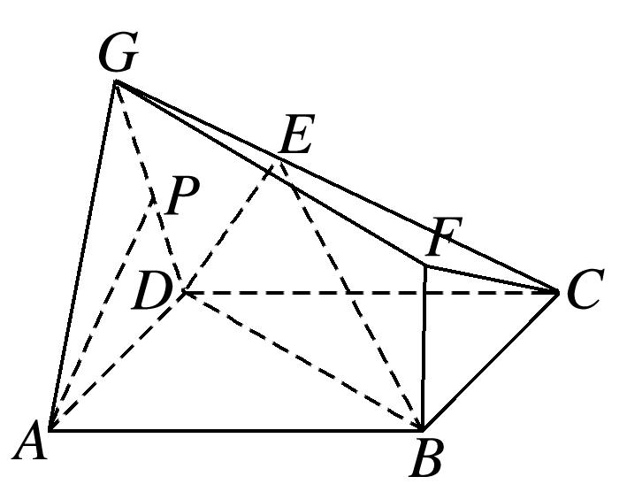

解析　(1)因为△*GAD*是等边三角形，点*P*为线段*GD*的中点，所以*AP*⊥*GD*．

因为*AD*⊥*CD*，*GD*⊥*CD*，且*AD*∩*GD*＝*D*，*AD*，*GD*⊂平面*GAD*，故*CD*⊥平面*GAD*，

又*AP*⊂平面*GAD*，所以*CD*⊥*AP*，又*CD*∩*GD*＝*D*，*CD*，*GD*⊂平面*GCD*，所以*AP*⊥平面*GCD*．

(2)因为*BF*⊥平面*ABCD*，*CD*⊂平面*ABCD*，所以*BF*⊥*CD*，

因为*BC*⊥*CD*，*BF*∩*BC*＝*B*，*BF*，*BC*⊂平面*FBC*，

所以*CD*⊥平面*FBC*，由(1)知*CD*⊥平面*GAD*，所以平面*ADG*∥平面*FBC*．

<strong>[例5]</strong>如图1，在平面五边形<em>ABCDE</em>中，<em>AB</em>∥<em>CE</em>，且<em>AE</em>＝2，∠<em>AEC</em>＝60°，<em>CD</em>＝<em>ED</em>＝，cos∠<em>EDC</em>＝．将△<em>CDE</em>沿<em>CE</em>折起，使点<em>D</em>到<em>P</em>的位置，且<em>AP</em>＝，得到如图2所示的四棱锥<em>P</em>­<em>ABCE</em>．

(1)求证：*AP*⊥平面*ABCE*；

(2)记平面*PAB*与平面*PCE*相交于直线*l*，求证：*AB*∥*l*．

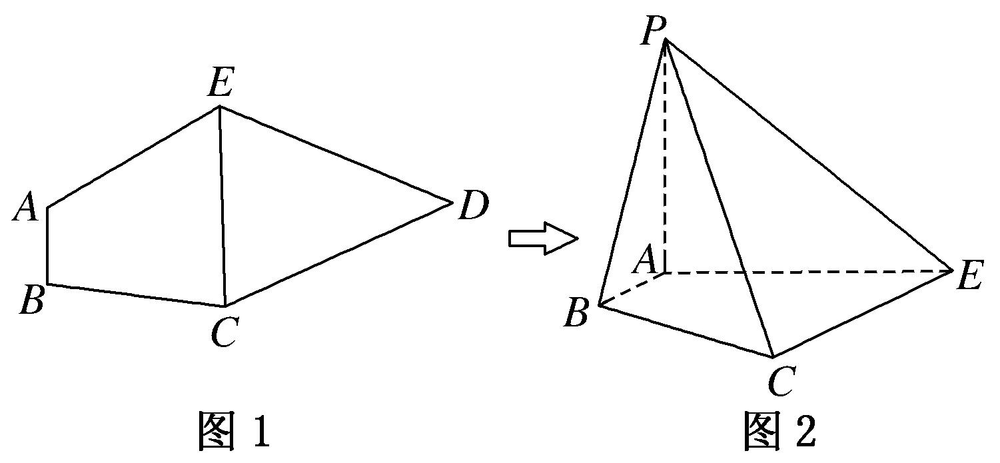

解析　(1)在△*CDE*中，∵*CD*＝*ED*＝，cos∠*EDC*＝，

由余弦定理得*CE*＝ ＝2．

连接<em>AC</em>，∵<em>AE</em>＝2，∠<em>AEC</em>＝60°，∴<em>AC</em>＝2．又<em>AP</em>＝，∴在△<em>PAE</em>中，<em>AP</em>2＋<em>AE</em>2＝<em>PE</em>2，

即*AP*⊥*AE*．同理，*AP*⊥*AC*．

∵*AC*∩*AE*＝*A*，*AC*⊂平面*ABCE*，*AE*⊂平面*ABCE*，∴*AP*⊥平面*ABCE*．

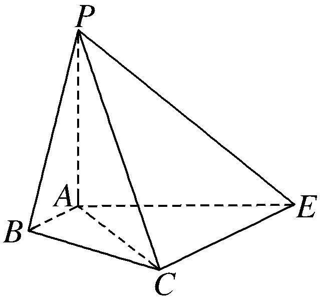

(2)∵*AB*∥*CE*，且*CE*⊂平面*PCE*，*AB*⊄平面*PCE*，∴*AB*∥平面*PCE*．

又平面*PAB*∩平面*PCE*＝*l*，∴*AB*∥*l*．

**[例6]** (2015·四川)一个正方体的平面展开图及该正方体的直观图的示意图如图所示．

(1)请将字母*F*，*G*，*H*标记在正方体相应的顶点处(不需说明理由)；

(2)判断平面*BEG*与平面*ACH*的位置关系．并证明你的结论；

(3)证明：直线*DF*⊥平面*BEG*．

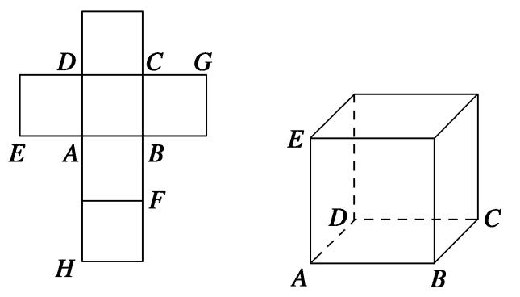

解析　(1)点*F*，*G*，*H*的位置如图所示．

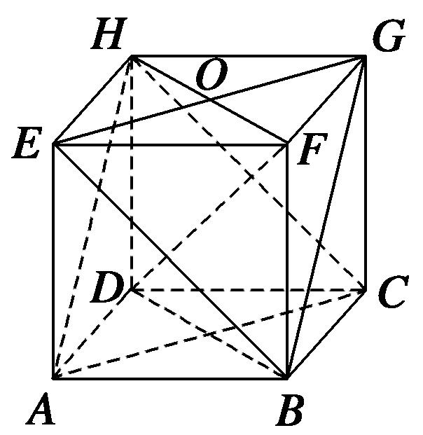

(2)平面*BEG*∥平面*ACH*，证明如下：

因为*ABCD－EFGH*为正方体，所以*BC*∥*FG*，*BC*＝*FG*，又*FG*∥*EH*，*FG*＝*EH*，

所以*BC*∥*EH*，*BC*＝*EH*，于是*BCHE*为平行四边形，所以*BE*∥*CH*，又*CH*⊂平面*ACH*，*BE*⊄平面*ACH*，所以*BE*∥平面*ACH*，同理*BG*∥平面*ACH*，又*BE*∩*BG*＝*B*，所以平面*BEG*∥平面*ACH*．

(3)连接*FH*，*BD*．因为*ABCD-EFGH*为正方体，所以*DH*⊥平面*EFGH*，

因为*EG*⊂平面*EFGH*，所以*DH*⊥*EG*，又*EG*⊥*FH*，*EG*∩*FH*＝*O*，所以*EG*⊥平面*BFHD*，

又*DF*⊂平面*BFHD*，所以*DF*⊥*EG*，同理*DF*⊥*BG*，又*EG*∩*BG*＝*G*，所以*DF*⊥平面*BEG*．

**考点三　线面平行＋面面垂直问题**

**【例题选讲】**

<strong>[例1]</strong>(2018·江苏)在平行六面体<em>ABCD－A</em>1<em>B</em>1<em>C</em>1<em>D</em>1中，<em>AA</em>1＝<em>AB</em>，<em>AB</em>1⊥<em>B</em>1<em>C</em>1．

求证：(1)<em>AB</em>∥平面<em>A</em>1<em>B</em>1<em>C</em>；(2)平面<em>ABB</em>1<em>A</em>1⊥平面<em>A</em>1<em>BC</em>．

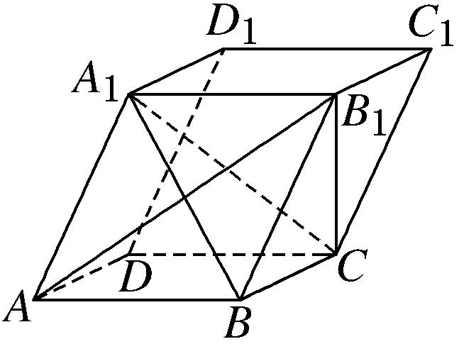

解析　(1)在平行六面体<em>ABCD－A</em>1<em>B</em>1<em>C</em>1<em>D</em>1中，<em>AB</em>∥<em>A</em>1<em>B</em>1．

因为<em>AB</em>⊄平面<em>A</em>1<em>B</em>1<em>C</em>，<em>A</em>1<em>B</em>1⊂平面<em>A</em>1<em>B</em>1<em>C</em>，所以<em>AB</em>∥平面<em>A</em>1<em>B</em>1<em>C</em>．

(2)在平行六面体<em>ABCD</em>­<em>A</em>1<em>B</em>1<em>C</em>1<em>D</em>1中，四边形<em>ABB</em>1<em>A</em>1为平行四边形．

又因为<em>AA</em>1＝<em>AB</em>，所以四边形<em>ABB</em>1<em>A</em>1为菱形，因此<em>AB</em>1⊥<em>A</em>1<em>B</em>．

因为<em>AB</em>1⊥<em>B</em>1<em>C</em>1，<em>BC</em>∥<em>B</em>1<em>C</em>1，所以<em>AB</em>1⊥<em>BC</em>．

因为<em>A</em>1<em>B</em>∩<em>BC</em>＝<em>B</em>，<em>A</em>1<em>B</em>⊂平面<em>A</em>1<em>BC</em>，<em>BC</em>⊂平面<em>A</em>1<em>BC</em>，所以<em>AB</em>1⊥平面<em>A</em>1<em>BC</em>．

因为<em>AB</em>1⊂平面<em>ABB</em>1<em>A</em>1，所以平面<em>ABB</em>1<em>A</em>1⊥平面<em>A</em>1<em>BC</em>．

<strong>[例2]</strong>(2020·江苏)在三棱柱<em>ABC</em>－<em>A</em>1<em>B</em>1<em>C</em>1中，<em>AB</em>⊥<em>AC</em>，<em>B</em>1<em>C</em>⊥平面<em>ABC</em>，<em>E</em>，<em>F</em>分别是<em>AC</em>，<em>B</em>1<em>C</em>的中点．

(1)求证：<em>EF</em>∥平面<em>AB</em>1<em>C</em>1；

(2)求证：平面<em>AB</em>1<em>C</em>⊥平面<em>ABB</em>1．

解析　(1)由于<em>E</em>，<em>F</em>分别是<em>AC</em>，<em>B</em>1<em>C</em>的中点，所以<em>EF</em>∥<em>AB</em>1．

由于<em>EF</em>⊄平面<em>AB</em>1<em>C</em>1，<em>AB</em>1⊂平面<em>AB</em>1<em>C</em>1，所以<em>EF</em>∥平面<em>AB</em>1<em>C</em>1．

(2)由于<em>B</em>1<em>C</em>⊥平面<em>ABC</em>，<em>AB</em>⊂平面<em>ABC</em>，所以<em>B</em>1<em>C</em>⊥<em>AB</em>．

由于<em>AB</em>⊥<em>AC</em>，<em>AC</em>∩<em>B</em>1<em>C</em>＝<em>C</em>，所以<em>AB</em>⊥平面<em>AB</em>1<em>C</em>，

由于<em>AB</em>⊂平面<em>ABB</em>1，所以平面<em>AB</em>1<em>C</em>⊥平面<em>ABB</em>1．

<strong>[例3]</strong>如图所示，<em>M</em>，<em>N</em>，<em>K</em>分别是正方体<em>ABCD</em>—<em>A</em>1<em>B</em>1<em>C</em>1<em>D</em>1的棱<em>AB</em>，<em>CD</em>，<em>C</em>1<em>D</em>1的中点．

求证：(1)<em>AN</em>∥平面<em>A</em>1<em>MK</em>；

(2)平面<em>A</em>1<em>B</em>1<em>C</em>⊥平面<em>A</em>1<em>MK</em>．

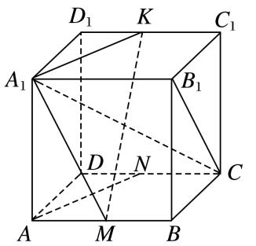

解析　(1)如图所示，连接<em>NK</em>．在正方体<em>ABCD</em>—<em>A</em>1<em>B</em>1<em>C</em>1<em>D</em>1中，

∵四边形<em>AA</em>1<em>D</em>1<em>D</em>，<em>DD</em>1<em>C</em>1<em>C</em>都为正方形，∴<em>AA</em>1∥<em>DD</em>1，<em>AA</em>1＝<em>DD</em>1，

<em>C</em>1<em>D</em>1∥<em>CD</em>，<em>C</em>1<em>D</em>1＝<em>CD</em>．∵<em>N</em>，<em>K</em>分别为<em>CD</em>，<em>C</em>1<em>D</em>1的中点，

∴<em>DN</em>∥<em>D</em>1<em>K</em>，<em>DN</em>＝<em>D</em>1<em>K</em>，∴四边形<em>DD</em>1<em>KN</em>为平行四边形，

∴<em>KN</em>∥<em>DD</em>1，<em>KN</em>＝<em>DD</em>1，∴<em>AA</em>1∥<em>KN</em>，<em>AA</em>1＝<em>KN</em>，

∴四边形<em>AA</em>1<em>KN</em>为平行四边形，∴<em>AN</em>∥<em>A</em>1<em>K</em>．

又∵<em>A</em>1<em>K</em>⊂平面<em>A</em>1<em>MK</em>，<em>AN</em>⊄平面<em>A</em>1<em>MK</em>，∴<em>AN</em>∥平面<em>A</em>1<em>MK</em>．

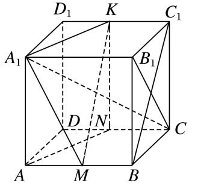

(2)如图所示，连接<em>BC</em>1．在正方体<em>ABCD</em>—<em>A</em>1<em>B</em>1<em>C</em>1<em>D</em>1中，<em>AB</em>∥<em>C</em>1<em>D</em>1，<em>AB</em>＝<em>C</em>1<em>D</em>1．

∵<em>M</em>，<em>K</em>分别为<em>AB</em>，<em>C</em>1<em>D</em>1的中点，∴<em>BM</em>∥<em>C</em>1<em>K</em>，<em>BM</em>＝<em>C</em>1<em>K</em>，

∴四边形<em>BC</em>1<em>KM</em>为平行四边形，∴<em>MK</em>∥<em>BC</em>1．

在正方体<em>ABCD</em>—<em>A</em>1<em>B</em>1<em>C</em>1<em>D</em>1中，<em>A</em>1<em>B</em>1⊥平面<em>BB</em>1<em>C</em>1<em>C</em>，<em>BC</em>1⊂平面<em>BB</em>1<em>C</em>1<em>C</em>，∴<em>A</em>1<em>B</em>1⊥<em>BC</em>1．

∵<em>MK</em>∥<em>BC</em>1，∴<em>A</em>1<em>B</em>1⊥<em>MK</em>．∵四边形<em>BB</em>1<em>C</em>1<em>C</em>为正方形，∴<em>BC</em>1⊥<em>B</em>1<em>C</em>，∴<em>MK</em>⊥<em>B</em>1<em>C</em>．

∵<em>A</em>1<em>B</em>1⊂平面<em>A</em>1<em>B</em>1<em>C</em>，<em>B</em>1<em>C</em>⊂平面<em>A</em>1<em>B</em>1<em>C</em>，<em>A</em>1<em>B</em>1∩<em>B</em>1<em>C</em>＝<em>B</em>1，∴<em>MK</em>⊥平面<em>A</em>1<em>B</em>1<em>C</em>．

又∵<em>MK</em>⊂平面<em>A</em>1<em>MK</em>，∴平面<em>A</em>1<em>B</em>1<em>C</em>⊥平面<em>A</em>1<em>MK</em>．

<strong>[例4]</strong>(2013·山东)如图，在四棱锥<em>P</em>－<em>ABCD</em>中，<em>AB</em>⊥<em>AC</em>，<em>AB</em>⊥<em>PA</em>，<em>AB</em>∥<em>CD</em>，<em>AB</em>＝2<em>CD</em>，<em>E</em>，<em>F</em>，<em>G</em>，<em>M</em>，<em>N</em>分别为<em>PB</em>，<em>AB</em>，<em>BC</em>，<em>PD</em>，<em>PC</em>的中点．

(1)求证：*CE*∥平面*PAD*；

(2)求证：平面*EFG*⊥平面*EMN*．

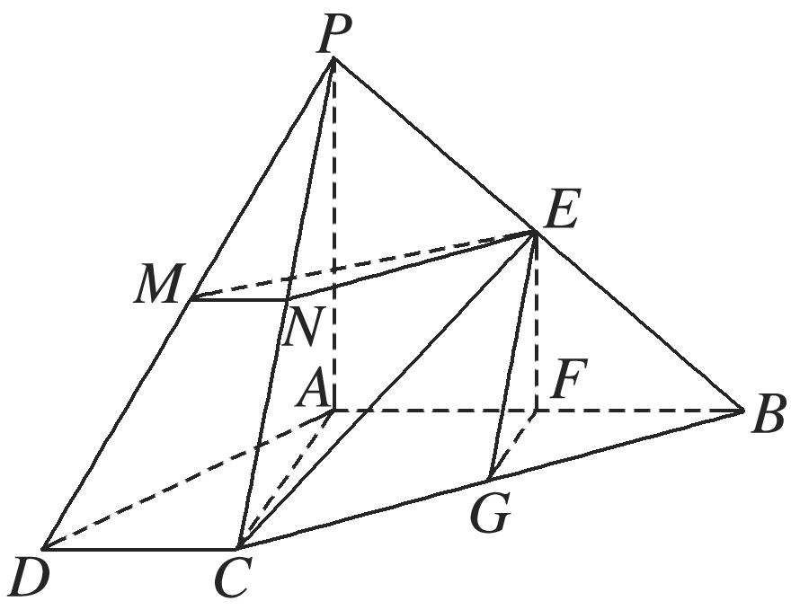

解析　(1)方法一　取*PA*的中点*H*，连接*EH*，*DH*．因为*E*为*PB*的中点，所以*EHAB*．

又*CDAB*，所以*EHCD*．所以四边形*DCEH*是平行四边形，所以*CE*∥*DH*．

又*DH*⊂平面*PAD*，*CE*⊄平面*PAD*，所以*CE*∥平面*PAD*．

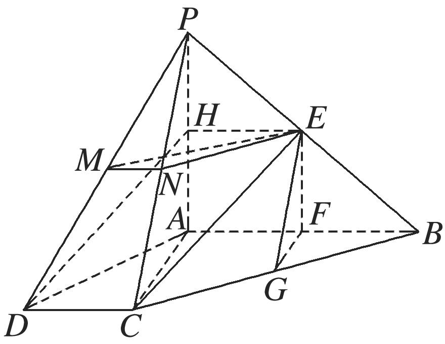

方法二　连接*CF*．因为*F*为*AB*的中点，所以*AF*＝*AB*．又*CD*＝*AB*，所以*AF*＝*CD*．

又*AF*∥*CD*，所以四边形*AFCD*为平行四边形．

因此*CF*∥*AD*，又*CF*⊄平面*PAD*，*AD*⊂平面*PAD*，所以*CF*∥平面*PAD*．

因为*E*，*F*分别为*PB*，*AB*的中点，所以*EF*∥*PA*．

又*EF*⊄平面*PAD*，*PA*⊂平面*PAD*，所以*EF*∥平面*PAD*．

因为*CF*∩*EF*＝*F*，故平面*CEF*∥平面*PAD*．

又*CE*⊂平面*CEF*，所以*CE*∥平面*PAD*．

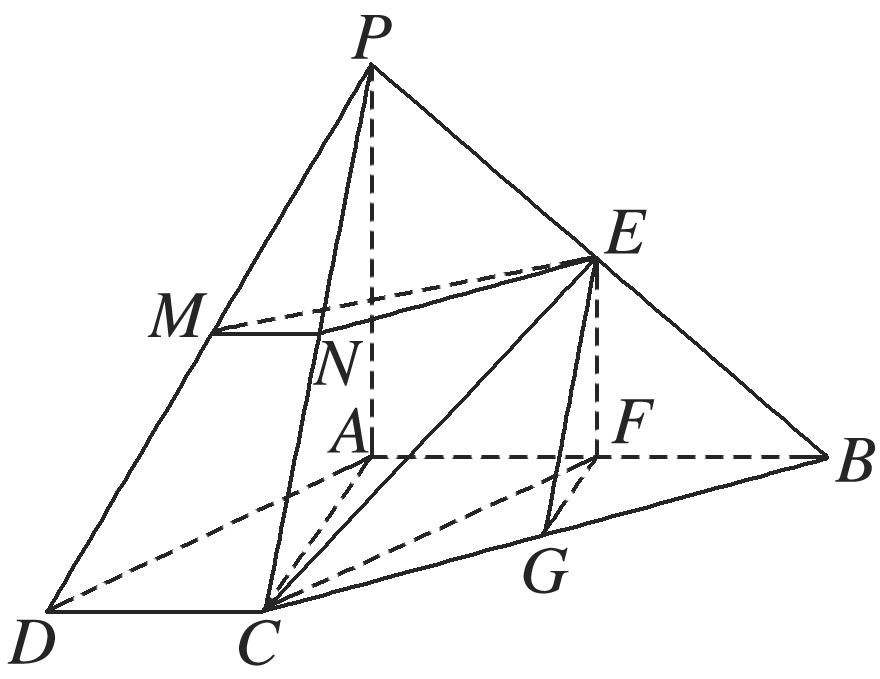

(2)因为*E*，*F*分别为*PB*，*AB*的中点，所以*EF*∥*PA*．

又因为*AB*⊥*PA*，所以*EF*⊥*AB*，同理可证*AB*⊥*FG*．

又因为*EF*∩*FG*＝*F*，*EF*，*FG*⊂平面*EFG*，所以*AB*⊥平面*EFG*．

又因为*M*，*N*分别为*PD*，*PC*的中点，所以*MN*∥*CD*，又*AB*∥*CD*，所以*MN*∥*AB*，

所以*MN*⊥平面*EFG*．又因为*MN*⊂平面*EMN*，所以平面*EFG*⊥平面*EMN*．

<strong>[例5]</strong>(2015·山东)如图，三棱台<em>DEF－ABC</em>中，<em>AB</em>＝2<em>DE</em>，<em>G</em>，<em>H</em>分别为<em>AC</em>，<em>BC</em>的中点．

(1)求证：*BD*∥平面*FGH*；

(2)若*CF*⊥*BC*，*AB*⊥*BC*，求证：平面*BCD*⊥平面*EGH*．

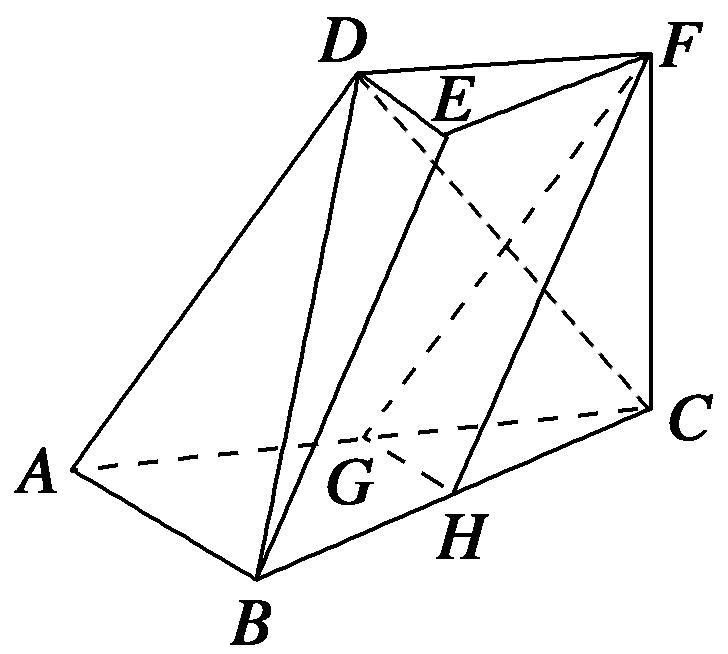

解析　(1)方法一　连接*DG*，设*CD*∩*GF*＝*M*，连接*MH*．在三棱台*DEF－ABC*中，

*AB*＝2*DE*，*G*为*AC*的中点，可得*DF*∥*GC*，*DF*＝*GC*，所以四边形*DFCG*为平行四边形．

则*M*为*CD*的中点，又*H*为*BC*的中点，所以*HM*∥*BD*，又*HM*⊂平面*FGH*，*BD*⊄平面*FGH*，

所以*BD*∥平面*FGH*．

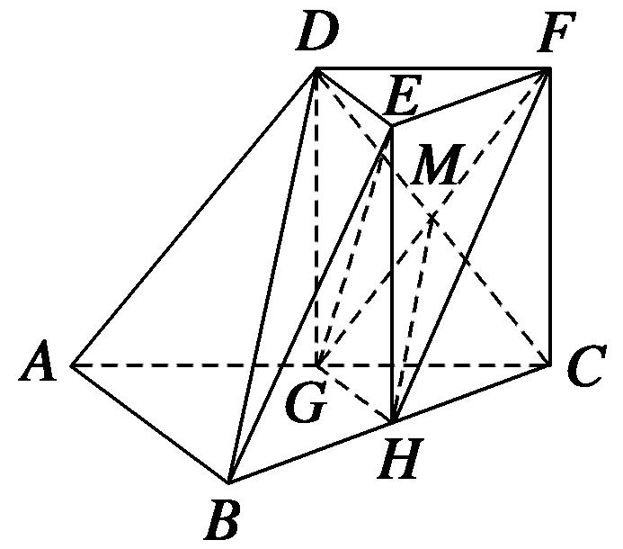

方法二　在三棱台*DEF-ABC*中，由*BC*＝2*EF*，*H*为*BC*的中点，可得*BH*∥*EF*，*BH*＝*EF*，

所以四边形*HBEF*为平行四边形，可得*BE*∥*HF*．在△*ABC*中，*G*为*AC*的中点，

*H*为*BC*的中点，所以*GH*∥*AB*．又*GH*∩*HF*＝*H*，所以平面*FGH*∥平面*ABED*．

又因为*BD*⊂平面*ABED*，所以*BD*∥平面*FGH*．

(2)连接*HE*，*GE*．因为*G*，*H*分别为*AC*，*BC*的中点，所以*GH*∥*AB*．

由*AB*⊥*BC*，得*GH*⊥*BC*．又*H*为*BC*的中点，所以*EF*∥*HC*，*EF*＝*HC*，

因此四边形*EFCH*是平行四边形，所以*CF*∥*HE*．又*CF*⊥*BC*，所以*HE*⊥*BC*．

又*HE*，*GH*⊂平面*EGH*，*HE*∩*GH*＝*H*，所以*BC*⊥平面*EGH*．

又*BC*⊂平面*BCD*，所以平面*BCD*⊥平面*EGH*．

<strong>[例6]</strong>如图，在四棱锥<em>P</em>－<em>ABCD</em>中，底面<em>ABCD</em>是矩形，且<em>AB</em>＝<em>BC</em>，<em>E</em>，<em>F</em>分别在线段<em>AB</em>，<em>CD</em>上，<em>G</em>，<em>H</em>在线段<em>PC</em>上，<em>EF</em>⊥<em>PA</em>，且＝＝＝＝．求证：

(1)*EH*∥平面*PAD*；

(2)平面*EFG*⊥平面*PAC*．

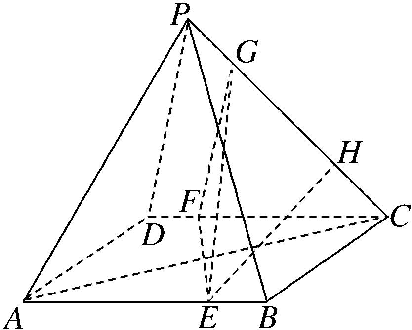

解析　(1)如图，在*PD*上取点*M*，使得＝，连接*AM*，*MH*，则＝＝，

所以*MH*＝*DC*，*MH*∥*CD*，又*AE*＝*AB*，四边形*ABCD*是矩形，

所以*MH*＝*AE*，*MH*∥*AE*，所以四边形*AEHM*为平行四边形，所以*EH*∥*AM*，

又*AM*⊂平面*PAD*，*EH*⊄平面*PAD*，所以*EH*∥平面*PAD*．

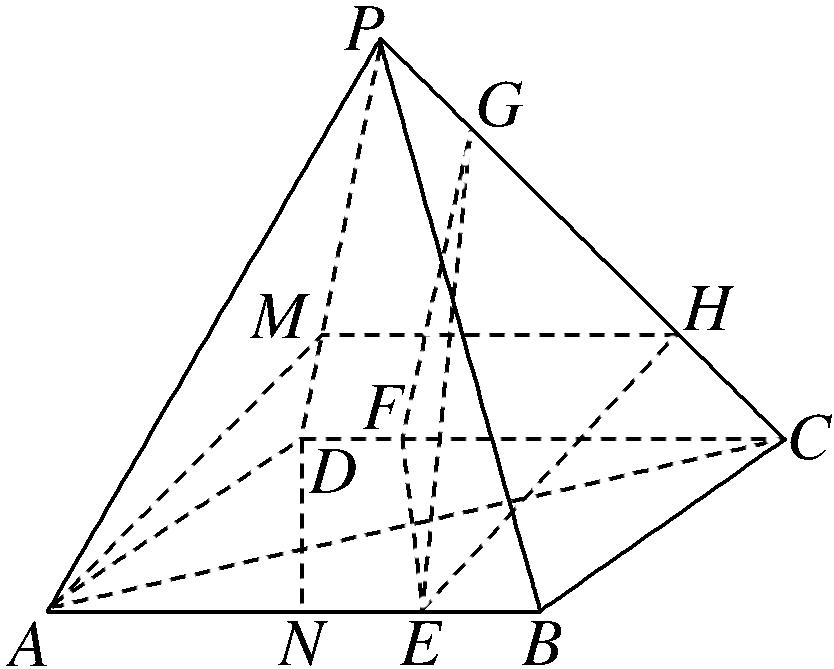

(2)取*AB*的中点*N*，连接*DN*，则*NE*＝*DF*，*NE*∥*DF*，则四边形*NEFD*为平行四边形，则*DN*∥*EF*，

在△*DAN*和△*CDA*中，∠*DAN*＝∠*CDA*，＝＝，则△*DAN*∽△*CDA*，

则∠*ADN*＝∠*DCA*，则*DN*⊥*AC*，则*EF*⊥*AC*，又*EF*⊥*PA*，*AC*∩*PA*＝*A*，所以*EF*⊥平面*PAC*，

又*EF*⊂平面*EFG*，所以平面*EFG*⊥平面*PAC*．

【**对点训练**】

1．如图，在直三棱柱<em>ABC－A</em>1<em>B</em>1<em>C</em>1中，<em>D</em>，<em>E</em>分别为<em>AB</em>，<em>BC</em>的中点，点<em>F</em>在侧棱<em>B</em>1<em>B</em>上，且<em>B</em>1<em>D</em>⊥<em>A</em>1<em>F</em>，

<em>A</em>1<em>C</em>1⊥<em>A</em>1<em>B</em>1．

求证：(1)直线<em>DE</em>∥平面<em>A</em>1<em>C</em>1<em>F</em>；(2)平面<em>B</em>1<em>DE</em>⊥平面<em>A</em>1<em>C</em>1<em>F</em>．

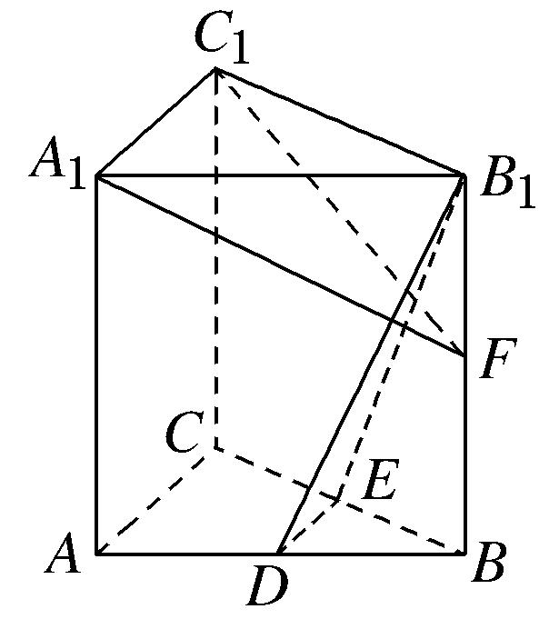

1．解析　(1)在直三棱柱<em>ABC－A</em>1<em>B</em>1<em>C</em>1中，<em>AC</em>∥<em>A</em>1<em>C</em>1，在△<em>ABC</em>中，

因为<em>D</em>，<em>E</em>分别为<em>AB</em>，<em>BC</em>的中点．所以<em>DE</em>∥<em>AC</em>，于是<em>DE</em>∥<em>A</em>1<em>C</em>1，

又因为<em>DE</em>⊄平面<em>A</em>1<em>C</em>1<em>F</em>，<em>A</em>1<em>C</em>1⊂平面<em>A</em>1<em>C</em>1<em>F</em>，所以直线<em>DE</em>∥平面<em>A</em>1<em>C</em>1<em>F</em>．

(2)在直三棱柱<em>ABC</em>­<em>A</em>1<em>B</em>1<em>C</em>1中，<em>AA</em>1⊥平面<em>A</em>1<em>B</em>1<em>C</em>1，因为<em>A</em>1<em>C</em>1⊂平面<em>A</em>1<em>B</em>1<em>C</em>1，所以<em>AA</em>1⊥<em>A</em>1<em>C</em>1，

又因为<em>A</em>1<em>C</em>1⊥<em>A</em>1<em>B</em>1，<em>A</em>1<em>B</em>1∩<em>AA</em>1＝<em>A</em>1，<em>AA</em>1⊂平面<em>ABB</em>1<em>A</em>1，<em>A</em>1<em>B</em>1⊂平面<em>ABB</em>1<em>A</em>1，所以<em>A</em>1<em>C</em>1⊥平面<em>ABB</em>1<em>A</em>1，

因为<em>B</em>1<em>D</em>⊂平面<em>ABB</em>1<em>A</em>1，所以<em>A</em>1<em>C</em>1⊥<em>B</em>1<em>D</em>，

又因为<em>B</em>1<em>D</em>⊥<em>A</em>1<em>F</em>，<em>A</em>1<em>C</em>1∩<em>A</em>1<em>F</em>＝<em>A</em>1，<em>A</em>1<em>C</em>1⊂平面<em>A</em>1<em>C</em>1<em>F</em>，<em>A</em>1<em>F</em>⊂平面<em>A</em>1<em>C</em>1<em>F</em>，

所以<em>B</em>1<em>D</em>⊥平面<em>A</em>1<em>C</em>1<em>F</em>，因为直线<em>B</em>1<em>D</em>⊂平面<em>B</em>1<em>DE</em>，所以平面<em>B</em>1<em>DE</em>⊥平面<em>A</em>1<em>C</em>1<em>F</em>．

2．如图所示，在三棱柱<em>ABC</em>－<em>A</em>1<em>B</em>1<em>C</em>1中，<em>AB</em>＝<em>AC</em>，侧面<em>BCC</em>1<em>B</em>1⊥底面<em>ABC</em>，<em>E</em>，<em>F</em>分别为棱<em>BC</em>和<em>A</em>1<em>C</em>1

的中点．

(1)求证：<em>EF</em>∥平面<em>ABB</em>1<em>A</em>1；

(2)求证：平面<em>AEF</em>⊥平面<em>BCC</em>1<em>B</em>1．

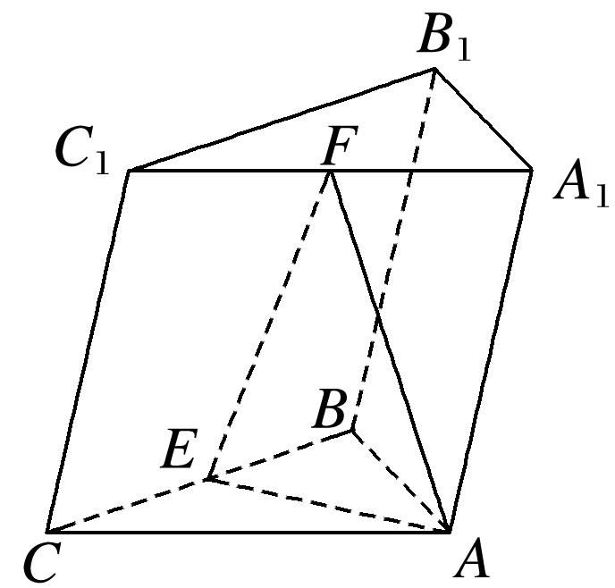

2．解析　(1)如图，取<em>A</em>1<em>B</em>1的中点<em>G</em>，连接<em>BG</em>，<em>FG</em>，在△<em>A</em>1<em>B</em>1<em>C</em>1中，

因为<em>F</em>，<em>G</em>分别为<em>A</em>1<em>C</em>1，<em>A</em>1<em>B</em>1的中点，所以<em>FG</em>∥<em>B</em>1<em>C</em>1，且<em>FG</em>＝<em>B</em>1<em>C</em>1．

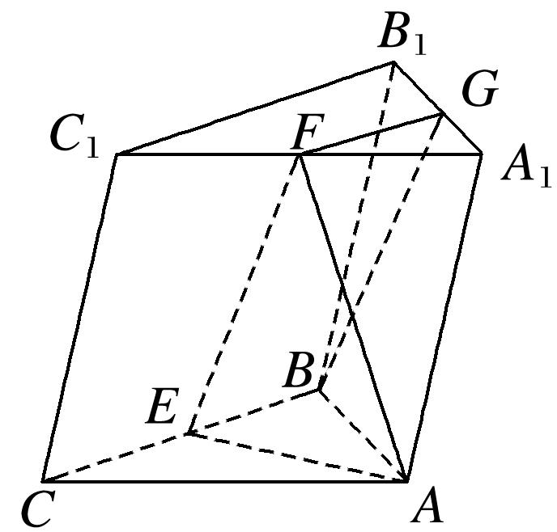

在三棱柱<em>ABC</em>－<em>A</em>1<em>B</em>1<em>C</em>1中，<em>BC</em>∥<em>B</em>1<em>C</em>1．又<em>E</em>为棱<em>BC</em>的中点，所以<em>FG</em>∥<em>BE</em>，且<em>FG</em>＝<em>BE</em>，

所以四边形*BEFG*为平行四边形，所以*EF*∥*BG*，

又因为<em>BG</em>⊂平面<em>ABB</em>1<em>A</em>1，<em>EF</em>⊄平面<em>ABB</em>1<em>A</em>1，所以<em>EF</em>∥平面<em>ABB</em>1<em>A</em>1．

(2)在△*ABC*中，因为*AB*＝*AC*，*E*为*BC*的中点，所以*AE*⊥*BC*，

又侧面<em>BCC</em>1<em>B</em>1⊥底面<em>ABC</em>，侧面<em>BCC</em>1<em>B</em>1∩底面<em>ABC</em>＝<em>BC</em>，且<em>AE</em>⊂平面<em>ABC</em>，

所以<em>AE</em>⊥平面<em>BCC</em>1<em>B</em>1，又<em>AE</em>⊂平面<em>AEF</em>，所以平面<em>AEF</em>⊥平面<em>BCC</em>1<em>B</em>1．

3．(2017·山东)由四棱柱<em>ABCD</em>－<em>A</em>1<em>B</em>1<em>C</em>1<em>D</em>1截去三棱锥<em>C</em>1－<em>B</em>1<em>CD</em>1后得到的几何体如图所示．四边形<em>ABCD</em>

为正方形，<em>O</em>为<em>AC</em>与<em>BD</em>的交点，<em>E</em>为<em>AD</em>的中点，<em>A</em>1<em>E</em>⊥平面<em>ABCD</em>．

(1)证明：<em>A</em>1<em>O</em>∥平面<em>B</em>1<em>CD</em>1；

(2)设<em>M</em>是<em>OD</em>的中点，证明：平面<em>A</em>1<em>EM</em>⊥平面<em>B</em>1<em>CD</em>1．

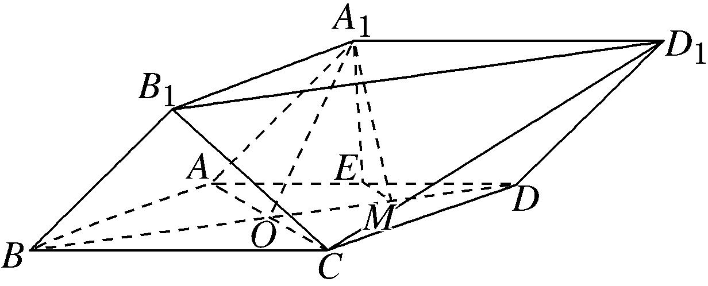

3．解析　(1)取<em>B</em>1<em>D</em>1的中点<em>O</em>1，连接<em>CO</em>1，<em>A</em>1<em>O</em>1，因为<em>ABCD－A</em>1<em>B</em>1<em>C</em>1<em>D</em>1是四棱柱，

所以<em>A</em>1<em>O</em>1∥<em>OC</em>，<em>A</em>1<em>O</em>1＝<em>OC</em>，因此四边形<em>A</em>1<em>OCO</em>1为平行四边形，所以<em>A</em>1<em>O</em>∥<em>O</em>1<em>C</em>，

因为<em>O</em>1<em>C</em>⊂平面<em>B</em>1<em>CD</em>1，<em>A</em>1<em>O</em>⊄平面<em>B</em>1<em>CD</em>1，所以<em>A</em>1<em>O</em>∥平面<em>B</em>1<em>CD</em>1．

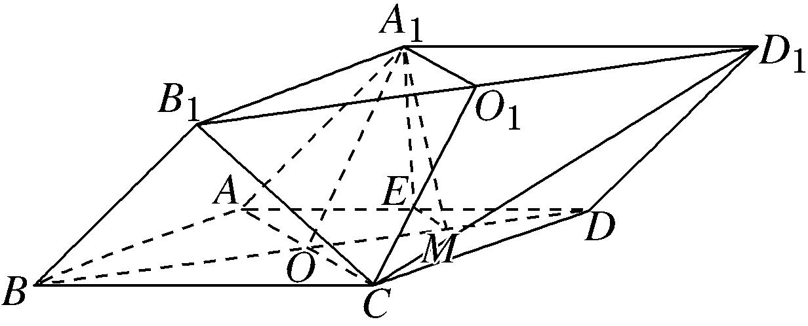

(2)因为*E*，*M*分别为*AD*，*OD*的中点，所以*EM*∥*AO*．因为*AO*⊥*BD*，所以*EM*⊥*BD*，

又<em>A</em>1<em>E</em>⊥平面<em>ABCD</em>，<em>BD</em>⊂平面<em>ABCD</em>，所以<em>A</em>1<em>E</em>⊥<em>BD</em>，

因为<em>B</em>1<em>D</em>1∥<em>BD</em>，所以<em>EM</em>⊥<em>B</em>1<em>D</em>1，<em>A</em>1<em>E</em>⊥<em>B</em>1<em>D</em>1，又<em>A</em>1<em>E</em>⊂平面<em>A</em>1<em>EM</em>，<em>EM</em>⊂平面<em>A</em>1<em>EM</em>，<em>A</em>1<em>E</em>∩<em>EM</em>＝<em>E</em>，

所以<em>B</em>1<em>D</em>1⊥平面<em>A</em>1<em>EM</em>，又<em>B</em>1<em>D</em>1⊂平面<em>B</em>1<em>CD</em>1，所以平面<em>A</em>1<em>EM</em>⊥平面<em>B</em>1<em>CD</em>1．

4．如图，在四棱锥*P－ABCD*中，*AB*∥*CD*，*AB*⊥*AD*，*CD*＝2*AB*，平面*PAD*⊥底面*ABCD*，*PA*⊥*AD*，*E*，

*F*分别是*CD*，*PC*的中点．

求证：(1)*BE*∥平面*PAD*；(2)平面*BEF*⊥平面*PCD*．

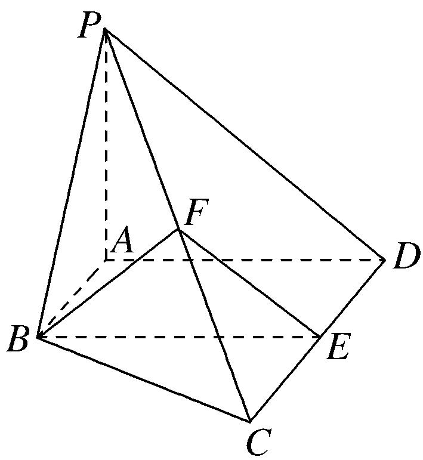

4．解析　(1)∵*AB*∥*CD*，*CD*＝2*AB*，*E*是*CD*的中点，∴*AB*∥*DE*且*AB*＝*DE*，

∴四边形*ABED*为平行四边形，∴*AD*∥*BE*，又*BE*⊄平面*PAD*，*AD*⊂平面*PAD*，∴*BE*∥平面*PAD*．

(2)∵*AB*⊥*AD*，∴四边形*ABED*为矩形，∴*BE*⊥*CD*，*AD*⊥*CD*，

∵平面*PAD*⊥底面*ABCD*，平面*PAD*∩底面*ABCD*＝*AD*，*PA*⊥*AD*，∴*PA*⊥底面*ABCD*，

∴*PA*⊥*CD*，又*PA*∩*AD*＝*A*，∴*CD*⊥平面*PAD*，∴*CD*⊥*PD*，

∵*E*，*F*分别是*CD*，*PC*的中点，∴*PD*∥*EF*，∴*CD*⊥*EF*，又*EF*∩*BE*＝*E*，∴*CD*⊥平面*BEF*，

∵*CD*⊂平面*PCD*，∴平面*BEF*⊥平面*PCD*．

5．如图，四边形*ABCD*是正方形，*O*是正方形的中心，*PO*⊥底面*ABCD*，*E*是*PC*的中点．求证：

(1)*PA*∥平面*BDE*；

(2)平面*PAC*⊥平面*BDE*．

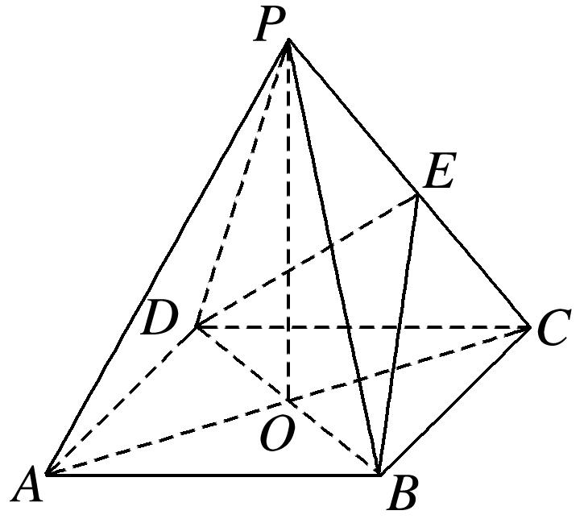

5．解析　(1)如图，*AC*∩*BD*＝*O*，连接*OE*，

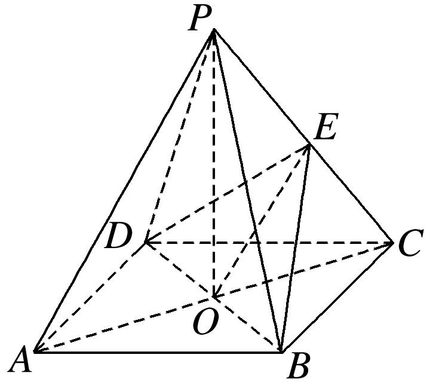

在△*PAC*中，*O*是*AC*的中点，*E*是*PC*的中点，∴*OE*∥*AP*，

又∵*OE*⊂平面*BDE*，*PA*⊄平面*BDE*．∴*PA*∥平面*BDE*．

(2)∵*PO*⊥底面*ABCD*，*BD*⊂底面*ABCD*，∴*PO*⊥*BD*，

又∵*AC*⊥*BD*，且*AC*∩*PO*＝*O*，*AC*⊂平面*PAC*，*PO*⊂平面*PAC*，

∴*BD*⊥平面*PAC*，而*BD*⊂平面*BDE*，∴平面*PAC*⊥平面*BDE*．

6．如图，四棱锥*P－ABCD*的底面是矩形，*PA*⊥平面*ABCD*，*E*，*F*分别是*AB*，*PD*的中点，且*PA*＝*AD*．

求证：(1)*AF*∥平面*PEC*；(2)平面*PEC*⊥平面*PCD*．

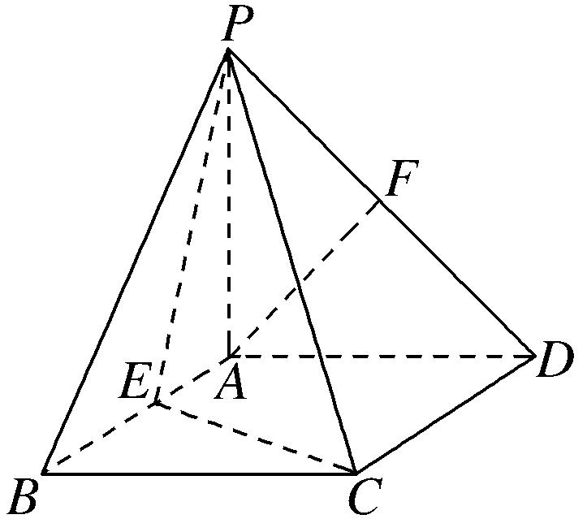

6．解析　(1)取*PC*的中点*G*，连接*FG*，*EG*，∵*F*为*PD*的中点，*G*为*PC*的中点，

∴*FG*为△*CDP*的中位线，∴*FG*∥*CD*，*FG*＝*CD*．

∵四边形*ABCD*为矩形，*E*为*AB*的中点，∴*AE*∥*CD*，*AE*＝*CD*．

∴*FG*＝*AE*，*FG*∥*AE*，∴四边形*AEGF*是平行四边形，

∴*AF*∥*EG*，又*EG*⊂平面*PEC*，*AF*⊄平面*PEC*，∴*AF*∥平面*PEC*．

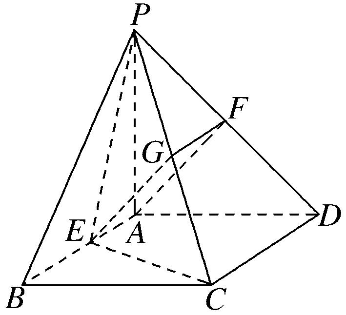

(2)∵*PA*＝*AD*，*F*为*PD*中点，∴*AF*⊥*PD*，

∵*PA*⊥平面*ABCD*，*CD*⊂平面*ABCD*，∴*PA*⊥*CD*，

又∵*CD*⊥*AD*，*AD*∩*PA*＝*A*，∴*CD*⊥平面*PAD*，∵*AF*⊂平面*PAD*，∴*CD*⊥*AF*．

又*PD*∩*CD*＝*D*，∴*AF*⊥平面*PCD*．

由(1)知*EG*∥*AF*，∴*EG*⊥平面*PCD*，又*EG*⊂平面*PEC*，∴平面*PEC*⊥平面*PCD*．

7．如图，在几何体*ABCDE*中，*AB*＝*AD*＝2，*AB*⊥*AD*，*AE*⊥平面*ABD*，*M*为线段*BD*的中点，*MC*∥*AE*，

且*AE*＝*MC*＝．

(1)求证：平面*BCD*⊥平面*CDE*；

(2)若*N*为线段*DE*的中点，求证：平面*AMN*∥平面*BEC*．

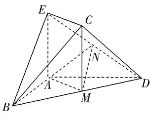

7．解析　(1)∵*AB*＝*AD*＝2，*AB*⊥*AD*，*M*为线段*BD*的中点，∴*AM*＝*BD*＝，*AM*⊥*BD*．

∵*AE*⊥平面*ABD*，*MC*∥*AE*，∴*MC*⊥平面*ABD*，

∵*AM*⊂平面*ABD*．∴*MC*⊥*AM*，又*MC*∩*BD*＝*M*，∴*AM*⊥平面*BCD*．

又*AE*＝*MC*＝，∴四边形*AMCE*为平行四边形，∴*EC*∥*AM*，

∴*EC*⊥平面*BCD*，∵*EC*⊂平面*CDE*，∴平面*BCD*⊥平面*CDE*．

(2)∵*M*为*BD*的中点，*N*为*DE*的中点，∴*MN*∥*BE*．∵*MN*⊄平面*BEC*，*BE*⊂平面*BEC*．

∴*MN*∥面*BEC*．由(1)知*EC*∥*AM*，∵*EC*⊂平面*BEC*，*AM*⊄平面*BEC*．

∴*AM*∥面*BEC*，又∵*AM*∩*MN*＝*M*．*AM*⊂平面*AMN*，*MN*⊂平面*AMN*．∴平面*AMN*∥平面*BEC*．

8．在如图所示的几何体中，四边形*ABCD*是正方形，*MA*⊥平面*ABCD*，*PD*∥*MA*，*E*，*G*，*F*分别为*MB*，

*PB*，*PC*的中点．

(1)求证：平面*EFG*∥平面*PMA*；

(2)求证：平面*EFG*⊥平面*PDC*．

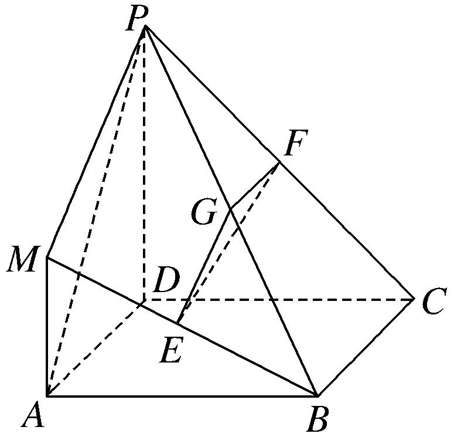

8．解析　(1)∵*E*，*G*，*F*分别为*MB*，*PB*，*PC*的中点，∴*EG*∥*PM*，*GF*∥*BC*．

又∵四边形*ABCD*是正方形，∴*BC*∥*AD*，∴*GF*∥*AD*．

∵*EG*，*GF*在平面*PMA*外，*PM*，*AD*在平面*PMA*内，∴*EG*∥平面*PMA*，*GF*∥平面*PMA*．

又∵*EG*，*GF*都在平面*EFG*内且相交，∴平面*EFG*∥平面*PMA*．

(2)由已知*MA*⊥平面*ABCD*，*PD*∥*MA*，∴*PD*⊥平面*ABCD*．

又*BC*⊂平面*ABCD*，∴*PD*⊥*BC*．∵四边形*ABCD*为正方形，∴*BC*⊥*DC*．

又*PD*∩*DC*＝*D*，∴*BC*⊥平面*PDC*．由(1)知*GF*∥*BC*，∴*GF*⊥平面*PDC*．

又*GF*⊂平面*EFG*，∴平面*EFG*⊥平面*PDC*．

9．(2013·北京)如图，在四棱锥*P－ABCD*中，*AB*∥*CD*，*AB*⊥*AD*，*CD*＝2*AB*，平面*PAD*⊥底面*ABCD*，

*PA*⊥*AD*，*E*和*F*分别是*CD*和*PC*的中点，求证：

(1)*PA*⊥底面*ABCD*；

(2)*BE*∥平面*PAD*；

(3)平面*BEF*⊥平面*PCD*．

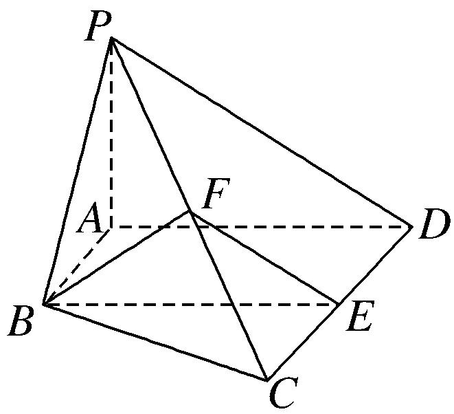

9．解析　(1)∵平面*PAD*⊥底面*ABCD*，且*PA*垂直于这两个平面的交线*AD*，*PA*⊂平面*PAD*，

∴*PA*⊥底面*ABCD*．

(2)∵*AB*∥*CD*，*CD*＝2*AB*，*E*为*CD*的中点，∴*AB*∥*DE*，且*AB*＝*DE*．

∴四边形*ABED*为平行四边形．∴*BE*∥*AD*．

又∵*BE*⊄平面*PAD*，*AD*⊂平面*PAD*，∴*BE*∥平面*PAD*．

(3)∵*AB*⊥*AD*，且四边形*ABED*为平行四边形．∴*BE*⊥*CD*，*AD*⊥*CD*，

由(1)知*PA*⊥底面*ABCD*．∴*PA*⊥*CD*．∵*PA*∩*AD*＝*A*，*PA*⊂平面*PAD*，*AD*⊂平面*PAD*，

∴*CD*⊥平面*PAD*，又*PD*⊂平面*PAD*，∴*CD*⊥*PD*．

∵*E*和*F*分别是*CD*和*PC*的中点，∴*PD*∥*EF*，∴*CD*⊥*EF*．

又*BE*⊥*CD*且*EF*∩*BE*＝*E*，∴*CD*⊥平面*BEF*．又*CD*⊂平面*PCD*，∴平面*BEF*⊥平面*PCD*．

10．(2018·北京)如图，在四棱锥*P*－*ABCD*中，底面*ABCD*为矩形，平面*PAD*⊥平面*ABCD*，*PA*⊥*PD*，*PA*

＝*PD*，*E*，*F*分别为*AD*，*PB*的中点．

(1)求证：*PE*⊥*BC*；

(2)求证：平面*PAB*⊥平面*PCD*；

(3)求证：*EF*∥平面*PCD*．

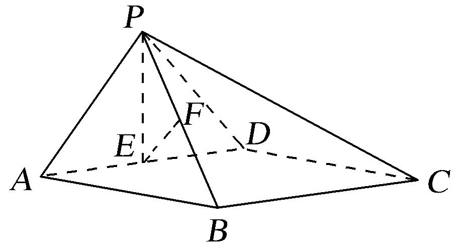

10．解析　(1)因为*PA*＝*PD*，*E*为*AD*的中点，所以*PE*⊥*AD*．

因为底面*ABCD*为矩形，所以*BC*∥*AD*．所以*PE*⊥*BC*．

(2)因为底面*ABCD*为矩形，所以*AB*⊥*AD*．又因为平面*PAD*⊥平面*ABCD*，

平面*PAD*∩平面*ABCD*＝*AD*，*AB*⊂平面*ABCD*，所以*AB*⊥平面*PAD*，且*PD*⊂平面*PAD*．所以*AB*⊥*PD*．

又因为*PA*⊥*PD*，且*PA*∩*AB*＝*A*，所以*PD*⊥平面*PAB*．又*PD*⊂平面*PCD*，

所以平面*PAB*⊥平面*PCD*．

(3)如图，取*PC*中点*G*，连接*FG*，*DG*．

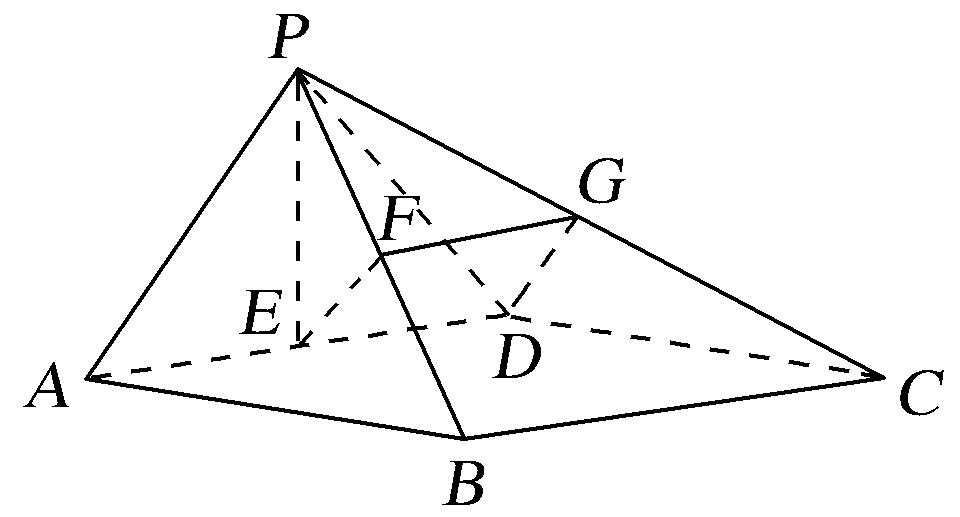

因为*F*，*G*分别为*PB*，*PC*的中点，所以*FG*∥*BC*，*FG*＝*BC*．

因为*ABCD*为矩形，且*E*为*AD*的中点，所以*DE*∥*BC*，*DE*＝*BC*．

所以*DE*∥*FG*，且*DE*＝*FG*．所以四边形*DEFG*为平行四边形．所以*EF*∥*DG*．

又因为*EF*⊄平面*PCD*，*DG*⊂平面*PCD*，所以*EF*∥平面*PCD*．

