# 专题09 利用空间向量证明平行与垂直问题

#### 1. 两个重要向量  
（1）直线的方向向量: 如果表示非零向量 $\pmb{a}$ 的有向线段所在直线与直线 $l$ 平行或重合, 则称此向量 $\pmb{a}$ 为直线 $l$ 的方向向量. 显然一条直线的方向向量有无数个, 它们是共线向量.  
（2）平面的法向量: 直线 $l \perp \alpha$ , 取直线 $l$ 的方向向量 $\boldsymbol{a}$ , 则向量 $\boldsymbol{a}$ 叫做平面 $\alpha$ 的法向量. 显然一个平面的法向量有无数个, 它们是共线向量.

#### 2. 空间位置关系的向量表示

<table><tr><td colspan="2">位置关系</td><td>向量表示</td></tr><tr><td rowspan="2">直线 $l_1$ , $l_2$ 的方向向量分别为 $n_1$ , $n_2$ </td><td> $l_1 // l_2$ </td><td> $n_1 // n_2 \Leftrightarrow n_1 = \lambda n_2$ </td></tr><tr><td> $l_1 \perp l_2$ </td><td> $n_1 \perp n_2 \Leftrightarrow n_1 \cdot n_2 = 0$ </td></tr><tr><td rowspan="2">直线 $l$ 的方向向量为 $n$ ,平面 $\alpha$ 的法向量为 $m$ </td><td> $l // \alpha$ </td><td> $n \perp m \Leftrightarrow n \cdot m = 0$ </td></tr><tr><td> $l \perp \alpha$ </td><td> $n // m \Leftrightarrow n = \lambda m$ </td></tr><tr><td rowspan="2">平面 $\alpha$ , $\beta$ 的法向量分别为 $n$ , $m$ </td><td> $\alpha // \beta$ </td><td> $n // m \Leftrightarrow n = \lambda m$ </td></tr><tr><td> $\alpha \perp \beta$ </td><td> $n \perp m \Leftrightarrow n \cdot m = 0$ </td></tr></table>

#### 3. 利用空间向量证明平行的方法

<table><tr><td>线线平行</td><td>证明两直线的方向向量共线.</td></tr><tr><td>线面平行</td><td>1证明该直线的方向向量与平面的某一法向量垂直;2证明直线的方向向量与平面内某直线的方向向量平行.</td></tr><tr><td>面面平行</td><td>1证明两平面的法向量为共线向量;2转化为线面平行、线线平行问题.</td></tr></table>

#### 4. 利用空间向量证明垂直的方法

<table><tr><td>线线垂直</td><td>证明两直线所在的方向向量互相垂直,即证它们的数量积为零.</td></tr><tr><td>线面垂直</td><td>1证明直线的方向向量与平面的法向量共线;2利用线面垂直的判定定理用向量表示.</td></tr><tr><td>面面垂直</td><td>1证明两个平面的法向量垂直;2利用面面垂直的判定定理用向量表示</td></tr></table>

#### 5. 利用空间向量证明线、面垂直(平行)的一般步骤  
（1）建立空间直角坐标系，建系时要尽可能地利用条件中的垂直关系；  
（2）建立空间图形与空间向量之间的关系，用空间向量表示出问题中所涉及的点、直线、平面的要素；  
（3）通过空间向量的运算求出直线的方向向量或平面的法向量，再研究平行、垂直关系；  
（4）根据运算结果解释相关问题.

# 【例题选讲】

[例 1] 如图，已知在直三棱柱 $ABC-A_{1}B_{1}C_{1}$ 中， $AC \perp BC$ ，D 为 AB 的中点， $AC = BC = BB_{1}$ .  
（1）求证： $BC_{1}\perp AB_{1}$ ;  
（2）求证： $BC_{1}$ // 平面 $CA_{1}D$ .

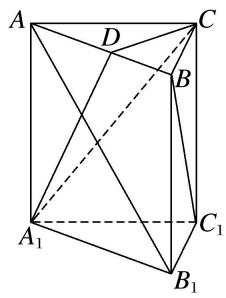

[例2] 如图所示，在四棱锥 $P - ABCD$ 中，底面 $ABCD$ 是正方形，侧棱 $PD \perp$ 底面 $ABCD$ ， $PD = DC$ ， $E$ 是 $PC$ 的中点，过点 $E$ 作 $EF \perp PB$ 于点 $F$ 。求证：  
（1）PA//平面EDB;   
（2）PB⊥平面 EFD.

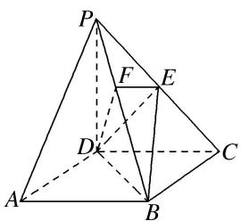

[例3] 如图，正方形 $ABCD$ 的边长为 $2\sqrt{2}$ ，四边形 $BDEF$ 是平行四边形， $BD$ 与 $AC$ 交于点 $G$ ， $O$ 为 $GC$ 的中点， $FO = \sqrt{3}$ ，且 $FO \perp$ 平面 $ABCD$ .  
（1）求证：AE//平面BCF;   
（2）求证： $CF \perp$ 平面 AEF.

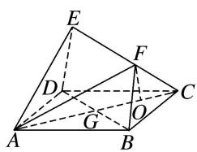

[例4] 如图，在直三棱柱 $ADE - BCF$ 中，平面 $ABFE$ 和平面 $ABCD$ 都是正方形且互相垂直，点 $M$ 为 $AB$ 的中点，点 $O$ 为 $DF$ 的中点．证明：  
（1）OM//平面BCF:   
（2）平面 MDF⊥平面 EFCD.

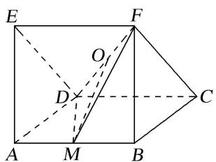

[例 5] 在底面是矩形的四棱锥 P-ABCD 中，PA⊥底面 ABCD，点 E，F 分别是 PB，PD 的中点，PA

=AB=1, BC=2. 用向量方法证明:  
（1）EF//平面ABCD;   
（2）平面 PAD⊥平面 PDC.

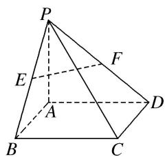

[例6] 如图，在四棱锥 $P - ABCD$ 中，底面 $ABCD$ 是边长为 $a$ 的正方形，侧面 $PAD \perp$ 底面 $ABCD$ ，且 $PA = PD = \frac{\sqrt{2}}{2} AD$ ，设 $E, F$ 分别为 $PC, BD$ 的中点.  
（1）求证： $EF \parallel$ 平面 PAD;  
（2）求证：平面 $PAB \perp$ 平面 PDC.

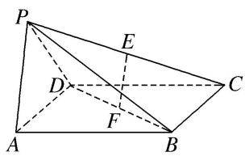

# 【对点训练】

1. 如图，在直三棱柱 $ABC - A_{1}B_{1}C_{1}$ 中， $AC = 3$ ， $BC = 4$ ， $AB = 5$ ， $AA_{1} = 4$ ，点 $D$ 是 $AB$ 的中点.  
（1）证明 $AC \perp BC_{1}$ ;   
（2）证明 $AC_{1} \parallel$ 平面 $CDB_{1}$ .

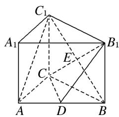

2. 如图，四棱锥 $P - ABCD$ 的底面为正方形，侧棱 $PA \perp$ 底面 $ABCD$ ，且 $PA = AD = 2, E, F, H$ 分别是线段 $PA, PD, AB$ 的中点．求证：  
（1）PB//平面 EFH;  
（2） $PD \perp$ 平面 AHF.

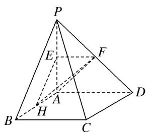

3. 如图，正方形 ADEF 与梯形 ABCD 所在的平面互相垂直， $AD \perp CD$ ， $AB \parallel CD$ ，AB = AD = 2，CD = 4，M 为 CE 的中点.  
（1）求证： $BM \parallel$ 平面 ADEF;  
（2）求证： $BC \perp$ 平面 BDE.

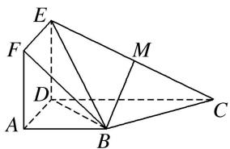

4. 如图，在三棱锥 $P - ABC$ 中， $AB = AC$ ， $D$ 为 $BC$ 的中点， $PO \perp$ 平面 $ABC$ ，垂足 $O$ 落在线段 $AD$ 上．已知 $BC = 8$ ， $PO = 4$ ， $AO = 3$ ， $OD = 2$ ．  
（1）证明： $AP \perp BC;$  
（2）若点 M 是线段 AP 上一点，且 AM=3。试证明平面 $AMC \perp$ 平面 BMC.

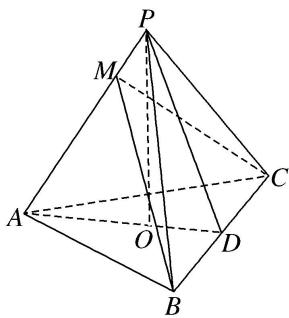

5. 如图所示，在四棱锥 $P - ABCD$ 中， $PC \perp$ 平面 $ABCD$ ， $PC = 2$ ，在四边形 $ABCD$ 中， $\angle B = \angle C = 90^\circ$ ， $AB = 4$ ， $CD = 1$ ，点 $M$ 在 $PB$ 上， $PB = 4PM$ ， $PB$ 与平面 $ABCD$ 成 $30^\circ$ 角，求证：  
（1）CM//平面 PAD;  
（2）平面 $PAB \perp$ 平面 PAD.

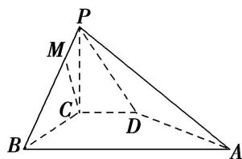

6. 如图所示, 已知四棱锥 $P - ABCD$ 的底面是直角梯形, $\angle ABC = \angle BCD = 90^{\circ}$ , $AB = BC = PB = PC = 2CD$ , 平面 $PBC \perp$ 底面 $ABCD$ . 用向量方法证明:  
（1） $PA \perp BD;$  
（2）平面 PAD⊥平面 PAB.

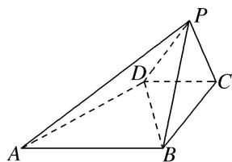

7. 如图，已知 $AA_{1} \perp$ 平面 $ABC, BB_{1} // AA_{1}, AB = AC = 3, BC = 2\sqrt{5}, AA_{1} = \sqrt{7}, BB_{1} = 2\sqrt{7}$ ，点 $E$ 和 $F$ 分别为 $BC$ 和 $A_{1}C$ 的中点.  
（1）求证： $EF \parallel$ 平面 $A_{1}B_{1}BA$ ;  
（2）求证：平面 $AEA_{1} \perp$ 平面 $BCB_{1}$ .

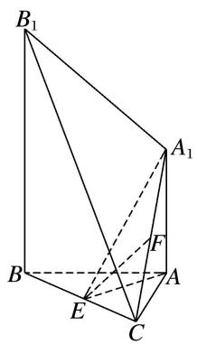

8. 如图, 在四棱锥 $P - ABCD$ 中, $PA \perp$ 底面 $ABCD$ , $AD \perp AB$ , $AB // DC$ , $AD = DC = AP = 2$ , $AB = 1$ , 点 $E$ 为棱 $PC$ 的中点. 证明:  
（1） $BE \perp DC;$   
（2）BE//平面 PAD;  
（3）平面 $PCD \perp$ 平面 PAD.

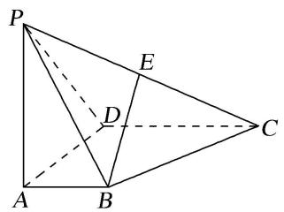

