# 专题 08 立体几何中的建系求(设)点问题

### 一、空间直角坐标系

1. 空间直角坐标系：在空间选定一点 $O$ 和一个单位正交基底 $\{i, j, k\}$ ，以 $O$ 为原点，分别以 $i, j, k$ 的方向为正方向，以它们的长为单位长度建立三条数轴： $x$ 轴、 $y$ 轴、 $z$ 轴，它们都叫做坐标轴，这时我们就建立了一个空间直角坐标系 $Oxyz$ .  
2. 相关概念: $O$ 叫做原点, $\mathbf{i}, \mathbf{j}, \mathbf{k}$ 都叫做坐标向量, 通过每两条坐标轴的平面叫做坐标平面, 分别称为 $Oxy$ 平面、 $Oyz$ 平面、 $Ozx$ 平面, 它们把空间分成八个部分.

注意点：（1）基向量： $|i|=|j|=|k|=1,\quad i\cdot j=i\cdot k=j\cdot k=0.$  
（2）画空间直角坐标系 Oxyz 时，一般使 $\angle xOy=135^{\circ}$ (或 $45^{\circ}$ ), $\angle yOz=90^{\circ}$ .  
（3）建立的坐标系均为右手直角坐标系.

### 二、空间直角坐标系的建立

#### 1. 建立空间直角坐标系的原则

尽可能的让更多的点位于 x 轴，y 轴，z 轴上或位于坐标平面 Oxy，Oyz，Ozx 内.

#### 2. 空间直角坐标系建立的模型  
（1）墙角模型：已知条件中有过一点两两垂直的三条直线，就是墙角模型.

建系：以该点为原点，分别以两两垂直的三条直线为 $x$ 轴， $y$ 轴， $z$ 轴，建立空间直角坐标系 $Oxyz$ ，当然条件不明显时，要先证明过一点的三条直线两两垂直(即一个线面垂直 + 面内两条线垂直)，这个过程不能省略。然后建系。

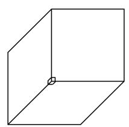

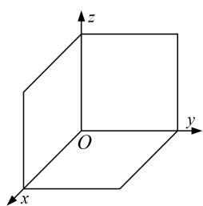

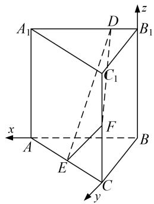  
（2）垂面模型：已知条件中有一条直线垂直于一个平面，就是墙角模型.

情形1 垂下(上)模型：直线竖直，平面水平，大部分题目都是这种类型．如图，此情形包括垂足在平面图形的顶点处、垂足在平面图形的边上(中点多)和垂足在平面图形的内部三种情况．第一种建系方法为以垂足为坐标原点，垂线的向上方向为z轴，平面图形的一边为x轴或y轴，在平面图形中，过原点作x轴或y轴的垂线为y轴或x轴(其中很多题目是连接垂足与平面图形的另一顶点)建立空间直角坐标系．第二种建系方法为以垂足为坐标原点，垂线的向上方向为z轴，垂足所在的一边为x轴或y轴，在平面图形中，过原点作x轴或y轴的垂线为y轴或x轴(其中很多题目是连接垂足与平面图形的另一顶点)建立空间直角坐标系．第三种建系方法为以垂足为坐标原点，垂线的向上方向为z轴，连接垂足与平面图形的一顶点所在直线为为x轴或y轴，在平面图形中，过原点作x轴或y轴的垂线为y轴或x轴(其中很多题目是连接垂足与平面图形的另一顶点)建立空间直角坐标系.
> 

> 
> |  | 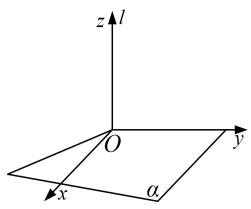 |  | 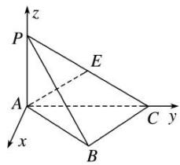 |
> | --- | --- | --- | --- |
> 
 
图1-1
 
> 

> 
> |  |  | 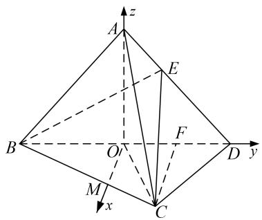 |  |
> | --- | --- | --- | --- |
> 
 
图1-2
 
> 

> 
> | 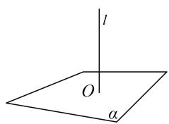 | 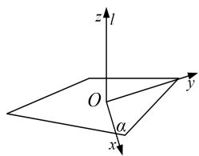 | 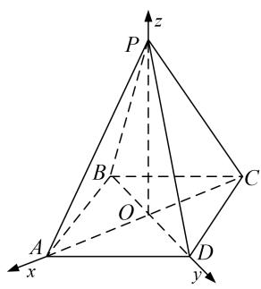 | 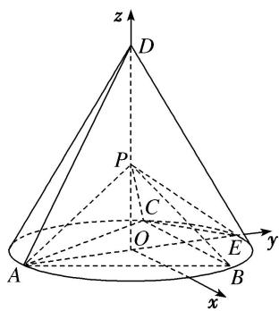 |
> | --- | --- | --- | --- |
> 
 
图1-3
 

情形2 垂左(右)模型：直线水平，平面竖直，这种类型的题目很少．各种情况如图，建系方法可类比情形1.
> 

> 
> | 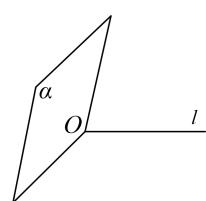 | 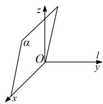 | 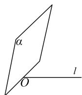 | 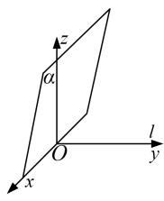 | 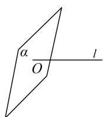 | 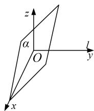 |
> | --- | --- | --- | --- | --- | --- |
> 
 
图2-1
 

图2-2  
图2-3

情形3 垂后(前)模型：直线水平，平面竖直，这种类型的题目很少．各种情况如图，建系方法可类比情形1.
> 

> 
> | 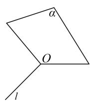 | 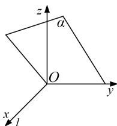 | 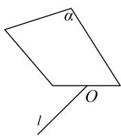 | 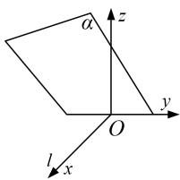 | 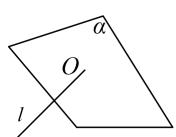 | 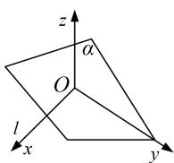 |
> | --- | --- | --- | --- | --- | --- |
> 
 
图3-1
 

图3-2  
图3-3

注意点：1．同一个几何体可以有不同的建系方法，其坐标也会对应不同．但是通过坐标所得到的结论(位置关系，数量关系）是一致的.

#### 2. 与垂直相关的定理与结论  
（1）线线垂直(相交垂直):

①正方形，矩形，直角梯形；  
②等腰三角形底边上的中线与底边垂直（三线合一）；  
③菱形的对角线相互垂直；  
④勾股定理逆定理：若 $AC^{2}+CB^{2}=AB^{2}$ ，则 $AC\perp CB$ .  
（2）线面垂直:

①如果一条直线与一个平面上的两条相交直线垂直，则这条直线与该平面垂直；  
②两条平行线，如果其中一条与平面垂直，那么另外一条也与这个平面垂直；  
③两个平面垂直，则其中一个平面上垂直交线的直线与另一个平面垂直；  
④直棱柱的侧棱与底面垂直.

### 三、空间点的坐标

#### 1. 点的坐标
在空间直角坐标系 Oxyz 中，i, j, k 为坐标向量，对空间任意一点 A，对应一个向量 $\overrightarrow{OA}$ ，且点 A 的位置由向量 $\overrightarrow{OA}$ 唯一确定，由空间向量基本定理，存在唯一的有序实数组 $(x, y, z)$ ，使 $\overrightarrow{OA} = x\mathbf{i} + y\mathbf{j} + z\mathbf{k}$ 。在单位正交基底 $\{i, j, k\}$ 下与向量 $\overrightarrow{OA}$ 对应的有序实数组 $(x, y, z)$ ，叫做点 A 在空间直角坐标系中的坐标，记作 $A(x, y, z)$ ，其中 x 叫做点 A 的横坐标，y 叫做点 A 的纵坐标，z 叫做点 A 的竖坐标。

#### 2. 点的坐标的求法

建系之后要能够快速准确的写出(算出)点的坐标，按照特点可以分为可直接写的点和需要计算的点下列两类.

可直接写的点  
（1）坐标轴、坐标平面上的点的坐标

<table><tr><td>点的位置</td><td>x轴上</td><td>y轴上</td><td>z轴上</td><td>Oxy平面内</td><td>Oyz平面内</td><td>Ozx平面内</td></tr><tr><td>点的坐标</td><td>(x,0,0)</td><td>(0,y,0)</td><td>(0,0,z)</td><td>(x,y,0)</td><td>(0,y,z)</td><td>(x,0,z)</td></tr></table>

记忆：“在哪哪非零，其他都为零”.  
（2） 空间点的对称点

<table><tr><td>初始点的坐标</td><td>(x,y,z)</td><td>(x,y,z)</td><td>(x,y,z)</td><td>(x,y,z)</td><td>(x,y,z)</td><td>(x,y,z)</td></tr><tr><td>对称轴(平面)</td><td>x轴上</td><td>y轴上</td><td>z轴上</td><td>Oxy平面内</td><td>Oyz平面内</td><td>Ozx平面内</td></tr><tr><td>对称点的坐标</td><td>(x,-y,-z)</td><td>(-x,y,-z)</td><td>(-x,-y,z)</td><td>(x,y,-z)</td><td>(-x,y,z)</td><td>(x,-y,z)</td></tr></table>

记忆 “关于谁对称，谁保持不变，其余坐标相反”  
（3） 空间点在坐标平面投影点的坐标

<table><tr><td>初始点的坐标</td><td> $(x, y, z)$ </td><td> $(x, y, z)$ </td><td> $(x, y, z)$ </td></tr><tr><td>坐标平面</td><td>Oxy 平面内</td><td>Oyz 平面内</td><td>Ozx 平面内</td></tr><tr><td>投影点的坐标</td><td> $(x, y, 0)$ </td><td> $(0, y, z)$ </td><td> $(x, 0, z)$ </td></tr></table>

记忆 “投影到哪哪不变，第三个坐标为零”。

用法：以上规律一般逆用，在写空间中点的坐标时，先写坐标平面内的投影点的坐标，再确定第三个坐标，而第三个坐标为该点到该坐标平面的距离。如在棱长为1的正方体中的点 $B_{1}$ ，在Oxy平面内的投影为B，而 $B(1,1,0)$ ，则 $B_{1}(1,1,1)$ 。

需要计算的点  
（1） 利用三角函数计算

点在 $Oxy$ 坐标平面内，如图（1），已知在空间直角坐标系 $Oxyz$ 中， $\angle xOM = \alpha$ ， $OM = m$ ，则 $x = m\cos \alpha$ ， $y = m\sin \alpha$ ，即 $M(m\cos \alpha, m\sin \alpha, 0)$ .

点在 Oxz 坐标平面内，如图（2），已知在空间直角坐标系 Oxyz 中， $\angle xON=\beta,\quad ON=n$ ，则 $x=n\cos\beta,$ $z=n\sin\beta$ ，即 $N(n\cos\beta, 0, n\sin\beta)$ .

点在 Oyz 坐标平面内，如图（3），已知在空间直角坐标系 Oxyz 中， $\angle yOP=\gamma,\quad OP=p$ ，则 $y=p\cos\gamma$ ， $z=p\sin\gamma$ ，即 $P(0,\ p\cos\gamma,\ p\sin\gamma)$ .

记忆 “与哪个轴的夹角已知，该轴上的坐标就是该点与原点的距离与夹角的余弦的乘积，另一个轴上的坐标就是该点与原点的距离与夹角的正弦的乘积，第三个轴上的坐标为零”。
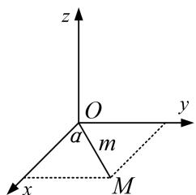

图1

图2

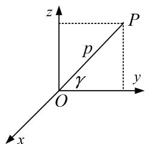

图3
  
（2） 利用中点坐标公式计算
$A(x_{1}, y_{1}, z_{1}), B(x_{2}, y_{2}, z_{2})$ ，则 AB 中点 $M(\frac{x_{1}+x_{2}}{2}, \frac{y_{1}+y_{2}}{2}, \frac{z_{1}+z_{2}}{2})$ .  
（3） 利用向量关系计算 (先设再求)

向量坐标化后，向量的关系也可转化为坐标的关系，进而可以求出一些位置不好的点的坐标，方法通常是先设出所求点的坐标，再选取向量，利用向量关系解出变量的值.

例如：已知 $A(1,0,0),B(1,1,0),C(1,1,1)$ ，且 $\overrightarrow{AB} = \overrightarrow{CD}$ ，求 $D$ 点的坐标．3．点的坐标的设法
在解决探索性问题中点的存在性时，经常需要设出点的坐标．如果所求点的坐标设为 $(x, y, z)$ ，则三个变量需要列三个方程，导致运算量增大．为了减少变量数量，所以通常用以下设法(维度等于变量个数).  
（1）直线（一维）上的点：用一个变量就可以表示出所求点的坐标.

依据 平面向量共线定理：向量 $a(a \neq 0)$ 与 b 共线的充要条件是存在唯一一个实数 $\lambda$ ，使 $b = \lambda a$ .

例如：已知 $A(4, 3, 2)$ ， $B(5, 3, 4)$ ，那么直线 AB 上的某点 $P(x, y, z)$ 的坐标可用一个变量表示.  
（2）平面（二维）上的点：用两个变量可以表示所求点坐标.

依据 平面向量基本定理：如果 $e_{1}, e_{2}$ 是同一平面内的两个不共线向量，那么对于这一平面内的任一向量 a，有且只有一对实数 $\lambda_{1}, \lambda_{2}$ ，使 $a = \lambda_{1} e_{1} + \lambda_{2} e_{2}$ .

例如：已知 $A(4, 3, 2)$ ， $B(5, 3, 4)$ ， $C(6, 4, 5)$ ，则平面 $ABC$ 上的某点 $P(x, y, z)$ 的坐标可用两个变量表示.

# 【例题选讲】

[例 1]（1）如图，在棱长为 2 的正方体 $ABCD-A_{1}B_{1}C_{1}D_{1}$ 中，E 为棱 BC 的中点，F 为棱 CD 的中点．试建立适当的空间直角坐标系并确定各点坐标.
> 

> 
> | 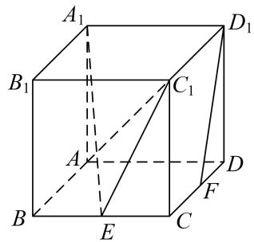 | 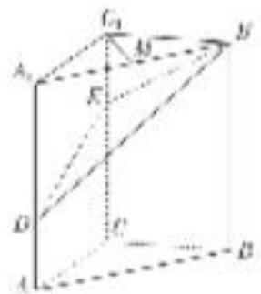 | 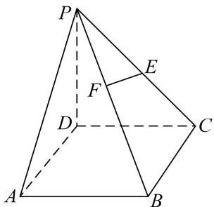 | 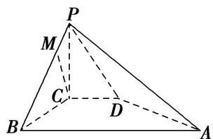 |
> | --- | --- | --- | --- |
> | （2）如图，在三棱柱 $ABC - A_{1}B_{1}C_{1}$ 中， $CC_{1} \perp$ 平面 $ABC$ ， $AC \perp BC$ ， $AC = BC = 2$ ， $CC_{1} = 3$ ，点 $D$ ， $E$ 分别在棱 $AA_{1}$ 和棱 $CC_{1}$ 上，且 $AD = 1$ ， $CE = 2$ ， $M$ 为棱 $A_{1}B_{1}$ 的中点。试建立适当的空间直角坐标系并确定各点坐标。 | （3）如图所示，在四棱锥 P-ABCD 中，底面 ABCD 是正方形，侧棱 $PD \perp$ 底面 ABCD，PD = DC = 2，E 是 PC 的中点，过点 E 作 $EF \perp PB$ 于点 F．试建立适当的空间直角坐标系并确定各点坐标. | （4）如图所示，在四棱锥 $P - ABCD$ 中， $PC \perp$ 平面 $ABCD$ ， $PC = 2$ ，在四边形 $ABCD$ 中， $\angle B = \angle C = 90^\circ$ ， $AB = 4$ ， $CD = 1$ ，点 $E$ 为 $PA$ 的中点，点 $M$ 在 $PB$ 上， $PB = 4PM$ ， $PB$ 与平面 $ABCD$ 成 $30^\circ$ 角，试建立适当的空间直角坐标系并确定各点坐标. | （5）在 $\triangle ABC$ 中， $D$ ， $E$ 分别为 $AB$ ， $AC$ 的中点， $AB=2BC=2CD=2a$ ，如图①，以 $DE$ 为折痕将 $\triangle ADE$ 折起，点 $A$ 到达点 $P$ 的位置，使平面 $DEP\perp$ 平面 $BCED$ ，如图②．试建立适当的空间直角坐标系并确定各点坐标. |
> 

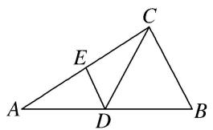

图①

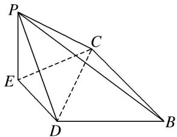

图②

# 【对点训练】

1. 已知直三棱柱 $ABC - A_{1}B_{1}C_{1}$ 中，侧面 $AA_{1}B_{1}B$ 为正方形， $AB = BC = 2$ ， $E$ ， $F$ 分别为 $AC$ 和 $CC_{1}$ 的中点，试建立适当的空间直角坐标系并确定各点坐标.

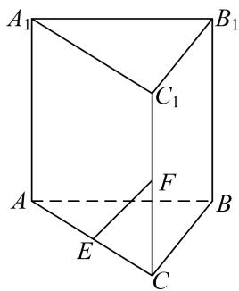

2. 如图，在长方体 $ABCD - A_1B_1C_1D_1$ 中，点 $E, F$ 分别在棱 $DD_{1}, BB_{1}$ 上，且 $2DE = ED_{1}, BF = 2FB_{1}$ . 若 $AB = 2, AD = 1, AA_{1} = 3$ ，试建立适当的空间直角坐标系并确定各点坐标.

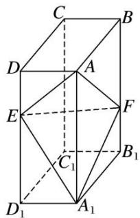

3. 如图，在四棱锥 $P - ABCD$ 中， $PA \perp$ 底面 $ABCD$ ， $AD \perp AB$ ， $AB // DC$ ， $AD = DC = AP = 2$ ， $AB = 1$ ，点 $E$ 为棱 $PC$ 的中点，试建立适当的空间直角坐标系并确定各点坐标.

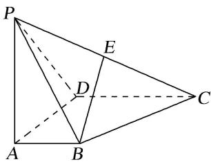

4. 在四棱锥 $P - ABCD$ 中，底面 $ABCD$ 为矩形， $PA \perp$ 平面 $ABCD$ ， $AD = 2AB = 4$ ， $PD$ 与底面 $ABCD$ 所成的角为 $45^{\circ}$ ，且 $BE \perp DP$ ，试建立适当的空间直角坐标系并确定各点坐标。

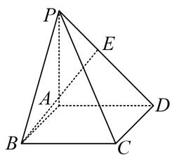

5. 等边 $\triangle ABC$ 的边长为 3，点 $D, E$ 分别是 $AB, AC$ 上的点，且满足 $\frac{AD}{DB} = \frac{CE}{EA} = \frac{1}{2}$ (如图①)，将 $\triangle ADE$ 沿

DE 折起到 $\triangle A_{1}DE$ 的位置，使二面角 $A_{1}-DE-B$ 成直二面角，连接 $A_{1}B$ ， $A_{1}C$ （如图②）。试建立适当的空间直角坐标系并确定各点坐标。

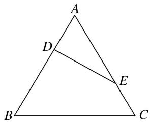

图①

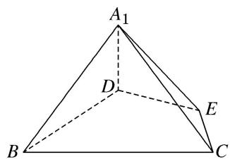

图②

[例 2] （1） 在如图所示的多面体中，四边形 ABCD 是平行四边形，四边形 BDEF 是矩形， $ED \perp$ 平面 ABCD， $\angle ABD = \frac{\pi}{6}$ ，AB = 2，AD = 1，ED = BD．试建立适当的空间直角坐标系并确定各点坐标.
> 

> 
> | 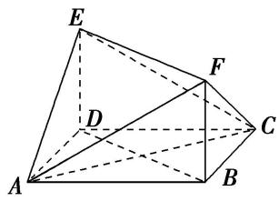 | 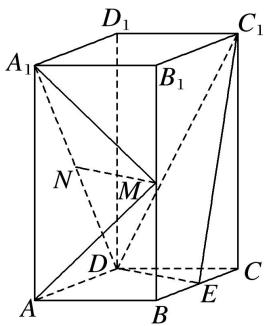 | 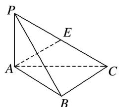 | 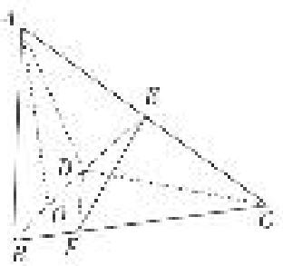 | 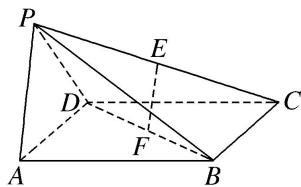 | 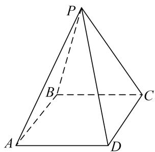 | 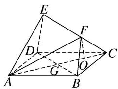 | 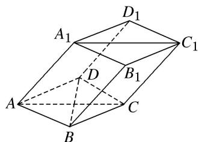 | 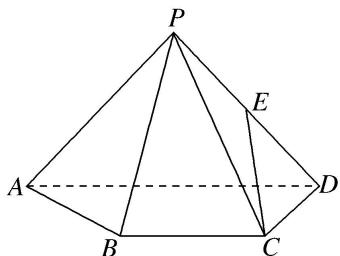 |
> | --- | --- | --- | --- | --- | --- | --- | --- | --- |
> | （2）如图，直四棱柱 $ABCD - A_{1}B_{1}C_{1}D_{1}$ 的底面是菱形， $AA_{1} = 4$ ， $AB = 2$ ， $\angle BAD = 60^{\circ}$ ， $E$ ， $M$ ， $N$ 分别是 $BC$ ， $BB_{1}$ ， $A_{1}D$ 的中点．试建立适当的空间直角坐标系并确定各点坐标. | （3）如图，已知三棱锥 $P - ABC$ ，平面 $PAC \perp$ 平面 $ABC$ ， $AB = BC = PA = \frac{1}{2} PC = 2$ ， $\angle ABC = 120^{\circ}$ 。试建立适当的空间直角坐标系并确定各点坐标. | （4）在三棱锥 A-BCD 中，已知 $CB=CD=\sqrt{5}$ ，BD=2，O 为 BD 的中点， $AO \perp$ 平面 BCD，AO=2，E 为 AC 的中点．若点 F 在 BC 上，满足 $BF=\frac{1}{4}BC$ ，试建立适当的空间直角坐标系并确定各点坐标. | （5）如图, 在四棱锥 $P - ABCD$ 中, 底面 $ABCD$ 是边长为 $a$ 的正方形, 侧面 $PAD \perp$ 底面 $ABCD$ , 且 $PA = PD = \frac{\sqrt{2}}{2} AD$ , 设 $E, F$ 分别为 $PC, BD$ 的中点. 试建立适当的空间直角坐标系并确定各点坐标. | （6）已知四棱锥 P-ABCD，底面 ABCD 为菱形，PD=PB， $PA=PC=\sqrt{3}AB$ ，PA 与平面 ABCD 所成的角为 $60^{\circ}$ ，PA=2，试建立适当的空间直角坐标系并确定各点坐标. | （7）如图，正方形 $ABCD$ 的边长为 $2\sqrt{2}$ ，四边形 $BDEF$ 是平行四边形， $BD$ 与 $AC$ 交于点 $G$ ， $O$ 为 $GC$ 的中点， $FO = \sqrt{3}$ ，且 $FO \perp$ 平面 $ABCD$ 。试建立适当的空间直角坐标系并确定各点坐标。 | （8）如图，棱柱 $ABCD-A_{1}B_{1}C_{1}D_{1}$ 的所有棱长都等于 2， $\angle ABC$ 和 $\angle A_{1}AC$ 均为 $60^{\circ}$ ，平面 $AA_{1}C_{1}C \perp$ 平面 ABCD，试建立适当的空间直角坐标系并确定各点坐标. | （9）如图, 已知四棱锥 $P - ABCD$ , $\triangle PAD$ 是以 $AD$ 为斜边的等腰直角三角形, $BC \parallel AD$ , $CD \perp AD$ , $PC = AD = 2DC = 2CB = 2$ , $E$ 为 $PD$ 的中点. 试建立适当的空间直角坐标系并确定各点坐标. | （10）如图所示的几何体中，四边形 $ABCD$ 是等腰梯形， $AB \parallel CD$ ， $\angle ABC = 60^\circ$ ， $AB = 2BC = 2CD = 4$ ，四边形 $DCEF$ 是正方形， $N$ ， $G$ 分别是线段 $AB$ ， $CE$ 的中点，且二面角 $A - CD - F$ 的大小为 $120^\circ$ 。试建立适当的空间直角坐标系并确定各点坐标。 |
> 

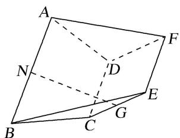

# 【对点训练】

1. 如图所示，在梯形 $ABCD$ 中， $AB \parallel CD$ ， $AD = DC = CB = 1$ ， $\angle BCD = 120^{\circ}$ ，四边形 $BFED$ 是以 $BD$ 为直角腰的直角梯形， $DE = 2BF = 2$ ，平面 $BFED \perp$ 平面 $ABCD$ ，试建立适当的空间直角坐标系并确定各

点坐标.

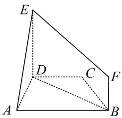

2. 如图，在几何体 $ABC - A_{1}B_{1}C_{1}$ 中，平面 $A_{1}ACC_{1} \perp$ 底面 $ABC$ ，四边形 $A_{1}ACC_{1}$ 是正方形， $B_{1}C_{1} // BC$ ， $Q$ 是 $A_{1}B$ 的中点，且 $AC = BC = 2B_{1}C_{1} = 2$ ， $\angle ACB = \frac{2\pi}{3}$ ，试建立适当的空间直角坐标系并确定各点坐标。

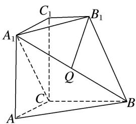

3. 如图，在几何体 $ABCDE$ 中，四边形 $ABCD$ 是矩形， $AB \perp$ 平面 $BEC$ ， $BE \perp EC$ ， $AB = BE = EC = 2$ ， $G$ ， $F$ 分别是线段 $BE$ ， $DC$ 的中点，试建立适当的空间直角坐标系并确定各点坐标。

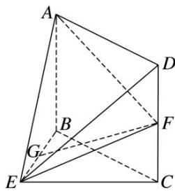

4. 如图，在三棱锥 $P - ABC$ 中， $AB = BC = 2\sqrt{2}$ ， $PA = PB = PC = AC = 4$ ， $O$ 为 $AC$ 的中点。若点 $M$ 在棱 $BC$ 上，且 $PM \perp BC$ ，试建立适当的空间直角坐标系并确定各点坐标。

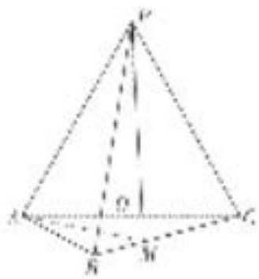

5. 如图，在四棱锥 $P - ABCD$ 中，侧面 $PAD \perp$ 底面 $ABCD$ ，底面 $ABCD$ 为直角梯形，其中 $AB \parallel CD$ ， $\angle CDA = 90^{\circ}$ ， $CD = 2AB = 2$ ， $AD = 3$ ， $PA = \sqrt{5}$ ， $PD = 2\sqrt{2}$ ，点 $E$ 在棱 $AD$ 上且 $AE = 1$ ，点 $F$ 为棱 $PD$ 的中点，试建立适当的空间直角坐标系并确定各点坐标.

6. 如图, 在四棱台 $ABCD - A_{1}B_{1}C_{1}D_{1}$ 中, 底面 $ABCD$ 是菱形, $CC_{1} \perp$ 底面 $ABCD$ , 且 $\angle BAD = 60^{\circ}$ , $CD =$
$CC_{1}=2C_{1}D_{1}=4$ ，E 是棱 $BB_{1}$ 的中点，试建立适当的空间直角坐标系并确定各点坐标.

7. 如图，在三棱锥 $P - ABC$ 中， $AB = AC$ ， $D$ 为 $BC$ 的中点， $PO \perp$ 平面 $ABC$ ，垂足 $O$ 落在线段 $AD$ 上．已知 $BC = 8$ ， $PO = 4$ ， $AO = 3$ ， $OD = 2$ ．点 $M$ 是线段 $AP$ 上一点，且 $AM = 3$ ，试建立适当的空间直角坐标系并确定各点坐标.

8. 如图，在四棱锥 $P - ABCD$ 中，底面 $ABCD$ 是平行四边形， $AB = AC = 2$ ， $AD = 2\sqrt{2}$ ， $PB = \sqrt{2}$ ， $PB \perp AC$ 。且 $\angle PBA = 45^{\circ}$ ，试建立适当的空间直角坐标系并确定各点坐标。

9. 如图，在五面体 $ABCDEF$ 中，底面 $ABCD$ 是直角梯形， $AB \parallel CD$ ， $AD \perp CD$ ，侧面 $CDEF$ 是菱形， $\angle DCF = 60^\circ$ ， $CD = 2AD = 2AB = 2$ ， $AE = \sqrt{5} AD$ ，试建立适当的空间直角坐标系并确定各点坐标。

10. 斜三棱柱 $ABC - A_{1}B_{1}C_{1}$ 中，底面是边长为2的正三角形， $A_{1}B = \sqrt{7}$ ， $\angle A_{1}AB = \angle A_{1}AC = 60^{\circ}$ ，试建立适当的空间直角坐标系并确定各点坐标.

