# 专题 08 立体几何中的建系求(设)点问题

### 一、空间直角坐标系

1. 空间直角坐标系：在空间选定一点 $O$ 和一个单位正交基底 $\{i, j, k\}$ ，以 $O$ 为原点，分别以 $i, j, k$ 的方向为正方向，以它们的长为单位长度建立三条数轴： $x$ 轴、 $y$ 轴、 $z$ 轴，它们都叫做坐标轴，这时我们就建立了一个空间直角坐标系 $Oxyz$ .  
2. 相关概念：O 叫做原点，i, j, k 都叫做坐标向量，通过每两条坐标轴的平面叫做坐标平面，分别称为 Oxy 平面、Oyz 平面、Ozx 平面，它们把空间分成八个部分.

注意点：（1）基向量： $|i|=|j|=|k|=1,\quad i\cdot j=i\cdot k=j\cdot k=0.$  
（2）画空间直角坐标系 Oxyz 时，一般使 $\angle xOy=135^{\circ}$ (或 $45^{\circ}$ ), $\angle yOz=90^{\circ}$ .  
（3）建立的坐标系均为右手直角坐标系.

### 二、空间直角坐标系的建立

#### 1. 建立空间直角坐标系的原则

尽可能的让更多的点位于 x 轴，y 轴，z 轴上或位于坐标平面 Oxy，Oyz，Ozx 内.

#### 2. 空间直角坐标系建立的模型  
（1）墙角模型：已知条件中有过一点两两垂直的三条直线，就是墙角模型.

建系：以该点为原点，分别以两两垂直的三条直线为 $x$ 轴， $y$ 轴， $z$ 轴，建立空间直角坐标系 $Oxyz$ ，当然条件不明显时，要先证明过一点的三条直线两两垂直(即一个线面垂直 + 面内两条线垂直)，这个过程不能省略。然后建系。

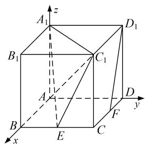

  
（2）垂面模型：已知条件中有一条直线垂直于一个平面，就是墙角模型.

情形1 垂下(上)模型：直线竖直，平面水平，大部分题目都是这种类型．如图，此情形包括垂足在平面图形的顶点处、垂足在平面图形的边上(中点多)和垂足在平面图形的内部三种情况．第一种建系方法为以垂足为坐标原点，垂线的向上方向为z轴，平面图形的一边为x轴或y轴，在平面图形中，过原点作x轴或y轴的垂线为y轴或x轴(其中很多题目是连接垂足与平面图形的另一顶点)建立空间直角坐标系．第二种建系方法为以垂足为坐标原点，垂线的向上方向为z轴，垂足所在的一边为x轴或y轴，在平面图形中，过原点作x轴或y轴的垂线为y轴或x轴(其中很多题目是连接垂足与平面图形的另一顶点)建立空间直角坐标系．第三种建系方法为以垂足为坐标原点，垂线的向上方向为z轴，连接垂足与平面图形的一顶点所在直线为为x轴或y轴，在平面图形中，过原点作x轴或y轴的垂线为y轴或x轴(其中很多题目是连接垂足与平面图形的另一顶点)建立空间直角坐标系.
> 

> 
> | 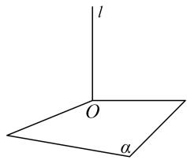 | 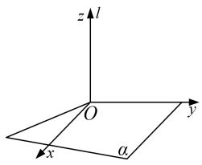 | 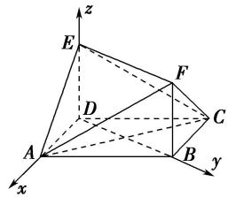 | 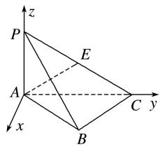 |
> | --- | --- | --- | --- |
> 
 
图1-1
 
> 

> 
> | 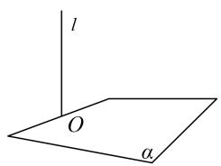 | 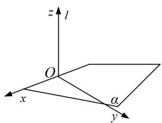 |  | 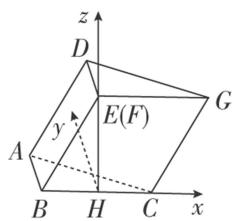 |
> | --- | --- | --- | --- |
> 
 
图1-2
 
> 

> 
> | 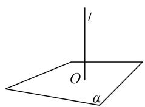 | 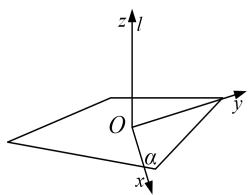 | 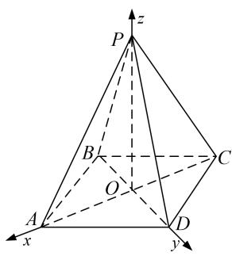 | 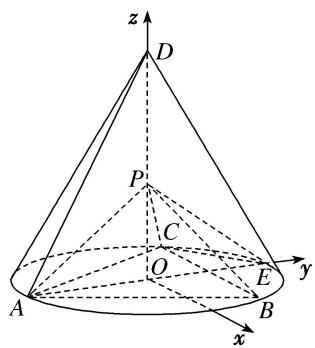 |
> | --- | --- | --- | --- |
> 
 
图1-3
 

情形2 垂左(右)模型：直线水平，平面竖直，这种类型的题目很少．各种情况如图，建系方法可类比情形1.
> 

> 
> | 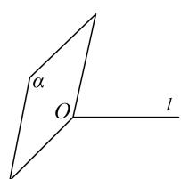 | 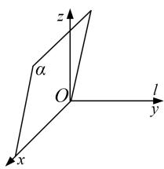 | 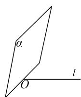 | 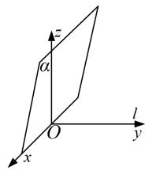 | 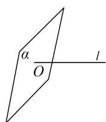 | 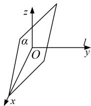 |
> | --- | --- | --- | --- | --- | --- |
> 
 
图2-1
 

图2-2  
图2-3

情形3 垂后(前)模型：直线水平，平面竖直，这种类型的题目很少．各种情况如图，建系方法可类比情形1.
> 

> 
> | 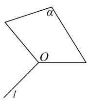 | 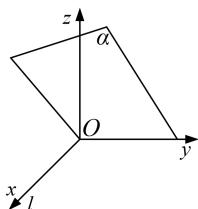 | 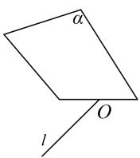 | 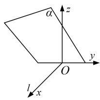 | 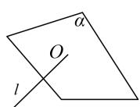 | 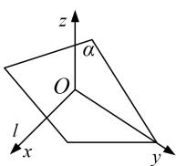 |
> | --- | --- | --- | --- | --- | --- |
> 
 
图3-1
 

图3-2  
图3-3

注意点：1．同一个几何体可以有不同的建系方法，其坐标也会对应不同．但是通过坐标所得到的结论(位置关系，数量关系）是一致的.

#### 2. 与垂直相关的定理与结论  
（1）线线垂直(相交垂直):

①正方形，矩形，直角梯形；  
②等腰三角形底边上的中线与底边垂直（三线合一）；  
③菱形的对角线相互垂直；  
④勾股定理逆定理：若 $AC^{2}+CB^{2}=AB^{2}$ ，则 $AC\perp CB$ .  
（2）线面垂直:

①如果一条直线与一个平面上的两条相交直线垂直，则这条直线与该平面垂直；  
②两条平行线，如果其中一条与平面垂直，那么另外一条也与这个平面垂直；  
③两个平面垂直，则其中一个平面上垂直交线的直线与另一个平面垂直；  
④直棱柱的侧棱与底面垂直.

### 三、空间点的坐标

#### 1. 点的坐标
在空间直角坐标系 Oxyz 中，i, j, k 为坐标向量，对空间任意一点 A，对应一个向量 $\overrightarrow{OA}$ ，且点 A 的位置由向量 $\overrightarrow{OA}$ 唯一确定，由空间向量基本定理，存在唯一的有序实数组 $(x, y, z)$ ，使 $\overrightarrow{OA} = x\mathbf{i} + y\mathbf{j} + z\mathbf{k}$ 。在单位正交基底 $\{i, j, k\}$ 下与向量 $\overrightarrow{OA}$ 对应的有序实数组 $(x, y, z)$ ，叫做点 A 在空间直角坐标系中的坐标，记作 $A(x, y, z)$ ，其中 x 叫做点 A 的横坐标，y 叫做点 A 的纵坐标，z 叫做点 A 的竖坐标。

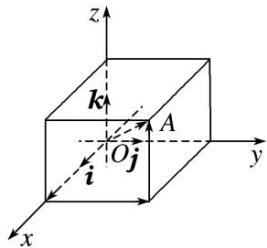

#### 2. 点的坐标的求法

建系之后要能够快速准确的写出(算出)点的坐标，按照特点可以分为可直接写的点和需要计算的点下列两类.

可直接写的点  
（1）坐标轴、坐标平面上的点的坐标

<table><tr><td>点的位置</td><td>x轴上</td><td>y轴上</td><td>z轴上</td><td>Oxy平面内</td><td>Oyz平面内</td><td>Ozx平面内</td></tr><tr><td>点的坐标</td><td>(x,0,0)</td><td>(0,y,0)</td><td>(0,0,z)</td><td>(x,y,0)</td><td>(0,y,z)</td><td>(x,0,z)</td></tr></table>

记忆：“在哪哪非零，其他都为零”.  
（2） 空间点的对称点

<table><tr><td>初始点的坐标</td><td>(x,y,z)</td><td>(x,y,z)</td><td>(x,y,z)</td><td>(x,y,z)</td><td>(x,y,z)</td><td>(x,y,z)</td></tr><tr><td>对称轴(平面)</td><td>x轴上</td><td>y轴上</td><td>z轴上</td><td>Oxy平面内</td><td>Oyz平面内</td><td>Ozx平面内</td></tr><tr><td>对称点的坐标</td><td>(x,-y,-z)</td><td>(-x,y,-z)</td><td>(-x,-y,z)</td><td>(x,y,-z)</td><td>(-x,y,z)</td><td>(x,-y,z)</td></tr></table>

记忆 “关于谁对称，谁保持不变，其余坐标相反”  
（3） 空间点在坐标平面投影点的坐标

<table><tr><td>初始点的坐标</td><td> $(x, y, z)$ </td><td> $(x, y, z)$ </td><td> $(x, y, z)$ </td></tr><tr><td>坐标平面</td><td>Oxy 平面内</td><td>Oyz 平面内</td><td>Ozx 平面内</td></tr><tr><td>投影点的坐标</td><td> $(x, y, 0)$ </td><td> $(0, y, z)$ </td><td> $(x, 0, z)$ </td></tr></table>

记忆 “投影到哪哪不变，第三个坐标为零”。

用法：以上规律一般逆用，在写空间中点的坐标时，先写坐标平面内的投影点的坐标，再确定第三个坐标，而第三个坐标为该点到该坐标平面的距离。如在棱长为1的正方体中的点 $B_{1}$ ，在Oxy平面内的投影为B，而 $B(1,1,0)$ ，则 $B_{1}(1,1,1)$ 。

需要计算的点  
（1） 利用三角函数计算

点在 $Oxy$ 坐标平面内，如图（1），已知在空间直角坐标系 $Oxyz$ 中， $\angle xOM = \alpha$ ， $OM = m$ ，则 $x = m\cos \alpha$ ， $y = m\sin \alpha$ ，即 $M(m\cos \alpha, m\sin \alpha, 0)$ .

点在 $Oxz$ 坐标平面内，如图（2），已知在空间直角坐标系 $Oxyz$ 中， $\angle xON = \beta$ ， $ON = n$ ，则 $x = n\cos \beta$ ， $z = n\sin \beta$ ，即 $N(n\cos \beta, 0, n\sin \beta)$ .

点在 Oyz 坐标平面内，如图（3），已知在空间直角坐标系 Oxyz 中， $\angle yOP=\gamma,\quad OP=p$ ，则 $y=p\cos\gamma$ ， $z=p\sin\gamma$ ，即 $P(0,\ p\cos\gamma,\ p\sin\gamma)$ .

记忆 “与哪个轴的夹角已知，该轴上的坐标就是该点与原点的距离与夹角的余弦的乘积，另一个轴上的坐标就是该点与原点的距离与夹角的正弦的乘积，第三个轴上的坐标为零”。

图1

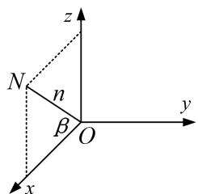

图2

图3
  
（2） 利用中点坐标公式计算
$A(x_{1}, y_{1}, z_{1}), B(x_{2}, y_{2}, z_{2})$ ，则 AB 中点 $M(\frac{x_{1}+x_{2}}{2}, \frac{y_{1}+y_{2}}{2}, \frac{z_{1}+z_{2}}{2})$ .  
（3） 利用向量关系计算 (先设再求)

向量坐标化后，向量的关系也可转化为坐标的关系，进而可以求出一些位置不好的点的坐标，方法通常是先设出所求点的坐标，再选取向量，利用向量关系解出变量的值.

例如：已知 $A(1,0,0)$ ， $B(1,1,0)$ ， $C(1,1,1)$ ，且 $\overrightarrow{AB} = \overrightarrow{CD}$ ，求 $D$ 点的坐标.
由已知得， $\overrightarrow{AB}=(0,1,0)$ ，设 $D(x,y,z)$ ，则 $\overrightarrow{CD}=(x-1,y-1,z-1)$ ，因为 $\overrightarrow{AB}=\overrightarrow{CD}$ ，所以 $\left\{\begin{aligned}x-1&=0\\ y-1&=0\\ z&-1&=0\end{aligned}\right.$ ，
解得， $\left\{\begin{aligned}x=1\\ y=0\\ z=1\end{aligned}\right.$ 所以 $D(1,0,1)$ .

3. 点的坐标的设法
在解决探索性问题中点的存在性时，经常需要设出点的坐标．如果所求点的坐标设为 $(x, y, z)$ ，则三个变量需要列三个方程，导致运算量增大．为了减少变量数量，所以通常用以下设法(维度等于变量个数).  
（1）直线（一维）上的点：用一个变量就可以表示出所求点的坐标.

依据 平面向量共线定理：向量 $a(a \neq 0)$ 与 b 共线的充要条件是存在唯一一个实数 $\lambda$ ，使 $b = \lambda a$ .

例如：已知 $A(4, 3, 2)$ ， $B(5, 3, 4)$ ，那么直线 AB 上的某点 $P(x, y, z)$ 的坐标可用一个变量表示.
因为 $\overrightarrow{AB}=(1,0,2)$ ， $\overrightarrow{AP}=(x-4,y-3,z-2)$ ，则 $\overrightarrow{AP}=\lambda\overrightarrow{AB}$ ，所以 $\begin{cases}x-4=\lambda\\y-3=0\\z-2=2\lambda\end{cases}$ 解得， $\begin{cases}x=\lambda+4\\y=3\\z=2\lambda+2\end{cases}$
所以可设 $P(\lambda+4,3,2\lambda+2)$ .  
（2）平面（二维）上的点：用两个变量可以表示所求点坐标.

依据 平面向量基本定理：如果 $e_{1}, e_{2}$ 是同一平面内的两个不共线向量，那么对于这一平面内的任一向量 a，有且只有一对实数 $\lambda_{1}, \lambda_{2}$ ，使 $a = \lambda_{1} e_{1} + \lambda_{2} e_{2}$ .

例如：已知 $A(4, 3, 2)$ ， $B(5, 3, 4)$ ， $C(6, 4, 5)$ ，则平面 $ABC$ 上的某点 $P(x, y, z)$ 的坐标可用两个变量表示.
因为 $\overrightarrow{AB}=(1,0,2)$ ， $\overrightarrow{BC}=(1,1,1)$ ， $\overrightarrow{AP}=(x-4,y-3,z-2)$ ，则 $\overrightarrow{AP}=\lambda\overrightarrow{AB}+\mu\overrightarrow{BC}$ ，所以 $\begin{cases}x-4=\lambda+\mu\\y-3=\mu\\z-2=2\lambda+\mu\end{cases}$
解得， $\left\{\begin{aligned}x&=\lambda+\mu+4\\ y&=\mu+3\\ z&=2\lambda+\mu+2\end{aligned}\right.$ 所以可设 $P(\lambda+\mu+4,\mu+3,2\lambda+\mu+2)$ .

# 【例题选讲】

[例 1]（1）如图，在棱长为 2 的正方体 $ABCD-A_{1}B_{1}C_{1}D_{1}$ 中，E 为棱 BC 的中点，F 为棱 CD 的中点．试建立适当的空间直角坐标系并确定各点坐标.

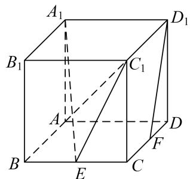

解析 本题属墙角模型建系类型
因为正方体 $ABCD - A_1B_1C_1D_1$ ，所以 $AB$ ， $AD$ ， $AA_{1}$ 两两垂直．以 $A$ 为坐标原点， $AB$ ， $AD$ ， $AA_{1}$ 为坐标轴建立空间直角坐标系，如图所示.

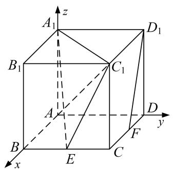
则 $A(0, 0, 0)$ ， $B(2, 0, 0)$ ， $D(0, 2, 0)$ ， $A_{1}(0, 0, 2)$ ， $C(2, 2, 0)$ ， $B_{1}(2, 0, 2)$ ， $D_{1}(0, 2, 2)$ ， $C_{1}(2, 2, 2)$ ， $E(2, 1, 0)$ ， $F(1, 2, 0)$ .  
（2）如图，在三棱柱 $ABC-A_{1}B_{1}C_{1}$ 中， $CC_{1}\perp$ 平面 ABC， $AC\perp BC$ ，AC=BC=2， $CC_{1}=3$ ，点 D，E 分别在棱 $AA_{1}$ 和棱 $CC_{1}$ 上，且 $AD = 1$ ， $CE = 2$ ， $M$ 为棱 $A_{1}B_{1}$ 的中点．试建立适当的空间直角坐标系并确定各点坐标.

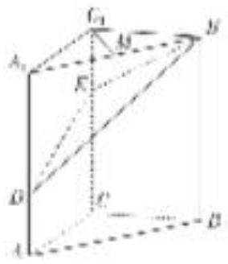

解析 本题属墙角模型建系类型
因为 $CC_{1} \perp$ 平面 $ABC, AC \perp BC$ , 所以 $CA, CB, CC_{1}$ 两两垂直. 以 $C$ 为坐标原点, 分别以 $CA, CB, CC_{1}$ 的方向为 $x$ 轴、 $y$ 轴、 $z$ 轴的正方向建立空间直角坐标系(如图),

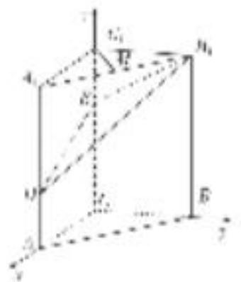
可得 $C(0, 0, 0)$ ， $A(2, 0, 0)$ ， $B(0, 2, 0)$ ， $C_{1}(0, 0, 3)$ ， $A_{1}(2, 0, 3)$ ， $B_{1}(0, 2, 3)$ ， $D(2, 0, 1)$ ， $E(0, 0, 2)$ ， $M(1, 1, 3)$ .  
（3）如图所示，在四棱锥 $P - ABCD$ 中，底面 $ABCD$ 是正方形，侧棱 $PD \perp$ 底面 $ABCD$ ， $PD = DC = 2$ ， $E$ 是 $PC$ 的中点，过点 $E$ 作 $EF \perp PB$ 于点 $F$ 。试建立适当的空间直角坐标系并确定各点坐标。

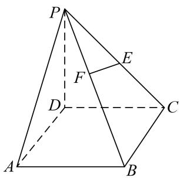

解析 本题属墙角模型建系类型

以 D 为坐标原点，射线 DA, DC, DP 分别为 x 轴、y 轴、z 轴的正方向建立如图所示的空间直角坐标系 D-xyz. $D(0, 0, 0)$ , $A(2, 0, 0)$ , $P(0, 0, 2)$ , $C(0, 2, 0)$ , $B(2, 2, 0)$ , $E(0, 1, 1)$ .

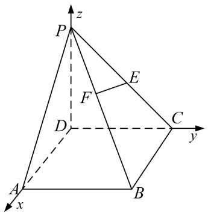
$\overrightarrow{PB}=(2,2,-2)$ ，设 $\overrightarrow{PF}=\lambda\overrightarrow{PB}$ ，则 $\overrightarrow{PF}=(2\lambda,2\lambda,-2\lambda)$ ， $\overrightarrow{EF}=\overrightarrow{EP}+\overrightarrow{PF}=(2\lambda,2\lambda-1,1-2\lambda)$ ，因为 $EF\perp PB$ ，所以 $\overrightarrow{EF}\overrightarrow{PB}=0$ ，解得， $\lambda=\frac{1}{3}$ ，所以 $F(\frac{2}{3},\frac{2}{3},\frac{4}{3})$ .  
（4）如图所示，在四棱锥 $P - ABCD$ 中， $PC \perp$ 平面 $ABCD$ ， $PC = 2$ ，在四边形 $ABCD$ 中， $\angle B = \angle C = 90^\circ$ ， $AB = 4$ ， $CD = 1$ ，点 $E$ 为 $PA$ 的中点，点 $M$ 在 $PB$ 上， $PB = 4PM$ ， $PB$ 与平面 $ABCD$ 成 $30^\circ$ 角，试建立适当的空间直角坐标系并确定各点坐标.

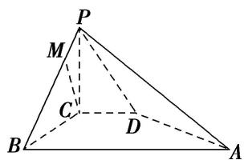

解析 本题属墙角模型建系类型
由题意知，CB，CD，CP 两两垂直，以 C 为坐标原点，CB 所在直线为 x 轴，CD 所在直线为 y 轴，CP 所在直线为 z 轴建立如图所示的空间直角坐标系 C-xyz.

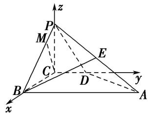
∵PC⊥平面ABCD，∴∠PBC为PB与平面ABCD所成的角，∴∠PBC=30°.
$\because PC = 2, BC = 2\sqrt{3}, PB = 4, \therefore C(0, 0, 0), B(2\sqrt{3}, 0, 0), D(0, 1, 0), P(0, 0, 2), A(2\sqrt{3}, 4,$

0), $E(\sqrt{3}, 2, 1)$ , $M\left(\frac{\sqrt{3}}{2}, 0, \frac{3}{2}\right)$ ,  
（5）在 $\triangle ABC$ 中， $D$ ， $E$ 分别为 $AB$ ， $AC$ 的中点， $AB=2BC=2CD=2a$ ，如图①，以 $DE$ 为折痕将 $\triangle ADE$ 折起，点 $A$ 到达点 $P$ 的位置，使平面 $DEP\perp$ 平面 $BCED$ ，如图②．试建立适当的空间直角坐标系并确定各点坐标.

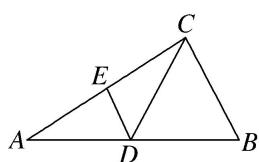

图①

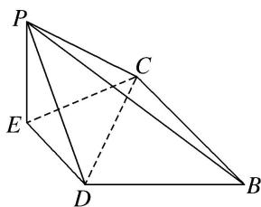

图②
解析 本题属墙角模型建系类型
在题图①中，因为 $AB = 2BC = 2CD$ ，且 $D$ 为 $AB$ 的中点，
所以由平面几何知识，得 $\angle ACB = 90^{\circ}$ 。又 $E$ 为 $AC$ 的中点，所以 $DE \parallel BC$ .
在题图②中， $CE \perp DE$ ， $PE \perp DE$ ，因为平面 $DEP \perp$ 平面 BCED，平面 $DEP \cap$ 平面 BCED = DE， $EP \subset$ 平面 DEP， $EP \perp DE$ ，所以 $EP \perp$ 平面 BCED。又 $CE \subset$ 平面 BCED，所以 $EP \perp CE$ 。

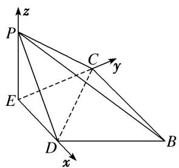

以 E 为坐标原点, $\overrightarrow{ED}, \overrightarrow{EC}, \overrightarrow{EP}$ 的方向分别为 x 轴, y 轴, z 轴的正方向建立如图所示的空间直角坐标系. 在题图①中, 设 BC = 2a, 则 AB = 4a, $AC = 2\sqrt{3}a$ , $AE = CE = \sqrt{3}a$ , DE = a.
则 $P(0, 0, \sqrt{3}a)$ ， $D(a, 0, 0)$ ， $C(0, \sqrt{3}a, 0)$ ， $B(2a, \sqrt{3}a, 0)$ .

# 【对点训练】

1. 已知直三棱柱 $ABC - A_{1}B_{1}C_{1}$ 中，侧面 $AA_{1}B_{1}B$ 为正方形， $AB = BC = 2$ ， $E$ ， $F$ 分别为 $AC$ 和 $CC_{1}$ 的中点，试建立适当的空间直角坐标系并确定各点坐标。

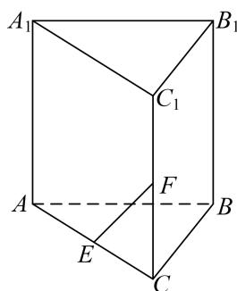

1. 解析 本题属墙角模型建系类型

连接 AF，∵E，F 分别为直三棱柱 $ABC-A_{1}B_{1}C_{1}$ 的棱 AC 和 $CC_{1}$ 的中点，且 AB=BC=2，
$\therefore C F = 1, B F = \sqrt {5}, \because B F \perp A _ {1} B _ {1}, A _ {1} B _ {1} / / A B, \therefore B F \perp A B,$
$\therefore AF = \sqrt{AB^2 + BF^2} = \sqrt{2^2 + (\sqrt{5})^2} = 3, AC = \sqrt{AF^2 - CF^2} = \sqrt{3^2 - 1^2} = 2\sqrt{2}, \therefore AB^2 + BC^2 = AC^2$ ，即 $BA \perp BC$ . 故以 $B$ 为原点， $BA, BC, BB_1$ 所在直线分别为 $x, y, z$ 轴建立如图所示的空间直角坐标系，

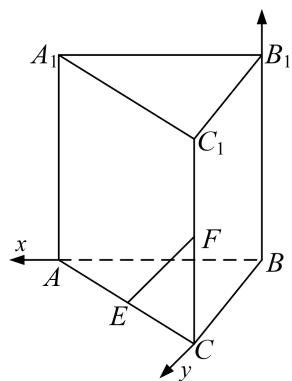
则 $B(0, 0, 0)$ ， $A(2, 0, 0)$ ， $C(0, 2, 0)$ ， $E(1, 1, 0)$ ， $F(0, 2, 1)$ ，

2. 如图，在长方体 $ABCD - A_{1}B_{1}C_{1}D_{1}$ 中，点 $E$ ， $F$ 分别在棱 $DD_{1}$ ， $BB_{1}$ 上，且 $2DE = ED_{1}$ ， $BF = 2FB_{1}$ 。若

AB=2, AD=1, $AA_{1}=3$ ，试建立适当的空间直角坐标系并确定各点坐标.

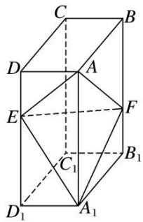

2. 解析 本题属墙角模型建系类型

以 $C_{1}$ 为坐标原点， $\overrightarrow{C_{1}D_{1}},\overrightarrow{C_{1}B_{1}}$ ， $\overrightarrow{C_{1}C}$ 的方向分别为 x 轴，y 轴，z 轴正方向，建立空间直角坐标系 $C_{1}xyz$ .

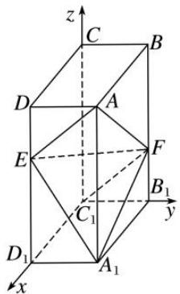
则 $C_{1}(0,0,0)$ ， $D_{1}(2,0,0)$ ， $B_{1}(0,1,0)$ ， $A_{1}(2,1,0)$ ， $C(0,0,3)$ ， $D(2,0,3)$ ， $B(0,1,3)$ ， $A(2,1,3)$ ， $E(2,0,2)$ ， $F(0,1,1)$ .

3. 如图，在四棱锥 $P - ABCD$ 中， $PA \perp$ 底面 $ABCD$ ， $AD \perp AB$ ， $AB // DC$ ， $AD = DC = AP = 2$ ， $AB = 1$ ，点 $E$ 为棱 $PC$ 的中点，试建立适当的空间直角坐标系并确定各点坐标.

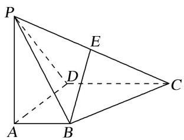

3. 解析 本题属墙角模型建系类型

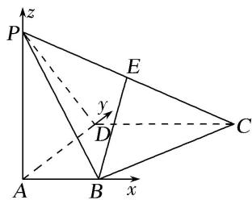
依题意，以点 A 为原点建立空间直角坐标系(如图)，可得 $A(0, 0, 0)$ ， $B(1, 0, 0)$ ， $D(0, 2, 0)$ ， $P(0, 0, 2)$ ， $C(2, 2, 0)$ ，由 E 为棱 PC 的中点，得 $E(1, 1, 1)$ .

4. 在四棱锥 $P - ABCD$ 中，底面 $ABCD$ 为矩形， $PA \perp$ 平面 $ABCD$ ， $AD = 2AB = 4$ ， $PD$ 与底面 $ABCD$ 所成的角为 $45^{\circ}$ ，且 $BE \perp DP$ ，试建立适当的空间直角坐标系并确定各点坐标。

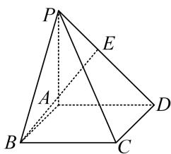

#### 4. 解析 本题属墙角模型建系类型
∵PA⊥平面ABCD，∴∠PDA即为PD与平面ABCD所成的角，
$\therefore \angle P D A = 4 5 ^ {\circ}, \therefore P A = A D = 4, A B = 2.$

以 A 为原点，AB，AD，AP 所在直线分别为 x 轴，y 轴，z 轴建立空间直角坐标系，如图所示.

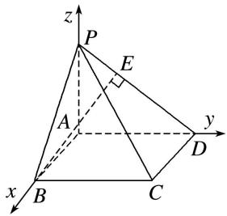
$\therefore A(0, 0, 0), B(2, 0, 0), D(0, 4, 0), P(0, 0, 4),$
设 $E(x, y, z)$ ，∵ $\overrightarrow{DP} = (0, -4, 4)$ ， $\overrightarrow{DE} = \lambda \overrightarrow{DP}$ ，且 $BE \perp DP$ ，
$\therefore(x,y-4,z)=\lambda(0,-4,4),\quad\therefore x=0,y=4-4\lambda,z=4\lambda,$
∴ 点 $E(0, 4-4\lambda, 4\lambda)$ ， $\overrightarrow{BE}=(-2, 4-4\lambda, 4\lambda)$ .
∵ $BE \perp DP$ ，∴ $\overrightarrow{BE} \cdot \overrightarrow{DP} = -4(4-4\lambda) + 4 \times 4\lambda = 0$ ，解得 $\lambda = \frac{1}{2}$ 。∴点 $E(0, 2, 2)$ ，

5. 等边 $\triangle ABC$ 的边长为 3，点 $D, E$ 分别是 $AB, AC$ 上的点，且满足 $\frac{AD}{DB} = \frac{CE}{EA} = \frac{1}{2}$ (如图①)，将 $\triangle ADE$ 沿 $DE$ 折起到 $\triangle A_{1}DE$ 的位置，使二面角 $A_{1} - DE - B$ 成直二面角，连接 $A_{1}B, A_{1}C$ (如图②). 试建立适当的空间直角坐标系并确定各点坐标.

图①

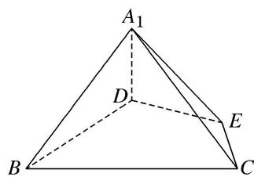

图②

#### 5. 解析 本题属墙角模型建系类型

题图①中，由已知可得：AE=2，AD=1， $A=60^{\circ}$ .
从而 $DE=\sqrt{1^{2}+2^{2}-2\times1\times2\times\cos60^{\circ}}=\sqrt{3}$ . 故得 $AD^{2}+DE^{2}=AE^{2}$ ,
所以 $AD \perp DE$ ， $BD \perp DE$ ．所以题图②中， $A_{1}D \perp DE$ ，
又平面 $ADE \cap$ 平面 BCED = DE, $A_{1}D \perp DE$ , $A_{1}D \subset$ 平面 $A_{1}DE$ ，所以 $A_{1}D \perp$ 平面 BCED.

以 D 为坐标原点，以射线 DB，DE， $DA_{1}$ 分别为 x 轴，y 轴，z 轴的正半轴建立空间直角坐标系 D-xyz，如图，

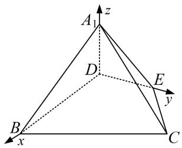

易知 $D(0, 0, 0)$ ， $B(2, 0, 0)$ ， $E(0, \sqrt{3}, 0)$ ， $A_{1}(0, 0, 1)$ ， $C(\frac{1}{2}, \frac{3\sqrt{3}}{2}, 0)$ .

[例 2] （1） 在如图所示的多面体中，四边形 ABCD 是平行四边形，四边形 BDEF 是矩形， $ED \perp$ 平面 ABCD， $\angle ABD = \frac{\pi}{6}$ ，AB = 2，AD = 1，ED = BD．试建立适当的空间直角坐标系并确定各点坐标.

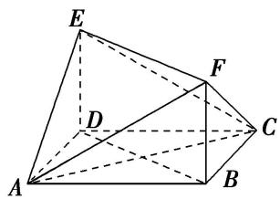

解析 本题属垂面模型1-1建系类型
在 $\triangle ABD$ 中， $\angle ABD=\frac{\pi}{6}$ ， $AB=2$ ， $AD=1$ ，由余弦定理，得 $BD=\sqrt{3}$ ，从而 $BD^{2}+AD^{2}=AB^{2}$ ，故 $BD \perp AD$ ，所以 $\triangle ABD$ 为直角三角形且 $\angle ADB=\frac{\pi}{2}$ 。因为 $DE \perp$ 平面 $ABCD$ ， $BD \perp AD$ ，

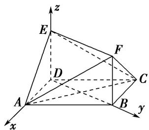
所以以点 D 为坐标原点，DA, DB, DE 所在直线分别为 x 轴，y 轴，z 轴建立空间直角坐标系，如图所示．则 $D(0, 0, 0)$ ， $A(1, 0, 0)$ ， $B(0, \sqrt{3}, 0)$ ， $E(0, 0, \sqrt{3})$ ， $C(-1, \sqrt{3}, 0)$ ， $F(0, \sqrt{3}, \sqrt{3})$ .  
（2）如图，直四棱柱 $ABCD - A_{1}B_{1}C_{1}D_{1}$ 的底面是菱形， $AA_{1} = 4$ ， $AB = 2$ ， $\angle BAD = 60^{\circ}$ ， $E$ ， $M$ ， $N$ 分别是 $BC$ ， $BB_{1}$ ， $A_{1}D$ 的中点．试建立适当的空间直角坐标系并确定各点坐标.

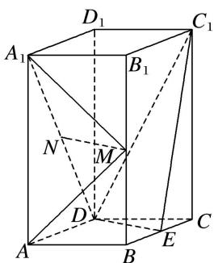

解析 本题属垂面模型1-1建系类型
由已知可得 $DE \perp DA$ ，以 D 为坐标原点， $\overrightarrow{DA}$ 的方向为 x 轴正方向，建立如图所示的空间直角坐标系 Dxyz，

则 $D(0, 0, 0)$ , $A(2, 0, 0)$ , $E(0, \sqrt{3}, 0)$ , $B(1, \sqrt{3}, 0)$ , $C(-1, \sqrt{3}, 0)$ , $D_1(0, 0, 4)$ , $A_1(2, 0, 4)$ , $B_1(1, \sqrt{3}, 4)$ , $C_1(-1, \sqrt{3}, 4)$ , $M(1, \sqrt{3}, 2)$ , $N(1, 0, 2)$ ,  
（3）如图，已知三棱锥 $P - ABC$ ，平面 $PAC \perp$ 平面 $ABC$ ， $AB = BC = PA = \frac{1}{2} PC = 2$ ， $\angle ABC = 120^{\circ}$ 。试建立适当的空间直角坐标系并确定各点坐标.

解析 本题属垂面模型1-1建系类型
$AB = BC = 2$ ， $\angle ABC = 120^{\circ}$ ，由余弦定理得
$AC^{2} = AB^{2} + BC^{2} - 2AB\cdot BC\cdot \cos \angle ABC = 4 + 4 - 2\times 2\times 2\times \left(-\frac{1}{2}\right) = 12$ ，故 $AC = 2\sqrt{3}$
又 $PA^{2}+AC^{2}=4+12=16=PC^{2}$ ，故 $PA\perp AC$ .
又平面 $PAC \perp$ 平面 $ABC$ ，且平面 $PAC \cap$ 平面 $ABC = AC$ ，故 $PA \perp$ 平面 $ABC$ 。所以是垂面模型的情形 1，故以 $A$ 为坐标原点，建立如图所示的空间直角坐标系 $A - xyz$ 。

则 $A(0, 0, 0)$ ， $B(1, \sqrt{3}, 0)$ ， $P(0, 0, 2)$ ， $C(0, 2\sqrt{3}, 0)$ ， $E(0, \sqrt{3}, 1)$ .  
（4）在三棱锥 A-BCD 中，已知 $CB=CD=\sqrt{5}$ ，BD=2，O 为 BD 的中点， $AO \perp$ 平面 BCD，AO=2，E 为 AC 的中点．若点 F 在 BC 上，满足 $BF=\frac{1}{4}BC$ ，试建立适当的空间直角坐标系并确定各点坐标.

连接 $CO$ ， $\because CB=CD$ ， $BO=OD$ ， $\therefore CO \perp BD$ 。又 $AO \perp$ 平面 $BCD$ ， $\therefore AO$ ， $BO$ ， $CO$ 两两垂直。以 $O$ 为坐标原点， $OB$ ， $OC$ ， $OA$ 所在直线分别为 $x$ ， $y$ ， $z$ 轴建立空间直角坐标系，

则 $O(0, 0, 0)$ ， $A(0, 0, 2)$ ， $B(1, 0, 0)$ ， $C(0, 2, 0)$ ， $D(-1, 0, 0)$ ， $E(0, 1, 1)$ 。因为 $BF = \frac{1}{4} BC$ ，
所以 $\overrightarrow{BF}=\frac{1}{4}\overrightarrow{BC}=(-\frac{1}{4},\frac{1}{2},0)$ ，所以 $F(\frac{3}{4},\frac{1}{2},0)$ ,  
（5）如图, 在四棱锥 $P - ABCD$ 中, 底面 $ABCD$ 是边长为 $a$ 的正方形, 侧面 $PAD \perp$ 底面 $ABCD$ , 且 $PA = PD = \frac{\sqrt{2}}{2} AD$ , 设 $E, F$ 分别为 $PC, BD$ 的中点. 试建立适当的空间直角坐标系并确定各点坐标.

解析 本题属垂面模型1-2建系类型
如图，取 AD 的中点 O，连接 OP，OF。因为 PA=PD，所以 $PO \perp AD$ 。
因为侧面 $PAD \perp$ 底面 ABCD，平面 $PAD \cap$ 平面 ABCD = AD，PO ⊂ 平面 PAD，所以 $PO \perp$ 平面 ABCD.
又 O, F 分别为 AD, BD 的中点，所以 $OF \parallel AB$ . 又 ABCD 是正方形，所以 $OF \perp AD$ .
因为 $PA=PD=\frac{\sqrt{2}}{2}AD$ ，所以 $PA\perp PD$ ， $OP=OA=\frac{a}{2}$ .

以 O 为原点，OA，OF，OP 所在直线分别为 x 轴，y 轴，z 轴建立空间直角坐标系，
则 $A\left(\frac{a}{2},0,0\right)$ ， $F\left(0,\frac{a}{2},0\right)$ ， $D\left(-\frac{a}{2},0,0\right)$ ， $P\left(0,0,\frac{a}{2}\right)$ ， $B\left(\frac{a}{2},a,0\right)$ ， $C\left(-\frac{a}{2},a,0\right)$ .
因为 E 为 PC 的中点，所以 $E\left(-\frac{a}{4}, \frac{a}{2}, \frac{a}{4}\right)$ .  
（6）已知四棱锥 P-ABCD，底面 ABCD 为菱形，PD=PB， $PA=PC=\sqrt{3}AB$ ，PA 与平面 ABCD 所成的角为 $60^{\circ}$ ，PA=2，试建立适当的空间直角坐标系并确定各点坐标.

解析 本题属垂面模型1-3建系类型

连接 AC，BD 且 $AC \cap BD = O$ ，连接 PO。由已知 ABCD 为菱形，所以 $BD \perp AC$ ，又 PD = PB，
所以 $PO \perp BD$ 。因为 $PA = PC$ ，所以 $PO \perp AC$ ，所以 $PO \perp$ 平面 $ABCD$ ，所以 $PA$ 与平面 $ABCD$ 所成的角为 $\angle PAO$ ，所以 $\angle PAO = 60^\circ$ ，所以 $AO = \frac{1}{2} PA = 1$ ， $PO = \frac{\sqrt{3}}{2} PA = \sqrt{3}$ 。因为 $PA = \sqrt{3} AB$ ，所以 $BO = \frac{\sqrt{3}}{6} PA = \frac{\sqrt{3}}{3}$ 。以 $O$ 为原点， $OA$ ， $OD$ ， $OP$ 分别为 $x$ 轴、 $y$ 轴、 $z$ 轴建立如图所示空间直角坐标系。

则 $O(0, 0, 0), A(1, 0, 0), D\left[0, \frac{\sqrt{3}}{3}, 0\right], B\left[0, -\frac{\sqrt{3}}{3}, 0\right], C(-1, 0, 0), P(0, 0, \sqrt{3}).$  
（7）如图, 正方形 $ABCD$ 的边长为 $2\sqrt{2}$ , 四边形 $BDEF$ 是平行四边形, $BD$ 与 $AC$ 交于点 $G$ , $O$ 为 $GC$ 的中点, $FO = \sqrt{3}$ , 且 $FO \perp$ 平面 $ABCD$ . 试建立适当的空间直角坐标系并确定各点坐标.

解析 本题属垂面模型1-3建系类型
如图，取 BC 的中点 H，连接 OH，则 $OH \parallel BD$ ，又四边形 ABCD 为正方形，

$\therefore AC \perp BD, \therefore OH \perp AC,$ 故以 O 为原点，建立如图所示的直角坐标系，
则 $O(0, 0, 0)$ ， $A(3, 0, 0)$ ， $C(-1, 0, 0)$ ， $G(1, 0, 0)$ ， $F(0, 0, \sqrt{3})$ ， $D(1, -2, 0)$ ， $B(1, 2, 0)$ ， $E(0, -4, \sqrt{3})$ ，  
（8）如图，棱柱 $ABCD-A_{1}B_{1}C_{1}D_{1}$ 的所有棱长都等于 2， $\angle ABC$ 和 $\angle A_{1}AC$ 均为 $60^{\circ}$ ，平面 $AA_{1}C_{1}C \perp$ 平面 ABCD，试建立适当的空间直角坐标系并确定各点坐标.

解析 本题属垂面模型1-3建系类型
设 BD 与 AC 交于点 O，则 $BD \perp AC$ ，连接 $A_{1}O$ ，在 $\triangle AA_{1}O$ 中， $AA_{1}=2, AO=1, \angle A_{1}AO=60^{\circ}, \therefore A_{1}O^{2}=AA_{1}^{2}+AO^{2}-2AA_{1}\cdot AO\cos60^{\circ}=3, \therefore AO^{2}+A_{1}O^{2}=AA_{1}^{2}, \therefore A_{1}O \perp AO.$

由于平面 $AA_{1}C_{1}C \perp$ 平面 ABCD，且平面 $AA_{1}C_{1}C \cap$ 平面 ABCD = AC， $A_{1}O \subset$ 平面 $AA_{1}C_{1}C$ ，
$\therefore A_{1}O \perp$ 平面 $ABCD$ 。以 $OB, OC, OA_{1}$ 所在直线分别为 $x$ 轴， $y$ 轴， $z$ 轴，建立如图所示的空间直角坐标系，则 $B(\sqrt{3}, 0, 0), C(0, 1, 0), A_{1}(0, 0, \sqrt{3}), A(0, -1, 0), D(-\sqrt{3}, 0, 0), C_{1}(0, 2, \sqrt{3}), B_{1}(\sqrt{3}, 1, \sqrt{3}), D_{1}(-\sqrt{3}, 1, \sqrt{3})$  
（9）如图，已知四棱锥 $P - ABCD$ ， $\triangle PAD$ 是以 $AD$ 为斜边的等腰直角三角形， $BC / / AD$ ， $CD\bot AD$ ， $PC = AD = 2DC = 2CB = 2$ ， $E$ 为 $PD$ 的中点．试建立适当的空间直角坐标系并确定各点坐标.

解析 本题属垂面模型2-1建系类型
设 AD 的中点为 O，连接 OB，OP．∵△PAD 是以 AD 为斜边的等腰直角三角形，
$\therefore OP \perp AD.$ $\because BC = \frac{1}{2} AD = OD,$ 且 $BC \parallel OD,$

∴四边形 BCDO 为平行四边形，又∵CD⊥AD，∴OB⊥AD，∵OP∩OB=O，∴AD⊥平面 OPB.
所以是垂面模型的情形 3，过点 O 在平面 POB 内作 OB 的垂线 OM，交 PB 于 M，

以 O 为原点，OB 所在直线为 x 轴，OD 所在直线为 y 轴，OM 所在直线为 z 轴，建立空间直角坐标系，如图．则有 $A(0, -1, 0)$ ， $B(1, 0, 0)$ ， $C(1, 1, 0)$ ， $D(0, 1, 0)$ ．设 $P(x, 0, z)(z > 0)$ ，由 PC = 2，
$OP=1$ ，得 $\left\{\begin{aligned}(x-1)^{2}+1+z^{2}=4,\\ x^{2}+z^{2}=1,\end{aligned}\right.$ 得 $x=-\frac{1}{2},z=\frac{\sqrt{3}}{2}.$ 即点 $P\left(-\frac{1}{2},0,\frac{\sqrt{3}}{2}\right)$ ，而E为PD的中点，∴
$E \left(- \frac {1}{4}, \frac {1}{2}, \frac {\sqrt {3}}{4}\right).$  
（10）如图所示的几何体中，四边形 $ABCD$ 是等腰梯形， $AB \parallel CD$ ， $\angle ABC = 60^\circ$ ， $AB = 2BC = 2CD = 4$ ，四边形 $DCEF$ 是正方形， $N$ ， $G$ 分别是线段 $AB$ ， $CE$ 的中点，且二面角 $A - CD - F$ 的大小为 $120^\circ$ 。试建立适当的空间直角坐标系并确定各点坐标。

解析 本题属垂面模型3-1建系类型
设 $CD$ 的中点为 $O$ , $EF$ 的中点为 $P$ , 连接 $NO$ , $OP$ , 易得 $NO \perp CD$ , 以点 $O$ 为原点, 以 $OC$ 所在直线为 $x$ 轴, 以 $NO$ 所在直线为 $y$ 轴, 以过点 $O$ 且与平面 $ABCD$ 垂直的直线为 $z$ 轴建立如图所示的空间直角坐标系.

因为 $NO \perp CD$ ， $OP \perp CD$ ，所以 $\angle NOP$ 是二面角 A-CD-F 的平面角，则 $\angle NOP = 120^{\circ}$ ，
所以 $\angle POy = 60^{\circ}$ ，因为 $AB = 4$ ，则 $BC = CD = 2$ ，则 $C(1,0,0),D(-1,0,0),B(2, - \sqrt{3},0),A(-2, - \sqrt{3},0),N(0, - \sqrt{3},0),E(1,1,\sqrt{3}),F(-1,1,\sqrt{3}),P(0,1,\sqrt{3})$

# 【对点训练】

1. 如图所示，在梯形 $ABCD$ 中， $AB \parallel CD$ ， $AD = DC = CB = 1$ ， $\angle BCD = 120^\circ$ ，四边形 $BFED$ 是以 $BD$ 为直角腰的直角梯形， $DE = 2BF = 2$ ，平面 $BFED \perp$ 平面 $ABCD$ ，试建立适当的空间直角坐标系并确定各点坐标。

1. 解析 本题属垂面模型 1-1 建系类型
在梯形 ABCD 中，因为 $AB \parallel CD$ ，AD = DC = CB = 1， $\angle BCD = 120^{\circ}$ ，
所以 $\angle CDB=30^{\circ}$ ，所以 $\angle ADB=90^{\circ}$ ，所以 $BD\perp AD$ .
因为平面 $BFED \perp$ 平面 ABCD，平面 $BFED \cap$ 平面 ABCD = BD， $ED \subset$ 平面 BFED，

四边形 BFED 是以 BD 为直角腰的直角梯形，所以 $ED \perp BD$ ，所以 $ED \perp$ 平面 ABCD.

以 D 为原点，分别以 DA，DB，DE 所在直线为 x 轴，y 轴，z 轴建立如图所示的空间直角坐标系，

在 $\triangle BCD$ 中，DC=BC=1， $\angle BCD=120^{\circ}$ ，由余弦定理得 $BD=\sqrt{3}$ ，
则 $D(0, 0, 0)$ ， $A(1, 0, 0)$ ， $B(0, \sqrt{3}, 0)$ ， $E(0, 0, 2)$ ， $F(0, \sqrt{3}, 1)$ .

2. 如图, 在几何体 $ABC - A_{1}B_{1}C_{1}$ 中, 平面 $A_{1}ACC_{1} \perp$ 底面 $ABC$ , 四边形 $A_{1}ACC_{1}$ 是正方形, $B_{1}C_{1} // BC$ , $Q$ 是 $A_{1}B$ 的中点, 且 $AC = BC = 2B_{1}C_{1} = 2$ , $\angle ACB = \frac{2\pi}{3}$ , 试建立适当的空间直角坐标系并确定各点坐标.

2. 解析 本题属垂面模型1-1建系类型
∵平面 $A_{1}ACC_{1}\perp$ 平面 ABC，平面 $A_{1}ACC_{1}\cap$ 平面 ABC=AC， $CC_{1}\perp AC$ ， $CC_{1}\subset$ 平面 $A_{1}ACC_{1}$ ，
∴ $CC_{1} \perp$ 平面 ABC. 如图所示，以 C 为原点，CB, $CC_{1}$ 所在直线分别为 y 轴和 z 轴建立空间直角坐标系，令 $AC = BC = 2B_{1}C_{1} = 2$ ，则 $C(0, 0, 0)$ , $B(0, 2, 0)$ , $C_{1}(0, 0, 2)$ ,

$A(\sqrt{3}, -1, 0), A_{1}(\sqrt{3}, -1, 2), B_{1}(0, 1, 2), Q(\frac{\sqrt{3}}{2}, \frac{1}{2}, 1).$

3. 如图，在几何体 $ABCDE$ 中，四边形 $ABCD$ 是矩形， $AB \perp$ 平面 $BEC$ ， $BE \perp EC$ ， $AB = BE = EC = 2$ ， $G$ ， $F$ 分别是线段 $BE$ ， $DC$ 的中点，试建立适当的空间直角坐标系并确定各点坐标。

3. 解析 本题属垂面模型1-1建系类型
如图，在平面 BEC 内，过 B 点作 $BQ \parallel EC$ 。因为 $BE \perp CE$ ，所以 $BQ \perp BE$ 。

又因为 $AB \perp$ 平面 BEC，所以 $AB \perp BE, AB \perp BQ$ .

以 B 为原点，分别以 BE, BQ, BA 所在直线为 x 轴，y 轴，z 轴，建立空间直角坐标系 Bxyz,
则 $B(0, 0, 0)$ , $E(2, 0, 0)$ , $A(0, 0, 2)$ , $G(1, 0, 0)$ , $C(2, 2, 0)$ , $D(2, 2, 2)$ , $F(2, 2, 1)$ .

4. 如图，在三棱锥 $P - ABC$ 中， $AB = BC = 2\sqrt{2}$ ， $PA = PB = PC = AC = 4$ ， $O$ 为 $AC$ 的中点。若点 $M$ 在棱 $BC$ 上，且 $PM \perp BC$ ，试建立适当的空间直角坐标系并确定各点坐标。

4. 解析 本题属垂面模型1-2建系类型
因为 PA=PC=AC=4，O 为 AC 的中点，所以 $PO \perp AC$ ，且 $PO=2\sqrt{3}$ .

连接 OB．因为 $AB=BC=\frac{\sqrt{2}}{2}AC$ ，所以 $\triangle ABC$ 为等腰直角三角形，且 $OB\perp AC$ ， $OB=\frac{1}{2}AC=2$ .
由 $PO^{2} + OB^{2} = PB^{2}$ ，知 $PO\bot OB$ ．由 $PO\bot OB$ ， $PO\bot AC$ ， $AC\cap OB = O$ ，知 $PO\bot$ 平面ABC.

如图，以 O 为坐标原点， $\overrightarrow{OB},\overrightarrow{OC},\overrightarrow{OP}$ 的方向分别为 x 轴、y 轴、z 轴正方向，建立如图所示的空间直角坐标系 Oxyz．由已知得 $O(0,0,0)$ ， $B(2,0,0)$ ， $A(0,-2,0)$ ， $C(0,2,0)$ ， $P(0,0,2\sqrt{3})$ ，
设 $M(a, 2-a, 0)(0<a\leq2)$ ，则 $\overrightarrow{PM}=(a, 2-a, -2\sqrt{3})$ 。因为 $\overrightarrow{BC}=(-2, 2, 0)$ ，又因为 $PM\perp BC$ ，所以 $\overrightarrow{PMB}\overrightarrow{C}=0$ ，解得，a=1，所以 $M(1, 1, 0)$ 。

5. 如图, 在四棱锥 $P - ABCD$ 中, 侧面 $PAD \perp$ 底面 $ABCD$ , 底面 $ABCD$ 为直角梯形, 其中 $AB \parallel CD$ , $\angle CDA = 90^{\circ}$ , $CD = 2AB = 2$ , $AD = 3$ , $PA = \sqrt{5}$ , $PD = 2\sqrt{2}$ , 点 $E$ 在棱 $AD$ 上且 $AE = 1$ , 点 $F$ 为棱 $PD$ 的中点,

试建立适当的空间直角坐标系并确定各点坐标.

5. 解析 本题属垂面模型1-2建系类型
在 Rt△ABE 中，由 AB=AE=1，得 $\angle AEB=45^{\circ}$ ，

同理在 Rt△CDE 中，由 CD=DE=2，得 $\angle DEC=45^{\circ}$ ，所以 $\angle BEC=90^{\circ}$ ，即 $BE\perp EC$ .
在 $\triangle PAD$ 中， $\cos\angle PAD=\frac{PA^{2}+AD^{2}-PD^{2}}{2PA\cdot AD}=\frac{5+9-8}{2\times3\times\sqrt{5}}=\frac{\sqrt{5}}{5}$
在 $\triangle PAE$ 中， $PE^{2}=PA^{2}+AE^{2}-2PA\cdot AE\cdot\cos\angle PAE=5+1-2\times\sqrt{5}\times1\times\frac{\sqrt{5}}{5}=4,$
所以 $PE^{2}+AE^{2}=PA^{2}$ ，即 $PE \perp AD$ .
又平面 $PAD \perp$ 平面 ABCD，平面 $PAD \cap$ 平面 ABCD = AD， $PE \subset$ 平面 PAD，
所以 $PE \perp$ 平面 ABCD，所以 $PE \perp BE$ ，所以 EB，EC，EP 两两垂直.
故以 E 为坐标原点，以射线 EB，EC，EP 分别为 x 轴、y 轴、z 轴的正半轴建立如图所示的空间直角坐标系，则

$E(0, 0, 0), B(\sqrt{2}, 0, 0), C(0, 2\sqrt{2}, 0), P(0, 0, 2), A\left[\frac{\sqrt{2}}{2}, -\frac{\sqrt{2}}{2}, 0\right], D(-\sqrt{2}, \sqrt{2}, 0), F\left[-\frac{\sqrt{2}}{2}, \frac{\sqrt{2}}{2}, 1\right],$

6. 如图, 在四棱台 $ABCD - A_{1}B_{1}C_{1}D_{1}$ 中, 底面 $ABCD$ 是菱形, $CC_{1} \perp$ 底面 $ABCD$ , 且 $\angle BAD = 60^{\circ}$ , $CD = CC_{1} = 2C_{1}D_{1} = 4$ , $E$ 是棱 $BB_{1}$ 的中点, 试建立适当的空间直角坐标系并确定各点坐标.

6. 解析 本题属垂面模型1-3建系类型
如图，设 AC 交 BD 于点 O，依题意， $A_{1}C_{1}//OC$ 且 $A_{1}C_{1}=OC$ ，

所以四边形 $A_{1}OCC_{1}$ 为平行四边形，所以 $A_{1}O \parallel CC_{1}$ ，且 $A_{1}O = CC_{1}$ 。所以 $A_{1}O \perp$ 底面 ABCD。以 O 为原点，OA，OB， $OA_{1}$ 所在直线分别为 x 轴，y 轴，z 轴建立空间直角坐标系 O - xyz。
则 $A(2\sqrt{3}, 0, 0)$ , $A_{1}(0, 0, 4)$ , $B(0, 2, 0)$ , $D(0, -2, 0)$ , $C(-2\sqrt{3}, 0, 0)$ , $C_{1}(-2\sqrt{3}, 0, 4)$ , $\overrightarrow{AB} = (-2\sqrt{3}, 2, 0)$ . 由 $A_{1}\overrightarrow{B}_{1} = \frac{1}{2}\overrightarrow{AB}$ , 得 $B_{1}(-\sqrt{3}, 1, 4)$ . 因为 $E$ 是棱 $BB_{1}$ 的中点, 所以 $E\left[-\frac{\sqrt{3}}{2}, \frac{3}{2}, 2\right]$ , 同理, $D_{1}(-\sqrt{3}, -1, 4)$ .

7. 如图，在三棱锥 $P - ABC$ 中， $AB = AC$ ， $D$ 为 $BC$ 的中点， $PO \perp$ 平面 $ABC$ ，垂足 $O$ 落在线段 $AD$ 上．已知 $BC = 8$ ， $PO = 4$ ， $AO = 3$ ， $OD = 2$ ．点 $M$ 是线段 $AP$ 上一点，且 $AM = 3$ ，试建立适当的空间直角坐标系并确定各点坐标.

7. 解析 本题属垂面模型1-3建系类型
如图所示，以 O 为坐标原点，以射线 OP 为 z 轴的正半轴建立空间直角坐标系 O-xyz.

则 $O(0, 0, 0)$ ， $A(0, -3, 0)$ ， $D(0, -2, 0)$ ， $B(4, 2, 0)$ ， $C(-4, 2, 0)$ ， $P(0, 0, 4)$ ， $M(0, -\frac{9}{5}, \frac{12}{5})$ .

8. 如图，在四棱锥 $P - ABCD$ 中，底面 $ABCD$ 是平行四边形， $AB = AC = 2$ ， $AD = 2\sqrt{2}$ ， $PB = \sqrt{2}$ ， $PB \perp AC$ 。且 $\angle PBA = 45^{\circ}$ ，试建立适当的空间直角坐标系并确定各点坐标。

8. 解析 本题属垂面模型2-1建系类型
因为四边形 ABCD 是平行四边形， $AD=2\sqrt{2}$ ，所以 $BC=AD=2\sqrt{2}$ ，
又 AB=AC=2，所以 $AB^{2}+AC^{2}=BC^{2}$ ，所以 $AC\perp AB$ ，
又 $PB \perp AC$ ， $AB \cap PB = B$ ，AB， $PB \subset$ 平面 PAB，所以 $AC \perp$ 平面 PAB.
分别以 AB，AC 所在直线为 x 轴，y 轴，平面 PAB 内过点 A 且与直线 AB 垂直的直线为 z 轴，建立空间直角坐标系 Axyz，

则 $A(0, 0, 0)$ , $B(2, 0, 0)$ , $C(0, 2, 0)$ , $D(-2, 2, 0)$ , 由 $\angle PBA = 45^{\circ}$ , $PB = \sqrt{2}$ , 可得 $P(1, 0, 1)$ , 9. 如图, 在五面体 $ABCDEF$ 中, 底面 $ABCD$ 是直角梯形, $AB // CD$ , $AD \perp CD$ , 侧面 $CDEF$ 是菱形, $\angle DCF = 60^{\circ}$ , $CD = 2AD = 2AB = 2$ , $AE = \sqrt{5}AD$ , 试建立适当的空间直角坐标系并确定各点坐标.

9. 解析 本题属垂面模型3-1建系类型
$\because C D = 2 A D = 2 A B = 2, A E = \sqrt {5} A D, \therefore C D = 2, A D = 1, A B = 1, A E = \sqrt {5}.$
$\therefore A E ^ {2} = A D ^ {2} + D E ^ {2}, \quad \therefore A D \perp D E. \quad \because A D \perp C D, \quad C D \cap D E = D, \quad \therefore A D \perp \text { 平面 } C D E F,$

以 D 为坐标原点，DA，DC 所在直线分别为 x 轴、y 轴，建立如图所示的空间直角坐标系 Dxyz，

由题设可得 $D(0, 0, 0)$ ， $A(1, 0, 0)$ ， $C(0, 2, 0)$ ， $B(1, 1, 0)$ ， $E(0, -1, \sqrt{3})$ ， $F(0, 1, \sqrt{3})$ ，

10. 斜三棱柱 $ABC - A_{1}B_{1}C_{1}$ 中，底面是边长为2的正三角形， $A_{1}B = \sqrt{7}$ ， $\angle A_{1}AB = \angle A_{1}AC = 60^{\circ}$ ，试建立适当的空间直角坐标系并确定各点坐标。

10. 解析 本题属垂面模型3-1建系类型
∵ AB=2， $A_{1}B=\sqrt{7}$ ， $\angle A_{1}AB=60^{\circ}$ ，∴由余弦定理得 $A_{1}B^{2}=AA_{1}^{2}+AB^{2}-2AA_{1}\cdot AB\cos\angle A_{1}AB$ ，
即 $AA_{1}^{2}-2AA_{1}-3=0\Rightarrow AA_{1}=3$ 或 $AA_{1}=-1$ (舍)，故 $AA_{1}=3$ .

取 BC 的中点 O，连接 OA， $OA_{1}$ ，∵ $\triangle ABC$ 是边长为 2 的正三角形，∴ $AO \perp BC$ ，且 $AO = \sqrt{3}$ ，BO = 1。
由 AB=AC， $\angle A_{1}AB=\angle A_{1}AC$ ， $AA_{1}=AA_{1}$ 得 $\triangle A_{1}AB\cong\triangle A_{1}AC$ ，得 $A_{1}B=A_{1}C=\sqrt{7}$
故 $A_{1}O \perp BC$ ，且 $A_{1}O = \sqrt{6}$ . $\because AO^{2} + A_{1}O^{2} = 3 + 6 = 9 = AA_{1}^{2}, \therefore AO \perp A_{1}O.$

以 O 为原点，OB 所在的直线为 x 轴，取 $B_{1}C_{1}$ 的中点 K，连接 OK，以 OK 所在的直线为 y 轴，过 O 作 $OG \perp AA_{1}$ ，以 OG 所在的直线为 z 轴建立空间直角坐标系，
则 $B(1, 0, 0)$ ， $B_{1}(1, 3, 0)$ ， $C(-1, 0, 0)$ ， $C_{1}(-1, 3, 0)$ ，
在 Rt△ABC 中，∵ $AO=\sqrt{3}$ ， $A_{1}O=\sqrt{6}$ ， $AA_{1}=3$ 。∴ $OG=\sqrt{2}$ ，AG=1， $A_{1}G=2$ ，∴ $A(0,-1,\sqrt{2})$ ， $A_{1}(0,2,\sqrt{2})$ ，

