专题08　立体几何中的建系求(设)点问题

一、空间直角坐标系

1．空间直角坐标系：在空间选定一点<em>O</em>和一个单位正交基底{<em><strong>i</strong></em>，<em><strong>j</strong></em>，<em><strong>k</strong></em>}，以<em>O</em>为原点，分别以<em><strong>i</strong></em>，<em><strong>j</strong></em>，<em><strong>k</strong></em>的方向为正方向，以它们的长为单位长度建立三条数轴：<em>x</em>轴、<em>y</em>轴、<em>z</em>轴，它们都叫做坐标轴，这时我们就建立了一个空间直角坐标系<em>Oxyz</em>．

2．相关概念：<em>O</em>叫做原点，<em><strong>i</strong></em>，<em><strong>j</strong></em>，<em><strong>k</strong></em>都叫做坐标向量，通过每两条坐标轴的平面叫做坐标平面，分别称为<em>Oxy</em>平面、<em>Oyz</em>平面、<em>Ozx</em>平面，它们把空间分成八个部分．

注意点：（1）基向量：|*i*|＝|*j*|＝|*k*|＝1，*i*·*j*＝*i*·*k*＝*j*·*k*＝0．  
（2）画空间直角坐标系*Oxyz*时，一般使∠*xOy*＝135°(或45°)，∠*yOz*＝90°．  
（3）建立的坐标系均为右手直角坐标系．

二、空间直角坐标系的建立

1．建立空间直角坐标系的原则

尽可能的让更多的点位于*x*轴，*y*轴，*z*轴上或位于坐标平面*Oxy*，*Oyz*，*Ozx*内．

2．空间直角坐标系建立的模型  
（1）墙角模型：已知条件中有过一点两两垂直的三条直线，就是墙角模型．

建系：以该点为原点，分别以两两垂直的三条直线为*x*轴，*y*轴，*z*轴，建立空间直角坐标系*Oxyz*，当然条件不明显时，要先证明过一点的三条直线两两垂直(即一个线面垂直面内两条线垂直)，这个过程不能省略．然后建系．

  
（2）垂面模型：已知条件中有一条直线垂直于一个平面，就是墙角模型．

情形１　垂下(上)模型：直线竖直，平面水平，大部分题目都是这种类型．如图，此情形包括垂足在平面图形的顶点处、垂足在平面图形的边上(中点多)和垂足在平面图形的内部三种情况．第一种建系方法为以垂足为坐标原点，垂线的向上方向为*z*轴，平面图形的一边为*x*轴或*y*轴，在平面图形中，过原点作*x*轴或*y*轴的垂线为*y*轴或*x*轴(其中很多题目是连接垂足与平面图形的另一顶点)建立空间直角坐标系．第二种建系方法为以垂足为坐标原点，垂线的向上方向为*z*轴，垂足所在的一边为*x*轴或*y*轴，在平面图形中，过原点作*x*轴或*y*轴的垂线为*y*轴或*x*轴(其中很多题目是连接垂足与平面图形的另一顶点)建立空间直角坐标系．第三种建系方法为以垂足为坐标原点，垂线的向上方向为*z*轴，连接垂足与平面图形的一顶点所在直线为为*x*轴或*y*轴，在平面图形中，过原点作*x*轴或*y*轴的垂线为*y*轴或*x*轴(其中很多题目是连接垂足与平面图形的另一顶点)建立空间直角坐标系．

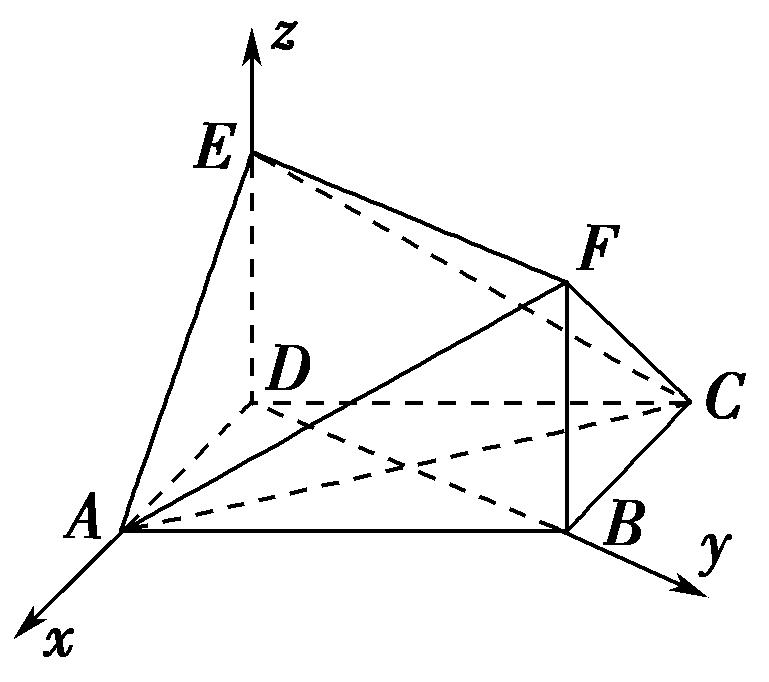

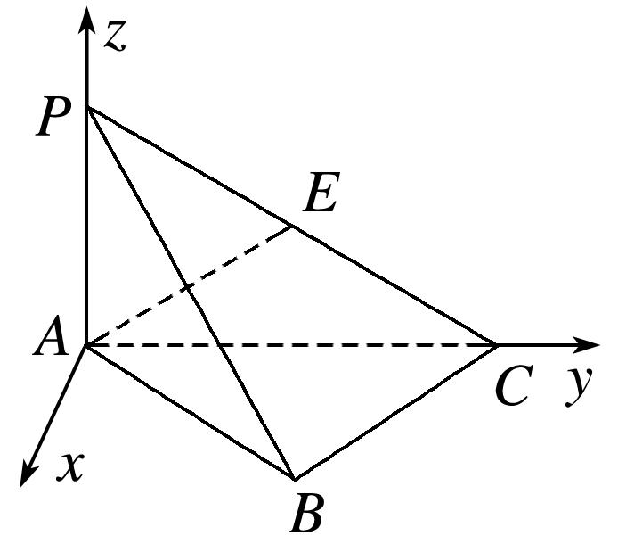  
图1－1

  
图1－2

  
图1－3

情形2　垂左(右)模型：直线水平，平面竖直，这种类型的题目很少．各种情况如图，建系方法可类比情形1．

  
图2－1　　　　　　　　　　　　　　图2－2　　　　　　　　　　　　图2－3

情形3　垂后(前)模型：直线水平，平面竖直，这种类型的题目很少．各种情况如图，建系方法可类比情形1．

  
图3－1　　　　　　　　　　　　图3－2　　　　　　　　　　　　图3－3

注意点：1．同一个几何体可以有不同的建系方法，其坐标也会对应不同．但是通过坐标所得到的结论(位置关系，数量关系）是一致的．

2．与垂直相关的定理与结论  
（1）线线垂直(相交垂直)：

①正方形，矩形，直角梯形；
②等腰三角形底边上的中线与底边垂直（三线合一）；
③菱形的对角线相互垂直；
④勾股定理逆定理：若<em>AC</em>2＋<em>CB</em>2＝<em>AB</em>2，则<em>AC</em>⊥<em>CB</em>．  
（2）线面垂直：

①如果一条直线与一个平面上的两条相交直线垂直，则这条直线与该平面垂直；
②两条平行线，如果其中一条与平面垂直，那么另外一条也与这个平面垂直；
③两个平面垂直，则其中一个平面上垂直交线的直线与另一个平面垂直；
④直棱柱的侧棱与底面垂直．

三、空间点的坐标

1．点的坐标
在空间直角坐标系<em>Oxyz</em>中，<em><strong>i</strong></em>，<em><strong>j</strong></em>，<em><strong>k</strong></em>为坐标向量，对空间任意一点<em>A</em>，对应一个向量，且点<em>A</em>的位置由向量唯一确定，由空间向量基本定理，存在唯一的有序实数组(<em>x</em>，<em>y</em>，<em>z</em>)，使＝<em>x<strong>i</strong></em>＋<em>y<strong>j</strong></em>＋<em>z<strong>k</strong></em>．在单位正交基底{<em><strong>i</strong></em>，<em><strong>j</strong></em>，<em><strong>k</strong></em>}下与向量对应的有序实数组(<em>x</em>，<em>y</em>，<em>z</em>)，叫做点<em>A</em>在空间直角坐标系中的坐标，记作<em>A</em>(<em>x</em>，<em>y</em>，<em>z</em>)，其中<em>x</em>叫做点<em>A</em>的横坐标，<em>y</em>叫做点<em>A</em>的纵坐标，<em>z</em>叫做点<em>A</em>的竖坐标．

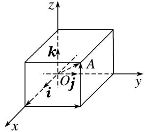

2．点的坐标的求法

建系之后要能够快速准确的写出(算出)点的坐标，按照特点可以分为可直接写的点和需要计算的点下列两类．

可直接写的点  
（1）坐标轴、坐标平面上的点的坐标

<table><tr><td>
点的位置
</td><td>
<em>x</em>轴上
</td><td>
<em>y</em>轴上
</td><td>
<em>z</em>轴上
</td><td>
<em>Oxy</em>平面内
</td><td>
<em>Oyz</em>平面内
</td><td>
<em>Ozx</em>平面内
</td></tr><tr><td>
点的坐标
</td><td>
(<em>x</em>，0，0)
</td><td>
(0，<em>y</em>，0)
</td><td>
(0，0，<em>z</em>)
</td><td>
(<em>x</em>，<em>y</em>，0)
</td><td>
(0，<em>y</em>，<em>z</em>)
</td><td>
(<em>x</em>，0，<em>z</em>)
</td></tr></table>

记忆：“在哪哪非零，其他都为零”．  
（2）空间点的对称点

<table><tr><td>
初始点的坐标
</td><td>
(<em>x</em>，<em>y</em>，<em>z</em>)
</td><td>
(<em>x</em>，<em>y</em>，<em>z</em>)
</td><td>
(<em>x</em>，<em>y</em>，<em>z</em>)
</td><td>
(<em>x</em>，<em>y</em>，<em>z</em>)
</td><td>
(<em>x</em>，<em>y</em>，<em>z</em>)
</td><td>
(<em>x</em>，<em>y</em>，<em>z</em>)
</td></tr><tr><td>
对称轴(平面)
</td><td>
<em>x</em>轴上
</td><td>
<em>y</em>轴上
</td><td>
<em>z</em>轴上
</td><td>
<em>Oxy</em>平面内
</td><td>
<em>Oyz</em>平面内
</td><td>
<em>Ozx</em>平面内
</td></tr><tr><td>
对称点的坐标
</td><td>
(<em>x</em>，－<em>y</em>，－<em>z</em>)
</td><td>
(－<em>x</em>，<em>y</em>，－<em>z</em>)
</td><td>
(－<em>x</em>，－<em>y</em>，<em>z</em>)
</td><td>
(<em>x</em>，<em>y</em>，－<em>z</em>)
</td><td>
(－<em>x</em>，<em>y</em>，<em>z</em>)
</td><td>
(<em>x</em>，－<em>y</em>，<em>z</em>)
</td></tr></table>

记忆“关于谁对称，谁保持不变，其余坐标相反”．  
（3）空间点在坐标平面投影点的坐标

<table><tr><td>
初始点的坐标
</td><td>
(<em>x</em>，<em>y</em>，<em>z</em>)
</td><td>
(<em>x</em>，<em>y</em>，<em>z</em>)
</td><td>
(<em>x</em>，<em>y</em>，<em>z</em>)
</td></tr><tr><td>
坐标平面
</td><td>
<em>Oxy</em>平面内
</td><td>
<em>Oyz</em>平面内
</td><td>
<em>Ozx</em>平面内
</td></tr><tr><td>
投影点的坐标
</td><td>
(<em>x</em>，<em>y</em>，0)
</td><td>
(0，<em>y</em>，<em>z</em>)
</td><td>
(<em>x</em>，0，<em>z</em>)
</td></tr></table>

记忆“投影到哪哪不变，第三个坐标为零”．

用法：以上规律一般逆用，在写空间中点的坐标时，先写坐标平面内的投影点的坐标，再确定第三个坐标，而第三个坐标为该点到该坐标平面的距离．如在棱长为1的正方体中的点<em>B</em>1，在<em>Oxy</em>平面内的投影为<em>B</em>，而<em>B</em>(1，1，0)，则<em>B</em>1(1，1，1)．

需要计算的点  
（1）利用三角函数计算

点在*Oxy*坐标平面内，如图（1），已知在空间直角坐标系*Oxyz*中，∠*xOM*＝*α*，*OM*＝*m*，则*x*＝*m*cos*α*，*y*＝*m*sin*α*，即*M*(*m*cos*α*，*m*sin*α*，0)．

点在*Oxz*坐标平面内，如图（2），已知在空间直角坐标系*Oxyz*中，∠*xON*＝β，*ON*＝*n*，则*x*＝*n*cosβ，*z*＝*n*sinβ，即*N*(*n*cosβ，0，*n*sinβ)．

点在*Oyz*坐标平面内，如图（3），已知在空间直角坐标系*Oxyz*中，∠*yOP*＝γ，*OP*＝*p*，则*y*＝*p*cosγ，

*z*＝*p*sinγ，即*P*(0，*p*cosγ，*p*sinγ)．

记忆“与哪个轴的夹角已知，该轴上的坐标就是该点与原点的距离与夹角的余弦的乘积，另一个轴上的坐标就是该点与原点的距离与夹角的正弦的乘积，第三个轴上的坐标为零”．

  
（2）利用中点坐标公式计算

<em>A</em>(<em>x</em>1，<em>y</em>1，<em>z</em>1)，<em>B</em>(<em>x</em>2，<em>y</em>2，<em>z</em>2)，则<em>AB</em>中点<em>M</em>(，，)．  
（3）利用向量关系计算(先设再求)

向量坐标化后，向量的关系也可转化为坐标的关系，进而可以求出一些位置不好的点的坐标，方法通常是先设出所求点的坐标，再选取向量，利用向量关系解出变量的值．

例如：已知*A*(1，0，0)，*B*(1，1，0)，*C*(1，1，1)，且＝，求*D*点的坐标．
由已知得，＝(0，1，0)，设*D*(*x*，*y*，*z*)，则＝(*x*－1，*y*－1，*z*－1)，因为＝，所以，解得，所以*D*(1，0，1)．

3．点的坐标的设法
在解决探索性问题中点的存在性时，经常需要设出点的坐标．如果所求点的坐标设为(*x*，*y*，*z*)，则三个变量需要列三个方程，导致运算量增大．为了减少变量数量，所以通常用以下设法(维度等于变量个数)．  
（1）直线（一维）上的点：用一个变量就可以表示出所求点的坐标．

依据　平面向量共线定理：向量<em><strong>a</strong></em>(<em><strong>a</strong></em>≠<strong>0</strong>)与<em><strong>b</strong></em>共线的充要条件是存在唯一一个实数<em>λ</em>，使<em><strong>b</strong></em>＝<em>λ<strong>a</strong></em>．

例如：已知*A*(4，3，2)，*B*(5，3，4)，那么直线*AB*上的某点*P*(*x*，*y*，*z*)的坐标可用一个变量表示．
因为＝(1，0，2)，＝(*x*－4，*y*－3，*z*－2)，则＝*λ*，所以解得，所以可设*P*(*λ*＋4，3，2*λ*＋2)．  
（2）平面（二维）上的点：用两个变量可以表示所求点坐标．

依据　平面向量基本定理：如果<em><strong>e</strong></em>1，<em><strong>e</strong></em>2是同一平面内的两个不共线向量，那么对于这一平面内的任一向量<em><strong>a</strong></em>，有且只有一对实数<em>λ</em>1，<em>λ</em>2，使<em><strong>a</strong></em>＝<em>λ</em>1<em><strong>e</strong></em>1＋<em>λ</em>2<em><strong>e</strong></em>2．

例如：已知*A*(4，3，2)，*B*(5，3，4)，*C*(6，4，5)，则平面*ABC*上的某点*P*(*x*，*y*，*z*)的坐标可用两个变量表示．
因为＝(1，0，2)，＝(1，1，1)，＝(*x*－4，*y*－3，*z*－2)，则＝*λ*＋*μ*，所以解得，所以可设*P*(*λ*＋*μ*＋4，*μ*＋3，2*λ*＋*μ*＋2)．

【例题选讲】

<strong>[例1]</strong>（1）如图，在棱长为2的正方体<em>ABCD</em>－<em>A</em>1<em>B</em>1<em>C</em>1<em>D</em>1中，<em>E</em>为棱<em>BC</em>的中点，<em>F</em>为棱<em>CD</em>的中点．试建立适当的空间直角坐标系并确定各点坐标．

解析　本题属墙角模型建系类型
因为正方体<em>ABCD</em>－<em>A</em>1<em>B</em>1<em>C</em>1<em>D</em>1，所以<em>AB</em>，<em>AD</em>，<em>AA</em>1两两垂直．以<em>A</em>为坐标原点，<em>AB</em>，<em>AD</em>，<em>AA</em>1为坐标轴建立空间直角坐标系，如图所示．

则<em>A</em>(0，0，0)，<em>B</em>(2，0，0)，<em>D</em>(0，2，0)，<em>A</em>1(0，0，2)，<em>C</em>(2，2，0)，<em>B</em>1(2，0，2)，<em>D</em>1(0，2，2)，<em>C</em>1(2，2，2)，<em>E</em>(2，1，0)，<em>F</em>(1，2，0)．  
（2）如图，在三棱柱<em>ABC</em>－<em>A</em>1<em>B</em>1<em>C</em>1中，<em>CC</em>1⊥平面<em>ABC</em>，<em>AC</em>⊥<em>BC</em>，<em>AC</em>＝<em>BC</em>＝2，<em>CC</em>1＝3，点<em>D</em>，<em>E</em>分别在棱<em>AA</em>1和棱<em>CC</em>1上，且<em>AD</em>＝1，<em>CE</em>＝2，<em>M</em>为棱<em>A</em>1<em>B</em>1的中点．试建立适当的空间直角坐标系并确定各点坐标．

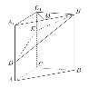
解析　本题属墙角模型建系类型
因为<em>CC</em>1⊥平面<em>ABC</em>，<em>AC</em>⊥<em>BC</em>，所以<em>CA</em>，<em>CB</em>，<em>CC</em>1两两垂直．以<em>C</em>为坐标原点，分别以<em>CA</em>，<em>CB</em>，<em>CC</em>1的方向为<em>x</em>轴、<em>y</em>轴、<em>z</em>轴的正方向建立空间直角坐标系(如图)，

可得<em>C</em>(0，0，0)，<em>A</em>(2，0，0)，<em>B</em>(0，2，0)，<em>C</em>1(0，0，3)，<em>A</em>1(2，0，3)，<em>B</em>1(0，2，3)，<em>D</em>(2，0，1)，<em>E</em>(0，0，2)，<em>M</em>(1，1，3)．  
（3）如图所示，在四棱锥*P*－*ABCD*中，底面*ABCD*是正方形，侧棱*PD*⊥底面*ABCD*，*PD*＝*DC*＝2，*E*是*PC*的中点，过点*E*作*EF*⊥*PB*于点*F*．试建立适当的空间直角坐标系并确定各点坐标．

解析　本题属墙角模型建系类型

以*D*为坐标原点，射线*DA*，*DC*，*DP*分别为*x*轴、*y*轴、*z*轴的正方向建立如图所示的空间直角坐标系*D*－*xyz*．*D*(0，0，0)，*A*(2*，* 0，0)，*P*(0，0，2)，*C*(0，2*，* 0)，*B*(2，2，0)，*E*(0，1，1)．

＝(2，2，－2)，设＝*λ*，则＝(2*λ*，2*λ*，－2*λ*)，＝＋＝(2*λ*，2*λ*－1，1－2*λ*)，因为*EF*⊥*PB*，所以＝0，解得，*λ*＝，所以*F*(，，)．  
（4）如图所示，在四棱锥*P*－*ABCD*中，*PC*⊥平面*ABCD*，*PC*＝2，在四边形*ABCD*中，∠*B*＝∠*C*＝90°，*AB*＝4，*CD*＝1，点*E*为*PA*的中点，点*M*在*PB*上，*PB*＝4*PM*，*PB*与平面*ABCD*成30°角，试建立适当的空间直角坐标系并确定各点坐标．

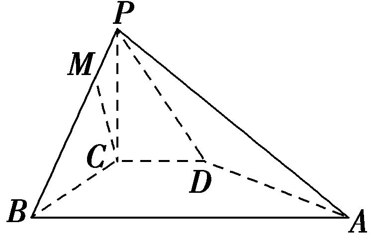
解析　本题属墙角模型建系类型
由题意知，*CB*，*CD*，*CP*两两垂直，以*C*为坐标原点，*CB*所在直线为*x*轴，*CD*所在直线为*y*轴，*CP*所在直线为*z*轴建立如图所示的空间直角坐标系*C－xyz*．

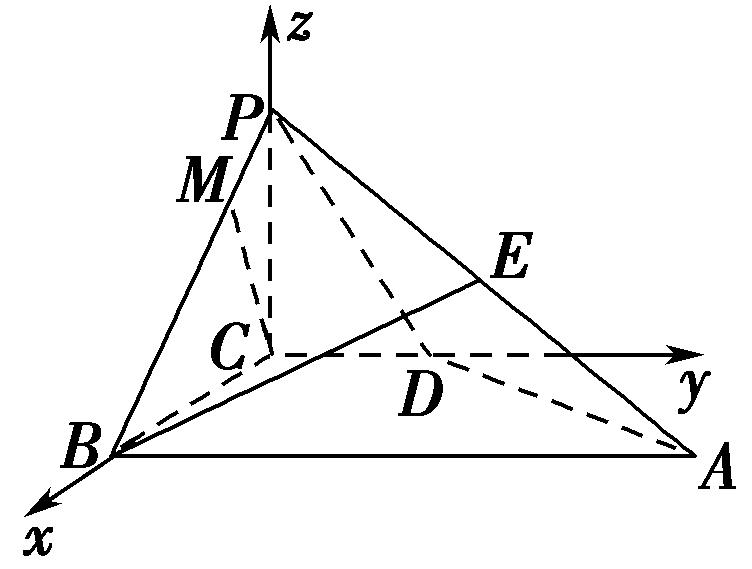
∵*PC*⊥平面*ABCD*，∴∠*PBC*为*PB*与平面*ABCD*所成的角，∴∠*PBC*＝30°．
∵*PC*＝2，*BC*＝2，*PB*＝4，∴*C*(0，0，0)，*B*(2，0，0)，*D*(0，1，0)，*P*(0，0，2)，*A*(2，4，0)，*E*(，2，1)，*M*，  
（5）在△*ABC*中，*D*，*E*分别为*AB*，*AC*的中点，*AB*＝2*BC*＝2*CD*＝2*a*，如图①，以*DE*为折痕将△*ADE*折起，点*A*到达点*P*的位置，使平面*DEP*⊥平面*BCED*，如图②．试建立适当的空间直角坐标系并确定各点坐标．

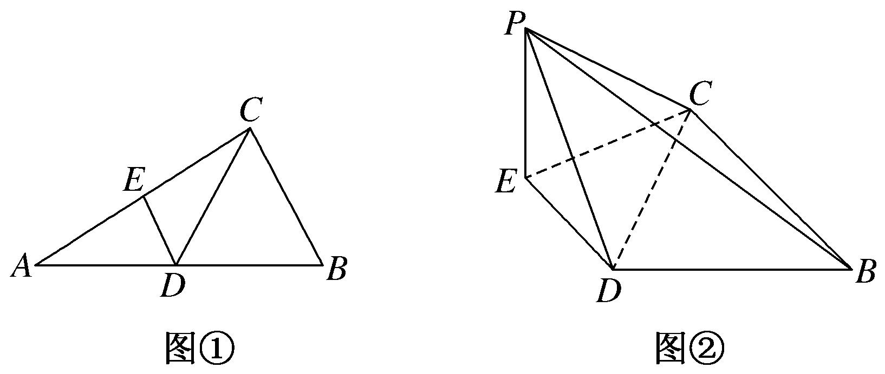
解析　本题属墙角模型建系类型
在题图①中，因为*AB*＝2*BC*＝2*CD*，且*D*为*AB*的中点，
所以由平面几何知识，得∠*ACB*＝90°．又*E*为*AC*的中点，所以*DE*∥*BC*．
在题图②中，*CE*⊥*DE*，*PE*⊥*DE*，因为平面*DEP*⊥平面*BCED*，平面*DEP*∩平面*BCED*＝*DE*，*EP*⊂平面*DEP*，*EP*⊥*DE*，所以*EP*⊥平面*BCED*．又*CE*⊂平面*BCED*，所以*EP*⊥*CE*．

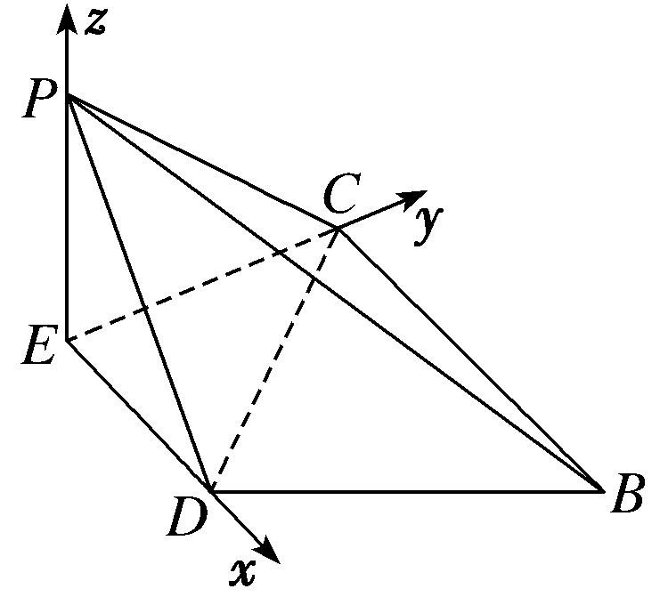

以*E*为坐标原点，，，的方向分别为*x*轴，*y*轴，*z*轴的正方向建立如图所示的空间直角坐标系．在题图①中，设*BC*＝2*a*，则*AB*＝4*a*，*AC*＝2*a*，*AE*＝*CE*＝*a*，*DE*＝*a*．
则*P*(0，0，*a*)，*D*(*a，* 0，0)，*C*(0，*a，* 0)，*B*(2*a*，*a，* 0)．

【对点训练】

1．已知直三棱柱<em>ABC</em>－<em>A</em>1<em>B</em>1<em>C</em>1中，侧面<em>AA</em>1<em>B</em>1<em>B</em>为正方形，<em>AB</em>＝<em>BC</em>＝2，<em>E</em>，<em>F</em>分别为<em>AC</em>和<em>CC</em>1的中点，

试建立适当的空间直角坐标系并确定各点坐标．

1．解析　本题属墙角模型建系类型

连接<em>AF</em>，∵<em>E</em>，<em>F</em>分别为直三棱柱<em>ABC</em>－<em>A</em>1<em>B</em>1<em>C</em>1的棱<em>AC</em>和<em>CC</em>1的中点，且<em>AB</em>＝<em>BC</em>＝2，
∴<em>CF</em>＝1，<em>BF</em>＝，∵<em>BF</em>⊥<em>A</em>1<em>B</em>1，<em>A</em>1<em>B</em>1∥<em>AB</em>，∴<em>BF</em>⊥<em>AB</em>，
∴<em>AF</em>＝＝＝3，<em>AC</em>＝＝＝2，∴<em>AB</em>2＋<em>BC</em>2＝<em>AC</em>2，即<em>BA</em>⊥<em>BC</em>．
故以<em>B</em>为原点，<em>BA</em>，<em>BC</em>，<em>BB</em>1所在直线分别为<em>x</em>，<em>y</em>，<em>z</em>轴建立如图所示的空间直角坐标系，

则*B*(0，0，0)，*A*(2，0，0)，*C*(0，2，0)，*E*(1，1，0)，*F*(0，2，1)，

2．如图，在长方体<em>ABCD</em>－<em>A</em>1<em>B</em>1<em>C</em>1<em>D</em>1中，点<em>E</em>，<em>F</em>分别在棱<em>DD</em>1，<em>BB</em>1上，且2<em>DE</em>＝<em>ED</em>1，<em>BF</em>＝2<em>FB</em>1．若

<em>AB</em>＝2，<em>AD</em>＝1，<em>AA</em>1＝3，试建立适当的空间直角坐标系并确定各点坐标．

2．解析　本题属墙角模型建系类型

以<em>C</em>1为坐标原点，，，的方向分别为<em>x</em>轴，<em>y</em>轴，<em>z</em>轴正方向，建立空间直角坐标系<em>C</em>1<em>xyz</em>．

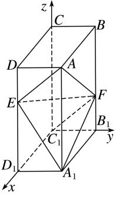
则<em>C</em>1(0，0，0)，<em>D</em>1(2，0，0)，<em>B</em>1(0，1，0)，<em>A</em>1(2，1，0)，<em>C</em>(0，0，3)，<em>D</em>(2，0，3)，<em>B</em>(0，1，3)，<em>A</em>(2，1，3)，<em>E</em>(2，0，2)，<em>F</em>(0，1，1)．

3．如图，在四棱锥*P*－*ABCD*中，*PA*⊥底面*ABCD*，*AD*⊥*AB*，*AB*∥*DC*，*AD*＝*DC*＝*AP*＝2，*AB*＝1，点

*E*为棱*PC*的中点，试建立适当的空间直角坐标系并确定各点坐标．

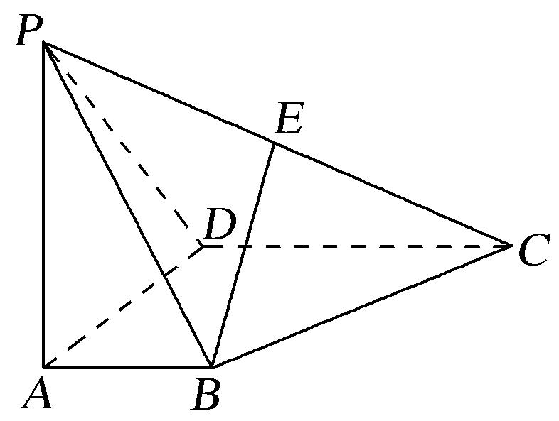

3．解析　本题属墙角模型建系类型

依题意，以点*A*为原点建立空间直角坐标系(如图)，可得*A*(0，0，0)，*B*(1，0，0)，*D*(0，2，0)，*P*(0，0，2)，*C*(2，2，0)，由*E*为棱*PC*的中点，得*E*(1，1，1)．

4．在四棱锥*P*－*ABCD*中，底面*ABCD*为矩形，*PA*⊥平面*ABCD*，*AD*＝2*AB*＝4，*PD*与底面*ABCD*所

成的角为45°，且*BE*⊥*DP*，试建立适当的空间直角坐标系并确定各点坐标．

4．解析　本题属墙角模型建系类型
∵*PA*⊥平面*ABCD*，∴∠*PDA*即为*PD*与平面*ABCD*所成的角，
∴∠*PDA*＝45°，∴*PA*＝*AD*＝4，*AB*＝2．

以*A*为原点，*AB*，*AD*，*AP*所在直线分别为*x*轴，*y*轴，*z*轴建立空间直角坐标系，如图所示．

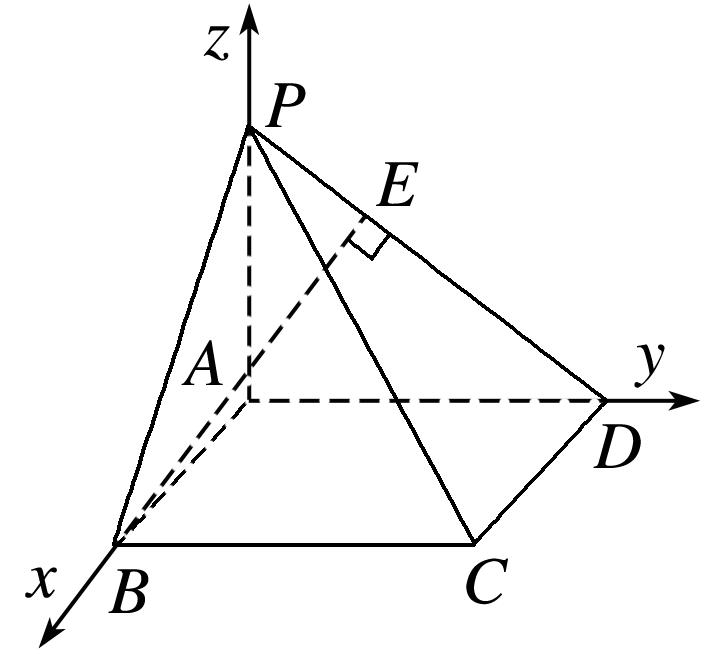
∴*A*(0，0，0)，*B*(2，0，0)，*D*(0，4，0)，*P*(0，0，4)，
设*E*(*x*，*y*，*z*)，∵＝(0，－4，4)，＝*λ*，且*BE*⊥*DP*，
∴(*x*，*y*－4，*z*)＝*λ*(0，－4，4)，∴*x*＝0，*y*＝4－4*λ*，*z*＝4*λ*，
∴点*E*(0，4－4*λ*，4*λ*)，＝(－2，4－4*λ*，4*λ*)．
∵*BE*⊥*DP*，∴·＝－4(4－4*λ*)＋4×4*λ*＝0，解得*λ*＝．∴点*E*(0，2，2)，

5．等边△*ABC*的边长为3，点*D*，*E*分别是*AB*，*AC*上的点，且满足＝＝(如图①)，将△*ADE*沿

<em>DE</em>折起到△<em>A</em>1<em>DE</em>的位置，使二面角<em>A</em>1－<em>DE－B</em>成直二面角，连接<em>A</em>1<em>B</em>，<em>A</em>1<em>C</em>(如图②)．试建立适当的空间直角坐标系并确定各点坐标．

5．解析　本题属墙角模型建系类型

题图①中，由已知可得：*AE*＝2，*AD*＝1，*A*＝60°．
从而<em>DE</em>＝＝．故得<em>AD</em>2＋<em>DE</em>2＝<em>AE</em>2，
所以<em>AD</em>⊥<em>DE</em>，<em>BD</em>⊥<em>DE</em>．所以题图②中，<em>A</em>1<em>D</em>⊥<em>DE</em>，
又平面<em>ADE</em>∩平面<em>BCED</em>＝<em>DE</em>，<em>A</em>1<em>D</em>⊥<em>DE</em>，<em>A</em>1<em>D</em>⊂平面<em>A</em>1<em>DE</em>，所以<em>A</em>1<em>D</em>⊥平面<em>BCED</em>．

以<em>D</em>为坐标原点，以射线<em>DB</em>，<em>DE</em>，<em>DA</em>1分别为<em>x</em>轴，<em>y</em>轴，<em>z</em>轴的正半轴建立空间直角坐标系<em>D－xyz</em>，如图，

易知<em>D</em>(0，0，0)，<em>B</em>(2，0，0)，<em>E</em>(0，，0)，<em>A</em>1(0，0，1)，<em>C</em>(，<em>，</em>0)．

<strong>[例2]</strong>　（1）在如图所示的多面体中，四边形<em>ABCD</em>是平行四边形，四边形<em>BDEF</em>是矩形，<em>ED</em>⊥平面<em>ABCD</em>，∠<em>ABD</em>＝，<em>AB</em>＝2，<em>AD</em>＝1，<em>ED</em>＝<em>BD</em>．试建立适当的空间直角坐标系并确定各点坐标．

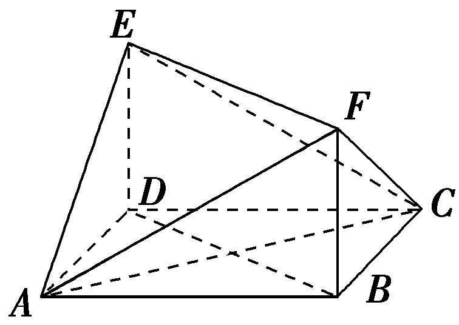
解析　本题属垂面模型1－1建系类型
在△<em>ABD</em>中，∠<em>ABD</em>＝，<em>AB</em>＝2，<em>AD</em>＝1，由余弦定理，得<em>BD</em>＝，从而<em>BD</em>2＋<em>AD</em>2＝<em>AB</em>2，故<em>BD</em>⊥<em>AD</em>，所以△<em>ABD</em>为直角三角形且∠<em>ADB</em>＝．因为<em>DE</em>⊥平面<em>ABCD</em>，<em>BD</em>⊥<em>AD</em>，

所以以点*D*为坐标原点，*DA*，*DB*，*DE*所在直线分别为*x*轴，*y*轴，*z*轴建立空间直角坐标系，如图所示．则*D*(0，0，0)，*A*(1，0，0)，*B*(0，，0)，*E*(0，0，)，*C*(－1，，0)，*F*(0，，)．  
（2）如图，直四棱柱<em>ABCD</em>－<em>A</em>1<em>B</em>1<em>C</em>1<em>D</em>1的底面是菱形，<em>AA</em>1＝4，<em>AB</em>＝2，∠<em>BAD</em>＝60°，<em>E</em>，<em>M</em>，<em>N</em>分别是<em>BC</em>，<em>BB</em>1，<em>A</em>1<em>D</em>的中点．试建立适当的空间直角坐标系并确定各点坐标．

解析　本题属垂面模型1－1建系类型
由已知可得*DE*⊥*DA*，以*D*为坐标原点，的方向为*x*轴正方向，建立如图所示的空间直角坐标系*Dxyz*，

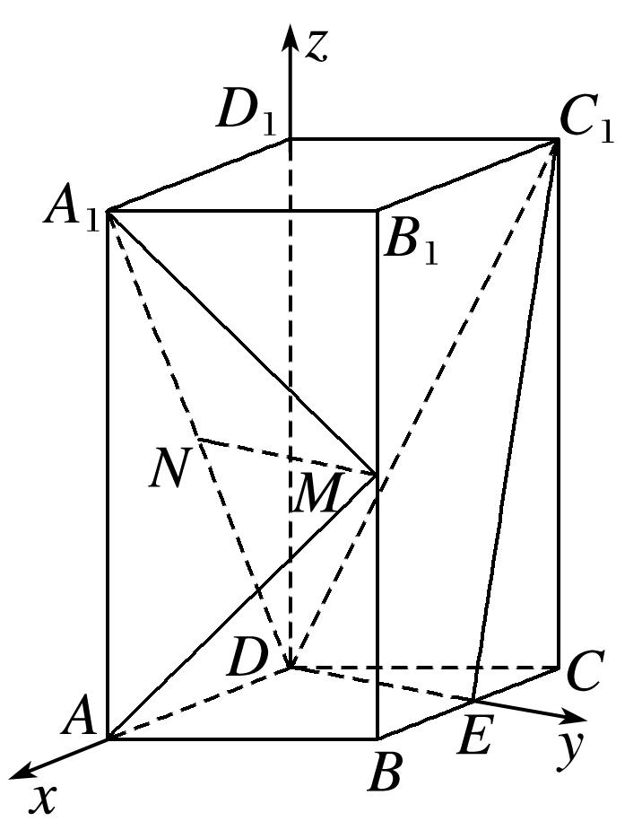
则<em>D</em>(0，0，0)，<em>A</em>(2，0，0)，<em>E</em>(0，，0)，<em>B</em>(1，，0)，<em>C</em>(－1，，0)，<em>D</em>1(0，0，4)，<em>A</em>1(2，0，4)，<em>B</em>1(1，，4)，<em>C</em>1(－1，，4)，<em>M</em>(1，，2)，<em>N</em>(1，0，2)，  
（3）如图，已知三棱锥*P*－*ABC*，平面*PAC*⊥平面*ABC*，*AB*＝*BC*＝*PA*＝*PC*＝2，∠*ABC*＝120°．试建立适当的空间直角坐标系并确定各点坐标．

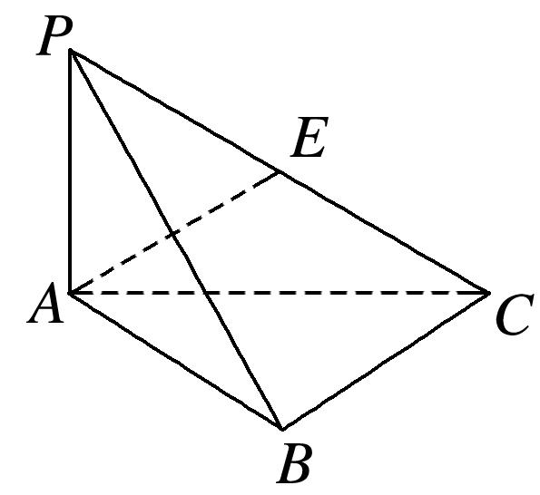
解析　本题属垂面模型1－1建系类型

*AB*＝*BC*＝2，∠*ABC*＝120°，由余弦定理得

<em>AC</em>2＝<em>AB</em>2＋<em>BC</em>2－2<em>AB</em>·<em>BC</em>·cos∠<em>ABC</em>＝4＋4－2×2×2×＝12，故<em>AC</em>＝2．
又<em>PA</em>2＋<em>AC</em>2＝4＋12＝16＝<em>PC</em>2，故<em>PA</em>⊥<em>AC</em>．
又平面*PAC*⊥平面*ABC*，且平面*PAC*∩平面*ABC*＝*AC*，故*PA*⊥平面*ABC*．所以是垂面模型的情形1，故以*A*为坐标原点，建立如图所示的空间直角坐标系*A*－*xyz*．

则*A*(0，0，0)，*B*(1，，0)，*P*(0，0，2)，*C*(0，2，0)，*E*(0，，1)．  
（4）在三棱锥*A*－*BCD*中，已知*CB*＝*CD*＝，*BD*＝2，*O*为*BD*的中点，*AO*⊥平面*BCD*，*AO*＝2，*E*为*AC*的中点．若点*F*在*BC*上，满足*BF*＝*BC*，试建立适当的空间直角坐标系并确定各点坐标．

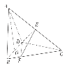
解析　本题属垂面模型1－2建系类型

连接*CO*，∵*CB*＝*CD*，*BO*＝*OD*，∴*CO*⊥*BD*．又*AO*⊥平面*BCD*，∴*AO*，*BO*，*CO*两两垂直．

以*O*为坐标原点，*OB*，*OC*，*OA*所在直线分别为*x*，*y*，*z*轴建立空间直角坐标系，

则*O*(0，0，0)，*A*(0，0，2)，*B*(1，0，0)，*C*(0，2，0)，*D*(－1，0，0)，*E*(0，1，1)．因为*BF*＝*BC*，
所以＝＝(－，，0)，所以*F*(，，0)，  
（5）如图，在四棱锥*P－ABCD*中，底面*ABCD*是边长为*a*的正方形，侧面*PAD*⊥底面*ABCD*，且*PA*＝*PD*＝*AD*，设*E*，*F*分别为*PC*，*BD*的中点．试建立适当的空间直角坐标系并确定各点坐标．

解析　本题属垂面模型1－2建系类型
如图，取*AD*的中点*O*，连接*OP*，*OF*．因为*PA*＝*PD*，所以*PO*⊥*AD*．
因为侧面*PAD*⊥底面*ABCD*，平面*PAD*∩平面*ABCD*＝*AD*，*PO*⊂平面*PAD*，所以*PO*⊥平面*ABCD*．
又*O*，*F*分别为*AD*，*BD*的中点，所以*OF*∥*AB*．又*ABCD*是正方形，所以*OF*⊥*AD*．
因为*PA*＝*PD*＝*AD*，所以*PA*⊥*PD*，*OP*＝*OA*＝．

以*O*为原点，*OA*，*OF*，*OP*所在直线分别为*x*轴，*y*轴，*z*轴建立空间直角坐标系，
则*A*，*F*，*D*，*P*，*B*，*C*．
因为*E*为*PC*的中点，所以*E*．  
（6）已知四棱锥*P－ABCD*，底面*ABCD*为菱形，*PD*＝*PB*，*PA*＝*PC*＝*AB*，*PA*与平面*ABCD*所成的角为60°，*PA*＝2，试建立适当的空间直角坐标系并确定各点坐标．

解析　本题属垂面模型1－3建系类型

连接*AC*，*BD*且*AC*∩*BD*＝*O*，连接*PO*．由已知*ABCD*为菱形，所以*BD*⊥*AC*，又*PD*＝*PB*，
所以*PO*⊥*BD．* 因为*PA*＝*PC*，所以*PO*⊥*AC*，所以*PO*⊥平面*ABCD*，所以*PA*与平面*ABCD*所成的角为∠*PAO*，所以∠*PAO*＝60°，所以*AO*＝*PA*＝1，*PO*＝*PA*＝*．* 因为*PA*＝*AB*，所以*BO*＝*PA*＝*．* 以*O*为原点，*OA*，*OD*，*OP*分别为*x*轴、*y*轴、*z*轴建立如图所示空间直角坐标系．

则*O*(0，0，0)，*A*(1，0，0)，*D*，*B*，*C*(－1，0，0)，*P*(0，0，)．  
（7）如图，正方形*ABCD*的边长为2，四边形*BDEF*是平行四边形，*BD*与*AC*交于点*G*，*O*为*GC*的中点，*FO*＝，且*FO*⊥平面*ABCD*．试建立适当的空间直角坐标系并确定各点坐标．

解析　本题属垂面模型1－3建系类型
如图，取*BC*的中点*H*，连接*OH*，则*OH*∥*BD*，又四边形*ABCD*为正方形，

∴*AC*⊥*BD*，∴*OH*⊥*AC*，故以*O*为原点，建立如图所示的直角坐标系，
则*O*(0，0，0)，*A*(3，0，0)，*C*(－1，0，0)，*G*(1，0，0)，*F*(0，0，)，*D*(1，－2，0)，*B*(1，2，0)，*E*(0，－4，)，  
（8）如图，棱柱<em>ABCD－A</em>1<em>B</em>1<em>C</em>1<em>D</em>1的所有棱长都等于2，∠<em>ABC</em>和∠<em>A</em>1<em>AC</em>均为60°，平面<em>AA</em>1<em>C</em>1<em>C</em>⊥平面<em>ABCD，</em>试建立适当的空间直角坐标系并确定各点坐标．

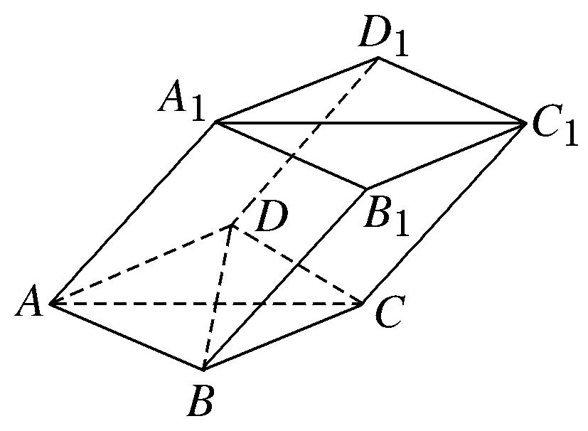
解析　本题属垂面模型1－3建系类型
设<em>BD</em>与<em>AC</em>交于点<em>O</em>，则<em>BD</em>⊥<em>AC</em>，连接<em>A</em>1<em>O</em>，在△<em>AA</em>1<em>O</em>中，<em>AA</em>1＝2，<em>AO</em>＝1，∠<em>A</em>1<em>AO</em>＝60°，∴<em>A</em>1<em>O</em>2＝<em>AA</em>＋<em>AO</em>2－2<em>AA</em>1·<em>AO</em>cos 60°＝3，∴<em>AO</em>2＋<em>A</em>1<em>O</em>2＝<em>AA</em>，∴<em>A</em>1<em>O</em>⊥<em>AO</em>．

由于平面<em>AA</em>1<em>C</em>1<em>C</em>⊥平面<em>ABCD</em>，且平面<em>AA</em>1<em>C</em>1<em>C</em>∩平面<em>ABCD</em>＝<em>AC</em>，<em>A</em>1<em>O</em>⊂平面<em>AA</em>1<em>C</em>1<em>C</em>，
∴<em>A</em>1<em>O</em>⊥平面<em>ABCD</em>．以<em>OB</em>，<em>OC</em>，<em>OA</em>1所在直线分别为<em>x</em>轴，<em>y</em>轴，<em>z</em>轴，建立如图所示的空间直角坐标系，则<em>B</em>(，0，0)，<em>C</em>(0，1，0)，<em>A</em>1(0，0，)，<em>A</em>(0，－1，0)，<em>D</em>(－，0，0)，<em>C</em>1(0，2，)，<em>B</em>1(，1，)，<em>D</em>1(－，1，)，  
（9）如图，已知四棱锥*P*－*ABCD*，△*PAD*是以*AD*为斜边的等腰直角三角形，*BC*∥*AD*，*CD*⊥*AD*，*PC*＝*AD*＝2*DC*＝2*CB*＝2，*E*为*PD*的中点．试建立适当的空间直角坐标系并确定各点坐标．

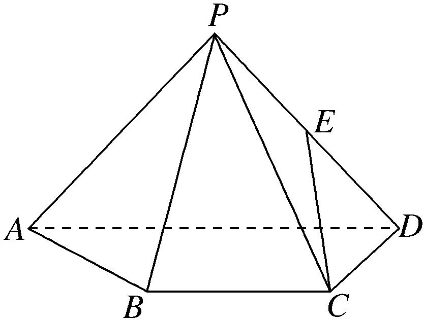
解析　本题属垂面模型2－1建系类型
设*AD*的中点为*O*，连接*OB*，*OP*．∵△*PAD*是以*AD*为斜边的等腰直角三角形，
∴*OP*⊥*AD*．∵*BC*＝*AD*＝*OD*，且*BC*∥*OD*，

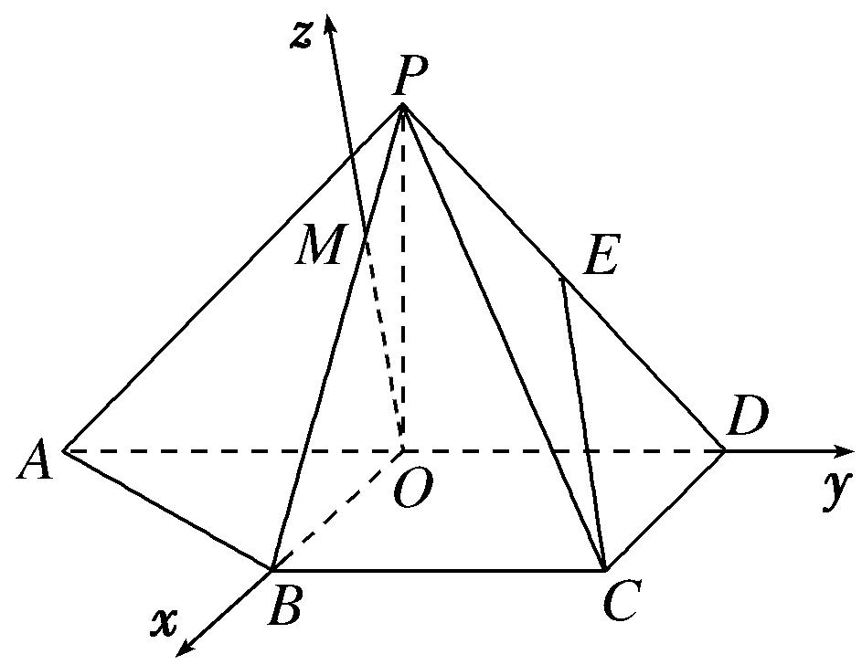
∴四边形*BCDO*为平行四边形，又∵*CD*⊥*AD*，∴*OB*⊥*AD*，∵*OP*∩*OB*＝*O*，∴*AD*⊥平面*OPB*．
所以是垂面模型的情形3，过点*O*在平面*POB*内作*OB*的垂线*OM*，交*PB*于*M*，

以*O*为原点，*OB*所在直线为*x*轴，*OD*所在直线为*y*轴，*OM*所在直线为*z*轴，建立空间直角坐标系，如图．则有*A*(0，－1，0)，*B*(1，0，0)，*C*(1，1，0)，*D*(0，1，0)．设*P*(*x，* 0，*z*)(*z*>0)，由*PC*＝2，*OP*＝1，得得*x*＝－，*z*＝．即点*P*，而*E*为*PD*的中点，∴*E*．  
（10）如图所示的几何体中，四边形*ABCD*是等腰梯形，*AB*∥*CD*，∠*ABC*＝60°，*AB*＝2*BC*＝2*CD*＝4，四边形*DCEF*是正方形，*N*，*G*分别是线段*AB*，*CE*的中点，且二面角*A*－*CD*－*F*的大小为120°．试建立适当的空间直角坐标系并确定各点坐标．

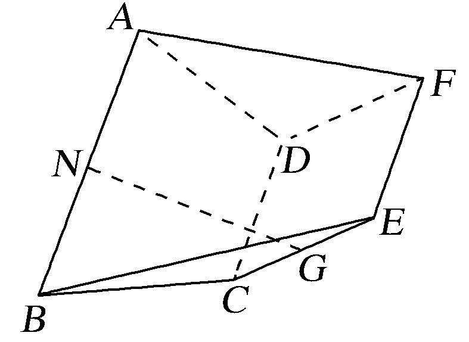
解析　本题属垂面模型3－1建系类型
设*CD*的中点为*O*，*EF*的中点为*P*，连接*NO*，*OP*，易得*NO*⊥*CD*，以点*O*为原点，以*OC*所在直线为*x*轴，以*NO*所在直线为*y*轴，以过点*O*且与平面*ABCD*垂直的直线为*z*轴建立如图所示的空间直角坐标系．

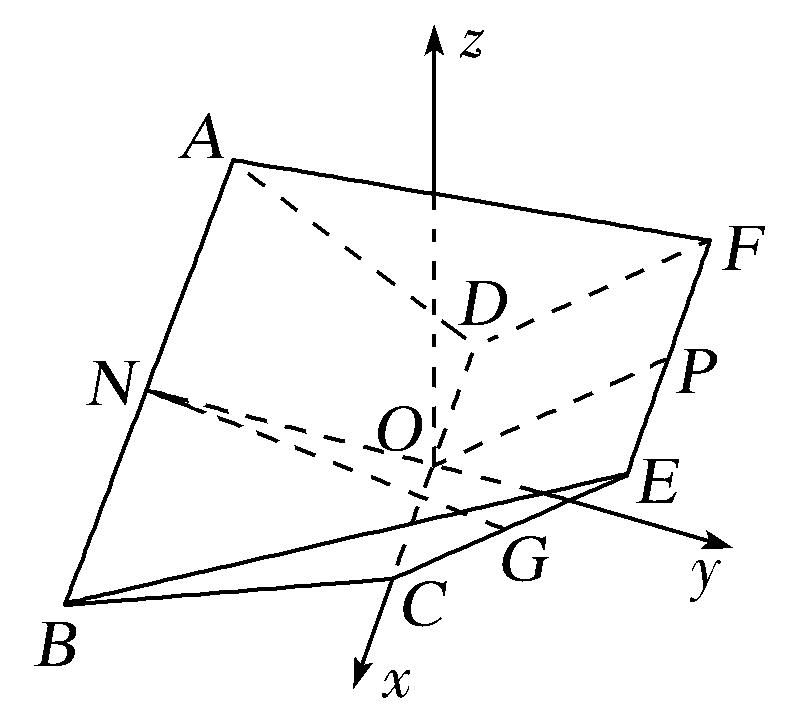
因为*NO*⊥*CD*，*OP*⊥*CD*，所以∠*NOP*是二面角*A*－*CD*－*F*的平面角，则∠*NOP*＝120°，
所以∠*POy*＝60°，因为*AB*＝4，则*BC*＝*CD*＝2，则*C*(1，0，0)，*D*(－1，0，0)，*B*(2，－，0)，*A*(－2，－，0)，*N*(0，－，0)，*E*(1，1，)，*F*(－1，1，)，*P*(0，1，)，

【对点训练】

1．如图所示，在梯形*ABCD*中，*AB*∥*CD*，*AD*＝*DC*＝*CB*＝1，∠*BCD*＝120°，四边形*BFED*是以*BD*为

直角腰的直角梯形，*DE*＝2*BF*＝2，平面*BFED*⊥平面*ABCD*，试建立适当的空间直角坐标系并确定各点坐标．

1．解析　本题属垂面模型1－1建系类型
在梯形*ABCD*中，因为*AB*∥*CD*，*AD*＝*DC*＝*CB*＝1，∠*BCD*＝120°，
所以∠*CDB*＝30°，所以∠*ADB*＝90°，所以*BD*⊥*AD*．
因为平面*BFED*⊥平面*ABCD*，平面*BFED*∩平面*ABCD*＝*BD*，*ED*⊂平面*BFED*，

四边形*BFED*是以*BD*为直角腰的直角梯形，所以*ED*⊥*BD*，所以*ED*⊥平面*ABCD*．

以*D*为原点，分别以*DA*，*DB*，*DE*所在直线为*x*轴，*y*轴，*z*轴建立如图所示的空间直角坐标系，

在△*BCD*中，*DC*＝*BC*＝1，∠*BCD*＝120°，由余弦定理得*BD*＝，
则*D*(0，0，0)，*A*(1，0，0)，*B*(0，，0)，*E*(0，0，2)，*F*(0，，1)．

2．如图，在几何体<em>ABC</em>－<em>A</em>1<em>B</em>1<em>C</em>1中，平面<em>A</em>1<em>ACC</em>1⊥底面<em>ABC</em>，四边形<em>A</em>1<em>ACC</em>1是正方形，<em>B</em>1<em>C</em>1∥<em>BC</em>，<em>Q</em>

是<em>A</em>1<em>B</em>的中点，且<em>AC</em>＝<em>BC</em>＝2<em>B</em>1<em>C</em>1＝2，∠<em>ACB</em>＝，试建立适当的空间直角坐标系并确定各点坐标．

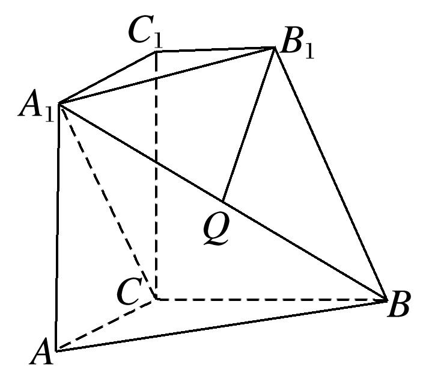

2．解析　本题属垂面模型1－1建系类型
∵平面<em>A</em>1<em>ACC</em>1⊥平面<em>ABC</em>，平面<em>A</em>1<em>ACC</em>1∩平面<em>ABC</em>＝<em>AC</em>，<em>CC</em>1⊥<em>AC</em>，<em>CC</em>1⊂平面<em>A</em>1<em>ACC</em>1，
∴<em>CC</em>1⊥平面<em>ABC</em>．如图所示，以<em>C</em>为原点，<em>CB</em>，<em>CC</em>1所在直线分别为<em>y</em>轴和<em>z</em>轴建立空间直角坐标系，令<em>AC</em>＝<em>BC</em>＝2<em>B</em>1<em>C</em>1＝2，则<em>C</em>(0，0，0)，<em>B</em>(0，2，0)，<em>C</em>1(0，0，2)，

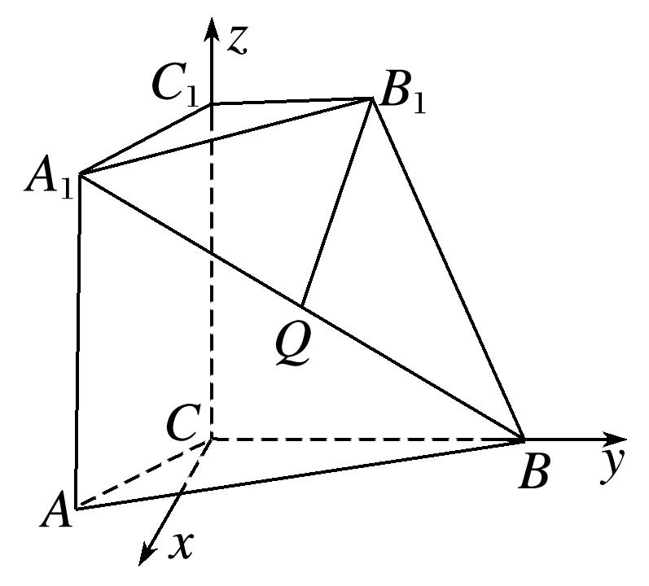

<em>A</em>(，－1，0)，<em>A</em>1(，－1，2)，<em>B</em>1(0，1，2)，<em>Q</em>(，，1)．

3．如图，在几何体*ABCDE*中，四边形*ABCD*是矩形，*AB*⊥平面*BEC*，*BE*⊥*EC*，*AB*＝*BE*＝*EC*＝2，*G*，

*F*分别是线段*BE*，*DC*的中点，试建立适当的空间直角坐标系并确定各点坐标．

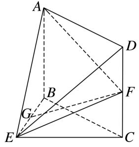

3．解析　本题属垂面模型1－1建系类型
如图，在平面*BEC*内，过*B*点作*BQ*∥*EC*．因为*BE*⊥*CE*，所以*BQ*⊥*BE*．

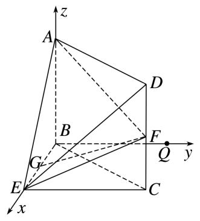
又因为*AB*⊥平面*BEC*，所以*AB*⊥*BE*，*AB*⊥*BQ*．

以*B*为原点，分别以*BE*，*BQ*，*BA*所在直线为*x*轴，*y*轴，*z*轴，建立空间直角坐标系*Bxyz*，
则*B*(0，0，0)，*E*(2，0，0)，*A*(0，0，2)，*G*(1，0，0)，*C*(2，2，0)，*D*(2，2，2)，*F*(2，2，1)．

4．如图，在三棱锥*P*－*ABC*中，*AB*＝*BC*＝2，*PA*＝*PB*＝*PC*＝*AC*＝4，*O*为*AC*的中点．若点*M*在棱

*BC*上，且*PM*⊥*BC*，试建立适当的空间直角坐标系并确定各点坐标．

4．解析　本题属垂面模型1－2建系类型
因为*PA*＝*PC*＝*AC*＝4，*O*为*AC*的中点，所以*PO*⊥*AC*，且*PO*＝2．

连接*OB．* 因为*AB*＝*BC*＝*AC*，所以△*ABC*为等腰直角三角形，且*OB*⊥*AC*，*OB*＝*AC*＝2．
由<em>PO</em>2＋<em>OB</em>2＝<em>PB</em>2，知<em>PO</em>⊥<em>OB．</em>由<em>PO</em>⊥<em>OB</em>，<em>PO</em>⊥<em>AC</em>，<em>AC</em>∩<em>OB</em>＝<em>O</em>，知<em>PO</em>⊥平面<em>ABC</em>．

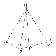
如图，以*O*为坐标原点，，，的方向分别为*x*轴、*y*轴、*z*轴正方向，建立如图所示的空间直角坐标系*Oxyz*．由已知得*O*(0，0，0)，*B*(2，0，0)，*A*(0，－2，0)，*C*(0，2，0)，*P*(0，0，2)，
设*M*(*a，* 2－*a，* 0)(0＜*a*≤2)，则＝(*a，* 2－*a，*－2)．因为＝(－2，2，0)，又因为*PM*⊥*BC*，所以＝0，解得，*a*＝1，所以*M*(1*，* 1*，* 0)．

5．如图，在四棱锥*P*－*ABCD*中，侧面*PAD*⊥底面*ABCD*，底面*ABCD*为直角梯形，其中*AB*∥*CD*，∠*CDA*

＝90°，*CD*＝2*AB*＝2，*AD*＝3，*PA*＝，*PD*＝2，点*E*在棱*AD*上且*AE*＝1，点*F*为棱*PD*的中点，试建立适当的空间直角坐标系并确定各点坐标．

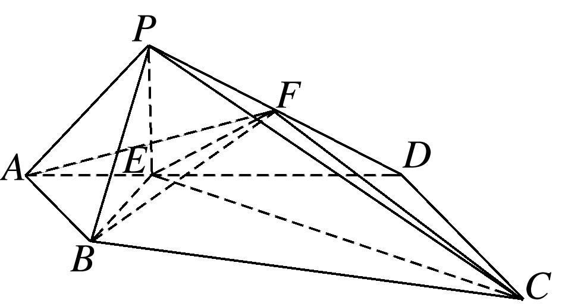

5．解析　本题属垂面模型1－2建系类型
在Rt△*ABE*中，由*AB*＝*AE*＝1，得∠*AEB*＝45°，

同理在Rt△*CDE*中，由*CD*＝*DE*＝2，得∠*DEC*＝45°，所以∠*BEC*＝90°，即*BE*⊥*EC*．
在△*PAD*中，cos∠*PAD*＝＝＝，
在△<em>PAE</em>中，<em>PE</em>2＝<em>PA</em>2＋<em>AE</em>2－2<em>PA</em>·<em>AE</em>·cos∠<em>PAE</em>＝5＋1－2××1×＝4，
所以<em>PE</em>2＋<em>AE</em>2＝<em>PA</em>2，即<em>PE</em>⊥<em>AD</em>．
又平面*PAD*⊥平面*ABCD*，平面*PAD*∩平面*ABCD*＝*AD*，*PE*⊂平面*PAD*，
所以*PE*⊥平面*ABCD*，所以*PE*⊥*BE*，所以*EB*，*EC*，*EP*两两垂直．
故以*E*为坐标原点，以射线*EB*，*EC*，*EP*分别为*x*轴、*y*轴、*z*轴的正半轴建立如图所示的空间直角坐标系，则

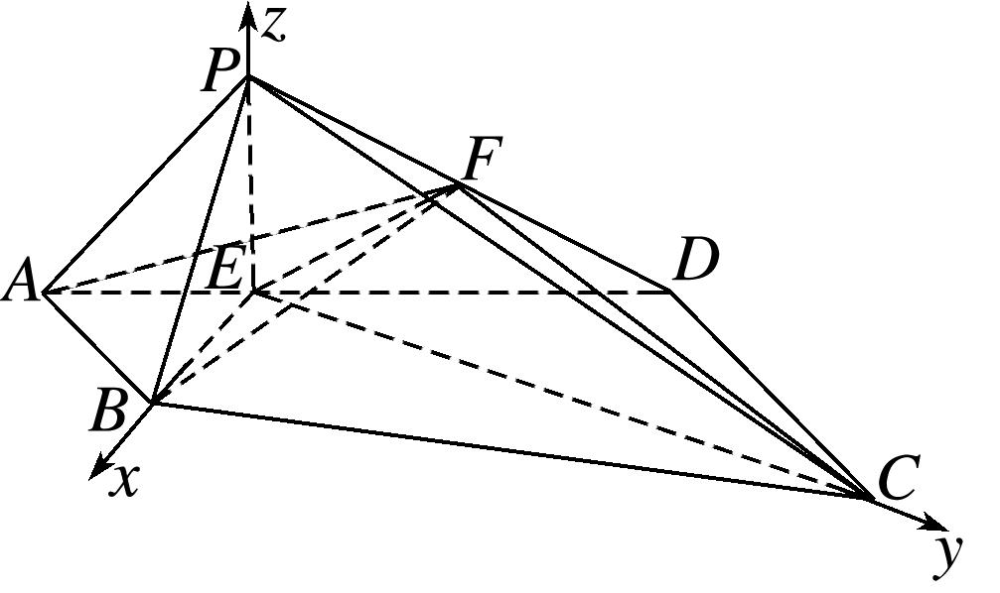

*E*(0，0，0)，*B*(，0，0)，*C*(0，2，0)，*P*(0，0，2)，*A*，*D*(－，，0)，*F*，

6．如图，在四棱台<em>ABCD</em>－<em>A</em>1<em>B</em>1<em>C</em>1<em>D</em>1中，底面<em>ABCD</em>是菱形，<em>CC</em>1⊥底面<em>ABCD</em>，且∠<em>BAD</em>＝60°，<em>CD</em>＝

<em>CC</em>1＝2<em>C</em>1<em>D</em>1＝4，<em>E</em>是棱<em>BB</em>1的中点，试建立适当的空间直角坐标系并确定各点坐标．

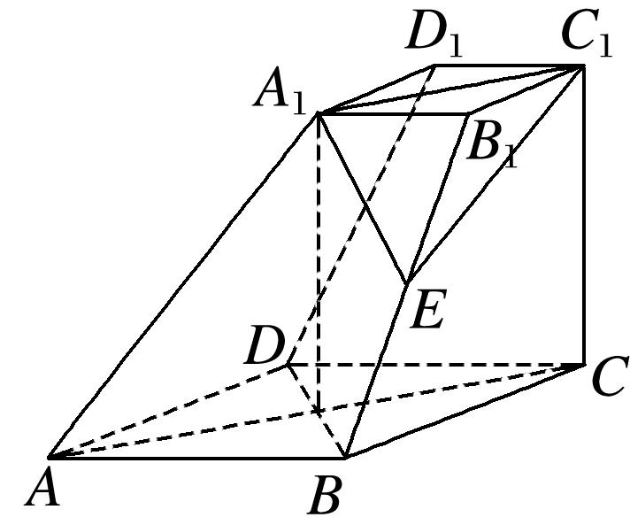

6．解析　本题属垂面模型1－3建系类型
如图，设<em>AC</em>交<em>BD</em>于点<em>O</em>，依题意，<em>A</em>1<em>C</em>1∥<em>OC</em>且<em>A</em>1<em>C</em>1＝<em>OC</em>，

所以四边形<em>A</em>1<em>OCC</em>1为平行四边形，所以<em>A</em>1<em>O</em>∥<em>CC</em>1，且<em>A</em>1<em>O</em>＝<em>CC</em>1．所以<em>A</em>1<em>O</em>⊥底面<em>ABCD</em>．

以<em>O</em>为原点，<em>OA</em>，<em>OB</em>，<em>OA</em>1所在直线分别为<em>x</em>轴，<em>y</em>轴，<em>z</em>轴建立空间直角坐标系<em>O</em>－<em>xyz</em>．
则<em>A</em>(2，0，0)，<em>A</em>1(0，0，4)，<em>B</em>(0，2，0)，<em>D</em>(0，－2，0)，<em>C</em>(－2，0，0)，<em>C</em>1(－2，0，4)，＝(－2，2，0)．由＝，得<em>B</em>1(－，1，4)．因为<em>E</em>是棱<em>BB</em>1的中点，所以<em>E</em>，

同理，<em>D</em>1(－，－1，4)．

7．如图，在三棱锥*P*－*ABC*中，*AB*＝*AC*，*D*为*BC*的中点，*PO*⊥平面*ABC*，垂足*O*落在线段*AD*上．已

知*BC*＝8，*PO*＝4，*AO*＝3，*OD*＝2．点*M*是线段*AP*上一点，且*AM*＝3，试建立适当的空间直角坐标系并确定各点坐标．

7．解析　本题属垂面模型1－3建系类型
如图所示，以*O*为坐标原点，以射线*OP*为*z*轴的正半轴建立空间直角坐标系*O*－*xyz*．

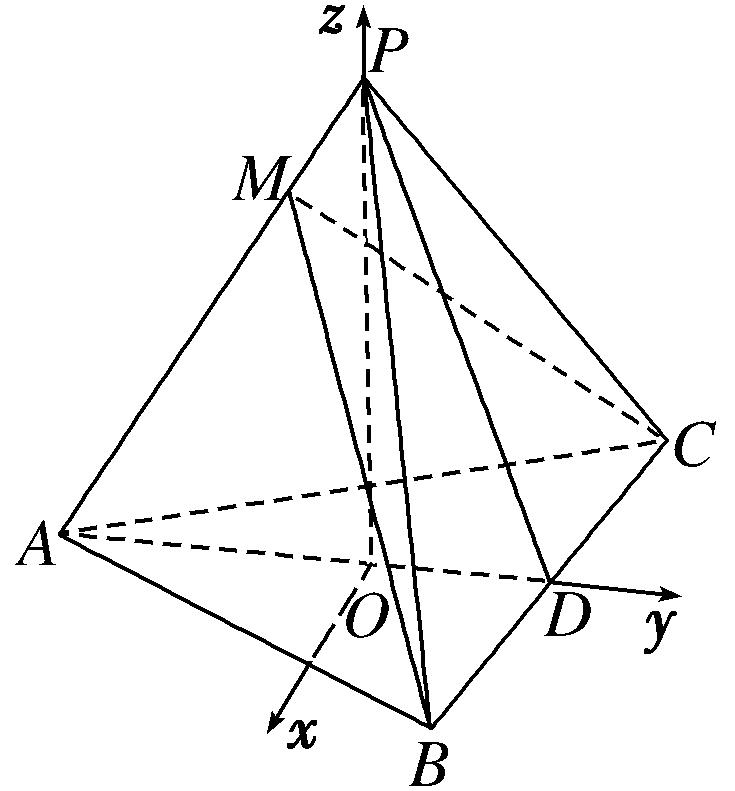
则*O*(0，0，0)，*A*(0，－3，0)，*D*(0，－2，0)，*B*(4，2，0)，*C*(－4，2，0)，*P*(0，0，4)，*M*(0，－，)．

8．如图，在四棱锥*P*－*ABCD*中，底面*ABCD*是平行四边形，*AB*＝*AC*＝2，*AD*＝2，*PB*＝，*PB*⊥*AC*．

且∠*PBA*＝45°，试建立适当的空间直角坐标系并确定各点坐标．

8．解析　本题属垂面模型2－1建系类型
因为四边形*ABCD*是平行四边形，*AD*＝2，所以*BC*＝*AD*＝2，
又<em>AB</em>＝<em>AC</em>＝2，所以<em>AB</em>2＋<em>AC</em>2＝<em>BC</em>2，所以<em>AC</em>⊥<em>AB</em>，
又*PB*⊥*AC*，*AB*∩*PB*＝*B*，*AB*，*PB*⊂平面*PAB*，所以*AC*⊥平面*PAB*．
分别以*AB*，*AC*所在直线为*x*轴，*y*轴，平面*PAB*内过点*A*且与直线*AB*垂直的直线为*z*轴，建立空间直角坐标系*Axyz*，

则*A*(0，0，0)，*B*(2，0，0)，*C*(0，2，0)，*D*(－2，2，0)，由∠*PBA*＝45°，*PB*＝，可得*P*(1，0，1)，

9．如图，在五面体*ABCDEF*中，底面*ABCD*是直角梯形，*AB*∥*CD*，*AD*⊥*CD*，侧面*CDEF*是菱形，∠

*DCF*＝60°，*CD*＝2*AD*＝2*AB*＝2，*AE*＝*AD*，试建立适当的空间直角坐标系并确定各点坐标．

9．解析　本题属垂面模型3－1建系类型
∵*CD*＝2*AD*＝2*AB*＝2，*AE*＝*AD*，∴*CD*＝2，*AD*＝1，*AB*＝1，*AE*＝．
∴<em>AE</em>2＝<em>AD</em>2＋<em>DE</em>2，∴<em>AD</em>⊥<em>DE</em>．∵<em>AD</em>⊥<em>CD</em>，<em>CD</em>∩<em>DE</em>＝<em>D</em>，∴<em>AD</em>⊥平面<em>CDEF</em>，

以*D*为坐标原点，*DA*，*DC*所在直线分别为*x*轴、*y*轴，建立如图所示的空间直角坐标系*Dxyz*，

由题设可得*D*(0，0，0)，*A*(1，0，0)，*C*(0，2，0)，*B*(1，1，0)，*E*(0，－1，)，*F*(0，1，)，

10．斜三棱柱<em>ABC</em>－<em>A</em>1<em>B</em>1<em>C</em>1中，底面是边长为2的正三角形，<em>A</em>1<em>B</em>＝，∠<em>A</em>1<em>AB</em>＝∠<em>A</em>1<em>AC</em>＝60°，试建立

适当的空间直角坐标系并确定各点坐标．

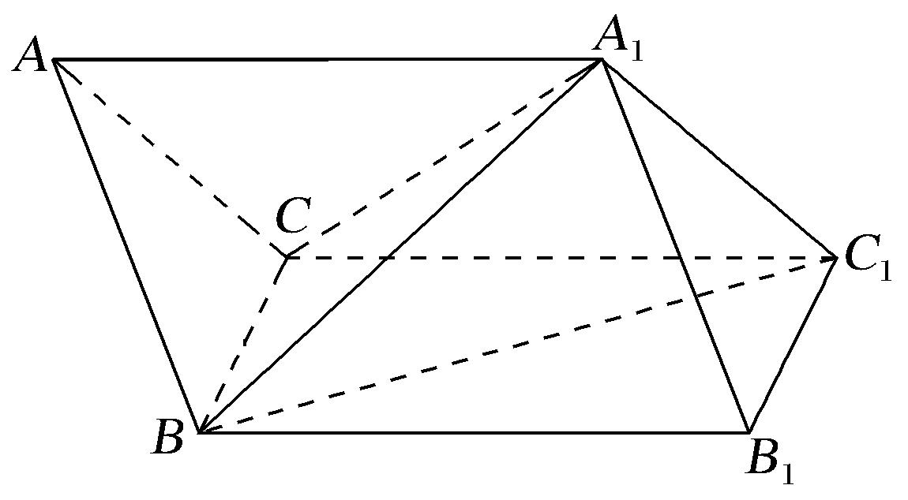

10．解析　本题属垂面模型3－1建系类型
∵<em>AB</em>＝2，<em>A</em>1<em>B</em>＝，∠<em>A</em>1<em>AB</em>＝60°，∴由余弦定理得<em>A</em>1<em>B</em>2＝<em>AA</em>＋<em>AB</em>2－2<em>AA</em>1·<em>AB</em>cos∠<em>A</em>1<em>AB</em>，
即<em>AA</em>－2<em>AA</em>1－3＝0⇒<em>AA</em>1＝3或<em>AA</em>1＝－1(舍)，故<em>AA</em>1＝3．

取<em>BC</em>的中点<em>O</em>，连接<em>OA</em>，<em>OA</em>1，∵△<em>ABC</em>是边长为2的正三角形，∴<em>AO</em>⊥<em>BC</em>，且<em>AO</em>＝，<em>BO</em>＝1．
由<em>AB</em>＝<em>AC</em>，∠<em>A</em>1<em>AB</em>＝∠<em>A</em>1<em>AC</em>，<em>AA</em>1＝<em>AA</em>1得△<em>A</em>1<em>AB</em>≌△<em>A</em>1<em>AC</em>，得<em>A</em>1<em>B</em>＝<em>A</em>1<em>C</em>＝，
故<em>A</em>1<em>O</em>⊥<em>BC</em>，且<em>A</em>1<em>O</em>＝<em>．</em>∵<em>AO</em>2＋<em>A</em>1<em>O</em>2＝3＋6＝9＝<em>AA</em>，∴<em>AO</em>⊥<em>A</em>1<em>O．</em>

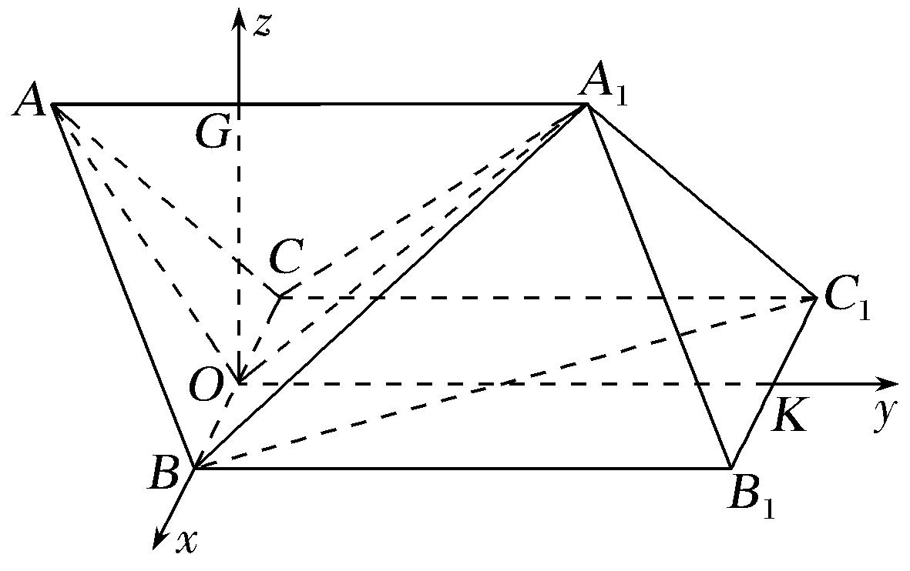

以<em>O</em>为原点，<em>OB</em>所在的直线为<em>x</em>轴，取<em>B</em>1<em>C</em>1的中点<em>K</em>，连接<em>OK</em>，以<em>OK</em>所在的直线为<em>y</em>轴，过<em>O</em>作<em>OG</em>⊥<em>AA</em>1，以<em>OG</em>所在的直线为<em>z</em>轴建立空间直角坐标系，
则<em>B</em>(1，0，0)，<em>B</em>1(1，3，0)，<em>C</em>(－1，0，0)，<em>C</em>1(－1，3，0)，
在Rt△<em>ABC</em>中，∵<em>AO</em>＝，<em>A</em>1<em>O</em>＝<em>，AA</em>1＝3．∴<em>OG</em>＝，<em>AG</em>＝1，<em>A</em>1<em>G</em>＝2，
∴<em>A</em>(0，－1，)，<em>A</em>1(0，2，)，

