# 专题09 利用空间向量证明平行与垂直问题

#### 1. 两个重要向量  
（1）直线的方向向量: 如果表示非零向量 $\pmb{a}$ 的有向线段所在直线与直线 $l$ 平行或重合, 则称此向量 $\pmb{a}$ 为直线 $l$ 的方向向量. 显然一条直线的方向向量有无数个, 它们是共线向量.  
（2）平面的法向量: 直线 $l \perp \alpha$ , 取直线 $l$ 的方向向量 $\boldsymbol{a}$ , 则向量 $\boldsymbol{a}$ 叫做平面 $\alpha$ 的法向量. 显然一个平面的法向量有无数个, 它们是共线向量.

#### 2. 空间位置关系的向量表示

<table><tr><td colspan="2">位置关系</td><td>向量表示</td></tr><tr><td rowspan="2">直线 $l_1$ , $l_2$ 的方向向量分别为 $n_1$ , $n_2$ </td><td> $l_1 // l_2$ </td><td> $n_1 // n_2 \Leftrightarrow n_1 = \lambda n_2$ </td></tr><tr><td> $l_1 \perp l_2$ </td><td> $n_1 \perp n_2 \Leftrightarrow n_1 \cdot n_2 = 0$ </td></tr><tr><td rowspan="2">直线 $l$ 的方向向量为 $n$ ,平面 $\alpha$ 的法向量为 $m$ </td><td> $l // \alpha$ </td><td> $n \perp m \Leftrightarrow n \cdot m = 0$ </td></tr><tr><td> $l \perp \alpha$ </td><td> $n // m \Leftrightarrow n = \lambda m$ </td></tr><tr><td rowspan="2">平面 $\alpha$ , $\beta$ 的法向量分别为 $n$ , $m$ </td><td> $\alpha // \beta$ </td><td> $n // m \Leftrightarrow n = \lambda m$ </td></tr><tr><td> $\alpha \perp \beta$ </td><td> $n \perp m \Leftrightarrow n \cdot m = 0$ </td></tr></table>

#### 3. 利用空间向量证明平行的方法

<table><tr><td>线线平行</td><td>证明两直线的方向向量共线.</td></tr><tr><td>线面平行</td><td>1证明该直线的方向向量与平面的某一法向量垂直;2证明直线的方向向量与平面内某直线的方向向量平行.</td></tr><tr><td>面面平行</td><td>1证明两平面的法向量为共线向量;2转化为线面平行、线线平行问题.</td></tr></table>

#### 4. 利用空间向量证明垂直的方法

<table><tr><td>线线垂直</td><td>证明两直线所在的方向向量互相垂直,即证它们的数量积为零.</td></tr><tr><td>线面垂直</td><td>1证明直线的方向向量与平面的法向量共线;2利用线面垂直的判定定理用向量表示.</td></tr><tr><td>面面垂直</td><td>1证明两个平面的法向量垂直;2利用面面垂直的判定定理用向量表示</td></tr></table>

#### 5. 利用空间向量证明线、面垂直(平行)的一般步骤  
（1）建立空间直角坐标系，建系时要尽可能地利用条件中的垂直关系；  
（2）建立空间图形与空间向量之间的关系，用空间向量表示出问题中所涉及的点、直线、平面的要素；  
（3）通过空间向量的运算求出直线的方向向量或平面的法向量，再研究平行、垂直关系；  
（4）根据运算结果解释相关问题.

# 【例题选讲】

[例 1] 如图，已知在直三棱柱 $ABC-A_{1}B_{1}C_{1}$ 中， $AC \perp BC$ ，D 为 AB 的中点， $AC = BC = BB_{1}$ .  
（1）求证： $BC_{1}\perp AB_{1}$ ;  
（2）求证： $BC_{1}$ // 平面 $CA_{1}D$ .

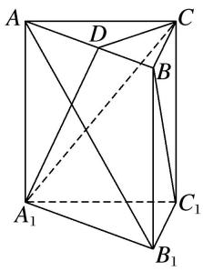

解析 如图，以 $C_1$ 点为原点， $C_1A_1$ ， $C_1B_1$ ， $C_1C$ 所在直线分别为 $x$ 轴， $y$ 轴， $z$ 轴建立空间直角坐标系.
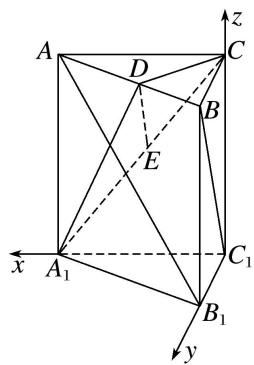
设 $AC=BC=BB_{1}=2$ ，则 $A(2,0,2)$ ， $B(0,2,2)$ ， $C(0,0,2)$ ， $A_{1}(2,0,0)$ ， $B_{1}(0,2,0)$ ， $C_{1}(0,0,0)$ ， $D(1,1,2)$ .  
（1） $\because \overrightarrow{BC_1} = (0, -2, -2), \overrightarrow{AB_1} = (-2, 2, -2), \therefore \overrightarrow{BC_1} \cdot \overrightarrow{AB_1} = 0 - 4 + 4 = 0, \therefore \overrightarrow{BC_1} \perp \overrightarrow{AB_1}, \therefore BC_1 \perp AB_1.$   
（2）取 $A_{1}C$ 的中点 E，∵ $E(1,0,1)$ ，∴ $\overrightarrow{ED}=(0,1,1)$ ，又 $\overrightarrow{BC}_{1}=(0,-2,-2)$ ，∴ $\overrightarrow{ED}=-\frac{1}{2}\overrightarrow{BC}_{1}$ ，且 ED 和 $BC_{1}$ 不重合，则 $ED \parallel BC_{1}$ 。又 $ED \subset$ 平面 $CA_{1}D$ ， $BC_{1} \notin$ 平面 $CA_{1}D$ ，故 $BC_{1} \parallel$ 平面 $CA_{1}D$ 。

[例 2] 如图所示，在四棱锥 P-ABCD 中，底面 ABCD 是正方形，侧棱 $PD \perp$ 底面 ABCD，PD = DC，E 是 PC 的中点，过点 E 作 $EF \perp PB$ 于点 F．求证：  
（1）PA//平面EDB:   
（2）PB⊥平面 EFD.

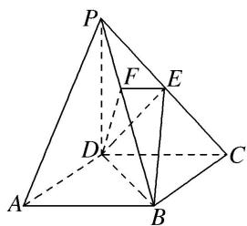

解析 以 $D$ 为坐标原点，射线 $DA, DC, DP$ 分别为 $x$ 轴、 $y$ 轴、 $z$ 轴的正方向建立如图所示的空间直角坐标系 $D - xyz$ 。设 $DC = a$ 。  
（1）连接 $AC$ 交 $BD$ 于点 $G$ ，连接 $EG$ 。依题意得 $A(a, 0, 0)$ ， $P(0, 0, a)$ ， $C(0, a, 0)$ ， $E\left[0, \frac{a}{2}, \frac{a}{2}\right]$ 。
因为底面 ABCD 是正方形，所以 G 为 AC 的中点，故点 G 的坐标为 $\left(\frac{a}{2}, \frac{a}{2}, 0\right)$ ,
所以 $\overrightarrow{PA} = (a, 0, -a)$ , $\overrightarrow{EG} = \left(\frac{a}{2}, 0, -\frac{a}{2}\right)$ , 则 $\overrightarrow{PA} = 2\overrightarrow{EG}$ , 故 $PA // EG$ .

而 $EG \subset$ 平面 EDB， $PA \notin$ 平面 EDB，所以 PA // 平面 EDB.

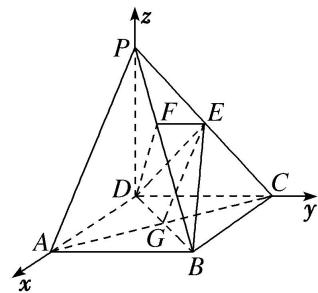  
（2）依题意得 $B(a, a, 0)$ ，所以 $\overrightarrow{PB} = (a, a, -a)$ . 又 $\overrightarrow{DE} = \left(0, \frac{a}{2}, \frac{a}{2}\right)$ ，故 $\overrightarrow{PB} \cdot \overrightarrow{DE} = 0 + \frac{a^2}{2} - \frac{a^2}{2} = 0$
所以 $PB \perp DE$ ，所以 $PB \perp DE$ 。由题可知 $EF \perp PB$ ，且 $EF \cap DE = E$ ，所以 $PB \perp$ 平面 EFD。

[例 3] 如图，正方形 ABCD 的边长为 $2\sqrt{2}$ ，四边形 BDEF 是平行四边形，BD 与 AC 交于点 G，O 为 GC 的中点， $FO=\sqrt{3}$ ，且 $FO \perp$ 平面 ABCD.  
（1）求证： $AE \parallel$ 平面 BCF;  
（2）求证： $CF \perp$ 平面 AEF.

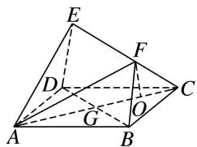

解析 如图，
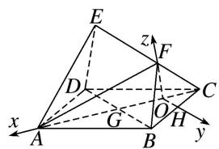

取 BC 的中点 H，连接 OH，则 $OH \parallel BD$ ，又四边形 ABCD 为正方形，∴ $AC \perp BD$ ，∴ $OH \perp AC$ ，故以 O 为原点，建立如图所示的直角坐标系，
则 $A(3, 0, 0)$ ， $C(-1, 0, 0)$ ， $D(1, -2, 0)$ ， $F(0, 0, \sqrt{3})$ ， $B(1, 2, 0)$ .
$\vec {B C} = (- 2, - 2, 0), \vec {C F} = (1, 0, \sqrt {3}), \vec {B F} = (- 1, - 2, \sqrt {3}).$  
（1）设平面 $BCF$ 的一个法向量为 $\pmb {n} = (x,y,z)$ ，则 $\left\{ \begin{array}{l}\pmb {n}\cdot \overrightarrow{BC} = 0,\\ \pmb {n}\cdot \overrightarrow{CF} = 0, \end{array} \right.$ 即 $\left\{ \begin{array}{l} - 2x - 2y = 0,\\ x + \sqrt{3} z = 0, \end{array} \right.$

取 z=1，得 $n=(-\sqrt{3},\sqrt{3},1)$ 。又四边形 BDEF 为平行四边形，∴ $\overrightarrow{DE}=\overrightarrow{BF}=(-1,-2,\sqrt{3})$ ,
$\therefore \overrightarrow {A E} = \overrightarrow {A D} + \overrightarrow {D E} = \overrightarrow {B C} + \overrightarrow {B F} = (- 2, - 2, 0) + (- 1, - 2, \sqrt {3}) = (- 3, - 4, \sqrt {3}),$
$\therefore \overrightarrow{AE} \cdot n = 3\sqrt{3} - 4\sqrt{3} + \sqrt{3} = 0, \therefore \overrightarrow{AE} \perp n,$ 又 $AE \not\subset$ 平面 $BCF, \therefore AE \parallel$ 平面 $BCF.$  
（2） $\overrightarrow{AF}=(-3,0,\sqrt{3}),\therefore\overrightarrow{CF}\cdot\overrightarrow{AF}=-3+3=0,\quad\overrightarrow{CF}\cdot\overrightarrow{AE}=-3+3=0,\quad\therefore\overrightarrow{CF}\perp\overrightarrow{AF},\quad\overrightarrow{CF}\perp\overrightarrow{AE},$
即 $CF \perp AF$ ， $CF \perp AE$ ，又 $AE \cap AF = A$ ，AE， $AF \subset$ 平面 AEF，∴ $CF \perp$ 平面 AEF.

[例4] 如图，在直三棱柱 $ADE - BCF$ 中，平面 $ABFE$ 和平面 $ABCD$ 都是正方形且互相垂直，点 $M$ 为 $AB$ 的中点，点 $O$ 为 $DF$ 的中点．证明：  
（1）OM//平面BCF;   
（2）平面 $MDF \perp$ 平面 EFCD.

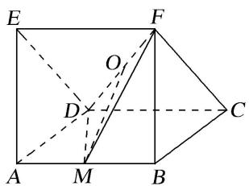

解析 （1）由题意, 得 $AB$ , $AD$ , $AE$ 两两垂直, 以点 $A$ 为原点建立如图所示的空间直角坐标系 $A-xyz$ .
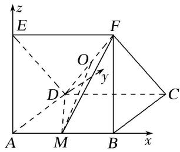
设正方形边长为 1，则 $A(0, 0, 0)$ ， $B(1, 0, 0)$ ， $C(1, 1, 0)$ ， $D(0, 1, 0)$ ， $F(1, 0, 1)$ ， $M\left(\frac{1}{2}, 0, 0\right)$ ， $O\left(\frac{1}{2}, \frac{1}{2}, \frac{1}{2}\right)$ . $\overrightarrow{OM} = \left(0, -\frac{1}{2}, -\frac{1}{2}\right)$ ， $\overrightarrow{BA} = (-1, 0, 0)$ ， $\therefore \overrightarrow{OM} \cdot \overrightarrow{BA} = 0$ ， $\therefore \overrightarrow{OM} \perp \overrightarrow{BA}$ .
∵棱柱 ADE-BCF 是直三棱柱，∴AB⊥平面 BCF，∴ $\overrightarrow{BA}$ 是平面 BCF 的一个法向量，

且 $OM \not\subset$ 平面 BCF，∴ $OM \parallel$ 平面 BCF.  
（2）在第（1）问的空间直角坐标系中，设平面 $MDF$ 与平面 $EFCD$ 的法向量分别为 $\pmb{n}_1 = (x_1, y_1, z_1)$ ， $\pmb{n}_2 = (x_2, y_2, z_2)$ . $\because \overrightarrow{DF} = (1, -1, 1)$ ， $\overrightarrow{DM} = \left[\frac{1}{2}, -1, 0\right]$ ， $\overrightarrow{DC} = (1, 0, 0)$ ， $\overrightarrow{CF} = (0, -1, 1)$ ，
由 $\left\{\begin{aligned}n_{1}\cdot\overrightarrow{DF}&=0,\\ n_{1}\cdot\overrightarrow{DM}&=0,\end{aligned}\right.$ 得 $\left\{\begin{aligned}x_{1}-y_{1}+z_{1}&=0,\\ \frac{1}{2}x_{1}-y_{1}&=0,\end{aligned}\right.$ 令 $x_{1}=1$ ，则 $n_{1}=\left(\begin{aligned}1,&\frac{1}{2},&-\frac{1}{2}\end{aligned}\right)$ 。同理可得 $n_{2}=(0,1,1)$ 。
$\because n_{1}\cdot n_{2}=0,\quad\therefore$ 平面 MDF⊥平面 EFCD.

[例 5] 在底面是矩形的四棱锥 P-ABCD 中，PA⊥底面 ABCD，点 E，F 分别是 PB，PD 的中点，PA = AB = 1，BC = 2．用向量方法证明：  
（1）EF//平面ABCD;   
（2）平面 PAD⊥平面 PDC.

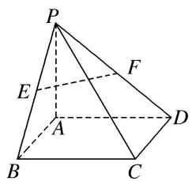

解析 （1）以点 $A$ 为原点, $AB$ 所在直线为 $x$ 轴, $AD$ 所在直线为 $y$ 轴, $AP$ 所在直线为 $z$ 轴, 建立如图所示的空间直角坐标系. 则 $A(0, 0, 0)$ , $B(1, 0, 0)$ , $C(1, 2, 0)$ , $D(0, 2, 0)$ , $P(0, 0, 1)$ .
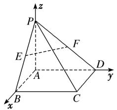

点 E, F 分别是 PB, PD 的中点， $F\left(0, 1, \frac{1}{2}\right)$ ， $E\left(\frac{1}{2}, 0, \frac{1}{2}\right)$ .
$\overrightarrow{FE} = \left( \begin{array}{ccc}1, & -1, & 0 \end{array} \right), \overrightarrow{BD} = (-1, 2, 0), \overrightarrow{FE} = -\frac{1}{2}\overrightarrow{BD}$ . 即 $EF // BD$ .
又 $BD \subset$ 平面 ABCD， $EF \notin$ 平面 ABCD，所以 $EF \parallel$ 平面 ABCD.  
（2）由（1）可知 $\overrightarrow{PB}=(1,0,-1)$ ， $\overrightarrow{PD}=(0,2,-1)$ ， $\overrightarrow{AP}=(0,0,1)$ ， $\overrightarrow{AD}=(0,2,0)$ ， $\overrightarrow{DC}=(1,0,0)$
因为 $\overrightarrow{AP}\cdot\overrightarrow{DC}=(0,0,1)\cdot(1,0,0)=0,\quad\overrightarrow{AD}\cdot\overrightarrow{DC}=(0,2,0)\cdot(1,0,0)=0,$
所以 $\overrightarrow{AP}\perp\overrightarrow{DC},\quad\overrightarrow{AD}\perp\overrightarrow{DC}$ ，即 $AP\perp DC,\quad AD\perp DC.$
又 $AP \cap AD = A$ ，所以 $DC \perp$ 平面 PAD。因为 $DC \subset$ 平面 PDC，所以平面 $PAD \perp$ 平面 PDC。

[例6] 如图，在四棱锥 $P - ABCD$ 中，底面 $ABCD$ 是边长为 $a$ 的正方形，侧面 $PAD \perp$ 底面 $ABCD$ ，且 $PA = PD = \frac{\sqrt{2}}{2} AD$ ，设 $E, F$ 分别为 $PC, BD$ 的中点.  
（1）求证：EF//平面 PAD;  
（2）求证：平面 $PAB \perp$ 平面 $PDC$ .

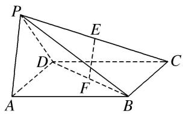

解析 （1）如图, 取 ${AD}$ 的中点 $O$ ,连接 ${OP},{OF}$ . 因为 ${PA} = {PD}$ ,所以 ${PO} \bot  {AD}$ .
因为侧面 $PAD \perp$ 底面 ABCD，平面 $PAD \cap$ 平面 ABCD = AD，
$PO \subset$ 平面 PAD，所以 $PO \perp$ 平面 ABCD．又 O，F 分别为 AD，BD 的中点，所以 OF // AB.
又 ABCD 是正方形，所以 $OF \perp AD$ 。因为 $PA = PD = \frac{\sqrt{2}}{2} AD$ ，所以 $PA \perp PD$ ， $OP = OA = \frac{a}{2}$

以 O 为原点，OA，OF，OP 所在直线分别为 x 轴，y 轴，z 轴建立空间直角坐标系，
则 $A\left(\frac{a}{2},0,0\right)$ ， $F\left(0,\frac{a}{2},0\right)$ ， $D\left(-\frac{a}{2},0,0\right)$ ， $P\left(0,0,\frac{a}{2}\right)$ ， $B\left(\frac{a}{2},a,0\right)$ ， $C\left(-\frac{a}{2},a,0\right)$ .
因为 E 为 PC 的中点，所以 $E\left(-\frac{a}{4}, \frac{a}{2}, \frac{a}{4}\right)$ . 易知平面 PAD 的一个法向量为 $\overrightarrow{OF}=\left(0, \frac{a}{2}, 0\right)$ ,
因为 $\overrightarrow{EF}=\left(\frac{a}{4},\quad0,\quad-\frac{a}{4}\right)$ ，且 $\overrightarrow{OF}\cdot\overrightarrow{EF}=\left(0,\quad\frac{a}{2},\quad0\right)\cdot\left(\frac{a}{4},\quad0,\quad-\frac{a}{4}\right)=0,$
又因为 $EF \notin$ 平面 PAD，所以 $EF \parallel$ 平面 PAD.

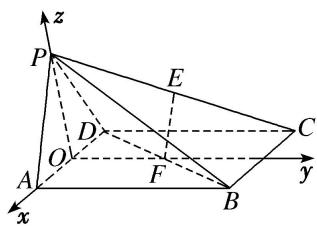  
（2）因为 $\overrightarrow{PA} = \left[\frac{a}{2}, 0, -\frac{a}{2}\right]$ , $\overrightarrow{CD} = (0, -a, 0)$ , 所以 $\overrightarrow{PA} \cdot \overrightarrow{CD} = \left[\frac{a}{2}, 0, -\frac{a}{2}\right] \cdot (0, -a, 0) = 0$ ,
所以 $\overrightarrow{PA}\perp\overrightarrow{CD}$ ，所以 $PA\perp CD$ ．又 $PA\perp PD,\quad PD\cap CD=D,\quad PD,\quad CD\subset$ 平面PDC，
所以 $PA \perp$ 平面 PDC. 又 $PA \subset$ 平面 PAB, 所以平面 $PAB \perp$ 平面 PDC.

# 【对点训练】

1. 如图，在直三棱柱 $ABC - A_{1}B_{1}C_{1}$ 中， $AC = 3$ ， $BC = 4$ ， $AB = 5$ ， $AA_{1} = 4$ ，点 $D$ 是 $AB$ 的中点.  
（1）证明 $AC \perp BC_{1}$ ;  
（2）证明 $AC_{1} \parallel$ 平面 $CDB_{1}$ .

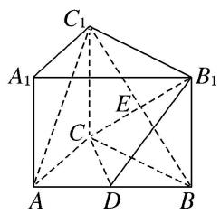

1. 解析 因为直三棱柱 $ABC-A_{1}B_{1}C_{1}$ 的底面边长分别为 AC=3, BC=4, AB=5,
所以 $\triangle ABC$ 为直角三角形， $AC\perp BC$ 。所以AC，BC， $C_{1}C$ 两两垂直。
如图，以 C 为坐标原点，直线 CA，CB， $CC_{1}$ 分别为 x 轴，y 轴，z 轴建立空间直角坐标系，
则 $C(0, 0, 0)$ ， $A(3, 0, 0)$ ， $B(0, 4, 0)$ ， $C_{1}(0, 0, 4)$ ， $A_{1}(3, 0, 4)$ ， $B_{1}(0, 4, 4)$ ， $D\left(\frac{3}{2}, 2, 0\right)$ .

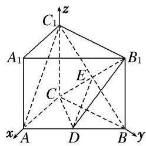  
（1）因为 $\overrightarrow{AC} = (-3, 0, 0)$ , $\overrightarrow{BC_1} = (0, -4, 4)$ , 所以 $\overrightarrow{AC} \cdot \overrightarrow{BC_1} = 0$ , 所以 $AC \perp BC_1$ .  
（2）设 $CB_{1}$ 与 $C_1B$ 的交点为 $E$ ，连接 $DE$ ，则 $E(0, 2, 2)$ ， $\overrightarrow{DE} = \left(-\frac{3}{2}, 0, 2\right)$ ， $\overrightarrow{AC_1} = (-3, 0, 4)$ ，
所以 $\overrightarrow{DE} = \frac{1}{2}\overrightarrow{AC_1}$ ， $DE / / AC_1$ .因为 $DE\subset$ 平面 $CDB_{1}$ ， $AC_{1}\notin$ 平面 $CDB_{1}$ ，所以 $AC_{1} / /$ 平面 $CDB_{1}$

2. 如图，四棱锥 $P - ABCD$ 的底面为正方形，侧棱 $PA \perp$ 底面 $ABCD$ ，且 $PA = AD = 2$ ， $E$ ， $F$ ， $H$ 分别是线

段 PA, PD, AB 的中点．求证：  
（1）PB//平面 EFH;  
（2）PD⊥平面 AHF.

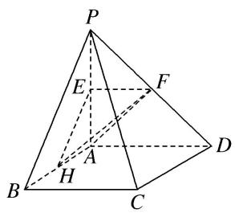

2. 解析 建立如图所示的空间直角坐标系 $A - xyz$ . $\therefore A(0, 0, 0)$ , $B(2, 0, 0)$ , $C(2, 2, 0)$ , $D(0, 2, 0)$ , $P(0, 0, 2)$ , $E(0, 0, 1)$ , $F(0, 1, 1)$ , $H(1, 0, 0)$ .

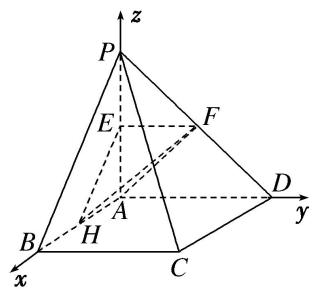  
（1）∵E，H分别是线段AP，AB的中点，∴PB//EH.
∵PB∉平面 EFH，且 EH⊂平面 EFH，∴PB∥平面 EFH.  
（2） $\overrightarrow{PD}=(0,2,-2),\overrightarrow{AH}=(1,0,0),\overrightarrow{AF}=(0,1,1),$
$\therefore \overrightarrow {P D} \cdot \overrightarrow {A F} = 0 \times 0 + 2 \times 1 + (- 2) \times 1 = 0, \quad \overrightarrow {P D} \cdot \overrightarrow {A H} = 0 \times 1 + 2 \times 0 + (- 2) \times 0 = 0.$
$\therefore PD \perp AF, PD \perp AH.$ 又 $\because AF \cap AH = A, \therefore PD \perp$ 平面 $AHF$ .

3. 如图, 正方形 $ADEF$ 与梯形 $ABCD$ 所在的平面互相垂直, $AD \perp CD$ , $AB // CD$ , $AB = AD = 2$ , $CD = 4$ , $M$ 为 $CE$ 的中点.  
（1）求证：BM//平面 ADEF;  
（2）求证： $BC \perp$ 平面 BDE.

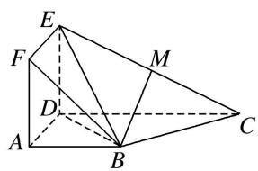

3. 解析 $\because$ 平面 $ADEF \perp$ 平面 $ABCD$ , 平面 $ADEF \cap$ 平面 $ABCD = AD$ , $AD \perp ED$ , $ED \subset$ 平面 $ADEF$ , $\therefore ED \perp$ 平面 $ABCD$ .

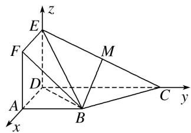

以 D 为原点， $\overrightarrow{DA},\overrightarrow{DC},\overrightarrow{DE}$ 分别为 x 轴、y 轴、z 轴的正方向建立如图所示的空间直角坐标系.
则 $D(0, 0, 0)$ ， $A(2, 0, 0)$ ， $B(2, 2, 0)$ ， $C(0, 4, 0)$ ， $E(0, 0, 2)$ ， $F(2, 0, 2)$ .  
（1）∵M为EC的中点，∴M(0,2,1)，则 $\overrightarrow{BM}=(-2,0,1)$ ， $\overrightarrow{AD}=(-2,0,0)$ ， $\overrightarrow{AF}=(0,0,2)$ ，
∴ $\overrightarrow{BM}=\overrightarrow{AD}+\frac{1}{2}\overrightarrow{AF}$ ，故 $\overrightarrow{BM},\overrightarrow{AD},\overrightarrow{AF}$ 共面．又BM∉平面ADEF，∴BM//平面ADEF.  
（2） $\overrightarrow{BC}=(-2,2,0),\quad\overrightarrow{DB}=(2,2,0),\quad\overrightarrow{DE}=(0,0,2),$
$\because\overrightarrow{BC}\cdot\overrightarrow{DB}=-4+4=0,\quad\therefore BC\perp DB.$ 又 $\overrightarrow{BC}\cdot\overrightarrow{DE}=0,\quad\therefore BC\perp DE.$
又 $DE \cap DB = D$ ，DE， $DB \subset$ 平面 BDE，∴ BC ⊥ 平面 BDE.

4. 如图，在三棱锥 $P - ABC$ 中， $AB = AC$ ， $D$ 为 $BC$ 的中点， $PO \perp$ 平面 $ABC$ ，垂足 $O$ 落在线段 $AD$ 上．已知 $BC = 8$ ， $PO = 4$ ， $AO = 3$ ， $OD = 2$ ．  
（1）证明： $AP \perp BC;$  
（2）若点 M 是线段 AP 上一点，且 AM=3。试证明平面 $AMC \perp$ 平面 BMC.

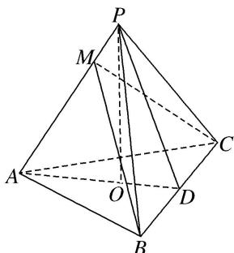

4. 解析 如图所示，以 O 为坐标原点，以射线 OP 为 z 轴的正半轴建立空间直角坐标系 O-xyz．则 $O(0, 0, 0)$ ， $A(0, -3, 0)$ ， $B(4, 2, 0)$ ， $C(-4, 2, 0)$ ， $P(0, 0, 4)$ .

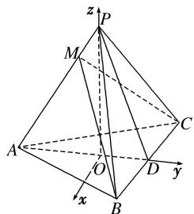  
（1） $\because\overrightarrow{AP}=(0,\ 3,\ 4),\ \overrightarrow{BC}=(-8,\ 0,\ 0),\ \therefore\overrightarrow{AP}\cdot\overrightarrow{BC}=(0,\ 3,\ 4)\cdot(-8,\ 0,\ 0)=0,$
所以 $\overrightarrow{AP}\perp\overrightarrow{BC}$ ，即 $AP\perp BC$ .  
（2）由（1）知 $|AP|=5$ ，又 $|AM|=3$ ，且点M在线段AP上， $\therefore\overrightarrow{AM}=\frac{3}{5}\overrightarrow{AP}=\left(0,\frac{9}{5},\frac{12}{5}\right)$ .
又 $\overrightarrow{AC}=(-4,5,0),\quad\overrightarrow{BA}=(-4,-5,0),\quad\therefore\overrightarrow{BM}=\overrightarrow{BA}+\overrightarrow{AM}=\left(-4,-\frac{16}{5},\frac{12}{5}\right)$
则 $\overrightarrow{AP} \cdot \overrightarrow{BM} = (0, 3, 4) \cdot \left(-4, -\frac{16}{5}, \frac{12}{5}\right) = 0, \therefore \overrightarrow{AP} \perp \overrightarrow{BM}$ , 即 $AP \perp BM$ ,
又根据（1）的结论知 $AP \perp BC$ ， $BM \cap BC = B$ ，∴ $AP \perp$ 平面 BMC，于是 $AM \perp$ 平面 BMC，又 $AM \subset$ 平面 AMC，故平面 $AMC \perp$ 平面 BCM.

5. 如图所示，在四棱锥 $P - ABCD$ 中， $PC \perp$ 平面 $ABCD$ ， $PC = 2$ ，在四边形 $ABCD$ 中， $\angle B = \angle C = 90^\circ$ ， $AB = 4$ ， $CD = 1$ ，点 $M$ 在 $PB$ 上， $PB = 4PM$ ， $PB$ 与平面 $ABCD$ 成 $30^\circ$ 角，求证：  
（1）CM//平面 PAD;  
（2）平面 $PAB \perp$ 平面 PAD.

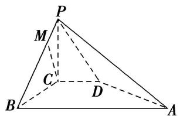

5. 解析 （1）由题意知, $CB$ , $CD$ , $CP$ 两两垂直, 以 $C$ 为坐标原点, $CB$ 所在直线为 $x$ 轴, $CD$ 所在直线为 $y$ 轴, $CP$ 所在直线为 $z$ 轴建立如图所示的空间直角坐标系 $C - xyz$ .
∵PC⊥平面ABCD，∴∠PBC为PB与平面ABCD所成的角，∴∠PBC=30°.
$\because P C = 2, \therefore B C = 2 \sqrt {3}, P B = 4,$
$\therefore D (0, 1, 0), B (2 \sqrt {3}, 0, 0), A (2 \sqrt {3}, 4, 0), P (0, 0, 2), M \left(\frac {\sqrt {3}}{2}, 0, \frac {3}{2}\right),$
$\therefore \overrightarrow {D P} = (0, - 1, 2), \overrightarrow {D A} = (2 \sqrt {3}, 3, 0), \overrightarrow {C M} = \left[ \frac {\sqrt {3}}{2}, 0, \frac {3}{2} \right].$
设 $\boldsymbol{n}=(x,y,z)$ 为平面 PAD 的一个法向量，由 $\left\{\begin{aligned}\overrightarrow{DP}\cdot\boldsymbol{n}&=0,\\ \overrightarrow{DA}\cdot\boldsymbol{n}&=0,\end{aligned}\right.$ 即 $\left\{\begin{aligned}-y+2z&=0,\\ 2\sqrt{3}x+3y&=0,\end{aligned}\right.$ 令 y=2，得 $n=(-\sqrt{3}, 2, 1)$ .
$\because \boldsymbol {n} \cdot \overrightarrow{CM} = -\sqrt{3} \times \frac{\sqrt{3}}{2} + 2 \times 0 + 1 \times \frac{3}{2} = 0, \therefore \boldsymbol {n} \perp \overrightarrow{CM}$ . 又 $CM \notin$ 平面 $PAD$ , $\therefore CM \parallel$ 平面 $PAD$ .

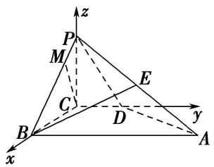  
（2）法一：由（1）知 $\overrightarrow{BA} = (0, 4, 0)$ ， $\overrightarrow{PB} = (2\sqrt{3}, 0, -2)$ ，
设平面 PAB 的一个法向量为 $\boldsymbol{m}=(x_{0},y_{0},z_{0})$ ，由 $\left\{\begin{aligned}\overrightarrow{BA}\cdot\boldsymbol{m}&=0,\\ \overrightarrow{PB}\cdot\boldsymbol{m}&=0,\end{aligned}\right.$ 即 $\left\{\begin{aligned}4y_{0}&=0,\\ 2\sqrt{3}x_{0}-2z_{0}&=0,\end{aligned}\right.$ 令 $x_{0}=1$ ，得 $m=(1,0,\sqrt{3})$ 。又∵平面 PAD 的一个法向量 $n=(-\sqrt{3},2,1)$ ，
∴ $m \cdot n = 1 \times (-\sqrt{3}) + 0 \times 2 + \sqrt{3} \times 1 = 0$ ，∴ 平面 $PAB \perp$ 平面 PAD.

法二：取 AP 的中点 E，连接 BE，则 $E(\sqrt{3}, 2, 1)$ ， $\overrightarrow{BE}=(-\sqrt{3}, 2, 1)$ .
∵PB=AB，∴BE⊥PA．又∵ $\overrightarrow{BE}\cdot\overrightarrow{DA}=(-\sqrt{3},2,1)\cdot(2\sqrt{3},3,0)=0,$
$\therefore\overrightarrow{BE}\perp\overrightarrow{DA}.\quad\therefore BE\perp DA.$ 又 $PA\cap DA=A,\quad\therefore BE\perp$ 平面 PAD.
又∵BE⊂平面PAB，∴平面PAB⊥平面PAD.

6. 如图所示, 已知四棱锥 $P - ABCD$ 的底面是直角梯形, $\angle ABC = \angle BCD = 90^{\circ}$ , $AB = BC = PB = PC = 2CD$ ,

平面 $PBC \perp$ 底面 ABCD. 用向量方法证明:  
（1） $PA \perp BD;$   
（2）平面 PAD⊥平面 PAB.

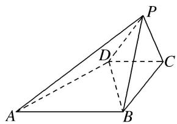

6. 解析 （1）取 BC 的中点 O，连接 PO，∵△PBC 为等边三角形，∴PO⊥BC.
∵平面 $PBC \perp$ 底面 ABCD，平面 $PBC \cap$ 底面 ABCD = BC， $PO \subset$ 平面 PBC，∴ $PO \perp$ 底面 ABCD.

以 BC 的中点 O 为坐标原点，以 BC 所在直线为 x 轴，过点 O 与 AB 平行的直线为 y 轴，OP 所在直线为 z 轴，建立空间直角坐标系，如图所示．不妨设 CD=1，则 $AB=BC=2,\quad PO=\sqrt{3}$ ，

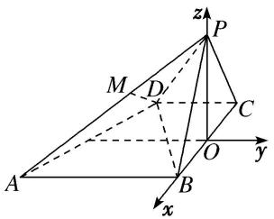
$\therefore A (1, - 2, 0), B (1, 0, 0), D (- 1, - 1, 0), P (0, 0, \sqrt {3}),$
$\therefore \overrightarrow {B D} = (- 2, - 1, 0), \overrightarrow {P A} = (1, - 2, - \sqrt {3}).$
$\because \overrightarrow {B D} \cdot \overrightarrow {P A} = (- 2) \times 1 + (- 1) \times (- 2) + 0 \times (- \sqrt {3}) = 0, \therefore \overrightarrow {P A} \perp \overrightarrow {B D}, \therefore P A \perp B D.$  
（2）取 $PA$ 的中点 $M$ ，连接 $DM$ ，则 $M\left(\frac{1}{2}, - 1,\frac{\sqrt{3}}{2}\right)$ $\because \overrightarrow{DM} = \left(\frac{3}{2},0,\frac{\sqrt{3}}{2}\right),\overrightarrow{PB} = (1,0, - \sqrt{3}),$
$\therefore \overrightarrow {D M} \cdot \overrightarrow {P B} = \frac {3}{2} \times 1 + 0 \times 0 + \frac {\sqrt {3}}{2} \times (- \sqrt {3}) = 0, \quad \therefore \overrightarrow {D M} \perp \overrightarrow {P B}, \text {即} D M \perp P B.$
$\because \overrightarrow {D M} \cdot \overrightarrow {P A} = \frac {3}{2} \times 1 + 0 \times (- 2) + \frac {\sqrt {3}}{2} \times (- \sqrt {3}) = 0, \therefore \overrightarrow {D M} \perp \overrightarrow {P A}, \text {即} D M \perp P A.$
又∵ $PA\cap PB=P$ ，PA⊂平面PAB，PB⊂平面PAB，∴DM⊥平面PAB.
∵DM⊂平面 PAD，∴平面 PAD⊥平面 PAB.

7. 如图，已知 $AA_{1} \perp$ 平面 $ABC, BB_{1} // AA_{1}, AB = AC = 3, BC = 2\sqrt{5}, AA_{1} = \sqrt{7}, BB_{1} = 2\sqrt{7}$ ，点 $E$ 和 $F$ 分别为 $BC$ 和 $A_{1}C$ 的中点.  
（1）求证： $EF \parallel$ 平面 $A_{1}B_{1}BA$ ;  
（2）求证：平面 $AEA_{1} \perp$ 平面 $BCB_{1}$ .

7. 解析 因为 $AB = AC$ ， $E$ 为 $BC$ 的中点，所以 $AE \perp BC$ 。因为 $AA_{1} \perp$ 平面 $ABC$ ， $AA_{1} // BB_{1}$ ，
所以以过 E 作平行于 $BB_{1}$ 的垂线为 z 轴，EC，EA 所在直线分别为 x 轴，y 轴，建立如图所示的空间直角坐标系.

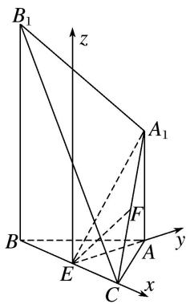
因为 AB=3, $BE=\sqrt{5}$ ，所以 AE=2，所以 $E(0,0,0)$ ， $C(\sqrt{5},0,0)$ ， $A(0,2,0)$ ， $B(-\sqrt{5},0,0)$ ， $B_{1}(-\sqrt{5},0,2\sqrt{7})$ 。 $A_{1}(0,2,\sqrt{7})$ ，则 $F\left(\frac{\sqrt{5}}{2},1,\frac{\sqrt{7}}{2}\right)$ 。  
（1） $\overrightarrow{EF}=\left(\frac{\sqrt{5}}{2},\quad1,\quad\frac{\sqrt{7}}{2}\right),\quad\overrightarrow{AB}=(-\sqrt{5},\quad-2,\quad0),\quad\overrightarrow{AA_{1}}=(0,\quad0,\quad\sqrt{7}).$
设平面 $AA_{1}B_{1}B$ 的一个法向量为 $\boldsymbol{n}=(x,y,z)$ ，则 $\left\{\begin{aligned}\boldsymbol{n}\cdot\overrightarrow{AB}&=0,\\ \boldsymbol{n}\cdot\overrightarrow{AA_{1}}&=0,\end{aligned}\right.$ 所以 $\left\{\begin{aligned}-\sqrt{5}x-2y&=0,\\ \sqrt{7}z&=0,\end{aligned}\right.$

取 $\left\{\begin{aligned}x&=-2,\\ y&=\sqrt{5},\\ z&=0,\end{aligned}\right.$ 所以 $n=(-2,\sqrt{5},0)$ .
因为 $\vec{EF} \cdot n = \frac{\sqrt{5}}{2} \times (-2) + 1 \times \sqrt{5} + \frac{\sqrt{7}}{2} \times 0 = 0$ ，所以 $\vec{EF} \perp n$ .
又 $EF \not\subset$ 平面 $A_{1}B_{1}BA$ ，所以 $EF \parallel$ 平面 $A_{1}B_{1}BA$ .  
（2）因为 $EC \perp$ 平面 $AEA_{1}$ ，所以 $\vec{EC} = (\sqrt{5}, 0, 0)$ 为平面 $AEA_{1}$ 的一个法向量。又 $EA \perp$ 平面 $BCB_{1}$ ，所以 $\vec{EA} = (0, 2, 0)$ 为平面 $BCB_{1}$ 的一个法向量。因为 $\vec{EC} \cdot \vec{EA} = 0$ ，所以 $\vec{EC} \perp \vec{EA}$ ，故平面 $AEA_{1} \perp$ 平面 $BCB_{1}$ 。

8. 如图，在四棱锥 $P - ABCD$ 中， $PA \perp$ 底面 $ABCD$ ， $AD \perp AB$ ， $AB // DC$ ， $AD = DC = AP = 2$ ， $AB = 1$ ，点 $E$ 为棱 $PC$ 的中点．证明：  
（1） $BE \perp DC;$   
（2）BE // 平面 PAD;  
（3）平面 $PCD \perp$ 平面 PAD.

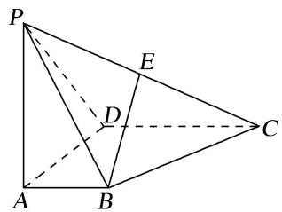

8. 解析 依题意，以点 $A$ 为原点建立空间直角坐标系(如图)，可得 $B(1,0,0)$ ， $C(2,2,0)$ ， $D(0,2,0)$ ， $P(0,0,2)$ 。由 $E$ 为棱 $PC$ 的中点，得 $E(1,1,1)$ 。

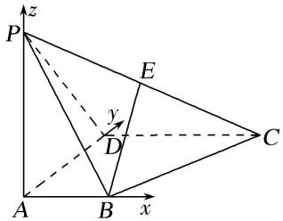  
（1） 向量 $\overrightarrow{BE} = (0, 1, 1)$ ， $\overrightarrow{DC} = (2, 0, 0)$ ，故 $\overrightarrow{BE} \cdot \overrightarrow{DC} = 0$ 。所以 $BE \perp DC$ 。  
（2）因为 $AB \perp AD$ ，又 $PA \perp$ 平面 ABCD， $AB \subset$ 平面 ABCD，
所以 $AB \perp PA$ ， $PA \cap AD = A$ ，PA，AD⊂平面 PAD，所以 $AB \perp$ 平面 PAD，
所以向量 $\overrightarrow{AB}=(1,0,0)$ 为平面PAD的一个法向量，

而 $\overrightarrow{BE}\cdot\overrightarrow{AB}=(0,1,1)\cdot(1,0,0)=0$ ，所以 $BE\perp AB$ ，
又 $BE \notin$ 平面 PAD，所以 $BE \parallel$ 平面 PAD.  
（3）由（2）知平面 PAD 的法向量 $\overrightarrow{AB}=(1,0,0)$ ，向量 $\overrightarrow{PD}=(0,2,-2)$ ， $\overrightarrow{DC}=(2,0,0)$ ,
设平面 PCD 的法向量为 $\boldsymbol{n}=(x,y,z)$ ，则 $\left\{\begin{aligned}\boldsymbol{n}\cdot\overrightarrow{PD}&=0,\\ \boldsymbol{n}\cdot\overrightarrow{DC}&=0,\end{aligned}\right.$ 即 $\left\{\begin{aligned}2y-2z&=0,\\ 2x&=0,\end{aligned}\right.$ 不妨令 y=1，
可得 $n=(0,1,1)$ 为平面 PCD 的一个法向量.

且 $\boldsymbol{n}\cdot\overrightarrow{AB}=(0,1,1)\cdot(1,0,0)=0$ ，所以 $n\perp\overrightarrow{AB}$ .
所以平面 PAD⊥平面 PCD.

