**专题09　利用空间向量证明平行与垂直问题**

**1．两个重要向量**

(1)直线的方向向量：如果表示非零向量<em><strong>a</strong></em>的有向线段所在直线与直线<em>l</em>平行或重合，则称此向量<em><strong>a</strong></em>为直线<em>l</em>的方向向量．显然一条直线的方向向量有无数个，它们是共线向量．

(2)平面的法向量：直线<em>l</em>⊥<em>α</em>，取直线<em>l</em>的方向向量<em><strong>a</strong></em>，则向量<em><strong>a</strong></em>叫做平面<em>α</em>的法向量．显然一个平面的法向量有无数个，它们是共线向量．

**2**．**空间位置关系的向量表示**

<table><tr><td colspan="2">
位置关系
</td><td>
向量表示
</td></tr><tr><td rowspan="2">
直线<em>l</em>1，<em>l</em>2的方向向量分别为<strong><em>n</em></strong>1，<strong><em>n</em></strong>2
</td><td>
<em>l</em>1∥<em>l</em>2
</td><td>
<strong><em>n</em></strong>1∥<strong><em>n</em></strong>2⇔<strong><em>n</em></strong>1＝<em>λ</em><strong><em>n</em></strong>2
</td></tr><tr><td>
<em>l</em>1⊥<em>l</em>2
</td><td>
<strong><em>n</em></strong>1⊥<strong><em>n</em></strong>2⇔<strong><em>n</em></strong>1·<strong><em>n</em></strong>2＝0
</td></tr><tr><td rowspan="2">
直线<em>l</em>的方向向量为<strong><em>n</em></strong>，平面<em>α</em>的法向量为<strong><em>m</em></strong>
</td><td>
<em>l</em>∥<em>α</em>
</td><td>
<strong><em>n</em></strong>⊥<strong><em>m</em></strong>⇔<strong><em>n</em></strong>·<strong><em>m</em></strong>＝0
</td></tr><tr><td>
<em>l</em>⊥<em>α</em>
</td><td>
<strong><em>n</em></strong>∥<strong><em>m</em></strong>⇔<strong><em>n</em></strong>＝<em>λ</em><strong><em>m</em></strong>
</td></tr><tr><td rowspan="2">
平面<em>α</em>，<em>β</em>的法向量分别为<strong><em>n</em></strong>，<strong><em>m</em></strong>
</td><td>
<em>α</em>∥<em>β</em>
</td><td>
<strong><em>n</em></strong>∥<strong><em>m</em></strong>⇔<strong><em>n</em></strong>＝<em>λ</em><strong><em>m</em></strong>
</td></tr><tr><td>
<em>α</em>⊥<em>β</em>
</td><td>
<strong><em>n</em></strong>⊥<strong><em>m</em></strong>⇔<strong><em>n</em></strong>·<strong><em>m</em></strong>＝0
</td></tr></table>

**3．利用空间向量证明平行的方法**

<table><tr><td>
线线平行
</td><td>
证明两直线的方向向量共线．
</td></tr><tr><td>
线面平行
</td><td>
①证明该直线的方向向量与平面的某一法向量垂直；

②证明直线的方向向量与平面内某直线的方向向量平行．
</td></tr><tr><td>
面面平行
</td><td>
①证明两平面的法向量为共线向量；

②转化为线面平行、线线平行问题．
</td></tr></table>

**4．利用空间向量证明垂直的方法**

<table><tr><td>
线线垂直
</td><td>
证明两直线所在的方向向量互相垂直，即证它们的数量积为零．
</td></tr><tr><td>
线面垂直
</td><td>
①证明直线的方向向量与平面的法向量共线；

②利用线面垂直的判定定理用向量表示．
</td></tr><tr><td>
面面垂直
</td><td>
①证明两个平面的法向量垂直；

②利用面面垂直的判定定理用向量表示
</td></tr></table>

**5．利用空间向量证明线、面垂直(平行)的一般步骤**

(1)建立空间直角坐标系，建系时要尽可能地利用条件中的垂直关系；

(2)建立空间图形与空间向量之间的关系，用空间向量表示出问题中所涉及的点、直线、平面的要素；

(3)通过空间向量的运算求出直线的方向向量或平面的法向量，再研究平行、垂直关系；

(4)根据运算结果解释相关问题．

**【例题选讲】**

<strong>[例1]</strong>　如图，已知在直三棱柱<em>ABC</em>－<em>A</em>1<em>B</em>1<em>C</em>1中，<em>AC</em>⊥<em>BC</em>，<em>D</em>为<em>AB</em>的中点，<em>AC</em>＝<em>BC</em>＝<em>BB</em>1．

(1)求证：<em>BC</em>1⊥<em>AB</em>1；

(2)求证：<em>BC</em>1∥平面<em>CA</em>1<em>D</em>．

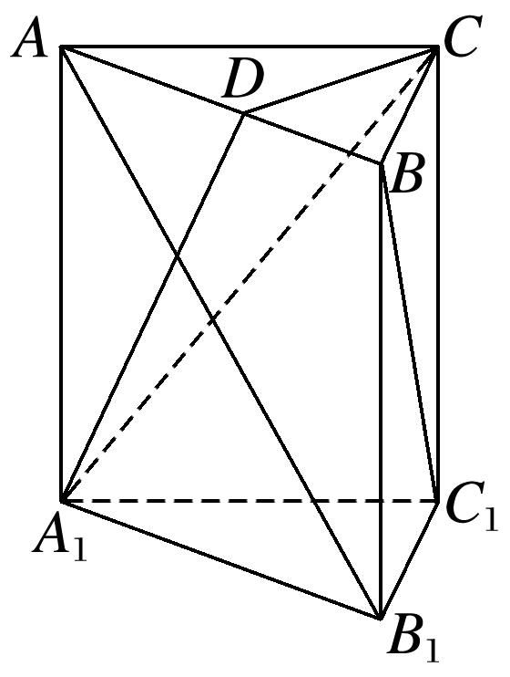

解析　如图，以<em>C</em>1点为原点，<em>C</em>1<em>A</em>1，<em>C</em>1<em>B</em>1，<em>C</em>1<em>C</em>所在直线分别为<em>x</em>轴，<em>y</em>轴，<em>z</em>轴建立空间直角坐标系．

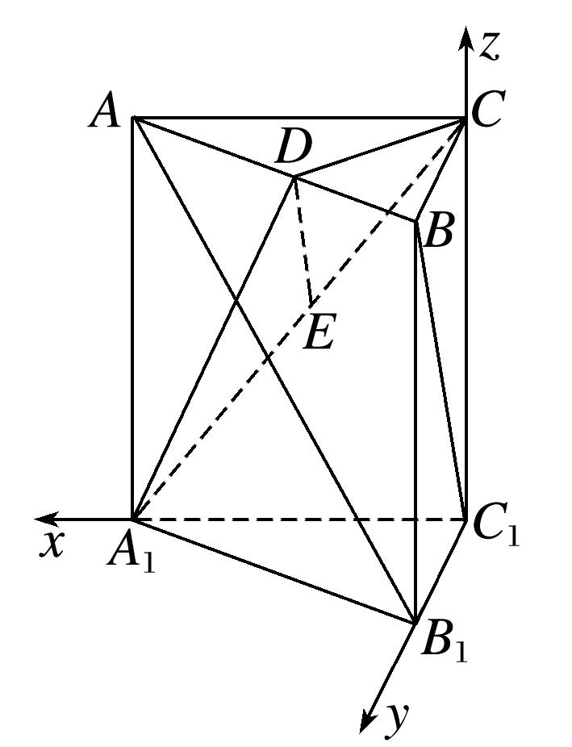

设<em>AC</em>＝<em>BC</em>＝<em>BB</em>1＝2，则<em>A</em>(2，0，2)，<em>B</em>(0，2，2)，<em>C</em>(0，0，2)，<em>A</em>1(2，0，0)，<em>B</em>1(0，2，0)，<em>C</em>1(0，0，0)，<em>D</em>(1，1，2)．

(1)∵1＝(0，－2，－2)，1＝(－2，2，－2)，∴1·1＝0－4＋4＝0，∴1⊥1，∴<em>BC</em>1⊥<em>AB</em>1．

(2)取<em>A</em>1<em>C</em>的中点<em>E</em>，∵<em>E</em>(1，0，1)，∴＝(0，1，1)，又1＝(0，－2，－2)，∴＝－1，且<em>ED</em>和<em>BC</em>1不重合，则<em>ED</em>∥<em>BC</em>1．又<em>ED</em>⊂平面<em>CA</em>1<em>D</em>，<em>BC</em>1⊄平面<em>CA</em>1<em>D</em>，故<em>BC</em>1∥平面<em>CA</em>1<em>D</em>．

<strong>[例2]</strong>　如图所示，在四棱锥<em>P</em>－<em>ABCD</em>中，底面<em>ABCD</em>是正方形，侧棱<em>PD</em>⊥底面<em>ABCD</em>，<em>PD</em>＝<em>DC</em>，<em>E</em>是<em>PC</em>的中点，过点<em>E</em>作<em>EF</em>⊥<em>PB</em>于点<em>F</em>．求证：

(1)*PA*∥平面*EDB*；

(2)*PB*⊥平面*EFD*．

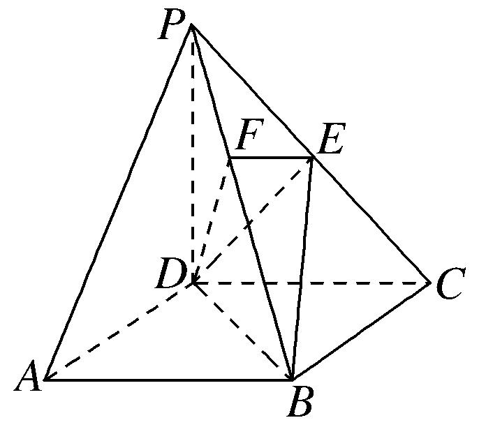

解析　以*D*为坐标原点，射线*DA*，*DC*，*DP*分别为*x*轴、*y*轴、*z*轴的正方向建立如图所示的空间直角坐标系*D*－*xyz*．设*DC*＝*a*．

(1)连接*AC*交*BD*于点*G*，连接*EG*．依题意得*A*(*a，* 0，0)，*P*(0，0，*a*)，*C*(0，*a，* 0)，*E*．

因为底面*ABCD*是正方形，所以*G*为*AC*的中点，故点*G*的坐标为，

所以＝(*a，* 0，－*a*)，＝，则＝2，故*PA*∥*EG*．

而*EG*⊂平面*EDB*，*PA*⊄平面*EDB*，所以*PA*∥平面*EDB*．

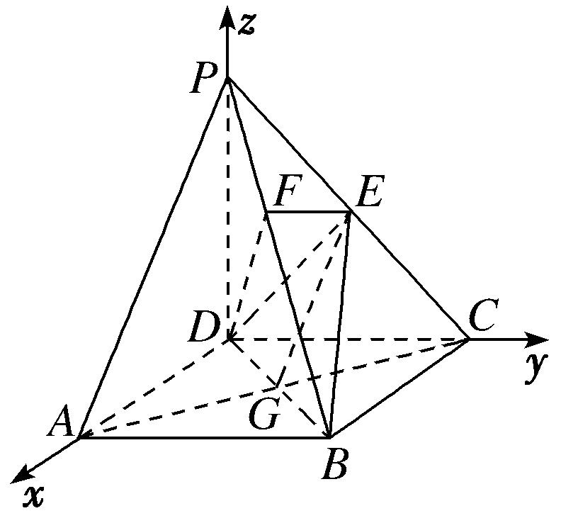

(2)依题意得*B*(*a*，*a，* 0)，所以＝(*a*，*a*，－*a*)．又＝，故·＝0＋－＝0，

所以*PB*⊥*DE*，所以*PB*⊥*DE*．由题可知*EF*⊥*PB*，且*EF*∩*DE*＝*E*，所以*PB*⊥平面*EFD*．

<strong>[例3]</strong>　如图，正方形<em>ABCD</em>的边长为2，四边形<em>BDEF</em>是平行四边形，<em>BD</em>与<em>AC</em>交于点<em>G</em>，<em>O</em>为<em>GC</em>的中点，<em>FO</em>＝，且<em>FO</em>⊥平面<em>ABCD</em>．

(1)求证：*AE*∥平面*BCF*；

(2)求证：*CF*⊥平面*AEF*．

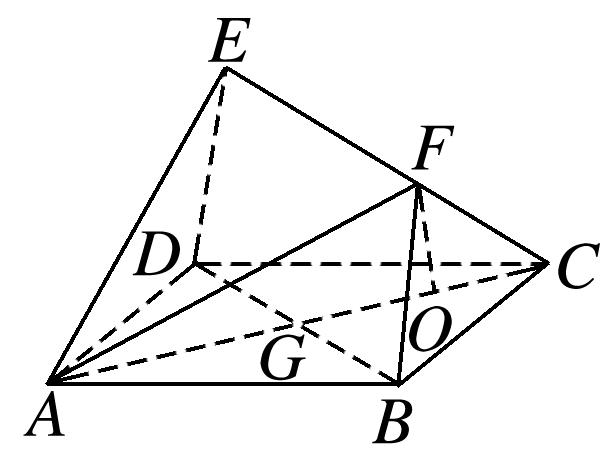

解析　如图，

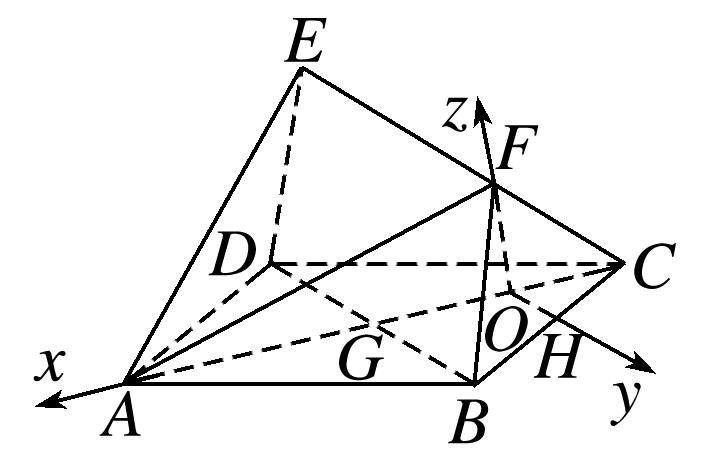

取*BC*的中点*H*，连接*OH*，则*OH*∥*BD*，又四边形*ABCD*为正方形，∴*AC*⊥*BD*，∴*OH*⊥*AC*，

故以*O*为原点，建立如图所示的直角坐标系，

则*A*(3，0，0)，*C*(－1，0，0)，*D*(1，－2，0)，*F*(0，0，)，*B*(1，2，0)．

＝(－2，－2，0)，＝(1，0，)，＝(－1，－2，)．

(1)设平面<em>BCF</em>的一个法向量为<em><strong>n</strong></em>＝(<em>x</em>，<em>y</em>，<em>z</em>)．则即

取<em>z</em>＝1，得<em><strong>n</strong></em>＝(－，，1)．又四边形<em>BDEF</em>为平行四边形，∴＝＝(－1，－2，)，

∴＝＋＝＋＝(－2，－2，0)＋(－1，－2，)＝(－3，－4，)，

∴·<em><strong>n</strong></em>＝3－4＋＝0，∴⊥<em><strong>n</strong></em>，又<em>AE</em>⊄平面<em>BCF</em>，∴<em>AE</em>∥平面<em>BCF</em>．

(2)＝(－3，0，)，∴·＝－3＋3＝0，·＝－3＋3＝0，∴⊥，⊥，

即*CF*⊥*AF*，*CF*⊥*AE*，又*AE*∩*AF*＝*A*，*AE*，*AF*⊂平面*AEF*，∴*CF*⊥平面*AEF*．

<strong>[例4]</strong>　如图，在直三棱柱<em>ADE</em>－<em>BCF</em>中，平面<em>ABFE</em>和平面<em>ABCD</em>都是正方形且互相垂直，点<em>M</em>为<em>AB</em>的中点，点<em>O</em>为<em>DF</em>的中点．证明：

(1)*OM*∥平面*BCF*；

(2)平面*MDF*⊥平面*EFCD*．

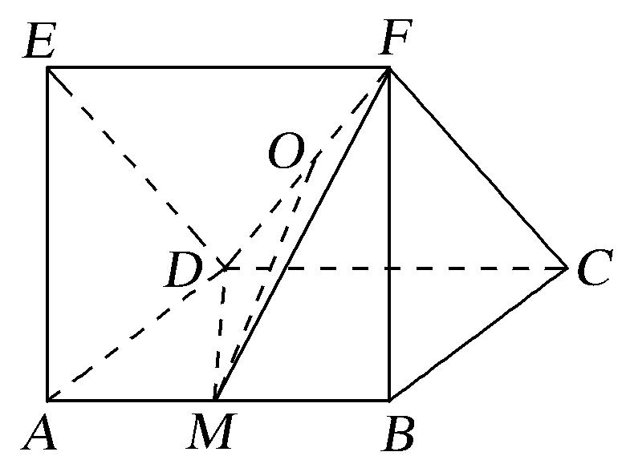

解析　(1)由题意，得*AB*，*AD*，*AE*两两垂直，以点*A*为原点建立如图所示的空间直角坐标系*A*－*xyz*．

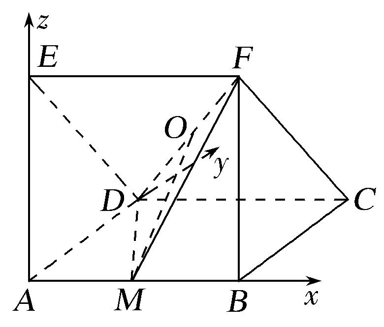

设正方形边长为1，则*A*(0，0，0)，*B*(1，0，0)，*C*(1，1，0)，*D*(0，1，0)，*F*(1，0，1)，*M*，*O*．＝，＝(－1，0，0)，∴·＝0，∴⊥．

∵棱柱*ADE*－*BCF*是直三棱柱，∴*AB*⊥平面*BCF*，∴是平面*BCF*的一个法向量，

且*OM*⊄平面*BCF*，∴*OM*∥平面*BCF*．

(2)在第(1)问的空间直角坐标系中，设平面<em>MDF</em>与平面<em>EFCD</em>的法向量分别为<em><strong>n</strong></em>1＝(<em>x</em>1，<em>y</em>1，<em>z</em>1)，<em><strong>n</strong></em>2＝(<em>x</em>2，<em>y</em>2，<em>z</em>2)．∵＝(1，－1，1)，＝，＝(1，0，0)，＝(0，－1，1)，

由得令<em>x</em>1＝1，则<em><strong>n</strong></em>1＝．同理可得<em><strong>n</strong></em>2＝(0，1，1)．

∵<em><strong>n</strong></em>1·<em><strong>n</strong></em>2＝0，∴平面<em>MDF</em>⊥平面<em>EFCD</em>．

<strong>[例5]</strong>　在底面是矩形的四棱锥<em>P</em>－<em>ABCD</em>中，<em>PA</em>⊥底面<em>ABCD</em>，点<em>E</em>，<em>F</em>分别是<em>PB</em>，<em>PD</em>的中点，<em>PA</em>＝<em>AB</em>＝1，<em>BC</em>＝2．用向量方法证明：

(1)*EF*∥平面*ABCD*；

(2)平面*PAD*⊥平面*PDC*．

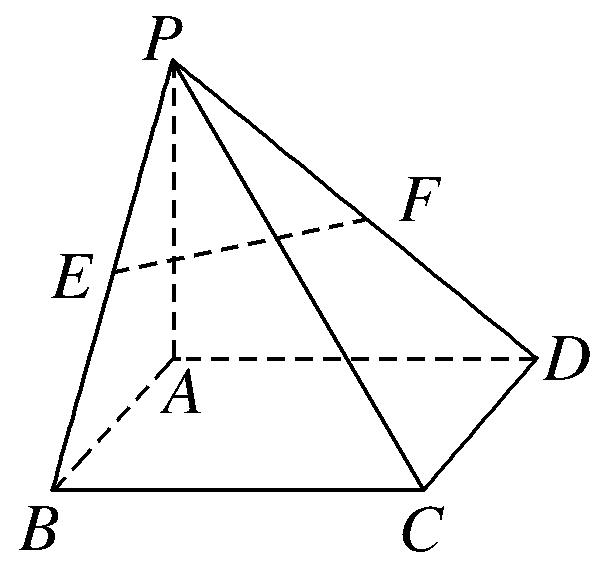

解析　(1)以点*A*为原点，*AB*所在直线为*x*轴，*AD*所在直线为*y*轴，*AP*所在直线为*z*轴，建立如图所示的空间直角坐标系．则*A*(0，0，0)，*B*(1，0，0)，*C*(1，2，0)，*D*(0，2，0)，*P*(0，0，1)．

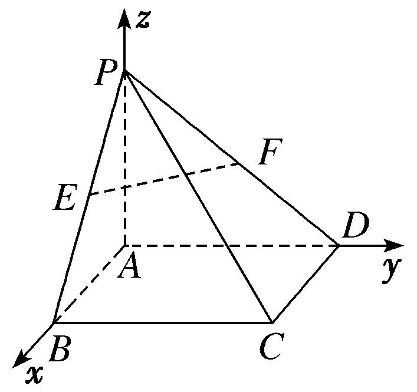

点*E*，*F*分别是*PB*，*PD*的中点，*F*，*E*．

＝，＝(－1，2，0)，＝－．即*EF*∥*BD*．

又*BD*⊂平面*ABCD*，*EF*⊄平面*ABCD*，所以*EF*∥平面*ABCD*．

(2)由(1)可知＝(1，0，－1)，＝(0，2，－1)，＝(0，0，1)，＝(0，2，0)，＝(1，0，0)，

因为·＝(0，0，1)·(1，0，0)＝0，·＝(0，2，0)·(1，0，0)＝0，

所以⊥，⊥，即*AP*⊥*DC*，*AD*⊥*DC*．

又*AP*∩*AD*＝*A*，所以*DC*⊥平面*PAD*．因为*DC*⊂平面*PDC*，所以平面*PAD*⊥平面*PDC*．

<strong>[例6]</strong>　如图，在四棱锥<em>P－ABCD</em>中，底面<em>ABCD</em>是边长为<em>a</em>的正方形，侧面<em>PAD</em>⊥底面<em>ABCD</em>，且<em>PA</em>＝<em>PD</em>＝<em>AD</em>，设<em>E</em>，<em>F</em>分别为<em>PC</em>，<em>BD</em>的中点．

(1)求证：*EF*∥平面*PAD*；

(2)求证：平面*PAB*⊥平面*PDC*．

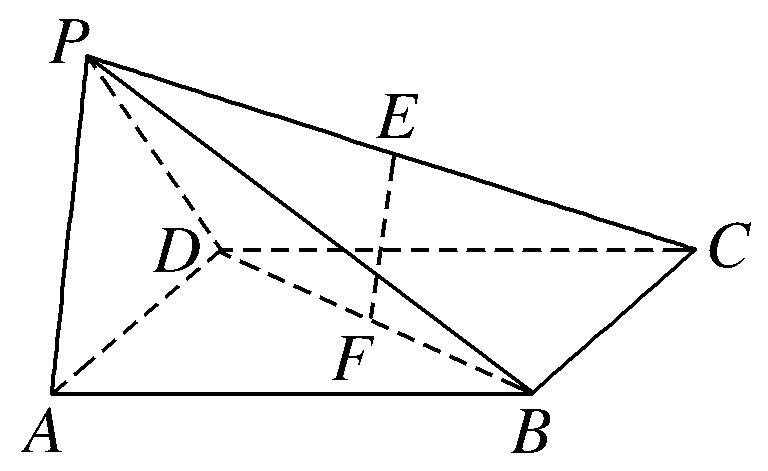

解析　(1)如图，取*AD*的中点*O*，连接*OP*，*OF*．因为*PA*＝*PD*，所以*PO*⊥*AD*．

因为侧面*PAD*⊥底面*ABCD*，平面*PAD*∩平面*ABCD*＝*AD*，

*PO*⊂平面*PAD*，所以*PO*⊥平面*ABCD*．又*O*，*F*分别为*AD*，*BD*的中点，所以*OF*∥*AB*．

又*ABCD*是正方形，所以*OF*⊥*AD*．因为*PA*＝*PD*＝*AD*，所以*PA*⊥*PD*，*OP*＝*OA*＝．

以*O*为原点，*OA*，*OF*，*OP*所在直线分别为*x*轴，*y*轴，*z*轴建立空间直角坐标系，

则*A*，*F*，*D*，*P*，*B*，*C*．

因为*E*为*PC*的中点，所以*E*．易知平面*PAD*的一个法向量为＝，

因为＝，且·＝·＝0，

又因为*EF*⊄平面*PAD*，所以*EF*∥平面*PAD*．

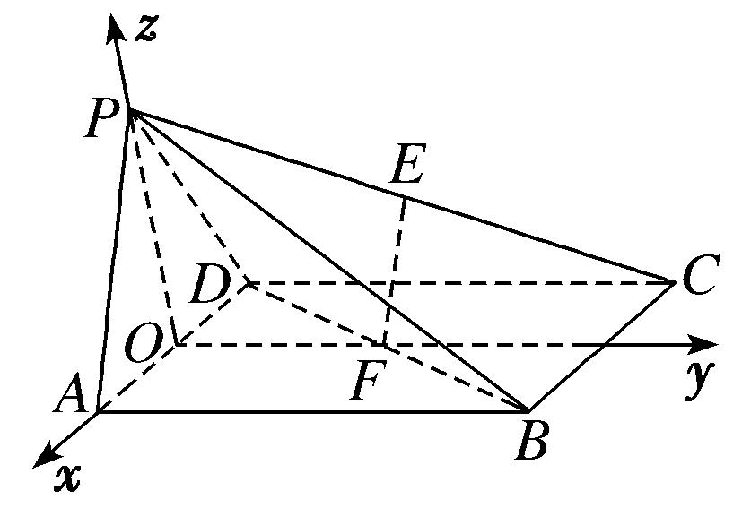

(2)因为＝，＝(0，－*a，* 0)，所以·＝·(0，－*a，* 0)＝0，

所以⊥，所以*PA*⊥*CD*．又*PA*⊥*PD*，*PD*∩*CD*＝*D*，*PD*，*CD*⊂平面*PDC*，

所以*PA*⊥平面*PDC*．又*PA*⊂平面*PAB*，所以平面*PAB*⊥平面*PDC*．

【**对点训练**】

1．如图，在直三棱柱<em>ABC</em>－<em>A</em>1<em>B</em>1<em>C</em>1中，<em>AC</em>＝3，<em>BC</em>＝4，<em>AB</em>＝5，<em>AA</em>1＝4，点<em>D</em>是<em>AB</em>的中点．

(1)证明<em>AC</em>⊥<em>BC</em>1；

(2)证明<em>AC</em>1∥平面<em>CDB</em>1．

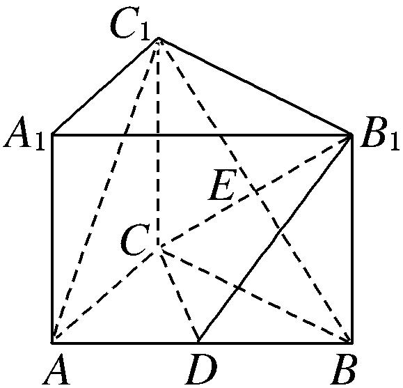

1．解析　因为直三棱柱<em>ABC</em>－<em>A</em>1<em>B</em>1<em>C</em>1的底面边长分别为<em>AC</em>＝3，<em>BC</em>＝4，<em>AB</em>＝5，

所以△<em>ABC</em>为直角三角形，<em>AC</em>⊥<em>BC</em>．所以<em>AC</em>，<em>BC</em>，<em>C</em>1<em>C</em>两两垂直．

如图，以<em>C</em>为坐标原点，直线<em>CA</em>，<em>CB</em>，<em>CC</em>1分别为<em>x</em>轴，<em>y</em>轴，<em>z</em>轴建立空间直角坐标系，

则<em>C</em>(0，0，0)，<em>A</em>(3，0，0)，<em>B</em>(0，4，0)，<em>C</em>1(0，0，4)，<em>A</em>1(3，0，4)，<em>B</em>1(0，4，4)，<em>D</em>．

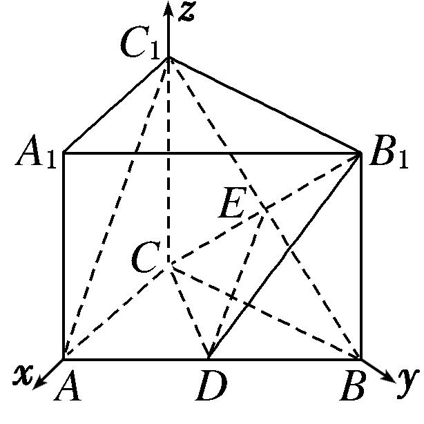

(1)因为＝(－3，0，0)，1＝(0，－4，4)，所以·＝0，所以<em>AC</em>⊥<em>BC</em>1．

(2)设<em>CB</em>1与<em>C</em>1<em>B</em>的交点为<em>E</em>，连接<em>DE</em>，则<em>E</em>(0，2，2)，＝，＝(－3，0，4)，

所以＝，<em>DE</em>∥<em>AC</em>1．因为<em>DE</em>⊂平面<em>CDB</em>1，<em>AC</em>1⊄平面<em>CDB</em>1，所以<em>AC</em>1∥平面<em>CDB</em>1．

2．如图，四棱锥*P*－*ABCD*的底面为正方形，侧棱*PA*⊥底面*ABCD*，且*PA*＝*AD*＝2，*E*，*F*，*H*分别是线

段*PA*，*PD*，*AB*的中点．求证：

(1)*PB*∥平面*EFH*；

(2)*PD*⊥平面*AHF*．

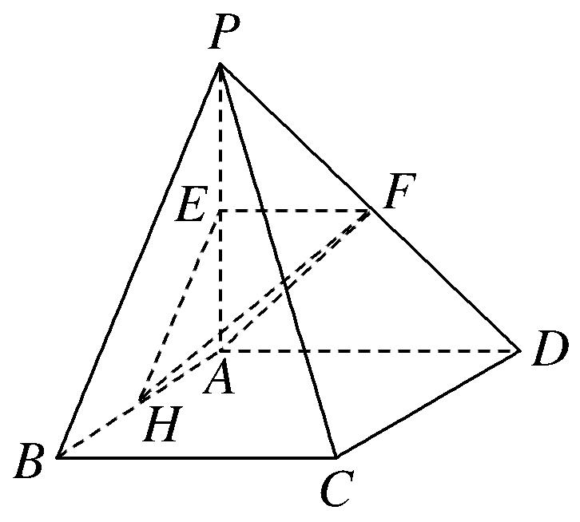

2．解析　建立如图所示的空间直角坐标系*A*－*xyz*．∴*A*(0，0，0)，*B*(2，0，0)，*C*(2，2，0)，*D*(0，2，0)，

*P*(0，0，2)，*E*(0，0，1)，*F*(0，1，1)，*H*(1，0，0)．

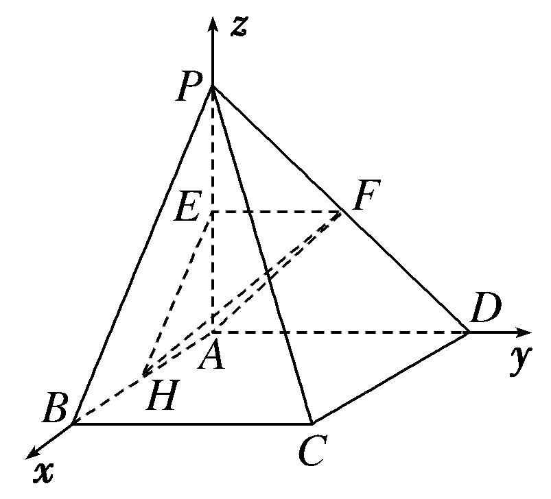

(1)∵*E*，*H*分别是线段*AP*，*AB*的中点，∴*PB*∥*EH*．

∵*PB*⊄平面*EFH*，且*EH*⊂平面*EFH*，∴*PB*∥平面*EFH*．

(2)＝(0，2，－2)，＝(1，0，0)，＝(0，1，1)，

∴·＝0×0＋2×1＋(－2)×1＝0，·＝0×1＋2×0＋(－2)×0＝0．

∴*PD*⊥*AF*，*PD*⊥*AH*．又∵*AF*∩*AH*＝*A*，∴*PD*⊥平面*AHF*．

3．如图，正方形*ADEF*与梯形*ABCD*所在的平面互相垂直，*AD*⊥*CD*，*AB*∥*CD*，*AB*＝*AD*＝2，*CD*＝4，

*M*为*CE*的中点．

(1)求证：*BM*∥平面*ADEF*；

(2)求证：*BC*⊥平面*BDE*．

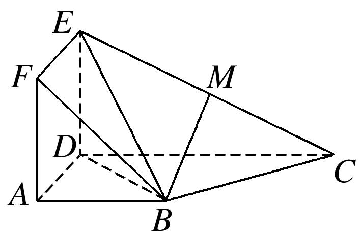

3．解析　∵平面*ADEF*⊥平面*ABCD*，平面*ADEF*∩平面*ABCD*＝*AD*，*AD*⊥*ED*，*ED*⊂平面*ADEF*，

∴*ED*⊥平面*ABCD*．

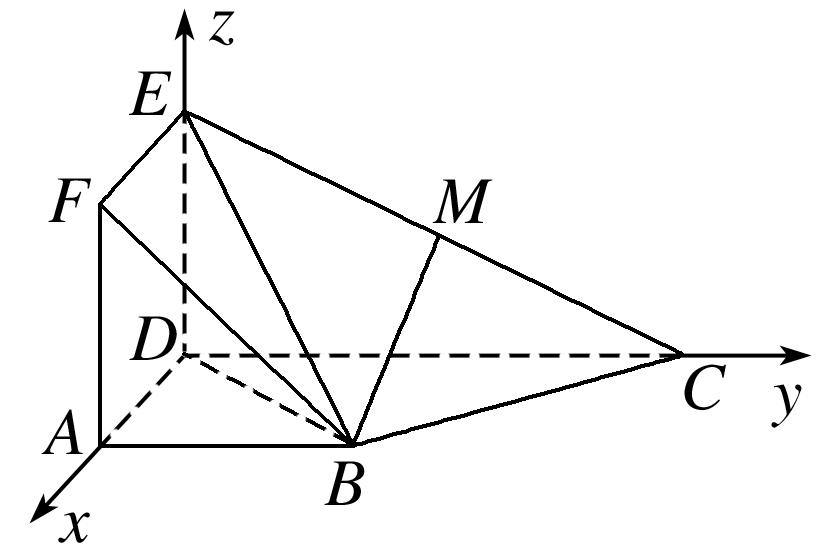

以*D*为原点，，，分别为*x*轴、*y*轴、*z*轴的正方向建立如图所示的空间直角坐标系．

则*D*(0，0，0)，*A*(2，0，0)，*B*(2，2，0)，*C*(0，4，0)，*E*(0，0，2)，*F*(2，0，2)．

(1)∵*M*为*EC*的中点，∴*M*(0，2，1)，则＝(－2，0，1)，＝(－2，0，0)，＝(0，0，2)，

∴＝＋，故，，共面．又*BM*⊄平面*ADEF*，∴*BM*∥平面*ADEF*．

(2)＝(－2，2，0)，＝(2，2，0)，＝(0，0，2)，

∵·＝－4＋4＝0，∴*BC*⊥*DB*．又·＝0，∴*BC*⊥*DE*．

又*DE*∩*DB*＝*D*，*DE*，*DB*⊂平面*BDE*，∴*BC*⊥平面*BDE*．

4．如图，在三棱锥*P*－*ABC*中，*AB*＝*AC*，*D*为*BC*的中点，*PO*⊥平面*ABC*，垂足*O*落在线段*AD*上．已

知*BC*＝8，*PO*＝4，*AO*＝3，*OD*＝2．

(1)证明：*AP*⊥*BC*；

(2)若点*M*是线段*AP*上一点，且*AM*＝3．试证明平面*AMC*⊥平面*BMC*．

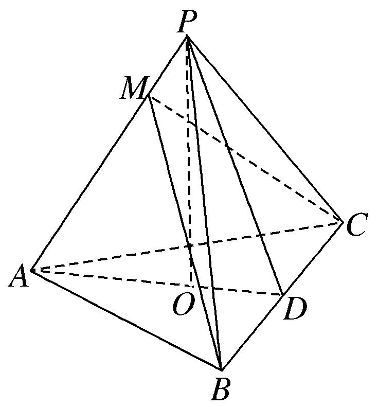

4．解析　如图所示，以*O*为坐标原点，以射线*OP*为*z*轴的正半轴建立空间直角坐标系*O*－*xyz*．则*O*(0，

0，0)，*A*(0，－3，0)，*B*(4，2，0)，*C*(－4，2，0)，*P*(0，0，4)．

(1)∵＝(0，3，4)，＝(－8，0，0)，∴·＝(0，3，4)·(－8，0，0)＝0，

所以⊥，即*AP*⊥*BC*．

(2)由(1)知|*AP*|＝5，又|*AM*|＝3，且点*M*在线段*AP*上，∴＝＝．

又＝(－4，5，0)，＝(－4，－5，0)，∴＝＋＝，

则·＝(0，3，4)·＝0，∴⊥，即*AP*⊥*BM*，

又根据(1)的结论知*AP*⊥*BC*，*BM*∩*BC*＝*B*，∴*AP*⊥平面*BMC*，于是*AM*⊥平面*BMC*，

又*AM*⊂平面*AMC*，故平面*AMC*⊥平面*BCM*．

5．如图所示，在四棱锥*P*－*ABCD*中，*PC*⊥平面*ABCD*，*PC*＝2，在四边形*ABCD*中，∠*B*＝∠*C*＝90°，

*AB*＝4，*CD*＝1，点*M*在*PB*上，*PB*＝4*PM*，*PB*与平面*ABCD*成30°角，求证：

(1)*CM*∥平面*PAD*；

(2)平面*PAB*⊥平面*PAD*．

5．解析　(1)由题意知，*CB*，*CD*，*CP*两两垂直，以*C*为坐标原点，*CB*所在直线为*x*轴，*CD*所在直

线为*y*轴，*CP*所在直线为*z*轴建立如图所示的空间直角坐标系*C－xyz*．

∵*PC*⊥平面*ABCD*，∴∠*PBC*为*PB*与平面*ABCD*所成的角，∴∠*PBC*＝30°．

∵*PC*＝2，∴*BC*＝2，*PB*＝4，

∴*D*(0，1，0)，*B*(2，0，0)，*A*(2，4，0)，*P*(0，0，2)，*M*，

∴＝(0，－1，2)，＝(2，3，0)，＝．

设<em><strong>n</strong></em>＝(<em>x</em>，<em>y</em>，<em>z</em>)为平面<em>PAD</em>的一个法向量，由即

令<em>y</em>＝2，得<em><strong>n</strong></em>＝(－，2，1)．

∵<em><strong>n</strong></em>·＝－×＋2×0＋1×＝0，∴<em><strong>n</strong></em>⊥．又<em>CM</em>⊄平面<em>PAD</em>，∴<em>CM</em>∥平面<em>PAD</em>．

(2)法一：由(1)知＝(0，4，0)，＝(2，0，－2)，

设平面<em>PAB</em>的一个法向量为<em><strong>m</strong></em>＝(<em>x</em>0，<em>y</em>0，<em>z</em>0)，由即

令<em>x</em>0＝1，得<em><strong>m</strong></em>＝(1，0，)．又∵平面<em>PAD</em>的一个法向量<em><strong>n</strong></em>＝(－，2，1)，

∴<em><strong>m·n</strong></em>＝1×(－)＋0×2＋×1＝0，∴平面<em>PAB</em>⊥平面<em>PAD</em>．

法二：取*AP*的中点*E*，连接*BE*，则*E*(，2，1)，＝(－，2，1)．

∵*PB*＝*AB*，∴*BE*⊥*PA*．又∵·＝(－，2，1)·(2，3，0)＝0，

∴⊥．∴*BE*⊥*DA*．又*PA*∩*DA*＝*A*，∴*BE*⊥平面*PAD*．

又∵*BE*⊂平面*PAB*，∴平面*PAB*⊥平面*PAD*．

6．如图所示，已知四棱锥*P*－*ABCD*的底面是直角梯形，∠*ABC*＝∠*BCD*＝90°，*AB*＝*BC*＝*PB*＝*PC*＝2*CD*，

平面*PBC*⊥底面*ABCD*．用向量方法证明：

(1)*PA*⊥*BD*；

(2)平面*PAD*⊥平面*PAB*．

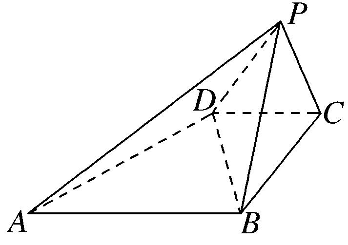

6．解析　(1)取*BC*的中点*O*，连接*PO*，∵△*PBC*为等边三角形，∴*PO*⊥*BC*．

∵平面*PBC*⊥底面*ABCD*，平面*PBC*∩底面*ABCD*＝*BC*，*PO*⊂平面*PBC*，∴*PO*⊥底面*ABCD*．

以*BC*的中点*O*为坐标原点，以*BC*所在直线为*x*轴，过点*O*与*AB*平行的直线为*y*轴，*OP*所在直线

为*z*轴，建立空间直角坐标系，如图所示．不妨设*CD*＝1，则*AB*＝*BC*＝2，*PO*＝，

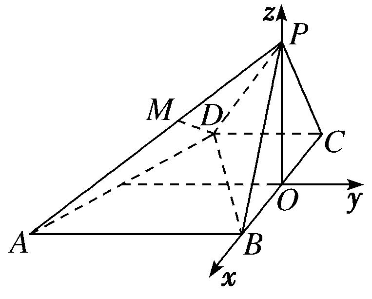

∴*A*(1，－2，0)，*B*(1，0，0)，*D*(－1，－1，0)，*P*(0，0，)，

∴＝(－2，－1，0)，＝(1，－2，－)．

∵·＝(－2)×1＋(－1)×(－2)＋0×(－)＝0，∴⊥，∴*PA*⊥*BD*．

(2)取*PA*的中点*M*，连接*DM*，则*M*．∵＝，＝(1，0，－)，

∴·＝×1＋0×0＋×(－)＝0，∴⊥，即*DM*⊥*PB*．

∵·＝×1＋0×(－2)＋×(－)＝0，∴⊥，即*DM*⊥*PA*．

又∵*PA*∩*PB*＝*P*，*PA*⊂平面*PAB*，*PB*⊂平面*PAB*，∴*DM*⊥平面*PAB*．

∵*DM*⊂平面*PAD*，∴平面*PAD*⊥平面*PAB*．

7．如图，已知<em>AA</em>1⊥平面<em>ABC</em>，<em>BB</em>1∥<em>AA</em>1，<em>AB</em>＝<em>AC</em>＝3，<em>BC</em>＝2，<em>AA</em>1＝，<em>BB</em>1＝2，点<em>E</em>和<em>F</em>分

别为<em>BC</em>和<em>A</em>1<em>C</em>的中点．

(1)求证：<em>EF</em>∥平面<em>A</em>1<em>B</em>1<em>BA</em>；

(2)求证：平面<em>AEA</em>1⊥平面<em>BCB</em>1．

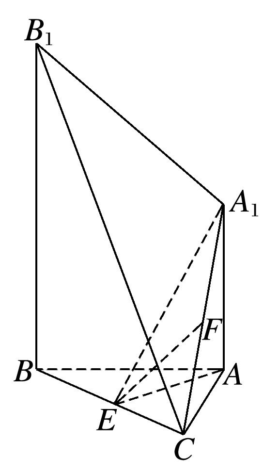

7．解析　因为<em>AB</em>＝<em>AC</em>，<em>E</em>为<em>BC</em>的中点，所以<em>AE</em>⊥<em>BC</em>．因为<em>AA</em>1⊥平面<em>ABC</em>，<em>AA</em>1∥<em>BB</em>1，

所以以过<em>E</em>作平行于<em>BB</em>1的垂线为<em>z</em>轴，<em>EC</em>，<em>EA</em>所在直线分别为<em>x</em>轴，<em>y</em>轴，建立如图所示的空间直角坐标系．

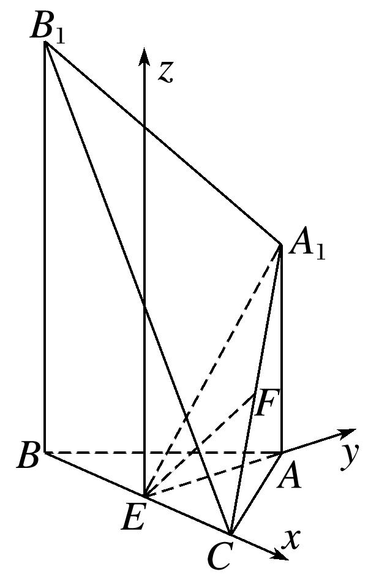

因为<em>AB</em>＝3，<em>BE</em>＝，所以<em>AE</em>＝2，所以<em>E</em>(0，0，0)，<em>C</em>(，0，0)，<em>A</em>(0，2，0)，<em>B</em>(－，0，0)，<em>B</em>1(－，0，2)．<em>A</em>1(0，2，)，则<em>F</em>．

(1)＝，＝(－，－2，0)，＝(0，0，)．

设平面<em>AA</em>1<em>B</em>1<em>B</em>的一个法向量为<em><strong>n</strong></em>＝(<em>x</em>，<em>y</em>，<em>z</em>)，则所以

取所以***n***＝(－2，，0)．

因为·***n***＝×(－2)＋1×＋×0＝0，所以⊥***n***．

又<em>EF</em>⊄平面<em>A</em>1<em>B</em>1<em>BA</em>，所以<em>EF</em>∥平面<em>A</em>1<em>B</em>1<em>BA</em>．

(2)因为<em>EC</em>⊥平面<em>AEA</em>1，所以＝(，0，0)为平面<em>AEA</em>1的一个法向量．又<em>EA</em>⊥平面<em>BCB</em>1，

所以＝(0，2，0)为平面<em>BCB</em>1的一个法向量．因为·＝0，所以⊥，

故平面<em>AEA</em>1⊥平面<em>BCB</em>1．

8．如图，在四棱锥*P*－*ABCD*中，*PA*⊥底面*ABCD*，*AD*⊥*AB*，*AB*∥*DC*，*AD*＝*DC*＝*AP*＝2，*AB*＝1，点

*E*为棱*PC*的中点．证明：

(1)*BE*⊥*DC*；

(2)*BE*∥平面*PAD*；

(3)平面*PCD*⊥平面*PAD*．

8．解析　依题意，以点*A*为原点建立空间直角坐标系(如图)，可得*B*(1，0，0)，*C*(2，2，0)，*D*(0，2，

0)，*P*(0，0，2)．由*E*为棱*PC*的中点，得*E*(1，1，1)．

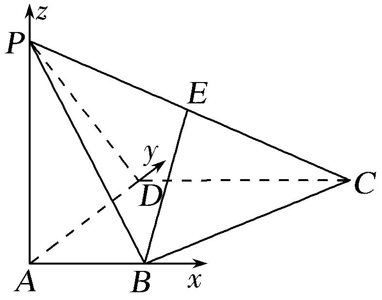

(1)向量＝(0，1，1)，＝(2，0，0)，故·＝0．所以*BE*⊥*DC*．

(2)因为*AB*⊥*AD*，又*PA*⊥平面*ABCD*，*AB*⊂平面*ABCD*，

所以*AB*⊥*PA*，*PA*∩*AD*＝*A*，*PA*，*AD*⊂平面*PAD*，所以*AB*⊥平面*PAD*，

所以向量＝(1，0，0)为平面*PAD*的一个法向量，

而·＝(0，1，1)·(1，0，0)＝0，所以*BE*⊥*AB*，

又*BE*⊄平面*PAD*，所以*BE*∥平面*PAD*．

(3)由(2)知平面*PAD*的法向量＝(1，0，0)，向量＝(0，2，－2)，＝(2，0，0)，

设平面<em>PCD</em>的法向量为<em><strong>n</strong></em>＝(<em>x</em>，<em>y</em>，<em>z</em>)，则即不妨令<em>y</em>＝1，

可得<em><strong>n</strong></em>＝(0，1，1)为平面<em>PCD</em>的一个法向量．

且***n***·＝(0，1，1)·(1，0，0)＝0，所以***n***⊥．

所以平面*PAD*⊥平面*PCD*．

