# 专题09 立体几何中的探索性问题

# 【方法总结】

# 解决立体几何中的探索性问题的途径
解决探索性问题一般先假设求解的结果存在，从这个结果出发，寻找使这个结论成立的充分条件，如果找到了使结论成立的充分条件，则存在；如果找不到使结论成立的充分条件(出现矛盾)，则不存在．而对于探求点的问题，一般是先探求点的位置，多为线段的中点或某个三等分点，然后给出符合要求的证明.

# 考点一 探究平行问题【例题选讲】

[例 1](2018·全国III)如图，矩形 ABCD 所在平面与半圆弧 $\widehat{CD}$ 所在平面垂直，M 是 $\widehat{CD}$ 上异于 C，D 的点.  
（1）证明：平面 $AMD \perp$ 平面 $BMC$ .  
（2）在线段 AM 上是否存在点 P，使得 MC // 平面 PBD？说明理由.

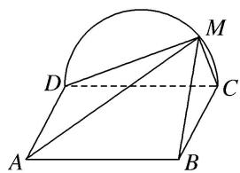

[例 2] (2019·北京)如图，在四棱锥 P-ABCD 中，PA⊥平面 ABCD，底面 ABCD 为菱形，E 为 CD 的中点.  
（1）求证： $BD \perp$ 平面 PAC;  
（2）若 $\angle ABC=60^{\circ}$ ，求证：平面 $PAB\perp$ 平面 $PAE$ ;   
（3）棱 $PB$ 上是否存在点 $F$ , 使得 $CF \parallel$ 平面 $PAE$ ? 说明理由.

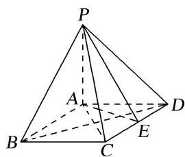

[例 3] (2016·北京)如图，在四棱锥 P-ABCD 中，PC⊥平面 ABCD， $AB \parallel DC$ ， $DC \perp AC$ .  
（1）求证： $DC \perp$ 平面 PAC.  
（2）求证：平面 $PAB \perp$ 平面 PAC.  
（3）设点 E 为 AB 的中点，在棱 PB 上是否存在点 F，使得 PA // 平面 CEF? 说明理由.

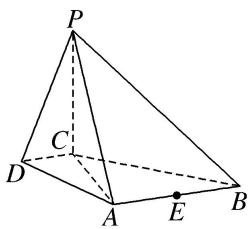

[例 4] (2014·四川)在如图所示的多面体中，四边形 $ABB_{1}A_{1}$ 和 $ACC_{1}A_{1}$ 都为矩形.  
（1）若 $AC \perp BC$ ，证明：直线 $BC \perp$ 平面 $ACC_{1}A_{1}$ ;  
（2）设 $D$ ， $E$ 分别是线段 $BC$ ， $CC_{1}$ 的中点，在线段 $AB$ 上是否存在一点 $M$ ，使直线 $DE / /$ 平面 $A_{1}MC?$ 请证明你的结论.

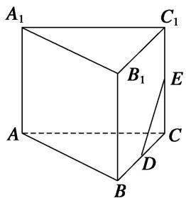

[例 5]如图，在四棱锥 P—ABCD 中， $\triangle PAD$ 为正三角形，平面 $PAD \perp$ 平面 ABCD， $AB \parallel CD$ ， $AB \perp AD$ ， $CD = 2AB = 2AD = 4$ .  
（1）求证：平面 $PCD \perp$ 平面 PAD;  
（2）求三棱锥 P—ABC 的体积;  
（3）在棱 $PC$ 上是否存在点 $E$ , 使得 $BE \parallel$ 平面 $PAD$ ? 若存在, 请确定点 $E$ 的位置并证明; 若不存在, 请说明理由.

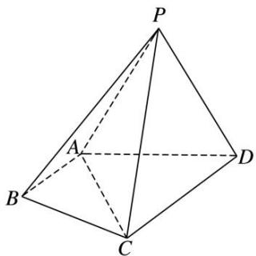

[例6]如图1，已知菱形AECD的对角线 $AC$ ，DE交于点 $F$ ，点 $E$ 为 $AB$ 中点．将 $\triangle ADE$ 沿线段 $DE$ 折起到 $\triangle PDE$ 的位置，如图2所示.  
（1）求证： $DE \perp$ 平面 PCF;  
（2）求证：平面 $PBC \perp$ 平面 PCF;  
（3）在线段 $PD$ ， $BC$ 上是否分别存在点 $M$ ， $N$ ，使得平面 $CFM \parallel$ 平面 $PEN$ ？若存在，请指出点 $M$ ， $N$ 的位置，并证明；若不存在，请说明理由。
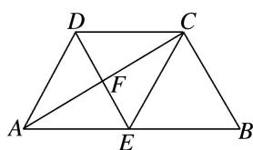

图1

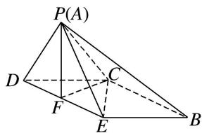

图2

# 【对点训练】

1. (2016·四川)如图，在四棱锥 P-ABCD 中， $PA \perp CD$ ， $AD \parallel BC$ ， $\angle ADC = \angle PAB = 90^{\circ}$ ， $BC = CD = \frac{1}{2} AD$ .  
（1）在平面 PAD 内找一点 M，使得直线 CM// 平面 PAB，并说明理由；  
（2）证明：平面 $PAB \perp$ 平面 PBD.

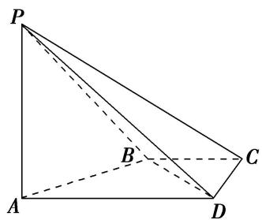

2. 如图，在四棱锥 $P - ABCD$ 中，底面 $ABCD$ 为梯形， $AB \parallel CD$ ， $AB \perp BC$ ， $AB = 2$ ， $PA = PD = CD = BC = 1$ ，而 $PAD \perp$ 面 $ABCD$ ， $E$ 为 $AD$ 的中点.  
（1）求证： $PA \perp BD;$  
（2）在线段 $AB$ 上是否存在一点 $G$ , 使得 $BC \parallel$ 面 $PEG$ ? 若存在, 请证明你的结论; 若不存在, 请说明理由.

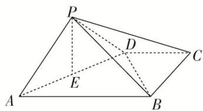

3. 如图，在四棱锥 $P - ABCD$ 中， $PD \perp$ 平面 $ABCD$ ，底面 $ABCD$ 为正方形， $BC = PD = 2$ ， $E$ 为 $PC$ 的中点， $CB = 3CG$ .  
（1）求证： $PC \perp BC;$  
（2）AD 边上是否存在一点 M，使得 PA// 平面 MEG？若存在，求出 AM 的长；若不存在，请说明理由.

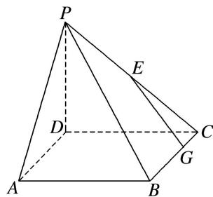

4. 在四棱锥 $P - ABCD$ 中，底面 $ABCD$ 是边长为 6 的菱形，且 $\angle ABC = 60^{\circ}$ ， $PA \perp$ 平面 $ABCD$ ， $PA = 6$ ， $F$ 是棱 $PA$ 上的一动点， $E$ 为 $PD$ 的中点.  
（1）求证：平面 $BDF \perp$ 平面 $ACF$ :  
（2）若 $AF = 2$ ，侧面 PAD 内是否存在过点 $E$ 的一条直线，使得直线上任一点 $M$ 都有 $CM \parallel$ 平面 BDF，若存在，给出证明；若不存在，请说明理由。

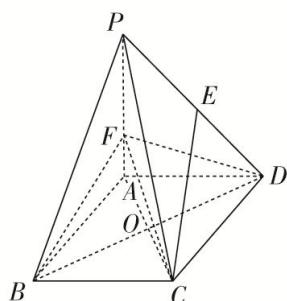

5. 如图，四棱锥 $P - ABCD$ 中， $PD \perp$ 平面 $ABCD$ ，底面 $ABCD$ 为矩形， $PD = DC = 4$ ， $AD = 2$ ， $E$ 为 $PC$ 的中点.  
（1）求三棱锥 A—PDE 的体积;  
（2）AC 边上是否存在一点 M，使得 PA// 平面 EDM？若存在，求出 AM 的长；若不存在，请说明理由.

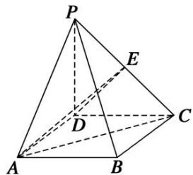

6. 如图, 在四棱锥 $S - ABCD$ 中, 已知底面 $ABCD$ 为直角梯形, 其中 $AD \parallel BC$ , $\angle BAD = 90^{\circ}$ , $SA \perp$ 底面
$A B C D, S A = A B = B C = 2. \tan \angle S D A = \frac {2}{3}.$  
（1）求四棱锥 S-ABCD 的体积;  
（2）在棱 SD 上找一点 E，使 $CE \parallel$ 平面 SAB，并证明.

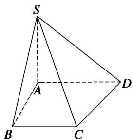

7. 如图, 四棱锥 $P - ABCD$ 的底面 $ABCD$ 是圆内接四边形(记此圆为 $W$ ), 且 $PA \perp$ 平面 $ABCD$ .  
（1）当 $BD$ 是圆 $W$ 的直径时， $PA = BD = 2$ ， $AD = CD = \sqrt{3}$ ，求四棱锥 $P - ABCD$ 的体积.  
（2）在（1）的条件下，判断在棱 $PA$ 上是否存在一点 $Q$ ，使得 $BQ \parallel$ 平面 $PCD$ ？若存在，求出 $AQ$ 的长；若不存在，请说明理由.

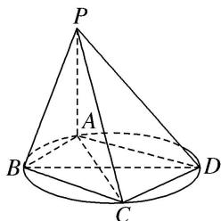

8. 如图，在四棱锥 $P - ABCD$ 中， $AB \parallel CD$ ， $AB = 2CD$ ， $E$ 为 $PB$ 的中点.  
（1）求证： $CE \parallel$ 平面 PAD;  
（2）在线段 $AB$ 上是否存在一点 $F$ , 使得平面 $PAD \parallel$ 平面 $CEF$ ? 若存在, 证明你的结论, 若不存在, 请说明理由.

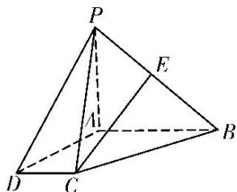

9. 如图，在直四棱柱 $ABCD-A_{1}B_{1}C_{1}D_{1}$ 中，已知 $DC=DD_{1}=2AD=2AB, AD\perp DC, AB\parallel DC.$  
（1）求证： $D_{1}C \perp AC_{1}$ ;  
（2）问在棱 $CD$ 上是否存在点 $E$ , 使 $D_{1}E \parallel$ 平面 $A_{1}BD$ . 若存在, 确定点 $E$ 位置; 若不存在, 说明理由.

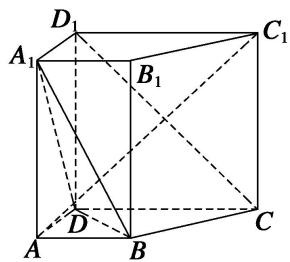

10. 如图，在多面体 $ABCDEF$ 中，四边形 $ABCD$ 是梯形， $AB \parallel CD$ ， $AD = DC = CB = a$ ， $\angle ABC = 60^\circ$ ，四边形 $ACFE$ 是矩形，且平面 $ACFE \perp$ 平面 $ABCD$ ，点 $M$ 在线段 $EF$ 上.  
（1）求证： $BC \perp$ 平面 ACFE;  
（2）当 EM 为何值时， $AM \parallel$ 平面 BDF？证明你的结论.

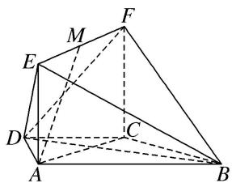

11. 如图 1, 在矩形 $ABCD$ 中, $AB = 4$ , $AD = 2$ , $E$ 是 $CD$ 的中点, 将 $\triangle ADE$ 沿 $AE$ 折起, 得到如图 2 所示的四棱锥 $D_{1} - ABCE$ , 其中平面 $D_{1}AE \perp$ 平面 $ABCE$ .  
（1）证明： $BE \perp$ 平面 $D_{1}AE$ ;  
（2）设 F 为 $CD_{1}$ 的中点，在线段 AB 上是否存在一点 M，使得 $MF \parallel$ 平面 $D_{1}AE$ ，若存在，求出 $\frac{AM}{AB}$ 的值；若不存在，请说明理由.
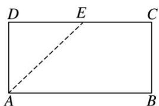

图1

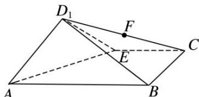

图2

12. 如图（1），在正 $\triangle ABC$ 中， $E, F$ 分别是 $AB, AC$ 边上的点，且 $BE = AF = 2CF$ 。点 $P$ 为边 $BC$ 上的点，将 $\triangle AEF$ 沿 $EF$ 折起到 $\triangle A_{1}EF$ 的位置，使平面 $A_{1}EF \perp$ 平面 $BEFC$ ，连接 $A_{1}B, A_{1}P, EP$ ，如图（2）所示。  
（1）求证： $A_{1}E \perp FP;$   
（2）若 BP=BE，点 K 为棱 $A_{1}F$ 的中点，则在平面 $A_{1}FP$ 上是否存在过点 K 的直线与平面 $A_{1}BE$ 平行，若存在，请给予证明；若不存在，请说明理由.
> 

> 
> | 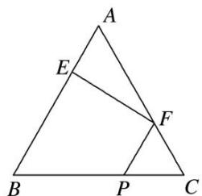 | 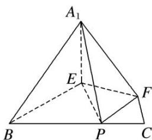 |
> | --- | --- |
> | （1） | （2） |
> 

# 考点二 探究垂直问题【例题选讲】

[例 1]如图所示，平面 $ABCD \perp$ 平面 BCE，四边形 ABCD 为矩形，BC = CE，点 F 为 CE 的中点.  
（1）证明：AE//平面 BDF;  
（2）点 M 为 CD 上任意一点，在线段 AE 上是否存在点 P，使得 $PM \perp BE$ ？若存在，确定点 P 的位置，

并加以证明；若不存在，请说明理由.

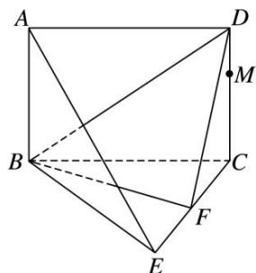

[例2]在四棱锥 $E - ABCD$ 中，底面ABCD是正方形，AC与BD交于点O，EC⊥底面ABCD，点F为BE的中点.  
（1）求证： $DE \parallel$ 平面 ACF;  
（2）若 $AB = \sqrt{2} CE$ ，在线段 $EO$ 上是否存在点 $G$ ，使 $CG \perp$ 平面 $BDE$ ？若存在，求出 $\frac{EG}{EO}$ 的值；若不存在，请说明理由.

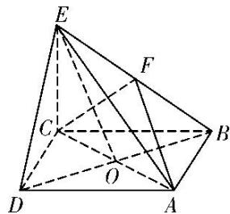

[例3]如图（1），在 $\mathrm{Rt}\triangle ABC$ 中， $\angle C = 90^{\circ}$ ， $D$ ， $E$ 分别为 $AC$ ， $AB$ 的中点，点 $F$ 为线段 $CD$ 上的一点，将 $\triangle ADE$ 沿 $DE$ 折起到 $\triangle A_{1}DE$ 的位置，使 $A_{1}F \perp CD$ ，如图（2）.  
（1）求证： $DE \parallel$ 平面 $A_{1}CB$ ;  
（2）求证： $A_{1}F \perp BE;$  
（3）线段 $A_{1}B$ 上是否存在点 Q，使 $A_{1}C \perp$ 平面 DEQ？请说明理由.
> 

> 
> | 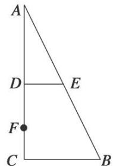 | 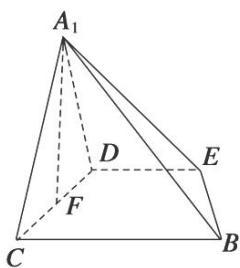 |
> | --- | --- |
> | （1） | （2） |
> 

[例 4]如图，在三棱柱 $ABC-A_{1}B_{1}C_{1}$ 中，侧棱 $AA_{1}\perp$ 底面 ABC，M 为棱 AC 的中点．AB=BC，AC=2， $AA_{1}=\sqrt{2}$ .  
（1）求证： $B_{1}C \parallel$ 平面 $A_{1}BM;$  
（2）求证： $AC_{1} \perp$ 平面 $A_{1}BM$ ;  
（3）在棱 $BB_{1}$ 上是否存在点 $N$ ，使得平面 $AC_{1}N \perp$ 平面 $AA_{1}C_{1}C$ ？如果存在，求此时 $\frac{BN}{BB_{1}}$ 的值；如果不存在，请说明理由。

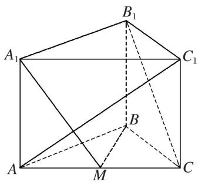

# 【对点训练】

1. 如图，三棱锥 P-ABC 中，PA⊥平面 ABC，PA=1，AB=1，AC=2， $\angle BAC=60^{\circ}$  
（1）求三棱锥 P-ABC 的体积;  
（2）在线段 $PC$ 上是否存在点 $M$ , 使得 $AC \perp BM$ , 若存在, 请说明理由, 并求 $\frac{PM}{MC}$ 的值.

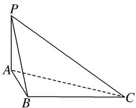

2. 如图所示, 已知长方体 $ABCD - A_{1}B_{1}C_{1}D_{1}$ , 点 $O_{1}$ 为 $B_{1}D_{1}$ 的中点.  
（1）求证： $AB_{1} \parallel$ 平面 $A_{1}O_{1}D$ ;  
（2）若 $AB=\frac{2}{3}AA_{1}$ ，在线段 $BB_{1}$ 上是否存在点 E 使得 $A_{1}C\perp AE$ ？若存在，求出 $\frac{BE}{BB_{1}}$ ；若不存在，说明理由.

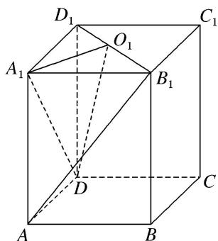

3. 如图，已知三棱柱 $ABC - A'B'C'$ 的侧棱垂直于底面， $AB = AC$ ， $\angle BAC = 90^\circ$ ，点 $M, N$ 分别为 $A'B$ 和 $B'C'$ 的中点.  
（1）证明： $MN \parallel$ 平面 $AA'C'C;$  
（2）设 $AB=\lambda AA'$ ，当 $\lambda$ 为何值时， $CN\perp$ 平面 $A'MN$ ，试证明你的结论.

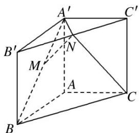

4. 如图，在四棱锥 $P - ABCD$ 中， $ABCD$ 是正方形， $PD \perp$ 平面 $ABCD$ . $PD = AB = 2, E, F, G$ 分别是 $PC, PD, BC$ 的中点.  
（1）求证：平面 $PAB \parallel$ 平面 EFG;  
（2）在线段 $PB$ 上确定一点 $Q$ , 使 $PC \perp$ 平面 $ADQ$ , 并给出证明.

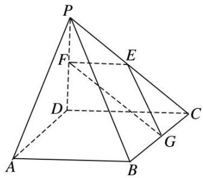

6. 如图，在四棱锥 $P - ABCD$ 中，底面 $ABCD$ 是 $\angle DAB = 60^{\circ}$ 且边长为 $a$ 的菱形，侧面 $PAD$ 为正三角形，其所在平面垂直于底面 $ABCD$ ，若 $G$ 为 $AD$ 的中点.  
（1）求证： $BG \perp$ 平面 PAD;  
（2）求证： $AD \perp PB$ ;  
（3）若 E 为 BC 边的中点，能否在棱 PC 上找到一点 F，使平面 DEF⊥平面 ABCD？并证明你的结论.

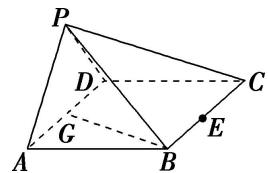

7. 如图，四棱锥 $P - ABCD$ 中，底面 $ABCD$ 是边长为 2 的菱形， $\angle BAD = \frac{\pi}{3}$ ， $\triangle PAD$ 是等边三角形， $F$ 为 $AD$ 的中点， $PD \perp BF$ .  
（1）求证： $AD \perp PB$ ;  
（2）若 E 在线段 BC 上，且 $EC=\frac{1}{4}BC$ ，能否在棱 PC 上找到一点 G，使平面 $DEG \perp$ 平面 ABCD？若存在，求出三棱锥 D-CEG 的体积；若不存在，请说明理由.

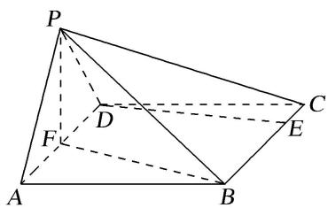

8. 如图，在四棱锥 $P - ABCD$ 中， $PC = AD = CD = \frac{1}{2} AB = 2$ ， $AB // DC$ ， $AD \perp CD$ ， $PC \perp$ 平面 $ABCD$ .  
（1）求证： $BC \perp$ 平面 PAC;  
（2）若 M 为线段 PA 的中点，且过 C, D, M 三点的平面与线段 PB 交于点 N，确定点 N 的位置，说明理由：并求三棱锥 A—CMN 的高.

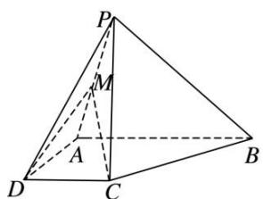

# 考点三 探究距离与体积问题【例题选讲】

[例 1]如图所示，圆柱的高为2，点A，B，C，D分别是圆柱下底面圆周上的点，ABCD为矩形，PA是圆柱的母线，AB=2，BC=4，E，F，G分别是线段PA，PD，CD的中点.  
（1）求证：平面 $PDC \perp$ 平面 PAD;  
（2）求证：PB//平面 EFG;  
（3）在线段 BC 上是否存在一点 M，使得 D 到平面 PAM 的距离为 2？若存在，求出 BM；若不存在，请说明理由.

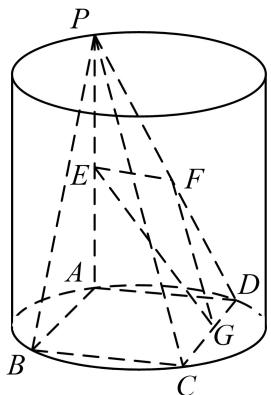

[例 2]如图，在四棱锥 P—ABCD 中，PA⊥底面 ABCD，AD⊥AB，DC∥AB，PA=1，AB=2，PD=BC = $\sqrt{2}$ .  
（1）求证：平面 PAD⊥平面 PCD;  
（2）试在棱 $PB$ 上确定一点 $E$ , 使截面 $AEC$ 把该几何体分成的两部分 $PDCEA$ 与 $EACB$ 的体积比为 $2:1$ .

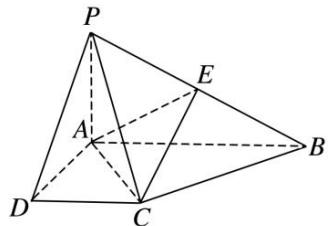

[例 3]如图，在正三棱柱 $ABC-A_{1}B_{1}C_{1}$ 中，D，E 分别为 AB，BC 的中点.  
（1）若 F 为 $BB_{1}$ 的中点，判断 $AC_{1}$ 与平面 DEF 是否平行？若平行，请给予证明，若不平行，说明理由；  
（2）试问：在侧棱 $BB_{1}$ 上是否存在点 F，使三棱锥 F-DEB 的体积与三棱柱 $ABC-A_{1}B_{1}C_{1}$ 的体积之比为 $\frac{1}{8}$ .

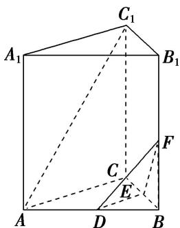

[例 4]如图①，在四边形 ABCD 中，AD=CD=2， $AC=2\sqrt{2}$ ， $\triangle ABC$ 是等边三角形，F 为线段 AC 的中点．将 $\triangle ADC$ 沿 AC 折起，使平面 $ADC\perp$ 平面 ABC，得到几何体 D-ABC，如图②所示.  
（1）求证： $AC \perp BD;$  
（2）试问：在线段 BC 上是否存在一点 E，使得 $\frac{V_{C-DFE}}{V_{C-DBA}} = \frac{1}{4}$ ？若存在，请求出点 E 的位置；若不存在，请说明理由.

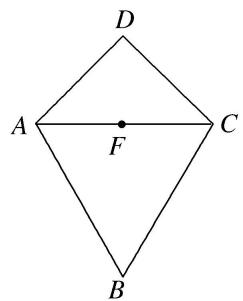

图①

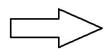

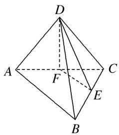

图②

