# 专题09 立体几何中的探索性问题

# 【方法总结】

# 解决立体几何中的探索性问题的途径

解决探索性问题一般先假设求解的结果存在，从这个结果出发，寻找使这个结论成立的充分条件，如果找到了使结论成立的充分条件，则存在；如果找不到使结论成立的充分条件(出现矛盾)，则不存在．而对于探求点的问题，一般是先探求点的位置，多为线段的中点或某个三等分点，然后给出符合要求的证明.

# 考点一 探究平行问题

# 【例题选讲】

[例 1](2018·全国III)如图，矩形 ABCD 所在平面与半圆弧 $\widehat{CD}$ 所在平面垂直，M 是 $\widehat{CD}$ 上异于 C，D 的点.

(1)证明：平面 $AMD \perp$ 平面 BMC.  
(2)在线段 AM 上是否存在点 P，使得 MC// 平面 PBD？说明理由.

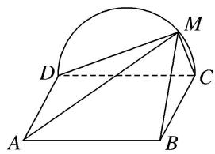

text_image

Geometric diagram with labeled points A, B, C, D, M and a semicircle, showing triangles and line segments

解析 (1)由题设知，平面 $CMD \perp$ 平面 ABCD，交线为 CD.

因为 $BC \perp CD$ ， $BC \subset$ 平面 ABCD，所以 $BC \perp$ 平面 CMD，所以 $BC \perp DM$ .

因为 M 为 $\widehat{CD}$ 上异于 C, D 的点，且 DC 为直径，所以 $DM \perp CM$ .

又 $BC \cap CM = C$ ，所以 $DM \perp$ 平面 BMC。因为 $DM \subset$ 平面 AMD，所以平面 $AMD \perp$ 平面 BMC。

(2)当 P 为 AM 的中点时，MC// 平面 PBD．证明如下：

text_image

Geometric diagram with labeled points and lines, including a semicircle and quadrilateral ABCD with auxiliary points O and P.

连接 AC 交 BD 于 O. 因为四边形 ABCD 为矩形，所以 O 为 AC 的中点.

连接 OP，因为 P 为 AM 的中点，所以 MC // OP.

又 $MC \not\subset$ 平面 PBD， $OP \subset$ 平面 PBD，所以 $MC \parallel$ 平面 PBD.

[例 2] (2019·北京)如图，在四棱锥 P-ABCD 中，PA⊥平面 ABCD，底面 ABCD 为菱形，E 为 CD 的中点.

(1)求证： $BD \perp$ 平面 PAC;  
(2)若 $\angle ABC=60^{\circ}$ ，求证：平面 $PAB\perp$ 平面 $PAE$ ;   
(3)棱 $PB$ 上是否存在点 $F$ , 使得 $CF \parallel$ 平面 $PAE$ ? 说明理由.

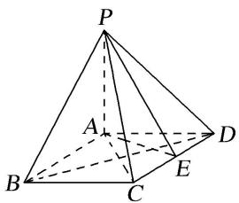

text_image

P
A
B
C
D
E

解析 (1)因为 $PA \perp$ 平面 $ABCD$ , $BD \subset$ 平面 $ABCD$ , 所以 $PA \perp BD$ .

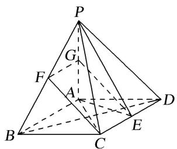

text_image

Geometric diagram of a pyramid with labeled vertices and internal points, used in spatial geometry problems.

因为底面 ABCD 为菱形，所以 $BD \perp AC$ 。又 $PA \cap AC = A$ ，所以 $BD \perp$ 平面 PAC。

(2)因为 $PA \perp$ 平面 ABCD， $AE \subset$ 平面 ABCD，所以 $PA \perp AE$ .

因为底面 ABCD 为菱形， $\angle ABC=60^{\circ}$ ，且 E 为 CD 的中点，

所以 $AE \perp CD$ 。又因为 $AB \parallel CD$ ，所以 $AB \perp AE$ 。又 $AB \cap PA = A$ ，所以 $AE \perp$ 平面 PAB。

因为 $AE \subset$ 平面 PAE，所以平面 $PAB \perp$ 平面 PAE.

(3)棱 $PB$ 上存在点 $F$ , 使得 $CF \parallel$ 平面 $PAE$ . 理由如下:

取 PB 的中点 F, PA 的中点 G, 连接 CF, FG, EG, 则 $FG \parallel AB$ , 且 $FG = \frac{1}{2} AB$ .

因为底面 ABCD 为菱形，且 E 为 CD 的中点，所以 $CE \parallel AB$ ，且 $CE = \frac{1}{2} AB$ .

所以 $FG \parallel CE$ ，且 FG = CE。所以四边形 CEGF 为平行四边形。所以 $CF \parallel EG$ 。

因为 $CF \not\subset$ 平面 PAE， $EG \subset$ 平面 PAE，所以 $CF \parallel$ 平面 PAE.

[例 3] (2016·北京)如图，在四棱锥 P-ABCD 中，PC⊥平面 ABCD， $AB \parallel DC$ ， $DC \perp AC$ .

(1)求证： $DC \perp$ 平面 PAC.

(2)求证：平面 $PAB \perp$ 平面 PAC.

(3)设点 E 为 AB 的中点，在棱 PB 上是否存在点 F，使得 PA // 平面 CEF？说明理由.

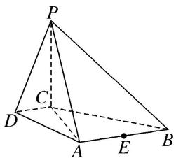

text_image

P
C
D
A
E
B

解析 (1) 因为 $PC \perp$ 平面 $ABCD$ , 所以 $PC \perp DC$ .

又因为 $DC \perp AC$ ，且 $PC \cap AC = C$ ，所以 $DC \perp$ 平面 PAC.

(2)因为 $AB \parallel DC$ ， $DC \perp AC$ ，所以 $AB \perp AC$ 。因为 $PC \perp$ 平面 ABCD，所以 $PC \perp AB$ 。

又因为 $PC \cap AC = C$ ，所以 $AB \perp$ 平面 PAC。又 $AB \subset$ 平面 PAB，所以平面 $PAB \perp$ 平面 PAC。

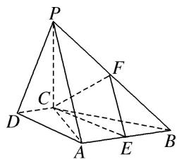

text_image

Geometric diagram of a pyramid with labeled vertices and internal points, used for spatial geometry problems.

(3)棱 $PB$ 上存在点 $F$ , 使得 $PA \parallel$ 平面 $CEF$ . 理由如下:

取 $PB$ 的中点 $F$ , 连接 $EF$ , $CE$ , $CF$ . 因为 $E$ 为 $AB$ 的中点, 所以 $EF \parallel PA$ .

又因为 $PA \not\subset$ 平面 CEF，且 $EF \subset$ 平面 CEF，所以 $PA \parallel$ 平面 CEF.

[例 4] (2014·四川)在如图所示的多面体中，四边形 $ABB_{1}A_{1}$ 和 $ACC_{1}A_{1}$ 都为矩形.

(1)若 $AC \perp BC$ ，证明：直线 $BC \perp$ 平面 $ACC_{1}A_{1}$ ;

(2)设 D, E 分别是线段 BC, $CC_{1}$ 的中点，在线段 AB 上是否存在一点 M，使直线 DE // 平面 $A_{1}MC$ ? 请证明你的结论.

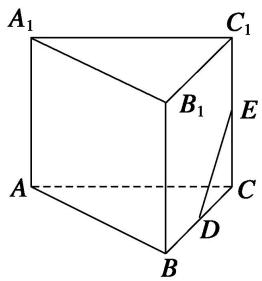

text_image

A₁
C₁
B₁
E
A
C
D
B

解析 (1)因为四边形 $ABB_{1}A_{1}$ 和 $ACC_{1}A_{1}$ 都是矩形，所以 $AA_{1} \perp AB, AA_{1} \perp AC.$

因为 AB, AC 为平面 ABC 内两条相交的直线，所以 $AA_{1} \perp$ 平面 ABC.

因为直线 $BC \subset$ 平面 ABC，所以 $AA_{1} \perp BC$ .

又由已知， $AC \perp BC$ ， $AA_{1}$ 和 AC 为平面 $ACC_{1}A_{1}$ 内两条相交的直线，所以 $BC \perp$ 平面 $ACC_{1}A_{1}$ .

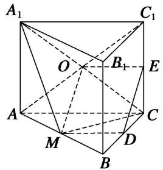

text_image

A₁
C₁
O
B₁
E
A
C
M
D
B

(2)取线段 AB 的中点 M，连接 $A_{1}M$ ，MC， $A_{1}C$ ， $AC_{1}$ ，设点 O 为 $A_{1}C$ ， $AC_{1}$ 的交点.

由已知，点 O 为 $AC_{1}$ 的中点．连接 MD，OE，则 MD，OE 分别为 $\triangle ABC$ ， $\triangle ACC_{1}$ 的中位线，

所以 $MD \parallel \frac{1}{2} AC, OE \parallel \frac{1}{2} AC$ ，因此 MD 納 OE。连接 OM，从而四边形 MDEO 为平行四边形，则 DE // MO。

因为直线 $DE \not\subset$ 平面 $A_{1}MC$ ， $MO \subset$ 平面 $A_{1}MC$ ，所以直线 $DE \parallel$ 平面 $A_{1}MC$ .

即线段 AB 上存在一点 M(线段 AB 的中点)，使直线 DE // 平面 $A_{1}MC$ .

[例 5]如图，在四棱锥 P—ABCD 中， $\triangle PAD$ 为正三角形，平面 $PAD \perp$ 平面 ABCD， $AB \parallel CD$ ， $AB \perp AD$ ， $CD = 2AB = 2AD = 4$ .

(1)求证：平面 $PCD \perp$ 平面 PAD;

(2)求三棱锥 P—ABC 的体积;

(3)在棱 $PC$ 上是否存在点 $E$ , 使得 $BE \parallel$ 平面 $PAD$ ? 若存在, 请确定点 $E$ 的位置并证明; 若不存在, 请说明理由.

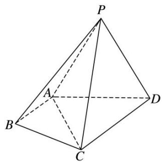

text_image

P
A
B
C
D

解析 (1) 因为 $AB \parallel CD$ , $AB \perp AD$ , 所以 $CD \perp AD$ .

因为平面 $PAD \perp$ 平面 ABCD，平面 $PAD \cap$ 平面 ABCD = AD，所以 $CD \perp$ 平面 PAD.

因为 $CD \subset$ 平面 PCD，所以平面 $PCD \perp$ 平面 PAD.

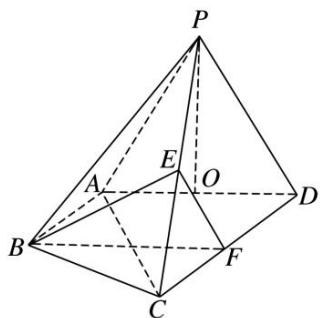

text_image

Geometric diagram of a pyramid with labeled vertices and internal points, used for spatial geometry problems.

(2)取 AD 的中点 O，连接 PO．因为 $\triangle PAD$ 为正三角形，所以 $PO \perp AD$ .

因为平面 $PAD \perp$ 平面 $ABCD$ ，平面 $PAD \cap$ 平面 $ABCD = AD$ ， $PO \subset$ 平面 $PAD$ ，

所以 $PO \perp$ 平面 ABCD，所以 PO 为三棱锥 P—ABC 的高.

因为 $\triangle PAD$ 为正三角形， $CD=2AB=2AD=4$ ，所以 $PO=\sqrt{3}$ .

所以 $V_{三棱锥 P-ABC}=\frac{1}{3}S_{\triangle ABC}\cdot PO=\frac{1}{3}\times\frac{1}{2}\times2\times2\times\sqrt{3}=\frac{2\sqrt{3}}{3}.$

(3)在棱 $PC$ 上存在点 $E$ , 当 $E$ 为 $PC$ 的中点时, $BE \parallel$ 平面 $PAD$ .

分别取 CP, CD 的中点 E, F, 连接 BE, BF, EF, 所以 $EF \parallel PD$ . 因为 $AB \parallel CD$ , CD = 2AB,

所以 $AB \parallel FD$ ， $AB = FD$ ，所以四边形 $ABFD$ 为平行四边形，所以 $BF \parallel AD$

因为 $BF \cap EF = F, AD \cap PD = D$ , 所以平面 $BEF //$ 平面 $PAD$ . 因为 $BE \subset$ 平面 $BEF$ , 所以 $BE //$ 平面 $PAD$ .

[例 6]如图 1, 已知菱形 $AECD$ 的对角线 $AC$ , $DE$ 交于点 $F$ , 点 $E$ 为 $AB$ 中点. 将 $\triangle ADE$ 沿线段 $DE$ 折起到 $\triangle PDE$ 的位置, 如图 2 所示.

(1)求证： $DE \perp$ 平面 PCF:  
(2)求证：平面 $PBC \perp$ 平面 $PCF$ ;  
(3)在线段 $PD$ ， $BC$ 上是否分别存在点 $M$ ， $N$ ，使得平面 $CFM \parallel$ 平面 $PEN$ ？若存在，请指出点 $M$ ， $N$ 的位置，并证明；若不存在，请说明理由。

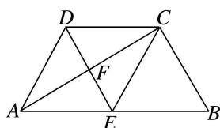

text_image

Geometric diagram of a trapezoid with labeled vertices and internal points, showing diagonals and segments.

图1

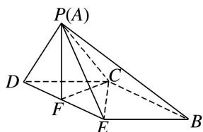

text_image

P(A)
D
C
F
E
B

图2

解析 (1)折叠前, 因为四边形 $AECD$ 为菱形, 所以 $AC \perp DE$ , 所以折叠后, $DE \perp PF$ , $DE \perp CF$ , 又 $PF \cap CF = F$ , $PF$ , $CF \subset$ 平面 $PCF$ , 所以 $DE \perp$ 平面 $PCF$ .

(2)因为四边形 AECD 为菱形，所以 DC // AE，DC = AE.

又点 E 为 AB 的中点，所以 DC // EB，DC = EB，所以四边形 DEBC 为平行四边形，所以 CB // DE.

又由(1)得， $DE \perp$ 平面 PCF，所以 $CB \perp$ 平面 PCF。因为 $CB \subset$ 平面 PBC，所以平面 $PBC \perp$ 平面 PCF。

(3)存在满足条件的点 $M, N$ , 且 $M, N$ 分别是 $PD$ 和 $BC$ 的中点.

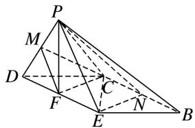

text_image

Geometric diagram of a pyramid with labeled vertices and internal points, used in spatial geometry problems.

如图，分别取 $PD$ 和 $BC$ 的中点 $M, N$ . 连接 $EN, PN, MF, CM$ .

因为四边形 DEBC 为平行四边形，所以 $EF \parallel CN$ ， $EF = \frac{1}{2} BC = CN$ ，

所以四边形 ENCF 为平行四边形，所以 FC // EN.

在 $\triangle PDE$ 中， $M, F$ 分别为 $PD, DE$ 的中点，所以 $MF \parallel PE$ .

又 $EN, PE \subset$ 平面 $PEN, PE \cap EN = E, MF, CF \subset$ 平面 $CFM, MF \cap CF = F,$

所以平面 CFM// 平面 PEN.

# 【对点训练】

1. (2016·四川)如图，在四棱锥 P-ABCD 中， $PA \perp CD$ ， $AD \parallel BC$ ， $\angle ADC = \angle PAB = 90^{\circ}$ ， $BC = CD = \frac{1}{2} AD$ .

(1)在平面 PAD 内找一点 M，使得直线 CM// 平面 PAB，并说明理由：

(2)证明：平面 $PAB \perp$ 平面 PBD.

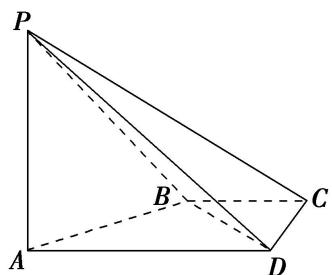

text_image

P
B
C
A
D

1. 解析 (1)取棱 $AD$ 的中点 $M(M \in$ 平面 $PAD)$ ，点 $M$ 即为所求的一个点，理由如下：

因为 $AD \parallel BC$ ， $BC = \frac{1}{2} AD$ ，所以 $BC \parallel AM$ ，且 BC = AM，所以四边形 AMCB 是平行四边形，从而 $CM \parallel AB$ 。又 $AB \subset$ 平面 PAB， $CM \not\subset$ 平面 PAB，所以 $CM \parallel$ 平面 PAB。

(说明：取棱 $PD$ 的中点 $N$ ，则所找的点可以是直线 $MN$ 上任意一点)

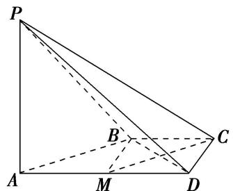

text_image

P
B
C
A
M
D

(2)由已知， $PA \perp AB$ ， $PA \perp CD$ ，因为 $AD \parallel BC$ ， $BC = \frac{1}{2} AD$ ，所以直线 AB 与 CD 相交.

所以 $PA \perp$ 平面 ABCD，从而 $PA \perp BD$ ．连接 BM，因为 $AD \parallel BC, BC = \frac{1}{2} AD$ ，

所以 $BC \parallel MD$ ，且 $BC = MD$ 。所以四边形 $BCDM$ 是平行四边形。

所以 $BM = CD = \frac{1}{2} AD$ ，所以 $BD \perp AB$ 。又 $AB \cap AP = A$ ，所以 $BD \perp$ 平面 PAB。又 $BD \subset$ 平面 PBD，所以平面 $PAB \perp$ 平面 PBD。

2. 如图，在四棱锥 $P - ABCD$ 中，底面 $ABCD$ 为梯形， $AB \parallel CD$ ， $AB \perp BC$ ， $AB = 2$ ， $PA = PD = CD = BC = 1$ ，面 $PAD \perp$ 面 $ABCD$ ， $E$ 为 $AD$ 的中点.

(1)求证： $PA \perp BD;$

(2)在线段 $AB$ 上是否存在一点 $G$ , 使得 $BC \parallel$ 面 $PEG$ ? 若存在, 请证明你的结论; 若不存在, 请说明理由.

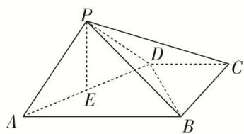

text_image

Geometric diagram of a triangular pyramid with labeled vertices and internal points

2. 解析 (1)取 $AB$ 的中点 $F$ , 连接 $DF$ . $\because DC \parallel AB$ 且 $DC = \frac{1}{2} AB$ , $\therefore DC \parallel BF$ 且 $DC = BF$ ,

∴四边形BCDF为平行四边形，又 $AB \perp BC$ ，BC=CD=1，∴四边形BCDF为正方形.

在 Rt△AFD 中，∵DF=AF=1，∴AD= $\sqrt{2}$ ，在 Rt△BCD 中，∵BC=CD=1，∴BD= $\sqrt{2}$ ，

$\because AB = 2, \therefore AD^{2} + BD^{2} = AB^{2}, \therefore BD \perp AD.$

$\because BD \subseteq$ 面 ${ABCD}$ ,面 ${PAD} \cap$ 面 ${ABCD} = {AD}$ ,面 ${PAD} \bot$ 面 ${ABCD}$ ,

$\therefore BD \perp$ 面 PAD, $\because PA \subseteq$ 面 PAD, $\therefore PA \perp BD.$

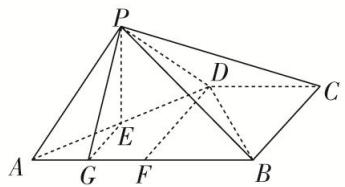

text_image

Geometric diagram of a pyramid with labeled vertices and internal points, showing solid and dashed edges for spatial relationships.

(2)在线段 AB 上存在一点 G，满足 $AG=\frac{1}{4}AB$ ，即 G 为 AF 的中点时，BC // 面 PEG，证明如下：

连接 $EG$ ， $\because E$ 为 $AD$ 的中点， $G$ 为 $AF$ 中点， $\therefore GE \parallel DF$

又 $DF \parallel BC$ ，∴ $GE \parallel BC$ ，∵ $GE \subset$ 面PEG， $BC \notin$ 面PEG，∴ $BC \parallel$ 面PEG.

3. 如图，在四棱锥 $P - ABCD$ 中， $PD \perp$ 平面 $ABCD$ ，底面 $ABCD$ 为正方形， $BC = PD = 2$ ， $E$ 为 $PC$ 的中点， $CB = 3CG$ .

(1)求证： $PC \perp BC$ ;

(2)AD 边上是否存在一点 M，使得 PA// 平面 MEG？若存在，求出 AM 的长；若不存在，请说明理由.

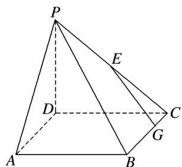

text_image

P
E
D
C
G
A
B

3. 解析 (1) 因为 $PD \perp$ 平面 $ABCD$ , $BC \subset$ 平面 $ABCD$ , 所以 $PD \perp BC$ .

因为四边形 ABCD 是正方形，所以 BC⊥CD.

又 $PD \cap CD = D$ ，PD， $CD \subset$ 平面 PCD，所以 $BC \perp$ 平面 PCD.

因为 $PC \subset$ 平面 PDC，所以 $PC \perp BC$ .

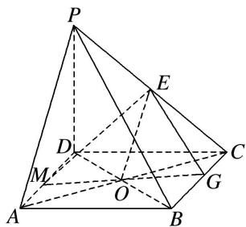

text_image

Geometric diagram of a pyramid with labeled vertices and internal points, used in spatial geometry problems.

(2)连接 AC, BD 交于点 O, 连接 EO, GO, 延长 GO 交 AD 于点 M, 连接 EM, 则 PA // 平面 MEG. 证明如下: 因为 E 为 PC 的中点, O 是 AC 的中点, 所以 EO // PA.

因为 $EO \subset$ 平面 MEG， $PA \not\subset$ 平面 MEG，所以 $PA \parallel$ 平面 MEG。因为 $\triangle OCG \cong \triangle OAM$ ，

所以 $AM = CG = \frac{2}{3}$ ，所以 AM 的长为 $\frac{2}{3}$ .

4. 在四棱锥 $P - ABCD$ 中，底面 $ABCD$ 是边长为 6 的菱形，且 $\angle ABC = 60^{\circ}$ ， $PA \perp$ 平面 $ABCD$ ， $PA = 6$ ， $F$ 是棱 $PA$ 上的一动点， $E$ 为 $PD$ 的中点.

(1)求证：平面 $BDF \perp$ 平面 $ACF$ ;

(2)若 $AF = 2$ ，侧面PAD内是否存在过点 $E$ 的一条直线，使得直线上任一点 $M$ 都有 $CM \parallel$ 平面BDF，若存在，给出证明；若不存在，请说明理由.

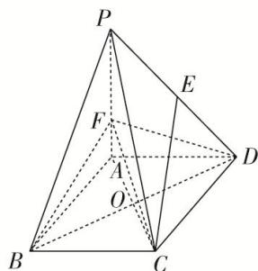

text_image

Geometric diagram of a pyramid with labeled vertices and internal points, showing solid and dashed edges for spatial relationships.

4. 解析 (1)由题意可知, $PA \perp$ 平面 $ABCD$ , 则 $BD \perp PA$ , 又底面 $ABCD$ 是菱形,

所以 $BD \perp AC, PA, AC$ 为平面PAC内两相交直线，

所以 $BD \perp$ 平面 PAC，BD 为平面 BDF 内一直线，从而平面 $BDF \perp$ 平面 ACF.

(2)侧面 PAD 内存在过点 E 的一条直线，使得直线上任一点 M 都有 CM// 平面 BDF.

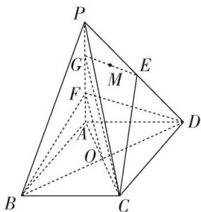

text_image

Geometric diagram of a triangular pyramid with labeled vertices and internal points, used for spatial geometry problems.

设 G 是 PF 的中点，连接 EG, CG, OF，则 $\left\{\begin{aligned}EG//FD,\\ CG//OF\end{aligned}\right.\Rightarrow$ 平面 CEG // 平面 BDF，

所以直线 $EG$ 上任一点 $M$ 都满足 $CM \parallel$ 平面 $BDF$ .

5. 如图，四棱锥 $P - ABCD$ 中， $PD \perp$ 平面 $ABCD$ ，底面 $ABCD$ 为矩形， $PD = DC = 4, AD = 2, E$ 为 $PC$ 的中点.

(1)求三棱锥 A—PDE 的体积;  
(2)AC 边上是否存在一点 M，使得 PA // 平面 EDM？若存在，求出 AM 的长；若不存在，请说明理由.

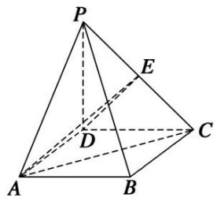

text_image

P
E
D
C
A
B

5. 解析 (1) 因为 $PD \perp$ 平面 $ABCD$ , 所以 $PD \perp AD$ . 又因 $ABCD$ 是矩形, 所以 $AD \perp CD$ .

因 $PD \cap CD = D$ ，所以 $AD \perp$ 平面 PCD，所以 AD 是三棱锥 A—PDE 的高.

因为 E 为 PC 的中点，且 PD = DC = 4，所以 $S_{\triangle PDE} = \frac{1}{2} S_{\triangle PDC} = \frac{1}{2} \times \left( \frac{1}{2} \times 4 \times 4 \right) = 4$ .

又 AD=2，所以 $V_{A-PDE}=\frac{1}{3}AD\cdot S_{\triangle PDE}=\frac{1}{3}\times2\times4=\frac{8}{3}$ .

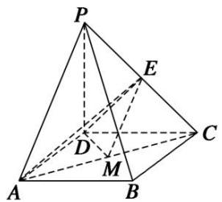

text_image

Geometric diagram of a pyramid with labeled vertices and internal points, used in spatial geometry problems.

(2)取 AC 中点 M，连接 EM，DM，因为 E 为 PC 的中点，M 是 AC 的中点，所以 EM // PA.

又因为 $EM \subset$ 平面 EDM， $PA \not\subset$ 平面 EDM，所以 $PA \parallel$ 平面 EDM.

所以 $AM=\frac{1}{2}AC=\sqrt{5}$ . 即在 AC 边上存在一点 M，使得 PA// 平面 EDM，AM 的长为 $\sqrt{5}$ .

6. 如图，在四棱锥 S-ABCD 中，已知底面 ABCD 为直角梯形，其中 $AD \parallel BC$ ， $\angle BAD = 90^{\circ}$ ， $SA \perp$ 底面

$$
A B C D, S A = A B = B C = 2. \tan \angle S D A = \frac {2}{3}.
$$

(1)求四棱锥 S-ABCD 的体积;  
(2)在棱 SD 上找一点 E，使 $CE \parallel$ 平面 SAB，并证明.

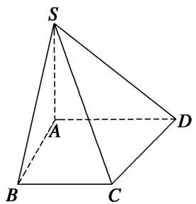

text_image

S
A
B
C
D

6. 解析 (1)∵SA⊥底面ABCD， $\tan\angle SDA=\frac{2}{3}$ ，SA=2，∴AD=3.

由题意知四棱锥 S-ABCD 的底面为直角梯形，且 SA=AB=BC=2，

$$
V _ {S - A B C D} = \frac {1}{3} \times S A \times \frac {1}{2} \times (B C + A D) \times A B = \frac {1}{3} \times 2 \times \frac {1}{2} \times (2 + 3) \times 2 = \frac {1 0}{3}.
$$

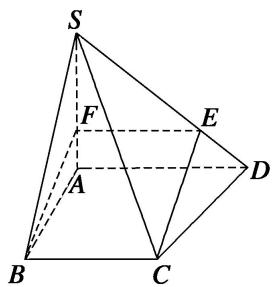

text_image

S
F
E
A
D
B
C

(2)当点 E 位于棱 SD 上靠近 D 的三等分点处时，可使 CE // 平面 SAB.

取 $SD$ 上靠近 $D$ 的三等分点为 $E$ ，取 $SA$ 上靠近 $A$ 的三等分点为 $F$ ，连接 $CE, EF, BF,$

则 $EF \underline{\underline{\underline{\underline{\underline{2}}}}} \frac{2}{3} AD, BC \underline{\underline{\underline{\underline{2}}}} \frac{2}{3} AD, \therefore BC \underline{\underline{\underline{2}} EF}, \therefore CE \parallel BF.$

又∵BF⊂平面SAB，CE≠平面SAB，∴CE∥平面SAB.

7. 如图, 四棱锥 $P - ABCD$ 的底面 $ABCD$ 是圆内接四边形(记此圆为 $W$ ), 且 $PA \perp$ 平面 $ABCD$ .

(1)当 $BD$ 是圆 $W$ 的直径时， $PA = BD = 2$ ， $AD = CD = \sqrt{3}$ ，求四棱锥 $P - ABCD$ 的体积.

(2)在(1)的条件下，判断在棱 $PA$ 上是否存在一点 $Q$ ，使得 $BQ \parallel$ 平面 $PCD$ ？若存在，求出 $AQ$ 的长；若不存在，请说明理由。

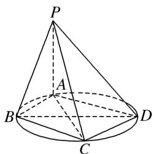

text_image

P
A
B
C
D

7. 解析 (1) 因为 $BD$ 是圆 $W$ 的直径, 所以 $BA \perp AD$ , 因为 $BD = 2$ , $AD = \sqrt{3}$ , 所以 $AB = 1$ .

同理 $BC = 1$ ，所以 $S_{\text{四边形}ABCD} = AB \cdot AD = \sqrt{3}$

因为 $PA \perp$ 平面 $ABCD, PA = 2$ ，所以四棱锥 $P - ABCD$ 的体积 $V = \frac{1}{3} S_{\text{四边形}ABCD} \cdot PA = \frac{2\sqrt{3}}{3}$ .

(2)存在， $AQ=\frac{2}{3}$ . 理由如下.

延长 AB，DC 交于点 E，连接 PE，则平面 PAB 与平面 PCD 的交线是 PE.

假设在棱 PA 上存在一点 Q，使得 BQ // 平面 PCD，则 BQ // PE，所以 $\frac{AQ}{PA} = \frac{AB}{AE}$ .

经计算可得 BE=2，所以 $AE=AB+BE=3$ ，所以 $AQ=\frac{2}{3}$ .

故存在这样的点 Q，使 BQ // 平面 PCD，且 $AQ=\frac{2}{3}$ .

8. 如图，在四棱锥 $P - ABCD$ 中， $AB \parallel CD$ ， $AB = 2CD$ ， $E$ 为 $PB$ 的中点.

(1)求证：CE//平面PAD:

(2)在线段 $AB$ 上是否存在一点 $F$ , 使得平面 $PAD \parallel$ 平面 $CEF$ ? 若存在, 证明你的结论, 若不存在, 请说明理由.

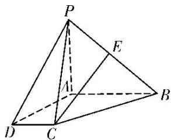

text_image

Geometric diagram of a pyramid with labeled vertices and internal points, used for spatial geometry problems.

8. 解析 (1)证明: 取 $PA$ 的中点 $H$ , 连接 $EH, DH$ . 因为 $E$ 为 $PB$ 的中点, 所以 $EH \parallel AB$ , $EH = \frac{1}{2} AB$ , 又 $AB \parallel CD$ , $CD = \frac{1}{2} AB$ , 所以 $EH \parallel CD$ , $EH = CD$ , 因此四边形 $DCEH$ 是平行四边形, 所以 $CE \parallel DH$ , 又 $DH \subset$ 平面 $PAD$ , $CE \nmid$ 平面 $PAD$ , 故 $CE \parallel$ 平面 $PAD$ .

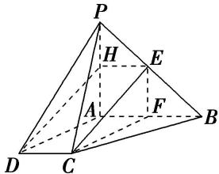

text_image

Geometric diagram of a pyramid with labeled vertices and internal points, used for spatial geometry problems.

(2)存在点 $F$ 为 $AB$ 的中点，使平面 $PAD \parallel$ 平面 $CEF$ 。证明如下：

取 AB 的中点 F，连接 CF，EF，所以 $AF=\frac{1}{2}AB$ ，又 $CD=\frac{1}{2}AB$ ，所以 AF=CD，

又 $AF \parallel CD$ ，所以四边形 $AFCD$ 为平行四边形，因此 $CF \parallel AD$ ，又 $CF \nparallel$ 平面 $PAD$ ，所以 $CF \parallel$ 平面 $PAD$ ，由(1)可知 $CE \parallel$ 平面 $PAD$ ，又 $CE \cap CF = C$ ，故平面 $CEF \parallel$ 平面 $PAD$ ，故存在 $AB$ 的中点 $F$ 满足要求.

9. 如图，在直四棱柱 $ABCD - A_{1}B_{1}C_{1}D_{1}$ 中，已知 $DC = DD_{1} = 2AD = 2AB$ ， $AD \perp DC$ ， $AB // DC$ .

(1)求证： $D_{1}C \perp AC_{1}$ ;

(2)问在棱 $CD$ 上是否存在点 $E$ , 使 $D_{1}E \parallel$ 平面 $A_{1}BD$ . 若存在, 确定点 $E$ 位置; 若不存在, 说明理由.

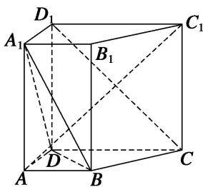

text_image

D₁
A₁
B₁
C₁
D
A
B
C

9. 解析 (1)在直四棱柱 $ABCD - A_{1}B_{1}C_{1}D_{1}$ 中，连接 $C_{1}D$ ， $\because DC = DD_{1}$ ， $\therefore$ 四边形 $DCC_{1}D_{1}$ 是正方形， $\therefore DC_{1} \perp D_{1}C$ 。又 $AD \perp DC$ ， $AD \perp DD_{1}$ ， $DC \cap DD_{1} = D$ ， $\therefore AD \perp$ 平面 $DCC_{1}D_{1}$ ，又 $D_{1}C \subset$ 平面 $DCC_{1}D_{1}$ ， $\therefore AD \perp D_{1}C$ 。 $\because AD \subset$ 平面 $ADC_{1}$ ， $DC_{1} \subset$ 平面 $ADC_{1}$ ，且 $AD \cap DC_{1} = D$ ， $\therefore D_{1}C \perp$ 平面 $ADC_{1}$ ，又 $AC_{1} \subset$ 平面 $ADC_{1}$ ， $\therefore D_{1}C \perp AC_{1}$ 。

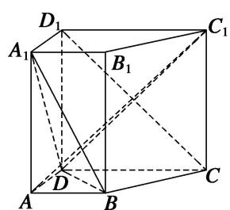

text_image

D₁
A₁
B₁
C₁
D
A
B
C

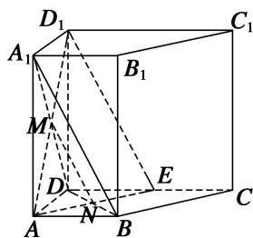

text_image

D₁
A₁
B₁
C₁
M
D
E
N
A
B
C

(2)假设存在点 E，使 $D_{1}E \parallel$ 平面 $A_{1}BD$ 。连接 $AD_{1}$ ，AE， $D_{1}E$ ，设 $AD_{1} \cap A_{1}D = M$ ， $BD \cap AE = N$ ，连接 MN，∵平面 $AD_{1}E \cap$ 平面 $A_{1}BD = MN$ ，要使 $D_{1}E \parallel$ 平面 $A_{1}BD$ ，可使 $MN \parallel D_{1}E$ ，又 M 是 $AD_{1}$ 的中点，则 N 是 AE 的中点。又易知 $\triangle ABN \cong \triangle EDN$ ，∴ AB = DE。即 E 是 DC 的中点。综上所述，当 E 是 DC 的中点时，可使 $D_{1}E \parallel$ 平面 $A_{1}BD$ 。

10. 如图，在多面体 $ABCDEF$ 中，四边形 $ABCD$ 是梯形， $AB \parallel CD$ ， $AD = DC = CB = a$ ， $\angle ABC = 60^\circ$ ，四边形 $ACFE$ 是矩形，且平面 $ACFE \perp$ 平面 $ABCD$ ，点 $M$ 在线段 $EF$ 上.

(1)求证： $BC \perp$ 平面 ACFE;

(2)当 EM 为何值时， $AM \parallel$ 平面 BDF？证明你的结论.

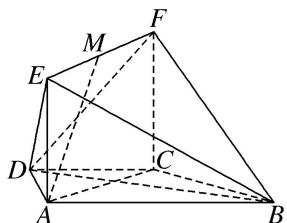

text_image

Geometric diagram of a polyhedron with labeled vertices and internal points, used for spatial geometry problems.

10. 解析 (1)证明：在梯形 ABCD 中，因为 $AB \parallel CD$ ，AD = DC = CB = a， $\angle ABC = 60^{\circ}$ ，

所以四边形 ABCD 是等腰梯形，且 $\angle DCA = \angle DAC = 30^{\circ}$ ， $\angle DCB = 120^{\circ}$ ，

所以 $\angle ACB = \angle DCB - \angle DCA = 90^{\circ}$ ，所以 $AC \perp BC$ .

又平面 $ACFE \perp$ 平面 ABCD，平面 $ACFE \cap$ 平面 ABCD = AC， $BC \subset$ 平面 ABCD，

所以 $BC \perp$ 平面 ACFE.

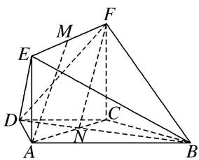

text_image

Geometric diagram of a polyhedron with labeled vertices and internal points, including dashed lines indicating hidden edges.

(2)当 $EM = \frac{\sqrt{3}}{3} a$ 时， $AM \parallel$ 平面 $BDF$ ，理由如下：

如图，在梯形 ABCD 中，设 $AC \cap BD = N$ ，连接 FN.

由(1)知四边形 ABCD 为等腰梯形，且 $\angle ABC = 60^{\circ}$ ，所以 AB = 2DC，则 CN : NA = 1 : 2.

易知 $EF = AC = \sqrt{3}a$ ，所以 $AN = \frac{2\sqrt{3}}{3}a$ 。因为 $EM = \frac{\sqrt{3}}{3}a$ ，所以 $MF = \frac{2}{3}EF = \frac{2\sqrt{3}}{3}a$ ，所以 MF 線 AN，

所以四边形 ANFM 是平行四边形，所以 $AM \parallel NF$ ，又 $NF \subset$ 平面 BDF， $AM \not\subset$ 平面 BDF，

所以 AM// 平面 BDF.

11. 如图 1, 在矩形 $ABCD$ 中, $AB = 4$ , $AD = 2$ , $E$ 是 $CD$ 的中点, 将 $\triangle ADE$ 沿 $AE$ 折起, 得到如图 2 所示的四棱锥 $D_{1} - ABCE$ , 其中平面 $D_{1}AE \perp$ 平面 $ABCE$ .

(1)证明： $BE \perp$ 平面 $D_{1}AE$ ;

(2)设 F 为 $CD_{1}$ 的中点，在线段 AB 上是否存在一点 M，使得 $MF \parallel$ 平面 $D_{1}AE$ ，若存在，求出 $\frac{AM}{AB}$ 的值；若不存在，请说明理由.

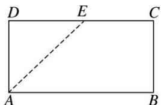

text_image

D E C
A B

图1

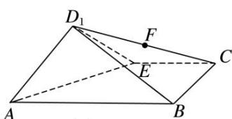

text_image

D₁
F
E
A
B
C

图2

11. 解析 (1)连接 BE, ∵ABCD 为矩形且 AD=DE=EC=BC=2, ∴∠AEB=90°, 即 BE⊥AE,

又平面 $D_{1}AE \perp$ 平面 ABCE，平面 $D_{1}AE \cap$ 平面 ABCE = AE，BE ⊂ 平面 ABCE，∴ BE ⊥ 平面 $D_{1}AE$ .

(2) $AM=\frac{1}{4}AB$ ，取 $D_{1}E$ 的中点L，连接AL，FL，∵ $FL\parallel EC$ ， $EC\parallel AB$ ，∴ $FL\parallel AB$ 且 $FL=\frac{1}{4}AB$ ，

∴M, F, L, A 四点共面，若 $MF \parallel$ 平面 $AD_{1}E$ ，则 $MF \parallel AL$ .

∴AMFL 为平行四边形，∴AM=FL= $\frac{1}{4}$ AB．故线段 AB 上存在满足题意的点 M，且 $\frac{AM}{AB}=\frac{1}{4}$ .

12. 如图(1)，在正 $\triangle ABC$ 中， $E, F$ 分别是 $AB, AC$ 边上的点，且 $BE = AF = 2CF$ 。点 $P$ 为边 $BC$ 上的点，将 $\triangle AEF$ 沿 $EF$ 折起到 $\triangle A_{1}EF$ 的位置，使平面 $A_{1}EF \perp$ 平面 $BEFC$ ，连接 $A_{1}B, A_{1}P, EP$ ，如图(2)所示。

(1)求证： $A_{1}E \perp FP;$

(2)若 $BP = BE$ ，点 $K$ 为棱 $A_{1}F$ 的中点，则在平面 $A_{1}FP$ 上是否存在过点 $K$ 的直线与平面 $A_{1}BE$ 平行，若存在，请给予证明；若不存在，请说明理由.

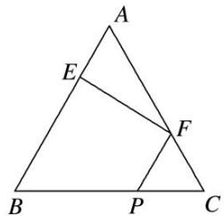

text_image

A
E
F
B
P
C

(1)

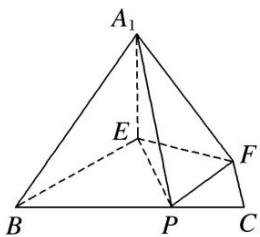

text_image

A₁
E
F
B
P
C

(2)

12. 解析 (1)在正 $\triangle ABC$ 中, 取 $BE$ 的中点 $D$ , 连接 $DF$ , 如图所示.

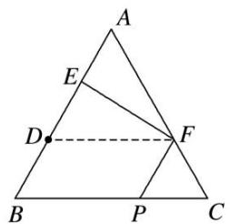

text_image

A
E
D
F
B
P
C

因为 BE = AF = 2CF，所以 AF = AD，AE = DE，而 $\angle A = 60^{\circ}$ ，所以 $\triangle ADF$ 为正三角形.

又 AE=DE，所以 $EF \perp AD$ 。所以在题图(2)中， $A_{1}E \perp EF$

又 $A_{1}E \subset$ 平面 $A_{1}EF$ ，平面 $A_{1}EF \perp$ 平面 BEFC，且平面 $A_{1}EF \cap$ 平面 BEFC = EF，

所以 $A_{1}E \perp$ 平面 BEFC. 因为 $FP \subset$ 平面 BEFC, 所以 $A_{1}E \perp FP$ .

(2)在平面 $A_{1}FP$ 上存在过点 K 的直线与平面 $A_{1}BE$ 平行.

理由如下:

如题图(1)，在正△ABC中，因为 BP=BE，BE=AF，所以 BP=AF，所以 FP//AB，所以 FP//BE.

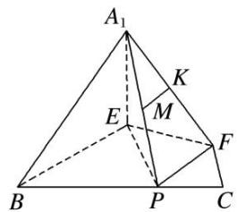

text_image

A₁
K
E
M
F
B
P
C

如图所示，取 $A_{1}P$ 的中点 M，连接 MK，因为点 K 为棱 $A_{1}F$ 的中点，所以 $MK \parallel FP$ .

因为 $FP \parallel BE$ ，所以 $MK \parallel BE$ 。因为 $MK \nsubseteq$ 平面 $A_1BE$ ， $BE \subset$ 平面 $A_1BE$ ，所以 $MK \parallel$ 平面 $A_1BE$ 。

故在平面 $A_{1}FP$ 上存在过点 K 的直线 MK 与平面 $A_{1}BE$ 平行.

# 考点二 探究垂直问题

# 【例题选讲】

[例 1]如图所示，平面 $ABCD \perp$ 平面 BCE，四边形 ABCD 为矩形，BC = CE，点 F 为 CE 的中点.

(1)证明： $AE \parallel$ 平面 BDF;

(2)点 M 为 CD 上任意一点，在线段 AE 上是否存在点 P，使得 $PM \perp BE$ ？若存在，确定点 P 的位置，并加以证明；若不存在，请说明理由.

text_image

Geometric diagram of a cube with labeled vertices and internal points, used for spatial geometry problems.

解析 (1) 连接 AC 交 BD 于点 O，连接 OF.

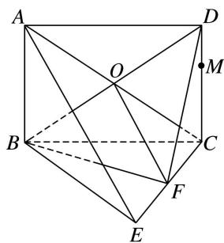

text_image

Geometric diagram of a cube with labeled vertices and internal points, used for spatial geometry problems.

∵四边形 ABCD 是矩形，∴O 为 AC 的中点．又 F 为 EC 的中点，∴OF//AE.

又 $OF \subset$ 平面 BDF, $AE \not\subset$ 平面 BDF, $\therefore AE \parallel$ 平面 BDF.

(2)当点 P 为 AE 的中点时，有 $PM \perp BE$ ，证明如下：

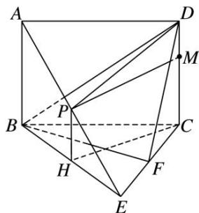

text_image

Geometric diagram of a polyhedron with labeled vertices and internal points, used for spatial geometry problems.

取 BE 的中点 H，连接 DP，PH，CH. ∵ P 为 AE 的中点，H 为 BE 的中点，∴ PH // AB.

又 $AB \parallel CD,\therefore PH \parallel CD,\therefore P,H,C,D$ 四点共面.

∵平面 $ABCD \perp$ 平面 BCE，且平面 $ABCD \cap$ 平面 BCE = BC， $CD \perp BC$ ，

$CD \subset$ 平面 ABCD， $\therefore CD \perp$ 平面 BCE．又 $BE \subset$ 平面 BCE， $\therefore CD \perp BE$ ，

$\because BC=CE$ ，且H为BE的中点， $\therefore CH\perp BE.$

又 $CH \cap CD = C$ ，且 CH， $CD \subset$ 平面 DPHC，∴ BE ⊥ 平面 DPHC.

又 $PM \subset$ 平面 DPHC，∴ $PM \perp BE$ .

[例 2]在四棱锥 E-ABCD 中，底面 ABCD 是正方形，AC 与 BD 交于点 O，EC⊥底面 ABCD，点 F 为 BE 的中点.

(1)求证： $DE \parallel$ 平面 ACF;

(2)若 $AB = \sqrt{2} CE$ ，在线段 $EO$ 上是否存在点 $G$ ，使 $CG \perp$ 平面 $BDE$ ？若存在，求出 $\frac{EG}{EO}$ 的值；若不存在，请说明理由.

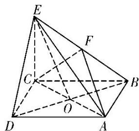

text_image

Geometric diagram of a tetrahedron with labeled vertices and internal points, used for spatial geometry problems.

解析 (1)证明：连接 $OF$ ，由四边形 $ABCD$ 是正方形可知点 $O$ 为 $BD$ 的中点。又 $F$ 为 $BE$ 的中点，所以 $OF \parallel DE$ 。又 $OF \subset$ 平面 $ACF$ ， $DE \nmid$ 平面 $ACF$ ，所以 $DE \parallel$ 平面 $ACF$ 。

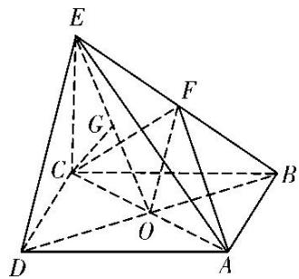

text_image

Geometric diagram of a tetrahedron with labeled vertices and internal points, used for spatial geometry problems.

(2)存在点 G，此时 $\frac{EG}{EO} = \frac{1}{2}$ . 证明如下：

若 $CG \perp$ 平面 BDE，则必有 $CG \perp OE$ ，于是作 $CG \perp OE$ 于点 G.

因为 $EC \perp$ 底面 ABCD，所以 $BD \perp EC$ ，又底面 ABCD 是正方形，所以 $BD \perp AC$ ，

又 $EC \cap AC = C$ ，所以 $BD \perp$ 平面 ACE。而 $CG \subset$ 平面 ACE，所以 $CG \perp BD$ 。

又 $OE \cap BD = O$ ，所以 $CG \perp$ 平面 $BDE$ 。又 $AB = \sqrt{2} CE$ ，所以 $CO = \frac{\sqrt{2}}{2} AB = CE$

所以点 G 为 EO 的中点，所以 $\frac{EG}{EO} = \frac{1}{2}$ .

[例 3]如图(1)，在 Rt△ABC 中， $\angle C=90^{\circ}$ ，D，E 分别为 AC，AB 的中点，点 F 为线段 CD 上的一点，将△ADE 沿 DE 折起到△A₁DE 的位置，使 A₁F⊥CD，如图(2).

(1)求证： $DE \parallel$ 平面 $A_{1}CB$ ;  
(2)求证： $A_{1}F \perp BE;$   
(3)线段 $A_{1}B$ 上是否存在点 Q，使 $A_{1}C \perp$ 平面 DEQ？请说明理由.

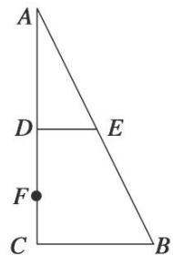

text_image

A
D	E
F
C	B

(1)

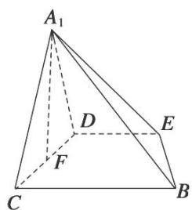

text_image

A₁
D
E
F
C
B

(2)

解析 (1)因为 D, E 分别为 AC, AB 的中点，所以 DE // BC.

又因为 $DE \nmid$ 平面 $A_{1}CB$ , $BC \subset$ 平面 $A_{1}CB$ , 所以 $DE \parallel$ 平面 $A_{1}CB$ .

(2)由题图(1)得 $AC \perp BC$ 。且 $DE \parallel BC$ ，所以 $DE \perp AC$ 。所以 $DE \perp A_{1}D$ ， $DE \perp CD$ 。

所以 $DE \perp$ 平面 $A_{1}DC$ 。而 $A_{1}F \subset$ 平面 $A_{1}DC$ ，所以 $DE \perp A_{1}F$ 。又因为 $A_{1}F \perp CD$

所以 $A_{1}F \perp$ 平面 BCDE，又 $BE \subset$ 平面 BCDE，所以 $A_{1}F \perp BE$ .

(3)线段 $A_{1}B$ 上存在点 Q，使 $A_{1}C \perp$ 平面 DEQ。理由如下：

如图，

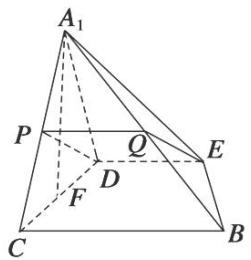

text_image

A₁
P
Q
E
D
F
C
B

分别取 $A_{1}C$ ， $A_{1}B$ 的中点 P，Q，则 $PQ \parallel BC$ 。又因为 $DE \parallel BC$ ，所以 $DE \parallel PQ$ 。

所以平面 DEQ 即为平面 DEP. 由(2)知, $DE \perp$ 平面 $A_{1}DC$ , 所以 $DE \perp A_{1}C$ .

又因为 P 是等腰三角形 $DA_{1}C$ 底边 $A_{1}C$ 的中点，所以 $A_{1}C \perp DP$ 。所以 $A_{1}C \perp$ 平面 DEP。

从而 $A_{1}C \perp$ 平面 DEQ. 故线段 $A_{1}B$ 上存在点 Q，使得 $A_{1}C \perp$ 平面 DEQ.

[例 4]如图，在三棱柱 $ABC-A_{1}B_{1}C_{1}$ 中，侧棱 $AA_{1}\perp$ 底面 ABC，M 为棱 AC 的中点．AB=BC，AC=2， $AA_{1}=\sqrt{2}$ .

(1)求证： $B_{1}C \parallel$ 平面 $A_{1}BM$ ;

(2)求证： $AC_{1} \perp$ 平面 $A_{1}BM$ ;

(3)在棱 $BB_{1}$ 上是否存在点 $N$ ，使得平面 $AC_{1}N \perp$ 平面 $AA_{1}C_{1}C$ ？如果存在，求此时 $\frac{BN}{BB_{1}}$ 的值；如果不存在，请说明理由.

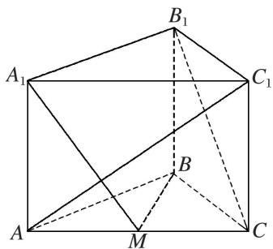

text_image

A₁
B₁
C₁
A
B
M
C

解析 (1)连接 $AB_{1}$ 与 $A_{1}B$ ，两线交于点 O，连接 OM.

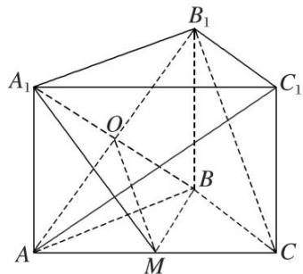

text_image

Geometric diagram of a polyhedron with labeled vertices and internal points, used for spatial geometry problems.

在 $\triangle B_{1}AC$ 中， $\because M, O$ 分别为 $AC, AB_{1}$ 的中点， $\therefore OM \parallel B_{1}C,$

又∵OM⊂平面 $A_{1}BM$ ， $B_{1}C\not\subset$ 平面 $A_{1}BM$ ，∴ $B_{1}C//$ 平面 $A_{1}BM$ .

(2)∵侧棱 $AA_{1}$ ⊥ 底面 ABC, BM ⊂ 平面 ABC, ∴ $AA_{1}$ ⊥ BM,

又∵M为棱AC的中点，AB=BC，∴BM⊥AC.

$\because AA_{1}\cap AC=A,\ AA_{1},\ AC\subset\text{平面}ACC_{1}A_{1},\ \therefore BM\perp\text{平面}ACC_{1}A_{1},\ \therefore BM\perp AC_{1}.$

∵AC=2，∴AM=1．又∵ $AA_{1}=\sqrt{2}$ ，∴在Rt△ACC $_{1}$ 和Rt△A $_{1}$ AM中，

$\tan \angle AC_{1}C = \tan \angle A_{1}MA = \sqrt{2},\therefore \angle AC_{1}C = \angle A_{1}MA,$

即 $\angle AC_{1}C + \angle C_{1}AC = \angle A_{1}MA + \angle C_{1}AC = 90^{\circ}, \therefore A_{1}M \perp AC_{1}.$

$\because BM\cap A_{1}M=M,\ BM,\ A_{1}M\subset\text{平面 }A_{1}BM,\therefore AC_{1}\perp\text{ 平面 }A_{1}BM.$

(3)当点 N 为 $BB_{1}$ 的中点，即 $\frac{BN}{BB_{1}} = \frac{1}{2}$ 时，平面 $AC_{1}N \perp$ 平面 $AA_{1}C_{1}C$ .

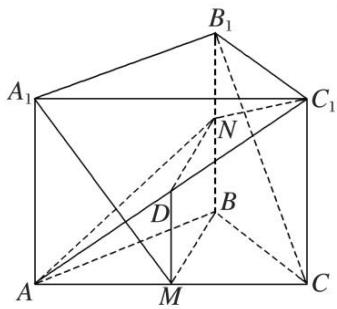

text_image

Geometric diagram of a polyhedron with labeled vertices and internal points, including dashed lines indicating hidden edges.

证明如下:

设 $AC_{1}$ 的中点为 D，连接 DM，DN. ∵D，M 分别为 $AC_{1}$ ，AC 的中点，∴ $DM \parallel CC_{1}$ ，且 $DM = \frac{1}{2} CC_{1}$ .

又∵N为 $BB_{1}$ 的中点，∴DM//BN，且DM=BN，∴四边形BNDM为平行四边形，∴BM//DN，

∵BM⊥平面 $ACC_{1}A_{1}$ ，∴DN⊥平面 $AA_{1}C_{1}C$ 。又∵DN⊂平面 $AC_{1}N$ ，∴平面 $AC_{1}N\perp$ 平面 $AA_{1}C_{1}C$ 。

# 【对点训练】

1. 如图，三棱锥 P-ABC 中，PA⊥平面 ABC，PA=1，AB=1，AC=2， $\angle BAC=60^{\circ}$

(1)求三棱锥 P-ABC 的体积;

(2)在线段 $PC$ 上是否存在点 $M$ , 使得 $AC \perp BM$ , 若存在, 请说明理由, 并求 $\frac{PM}{MC}$ 的值.

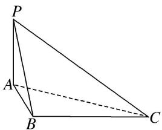

text_image

P
A
B
C

1. 解析 (1)由题设 AB=1, AC=2, $\angle BAC=60^{\circ}$ ，可得 $S_{\triangle ABC}=\frac{1}{2}\cdot AB\cdot AC\cdot\sin60^{\circ}=\frac{\sqrt{3}}{2}$ .

由 $PA \perp$ 平面 ABC，可知 PA 是三棱锥 P-ABC 的高，又 PA = 1，

所以三棱锥 P-ABC 的体积 $V=\frac{1}{3}\cdot S_{\triangle ABC}\cdot PA=\frac{\sqrt{3}}{6}$ .

(2)在线段 PC 上存在点 M，使得 $AC \perp BM$ ，证明如下：

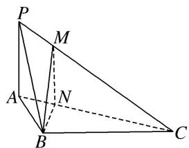

text_image

P
M
A
N
B
C

如图，在平面 ABC 内，过点 B 作 $BN \perp AC$ ，垂足为 N。在平面 PAC 内，

过点 N 作 $MN \parallel PA$ 交 PC 于点 M，连接 BM。由 $PA \perp$ 平面 ABC，知 $PA \perp AC$ ，所以 $MN \perp AC$ 。

因为 $BN \cap MN = N$ ，所以 $AC \perp$ 平面 MBN，又 $BM \subset$ 平面 MBN，所以 $AC \perp BM$ .

在 Rt△BAN 中， $AN=AB\cdot\cos\angle BAC=\frac{1}{2}$ ，从而 NC=AC-AN= $\frac{3}{2}$ ，由 MN//PA，得 $\frac{PM}{MC}=\frac{AN}{NC}=\frac{1}{3}$ .

2. 如图所示, 已知长方体 $ABCD - A_{1}B_{1}C_{1}D_{1}$ , 点 $O_{1}$ 为 $B_{1}D_{1}$ 的中点.

(1)求证： $AB_{1} \parallel$ 平面 $A_{1}O_{1}D;$

(2)若 $AB=\frac{2}{3}AA_{1}$ ，在线段 $BB_{1}$ 上是否存在点 E 使得 $A_{1}C\perp AE$ ？若存在，求出 $\frac{BE}{BB_{1}}$ ；若不存在，说明理由.

text_image

D₁
O₁
A₁
B₁
C₁
D
A
B
C

2. 解析 (1)证明：如图 1 所示，连接 $AD_{1}$ 交 $A_{1}D$ 于点 $G$ ， $\therefore G$ 为 $AD_{1}$ 的中点，连接 $O_{1}G$ ，在 $\triangle AB_{1}D_{1}$ 中， $\because O_{1}$ 为 $B_{1}D_{1}$ 的中点， $\therefore O_{1}G \parallel AB_{1}$ ， $\because O_{1}G \subset$ 平面 $A_{1}O_{1}D$ ，且 $AB_{1} \not\subset$ 平面 $A_{1}O_{1}D$ ， $\therefore AB_{1} \parallel$ 平面 $A_{1}O_{1}D$ .

text_image

Geometric diagram of a cube with labeled vertices and internal points, used for spatial geometry problems.

图1

text_image

D₁
O₁
C₁
A₁
B₁
E
M
D
C
A
B

图2

(2)若在线段 $BB_{1}$ 上存在点 E 使得 $A_{1}C \perp AE$ ，连接 $A_{1}B$ 交 AE 于点 M，如图 2 所示.

∵BC⊥平面 $ABB_{1}A_{1}$ ，AE⊂平面 $ABB_{1}A_{1}$ ，∴BC⊥AE.

又∵ $A_{1}C\cap BC=C$ ，且 $A_{1}C,\quad BC\subset$ 平面 $A_{1}BC,\quad \therefore AE\perp$ 平面 $A_{1}BC.$

$\because A_{1}B\subset$ 平面 $A_{1}BC,\quad\therefore AE\perp A_{1}B.$

在 $\triangle AMB$ 和 $\triangle ABE$ 中， $\angle BAM+\angle ABM=90^{\circ}$ ， $\angle BAM+\angle BEA=90^{\circ}$ ， $\therefore \angle ABM=\angle BEA$ .

$$
\therefore \mathrm{Rt} \triangle A B E \sim \mathrm{Rt} \triangle A _ {1} A B, \quad \therefore \frac {B E}{A B} = \frac {A B}{A A _ {1}}.
$$

$\because AB=\frac{2}{3}AA_{1},\quad\therefore BE=\frac{2}{3}AB=\frac{4}{9}BB_{1}$ ，即在线段 $BB_{1}$ 上存在点E使得 $A_{1}C\perp AE$ ，此时 $\frac{BE}{BB_{1}}=\frac{4}{9}$ .

3. 如图，已知三棱柱 $ABC - A'B'C'$ 的侧棱垂直于底面， $AB = AC$ ， $\angle BAC = 90^\circ$ ，点 $M, N$ 分别为 $A'B$ 和 $B'C'$ 的中点.

(1)证明： $MN \parallel$ 平面 $AA'C'C$ ;  
(2)设 $AB=\lambda AA'$ ，当 $\lambda$ 为何值时， $CN\perp$ 平面 $A'MN$ ，试证明你的结论.

text_image

A'
B'
M
N
A
C
B
C

3. 解析 (1)如图, 取 $A'B'$ 的中点 $E$ , 连接 $ME, NE$ .

因为 M, N 分别为 $A'B$ 和 $B'C'$ 的中点, 所以 $NE \parallel A'C'$ , $ME \parallel AA'$ , 又 $A'C' \subset$ 平面 $AA'C'C$ , $A'A \subset$ 平面 $AA'C'C$ ,所以 $ME \parallel$ 平面 $AA'C'C$ , $NE \parallel$ 平面 $AA'C'C$ , 所以平面 $MNE \parallel$ 平面 $AA'C'C$ , 因为 $MN \subset$ 平面 $MNE$ , 所以 $MN \parallel$ 平面 $AA'C'C$ .

text_image

Geometric diagram of a cube with labeled vertices and internal points, used for spatial geometry problems.

(2)连接 $BN$ ，设 $AA^{\prime} = a$ ，则 $AB = \lambda AA^{\prime} = \lambda a$ ，由题意知 $BC = \sqrt{2}\lambda a$ ， $CN = BN = \sqrt{a^2 + \frac{1}{2}\lambda^2a^2}$

因为三棱柱 $ABC - A'B'C'$ 的侧棱垂直于底面，所以平面 $A'B'C' \perp$ 平面 $BB'C'C$

因为 AB = AC，点 N 是 $B'C'$ 的中点，所以 $A'B' = A'C'$ ， $A'N \perp B'C'$ ，

所以 $A^{\prime}N \perp$ 平面 $BB^{\prime}C^{\prime}C$ ，所以 $CN \perp A^{\prime}N$ ，要使 $CN \perp$ 平面 $A^{\prime}MN$ ，只需 $CN \perp BN$ 即可，

所以 $CN^2 + BN^2 = BC^2$ ，即 $2\left(a^2 + \frac{1}{2}\lambda^2 a^2\right) = 2\lambda^2 a^2$ ，解得 $\lambda = \sqrt{2}$ ，故当 $\lambda = \sqrt{2}$ 时， $CN \perp$ 平面 $A'MN$ .

4. 如图，在四棱锥 $P - ABCD$ 中， $ABCD$ 是正方形， $PD \perp$ 平面 $ABCD$ . $PD = AB = 2, E, F, G$ 分别是 $PC, PD, BC$ 的中点.

(1)求证：平面 $PAB \parallel$ 平面 $EFG$ ;

(2)在线段 $PB$ 上确定一点 $Q$ , 使 $PC \perp$ 平面 $ADQ$ , 并给出证明.

text_image

Geometric diagram of a pyramid with labeled vertices and internal points, used in spatial geometry problems.

4. 解析 (1)∵ 在△PCD 中，E, F 分别是 PC, PD 的中点，∴ EF∥CD，又∵ 四边形 ABCD 为正方形，∴ AB∥CD，∴ EF∥AB，∵ EF⊂平面 PAB，AB⊂平面 PAB，∴ EF∥平面 PAB．同理 EG∥平面 PAB，∵ EF，EG 是平面 EFG 内两条相交直线，∴ 平面 PAB∥平面 EFG．

text_image

Geometric diagram of a pyramid with labeled vertices and internal points, used for spatial geometry problems.

(2)当 Q 为线段 PB 的中点时， $PC \perp$ 平面 ADQ．取 PB 的中点 Q，连接 DE，EQ，AQ，DQ，

∵EQ∥BC∥AD，且AD≠QE，∴四边形ADEQ为梯形，

由 $PD \perp$ 平面 ABCD， $AD \subset$ 平面 ABCD，得 $AD \perp PD$ ，

∵AD⊥CD，PD∩CD=D，PD，CD⊂平面PCD，∴AD⊥平面PDC，又PC⊂平面PDC，∴AD⊥PC.

∵△PDC为等腰直角三角形，E为斜边中点，∴DE⊥PC，

∵AD，DE是平面ADQ内的两条相交直线，∴PC⊥平面ADQ.

5. 如图，在四棱锥 $P - ABCD$ 中，底面 $ABCD$ 是菱形， $\angle DAB = 30^{\circ}$ ， $PD \perp$ 平面 $ABCD$ ， $AD = 2$ ，点 $E$ 为

AB 上一点，且 $\frac{AE}{AB}=m$ ，点 F 为 PD 中点.

(1)若 $m = \frac{1}{2}$ ，证明：直线 $AF / /$ 平面 $PEC$ ；

(2)是否存在一个常数 $m$ ，使得平面 $PED \perp$ 平面 $PAB$ ? 若存在，求出 $m$ 的值；若不存在，说明理由.

text_image

P
F
D
A E B C

5. 解析 (1)如图作 $FM \parallel CD$ ，交 $PC$ 于点 $M$ ，连接 $EM$ ，

因为点 F 为 PD 的中点，所以 $FM=\frac{1}{2}CD$ 。因为 $m=\frac{1}{2}$ ，所以 $AE=\frac{1}{2}AB=FM$ ，

又 $FM \parallel CD \parallel AE$ ，所以四边形AEMF为平行四边形，所以 $AF \parallel EM$

因为 $AF \nmid$ 平面 $PEC$ , $EM \subset$ 平面 $PEC$ , 所以直线 $AF \parallel$ 平面 $PEC$ .

(2)存在一个常数 $m=\frac{\sqrt{3}}{2}$ ，使得平面 PED⊥平面 PAB，理由如下：

text_image

P
F
M
D
A
E
B
C

要使平面 $PED \perp$ 平面 PAB，只需 $AB \perp DE$ ，

因为 $AB = AD = 2$ ， $\angle DAB = 30^{\circ}$ ，所以 $AE = AD\cos 30^{\circ} = \sqrt{3}$

又因为 $PD \perp$ 平面 $ABCD, PD \perp AB, PD \cap DE = D$ , 所以 $AB \perp$ 平面 $PDE$ ,

因为 $AB \subset$ 平面 PAB，所以平面 $PDE \perp$ 平面 PAB，所以 $m = \frac{AE}{AB} = \frac{\sqrt{3}}{2}$ .

6. 如图, 在四棱锥 $P - ABCD$ 中, 底面 $ABCD$ 是 $\angle DAB = 60^{\circ}$ 且边长为 $a$ 的菱形, 侧面 $PAD$ 为正三角形,其所在平面垂直于底面 $ABCD$ , 若 $G$ 为 $AD$ 的中点.

(1)求证：BG⊥平面 PAD;

(2)求证： $AD \perp PB;$

(3)若 $E$ 为 $BC$ 边的中点，能否在棱 $PC$ 上找到一点 $F$ ，使平面 $DEF \perp$ 平面 $ABCD$ ？并证明你的结论.

text_image

P
D
C
G
A
B
E

6. 解析 (1)在菱形 $ABCD$ 中, $\angle DAB = 60^{\circ}$ , $G$ 为 $AD$ 的中点, 所以 $BG \perp AD$ . 又平面 $PAD \perp$ 平面 $ABCD$ , 平面 $PAD \cap$ 平面 $ABCD = AD$ , 所以 $BG \perp$ 平面 $PAD$ .

text_image

Geometric diagram of a triangular pyramid with labeled vertices and internal points

(2)如图，连接 PG．因为 $\triangle PAD$ 为正三角形，G 为 AD 的中点，所以 $PG \perp AD$ .

由(1)知， $BG \perp AD$ ，又 $PG \cap BG = G$ ，所以 $AD \perp$ 平面 PGB。因为 $PB \subset$ 平面 PGB，所以 $AD \perp PB$ 。

(3)当 F 为 PC 的中点时，满足平面 $DEF \perp$ 平面 ABCD.

证明如下：取 $PC$ 的中点 $F$ ，连接 $DE$ 、 $EF$ 、 $DF$ .

在 $\triangle PBC$ 中， $FE \parallel PB$ ，在菱形 $ABCD$ 中， $GB \parallel DE$ 。

而 $FE \subset$ 平面 $DEF, DE \subset$ 平面 $DEF, EF \cap DE = E, PB \subset$ 平面 $PGB, GB \subset$ 平面 $PGB, PB \cap GB = B,$

所以平面 $DEF \parallel$ 平面 $PGB$ . 因为 $BG \perp$ 平面 $PAD$ , $PG \subset$ 平面 $PAD$ , 所以 $BG \perp PG$ .

又因为 $PG \perp AD, AD \cap BG = G$ ，所以 $PG \perp$ 平面 $ABCD$ .

又 $PG \subset$ 平面 $PGB$ , 所以平面 $PGB \perp$ 平面 $ABCD$ , 所以平面 $DEF \perp$ 平面 $ABCD$ .

7. 如图, 四棱锥 $P - ABCD$ 中, 底面 $ABCD$ 是边长为 2 的菱形, $\angle BAD = \frac{\pi}{3}$ , $\triangle PAD$ 是等边三角形, $F$ 为 $AD$ 的中点, $PD \perp BF$ .

(1)求证： $AD \perp PB$ ;

(2)若 E 在线段 BC 上，且 $EC=\frac{1}{4}BC$ ，能否在棱 PC 上找到一点 G，使平面 $DEG \perp$ 平面 ABCD？若存在，求出三棱锥 D-CEG 的体积；若不存在，请说明理由.

text_image

P
D
F
A
B
C
E

7. 解析 (1)∵△PAD 是等边三角形，F 是 AD 的中点，∴PF⊥AD.

text_image

Geometric diagram of a triangular pyramid with labeled vertices and internal points, used for spatial geometry problems.

∵底面 ABCD 是菱形， $\angle BAD=\frac{\pi}{3}$ ，∴ $BF\perp AD$ .

又 $PF \cap BF = F$ ，∴ $AD \perp$ 平面 $BFP$ ，由于 $PB \subset$ 平面 $BFP$ ，∴ $AD \perp PB$

(2)能在棱 $PC$ 上找到一点 $G$ , 使平面 $DEG \perp$ 平面 $ABCD$ .

由(1)知 $AD \perp BF$ , $\because PD \perp BF$ , $AD \cap PD = D$ , $\therefore BF \perp$ 平面 $PAD$ .

又 $BF \subseteq$ 平面 $ABCD$ , $\therefore$ 平面 $ABCD \perp$ 平面 $PAD$ .

又平面 $ABCD \cap$ 平面 $PAD = AD$ , 且 $PF \perp AD$ , $PF \subset$ 平面 $PAD$ , $\therefore PF \perp$ 平面 $ABCD$ .

连接 CF 交 DE 于点 H，过 H 作 HG // PF 交 PC 于 G，∴ GH | 平面 ABCD.

又 $GH \subseteq$ 平面 $DEG$ , $\therefore$ 平面 $DEG \perp$ 平面 $ABCD$ .

$$
\because A D \parallel B C, \therefore \triangle D F H \sim \triangle E C H, \therefore \frac {C H}{H F} = \frac {C E}{D F} = \frac {1}{2}, \therefore \frac {C G}{G P} = \frac {C H}{H F} = \frac {1}{2}, \therefore G H = \frac {1}{3} P F = \frac {\sqrt {3}}{3},
$$

$$
\therefore V _ {D - C E G} = V _ {G - C D E} = \frac {1}{3} S _ {\triangle C D E} \cdot G H = \frac {1}{3} \times \frac {1}{2} D C \cdot C E \cdot \sin \frac {\pi}{3} \cdot G H = \frac {1}{1 2}.
$$

8. 如图，在四棱锥 $P - ABCD$ 中， $PC = AD = CD = \frac{1}{2} AB = 2$ ， $AB // DC$ ， $AD \perp CD$ ， $PC \perp$ 平面 $ABCD$ .

(1)求证： $BC \perp$ 平面 PAC;  
(2)若 $M$ 为线段 $PA$ 的中点, 且过 $C, D, M$ 三点的平面与线段 $PB$ 交于点 $N$ , 确定点 $N$ 的位置, 说明理由; 并求三棱锥 $A—CMN$ 的高.

text_image

Geometric diagram of a tetrahedron with labeled vertices and internal points, used for spatial geometry problems.

8. 解析 (1) 连接 AC，在直角梯形 ABCD 中， $AC=\sqrt{AD^{2}+DC^{2}}=2\sqrt{2}$

$BC = \sqrt{(AB - CD)^2 + AD^2} = 2\sqrt{2}$ ，所以 $AC^2 + BC^2 = AB^2$ ，即 $AC \perp BC$ .

又 $PC \perp$ 平面 ABCD， $BC \subset$ 平面 ABCD，

所以 $PC \perp BC$ ，又 $AC \cap PC = C$ ，AC， $PC \subset$ 平面 PAC，故 $BC \perp$ 平面 PAC.

text_image

Geometric diagram of a pyramid with labeled vertices and internal points, including dashed lines for hidden edges.

(2)N 为 PB 的中点，连接 MN，CN.

text_image

Geometric diagram of a pyramid with labeled vertices and internal points, used for spatial geometry problems.

因为 M 为 PA 的中点，N 为 PB 的中点，所以 $MN \parallel AB$ ，且 $MN = \frac{1}{2} AB = 2$ .

又因为 $AB \parallel CD$ ，所以 $MN \parallel CD$ ，所以 M，N，C，D 四点共面，

所以 N 为过 C, D, M 三点的平面与线段 PB 的交点.

因为 $BC \perp$ 平面 PAC，N 为 PB 的中点，所以点 N 到平面 PAC 的距离 $d = \frac{1}{2} BC = \sqrt{2}$ .

又 $S_{\triangle ACM} = \frac{1}{2} S_{\triangle ACP} = \frac{1}{2}\times \frac{1}{2}\times AC\times PC = \sqrt{2}$ ，所以 $V_{\text{三棱锥} N - ACM} = \frac{1}{3}\times \sqrt{2}\times \sqrt{2} = \frac{2}{3}.$

由题意可知，在 Rt△PCA 中， $PA=\sqrt{AC^{2}+PC^{2}}=2\sqrt{3}$ ， $CM=\sqrt{3}$ ，

在 Rt△PCB 中， $PB=\sqrt{BC^{2}+PC^{2}}=2\sqrt{3}$ ，CN= $\sqrt{3}$ ，所以 $S_{\triangle CMN}=\frac{1}{2}\times2\times\sqrt{2}=\sqrt{2}$ .

设三棱锥 A—CMN 的高为 h， $V_{三棱锥 N—ACM}=V_{三棱锥 A—CMN}=\frac{1}{3}\times\sqrt{2}\times h=\frac{2}{3}$

解得 $h=\sqrt{2}$ ，故三棱锥 A—CMN 的高为 $\sqrt{2}$ .

# 考点三 探究距离与体积问题

# 【例题选讲】

[例1]如图所示，圆柱的高为2，点 $A$ ， $B$ ， $C$ ， $D$ 分别是圆柱下底面圆周上的点，ABCD为矩形，PA是圆柱的母线， $AB = 2$ ， $BC = 4$ ， $E$ ， $F$ ， $G$ 分别是线段PA，PD，CD的中点.

(1)求证：平面 $PDC \perp$ 平面 PAD;

(2)求证：PB//平面 EFG;  
(3)在线段 $BC$ 上是否存在一点 $M$ ，使得 $D$ 到平面 $PAM$ 的距离为 2？若存在，求出 $BM$ ；若不存在，请说明理由.

text_image

P
E
F
A
D
G
B
C

解析 (1)∵ PA 是圆柱的母线，∴ $PA \perp$ 圆柱的底面.

∵ $CD \subset$ 圆柱的底面， $PA \perp CD$ ，又∵ ABCD 为矩形，∴ $CD \perp AD$ ，

而 $PA \perp AD = A$ ，∴ $CD \perp$ 平面 PAD．又 $CD \subset$ 平面 PDC，∴ 平面 $PDC \perp$ 平面 PAD．

text_image

P
E
F
A
H
B
M
C
G
D

(2)取 AB 中点 H，连接 GH, HE，∵ E、F、G 分别是线段 PA、PD、CD 的中点，

∴ GH // AD // EF，∴ E、F、G、H 四点共面．又 H 为 AB 中点，∴ EH // PB．

又 $EH \subset$ 平面 EFG， $PB \not\subset$ 平面 EFG，∴ PB // 平面 EFG.

(3)解析：假设在 $BC$ 上存在一点 $M$ ，使得 $D$ 到平面 $PAM$ 的距离为2，则以 $\Delta PAM$ 为底， $D$ 为顶点的三棱锥的高为2，连接 $AM$ ，则 $AM = \sqrt{AB^2 + BM^2} = \sqrt{4 + BM^2}$ ，由(2)知 $PA\bot AM$ ，

$$
\therefore S _ {\Delta P A M} = \frac {1}{2} P A \cdot A M = \frac {1}{2} \times 2 \sqrt {2 ^ {2} + B M ^ {2}} = \sqrt {4 + B M ^ {2}}, \quad \therefore V _ {D - P A M} = \frac {1}{3} \cdot S _ {\Delta P A M} \cdot 2 = \frac {2}{3} \sqrt {4 + B M ^ {2}}.
$$

$$
\because S _ {\triangle A M D} = \frac {1}{2} A D \cdot A B = \frac {1}{2} \times 4 \times 2 = 4, \quad \therefore V _ {P - A D M} = \frac {1}{3} \cdot S _ {\triangle A D M} \cdot P A = \frac {1}{3} \times 4 \times 2 = \frac {8}{3}.
$$

$\because V_{D-PAM}=V_{P-ADM},\quad\therefore\frac{2}{3}\sqrt{4+BM^{2}}=\frac{8}{3},$ 解得： $BM=2\sqrt{3}$ $\because 2\sqrt{3}<4,$

∴线段 BC 上存在一点 M，当 $BM = 2\sqrt{3}$ 时，使得 D 到平面 PAM 的距离为 2.

[例 2]如图，在四棱锥 P—ABCD 中，PA⊥底面 ABCD，AD⊥AB，DC∥AB，PA=1，AB=2，PD=BC = $\sqrt{2}$ .

(1)求证：平面 $PAD \perp$ 平面 PCD;  
(2)试在棱 $PB$ 上确定一点 $E$ , 使截面 $AEC$ 把该几何体分成的两部分 $PDCEA$ 与 $EACB$ 的体积比为 $2:1$ .

text_image

Geometric diagram of a pyramid with labeled vertices and internal points, used in spatial geometry problems.

解析 (1)∵AD⊥AB, DC∥AB, ∴DC⊥AD. ∵PA⊥平面ABCD, DC⊂平面ABCD, ∴DC⊥PA.

∵ $AD \cap PA = A$ , AD, $PA \subset$ 平面 PAD, ∴ DC ⊥ 平面 PAD. ∵ DC ⊂ 平面 PCD, ∴ 平面 PAD ⊥ 平面 PCD.

text_image

Geometric diagram of a pyramid with labeled vertices and internal points, used in spatial geometry problems.

(2)作 $EF \perp AB$ 于 F 点，∵在 $\triangle ABP$ 中， $PA \perp AB$ ，∴ $EF \parallel PA$ ，∴ $EF \perp$ 平面 ABCD.

设 EF=h, $AD=\sqrt{PD^{2}-PA^{2}}=1$ , $S_{\triangle ABC}=\frac{1}{2}AB\cdot AD=1$ ，则 $V_{三棱锥 E-ABC}=\frac{1}{3}S_{\triangle ABC}\cdot h=\frac{1}{3}h$ .

$$
V _ {\text { 四棱锥 } P - A B C D} = \frac {1}{3} S _ {\text { 四边形 } A B C D} \cdot P A = \frac {1}{3} \times \frac {(1 + 2) \times 1}{2} \times 1 = \frac {1}{2}.
$$

由 $V_{PDCEA}:V_{三棱锥E-ACB}=2:1$ ，得 $\left(\frac{1}{2}-\frac{1}{3}h\right):\frac{1}{3}h=2:1$ ，解得 $h=\frac{1}{2}$ . EF= $\frac{1}{2}PA$ ，故 E 为 PB 的中点.

[例 3]如图，在正三棱柱 $ABC-A_{1}B_{1}C_{1}$ 中，D，E 分别为 AB，BC 的中点.

(1)若 $F$ 为 $BB_{1}$ 的中点，判断 $AC_{1}$ 与平面 $DEF$ 是否平行？若平行，请给予证明，若不平行，说明理由；(2)试问：在侧棱 $BB_{1}$ 上是否存在点 $F$ ，使三棱锥 $F - DEB$ 的体积与三棱柱 $ABC - A_{1}B_{1}C_{1}$ 的体积之比为 $\frac{1}{8}$ .

text_image

A₁
C₁
B₁
C
E
F
A
D
B

解析：(1)法一：连接 $B_{1}C$ ， $BC_{1}$ 交于点 $G$ ，连接 $DG$ ， $FG$ ，则 $DG \parallel AC_{1}$

因为 $DG \subset$ 平面 GDF， $AC_{1} \not\subset$ 平面 GDF，则 $AC_{1} \parallel$ 平面 GDF.

由于平面 $GDF \cap$ 平面 DEF = DF，故 $AC_{1}$ 与平面 DEF 不可能平行.

法二：连接 $B_{1}C$ ， $BC_{1}$ 交于点 G，连接 DG，FG，则 $DG \parallel AC_{1}$ ，

而 $DG \nsubseteq$ 平面 $DEF$ ，且 $DG$ 与平面 $DEF$ 交于点 $D$ ，故 $AC_{1}$ 与平面 $DEF$ 不可能平行.

(2)假设点 $F$ 存在，由 $\frac{V_{F - DEB}}{V_{ABC - A_1B_1C_1}} = \frac{\frac{1}{3} \times \frac{1}{2} \times \left(\frac{1}{2}BA\right) \times \left(\frac{1}{2}BC\right)\sin \angle ABC \times BF}{\frac{1}{2} \times BA \times BC \times \sin \angle ABC \times BB_1} = \frac{1}{12} \times \frac{BF}{BB_1} = \frac{1}{8}$ ，得 $\frac{BF}{BB_1} = \frac{3}{2}$ ，显然，点 $F$ 不存在。

[例 4]如图①，在四边形 ABCD 中，AD=CD=2， $AC=2\sqrt{2}$ ， $\triangle ABC$ 是等边三角形，F 为线段 AC 的中点．将 $\triangle ADC$ 沿 AC 折起，使平面 $ADC\perp$ 平面 ABC，得到几何体 D-ABC，如图②所示.

(1)求证： $AC\bot BD$   
(2)试问：在线段 $BC$ 上是否存在一点 $E$ ，使得 $\frac{V_{C - DFE}}{V_{C - DBA}} = \frac{1}{4}$ ？若存在，请求出点 $E$ 的位置；若不存在，请说明理由.

text_image

D
A C
F
B

图①

text_image

Geometric diagram of a tetrahedron with labeled vertices and internal points, used for spatial geometry problems.

图②

解析 (1)证明： $AD = CD = 2$ ， $AC = 2\sqrt{2}$

从而 $AD^{2}+CD^{2}=AC^{2}$ ，故 $AD\perp CD$ ， $\triangle ADC$ 是等腰直角三角形.

又 F 为线段 AC 的中点，所以 $DF \perp AC$ ，连接 BF(图略)，因为 $\triangle ABC$ 是等边三角形，所以 $BF \perp AC$ ，又 $DF \cap BF = F$ ，故 $AC \perp$ 平面 BDF，又 $BD \subset$ 平面 BDF，所以 $AC \perp BD$ 。

(2)线段 $BC$ 上存在点 $E$ ，使得 $\frac{V_{C-DFE}}{V_{C-DBA}} = \frac{1}{4}$ ，且 $E$ 为线段 $BC$ 的中点.

因为平面 $ADC \perp$ 平面 ABC，平面 $ADC \cap$ 平面 ABC = AC，且 $DF \perp AC$ ，

所以 $DF \perp$ 平面 ABC，故 DF 为三棱锥 D-FCE 和 D-ABC 的高，

所以 $\frac{V_{C - DFE}}{V_{C - DBA}} = \frac{V_{D - FCE}}{V_{D - ABC}} = \frac{S_{\triangle FCE}}{S_{\triangle ABC}} = \frac{\frac{1}{2}CF\cdot CE\cdot\sin\angle ECF}{\frac{1}{2}CA\cdot CB\cdot\sin\angle ACB} = \frac{CF}{CA}\cdot \frac{CE}{CB} = \frac{1}{4}.$

又 F 为线段 AC 的中点，所以 $\frac{CF}{CA} = \frac{1}{2}$ ，故 $\frac{CE}{CB} = \frac{1}{2}$ ，

从而 E 为线段 BC 的中点，即当 E 为线段 BC 的中点时， $\frac{V_{C-DFE}}{V_{C-DBA}}=\frac{1}{4}$ .

