专题09　立体几何中的探索性问题

【方法总结】
解决立体几何中的探索性问题的途径
解决探索性问题一般先假设求解的结果存在，从这个结果出发，寻找使这个结论成立的充分条件，如果找到了使结论成立的充分条件，则存在；如果找不到使结论成立的充分条件(出现矛盾)，则不存在．而对于探求点的问题，一般是先探求点的位置，多为线段的中点或某个三等分点，然后给出符合要求的证明．

考点一　探究平行问题

【例题选讲】

<strong>[例1]</strong>(2018·全国Ⅲ)如图，矩形<em>ABCD</em>所在平面与半圆弧所在平面垂直，<em>M</em>是上异于<em>C</em>，<em>D</em>的点．  
（1）证明：平面*AMD*⊥平面*BMC*．  
（2）在线段*AM*上是否存在点*P*，使得*MC*∥平面*PBD*？说明理由．

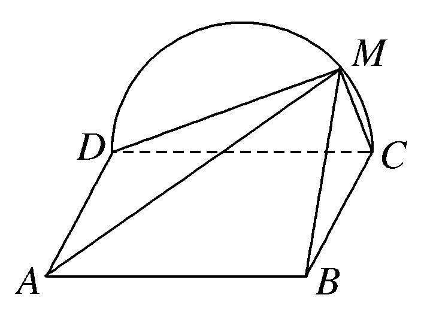
解析　（1）由题设知，平面*CMD*⊥平面*ABCD*，交线为*CD*．
因为*BC*⊥*CD*，*BC*⊂平面*ABCD*，所以*BC*⊥平面*CMD*，所以*BC*⊥*DM*．

因为*M*为上异于*C*，*D*的点，且*DC*为直径，所以*DM*⊥*CM*．
又*BC*∩*CM*＝*C*，所以*DM*⊥平面*BMC*．因为*DM*⊂平面*AMD*，所以平面*AMD*⊥平面*BMC*．  
（2）当*P*为*AM*的中点时，*MC*∥平面*PBD*．证明如下：

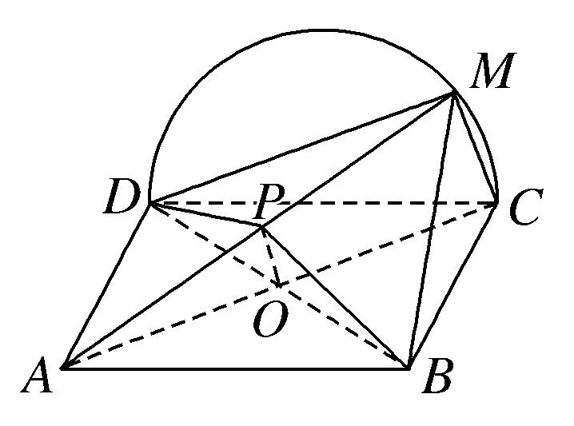

连接*AC*交*BD*于*O*．因为四边形*ABCD*为矩形，所以*O*为*AC*的中点．

连接*OP*，因为*P*为*AM*的中点，所以*MC*∥*OP*．
又*MC*⊄平面*PBD*，*OP*⊂平面*PBD*，所以*MC*∥平面*PBD*．

<strong>[例2]</strong> (2019·北京)如图，在四棱锥<em>P</em>－<em>ABCD</em>中，<em>PA</em>⊥平面<em>ABCD</em>，底面<em>ABCD</em>为菱形，<em>E</em>为<em>CD</em>的中点．  
（1）求证：*BD*⊥平面*PAC*；  
（2）若∠*ABC*＝60°，求证：平面*PAB*⊥平面*PAE*；  
（3）棱*PB*上是否存在点*F*，使得*CF*∥平面*PAE*？说明理由．

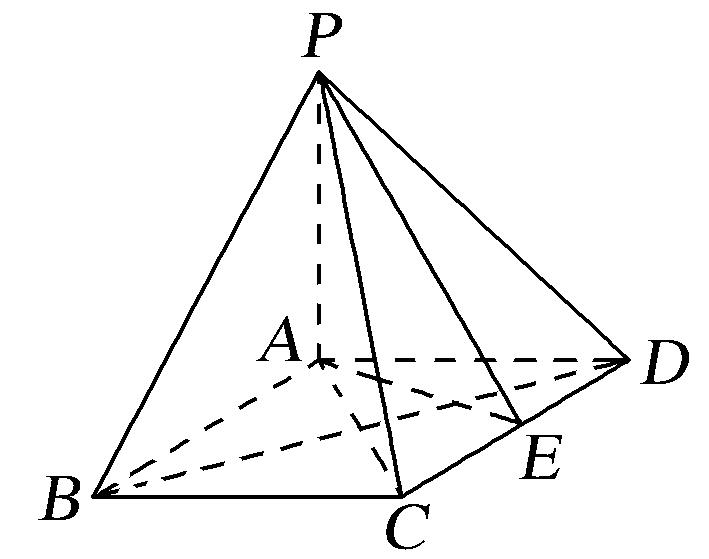
解析　（1）因为*PA*⊥平面*ABCD*，*BD*⊂平面*ABCD*，所以*PA*⊥*BD*．
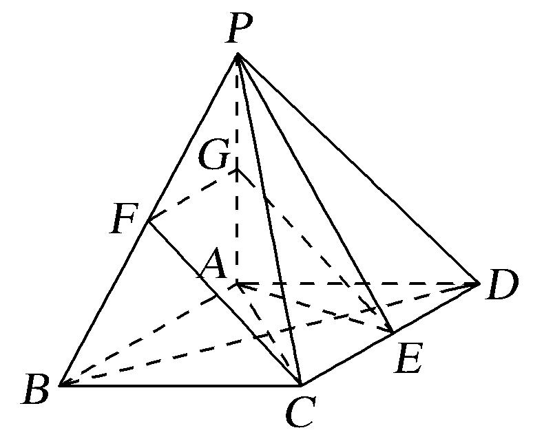
因为底面*ABCD*为菱形，所以*BD*⊥*AC*．又*PA*∩*AC*＝*A*，所以*BD*⊥平面*PAC*．  
（2）因为*PA*⊥平面*ABCD*，*AE*⊂平面*ABCD*，所以*PA*⊥*AE*．
因为底面*ABCD*为菱形，∠*ABC*＝60°，且*E*为*CD*的中点，
所以*AE*⊥*CD*．又因为*AB*∥*CD*，所以*AB*⊥*AE*．又*AB*∩*PA*＝*A*，所以*AE*⊥平面*PAB*．
因为*AE*⊂平面*PAE*，所以平面*PAB*⊥平面*PAE*．  
（3）棱*PB*上存在点*F*，使得*CF*∥平面*PAE*．理由如下：

取*PB*的中点*F*，*PA*的中点*G*，连接*CF*，*FG*，*EG*，则*FG*∥*AB*，且*FG*＝*AB*．
因为底面*ABCD*为菱形，且*E*为*CD*的中点，所以*CE*∥*AB*，且*CE*＝*AB*．
所以*FG*∥*CE*，且*FG*＝*CE*．所以四边形*CEGF*为平行四边形．所以*CF*∥*EG*．
因为*CF*⊄平面*PAE*，*EG*⊂平面*PAE*，所以*CF*∥平面*PAE*．

<strong>[例3]</strong> (2016·北京)如图，在四棱锥<em>P</em>－<em>ABCD</em>中，<em>PC</em>⊥平面<em>ABCD</em>，<em>AB</em>∥<em>DC</em>，<em>DC</em>⊥<em>AC</em>．  
（1）求证：*DC*⊥平面*PAC*．  
（2）求证：平面*PAB*⊥平面*PAC*．  
（3）设点*E*为*AB*的中点，在棱*PB*上是否存在点*F*，使得*PA*∥平面*CEF*？说明理由．

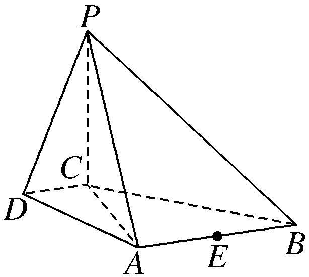
解析　（1）因为*PC*⊥平面*ABCD*，所以*PC*⊥*DC*．
又因为*DC*⊥*AC*，且*PC*∩*AC*＝*C*，所以*DC*⊥平面*PAC*．  
（2）因为*AB*∥*DC*，*DC*⊥*AC*，所以*AB*⊥*AC*．因为*PC*⊥平面*ABCD*，所以*PC*⊥*AB*．
又因为*PC*∩*AC*＝*C*，所以*AB*⊥平面*PAC*．又*AB*⊂平面*PAB*，所以平面*PAB*⊥平面*PAC*．

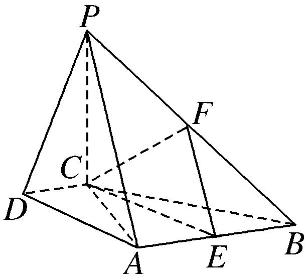  
（3）棱*PB*上存在点*F*，使得*PA*∥平面*CEF*．理由如下：

取*PB*的中点*F*，连接*EF*，*CE*，*CF*．因为*E*为*AB*的中点，所以*EF*∥*PA*．
又因为*PA*⊄平面*CEF*，且*EF*⊂平面*CEF*，所以*PA*∥平面*CEF*．

<strong>[例4]</strong> (2014·四川)在如图所示的多面体中，四边形<em>ABB</em>1<em>A</em>1和<em>ACC</em>1<em>A</em>1都为矩形．  
（1）若<em>AC</em>⊥<em>BC</em>，证明：直线<em>BC</em>⊥平面<em>ACC</em>1<em>A</em>1；  
（2）设<em>D</em>，<em>E</em>分别是线段<em>BC</em>，<em>CC</em>1的中点，在线段<em>AB</em>上是否存在一点<em>M</em>，使直线<em>DE</em>∥平面<em>A</em>1<em>MC</em>？请证明你的结论．

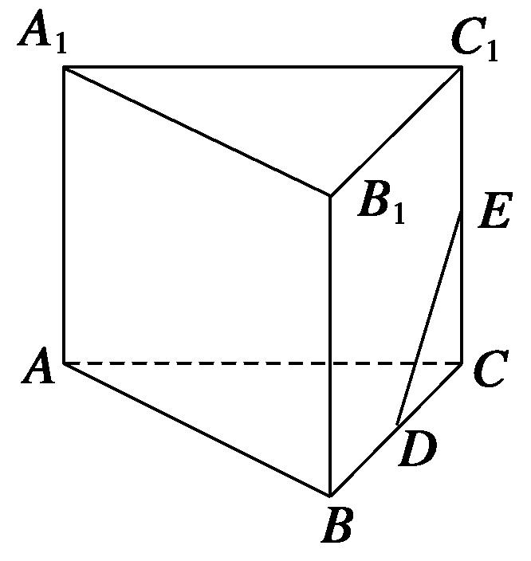
解析　（1）因为四边形<em>ABB</em>1<em>A</em>1和<em>ACC</em>1<em>A</em>1都是矩形，所以<em>AA</em>1⊥<em>AB</em>，<em>AA</em>1⊥<em>AC</em>．
因为<em>AB</em>，<em>AC</em>为平面<em>ABC</em>内两条相交的直线，所以<em>AA</em>1⊥平面<em>ABC</em>．
因为直线<em>BC</em>⊂平面<em>ABC</em>，所以<em>AA</em>1⊥<em>BC</em>．
又由已知，<em>AC</em>⊥<em>BC</em>，<em>AA</em>1和<em>AC</em>为平面<em>ACC</em>1<em>A</em>1内两条相交的直线，所以<em>BC</em>⊥平面<em>ACC</em>1<em>A</em>1．

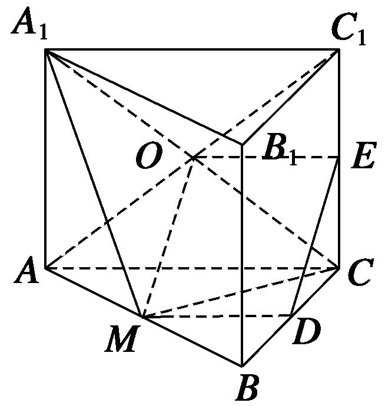  
（2）取线段<em>AB</em>的中点<em>M</em>，连接<em>A</em>1<em>M</em>，<em>MC</em>，<em>A</em>1<em>C</em>，<em>AC</em>1，设点<em>O</em>为<em>A</em>1<em>C</em>，<em>AC</em>1的交点．
由已知，点<em>O</em>为<em>AC</em>1的中点．连接<em>MD</em>，<em>OE</em>，则<em>MD</em>，<em>OE</em>分别为△<em>ABC</em>，△<em>ACC</em>1的中位线，

所以*MDAC*，*OEAC*，因此*MD*綊*OE*．连接*OM*，从而四边形*MDEO*为平行四边形，则*DE*∥*MO*．
因为直线<em>DE</em>⊄平面<em>A</em>1<em>MC</em>，<em>MO</em>⊂平面<em>A</em>1<em>MC</em>，所以直线<em>DE</em>∥平面<em>A</em>1<em>MC</em>．
即线段<em>AB</em>上存在一点<em>M</em>(线段<em>AB</em>的中点)，使直线<em>DE</em>∥平面<em>A</em>1<em>MC</em>．

<strong>[例5]</strong>如图，在四棱锥<em>P</em>—<em>ABCD</em>中，△<em>PAD</em>为正三角形，平面<em>PAD</em>⊥平面<em>ABCD</em>，<em>AB</em>∥<em>CD</em>，<em>AB</em>⊥<em>AD</em>，<em>CD</em>＝2<em>AB</em>＝2<em>AD</em>＝4．  
（1）求证：平面*PCD*⊥平面*PAD*；  
（2）求三棱锥*P*—*ABC*的体积；  
（3）在棱*PC*上是否存在点*E*，使得*BE*∥平面*PAD*？若存在，请确定点*E*的位置并证明；若不存在，请说明理由．

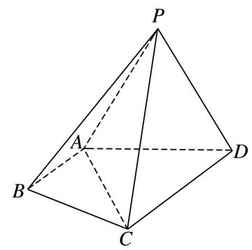
解析　（1）因为*AB*∥*CD*，*AB*⊥*AD*，所以*CD*⊥*AD*．
因为平面*PAD*⊥平面*ABCD*，平面*PAD*∩平面*ABCD*＝*AD*，所以*CD*⊥平面*PAD*．
因为*CD*⊂平面*PCD*，所以平面*PCD*⊥平面*PAD*．

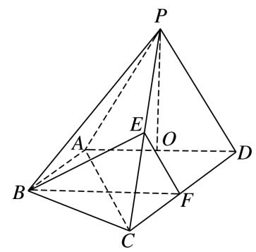  
（2）取*AD*的中点*O*，连接*PO*．因为△*PAD*为正三角形，所以*PO*⊥*AD*．
因为平面*PAD*⊥平面*ABCD*，平面*PAD*∩平面*ABCD*＝*AD*，*PO*⊂平面*PAD*，
所以*PO*⊥平面*ABCD*，所以*PO*为三棱锥*P*—*ABC*的高．
因为△*PAD*为正三角形，*CD*＝2*AB*＝2*AD*＝4，所以*PO*＝．
所以<em>V</em>三棱锥<em>P</em>—<em>ABC</em>＝<em>S</em>△<em>ABC</em>·<em>PO</em>＝××2×2×＝．  
（3）在棱*PC*上存在点*E*，当*E*为*PC*的中点时，*BE*∥平面*PAD*．
分别取*CP*，*CD*的中点*E*，*F*，连接*BE*，*BF*，*EF*，所以*EF*∥*PD*．因为*AB*∥*CD*，*CD*＝2*AB*，
所以*AB*∥*FD*，*AB*＝*FD*，所以四边形*ABFD*为平行四边形，所以*BF*∥*AD*．
因为*BF*∩*EF*＝*F*，*AD*∩*PD*＝*D*，所以平面*BEF*∥平面*PAD*．因为*BE*⊂平面*BEF*，所以*BE*∥平面*PAD*．

<strong>[例6]</strong>如图1，已知菱形<em>AECD</em>的对角线<em>AC</em>，<em>DE</em>交于点<em>F</em>，点<em>E</em>为<em>AB</em>中点．将△<em>ADE</em>沿线段<em>DE</em>折起到△<em>PDE</em>的位置，如图2所示．  
（1）求证：*DE*⊥平面*PCF*；  
（2）求证：平面*PBC*⊥平面*PCF*；  
（3）在线段*PD*，*BC*上是否分别存在点*M*，*N*，使得平面*CFM*∥平面*PEN*？若存在，请指出点*M*，*N*的位置，并证明；若不存在，请说明理由．

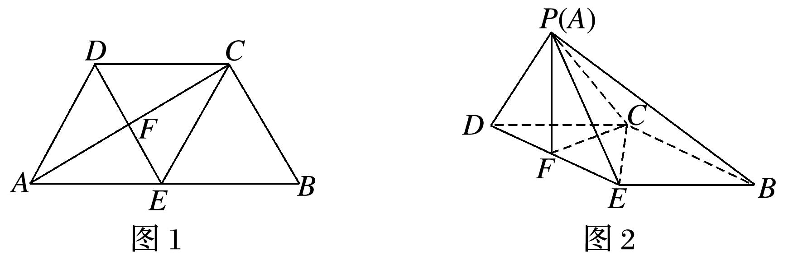
解析　（1）折叠前，因为四边形*AECD*为菱形，所以*AC*⊥*DE*，所以折叠后，*DE*⊥*PF*，*DE*⊥*CF*，
又*PF*∩*CF*＝*F*，*PF*，*CF*⊂平面*PCF*，所以*DE*⊥平面*PCF*．  
（2）因为四边形*AECD*为菱形，所以*DC*∥*AE*，*DC*＝*AE*．
又点*E*为*AB*的中点，所以*DC*∥*EB*，*DC*＝*EB*，所以四边形*DEBC*为平行四边形，所以*CB*∥*DE*．
又由（1）得，*DE*⊥平面*PCF*，所以*CB*⊥平面*PCF*．因为*CB*⊂平面*PBC*，所以平面*PBC*⊥平面*PCF*．  
（3）存在满足条件的点*M*，*N*，且*M*，*N*分别是*PD*和*BC*的中点．

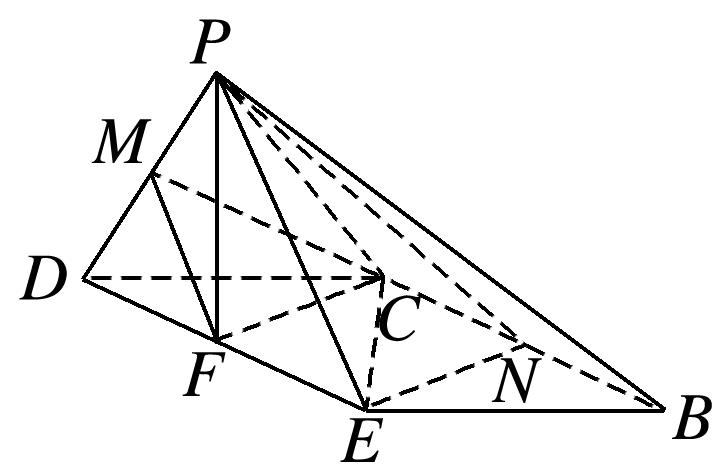
如图，分别取*PD*和*BC*的中点*M*，*N*．连接*EN*，*PN*，*MF*，*CM*．
因为四边形*DEBC*为平行四边形，所以*EF*∥*CN*，*EF*＝*BC*＝*CN*，
所以四边形*ENCF*为平行四边形，所以*FC*∥*EN*．
在△*PDE*中，*M*，*F*分别为*PD*，*DE*的中点，所以*MF*∥*PE*．
又*EN*，*PE*⊂平面*PEN*，*PE*∩*EN*＝*E*，*MF*，*CF*⊂平面*CFM*，*MF*∩*CF*＝*F*，
所以平面*CFM*∥平面*PEN*．

【对点训练】

1．(2016·四川)如图，在四棱锥*P*－*ABCD*中，*PA*⊥*CD*，*AD*∥*BC*，∠*ADC*＝∠*PAB*＝90°，*BC*＝*CD*＝*AD．*  
（1）在平面*PAD*内找一点*M*，使得直线*CM*∥平面*PAB*，并说明理由；  
（2）证明：平面*PAB*⊥平面*PBD．*

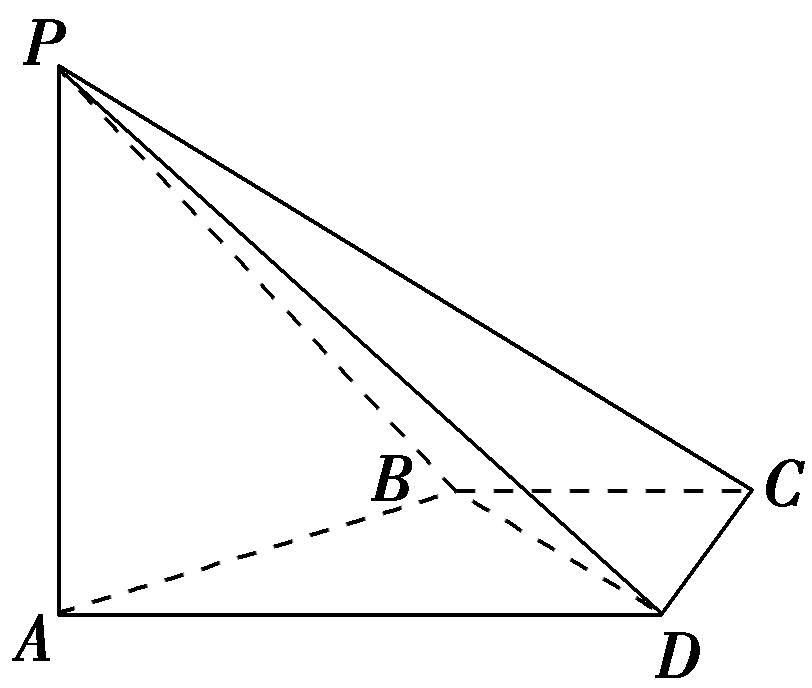

1．解析　（1）取棱*AD*的中点*M*(*M*∈平面*PAD*)，点*M*即为所求的一个点．理由如下：
因为*AD*∥*BC*，*BC*＝*AD*，所以*BC*∥*AM*，且*BC*＝*AM*，所以四边形*AMCB*是平行四边形，
从而*CM*∥*AB．* 又*AB*⊂平面*PAB*，*CM*⊄平面*PAB*，所以*CM*∥平面*PAB．*

(说明：取棱*PD*的中点*N*，则所找的点可以是直线*MN*上任意一点)

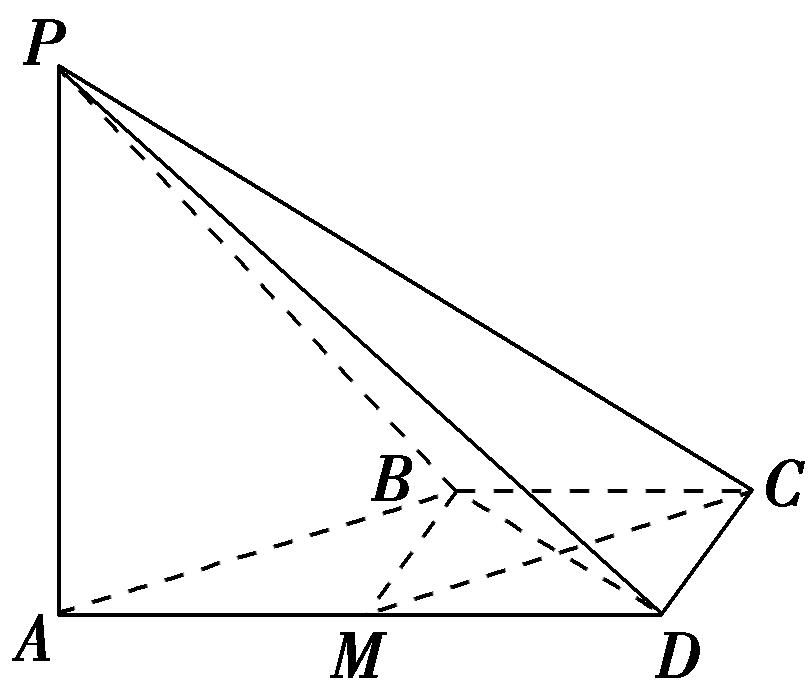  
（2）由已知，*PA*⊥*AB*，*PA*⊥*CD*，因为*AD*∥*BC*，*BC*＝*AD*，所以直线*AB*与*CD*相交．
所以*PA*⊥平面*ABCD*，从而*PA*⊥*BD．* 连接*BM*，因为*AD*∥*BC*，*BC*＝*AD*，
所以*BC*∥*MD*，且*BC*＝*MD．* 所以四边形*BCDM*是平行四边形．
所以*BM*＝*CD*＝*AD*，所以*BD*⊥*AB．* 又*AB*∩*AP*＝*A*，所以*BD*⊥平面*PAB．* 又*BD*⊂平面*PBD*，
所以平面*PAB*⊥平面*PBD．*

2．如图，在四棱锥*P*－*ABCD*中，底面*ABCD*为梯形，*AB*∥*CD*，*AB*⊥*BC*，*AB*＝2，*PA*＝*PD*＝*CD*＝*BC*

＝1，面*PAD*⊥面*ABCD*，*E*为*AD*的中点．  
（1）求证：*PA*⊥*BD*；  
（2）在线段*AB*上是否存在一点*G*，使得*BC*∥面*PEG*？若存在，请证明你的结论；若不存在，请说明理由．

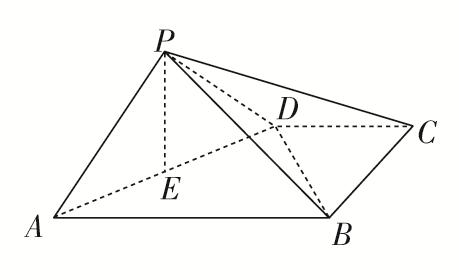

2．解析　（1）取*AB*的中点*F*，连接*DF*．∵*DC*∥*AB*且*DC*＝*AB*，∴*DC*∥*BF*且*DC*＝*BF*，
∴四边形*BCDF*为平行四边形，又*AB*⊥*BC*，*BC*＝*CD*＝1，∴四边形*BCDF*为正方形．
在Rt△*AFD*中，∵*DF*＝*AF*＝1，∴*AD*＝，在Rt△*BCD*中，∵*BC*＝*CD*＝1，∴*BD*＝，
∵<em>AB</em>＝2，∴<em>AD</em>2＋<em>BD</em>2＝<em>AB</em>2，∴<em>BD</em>⊥<em>AD</em>，
∵*BD*⊂面*ABCD*，面*PAD*∩面*ABCD*＝*AD*，面*PAD*⊥面*ABCD*，
∴*BD*⊥面*PAD*，∵*PA*⊂面*PAD*，∴*PA*⊥*BD*．

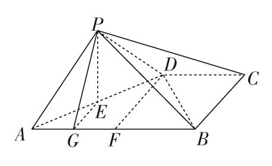  
（2）在线段*AB*上存在一点*G*，满足*AG*＝*AB*，即*G*为*AF*的中点时，*BC*∥面*PEG*，证明如下：

连接*EG*，∵*E*为*AD*的中点，*G*为*AF*中点，∴*GE*∥*DF*，
又*DF*∥*BC*，∴*GE*∥*BC*，∵*GE*⊂面*PEG*，*BC*⊄面*PEG*，∴*BC*∥面*PEG*．

3．如图，在四棱锥*P*－*ABCD*中，*PD*⊥平面*ABCD*，底面*ABCD*为正方形，*BC*＝*PD*＝2，*E*为*PC*的中点，

*CB*＝3*CG*．  
（1）求证：*PC*⊥*BC*；  
（2）*AD*边上是否存在一点*M*，使得*PA*∥平面*MEG*？若存在，求出*AM*的长；若不存在，请说明理由．

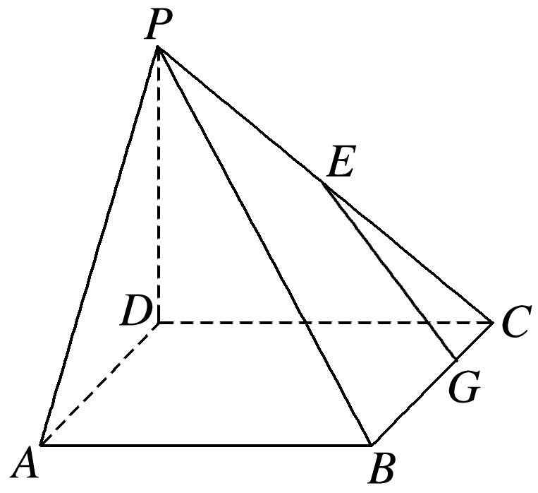

3．解析　（1）因为*PD*⊥平面*ABCD*，*BC*⊂平面*ABCD*，所以*PD*⊥*BC*．
因为四边形*ABCD*是正方形，所以*BC*⊥*CD*．
又*PD*∩*CD*＝*D*，*PD*，*CD*⊂平面*PCD*，所以*BC*⊥平面*PCD*．
因为*PC*⊂平面*PDC*，所以*PC*⊥*BC*．

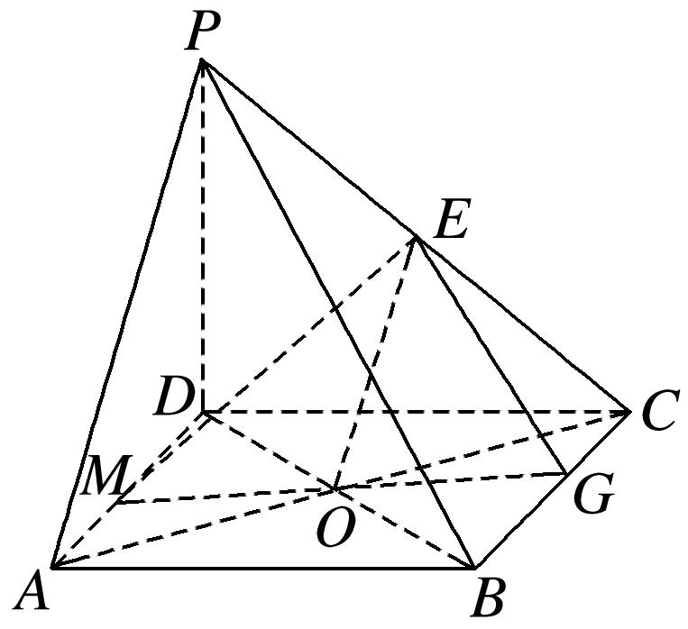  
（2）连接*AC*，*BD*交于点*O*，连接*EO*，*GO*，延长*GO*交*AD*于点*M*，连接*EM*，则*PA*∥平面*MEG*．
证明如下：因为*E*为*PC*的中点，*O*是*AC*的中点，所以*EO*∥*PA*．
因为*EO*⊂平面*MEG*，*PA*⊄平面*MEG*，所以*PA*∥平面*MEG*．因为△*OCG*≌△*OAM*，
所以*AM*＝*CG*＝，所以*AM*的长为．

4．在四棱锥*P*－*ABCD*中，底面*ABCD*是边长为6的菱形，且∠*ABC*＝60°，*PA*⊥平面*ABCD*，*PA*＝6，*F*

是棱*PA*上的一动点，*E*为*PD*的中点．  
（1）求证：平面*BDF*⊥平面*ACF*；  
（2）若*AF*＝2，侧面*PAD*内是否存在过点*E*的一条直线，使得直线上任一点*M*都有*CM*∥平面*BDF*，若存在，给出证明；若不存在，请说明理由．

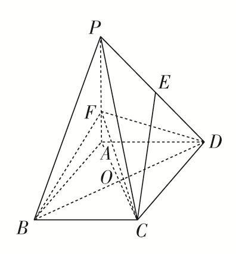

4．解析　（1）由题意可知，*PA*⊥平面*ABCD*，则*BD*⊥*PA*，又底面*ABCD*是菱形，
所以*BD*⊥*AC*，*PA*，*AC*为平面*PAC*内两相交直线，
所以*BD*⊥平面*PAC*，*BD*为平面*BDF*内一直线，从而平面*BDF*⊥平面*ACF*．  
（2）侧面*PAD*内存在过点*E*的一条直线，使得直线上任一点*M*都有*CM*∥平面*BDF*．

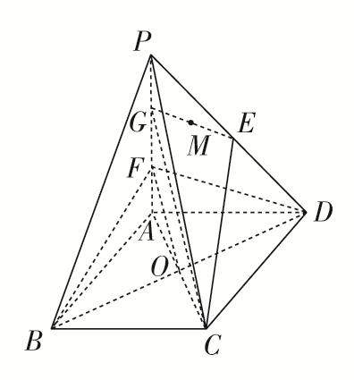
设*G*是*PF*的中点，连接*EG*，*CG*，*OF*，则⇒平面*CEG*∥平面*BDF*，
所以直线*EG*上任一点*M*都满足*CM*∥平面*BDF*．

5．如图，四棱锥*P*—*ABCD*中，*PD*⊥平面*ABCD*，底面*ABCD*为矩形，*PD*＝*DC*＝4，*AD*＝2，*E*为*PC*的

中点．  
（1）求三棱锥*A*—*PDE*的体积；  
（2）*AC*边上是否存在一点*M*，使得*PA*∥平面*EDM*？若存在，求出*AM*的长；若不存在，请说明理由．

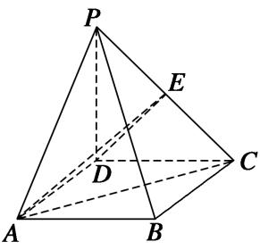

5．解析　（1）因为*PD*⊥平面*ABCD*，所以*PD*⊥*AD*．又因*ABCD*是矩形，所以*AD*⊥*CD*．

因*PD*∩*CD*＝*D*，所以*AD*⊥平面*PCD*，所以*AD*是三棱锥*A*—*PDE*的高．
因为<em>E</em>为<em>PC</em>的中点，且<em>PD</em>＝<em>DC</em>＝4，所以<em>S</em>△<em>PDE</em>＝<em>S</em>△<em>PDC</em>＝×＝4．
又<em>AD</em>＝2，所以<em>VA</em>—<em>PDE</em>＝<em>AD</em>·<em>S</em>△<em>PDE</em>＝×2×4＝．

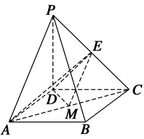  
（2）取*AC*中点*M*，连接*EM*，*DM*，因为*E*为*PC*的中点，*M*是*AC*的中点，所以*EM*∥*PA*．
又因为*EM*⊂平面*EDM*，*PA*⊄平面*EDM*，所以*PA*∥平面*EDM*．
所以*AM*＝*AC*＝．即在*AC*边上存在一点*M*，使得*PA*∥平面*EDM*，*AM*的长为．

6．如图，在四棱锥*S*－*ABCD*中，已知底面*ABCD*为直角梯形，其中*AD*∥*BC*，∠*BAD*＝90°，*SA*⊥底面

*ABCD*，*SA*＝*AB*＝*BC*＝2．tan∠*SDA*＝．  
（1）求四棱锥*S*－*ABCD*的体积；  
（2）在棱*SD*上找一点*E*，使*CE*∥平面*SAB*，并证明．

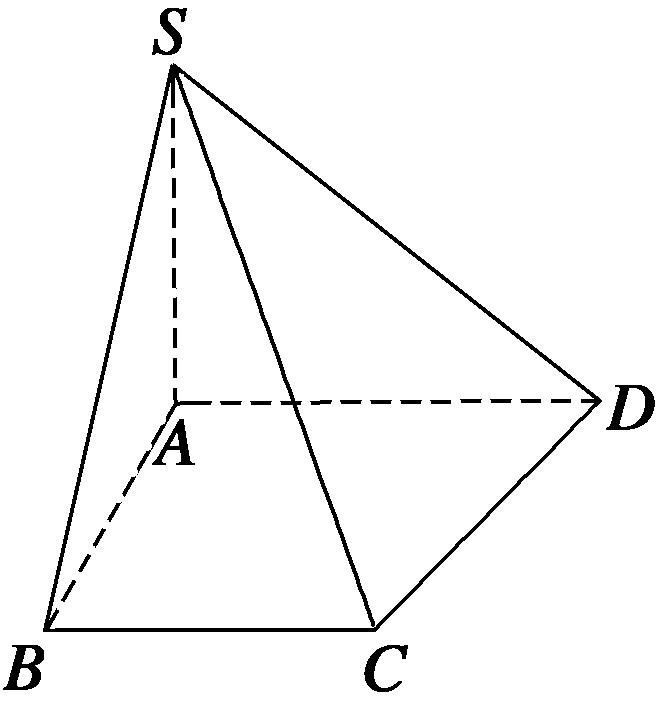

6．解析　（1）∵*SA*⊥底面*ABCD*，tan∠*SDA*＝，*SA*＝2，∴*AD*＝3．
由题意知四棱锥*S*－*ABCD*的底面为直角梯形，且*SA*＝*AB*＝*BC*＝2，

<em>VS</em>－<em>ABCD</em>＝×<em>SA</em>××(<em>BC</em>＋<em>AD</em>)×<em>AB</em>＝×2××(2＋3)×2＝．

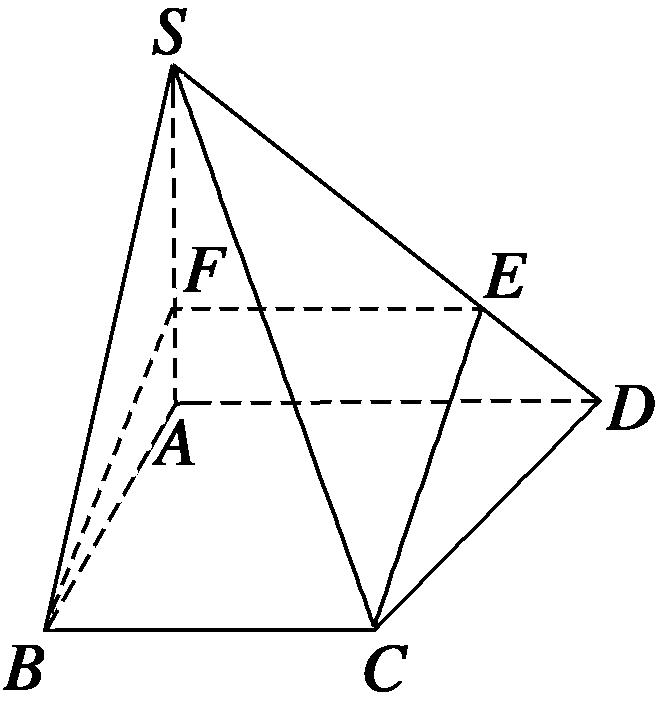  
（2）当点*E*位于棱*SD*上靠近*D*的三等分点处时，可使*CE*∥平面*SAB*．

取*SD*上靠近*D*的三等分点为*E*，取*SA*上靠近*A*的三等分点为*F*，连接*CE*，*EF*，*BF*，

则*EFAD*，*BCAD*，∴*BCEF*，∴*CE*∥*BF*．
又∵*BF*⊂平面*SAB*，*CE*⊄平面*SAB*，∴*CE*∥平面*SAB*．

7．如图，四棱锥*P－ABCD*的底面*ABCD*是圆内接四边形(记此圆为*W*)，且*PA*⊥平面*ABCD*．  
（1）当*BD*是圆*W*的直径时，*PA*＝*BD*＝2，*AD*＝*CD*＝，求四棱锥*P－ABCD*的体积．  
（2）在（1）的条件下，判断在棱*PA*上是否存在一点*Q*，使得*BQ*∥平面*PCD*？若存在，求出*AQ*的长；若不存在，请说明理由．

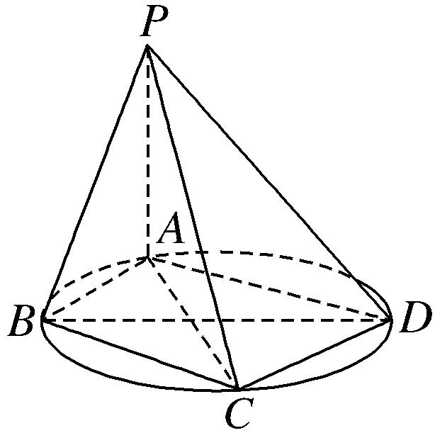

7．解析　（1）因为*BD*是圆*W*的直径，所以*BA*⊥*AD*，因为*BD*＝2，*AD*＝，所以*AB*＝1．

同理<em>BC</em>＝1，所以<em>S</em>四边形<em>ABCD</em>＝<em>AB</em>·<em>AD</em>＝．
因为<em>PA</em>⊥平面<em>ABCD</em>，<em>PA</em>＝2，所以四棱锥<em>P</em>­<em>ABCD</em>的体积<em>V</em>＝<em>S</em>四边形<em>ABCD</em>·<em>PA</em>＝．  
（2）存在，*A*Q＝．理由如下．

延长*AB*，*DC*交于点*E*，连接*PE*，则平面*PAB*与平面*PCD*的交线是*PE*．
假设在棱*PA*上存在一点Q，使得*B*Q∥平面*PCD*，则*B*Q∥*PE*，所以＝．
经计算可得*BE*＝2，所以*AE*＝*AB*＋*BE*＝3，所以*A*Q＝．
故存在这样的点Q，使*B*Q∥平面*PCD*，且*A*Q＝．

8．如图，在四棱锥*P*－*ABCD*中，*AB*∥*CD*，*AB*＝2*CD*，*E*为*PB*的中点．  
（1）求证：*CE*∥平面*PAD*；  
（2）在线段*AB*上是否存在一点*F*，使得平面*PAD*∥平面*CEF*？若存在，证明你的结论，若不存在，请说明理由．

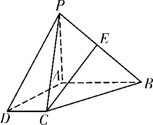

8．解析　（1）证明：取*PA*的中点*H*，连接*EH*，*DH*．因为*E*为*PB*的中点，所以*EH*∥*AB*，*EH*＝*AB*，
又*AB*∥*CD*，*CD*＝*AB*，所以*EH*∥*CD*，*EH*＝*CD*，因此四边形*DCEH*是平行四边形，所以*CE*∥*DH*，
又*DH*⊂平面*PAD*，*CE*⊄平面*PAD*，故*CE*∥平面*PAD*．

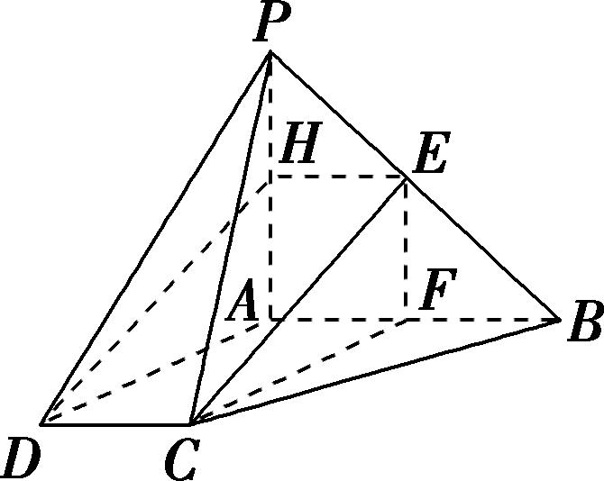  
（2）存在点*F*为*AB*的中点，使平面*PAD*∥平面*CEF*．证明如下：

取*AB*的中点*F*，连接*CF*，*EF*，所以*AF*＝*AB*，又*CD*＝*AB*，所以*AF*＝*CD*，
又*AF*∥*CD*，所以四边形*AFCD*为平行四边形，因此*CF*∥*AD*，又*CF*⊄平面*PAD*，所以*CF*∥平面*PAD*，由（1）可知*CE*∥平面*PAD*，又*CE*∩*CF*＝*C*，故平面*CEF*∥平面*PAD*，故存在*AB*的中点*F*满足要求．

9．如图，在直四棱柱<em>ABCD</em>－<em>A</em>1<em>B</em>1<em>C</em>1<em>D</em>1中，已知<em>DC</em>＝<em>DD</em>1＝2<em>AD</em>＝2<em>AB</em>，<em>AD</em>⊥<em>DC</em>，<em>AB</em>∥<em>DC</em>．  
（1）求证：<em>D</em>1<em>C</em>⊥<em>AC</em>1；  
（2）问在棱<em>CD</em>上是否存在点<em>E</em>，使<em>D</em>1<em>E</em>∥平面<em>A</em>1<em>BD</em>．若存在，确定点<em>E</em>位置；若不存在，说明理由．

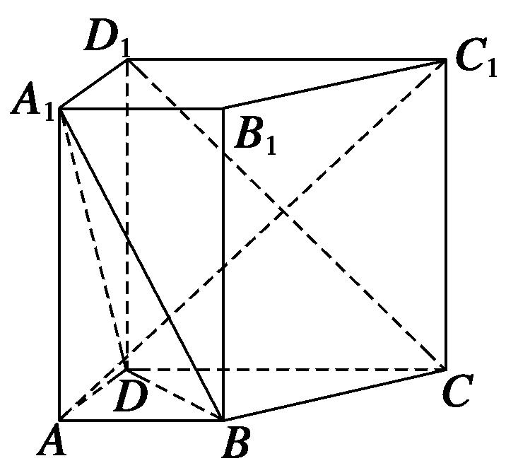

9．解析　（1）在直四棱柱<em>ABCD</em>－<em>A</em>1<em>B</em>1<em>C</em>1<em>D</em>1中，连接<em>C</em>1<em>D</em>，∵<em>DC</em>＝<em>DD</em>1，∴四边形<em>DCC</em>1<em>D</em>1是正方形，
∴<em>DC</em>1⊥<em>D</em>1<em>C</em>．又<em>AD</em>⊥<em>DC</em>，<em>AD</em>⊥<em>DD</em>1，<em>DC</em>∩<em>DD</em>1＝<em>D</em>，∴<em>AD</em>⊥平面<em>DCC</em>1<em>D</em>1，又<em>D</em>1<em>C</em>⊂平面<em>DCC</em>1<em>D</em>1，
∴<em>AD</em>⊥<em>D</em>1<em>C</em>．∵<em>AD</em>⊂平面<em>ADC</em>1，<em>DC</em>1⊂平面<em>ADC</em>1，且<em>AD</em>∩<em>DC</em>1＝<em>D</em>，∴<em>D</em>1<em>C</em>⊥平面<em>ADC</em>1，
又<em>AC</em>1⊂平面<em>ADC</em>1，∴<em>D</em>1<em>C</em>⊥<em>AC</em>1．

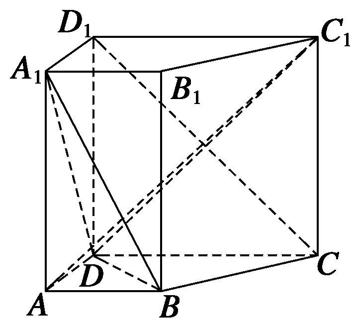

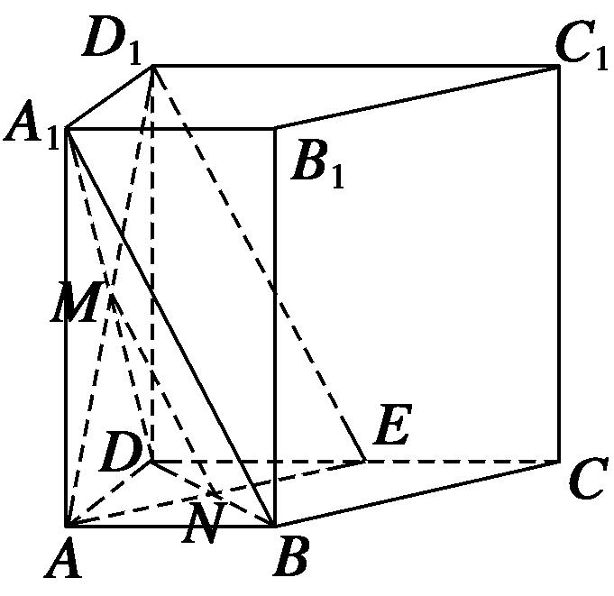  
（2）假设存在点<em>E</em>，使<em>D</em>1<em>E</em>∥平面<em>A</em>1<em>BD</em>．连接<em>AD</em>1，<em>AE</em>，<em>D</em>1<em>E</em>，设<em>AD</em>1∩<em>A</em>1<em>D</em>＝<em>M</em>，

<em>BD</em>∩<em>AE</em>＝<em>N</em>，连接<em>MN</em>，∵平面<em>AD</em>1<em>E</em>∩平面<em>A</em>1<em>BD</em>＝<em>MN</em>，要使<em>D</em>1<em>E</em>∥平面<em>A</em>1<em>BD</em>，可使<em>MN</em>∥<em>D</em>1<em>E</em>，
又<em>M</em>是<em>AD</em>1的中点，则<em>N</em>是<em>AE</em>的中点．又易知△<em>ABN</em>≌△<em>EDN</em>，∴<em>AB</em>＝<em>DE</em>．即<em>E</em>是<em>DC</em>的中点．
综上所述，当<em>E</em>是<em>DC</em>的中点时，可使<em>D</em>1<em>E</em>∥平面<em>A</em>1<em>BD</em>．

10．如图，在多面体*ABCDEF*中，四边形*ABCD*是梯形，*AB*∥*CD*，*AD*＝*DC*＝*CB*＝*a*，∠*ABC*＝60°，四

边形*ACFE*是矩形，且平面*ACFE*⊥平面*ABCD*，点*M*在线段*EF*上．  
（1）求证：*BC*⊥平面*ACFE*；  
（2）当*EM*为何值时，*AM*∥平面*BDF*？证明你的结论．

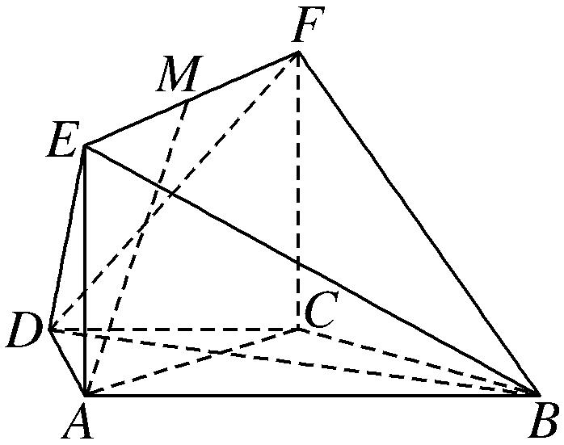

10．解析　（1）证明：在梯形*ABCD*中，因为*AB*∥*CD*，*AD*＝*DC*＝*CB*＝*a*，∠*ABC*＝60°，
所以四边形*ABCD*是等腰梯形，且∠*DCA*＝∠*DAC*＝30°，∠*DCB*＝120°，
所以∠*ACB*＝∠*DCB*－∠*DCA*＝90°，所以*AC*⊥*BC*．
又平面*ACFE*⊥平面*ABCD*，平面*ACFE*∩平面*ABCD*＝*AC*，*BC*⊂平面*ABCD*，
所以*BC*⊥平面*ACFE*．

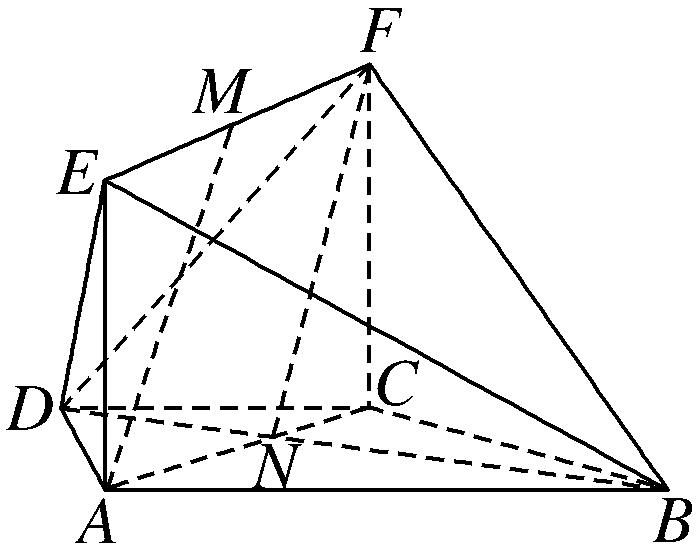  
（2）当*EM*＝*a*时，*AM*∥平面*BDF*，理由如下：
如图，在梯形*ABCD*中，设*AC*∩*BD*＝*N*，连接*FN*．
由（1）知四边形*ABCD*为等腰梯形，且∠*ABC*＝60°，所以*AB*＝2*DC*，则*CN*∶*NA*＝1∶2．

易知*EF*＝*AC*＝*a*，所以*AN*＝*a*．因为*EM*＝*a*，所以*MF*＝*EF*＝*a*，所以*MF*綊*AN*，
所以四边形*ANFM*是平行四边形，所以*AM*∥*NF*，又*NF*⊂平面*BDF*，*AM*⊄平面*BDF*，
所以*AM*∥平面*BDF*．

11．如图1，在矩形*ABCD*中，*AB*＝4，*AD*＝2，*E*是*CD*的中点，将△*ADE*沿*AE*折起，得到如图2所示

的四棱锥<em>D</em>1—<em>ABCE</em>，其中平面<em>D</em>1<em>AE</em>⊥平面<em>ABCE</em>．  
（1）证明：<em>BE</em>⊥平面<em>D</em>1<em>AE</em>；  
（2）设<em>F</em>为<em>CD</em>1的中点，在线段<em>AB</em>上是否存在一点<em>M</em>，使得<em>MF</em>∥平面<em>D</em>1<em>AE</em>，若存在，求出的值；若不存在，请说明理由．

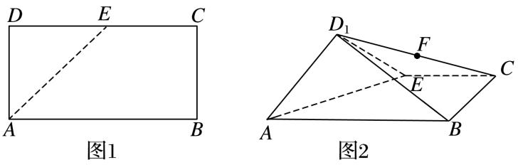

11．解析　（1）连接*BE*，∵*ABCD*为矩形且*AD*＝*DE*＝*EC*＝*BC*＝2，∴∠*AEB*＝90°，即*BE*⊥*AE*，
又平面<em>D</em>1<em>AE</em>⊥平面<em>ABCE</em>，平面<em>D</em>1<em>AE</em>∩平面<em>ABCE</em>＝<em>AE</em>，<em>BE</em>⊂平面<em>ABCE</em>，∴<em>BE</em>⊥平面<em>D</em>1<em>AE</em>．  
（2）<em>AM</em>＝<em>AB</em>，取<em>D</em>1<em>E</em>的中点<em>L</em>，连接<em>AL</em>，<em>FL</em>，∵<em>FL</em>∥<em>EC</em>，<em>EC</em>∥<em>AB</em>，∴<em>FL</em>∥<em>AB</em>且<em>FL</em>＝<em>AB</em>，
∴<em>M</em>，<em>F</em>，<em>L</em>，<em>A</em>四点共面，若<em>MF</em>∥平面<em>AD</em>1<em>E</em>，则<em>MF</em>∥<em>AL</em>．
∴*AMFL*为平行四边形，∴*AM*＝*FL*＝*AB*．故线段*AB*上存在满足题意的点*M*，且＝．

12．如图（1），在正△*ABC*中，*E*，*F*分别是*AB*，*AC*边上的点，且*BE*＝*AF*＝2*CF*．点*P*为边*BC*上的点，
将△<em>AEF</em>沿<em>EF</em>折起到△<em>A</em>1<em>EF</em>的位置，使平面<em>A</em>1<em>EF</em>⊥平面<em>BEFC</em>，连接<em>A</em>1<em>B</em>，<em>A</em>1<em>P</em>，<em>EP</em>，如图（2）所示．  
（1）求证：<em>A</em>1<em>E</em>⊥<em>FP</em>；  
（2）若<em>BP</em>＝<em>BE</em>，点<em>K</em>为棱<em>A</em>1<em>F</em>的中点，则在平面<em>A</em>1<em>FP</em>上是否存在过点<em>K</em>的直线与平面<em>A</em>1<em>BE</em>平行，若存在，请给予证明；若不存在，请说明理由．

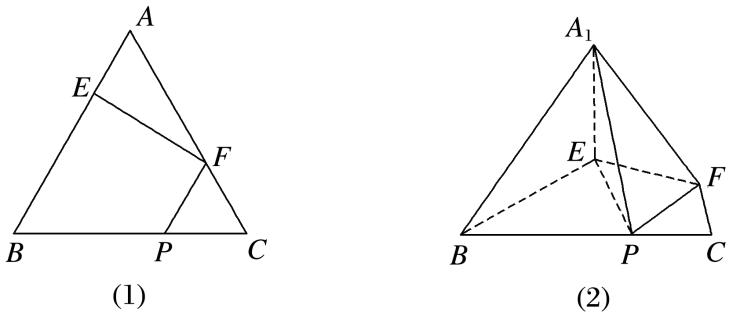

12．解析　（1）在正△*ABC*中，取*BE*的中点*D*，连接*DF*，如图所示．

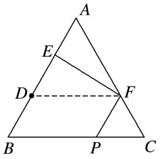
因为*BE*＝*AF*＝2*CF*，所以*AF*＝*AD*，*AE*＝*DE*，而∠*A*＝60°，所以△*ADF*为正三角形．
又<em>AE</em>＝<em>DE</em>，所以<em>EF</em>⊥<em>AD</em>．所以在题图（2）中，<em>A</em>1<em>E</em>⊥<em>EF</em>，
又<em>A</em>1<em>E</em>⊂平面<em>A</em>1<em>EF</em>，平面<em>A</em>1<em>EF</em>⊥平面<em>BEFC</em>，且平面<em>A</em>1<em>EF</em>∩平面<em>BEFC</em>＝<em>EF</em>，
所以<em>A</em>1<em>E</em>⊥平面<em>BEFC</em>．因为<em>FP</em>⊂平面<em>BEFC</em>，所以<em>A</em>1<em>E</em>⊥<em>FP</em>．  
（2）在平面<em>A</em>1<em>FP</em>上存在过点<em>K</em>的直线与平面<em>A</em>1<em>BE</em>平行．

理由如下：

如题图（1），在正△*ABC*中，因为*BP*＝*BE*，*BE*＝*AF*，所以*BP*＝*AF*，所以*FP*∥*AB*，所以*FP*∥*BE*．

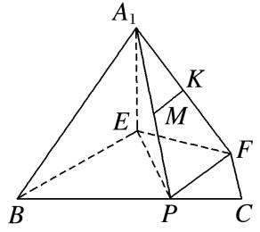
如图所示，取<em>A</em>1<em>P</em>的中点<em>M</em>，连接<em>MK</em>，因为点<em>K</em>为棱<em>A</em>1<em>F</em>的中点，所以<em>MK</em>∥<em>FP</em>．
因为<em>FP</em>∥<em>BE</em>，所以<em>MK</em>∥<em>BE</em>．因为<em>MK</em>⊄平面<em>A</em>1<em>BE</em>，<em>BE</em>⊂平面<em>A</em>1<em>BE</em>，所以<em>MK</em>∥平面<em>A</em>1<em>BE</em>．
故在平面<em>A</em>1<em>FP</em>上存在过点<em>K</em>的直线<em>MK</em>与平面<em>A</em>1<em>BE</em>平行．

考点二　探究垂直问题

【例题选讲】

<strong>[例1]</strong>如图所示，平面<em>ABCD</em>⊥平面<em>BCE</em>，四边形<em>ABCD</em>为矩形，<em>BC</em>＝<em>CE</em>，点<em>F</em>为<em>CE</em>的中点．  
（1）证明：*AE*∥平面*BDF*；  
（2）点*M*为*CD*上任意一点，在线段*AE*上是否存在点*P*，使得*PM*⊥*BE*？若存在，确定点*P*的位置，并加以证明；若不存在，请说明理由．

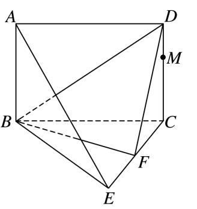
解析　（1）连接*AC*交*BD*于点*O*，连接*OF*．
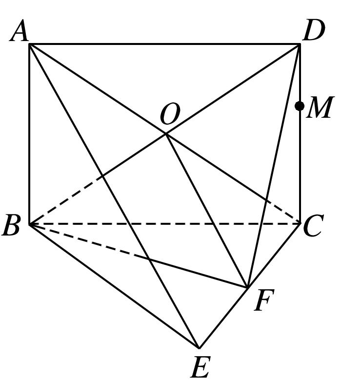
∵四边形*ABCD*是矩形，∴*O*为*AC*的中点．又*F*为*EC*的中点，∴*OF*∥*AE*．
又*OF*⊂平面*BDF*，*AE*⊄平面*BDF*，∴*AE*∥平面*BDF*．  
（2）当点*P*为*AE*的中点时，有*PM*⊥*BE*，证明如下：

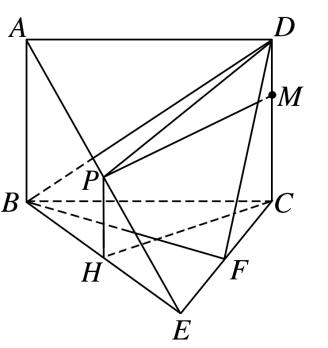

取*BE*的中点*H*，连接*DP*，*PH*，*CH*．∵*P*为*AE*的中点，*H*为*BE*的中点，∴*PH*∥*AB*．
又*AB*∥*CD*，∴*PH*∥*CD*，∴*P*，*H*，*C*，*D*四点共面．
∵平面*ABCD*⊥平面*BCE*，且平面*ABCD*∩平面*BCE*＝*BC*，*CD*⊥*BC*，

*CD*⊂平面*ABCD*，∴*CD*⊥平面*BCE*．又*BE*⊂平面*BCE*，∴*CD*⊥*BE*，
∵*BC*＝*CE*，且*H*为*BE*的中点，∴*CH*⊥*BE*．
又*CH*∩*CD*＝*C*，且*CH*，*CD*⊂平面*DPHC*，∴*BE*⊥平面*DPHC*．
又*PM*⊂平面*DPHC*，∴*PM*⊥*BE*．

<strong>[例2]</strong>在四棱锥<em>E</em>－<em>ABCD</em>中，底面<em>ABCD</em>是正方形，<em>AC</em>与<em>BD</em>交于点<em>O</em>，<em>EC</em>⊥底面<em>ABCD</em>，点<em>F</em>为<em>BE</em>的中点．  
（1）求证：*DE*∥平面*ACF*；  
（2）若*AB*＝*CE*，在线段*EO*上是否存在点*G*，使*CG*⊥平面*BDE*？若存在，求出的值；若不存在，请说明理由．

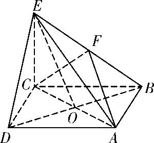
解析　（1）证明：连接*OF*，由四边形*ABCD*是正方形可知点*O*为*BD*的中点．又*F*为*BE*的中点，
所以*OF*∥*DE*．又*OF*⊂平面*ACF*，*DE*⊄平面*ACF*，所以*DE*∥平面*ACF*．

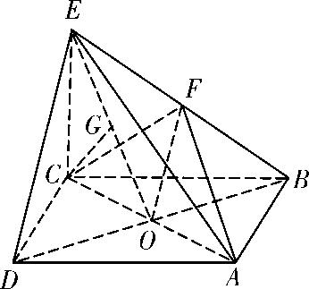  
（2）存在点*G*，此时＝．证明如下：
若*CG*⊥平面*BDE*，则必有*CG*⊥*OE*，于是作*CG*⊥*OE*于点*G*．
因为*EC*⊥底面*ABCD*，所以*BD*⊥*EC*，又底面*ABCD*是正方形，所以*BD*⊥*AC*，
又*EC*∩*AC*＝*C*，所以*BD*⊥平面*ACE*．而*CG*⊂平面*ACE*，所以*CG*⊥*BD*．
又*OE*∩*BD*＝*O*，所以*CG*⊥平面*BDE*．又*AB*＝*CE*，所以*CO*＝*AB*＝*CE*，
所以点*G*为*EO*的中点，所以＝．

<strong>[例3]</strong>如图（1），在Rt△<em>ABC</em>中，∠<em>C</em>＝90°，<em>D</em>，<em>E</em>分别为<em>AC</em>，<em>AB</em>的中点，点<em>F</em>为线段<em>CD</em>上的一点，将△<em>ADE</em>沿<em>DE</em>折起到△<em>A</em>1<em>DE</em>的位置，使<em>A</em>1<em>F</em>⊥<em>CD</em>，如图（2）．  
（1）求证：<em>DE</em>∥平面<em>A</em>1<em>CB</em>；  
（2）求证：<em>A</em>1<em>F</em>⊥<em>BE</em>；  
（3）线段<em>A</em>1<em>B</em>上是否存在点<em>Q</em>，使<em>A</em>1<em>C</em>⊥平面<em>DEQ</em>？请说明理由．

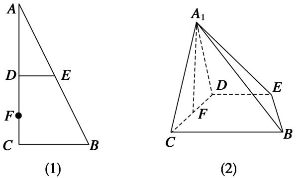
解析　（1）因为*D*，*E*分别为*AC*，*AB*的中点，所以*DE*∥*BC*．
又因为<em>DE</em>⊄平面<em>A</em>1<em>CB</em>，<em>BC</em>⊂平面<em>A</em>1<em>CB</em>，所以<em>DE</em>∥平面<em>A</em>1<em>CB</em>．  
（2）由题图（1）得<em>AC</em>⊥<em>BC</em>．且<em>DE</em>∥<em>BC</em>，所以<em>DE</em>⊥<em>AC</em>．所以<em>DE</em>⊥<em>A</em>1<em>D</em>，<em>DE</em>⊥<em>CD</em>．
所以<em>DE</em>⊥平面<em>A</em>1<em>DC</em>．而<em>A</em>1<em>F</em>⊂平面<em>A</em>1<em>DC</em>，所以<em>DE</em>⊥<em>A</em>1<em>F</em>．又因为<em>A</em>1<em>F</em>⊥<em>CD</em>，
所以<em>A</em>1<em>F</em>⊥平面<em>BCDE</em>，又<em>BE</em>⊂平面<em>BCDE</em>，所以<em>A</em>1<em>F</em>⊥<em>BE</em>．  
（3）线段<em>A</em>1<em>B</em>上存在点<em>Q</em>，使<em>A</em>1<em>C</em>⊥平面<em>DEQ</em>．理由如下：
如图，

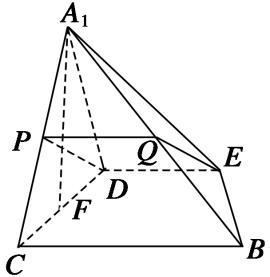
分别取<em>A</em>1<em>C</em>，<em>A</em>1<em>B</em>的中点<em>P</em>，<em>Q</em>，则<em>PQ</em>∥<em>BC</em>．又因为<em>DE</em>∥<em>BC</em>，所以<em>DE</em>∥<em>PQ</em>．
所以平面<em>DEQ</em>即为平面<em>DEP</em>．由（2）知，<em>DE</em>⊥平面<em>A</em>1<em>DC</em>，所以<em>DE</em>⊥<em>A</em>1<em>C</em>．
又因为<em>P</em>是等腰三角形<em>DA</em>1<em>C</em>底边<em>A</em>1<em>C</em>的中点，所以<em>A</em>1<em>C</em>⊥<em>DP</em>．所以<em>A</em>1<em>C</em>⊥平面<em>DEP</em>．
从而<em>A</em>1<em>C</em>⊥平面<em>DEQ</em>．故线段<em>A</em>1<em>B</em>上存在点<em>Q</em>，使得<em>A</em>1<em>C</em>⊥平面<em>DEQ</em>．

<strong>[例4]</strong>如图，在三棱柱<em>ABC</em>－<em>A</em>1<em>B</em>1<em>C</em>1中，侧棱<em>AA</em>1⊥底面<em>ABC</em>，<em>M</em>为棱<em>AC</em>的中点．<em>AB</em>＝<em>BC</em>，<em>AC</em>＝2，<em>AA</em>1＝．  
（1）求证：<em>B</em>1<em>C</em>∥平面<em>A</em>1<em>BM</em>；  
（2）求证：<em>AC</em>1⊥平面<em>A</em>1<em>BM</em>；  
（3）在棱<em>BB</em>1上是否存在点<em>N</em>，使得平面<em>AC</em>1<em>N</em>⊥平面<em>AA</em>1<em>C</em>1<em>C</em>？如果存在，求此时的值；如果不存在，请说明理由．

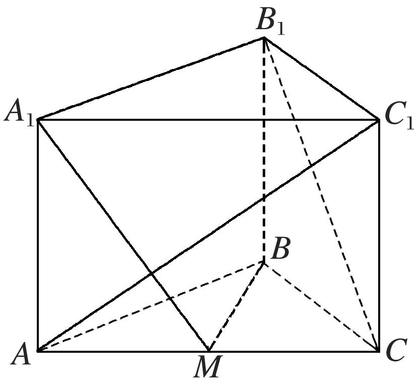
解析　（1）连接<em>AB</em>1与<em>A</em>1<em>B</em>，两线交于点<em>O</em>，连接<em>OM</em>．
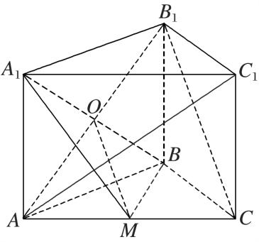
在△<em>B</em>1<em>AC</em>中，∵<em>M</em>，<em>O</em>分别为<em>AC</em>，<em>AB</em>1的中点，∴<em>OM</em>∥<em>B</em>1<em>C</em>，
又∵<em>OM</em>⊂平面<em>A</em>1<em>BM</em>，<em>B</em>1<em>C</em>⊄平面<em>A</em>1<em>BM</em>，∴<em>B</em>1<em>C</em>∥平面<em>A</em>1<em>BM</em>．  
（2）∵侧棱<em>AA</em>1⊥底面<em>ABC</em>，<em>BM</em>⊂平面<em>ABC</em>，∴<em>AA</em>1⊥<em>BM</em>，
又∵*M*为棱*AC*的中点，*AB*＝*BC*，∴*BM*⊥*AC*．
∵<em>AA</em>1∩<em>AC</em>＝<em>A</em>，<em>AA</em>1，<em>AC</em>⊂平面<em>ACC</em>1<em>A</em>1，∴<em>BM</em>⊥平面<em>ACC</em>1<em>A</em>1，∴<em>BM</em>⊥<em>AC</em>1．
∵<em>AC</em>＝2，∴<em>AM</em>＝1．又∵<em>AA</em>1＝，∴在Rt△<em>ACC</em>1和Rt△<em>A</em>1<em>AM</em>中，

tan∠<em>AC</em>1<em>C</em>＝tan∠<em>A</em>1<em>MA</em>＝，∴∠<em>AC</em>1<em>C</em>＝∠<em>A</em>1<em>MA</em>，
即∠<em>AC</em>1<em>C</em>＋∠<em>C</em>1<em>AC</em>＝∠<em>A</em>1<em>MA</em>＋∠<em>C</em>1<em>AC</em>＝90°，∴<em>A</em>1<em>M</em>⊥<em>AC</em>1．
∵<em>BM</em>∩<em>A</em>1<em>M</em>＝<em>M</em>，<em>BM</em>，<em>A</em>1<em>M</em>⊂平面<em>A</em>1<em>BM</em>，∴<em>AC</em>1⊥平面<em>A</em>1<em>BM</em>．  
（3）当点<em>N</em>为<em>BB</em>1的中点，即＝时，平面<em>AC</em>1<em>N</em>⊥平面<em>AA</em>1<em>C</em>1<em>C</em>．

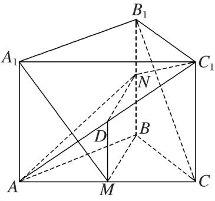
证明如下：
设<em>AC</em>1的中点为<em>D</em>，连接<em>DM</em>，<em>DN</em>．∵<em>D</em>，<em>M</em>分别为<em>AC</em>1，<em>AC</em>的中点，∴<em>DM</em>∥<em>CC</em>1，且<em>DM</em>＝<em>CC</em>1．
又∵<em>N</em>为<em>BB</em>1的中点，∴<em>DM</em>∥<em>BN</em>，且<em>DM</em>＝<em>BN</em>，∴四边形<em>BNDM</em>为平行四边形，∴<em>BM</em>∥<em>DN</em>，
∵<em>BM</em>⊥平面<em>ACC</em>1<em>A</em>1，∴<em>DN</em>⊥平面<em>AA</em>1<em>C</em>1<em>C</em>．又∵<em>DN</em>⊂平面<em>AC</em>1<em>N</em>，∴平面<em>AC</em>1<em>N</em>⊥平面<em>AA</em>1<em>C</em>1<em>C</em>．

【对点训练】

1．如图，三棱锥*P*－*ABC*中，*PA*⊥平面*ABC*，*PA*＝1，*AB*＝1，*AC*＝2，∠*BAC*＝60°．  
（1）求三棱锥*P－ABC*的体积；  
（2）在线段*PC*上是否存在点*M*，使得*AC*⊥*BM*，若存在，请说明理由，并求的值．

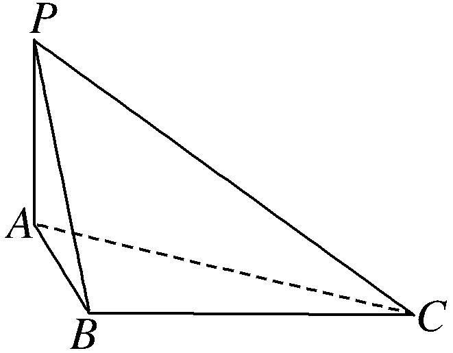

1．解析　（1）由题设<em>AB</em>＝1，<em>AC</em>＝2，∠<em>BAC</em>＝60°，可得<em>S</em>△<em>ABC</em>＝·<em>AB</em>·<em>AC</em>·sin 60°＝．
由*PA*⊥平面*ABC*，可知*PA*是三棱锥*P*­*ABC*的高，又*PA*＝1，
所以三棱锥<em>P－ABC</em>的体积<em>V</em>＝·<em>S</em>△<em>ABC</em>·<em>PA</em>＝．  
（2）在线段*PC*上存在点*M*，使得*AC*⊥*BM*，证明如下：

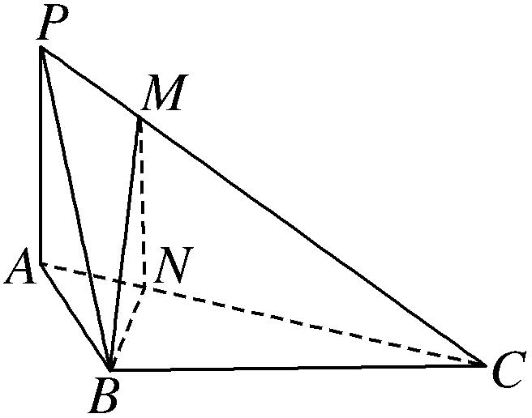
如图，在平面*ABC*内，过点*B*作*BN*⊥*AC*，垂足为*N*．在平面*PAC*内，

过点*N*作*MN*∥*PA*交*PC*于点*M*，连接*BM*．由*PA*⊥平面*ABC*，知*PA*⊥*AC*，所以*MN*⊥*AC*．
因为*BN*∩*MN*＝*N*，所以*AC*⊥平面*MBN*，又*BM*⊂平面*MBN*，所以*AC*⊥*BM*．
在Rt△*BAN*中，*AN*＝*AB*·cos∠*BAC*＝，从而*NC*＝*AC*－*AN*＝，由*MN*∥*PA*，得＝＝．

2．如图所示，已知长方体<em>ABCD</em>－<em>A</em>1<em>B</em>1<em>C</em>1<em>D</em>1，点<em>O</em>1为<em>B</em>1<em>D</em>1的中点．  
（1）求证：<em>AB</em>1∥平面<em>A</em>1<em>O</em>1<em>D</em>；  
（2）若<em>AB</em>＝<em>AA</em>1，在线段<em>BB</em>1上是否存在点<em>E</em>使得<em>A</em>1<em>C</em>⊥<em>AE</em>？若存在，求出；若不存在，说明理
由．

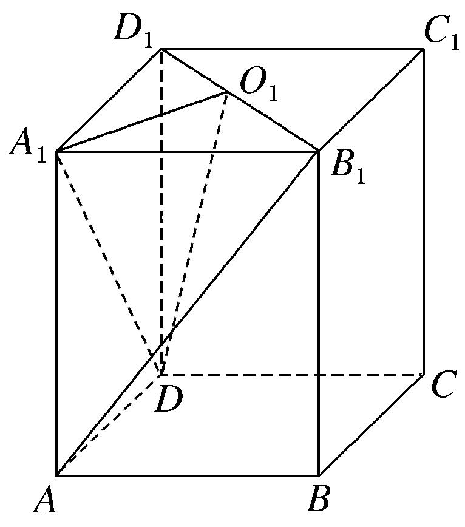

2．解析　（1）证明：如图1所示，连接<em>AD</em>1交<em>A</em>1<em>D</em>于点<em>G</em>，∴<em>G</em>为<em>AD</em>1的中点，连接<em>O</em>1<em>G</em>，在△<em>AB</em>1<em>D</em>1中，
∵<em>O</em>1为<em>B</em>1<em>D</em>1的中点，∴<em>O</em>1<em>G</em>∥<em>AB</em>1，∵<em>O</em>1<em>G</em>⊂平面<em>A</em>1<em>O</em>1<em>D</em>，且<em>AB</em>1⊄平面<em>A</em>1<em>O</em>1<em>D</em>，
∴<em>AB</em>1∥平面<em>A</em>1<em>O</em>1<em>D</em>．

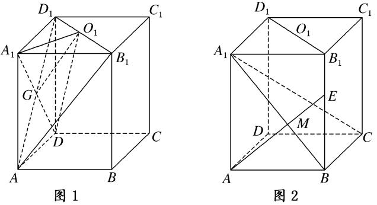  
（2）若在线段<em>BB</em>1上存在点<em>E</em>使得<em>A</em>1<em>C</em>⊥<em>AE</em>，连接<em>A</em>1<em>B</em>交<em>AE</em>于点<em>M</em>，如图2所示．
∵<em>BC</em>⊥平面<em>ABB</em>1<em>A</em>1，<em>AE</em>⊂平面<em>ABB</em>1<em>A</em>1，∴<em>BC</em>⊥<em>AE</em>．
又∵<em>A</em>1<em>C</em>∩<em>BC</em>＝<em>C</em>，且<em>A</em>1<em>C</em>，<em>BC</em>⊂平面<em>A</em>1<em>BC</em>，∴<em>AE</em>⊥平面<em>A</em>1<em>BC</em>．
∵<em>A</em>1<em>B</em>⊂平面<em>A</em>1<em>BC</em>，∴<em>AE</em>⊥<em>A</em>1<em>B</em>．
在△*AMB*和△*ABE*中，∠*BAM*＋∠*ABM*＝90°，∠*BAM*＋∠*BEA*＝90°，∴∠*ABM*＝∠*BEA*．
∴Rt△<em>ABE</em>∽Rt△<em>A</em>1<em>AB</em>，∴＝．
∵<em>AB</em>＝<em>AA</em>1，∴<em>BE</em>＝<em>AB</em>＝<em>BB</em>1，即在线段<em>BB</em>1上存在点<em>E</em>使得<em>A</em>1<em>C</em>⊥<em>AE</em>，此时＝．

3．如图，已知三棱柱*ABC*－*A*′*B*′*C*′的侧棱垂直于底面，*AB*＝*AC*，∠*BAC*＝90°，点*M*，*N*分别为*A*′*B*和*B*′*C*′

的中点．  
（1）证明：*MN*∥平面*AA*′*C*′*C*；  
（2）设*AB*＝*λAA*′，当*λ*为何值时，*CN*⊥平面*A*′*MN*，试证明你的结论．

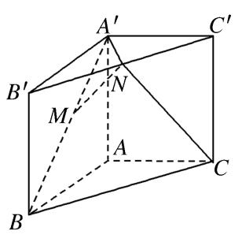

3．解析　（1）如图，取*A*′*B*′的中点*E*，连接*ME*，*NE*．
因为*M*，*N*分别为*A*′*B*和*B*′*C*′的中点，所以*NE*∥*A*′*C*′，*ME*∥*AA*′，又*A*′*C*′⊂平面*AA*′*C*′*C*，*A*′*A*⊂平面*AA*′*C*′*C*，
所以*ME*∥平面*AA*′*C*′*C*，*NE*∥平面*AA*′*C*′*C*，所以平面*MNE*∥平面*AA*′*C*′*C*，
因为*MN*⊂平面*MNE*，所以*MN*∥平面*AA*′*C*′*C*．

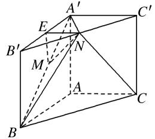  
（2）连接*BN*，设*AA*′＝*a*，则*AB*＝*λAA*′＝*λa*，由题意知*BC*＝*λa*，*CN*＝*BN*＝，
因为三棱柱*ABC*­*A*′*B*′*C*′的侧棱垂直于底面，所以平面*A*′*B*′*C*′⊥平面*BB*′*C*′*C*，
因为*AB*＝*AC*，点*N*是*B*′*C*′的中点，所以*A*′*B*′＝*A*′*C*′，*A*′*N*⊥*B*′*C*′，
所以*A*′*N*⊥平面*BB*′*C*′*C*，所以*CN*⊥*A*′*N*，要使*CN*⊥平面*A*′*MN*，只需*CN*⊥*BN*即可，
所以<em>CN</em>2＋<em>BN</em>2＝<em>BC</em>2，即2＝2<em>λ</em>2<em>a</em>2，解得<em>λ</em>＝，故当<em>λ</em>＝时，<em>CN</em>⊥平面<em>A</em>′<em>MN</em>．

4．如图，在四棱锥*P*—*ABCD*中，*ABCD*是正方形，*PD*⊥平面*ABCD*．*PD*＝*AB*＝2，*E*，*F*，*G*分别是*PC*，

*PD*，*BC*的中点．  
（1）求证：平面*PAB*∥平面*EFG*；  
（2）在线段*PB*上确定一点*Q*，使*PC*⊥平面*ADQ*，并给出证明．

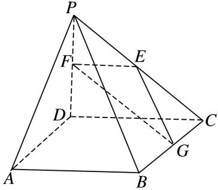

4．解析　（1）∵在△*PCD*中，*E*，*F*分别是*PC*，*PD*的中点，∴*EF*∥*CD*，又∵四边形*ABCD*为正方形，
∴*AB*∥*CD*，∴*EF*∥*AB*，∵*EF*⊄平面*PAB*，*AB*⊂平面*PAB*，∴*EF*∥平面*PAB*．同理*EG*∥平面*PAB*，
∵*EF*，*EG*是平面*EFG*内两条相交直线，∴平面*PAB*∥平面*EFG*．

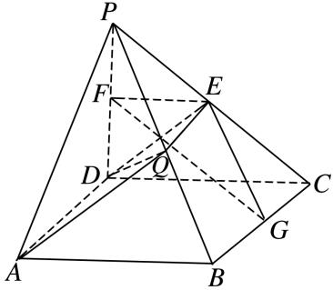  
（2）当*Q*为线段*PB*的中点时，*PC*⊥平面*ADQ*．取*PB*的中点*Q*，连接*DE*，*EQ*，*AQ*，*DQ*，
∵*EQ*∥*BC*∥*AD*，且*AD*≠*QE*，∴四边形*ADEQ*为梯形，
由*PD*⊥平面*ABCD*，*AD*⊂平面*ABCD*，得*AD*⊥*PD*，
∵*AD*⊥*CD*，*PD*∩*CD*＝*D*，*PD*，*CD*⊂平面*PCD*，∴*AD*⊥平面*PDC*，又*PC*⊂平面*PDC*，∴*AD*⊥*PC*．
∵△*PDC*为等腰直角三角形，*E*为斜边中点，∴*DE*⊥*PC*，
∵*AD*，*DE*是平面*ADQ*内的两条相交直线，∴*PC*⊥平面*ADQ*．

5．如图，在四棱锥*P*－*ABCD*中，底面*ABCD*是菱形，∠*DAB*＝30°，*PD*⊥平面*ABCD*，*AD*＝2，点*E*为

*AB*上一点，且＝*m*，点*F*为*PD*中点．  
（1）若*m*＝，证明：直线*AF*∥平面*PEC*；  
（2）是否存在一个常数*m*，使得平面*PED*⊥平面*PAB*？若存在，求出*m*的值；若不存在，说明理由．

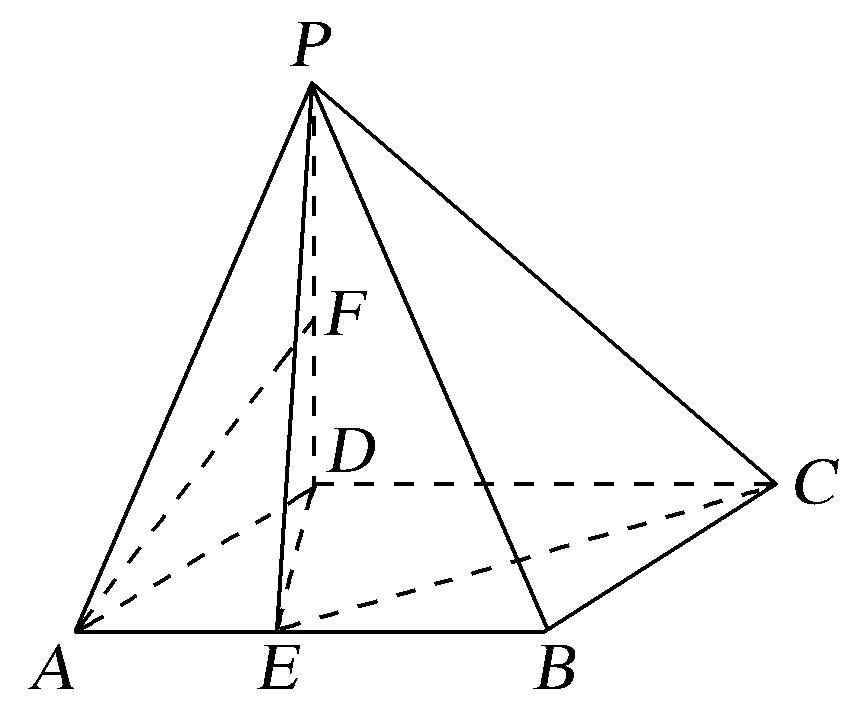

5．解析　（1）如图作*FM*∥*CD*，交*PC*于点*M*，连接*EM*，
因为点*F*为*PD*的中点，所以*FM*＝*CD*．因为*m*＝，所以*AE*＝*AB*＝*FM*，
又*FM*∥*CD*∥*AE*，所以四边形*AEMF*为平行四边形，所以*AF*∥*EM*，
因为*AF*⊄平面*PEC*，*EM*⊂平面*PEC*，所以直线*AF*∥平面*PEC*．  
（2）存在一个常数*m*＝，使得平面*PED*⊥平面*PAB*，理由如下：

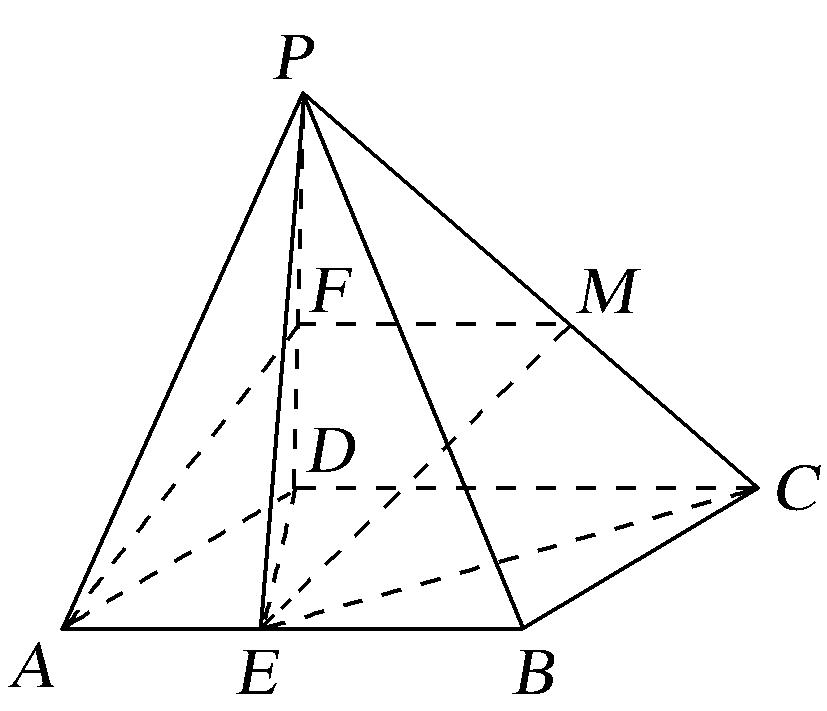

要使平面*PED*⊥平面*PAB*，只需*AB*⊥*DE*，
因为*AB*＝*AD*＝2，∠*DAB*＝30°，所以*AE*＝*AD*cos 30°＝，
又因为*PD*⊥平面*ABCD*，*PD*⊥*AB*，*PD*∩*DE*＝*D*，所以*AB*⊥平面*PDE*，
因为*AB*⊂平面*PAB*，所以平面*PDE*⊥平面*PAB*，所以*m*＝＝．

6．如图，在四棱锥*P*－*ABCD*中，底面*ABCD*是∠*DAB*＝60°且边长为*a*的菱形，侧面*PAD*为正三角形，

其所在平面垂直于底面*ABCD*，若*G*为*AD*的中点．  
（1）求证：*BG*⊥平面*PAD*；  
（2）求证：*AD*⊥*PB*；  
（3）若*E*为*BC*边的中点，能否在棱*PC*上找到一点*F*，使平面*DEF*⊥平面*ABCD*？并证明你的结论．

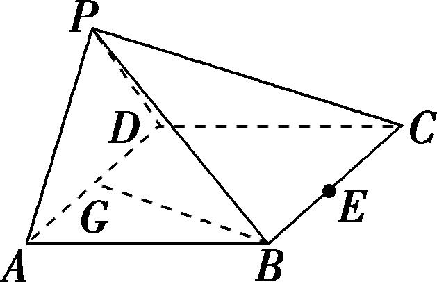

6．解析　（1）在菱形*ABCD*中，∠*DAB*＝60°，*G*为*AD*的中点，所以*BG*⊥*AD．*
又平面*PAD*⊥平面*ABCD*，平面*PAD*∩平面*ABCD*＝*AD*，所以*BG*⊥平面*PAD．*

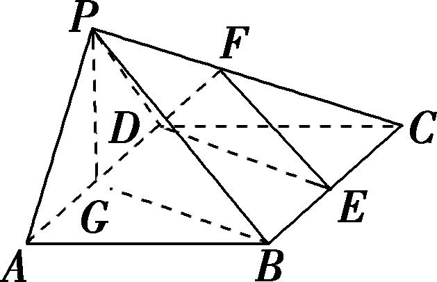  
（2）如图，连接*PG*．因为△*PAD*为正三角形，*G*为*AD*的中点，所以*PG*⊥*AD．*
由（1）知，*BG*⊥*AD*，又*PG* ∩*BG*＝*G*，所以*AD*⊥平面*PGB．* 因为*PB*⊂平面*PGB*，所以*AD*⊥*PB．*  
（3）当*F*为*PC*的中点时，满足平面*DEF*⊥平面*ABCD．*
证明如下：取*PC*的中点*F*，连接*DE*、*EF*、*DF*．
在△*PBC*中，*FE*∥*PB*，在菱形*ABCD*中，*GB*∥*DE*．

而*FE*⊂平面*DEF*，*DE*⊂平面*DEF*，*EF*∩*DE*＝*E*，*PB*⊂平面*PGB*，*GB*⊂平面*PGB*，*PB*∩*GB*＝*B*，
所以平面*DEF*∥平面*PGB．* 因为*BG*⊥平面*PAD*，*PG*⊂平面*PAD*，所以*BG*⊥*PG*，
又因为*PG*⊥*AD*，*AD*∩*BG*＝*G*，所以*PG*⊥平面*ABCD．*
又*PG*⊂平面*PGB*，所以平面*PGB*⊥平面*ABCD*，所以平面*DEF*⊥平面*ABCD．*

7．如图，四棱锥*P*－*ABCD*中，底面*ABCD*是边长为2的菱形，∠*BAD*＝，△*PAD*是等边三角形，*F*

为*AD*的中点，*PD*⊥*BF*．  
（1）求证：*AD*⊥*PB*；  
（2）若*E*在线段*BC*上，且*EC*＝*BC*，能否在棱*PC*上找到一点*G*，使平面*DEG*⊥平面*ABCD*？若存在，求出三棱锥*D*－*CEG*的体积；若不存在，请说明理由．

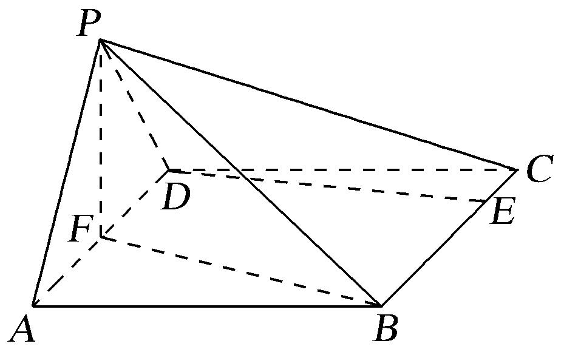

7．解析　（1）∵△*PAD*是等边三角形，*F*是*AD*的中点，∴*PF*⊥*AD*．

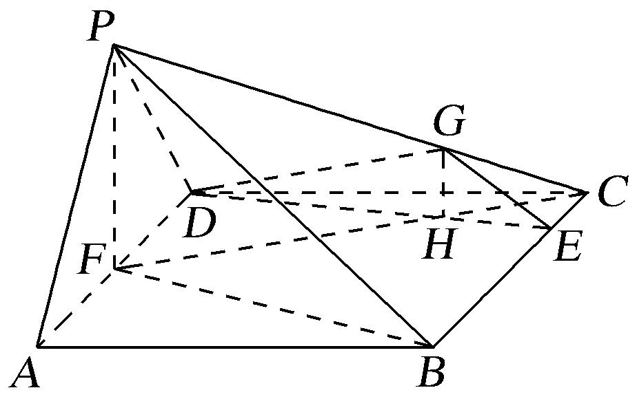
∵底面*ABCD*是菱形，∠*BAD*＝，∴*BF*⊥*AD*．
又*PF*∩*BF*＝*F*，∴*AD*⊥平面*BFP*．由于*PB*⊂平面*BFP*，∴*AD*⊥*PB*．  
（2）能在棱*PC*上找到一点*G*，使平面*DEG*⊥平面*ABCD*．
由（1）知*AD*⊥*BF*，∵*PD*⊥*BF*，*AD*∩*PD*＝*D*，∴*BF*⊥平面*PAD*．
又*BF*⊂平面*ABCD*，∴平面*ABCD*⊥平面*PAD*，
又平面*ABCD*∩平面*PAD*＝*AD*，且*PF*⊥*AD*，*PF*⊂平面*PAD*，∴*PF*⊥平面*ABCD*．

连接*CF*交*DE*于点*H*，过*H*作*HG*∥*PF*交*PC*于*G*，∴*GH*⊥平面*ABCD*．
又*GH*⊂平面*DEG*，∴平面*DEG*⊥平面*ABCD*．
∵*AD*∥*BC*，∴△*DFH*∽△*ECH*，∴＝＝，∴＝＝，∴*GH*＝*PF*＝，
∴<em>VD</em>－<em>CEG</em>＝<em>VG</em>－<em>CDE</em>＝<em>S</em>△<em>CDE</em>·<em>GH</em>＝×<em>DC</em>·<em>CE</em>·sin·<em>GH</em>＝．

8．如图，在四棱锥*P*—*ABCD*中，*PC*＝*AD*＝*CD*＝*AB*＝2，*AB*∥*DC*，*AD*⊥*CD*，*PC*⊥平面*ABCD*．  
（1）求证：*BC*⊥平面*PAC*；  
（2）若*M*为线段*PA*的中点，且过*C*，*D*，*M*三点的平面与线段*PB*交于点*N*，确定点*N*的位置，说明理由；并求三棱锥*A*—*CMN*的高．

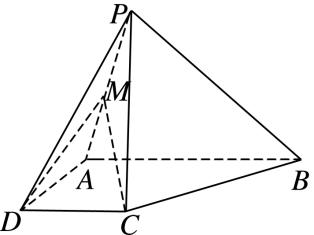

8．解析　（1）连接*AC*，在直角梯形*ABCD*中，*AC*＝＝2，

<em>BC</em>＝＝2，所以<em>AC</em>2＋<em>BC</em>2＝<em>AB</em>2，即<em>AC</em>⊥<em>BC</em>．
又*PC*⊥平面*ABCD*，*BC*⊂平面*ABCD*，
所以*PC*⊥*BC*，又*AC*∩*PC*＝*C*，*AC*，*PC*⊂平面*PAC*，故*BC*⊥平面*PAC*．

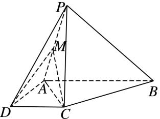  
（2）*N*为*PB*的中点，连接*MN*，*CN*．

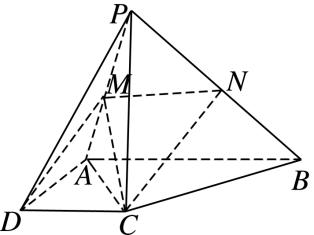
因为*M*为*PA*的中点，*N*为*PB*的中点，所以*MN*∥*AB*，且*MN*＝*AB*＝2．
又因为*AB*∥*CD*，所以*MN*∥*CD*，所以*M*，*N*，*C*，*D*四点共面，
所以*N*为过*C*，*D*，*M*三点的平面与线段*PB*的交点．
因为*BC*⊥平面*PAC*，*N*为*PB*的中点，所以点*N*到平面*PAC*的距离*d*＝*BC*＝．
又<em>S</em>△<em>ACM</em>＝<em>S</em>△<em>ACP</em>＝××<em>AC</em>×<em>PC</em>＝，所以<em>V</em>三棱锥<em>N</em>—<em>ACM</em>＝××＝．
由题意可知，在Rt△*PCA*中，*PA*＝＝2，*CM*＝，
在Rt△<em>PCB</em>中，<em>PB</em>＝＝2，<em>CN</em>＝，所以<em>S</em>△<em>CMN</em>＝×2×＝．
设三棱锥<em>A</em>—<em>CMN</em>的高为<em>h</em>，<em>V</em>三棱锥<em>N</em>—<em>ACM</em>＝<em>V</em>三棱锥<em>A</em>—<em>CMN</em>＝××<em>h</em>＝，
解得*h*＝，故三棱锥*A*—*CMN*的高为．

考点三　探究距离与体积问题

【例题选讲】

<strong>[例1]</strong>如图所示，圆柱的高为2，点<em>A</em>，<em>B</em>，<em>C</em>，<em>D</em>分别是圆柱下底面圆周上的点，<em>ABCD</em>为矩形，<em>PA</em>是圆柱的母线，<em>AB</em>＝2，<em>BC</em>＝4，<em>E</em>，<em>F</em>，<em>G</em>分别是线段<em>PA</em>，<em>PD</em>，<em>CD</em>的中点．

  
（1）求证：平面*PDC*平面*PAD*；  
（2）求证：*PB*//平面*EFG*；  
（3）在线段*BC*上是否存在一点*M*，使得*D*到平面*PAM*的距离为2？若存在，求出*BM*；若不存在，请说明理由．

解析　（1）∵是圆柱的母线，∴圆柱的底面．

∵圆柱的底面，，又∵为矩形，∴，

而，∴平面．又平面，∴平面平面．

  
（2）取中点，连接，∵、、分别是线段、、的中点，

∴，∴、、、四点共面．又为中点，∴．

又平面，平面，∴//平面．

  
（3）解析：假设在上存在一点，使得到平面的距离为，则以为底，为顶点的三棱锥的高为，连接，则，由（2）知，

∴，∴．

∵，∴．

∵，∴，解得：．∵，

∴线段上存在一点，当时，使得到平面的距离为．

<strong>[例2]</strong>如图，在四棱锥<em>P</em>—<em>ABCD</em>中，<em>PA</em>⊥底面<em>ABCD</em>，<em>AD</em>⊥<em>AB</em>，<em>DC</em>∥<em>AB</em>，<em>PA</em>＝1，<em>AB</em>＝2，<em>PD</em>＝<em>BC</em>＝．  
（1）求证：平面*PAD*⊥平面*PCD*；  
（2）试在棱*PB*上确定一点*E*，使截面*AEC*把该几何体分成的两部分*PDCEA*与*EACB*的体积比为2∶1．

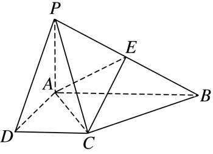
解析　（1）∵*AD*⊥*AB*，*DC*∥*AB*，∴*DC*⊥*AD*．∵*PA*⊥平面*ABCD*，*DC*⊂平面*ABCD*，∴*DC*⊥*PA*．
∵*AD*∩*PA*＝*A*，*AD*，*PA*⊂平面*PAD*，∴*DC*⊥平面*PAD*．∵*DC*⊂平面*PCD*，∴平面*PAD*⊥平面*PCD*．

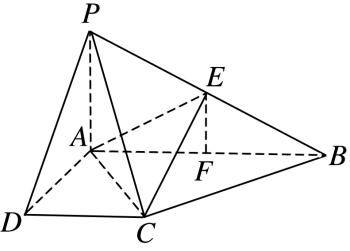  
（2）作*EF*⊥*AB*于*F*点，∵在△*ABP*中，*PA*⊥*AB*，∴*EF*∥*PA*，∴*EF*⊥平面*ABCD*．
设<em>EF</em>＝<em>h</em>，<em>AD</em>＝＝1，<em>S</em>△<em>ABC</em>＝<em>AB</em>·<em>AD</em>＝1，则<em>V</em>三棱锥<em>E</em>—<em>ABC</em>＝<em>S</em>△<em>ABC</em>·<em>h</em>＝<em>h</em>．

<em>V</em>四棱锥<em>P</em>—<em>ABCD</em>＝<em>S</em>四边形<em>ABCD</em>·<em>PA</em>＝××1＝．
由<em>VPDCEA</em>∶<em>V</em>三棱锥<em>E</em>—<em>ACB</em>＝2∶1，得∶<em>h</em>＝2∶1，解得<em>h</em>＝．<em>EF</em>＝<em>PA</em>，故<em>E</em>为<em>PB</em>的中点．

<strong>[例3]</strong>如图，在正三棱柱<em>ABC－A</em>1<em>B</em>1<em>C</em>1中，<em>D</em>，<em>E</em>分别为<em>AB</em>，<em>BC</em>的中点．  
（1）若<em>F</em>为<em>BB</em>1的中点，判断<em>AC</em>1与平面<em>DEF</em>是否平行？若平行，请给予证明，若不平行，说明理由；  
（2）试问：在侧棱<em>BB</em>1上是否存在点<em>F</em>，使三棱锥<em>F</em>－<em>DEB</em>的体积与三棱柱<em>ABC</em>－<em>A</em>1<em>B</em>1<em>C</em>1的体积之比为．

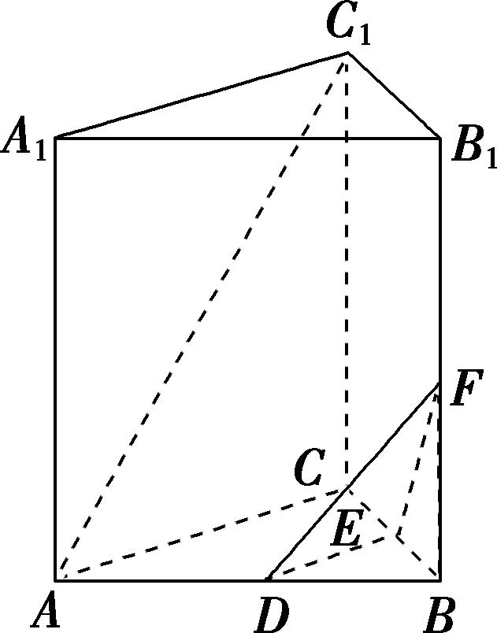
解析：（1）法一：连接<em>B</em>1<em>C</em>，<em>BC</em>1交于点<em>G</em>，连接<em>DG</em>，<em>FG</em>，则<em>DG</em>∥<em>AC</em>1，
因为<em>DG</em>⊂平面<em>GDF</em>，<em>AC</em>1⊄平面<em>GDF</em>，则<em>AC</em>1∥平面<em>GDF</em>．
由于平面<em>GDF</em>∩平面<em>DEF</em>＝<em>DF</em>，故<em>AC</em>1与平面<em>DEF</em>不可能平行．

法二：连接<em>B</em>1<em>C</em>，<em>BC</em>1交于点<em>G</em>，连接<em>DG</em>，<em>FG</em>，则<em>DG</em>∥<em>AC</em>1，

而<em>DG</em>⊄平面<em>DEF</em>，且<em>DG</em>与平面<em>DEF</em>交于点<em>D</em>，故<em>AC</em>1与平面<em>DEF</em>不可能平行．  
（2）假设点*F*存在，由＝＝×＝，得＝，显然，点*F*不存在．

<strong>[例4]</strong>如图①，在四边形<em>ABCD</em>中，<em>AD</em>＝<em>CD</em>＝2，<em>AC</em>＝2，△<em>ABC</em>是等边三角形，<em>F</em>为线段<em>AC</em>的中点．将△<em>ADC</em>沿<em>AC</em>折起，使平面<em>ADC</em>⊥平面<em>ABC</em>，得到几何体<em>D－ABC</em>，如图②所示．  
（1）求证：*AC*⊥*BD*；  
（2）试问：在线段*BC*上是否存在一点*E*，使得＝？若存在，请求出点*E*的位置；若不存在，请
说明理由．

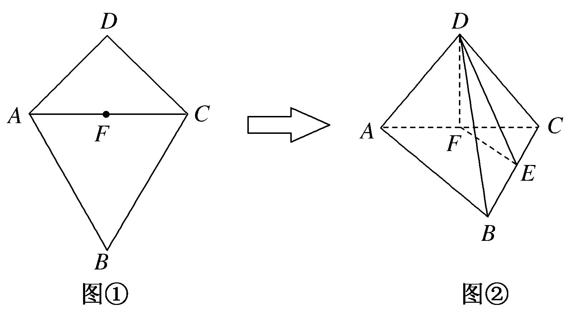
解析　（1）证明：*AD*＝*CD*＝2，*AC*＝2，
从而<em>AD</em>2＋<em>CD</em>2＝<em>AC</em>2，故<em>AD</em>⊥<em>CD</em>，△<em>ADC</em>是等腰直角三角形．
又*F*为线段*AC*的中点，所以*DF*⊥*AC*，连接*BF*(图略)，因为△*ABC*是等边三角形，所以*BF*⊥*AC*，
又*DF*∩*BF*＝*F*，故*AC*⊥平面*BDF*，又*BD*⊂平面*BDF*，所以*AC*⊥*BD*．  
（2）线段*BC*上存在点*E*，使得＝，且*E*为线段*BC*的中点．
因为平面*ADC*⊥平面*ABC*，平面*ADC*∩平面*ABC*＝*AC*，且*DF*⊥*AC*，
所以*DF*⊥平面*ABC*，故*DF*为三棱锥*D*­*FCE*和*D*­*ABC*的高，
所以＝＝＝＝·＝．
又*F*为线段*AC*的中点，所以＝，故＝，
从而*E*为线段*BC*的中点，即当*E*为线段*BC*的中点时，＝．

