# 专题10 利用空间向量计算线面角的问题

# 【方法总结】

#### 1. 直线与平面所成的角
如图，直线 $AB$ 与平面 $\alpha$ 相交于点 $B$ ，设直线 $AB$ 与平面 $\alpha$ 所成的角为 $\theta$ ，直线 $AB$ 的方向向量为 $\pmb{u}$ ，平面 $\alpha$ 的法向量为 $\pmb{n}$ ，则 $\sin \theta = |\cos < u, n >| = \frac{|u \cdot n|}{|u||n|}$ .

#### 2. 利用向量求线面角的 2 种方法  
（1）分别求出斜线和它所在平面内的射影直线的方向向量，转化为求两个方向向量的夹角(或其补角);  
（2）通过平面的法向量来求，即求出斜线的方向向量与平面的法向量所夹的锐角，取其余角就是斜线与平面所成的角.

# 【例题选讲】

# 考点一 棱柱(台)模型

[例1] 如图，在三棱柱 $ABC - A_{1}B_{1}C_{1}$ 中， $CC_{1} \perp$ 底面 $ABC$ ， $AC \perp BC$ ， $D$ 是 $A_{1}C_{1}$ 的中点，且 $AC = BC = AA_{1} = 2$ .  
（1）求证： $BC_{1}$ // 平面 $AB_{1}D$ ;  
（2）求直线 BC 与平面 $AB_{1}D$ 所成角的正弦值.

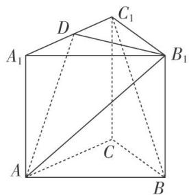

[例2] 在直三棱柱 $ABC - A_{1}B_{1}C_{1}$ 中， $\triangle ABC$ 为正三角形，点 $D$ 在棱 $BC$ 上，且 $CD = 3BD$ ，点 $E$ ， $F$ 分别为棱 $AB$ ， $BB_{1}$ 的中点.  
（1）证明： $A_{1}C \parallel$ 平面 DEF;  
（2）若 $A_{1}C \perp EF$ ，求直线 $A_{1}C_{1}$ 与平面 DEF 所成的角的正弦值.

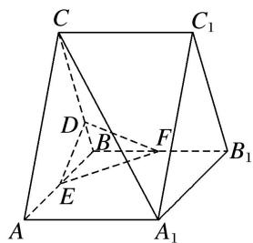

[例 3] (2020·北京)如图，在正方体 $ABCD-A_{1}B_{1}C_{1}D_{1}$ 中，E 为 $BB_{1}$ 的中点.  
（1）求证： $BC_{1}$ // 平面 $AD_{1}E$ ;  
（2）求直线 $AA_{1}$ 与平面 $AD_{1}E$ 所成角的正弦值.

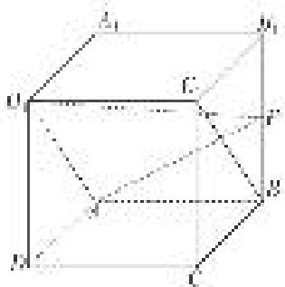

[例 4] (2020·浙江)如图，在三棱台 ABC-DEF 中，平面 $ACFD \perp$ 平面 ABC， $\angle ACB = \angle ACD = 45^{\circ}$ ，DC = 2BC.  
（1）证明： $EF \perp DB;$   
（2）求直线 DF 与平面 DBC 所成角的正弦值.

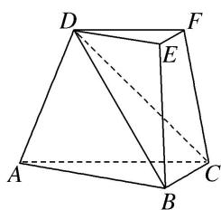

# 【对点训练】

1. 如图，在三棱柱 $ABC - A_{1}B_{1}C_{1}$ 中， $\triangle ABC$ 和 $\triangle AA_{1}C$ 均是边长为 2 的等边三角形，点 $O$ 为 $AC$ 中点，平面 $AA_{1}C_{1}C \perp$ 平面 $ABC$ .  
（1）证明： $A_{1}O \perp$ 平面 ABC;  
（2）求直线 AB 与平面 $A_{1}BC_{1}$ 所成角的正弦值.

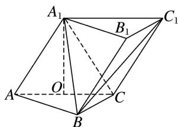

2. (2020·全国Ⅱ)如图，已知三棱柱 $ABC - A_{1}B_{1}C_{1}$ 的底面是正三角形，侧面 $BB_{1}C_{1}C$ 是矩形， $M, N$ 分别为 $BC, B_{1}C_{1}$ 的中点， $P$ 为 $AM$ 上一点，过 $B_{1}C_{1}$ 和 $P$ 的平面交 $AB$ 于 $E$ ，交 $AC$ 于 $F$ .  
（1）证明： $AA_{1} \parallel MN$ ，且平面 $A_{1}AMN \perp$ 平面 $EB_{1}C_{1}F$ ;  
（2）设 O 为 $\triangle A_{1}B_{1}C_{1}$ 的中心，若 $AO \parallel$ 平面 $EB_{1}C_{1}F$ ，且 AO = AB，求直线 $B_{1}E$ 与平面 $A_{1}AMN$ 所成角的正弦值.

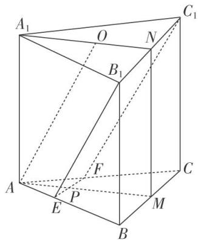

3. 斜三棱柱 $ABC - A_{1}B_{1}C_{1}$ 中，底面是边长为2的正三角形， $A_{1}B = \sqrt{7}$ ， $\angle A_{1}AB = \angle A_{1}AC = 60^{\circ}$ .  
（1）证明：平面 $A_{1}BC \perp$ 平面 $ABC$ ;  
（2）求直线 $BC_{1}$ 与平面 $ABB_{1}A_{1}$ 所成角的正弦值.

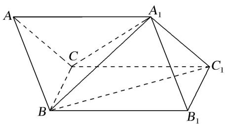

4. 如图，在几何体 $ABC - A_{1}B_{1}C_{1}$ 中，平面 $A_{1}ACC_{1} \perp$ 底面 $ABC$ ，四边形 $A_{1}ACC_{1}$ 是正方形， $B_{1}C_{1} // BC$ ， $Q$ 是 $A_{1}B$ 的中点，且 $AC = BC = 2B_{1}C_{1}$ ， $\angle ACB = \frac{2\pi}{3}$ .  
（1）证明： $B_{1}Q \perp A_{1}C;$   
（2）求直线 AC 与平面 $A_{1}BB_{1}$ 所成角的正弦值.

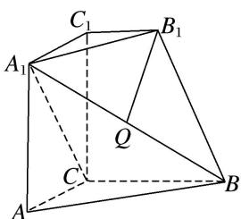

5. 如图所示，在四棱台 $ABCD-A_{1}B_{1}C_{1}D_{1}$ 中， $AA_{1}\perp$ 底面 ABCD，四边形 ABCD 为菱形，M 为 CD 的中点， $\angle BAD=120^{\circ}$ ， $AB=AA_{1}=2A_{1}B_{1}=2$ .  
（1）求证： $AM \perp$ 平面 $AA_{1}B_{1}B;$   
（2）求直线 $DD_{1}$ 与平面 $A_{1}BD$ 所成角的正弦值.

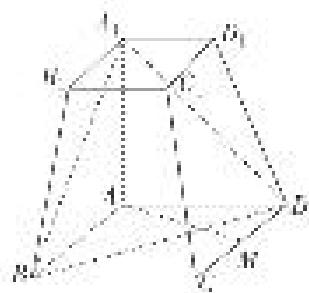

# 考点二 棱(圆)锥模型

[例 1] 如图，在三棱锥 A-BCD 中， $AB=BD=AD=AC=2$ ， $\triangle BCD$ 是以 BD 为斜边的等腰直角三角形，P 为 AB 的中点，E 为 BD 的中点.  
（1）求证： $AE \perp$ 平面 BCD;  
（2）求直线 PD 与平面 ACD 所成角的正弦值.

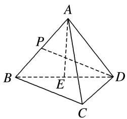

[例 2] (2020·新山东)如图，四棱锥 P-ABCD 的底面为正方形， $PD \perp$ 底面 ABCD．设平面 PAD 与平面 PBC 的交线为 l.  
（1）证明： $l \perp$ 平面 PDC;  
（2）已知 PD=AD=1，Q 为 l 上的点，求 PB 与平面 QCD 所成角的正弦值的最大值.

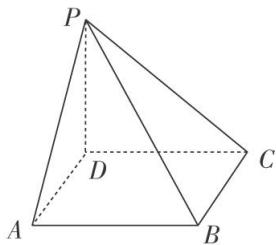

[例 3] 如图，在四棱锥 E-ABCD 中，底面 ABCD 为直角梯形， $AB \parallel CD$ ， $BC \perp CD$ ， $AB = 2BC = 2CD$ 。 $\triangle EAB$ 是以 AB 为斜边的等腰直角三角形，且平面 $EAB \perp$ 平面 ABCD。点 F 满足： $\overrightarrow{EF} = \lambda \overrightarrow{EA} (\lambda \in [0, 1])$ 。  
（1）试探究 $\lambda$ 为何值时，CE//平面BDF，并给予证明；  
（2）在（1）的条件下，求直线 AB 与平面 BDF 所成角的正弦值.

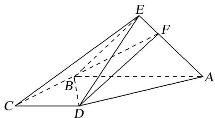

[例 4] 如图，在四棱锥 E-ABCD 中，底面 ABCD 是圆内接四边形， $CB=CD=CE=1$ ，AB=AD=AE= $\sqrt{3}$ ， $EC\perp BD$ .  
（1）求证：平面 $BED \perp$ 平面 ABCD;  
（2）若点 P 在平面 ABE 内运动，且 DP // 平面 BEC，求直线 DP 与平面 ABE 所成角的正弦值的最大值.

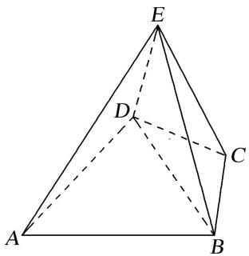

[例 5] (2021·浙江)如图，在四棱锥 P-ABCD 中，底面 ABCD 是平行四边形， $\angle ABC=120^{\circ}$ ，AB=1，BC=4， $PA=\sqrt{15}$ ，M，N 分别为 BC，PC 的中点， $PD\perp DC$ ， $PM\perp MD$ .  
（1）证明： $AB \perp PM;$   
（2）求直线 AN 与平面 PDM 所成角的正弦值.

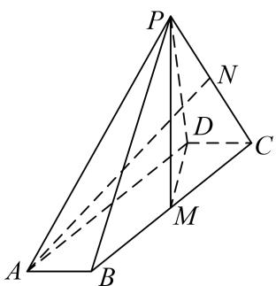

[例 6] (2017·浙江)如图, 已知四棱锥 $P - ABCD$ , $\triangle PAD$ 是以 $AD$ 为斜边的等腰直角三角形, $BC \parallel AD$ , $CD \perp AD$ , $PC = AD = 2DC = 2CB$ , $E$ 为 $PD$ 的中点.  
（1）证明：CE//平面PAB;   
（2）求直线 $CE$ 与平面 $PBC$ 所成角的正弦值.

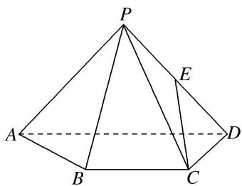

# 【对点训练】

1. 如图，已知三棱锥 P-ABC，平面 PAC⊥平面 ABC，AB=BC=PA= $\frac{1}{2}$ PC=2， $\angle ABC=120^{\circ}$ .  
（1）求证： $PA \perp BC$ ;  
（2）设点 E 为 PC 的中点，求直线 AE 与平面 PBC 所成角的正弦值.

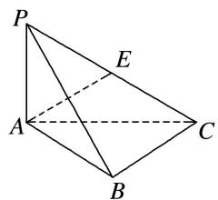

2. 在 $\triangle ABC$ 中， $D$ ， $E$ 分别为 $AB$ ， $AC$ 的中点， $AB=2BC=2CD$ ，如图①，以 $DE$ 为折痕将 $\triangle ADE$ 折起，使点 $A$ 到达点 $P$ 的位置，如图②.  
（1）证明：平面 $BCP \perp$ 平面 CEP;  
（2）若平面 $DEP \perp$ 平面 $BCED$ , 求直线 $DP$ 与平面 $BCP$ 所成角的正弦值.

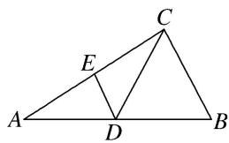

图①

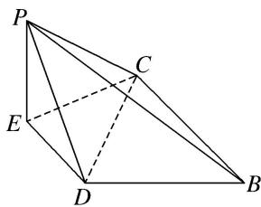

图②

3. (2016·全国III)如图，四棱锥 $P - ABCD$ 中， $PA \perp$ 底面 $ABCD$ ， $AD \parallel BC$ ， $AB = AD = AC = 3$ ， $PA = BC = 4$ ， $M$ 为线段 $AD$ 上一点， $AM = 2MD$ ， $N$ 为 $PC$ 的中点.  
（1）证明 $MN \parallel$ 平面 $PAB$ ;  
（2）求直线 AN 与平面 PMN 所成角的正弦值.

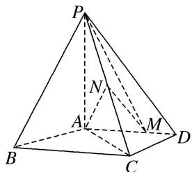

4. 如图 1, 在边长为 4 的正方形 $ABCD$ 中, $E$ 是 $AD$ 的中点, $F$ 是 $CD$ 的中点, 现将 $\triangle DEF$ 沿 $EF$ 翻折成如图 2 所示的五棱锥 $P-ABCFE$ .  
（1）求证： $AC \parallel$ 平面 PEF;  
（2）若平面 $PEF \perp$ 平面 $ABCFE$ , 求直线 $PB$ 与平面 $PAE$ 所成角的正弦值.
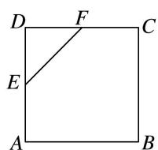

图1

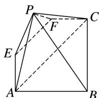

图2

5. 如图，四棱锥 $P - ABCD$ 中， $PA \perp$ 底面 $ABCD, AD \parallel BC, AB = AD = AC = 3, PA = BC = 4, M$ 为线段 $AD$ 上一点， $AM = 2MD, N$ 为 $PC$ 的中点.  
（1）证明：MN//平面PAB;   
（2）求直线 AN 与平面 PMN 所成角的正弦值.

6. 如图①，在 Rt△ABC 中，∠B 为直角，AB=BC=6，点 E，F 分别为线段 AB，AC 上一点，且 EF∥BC，

AE=2，沿 EF 将 $\triangle AEF$ 折起，使 $\angle AEB=\frac{\pi}{3}$ ，得到如图②的几何体，点 D 在线段 AC 上.  
（1）求证：平面 $AEF \perp$ 平面 ABC;  
（2）若 $AE \parallel$ 平面 $BDF$ , 求直线 $AF$ 与平面 $BDF$ 所成角的正弦值.

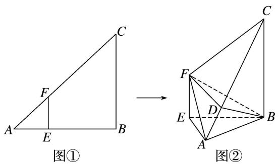

# 考点三 不规则几何体模型

[例 1] 在如图所示的多面体中, 四边形 ABCD 是平行四边形, 四边形 BDEF 是矩形, $ED \perp$ 平面 ABCD, $\angle ABD = \frac{\pi}{6}$ , AB = 2AD.  
（1）求证：平面 BDEF⊥平面 ADE;  
（2）若 ED=BD，求直线 AF 与平面 AEC 所成角的正弦值.

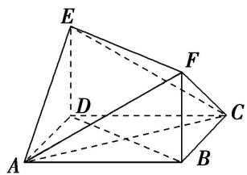

[例 2] (2018·全国 I) 如图，四边形 ABCD 为正方形，E，F 分别为 AD，BC 的中点，以 DF 为折痕把 $\triangle DFC$ 折起，使点 C 到达点 P 的位置，且 $PF \perp BF$ .  
（1）证明：平面 $PEF \perp$ 平面 ABFD;  
（2）求 DP 与平面 ABFD 所成角的正弦值.

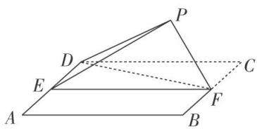

[例 3] 如图，在梯形 ABCD 中， $AB \parallel CD$ ，AD = CD = CB = 2， $\angle ABC = 60^{\circ}$ ，矩形 ACFE 中，AE = 2，又有 $BF = 2\sqrt{2}$ .  
（1）求证： $BC \perp$ 平面 ACFE;  
（2）求直线 BD 与平面 BEF 所成角的正弦值.

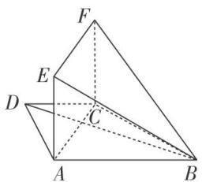

[例4] 如图所示，在三棱柱 $BCD - B_{1}C_{1}D_{1}$ 与四棱锥 $A - BB_{1}D_{1}D$ 的组合体中，已知 $BB_{1} \perp$ 平面 $BCD$ 四边形ABCD是菱形， $\angle BCD = 60^{\circ}$ ， $AB = 2$ ， $BB_{1} = 1$  
（1）设 O 是线段 BD 的中点，求证： $C_{1}O \parallel$ 平面 $AB_{1}D_{1}$ ;  
（2）求直线 $B_{1}C$ 与平面 $AB_{1}D_{1}$ 所成角的正弦值.

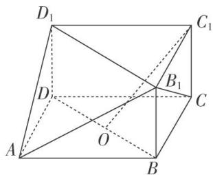

# 【对点训练】

1. (2018·浙江)如图，已知多面体 $ABCA_{1}B_{1}C_{1}$ ， $A_{1}A$ ， $B_{1}B$ ， $C_{1}C$ 均垂直于平面 $ABC$ ， $\angle ABC = 120^{\circ}$ ， $A_{1}A = 4$ ， $C_{1}C = 1$ ， $AB = BC = B_{1}B = 2$ .  
（1）证明： $AB_{1} \perp$ 平面 $A_{1}B_{1}C_{1}$ ;  
（2）求直线 $AC_{1}$ 与平面 $ABB_{1}$ 所成的角的正弦值.

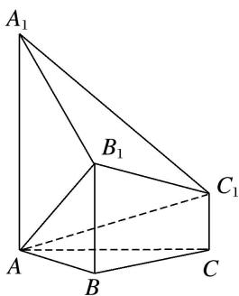

2. 如图，七面体 $ABCDEF$ 的底面是凸四边形 $ABCD$ ，其中 $AB = AD = 2$ ， $\angle BAD = 120^\circ$ ， $AC$ ， $BD$ 互相垂直并相交于点 $O$ ， $OC = 2OA$ ，棱 $AE$ ， $CF$ 均垂直于底面 $ABCD$ ，且 $AE = 2CF$ .  
（1）证明：直线 $DE$ 与平面 $BCF$ 不平行；  
（2）若 $CF = 1$ ，求直线 $BC$ 与平面 $BFD$ 所成角的正弦值.

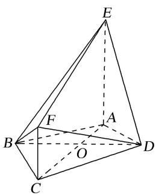

