# 专题10 利用空间向量计算线面角的问题

# 【方法总结】

# 1. 直线与平面所成的角

如图，直线 AB 与平面 $\alpha$ 相交于点 B，设直线 AB 与平面 $\alpha$ 所成的角为 $\theta$ ，直线 AB 的方向向量为 u，平面 $\alpha$ 的法向量为 n，则 $\sin\theta=|\cos<u,\quad n>|=\frac{|u\cdot n|}{|u||n|}$ .

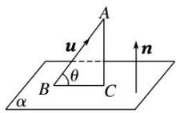

# 2. 利用向量求线面角的 2 种方法

(1)分别求出斜线和它所在平面内的射影直线的方向向量，转化为求两个方向向量的夹角(或其补角);  
(2)通过平面的法向量来求，即求出斜线的方向向量与平面的法向量所夹的锐角，取其余角就是斜线与平面所成的角.

# 【例题选讲】

# 考点一 棱柱(台)模型

[例1] 如图，在三棱柱 $ABC - A_{1}B_{1}C_{1}$ 中， $CC_{1} \perp$ 底面 $ABC$ ， $AC \perp BC$ ， $D$ 是 $A_{1}C_{1}$ 的中点，且 $AC = BC = AA_{1} = 2$ .

(1)求证： $BC_{1}$ // 平面 $AB_{1}D$ ;  
(2)求直线 BC 与平面 $AB_{1}D$ 所成角的正弦值.

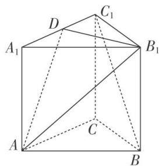

text_image

A₁
D
C₁
B₁
A
C
B

解析 (1)如图，连接 $A_{1}B$ 。设 $A_{1}B \cap AB_{1} = E$ ，连接 $DE$ .

由 $ABC-A_{1}B_{1}C_{1}$ 为三棱柱，得 E 为 $A_{1}B$ 的中点.

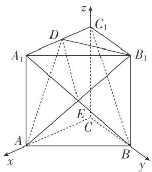

text_image

z
C₁
D
A₁
B₁
E
C
A
B
x
y

又 D 是 $A_{1}C_{1}$ 的中点，所以 $BC_{1} \parallel DE$ 。又 $BC_{1} \not\subset$ 平面 $AB_{1}D$ ， $DE \subset$ 平面 $AB_{1}D$ ，所以 $BC_{1} \parallel$ 平面 $AB_{1}D$ 。

(2)因为 $CC_{1} \perp$ 底面 ABC, $AC \perp BC$ , 所以 CA, CB, $CC_{1}$ 两两垂直, 以 C 为坐标原点,

以 CA, CB, $CC_{1}$ 所在直线分别为 x 轴、y 轴、z 轴建立空间直角坐标系，

则 $C(0, 0, 0)$ ， $B(0, 2, 0)$ ， $A(2, 0, 0)$ ， $B_{1}(0, 2, 2)$ ， $D(1, 0, 2)$ ，

所以 $\overrightarrow{AB_{1}}=(-2,2,2)$ ， $\overrightarrow{B_{1}D}=(1,-2,0)$ ， $\overrightarrow{BC}=(0,-2,0)$ .

设平面 $AB_{1}D$ 的法向量为 $\boldsymbol{n}=(x,y,z)$ ，则 $\left\{\begin{aligned}\overrightarrow{AB_{1}}\cdot\boldsymbol{n}&=0,\\ \overrightarrow{B_{1}D}\cdot\boldsymbol{n}&=0,\end{aligned}\right.$ 得 $\left\{\begin{aligned}-2x+2y+2z&=0,\\ x-2y&=0,\end{aligned}\right.$

令 y=1，得 x=2，z=1，所以 $n=(2,1,1)$ .

设直线 BC 与平面 $AB_{1}D$ 所成的角为 $\theta$ ，则 $\sin\theta=|\cos<\overrightarrow{BC}, n>|= \left|\frac{\overrightarrow{BC}\cdot n}{|\overrightarrow{BC}||n|}\right|=\frac{\sqrt{6}}{6}$ ,

所以直线 BC 与平面 $AB_{1}D$ 所成角的正弦值为 $\frac{\sqrt{6}}{6}$ .

[例 2] 在直三棱柱 $ABC-A_{1}B_{1}C_{1}$ 中， $\triangle ABC$ 为正三角形，点 D 在棱 BC 上，且 CD=3BD，点 E，F 分别为棱 AB， $BB_{1}$ 的中点.

(1)证明： $A_{1}C \parallel$ 平面 DEF;

(2)若 $A_{1}C \perp EF$ ，求直线 $A_{1}C_{1}$ 与平面 $DEF$ 所成的角的正弦值.

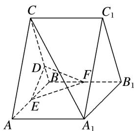

text_image

C
C₁
D
B
F
B₁
E
A
A₁

解析 (1)如图, 连接 $AB_{1}$ , $A_{1}B$ 交于点 $H$ , 设 $A_{1}B$ 交 $EF$ 于点 $K$ , 连接 $DK$ ,

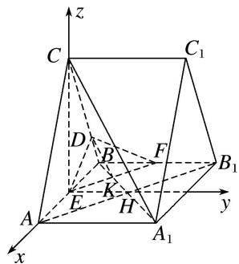

text_image

z
C
C₁
D
B
F
B₁
E
K
H
A
A₁
y
x

因为四边形 $ABB_{1}A_{1}$ 为矩形，所以 H 为线段 $A_{1}B$ 的中点.

因为点 E, F 分别为棱 AB, $BB_{1}$ 的中点，所以点 K 为线段 BH 的中点，所以 $A_{1}K=3BK$ .

又 $CD = 3BD$ ，所以 $A_{1}C \parallel DK$ 。又 $A_{1}C \not\subset$ 平面 $DEF$ ， $DK \subset$ 平面 $DEF$ ，所以 $A_{1}C \parallel$ 平面 $DEF$ 。

(2)连接 CE, EH, 由(1)知, $EH \parallel AA_{1}$ , 因为 $AA_{1} \perp$ 平面 ABC, 所以 $EH \perp$ 平面 ABC.

因为 $\triangle ABC$ 为正三角形，且点E为棱AB的中点，所以 $CE\perp AB$ .

故以点 E 为坐标原点，分别以 $\overrightarrow{EA}, \overrightarrow{EH}, \overrightarrow{EC}$ 的方向为 x 轴、y 轴、z 轴的正方向建立如图所示的空间直角坐标系 Exyz.

设 $AB = 4$ ， $AA_{1} = t(t > 0)$ ，则 $E(0,0,0)$ ， $A_{1}(2,t,0)$ ， $A(2,0,0)$ ， $C(0,0,2\sqrt{3})$ ， $F\left(-2,\frac{t}{2},0\right),$ $D\left[-\frac{3}{2},0,\frac{\sqrt{3}}{2}\right],$

所以 $\vec{A_1C} = (-2, -t, 2\sqrt{3})$ ， $\vec{EF} = \left(-2, \frac{t}{2}, 0\right)$ .

因为 $A_{1}C \perp EF$ ，所以 $\overrightarrow{A_{1}C} \cdot \overrightarrow{EF} = 0$ ，所以 $(-2) \times (-2) - t \times \frac{t}{2} + 2\sqrt{3} \times 0 = 0$ ，所以 $t = 2\sqrt{2}$ ，

所以 $\vec{EF} = (-2, \sqrt{2}, 0)$ , $\vec{ED} = \left(-\frac{3}{2}, 0, \frac{\sqrt{3}}{2}\right)$ .

设平面 $DEF$ 的一个法向量为 $\pmb {n} = (x,y,z)$ ，则 $\left\{ \begin{array}{l}\overrightarrow{EF}\cdot \pmb {n} = 0,\\ \overrightarrow{ED}\cdot \pmb {n} = 0, \end{array} \right.$ 所以 $\left\{ \begin{array}{l} - 2x + \sqrt{2} y = 0,\\ -\frac{3}{2} x + \frac{\sqrt{3}}{2} z = 0. \end{array} \right.$

取 x=1，则 $n=(1,\sqrt{2},\sqrt{3})$ 。又 $A_{1}\overrightarrow{C}_{1}=\overrightarrow{AC}=(-2,0,2\sqrt{3})$ ,

设直线 $A_{1}C_{1}$ 与平面 DEF 所成的角为 $\theta$ ,

则 $\sin\theta=|\cos\langle n,A_{1}\vec{C}_{1}\rangle|=\frac{|n\cdot A_{1}\vec{C}_{1}|}{|n||A_{1}\vec{C}_{1}|}=\frac{4}{\sqrt{6}\times4}=\frac{\sqrt{6}}{6},$

所以直线 $A_{1}C_{1}$ 与平面 DEF 所成的角的正弦值为 $\frac{\sqrt{6}}{6}$ .

[例 3] (2020·北京)如图，在正方体 $ABCD-A_{1}B_{1}C_{1}D_{1}$ 中，E 为 $BB_{1}$ 的中点.

(1)求证： $BC_{1}$ // 平面 $AD_{1}E$ ;

(2)求直线 $AA_{1}$ 与平面 $AD_{1}E$ 所成角的正弦值.

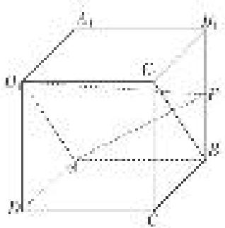

text_image

Geometric diagram of a cube with labeled vertices and internal points, used for spatial geometry problems.

解析 (1)在正方体 $ABCD-A_{1}B_{1}C_{1}D_{1}$ 中， $AB \parallel A_{1}B_{1}$ 且 $AB=A_{1}B_{1}$ ， $A_{1}B_{1} \parallel C_{1}D_{1}$ 且 $A_{1}B_{1}=C_{1}D_{1}$ ，

∴ $AB \parallel C_{1}D_{1}$ 且 $AB = C_{1}D_{1}$ ，∴ 四边形 $ABC_{1}D_{1}$ 为平行四边形，∴ $BC_{1} \parallel AD_{1}$

∵ $BC_{1}$ ∉ 平面 $AD_{1}E$ ， $AD_{1} \subset$ 平面 $AD_{1}E$ ，∴ $BC_{1}$ ∥ 平面 $AD_{1}E$ .

(2)以点 A 为坐标原点，AD，AB， $AA_{1}$ 所在直线分别为 x 轴、y 轴、z 轴，建立如图所示的空间直角坐标系 Axyz，

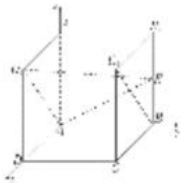

text_image

Diagram showing a 3D coordinate system with labeled axes and points, likely from a physics or engineering context.

设正方体 $ABCD-A_{1}B_{1}C_{1}D_{1}$ 的棱长为 2，则 $A(0,0,0)$ ， $A_{1}(0,0,2)$ ， $D_{1}(2,0,2)$ ， $E(0,2,1)$ ， $\overrightarrow{AA_{1}}=(0,0,2)$ ， $\overrightarrow{AD_{1}}=(2,0,2)$ ， $\overrightarrow{AE}=(0,2,1)$ .

设平面 $AD_{1}E$ 的法向量为 $\boldsymbol{n}=(x,y,z)$ ，由 $\left\{\begin{aligned}\boldsymbol{n}\cdot\overrightarrow{AD_{1}}&=0,\\ \boldsymbol{n}\cdot\overrightarrow{AE}&=0,\end{aligned}\right.$ 得 $\left\{\begin{aligned}2x+2z&=0,\\ 2y+z&=0,\end{aligned}\right.$

令 $z = -2$ ，则 $x = 2$ ， $y = 1$ ，则 $\pmb {n} = (2,1, - 2)$ . $\cos <   \pmb {n}$ ， $\overrightarrow{AA_1} > = \frac{\pmb{n}\cdot\overrightarrow{AA_1}}{|\pmb{n}||\overrightarrow{AA_1}|} = \frac{-4}{3\times 2} = -\frac{2}{3}.$

因此，直线 $AA_{1}$ 与平面 $AD_{1}E$ 所成角的正弦值为 $\frac{2}{3}$ .

[例 4] (2020·浙江)如图，在三棱台 ABC-DEF 中，平面 $ACFD \perp$ 平面 ABC， $\angle ACB = \angle ACD = 45^{\circ}$ ，DC = 2BC.

(1)证明： $EF \perp DB;$   
(2)求直线 DF 与平面 DBC 所成角的正弦值.

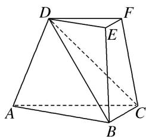

text_image

Geometric diagram of a triangular prism with labeled vertices A, B, C, D, E, F and dashed internal lines indicating hidden edges.

解析 (1)如图，过点 D 作 $DO \perp AC$ ，交直线 AC 于点 O，连接 OB.

由 $\angle ACD=45^{\circ}$ ， $DO\perp AC$ 得 $CD=\sqrt{2}CO$ .

由平面 $ACFD \perp$ 平面 ABC，得 $DO \perp$ 平面 ABC，所以 $DO \perp BC$ .

由 $\angle ACB = 45^{\circ}$ ， $BC = \frac{1}{2} CD = \frac{\sqrt{2}}{2} CO$ 得 $BO\bot BC$ ，所以 $BC\bot$ 平面 $BDO$ ，故 $BC\bot DB$

由三棱台 ABC-DEF 得 BC//EF，所以 $EF \perp DB$ .

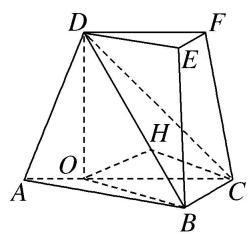

text_image

Geometric diagram of a triangular prism with labeled vertices and internal points, used for spatial geometry problems.

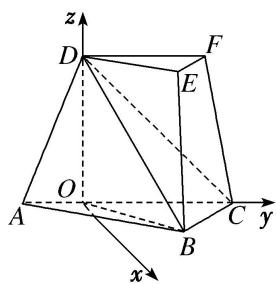

text_image

z
D
F
E
O
A
B
C
y
x

(2)法一：如图，过点 O 作 $OH \perp BD$ ，交直线 BD 于点 H，连接 CH.

由三棱台 $ABC-DEF$ 得 $DF \parallel CO$ , 所以直线 $DF$ 与平面 $DBC$ 所成角等于直线 $CO$ 与平面 $DBC$ 所成角.

由 $BC \perp$ 平面 $BDO$ 得 $OH \perp BC$ ，故 $OH \perp$ 平面 $BCD$ ，所以 $\angle OCH$ 为直线 $CO$ 与平面 $DBC$ 所成角.

设 $CD=2\sqrt{2}$ .

由 $DO = OC = 2$ ， $BO = BC = \sqrt{2}$ ，得 $BD = \sqrt{6}$ ， $OH = \frac{2}{3}\sqrt{3}$ ，所以 $\sin \angle OCH = \frac{OH}{OC} = \frac{\sqrt{3}}{3}$

因此，直线 $DF$ 与平面 $DBC$ 所成角的正弦值为 $\frac{\sqrt{3}}{3}$ .

法二：由三棱台 $ABC - DEF$ 得 $DF \parallel CO$ ,

所以直线 $DF$ 与平面 $DBC$ 所成角等于直线 $CO$ 与平面 $DBC$ 所成角，记为 $\theta$ .

如图，以 O 为原点，分别以射线 OC，OD 为 y，z 轴的正半轴，建立空间直角坐标系 O-xyz.

设 $CD = 2\sqrt{2}$ ，由题意知各点坐标如下：

$O(0, 0, 0), B(1, 1, 0), C(0, 2, 0), D(0, 0, 2).$

因此 $\overrightarrow{OC} = (0, 2, 0)$ , $\overrightarrow{BC} = (-1, 1, 0)$ , $\overrightarrow{CD} = (0, -2, 2)$ .

设平面 BCD 的法向量 $n=(x, y, z)$ .

由 $\left\{\begin{aligned}n\cdot\overrightarrow{BC}&=0,\\ n\cdot\overrightarrow{CD}&=0,\end{aligned}\right.$ 即 $\left\{\begin{aligned}-x+y&=0,\\ -2y+2z&=0,\end{aligned}\right.$ 可取 $n=(1,1,1)$ .

所以 $\sin\theta=|\cos<\overrightarrow{OC},\quad n>|=\frac{|\overrightarrow{OC}\cdot n|}{|\overrightarrow{OC}|\cdot|n|}=\frac{\sqrt{3}}{3}.$

因此，直线 $DF$ 与平面 $DBC$ 所成角的正弦值为 $\frac{\sqrt{3}}{3}$ .

# 【对点训练】

1. 如图，在三棱柱 $ABC - A_{1}B_{1}C_{1}$ 中， $\triangle ABC$ 和 $\triangle AA_{1}C$ 均是边长为 2 的等边三角形，点 $O$ 为 $AC$ 中点，平面 $AA_{1}C_{1}C \perp$ 平面 $ABC$ .

(1)证明： $A_{1}O \perp$ 平面 ABC:  
(2)求直线 $AB$ 与平面 $A_{1}BC_{1}$ 所成角的正弦值.

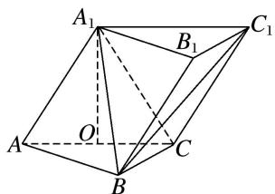

text_image

A₁
B₁
C₁
A
O
C
B

1. 解析 (1) $\because AA_{1} = A_{1}C$ ，且 $O$ 为 $AC$ 的中点， $\therefore A_{1}O \perp AC$

又∵平面 $AA_{1}C_{1}C$ ⊥平面ABC，平面 $AA_{1}C_{1}C$ ∩平面ABC=AC， $A_{1}O \subset$ 平面 $AA_{1}C_{1}C$ ，∴ $A_{1}O \perp$ 平面ABC.

(2)如图，以 O 为原点，OB，OC， $OA_{1}$ 所在直线分别为 x 轴、y 轴、z 轴建立空间直角坐标系.

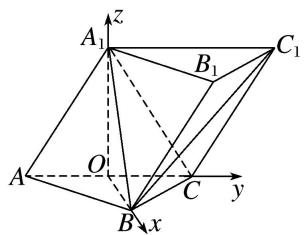

text_image

A₁
z
B₁
C₁
A
O
C
y
B
x

由已知可得 $O(0, 0, 0)$ ， $A(0, -1, 0)$ ， $B(\sqrt{3}, 0, 0)$ ， $A_{1}(0, 0, \sqrt{3})$ ， $C_{1}(0, 2, \sqrt{3})$ ，

$$
\therefore \overrightarrow {A B} = (\sqrt {3}, 1, 0), \overrightarrow {A _ {1} B} = (\sqrt {3}, 0, - \sqrt {3}), \overrightarrow {A _ {1} C _ {1}} = (0, 2, 0),
$$

设平面 $A_{1}BC_{1}$ 的法向量为 $\boldsymbol{n}=(x,y,z)$ ，则 $\left\{\begin{aligned}\boldsymbol{n}\cdot A_{1}\overrightarrow{C}_{1}&=0,\\ \boldsymbol{n}\cdot A_{1}\overrightarrow{B}&=0,\end{aligned}\right.$ 即 $\left\{\begin{aligned}2y&=0,\\\sqrt{3}x-\sqrt{3}z&=0,\end{aligned}\right.$

∴平面 $A_{1}BC_{1}$ 的一个法向量为 $n=(1,0,1)$ ,

设直线 AB 与平面 $A_{1}BC_{1}$ 所成的角为 $\alpha$ ，则 $\sin \alpha = |\cos < \overrightarrow{AB}, n > |$ ,

又∵cos<AB，n>= $\frac{\overrightarrow{AB}\cdot n}{|\overrightarrow{AB}||n|}=\frac{\sqrt{3}}{2\sqrt{2}}=\frac{\sqrt{6}}{4}$

∴AB与平面 $A_{1}BC_{1}$ 所成角的正弦值为 $\frac{\sqrt{6}}{4}$ .

2. (2020·全国Ⅱ)如图，已知三棱柱 $ABC-A_{1}B_{1}C_{1}$ 的底面是正三角形，侧面 $BB_{1}C_{1}C$ 是矩形，M，N 分别为 BC， $B_{1}C_{1}$ 的中点，P 为 AM 上一点，过 $B_{1}C_{1}$ 和 P 的平面交 AB 于 E，交 AC 于 F.

(1)证明： $AA_{1} \parallel MN$ ，且平面 $A_{1}AMN \perp$ 平面 $EB_{1}C_{1}F$ ;

(2)设 O 为 $\triangle A_{1}B_{1}C_{1}$ 的中心，若 $AO \parallel$ 平面 $EB_{1}C_{1}F$ ，且 AO = AB，求直线 $B_{1}E$ 与平面 $A_{1}AMN$ 所成角的正弦值.

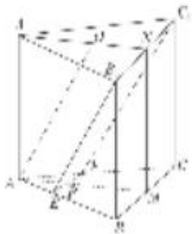

text_image

Geometric diagram of a cube with labeled vertices and internal points, used for spatial geometry problems.

2. 解析 (1)因为 $M, N$ 分别为 $BC, B_{1}C_{1}$ 的中点，所以 $MN \parallel CC_{1}$ 。又由已知得 $AA_{1} \parallel CC_{1}$ ，故 $AA_{1} \parallel MN$ 。因为 $\triangle A_{1}B_{1}C_{1}$ 是正三角形，所以 $B_{1}C_{1} \perp A_{1}N$ 。又 $B_{1}C_{1} \perp MN$ ，故 $B_{1}C_{1} \perp$ 平面 $A_{1}AMN$ 。

所以平面 $A_{1}AMN \perp$ 平面 $EB_{1}C_{1}F$ .

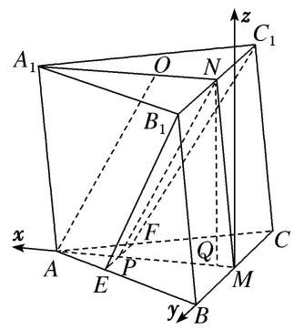

text_image

A₁
O
N
C₁
B₁
F
Q
A
E
P
M
C
y
B
x
z

(2)由已知得 $AM \perp BC$ 。以 $M$ 为坐标原点， $\overrightarrow{MA}$ 的方向为 $x$ 轴正方向， $|\overrightarrow{MB}|$ 为单位长，建立如图所示的空间直角坐标系 $M - xyz$ ，则 $AB = 2$ ， $AM = \sqrt{3}$ 。

连接 NP，则四边形 AONP 为平行四边形，故 $PM=\frac{2\sqrt{3}}{2}$ ， $E\left(\frac{2\sqrt{3}}{3},\frac{1}{3},0\right)$ .

由(1)知平面 $A_{1}AMN \perp$ 平面 ABC.

作 $NQ \perp AM$ ，垂足为 $Q$ ，则 $NQ \perp$ 平面 $ABC$ 。设 $Q(a, 0, 0)$ ，则 $NQ = \sqrt{4 - \left(\frac{2\sqrt{3}}{3} - a\right)^2}$ ，

$B_{1}\left(a,1,\sqrt{4-\left(\frac{2\sqrt{3}}{3}-a\right)_{2}}\right), \text{故}B_{1}E=\left(\frac{2\sqrt{3}}{3}-a,-\frac{2}{3},-\sqrt{4-\left(\frac{2\sqrt{3}}{3}-a\right)_{2}}\right), |B_{1}E|=\frac{2\sqrt{10}}{3}.$

又 $n=(0, -1, 0)$ 是平面 $A_{1}AMN$ 的法向量，故

$$
\sin \left(\frac {\pi}{2} - <   n, \overrightarrow {B _ {1} E} >\right) = \cos <   n, \overrightarrow {B _ {1} E} > = \frac {n \cdot \overrightarrow {B _ {1} E}}{| n | \cdot | \overrightarrow {B _ {1} E} |} = \frac {\sqrt {1 0}}{1 0}.
$$

所以直线 $B_{1}E$ 与平面 $A_{1}AMN$ 所成角的正弦值为 $\frac{\sqrt{10}}{10}$ .

3. 斜三棱柱 $ABC - A_{1}B_{1}C_{1}$ 中，底面是边长为2的正三角形， $A_{1}B = \sqrt{7}$ ， $\angle A_{1}AB = \angle A_{1}AC = 60^{\circ}$ .

(1)证明：平面 $A_{1}BC \perp$ 平面 ABC;  
(2)求直线 $BC_{1}$ 与平面 $ABB_{1}A_{1}$ 所成角的正弦值.

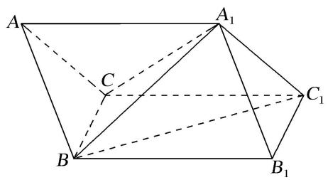

text_image

A
A₁
C
B
C₁
B₁

3. 解析 (1) $\because AB = 2, A_{1}B = \sqrt{7}, \angle A_{1}AB = 60^{\circ}$ ,

∴由余弦定理得 $A_{1}B^{2}=AA_{1}^{2}+AB^{2}-2AA_{1}\cdot AB\cos\angle A_{1}AB$ ,

即 $AA_{1}^{2}-2AA_{1}-3=0\Rightarrow AA_{1}=3$ 或 $AA_{1}=-1$ (舍)，故 $AA_{1}=3$ .

取 BC 的中点 O，连接 OA， $OA_{1}$ ，∵ $\triangle ABC$ 是边长为 2 的正三角形，∴ $AO \perp BC$ ，且 $AO = \sqrt{3}$ ，BO = 1。由 AB=AC， $\angle A_{1}AB=\angle A_{1}AC$ ， $AA_{1}=AA_{1}$ 得 $\triangle A_{1}AB\cong\triangle A_{1}AC$ ，得 $A_{1}B=A_{1}C=\sqrt{7}$

故 $A_{1}O \perp BC$ ，且 $A_{1}O = \sqrt{6}$ .

$\because AO^{2} + A_{1}O^{2} = 3 + 6 = 9 = AA_{1}^{2}, \therefore AO \perp A_{1}O.$ 又 $BC \cap AO = O$ ，故 $A_{1}O \perp$ 平面 $ABC$

$\because A_{1}O\subset$ 平面 $A_{1}BC,\therefore$ 平面 $A_{1}BC\perp$ 平面ABC.

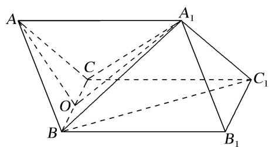

text_image

A
A₁
C
O
B
C₁
B₁

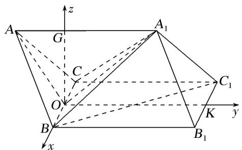

text_image

A
G₁
z
A₁
C
O
B
x
K
y
C₁
B₁

(2)以 O 为原点，OB 所在的直线为 x 轴，取 $B_{1}C_{1}$ 的中点 K，连接 OK，以 OK 所在的直线为 y 轴，过 O 作 $OG \perp AA_{1}$ ，以 OG 所在的直线为 z 轴建立空间直角坐标系，

则 $B(1, 0, 0)$ ， $B_{1}(1, 3, 0)$ ， $C_{1}(-1, 3, 0)$ ， $A_{1}(0, 2, \sqrt{2})$

$$
\therefore \overrightarrow {B C} _ {1} = (- 2, 3, 0), \overrightarrow {B B} _ {1} = (0, 3, 0), \overrightarrow {B A} _ {1} = (- 1, 2, \sqrt {2}),
$$

设 $\boldsymbol{m}=(x,y,1)$ 为平面 $ABB_{1}A_{1}$ 的法向量，

则 $\left\{ \begin{array}{l} m \cdot \overrightarrow{BB_1} = 3y = 0, \\ m \cdot \overrightarrow{BA_1} = -x + 2y + \sqrt{2} = 0, \end{array} \right. \Rightarrow \left\{ \begin{array}{l} x = \sqrt{2}, \\ y = 0, \end{array} \right. \Rightarrow m = (\sqrt{2}, 0, 1)$ .

设直线 $BC_{1}$ 与平面 $ABB_{1}A_{1}$ 所成角为 $\theta$ ，则 $\sin\theta=\frac{|\overrightarrow{BC_{1}}\cdot\boldsymbol{m}|}{|\overrightarrow{BC_{1}}||\boldsymbol{m}|}=\frac{2\sqrt{2}}{\sqrt{13}\times\sqrt{3}}=\frac{2\sqrt{78}}{39}$ .

故直线 $BC_{1}$ 与平面 $ABB_{1}A_{1}$ 所成角的正弦值为 $\frac{2\sqrt{78}}{39}$ .

4. 如图，在几何体 $ABC - A_{1}B_{1}C_{1}$ 中，平面 $A_{1}ACC_{1} \perp$ 底面 $ABC$ ，四边形 $A_{1}ACC_{1}$ 是正方形， $B_{1}C_{1} // BC$ ， $Q$ 是 $A_{1}B$ 的中点，且 $AC = BC = 2B_{1}C_{1}$ ， $\angle ACB = \frac{2\pi}{3}$ .

(1)证明： $B_{1}Q \perp A_{1}C;$   
(2)求直线 AC 与平面 $A_{1}BB_{1}$ 所成角的正弦值.

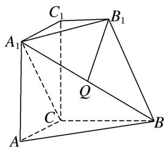

text_image

C₁
B₁
A₁
Q
C
A
B

4. 解析 (1)如图所示, 连接 $AC_{1}$ 与 $A_{1}C$ 交于 $M$ 点, 连接 $MQ$ .

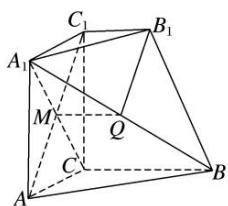

text_image

Geometric diagram of a polyhedron with labeled vertices and internal points, used for spatial geometry problems.

∵四边形 $A_{1}ACC_{1}$ 是正方形，∴M 是 $AC_{1}$ 的中点，又 Q 是 $A_{1}B$ 的中点，∴ $MQ \parallel BC$ ， $MQ = \frac{1}{2} BC$ ，

又∵ $B_{1}C_{1}//BC$ 且 $BC=2B_{1}C_{1}$ ，∴ $MQ\parallel B_{1}C_{1}$ ， $MQ=B_{1}C_{1}$

∴四边形 $B_{1}C_{1}MQ$ 是平行四边形，∴ $B_{1}Q \parallel C_{1}M$ ，∵ $C_{1}M \perp A_{1}C$ ，∴ $B_{1}Q \perp A_{1}C$ .

(2)∵平面 $A_{1}ACC_{1}\perp$ 平面 ABC，平面 $A_{1}ACC_{1}\cap$ 平面 ABC=AC， $CC_{1}\perp AC$ ， $CC_{1}\subset$ 平面 $A_{1}ACC_{1}$

$\therefore CC_{1} \perp$ 平面 $ABC$ . 如图所示, 以 $C$ 为原点, $CB$ , $CC_{1}$ 所在直线分别为 $y$ 轴和 $z$ 轴建立空间直角坐标系, 令 $AC = BC = 2B_{1}C_{1} = 2$ ,

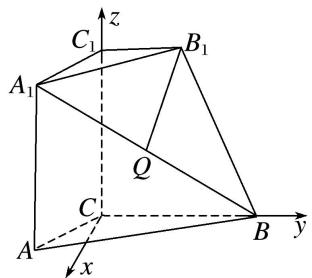

text_image

C₁
z
A₁
B₁
Q
C
A
x
B
y

则 $C(0, 0, 0)$ ， $A(\sqrt{3}, -1, 0)$ ， $A_{1}(\sqrt{3}, -1, 2)$ ， $B(0, 2, 0)$ ， $B_{1}(0, 1, 2)$ ，

$$
\therefore \overrightarrow {C A} = (\sqrt {3}, - 1, 0), B _ {1} \overrightarrow {A _ {1}} = (\sqrt {3}, - 2, 0), \overrightarrow {B _ {1} B} = (0, 1, - 2),
$$

设平面 $A_{1}BB_{1}$ 的法向量为 $\boldsymbol{n}=(x,y,z)$ ，则由 $n\perp B_{1}A_{1}, n\perp B_{1}B,$

可得 $\left\{\begin{aligned}\sqrt{3}x-2y=0,\\ y-2z=0,\end{aligned}\right.$ 可令 $y=2\sqrt{3}$ ，则x=4， $z=\sqrt{3}$

∴平面 $A_{1}BB_{1}$ 的一个法向量 $n=(4,2\sqrt{3},\sqrt{3})$ ,

设直线 AC 与平面 $A_{1}BB_{1}$ 所成的角为 $\alpha$ ，则 $\sin \alpha = \frac{|\boldsymbol{n} \cdot \overrightarrow{CA}|}{|\boldsymbol{n}| \cdot |\overrightarrow{CA}|} = \frac{2\sqrt{3}}{2\sqrt{31}} = \frac{\sqrt{93}}{31}$ .

5. 如图所示，在四棱台 $ABCD - A_1B_1C_1D_1$ 中， $AA_1 \perp$ 底面 $ABCD$ ，四边形 $ABCD$ 为菱形， $M$ 为 $CD$ 的中点， $\angle BAD = 120^\circ$ ， $AB = AA_1 = 2A_1B_1 = 2$ .

(1)求证： $AM \perp$ 平面 $AA_{1}B_{1}B$ ;

(2)求直线 $DD_{1}$ 与平面 $A_{1}BD$ 所成角的正弦值.

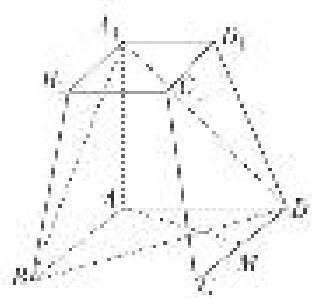

natural_image

3D geometric diagram of a cube with labeled vertices (A, B, C, D, E, F) and internal dashed lines indicating hidden edges (no text or symbols)

5. 解析 (1)∵四边形ABCD为菱形， $\angle BAD=120^{\circ}$ ，连接AC，则 $\triangle ACD$ 为等边三角形，

又 M 为 CD 的中点，∴ $AM \perp CD$ ，又 $CD \parallel AB$ ，∴ $AM \perp AB$ ，

∵ $AA_{1} \perp$ 底面 ABCD，AM ⊂ 底面 ABCD，∴ $AM \perp AA_{1}$

又 $AB \cap AA_{1} = A, \therefore AM \perp$ 平面 $AA_{1}B_{1}B.$

(2)∵四边形 ABCD 为菱形， $\angle BAD=120^{\circ}$ ， $AB=AA_{1}=2A_{1}B_{1}=2$ ，

$\therefore DM=1,\quad AM=\sqrt{3},\quad \therefore \angle AMD=\angle BAM=90^{\circ}$ ，又 $AA_{1}\perp$ 底面 ABCD，

以 A 为坐标原点，AB，AM， $AA_{1}$ 所在的直线分别为 x 轴、y 轴、z 轴，

建立如图所示的空间直角坐标系 Axyz，则 $A_{1}(0,0,2)$ ， $B(2,0,0)$ ， $D(-1,\sqrt{3},0)$ ， $D_{1}\left[-\frac{1}{2},\frac{\sqrt{3}}{2},2\right]$

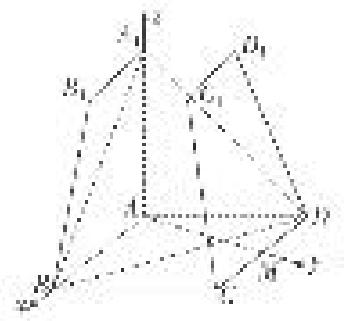

text_image

Geometric diagram of a 3D polyhedron with labeled vertices and edges, including points A, B, C, D, E, F, G, H, I, J, K.

$$
\therefore \overrightarrow {D D} _ {1} = \left(\frac {1}{2}, - \frac {\sqrt {3}}{2}, 2\right), \overrightarrow {B D} = (- 3, \sqrt {3}, 0, \overrightarrow {A _ {1}} B = (2, 0, - 2),
$$

设平面 $A_{1}BD$ 的法向量为 $\boldsymbol{n}=(x,y,z)$ ,

则有 $\left\{ \begin{array}{l} n \cdot \overrightarrow{BD} = 0, \\ n \cdot \overrightarrow{A_1B} = 0 \end{array} \right.$ $\Rightarrow \left\{ \begin{array}{l} -3x + \sqrt{3}y = 0, \\ 2x - 2z = 0 \end{array} \right.$ $\Rightarrow y = \sqrt{3}x = \sqrt{3}z,$ 令 $x = 1$ ，则 $n = (1,\sqrt{3},1)$

∴直线 $DD_{1}$ 与平面 $A_{1}BD$ 所成角 $\theta$ 的正弦值 $\sin\theta=|\cos<n,\quad\overrightarrow{DD_{1}}>|=\frac{|\boldsymbol{n}\cdot\overrightarrow{DD_{1}}|}{|\boldsymbol{n}||\overrightarrow{DD_{1}}|}=\frac{1}{5}.$

# 考点二 棱(圆)锥模型

[例1] 如图，在三棱锥 $A - BCD$ 中， $AB = BD = AD = AC = 2$ ， $\triangle BCD$ 是以 $BD$ 为斜边的等腰直角三角形， $P$ 为 $AB$ 的中点， $E$ 为 $BD$ 的中点.

(1)求证： $AE \perp$ 平面 BCD;  
(2)求直线 PD 与平面 ACD 所成角的正弦值.

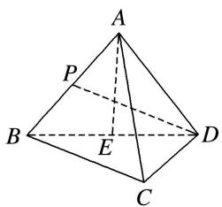

text_image

A
P
B
E
D
C

解析 (1)由题图可知, $\triangle ABD$ 是边长为 2 的等边三角形,

∵E为BD的中点，∴AE⊥BD，且 $AE=\sqrt{3}$ ，如图，连接CE，

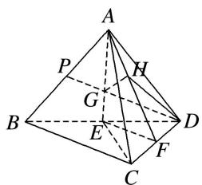

text_image

A
P
H
G
B
E
D
F
C

∵△BCD 是斜边长为 2 的等腰直角三角形，∴ $CE=\frac{1}{2}BD=1$ ，

在 $\triangle AEC$ 中，AC=2，EC=1， $AE=\sqrt{3}$ ， $\therefore AC^{2}=AE^{2}+EC^{2}$ ， $\therefore AE\perp EC$ .

$\because BD\cap EC=E,\ BD\subset$ 平面 BCD, $EC\subset$ 平面 BCD, $\therefore AE\perp$ 平面 BCD.

(2)方法一 取 CD 的中点 F，连接 AF，EF，∵ AC = AD，∴ CD ⊥ AF.

由(1)可知， $AE \perp CD$ ，∵ $AE \cap AF = A$ ， $AE \subset$ 平面 AEF， $AF \subset$ 平面 AEF，∴ $CD \perp$ 平面 AEF，又 $CD \subset$ 平面 ACD，∴ 平面 $AEF \perp$ 平面 ACD.

设 $PD$ ， $AE$ 相交于点 $G$ ，则点 $G$ 为 $\triangle ABD$ 的重心， $\therefore AG = DG = \frac{2}{3} AE = \frac{2\sqrt{3}}{3}.$

过点 G 作 $GH \perp AF$ 于 H，则 $GH \perp$ 平面 ACD，

连接 DH，则 $\angle GDH$ 为直线 PD 与平面 ACD 所成的角.

易知 $\triangle AGH\sim \triangle AFE$ ， $EF = \frac{1}{2} BC = \frac{\sqrt{2}}{2}$ ， $AF = \frac{\sqrt{14}}{2}$ ，∴ $GH = \frac{AG}{AF}\cdot EF = \frac{\frac{2\sqrt{3}}{3}}{\frac{\sqrt{14}}{2}}\times \frac{\sqrt{2}}{2} = \frac{2\sqrt{21}}{21},$

∴ $\sin\angle GDH=\frac{GH}{DG}=\frac{\sqrt{7}}{7}$ ，即直线 PD 与平面 ACD 所成角的正弦值为 $\frac{\sqrt{7}}{7}$ .

方法二 由(1)可知 $AE \perp$ 平面 $BCD$ ，且 $CE \perp BD$ ，∴可作如图所示的空间直角坐标系 $E - xyz$

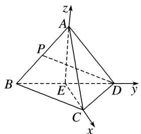

text_image

z
A
P
B
E
D
y
C
x

则 $A(0, 0, \sqrt{3})$ ， $C(1, 0, 0)$ ， $D(0, 1, 0)$ ， $P\left(0, -\frac{1}{2}, \frac{\sqrt{3}}{2}\right)$ ，

$$
\vec {A D} = (0, 1, - \sqrt {3}), \vec {C D} = (- 1, 1, 0), \vec {D P} = \left(0, - \frac {3}{2}, \frac {\sqrt {3}}{2}\right),
$$

设平面 ACD 的一个法向量为 $\boldsymbol{n}=(x,y,z)$ ，∴ $\left\{\begin{aligned}\boldsymbol{n}\cdot\overrightarrow{AD}&=0,\\ \boldsymbol{n}\cdot\overrightarrow{CD}&=0,\end{aligned}\right.$ 即 $\left\{\begin{aligned}y-\sqrt{3}z&=0,\\ -x+y&=0,\end{aligned}\right.$

取 x=y=1，则 $z=\frac{\sqrt{3}}{3}$ ，∴ $n=\left(1,1,\frac{\sqrt{3}}{3}\right)$ 为平面 ACD 的一个法向量，

设 PD 与平面 ACD 所成的角为 $\theta$ ，则 $\sin\theta=\frac{|n\cdot\overrightarrow{DP}|}{|n|\cdot|\overrightarrow{DP}|}=\frac{\sqrt{7}}{7}$ ,

故直线 $PD$ 与平面 $ACD$ 所成角的正弦值为 $\frac{\sqrt{7}}{7}$ .

[例 2] (2020·新山东)如图，四棱锥 P-ABCD 的底面为正方形，PD⊥底面 ABCD．设平面 PAD 与平面 PBC 的交线为 l.

(1)证明： $l \perp$ 平面 PDC;  
(2)已知 $PD = AD = 1$ ， $Q$ 为 $l$ 上的点，求 $PB$ 与平面 $QCD$ 所成角的正弦值的最大值.

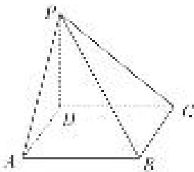

text_image

Geometric diagram of a tetrahedron with labeled vertices A, B, C, D, and point P, showing solid and dotted edges.

解析 (1)在正方形 $ABCD$ 中， $AD \parallel BC$ ，因为 $AD \nparallel$ 平面 $PBC$ ， $BC \subset$ 平面 $PBC$ ，所以 $AD \parallel$ 平面 $PBC$ ，又因为 $AD \subset$ 平面 $PAD$ ，平面 $PAD \cap$ 平面 $PBC = l$ ，所以 $AD \parallel l$ .

因为在四棱锥 P-ABCD 中，底面 ABCD 是正方形，所以 $AD \perp DC$ ，所以 $l \perp DC$ ，

又 $PD \perp$ 平面 ABCD，所以 $AD \perp PD$ ，所以 $l \perp PD$ 。因为 $DC \cap PD = D$ ，所以 $l \perp$ 平面 PDC。

(2)如图建立空间直角坐标系 Dxyz,

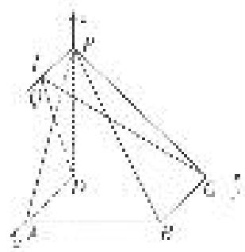

text_image

Geometric diagram with labeled points and lines, likely from a math problem or proof

因为 PD=AD=1，则有 $D(0,0,0)$ ， $C(0,1,0)$ ， $A(1,0,0)$ ， $P(0,0,1)$ ， $B(1,1,0)$ ，

设 $Q(m, 0, 1)$ ，则有 $\overrightarrow{DC}=(0, 1, 0)$ ， $\overrightarrow{DQ}=(m, 0, 1)$ ， $\overrightarrow{PB}=(1, 1, -1)$ .

设平面 QCD 的法向量为 $\boldsymbol{n}=(x,y,z)$ ，则 $\left\{\begin{aligned}\vec{D}C\cdot\boldsymbol{n}&=0,\\ \vec{D}Q\cdot\boldsymbol{n}&=0,\end{aligned}\right.$ 即 $\left\{\begin{aligned}y&=0,\\ mx+z&=0,\end{aligned}\right.$

令 x=1，则 z=-m，所以平面 QCD 的一个法向量为 $n=(1,0,-m)$ ,

则 $\cos<n,\quad\overrightarrow{PB}=\frac{\boldsymbol{n}\cdot\overrightarrow{PB}}{|\boldsymbol{n}||\overrightarrow{PB}|}=\frac{1+0+m}{\sqrt{3}\cdot\sqrt{m^{2}+1}}.$

根据直线的方向向量与平面法向量所成角的余弦值的绝对值即为直线与平面所成角的正弦值，所以直线与平面所成角的正弦值等于

$$
| \cos <   n, \vec {P B} > | = \frac {| 1 + m |}{\sqrt {3} \cdot \sqrt {m ^ {2} + 1}} = \frac {\sqrt {3}}{3} \cdot \sqrt {\frac {1 + 2 m + m ^ {2}}{m ^ {2} + 1}} = \frac {\sqrt {3}}{3} \cdot \sqrt {1 + \frac {2 m}{m ^ {2} + 1}}
$$

$\leqslant \frac{\sqrt{3}}{3}\cdot \sqrt{1 + \frac{2|m|}{m^2 + 1}}\leqslant \frac{\sqrt{3}}{3}\cdot \sqrt{1 + 1} = \frac{\sqrt{6}}{3},$ 当且仅当 $m = 1$ 时取等号，

所以直线 $PB$ 与平面 $QCD$ 所成角的正弦值的最大值为 $\frac{\sqrt{6}}{3}$ .

[例 3] 如图，在四棱锥 E-ABCD 中，底面 ABCD 为直角梯形， $AB \parallel CD$ ， $BC \perp CD$ ， $AB = 2BC = 2CD$ 。 $\triangle EAB$ 是以 AB 为斜边的等腰直角三角形，且平面 $EAB \perp$ 平面 ABCD。点 F 满足： $\overrightarrow{EF} = \lambda \overrightarrow{EA} (\lambda \in [0, 1])$ 。

(1)试探究 $\lambda$ 为何值时，CE//平面BDF，并给予证明；  
(2)在(1)的条件下，求直线 AB 与平面 BDF 所成角的正弦值.

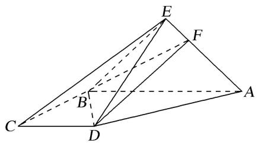

text_image

Geometric diagram of a pyramid with labeled vertices and internal points, including dashed lines for hidden edges.

解析 (1) 当 $\lambda = \frac{1}{3}$ 时， $CE //$ 平面 $FBD$ .

证明如下：连接 AC，交 BD 于点 M，连接 MF，

因为 $AB \parallel CD$ ，所以 AM:MC=AB:CD=2:1。又 $\overrightarrow{EF}=\frac{1}{3}\overrightarrow{EA}$ ，所以 FA:EF=2:1。

所以 AM:MC=AF:EF=2:1. 所以 MF//CE.

又 $MF \subset$ 平面 BDF， $CE \notin$ 平面 BDF，所以 CE // 平面 BDF.

(2)取 AB 的中点 O，连接 EO，OD．则 $EO \perp AB$ .

又因为平面 $ABE \perp$ 平面 ABCD，平面 $ABE \cap$ 平面 ABCD = AB，EO < 平面 ABE，

所以 $EO \perp$ 平面 ABCD，因为 $OD \subset$ 平面 ABCD，所以 $EO \perp OD$ .

由 $BC \perp CD$ ，及 AB = 2CD， $AB \parallel CD$ ，得 $OD \perp AB$ ，

由 OB, OD, OE 两两垂直，建立如图所示的空间直角坐标系 O-xyz.

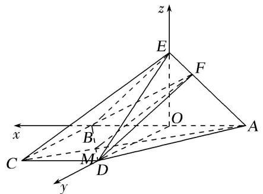

text_image

z
E
F
O
x
B
A
C
M
D
y

因为 $\triangle EAB$ 为等腰直角三角形， $AB=2BC=2CD$ ，所以OA=OB=OD=OE，设OB=1，所以O(0,0,0)，A(-1,0,0)，B(1,0,0)，C(1,1,0)，D(0,1,0)，E(0,0,1).

所以 $\overrightarrow{AB}=(2,0,0)$ ， $\overrightarrow{BD}=(-1,1,0)$ ， $\overrightarrow{EA}=(-1,0,-1)$ ，

$\overrightarrow{EF}=\frac{1}{3}\overrightarrow{EA}=\left(-\frac{1}{3},0,-\frac{1}{3}\right),F\left(-\frac{1}{3},0,\frac{2}{3}\right),所以\overrightarrow{FB}=\left(\frac{4}{3},0,-\frac{2}{3}\right).$

设平面 BDF 的法向量为 $\boldsymbol{n}=(x,y,z)$ ，则有 $\left\{\begin{aligned}\boldsymbol{n}\cdot\overrightarrow{BD}&=0,\\ \boldsymbol{n}\cdot\overrightarrow{FB}&=0,\end{aligned}\right.$ 所以 $\left\{\begin{aligned}-x+y&=0,\\ \frac{4}{3}x-\frac{2}{3}z&=0.\end{aligned}\right.$

取 x=1，得 $n=(1,1,2)$ .

设直线 AB 与平面 BDF 所成的角为 $\theta$ ，则 $\sin\theta=|\cos<\overrightarrow{AB},\quad n>|=\frac{|\overrightarrow{AB}\cdot n|}{|\overrightarrow{AB}||n|}=\frac{|2\times1+0\times1+0\times2|}{2\sqrt{1^{2}+1^{2}+2^{2}}}=\frac{\sqrt{6}}{6}$ .

故直线 AB 与平面 BDF 所成角的正弦值为 $\frac{\sqrt{6}}{6}$ .

[例 4] 如图，在四棱锥 E-ABCD 中，底面 ABCD 是圆内接四边形， $CB=CD=CE=1$ ， $AB=AD=AE=\sqrt{3}$ ， $EC\perp BD$ .

(1)求证：平面 $BED \perp$ 平面 $ABCD$ ;

(2)若点 $P$ 在平面 $ABE$ 内运动，且 $DP \parallel$ 平面 $BEC$ ，求直线 $DP$ 与平面 $ABE$ 所成角的正弦值的最大值.

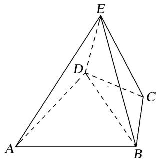

text_image

Geometric diagram of a tetrahedron with labeled vertices A, B, C, D, and E

解析 (1)如图，连接 AC，交 BD 于点 O，连接 EO，

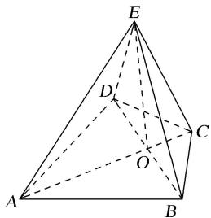

text_image

Geometric diagram of a tetrahedron with labeled vertices A, B, C, D, E and internal point O, showing solid and dashed edges.

∵AD=AB, CD=CB, AC=AC, ∴△ADC≌△ABC，易得△ADO≌△ABO,

$$
\therefore \angle A O D = \angle A O B = 9 0 ^ {\circ}, \therefore A C \perp B D.
$$

又 $EC \perp BD, EC \cap AC = C, \therefore BD \perp$ 平面 AEC，又 $OE \subset$ 平面 AEC，∴ $OE \perp BD.$

又底面 ABCD 是圆内接四边形，∴ $\angle ADC = \angle ABC = 90^{\circ}$ ,

在 Rt△ADC 中，由 $AD=\sqrt{3}$ ，CD=1，可得 AC=2， $AO=\frac{3}{2}$ ，∴ $\angle AEC=90^{\circ}$ ， $\frac{AE}{AC}=\frac{AO}{AE}=\frac{\sqrt{3}}{2}$

易得 $\triangle AEO\sim\triangle ACE,\quad\therefore\angle AOE=\angle AEC=90^{\circ}$ ，即 $EO\perp AC$ .

又 AC, BD⊂平面 ABCD, $AC \cap BD = O$ , ∴ EO⊥平面 ABCD,

又 $EO \subset$ 平面 BED，∴平面 $BED \perp$ 平面 ABCD.

(2)如图，取 AE 的中点 M，AB 的中点 N，连接 MN，ND，DM，

则 $MN \parallel BE$ ，由(1)知， $\angle DAC = \angle BAC = 30^{\circ}$ ，即 $\angle DAB = 60^{\circ}$ ，∴△ABD为正三角形，∴DN⊥AB，又BC⊥AB，∴平面DMN//平面EBC，∴点P在线段MN上.以O为坐标原点，建立如图所示的空间直角坐标系，

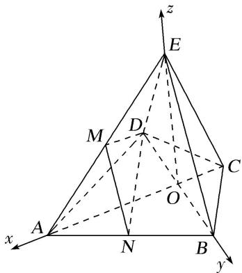

text_image

z
E
M
D
C
O
A
N
B
x
y

则 $A\left(\frac{3}{2}, 0, 0\right), B\left(0, \frac{\sqrt{3}}{2}, 0\right), E\left(0, 0, \frac{\sqrt{3}}{2}\right), M\left(\frac{3}{4}, 0, \frac{\sqrt{3}}{4}\right), D\left(0, -\frac{\sqrt{3}}{2}, 0\right), N\left(\frac{3}{4}, \frac{\sqrt{3}}{4}, 0\right)$ ,

$$
\therefore \overrightarrow {A B} = \left[ - \frac {3}{2}, \frac {\sqrt {3}}{2}, 0 \right], \overrightarrow {A E} = \left[ - \frac {3}{2}, 0, \frac {\sqrt {3}}{2} \right], \overrightarrow {D M} = \left[ \frac {3}{4}, \frac {\sqrt {3}}{2}, \frac {\sqrt {3}}{4} \right], \overrightarrow {M N} = \left[ 0, \frac {\sqrt {3}}{4}, - \frac {\sqrt {3}}{4} \right],
$$

设平面 $ABE$ 的法向量 $\pmb {n} = (x,y,z)$ ，则 $\left\{ \begin{array}{l}\overrightarrow{AB}\cdot \pmb {n} = 0,\\ \overrightarrow{AE}\cdot \pmb {n} = 0, \end{array} \right.$ 即 $\left\{ \begin{array}{l} - \sqrt{3} x + y = 0,\\ -\sqrt{3} x + z = 0, \end{array} \right.$ 令 $x = 1$ ，则 $\pmb {n} = (1,\sqrt{3},\sqrt{3})$

设 $\overrightarrow{MP} = \lambda \overrightarrow{MN} (0\leq \lambda \leq 1)$ ，可得 $\overrightarrow{DP} = \overrightarrow{DM} +\overrightarrow{MP} = \left(\frac{3}{4},\frac{\sqrt{3}}{2} +\frac{\sqrt{3}}{4}\lambda ,\frac{\sqrt{3}}{4} -\frac{\sqrt{3}}{4}\lambda\right),$

设直线 DP 与平面 ABE 所成的角为 $\theta$ ，则 $\sin\theta=\left|\frac{n\cdot\overrightarrow{DP}}{|n|\cdot|\overrightarrow{DP}|}\right|=\frac{12}{\sqrt{42}\times\sqrt{\lambda^{2}+\lambda+4}}$

$\because 0 \leq \lambda \leq 1, \therefore$ 当 $\lambda = 0$ 时， $\sin \theta$ 取得最大值 $\frac{\sqrt{42}}{7}$ .

故直线 DP 与平面 ABE 所成角的正弦值的最大值为 $\frac{\sqrt{42}}{7}$ .

[例 5] (2021·浙江)如图，在四棱锥 P-ABCD 中，底面 ABCD 是平行四边形， $\angle ABC=120^{\circ}$ ，AB=1，BC=4， $PA=\sqrt{15}$ ，M，N 分别为 BC，PC 的中点， $PD\perp DC$ ， $PM\perp MD$ .

(1)证明： $AB \perp PM;$   
(2)求直线 AN 与平面 PDM 所成角的正弦值.

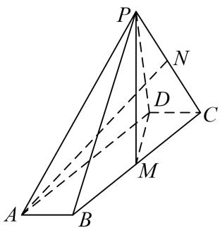

text_image

P
N
D
C
M
A
B

解析 (1)在平行四边形ABCD中，由已知可得， $CD=AB=1,\quad CM=\frac{1}{2}BC=2,\quad \angle DCM=60^{\circ}$

所以由余弦定理可得， $DM^{2}=CD^{2}+CM^{2}-2\cdot CD\cdot CM\cdot\cos60^{\circ}=3$

则 $CD^{2}+DM^{2}=1+3=4=CM^{2}$ ，即 $CD \perp DM$ ，

又 $PM \perp MD$ ， $PM \cap DM = M$ ，所以 $CD \perp$ 平面 PDM，

而 $PM \subset$ 平面 PDM，所以 $CD \perp PM$ 。因为 $CD \parallel AB$ ，所以 $AB \perp PM$ 。

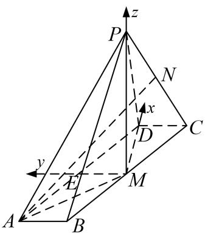

text_image

P
z
N
x
D
C
y
E
M
A
B

(2)由(1)知， $CD \perp$ 平面 PDM，又 $CD \subset$ 平面 ABCD，所以平面 $ABCD \perp$ 平面 PDM，

且平面 ABCD 平面 $\cap PDM = DM$ ，因为 $PM \perp DM$ ，且 $PM \subset$ 平面 PDM，所以 $PM \perp$ 平面 ABCD，

连接 AM，则 $PM \perp MA$ ，在 $\triangle ABM$ 中，AB = 1，BM = 2， $\angle ABM = 120^{\circ}$ ，

可得 $AM^{2}=1+4-2\cdot1\cdot2\cdot(-\frac{1}{2})=7,$

又 $PA = \sqrt{15}$ ，在 Rt△PMA 中，求得 $PM = 2\sqrt{2}$

取 AD 中点 E，连接 ME，则 $ME \parallel CD$ ，可得 ME、MD、MP 两两互相垂直，

以 M 为坐标原点，分别以 MD、ME、MP 分别为 x 轴、y 轴、z 轴建立空间直角坐标系，

则 $A(-\sqrt{3}, 2, 0), P(0, 0, 2), C(\sqrt{3}, -1, 0)$ . 又 $N$ 为 $PC$ 的中点，

所以 $N(\frac{\sqrt{3}}{2}, -\frac{1}{2}, \sqrt{2})$ ， $\overrightarrow{AN} = (\frac{3\sqrt{3}}{2}, -\frac{5}{2}, \sqrt{2})$ ,

平面 PDM 的一个法向量为 $\boldsymbol{n}=(0,1,0)$ ,

设直线 AN 与平面 PDM 所成角为 $\theta$ ，则 $\sin\theta=|\cos<\overrightarrow{AN},\quad n>|=\frac{|n\cdot\overrightarrow{AN}|}{|n|\cdot|\overrightarrow{AN}|}=\frac{\sqrt{15}}{6}$ ,

故直线 AN 与平面 PDM 所成角的正弦值为 $\frac{\sqrt{15}}{6}$ .

[例 6] (2017·浙江)如图, 已知四棱锥 P-ABCD, $\triangle PAD$ 是以 AD 为斜边的等腰直角三角形, BC // AD, CD ⊥ AD, PC = AD = 2DC = 2CB, E 为 PD 的中点.

(1)证明： $CE \parallel$ 平面 PAB;  
(2)求直线 CE 与平面 PBC 所成角的正弦值.

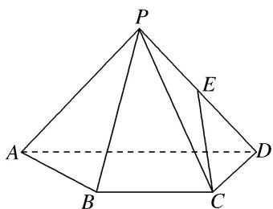

text_image

P
A
B
C
D
E

解析 (向量法): (1)设 AD 的中点为 O, 连接 OB, OP. ∵△PAD 是以 AD 为斜边的等腰直角三角形,

$\therefore OP \perp AD. \quad \because BC = \frac{1}{2} AD = OD, \text{且 } BC \parallel OD,$

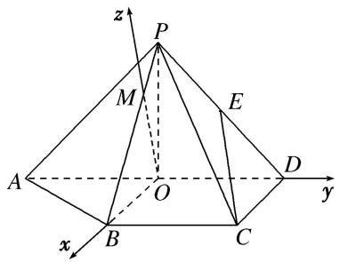

text_image

z
P
M
E
A
O
D
y
x
B
C

∴四边形 BCDO 为平行四边形，又∵CD⊥AD，∴OB⊥AD，∵OP∩OB，∴AD⊥平面 OPB.

过点 O 在平面 POB 内作 OB 的垂线 OM，交 PB 于 M，

以 O 为原点，OB 所在直线为 x 轴，OD 所在直线为 y 轴，OM 所在直线为 z 轴，建立空间直角坐标系，如图．设 CD=1，则有 $A(0, -1, 0)$ ， $B(1, 0, 0)$ ， $C(1, 1, 0)$ ， $D(0, 1, 0)$ ．设 $P(x, 0, z)(z>0)$ ，

由 PC=2, OP=1，得 $\left\{\begin{aligned}(x-1)^{2}+1+z^{2}&=4,\\ x^{2}+z^{2}&=1,\end{aligned}\right.$ 得 $x=-\frac{1}{2}, z=\frac{\sqrt{3}}{2}.$ 即点 $P\left(-\frac{1}{2},0,\frac{\sqrt{3}}{2}\right)$ ,

而 E 为 PD 的中点， $\therefore E\left(-\frac{1}{4},\frac{1}{2},\frac{\sqrt{3}}{4}\right)$ .

设平面 PAB 的法向量为 $\boldsymbol{n}=(x_{1}, y_{1}, z_{1})$ ,

$\because \overrightarrow{AP} = \left(-\frac{1}{2}, 1, \frac{\sqrt{3}}{2}\right), \overrightarrow{AB} = (1, 1, 0), \therefore \left\{ \begin{array}{l} -\frac{1}{2} x_1 + y_1 + \frac{\sqrt{3}}{2} z_1 = 0, \\ x_1 + y_1 = 0, \end{array} \right.$ 取 $y_1 = -1$ ，得 $\pmb{n} = (1, -1, \sqrt{3})$ 而 $\overrightarrow{CE} = \left(-\frac{5}{4}, -\frac{1}{2}, \frac{\sqrt{3}}{4}\right)$ ，则 $\overrightarrow{CE} \cdot n = 0$ ，而 $CE \notin$ 平面 $PAB$ ， $\therefore CE //$ 平面 $PAB$ .

(2)设平面 PBC 的法向量为 $\boldsymbol{m}=(x_{2},y_{2},z_{2})$ ，∵ $\overrightarrow{BC}=(0,1,0)$ ， $\overrightarrow{BP}=\left(-\frac{3}{2},0,\frac{\sqrt{3}}{2}\right)$ ,

$\therefore \left\{ \begin{array}{l} y_{2} = 0, \\ -\frac{3}{2} x_{2} + \frac{\sqrt{3}}{2} z_{2} = 0, \end{array} \right.$ 取 $x_{2} = 1$ ，得 $\pmb {m} = (1,0,\sqrt{3})$

设直线 CE 与平面 PBC 所成角为 $\theta$ 。则 $\sin\theta=|\cos<m,\quad\overrightarrow{CE}>|=\frac{|\overrightarrow{CE}\cdot m|}{|\overrightarrow{CE}|\cdot|m|}=\frac{\sqrt{2}}{8}$ ,

故直线 CE 与平面 PBC 所成角的正弦值为 $\frac{\sqrt{2}}{8}$ .

(几何法): (1)如图, 设 $PA$ 的中点为 $F$ , 连接 $EF$ , $FB$ . 因为 $E$ , $F$ 分别为 $PD$ , $PA$ 的中点,所以 $EF \parallel AD$ 且 $EF = \frac{1}{2} AD$ 。又因为 $BC \parallel AD$ ， $BC = \frac{1}{2} AD$ ，所以 $EF \parallel BC$ 且 EF = BC，

即四边形 BCEF 为平行四边形，所以 CE // BF.

因为 $BF \subset$ 平面 PAB， $CE \notin$ 平面 PAB，所以 CE // 平面 PAB.

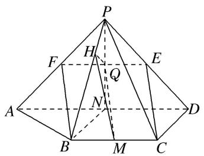

text_image

Geometric diagram of a pyramid with labeled vertices and internal points, used for spatial geometry problems.

(2)分别取 BC, AD 的中点为 M, N. 连接 PN 交 EF 于点 Q, 连接 MQ, BN.

因为 E, F, N 分别是 PD, PA, AD 的中点，所以 Q 为 EF 的中点，

在平行四边形 BCEF 中，MQ//CE．由△PAD 为等腰直角三角形得 PN⊥AD.

由 $DC \perp AD$ ，N 是 AD 的中点得 $BN \perp AD$ 。又 $PN \cap BN = N$ ，所以 $AD \perp$ 平面 PBN。

由 $BC \parallel AD$ 得 $BC \perp$ 平面 $PBN$ , 那么平面 $PBC \perp$ 平面 $PBN$ .

过点 Q 作 PB 的垂线，垂足为 H，连接 MH．则 MH 是 MQ 在平面 PBC 上的射影，

所以 $\angle QMH$ 是直线 CE 与平面 PBC 所成的角.

设 CD=1 。在 $\triangle PCD$ 中，由 PC=2 ， CD=1 ， $PD=\sqrt{2}$ 得 $CE=\sqrt{2}$

在 $\triangle PBN$ 中，由 PN=BN=1， $PB=\sqrt{3}$ 得 $QH=\frac{1}{4}$ ，

在 Rt△MQH 中， $QH=\frac{1}{4}$ ， $MQ=\sqrt{2}$ ，所以 $\sin\angle QMH=\frac{\sqrt{2}}{8}$ ，

所以直线 CE 与平面 PBC 所成角的正弦值是 $\frac{\sqrt{2}}{8}$ .

# 【对点训练】

1. 如图，已知三棱锥 $P - ABC$ ，平面 $PAC \perp$ 平面 $ABC$ ， $AB = BC = PA = \frac{1}{2}PC = 2$ ， $\angle ABC = 120^{\circ}$ .

(1)求证： $PA \perp BC;$   
(2)设点 E 为 PC 的中点，求直线 AE 与平面 PBC 所成角的正弦值.

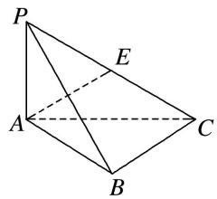

text_image

P
E
A
C
B

1. 解析 (1) $AB = BC = 2, \angle ABC = 120^{\circ}$ , 由余弦定理得

$$
A C ^ {2} = A B ^ {2} + B C ^ {2} - 2 A B \cdot B C \cdot \cos \angle A B C = 4 + 4 - 2 \times 2 \times 2 \times \left(- \frac {1}{2}\right) = 1 2, \text {故} A C = 2 \sqrt {3}.
$$

又 $PA^{2}+AC^{2}=4+12=16=PC^{2}$ ，故 $PA\perp AC$ .

又平面 PAC⊥平面 ABC，且平面 PAC∩平面 ABC=AC，故 PA⊥平面 ABC.

又 $BC \subset$ 平面 ABC，故 $PA \perp BC$ .

(2)由(1)知 $PA \perp$ 平面 ABC，故以 A 为坐标原点，建立如图所示的空间直角坐标系 A-xyz.

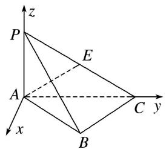

text_image

z
P
E
A
C y
x
B

则 $A(0, 0, 0)$ , $B(1, \sqrt{3}, 0)$ , $P(0, 0, 2)$ , $C(0, 2\sqrt{3}, 0)$ , $E(0, \sqrt{3}, 1)$ .

故 $\overrightarrow{AE}=(0,\sqrt{3},1)$ ， $\overrightarrow{PC}=(0,2\sqrt{3},-2)$ ， $\overrightarrow{BC}=(-1,\sqrt{3},0)$ ,

设平面 PBC 的法向量 $\boldsymbol{m}=(x,y,z)$ ，则 $\left\{\begin{aligned}\boldsymbol{m}\cdot\overrightarrow{PC}&=0,\\ \boldsymbol{m}\cdot\overrightarrow{BC}&=0,\end{aligned}\right.$ 即 $\left\{\begin{aligned}2\sqrt{3}y-2z&=0,\\ -x+\sqrt{3}y&=0,\end{aligned}\right.$

令 y=1，有 $\left\{\begin{aligned}x&=\sqrt{3},\\ y&=1,\\ z&=\sqrt{3},\end{aligned}\right.$ 故可取 $m=(\sqrt{3},1,\sqrt{3})$ ,

设直线 $AE$ 与平面 $PBC$ 所成的角为 $\theta$ ，则 $\sin \theta = \frac{|\overrightarrow{AE} \cdot \boldsymbol{m}|}{|\overrightarrow{AE}||\boldsymbol{m}|} = \frac{2\sqrt{3}}{\sqrt{(\sqrt{3})^2 + 1^2}\sqrt{(\sqrt{3})^2 + 1^2 + (\sqrt{3})^2}} = \frac{\sqrt{21}}{7}$ ，所以直线 AE 与平面 PBC 所成角的正弦值为 $\frac{\sqrt{21}}{7}$ .

2. 在 $\triangle ABC$ 中， $D$ ， $E$ 分别为 $AB$ ， $AC$ 的中点， $AB=2BC=2CD$ ，如图①，以 $DE$ 为折痕将 $\triangle ADE$ 折起，使点 $A$ 到达点 $P$ 的位置，如图②.

(1)证明：平面 $BCP \perp$ 平面 CEP;  
(2)若平面 $DEP \perp$ 平面 $BCED$ , 求直线 $DP$ 与平面 $BCP$ 所成角的正弦值.

text_image

Geometric diagram of triangle ABC with internal points D, E and connecting segments

图①

text_image

Geometric diagram of a pyramid with labeled vertices P, C, D, E and solid/dashed edges indicating 3D perspective

图②

2. 解析 (1)在题图①中, 因为 $AB = 2BC = 2CD$ , 且 $D$ 为 $AB$ 的中点,

所以由平面几何知识，得 $\angle ACB=90^{\circ}$ 。又 E 为 AC 的中点，所以 DE//BC。

在题图②中， $CE \perp DE$ ， $PE \perp DE$ ，且 $CE \cap PE = E$ ，所以 $DE \perp$ 平面 CEP，所以 $BC \perp$ 平面 CEP，又 $BC \subset$ 平面 BCP，所以平面 $BCP \perp$ 平面 CEP.

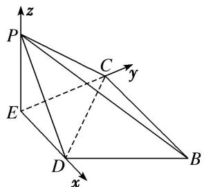

text_image

z
P
C
y
E
D
x
B

(2)因为平面 $DEP \perp$ 平面 BCED，平面 $DEP \cap$ 平面 BCED = DE， $EP \subset$ 平面 DEP， $EP \perp DE$ ，

所以 $EP \perp$ 平面 BCED. 又 $CE \subset$ 平面 BCED, 所以 $EP \perp CE$ .

以 E 为坐标原点, $\overrightarrow{ED}$ , $\overrightarrow{EC}$ , $\overrightarrow{EP}$ 的方向分别为 x 轴, y 轴, z 轴的正方向建立如图所示的空间直角坐标系. 在题图①中, 设 BC=2a, 则 AB=4a, $AC=2\sqrt{3}a$ , $AE=CE=\sqrt{3}a$ , DE=a.

则 $P(0, 0, \sqrt{3}a), D(a, 0, 0), C(0, \sqrt{3}a, 0), B(2a, \sqrt{3}a, 0)$ .

所以 $\overrightarrow{DP} = (-a, 0, \sqrt{3} a), \overrightarrow{BC} = (-2a, 0, 0), \overrightarrow{CP} = (0, -\sqrt{3} a, \sqrt{3} a)$ .

设平面 BCP 的法向量为 $\boldsymbol{n}=(x,y,z)$ ，则 $\left\{\begin{aligned}&n\cdot\overrightarrow{BC}=0,\\ &n\cdot\overrightarrow{CP}=0,\end{aligned}\right.$ 即 $\left\{\begin{aligned}-2ax=0,\\ -\sqrt{3}ay+\sqrt{3}az=0,\end{aligned}\right.$

令 y=1，则 z=1，所以 $n=(0,1,1)$ .

设 DP 与平面 BCP 所成的角为 $\theta$ ，则 $\sin\theta=|\cos<n,\quad\overrightarrow{DP}>|=\frac{|n\cdot\overrightarrow{DP}|}{|n||\overrightarrow{DP}|}=\frac{\sqrt{3}a}{\sqrt{2}\times2a}=\frac{\sqrt{6}}{4}.$

所以直线 DP 与平面 BCP 所成角的正弦值为 $\frac{\sqrt{6}}{4}$ .

3. (2016·全国III)如图, 四棱锥 $P - ABCD$ 中, $PA \perp$ 底面 $ABCD$ , $AD \parallel BC$ , $AB = AD = AC = 3$ , $PA = BC = 4$ , $M$ 为线段 $AD$ 上一点, $AM = 2MD$ , $N$ 为 $PC$ 的中点.

(1)证明 $MN \parallel$ 平面 $PAB$ ;

(2)求直线 AN 与平面 PMN 所成角的正弦值.

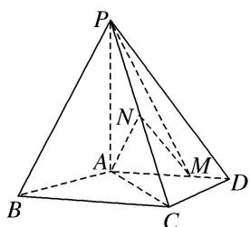

text_image

P
N
A
M
B
C
D

3. 解析 (1)由已知得 $AM = \frac{2}{3} AD = 2$ 。取 $BP$ 的中点 $T$ ，连接 $AT$ ， $TN$ ，

由 N 为 PC 的中点知 $TN \parallel BC$ ， $TN = \frac{1}{2} BC = 2$ 。又 $AD \parallel BC$ ，故 TN 絭 AM，

所以四边形 AMNT 为平行四边形，于是 MN // AT.

因为 $MN \notin$ 平面 PAB， $AT \subset$ 平面 PAB，所以 $MN \parallel$ 平面 PAB.

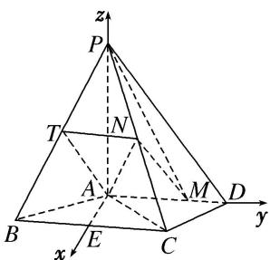

text_image

z
P
T
N
A
M
D
B
E
C
y
x

(2)取 $BC$ 的中点 $E$ , 连接 $AE$ . 由 $AB = AC$ 得 $AE \perp BC$ , 从而 $AE \perp AD$ ,

且 $AE = \sqrt{AB^2 - BE^2} = \sqrt{AB^2 - \left(\frac{BC}{2}\right)^2} = \sqrt{5}$ . 以 $A$ 为坐标原点， $\overrightarrow{AE}$ 的方向为 $x$ 轴正方向，

建立如图所示的空间直角坐标系 A-xyz. 由题意知 $P(0,0,4)$ , $M(0,2,0)$ , $C(\sqrt{5},2,0)$ , $N\left(\frac{\sqrt{5}}{2},1,2\right)$ ,

$$
\overrightarrow {P M} = (0, 2, - 4), \overrightarrow {P N} = \left(\frac {\sqrt {5}}{2}, 1, - 2\right), \overrightarrow {A N} = \left(\frac {\sqrt {5}}{2}, 1, 2\right).
$$

设 $\boldsymbol{n}=(x,y,z)$ 为平面 PMN 的法向量，则 $\left\{\begin{aligned}\boldsymbol{n}\cdot\overrightarrow{PM}&=0,\\ \boldsymbol{n}\cdot\overrightarrow{PN}&=0,\end{aligned}\right.$ 即 $\left\{\begin{aligned}2y-4z&=0,\\ \frac{\sqrt{5}}{2}x+y-2z&=0,\end{aligned}\right.$ 可取 $\boldsymbol{n}=(0,2,1)$ .于是 $|\cos < n, \overrightarrow{AN} >| = \frac{|\boldsymbol{n} \cdot \overrightarrow{AN}|}{|\boldsymbol{n}||\overrightarrow{AN}|} = \frac{8\sqrt{5}}{25}$ . 所以直线 $AN$ 与平面 $PMN$ 所成角的正弦值为 $\frac{8\sqrt{5}}{25}$ .

4. 如图 1, 在边长为 4 的正方形 $ABCD$ 中, $E$ 是 $AD$ 的中点, $F$ 是 $CD$ 的中点, 现将 $\triangle DEF$ 沿 $EF$ 翻折成如图 2 所示的五棱锥 $P-ABCFE$ .

(1)求证： $AC / /$ 平面PEF；  
(2)若平面 $PEF \perp$ 平面 $ABCFE$ , 求直线 $PB$ 与平面 $PAE$ 所成角的正弦值.

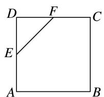  
图1

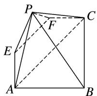

text_image

P
F
C
E
A
B

图2

4. 解析 (1)在题图 1 中, 连接 $AC$ . 又 $E$ , $F$ 分别为 $AD$ , $CD$ 的中点, 所以 $EF \parallel AC$ .

即题图 2 中有 $EF \parallel AC$ 。又 $EF \subset$ 平面 $PEF$ ， $AC \nmid$ 平面 $PEF$ ，所以 $AC \parallel$ 平面 $PEF$ 。

(2)在题图 2 中，取 EF 的中点 O，并分别连接 OP，OB.

分析知， $OP \perp EF$ ， $OB \perp EF$ ．又平面 $PEF \perp$ 平面 ABCFE，

平面 $PEF \cap$ 平面 ABCFE = EF， $PO \subset$ 平面 PEF，所以 $PO \perp$ 平面 ABCFE。又 AB = 4，

所以 PF=AE=PE=2，EO=OP=OF= $\sqrt{2}$ ，OB=3 $\sqrt{2}$ .

分别以 O 为原点，OE，OB，OP 为 x 轴，y 轴，z 轴建立如图所示的空间直角坐标系，

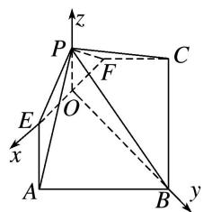

text_image

z
P
C
F
O
E
x
A
B
y

则 $O(0, 0, 0)$ ， $P(0, 0, \sqrt{2})$ ， $B(0, 3\sqrt{2}, 0)$ ， $E(\sqrt{2}, 0, 0)$ ， $A(2\sqrt{2}, \sqrt{2}, 0)$ ，

所以 $\vec{BP} = (0, -3\sqrt{2}, \sqrt{2})$ ， $\vec{EA} = (\sqrt{2}, \sqrt{2}, 0)$ ， $\vec{EP} = (-\sqrt{2}, 0, \sqrt{2})$ 。

设平面 PAE 的一个法向量 $\boldsymbol{n}=(x,y,z)$ ，则 $\left\{\begin{aligned}\sqrt{2}x+\sqrt{2}y=0,\\ -\sqrt{2}x+\sqrt{2}z=0,\end{aligned}\right.$

取 x=1，则 y=-1，z=1，所以 $n=(1,-1,1)$ .

所以 $\cos\langle\overrightarrow{BP},\quad n\rangle=\frac{0\times1+(-3\sqrt{2})\times(-1)+\sqrt{2}\times1}{\sqrt{0^{2}+(-3\sqrt{2})^{2}+(\sqrt{2})^{2}}\times\sqrt{1^{2}+(-1)^{2}+1^{2}}}=\frac{2\sqrt{30}}{15}.$

分析知，直线 $PB$ 与平面 $PAE$ 所成角的正弦值为 $\frac{2\sqrt{30}}{15}$ .

5. 如图，四棱锥 $P - ABCD$ 中， $PA \perp$ 底面 $ABCD, AD \parallel BC, AB = AD = AC = 3, PA = BC = 4, M$ 为线段 $AD$ 上一点， $AM = 2MD, N$ 为 $PC$ 的中点.

(1)证明：MN//平面PAB;   
(2)求直线 AN 与平面 PMN 所成角的正弦值.

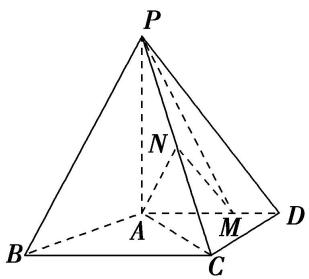

text_image

P
N
A
M
B
C
D

5. 解析 (1)由已知得 $AM=\frac{2}{3}AD=2$ 。取 BP 的中点 T，连接 AT，TN。

由 N 为 PC 的中点知 $TN \parallel BC$ ， $TN = \frac{1}{2} BC = 2$ 。又 $AD \parallel BC$ ，故 TN 絫 AM，

四边形 AMNT 为平行四边形，于是 MN // AT.

因为 $AT \subset$ 平面 PAB， $MN \notin$ 平面 PAB，所以 $MN \parallel$ 平面 PAB.

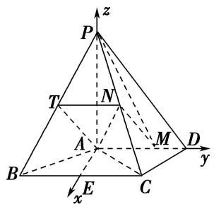

text_image

z
P
T
N
A
M
B
C
E
x
y
D

(2)取 BC 的中点 E，连接 AE．由 AB=AC 得 $AE \perp BC$ ，

从而 $AE \perp AD$ ，且 $AE = \sqrt{AB^2 - BE^2} = \sqrt{AB^2 - \left(\frac{BC}{2}\right)^2} = \sqrt{5}$ .

以 A 为坐标原点， $\overrightarrow{AE}$ 的方向为 x 轴正方向，建立如图所示的空间直角坐标系 A-xyz.

由题意知， $P(0, 0, 4)$ ， $M(0, 2, 0)$ ， $C(\sqrt{5}, 2, 0)$ ， $N\left(\frac{\sqrt{5}}{2}, 1, 2\right)$

$\overrightarrow{PM}=(0,2,-4),\overrightarrow{PN}=\left(\frac{\sqrt{5}}{2},1,-2\right),\overrightarrow{AN}=\left(\frac{\sqrt{5}}{2},1,2\right).$

设 $\boldsymbol{n}=(x,y,z)$ 为平面 PMN 的法向量，则 $\left\{\begin{aligned}\boldsymbol{n}\cdot\overrightarrow{PM}&=0,\\ \boldsymbol{n}\cdot\overrightarrow{PN}&=0,\end{aligned}\right.$ 即 $\left\{\begin{aligned}2y-4z&=0,\\ \frac{\sqrt{5}}{2}x+y-2z&=0,\end{aligned}\right.$

可取 $n=(0,2,1)$ .

于是 $|\cos < n, \overrightarrow{AN} >| = \frac{|\boldsymbol{n} \cdot \overrightarrow{AN}|}{|\boldsymbol{n}||\overrightarrow{AN}|} = \frac{8\sqrt{5}}{25}$ ,

则直线 AN 与平面 PMN 所成角的正弦值为 $\frac{8\sqrt{5}}{25}$ .

6. 如图①, 在 Rt△ABC 中, ∠B 为直角, AB = BC = 6, 点 E, F 分别为线段 AB, AC 上一点, 且 EF // BC, AE = 2, 沿 EF 将 △AEF 折起, 使 ∠AEB = $\frac{\pi}{3}$ , 得到如图②的几何体, 点 D 在线段 AC 上.

(1)求证：平面 $AEF \perp$ 平面 ABC;  
(2)若 $AE \parallel$ 平面 $BDF$ , 求直线 $AF$ 与平面 $BDF$ 所成角的正弦值.

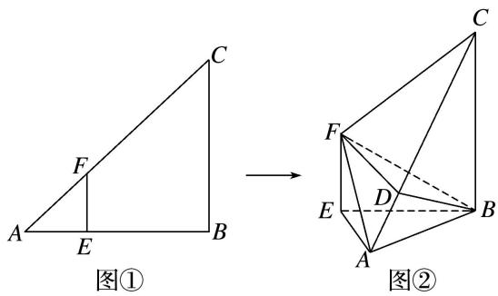

text_image

图①
图②

6. 解析 (1)如题图②，在 $\triangle ABE$ 中， $\because AE=2, BE=4, \angle AEB=\frac{\pi}{3}$ ,

∴由余弦定理得 $AB^{2}=AE^{2}+BE^{2}-2AE\cdot BE\cos\angle AEB=4+16-2\times2\times4\times\frac{1}{2}=12,\quad\therefore AB=2\sqrt{3}.$

$\therefore EB^{2}=EA^{2}+AB^{2},\quad\therefore\angle EAB=\frac{\pi}{2},\quad 即 EA\perp AB,$

又 $EF \perp EB$ ， $EF \perp EA$ ， $EA \cap EB = E$ ，EA， $EB \subset$ 平面 ABE，∴ $EF \perp$ 平面 ABE，∴ $EF \perp AB$ ，

又 $EA \cap EF = E, EA, EF \subset$ 平面 AEF, $\therefore AB \perp$ 平面 AEF,

又 $AB \subset$ 平面 ABC，∴ 平面 AEF ⊥ 平面 ABC.

(2)方法一 如图，以 A 为原点，以 AB 所在直线为 x 轴，AE 所在直线为 y 轴，过点 A 垂直于平面 ABE 的直线为 z 轴，建立空间直角坐标系，

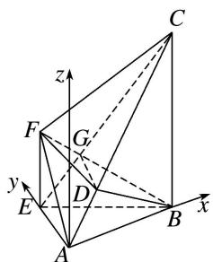

text_image

3D geometric diagram of a pyramid with labeled vertices and coordinate axes (x, y, z)

则 $A(0, 0, 0)$ ， $B(2\sqrt{3}, 0, 0)$ ， $F(0, 2, 2)$ ， $C(2\sqrt{3}, 0, 6)$ ，

$$
\therefore \overrightarrow {A F} = (0, 2, 2), \overrightarrow {F B} = (2 \sqrt {3}, - 2, - 2), \overrightarrow {A C} = (2 \sqrt {3}, 0, 6).
$$

连接 EC 与 FB 交于点 G，连接 DG，∵ AE // 平面 BDF，DG 为平面 AEC 与平面 BDF 的交线，

$\therefore AE \parallel GD, \therefore \frac{GC}{GE} = \frac{DC}{DA}$ , 在四边形 $BCFE$ 中, $\because EF \parallel BC, \therefore \triangle EFG \sim \triangle CBG, \therefore \frac{GC}{GE} = \frac{BC}{EF} = 3,$

$$
\therefore \frac {D C}{D A} = 3, \quad \therefore \overrightarrow {A D} = \frac {1}{4} \overrightarrow {A C},
$$

设 $D(x_{0}, y_{0}, z_{0})$ ，则 $\overrightarrow{AD}=(x_{0}, y_{0}, z_{0})$ ，由 $\overrightarrow{AD}=\frac{1}{4}\overrightarrow{AC}$ ，得 $\left\{\begin{aligned}x_{0}&=\frac{\sqrt{3}}{2},\\ y_{0}&=0,\\ z_{0}&=\frac{3}{2},\end{aligned}\right.$

$$
\therefore D \left(\frac {\sqrt {3}}{2}, 0, \frac {3}{2}\right), \quad \therefore \overrightarrow {F D} = \left(\frac {\sqrt {3}}{2}, - 2, - \frac {1}{2}\right).
$$

设平面 BDF 的一个法向量为 $\boldsymbol{n}=(x,y,z)$ ，则 $\left\{\begin{aligned}\boldsymbol{n}\cdot\overrightarrow{FD}&=\frac{\sqrt{3}}{2}x-2y-\frac{1}{2}z=0,\\ \boldsymbol{n}\cdot\overrightarrow{FB}&=2\sqrt{3}x-2y-2z=0,\end{aligned}\right.$

取 x=1，则 $z=\sqrt{3}$ ，y=0，∴ $n=(1,0,\sqrt{3})$ ,

设直线 $AF$ 与平面 $BDF$ 所成的角为 $\theta$ ，则 $\sin \theta = \frac{|\overrightarrow{AF} \cdot \boldsymbol{n}|}{|\overrightarrow{AF}| \cdot |\boldsymbol{n}|} = \frac{2\sqrt{3}}{4\sqrt{2}} = \frac{\sqrt{6}}{4}$ .

即直线 AF 与平面 BDF 所成角的正弦值为 $\frac{\sqrt{6}}{4}$ .

方法二 如图，以 E 为原点，在平面 ABE 中过 E 作 EB 的垂线为 x 轴，EB 所在直线为 y 轴，EF 所在直线为 z 轴，建立空间直角坐标系，

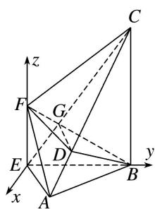

text_image

3D geometric diagram with labeled points and axes, showing a tetrahedron structure with dashed and solid lines indicating spatial relationships.

则 $E(0, 0, 0)$ ， $F(0, 0, 2)$ ， $B(0, 4, 0)$ ， $C(0, 4, 6)$ ， $A(\sqrt{3}, 1, 0)$ ，

$$
\therefore \overrightarrow {A F} = (- \sqrt {3}, - 1, 2), \overrightarrow {F B} = (0, 4, - 2), \overrightarrow {A C} = (- \sqrt {3}, 3, 6).
$$

连接 EC 与 FB 交于点 G，连接 DG，∵ AE // 平面 BDF，DG 为平面 AEC 与平面 BDF 的交线，

$\therefore AE \parallel GD, \therefore \frac{GC}{GE} = \frac{DC}{DA}$ , 在四边形 $BCFE$ 中， $\because EF \parallel BC, \therefore \triangle EFG \sim \triangle CBG, \therefore \frac{GC}{GE} = \frac{BC}{EF} = 3,$

$$
\therefore \frac {D C}{D A} = 3, \quad \therefore \overrightarrow {A D} = \frac {1}{4} \overrightarrow {A C},
$$

设 $D(x_{0}, y_{0}, z_{0})$ ，则 $\overrightarrow{AD}=(x_{0}-\sqrt{3}, y_{0}-1, z_{0})$ ，由 $\overrightarrow{AD}=\frac{1}{4}\overrightarrow{AC}$ ，得 $\left\{\begin{aligned}x_{0}-\sqrt{3}&=-\frac{\sqrt{3}}{4},\\ y_{0}-1&=\frac{3}{4},\\ z_{0}&=\frac{3}{2},\end{aligned}\right.$

解得 $\left\{\begin{aligned}x_{0}&=\frac{3\sqrt{3}}{4},\\ y_{0}&=\frac{7}{4},\\ z_{0}&=\frac{3}{2},\end{aligned}\right.$ $\therefore D\left(\frac{3\sqrt{3}}{4},\frac{7}{4},\frac{3}{2}\right),\quad\therefore\overrightarrow{FD}=\left(\frac{3\sqrt{3}}{4},\frac{7}{4},-\frac{1}{2}\right).$

设平面 BDF 的法向量为 $\boldsymbol{n}=(x,y,z)$ ，则 $\left\{\begin{aligned}\boldsymbol{n}\cdot\overrightarrow{FD}&=\frac{3\sqrt{3}}{4}x+\frac{7}{4}y-\frac{1}{2}z=0,\\ \boldsymbol{n}\cdot\overrightarrow{FB}&=4y-2z=0,\end{aligned}\right.$

取 y=1，则 $z=2,\quad x=-\frac{\sqrt{3}}{3},\quad \therefore n=\left(-\frac{\sqrt{3}}{3},\quad 1,\quad 2\right)$ ,

设直线 AF 与平面 BDF 所成的角为 $\theta$ ，则 $\sin\theta=\frac{|\overrightarrow{AF}\cdot\boldsymbol{n}|}{|\overrightarrow{AF}|\cdot|\boldsymbol{n}|}=\frac{4}{\sqrt{8}\times\sqrt{\frac{16}{3}}}=\frac{\sqrt{6}}{4}.$

∴直线 AF 与平面 BDF 所成角的正弦值为 $\frac{\sqrt{6}}{4}$ .

# 考点三 不规则几何体模型

[例 1] 在如图所示的多面体中, 四边形 ABCD 是平行四边形, 四边形 BDEF 是矩形, $ED \perp$ 平面 ABCD, $\angle ABD = \frac{\pi}{6}$ , AB = 2AD.

(1)求证：平面 BDEF⊥平面 ADE;  
(2)若 $ED = BD$ ，求直线 $AF$ 与平面 $AEC$ 所成角的正弦值.

text_image

Geometric diagram of a triangular pyramid with labeled vertices A, B, C, D, E, and F

解析 (1)在 $\triangle ABD$ 中， $\angle ABD=\frac{\pi}{6}$ ， $AB=2AD$ ，由余弦定理，得 $BD=\sqrt{3}AD$ ，

从而 $BD^{2}+AD^{2}=AB^{2}$ ，故 $BD\perp AD$ ，所以 $\triangle ABD$ 为直角三角形且 $\angle ADB=\frac{\pi}{2}$ .

因为 $DE \perp$ 平面 $ABCD$ , $BD \subset$ 平面 $ABCD$ , 所以 $DE \perp BD$ . 又 $AD \cap DE = D$ , 所以 $BD \perp$ 平面 $ADE$ . 因为 $BD \subset$ 平面 $BDEF$ , 所以平面 $BDEF \perp$ 平面 $ADE$ .

text_image

z
E
F
D
C
A
B
y
x

(2)由(1)可得，在 Rt△ABD 中，∠BAD= $\frac{\pi}{3}$ ，BD= $\sqrt{3}$ AD，又由 ED=BD，设 AD=1，则 BD=ED= $\sqrt{3}$ .

因为 $DE \perp$ 平面 $ABCD, BD \perp AD$ , 所以以点 $D$ 为坐标原点, $DA, DB, DE$ 所在直线分别为 $x$ 轴, $y$ 轴, $z$ 轴建立空间直角坐标系, 如图所示. 则 $A(1, 0, 0)$ , $C(-1, \sqrt{3}, 0)$ , $E(0, 0, \sqrt{3})$ , $F(0, \sqrt{3}, \sqrt{3})$ , 所以 $\overrightarrow{AE} = (-1, 0, \sqrt{3})$ , $\overrightarrow{AC} = (-2, \sqrt{3}, 0)$ .

设平面 AEC 的法向量为 $\boldsymbol{n}=(x,y,z)$ ，则 $\left\{\begin{aligned}\boldsymbol{n}\cdot\overrightarrow{AE}&=0,\\ \boldsymbol{n}\cdot\overrightarrow{AC}&=0,\end{aligned}\right.$ 即 $\left\{\begin{aligned}-x+\sqrt{3}z&=0,\\ -2x+\sqrt{3}y&=0,\end{aligned}\right.$

令 z=1，得 $n=(\sqrt{3},2,1)$ 为平面 AEC 的一个法向量.

因为 $\overrightarrow{AF} = (-1, \sqrt{3}, \sqrt{3})$ ，所以 $\cos < n$ ， $\overrightarrow{AF} > = \frac{n \cdot \overrightarrow{AF}}{|n| \cdot |\overrightarrow{AF}|} = \frac{\sqrt{42}}{14}$ ，

所以直线 $AF$ 与平面 $AEC$ 所成角的正弦值为 $\frac{\sqrt{42}}{14}$ .

[例 2] (2018·全国 I) 如图，四边形 ABCD 为正方形，E, F 分别为 AD, BC 的中点，以 DF 为折痕把 $\triangle DFC$ 折起，使点 C 到达点 P 的位置，且 $PF \perp BF$ .

(1)证明：平面 $PEF \perp$ 平面 ABFD;  
(2)求 DP 与平面 ABFD 所成角的正弦值.

text_image

Geometric diagram with labeled points A, B, C, D, E, F, G and dashed lines forming triangles and quadrilaterals

解析 (1)证明：由已知可得， $BF \perp PF$ ， $BF \perp EF$ ，

又 $PF \cap EF = F$ ，所以 $BF \perp$ 平面 $PEF$ 。又 $BF \subset$ 平面 $ABFD$ ，所以平面 $PEF \perp$ 平面 $ABFD$ .

(2)作 $PH \perp EF$ , 垂足为 $H$ . 由(1), 得 $PH \perp$ 平面 $ABFD$ .

以 H 为坐标原点， $\overrightarrow{HF}$ 的方向为 y 轴正方向， $|\overrightarrow{BF}|$ 为单位长，建立如图所示的空间直角坐标系 Hxyz.

text_image

Geometric diagram with labeled points and axes, showing a 3D coordinate system with points A, B, C, D, E, F, G, H.

由(1)可得， $DE \perp PE$ . 又 DP=2, DE=1，所以 $PE=\sqrt{3}$ . 又 PF=1, EF=2，故 $PE \perp PF$ .

所以 $PH=\frac{\sqrt{3}}{2}$ ， $EH=\frac{3}{2}$ ，则 $H(0,0,0)$ ， $P\left(0,0,\frac{\sqrt{3}}{2}\right)$ ， $D\left(-1,-\frac{3}{2},0\right)$

所以 $\vec{DP} = \left(1, \frac{3}{2}, \frac{\sqrt{3}}{2}\right)$ , $\vec{HP} = \left(0, 0, \frac{\sqrt{3}}{2}\right)$ , $H\vec{P}$ 为平面 $ABFD$ 的法向量.

设 DP 与平面 ABFD 所成的角为 $\theta$ ,

则 $\sin \theta = \frac{|\vec{HP} \cdot \vec{DP}|}{|\vec{HP}||\vec{DP}|} = \frac{\frac{3}{4}}{\sqrt{3}} = \frac{\sqrt{3}}{4}$ . 所以 $DP$ 与平面 $ABFD$ 所成角的正弦值为 $\frac{\sqrt{3}}{4}$ .

[例3] 如图，在梯形 $ABCD$ 中， $AB \parallel CD$ ， $AD = CD = CB = 2$ ， $\angle ABC = 60^\circ$ ，矩形 $ACFE$ 中， $AE = 2$ ，又有 $BF = 2\sqrt{2}$ .

(1)求证： $BC \perp$ 平面 ACFE;  
(2)求直线 BD 与平面 BEF 所成角的正弦值.

text_image

Geometric diagram of a tetrahedron with labeled vertices and internal points, used for spatial geometry problems.

解析 (1)在梯形 $ABCD$ 中， $AB \parallel CD$ ， $AD = CD = CB = 2$ ， $\angle ABC = 60^{\circ}$ ，

∴四边形 ABCD 是等腰梯形， $\angle ADC=120^{\circ}$ ，∴ $\angle DCA=\angle DAC=30^{\circ}$ ， $\angle DCB=120^{\circ}$ ，

∴ $\angle ACB = \angle DCB - \angle DCA = 90^{\circ}$ ，∴ $AC \perp BC$ ，(也可以利用余弦定理求出 AC 再证明)

∵在矩形 ACFE 中，CF=AE=2，又 $BF=2\sqrt{2}$ ，CB=2，∴ $CB \perp CF$ ，

又 $AC \cap CF = C,\quad \therefore BC \perp$ 平面 ACFE.

text_image

Geometric diagram with labeled points A, B, C, D, E, F and connecting lines, likely from a math problem or proof.

(2)以点 C 为坐标原点，以 CA 所在直线为 x 轴，CB 所在直线为 y 轴，CF 所在直线为 z 轴，

建立空间直角坐标系．可得 $C(0, 0, 0)$ ， $B(0, 2, 0)$ ， $F(0, 0, 2)$ ， $D(\sqrt{3}, -1, 0)$ ， $E(2\sqrt{3}, 0, 2)$ ，

$$
\therefore \vec {E F} = (- 2 \sqrt {3}, 0, 0), \vec {B F} = (0, - 2, 2), \vec {B D} = (\sqrt {3}, - 3, 0).
$$

设平面 BEF 的法向量为 $\boldsymbol{n}=(x,y,z)$ ，则 $\left\{\begin{aligned}\boldsymbol{n}\cdot\vec{EF}&=0,\\ \boldsymbol{n}\cdot\vec{BF}&=0,\end{aligned}\right.$ $\therefore\left\{\begin{aligned}-2\sqrt{3}x&=0,\\ -2y+2z&=0,\end{aligned}\right.$

令 y=1，则 x=0, z=1，∴ $n=(0,1,1)$ ,

$$
\therefore | \cos <   \overrightarrow {B D}, n > | = \left| \frac {\overrightarrow {B D} \cdot \boldsymbol {n}}{| \overrightarrow {B D} | | \boldsymbol {n} |} \right| = \frac {\sqrt {6}}{4},
$$

∴直线 BD 与平面 BEF 所成角的正弦值是 $\frac{\sqrt{6}}{4}$ .

[例 4] 如图所示，在三棱柱 $BCD-B_{1}C_{1}D_{1}$ 与四棱锥 $A-BB_{1}D_{1}D$ 的组合体中，已知 $BB_{1}\perp$ 平面 BCD，四边形 ABCD 是菱形， $\angle BCD=60^{\circ}$ ，AB=2， $BB_{1}=1$ 。

(1)设 O 是线段 BD 的中点，求证： $C_{1}O \parallel$ 平面 $AB_{1}D_{1}$ ;

(2)求直线 $B_{1}C$ 与平面 $AB_{1}D_{1}$ 所成角的正弦值.

text_image

Geometric diagram of a 3D polyhedron with labeled vertices A, B, C, D and internal points E, F, G, showing solid and dashed edges.

解析 (1)取 $B_{1}D_{1}$ 的中点为 $E$ ，连接 $C_{1}E$ ， $OA$ ， $AE$ ，易知 $C_{1}E = OA$ 且 $C_{1}E // OA$

所以四边形 $C_{1}EAO$ 为平行四边形，所以 $C_{1}O \parallel EA$ ，

又 $C_{1}O$ 平面 $AB_{1}D_{1}$ ， $AE \subset$ 平面 $AB_{1}D_{1}$ ，所以 $C_{1}O \parallel$ 平面 $AB_{1}D_{1}$ .

text_image

Geometric diagram of a parallelepiped with labeled vertices and internal points, showing diagonals and auxiliary lines.

(2)解法一：过点 C 作平面 $AB_{1}D_{1}$ 的垂线，垂足为 G，连接 $B_{1}G$ (图略)，

则 $\angle CB_{1}G$ 就是直线 $B_{1}C$ 与平面 $AB_{1}D_{1}$ 所成的角.

又 $CG$ 是点 $O$ 到平面 $AB_{1}D_{1}$ 的距离的 2 倍，连接 $EO$ ，由 $B_{1}D_{1} \perp EC_{1}$ ， $B_{1}D_{1} \perp EO$ ，知 $B_{1}D_{1} \perp$ 平面 $AEO$ ，所以平面 $AEO \perp$ 平面 $AB_{1}D_{1}$ ，在 $\triangle AEO$ 中，作 $OH \perp AE$ ，垂足为 $H$ ，即 $OH \perp$ 平面 $AB_{1}D_{1}$ .

由题可得 $AO=\sqrt{3}$ ， $B_{1}C=\sqrt{5}$ ，AE=2，所以在 Rt△AEO 中， $OH=\frac{AO\cdot OE}{AE}=\frac{\sqrt{3}}{2}$

所以点 C 到平面 $AB_{1}D_{1}$ 的距离为 $\sqrt{3}$ ，所以 $\sin\angle CB_{1}G=\frac{CG}{B_{1}C}=\frac{\sqrt{15}}{5}$ .

解法二：如图所示，以 O 为坐标原点，OA，OB，OE 所在的直线分别为 x，y，z 轴，

建立空间直角坐标系 Oxyz，得 $A(\sqrt{3}, 0, 0)$ ， $B_{1}(0, 1, 1)$ ， $D_{1}(0, -1, 1)$ ， $C(-\sqrt{3}, 0, 0)$ ，

text_image

Geometric diagram of a cube with labeled vertices and internal points, used in spatial geometry problems.

所以 $\overrightarrow{AB_{1}}=(-\sqrt{3},1,1)$ ， $D_{1}\overrightarrow{B_{1}}=(0,2,0)$ ， $B_{1}C=(-\sqrt{3},-1,-1)$

设平面 $AB_{1}D_{1}$ 的一个法向量为 $\boldsymbol{n}=(x,y,z)$ ，则 $\left\{\begin{aligned}\boldsymbol{n}\cdot\overrightarrow{AB_{1}}=0,\\ \boldsymbol{n}\cdot\overrightarrow{D_{1}B_{1}}=0,\end{aligned}\right.$ 得 $\left\{\begin{aligned}-\sqrt{3}x+y+z=0,\\ 2y=0,\end{aligned}\right.$

令 x=1，有 y=0， $z=\sqrt{3}$ ，所以 $n=(1,0,\sqrt{3})$ .

记 $\alpha$ 为直线 $B_{1}C$ 与平面 $AB_{1}D_{1}$ 所成的角，则 $\sin \alpha = \frac{|\pmb{n} \cdot \vec{B_1C}|}{|\pmb{n}||\vec{B_1C}|} = \frac{\sqrt{15}}{5}$ .

# 【对点训练】

1. (2018·浙江)如图，已知多面体 $ABCA_{1}B_{1}C_{1}$ ， $A_{1}A$ ， $B_{1}B$ ， $C_{1}C$ 均垂直于平面 $ABC$ ， $\angle ABC = 120^{\circ}$ ， $A_{1}A = 4$ ， $C_{1}C = 1$ ， $AB = BC = B_{1}B = 2$ .

(1)证明： $AB_{1} \perp$ 平面 $A_{1}B_{1}C_{1}$ ;  
(2)求直线 $AC_{1}$ 与平面 $ABB_{1}$ 所成的角的正弦值.

text_image

A₁
B₁
C₁
A
B
C

1. 解析 方法一 (1)由 $AB = 2$ ， $AA_{1} = 4$ ， $BB_{1} = 2$ ， $AA_{1}\bot AB$ ， $BB_{1}\bot AB$ ，得 $AB_{1} = A_{1}B_{1} = 2\sqrt{2}$ 所以 $A_{1}B_{1}^{2} + AB_{1}^{2} = AA_{1}^{2}$ ，故 $AB_{1}\bot A_{1}B_{1}$

由 $BC = 2$ ， $BB_{1} = 2$ ， $CC_{1} = 1$ ， $BB_{1}\bot BC$ ， $CC_{1}\bot BC$ ，得 $B_{1}C_{1} = \sqrt{5}$

由 AB=BC=2， $\angle ABC=120^{\circ}$ ，得 $AC=2\sqrt{3}$ .

由 $CC_{1} \perp AC$ ，得 $AC_{1} = \sqrt{13}$ ，所以 $AB_{1}^{2} + B_{1}C_{1}^{2} = AC_{1}^{2}$ ，故 $AB_{1} \perp B_{1}C_{1}$ .

又因为 $A_{1}B_{1} \cap B_{1}C_{1} = B_{1}$ ， $A_{1}B_{1}$ ， $B_{1}C_{1} \subset$ 平面 $A_{1}B_{1}C_{1}$ ，所以 $AB_{1} \perp$ 平面 $A_{1}B_{1}C_{1}$ .

(2)如图，过点 $C_{1}$ 作 $C_{1}D \perp A_{1}B_{1}$ ，交直线 $A_{1}B_{1}$ 于点 D，连接 AD.

text_image

A₁
B₁
C₁
D
A
B
C

由 $AB_{1} \perp$ 平面 $A_{1}B_{1}C_{1}$ ，得平面 $A_{1}B_{1}C_{1} \perp$ 平面 $ABB_{1}$ .

由 $C_{1}D \perp A_{1}B_{1}$ ，平面 $A_{1}B_{1}C_{1} \cap$ 平面 $ABB_{1} = A_{1}B_{1}$ ， $C_{1}D \subset$ 平面 $A_{1}B_{1}C_{1}$ ，得 $C_{1}D \perp$ 平面 $ABB_{1}$ .

所以 $\angle C_{1}AD$ 即为 $AC_{1}$ 与平面 $ABB_{1}$ 所成的角.

由 $B_{1}C_{1}=\sqrt{5}$ ， $A_{1}B_{1}=2\sqrt{2}$ ， $A_{1}C_{1}=\sqrt{21}$ ，得 $\cos\angle C_{1}A_{1}B_{1}=\frac{\sqrt{42}}{7}$ ， $\sin\angle C_{1}A_{1}B_{1}=\frac{\sqrt{7}}{7}$ ，所以 $C_{1}D=\sqrt{3}$ ，

故 $\sin \angle C_{1}AD = \frac{C_{1}D}{AC_{1}} = \frac{\sqrt{39}}{13}$ . 因此直线 $AC_{1}$ 与平面 $ABB_{1}$ 所成的角的正弦值是 $\frac{\sqrt{39}}{13}$ .

方法二 (1)如图，以 $AC$ 的中点 $O$ 为原点，分别以射线 $OB$ ， $OC$ 为 $x$ ， $y$ 轴的正半轴，建立空间直角坐标系 $Oxyz$ .

text_image

A₁
B₁
C₁
O
A
B
C
y
x
z

由题意知各点坐标如下： $A(0, -\sqrt{3}, 0)$ ， $B(1, 0, 0)$ ， $A_{1}(0, -\sqrt{3}, 4)$ ， $B_{1}(1, 0, 2)$ ， $C_{1}(0, \sqrt{3}, 1)$ .

因此 $\overrightarrow{AB_{1}}=(1,\sqrt{3},2)$ ， $\overrightarrow{A_{1}B_{1}}=(1,\sqrt{3},-2)$ ， $\overrightarrow{A_{1}C_{1}}=(0,2\sqrt{3},-3)$ .

由 $\overrightarrow{AB_{1}}\cdot\overrightarrow{A_{1}B_{1}}=0$ ，得 $AB_{1}\perp A_{1}B_{1}$ 。由 $\overrightarrow{AB_{1}}\cdot\overrightarrow{A_{1}C_{1}}=0$ ，得 $AB_{1}\perp A_{1}C_{1}$ 。

又 $A_{1}B_{1} \cap A_{1}C_{1} = A_{1}$ ， $A_{1}B_{1}$ ， $A_{1}C_{1} \subset$ 平面 $A_{1}B_{1}C_{1}$ ，所以 $AB_{1} \perp$ 平面 $A_{1}B_{1}C_{1}$ .

(2)设直线 $AC_{1}$ 与平面 $ABB_{1}$ 所成的角为 $\theta$ . 由(1)可知

$$
\overrightarrow {A C} _ {1} = (0, 2 \sqrt {3}, 1), \overrightarrow {A B} = (1, \sqrt {3}, 0), \overrightarrow {B B} _ {1} = (0, 0, 2).
$$

设平面 $ABB_{1}$ 的一个法向量为 $\boldsymbol{n}=(x,y,z)$ . 由 $\left\{\begin{aligned}\boldsymbol{n}\cdot\overrightarrow{AB}&=0,\\ \boldsymbol{n}\cdot\overrightarrow{BB_{1}}&=0,\end{aligned}\right.$ 得 $\left\{\begin{aligned}x+\sqrt{3}y&=0,\\ 2z&=0,\end{aligned}\right.$

可取 $n=(-\sqrt{3},1,0)$ .

所以 $\sin \theta = |\cos \langle \overrightarrow{AC_1},\boldsymbol {n}\rangle | = \frac{|\overrightarrow{AC_1} \cdot \boldsymbol{n}|}{|\overrightarrow{AC_1}||\boldsymbol{n}|} = \frac{\sqrt{39}}{13}.$

因此直线 $AC_{1}$ 与平面 $ABB_{1}$ 所成的角的正弦值是 $\frac{\sqrt{39}}{13}$ .

2. 如图, 七面体 $ABCDEF$ 的底面是凸四边形 $ABCD$ , 其中 $AB = AD = 2$ , $\angle BAD = 120^{\circ}$ , $AC$ , $BD$ 互相垂直并相交于点 $O$ , $OC = 2OA$ , 棱 $AE$ , $CF$ 均垂直于底面 $ABCD$ , 且 $AE = 2CF$ .

(1)证明：直线 DE 与平面 BCF 不平行；  
(2)若 CF=1，求直线 BC 与平面 BFD 所成角的正弦值.

text_image

Geometric diagram of a tetrahedron with labeled vertices and internal points, used for spatial geometry problems.

2. 解析 (1) 假设 $DE \parallel$ 平面 $BFC$ , 因为 $AE \parallel CF$ , $AE \nsubseteq$ 平面 $BFC$ , $CF \subset$ 平面 $BFC$ , 所以 $AE \parallel$ 平面 $BFC$ , 又因为 $DE \parallel$ 平面 $BFC$ , $AE \cap DE = E$ , $AE$ , $DE \subset$ 平面 $ADE$ , 所以平面 $ADE \parallel$ 平面 $BFC$ ,

根据面面平行的性质定理可得 $AD \parallel BC$ ，所以 $\frac{BO}{OD} = \frac{CO}{OA}$ .

因为 AB=AD， $AO \perp BD$ ，所以 BO=OD，CO=OA，这与 OC=2OA 矛盾，所以 DE 与平面 BFC 不平行.

(2)以 O 为坐标原点，建立如图所示的空间直角坐标系，

text_image

z
E
F
A
B
O
D
y
C
x

则 $B(0, -\sqrt{3}, 0), C(2, 0, 0), D(0, \sqrt{3}, 0), E(-1, 0, 2), F(2, 0, 1)$ 所以 $\overrightarrow{B}C = (2,\sqrt{3},0),\overrightarrow{D}B = (0, - 2\sqrt{3},0),\overrightarrow{DF} = (2, - \sqrt{3},1).$

设平面 BFD 的法向量 $\boldsymbol{n}=(x,y,z)$ ，由 $\left\{\begin{aligned}\overrightarrow{DB}\cdot\boldsymbol{n}&=0,\\ \overrightarrow{DF}\cdot\boldsymbol{n}&=0,\end{aligned}\right.$ 可得 $\left\{\begin{aligned}-2\sqrt{3}y&=0,\\ 2x-\sqrt{3}y+z&=0,\end{aligned}\right.$ 则 y=0，取 x=1，得 z=-2，

所以平面 BFD 的一个法向量 $\boldsymbol{n}=(1,0,-2)$ .

所以直线 BC 与平面 BFD 所成的角的正弦值为 $\sin\theta=\frac{|\overrightarrow{BC}\cdot\boldsymbol{n}|}{|\overrightarrow{BC}||\boldsymbol{n}|}=\frac{2\sqrt{35}}{35}$ .

