# 专题10 立体几何中的面积与体积问题

#### 1. 多面体的表面积、侧面积
因为多面体的各个面都是平面，所以多面体的侧面积就是所有侧面的面积之和，表面积是侧面积与底面面积之和.

#### 2. 圆柱、圆锥、圆台的侧面展开图及侧面积公式

<table><tr><td></td><td>圆柱</td><td>圆锥</td><td>圆台</td></tr><tr><td>侧面展开图</td><td></td><td></td><td></td></tr><tr><td>侧面积公式</td><td> $S_{\text{圆柱侧}} = 2\pi rl$ </td><td> $S_{\text{圆锥侧}} = \pi rl$ </td><td> $S_{\text{圆台侧}} = \pi (r_1 + r_2)l$ </td></tr></table>

#### 3. 柱、锥、台、球的表面积和体积

<table><tr><td>几何体\名称</td><td>表面积</td><td>体积</td></tr><tr><td>柱体(棱柱和圆柱)</td><td> $S_{\text{表面积}} = S_{\text{侧}} + 2S_{\text{底}}$ </td><td> $V = Sh$ </td></tr><tr><td>锥体(棱锥和圆锥)</td><td> $S_{\text{表面积}} = S_{\text{侧}} + S_{\text{底}}$ </td><td> $V = \frac{1}{3}Sh$ </td></tr><tr><td>台体(棱台和圆台)</td><td> $S_{\text{表面积}} = S_{\text{侧}} + S_{\text{上}} + S_{\text{下}}$ </td><td> $V = \frac{1}{3}(S_{\text{上}} + S_{\text{下}} + \sqrt{S_{\text{上}}S_{\text{下}}})h$ </td></tr><tr><td>球</td><td> $S = 4\pi R^{2}$ </td><td> $V = \frac{4}{3}\pi R^{3}$ </td></tr></table>

# 考点一 几何体的面积问题

# 【方法总结】

# 求几何体的表面积的方法  
（1）求表面积问题的思路是将立体几何问题转化为平面图形问题，即空间图形平面化，这是解决立体几何的主要出发点.  
（2）求不规则几何体的表面积时，通常将所给几何体分割成柱、锥、台体，先求这些柱、锥、台体的表面积，再通过求和或作差求得所给几何体的表面积.

# 平面图形折叠问题的求解方法  
（1）解决与折叠有关的问题的关键是搞清折叠前后的变化量和不变量，一般情况下，线段的长度是不变量，而位置关系往往会发生变化，抓住不变量是解决问题的突破口.  
（2）在解决问题时，要综合考虑折叠前后的图形，既要分析折叠后的图形，也要分析折叠前的图形.

# 【例题选讲】

[例 1](2014·安徽)如图，四棱锥 P-ABCD 的底面是边长为 8 的正方形，四条侧棱长均为 $2\sqrt{17}$ . 点 G, E, F, H 分别是棱 PB, AB, CD, PC 上共面的四点，平面 GEFH⊥平面 ABCD, BC∥平面 GEFH.  
（1）证明： $GH \parallel EF;$   
（2）若 EB=2，求四边形 GEFH 的面积.

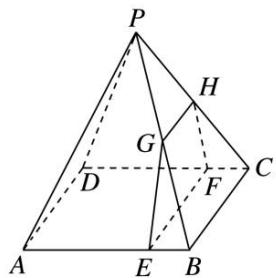

[例 2] (2017·全国 I) 如图，在四棱锥 P-ABCD 中， $AB \parallel CD$ ，且 $\angle BAP = \angle CDP = 90^{\circ}$ .  
（1）证明：平面 $PAB \perp$ 平面 PAD;  
（2）若 PA=PD=AB=DC， $\angle APD=90^{\circ}$ ，且四棱锥 P-ABCD 的体积为 $\frac{8}{3}$ ，求该四棱锥的侧面积.

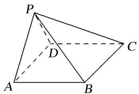

[例 3]如图，在四棱锥 P-ABCD 中，底面 ABCD 是菱形， $\angle DAB=60^{\circ}$ ， $PD\perp$ 平面 ABCD，PD=AD=1，点 E，F 分别为 AB 和 PD 的中点.  
（1）求证：直线 $AF \parallel$ 平面 PEC;  
（2）求三棱锥 P-BEF 的表面积.

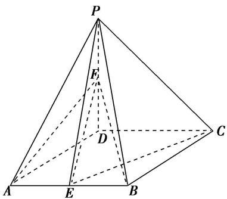

[例 4]如图，四边形 ABCD 为菱形，G 为 AC 与 BD 的交点， $BE \perp$ 平面 ABCD.  
（1）证明：平面 $AEC \perp$ 平面 BED;  
（2）若 $\angle ABC = 120^{\circ}$ ， $AE\bot EC$ ，三棱锥 $E - ACD$ 的体积为 $\frac{\sqrt{6}}{3}$ ，求该三棱锥的侧面积.

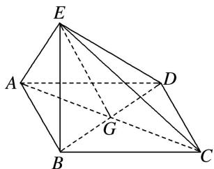

[例 5]如图，在长方形 ABCD 中，AB=4，BC=2，现将 $\triangle ACD$ 沿 AC 折起，使 D 折到 P 的位置且 P 在平面 ABC 的投影 E 恰好在线段 AB 上.  
（1）证明： $AP \perp PB;$  
（2）求三棱锥 P-EBC 的表面积.

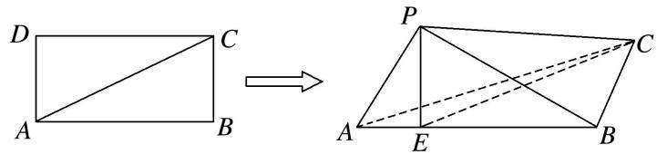

# 考点二 几何体的体积问题

# 【方法总结】

# 求空间几何体体积的常用方法  
（1）公式法：直接根据相关的体积公式计算.  
（2）等积法：根据体积计算公式，通过转换空间几何体的底面和高使得体积计算更容易，或是求出一些体积比等.  
（3）割补法：把不能直接计算体积的空间几何体进行适当分割或补形，转化为易计算体积的几何体.

#### 1. 平行+体积模型

# 【例题选讲】

[例 1](2017·全国Ⅱ)如图所示，四棱锥 P-ABCD 中，侧面 PAD 为等边三角形且垂直于底面 ABCD， $AB=BC=\frac{1}{2}AD,\quad\angle BAD=\angle ABC=90^{\circ}$ .  
（1）证明：直线 $BC \parallel$ 平面 $PAD$ ;  
（2）若 $\triangle PCD$ 的面积为 $2\sqrt{7}$ ，求四棱锥 $P-ABCD$ 的体积.

[例 2]如图，在三棱柱 $ABC—A_{1}B_{1}C_{1}$ 中， $AA_{1} \perp$ 平面 ABC， $AC \perp BC$ ， $AC = BC = CC_{1} = 2$ ，点 D 为 AB 的中点.  
（1）证明： $AC_{1}$ // 平面 $B_{1}CD$ ;  
（2）求三棱锥 $A_{1}$ — $CDB_{1}$ 的体积.

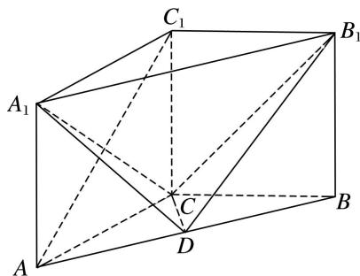

[例 3]如图，在 $\triangle PBE$ 中， $AB \perp PE$ ， $D$ 是 $AE$ 的中点， $C$ 是线段 $BE$ 上的一点，且 $AC = \sqrt{5}$ ， $AB = AP = \frac{1}{2} AE = 2$ ，将 $\triangle PBA$ 沿 $AB$ 折起使得二面角 $P - AB - E$ 是直二面角.  
（1）求证： $CD \parallel$ 平面 PAB;  
（2）求三棱锥 E-PAC 的体积.

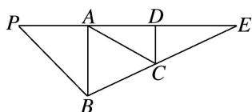

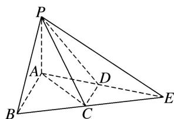

[例 4]如图，在四棱锥 P-ABCD 中，底面 ABCD 为等腰梯形， $AB \parallel CD$ ， $CD = 2AB = 4$ ， $AD = \sqrt{2}$ ， $\triangle PAB$ 为等腰直角三角形，PA = PB，平面 $PAB \perp$ 底面 ABCD，E 为 PD 的中点.  
（1）求证： $AE \parallel$ 平面 PBC;  
（2）求三棱锥 P-EBC 的体积.

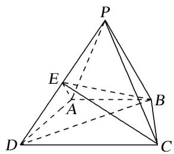

[例5]如图，在四棱锥 $P - ABCD$ 中， $\angle ABC = \angle ACD = 90^{\circ}$ ， $\angle BAC = \angle CAD = 60^{\circ}$ ， $PA\bot$ 平面ABCD， $PA = 2$ ， $AB = 1$ .设 $M$ ， $N$ 分别为 $PD$ ， $AD$ 的中点.  
（1）求证：平面CMN//平面PAB;   
（2）求三棱锥 P—ABM 的体积.

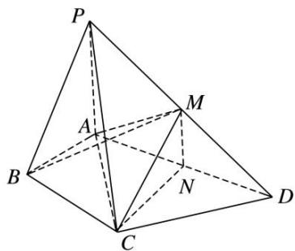

[例 6](2016·全国III)如图，四棱锥 P-ABCD 中，PA⊥底面 ABCD，AD∥BC，AB=AD=AC=3，PA=BC=4，M 为线段 AD 上一点，AM=2MD，N 为 PC 的中点.  
（1）证明：MN//平面PAB;   
（2）求四面体 N-BCM 的体积.

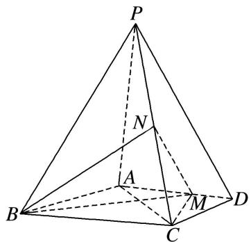

[例 7]如图，在四棱锥 P-ABCD 中，平面 $PAB \perp$ 平面 ABCD，PA=PB，AD//BC，AB=AC， $AD=\frac{1}{2}BC=1$ ，PD=3， $\angle BAD=120^{\circ}$ ，M 为 PC 的中点.  
（1）证明：DM//平面PAB;   
（2）求四面体 MABD 的体积.

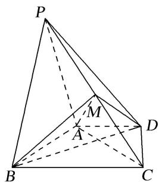

[例8]如图所示的几何体 $P - ABCD$ 中，四边形 $ABCD$ 为菱形， $\angle ABC = 120^{\circ}$ ， $AB = a$ ， $PB = \sqrt{3} a$ ， $PB \perp AB$ ，平面 $ABCD \perp$ 平面 $PAB$ ， $AC \cap BD = O$ ， $E$ 为 $PD$ 的中点， $G$ 为平面 $PAB$ 内任一点.  
（1）在平面 $PAB$ 内，过 $G$ 点是否存在直线 $l$ 使 $OE \parallel l$ ? 如果不存在，请说明理由，如果存在，请说明作法；  
（2） 过 A, C, E 三点的平面将几何体 P—ABCD 截去三棱锥 D—AEC，求剩余几何体 AECBP 的体积.

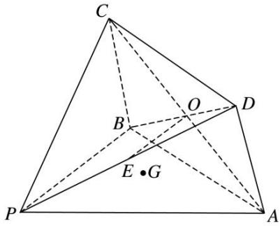

# 【对点训练】

1. 如图所示，在四棱锥 $P - ABCD$ 中，底面 $ABCD$ 为直角梯形， $\angle ABC = \angle BAD = 90^{\circ}$ ， $\triangle PDC$ 和 $\triangle BDC$ 均为等边三角形，且平面 $PDC \perp$ 平面 $BDC$ .  
（1）在棱 $PB$ 上是否存在点 $E$ , 使得 $AE \parallel$ 平面 $PDC$ ? 若存在, 试确定点 $E$ 的位置; 若不存在, 试说明理由;  
（2）若 $\triangle PBC$ 的面积为 $\frac{\sqrt{15}}{2}$ ，求四棱锥 $P-ABCD$ 的体积.

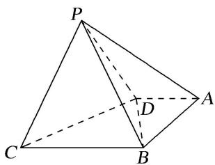

2. 如图，在直三棱柱 $ABC - A_{1}B_{1}C_{1}$ 中， $\angle BAC = 90^{\circ}$ ， $AB = AC = 2$ ，点 $M$ ， $N$ 分别为 $A_{1}C_{1}$ ， $AB_{1}$ 的中点.  
（1）证明： $MN \parallel$ 平面 $BB_{1}C_{1}C$ ;  
（2）若 $CM \perp MN$ ，求三棱锥 M—NAC 的体积.

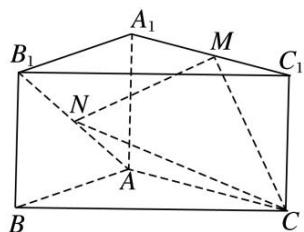

3. 如图，在棱长均为 4 的三棱柱 $ABC - A_{1}B_{1}C_{1}$ 中， $D$ ， $D_{1}$ 分别是 $BC$ 和 $B_{1}C_{1}$ 的中点.  
（1）求证： $A_{1}D_{1} \parallel$ 平面 $AB_{1}D;$  
（2）若平面 $ABC \perp$ 平面 $BCC_{1}B_{1}$ ， $\angle B_{1}BC = 60^{\circ}$ ，求三棱锥 $B_{1} - ABC$ 的体积.

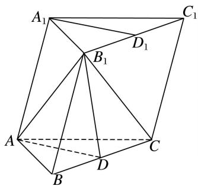

4. 如图，三棱柱 $ABC - A_{1}B_{1}C_{1}$ 的各棱长均为 2， $AA_{1} \perp$ 平面 $ABC$ ， $E$ ， $F$ 分别为棱 $A_{1}B_{1}$ ， $BC$ 的中点.

①求证：直线 $BE \parallel$ 平面 $A_{1}FC_{1}$ ；
②平面 $A_{1}FC_{1}$ 与直线 AB 交于点 M，指出点 M 的位置，说明理由，并求三棱锥 B-EFM 的体积.

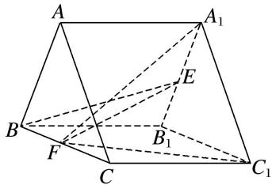

5. 在梯形 $ABCD$ 中(图1)， $AB \parallel CD$ ， $AB = 2$ ， $CD = 5$ ，过 $A$ ， $B$ 分别作 $CD$ 的垂线，垂足分别为 $E$ ， $F$ ，已知 $DE = 1$ ， $AE = 2$ ，将梯形 $ABCD$ 沿 $AE$ ， $BF$ 同侧折起，使得 $AF \perp BD$ ， $DE \parallel CF$ ，得空间几何体 $ADE - BCF$ (图2).  
（1）证明：BE//平面 ACD;  
（2）求三棱锥 E-ACD 的体积.
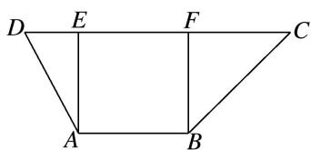

图1

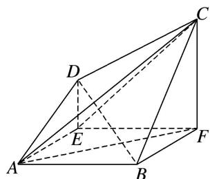

图2

6. 如图，在直三棱柱 $ABC - A_{1}B_{1}C_{1}$ 中， $AB = AC = 5$ ， $BB_{1} = BC = 6$ ， $D$ ， $E$ 分别是 $AA_{1}$ 和 $B_{1}C$ 的中点.  
（1）求证： $DE \parallel$ 平面 ABC;  
（2）求三棱锥 E-BCD 的体积.

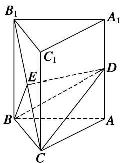

7. 已知空间几何体 $ABCDE$ 中， $\triangle BCD$ 与 $\triangle CDE$ 均为边长为 2 的等边三角形， $\triangle ABC$ 为腰长为 3 的等腰三角形，平面 $CDE \perp$ 平面 $BCD$ ，平面 $ABC \perp$ 平面 $BCD$ .  
（1）试在平面 BCD 内作一条直线，使得直线上任意一点 F 与 E 的连线 EF 均与平面 ABC 平行，并给出详细证明；  
（2）求三棱锥 E-ABC 的体积.

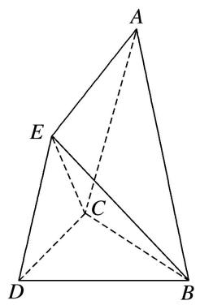

8. 如图，在四边形 $ABCD$ 中， $AB \parallel CD$ ， $BC = CD = DA = \frac{1}{2} AB = 2$ ，点 $E$ 为 $AB$ 的中点，以 $DE$ 为折痕将 $\triangle ADE$ 折起，使点 $A$ 到达点 $P$ 的位置，平面 $PDE \perp$ 平面 $BCDE$ ，点 $F$ 为 $PB$ 的中点.  
（1）求证： $PD / /$ 平面CEF:  
（2）求三棱锥 P-DEF 的体积.

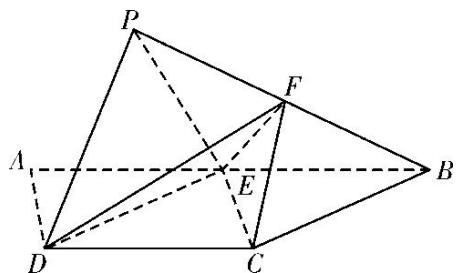

9. 如图，在四棱锥 $P - ABCD$ 中， $PD \perp$ 底面 $ABCD$ ， $AB \parallel CD$ ， $AB = 2$ ， $CD = 3$ ， $M$ 为 $PC$ 上一点，且 $PM = 2MC$ .  
（1）求证：BM//平面PAD:  
（2）若 AD=2, PD=3, $\angle BAD=\frac{\pi}{3}$ ，求三棱锥 P-ADM 的体积.

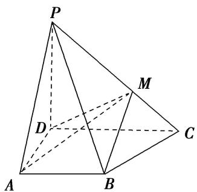

10. 如图，在四棱锥 $P - ABCD$ 中，平面 $PAD \perp$ 平面 $ABCD$ ，底面 $ABCD$ 为梯形， $AB \parallel CD$ ， $AB = 2DC = 2\sqrt{3}$ ，且 $\triangle PAD$ 与 $\triangle ABD$ 均为正三角形， $E$ 为 $AD$ 的中点， $G$ 为 $\triangle PAD$ 的重心.  
（1）求证：GF//平面PDC:  
（2）求三棱锥 G—PCD 的体积.

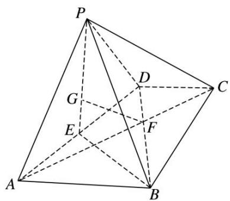

11. 如图所示的五面体 $ABEDFC$ 中, 四边形 $ACFD$ 是等腰梯形, $AD \parallel FC$ , $\angle DAC = 60^{\circ}$ , $BC \perp$ 平面 $ACFD$ , $CA = CB = CF = 1$ , $AD = 2CF$ , 点 $G$ 为 $AC$ 的中点.  
（1）在 $AD$ 上是否存在一点 $H$ , 使 $GH \parallel$ 平面 $BCD$ ? 若存在, 指出点 $H$ 的位置并给出证明; 若不存在,说明理由:  
（2）求三棱锥 G-ECD 的体积.

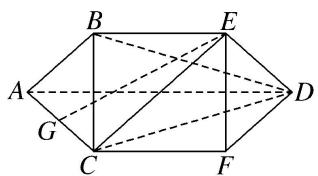

12. 如图，在四棱锥 P-ABCD 中，底面 ABCD 为菱形，PA⊥平面 ABCD，E 为 PD 的中点.  
（1）证明： $PB / /$ 平面ACE；  
（2）设 $PA = 1$ ， $AD = \sqrt{3}$ ， $PC = PD$ ，求三棱锥 $P - ACE$ 的体积.

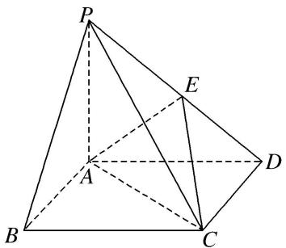

13. 如图，侧棱与底面垂直的四棱柱 $ABCD - A_1B_1C_1D_1$ 的底面是梯形， $AB \parallel CD$ ， $AB \perp AD$ ， $AA_1 = 4$ ， $DC = 2AB$ ， $AB = AD = 3$ ，点 $M$ 在棱 $A_1B_1$ 上，且 $A_1M = \frac{1}{3} A_1B_1$ 。已知点 $E$ 是直线 $CD$ 上的一点， $AM \parallel$ 平面 $BC_1E$ 。  
（1）试确定点E的位置，并说明理由：  
（2）求三棱锥 $M - BC_{1}E$ 的体积.

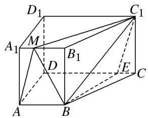

14. 如图，菱形 ABCD 的边长为 a， $\angle D=60^{\circ}$ ，点 H 为 DC 的中点，现以线段 AH 为折痕将 $\triangle DAH$ 折起使得点 D 到达点 P 的位置，且平面 PHA⊥平面 ABCH，点 E，F 分别为 AB，AP 的中点.  
（1）求证：平面 PBC// 平面 EFH;  
（2）若三棱锥 $P - EFH$ 的体积等于 $\frac{\sqrt{3}}{12}$ ，求 $a$ 的值.

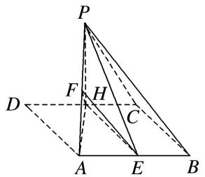

#### 2. 线线垂直+体积模型

# 【例题选讲】

[例 1]在三棱锥 P-ABC 中， $\triangle PAB$ 是等边三角形， $\angle APC = \angle BPC = 60^{\circ}$ .  
（1）求证： $AB \perp PC;$  
（2）若 $PB = 4$ ， $BE\bot PC$ ，求三棱锥 $B - PAE$ 的体积.

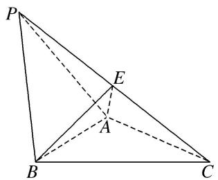

[例 2]如图，在三棱锥 S—ABC 中，SA=SB，AC=BC，O 为 AB 的中点，SO⊥平面 ABC，AB=4，OC=2，N 是 SA 的中点，CN 与 SO 所成的角为 $\alpha$ ，且 $\tan\alpha=2$ .  
（1）证明： $OC \perp ON;$  
（2）求三棱锥 S—ABC 的体积.

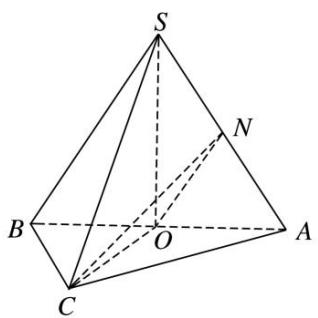

[例 3](2016·全国Ⅱ)如图，菱形 ABCD 的对角线 AC 与 BD 交于点 O，点 E，F 分别在 AD，CD 上，AE = CF，EF 交 BD 于点 H，将 $\triangle DEF$ 沿 EF 折到 $\triangle D'EF$ 的位置.  
（1）证明： $AC \perp HD'$ ;  
（2）若 AB=5, AC=6, $AE=\frac{5}{4}$ , $OD'=2\sqrt{2}$ ，求五棱锥 $D'-ABCFE$ 的体积.

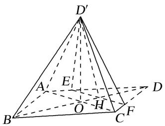

[例 4] (2017·全国III)如图，四面体 ABCD 中， $\triangle ABC$ 是正三角形，AD=CD.  
（1）证明： $AC \perp BD;$  
（2）已知 $\triangle ACD$ 是直角三角形, $AB = BD$ , 若 $E$ 为棱 $BD$ 上与 $D$ 不重合的点, 且 $AE \perp EC$ , 求四面体 $ABCE$ 与四面体 $ACDE$ 的体积比.

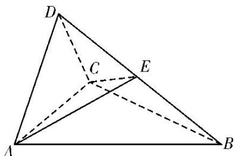

[例 5]如图，在 Rt△ABC 中，AB=BC=4，点 E 在线段 AB 上．过点 E 作 EF∥BC 交 AC 于点 F，将 △AEF 沿 EF 折起到 △PEF 的位置(点 A 与 P 重合)，使得 ∠PEB=30°.  
（1）求证： $EF \perp PB;$  
（2）试问：当点 $E$ 在何处时，四棱锥 $P - EFCB$ 的侧面PEB的面积最大？并求此时四棱锥 $P - EFCB$ 的体积.

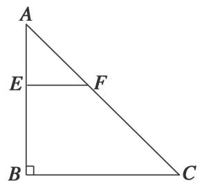

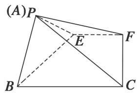

#### 3. 线面垂直+体积模型

# 【例题选讲】

[例 1]如图 1，在直角梯形 ABCD 中， $AD \parallel BC$ ， $\angle BAD = \frac{\pi}{2}$ ， $AB = BC = \frac{1}{2}AD = a$ ，E 是 AD 的中点，O 是 AC 与 BE 的交点．将 $\triangle ABE$ 沿 BE 折起到图 2 中 $\triangle A_{1}BE$ 的位置，得到四棱锥 $A_{1} - BCDE$ .  
（1）证明： $CD \perp$ 平面 $A_{1}OC$ ;  
（2）当平面 $A_{1}BE \perp$ 平面 BCDE 时，四棱锥 $A_{1}-BCDE$ 的体积为 $36\sqrt{2}$ ，求 a 的值.
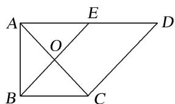

图1

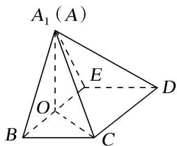

图2

[例 2]如图①, 在直角梯形 $ABCD$ 中, $\angle ADC = 90^\circ$ , $AB // CD$ , $AD = CD = \frac{1}{2} AB = 2$ , $E$ 为 $AC$ 的中点, 将 $\triangle ACD$ 沿 $AC$ 折起, 使折起后的平面 $ACD$ 与平面 $ABC$ 垂直, 如图②. 在图②所示的几何体 $D-ABC$ 中.

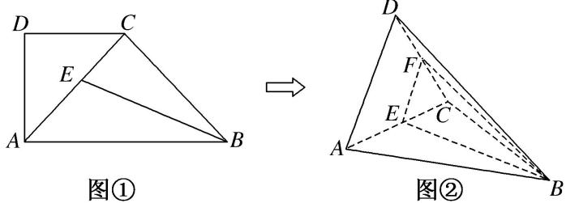  
（1）求证： $BC \perp$ 平面 ACD;  
（2）点 F 在棱 CD 上，且满足 AD// 平面 BEF，求几何体 F-BCE 的体积.

[例 3]如图，在四棱锥 P-ABCD 中，底面 ABCD 是菱形， $\angle BAD=60^{\circ}$ ，PA=PD=AD=2，点 M 在线段 PC 上，且 PM=2MC，N 为 AD 的中点.  
（1）求证： $AD \perp$ 平面 PNB;  
（2）若平面 $PAD \perp$ 平面ABCD，求三棱锥P-NBM的体积.

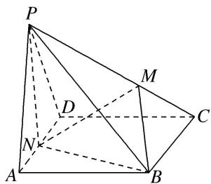

[例 4](2014·重庆)如图，四棱锥 P-ABCD 中，底面是以 O 为中心的菱形， $PO \perp$ 底面 ABCD，AB=2， $\angle BAD=\frac{\pi}{3}$ ，M 为 BC 上一点，且 $BM=\frac{1}{2}$ .  
（1）证明： $BC \perp$ 平面 POM;  
（2）若 $MP \perp AP$ ，求四棱锥 P-ABMO 的体积.

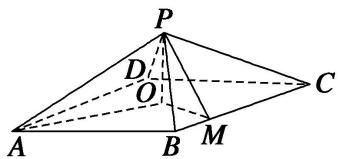

[例 5]如图，正方形 ABCD 的边长为 2， $PA \perp$ 平面 ABCD，PA = 2，平面 $EBC \perp$ 平面 ABCD，EB = EC = $\sqrt{2}$ .  
（1）在 $CD$ 上是否存在一点 $F$ ，使得 $BF \perp$ 平面 $PAE$ ？若存在，确定点 $F$ 的位置；若不存在，请说明理由.  
（2）求多面体 PABCDE 的体积.

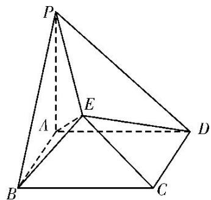

# 【对点训练】

1. 如图，在直三棱柱 $ABC - A_{1}B_{1}C_{1}$ 中， $AB = AC = AA_{1} = 3$ ， $BC = 2$ ， $D$ 是 $BC$ 的中点， $F$ 是 $CC_{1}$ 上一点.  
（1）当 CF=2 时，证明： $B_{1}F \perp$ 平面 ADF;  
（2）若 $FD \perp B_{1}D$ ，求三棱锥 $B_{1}-ADF$ 的体积.

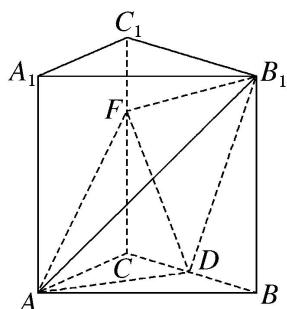

2. 如图，在直三棱柱 $ABC - A_{1}B_{1}C_{1}$ 中， $AB = BC = BB_{1}$ ， $AB_{1} \cap A_{1}B = E$ ， $D$ 为 $AC$ 上的点， $B_{1}C //$ 平面 $A_{1}BD$ .  
（1）求证： $BD \perp$ 平面 $A_{1}ACC_{1}$ ;  
（2）若 $AB = 1$ ，且 $AC\cdot AD = 1$ ，求三棱锥 $A - BCB_{1}$ 的体积.

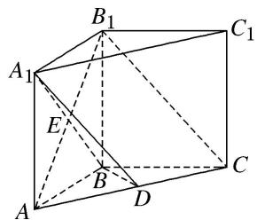

3. (2014·广东)如图（1），四边形ABCD为矩形， $PD\perp$ 平面ABCD， $AB = 1$ ， $BC = PC = 2$ ，作如图（2）折叠，折痕 $EF / / DC$ 。其中点 $E$ ， $F$ 分别在线段 $PD$ ， $PC$ 上，沿 $EF$ 折叠后点 $P$ 叠在线段 $AD$ 上的点记为 $M$ 并且 $MF\perp CF$  
（1）证明： $CF \perp$ 平面 MDF;  
（2）求三棱锥 M-CDE 的体积.
> 

> 
> | 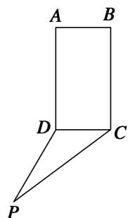 | 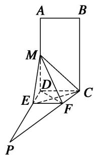 |
> | --- | --- |
> | （1） | （2） |
> 

4. 如图, $\triangle ABC$ 内接于圆 $O$ , $AB$ 是圆 $O$ 的直径, 四边形 $DCBE$ 为平行四边形, $DC \perp$ 平面 $ABC$ , $AB = 2$ , $EB = \sqrt{3}$ .  
（1）求证： $DE \perp$ 平面 ACD:  
（2）设 $AC = x$ ， $V(x)$ 表示三棱锥 $B - ACE$ 的体积，求函数 $V(x)$ 的解析式及最大值.

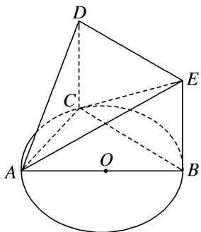

5.《九章算术》是我国古代内容极为丰富的数学名著，书中将底面为直角三角形的直棱柱称为堑堵，将底面为矩形的棱台称为刍童．在如图所示的堑堵 ABM—DCP 与刍童 ABCD— $A_{1}B_{1}C_{1}D_{1}$ 的组合体中，AB =AD， $A_{1}B_{1}=A_{1}D_{1}$ ．台体体积公式： $V=\frac{1}{3}(S'+\sqrt{S'S}+S)h$ ，其中 $S'$ ，S 分别为台体上、下底面的面积，h 为台体的高．  
（1）证明： $BD \perp$ 平面 MAC;  
（2）若 AB=1, $A_{1}D_{1}=2$ , $MA=\sqrt{3}$ ，三棱锥 $A-A_{1}B_{1}D_{1}$ 的体积 $V'=\frac{2\sqrt{3}}{3}$ ，求该组合体的体积.

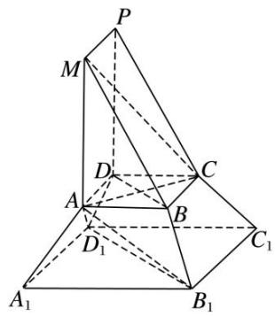

#### 4. 面面垂直+体积模型

# 【例题选讲】

[例 1](2020·全国I)如图，D 为圆锥的顶点，O 是圆锥底面的圆心， $\triangle ABC$ 是底面的内接正三角形，P 为 DO 上一点， $\angle APC=90^{\circ}$ .  
（1）证明：平面 $PAB \perp$ 平面 PAC;  
（2）设 $DO = \sqrt{2}$ ，圆锥的侧面积为 $\sqrt{3}\pi$ ，求三棱锥 $P - ABC$ 的体积.

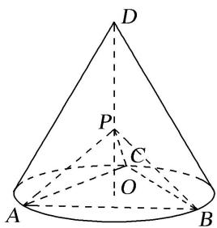

[例 2](2018·全国I)如图，在平行四边形 ABCM 中， $AB = AC = 3$ ， $\angle ACM = 90^{\circ}$ 。以 AC 为折痕将 $\triangle ACM$ 折起，使点 M 到达点 D 的位置，且 $AB \perp DA$ 。  
（1）证明：平面 $ACD \perp$ 平面 ABC;  
（2） $Q$ 为线段 $AD$ 上一点， $P$ 为线段 $BC$ 上一点，且 $BP = DQ = \frac{2}{3} DA$ ，求三棱锥 $Q - ABP$ 的体积.

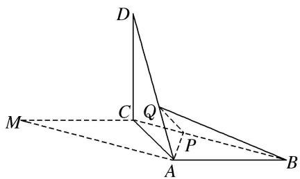

[例 3]如图所示，AB 为圆 O 的直径，点 E，F 在圆 O 上， $AB \parallel EF$ ，矩形 ABCD 所在平面和圆 O 所在平面垂直，已知 AB=2，EF=1.  
（1）求证：平面 $DAF \perp$ 平面 CBF;  
（2）若 BC=1，求四棱锥 F-ABCD 的体积.

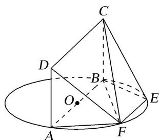

[例 4]五边形 $ANB_{1}C_{1}C$ 是由一个梯形 $ANB_{1}B$ 与一个矩形 $BB_{1}C_{1}C$ 组成的，如图甲所示，B 为 AC 的中点， $AC = CC_{1} = 2AN = 8$ 。沿虚线 $BB_{1}$ 将五边形 $ANB_{1}C_{1}C$ 折成直二面角 A—BB₁—C，如图乙所示。  
（1）求证：平面 $BNC \perp$ 平面 $C_{1}B_{1}N$ ;  
（2）求图乙中的多面体的体积.

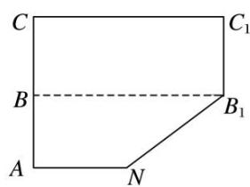

图甲

图乙

# 【对点训练】

1. 如图，三棱锥 $P - ABC$ 中，底面 $ABC$ 是边长为 2 的正三角形， $PA \perp PC$ ， $PB = 2$ .  
（1）求证：平面 PAC⊥平面 ABC;  
（2）若 PA=PC，求三棱锥 P-ABC 的体积.

2. 已知四边形 $ABCD$ 是矩形， $AB = 1$ ， $BC = \sqrt{3}$ ，将 $\triangle ABC$ 沿着对角线 $AC$ 折起来得到 $\triangle AB_{1}C$ 且顶点 $B_{1}$ 在平面 $ACD$ 上的射影 $O$ 恰落在边 $AD$ 上，如图所示.  
（1）求证：平面 $AB_{1}C \perp$ 平面 $B_{1}CD$ :  
（2）求三棱锥 $B_{1} - ABC$ 的体积 $V_{B1 - ABC}$ .

3. 如图所示，在四棱锥 $P - ABCD$ 中，平面 $PAD \perp$ 平面 $ABCD, AB \parallel DC, \triangle PAD$ 是等边三角形，已知 $BD = 2AD = 8, AB = 2DC = 4\sqrt{5}$ .  
（1）设 $M$ 是 $PC$ 上的一点，求证：平面 $MBD \perp$ 平面 $PAD$ :  
（2）求四棱锥 P—ABCD 的体积.

4. 如图, 已知在四棱锥 $P - ABCD$ 中, 底面 $ABCD$ 是边长为 4 的正方形, $\triangle PAD$ 是正三角形, 平面 $PAD$

⊥平面 ABCD, E, F, G 分别是 PD, PC, BC 的中点.  
（1）求证：平面 $EFG \perp$ 平面 PAD;  
（2）若 M 是线段 CD 上一点，求三棱锥 M—EFG 的体积.

5. 如图, 正方形 $ABCD$ 的边长为 $2 \sqrt{2}$ , 以 $AC$ 为折痕把 $\triangle ACD$ 折起, 使点 $D$ 到达点 $P$ 的位置, 且 $PA = PB$ .  
（1）证明：平面 PAC⊥平面 ABC;  
（2）若 M 是 PC 的中点，设 $\overrightarrow{PN} = \lambda \overrightarrow{PA} (0 < \lambda < 1)$ ，且三棱锥 A - BMN 的体积为 $\frac{8}{9}$ ，求 $\lambda$ 的值.

#### 5. 平行+垂直+体积模型

# 【例题选讲】

[例 1](2017·北京)如图，在三棱锥 P-ABC 中， $PA \perp AB$ ， $PA \perp BC$ ， $AB \perp BC$ ， $PA = AB = BC = 2$ ，D 为线段 AC 的中点，E 为线段 PC 上一点.  
（1）求证： $PA \perp BD;$   
（2）求证：平面 $BDE \perp$ 平面 PAC;  
（3）当 $PA \parallel$ 平面 $BDE$ 时, 求三棱锥 $E - BCD$ 的体积.

[例 2]如图①，在矩形 ABCD 中，AB=3，BC=4，E，F 分别在线段 BC，AD 上， $EF \parallel AB$ ，将矩形 ABEF 沿 EF 折起，记折起后的矩形为 MNEF，且平面 $MNEF \perp$ 平面 ECDF，如图②.

图①

图②  
（1）求证：NC//平面 MFD;  
（2）若 $EC = 3$ ，求证： $ND\bot FC;$   
（3）求四面体 NEFD 体积的最大值.

[例 3]如图，在四棱锥 P-ABCD 中，底面 ABCD 是菱形，PA=PD， $\angle BAD=60^{\circ}$ ，E 是 AD 的中点，点 Q 在侧棱 PC 上.  
（1）求证： $AD \perp$ 平面 PBE;  
（2）若 Q 是 PC 的中点，求证：PA // 平面 BDQ;  
（3）若 $V_{P-BCDE}=2V_{Q-ABCD}$ ，试求 $\frac{CP}{CQ}$ 的值.

# 【对点训练】

1. (2014·北京)如图，在三棱柱 $ABC - A_{1}B_{1}C_{1}$ 中，侧棱垂直于底面， $AB \perp BC$ ， $AA_{1} = AC = 2$ ， $BC = 1$ ， $E$ ， $F$ 分别是 $A_{1}C_{1}$ ， $BC$ 的中点.  
（1）求证：平面 $ABE \perp$ 平面 $B_{1}BCC_{1}$ ;  
（2）求证： $C_{1}F \parallel$ 平面 ABE;  
（3）求三棱锥 E-ABC 的体积.

2. 如图，已知 $AF \perp$ 平面 $ABCD$ ，四边形 $ABEF$ 为矩形，四边形 $ABCD$ 为直角梯形， $\angle DAB = 90^\circ$ ， $AB // CD$ ， $AD = AF = CD = 2$ ， $AB = 4$ .  
（1）求证： $AF \parallel$ 平面 BCE;  
（2）求证： $AC \perp$ 平面 BCE;  
（3）求三棱锥 E-BCF 的体积.

3. 如图，在三棱锥 $V - ABC$ 中，平面 $VAB \perp$ 平面 $ABC$ ， $\triangle VAB$ 为等边三角形， $AC \perp BC$ 且 $AC = BC = \sqrt{2}$ ， $O$ ， $M$ 分别为 $AB$ ， $VA$ 的中点.  
（1）求证：VB//平面MOC;   
（2）求证：平面 $MOC \perp$ 平面 VAB;  
（3）求三棱锥 V-ABC 的体积.

