# 专题10 立体几何中的面积与体积问题

#### 1. 多面体的表面积、侧面积
因为多面体的各个面都是平面，所以多面体的侧面积就是所有侧面的面积之和，表面积是侧面积与底面面积之和.

#### 2. 圆柱、圆锥、圆台的侧面展开图及侧面积公式

<table><tr><td></td><td>圆柱</td><td>圆锥</td><td>圆台</td></tr><tr><td>侧面展开图</td><td>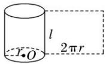</td><td>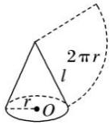</td><td>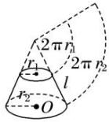</td></tr><tr><td>侧面积公式</td><td> $S_{\text{圆柱侧}} = 2\pi rl$ </td><td> $S_{\text{圆锥侧}} = \pi rl$ </td><td> $S_{\text{圆台侧}} = \pi (r_1 + r_2)l$ </td></tr></table>

#### 3. 柱、锥、台、球的表面积和体积

<table><tr><td>几何体\名称</td><td>表面积</td><td>体积</td></tr><tr><td>柱体(棱柱和圆柱)</td><td> $S_{\text{表面积}} = S_{\text{侧}} + 2S_{\text{底}}$ </td><td> $V = Sh$ </td></tr><tr><td>锥体(棱锥和圆锥)</td><td> $S_{\text{表面积}} = S_{\text{侧}} + S_{\text{底}}$ </td><td> $V = \frac{1}{3}Sh$ </td></tr><tr><td>台体(棱台和圆台)</td><td> $S_{\text{表面积}} = S_{\text{侧}} + S_{\text{上}} + S_{\text{下}}$ </td><td> $V = \frac{1}{3}(S_{\text{上}} + S_{\text{下}} + \sqrt{S_{\text{上}}S_{\text{下}}})h$ </td></tr><tr><td>球</td><td> $S = 4\pi R^{2}$ </td><td> $V = \frac{4}{3}\pi R^{3}$ </td></tr></table>

# 考点一 几何体的面积问题

# 【方法总结】

# 求几何体的表面积的方法  
（1）求表面积问题的思路是将立体几何问题转化为平面图形问题，即空间图形平面化，这是解决立体几何的主要出发点.  
（2）求不规则几何体的表面积时，通常将所给几何体分割成柱、锥、台体，先求这些柱、锥、台体的表面积，再通过求和或作差求得所给几何体的表面积.

# 平面图形折叠问题的求解方法  
（1）解决与折叠有关的问题的关键是搞清折叠前后的变化量和不变量，一般情况下，线段的长度是不变量，而位置关系往往会发生变化，抓住不变量是解决问题的突破口.  
（2）在解决问题时，要综合考虑折叠前后的图形，既要分析折叠后的图形，也要分析折叠前的图形.

# 【例题选讲】

[例 1](2014·安徽)如图，四棱锥 P-ABCD 的底面是边长为 8 的正方形，四条侧棱长均为 $2\sqrt{17}$ . 点 G, E, F, H 分别是棱 PB, AB, CD, PC 上共面的四点，平面 GEFH⊥平面 ABCD, BC∥平面 GEFH.  
（1）证明： $GH \parallel EF;$   
（2）若 EB=2，求四边形 GEFH 的面积.

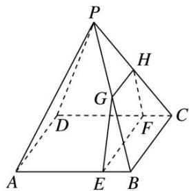

解析 （1）因为 $BC \parallel$ 平面 $GEFH$ , $BC \subset$ 平面 $PBC$ , 且平面 $PBC \cap$ 平面 $GEFH = GH$ , 所以 $GH \parallel BC$ . 同理可证 $EF \parallel BC$ , 因此 $GH \parallel EF$ .
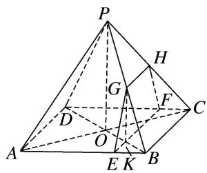  
（2）如图，连接 AC，BD 交于点 O，BD 交 EF 于点 K，连接 OP，GK.
因为 PA=PC，O 是 AC 的中点，所以 $PO \perp AC$ ，同理可得 $PO \perp BD$ .
又 $BD \cap AC = O$ ，且 AC， $BD \subset$ 底面 ABCD，所以 $PO \perp$ 底面 ABCD.
又因为平面 $GEFH \perp$ 平面 $ABCD$ ，且 $PO \notin$ 平面 $GEFH$ ，所以 $PO //$ 平面 $GEFH$ .
因为平面 $PBD \cap$ 平面 GEFH = GK，所以 PO // GK，且 $GK \perp$ 底面 ABCD，从而 $GK \perp EF$ .
所以 GK 是梯形 GEFH 的高．由 AB=8，EB=2 得 EB:AB=KB:DB=1:4，
从而 $KB=\frac{1}{4}DB=\frac{1}{2}OB$ ，即 K 为 OB 的中点．再由 $PO \parallel GK$ 得 $GK=\frac{1}{2}PO$ ，
即 G 是 PB 的中点，且 $GH=\frac{1}{2}BC=4$ 。由已知可得 $OB=4\sqrt{2}$
$PO=\sqrt{PB^{2}-OB^{2}}=\sqrt{68-32}=6$ ，所以 GK=3。
故四边形 GEFH 的面积 $S=\frac{GH+EF}{2}\cdot GK=\frac{4+8}{2}\times3=18$ .

[例 2] (2017·全国 I) 如图，在四棱锥 P-ABCD 中， $AB \parallel CD$ ，且 $\angle BAP = \angle CDP = 90^{\circ}$ .  
（1）证明：平面 $PAB \perp$ 平面 PAD;  
（2）若 PA=PD=AB=DC， $\angle APD=90^{\circ}$ ，且四棱锥 P-ABCD 的体积为 $\frac{8}{3}$ ，求该四棱锥的侧面积.

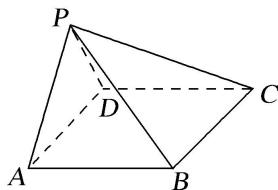

解析 （1） $\because \angle BAP = \angle CDP = 90^{\circ}$ , $\therefore AB \perp PA$ , $CD \perp PD$ . $\because AB // CD$ , $\therefore AB \perp PD$ .
又∵ $PA\cap PD=P$ ，PA， $PD\subset$ 平面PAD，∴ $AB\perp$ 平面PAD．∵ $AB\subset$ 平面PAB，∴平面 $PAB\perp$ 平面PAD.

  
（2）取 AD 的中点 E，连接 PE. $\because PA=PD,\therefore PE\perp AD.$
由（1）知， $AB \perp$ 平面 PAD， $PE \subset$ 平面 PAD，故 $AB \perp PE$ ，又 $AB \cap AD = A$ ，可得 $PE \perp$ 平面 ABCD.
设 AB = x，则由已知可得 $AD = \sqrt{2}x$ ， $PE = \frac{\sqrt{2}}{2}x$ ，
故四棱锥 P-ABCD 的体积 $V_{P-ABCD}=\frac{1}{3}AB\cdot AD\cdot PE=\frac{1}{3}x^{3}$ . 由题设得 $\frac{1}{3}x^{3}=\frac{8}{3}$ ，故 x=2.
从而 PA=PD=AB=DC=2，AD=BC= $2\sqrt{2}$ ，PB=PC= $2\sqrt{2}$ ，
可得四棱锥 P-ABCD 的侧面积为 $\frac{1}{2}PA\cdot PD+\frac{1}{2}PA\cdot AB+\frac{1}{2}PD\cdot DC+\frac{1}{2}BC^{2}\sin60^{\circ}=6+2\sqrt{3}$ .

[例3]如图，在四棱锥 $P - ABCD$ 中，底面ABCD是菱形， $\angle DAB = 60^{\circ}$ ， $PD\bot$ 平面ABCD， $PD = AD$ $= 1$ ，点 $E$ ， $F$ 分别为 $AB$ 和 $PD$ 的中点.  
（1）求证：直线 $AF \parallel$ 平面 PEC;  
（2）求三棱锥 P-BEF 的表面积.

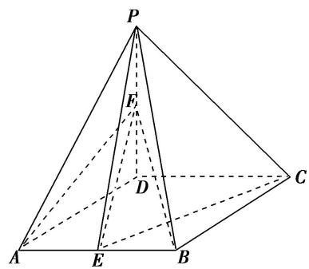

解析 （1）作 $FM \parallel CD$ 交 $PC$ 于 $M$ , 连接 $ME$ .
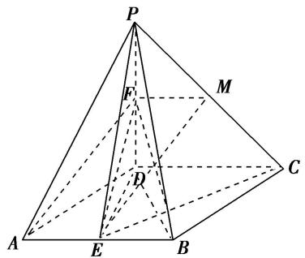
∵点F为PD的中点，∴ $FM\frac{\parallel}{2}CD$ ，又 $AE\frac{\parallel}{2}CD$ ，∴ $AE\frac{\parallel}{2}FM$
∴四边形 AEMF 为平行四边形，∴AF//EM，∵AF∉平面 PEC, EM⊂平面 PEC，∴直线 AF//平面 PEC.  
（2）连接 ED, BD, 可知 $ED \perp AB$ ,
$\left. \begin{array}{l} P D \perp \text {平面} A B C D \\ A B \subset \text {平面} A B C D \end{array} \right\} \Rightarrow \quad \left. \begin{array}{l} P D \perp A B \\ D E \perp A B \end{array} \right\} \Rightarrow \quad \left. \begin{array}{l} A B \perp \text {平面} P E F \\ P E, F E \subset \text {平面} P E F \end{array} \right\} \Rightarrow A B \perp P E, A B \perp F E,$
故 $S_{\triangle PEF} = \frac{1}{2} PF\cdot ED = \frac{1}{2}\times \frac{1}{2}\times \frac{\sqrt{3}}{2} = \frac{\sqrt{3}}{8};$ $S_{\triangle PBF} = \frac{1}{2} PF\cdot BD = \frac{1}{2}\times \frac{1}{2}\times 1 = \frac{1}{4};$
$S _ {\triangle P B E} = \frac {1}{2} P E \cdot B E = \frac {1}{2} \times \frac {\sqrt {7}}{2} \times \frac {1}{2} = \frac {\sqrt {7}}{8}; S _ {\triangle B E F} = \frac {1}{2} E F \cdot E B = \frac {1}{2} \times 1 \times \frac {1}{2} = \frac {1}{4}.$
因此三棱锥 P-BEF 的表面积 $S_{P-BEF}=S_{\triangle PEF}+S_{\triangle PBF}+S_{\triangle PBE}+S_{\triangle BEF}=\frac{4+\sqrt{3}+\sqrt{7}}{8}$ .

[例 4]如图，四边形 ABCD 为菱形，G 为 AC 与 BD 的交点，BE⊥平面 ABCD.  
（1）证明：平面 $AEC \perp$ 平面 BED;  
（2）若 $\angle ABC = 120^{\circ}$ , $AE \perp EC$ , 三棱锥 $E - ACD$ 的体积为 $\frac{\sqrt{6}}{3}$ , 求该三棱锥的侧面积.

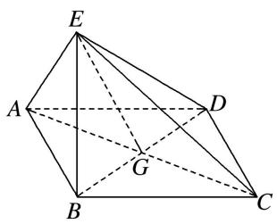

解析 （1）因为四边形ABCD为菱形，所以 $AC \perp BD$
因为 $BE \perp$ 平面 ABCD， $AC \subset$ 平面 ABCD，所以 $BE \perp AC$ .

而 $BD \cap BE = B$ ，BD，BE ⊂ 平面 BED，所以 $AC \perp$ 平面 BED.
又 $AC \subset$ 平面 AEC，所以平面 $AEC \perp$ 平面 BED.  
（2）设 AB=x，在菱形 ABCD 中，由 $\angle ABC=120^{\circ}$ ，可得 $AG=GC=\frac{\sqrt{3}}{2}x$ ，GB=GD= $\frac{x}{2}$ .
因为 $AE \perp EC$ ，所以在 Rt△AEC 中，可得 $EG = \frac{\sqrt{3}}{2}x$ .
由 $BE \perp$ 平面 ABCD，知 $\triangle EBG$ 为直角三角形，可得 $BE = \frac{\sqrt{2}}{2}x$ .
由已知得，三棱锥 E-ACD 的体积 $V_{三棱锥EACD}=\frac{1}{3}\times\frac{1}{2}AC\cdot GD\cdot BE=\frac{\sqrt{6}}{24}x^{3}=\frac{\sqrt{6}}{3}$ ，故 x=2.
从而可得 $AE=EC=ED=\sqrt{6}$ . 所以 $\triangle EAC$ 的面积为 3， $\triangle EAD$ 的面积与 $\triangle ECD$ 的面积均为 $\sqrt{5}$ .
故三棱锥 EACD 的侧面积为 $3+2\sqrt{5}$ .

[例 5]如图，在长方形 ABCD 中，AB=4，BC=2，现将 $\triangle ACD$ 沿 AC 折起，使 D 折到 P 的位置且 P 在平面 ABC 的投影 E 恰好在线段 AB 上.  
（1）证明： $AP \perp PB;$  
（2）求三棱锥 P-EBC 的表面积.

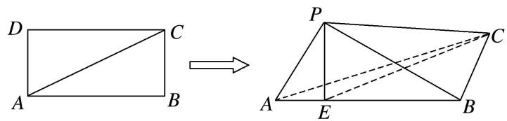

解析 （1）由题意知 $PE \perp$ 平面 ABC，又 $BC \subset$ 平面 ABC，∴ $PE \perp BC$ ，
又 $AB \perp BC$ 且 $AB \cap PE = E$ ，AB， $PE \subset$ 平面 PAB，∴ $BC \perp$ 平面 PAB，
又 $AP \subset$ 平面 PAB，∴ $BC \perp AP$ ，又 $AP \perp CP$ 且 $BC \cap CP = C$ ，BC， $CP \subset$ 平面 PBC，
∴AP⊥平面PBC，又PB⊂平面PBC，∴AP⊥PB.  
（2）在 $\triangle PAB$ 中，由（1）得 $AP\bot PB$ ， $AB = 4$ ， $AP = 2$ ， $\therefore PB = 2\sqrt{3}$ ， $PE = \frac{2\times 2\sqrt{3}}{4} = \sqrt{3},$
$\therefore BE = 3, \therefore S_{\triangle PEB} = \frac{1}{2} \times 3 \times \sqrt{3} = \frac{3\sqrt{3}}{2}$ , 在 Rt△EBC 中, $EB = 3, BC = 2, EC = \sqrt{EB^2 + BC^2} = \sqrt{13}$ ,
$\therefore S _ {\triangle E B C} = \frac {1}{2} \times 3 \times 2 = 3, \quad \therefore S _ {\triangle P E C} = \frac {1}{2} P E \cdot C E = \frac {1}{2} \times \sqrt {3} \times \sqrt {1 3} = \frac {\sqrt {3 9}}{2}, \quad \therefore S _ {\triangle P B C} = \frac {1}{2} B C \cdot P B = \frac {1}{2} \times 2 \sqrt {3} \times 2 = 2 \sqrt {3},$
∴三棱锥 P-EBC 的表面积为 $S=S_{\triangle PEB}+S_{\triangle EBC}+S_{\triangle PEC}+S_{\triangle PBC}=\frac{3\sqrt{3}}{2}+3+\frac{\sqrt{39}}{2}+2\sqrt{3}=\frac{7\sqrt{3}+\sqrt{39}+6}{2}$ .

# 考点二 几何体的体积问题

# 【方法总结】

# 求空间几何体体积的常用方法  
（1）公式法：直接根据相关的体积公式计算.  
（2）等积法：根据体积计算公式，通过转换空间几何体的底面和高使得体积计算更容易，或是求出一些体积比等.  
（3）割补法：把不能直接计算体积的空间几何体进行适当分割或补形，转化为易计算体积的几何体.

#### 1. 平行+体积模型

# 【例题选讲】

[例 1](2017·全国Ⅱ)如图所示，四棱锥 P-ABCD 中，侧面 PAD 为等边三角形且垂直于底面 ABCD， $AB=BC=\frac{1}{2}AD,\quad\angle BAD=\angle ABC=90^{\circ}$ .  
（1）证明：直线 $BC \parallel$ 平面 $PAD$ ;  
（2）若 $\triangle PCD$ 的面积为 $2\sqrt{7}$ ，求四棱锥 $P-ABCD$ 的体积.
解析 （1）在平面 $ABCD$ 中，因为 $\angle BAD = \angle ABC = 90^{\circ}$ 。所以 $BC // AD$
又 BC# 平面 PAD，AD⊂ 平面 PAD．所以直线 BC∥ 平面 PAD.

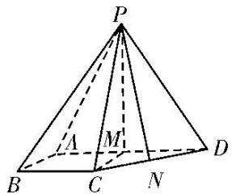  
（2）如图，取 AD 的中点 M，连接 PM，CM，由 $AB = BC = \frac{1}{2} AD$ 及 $BC \parallel AD$ ，
$\angle ABC=90^{\circ}$ 得四边形 ABCM 为正方形，则 $CM\perp AD$ .
因为侧面 PAD 为等边三角形且垂直于底面 ABCD，平面 $PAD \cap$ 平面 ABCD = AD， $PM \subset$ 平面 PAD，所以 $PM \perp AD$ ， $PM \perp$ 底面 ABCD，因为 $CM \subset$ 底面 ABCD，所以 $PM \perp CM$ 。
设 BC=x，则 CM=x， $CD=\sqrt{2}x$ ， $PM=\sqrt{3}x$ ，PC=PD=2x，
如图，取 CD 的中点 N，连接 PN，则 $PN \perp CD$ ，所以 $PN = \frac{\sqrt{14}}{2}x$ 。因为 $\triangle PCD$ 的面积为 $2\sqrt{7}$ ，
所以 $\frac{1}{2} \times \sqrt{2} x \times \frac{\sqrt{14}}{2} x = 2\sqrt{7}$ ，解得 $x = -2$ （舍去）或 $x = 2$ 。于是 $AB = BC = 2$ ， $AD = 4$ ， $PM = 2\sqrt{3}$ 。
所以四棱锥 P-ABCD 的体积 $V=\frac{1}{3}\times\frac{2\times(2+4)}{2}\times2\sqrt{3}=4\sqrt{3}$ .

[例 2]如图，在三棱柱 $ABC—A_{1}B_{1}C_{1}$ 中， $AA_{1} \perp$ 平面 ABC， $AC \perp BC$ ， $AC = BC = CC_{1} = 2$ ，点 D 为 AB 的中点.  
（1）证明： $AC_{1}$ // 平面 $B_{1}CD$ ;  
（2）求三棱锥 $A_{1}$ — $CDB_{1}$ 的体积.

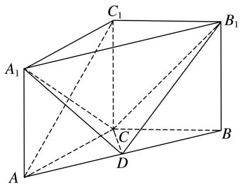

解析 （1）连接 $BC_{1}$ 交 $B_{1}C$ 于点 $O$ ，连接 $OD$
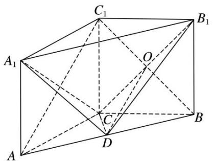
在三棱柱 $ABC—A_{1}B_{1}C_{1}$ 中，四边形 $BCC_{1}B_{1}$ 是平行四边形，∴点 O 是 $BC_{1}$ 的中点.
∵点D为AB的中点，∴ $OD//AC_{1}$ . 又 $OD⊂平面B_{1}CD$ ， $AC_{1}\notin$ 平面 $B_{1}CD$ ，∴ $AC_{1}//$ 平面 $B_{1}CD$ .  
（2） $\because AC=BC,\ AD=BD,\ \therefore CD\perp AB.$ 在三棱柱 $ABC-A_{1}B_{1}C_{1}$ 中，
由 $AA_{1} \perp$ 平面 ABC，得平面 $ABB_{1}A_{1} \perp$ 平面 ABC。又平面 $ABB_{1}A_{1} \cap$ 平面 ABC = AB，CD ⊂ 平面 ABC，
∴ $CD \perp$ 平面 $ABB_{1}A_{1}$ ，∵ $AC \perp BC$ ，AC = BC = 2，∴ $AB = A_{1}B_{1} = 2\sqrt{2}$ ， $CD = \sqrt{2}$ ，
$\therefore V _ {\text {三棱锥} A _ {1} - C D B _ {1}} = V _ {\text {三棱锥} C - A _ {1} D B _ {1}} = \frac {1}{3} \times \frac {1}{2} \times 2 \times 2 \sqrt {2} \times \sqrt {2} = \frac {4}{3}.$

[例 3]如图，在 $\triangle PBE$ 中， $AB \perp PE$ ，D 是 AE 的中点，C 是线段 BE 上的一点，且 $AC = \sqrt{5}$ ， $AB = AP = \frac{1}{2}AE = 2$ ，将 $\triangle PBA$ 沿 AB 折起使得二面角 P - AB - E 是直二面角.  
（1）求证： $CD \parallel$ 平面 PAB;  
（2）求三棱锥 E-PAC 的体积.

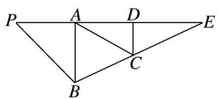

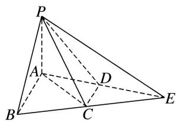

解析 （1）因为 $\frac{1}{2} AE = 2$ ，所以 $AE = 4$ ，又 $AB = 2$ ， $AB\bot PE$
所以 $BE=\sqrt{AB^{2}+AE^{2}}=\sqrt{2^{2}+4^{2}}=2\sqrt{5}$ ，又因为 $AC=\sqrt{5}=\frac{1}{2}BE$ ，
所以 AC 是 Rt△ABE 的斜边 BE 上的中线，所以 C 是 BE 的中点，又因为 D 是 AE 的中点，
所以 CD 是 Rt△ABE 的中位线，所以 CD // AB，
又因为 $CD \nmid$ 平面 $PAB$ , $AB \subset$ 平面 $PAB$ , 所以 $CD \parallel$ 平面 $PAB$ .  
（2）由（1）知，直线 CD 是 Rt△ABE 的中位线，所以 $CD=\frac{1}{2}AB=1$ ，
因为二面角 P-AB-E 是直二面角，平面 $PAB \cap$ 平面 $EAB = AB$ ， $PA \subset$ 平面 $PAB$ ， $PA \perp AB$ ，
所以 $PA \perp$ 平面 ABE，又因为 AP = 2，
所以 $V_{E-PAC}=V_{P-ACE}=\frac{1}{3}\times\frac{1}{2}\times AE\times CD\times AP=\frac{1}{3}\times\frac{1}{2}\times4\times1\times2=\frac{4}{3}.$

[例 4]如图，在四棱锥 P-ABCD 中，底面 ABCD 为等腰梯形， $AB \parallel CD$ ， $CD = 2AB = 4$ ， $AD = \sqrt{2}$ ， $\triangle PAB$ 为等腰直角三角形，PA = PB，平面 $PAB \perp$ 底面 ABCD，E 为 PD 的中点.  
（1）求证： $AE \parallel$ 平面 PBC;  
（2）求三棱锥 P-EBC 的体积.

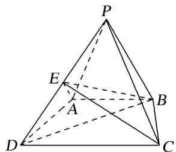

解析 （1）如图，取 $PC$ 的中点 $F$ ，连接 $EF$ ， $BF$
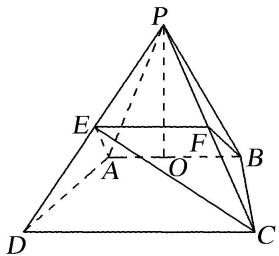
$\because P E = D E, \quad P F = C F, \quad \therefore E F / / C D, \quad C D = 2 E F,$
$\because A B \parallel C D, C D = 2 A B, \therefore A B \parallel E F, \text {且} E F = A B.$
$\therefore \text { 四边形 } A B F E \text { 为平行四边形， } \therefore A E \parallel B F.$
$\because B F \subset \text { 平面 } P B C, A E \notin \text { 平面 } P B C. \text { 故 } A E / / \text { 平面 } P B C.$  
（2）由（1）知 $AE \parallel$ 平面 $PBC$ , $\therefore$ 点 $E$ 到平面 $PBC$ 的距离与点 $A$ 到平面 $PBC$ 的距离相等,
$\therefore V _ {P - E B C} = V _ {E - P B C} = V _ {A - P B C} = V _ {P - A B C}. \text {如图，取} A B \text {的中点} O, \text {连接} P O, \because P A = P B, \therefore O P \perp A B.$
$\because \text {平面} P A B \perp \text {平面} A B C D, \text {平面} P A B \cap \text {平面} A B C D = A B, O P \subset \text {平面} P A B, \therefore O P \perp \text {平面} A B C D.$
$\because \triangle P A B \text {为等腰直角三角形，} P A = P B, A B = 2, \therefore O P = 1.$
$\because \text { 四边形 } A B C D \text { 为等腰梯形，且 } A B / / C D, C D = 2 A B = 4, A D = \sqrt {2},$
$\therefore \text {梯形} A B C D \text {的高为} 1, \therefore S _ {\triangle A B C} = \frac {1}{2} \times 2 \times 1 = 1. \text {故} V _ {P - E B C} = V _ {P - A B C} = \frac {1}{3} \times 1 \times 1 = \frac {1}{3}.$

[例 5]如图，在四棱锥 P—ABCD 中， $\angle ABC = \angle ACD = 90^{\circ}$ ， $\angle BAC = \angle CAD = 60^{\circ}$ ，PA⊥平面 ABCD，PA = 2，AB = 1。设 M，N 分别为 PD，AD 的中点。  
（1）求证：平面CMN//平面PAB;   
（2）求三棱锥 P—ABM 的体积.

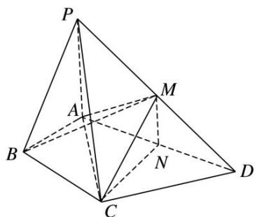

解析 （1）∵M，N分别为PD，AD的中点，∴MN//PA.
又∵MN∉平面PAB，PA⊂平面PAB，∴MN∥平面PAB.
在 Rt△ACD 中，∠CAD=60°，CN=AN，
$\therefore \angle ACN = 60^{\circ}$ ，又 $\because \angle BAC = 60^{\circ}$ ，∴CN//AB.
∵CN∉平面PAB，AB⊂平面PAB，∴CN∥平面PAB.
又∵CN∩MN=N，CN，MN⊂平面CMN，∴平面CMN//平面PAB.  
（2）由（1）知，平面CMN//平面PAB，∴点M到平面PAB的距离等于点C到平面PAB的距离.
由已知得， $AB = 1$ ， $\angle ABC = 90^{\circ}$ ， $\angle BAC = 60^{\circ}$ ， $\therefore BC = \sqrt{3}$
∴三棱锥 P—ABM 的体积 $V=V_{三棱锥 M—PAB}=V_{三棱锥 C—PAB}=V_{三棱锥 P—ABC}=\frac{1}{3}\times\frac{1}{2}\times1\times\sqrt{3}\times2=\frac{\sqrt{3}}{3}$ .

[例 6](2016·全国III)如图，四棱锥 P-ABCD 中，PA⊥底面 ABCD，AD∥BC，AB=AD=AC=3，PA=BC=4，M 为线段 AD 上一点，AM=2MD，N 为 PC 的中点.  
（1）证明：MN//平面PAB:  
（2）求四面体 N-BCM 的体积.

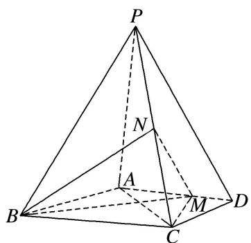

解析 （1）由已知得 $AM = \frac{2}{3} AD = 2$ 。如图，取 $BP$ 的中点 $T$ ，连接 $AT$ ， $TN$ ，
由 N 为 PC 中点知 $TN \parallel BC$ ， $TN = \frac{1}{2} BC = 2$ 。又 $AD \parallel BC$ ，故 $TN \parallel AM$ ，
所以四边形 $AMNT$ 为平行四边形，于是 $MN \parallel AT$ .
因为 $AT \subset$ 平面 $PAB, MN \notin$ 平面 $PAB$ , 所以 $MN \parallel$ 平面 $PAB$ .

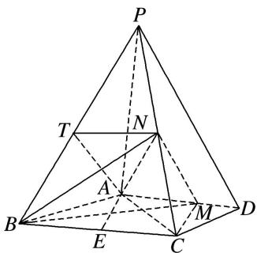  
（2）因为 $PA \perp$ 平面 $ABCD$ , $N$ 为 $PC$ 的中点, 所以 $N$ 到平面 $ABCD$ 的距离为 $\frac{1}{2} PA$ .

取 $BC$ 的中点 $E$ ，连接 $AE$ 。由 $AB = AC = 3$ 得 $AE \perp BC$ ， $AE = \sqrt{AB^2 - BE^2} = \sqrt{5}$ 。
由 $AM \parallel BC$ 得 $M$ 到 $BC$ 的距离为 $\sqrt{5}$ ，故 $S_{\triangle BCM} = \frac{1}{2} \times 4 \times \sqrt{5} = 2\sqrt{5}$ .
所以四面体 N-BCM 的体积 $V_{四面体 N-BCM}=\frac{1}{3}\times S_{\triangle BCM}\times\frac{PA}{2}=\frac{4\sqrt{5}}{3}$ .

[例 7]如图，在四棱锥 P-ABCD 中，平面 $PAB \perp$ 平面 ABCD，PA=PB，AD//BC，AB=AC， $AD=\frac{1}{2}BC=1$ ，PD=3， $\angle BAD=120^{\circ}$ ，M 为 PC 的中点.  
（1）证明：DM//平面PAB;   
（2）求四面体 MABD 的体积.

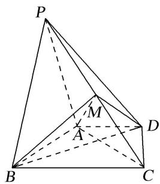

解析 （1）取 $PB$ 中点 $N$ , 连接 $MN$ , $AN$ . $\because M$ 为 $PC$ 的中点, $\therefore MN // BC$ 且 $MN = \frac{1}{2} BC$ ,
又 $AD \parallel BC$ ，且 $AD = \frac{1}{2} BC$ ，得 $MN$ 绣 $AD$ 。\$\therefore ADMN\$ 为平行四边形，\$\therefore DM \parallel AN\$.
又 $AN \subset$ 平面 PAB， $DM \notin$ 平面 PAB，∴ DM // 平面 PAB.  
（2）取 AB 中点 O，连接 PO，∵ PA = PB，∴ $PO \perp AB$ ，
又∵平面 $PAB \perp$ 平面 ABCD，平面 $PAB \cap$ 平面 ABCD = AB， $PO \subset$ 平面 PAB，
则 $PO \perp$ 平面 ABCD，取 BC 中点 H，连接 AH，
∵ AB = AC，∴ AH ⊥ BC，又∵ AD // BC，∠ BAD = 120°，
∴ $\angle ABC = 60^{\circ}$ ，Rt△ABH 中， $BH = \frac{1}{2} BC = 1$ ，AB = 2，∴ AO = 1，又 AD = 1，
$\triangle AOD$ 中，由余弦定理知， $OD = \sqrt{3}$ . Rt $\triangle POD$ 中， $PO = \sqrt{PD^2 - OD^2} = \sqrt{6}$
又 $S_{\triangle ABD} = \frac{1}{2} AB\cdot AD\sin 120^{\circ} = \frac{\sqrt{3}}{2},\therefore V_{M - ABD} = \frac{1}{3}\cdot S_{\triangle ABD}\cdot \frac{1}{2} PO = \frac{\sqrt{2}}{4}.$

[例 8]如图所示的几何体 P—ABCD 中，四边形 ABCD 为菱形， $\angle ABC=120^{\circ}$ ，AB=a， $PB=\sqrt{3}a$ ， $PB\perp AB$ ，平面 ABCD⊥平面 PAB， $AC\cap BD=O$ ，E 为 PD 的中点，G 为平面 PAB 内任一点.  
（1）在平面 $PAB$ 内，过 $G$ 点是否存在直线 $l$ 使 $OE \parallel l$ ? 如果不存在，请说明理由，如果存在，请说明作法；  
（2）过 A, C, E 三点的平面将几何体 P—ABCD 截去三棱锥 D—AEC，求剩余几何体 AECBP 的体积.

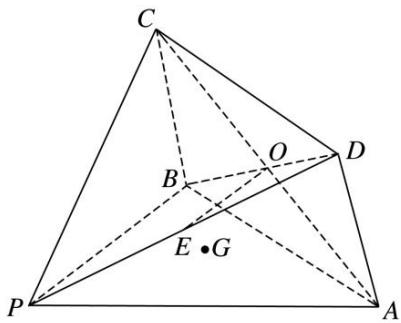

解析 （1） 过 G 点存在直线 l 使 $OE \parallel l$ ，理由如下：
由题意知 O 为 BD 的中点，又 E 为 PD 的中点，所以在 $\triangle PBD$ 中， $OE \parallel PB$ .
若点 G 在直线 PB 上，则直线 PB 即为所求的直线 l，所以有 $OE \parallel l$ ;
若点 G 不在直线 PB 上，在平面 PAB 内，过点 G 作直线 l，使 $l \parallel PB$ ，
又 $OE \parallel PB$ ，所以 $OE \parallel l$ ，即过 G 点存在直线 l 使 $OE \parallel l$ .

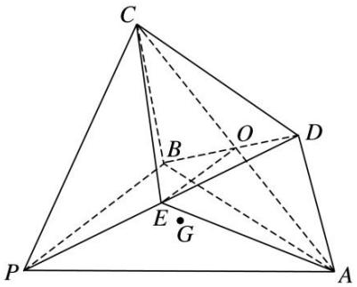  
（2）连接 EA, EC, 则平面 ACE 将几何体分成两部分: 三棱锥 D—AEC 与几何体 AECBP(如图所示).
因为平面 $ABCD \perp$ 平面 PAB，且交线为 AB，又 $PB \perp AB$ ， $PB \subset$ 平面 PAB，所以 $PB \perp$ 平面 ABCD.
故 $PB$ 为几何体 $P - ABCD$ 的高．又四边形 $ABCD$ 为菱形， $\angle ABC = 120^{\circ}$ ， $AB = a$ ， $PB = \sqrt{3} a$
所以 $S_{四边形ABCD}=2\times\frac{\sqrt{3}}{4}a^{2}=\frac{\sqrt{3}}{2}a^{2}$ ，所以 $V_{四棱锥P-ABCD}=\frac{1}{3}S_{四边形ABCD}\cdot PB=\frac{1}{3}\times\frac{\sqrt{3}}{2}a^{2}\times\sqrt{3}a=\frac{1}{2}a^{3}$ .
又 $OE \stackrel{//}{=} \frac{1}{2}PB$ ，所以 $OE \perp$ 平面 ACD，
所以 $V_{三棱锥 D—AEC}=V_{三棱锥 E—ACD}=\frac{1}{3}S_{\triangle ACD}\cdot EO=\frac{1}{4}V_{四棱锥 P—ABCD}=\frac{1}{8}a^{3}$ ,
所以几何体 AECBP 的体积 $V = V_{四棱锥 P-ABCD} - V_{三棱锥 D-EAC} = \frac{1}{2} a^{3} - \frac{1}{8} a^{3} = \frac{3}{8} a^{3}$ .

# 【对点训练】

1. 如图所示，在四棱锥 $P - ABCD$ 中，底面 $ABCD$ 为直角梯形， $\angle ABC = \angle BAD = 90^{\circ}$ ， $\triangle PDC$ 和 $\triangle BDC$ 均为等边三角形，且平面 $PDC \perp$ 平面 $BDC$ .  
（1）在棱 $PB$ 上是否存在点 $E$ , 使得 $AE \parallel$ 平面 $PDC$ ? 若存在, 试确定点 $E$ 的位置; 若不存在, 试说明理由:  
（2）若 $\triangle PBC$ 的面积为 $\frac{\sqrt{15}}{2}$ ，求四棱锥 $P-ABCD$ 的体积.

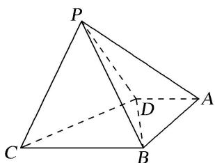

1. 解析 （1）存在．当点 E 为棱 PB 的中点，使得 AE// 平面 PDC．理由如下：
如图所示，取 PB 的中点 E，连接 AE，取 PC 的中点 F，连接 EF，DF，取 BC 的中点 G，连接 DG.

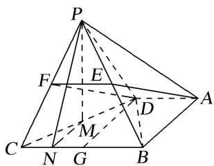
因为 $\triangle BCD$ 是等边三角形，所以 $\angle DGB=90^{\circ}$ .
因为 $\angle ABC = \angle BAD = 90^{\circ}$ ，所以四边形 ABGD 为矩形，所以 $AD = BG = \frac{1}{2} BC, AD \parallel BC.$
因为 EF 为 $\triangle BCP$ 的中位线，所以 $EF = \frac{1}{2} BC$ ，且 $EF \parallel BC$ ，故 AD = EF，且 $AD \parallel EF$ ，
所以四边形 ADFE 是平行四边形，从而 $AE \parallel DF$ ，
又 $AE \not\subset$ 平面 PDC， $DF \subset$ 平面 PDC，所以 $AE \parallel$ 平面 PDC.  
（2）取 CD 的中点 M，连接 PM，过点 P 作 $PN \perp BC$ 交 BC 于点 N，连接 MN，如图所示.
因为 $\triangle PDC$ 为等边三角形，所以 $PM\perp DC$ .
因为 $PM \perp DC$ ，平面 $PDC \perp$ 平面 BDC，平面 $PDC \cap$ 平面 BDC = DC， $PM \subset$ 平面 PDC，
所以 $PM \perp$ 平面 BCD，则 PM 为四棱锥 P-ABCD 的高.
又 $BC \subset$ 平面 BCD，所以 $PM \perp BC$ .
因为 $PN \perp BC$ ， $PN \cap PM = P$ ， $PN \subset$ 平面 PMN， $PM \subset$ 平面 PMN，所以 $BC \perp$ 平面 PMN.
因为 $MN \subset$ 平面 $PMN$ , 所以 $MN \perp BC$ . 由 $M$ 为 $DC$ 的中点, 易知 $NC = \frac{1}{4} BC$ .
设 BC=x，则 $\triangle PBC$ 的面积为 $\frac{x}{2}\sqrt{x^{2}-\left(\frac{x}{4}\right)^{2}}=\frac{\sqrt{15}}{2}$ ，解得 x=2，即 BC=2，
所以 AD=1，AB=DG=PM= $\sqrt{3}$ .
故四棱锥 P-ABCD 的体积为 $V=\frac{1}{3}\times S_{梯形ABCD}\times PM=\frac{1}{3}\times\frac{(1+2)\times\sqrt{3}}{2}\times\sqrt{3}=\frac{3}{2}$ .

2. 如图，在直三棱柱 $ABC-A_{1}B_{1}C_{1}$ 中， $\angle BAC=90^{\circ}$ ，AB=AC=2，点 M，N 分别为 $A_{1}C_{1}$ ， $AB_{1}$ 的中点.  
（1）证明： $MN \parallel$ 平面 $BB_{1}C_{1}C$ ;  
（2）若 $CM \perp MN$ ，求三棱锥 M—NAC 的体积.

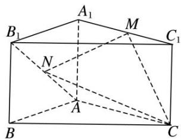

2. 解析 （1）连接 $A_{1}B, BC_{1}$ , 点 $M, N$ 分别为 $A_{1}C_{1}, AB_{1}$ 的中点,
所以 MN 为 $\triangle A_{1}BC_{1}$ 的一条中位线， $MN \parallel BC_{1}$ ，
又因为 $MN \not\subset$ 平面 $BB_{1}C_{1}C$ ， $BC_{1} \subset$ 平面 $BB_{1}C_{1}C$ ，所以 $MN \parallel$ 平面 $BB_{1}C_{1}C$ .

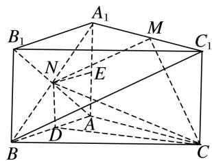  
（2）设点 D, E 分别为 AB, $AA_{1}$ 的中点, $AA_{1}=a$ , 连接 ND, CD, 则 $CM^{2}=a^{2}+1$ , $MN^{2}=1+\frac{a^{2}+4}{4}=\frac{a^{2}+8}{4}$ ,$CN^{2}=\frac{a^{2}}{4}+5=\frac{a^{2}+20}{4}$ ，由 $CM\perp MN$ ，得 $CM^{2}+MN^{2}=CN^{2}$ ，解得 $a=\sqrt{2}$ ，又 $NE\perp$ 平面 $AA_{1}C_{1}C$ ，NE=1，
$V _ {\text {三棱锥} M - N A C} = V _ {\text {三棱锥} N - A M C} = \frac {1}{3} S _ {\triangle A M C} \cdot N E = \frac {1}{3} \times \frac {1}{2} \times 2 \times \sqrt {2} \times 1 = \frac {\sqrt {2}}{3}.$
所以三棱锥 M—NAC 的体积为 $\frac{\sqrt{2}}{3}$ .

3. 如图，在棱长均为 4 的三棱柱 $ABC - A_{1}B_{1}C_{1}$ 中， $D$ ， $D_{1}$ 分别是 $BC$ 和 $B_{1}C_{1}$ 的中点.  
（1）求证： $A_{1}D_{1}$ // 平面 $AB_{1}D$ ;  
（2）若平面 $ABC \perp$ 平面 $BCC_{1}B_{1}$ ， $\angle B_{1}BC = 60^{\circ}$ ，求三棱锥 $B_{1} - ABC$ 的体积.

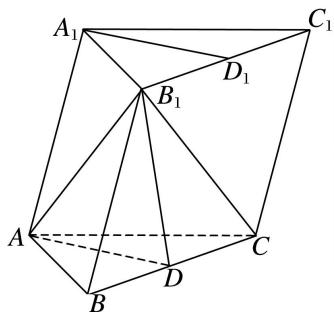

3. 解析 （1） 连接 $DD_{1}$ ，在三棱柱 $ABC-A_{1}B_{1}C_{1}$ 中，

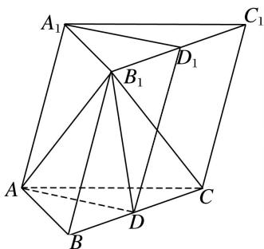
∵D， $D_{1}$ 分别是 BC 和 $B_{1}C_{1}$ 的中点，∴ $B_{1}D_{1}//BD$ ，且 $B_{1}D_{1}=BD$ ，∴四边形 $B_{1}BDD_{1}$ 为平行四边形，
$\therefore BB_{1} // DD_{1}$ ，且 $BB_{1}=DD_{1}$ 。又 $\because AA_{1} // BB_{1}$ ， $AA_{1}=BB_{1}$ ， $\therefore AA_{1} // DD_{1}$ ， $AA_{1}=DD_{1}$ ，
∴四边形 $AA_{1}D_{1}D$ 为平行四边形，∴ $A_{1}D_{1} // AD$ .
又∵ $A_{1}D_{1}\not\subset$ 平面 $AB_{1}D$ ， $AD\subset$ 平面 $AB_{1}D$ ，∴ $A_{1}D_{1}//$ 平面 $AB_{1}D$ .  
（2）在 $\triangle ABC$ 中，边长均为4，则 $AB=AC$ ， $D$ 为 $BC$ 的中点， $\therefore AD\perp BC$ .
∵平面 $ABC \perp$ 平面 $B_{1}C_{1}CB$ ，平面 $ABC \cap$ 平面 $B_{1}C_{1}CB = BC$ ， $AD \subset$ 平面 ABC，
∴ $AD \perp$ 平面 $B_{1}C_{1}CB$ ，即 AD 是三棱锥 $A - B_{1}BC$ 的高.
在 $\triangle ABC$ 中，由 $AB=AC=BC=4$ ，得 $AD=2\sqrt{3}$ ，在 $\triangle B_{1}BC$ 中， $B_{1}B=BC=4$ ， $\angle B_{1}BC=60^{\circ}$ ，
∴△B1BC的面积为 $4\sqrt{3}$ . ∴三棱锥B1-ABC的体积即为三棱锥A-B1BC的体积 $V=\frac{1}{3}\times4\sqrt{3}\times2\sqrt{3}=8$ .

4. 如图，三棱柱 $ABC-A_{1}B_{1}C_{1}$ 的各棱长均为 2， $AA_{1} \perp$ 平面 ABC，E，F 分别为棱 $A_{1}B_{1}$ ，BC 的中点.

①求证：直线 $BE \parallel$ 平面 $A_{1}FC_{1}$   
②平面 $A_{1}FC_{1}$ 与直线 AB 交于点 M，指出点 M 的位置，说明理由，并求三棱锥 B-EFM 的体积.

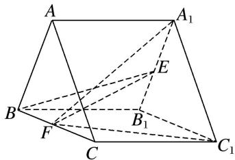

4. 解析 ①取 $A_{1}C_{1}$ 的中点 G，连接 EG，FG，

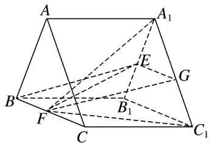
因为点 E 为 $A_{1}B_{1}$ 的中点，所以 $EG \parallel B_{1}C_{1}$ 且 $EG = \frac{1}{2}B_{1}C_{1}$ ,
因为 F 为 BC 的中点，所以 $BF \parallel B_{1}C_{1}$ 且 $BF = \frac{1}{2}B_{1}C_{1}$ ，所以 $BF \parallel EG$ 且 BF = EG.
所以四边形 BFGE 是平行四边形，所以 $BE \parallel FG$ ，又 $BE \nsubseteq$ 平面 $A_{1}FC_{1}$ ， $FG \subset$ 平面 $A_{1}FC_{1}$ ，所以直线 $BE \parallel$ 平面 $A_{1}FC_{1}$ .

②M 为棱 AB 的中点.

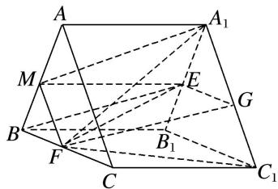

理由如下:
因为 $AC \parallel A_{1}C_{1}$ ， $AC \nparallel$ 平面 $A_{1}FC_{1}$ ， $A_{1}C_{1} \subset$ 平面 $A_{1}FC_{1}$ ，所以直线 $AC \parallel$ 平面 $A_{1}FC_{1}$ ，
又平面 $A_{1}FC_{1} \cap$ 平面 ABC = FM，所以 $AC \parallel FM$ 。又 F 为棱 BC 的中点，所以 M 为棱 AB 的中点。
$S _ {\triangle B F M} = \frac {1}{4} S _ {\triangle A B C} = \frac {1}{4} \times \frac {1}{2} \times 2 \times 2 \times \sin 6 0 ^ {\circ} = \frac {\sqrt {3}}{4},$
所以三棱锥 B-EFM 的体积 $V_{B-EFM}=V_{E-BFM}=\frac{1}{3}\times\frac{\sqrt{3}}{4}\times2=\frac{\sqrt{3}}{6}$ .

5. 在梯形 ABCD 中(图 1)， $AB \parallel CD$ ，AB=2，CD=5，过 A，B 分别作 CD 的垂线，垂足分别为 E，F，已知 DE=1，AE=2，将梯形 ABCD 沿 AE，BF 同侧折起，使得 $AF \perp BD$ ， $DE \parallel CF$ ，得空间几何体 ADE -BCF(图 2).  
（1）证明：BE//平面 ACD;  
（2）求三棱锥 E-ACD 的体积.
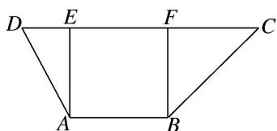

图1

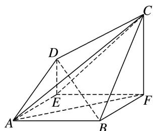

图2

5. 解析 （1） 连接 BE 交 AF 于点 O，取 AC 的中点 H，连接 OH，DH，则 OH 是 $\triangle AFC$ 的中位线，

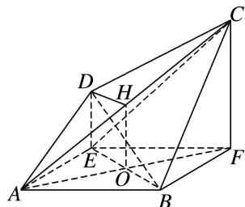
所以 $OH \parallel CF$ 且 $OH = \frac{1}{2}CF$ ，由已知得 $DE \parallel CF$ 且 $DE = \frac{1}{2}CF$ ，所以 $DE \parallel OH$ 且 DE = OH，
所以四边形 DEOH 为平行四边形，DH//EO，又因为 EO# 平面 ACD，DH⊂ 平面 ACD，
所以 EO// 平面 ACD，即 BE// 平面 ACD.  
（2）由已知得，四边形 ABFE 为正方形，且边长为 2，则 $AF \perp BE$ ，
由已知 $AF \perp BD, BE \cap BD = B, BE, BD \subset$ 平面 $BDE$ , 可得 $AF \perp$ 平面 $BDE$ ,
又 $DE \subset$ 平面 $BDE$ ，所以 $AF \perp DE$ ，又 $AE \perp DE$ ， $AF \cap AE = A$ ， $AF$ ， $AE \subset$ 平面 $ABFE$
所以 $DE \perp$ 平面 $ABFE$ ，又 $EF \subset$ 平面 $ABEF$ ，所以 $DE \perp EF$ ，四边形 $DEFC$ 是直角梯形，
又 $AE \perp EF, DE \cap EF = E, DE, EF \subset$ 平面 $CDE$ , 所以 $AE \perp$ 平面 $CDE$ ,
所以 $AE$ 是三棱锥 $A - DEC$ 的高， $V_{E - ACD} = V_{A - ECD} = V_{A - EFD} = \frac{1}{3} \times AE \times \frac{1}{2} \times DE \times EF = \frac{2}{3}$ .

6. 如图，在直三棱柱 $ABC - A_{1}B_{1}C_{1}$ 中， $AB = AC = 5$ ， $BB_{1} = BC = 6$ ， $D$ ， $E$ 分别是 $AA_{1}$ 和 $B_{1}C$ 的中点.  
（1）求证： $DE \parallel$ 平面 ABC;  
（2）求三棱锥 E-BCD 的体积.

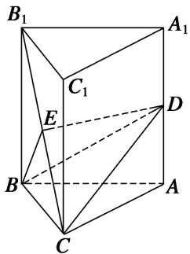

6. 解析 （1）取 $BC$ 中点 $G$ , 连接 $AG$ , $EG$ . 因为 $E$ 是 $B_{1}C$ 的中点, 所以 $EG \parallel BB_{1}$ , 且 $EG = \frac{1}{2} BB_{1}$ .
由直棱柱知， $AA_{1} \parallel BB_{1}$ ，而 $D$ 是 $AA_{1}$ 的中点，所以 $EG \parallel AD$ 。
所以四边形 $EGAD$ 是平行四边形，所以 $ED \parallel AG$ ，又 $DE \nsubseteq$ 平面 $ABC$ ， $AG \subset$ 平面 $ABC$
所以 DE// 平面 ABC.

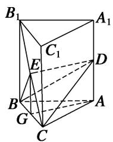  
（2）因为 $AD \parallel EG$ , $EG \subset$ 平面 $BCE$ , $AD \not\subset$ 平面 $BCE$ , 所以 $AD \parallel$ 平面 $BCE$ ,
所以 $V_{E-BCD}=V_{D-BEC}=V_{A-BCE}=V_{E-ABC}$ ，由（1）知，DE//平面 ABC.
所以 $V_{E-ABC}=V_{D-ABC}=\frac{1}{3}AD\cdot\frac{1}{2}BC\cdot AG=\frac{1}{6}\times3\times6\times4=12.$

7. 已知空间几何体 $ABCDE$ 中, $\triangle BCD$ 与 $\triangle CDE$ 均为边长为 2 的等边三角形, $\triangle ABC$ 为腰长为 3 的等腰三角形, 平面 $CDE \perp$ 平面 $BCD$ , 平面 $ABC \perp$ 平面 $BCD$ .  
（1）试在平面 BCD 内作一条直线，使得直线上任意一点 F 与 E 的连线 EF 均与平面 ABC 平行，并给出详细证明：  
（2）求三棱锥 E-ABC 的体积.

7. 解析 （1）如图所示, 取 $DC$ 的中点 $N$ , 取 $BD$ 的中点 $M$ , 连接 $MN$ , 则 $MN$ 即为所求直线.

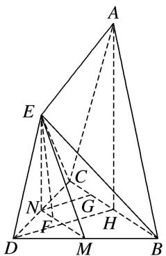
证明如下：

取 BC 的中点 H，连接 AH，∵△ABC 是腰长为 3 的等腰三角形，H 为 BC 的中点，∴AH⊥BC，又平面 ABC⊥平面 BCD，平面 ABC∩平面 BCD=BC，AH⊂平面 ABC，∴AH⊥平面 BCD，同理，可证 EN⊥平面 BCD，∴EN∥AH，
∵EN∉平面ABC，AH⊂平面ABC，∴EN//平面ABC.
又 M, N 分别为 BD, DC 的中点，∴ $MN \parallel BC$ ，∵ $MN \not\subset$ 平面 ABC， $BC \subset$ 平面 ABC，∴ $MN \parallel$ 平面 ABC.
又 $MN \cap EN = N$ ， $MN \subset$ 平面 EMN， $EN \subset$ 平面 EMN，∴平面 EMN// 平面 ABC，
又 $EF \subset$ 平面 EMN，∴EF// 平面 ABC.  
（2）连接 DH，取 CH 的中点 G，连接 NG，则 $NG \parallel DH$ ， $NG = \frac{1}{2}DH$ ，由（1）可知 EN // 平面 ABC，所以点 E 到平面 ABC 的距离与点 N 到平面 ABC 的距离相等.
又 $\triangle BCD$ 是边长为2的等边三角形， $\therefore DH\perp BC, DH=\sqrt{3}$ ,
又平面 $ABC \perp$ 平面 BCD，平面 $ABC \cap$ 平面 BCD = BC，DH ⊂ 平面 BCD，
∴DH⊥平面ABC，∴NG⊥平面ABC，NG= $\frac{\sqrt{3}}{2}$ ,
又 AC=AB=3, BC=2, $\therefore S_{\triangle ABC}=\frac{1}{2}\cdot BC\cdot AH=2\sqrt{2}$ . $\therefore V_{E-ABC}=V_{N-ABC}=\frac{1}{3}\cdot S_{\triangle ABC}\cdot NG=\frac{\sqrt{6}}{3}$ .

8. 如图，在四边形 $ABCD$ 中， $AB \parallel CD$ ， $BC = CD = DA = \frac{1}{2} AB = 2$ ，点 $E$ 为 $AB$ 的中点，以 $DE$ 为折痕将 $\triangle ADE$ 折起，使点 $A$ 到达点 $P$ 的位置，平面 $PDE \perp$ 平面 $BCDE$ ，点 $F$ 为 $PB$ 的中点.  
（1）求证： $PD \parallel$ 平面 CEF;  
（2）求三棱锥 P-DEF 的体积.

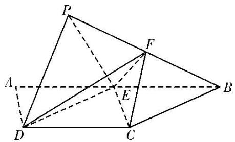

8. 解析 （1）因为点 E 为 AB 的中点， $AB \parallel CD$ ，AB = 2CD，所以 BE = CD 且 $BE \parallel CD$ ，
所以四边形 BCDE 是平行四边形．连接 BD 交 CE 于点 O，则点 O 为 BD 的中点，连接 FO，
因为点 F 为 PB 的中点，所以 PD // FO，又 PD ⊥ 平面 CEF，FO ⊂ 平面 CEF，所以 PD // 平面 CEF.  
（2）由（1）可知 $PD \parallel FO$ , $FO \nmid$ 平面 $PDE$ , 所以 $FO \parallel$ 平面 $PDE$ ,
所以点 $F$ 到平面 $PDE$ 的距离与点 $O$ 到平面 $PDE$ 的距离相等．连接 $OP$ ，则
$V_{P-DEF}=V_{F-PDE}=V_{O-PDE}=V_{P-ODE}$ . 由题意及四边形 BCDE 是平行四边形得
$BC = CD = PD = PE = BE = DE = 2$ ，取 $DE$ 的中点 $H$ ，连接 $PH$ ，则 $PH \perp DE$ ，且 $PH = \sqrt{3}$
因为平面 $PDE \perp$ 平面 BCDE，平面 $PDE \cap$ 平面 BCDE = DE， $PH \subset$ 平面 PDE，所以 $PH \perp$ 平面 BCDE.
由题意得四边形 ABCD 为等腰梯形且 $\angle ABC = 60^{\circ}$ ，又四边形 BCDE 为菱形，所以 $\angle EDC = 60^{\circ}$ ，
所以 $S_{\triangle ODE}=\frac{1}{2}S_{\triangle DEC}=\frac{1}{2}\times\frac{1}{2}\times2\times2\times\sin60^{\circ}=\frac{\sqrt{3}}{2}$ ，所以 $V_{P-DEF}=V_{P-ODE}=\frac{1}{3}S_{\triangle ODE}\times PH=\frac{1}{3}\times\frac{\sqrt{3}}{2}\times\sqrt{3}=\frac{1}{2}$ .

9. 如图，在四棱锥 $P - ABCD$ 中， $PD \perp$ 底面 $ABCD, AB \parallel CD, AB = 2, CD = 3, M$ 为 $PC$ 上一点，且 $PM = 2MC$ .  
（1）求证： $BM \parallel$ 平面 PAD;  
（2）若 AD=2, PD=3, $\angle BAD=\frac{\pi}{3}$ ，求三棱锥 P-ADM 的体积.

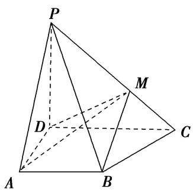

9. 解析：（1）证明：法一：如图，过 $M$ 作 $MN \parallel CD$ 交 $PD$ 于点 $N$ ，连接 $AN$ .

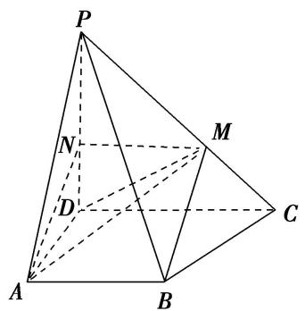
∵PM=2MC, ∴MN= $\frac{2}{3}$ CD. 又 AB= $\frac{2}{3}$ CD, 且 AB//CD, ∴AB∥MN, ∴四边形 ABMN 为平行四边形,
∴BM//AN. 又 BM∉平面 PAD, AN⊂平面 PAD, ∴BM//平面 PAD.

法二：如图，过点 M 作 $MN \perp CD$ 于点 N，N 为垂足，连接 BN．由题意，PM = 2MC，则 DN = 2NC，

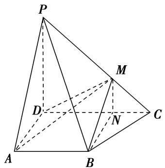
又 $AB \parallel CD, AB = \frac{2}{3} CD, \therefore AB \parallel DN, \therefore$ 四边形 $ABND$ 为平行四边形， $\therefore BN \parallel AD.$
∵PD⊥平面ABCD，DC⊂平面ABCD，∴PD⊥DC.
又 $MN \perp DC$ ， $MN \subset$ 平面 $PDC$ ， $\therefore PD \parallel MN$ 。 $\because BN \subset$ 平面 $MBN$ ， $MN \subset$ 平面 $MBN$ ， $BN \cap MN = N$ ， $AD \subset$ 平面 $PAD$ ， $PD \subset$ 平面 $PAD$ ， $AD \cap PD = D$ ， $\therefore$ 平面 $MBN \parallel$ 平面 $PAD$ 。
∵BM⊂平面 MBN，∴BM∥平面 PAD.

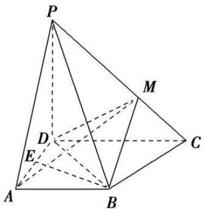  
（2）如图，过 B 作 AD 的垂线，垂足为 E．∵PD⊥平面 ABCD，BE⊂平面 ABCD，∴PD⊥BE．又 AD⊂平面 PAD，PD⊂平面 PAD，AD∩PD=D，∴BE⊥平面 PAD．由（1）知，BM∥平面 PAD，∴点 M 到平面 PAD 的距离等于点 B 到平面 PAD 的距离，即 BE．

连接 BD，在 $\triangle ABD$ 中，AB = AD = 2， $\angle BAD = \frac{\pi}{3}$ ， $\therefore BE = \sqrt{3}$ ，
则三棱锥 P-ADM 的体积 $V_{P-ADM}=V_{M-PAD}=\frac{1}{3}\times S_{\triangle PAD}\times BE=\frac{1}{3}\times3\times\sqrt{3}=\sqrt{3}$ .

10. 如图，在四棱锥 $P - ABCD$ 中，平面 $PAD \perp$ 平面 $ABCD$ ，底面 $ABCD$ 为梯形， $AB \parallel CD$ ， $AB = 2DC = 2\sqrt{3}$ ，且 $\triangle PAD$ 与 $\triangle ABD$ 均为正三角形， $E$ 为 $AD$ 的中点， $G$ 为 $\triangle PAD$ 的重心.  
（1）求证： $GF \parallel$ 平面 PDC;  
（2）求三棱锥 G—PCD 的体积.

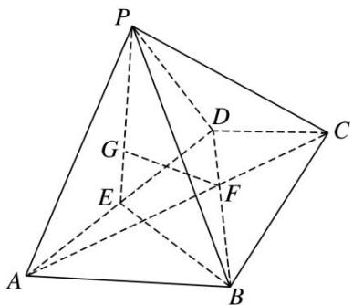

10. 解析 （1）方法一 连接 AG 并延长交 PD 于点 H，连接 CH.

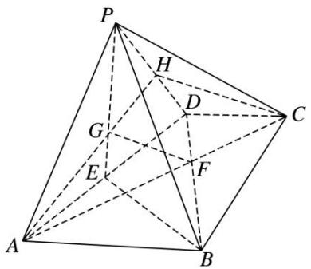
由梯形 $ABCD$ 中 $AB \parallel CD$ 且 $AB = 2DC$ 知， $\frac{AF}{FC} = \frac{2}{1}$ . 又 $E$ 为 $AD$ 的中点， $G$ 为 $\triangle PAD$ 的重心， $\therefore \frac{AG}{GH} = \frac{2}{1}$ . 在 $\triangle AHC$ 中， $\frac{AG}{GH} = \frac{AF}{FC} = \frac{2}{1}$ ，故 $GF \parallel HC$ . 又 $HC \subset$ 平面 $PCD$ ， $GF \notin$ 平面 $PCD$ ， $\therefore GF \parallel$ 平面 $PDC$ . 方法二 过 $G$ 作 $GN \parallel AD$ 交 $PD$ 于 $N$ ，过 $F$ 作 $FM \parallel AD$ 交 $CD$ 于 $M$ ，连接 $MN$ ，

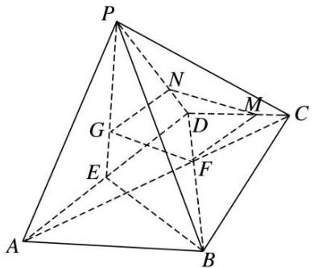
∵ G 为 $\triangle PAD$ 的重心， $\frac{GN}{ED} = \frac{PG}{PE} = \frac{2}{3}$ ，∴ $GN = \frac{2}{3} ED = \frac{2\sqrt{3}}{3}$ .
又 ABCD 为梯形， $AB \parallel CD$ ， $\frac{CD}{AB} = \frac{1}{2}$ ， $\therefore \frac{CF}{AF} = \frac{1}{2}$ ， $\therefore \frac{MF}{AD} = \frac{1}{3}$ ， $\therefore MF = \frac{2\sqrt{3}}{3}$ ， $\therefore GN = FM$ .
又由所作 $GN \parallel AD$ ， $FM \parallel AD$ ，得 $GN \parallel FM$ ， $\therefore$ 四边形 $GNMF$ 为平行四边形.
∴GF//MN，又∵GF∉平面PCD，MN⊂平面PCD，∴GF//平面PDC.
方法三 过 G 作 GK//PD 交 AD 于 K，连接 KF，GK，

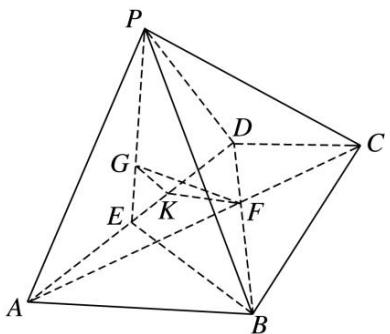
由 $\triangle PAD$ 为正三角形，E为AD的中点，G为 $\triangle PAD$ 的重心，得 $DK=\frac{2}{3}DE,\therefore DK=\frac{1}{3}AD,$ 又由梯形 ABCD 中 $AB \parallel CD$ ，且 AB = 2DC，知 $\frac{AF}{FC} = \frac{2}{1}$ ，即 $FC = \frac{1}{3} AC$ ，∴在 $\triangle ADC$ 中， $KF\parallel CD$ ，又∵ $GK\cap KF=K,\quad PD\cap CD=D,\quad\therefore$ 平面 $GKF\parallel$ 平面PDC，又 $GF \subset$ 平面 GKF，∴ $GF \parallel$ 平面 PDC.  
（2）方法一 由平面 $PAD \perp$ 平面 $ABCD$ ， $\triangle PAD$ 与 $\triangle ABD$ 均为正三角形， $E$ 为 $AD$ 的中点，知 $PE \perp AD$ ， $BE \perp AD$ ，又∵平面 $PAD \cap$ 平面 $ABCD = AD$ ， $PE \subset$ 平面 $PAD$ ，∴ $PE \perp$ 平面 $ABCD$ ，且 $PE = 3$ ，
由（1）知 $GF / /$ 平面 $PDC$ ， $\therefore V_{\text{三棱锥} G - PCD} = V_{\text{三棱锥} F - PCD} = V_{\text{三棱锥} P - CDF} = \frac{1}{3}\times PE\times S_{\triangle CDF}.$
又由梯形 ABCD 中 $AB \parallel CD$ ，且 $AB = 2DC = 2\sqrt{3}$ ，知 $DF = \frac{1}{3}BD = \frac{2\sqrt{3}}{3}$ ,
又△ABD为正三角形，得∠CDF=∠ABD=60°，∴ $S_{\triangle CDF}=\frac{1}{2}\times CD\times DF\times\sin\angle BDC=\frac{\sqrt{3}}{2}$
得 $V_{三棱锥 P—CDF}=\frac{1}{3}\times PE\times S_{\triangle CDF}=\frac{\sqrt{3}}{2}, \therefore$ 三棱锥 G—PCD 的体积为 $\frac{\sqrt{3}}{2}.$
方法二 由平面 $PAD \perp$ 平面 $ABCD$ , $\triangle PAD$ 与 $\triangle ABD$ 均为正三角形, $E$ 为 $AD$ 的中点, 知
$PE \perp AD, BE \perp AD,$ 又∵平面 $PAD \cap$ 平面 $ABCD = AD, PE \subset$ 平面 $PAD, \therefore PE \perp$ 平面 $ABCD,$ 且 $PE = 3,$ 连接 CE，∵PG= $\frac{2}{3}$ PE，∴V 三棱锥 G—PCD= $\frac{2}{3}$ V 三棱锥 E—PCD= $\frac{2}{3}$ V 三棱锥 P—CDE= $\frac{2}{3}\times\frac{1}{3}\times$ PE×S△CDE，
又 $\triangle ABD$ 为正三角形，得 $\angle EDC=120^{\circ}$ ，得 $S_{\triangle CDE}=\frac{1}{2}\times CD\times DE\times\sin\angle EDC=\frac{3\sqrt{3}}{4}$ .
$\therefore V_{\text{三棱锥} G-PCD}=\frac{2}{3}\times\frac{1}{3}\times PE\times S_{\triangle CDE}=\frac{2}{3}\times\frac{1}{3}\times 3\times\frac{3\sqrt{3}}{4}=\frac{\sqrt{3}}{2}, \therefore$ 三棱锥 $G-PCD$ 的体积为 $\frac{\sqrt{3}}{2}$ .

11. 如图所示的五面体 $ABEDFC$ 中, 四边形 $ACFD$ 是等腰梯形, $AD \parallel FC$ , $\angle DAC = 60^{\circ}$ , $BC \perp$ 平面 $ACFD$ , $CA = CB = CF = 1$ , $AD = 2CF$ , 点 $G$ 为 $AC$ 的中点.  
（1）在 $AD$ 上是否存在一点 $H$ , 使 $GH \parallel$ 平面 $BCD$ ? 若存在, 指出点 $H$ 的位置并给出证明; 若不存在,说明理由;  
（2）求三棱锥 G-ECD 的体积.

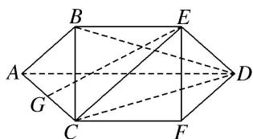

11. 解析 （1）存在点 $H$ 使 $GH \parallel$ 平面 $BCD$ , 此时 $H$ 为 $AD$ 的中点. 证明如下.

取点 $H$ 为 $AD$ 的中点，连接 $GH$ ，因为点 $G$ 为 $AC$ 的中点，
所以在 $\triangle ACD$ 中，由三角形中位线定理可知GH//CD，
又 $GH \notin$ 平面 $BCD, CD \subset$ 平面 $BCD$ , 所以 $GH \parallel$ 平面 $BCD$ .

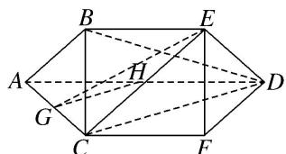  
（2）因为 $AD \parallel CF$ ， $AD \subset$ 平面 ADEB， $CF \notin$ 平面 ADEB，所以 $CF \parallel$ 平面 ADEB，
因为 $CF \subset$ 平面 $CFEB$ , 平面 $CFEB \cap$ 平面 $ADEB = BE$ , 所以 $CF \parallel BE$ ,
又 $CF \subset$ 平面 $ACFD$ , $BE \notin$ 平面 $ACFD$ , 所以 $BE //$ 平面 $ACFD$ , 所以 $V_{G-ECD} = V_{E-GCD} = V_{B-GCD}$ .
因为四边形 $ACFD$ 是等腰梯形， $\angle DAC = 60^{\circ}$ ， $AD = 2CF = 2AC$ ，所以 $\angle ACD = 90^{\circ}$
又 CA=CB=CF=1，所以 $CD=\sqrt{3}$ ， $CG=\frac{1}{2}$ ，又 BC⊥平面 ACFD，
所以 $V_{B - GCD} = \frac{1}{3}\times \frac{1}{2} CG\times CD\times BC = \frac{1}{3}\times \frac{1}{2}\times \frac{1}{2}\times \sqrt{3}\times 1 = \frac{\sqrt{3}}{12}.$ 所以三棱锥 $G - ECD$ 的体积为 $\frac{\sqrt{3}}{12}$

12. 如图，在四棱锥 P-ABCD 中，底面 ABCD 为菱形，PA⊥平面 ABCD，E 为 PD 的中点.  
（1）证明： $PB \parallel$ 平面 ACE;  
（2）设 $PA = 1$ ， $AD = \sqrt{3}$ ， $PC = PD$ ，求三棱锥 $P - ACE$ 的体积.

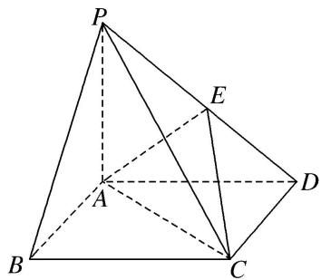

12. 解析 （1） 连接 BD 交 AC 于点 O，连接 OE.
在 $\triangle PBD$ 中，PE=DE，BO=DO，所以PB//OE.
又 $OE \subset$ 平面 ACE， $PB \not\subset$ 平面 ACE，所以 PB // 平面 ACE.

  
（2）由题意得 AC=AD，所以 $V_{P-ACE}=\frac{1}{2}V_{P-ACD}=\frac{1}{4}V_{P-ABCD}=\frac{1}{4}\times\frac{1}{3}S_{\square ABCD}\cdot PA=\frac{1}{4}\times\frac{1}{3}\times2\times\frac{\sqrt{3}}{4}\times(\sqrt{3})^{2}\times1=\frac{\sqrt{3}}{8}.$

13. 如图，侧棱与底面垂直的四棱柱 $ABCD - A_1B_1C_1D_1$ 的底面是梯形， $AB \parallel CD$ ， $AB \perp AD$ ， $AA_1 = 4$ ， $DC = 2AB$ ， $AB = AD = 3$ ，点 $M$ 在棱 $A_1B_1$ 上，且 $A_1M = \frac{1}{3} A_1B_1$ 。已知点 $E$ 是直线 $CD$ 上的一点， $AM \parallel$ 平面 $BC_1E$ 。  
（1）试确定点 E 的位置，并说明理由；  
（2）求三棱锥 $M-BC_{1}E$ 的体积.

13. 解析 （1） 点 E 在线段 CD 上且 EC=1，理由如下：
在棱 $C_{1}D_{1}$ 上取点 N，使得 $D_{1}N=A_{1}M=1$ ，连接 MN，DN，
因为 $D_{1}N \parallel A_{1}M$ ，所以四边形 $D_{1}NMA_{1}$ 为平行四边形，所以 $MN \parallel A_{1}D_{1} \parallel AD$ .
所以四边形 AMND 为平行四边形，所以 AM//DN.
因为 CE=1，所以易知 $DN \parallel EC_{1}$ ，所以 $AM \parallel EC_{1}$ ，
又 $AM \not\subset$ 平面 $BC_{1}E$ ， $EC_{1} \subset$ 平面 $BC_{1}E$ ，所以 $AM \parallel$ 平面 $BC_{1}E$ .
故点 E 在线段 CD 上且 EC=1.

  
（2）由（1）知， $AM \parallel$ 平面 $BC_{1}E$ ，所以 $V_{M-BC_{1}E}=V_{A-BC_{1}E}=V_{C_{1}-ABE}=\frac{1}{3}\times\left(\frac{1}{2}\times3\times3\right)\times4=6.$

14. 如图，菱形 ABCD 的边长为 a， $\angle D=60^{\circ}$ ，点 H 为 DC 的中点，现以线段 AH 为折痕将 $\triangle DAH$ 折起使得点 D 到达点 P 的位置，且平面 PHA⊥平面 ABCH，点 E，F 分别为 AB，AP 的中点.  
（1）求证：平面 $PBC \parallel$ 平面 $EFH$ ;  
（2）若三棱锥 P-EFH 的体积等于 $\frac{\sqrt{3}}{12}$ ，求 a 的值.

14. 解析 （1）因为在菱形 $ABCD$ 中， $E, H$ 分别为 $AB, CD$ 的中点，所以 $BE \parallel CH$ 且 $BE = CH$ 所以四边形 $BCHE$ 为平行四边形，则 $BC \parallel EH$
又 $EH \nmid$ 平面 $PBC$ ，所以 $EH \parallel$ 平面 $PBC$ 。因为点 $E$ ， $F$ 分别为 $AB$ ， $AP$ 的中点，所以 $EF \parallel BP$ ，又 $EF \nmid$ 平面 $PBC$ ，所以 $EF \parallel$ 平面 $PBC$ 。又 $EF \cap EH = E$ ，所以平面 $PBC \parallel$ 平面 $EFH$ 。  
（2）在菱形 ABCD 中， $\angle D=60^{\circ}$ ，则 $\triangle ACD$ 为正三角形，
所以 $AH \perp CD$ ，DH = PH = CH = $\frac{1}{2}a$ ， $AH = \frac{\sqrt{3}}{2}a$ ，折叠后， $PH \perp AH$ ，
又平面 $PHA \perp$ 平面 ABCH，平面 $PHA \cap$ 平面 ABCH = AH， $PH \subset$ 平面 PHA，从而 $PH \perp$ 平面 ABCH.
在 $\triangle PAE$ 中，点F为AP的中点，则 $S_{\triangle PEF}=S_{\triangle AEF}$ ，
所以 $V_{H-PEF}=V_{H-AEF}=\frac{1}{2}V_{H-PAE}=\frac{1}{2}V_{P-AEH}=\frac{1}{2}\times\frac{1}{3}S_{\triangle AEH}\cdot PH=\frac{1}{2}\times\frac{1}{3}\times\frac{1}{2}\times\frac{1}{2}a\times\frac{\sqrt{3}}{2}a\times\frac{1}{2}a=\frac{\sqrt{3}}{96}a^{3}=\frac{\sqrt{3}}{12},$
所以 $a^{3}=8$ ，故 a=2。

#### 2. 线线垂直+体积模型

# 【例题选讲】

[例 1]在三棱锥 P-ABC 中， $\triangle PAB$ 是等边三角形， $\angle APC = \angle BPC = 60^{\circ}$ .  
（1）求证： $AB \perp PC;$  
（2）若 $PB = 4$ ， $BE\bot PC$ ，求三棱锥 $B - PAE$ 的体积.

解析 （1）因为 $\triangle PAB$ 是等边三角形， $\angle APC=\angle BPC=60^{\circ}$ ，所以 $\triangle PBC\cong\triangle PAC$ ，所以 $AC=BC$ .
如图，取 AB 的中点 D，连接 PD, CD，则 $PD \perp AB$ ， $CD \perp AB$ ，因为 $PD \cap CD = D$ ，所以 $AB \perp$ 平面 PDC，因为 $PC \subset$ 平面 PDC，所以 $AB \perp PC$ 。

  
（2）由（1）知， $AB \perp PC$ ，又 $BE \perp PC$ ， $AB \cap BE = B$ ，所以 $PC \perp$ 平面 ABE，所以 $PC \perp AE$ .
因为 PB=4，所以在 Rt△PEB 中， $BE=4\sin60^{\circ}=2\sqrt{3}$ ， $PE=4\cos60^{\circ}=2$ ，
在 Rt△PEA 中， $AE=PE\tan60^{\circ}=2\sqrt{3}$ ，所以 $AE=BE=2\sqrt{3}$ ，所以 $S_{\triangle ABE}=\frac{1}{2}\cdot AB\cdot\sqrt{BE^{2}-\left(\frac{1}{2}AB\right)^{2}}=4\sqrt{2}$ .所以三棱锥 B-PAE 的体积 $V_{B-PAE}=V_{P-ABE}=\frac{1}{3}S_{\triangle AEB}\cdot PE=\frac{1}{3}\times4\sqrt{2}\times2=\frac{8\sqrt{2}}{3}.$

[例 2]如图，在三棱锥 S—ABC 中，SA=SB，AC=BC，O 为 AB 的中点，SO⊥平面 ABC，AB=4，OC=2，N 是 SA 的中点，CN 与 SO 所成的角为 $\alpha$ ，且 $\tan\alpha=2$ .  
（1）证明： $OC \perp ON;$  
（2）求三棱锥 S—ABC 的体积.

解析 （1）∵AC=BC，O为AB的中点，∴OC⊥AB，又SO⊥平面ABC，OC⊂平面ABC，
∴ OC ⊥ SO，又 AB ∩ SO = O，AB，SO ⊂ 平面 SAB，∴ OC ⊥ 平面 SAB，
又∵ON⊂平面SAB，∴OC⊥ON.

  
（2）设 $OA$ 的中点为 $M$ , 连接 $MN, MC$ , 则 $MN \parallel SO$ , 故 $\angle CNM$ 即为 $CN$ 与 $SO$ 所成的角 $\alpha$ ,
又 $MC \perp MN$ 且 $\tan \alpha = 2,\quad \therefore MC = 2MN = SO,$ 又 $MC = \sqrt{OC^{2} + OM^{2}} = \sqrt{2^{2} + 1^{2}} = \sqrt{5},$ 即 $SO = \sqrt{5},$ ∴三棱锥 S—ABC 的体积 $V=\frac{1}{3}Sh=\frac{1}{3}\cdot\frac{1}{2}\cdot2\cdot4\cdot\sqrt{5}=\frac{4\sqrt{5}}{3}$ .

[例 3](2016·全国Ⅱ)如图，菱形 ABCD 的对角线 AC 与 BD 交于点 O，点 E，F 分别在 AD，CD 上，AE = CF，EF 交 BD 于点 H，将 $\triangle DEF$ 沿 EF 折到 $\triangle D'EF$ 的位置.  
（1）证明： $AC \perp HD'$ ;  
（2）若 $AB = 5$ ， $AC = 6$ ， $AE = \frac{5}{4}$ ， $OD' = 2\sqrt{2}$ ，求五棱锥 $D' - ABCFE$ 的体积.

解析 （1）由已知得 $AC \perp BD$ ， $AD = CD$ ，又由 $AE = CF$ 得 $\frac{AE}{AD} = \frac{CF}{CD}$ ，故 $AC // EF$ ，由此得 $EF \perp HD$ ，故 $EF \perp HD'$ ，所以 $AC \perp HD'$ .  
（2）由 $EF \parallel AC$ 得 $\frac{OH}{DO} = \frac{AE}{AD} = \frac{1}{4}$ . 由 $AB = 5$ , $AC = 6$ 得 $DO = BO = \sqrt{AB^2 - AO^2} = 4$ ,
所以 $OH = 1$ ， $D'H = DH = 3$ ，于是 $OD^{' 2} + OH^{2} = (2\sqrt{2})^{2} + 1^{2} = 9 = D'H^{2}$ ，故 $OD' \perp OH$
由（1）知 $AC \perp HD'$ ，又 $AC \perp BD$ ， $BD \cap HD' = H$ ，所以 $AC \perp$ 平面 $BHD'$ ，于是 $AC \perp OD'$ ，
又由 $OD'\perp OH$ ， $AC\cap OH=O$ ，所以 $OD'\perp$ 平面 ABC．又由 $\frac{EF}{AC}=\frac{DH}{DO}$ 得 $EF=\frac{9}{2}$ .

五边形 ABCFE 的面积 $S=\frac{1}{2}\times6\times8-\frac{1}{2}\times\frac{9}{2}\times3=\frac{69}{4}$ .
所以五棱锥 $D' - ABCFE$ 的体积 $V = \frac{1}{3} \times \frac{69}{4} \times 2\sqrt{2} = \frac{23\sqrt{2}}{2}$ .

[例 4] (2017·全国III)如图，四面体 ABCD 中， $\triangle ABC$ 是正三角形，AD=CD.  
（1）证明： $AC \perp BD;$  
（2）已知 $\triangle ACD$ 是直角三角形, $AB=BD$ ,若 $E$ 为棱 $BD$ 上与 $D$ 不重合的点,且 $AE\perp EC$ ,求四面体 $ABCE$ 与四面体 $ACDE$ 的体积比.

解析 （1）证明：取 $AC$ 的中点 $O$ ，连接 $DO$ ， $BO$ 。因为 $AD = CD$ ，所以 $AC \perp DO$ . 又由于 $\triangle ABC$ 是正三角形，所以 $AC \perp BO$ 。从而 $AC \perp$ 平面 $DOB$ ，故 $AC \perp BD$ 。
  
（2）连接 EO. 由（1）及题设知 $\angle ADC = 90^{\circ}$ ，所以 DO = AO。在 Rt△AOB 中， $BO^{2} + AO^{2} = AB^{2}$ ，又 AB = BD，所以 $BO^{2} + DO^{2} = BO^{2} + AO^{2} = AB^{2} = BD^{2}$ ，故 $\angle DOB = 90^{\circ}$ 。
由题设知 $\triangle AEC$ 是直角三角形，所以 $EO = \frac{1}{2} AC$ 。又 $\triangle ABC$ 是正三角形，且 $AB = BD$ ，
所以 $EO=\frac{1}{2}BD$ 。故 E 为 BD 的中点，从而 E 到平面 ABC 的距离为 D 到平面 ABC 的距离的 $\frac{1}{2}$

四面体 ABCE 的体积为四面体 ABCD 的体积的 $\frac{1}{2}$ ，即四面体 ABCE 与四面体 ACDE 的体积之比为 1:1.

[例 5]如图，在 Rt△ABC 中，AB=BC=4，点 E 在线段 AB 上．过点 E 作 EF∥BC 交 AC 于点 F，将 △AEF 沿 EF 折起到 △PEF 的位置(点 A 与 P 重合)，使得 ∠PEB=30°.  
（1）求证： $EF \perp PB;$  
（2）试问: 当点 $E$ 在何处时, 四棱锥 $P - EFCB$ 的侧面 $PEB$ 的面积最大? 并求此时四棱锥 $P - EFCB$ 的体积.

解析 （1）∵EF//BC且BC⊥AB，∴EF⊥AB，即EF⊥BE，EF⊥PE.又BE∩PE=E,
∴EF⊥平面PBE，又PB⊂平面PBE，∴EF⊥PB.  
（2）设 BE=x, PE=y，则 $x+y=4$ . $\therefore S_{\triangle PEB}=\frac{1}{2}BE\cdot PE\cdot\sin\angle PEB=\frac{1}{4}xy\leqslant\frac{1}{4}\left(\frac{x+y}{2}\right)^{2}=1$ .
当且仅当 x=y=2 时， $S_{\triangle PEB}$ 的面积最大．此时，BE=PE=2.
由（1）知 $EF \perp$ 平面 PBE，∴平面 $PBE \perp$ 平面 EFCB，
在平面 PBE 中，作 $PO \perp BE$ 于 O，则 $PO \perp$ 平面 EFCB。即 PO 为四棱锥 P—EFCB 的高。
又 $PO = PE \cdot \sin 30^{\circ} = 2 \times \frac{1}{2} = 1$ . $S_{EFCB} = \frac{1}{2} \times (2 + 4) \times 2 = 6$ . $\therefore V_{P - BCFE} = \frac{1}{3} \times 6 \times 1 = 2$ .

#### 3. 线面垂直+体积模型

# 【例题选讲】

[例 1]如图 1，在直角梯形 ABCD 中， $AD \parallel BC$ ， $\angle BAD = \frac{\pi}{2}$ ， $AB = BC = \frac{1}{2}AD = a$ ，E 是 AD 的中点，O 是 AC 与 BE 的交点．将 $\triangle ABE$ 沿 BE 折起到图 2 中 $\triangle A_{1}BE$ 的位置，得到四棱锥 $A_{1} - BCDE$ .  
（1）证明： $CD \perp$ 平面 $A_{1}OC$ ;  
（2）当平面 $A_{1}BE \perp$ 平面 BCDE 时，四棱锥 $A_{1}-BCDE$ 的体积为 $36\sqrt{2}$ ，求 a 的值.

图1

图2

解析 （1）在图 1 中，因为 $AB = BC = \frac{1}{2} AD = a$ ， $E$ 是 $AD$ 的中点， $\angle BAD = \frac{\pi}{2}$ ，所以 $BE \perp AC$ ，即在图 2 中， $BE \perp A_{1}O$ ， $BE \perp OC$ ，从而 $BE \perp$ 平面 $A_{1}OC$ 。又 $CD \parallel BE$ ，所以 $CD \perp$ 平面 $A_{1}OC$ 。  
（2）由已知，平面 $A_{1}BE \perp$ 平面 BCDE，又由（1）知， $OA_{1} \perp BE$ ，所以 $A_{1}O \perp$ 平面 BCDE，
即 $A_{1}O$ 是四棱锥 $A_{1}-BCDE$ 的高，由图 1 可知， $A_{1}O=\frac{\sqrt{2}}{2}AB=\frac{\sqrt{2}}{2}a$ 平行四边形 BCDE 的面积 $S=BC\cdot AB=a^{2}$ ,
从而四棱锥 $A_{1}-BCDE$ 的体积为 $V=\frac{1}{3}\times S\times A_{1}O=\frac{1}{3}\times a^{2}\times\frac{\sqrt{2}}{2}a=\frac{\sqrt{2}}{6}a^{3}$ ，由 $\frac{\sqrt{2}}{6}a^{3}=36\sqrt{2}$ ，得 a=6.

[例 2]如图①, 在直角梯形 $ABCD$ 中, $\angle ADC = 90^\circ$ , $AB // CD$ , $AD = CD = \frac{1}{2} AB = 2$ , $E$ 为 $AC$ 的中点, 将 $\triangle ACD$ 沿 $AC$ 折起, 使折起后的平面 $ACD$ 与平面 $ABC$ 垂直, 如图②. 在图②所示的几何体 $D-ABC$ 中.

  
（1）求证： $BC \perp$ 平面 ACD;  
（2）点 F 在棱 CD 上，且满足 AD// 平面 BEF，求几何体 F-BCE 的体积.
解析 （1） $\because AC = \sqrt{AD^2 + CD^2} = 2\sqrt{2}, \angle BAC = \angle ACD = 45^\circ, AB = 4,$
∴在△ABC中， $BC^{2}=AC^{2}+AB^{2}-2AC\times AB\times\cos45^{\circ}=8,\quad\therefore AB^{2}=AC^{2}+BC^{2}=16,\quad\therefore AC\perp BC,$
∵平面 $ACD \perp$ 平面 ABC，平面 $ACD \cap$ 平面 ABC = AC， $BC \subset$ 平面 ABC，∴ $BC \perp$ 平面 ACD.  
（2）∵AD//平面 BEF, AD⊂平面 ACD, 平面 ACD∩平面 BEF=EF, ∴AD//EF,
∵E为AC的中点，∴EF为△ACD的中位线，
由（1）知， $V_{F-BCE}=V_{B-CEF}=\frac{1}{3}\times S_{\triangle CEF}\times BC,\quad S_{\triangle CEF}=\frac{1}{4}S_{\triangle ACD}=\frac{1}{4}\times\frac{1}{2}\times2\times2=\frac{1}{2},\quad \therefore V_{F-BCE}=\frac{1}{3}\times\frac{1}{2}\times2\sqrt{2}=\frac{\sqrt{2}}{3}.$

[例 3]如图，在四棱锥 P-ABCD 中，底面 ABCD 是菱形， $\angle BAD=60^{\circ}$ ，PA=PD=AD=2，点 M 在线段 PC 上，且 PM=2MC，N 为 AD 的中点.  
（1）求证： $AD \perp$ 平面 PNB;  
（2）若平面 $PAD \perp$ 平面 ABCD，求三棱锥 P-NBM 的体积.

解析 （1）连接 BD. $\because PA=PD,\ N$ 为 AD 的中点， $\therefore PN\perp AD.$
又底面 ABCD 是菱形， $\angle BAD=60^{\circ}$ ，∴ $\triangle ABD$ 为等边三角形，∴ $BN \perp AD$ ，
又 $PN \cap BN = N, \therefore AD \perp$ 平面 PNB.

  
（2） $\because PA=PD=AD=2,\quad\therefore PN=NB=\sqrt{3}.$
又平面 $PAD \perp$ 平面 ABCD，平面 $PAD \cap$ 平面 ABCD = AD， $PN \perp AD$ ，∴ $PN \perp$ 平面 ABCD，
∴PN⊥NB，∴S△PNB= $\frac{1}{2}\times\sqrt{3}\times\sqrt{3}=\frac{3}{2}$ . ∵AD⊥平面PNB，AD∥BC，∴BC⊥平面PNB．又PM=2MC，
$\therefore V _ {P - N B M} = V _ {M - P N B} = \frac {2}{3} V _ {C - P N B} = \frac {2}{3} \times \frac {1}{3} \times \frac {3}{2} \times 2 = \frac {2}{3}.$

[例 4](2014·重庆)如图，四棱锥 P-ABCD 中，底面是以 O 为中心的菱形， $PO \perp$ 底面 ABCD，AB=2， $\angle BAD=\frac{\pi}{3}$ ，M 为 BC 上一点，且 $BM=\frac{1}{2}$ .  
（1）证明： $BC \perp$ 平面 POM;  
（2）若 $MP \perp AP$ ，求四棱锥 P-ABMO 的体积.

解析 （1）如图, 因为四边形 $ABCD$ 为菱形, $O$ 为菱形中心, 连接 $OB$ , 则 $AO \perp OB$ . 因为 $\angle BAD = \frac{\pi}{3}$ ,

故 $OB=AB\cdot\sin\angle OAB=2\sin\frac{\pi}{6}=1$ ，又因为 $BM=\frac{1}{2}$ ，且 $\angle OBM=\frac{\pi}{3}$ ，在 $\triangle OBM$ 中，
$O M ^ {2} = O B ^ {2} + B M ^ {2} - 2 O B \cdot B M \cdot \cos \angle O B M = 1 ^ {2} + (\frac {1}{2}) ^ {2} - 2 \cdot 1 \cdot \frac {1}{2} \cdot \cos \frac {\pi}{3} = \frac {3}{4}.$
所以 $OB^{2}=OM^{2}+BM^{2}$ ，故 $OM\perp BM$ 。又 $PO\perp$ 底面 ABCD，所以 $PO\perp BC$ 。
从而 BC 与平面 POM 内两条相交直线 OM，PO 都垂直，所以 BC⊥平面 POM.  
（2）由（1）可得， $OA = AB\cdot \cos \angle OAB = 2\cdot \cos \frac{\pi}{6} = \sqrt{3}.$
设 $PO = a$ ，由 $PO \perp$ 底面ABCD知， $\triangle POA$ 为直角三角形，故 $PA^2 = PO^2 + OA^2 = a^2 + 3$ .
由 $\triangle POM$ 也是直角三角形，故 $PM^{2}=PO^{2}+OM^{2}=a^{2}+\frac{3}{4}$ .

连接 AM，在 $\triangle ABM$ 中， $AM^{2}=AB^{2}+BM^{2}-2AB\cdot BM\cdot\cos\angle ABM=2^{2}+(\frac{1}{2})^{2}-2\cdot2\cdot\frac{1}{2}\cdot\cos\frac{2\pi}{3}=\frac{21}{4}$
由已知 $MP \perp AP$ ，故 $\triangle APM$ 为直角三角形，则 $PA^{2} + PM^{2} = AM^{2}$ ，即 $a^{2} + 3 + a^{2} + \frac{3}{4} = \frac{21}{4}$ ，
得 $a = \frac{\sqrt{3}}{2}$ , $a = -\frac{\sqrt{3}}{2}$ (舍去), 即 $PO = \frac{\sqrt{3}}{2}$ ,
此时 $S_{四边形ABMO}=S_{\triangle AOB}+S_{\triangle OMB}=\frac{1}{2}\cdot AO\cdot OB+\frac{1}{2}\cdot BM\cdot OM=\frac{1}{2}\cdot\sqrt{3}\cdot1+\frac{1}{2}\cdot\frac{1}{2}\cdot\frac{\sqrt{3}}{2}=\frac{5\sqrt{3}}{8}.$
所以四棱锥 P-ABMO 的体积 $V_{P-ABMO}=\frac{1}{3}\cdot S_{四边形ABMO}\cdot PO=\frac{1}{3}\cdot\frac{5\sqrt{3}}{8}\cdot\frac{\sqrt{3}}{2}=\frac{5}{16}$ .

[例 5]如图，正方形 ABCD 的边长为 2，PA⊥平面 ABCD，PA=2，平面 EBC⊥平面 ABCD，EB=EC = $\sqrt{2}$ .  
（1）在 $CD$ 上是否存在一点 $F$ ，使得 $BF \perp$ 平面 $PAE$ ？若存在，确定点 $F$ 的位置；若不存在，请说明理由.  
（2）求多面体 PABCDE 的体积.

解析 （1）在 $CD$ 上存在点 $F$ 满足题意，且点 $F$ 为 $CD$ 的中点．证明如下：

如图，取 BC 的中点 G，连接 AG，GE，由 BC=2， $EB=EC=\sqrt{2}$ 得 $EG\perp BC$ ，且 EG=1。
又平面 $EBC \perp$ 平面 ABCD，平面 $EBC \cap$ 平面 ABCD = BC，
所以 $EG \perp$ 平面 ABCD，又 $PA \perp$ 平面 ABCD，PA = 2，所以 $EG \parallel \frac{1}{2} PA, P, A, E, G$ 四点共面.

取 CD 的中点 F，连接 BF，在正方形 ABCD 中，易得 $\angle BAG = \angle CBF$ ，所以 $BF \perp AG$ ，
又 $PA \perp$ 平面 $ABCD$ ， $BF \subset$ 平面 $ABCD$ ，所以 $BF \perp PA$ ，又 $PA \cap AG = A$ ，所以 $BF \perp$ 平面 $PAE$ .  
（2）多面体 PABCDE 的体积 $V_{PABCDE}=V_{E-PAB}+V_{E-PAD}+V_{E-ABCD}$ .
因为 $EG \parallel PA$ ， $PA \subset$ 平面 PAB，所以 $EG \parallel$ 平面 PAB，
即点 E 到平面 PAB 的距离与点 G 到平面 PAB 的距离相等，

同理可证点 E 到平面 PAD 的距离与点 C 到平面 PAD 的距离相等.
所以 $V_{E-PAB}=\frac{1}{3}\times\frac{1}{2}\times2\times2\times1=\frac{2}{3}$ ，所以 $V_{E-PAD}=\frac{1}{3}\times\frac{1}{2}\times2\times2\times2=\frac{4}{3}$
所以 $V_{E-ABCD}=\frac{1}{3}\times2\times2\times1=\frac{4}{3}$ ，故 $V_{PABCDE}=\frac{10}{3}$ .

# 【对点训练】

1. 如图，在直三棱柱 $ABC - A_{1}B_{1}C_{1}$ 中， $AB = AC = AA_{1} = 3$ ， $BC = 2$ ， $D$ 是 $BC$ 的中点， $F$ 是 $CC_{1}$ 上一点.  
（1）当 CF=2 时，证明： $B_{1}F \perp$ 平面 ADF;  
（2）若 $FD \perp B_{1}D$ ，求三棱锥 $B_{1}-ADF$ 的体积.

1. 解析 （1） 因为 $AB = AC$ , $D$ 是 $BC$ 的中点, 所以 $AD \perp BC$ .
在直三棱柱 $ABC-A_{1}B_{1}C_{1}$ 中，因为 $BB_{1}\perp$ 底面 ABC， $AD\subset$ 底面 ABC，所以 $AD\perp B_{1}B$ .
因为 $BC \cap B_{1}B = B$ ，所以 $AD \perp$ 平面 $B_{1}BCC_{1}$ 。因为 $B_{1}F \subset$ 平面 $B_{1}BCC_{1}$ ，所以 $AD \perp B_{1}F$ 。
在矩形 $B_{1}BCC_{1}$ 中，因为 $C_{1}F=CD=1,\quad B_{1}C_{1}=CF=2$ ，所以 $Rt\triangle DCF\cong Rt\triangle FC_{1}B_{1}$
所以 $\angle CFD = \angle C_1B_1F$ ，所以 $\angle B_{1}FD = 90^{\circ}$ ，所以 $B_{1}F\bot FD$
因为 $AD \cap FD = D$ ，所以 $B_{1}F \perp$ 平面 ADF.  
（2）由（1）知 $AD \perp$ 平面 $B_{1}DF$ ，CD=1， $AD=2\sqrt{2}$ ，
在 Rt△B₁BD 中，BD=CD=1，BB₁=3，所以 B₁D= $\sqrt{BD^{2}+BB_{1}^{2}}=\sqrt{10}$ .
因为 $FD \perp B_{1}D$ ，所以 $Rt\triangle CDF \sim Rt\triangle BB_{1}D$ ，所以 $\frac{DF}{B_{1}D} = \frac{CD}{BB_{1}}$ ，即 $DF = \frac{1}{3} \times \sqrt{10} = \frac{\sqrt{10}}{3}$ ,
所以 $V_{B_{1}-ADF}=V_{A-B_{1}DF}=\frac{1}{3}S_{\triangle B_{1}DF}\times AD=\frac{1}{3}\times\frac{1}{2}\times\frac{\sqrt{10}}{3}\times\sqrt{10}\times2\sqrt{2}=\frac{10\sqrt{2}}{9}.$

2. 如图，在直三棱柱 $ABC-A_{1}B_{1}C_{1}$ 中， $AB=BC=BB_{1}$ ， $AB_{1}\cap A_{1}B=E$ ，D 为 AC 上的点， $B_{1}C//$ 平面 $A_{1}BD$ .  
（1）求证： $BD \perp$ 平面 $A_{1}ACC_{1}$ ;  
（2）若 AB=1，且 $AC\cdot AD=1$ ，求三棱锥 $A-BCB_{1}$ 的体积.

2. 解析 （1）如图，连接 $ED$ ， $\because$ 平面 $AB_{1}C \cap$ 平面 $A_{1}BD = ED$ ， $B_{1}C //$ 平面 $A_{1}BD$ ， $\therefore B_{1}C // ED$
∵E为 $AB_{1}$ 的中点，∴D为AC的中点，∵AB=BC，∴BD⊥AC.
$\because A_{1}A\perp$ 平面 ABC, BD⊂平面 ABC, $\therefore A_{1}A\perp BD$ .
又∵ $A_{1}A$ ，AC 是平面 $A_{1}ACC_{1}$ 内的两条相交直线，∴ $BD \perp$ 平面 $A_{1}ACC_{1}$ .

  
（2）由 AB=1，得 $BC=BB_{1}=1$ ，由（1）知 $AD=\frac{1}{2}AC$ ，又 $AC\cdot AD=1$ ，∴ $AC^{2}=2$ ，
$\therefore A C ^ {2} = 2 = A B ^ {2} + B C ^ {2}, \quad \therefore A B \perp B C, \quad \therefore S _ {\triangle A B C} = \frac {1}{2} A B \cdot B C = \frac {1}{2},$
$\therefore V _ {A - B C B _ {1}} = V _ {B _ {1} - A B C} = \frac {1}{3} S _ {\triangle A B C} \cdot B B _ {1} = \frac {1}{3} \times \frac {1}{2} \times 1 = \frac {1}{6}.$

3. (2014·广东)如图（1），四边形ABCD为矩形， $PD \perp$ 平面ABCD， $AB = 1$ ， $BC = PC = 2$ ，作如图（2）折叠，折痕 $EF / / DC$ 。其中点 $E$ ， $F$ 分别在线段 $PD$ ， $PC$ 上，沿 $EF$ 折叠后点 $P$ 叠在线段 $AD$ 上的点记为 $M$ 并且 $MF \perp CF$  
（1）证明： $CF \perp$ 平面 MDF;  
（2）求三棱锥 M-CDE 的体积.
> 

> 
> |  |  |
> | --- | --- |
> | （1） | （2） |
> 

3. 解析 （1） 因为 $PD \perp$ 平面 $ABCD$ , $AD \subset$ 平面 $ABCD$ , 所以 $PD \perp AD$ .
又因为 ABCD 是矩形， $CD \perp AD$ ，PD 与 CD 交于点 D，所以 $AD \perp$ 平面 PCD。又 $CF \subset$ 平面 PCD，所以 $AD \perp CF$ ，即 $MD \perp CF$ 。又 $MF \perp CF$ ， $MD \cap MF = M$ ，所以 $CF \perp$ 平面 MDF。

  
（2）因为 $PD \perp DC$ ，BC=2，CD=1， $\angle PCD=60^{\circ}$ ，所以 $PD=\sqrt{3}$ ，由（1）知 $FD \perp CF$ ，
在直角三角形 DCF 中， $CF=\frac{1}{2}CD=\frac{1}{2}$ . 过点 F 作 $FG \perp CD$ 交 CD 于点 G，得
$FG=FC\sin60^{\circ}=\frac{1}{2}\times\frac{\sqrt{3}}{2}=\frac{\sqrt{3}}{4}$ ，所以 $DE=FG=\frac{\sqrt{3}}{4}$ ,
故 $ME = PE = \sqrt{3} -\frac{\sqrt{3}}{4} = \frac{3\sqrt{3}}{4}$ 所以 $MD = \sqrt{ME^2 - DE^2} = \sqrt{\frac{3\sqrt{3}}{4}^2 - \frac{\sqrt{3}}{4}^2} = \frac{\sqrt{6}}{2}.$
$S_{\triangle CDE} = \frac{1}{2} DE \cdot DC = \frac{1}{2} \times \frac{\sqrt{3}}{4} \times 1 = \frac{\sqrt{3}}{8}$ . 故 $V_{M - CDE} = \frac{1}{3} MD \cdot S_{\triangle CDE} = \frac{1}{3} \times \frac{\sqrt{6}}{2} \times \frac{\sqrt{3}}{8} = \frac{\sqrt{2}}{16}$ .

4. 如图, $\triangle ABC$ 内接于圆 $O$ , $AB$ 是圆 $O$ 的直径, 四边形 $DCBE$ 为平行四边形, $DC \perp$ 平面 $ABC$ , $AB = 2$ , $EB = \sqrt{3}$ .  
（1）求证： $DE \perp$ 平面 ACD;  
（2）设 AC=x， $V(x)$ 表示三棱锥 B-ACE 的体积，求函数 $V(x)$ 的解析式及最大值.

4. 解析 （1）∵四边形 DCBE 为平行四边形，∴CD∥BE，BC∥DE.
∵DC⊥平面ABC，BC⊂平面ABC，∴DC⊥BC.
∵AB是圆O的直径，∴BC⊥AC，且DC∩AC=C，DC，AC⊂平面ADC，
∴BC⊥平面ADC. ∵DE∥BC, ∴DE⊥平面ADC.  
（2）∵DC⊥平面ABC，∴BE⊥平面ABC．在Rt△ABE中，AB=2， $EB=\sqrt{3}$ .
在 Rt△ABC 中，∵ AC = x，∴ $BC = \sqrt{4 - x^{2}} (0 < x < 2)$ ，∴ $S_{\triangle ABC} = \frac{1}{2} AC \cdot BC = \frac{1}{2} x \cdot \sqrt{4 - x^{2}}$
$\therefore V (x) = V _ {\text {三棱锥} E - A B C} = \frac {\sqrt {3}}{6} x \cdot \sqrt {4 - x ^ {2}} (0 <   x <   2). \quad \because x ^ {2} (4 - x ^ {2}) \leq \left(\frac {x ^ {2} + 4 - x ^ {2}}{2}\right) ^ {2} = 4,$
当且仅当 $x^{2}=4-x^{2}$ ，即 $x=\sqrt{2}$ 时取等号，∴当 $x=\sqrt{2}$ 时，体积有最大值 $\frac{\sqrt{3}}{3}$ .

5.《九章算术》是我国古代内容极为丰富的数学名著, 书中将底面为直角三角形的直棱柱称为堑堵, 将底面为矩形的棱台称为刍童. 在如图所示的堑堵 $ABM—DCP$ 与刍童 $ABCD—A_1B_1C_1D_1$ 的组合体中, $AB=AD$ , $A_1B_1=A_1D_1$ . 台体体积公式: $V=\frac{1}{3}(S'+\sqrt{S'S}+S)h$ , 其中 $S'$ , $S$ 分别为台体上、下底面的面积, $h$ 为台体的高.  
（1）证明： $BD \perp$ 平面 MAC;  
（2）若 $AB = 1$ ， $A_{1}D_{1} = 2$ ， $MA = \sqrt{3}$ ，三棱锥 $A - A_{1}B_{1}D_{1}$ 的体积 $V' = \frac{2\sqrt{3}}{3}$ ，求该组合体的体积.

5. 解析 （1）由题意可知 ABM—DCP 是底面为直角三角形的直棱柱，∴ $AD \perp$ 平面 MAB，∴ $AD \perp MA$ ，又 $MA \perp AB$ ， $AD \cap AB = A$ ，AD， $AB \subset$ 平面 ABCD，∴ $MA \perp$ 平面 ABCD，∴ $MA \perp BD$ .
又 AB=AD，∴四边形 ABCD 为正方形，∴ $BD \perp AC$ ，又 $MA \cap AC = A$ ，MA，AC⊂平面 MAC，
∴ $BD \perp$ 平面 MAC.  
（2）设刍童 $ABCD - A_{1}B_{1}C_{1}D_{1}$ 的高为 $h$ ，则三棱锥 $A - A_{1}B_{1}D_{1}$ 的体积 $V' = \frac{1}{3}\times \frac{1}{2}\times 2\times 2\times h = \frac{2\sqrt{3}}{3},$
∴ $h=\sqrt{3}$ ，故该组合体的体积 $V=\frac{1}{2}\times1\times\sqrt{3}\times1+\frac{1}{3}\times(1^{2}+2^{2}+\sqrt{1^{2}\times2^{2}})\times\sqrt{3}=\frac{\sqrt{3}}{2}+\frac{7\sqrt{3}}{3}=\frac{17\sqrt{3}}{6}$ .

#### 4. 面面垂直+体积模型

# 【例题选讲】

[例 1](2020·全国I)如图，D 为圆锥的顶点，O 是圆锥底面的圆心， $\triangle ABC$ 是底面的内接正三角形，P 为 DO 上一点， $\angle APC=90^{\circ}$ .  
（1）证明：平面 $PAB \perp$ 平面 PAC;  
（2）设 $DO = \sqrt{2}$ ，圆锥的侧面积为 $\sqrt{3}\pi$ ，求三棱锥 $P - ABC$ 的体积.

解析 （1）由题设可知， $PA=PB=PC$ 。由△ABC是正三角形，可得△PAC≌△PAB，△PAC≌△PBC。
又 $\angle APC=90^{\circ}$ ，故 $\angle APB=90^{\circ}$ ， $\angle BPC=90^{\circ}$ .
从而 $PB \perp PA$ ， $PB \perp PC$ ，又 PA， $PC \subset$ 平面 PAC， $PA \cap PC = P$ ，
故 $PB \perp$ 平面 PAC，又 $PB \subset$ 平面 PAB，所以平面 $PAB \perp$ 平面 PAC.  
（2）设圆锥的底面半径为 r，母线长为 l，由题设可得 $rl=\sqrt{3}$ ， $l^{2}-r^{2}=2$ ，解得 r=1， $l=\sqrt{3}$ .
从而 $AB=\sqrt{3}$ . 由（1）可得 $PA^{2}+PB^{2}=AB^{2}$ ，故 PA=PB=PC= $\frac{\sqrt{6}}{2}$ .
所以三棱锥 P-ABC 的体积为 $\frac{1}{3}\cdot\frac{1}{2}\cdot PA\cdot PB\cdot PC=\frac{1}{3}\times\frac{1}{2}\times\left(\frac{\sqrt{6}}{2}\right)^{3}=\frac{\sqrt{6}}{8}$ .

[例 2](2018·全国I)如图，在平行四边形 ABCM 中， $AB = AC = 3$ ， $\angle ACM = 90^{\circ}$ 。以 AC 为折痕将 $\triangle ACM$ 折起，使点 M 到达点 D 的位置，且 $AB \perp DA$ 。  
（1）证明：平面 $ACD \perp$ 平面 ABC;  
（2）Q 为线段 AD 上一点，P 为线段 BC 上一点，且 $BP=DQ=\frac{2}{3}DA$ ，求三棱锥 Q-ABP 的体积.

解析 （1）由已知可得， $\angle BAC = 90^{\circ}$ ，即 $BA \perp AC$ .
又因为 $BA \perp AD$ ， $AC \cap AD = A$ ，所以 $AB \perp$ 平面 ACD.
因为 $AB \subset$ 平面 ABC，所以平面 $ACD \perp$ 平面 ABC.  
（2）由已知可得， $DC = CM = AB = 3$ ， $DA = 3\sqrt{2}$ 又 $BP = DQ = \frac{2}{3} DA$ ，所以 $BP = 2\sqrt{2}$

如图，过点 Q 作 $QE \perp AC$ ，垂足为 E，则 $QE \cong \frac{1}{3} DC$ .
由已知及（1）可得， $DC \perp$ 平面 ABC，所以 $QE \perp$ 平面 ABC，QE = 1.
因此，三棱锥 $Q - ABP$ 的体积为 $V_{Q - ABP} = \frac{1}{3}\times S_{\triangle ABP}\times QE = \frac{1}{3}\times \frac{1}{2}\times 3\times 2\sqrt{2}\sin 45^{\circ}\times 1 = 1.$

[例 3]如图所示，AB 为圆 O 的直径，点 E，F 在圆 O 上， $AB \parallel EF$ ，矩形 ABCD 所在平面和圆 O 所在平面垂直，已知 AB=2，EF=1.  
（1）求证：平面 $DAF \perp$ 平面 CBF;  
（2）若 BC=1，求四棱锥 F-ABCD 的体积.

解析 （1）因为 AB 为圆 O 的直径，点 F 在圆 O 上，所以 $AF \perp BF$ .
又矩形 ABCD 所在平面和圆 O 所在平面垂直，且两平面的交线为 AB， $CB \perp AB$ ， $CB \subset$ 平面 ABCD，所以 $CB \perp$ 圆 O 所在平面，所以 $AF \perp BC$ .
又 BC，BF 为平面 CBF 内两条相交直线，所以 $AF \perp$ 平面 CBF.
又 $AF \subset$ 平面 DAF，所以平面 $DAF \perp$ 平面 CBF.  
（2）连接 OE, OF, 如图所示,

因为 AB=2, EF=1, $AB \parallel EF$ ，则四边形 OEFA 为菱形，
所以 AF=OE=OA=1，所以 AF=OA=OF=1，则 $\triangle OAF$ 为等边三角形.
在等边三角形 OAF 中，点 F 到边 OA 的距离为 $\frac{\sqrt{3}}{2}$ .
又矩形 ABCD 所在平面和圆 O 所在平面垂直，且两平面的交线为 AB，
所以点 F 到边 OA 的距离即四棱锥 F-ABCD 的高，所以四棱锥 F-ABCD 的高 $h=\frac{\sqrt{3}}{2}$ .
又 BC=1，所以矩形 ABCD 的面积 $S=AB \times BC = 2 \times 1 = 2$ .
故 $V_{四棱锥 F-ABCD}=\frac{1}{3}\times2\times\frac{\sqrt{3}}{2}=\frac{\sqrt{3}}{3}.$

[例 4]五边形 $ANB_{1}C_{1}C$ 是由一个梯形 $ANB_{1}B$ 与一个矩形 $BB_{1}C_{1}C$ 组成的，如图甲所示，B 为 AC 的中点， $AC = CC_{1} = 2AN = 8$ 。沿虚线 $BB_{1}$ 将五边形 $ANB_{1}C_{1}C$ 折成直二面角 A— $BB_{1}$ —C，如图乙所示。  
（1）求证：平面 $BNC \perp$ 平面 $C_{1}B_{1}N$ ;  
（2）求图乙中的多面体的体积.

图甲

图乙
解析 （1）四边形 $BB_{1}C_{1}C$ 为矩形，故 $B_{1}C_{1}\perp BB_{1}$ ，又由于二面角 $A - BB_{1} - C$ 为直二面角，故 $B_{1}C_{1}\perp$ 平面 $BB_{1}A$ ，又 $BN\subset$ 平面 $BB_{1}A$ ，故 $B_{1}C_{1}\perp BN$ ，
由线段 $AC = CC_{1} = 2AN = 8$ 知， $BB_{1}^{2} = NB_{1}^{2} + BN^{2}$ ，即 $BN \perp NB_{1}$ ，又 $B_{1}C_{1} \cap NB_{1} = B_{1}$ ，
$B_{1}C_{1}$ ， $NB_{1}\subset$ 平面 $NB_{1}C_{1}$ ，所以 $BN\perp$ 平面 $C_{1}B_{1}N$ ，因为 $BN\subset$ 平面BNC，所以平面 $BNC\perp$ 平面 $C_{1}B_{1}N$ .

  
（2）连接 CN，过 N 作 $NM \perp BB_{1}$ ，垂足为 M， $V_{三棱锥 C—ABN} = \frac{1}{3} \times BC \cdot S_{\triangle ABN} = \frac{1}{3} \times 4 \times \frac{1}{2} \times 4 \times 4 = \frac{32}{3}$ ,
又 $B_{1}C_{1} \perp$ 平面 $ABB_{1}N$ ，所以平面 $CBB_{1}C_{1} \perp$ 平面 $ABB_{1}N$ ，

且平面 $CBB_{1}C_{1}\cap ABB_{1}N=BB_{1}$ ， $NM\perp BB_{1}$ ， $NM\subset$ 平面 $ABB_{1}N$ ，所以 $NM\perp$ 平面 $B_{1}C_{1}CB$ ，
$V _ {\text {四棱锥} N - B _ {1} C _ {1} C B} = \frac {1}{3} \times N M \cdot S _ {\text {矩形} B _ {1} C _ {1} C B} = \frac {1}{3} \times 4 \times 4 \times 8 = \frac {1 2 8}{3},$
则此几何体的体积 $V=V_{三棱锥 C—ABN}+V_{四棱锥 N—B_{1}C_{1}CB}=\frac{32}{3}+\frac{128}{3}=\frac{160}{3}.$

# 【对点训练】

1. 如图，三棱锥 $P - ABC$ 中，底面 $ABC$ 是边长为 2 的正三角形， $PA \perp PC$ ， $PB = 2$ .  
（1）求证：平面 PAC⊥平面 ABC;  
（2）若 PA=PC，求三棱锥 P-ABC 的体积.

1. 解析：（1）证明：如图，取 $AC$ 的中点 $O$ ，连接 $BO$ ， $PO$ .
因为 $\triangle ABC$ 是边长为2的正三角形，所以 $BO\perp AC,\ BO=\sqrt{3}$ .
因为 $PA \perp PC$ ，所以 $PO = \frac{1}{2} AC = 1$ 。因为 PB = 2，所以 $OP^{2} + OB^{2} = PB^{2}$ ，所以 $PO \perp OB$ 。
因为 $AC \cap OP = O$ ，所以 $BO \perp$ 平面 PAC。又 OB ⊂ 平面 ABC，
所以平面 PAC⊥平面 ABC.

  
（2）因为 $PA = PC$ ， $PA\bot PC$ ， $AC = 2$ ，所以 $PA = PC = \sqrt{2}$ ．由（1）知 $BO\bot$ 平面 $PAC$
所以 $V_{P-ABC}=\frac{1}{3}S_{\triangle PAC}\cdot BO=\frac{1}{3}\times\frac{1}{2}\times\sqrt{2}\times\sqrt{2}\times\sqrt{3}=\frac{\sqrt{3}}{3}.$

2. 已知四边形 $ABCD$ 是矩形, $AB = 1$ , $BC = \sqrt{3}$ , 将 $\triangle ABC$ 沿着对角线 $AC$ 折起来得到 $\triangle AB_{1}C$ 且顶点 $B_{1}$ 在平面 $ACD$ 上的射影 $O$ 恰落在边 $AD$ 上, 如图所示.  
（1）求证：平面 $AB_{1}C \perp$ 平面 $B_{1}CD$ ;  
（2）求三棱锥 $B_{1}-ABC$ 的体积 $V_{B1-ABC}$ .

2. 解析 （1） $\because B_{1}O \perp$ 平面 $ABCD, CD \subset$ 平面 $ABCD, \therefore B_{1}O \perp CD,$
又 $CD \perp AD, AD \cap B_{1}O = O, \therefore CD \perp$ 平面 $AB_{1}D,$ 又 $AB_{1} \subset$ 平面 $AB_{1}D, \therefore AB_{1} \perp CD,$
又 $AB_{1} \perp B_{1}C$ ，且 $B_{1}C \cap CD = C$ ，∴ $AB_{1} \perp$ 平面 $B_{1}CD$ ，又 $AB_{1} \subset$ 平面 $AB_{1}C$ ，∴ 平面 $AB_{1}C \perp$ 平面 $B_{1}CD$ .  
（2）由于 $AB_{1} \perp$ 平面 $B_{1}CD$ ， $B_{1}D \subset$ 平面 ABCD，所以 $AB_{1} \perp B_{1}D$ ，
在 Rt△AB₁D 中， $B_{1}D=\sqrt{AD^{2}-AB_{1}^{2}}=\sqrt{2}$ ，又由 $B_{1}O\cdot AD=AB_{1}\cdot B_{1}D$ 得 $B_{1}O=\frac{AB_{1}\cdot B_{1}D}{AD}=\frac{\sqrt{6}}{3}$ ,
所以 $V_{B1-ABC}=\frac{1}{3}S_{\triangle ABC}\cdot B_{1}O=\frac{1}{3}\times\frac{1}{2}\times1\times\sqrt{3}\times\frac{\sqrt{6}}{3}=\frac{\sqrt{2}}{6}.$

3. 如图所示，在四棱锥 $P - ABCD$ 中，平面 $PAD \perp$ 平面 $ABCD, AB \parallel DC, \triangle PAD$ 是等边三角形，已知 $BD = 2AD = 8, AB = 2DC = 4\sqrt{5}$ .  
（1）设 M 是 PC 上的一点，求证：平面 $MBD \perp$ 平面 PAD;  
（2）求四棱锥 P—ABCD 的体积.

3. 解析 （1） 在 $\triangle ABD$ 中， $\because AD = 4, BD = 8, AB = 4\sqrt{5}, \therefore AD^2 + BD^2 = AB^2 \therefore AD \perp BD$ .
又∵平面 PAD⊥平面 ABCD，平面 PAD∩平面 ABCD=AD，BD⊂平面 ABCD，∴BD⊥平面 PAD.
又 BD⊂平面 MBD，∴平面 MBD⊥平面 PAD.

  
（2）过 P 作 $PO \perp AD$ ，∵平面 $PAD \perp$ 平面 ABCD，∴ $PO \perp$ 平面 ABCD，即 PO 为四棱锥 P—ABCD 的高。又 $\triangle PAD$ 是边长为 4 的等边三角形，∴ $PO = 2\sqrt{3}$ 。在底面四边形 ABCD 中， $AB \parallel DC$ ，AB = 2DC，∴ 四边形 ABCD 为梯形。在 Rt $\triangle ADB$ 中，斜边 AB 边上的高为 $\frac{4 \times 8}{4\sqrt{5}} = \frac{8\sqrt{5}}{5}$ ，此即为梯形的高。
$\therefore S _ {\text {四边形} A B C D} = \frac {2 \sqrt {5} + 4 \sqrt {5}}{2} \times \frac {8 \sqrt {5}}{5} = 2 4. \quad \therefore V _ {P - A B C D} = \frac {1}{3} \times 2 4 \times 2 \sqrt {3} = 1 6 \sqrt {3}.$

4. 如图, 已知在四棱锥 $P - ABCD$ 中, 底面 $ABCD$ 是边长为 4 的正方形, $\triangle PAD$ 是正三角形, 平面 $PAD$

⊥平面 ABCD, E, F, G 分别是 PD, PC, BC 的中点.  
（1）求证：平面 $EFG \perp$ 平面 PAD;  
（2）若 M 是线段 CD 上一点，求三棱锥 M—EFG 的体积.

4. 解析 （1） 因为平面 $PAD \perp$ 平面 $ABCD$ ，平面 $PAD \cap$ 平面 $ABCD = AD$ ， $CD \subset$ 平面 $ABCD$ ，且 $CD \perp AD$ ，所以 $CD \perp$ 平面 $PAD$ 。又因为在 $\triangle PCD$ 中， $E, F$ 分别是 $PD, PC$ 的中点，所以 $EF \parallel CD$ ，所以 $EF \perp$ 平面 $PAD$ 。因为 $EF \subset$ 平面 $EFG$ ，所以平面 $EFG \perp$ 平面 $PAD$ 。

  
（2）因为 $EF \parallel CD$ ， $EF \subset$ 平面 EFG， $CD \notin$ 平面 EFG，所以 $CD \parallel$ 平面 EFG，
因此 CD 上的点 M 到平面 EFG 的距离等于点 D 到平面 EFG 的距离，
所以 $V_{三棱锥 M—EFG}=V_{三棱锥 D—EFG}$ ,

取 AD 的中点 H，连接 GH，EH，FH，则 $EF \parallel GH$ ，
因为 $EF \perp$ 平面 PAD， $EH \subset$ 平面 PAD，所以 $EF \perp EH$ 。于是 $S_{\triangle EFH} = \frac{1}{2} EF \times EH = 2 = S_{\triangle EFG}$ ，
因为平面 $EFG \perp$ 平面 PAD，平面 $EFG \cap$ 平面 PAD = EH，
$\triangle EHD$ 是正三角形，所以点 $D$ 到平面 $EFG$ 的距离等于正 $\triangle EHD$ 的高，即为 $\sqrt{3}$ .
所以三棱锥 M—EFG 的体积 $V_{三棱锥 M—EFG}=V_{三棱锥 D—EFG}=\frac{1}{3}\times S_{\triangle EFG}\times\sqrt{3}=\frac{2\sqrt{3}}{3}.$

5. 如图, 正方形 $ABCD$ 的边长为 $2 \sqrt{2}$ , 以 $AC$ 为折痕把 $\triangle ACD$ 折起, 使点 $D$ 到达点 $P$ 的位置, 且 $PA = PB$ .  
（1）证明：平面 PAC⊥平面 ABC;  
（2）若 M 是 PC 的中点，设 $\overrightarrow{PN} = \lambda \overrightarrow{PA} (0 < \lambda < 1)$ ，且三棱锥 A - BMN 的体积为 $\frac{8}{9}$ ，求 $\lambda$ 的值.

5. 解析 （1）如图, 取 $AC$ 的中点 $O$ , 连接 $PO$ , $BO$ .

因为 PC=PA，所以 $PO \perp AC$ .
在 $\triangle POB$ 中， $PO=OB=\frac{1}{2}AC=2$ ， $PB=PA=2\sqrt{2}$ ，则 $PB^{2}=PO^{2}+OB^{2}$ ，所以 $PO\perp OB$ ，
又 $AC \cap OB = O$ ，且 AC， $OB \subset$ 平面 ABC，所以 $PO \perp$ 平面 ABC，
又 $PO \subset$ 平面 PAC，所以平面 $PAC \perp$ 平面 ABC.  
（2）因为平面 $PAC \perp$ 平面 ABC，又平面 $PAC \cap$ 平面 ABC = AC，且 $BO \perp AC$ ，所以 $OB \perp$ 平面 PAC，
所以 $V_{A-BMN}=V_{B-AMN}=\frac{1}{3}S_{\triangle AMN}\cdot BO$ 。又因为 OB=2， $V_{A-BMN}=\frac{8}{9}$ ，所以 $S_{\triangle AMN}=\frac{4}{3}$ 。因为 $\overrightarrow{PN}=\lambda\overrightarrow{PA}$
所以 $S_{\triangle AMN}=(1-\lambda)S_{\triangle APM}=\frac{1-\lambda}{2}S_{\triangle PAC}$ . 又 $S_{\triangle PAC}=\frac{1}{2}PA\cdot PC=4$ ，所以 $\frac{1-\lambda}{2}\times4=\frac{4}{3}$ ，得 $\lambda=\frac{1}{3}$ .

#### 5. 平行+垂直+体积模型

# 【例题选讲】

[例 1](2017·北京)如图，在三棱锥 P-ABC 中， $PA \perp AB$ ， $PA \perp BC$ ， $AB \perp BC$ ， $PA = AB = BC = 2$ ，D 为线段 AC 的中点，E 为线段 PC 上一点.  
（1）求证： $PA \perp BD;$   
（2）求证：平面 $BDE \perp$ 平面 PAC;  
（3）当 $PA \parallel$ 平面 $BDE$ 时，求三棱锥 $E - BCD$ 的体积.

解析 （1） 因为 $PA \perp AB, PA \perp BC$ , 所以 $PA \perp$ 平面 $ABC$ .
又因为 $BD \subset$ 平面 ABC，所以 $PA \perp BD$ .

  
（2）因为 AB=BC，D 为 AC 的中点，所以 $BD \perp AC$ .
由（1）知 $PA \perp BD$ ，所以 $BD \perp$ 平面 PAC。所以平面 $BDE \perp$ 平面 PAC。  
（3）因为 PA // 平面 BDE，平面 PAC ∩ 平面 BDE = DE，所以 PA // DE.
因为 D 为 AC 的中点，所以 $DE=\frac{1}{2}PA=1,\quad BD=DC=\sqrt{2}.$
由（1）知 $PA \perp$ 平面 ABC，所以 $DE \perp$ 平面 ABC。所以三棱锥 E-BCD 的体积 $V = \frac{1}{6} BD \cdot DC \cdot DE = \frac{1}{3}$ .

[例 2]如图①，在矩形 ABCD 中，AB=3，BC=4，E，F 分别在线段 BC，AD 上， $EF \parallel AB$ ，将矩形 ABEF 沿 EF 折起，记折起后的矩形为 MNEF，且平面 $MNEF \perp$ 平面 ECDF，如图②.

图①

图②  
（1）求证： $NC \parallel$ 平面 MFD;  
（2）若 $EC = 3$ ，求证： $ND\bot FC;$   
（3）求四面体 NEFD 体积的最大值.
解析 （1）∵四边形 MNEF 和四边形 EFDC 都是矩形,
$\therefore M N \parallel E F, E F \parallel C D, M N = E F = C D, \therefore M N \underline {{\parallel}} C D.$
∴四边形 MNCD 是平行四边形，∴NC∥MD.
∵NC∉平面 MFD, MD⊂平面 MFD, ∴NC∥平面 MFD.

  
（2）连接 ED，∵平面 $MNEF \perp$ 平面 ECDF，且 $NE \perp EF$ ，

平面 $MNEF \cap$ 平面 ECDF = EF，NE ⊂ 平面 MNEF，∴ NE ⊥ 平面 ECDF.
∵FC⊂平面ECDF，∴FC⊥NE.
$\because EC=CD,\therefore$ 四边形 ECDF 为正方形， $\therefore FC\perp ED.$
又∵ED∩NE=E，ED，NE⊂平面 NED，∴FC⊥平面 NED.
∵ND⊂平面 NED，∴ND⊥FC.  
（3）设 NE=x，则 FD=EC=4-x，其中 0<x<4，由（2）得 $NE \perp$ 平面 FEC，
∴四面体 NEFD 的体积为 $V_{NEFD}=\frac{1}{3}S_{\triangle EFD}\cdot NE=\frac{1}{2}x(4-x)$ . $\therefore V_{四面体 NEFD}\leq\frac{1}{2}\left[\frac{x+(4-x)}{2}\right]^{2}=2$ ,
当且仅当 x=4-x，即 x=2 时，四面体 NEFD 的体积最大，最大值为 2.

[例 3]如图，在四棱锥 P-ABCD 中，底面 ABCD 是菱形，PA=PD， $\angle BAD=60^{\circ}$ ，E 是 AD 的中点，点 Q 在侧棱 PC 上.  
（1）求证： $AD \perp$ 平面 PBE;  
（2）若 Q 是 PC 的中点，求证： $PA \parallel$ 平面 BDQ;  
（3）若 $V_{P-BCDE}=2V_{Q-ABCD}$ ，试求 $\frac{CP}{CQ}$ 的值.

解析 （1）由 E 是 AD 的中点，PA=PD 可得 $AD \perp PE$ .
因为底面 ABCD 是菱形， $\angle BAD=60^{\circ}$ ，所以 AB=BD，所以 $AD\perp BE$ ，
又 $PE \cap BE = E$ ，PE，BE ⊂ 平面 PBE，所以 $AD \perp$ 平面 PBE.  
（2）连接 AC，交 BD 于点 O，连接 OQ.

因为 O 是 AC 的中点，Q 是 PC 的中点，所以 $OQ \parallel PA$ ，
又 $PA \notin$ 平面 $BDQ, OQ \subset$ 平面 $BDQ$ , 所以 $PA \parallel$ 平面 $BDQ$ .  
（3）设四棱锥 P-BCDE, Q-ABCD 的高分别为 $h_{1}$ , $h_{2}$ . 所以 $V_{四棱锥 P-BCDE}=\frac{1}{3}S_{四边形 BCDE}h_{1}$ ,
$V_{四棱锥 Q-ABCD}=\frac{1}{3}S_{四边形 ABCD}h_{2}$ . 又 $V_{P-BCDE}=2V_{Q-ABCD}$ ，且 $S_{四边形 BCDE}=\frac{3}{4}S_{四边形 ABCD}$ ，所以 $\frac{CP}{CQ}=\frac{h_{1}}{h_{2}}=\frac{8}{3}$ .

# 【对点训练】

1. (2014·北京)如图，在三棱柱 $ABC - A_{1}B_{1}C_{1}$ 中，侧棱垂直于底面， $AB \perp BC$ ， $AA_{1} = AC = 2$ ， $BC = 1$ ， $E$ ， $F$ 分别是 $A_{1}C_{1}$ ， $BC$ 的中点.  
（1）求证：平面 $ABE \perp$ 平面 $B_{1}BCC_{1}$ ;  
（2）求证： $C_{1}F \parallel$ 平面 ABE;  
（3）求三棱锥 E-ABC 的体积.

1. 解析 （1）在三棱柱 $ABC - A_{1}B_{1}C_{1}$ 中， $BB_{1} \perp$ 底面 $ABC$ ，所以 $BB_{1} \perp AB$ .
又因为 $AB \perp BC$ ，所以 $AB \perp$ 平面 $B_{1}BCC_{1}$ ，又 $AB \subset$ 平面 ABE，所以平面 $ABE \perp$ 平面 $B_{1}BCC_{1}$ .

  
（2）取 $AB$ 的中点 $G$ , 连接 $EG$ , $FG$ . 因为 $E$ , $F$ 分别是 $A_{1}C_{1}$ , $BC$ 的中点,
所以 $FG \parallel AC$ ，且 $FG = \frac{1}{2} AC$ 。因为 $AC \parallel A_1C_1$ ，且 $AC = A_1C_1$ ，所以 $FG \parallel EC_1$ ，且 $FG = EC_1$ ，所以四边形 $FGEC_1$ 为平行四边形。所以 $C_1F \parallel EG$ 。又因为 $EG \subset$ 平面 $ABE$ ， $C_1F \not\subset$ 平面 $ABE$ ，所以 $C_1F \parallel$ 平面 $ABE$ 。  
（3）因为 $AA_{1} = AC = 2$ ， $BC = 1$ ， $AB\bot BC$ ，所以 $AB = \sqrt{AC^2 - BC^2} = \sqrt{3}$
所以三棱锥 E-ABC 的体积 $V=\frac{1}{3}S_{\triangle ABC}\cdot AA_{1}=\frac{1}{3}\times\frac{1}{2}\times\sqrt{3}\times1\times2=\frac{\sqrt{3}}{3}$ .

2. 如图，已知 $AF \perp$ 平面 $ABCD$ ，四边形 $ABEF$ 为矩形，四边形 $ABCD$ 为直角梯形， $\angle DAB = 90^\circ$ ， $AB // CD$ ， $AD = AF = CD = 2$ ， $AB = 4$ .  
（1）求证： $AF \parallel$ 平面 BCE;  
（2）求证： $AC \perp$ 平面 BCE;  
（3）求三棱锥 E-BCF 的体积.

2. 解析 （1）因为四边形 $ABEF$ 为矩形, 所以 $AF \parallel BE$ ,
又 $BE \subset$ 平面 $BCE, AF \notin$ 平面 $BCE$ , 所以 $AF \parallel$ 平面 $BCE$ .  
（2） 过 C 作 $CM \perp AB$ ，垂足为 M，因为 $AD \perp DC$ ，所以四边形 ADCM 为矩形.
所以 AM=MB=2，又 AD=2，AB=4，所以 $AC=2\sqrt{2}$ ，CM=2， $BC=2\sqrt{2}$ ，
所以 $AC^{2}+BC^{2}=AB^{2}$ ，所以 $AC\perp BC$ 。因为 $AF\perp$ 平面 ABCD， $AF\parallel BE$ ，
所以 $BE \perp$ 平面 ABCD，所以 $BE \perp AC$ 。又 $BE \subset$ 平面 BCE， $BC \subset$ 平面 BCE， $BE \cap BC = B$ ，
所以 $AC \perp$ 平面 BCE.  
（3）因为 $AF \perp$ 平面 ABCD，所以 $AF \perp CM$ .
又 $CM \perp AB$ ， $AF \subset$ 平面 ABEF， $AB \subset$ 平面 ABEF， $AF \cap AB = A$ ，所以 $CM \perp$ 平面 ABEF.
故 $V_{E-BCF}=V_{C-BEF}=\frac{1}{3}\times\frac{1}{2}\times BE\times EF\times CM=\frac{1}{6}\times2\times4\times2=\frac{8}{3}.$

3. 如图，在三棱锥 $V - ABC$ 中，平面 $VAB \perp$ 平面 $ABC$ ， $\triangle VAB$ 为等边三角形， $AC \perp BC$ 且 $AC = BC = \sqrt{2}$ ， $O$ ， $M$ 分别为 $AB$ ， $VA$ 的中点.  
（1）求证： $VB \parallel$ 平面 MOC;  
（2）求证：平面 $MOC \perp$ 平面 VAB;  
（3）求三棱锥 V-ABC 的体积.

3. 解析 （1） 因为 $O$ , $M$ 分别为 $AB$ , $VA$ 的中点, 所以 $OM \parallel VB$ .
又因为 $VB \not\subset$ 平面 MOC，所以 $VB \parallel$ 平面 MOC.  
（2）因为 AC=BC，O 为 AB 的中点，所以 OC⊥AB.
又因为平面 $VAB \perp$ 平面 ABC，且 $OC \subset$ 平面 ABC，所以 $OC \perp$ 平面 VAB.
所以平面 $MOC \perp$ 平面 VAB.  
（3）在等腰直角三角形 $ACB$ 中， $AC = BC = \sqrt{2}$ ，所以 $AB = 2$ ， $OC = 1$ .
所以等边三角形 VAB 的面积 $S_{\triangle VAB}=\sqrt{3}$ . 又因为 OC⊥平面 VAB,
所以三棱锥 C-VAB 的体积等于 $\frac{1}{3}OC\cdot S_{\triangle VAB}=\frac{\sqrt{3}}{3}$ .
又因为三棱锥 V-ABC 的体积与三棱锥 C-VAB 的体积相等，所以三棱锥 V-ABC 的体积为 $\frac{\sqrt{3}}{3}$ .

