专题10　立体几何中的面积与体积问题

1．多面体的表面积、侧面积
因为多面体的各个面都是平面，所以多面体的侧面积就是所有侧面的面积之和，表面积是侧面积与底面面积之和．

2．圆柱、圆锥、圆台的侧面展开图及侧面积公式

<table><tr><td></td><td>
圆柱
</td><td>
圆锥
</td><td>
圆台
</td></tr><tr><td>
侧面展开图
</td><td>
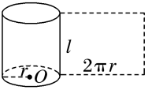
</td><td>
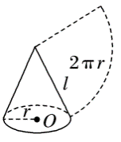
</td><td>
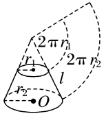
</td></tr><tr><td>
侧面积公式
</td><td>
<em>S</em>圆柱侧＝2π<em>rl</em>
</td><td>
<em>S</em>圆锥侧＝π<em>rl</em>
</td><td>
<em>S</em>圆台侧＝π(<em>r</em>1＋<em>r</em>2)<em>l</em>
</td></tr></table>

3．柱、锥、台、球的表面积和体积

<table><tr><td>
名称

几何体　　
</td><td>
表面积
</td><td>
体积
</td></tr><tr><td>
柱体(棱柱和圆柱)
</td><td>
<em>S</em>表面积＝<em>S</em>侧＋2<em>S</em>底
</td><td>
<em>V</em>＝<em>Sh</em>
</td></tr><tr><td>
锥体(棱锥和圆锥)
</td><td>
<em>S</em>表面积＝<em>S</em>侧＋<em>S</em>底
</td><td>
<em>V</em>＝<em>Sh</em>
</td></tr><tr><td>
台体(棱台和圆台)
</td><td>
<em>S</em>表面积＝<em>S</em>侧＋<em>S</em>上＋<em>S</em>下
</td><td>
<em>V</em>＝(<em>S</em>上＋<em>S</em>下＋)<em>h</em>
</td></tr><tr><td>
球
</td><td>
<em>S</em>＝4π<em>R</em>2
</td><td>
<em>V</em>＝π<em>R</em>3
</td></tr></table>

考点一　几何体的面积问题

【方法总结】

求几何体的表面积的方法  
（1）求表面积问题的思路是将立体几何问题转化为平面图形问题，即空间图形平面化，这是解决立体几何的主要出发点．  
（2）求不规则几何体的表面积时，通常将所给几何体分割成柱、锥、台体，先求这些柱、锥、台体的表面积，再通过求和或作差求得所给几何体的表面积．

平面图形折叠问题的求解方法  
（1）解决与折叠有关的问题的关键是搞清折叠前后的变化量和不变量，一般情况下，线段的长度是不变量，而位置关系往往会发生变化，抓住不变量是解决问题的突破口．  
（2）在解决问题时，要综合考虑折叠前后的图形，既要分析折叠后的图形，也要分析折叠前的图形．

【例题选讲】

<strong>[例1]</strong>(2014·安徽)如图，四棱锥<em>P</em>－<em>ABCD</em>的底面是边长为8的正方形，四条侧棱长均为2．点<em>G</em>，<em>E</em>，<em>F</em>，<em>H</em>分别是棱<em>PB</em>，<em>AB</em>，<em>CD</em>，<em>PC</em>上共面的四点，平面<em>GEFH</em>⊥平面<em>ABCD</em>，<em>BC</em>∥平面<em>GEFH</em>．  
（1）证明：*GH*∥*EF*；  
（2）若*EB*＝2，求四边形*GEFH*的面积．

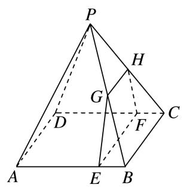
解析　（1）因为*BC*∥平面*GEFH*，*BC*⊂平面*PBC*，且平面*PBC*∩平面*GEFH*＝*GH*，所以*GH*∥*BC*．

同理可证*EF*∥*BC*，因此*GH*∥*EF*．

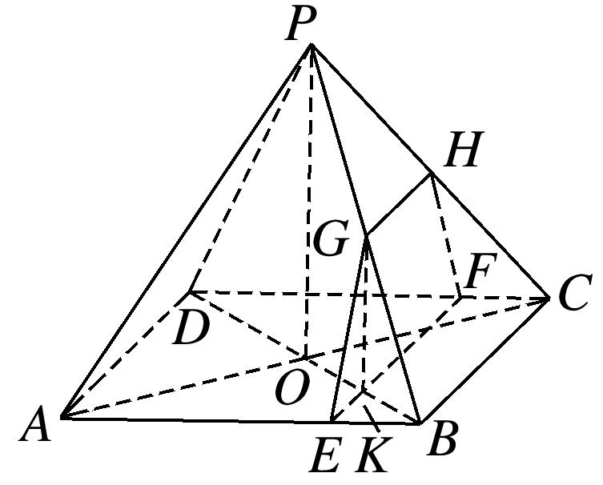  
（2）如图，连接*AC*，*BD*交于点*O*，*BD*交*EF*于点*K*，连接*OP*，*GK*．
因为*PA*＝*PC*，*O*是*AC*的中点，所以*PO*⊥*AC*，同理可得*PO*⊥*BD*．
又*BD*∩*AC*＝*O*，且*AC*，*BD*⊂底面*ABCD*，所以*PO*⊥底面*ABCD*．
又因为平面*GEFH*⊥平面*ABCD*，且*PO*⊄平面*GEFH*，所以*PO*∥平面*GEFH*．
因为平面*PBD*∩平面*GEFH*＝*GK*，所以*PO*∥*GK*，且*GK*⊥底面*ABCD*，从而*GK*⊥*EF*．
所以*GK*是梯形*GEFH*的高．由*AB*＝8，*EB*＝2得*EB*∶*AB*＝*KB*∶*DB*＝1∶4，
从而*KB*＝*DB*＝*OB*，即*K*为*OB*的中点．再由*PO*∥*GK*得*GK*＝*PO*，
即*G*是*PB*的中点，且*GH*＝*BC*＝4．由已知可得*OB*＝4，

*PO*＝＝＝6，所以*GK*＝3．
故四边形*GEFH*的面积*S*＝·*GK*＝×3＝18．

<strong>[例2]</strong> (2017·全国Ⅰ)如图，在四棱锥<em>P</em>－<em>ABCD</em>中，<em>AB</em>∥<em>CD</em>，且∠<em>BAP</em>＝∠<em>CDP</em>＝90°．  
（1）证明：平面*PAB*⊥平面*PAD*；  
（2）若*PA*＝*PD*＝*AB*＝*DC*，∠*APD*＝90°，且四棱锥*P*－*ABCD*的体积为，求该四棱锥的侧面积．

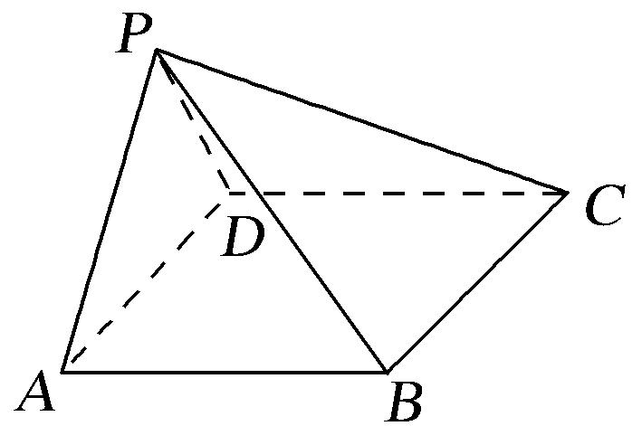
解析　（1）∵∠*BAP*＝∠*CDP*＝90°，∴*AB*⊥*PA*，*CD*⊥*PD*．∵*AB*∥*CD*，∴*AB*⊥*PD*．
又∵*PA*∩*PD*＝*P*，*PA*，*PD*⊂平面*PAD*，∴*AB*⊥平面*PAD*．∵*AB*⊂平面*PAB*，∴平面*PAB*⊥平面*PAD*．

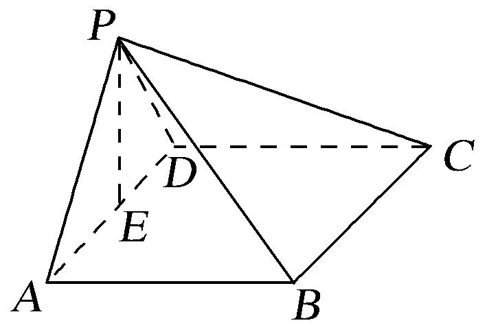  
（2）取*AD*的中点*E*，连接*PE*．∵*PA*＝*PD*，∴*PE*⊥*AD*．
由（1）知，*AB*⊥平面*PAD*，*PE*⊂平面*PAD*，故*AB*⊥*PE*，又*AB*∩*AD*＝*A*，可得*PE*⊥平面*ABCD*．
设*AB*＝*x*，则由已知可得*AD*＝*x*，*PE*＝*x*，
故四棱锥<em>P</em>－<em>ABCD</em>的体积<em>VP</em>－<em>ABCD</em>＝<em>AB</em>·<em>AD</em>·<em>PE</em>＝<em>x</em>3．由题设得<em>x</em>3＝，故<em>x</em>＝2．
从而*PA*＝*PD*＝*AB*＝*DC*＝2，*AD*＝*BC*＝2，*PB*＝*PC*＝2，
可得四棱锥<em>P</em>－<em>ABCD</em>的侧面积为<em>PA</em>·<em>PD</em>＋<em>PA</em>·<em>AB</em>＋<em>PD</em>·<em>DC</em>＋<em>BC</em>2sin 60°＝6＋2．

<strong>[例3]</strong>如图，在四棱锥<em>P－ABCD</em>中，底面<em>ABCD</em>是菱形，∠<em>DAB</em>＝60°，<em>PD</em>⊥平面<em>ABCD</em>，<em>PD</em>＝<em>AD</em>＝1，点<em>E</em>，<em>F</em>分别为<em>AB</em>和<em>PD</em>的中点．  
（1）求证：直线*AF*∥平面*PEC*；  
（2）求三棱锥*P－BEF*的表面积．

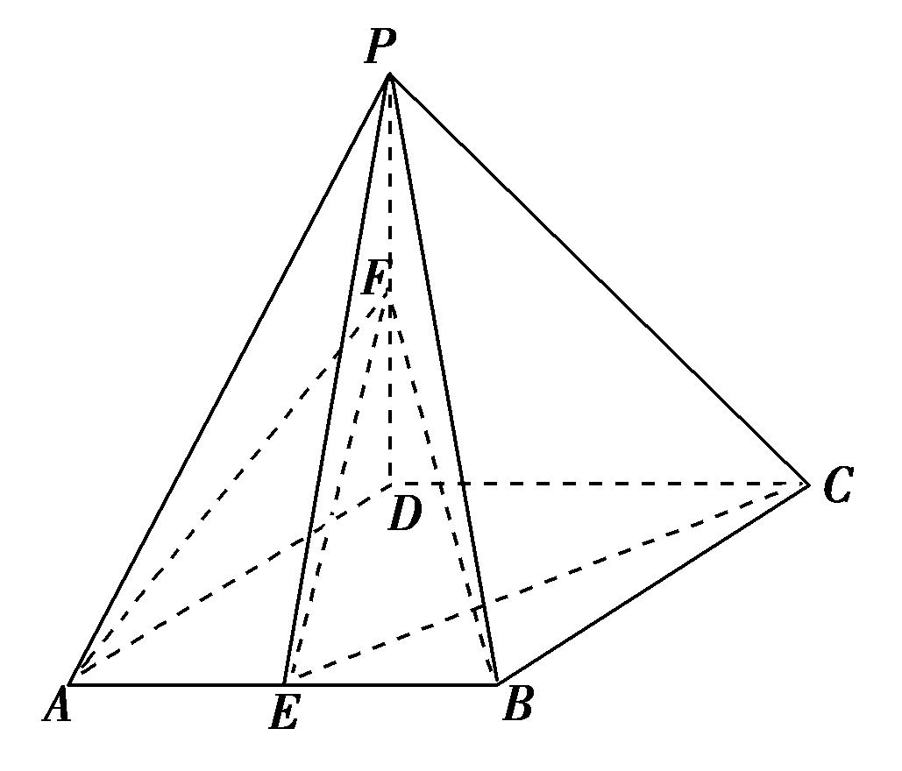
解析　（1）作*FM*∥*CD*交*PC*于*M*，连接*ME*．
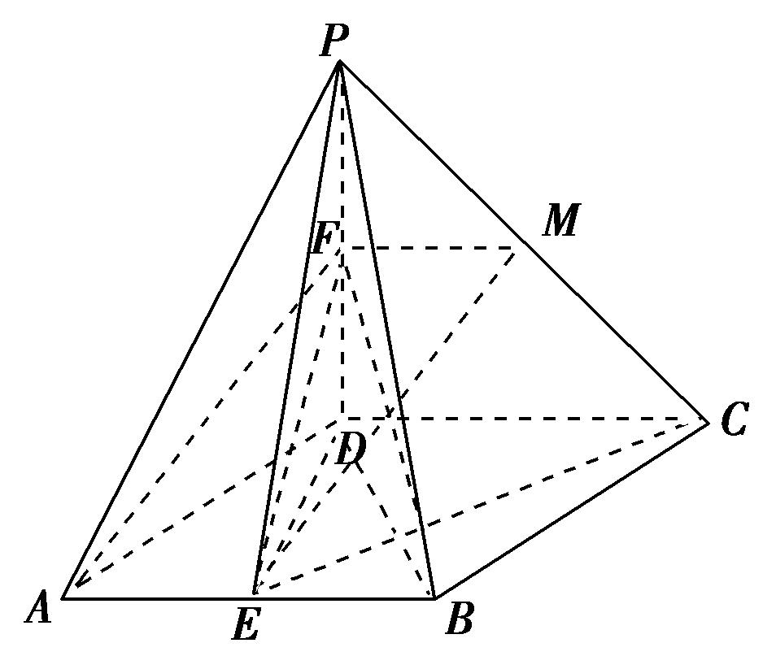

∵点*F*为*PD*的中点，∴*FMCD*，又*AECD*，∴*AEFM*，
∴四边形*AEMF*为平行四边形，∴*AF*∥*EM*，∵*AF*⊄平面*PEC*，*EM*⊂平面*PEC*，∴直线*AF*∥平面*PEC*．  
（2）连接*ED*，*BD*，可知*ED*⊥*AB*，

⇒⇒⇒*AB*⊥*PE*，*AB*⊥*FE*，
故<em>S</em>△<em>PEF</em>＝<em>PF</em>·<em>ED</em>＝××＝；<em>S</em>△<em>PBF</em>＝<em>PF</em>·<em>BD</em>＝××1＝；
<em>S</em>△<em>PBE</em>＝<em>PE</em>·<em>BE</em>＝××＝；<em>S</em>△<em>BEF</em>＝<em>EF</em>·<em>EB</em>＝×1×＝．
因此三棱锥<em>P－BEF</em>的表面积<em>SP</em>­<em>BEF</em>＝<em>S</em>△<em>PEF</em>＋<em>S</em>△<em>PBF</em>＋<em>S</em>△<em>PBE</em>＋<em>S</em>△<em>BEF</em>＝．

<strong>[例4]</strong>如图，四边形<em>ABCD</em>为菱形，<em>G</em>为<em>AC</em>与<em>BD</em>的交点，<em>BE</em>⊥平面<em>ABCD</em>．  
（1）证明：平面*AEC*⊥平面*BED*；  
（2）若∠*ABC*＝120°，*AE*⊥*EC*，三棱锥*E－ACD*的体积为，求该三棱锥的侧面积．

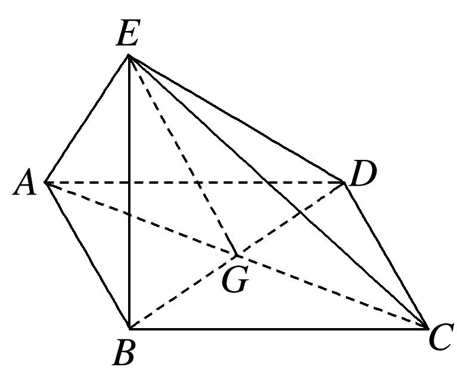
解析　（1）因为四边形*ABCD*为菱形，所以*AC*⊥*BD*．
因为*BE*⊥平面*ABCD*，*AC*⊂平面*ABCD*，所以*BE*⊥*AC*．

而*BD*∩*BE*＝*B*，*BD*，*BE*⊂平面*BED*，所以*AC*⊥平面*BED*．
又*AC*⊂平面*AEC*，所以平面*AEC*⊥平面*BED*．  
（2）设*AB*＝*x*，在菱形*ABCD*中，由∠*ABC*＝120°，可得*AG*＝*GC*＝*x*，*GB*＝*GD*＝．
因为*AE*⊥*EC*，所以在Rt△*AEC*中，可得*EG*＝*x*．
由*BE*⊥平面*ABCD*，知△*EBG*为直角三角形，可得*BE*＝*x*．
由已知得，三棱锥<em>E－ACD</em>的体积<em>V</em>三棱锥<em>EACD</em>＝×<em>AC</em>·<em>GD</em>·<em>BE</em>＝<em>x</em>3＝，故<em>x</em>＝2．
从而可得*AE*＝*EC*＝*ED*＝．所以△*EAC*的面积为3，△*EAD*的面积与△*ECD*的面积均为．
故三棱锥*EACD*的侧面积为3＋2．

<strong>[例5]</strong>如图，在长方形<em>ABCD</em>中，<em>AB</em>＝4，<em>BC</em>＝2，现将△<em>ACD</em>沿<em>AC</em>折起，使<em>D</em>折到<em>P</em>的位置且<em>P</em>在平面<em>ABC</em>的投影<em>E</em>恰好在线段<em>AB</em>上．  
（1）证明：*AP*⊥*PB*；  
（2）求三棱锥*P*－*EBC*的表面积．

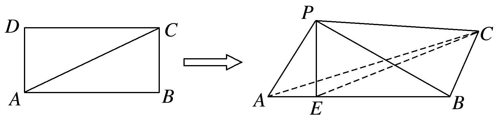
解析　（1）由题意知*PE*⊥平面*ABC*，又*BC*⊂平面*ABC*，∴*PE*⊥*BC*，
又*AB*⊥*BC* 且*AB*∩*PE*＝*E*，*AB*，*PE*⊂平面*PAB*，∴*BC*⊥平面*PAB*，
又*AP*⊂平面*PAB*，∴*BC*⊥*AP*，又*AP*⊥*CP*且*BC*∩*CP*＝*C*，*BC*，*CP*⊂平面*PBC*，
∴*AP*⊥平面*PBC*，又*PB*⊂平面*PBC*，∴*AP*⊥*PB*．  
（2）在△*PAB*中，由（1）得*AP*⊥*PB*，*AB*＝4，*AP*＝2，∴*PB*＝2，*PE*＝＝，
∴<em>BE</em>＝3，∴<em>S</em>△<em>PEB</em>＝×3×＝，在Rt△<em>EBC</em>中，<em>EB</em>＝3，<em>BC</em>＝2，<em>EC</em>＝＝，
∴<em>S</em>△<em>EBC</em>＝×3×2＝3，∴<em>S</em>△<em>PEC</em>＝<em>PE</em>·<em>CE</em>＝××＝，∴<em>S</em>△<em>PBC</em>＝<em>BC</em>·<em>PB</em>＝×2×2＝2，
∴三棱锥<em>P</em>－<em>EBC</em>的表面积为<em>S</em>＝<em>S</em>△<em>PEB</em>＋<em>S</em>△<em>EBC</em>＋<em>S</em>△<em>PEC</em>＋<em>S</em>△<em>PBC</em>＝＋3＋＋2＝．

考点二　几何体的体积问题

【方法总结】

求空间几何体体积的常用方法  
（1）公式法：直接根据相关的体积公式计算．  
（2）等积法：根据体积计算公式，通过转换空间几何体的底面和高使得体积计算更容易，或是求出一些体积比等．  
（3）割补法：把不能直接计算体积的空间几何体进行适当分割或补形，转化为易计算体积的几何体．

1．平行＋体积模型

【例题选讲】

<strong>[例1]</strong>(2017·全国Ⅱ)如图所示，四棱锥<em>P</em>－<em>ABCD</em>中，侧面<em>PAD</em>为等边三角形且垂直于底面<em>ABCD</em>，<em>AB</em>＝<em>BC</em>＝<em>AD</em>，∠<em>BAD</em>＝∠<em>ABC</em>＝90°．  
（1）证明：直线*BC*∥平面*PAD*；  
（2）若△*PCD*的面积为2，求四棱锥*P*－*ABCD*的体积．
解析　（1）在平面*ABCD*中，因为∠*BAD*＝∠*ABC*＝90°．所以*BC*∥*AD*，
又*BC*⊄平面*PAD*，*AD*⊂平面*PAD*．所以直线*BC*∥平面*PAD*．

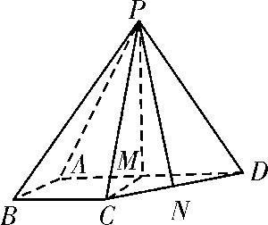  
（2）如图，取*AD*的中点*M*，连接*PM*，*CM*，由*AB*＝*BC*＝*AD*及*BC*∥*AD*，

∠*ABC*＝90°得四边形*ABCM*为正方形，则*CM*⊥*AD*．
因为侧面*PAD*为等边三角形且垂直于底面*ABCD*，平面*PAD*∩平面*ABCD*＝*AD*，*PM*⊂平面*PAD*，
所以*PM*⊥*AD*，*PM*⊥底面*ABCD*，因为*CM*⊂底面*ABCD*，所以*PM*⊥*CM*．
设*BC*＝*x*，则*CM*＝*x*，*CD*＝*x*，*PM*＝*x*，*PC*＝*PD*＝2*x*，
如图，取*CD*的中点*N*，连接*PN*，则*PN*⊥*CD*，所以*PN*＝*x*．因为△*PCD*的面积为2，
所以×*x*×*x*＝2，解得*x*＝－2(舍去)或*x*＝2．于是*AB*＝*BC*＝2，*AD*＝4，*PM*＝2．
所以四棱锥*P*－*ABCD*的体积*V*＝××2＝4．

<strong>[例2]</strong>如图，在三棱柱<em>ABC</em>—<em>A</em>1<em>B</em>1<em>C</em>1中，<em>AA</em>1⊥平面<em>ABC</em>，<em>AC</em>⊥<em>BC</em>，<em>AC</em>＝<em>BC</em>＝<em>CC</em>1＝2，点<em>D</em>为<em>AB</em>的中点．  
（1）证明：<em>AC</em>1∥平面<em>B</em>1<em>CD</em>；  
（2）求三棱锥<em>A</em>1—<em>CDB</em>1的体积．

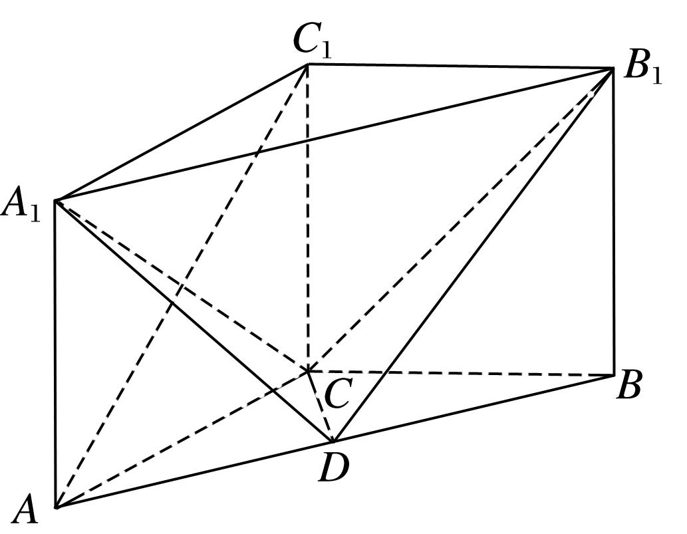
解析　（1）连接<em>BC</em>1交<em>B</em>1<em>C</em>于点<em>O</em>，连接<em>OD</em>．
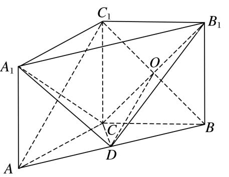
在三棱柱<em>ABC</em>—<em>A</em>1<em>B</em>1<em>C</em>1中，四边形<em>BCC</em>1<em>B</em>1是平行四边形，∴点<em>O</em>是<em>BC</em>1的中点．
∵点<em>D</em>为<em>AB</em>的中点，∴<em>OD</em>∥<em>AC</em>1．又<em>OD</em>⊂平面<em>B</em>1<em>CD</em>，<em>AC</em>1⊄平面<em>B</em>1<em>CD</em>，∴<em>AC</em>1∥平面<em>B</em>1<em>CD</em>．  
（2）∵<em>AC</em>＝<em>BC</em>，<em>AD</em>＝<em>BD</em>，∴<em>CD</em>⊥<em>AB</em>．在三棱柱<em>ABC</em>—<em>A</em>1<em>B</em>1<em>C</em>1中，
由<em>AA</em>1⊥平面<em>ABC</em>，得平面<em>ABB</em>1<em>A</em>1⊥平面<em>ABC</em>．又平面<em>ABB</em>1<em>A</em>1∩平面<em>ABC</em>＝<em>AB</em>，<em>CD</em>⊂平面<em>ABC</em>，
∴<em>CD</em>⊥平面<em>ABB</em>1<em>A</em>1，∵<em>AC</em>⊥<em>BC</em>，<em>AC</em>＝<em>BC</em>＝2，∴<em>AB</em>＝<em>A</em>1<em>B</em>1＝2，<em>CD</em>＝，

＝××2×2×＝．

<strong>[例3]</strong>如图，在△<em>PBE</em>中，<em>AB</em>⊥<em>PE</em>，<em>D</em>是<em>AE</em>的中点，<em>C</em>是线段<em>BE</em>上的一点，且<em>AC</em>＝，<em>AB</em>＝<em>AP</em>＝<em>AE</em>＝2，将△<em>PBA</em>沿<em>AB</em>折起使得二面角<em>P</em>－<em>AB</em>－<em>E</em>是直二面角．  
（1）求证：*CD*∥平面*PAB*；  
（2）求三棱锥*E*－*PAC*的体积．

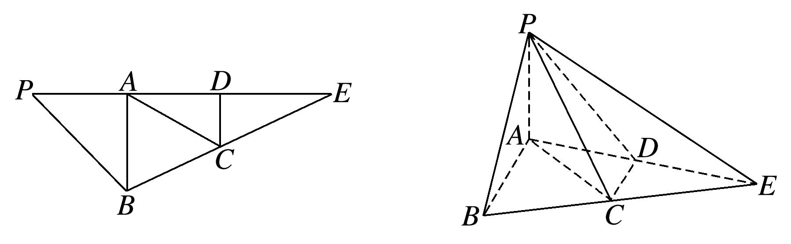
解析　（1）因为*AE*＝2，所以*AE*＝4，又*AB*＝2，*AB*⊥*PE*，
所以*BE*＝＝＝2，又因为*AC*＝＝*BE*，
所以*AC*是Rt△*ABE*的斜边*BE*上的中线，所以*C*是*BE*的中点，又因为*D*是*AE*的中点，
所以*CD*是Rt△*ABE*的中位线，所以*CD*∥*AB*，
又因为*CD*⊄平面*PAB*，*AB*⊂平面*PAB*，所以*CD*∥平面*PAB*．  
（2）由（1）知，直线*CD*是Rt△*ABE*的中位线，所以*CD*＝*AB*＝1，
因为二面角*P*－*AB*－*E*是直二面角，平面*PAB*∩平面*EAB*＝*AB*，*PA*⊂平面*PAB*，*PA*⊥*AB*，
所以*PA*⊥平面*ABE*，又因为*AP*＝2，
所以<em>VE</em>－<em>PAC</em>＝<em>VP</em>－<em>ACE</em>＝××<em>AE</em>×<em>CD</em>×<em>AP</em>＝××4×1×2＝．

<strong>[例4]</strong>如图，在四棱锥<em>P</em>－<em>ABCD</em>中，底面<em>ABCD</em>为等腰梯形，<em>AB</em>∥<em>CD</em>，<em>CD</em>＝2<em>AB</em>＝4，<em>AD</em>＝，△<em>PAB</em>为等腰直角三角形，<em>PA</em>＝<em>PB</em>，平面<em>PAB</em>⊥底面<em>ABCD</em>，<em>E</em>为<em>PD</em>的中点．  
（1）求证：*AE*∥平面*PBC*；  
（2）求三棱锥*P*－*EBC*的体积．

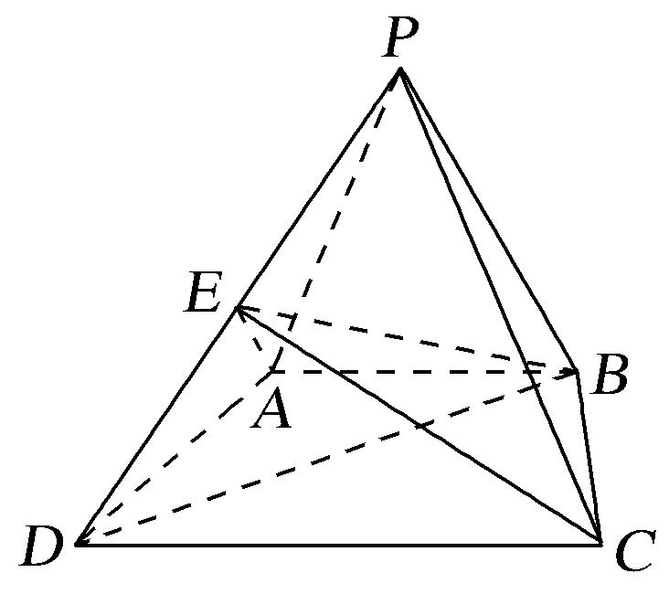
解析　（1）如图，取*PC*的中点*F*，连接*EF*，*BF*，
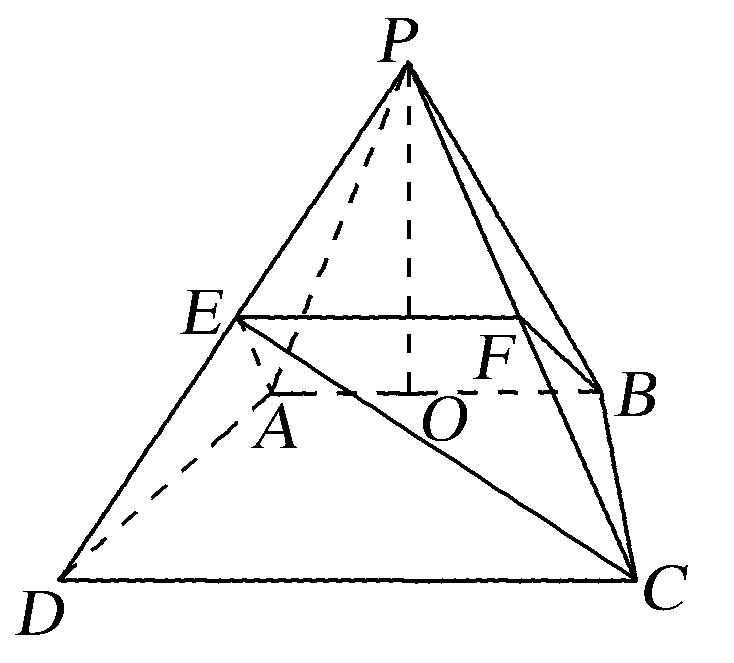
∵*PE*＝*DE*，*PF*＝*CF*，∴*EF*∥*CD*，*CD*＝2*EF*，
∵*AB*∥*CD*，*CD*＝2*AB*，∴*AB*∥*EF*，且*EF*＝*AB*．
∴四边形*ABFE*为平行四边形，∴*AE*∥*BF*．
∵*BF*⊂平面*PBC*，*AE*⊄平面*PBC*．故*AE*∥平面*PBC*．  
（2）由（1）知*AE*∥平面*PBC*，∴点*E*到平面*PBC*的距离与点*A*到平面*PBC*的距离相等，
∴<em>VP</em>－<em>EBC</em>＝<em>VE</em>－<em>PBC</em>＝<em>VA</em>－<em>PBC</em>＝<em>VP</em>－<em>ABC</em>．如图，取<em>AB</em>的中点<em>O</em>，连接<em>PO</em>，∵<em>PA</em>＝<em>PB</em>，∴<em>OP</em>⊥<em>AB</em>．
∵平面*PAB*⊥平面*ABCD*，平面*PAB*∩平面*ABCD*＝*AB*，*OP*⊂平面*PAB*，∴*OP*⊥平面*ABCD*．
∵△*PAB*为等腰直角三角形，*PA*＝*PB*，*AB*＝2，∴*OP*＝1．
∵四边形*ABCD*为等腰梯形，且*AB*∥*CD*，*CD*＝2*AB*＝4，*AD*＝，
∴梯形<em>ABCD</em>的高为1，∴<em>S</em>△<em>ABC</em>＝×2×1＝1．故<em>VP</em>－<em>EBC</em>＝<em>VP</em>－<em>ABC</em>＝×1×1＝．

<strong>[例5]</strong>如图，在四棱锥<em>P</em>—<em>ABCD</em>中，∠<em>ABC</em>＝∠<em>ACD</em>＝90°，∠<em>BAC</em>＝∠<em>CAD</em>＝60°，<em>PA</em>⊥平面<em>ABCD</em>，<em>PA</em>＝2，<em>AB</em>＝1．设<em>M</em>，<em>N</em>分别为<em>PD</em>，<em>AD</em>的中点．  
（1）求证：平面*CMN*∥平面*PAB*；  
（2）求三棱锥*P*—*ABM*的体积．

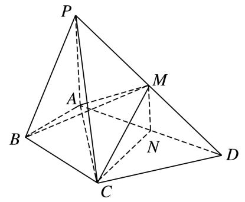
解析　（1）∵*M*，*N*分别为*PD*，*AD*的中点，∴*MN*∥*PA*．
又∵*MN*⊄平面*PAB*，*PA*⊂平面*PAB*，∴*MN*∥平面*PAB*．
在Rt△*ACD*中，∠*CAD*＝60°，*CN*＝*AN*，
∴∠*ACN*＝60°．又∵∠*BAC*＝60°，∴*CN*∥*AB*．
∵*CN*⊄平面*PAB*，*AB*⊂平面*PAB*，∴*CN*∥平面*PAB*．
又∵*CN*∩*MN*＝*N*，*CN*，*MN*⊂平面*CMN*，∴平面*CMN*∥平面*PAB*．  
（2）由（1）知，平面*CMN*∥平面*PAB*，∴点*M*到平面*PAB*的距离等于点*C*到平面*PAB*的距离．
由已知得，*AB*＝1，∠*ABC*＝90°，∠*BAC*＝60°，∴*BC*＝，
∴三棱锥<em>P</em>—<em>ABM</em>的体积<em>V</em>＝<em>V</em>三棱锥<em>M</em>—<em>PAB</em>＝<em>V</em>三棱锥<em>C</em>—<em>PAB</em>＝<em>V</em>三棱锥<em>P</em>—<em>ABC</em>＝××1××2＝．

<strong>[例6]</strong>(2016·全国Ⅲ)如图，四棱锥<em>P－ABCD</em>中，<em>PA</em>⊥底面<em>ABCD</em>，<em>AD</em>∥<em>BC</em>，<em>AB</em>＝<em>AD</em>＝<em>AC</em>＝3，<em>PA</em>＝<em>BC</em>＝4，<em>M</em>为线段<em>AD</em>上一点，<em>AM</em>＝2<em>MD</em>，<em>N</em>为<em>PC</em>的中点．  
（1）证明：*MN*∥平面*PAB*；  
（2）求四面体*N－BCM*的体积．

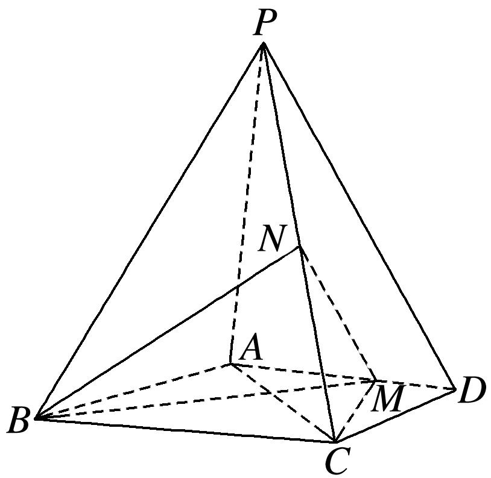
解析　（1）由已知得*AM*＝*AD*＝2．如图，取*BP*的中点*T*，连接*AT*，*TN*，

由*N*为*PC*中点知*TN*∥*BC*，*TN*＝*BC*＝2．又*AD*∥*BC*，故*TNAM*，
所以四边形*AMNT*为平行四边形，于是*MN*∥*AT*．
因为*AT*⊂平面*PAB*，*MN*⊄平面*PAB*，所以*MN*∥平面*PAB*．

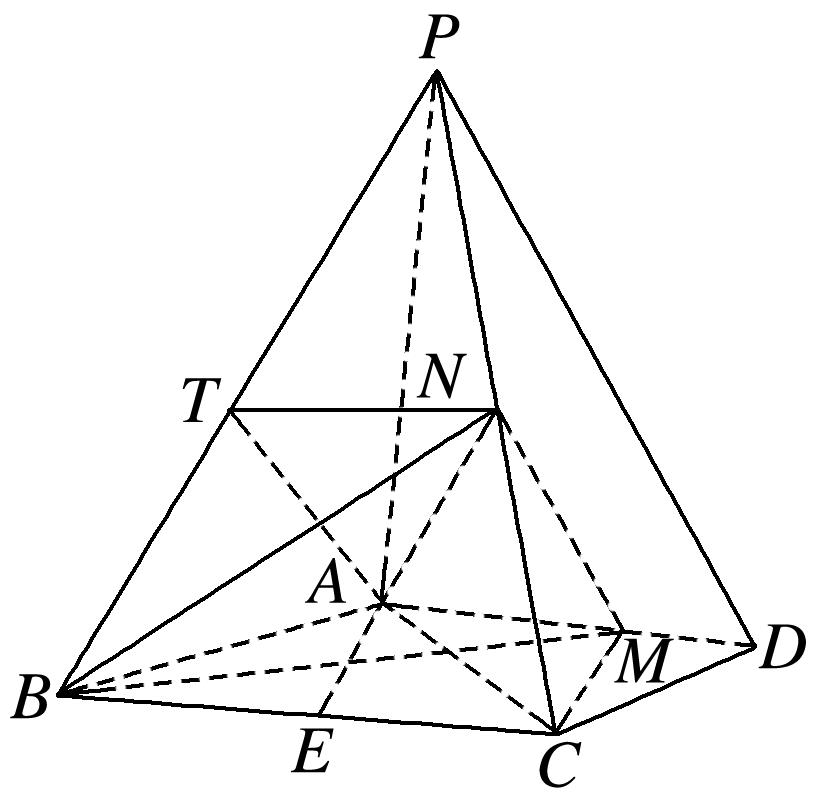  
（2）因为*PA*⊥平面*ABCD*，*N*为*PC*的中点，所以*N*到平面*ABCD*的距离为*PA*．

取*BC*的中点*E*，连接*AE*．由*AB*＝*AC*＝3得*AE*⊥*BC*，*AE*＝＝．
由<em>AM</em>∥<em>BC</em>得<em>M</em>到<em>BC</em>的距离为，故<em>S</em>△<em>BCM</em>＝×4×＝2．
所以四面体<em>N－BCM</em>的体积<em>V</em>四面体<em>N-BCM</em>＝×<em>S</em>△<em>BCM</em>×＝．

<strong>[例7]</strong>如图，在四棱锥<em>P</em>－<em>ABCD</em>中，平面<em>PAB</em>⊥平面<em>ABCD</em>，<em>PA</em>＝<em>PB</em>，<em>AD</em>∥<em>BC</em>，<em>AB</em>＝<em>AC</em>，<em>AD</em>＝<em>BC</em>＝1，<em>PD</em>＝3，∠<em>BAD</em>＝120°，<em>M</em>为<em>PC</em>的中点．  
（1）证明：*DM*∥平面*PAB*；  
（2）求四面体*MABD*的体积．

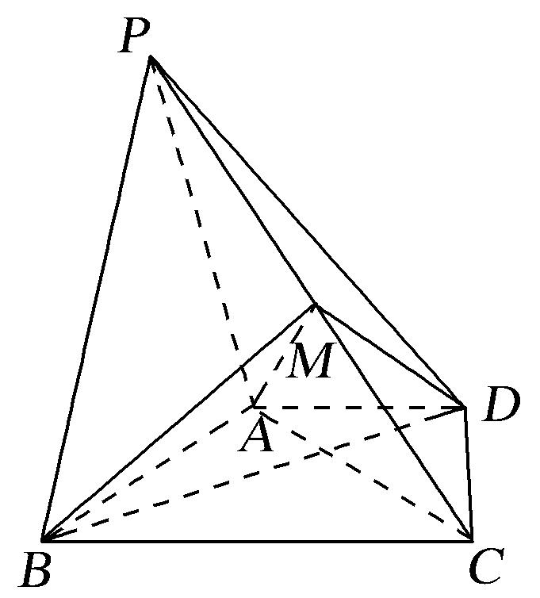
解析　（1）取*PB*中点*N*，连接*MN*，*AN*．∵*M*为*PC*的中点，∴*MN*∥*BC*且*MN*＝*BC*，
又*AD*∥*BC*，且*AD*＝*BC*，得*MN*綉*AD*．∴*ADMN*为平行四边形，∴*DM*∥*AN*．
又*AN*⊂平面*PAB*，*DM*⊄平面*PAB*，∴*DM*∥平面*PAB*．  
（2）取*AB*中点*O*，连接*PO*，∵*PA*＝*PB*，∴*PO*⊥*AB*，
又∵平面*PAB*⊥平面*ABCD*，平面*PAB*∩平面*ABCD*＝*AB*，*PO*⊂平面*PAB*，
则*PO*⊥平面*ABCD*，取*BC*中点*H*，连接*AH*，
∵*AB*＝*AC*，∴*AH*⊥*BC*，又∵*AD*∥*BC*，∠*BAD*＝120°，
∴∠*ABC*＝60°，Rt△*ABH*中，*BH*＝*BC*＝1，*AB*＝2，∴*AO*＝1，又*AD*＝1，

△*AOD*中，由余弦定理知，*OD*＝．Rt△*POD*中，*PO*＝＝．
又<em>S</em>△<em>ABD</em>＝<em>AB</em>·<em>AD</em>sin 120°＝，∴<em>VM</em>－<em>ABD</em>＝·<em>S</em>△<em>ABD</em>·<em>PO</em>＝．

<strong>[例8]</strong>如图所示的几何体<em>P</em>—<em>ABCD</em>中，四边形<em>ABCD</em>为菱形，∠<em>ABC</em>＝120°，<em>AB</em>＝<em>a</em>，<em>PB</em>＝<em>a</em>，<em>PB</em>⊥<em>AB</em>，平面<em>ABCD</em>⊥平面<em>PAB</em>，<em>AC</em>∩<em>BD</em>＝<em>O</em>，<em>E</em>为<em>PD</em>的中点，<em>G</em>为平面<em>PAB</em>内任一点．  
（1）在平面*PAB*内，过*G*点是否存在直线*l*使*OE*∥*l*？如果不存在，请说明理由，如果存在，请说明作法；  
（2）过*A*，*C*，*E*三点的平面将几何体*P*—*ABCD*截去三棱锥*D*—*AEC*，求剩余几何体*AECBP*的体积．

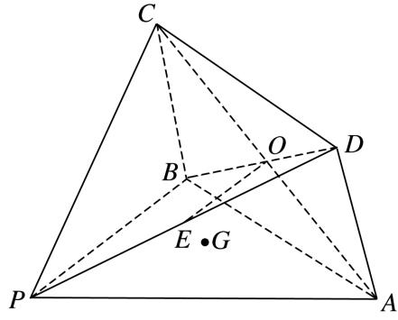
解析　（1）过*G*点存在直线*l*使*OE*∥*l*，理由如下：
由题意知*O*为*BD*的中点，又*E*为*PD*的中点，所以在△*PBD*中，*OE*∥*PB*．
若点*G*在直线*PB*上，则直线*PB*即为所求的直线*l*，所以有*OE*∥*l*；
若点*G*不在直线*PB*上，在平面*PAB*内，过点*G*作直线*l*，使*l*∥*PB*，
又*OE*∥*PB*，所以*OE*∥*l*，即过*G*点存在直线*l*使*OE*∥*l*．

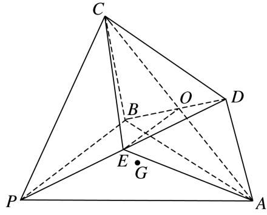  
（2）连接*EA*，*EC*，则平面*ACE*将几何体分成两部分：三棱锥*D*—*AEC*与几何体*AECBP*(如图所示)．
因为平面*ABCD*⊥平面*PAB*，且交线为*AB*，又*PB*⊥*AB*，*PB*⊂平面*PAB*，所以*PB*⊥平面*ABCD*．
故*PB*为几何体*P*—*ABCD*的高．又四边形*ABCD*为菱形，∠*ABC*＝120°，*AB*＝*a*，*PB*＝*a*，
所以<em>S</em>四边形<em>ABCD</em>＝2×<em>a</em>2＝<em>a</em>2，所以<em>V</em>四棱锥<em>P</em>—<em>ABCD</em>＝<em>S</em>四边形<em>ABCD</em>·<em>PB</em>＝×<em>a</em>2×<em>a</em>＝<em>a</em>3．

又*OEPB*，所以*OE*⊥平面*ACD*，
所以<em>V</em>三棱锥<em>D</em>—<em>AEC</em>＝<em>V</em>三棱锥<em>E</em>—<em>ACD</em>＝<em>S</em>△<em>ACD</em>·<em>EO</em>＝<em>V</em>四棱锥<em>P</em>—<em>ABCD</em>＝<em>a</em>3，
所以几何体<em>AECBP</em>的体积<em>V</em>＝<em>V</em>四棱锥<em>P</em>—<em>ABCD</em>－<em>V</em>三棱锥<em>D</em>—<em>EAC</em>＝<em>a</em>3－<em>a</em>3＝<em>a</em>3．

【对点训练】

1．如图所示，在四棱锥*P*－*ABCD*中，底面*ABCD*为直角梯形，∠*ABC*＝∠*BAD*＝90°，△*PDC*和△*BDC*

均为等边三角形，且平面*PDC*⊥平面*BDC*．  
（1）在棱*PB*上是否存在点*E*，使得*AE*∥平面*PDC*？若存在，试确定点*E*的位置；若不存在，试说明理由；  
（2）若△*PBC*的面积为，求四棱锥*P*－*ABCD*的体积．

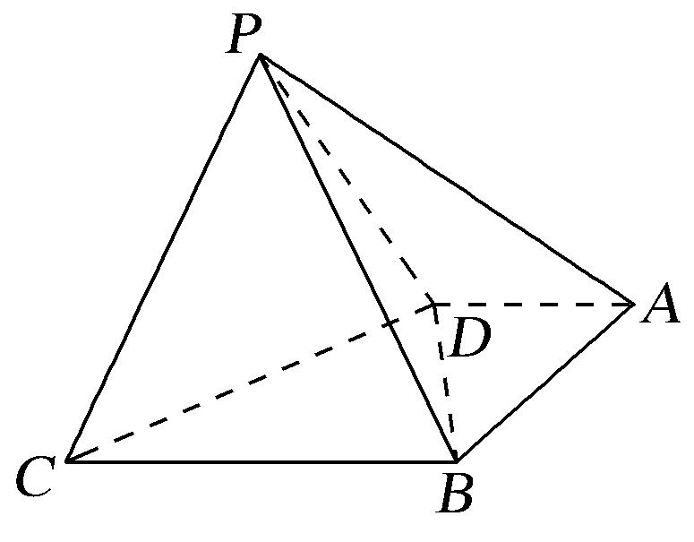

1．解析　（1）存在．当点*E*为棱*PB*的中点，使得*AE*∥平面*PDC*．理由如下：
如图所示，取*PB*的中点*E*，连接*AE*，取*PC*的中点*F*，连接*EF*，*DF*，取*BC*的中点*G*，连接*DG*．

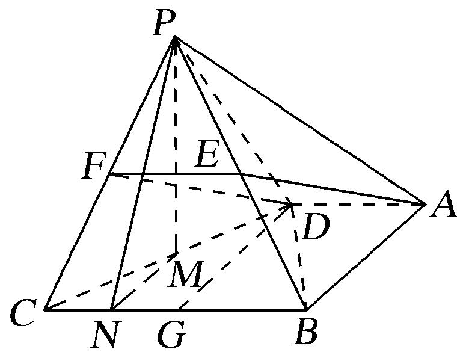
因为△*BCD*是等边三角形，所以∠*DGB*＝90°．
因为∠*ABC*＝∠*BAD*＝90°，所以四边形*ABGD*为矩形，所以*AD*＝*BG*＝*BC*，*AD*∥*BC*．
因为*EF*为△*BCP*的中位线，所以*EF*＝*BC*，且*EF*∥*BC*，故*AD*＝*EF*，且*AD*∥*EF*，
所以四边形*ADFE*是平行四边形，从而*AE*∥*DF*，
又*AE*⊄平面*PDC*，*DF*⊂平面*PDC*，所以*AE*∥平面*PDC*．  
（2）取*CD*的中点*M*，连接*PM*，过点*P*作*PN*⊥*BC*交*BC*于点*N*，连接*MN*，如图所示．
因为△*PDC*为等边三角形，所以*PM*⊥*DC*．
因为*PM*⊥*DC*，平面*PDC*⊥平面*BDC*，平面*PDC*∩平面*BDC*＝*DC*，*PM*⊂平面*PDC*，
所以*PM*⊥平面*BCD*，则*PM*为四棱锥*P*－*ABCD*的高．
又*BC*⊂平面*BCD*，所以*PM*⊥*BC*．
因为*PN*⊥*BC*，*PN*∩*PM*＝*P*，*PN*⊂平面*PMN*，*PM*⊂平面*PMN*，所以*BC*⊥平面*PMN*．
因为*MN*⊂平面*PMN*，所以*MN*⊥*BC*．由*M*为*DC*的中点，易知*NC*＝*BC*．
设*BC*＝*x*，则△*PBC*的面积为·＝，解得*x*＝2，即*BC*＝2，
所以*AD*＝1，*AB*＝*DG*＝*PM*＝．
故四棱锥<em>P</em>－<em>ABCD</em>的体积为<em>V</em>＝×<em>S</em>梯形<em>ABCD</em>×<em>PM</em>＝××＝．

2．如图，在直三棱柱<em>ABC</em>—<em>A</em>1<em>B</em>1<em>C</em>1中，∠<em>BAC</em>＝90°，<em>AB</em>＝<em>AC</em>＝2，点<em>M</em>，<em>N</em>分别为<em>A</em>1<em>C</em>1，<em>AB</em>1的中点．  
（1）证明：<em>MN</em>∥平面<em>BB</em>1<em>C</em>1<em>C</em>；  
（2）若*CM*⊥*MN*，求三棱锥*M*—*NAC*的体积．

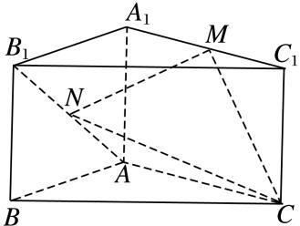

2．解析　（1）连接<em>A</em>1<em>B</em>，<em>BC</em>1，点<em>M</em>，<em>N</em>分别为<em>A</em>1<em>C</em>1，<em>AB</em>1的中点，
所以<em>MN</em>为△<em>A</em>1<em>BC</em>1的一条中位线，<em>MN</em>∥<em>BC</em>1，
又因为<em>MN</em>⊄平面<em>BB</em>1<em>C</em>1<em>C</em>，<em>BC</em>1⊂平面<em>BB</em>1<em>C</em>1<em>C</em>，所以<em>MN</em>∥平面<em>BB</em>1<em>C</em>1<em>C</em>．

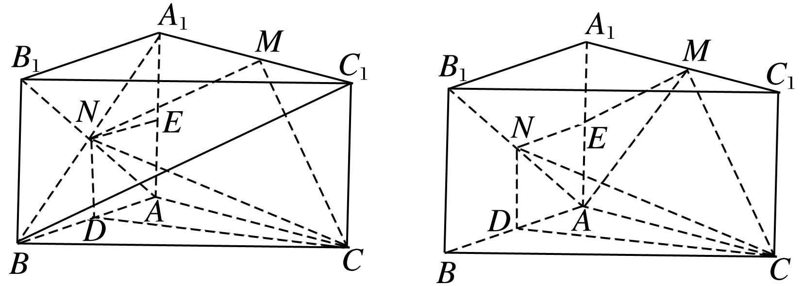  
（2）设点<em>D</em>，<em>E</em>分别为<em>AB</em>，<em>AA</em>1的中点，<em>AA</em>1＝<em>a</em>，连接<em>ND</em>，<em>CD</em>，则<em>CM</em>2＝<em>a</em>2＋1，<em>MN</em>2＝1＋＝，<em>CN</em>2＝＋5＝，由<em>CM</em>⊥<em>MN</em>，得<em>CM</em>2＋<em>MN</em>2＝<em>CN</em>2，解得<em>a</em>＝，又<em>NE</em>⊥平面<em>AA</em>1<em>C</em>1<em>C</em>，<em>NE</em>＝1，

<em>V</em>三棱锥<em>M</em>—<em>NAC</em>＝<em>V</em>三棱锥<em>N</em>—<em>AMC</em>＝<em>S</em>△<em>AMC</em>·<em>NE</em>＝××2××1＝．
所以三棱锥*M*—*NAC*的体积为．

3．如图，在棱长均为4的三棱柱<em>ABC</em>－<em>A</em>1<em>B</em>1<em>C</em>1中，<em>D</em>，<em>D</em>1分别是<em>BC</em>和<em>B</em>1<em>C</em>1的中点．  
（1）求证：<em>A</em>1<em>D</em>1∥平面<em>AB</em>1<em>D</em>；  
（2）若平面<em>ABC</em>⊥平面<em>BCC</em>1<em>B</em>1，∠<em>B</em>1<em>BC</em>＝60°，求三棱锥<em>B</em>1－<em>ABC</em>的体积．

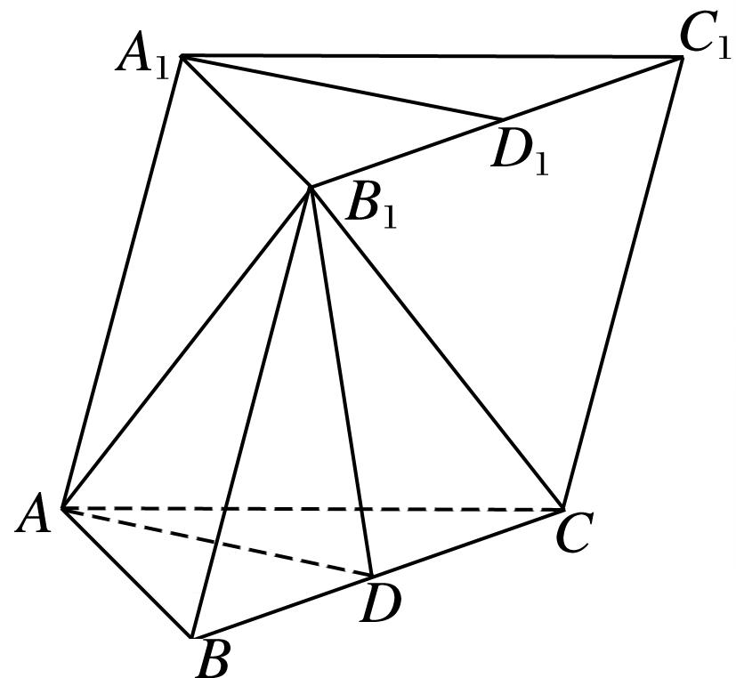

3．解析　（1）连接<em>DD</em>1，在三棱柱<em>ABC</em>－<em>A</em>1<em>B</em>1<em>C</em>1中，

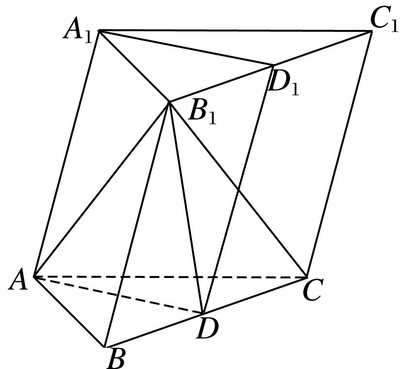
∵<em>D</em>，<em>D</em>1分别是<em>BC</em>和<em>B</em>1<em>C</em>1的中点，∴<em>B</em>1<em>D</em>1∥<em>BD</em>，且<em>B</em>1<em>D</em>1＝<em>BD</em>，∴四边形<em>B</em>1<em>BDD</em>1为平行四边形，
∴<em>BB</em>1∥<em>DD</em>1，且<em>BB</em>1＝<em>DD</em>1．又∵<em>AA</em>1∥<em>BB</em>1，<em>AA</em>1＝<em>BB</em>1，∴<em>AA</em>1∥<em>DD</em>1，<em>AA</em>1＝<em>DD</em>1，
∴四边形<em>AA</em>1<em>D</em>1<em>D</em>为平行四边形，∴<em>A</em>1<em>D</em>1∥<em>AD</em>．
又∵<em>A</em>1<em>D</em>1⊄平面<em>AB</em>1<em>D</em>，<em>AD</em>⊂平面<em>AB</em>1<em>D</em>，∴<em>A</em>1<em>D</em>1∥平面<em>AB</em>1<em>D</em>．  
（2）在△*ABC*中，边长均为4，则*AB*＝*AC*，*D*为*BC*的中点，∴*AD*⊥*BC*．
∵平面<em>ABC</em>⊥平面<em>B</em>1<em>C</em>1<em>CB</em>，平面<em>ABC</em>∩平面<em>B</em>1<em>C</em>1<em>CB</em>＝<em>BC</em>，<em>AD</em>⊂平面<em>ABC</em>，
∴<em>AD</em>⊥平面<em>B</em>1<em>C</em>1<em>CB</em>，即<em>AD</em>是三棱锥<em>A</em>－<em>B</em>1<em>BC</em>的高．
在△<em>ABC</em>中，由<em>AB</em>＝<em>AC</em>＝<em>BC</em>＝4，得<em>AD</em>＝2，在△<em>B</em>1<em>BC</em>中，<em>B</em>1<em>B</em>＝<em>BC</em>＝4，∠<em>B</em>1<em>BC</em>＝60°，
∴△<em>B</em>1<em>BC</em>的面积为4．∴三棱锥<em>B</em>1－<em>ABC</em>的体积即为三棱锥<em>A</em>－<em>B</em>1<em>BC</em>的体积<em>V</em>＝×4×2＝8．

4．如图，三棱柱<em>ABC</em>－<em>A</em>1<em>B</em>1<em>C</em>1的各棱长均为2，<em>AA</em>1⊥平面<em>ABC</em>，<em>E</em>，<em>F</em>分别为棱<em>A</em>1<em>B</em>1，<em>BC</em>的中点．

①求证：直线<em>BE</em>∥平面<em>A</em>1<em>FC</em>1；
②平面<em>A</em>1<em>FC</em>1与直线<em>AB</em>交于点<em>M</em>，指出点<em>M</em>的位置，说明理由，并求三棱锥<em>B</em>－<em>EFM</em>的体积．

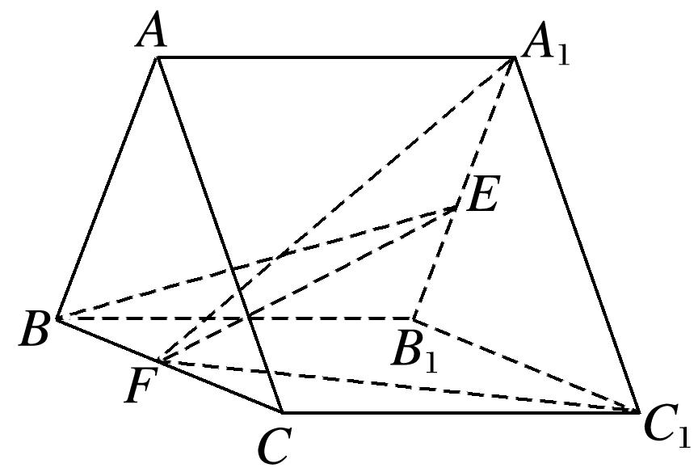

4．解析　①取<em>A</em>1<em>C</em>1的中点<em>G</em>，连接<em>EG</em>，<em>FG</em>，

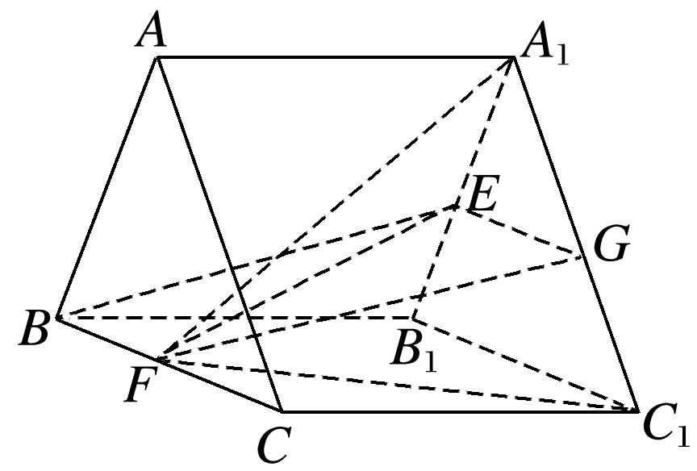
因为点<em>E</em>为<em>A</em>1<em>B</em>1的中点，所以<em>EG</em>∥<em>B</em>1<em>C</em>1且<em>EG</em>＝<em>B</em>1<em>C</em>1，
因为<em>F</em>为<em>BC</em>的中点，所以<em>BF</em>∥<em>B</em>1<em>C</em>1且<em>BF</em>＝<em>B</em>1<em>C</em>1，所以<em>BF</em>∥<em>EG</em>且<em>BF</em>＝<em>EG</em>．
所以四边形<em>BFGE</em>是平行四边形，所以<em>BE</em>∥<em>FG</em>，又<em>BE</em>⊄平面<em>A</em>1<em>FC</em>1，<em>FG</em>⊂平面<em>A</em>1<em>FC</em>1，
所以直线<em>BE</em>∥平面<em>A</em>1<em>FC</em>1．

②*M*为棱*AB*的中点．

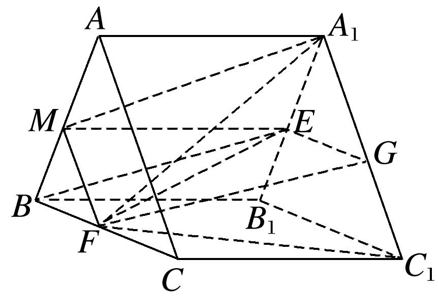

理由如下：
因为<em>AC</em>∥<em>A</em>1<em>C</em>1，<em>AC</em>⊄平面<em>A</em>1<em>FC</em>1，<em>A</em>1<em>C</em>1⊂平面<em>A</em>1<em>FC</em>1，所以直线<em>AC</em>∥平面<em>A</em>1<em>FC</em>1，
又平面<em>A</em>1<em>FC</em>1∩平面<em>ABC</em>＝<em>FM</em>，所以<em>AC</em>∥<em>FM</em>．又<em>F</em>为棱<em>BC</em>的中点，所以<em>M</em>为棱<em>AB</em>的中点．

<em>S</em>△<em>BFM</em>＝<em>S</em>△<em>ABC</em>＝××2×2×sin 60°＝，
所以三棱锥<em>B</em>－<em>EFM</em>的体积<em>VB</em>－<em>EFM</em>＝<em>VE</em>－<em>BFM</em>＝××2＝．

5．在梯形*ABCD*中(图1)，*AB*∥*CD*，*AB*＝2，*CD*＝5，过*A*，*B*分别作*CD*的垂线，垂足分别为*E*，*F*，

已知*DE*＝1，*AE*＝2，将梯形*ABCD*沿*AE*，*BF*同侧折起，使得*AF*⊥*BD*，*DE*∥*CF*，得空间几何体*ADE*－*BCF*(图2)．  
（1）证明：*BE*∥平面*ACD*；  
（2）求三棱锥*E*－*ACD*的体积．

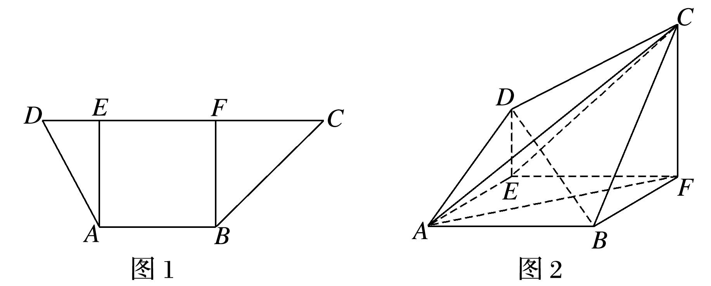

5．解析　（1）连接*BE*交*AF*于点*O*，取*AC*的中点*H*，连接*OH*，*DH*，则*OH*是△*AFC*的中位线，

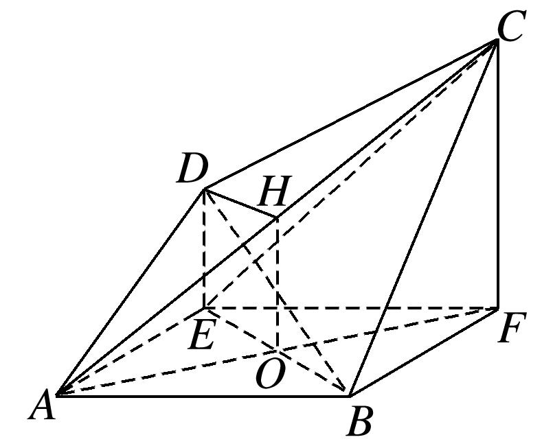
所以*OH*∥*CF*且*OH*＝*CF*，由已知得*DE*∥*CF*且*DE*＝*CF*，所以*DE*∥*OH*且*DE*＝*OH*，
所以四边形*DEOH*为平行四边形，*DH*∥*EO*，又因为*EO*⊄平面*ACD*，*DH*⊂平面*ACD*，
所以*EO*∥平面*ACD*，即*BE*∥平面*ACD*．  
（2）由已知得，四边形*ABFE*为正方形，且边长为2，则*AF*⊥*BE*，
由已知*AF*⊥*BD*，*BE*∩*BD*＝*B*，*BE*，*BD*⊂平面*BDE*，可得*AF*⊥平面*BDE*，
又*DE*⊂平面*BDE*，所以*AF*⊥*DE*，又*AE*⊥*DE*，*AF*∩*AE*＝*A*，*AF*，*AE*⊂平面*ABFE*，
所以*DE*⊥平面*ABFE*，又*EF*⊂平面*ABEF*，所以*DE*⊥*EF*，四边形*DEFC*是直角梯形，
又*AE*⊥*EF*，*DE*∩*EF*＝*E*，*DE*，*EF*⊂平面*CDE*，所以*AE*⊥平面*CDE*，
所以<em>AE</em>是三棱锥<em>A</em>－<em>DEC</em>的高，<em>VE</em>－<em>ACD</em>＝<em>VA</em>－<em>ECD</em>＝<em>VA</em>－<em>EFD</em>＝×<em>AE</em>××<em>DE</em>×<em>EF</em>＝．

6．如图，在直三棱柱<em>ABC</em>－<em>A</em>1<em>B</em>1<em>C</em>1中，<em>AB</em>＝<em>AC</em>＝5，<em>BB</em>1＝<em>BC</em>＝6，<em>D</em>，<em>E</em>分别是<em>AA</em>1和<em>B</em>1<em>C</em>的中点．  
（1）求证：*DE*∥平面*ABC*；  
（2）求三棱锥*E*－*BCD*的体积．

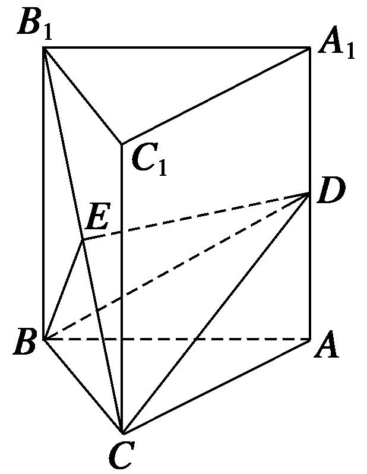

6．解析　（1）取<em>BC</em>中点<em>G</em>，连接<em>AG</em>，<em>EG</em>．因为<em>E</em>是<em>B</em>1<em>C</em>的中点，所以<em>EG</em>∥<em>BB</em>1，且<em>EG</em>＝<em>BB</em>1．

由直棱柱知，<em>AA</em>1<em>BB</em>1，而<em>D</em>是<em>AA</em>1的中点，所以<em>EGAD</em>，
所以四边形*EGAD*是平行四边形．所以*ED*∥*AG*．又*DE*⊄平面*ABC*，*AG*⊂平面*ABC*，
所以*DE*∥平面*ABC*．

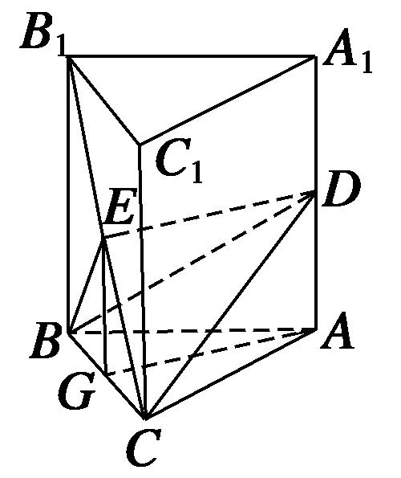  
（2）因为*AD*∥*EG*，*EG*⊂平面*BCE*，*AD*⊄平面*BCE*，所以*AD*∥平面*BCE*，
所以<em>VE</em>－<em>BCD</em>＝<em>VD</em>－<em>BEC</em>＝<em>VA</em>－<em>BCE</em>＝<em>VE</em>－<em>ABC</em>，由（1）知，<em>DE</em>∥平面<em>ABC</em>．
所以<em>VE</em>－<em>ABC</em>＝<em>VD</em>－<em>ABC</em>＝<em>AD</em>·<em>BC</em>·<em>AG</em>＝×3×6×4＝12．

7．已知空间几何体*ABCDE*中，△*BCD*与△*CDE*均为边长为2的等边三角形，△*ABC*为腰长为3的等腰

三角形，平面*CDE*⊥平面*BCD*，平面*ABC*⊥平面*BCD*．  
（1）试在平面*BCD*内作一条直线，使得直线上任意一点*F*与*E*的连线*EF*均与平面*ABC*平行，并给出详细证明；  
（2）求三棱锥*E*－*ABC*的体积．

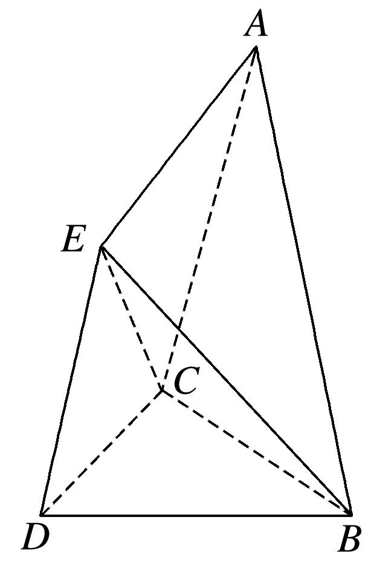

7．解析　（1）如图所示，取*DC*的中点*N*，取*BD*的中点*M*，连接*MN*，则*MN*即为所求直线．

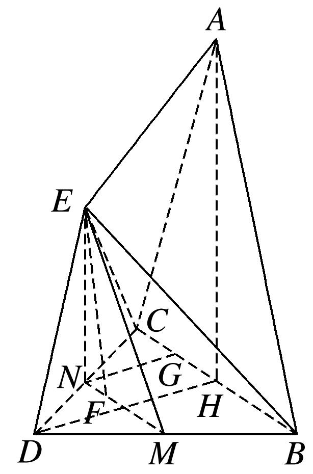
证明如下：

取*BC*的中点*H*，连接*AH*，∵△*ABC*是腰长为3的等腰三角形，*H*为*BC*的中点，∴*AH*⊥*BC*，
又平面*ABC*⊥平面*BCD*，平面*ABC*∩平面*BCD*＝*BC*，*AH*⊂平面*ABC*，∴*AH*⊥平面*BCD*，

同理，可证*EN*⊥平面*BCD*，∴*EN*∥*AH*，
∵*EN*⊄平面*ABC*，*AH*⊂平面*ABC*，∴*EN*∥平面*ABC*．
又*M*，*N*分别为*BD*，*DC*的中点，∴*MN*∥*BC*，∵*MN*⊄平面*ABC*，*BC*⊂平面*ABC*，∴*MN*∥平面*ABC*．
又*MN*∩*EN*＝*N*，*MN*⊂平面*EMN*，*EN*⊂平面*EMN*，∴平面*EMN*∥平面*ABC*，
又*EF*⊂平面*EMN*，∴*EF*∥平面*ABC*．  
（2）连接*DH*，取*CH*的中点*G*，连接*NG*，则*NG*∥*DH*，*NG*＝*DH*，由（1）可知*EN*∥平面*ABC*，
所以点*E*到平面*ABC*的距离与点*N*到平面*ABC*的距离相等．
又△*BCD*是边长为2的等边三角形，∴*DH*⊥*BC*，*DH*＝，
又平面*ABC*⊥平面*BCD*，平面*ABC*∩平面*BCD*＝*BC*，*DH*⊂平面*BCD*，
∴*DH*⊥平面*ABC*，∴*NG*⊥平面*ABC*，*NG*＝，
又<em>AC</em>＝<em>AB</em>＝3，<em>BC</em>＝2，∴<em>S</em>△<em>ABC</em>＝·<em>BC</em>·<em>AH</em>＝2．∴<em>VE</em>－<em>ABC</em>＝<em>VN</em>－<em>ABC</em>＝·<em>S</em>△<em>ABC</em>·<em>NG</em>＝．

8．如图，在四边形*ABCD*中，*AB*∥*CD*，*BC*＝*CD*＝*DA*＝*AB*＝2，点*E*为*AB*的中点，以*DE*为折痕将△

*ADE*折起，使点*A*到达点*P*的位置，平面*PDE*⊥平面*BCDE*，点*F*为*PB*的中点．  
（1）求证：*PD*∥平面*CEF*；  
（2）求三棱锥*P*－*DEF*的体积．

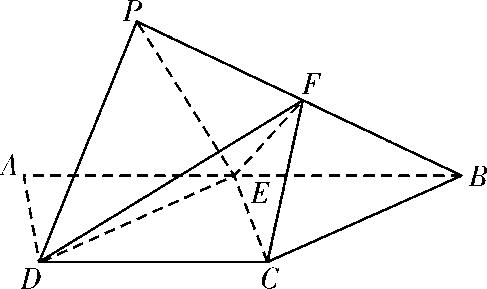

8．解析　（1）因为点*E*为*AB*的中点，*AB*∥*CD*，*AB*＝2*CD*，所以*BE*＝*CD*且*BE*∥*CD*，
所以四边形*BCDE*是平行四边形．连接*BD*交*CE*于点*O*，则点*O*为*BD*的中点，连接*FO*，
因为点*F*为*PB*的中点，所以*PD*∥*FO*，又*PD*⊄平面*CEF*，*FO*⊂平面*CEF*，所以*PD*∥平面*CEF*．  
（2）由（1）可知*PD*∥*FO*，*FO*⊄平面*PDE*，所以*FO*∥平面*PDE*，
所以点*F*到平面*PDE*的距离与点*O*到平面*PDE*的距离相等．连接*OP*，则

<em>VP</em>－<em>DEF</em>＝<em>VF</em>－<em>PDE</em>＝<em>VO</em>－<em>PDE</em>＝<em>VP</em>－<em>ODE</em>．由题意及四边形<em>BCDE</em>是平行四边形得

*BC*＝*CD*＝*PD*＝*PE*＝*BE*＝*DE*＝2，取*DE*的中点*H*，连接*PH*，则*PH*⊥*DE*，且*PH*＝．
因为平面*PDE*⊥平面*BCDE*，平面*PDE*∩平面*BCDE*＝*DE*，*PH*⊂平面*PDE*，所以*PH*⊥平面*BCDE*．
由题意得四边形*ABCD*为等腰梯形且∠*ABC*＝60°，又四边形*BCDE*为菱形，所以∠*EDC*＝60°，
所以<em>S</em>△<em>ODE</em>＝<em>S</em>△<em>DEC</em>＝××2×2×sin 60°＝，所以<em>VP</em>－<em>DEF</em>＝<em>VP</em>－<em>ODE</em>＝<em>S</em>△<em>ODE</em>×<em>PH</em>＝××＝．

9．如图，在四棱锥*P*－*ABCD*中，*PD*⊥底面*ABCD*，*AB*∥*CD*，*AB*＝2，*CD*＝3，*M*为*PC*上一点，且*PM*

＝2*MC*．  
（1）求证：*BM*∥平面*PAD*；  
（2）若*AD*＝2，*PD*＝3，∠*BAD*＝，求三棱锥*P－ADM*的体积．

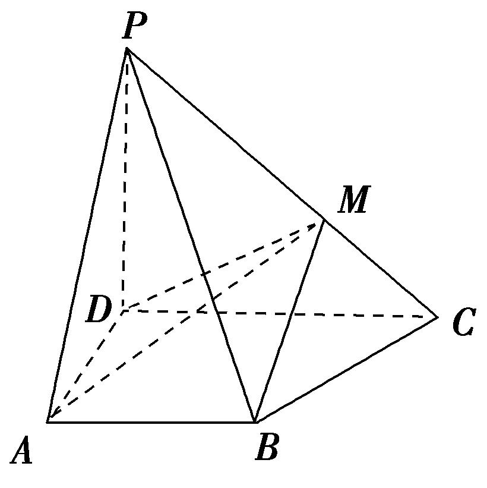

9．解析：（1）证明：法一：如图，过*M*作*MN*∥*CD*交*PD*于点*N*，连接*AN*．

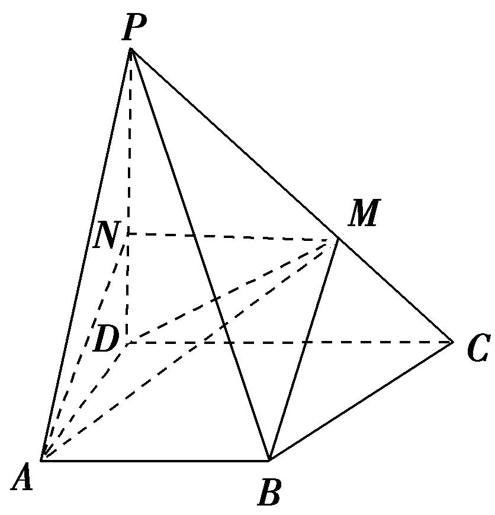

∵*PM*＝2*MC*，∴*MN*＝*CD*．又*AB*＝*CD*，且*AB*∥*CD*，∴*ABMN*，∴四边形*ABMN*为平行四边形，
∴*BM*∥*AN*．又*BM*⊄平面*PAD*，*AN*⊂平面*PAD*，∴*BM*∥平面*PAD*．

法二：如图，过点*M*作*MN*⊥*CD*于点*N*，*N*为垂足，连接*BN*．由题意，*PM*＝2*MC*，则*DN*＝2*NC*，

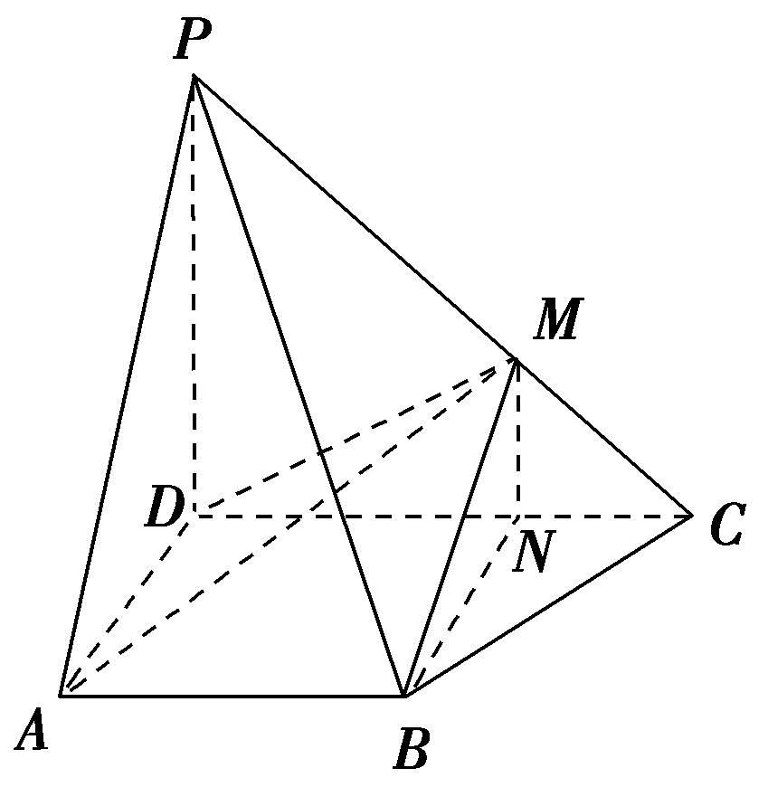

又*AB*∥*CD*，*AB*＝*CD*，∴*ABDN*，∴四边形*ABND*为平行四边形，∴*BN*∥*AD*．
∵*PD*⊥平面*ABCD*，*DC*⊂平面*ABCD*，∴*PD*⊥*DC*．
又*MN*⊥*DC*，*MN*⊂平面*PDC*，∴*PD*∥*MN*．∵*BN*⊂平面*MBN*，*MN*⊂平面*MBN*，*BN*∩*MN*＝*N*

*AD*⊂平面*PAD*，*PD*⊂平面*PAD*，*AD*∩*PD*＝*D*，∴平面*MBN*∥平面*PAD*．
∵*BM*⊂平面*MBN*，∴*BM*∥平面*PAD*．

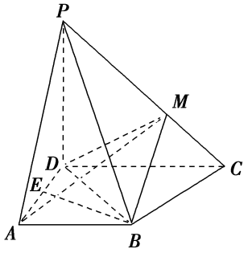  
（2）如图，过*B*作*AD*的垂线，垂足为*E*．∵*PD*⊥平面*ABCD*，*BE*⊂平面*ABCD*，∴*PD*⊥*BE*．
又*AD*⊂平面*PAD*，*PD*⊂平面*PAD*，*AD*∩*PD*＝*D*，∴*BE*⊥平面*PAD*．由（1）知，*BM*∥平面*PAD*，
∴点*M*到平面*PAD*的距离等于点*B*到平面*PAD*的距离，即*BE*．

连接*BD*，在△*ABD*中，*AB*＝*AD*＝2，∠*BAD*＝，∴*BE*＝，
则三棱锥<em>P</em>－<em>ADM</em>的体积<em>VP</em>­<em>A</em>D<em>M</em>＝<em>VM</em>­<em>PA</em>D＝×<em>S</em>△<em>PA</em>D×<em>BE</em>＝×3×＝．

10．如图，在四棱锥*P*—*ABCD*中，平面*PAD*⊥平面*ABCD*，底面*ABCD*为梯形，*AB*∥*CD*，*AB*＝2*DC*＝

2，且△*PAD*与△*ABD*均为正三角形，*E*为*AD*的中点，*G*为△*PAD*的重心．  
（1）求证：*GF*∥平面*PDC*；  
（2）求三棱锥*G*—*PCD*的体积．

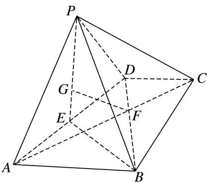

10．解析　（1）方法一　连接*AG*并延长交*PD*于点*H*，连接*CH*．

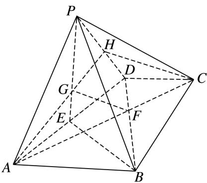
由梯形*ABCD*中*AB*∥*CD*且*AB*＝2*DC*知，＝．又*E*为*AD*的中点，*G*为△*PAD*的重心，∴＝．
在△*AHC*中，＝＝，故*GF*∥*HC*．又*HC*⊂平面*PCD*，*GF*⊄平面*PCD*，∴*GF*∥平面*PDC*．
方法二　过*G*作*GN*∥*AD*交*PD*于*N*，过*F*作*FM*∥*AD*交*CD*于*M*，连接*MN*，

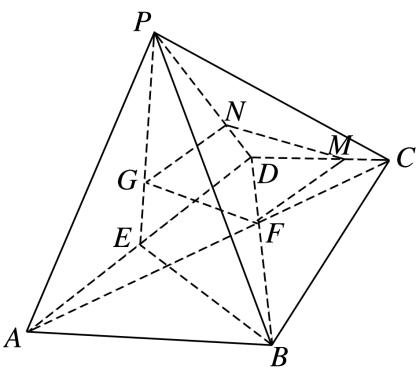
∵*G*为△*PAD*的重心，＝＝，∴*GN*＝*ED*＝．
又*ABCD*为梯形，*AB*∥*CD*，＝，∴＝，∴＝，∴*MF*＝，∴*GN*＝*FM*．
又由所作*GN*∥*AD*，*FM*∥*AD*，得*GN*∥*FM*，∴四边形*GNMF*为平行四边形．
∴*GF*∥*MN*，又∵*GF*⊄平面*PCD*，*MN*⊂平面*PCD*，∴*GF*∥平面*PDC*．
方法三　过*G*作*GK*∥*PD*交*AD*于*K*，连接*KF*，*GK*，

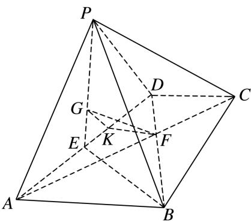
由△*PAD*为正三角形，*E*为*AD*的中点，*G*为△*PAD*的重心，得*DK*＝*DE*，∴*DK*＝*AD*，
又由梯形*ABCD*中*AB*∥*CD*，且*AB*＝2*DC*，知＝，即*FC*＝*AC*，
∴在△*ADC*中，*KF*∥*CD*，又∵*GK*∩*KF*＝*K*，*PD*∩*CD*＝*D*，∴平面*GKF*∥平面*PDC*，
又*GF*⊂平面*GKF*，∴*GF*∥平面*PDC*．  
（2）方法一　由平面*PAD*⊥平面*ABCD*，△*PAD*与△*ABD*均为正三角形，*E*为*AD*的中点，知*PE*⊥*AD*，*BE*⊥*AD*，又∵平面*PAD*∩平面*ABCD*＝*AD*，*PE*⊂平面*PAD*，∴*PE*⊥平面*ABCD*，且*PE*＝3，
由（1）知<em>GF</em>∥平面<em>PDC</em>，∴<em>V</em>三棱锥<em>G</em>—<em>PCD</em>＝<em>V</em>三棱锥<em>F</em>—<em>PCD</em>＝<em>V</em>三棱锥<em>P</em>—<em>CDF</em>＝×<em>PE</em>×<em>S</em>△<em>CDF</em>．
又由梯形*ABCD*中*AB*∥*CD*，且*AB*＝2*DC*＝2，知*DF*＝*BD*＝，
又△<em>ABD</em>为正三角形，得∠<em>CDF</em>＝∠<em>ABD</em>＝60°，∴<em>S</em>△<em>CDF</em>＝×<em>CD</em>×<em>DF</em>×sin∠<em>BDC</em>＝，
得<em>V</em>三棱锥<em>P</em>—<em>CDF</em>＝×<em>PE</em>×<em>S</em>△<em>CDF</em>＝，∴三棱锥<em>G</em>—<em>PCD</em>的体积为．
方法二　由平面*PAD*⊥平面*ABCD*，△*PAD*与△*ABD*均为正三角形，*E*为*AD*的中点，知

*PE*⊥*AD*，*BE*⊥*AD*，又∵平面*PAD*∩平面*ABCD*＝*AD*，*PE*⊂平面*PAD*，∴*PE*⊥平面*ABCD*，且*PE*＝3，

连接<em>CE</em>，∵<em>PG</em>＝<em>PE</em>，∴<em>V</em>三棱锥<em>G</em>—<em>PCD</em>＝<em>V</em>三棱锥<em>E</em>—<em>PCD</em>＝<em>V</em>三棱锥<em>P</em>—<em>CDE</em>＝××<em>PE</em>×<em>S</em>△<em>CDE</em>，
又△<em>ABD</em>为正三角形，得∠<em>EDC</em>＝120°，得<em>S</em>△<em>CDE</em>＝×<em>CD</em>×<em>DE</em>×sin∠<em>EDC</em>＝．
∴<em>V</em>三棱锥<em>G</em>—<em>PCD</em>＝××<em>PE</em>×<em>S</em>△<em>CDE</em>＝××3×＝，∴三棱锥<em>G</em>—<em>PCD</em>的体积为．

11．如图所示的五面体*ABEDFC*中，四边形*ACFD*是等腰梯形，*AD*∥*FC*，∠*DAC*＝60°，*BC*⊥平面*ACFD*，

*CA*＝*CB*＝*CF*＝1，*AD*＝2*CF*，点*G*为*AC*的中点．  
（1）在*AD*上是否存在一点*H*，使*GH*∥平面*BCD*？若存在，指出点*H*的位置并给出证明；若不存在，说明理由；  
（2）求三棱锥*G*－*ECD*的体积．

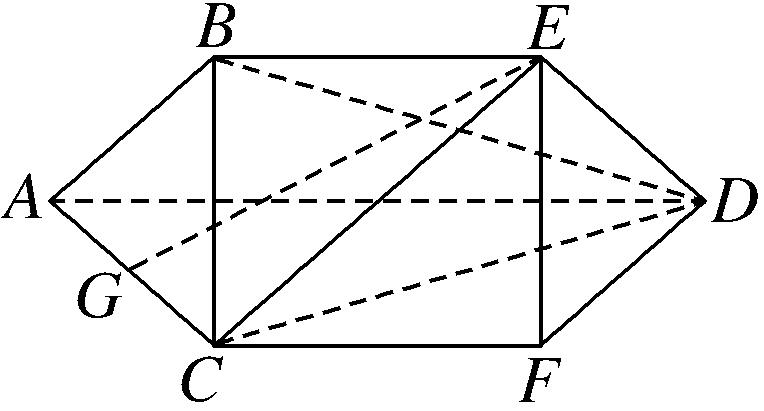

11．解析　（1）存在点*H*使*GH*∥平面*BCD*，此时*H*为*AD*的中点．证明如下．

取点*H*为*AD*的中点，连接*GH*，因为点*G*为*AC*的中点，
所以在△*ACD*中，由三角形中位线定理可知*GH*∥*CD*，
又*GH*⊄平面*BCD*，*CD*⊂平面*BCD*，所以*GH*∥平面*BCD*．

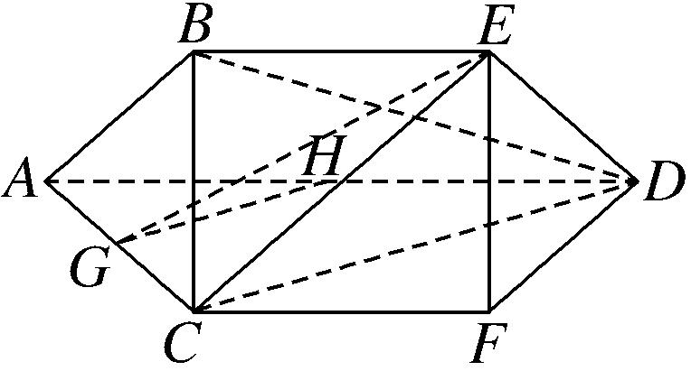  
（2）因为*AD*∥*CF*，*AD*⊂平面*ADEB*，*CF*⊄平面*ADEB*，所以*CF*∥平面*ADEB*，
因为*CF*⊂平面*CFEB*，平面*CFEB*∩平面*ADEB*＝*BE*，所以*CF*∥*BE*，
又<em>CF</em>⊂平面<em>ACFD</em>，<em>BE</em>⊄平面<em>ACFD</em>，所以<em>BE</em>∥平面<em>ACFD</em>，所以<em>VG</em>­<em>ECD</em>＝<em>VE</em>­<em>GCD</em>＝<em>VB</em>­<em>GCD</em>．
因为四边形*ACFD*是等腰梯形，∠*DAC*＝60°，*AD*＝2*CF*＝2*AC*，所以∠*ACD*＝90°，
又*CA*＝*CB*＝*CF*＝1，所以*CD*＝，*CG*＝，又*BC*⊥平面*ACFD*，
所以<em>VB</em>­<em>GCD</em>＝×<em>CG</em>×<em>CD</em>×<em>BC</em>＝××××1＝．所以三棱锥<em>G</em>－<em>ECD</em>的体积为．

12．如图，在四棱锥*P－ABCD*中，底面*ABCD*为菱形，*PA*⊥平面*ABCD*，*E*为*PD*的中点．  
（1）证明：*PB*∥平面*ACE*；  
（2）设*PA*＝1，*AD*＝，*PC*＝*PD*，求三棱锥*P*－*ACE*的体积．

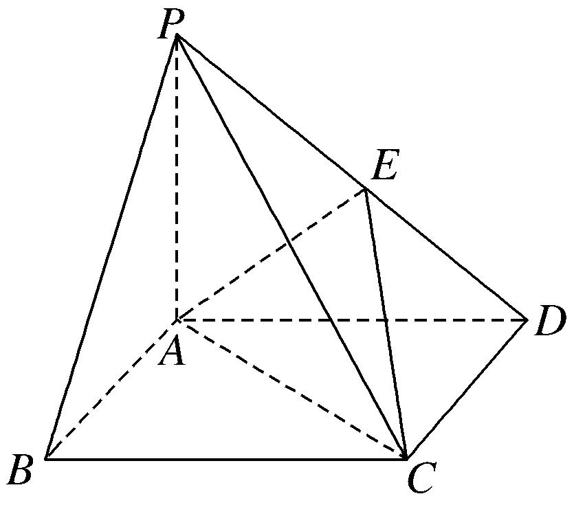

12．解析　（1）连接*BD*交*AC*于点*O*，连接*OE*．
在△*PBD*中，*PE*＝*DE*，*BO*＝*DO*，所以*PB*∥*OE*．
又*OE*⊂平面*ACE*，*PB*⊄平面*ACE*，所以*PB*∥平面*ACE*．

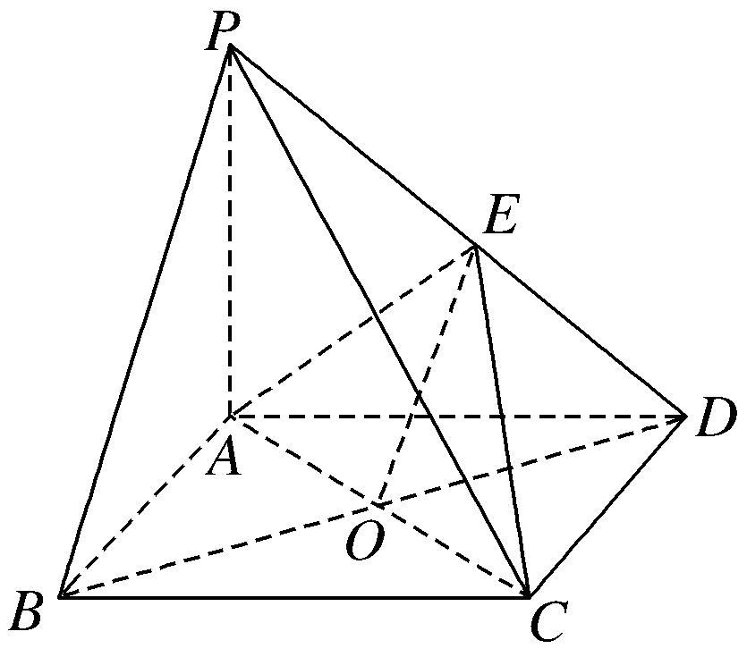  
（2）由题意得<em>AC</em>＝<em>AD</em>，所以<em>VP</em>­<em>ACE</em>＝<em>VP</em>­<em>ACD</em>＝<em>VP</em>­<em>ABCD</em>＝×<em>S</em>▱<em>ABCD</em>·<em>PA</em>＝××2××()2×1＝．

13．如图，侧棱与底面垂直的四棱柱<em>ABCD－A</em>1<em>B</em>1<em>C</em>1<em>D</em>1的底面是梯形，<em>AB</em>∥<em>CD</em>，<em>AB</em>⊥<em>AD</em>，<em>AA</em>1＝4，<em>DC</em>

＝2<em>AB</em>，<em>AB</em>＝<em>AD</em>＝3，点<em>M</em>在棱<em>A</em>1<em>B</em>1上，且<em>A</em>1<em>M</em>＝<em>A</em>1<em>B</em>1．已知点<em>E</em>是直线<em>CD</em>上的一点，<em>AM</em>∥平面<em>BC</em>1<em>E</em>．  
（1）试确定点*E*的位置，并说明理由；  
（2）求三棱锥<em>M－BC</em>1<em>E</em>的体积．

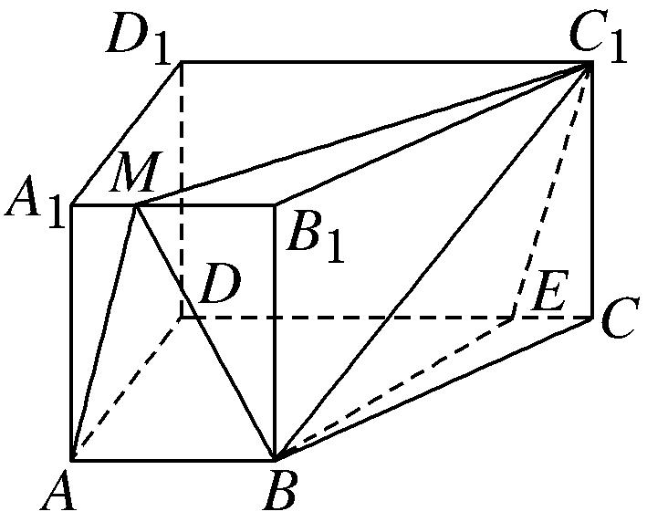

13．解析　（1）点*E*在线段*CD*上且*EC*＝1，理由如下：
在棱<em>C</em>1<em>D</em>1上取点<em>N</em>，使得<em>D</em>1<em>N</em>＝<em>A</em>1<em>M</em>＝1，连接<em>MN</em>，<em>DN</em>，

因为<em>D</em>1<em>N</em>∥<em>A</em>1<em>M</em>，所以四边形<em>D</em>1<em>NMA</em>1为平行四边形，所以<em>MNA</em>1<em>D</em>1<em>AD</em>．
所以四边形*AMND*为平行四边形，所以*AM*∥*DN*．
因为<em>CE</em>＝1，所以易知<em>DN</em>∥<em>EC</em>1，所以<em>AM</em>∥<em>EC</em>1，
又<em>AM</em>⊄平面<em>BC</em>1<em>E</em>，<em>EC</em>1⊂平面<em>BC</em>1<em>E</em>，所以<em>AM</em>∥平面<em>BC</em>1<em>E</em>．
故点*E*在线段*CD*上且*EC*＝1．

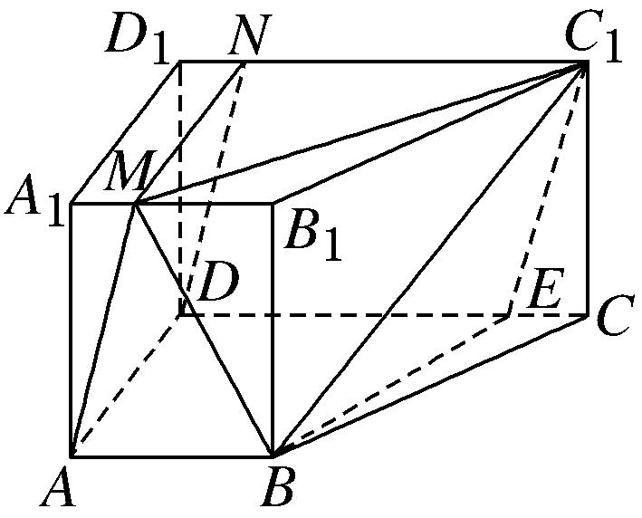  
（2）由（1）知，<em>AM</em>∥平面<em>BC</em>1<em>E</em>，所以<em>VM</em>­<em>BC</em>1<em>E</em>＝<em>VA</em>­<em>BC</em>1<em>E</em>＝<em>VC</em>1­<em>ABE</em>＝××4＝6．

14．如图，菱形*ABCD*的边长为*a*，∠*D*＝60°，点*H*为*DC*的中点，现以线段*AH*为折痕将△*DAH*折起使
得点*D*到达点*P*的位置，且平面*PHA*⊥平面*ABCH*，点*E*，*F*分别为*AB*，*AP*的中点．  
（1）求证：平面*PBC*∥平面*EFH*；  
（2）若三棱锥*P*－*EFH*的体积等于，求*a*的值．

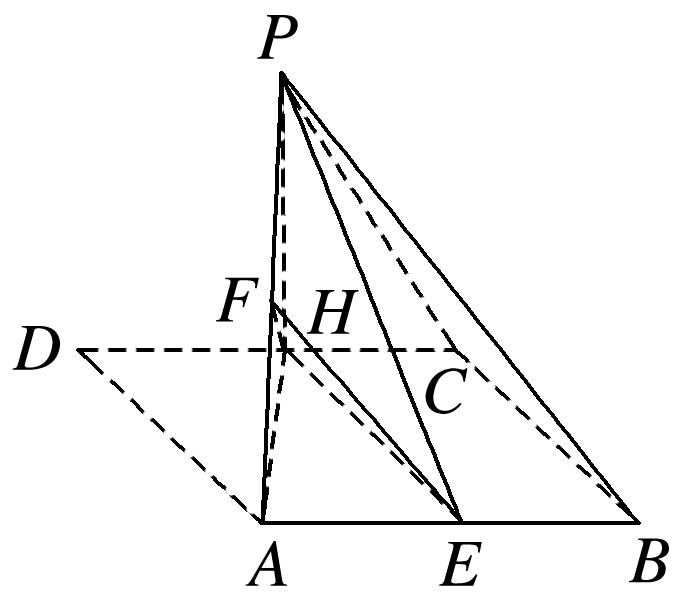

14．解析　（1）因为在菱形*ABCD*中，*E*，*H*分别为*AB*，*CD*的中点，所以*BE*∥*CH*且*BE*＝*CH*，
所以四边形*BCHE*为平行四边形，则*BC*∥*EH*，
又*EH*⊄平面*PBC*，所以*EH*∥平面*PBC*．因为点*E*，*F*分别为*AB*，*AP*的中点，所以*EF*∥*BP*，
又*EF*⊄平面*PBC*，所以*EF*∥平面*PBC*．又*EF*∩*EH*＝*E*，所以平面*PBC*∥平面*EFH*．  
（2）在菱形*ABCD*中，∠*D*＝60°，则△*ACD*为正三角形，
所以*AH*⊥*CD*，*DH*＝*PH*＝*CH*＝*a*，*AH*＝*a*，折叠后，*PH*⊥*AH*，
又平面*PHA*⊥平面*ABCH*，平面*PHA*∩平面*ABCH*＝*AH*，*PH*⊂平面*PHA*，从而*PH*⊥平面*ABCH*．
在△<em>PAE</em>中，点<em>F</em>为<em>AP</em>的中点，则<em>S</em>△<em>PEF</em>＝<em>S</em>△<em>AEF</em>，
所以<em>VH</em>－<em>PEF</em>＝<em>VH</em>－<em>AEF</em>＝<em>VH</em>－<em>PAE</em>＝<em>VP</em>－<em>AEH</em>＝×<em>S</em>△<em>AEH</em>·<em>PH</em>＝×××<em>a</em>×<em>a</em>×<em>a</em>＝<em>a</em>3＝，
所以<em>a</em>3＝8，故<em>a</em>＝2．

2．线线垂直＋体积模型

【例题选讲】

<strong>[例1]</strong>在三棱锥<em>P</em>－<em>ABC</em>中，△<em>PAB</em>是等边三角形，∠<em>APC</em>＝∠<em>BPC</em>＝60°．  
（1）求证：*AB*⊥*PC*；  
（2）若*PB*＝4，*BE*⊥*PC*，求三棱锥*B*－*PAE*的体积．

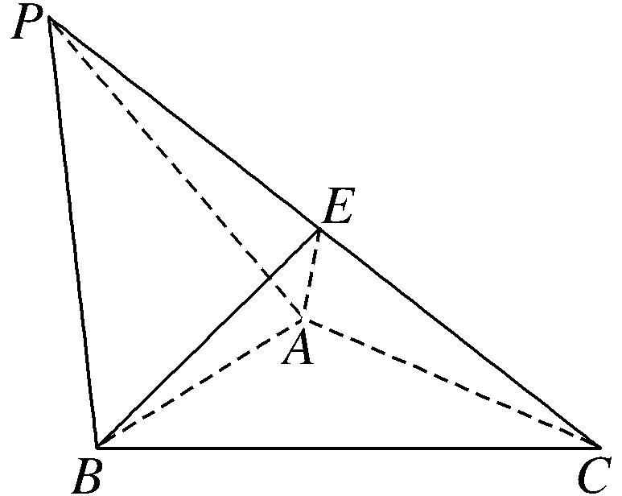
解析　（1）因为△*PAB*是等边三角形，∠*APC*＝∠*BPC*＝60°，所以△*PBC*≌△*PAC*，所以*AC*＝*BC*．
如图，取*AB*的中点*D*，连接*PD*，*CD*，则*PD*⊥*AB*，*CD*⊥*AB*，因为*PD*∩*CD*＝*D*，所以*AB*⊥平面*PDC*，
因为*PC*⊂平面*PDC*，所以*AB*⊥*PC*．

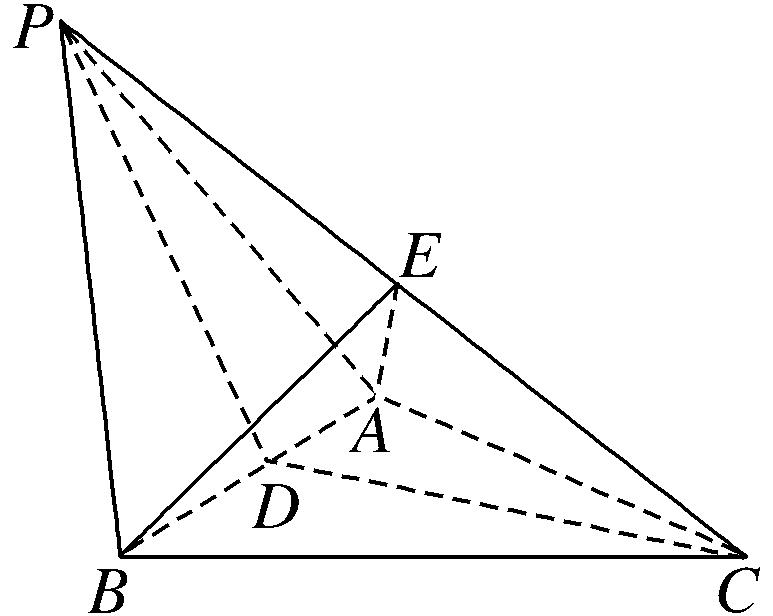  
（2）由（1）知，*AB*⊥*PC*，又*BE*⊥*PC*，*AB*∩*BE*＝*B*，所以*PC*⊥平面*ABE*，所以*PC*⊥*AE*．
因为*PB*＝4，所以在Rt△*PEB*中，*BE*＝4sin 60°＝2，*PE*＝4cos 60°＝2，
在Rt△<em>PEA</em>中，<em>AE</em>＝<em>PE</em>tan 60°＝2，所以<em>AE</em>＝<em>BE</em>＝2，所以<em>S</em>△<em>ABE</em>＝·<em>AB</em>·＝4．
所以三棱锥<em>B</em>－<em>PAE</em>的体积<em>VB</em> ­<em>PAE</em>＝<em>VP</em> ­<em>ABE</em>＝<em>S</em>△<em>AEB</em>·<em>PE</em>＝×4×2＝．

<strong>[例2]</strong>如图，在三棱锥<em>S</em>—<em>ABC</em>中，<em>SA</em>＝<em>SB</em>，<em>AC</em>＝<em>BC</em>，<em>O</em>为<em>AB</em>的中点，<em>SO</em>⊥平面<em>ABC</em>，<em>AB</em>＝4，<em>OC</em>＝2，<em>N</em>是<em>SA</em>的中点，<em>CN</em>与<em>SO</em>所成的角为<em>α</em>，且tan<em>α</em>＝2．  
（1）证明：*OC*⊥*ON*；  
（2）求三棱锥*S*—*ABC*的体积．

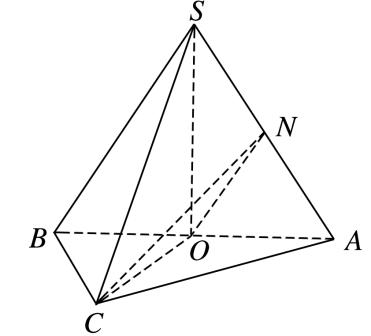
解析　（1）∵*AC*＝*BC*，*O*为*AB*的中点，∴*OC*⊥*AB*，又*SO*⊥平面*ABC*，*OC*⊂平面*ABC*，
∴*OC*⊥*SO*，又*AB*∩*SO*＝*O*，*AB*，*SO*⊂平面*SAB*，∴*OC*⊥平面*SAB*，
又∵*ON*⊂平面*SAB*，∴*OC*⊥*ON*．

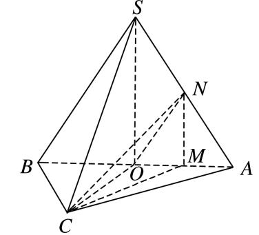  
（2）设*OA*的中点为*M*，连接*MN*，*MC*，则*MN*∥*SO*，故∠*CNM*即为*CN*与*SO*所成的角*α*，
又*MC*⊥*MN*且tan *α*＝2，∴*MC*＝2*MN*＝*SO*，又*MC*＝＝＝，即*SO*＝，
∴三棱锥*S*—*ABC*的体积*V*＝*Sh*＝··2·4·＝．

<strong>[例3]</strong>(2016·全国Ⅱ)如图，菱形<em>ABCD</em>的对角线<em>AC</em>与<em>BD</em>交于点<em>O</em>，点<em>E</em>，<em>F</em>分别在<em>AD</em>，<em>CD</em>上，<em>AE</em>＝<em>CF</em>，<em>EF</em>交<em>BD</em>于点<em>H</em>，将△<em>DEF</em>沿<em>EF</em>折到△<em>D</em>′<em>EF</em>的位置．  
（1）证明：*AC*⊥*HD*′；  
（2）若*AB*＝5，*AC*＝6，*AE*＝，*OD*′＝2，求五棱锥*D*′－*ABCFE*的体积．

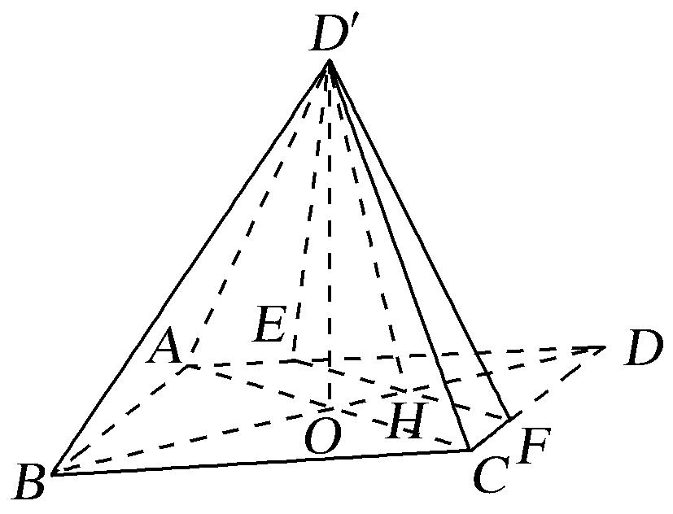
解析　（1）由已知得*AC*⊥*BD*，*AD*＝*CD*，又由*AE*＝*CF*得＝，故*AC*∥*EF*，
由此得*EF*⊥*HD*，故*EF*⊥*HD*′，所以*AC*⊥*HD*′．  
（2）由*EF*∥*AC*得＝＝．由*AB*＝5，*AC*＝6得*DO*＝*BO*＝＝4，
所以<em>OH</em>＝1，<em>D</em>′<em>H</em>＝<em>DH</em>＝3，于是<em>OD</em>′2＋<em>OH</em>2＝（2）2＋12＝9＝<em>D</em>′<em>H</em>2，故<em>OD</em>′⊥<em>OH</em>．
由（1）知*AC*⊥*HD*′，又*AC*⊥*BD*，*BD*∩*HD*′＝*H*，所以*AC*⊥平面*BHD*′，于是*AC*⊥*OD*′，
又由*OD*′⊥*OH*，*AC*∩*OH*＝*O*，所以*OD*′⊥平面*ABC*．又由＝得*EF*＝．

五边形*ABCFE*的面积*S*＝×6×8－××3＝．
所以五棱锥*D*′－*ABCFE*的体积*V*＝××2＝．

<strong>[例4]</strong> (2017·全国Ⅲ)如图，四面体<em>ABCD</em>中，△<em>ABC</em>是正三角形，<em>AD</em>＝<em>CD</em>．  
（1）证明：*AC*⊥*BD*；  
（2）已知△*ACD*是直角三角形，*AB*＝*BD*，若*E*为棱*BD*上与*D*不重合的点，且*AE*⊥*EC*，求四面体*ABCE*与四面体*ACDE*的体积比．

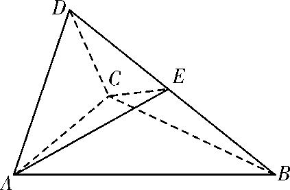
解析　（1）证明：取*AC*的中点*O*，连接*DO*，*BO*．因为*AD*＝*CD*，所以*AC*⊥*DO*．
又由于△*ABC*是正三角形，所以*AC*⊥*BO*．从而*AC*⊥平面*DOB*，故*AC*⊥*BD*．

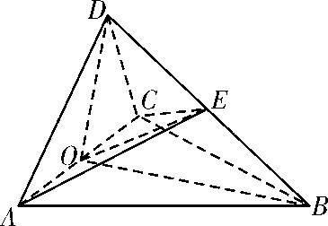  
（2）连接<em>EO</em>．由（1）及题设知∠<em>ADC</em>＝90°，所以<em>DO</em>＝<em>AO</em>．在Rt△<em>AOB</em>中，<em>BO</em>2＋<em>AO</em>2＝<em>AB</em>2，
又<em>AB</em>＝<em>BD</em>，所以<em>BO</em>2＋<em>DO</em>2＝<em>BO</em>2＋<em>AO</em>2＝<em>AB</em>2＝<em>BD</em>2，故∠<em>DOB</em>＝90°．
由题设知△*AEC*是直角三角形，所以*EO*＝*AC*．又△*ABC*是正三角形，且*AB*＝*BD*，
所以*EO*＝*BD*．故*E*为*BD*的中点，从而*E*到平面*ABC*的距离为*D*到平面*ABC*的距离的，

四面体*ABCE*的体积为四面体*ABCD*的体积的，即四面体*ABCE*与四面体*ACDE*的体积之比为1∶1．

<strong>[例5]</strong>如图，在Rt△<em>ABC</em>中，<em>AB</em>＝<em>BC</em>＝4，点<em>E</em>在线段<em>AB</em>上．过点<em>E</em>作<em>EF</em>∥<em>BC</em>交<em>AC</em>于点<em>F</em>，将△<em>AEF</em>沿<em>EF</em>折起到△<em>PEF</em>的位置(点<em>A</em>与<em>P</em>重合)，使得∠<em>PEB</em>＝30°．  
（1）求证：*EF*⊥*PB*；  
（2）试问：当点*E*在何处时，四棱锥*P*—*EFCB*的侧面*PEB*的面积最大？并求此时四棱锥*P*—*EFCB*的体积．

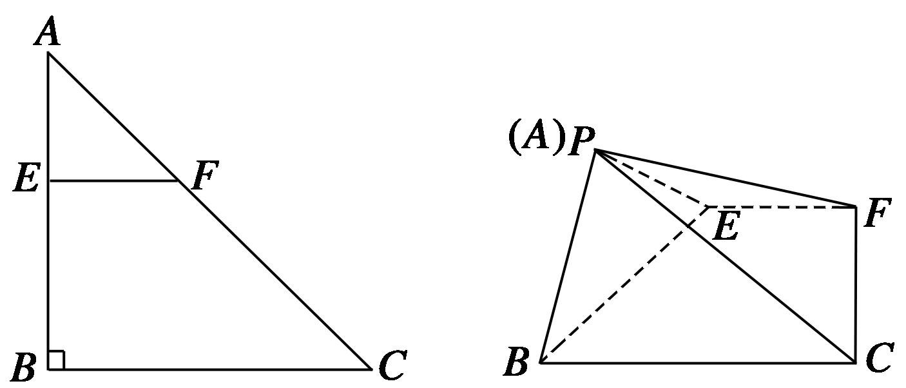
解析　（1）∵*EF*∥*BC*且*BC*⊥*AB*，∴*EF*⊥*AB*，即*EF*⊥*BE*，*EF*⊥*PE*.又*BE*∩*PE*＝*E*，
∴*EF*⊥平面*PBE*，又*PB*⊂平面*PBE*，∴*EF*⊥*PB*．  
（2）设<em>BE</em>＝<em>x</em>，<em>PE</em>＝<em>y</em>，则<em>x</em>＋<em>y</em>＝4．∴<em>S</em>△<em>PEB</em>＝<em>BE</em>·<em>PE</em>·sin∠<em>PEB</em>＝<em>xy</em>≤2＝1．
当且仅当<em>x</em>＝<em>y</em>＝2时，<em>S</em>△<em>PEB</em>的面积最大．此时，<em>BE</em>＝<em>PE</em>＝2．
由（1）知*EF*⊥平面*PBE*，∴平面*PBE*⊥平面*EFCB*，
在平面*PBE*中，作*PO*⊥*BE*于*O*，则*PO*⊥平面*EFCB*．即*PO*为四棱锥*P*—*EFCB*的高．
又<em>PO</em>＝<em>PE</em>·sin30°＝2×＝1．<em>SEFCB</em>＝×(2＋4)×2＝6．∴<em>VP</em>—<em>BCFE</em>＝×6×1＝2．

3．线面垂直＋体积模型

【例题选讲】

<strong>[例1]</strong>如图1，在直角梯形 <em>ABCD</em>中，<em>AD</em>∥<em>BC</em>，∠<em>BAD</em>＝，<em>AB</em>＝<em>BC</em>＝<em>AD</em>＝<em>a</em>，<em>E</em>是<em>AD</em>的中点，<em>O</em>是<em>AC</em>与<em>BE</em>的交点．将△<em>ABE</em>沿<em>BE</em>折起到图2中△<em>A</em>1<em>BE</em>的位置，得到四棱锥<em>A</em>1－<em>BCDE</em>．  
（1）证明：<em>CD</em>⊥平面<em>A</em>1<em>OC</em>；  
（2）当平面<em>A</em>1<em>BE</em>⊥平面<em>BCDE</em>时，四棱锥<em>A</em>1－<em>BCDE</em>的体积为36，求<em>a</em>的值．

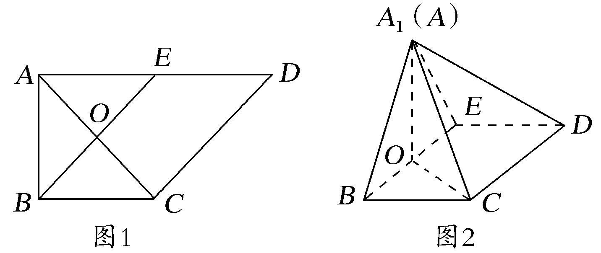
解析　（1）在图1中，因为*AB*＝*BC*＝*AD*＝*a*，*E*是*AD*的中点，∠*BAD*＝，所以*BE*⊥*AC*，
即在图2中，<em>BE</em>⊥<em>A</em>1<em>O</em>，<em>BE</em>⊥<em>OC</em>，从而<em>BE</em>⊥平面<em>A</em>1<em>OC</em>．又<em>CD</em>∥<em>BE</em>，所以<em>CD</em>⊥平面<em>A</em>1<em>OC</em>．  
（2）由已知，平面<em>A</em>1<em>BE</em>⊥平面<em>BCDE</em>，又由（1）知，<em>OA</em>1⊥<em>BE</em>，所以<em>A</em>1<em>O</em>⊥平面<em>BCDE</em>，
即<em>A</em>1<em>O</em>是四棱锥<em>A</em>1－<em>BCDE</em>的高，由图1可知，<em>A</em>1<em>O</em>＝<em>AB</em>＝<em>a</em>，

平行四边形<em>BCDE</em>的面积<em>S</em>＝<em>BC</em>·<em>AB</em>＝<em>a</em>2，
从而四棱锥<em>A</em>1－<em>BCDE</em>的体积为<em>V</em>＝×<em>S</em>×<em>A</em>1<em>O</em>＝×<em>a</em>2×<em>a</em>＝<em>a</em>3，由<em>a</em>3＝36，得<em>a</em>＝6．

<strong>[例2]</strong>如图①，在直角梯形<em>ABCD</em>中，∠<em>ADC</em>＝90°，<em>AB</em>∥<em>CD</em>，<em>AD</em>＝<em>CD</em>＝<em>AB</em>＝2，<em>E</em>为<em>AC</em>的中点，将△<em>ACD</em>沿<em>AC</em>折起，使折起后的平面<em>ACD</em>与平面<em>ABC</em>垂直，如图②．在图②所示的几何体<em>D</em>­<em>ABC</em>中．

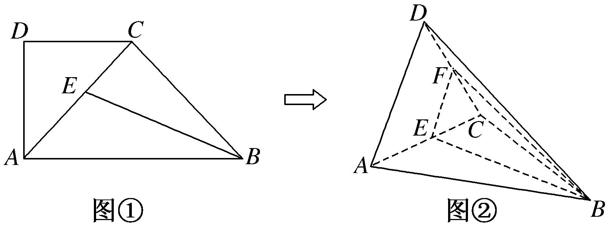  
（1）求证：*BC*⊥平面*ACD*；  
（2）点*F*在棱*CD*上，且满足*AD*∥平面*BEF*，求几何体*F－BCE*的体积．
解析　（1）∵*AC*＝＝2，∠*BAC*＝∠*ACD*＝45°，*AB*＝4，
∴在△<em>ABC</em>中，<em>BC</em>2＝<em>AC</em>2＋<em>AB</em>2－2<em>AC</em>×<em>AB</em>×cos 45°＝8，∴<em>AB</em>2＝<em>AC</em>2＋<em>BC</em>2＝16，∴<em>AC</em>⊥<em>BC</em>，
∵平面*ACD*⊥平面*ABC*，平面*ACD*∩平面*ABC*＝*AC*，*BC*⊂平面*ABC*，∴*BC*⊥平面*ACD*．  
（2）∵*AD*∥平面*BEF*，*AD*⊂平面*ACD*，平面*ACD*∩平面*BEF*＝*EF*，∴*AD*∥*EF*，
∵*E*为*AC*的中点，∴*EF*为△*ACD*的中位线，
由（1）知，<em>VF</em>­<em>BCE</em>＝<em>VB</em>­<em>CEF</em>＝×<em>S</em>△<em>CEF</em>×<em>BC</em>，<em>S</em>△<em>CEF</em>＝<em>S</em>△<em>ACD</em>＝××2×2＝，∴<em>VF</em>­<em>BCE</em>＝××2＝．

<strong>[例3]</strong>如图，在四棱锥<em>P</em>­<em>ABCD</em>中，底面<em>ABCD</em>是菱形，∠<em>BAD</em>＝60°，<em>PA</em>＝<em>PD</em>＝<em>AD</em>＝2，点<em>M</em>在线段<em>PC</em>上，且<em>PM</em>＝2<em>MC</em>，<em>N</em>为<em>AD</em>的中点．  
（1）求证：*AD*⊥平面*PNB*；  
（2）若平面*PAD*⊥平面*ABCD*，求三棱锥*P*－*NBM*的体积．

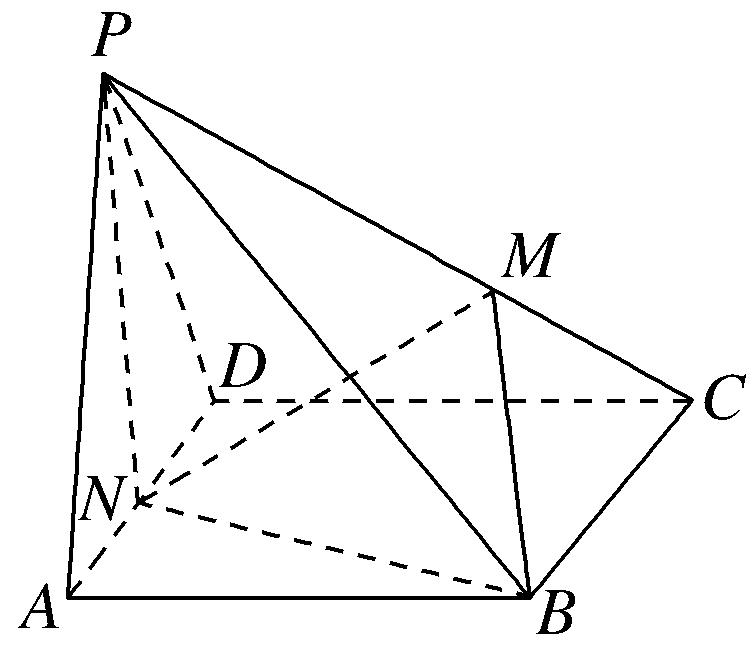
解析　（1）连接*BD*．∵*PA*＝*PD*，*N*为*AD*的中点，∴*PN*⊥*AD*．
又底面*ABCD*是菱形，∠*BAD*＝60°，∴△*ABD*为等边三角形，∴*BN*⊥*AD*，
又*PN*∩*BN*＝*N*，∴*AD*⊥平面*PNB*．

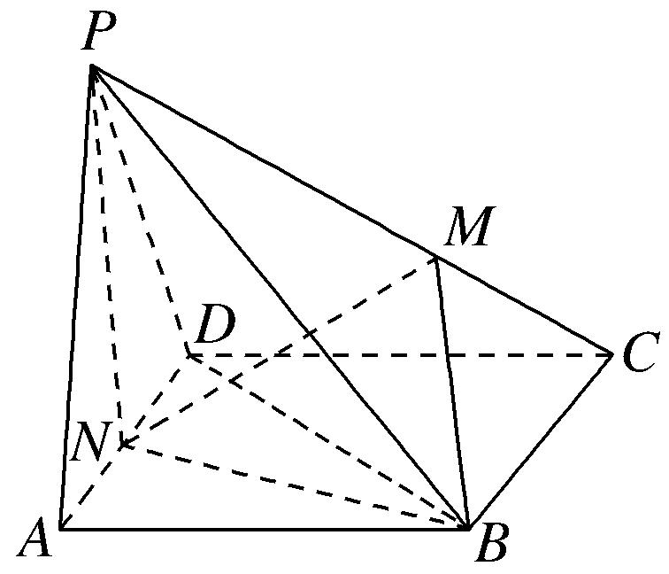  
（2）∵*PA*＝*PD*＝*AD*＝2，∴*PN*＝*NB*＝．
又平面*PAD*⊥平面*ABCD*，平面*PAD*∩平面*ABCD*＝*AD*，*PN*⊥*AD*，∴*PN*⊥平面*ABCD*，
∴<em>PN</em>⊥<em>NB</em>，∴<em>S</em>△<em>PNB</em>＝××＝．∵<em>AD</em>⊥平面<em>PNB</em>，<em>AD</em>∥<em>BC</em>，∴<em>BC</em>⊥平面<em>PNB</em>．又<em>PM</em>＝2<em>MC</em>，
∴<em>VP</em>­<em>NBM</em>＝<em>VM</em>­<em>PNB</em>＝<em>VC</em>­<em>PNB</em>＝×××2＝．

<strong>[例4]</strong>(2014·重庆)如图，四棱锥<em>P</em>－<em>ABCD</em>中，底面是以<em>O</em>为中心的菱形，<em>PO</em>⊥底面<em>ABCD</em>，<em>AB</em>＝2，∠<em>BAD</em>＝，<em>M</em>为<em>BC</em>上一点，且<em>BM</em>＝．  
（1）证明：*BC*⊥平面*POM*；  
（2）若*MP*⊥*AP*，求四棱锥*P*－*ABMO*的体积．

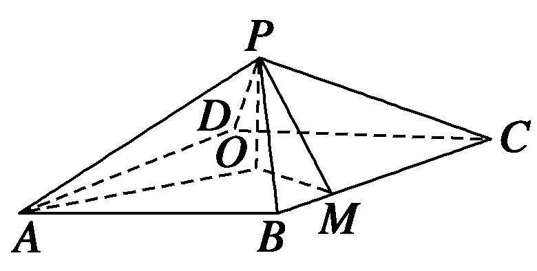
解析　（1）如图，因为四边形*ABCD*为菱形，*O*为菱形中心，连接*OB*，则*AO*⊥*OB*．因为∠*BAD*＝，
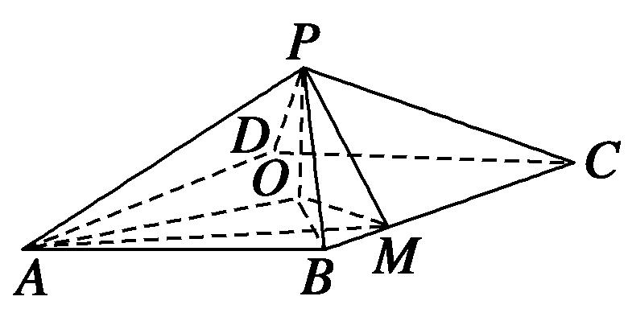
故*OB*＝*AB*·sin∠*OAB*＝2sin＝1，又因为*BM*＝，且∠*OBM*＝，在△*OBM*中，

<em>OM</em>2＝<em>OB</em>2＋<em>BM</em>2－2<em>OB</em>·<em>BM</em>·cos∠<em>OBM</em>＝12＋()2－2·1··cos＝．
所以<em>OB</em>2＝<em>OM</em>2＋<em>BM</em>2，故<em>OM</em>⊥<em>BM</em>．又<em>PO</em>⊥底面<em>ABCD</em>，所以<em>PO</em>⊥<em>BC</em>．
从而*BC*与平面*POM*内两条相交直线*OM*，*PO*都垂直，所以*BC*⊥平面*POM*．  
（2）由（1）可得，*OA*＝*AB*·cos∠*OAB*＝2·cos＝．
设<em>PO</em>＝<em>a</em>，由<em>PO</em>⊥底面<em>ABCD</em>知，△<em>POA</em>为直角三角形，故<em>PA</em>2＝<em>PO</em>2＋<em>OA</em>2＝<em>a</em>2＋3．
由△<em>POM</em>也是直角三角形，故<em>PM</em>2＝<em>PO</em>2＋<em>OM</em>2＝<em>a</em>2＋．

连接<em>AM</em>，在△<em>ABM</em>中，<em>AM</em>2＝<em>AB</em>2＋<em>BM</em>2－2<em>AB</em>·<em>BM</em>·cos∠<em>ABM</em>＝22＋()2－2·2··cos＝．
由已知<em>MP</em>⊥<em>AP</em>，故△<em>APM</em>为直角三角形，则<em>PA</em>2＋<em>PM</em>2＝<em>AM</em>2，即<em>a</em>2＋3＋<em>a</em>2＋＝，
得*a*＝，*a*＝－(舍去)，即*PO*＝，
此时<em>S</em>四边形<em>ABMO</em>＝<em>S</em>△<em>AOB</em>＋<em>S</em>△<em>OMB</em>＝·<em>AO</em>·<em>OB</em>＋·<em>BM</em>·<em>OM</em>＝··1＋··＝．
所以四棱锥<em>P</em>－<em>ABMO</em>的体积<em>VP</em>－<em>ABMO</em>＝·<em>S</em>四边形<em>ABMO</em>·<em>PO</em>＝··＝．

<strong>[例5]</strong>如图，正方形<em>ABCD</em>的边长为2，<em>PA</em>⊥平面<em>ABCD</em>，<em>PA</em>＝2，平面<em>EBC</em>⊥平面<em>ABCD</em>，<em>EB</em>＝<em>EC</em>＝．  
（1）在*CD*上是否存在一点*F*，使得*BF*⊥平面*PAE*？若存在，确定点*F*的位置；若不存在，请说明理由．  
（2）求多面体*PABCDE*的体积．

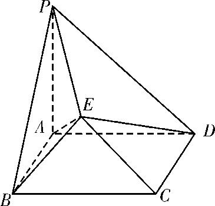
解析　（1）在*CD*上存在点*F*满足题意，且点*F*为*CD*的中点．证明如下：
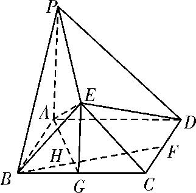
如图，取*BC*的中点*G*，连接*AG*，*GE*，由*BC*＝2，*EB*＝*EC*＝得*EG*⊥*BC*，且*EG*＝1．
又平面*EBC*⊥平面*ABCD*，平面*EBC*∩平面*ABCD*＝*BC*，

所以*EG*⊥平面*ABCD*，又*PA*⊥平面*ABCD*，*PA*＝2，所以*EGPA*，*P*，*A*，*E*，*G*四点共面．

取*CD*的中点*F*，连接*BF*，在正方形*ABCD*中，易得∠*BAG*＝∠*CBF*，所以*BF*⊥*AG*，
又*PA*⊥平面*ABCD*，*BF*⊂平面*ABCD*，所以*BF*⊥*PA*，又*PA*∩*AG*＝*A*，所以*BF*⊥平面*PAE*．  
（2）多面体<em>PABCDE</em>的体积<em>VPABCDE</em>＝<em>VE</em>－<em>PAB</em>＋<em>VE</em>－<em>PAD</em>＋<em>VE</em>－<em>ABCD</em>．
因为*EG*∥*PA*，*PA*⊂平面*PAB*，所以*EG*∥平面*PAB*，
即点*E*到平面*PAB*的距离与点*G*到平面*PAB*的距离相等，

同理可证点*E*到平面*PAD*的距离与点*C*到平面*PAD*的距离相等．
所以<em>VE</em>－<em>PAB</em>＝××2×2×1＝，所以<em>VE</em>－<em>PAD</em>＝××2×2×2＝，
所以<em>VE</em>－<em>ABCD</em>＝×2×2×1＝，故<em>VPABCDE</em>＝．

【对点训练】

1．如图，在直三棱柱<em>ABC－A</em>1<em>B</em>1<em>C</em>1中，<em>AB</em>＝<em>AC</em>＝<em>AA</em>1＝3，<em>BC</em>＝2，<em>D</em>是<em>BC</em>的中点，<em>F</em>是<em>CC</em>1上一点．  
（1）当<em>CF</em>＝2时，证明：<em>B</em>1<em>F</em>⊥平面<em>ADF</em>；  
（2）若<em>FD</em>⊥<em>B</em>1<em>D</em>，求三棱锥<em>B</em>1－<em>ADF</em>的体积．

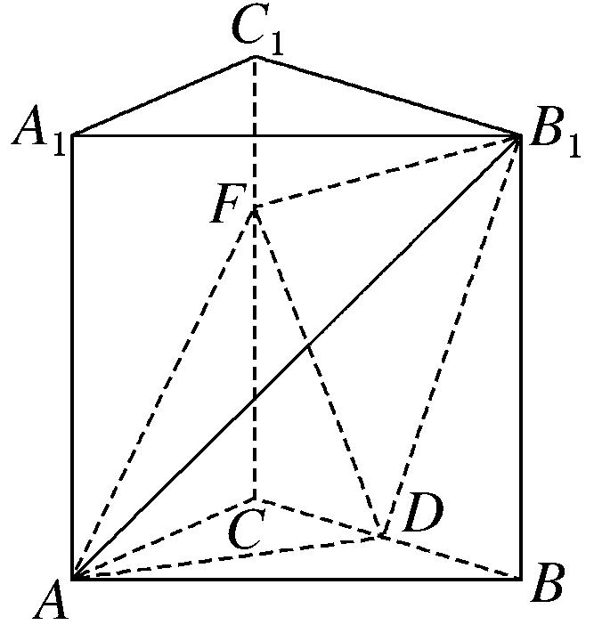

1．解析　（1）因为*AB*＝*AC*，*D*是*BC*的中点，所以*AD*⊥*BC*．
在直三棱柱<em>ABC</em>­<em>A</em>1<em>B</em>1<em>C</em>1中，因为<em>BB</em>1⊥底面<em>ABC</em>，<em>AD</em>⊂底面<em>ABC</em>，所以<em>AD</em>⊥<em>B</em>1<em>B</em>．
因为<em>BC</em>∩<em>B</em>1<em>B</em>＝<em>B</em>，所以<em>AD</em>⊥平面<em>B</em>1<em>BCC</em>1．因为<em>B</em>1<em>F</em>⊂平面<em>B</em>1<em>BCC</em>1，所以<em>AD</em>⊥<em>B</em>1<em>F</em>．
在矩形<em>B</em>1<em>BCC</em>1中，因为<em>C</em>1<em>F</em>＝<em>CD</em>＝1，<em>B</em>1<em>C</em>1＝<em>CF</em>＝2，所以Rt△<em>DCF</em>≌Rt△<em>FC</em>1<em>B</em>1，
所以∠<em>CFD</em>＝∠<em>C</em>1<em>B</em>1<em>F</em>，所以∠<em>B</em>1<em>FD</em>＝90°，所以<em>B</em>1<em>F</em>⊥<em>FD</em>．
因为<em>AD</em>∩<em>FD</em>＝<em>D</em>，所以<em>B</em>1<em>F</em>⊥平面<em>ADF</em>．  
（2）由（1）知<em>AD</em>⊥平面<em>B</em>1<em>DF</em>，<em>CD</em>＝1，<em>AD</em>＝2，
在Rt△<em>B</em>1<em>BD</em>中，<em>BD</em>＝<em>CD</em>＝1，<em>BB</em>1＝3，所以<em>B</em>1<em>D</em>＝＝．
因为<em>FD</em>⊥<em>B</em>1<em>D</em>，所以Rt△<em>CDF</em>∽Rt△<em>BB</em>1<em>D</em>，所以＝，即<em>DF</em>＝×＝，
所以<em>VB</em>1­<em>ADF</em>＝<em>VA</em>­<em>B</em>1<em>DF</em>＝<em>S</em>△<em>B</em>1<em>DF</em>×<em>AD</em>＝××××2＝．

2．如图，在直三棱柱<em>ABC－A</em>1<em>B</em>1<em>C</em>1中，<em>AB</em>＝<em>BC</em>＝<em>BB</em>1，<em>AB</em>1∩<em>A</em>1<em>B</em>＝<em>E</em>，<em>D</em>为<em>AC</em>上的点，<em>B</em>1<em>C</em>∥平面<em>A</em>1<em>BD</em>．  
（1）求证：<em>BD</em>⊥平面<em>A</em>1<em>ACC</em>1；  
（2）若<em>AB</em>＝1，且<em>AC</em>·<em>AD</em>＝1，求三棱锥<em>A</em>－<em>BCB</em>1的体积．

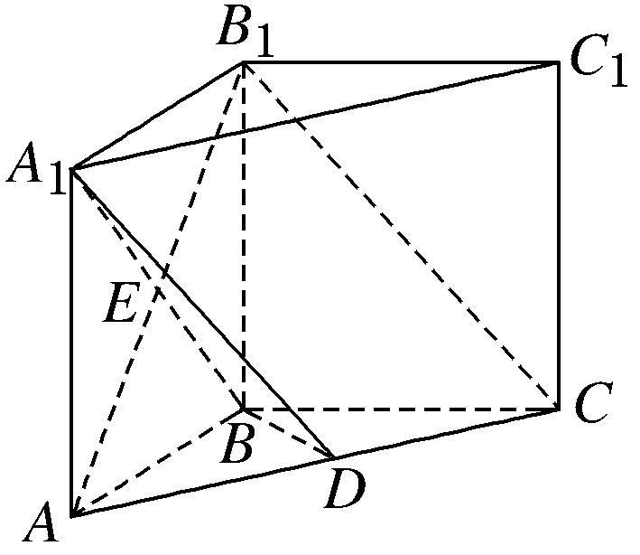

2．解析　（1）如图，连接<em>ED</em>，∵平面<em>AB</em>1<em>C</em>∩平面<em>A</em>1<em>BD</em>＝<em>ED</em>，<em>B</em>1<em>C</em>∥平面<em>A</em>1<em>BD</em>，∴<em>B</em>1<em>C</em>∥<em>ED</em>，
∵<em>E</em>为<em>AB</em>1的中点，∴<em>D</em>为<em>AC</em>的中点，∵<em>AB</em>＝<em>BC</em>，∴<em>BD</em>⊥<em>AC</em>．
∵<em>A</em>1<em>A</em>⊥平面<em>ABC</em>，<em>BD</em>⊂平面<em>ABC</em>，∴<em>A</em>1<em>A</em>⊥<em>BD</em>．
又∵<em>A</em>1<em>A</em>，<em>AC</em>是平面<em>A</em>1<em>ACC</em>1内的两条相交直线，∴<em>BD</em>⊥平面<em>A</em>1<em>ACC</em>1．

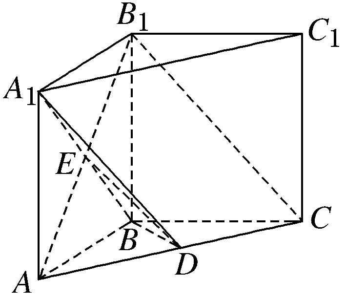  
（2）由<em>AB</em>＝1，得<em>BC</em>＝<em>BB</em>1＝1，由（1）知<em>AD</em>＝<em>AC</em>，又<em>AC</em>·<em>AD</em>＝1，∴<em>AC</em>2＝2，
∴<em>AC</em>2＝2＝<em>AB</em>2＋<em>BC</em>2，∴<em>AB</em>⊥<em>BC</em>，∴<em>S</em>△<em>ABC</em>＝<em>AB</em>·<em>BC</em>＝，
∴<em>VA</em>­<em>BCB</em>1＝<em>VB</em>1­ <em>ABC</em>＝<em>S</em>△<em>ABC</em>·<em>BB</em>1＝××1＝．

3．(2014·广东)如图（1），四边形*ABCD*为矩形，*PD*⊥平面*ABCD*，*AB*＝1，*BC*＝*PC*＝2，作如图（2）折叠，

折痕*EF*∥*DC*．其中点*E*，*F*分别在线段*PD*，*PC*上，沿*EF*折叠后点*P*叠在线段*AD*上的点记为*M*，并且*MF*⊥*CF*．  
（1）证明：*CF*⊥平面*MDF*；  
（2）求三棱锥*M*－*CDE*的体积．

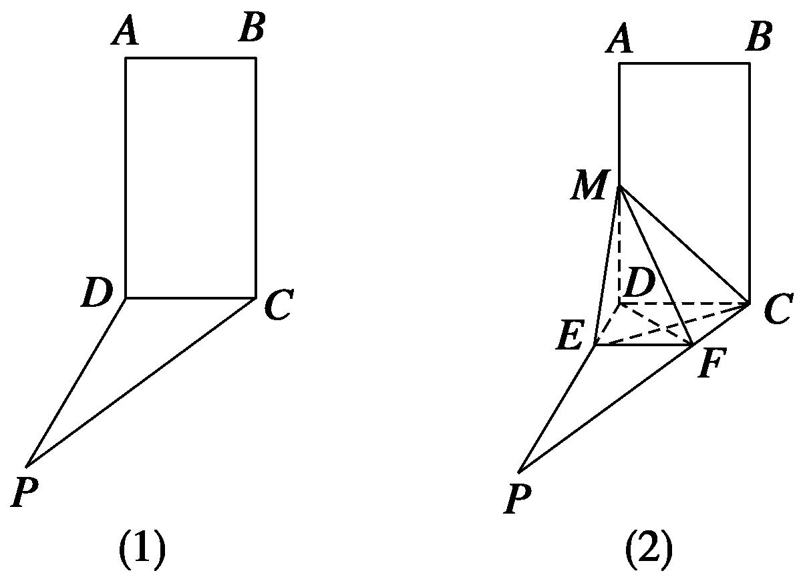

3．解析　（1）因为*PD*⊥平面*ABCD*，*AD*⊂平面*ABCD*，所以*PD*⊥*AD*．
又因为*ABCD*是矩形，*CD*⊥*AD*，*PD*与*CD*交于点*D*，所以*AD*⊥平面*PCD*.又*CF*⊂平面*PCD*，
所以*AD*⊥*CF*，即*MD*⊥*CF*．又*MF*⊥*CF*，*MD*∩*MF*＝*M*，所以*CF*⊥平面*MDF*．

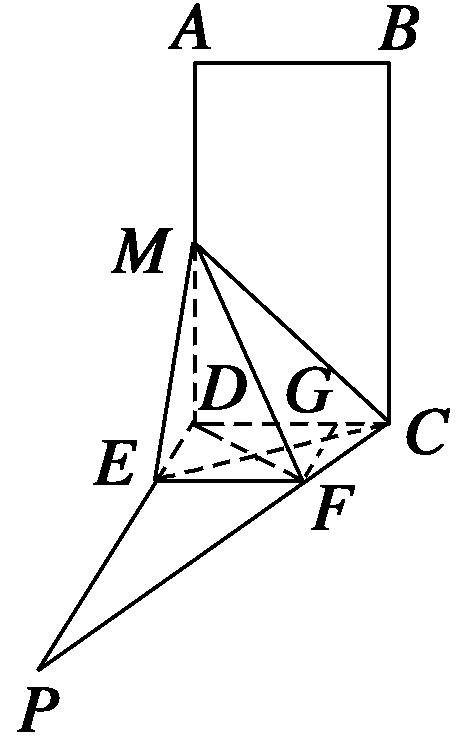  
（2）因为*PD*⊥*DC*，*BC*＝2，*CD*＝1，∠*PCD*＝60°，所以*PD*＝，由（1）知*FD*⊥*CF*，
在直角三角形*DCF*中，*CF*＝*CD*＝．过点*F*作*FG*⊥*CD*交*CD*于点*G*，得

*FG*＝*FC*sin60°＝×＝，所以*DE*＝*FG*＝，
故*ME*＝*PE*＝－＝，所以*MD*＝＝＝．

<em>S</em>△<em>CDE</em>＝<em>DE</em>·<em>DC</em>＝××1＝．故<em>VM</em>－<em>CDE</em>＝<em>MD</em>·<em>S</em>△<em>CDE</em>＝××＝．

4．如图，△*ABC*内接于圆*O*，*AB*是圆*O*的直径，四边形*DCBE*为平行四边形，*DC*⊥平面*ABC*，*AB*＝2，

*EB*＝．  
（1）求证：*DE*⊥平面*ACD*；  
（2）设*AC*＝*x*，*V*(*x*)表示三棱锥*B*－*ACE*的体积，求函数*V*(*x*)的解析式及最大值．

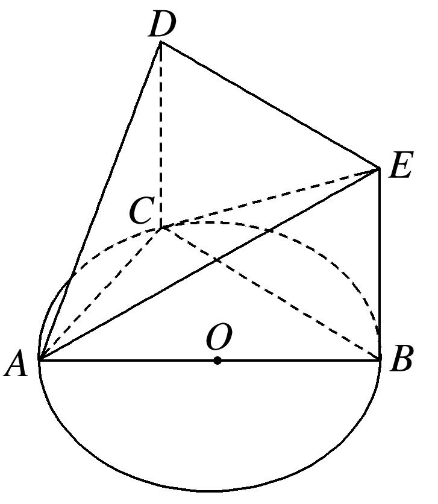

4．解析　（1）∵四边形*DCBE*为平行四边形，∴*CD*∥*BE*，*BC*∥*DE*．
∵*DC*⊥平面*ABC*，*BC*⊂平面*ABC*，∴*DC*⊥*BC*．
∵*AB*是圆*O*的直径，∴*BC*⊥*AC*，且*DC*∩*AC*＝*C*，*DC*，*AC*⊂平面*ADC*，
∴*BC*⊥平面*ADC*．∵*DE*∥*BC*，∴*DE*⊥平面*ADC*．  
（2）∵*DC*⊥平面*ABC*，∴*BE*⊥平面*ABC*．在Rt△*ABE*中，*AB*＝2，*EB*＝．
在Rt△<em>ABC</em>中，∵<em>AC</em>＝<em>x</em>，∴<em>BC</em>＝(0&lt;<em>x</em>&lt;2)，∴<em>S</em>△<em>ABC</em>＝<em>AC</em>·<em>BC</em>＝<em>x</em>·，
∴<em>V</em>(<em>x</em>)＝<em>V</em>三棱锥<em>E</em>－<em>ABC</em>＝<em>x</em>·(0&lt;<em>x</em>&lt;2)．∵<em>x</em>2(4－<em>x</em>2)≤2＝4，
当且仅当<em>x</em>2＝4－<em>x</em>2，即<em>x</em>＝时取等号，∴当<em>x</em>＝时，体积有最大值．

5．《九章算术》是我国古代内容极为丰富的数学名著，书中将底面为直角三角形的直棱柱称为堑堵，将

底面为矩形的棱台称为刍童．在如图所示的堑堵<em>ABM</em>—<em>DCP</em>与刍童<em>ABCD</em>—<em>A</em>1<em>B</em>1<em>C</em>1<em>D</em>1的组合体中，<em>AB</em>＝<em>AD</em>，<em>A</em>1<em>B</em>1＝<em>A</em>1<em>D</em>1．台体体积公式：<em>V</em>＝(<em>S</em>′＋＋<em>S</em>)<em>h</em>，其中<em>S</em>′，<em>S</em>分别为台体上、下底面的面积，<em>h</em>为台体的高．  
（1）证明：*BD*⊥平面*MAC*；  
（2）若<em>AB</em>＝1，<em>A</em>1<em>D</em>1＝2，<em>MA</em>＝，三棱锥<em>A</em>—<em>A</em>1<em>B</em>1<em>D</em>1的体积<em>V</em>′＝，求该组合体的体积．

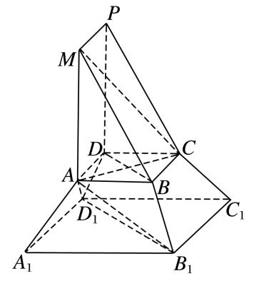

5．解析　（1）由题意可知*ABM*—*DCP*是底面为直角三角形的直棱柱，∴*AD*⊥平面*MAB*，∴*AD*⊥*MA*，
又*MA*⊥*AB*，*AD*∩*AB*＝*A*，*AD*，*AB*⊂平面*ABCD*，∴*MA*⊥平面*ABCD*，∴*MA*⊥*BD*．
又*AB*＝*AD*，∴四边形*ABCD*为正方形，∴*BD*⊥*AC*，又*MA*∩*AC*＝*A*，*MA*，*AC*⊂平面*MAC*，
∴*BD*⊥平面*MAC*．  
（2）设刍童<em>ABCD</em>—<em>A</em>1<em>B</em>1<em>C</em>1<em>D</em>1的高为<em>h</em>，则三棱锥<em>A</em>—<em>A</em>1<em>B</em>1<em>D</em>1的体积<em>V</em>′＝××2×2×<em>h</em>＝，
∴<em>h</em>＝，故该组合体的体积<em>V</em>＝×1××1＋×(12＋22＋)×＝＋＝．

4．面面垂直＋体积模型

【例题选讲】

<strong>[例1]</strong>(2020·全国Ⅰ)如图，<em>D</em>为圆锥的顶点，<em>O</em>是圆锥底面的圆心，△<em>ABC</em>是底面的内接正三角形，<em>P</em>为<em>DO</em>上一点，∠<em>APC</em>＝90°．  
（1）证明：平面*PAB*⊥平面*PAC*；  
（2）设*DO*＝，圆锥的侧面积为π，求三棱锥*P*－*ABC*的体积．

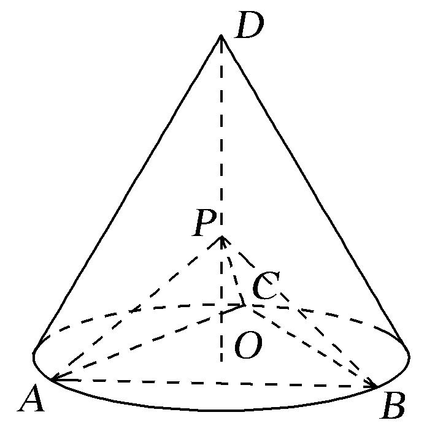
解析　（1）由题设可知，*PA*＝*PB*＝*PC*．由△*ABC*是正三角形，可得△*PAC*≌△*PAB*，△*PAC*≌△*PBC*．
又∠*APC*＝90°，故∠*APB*＝90°，∠*BPC*＝90°．
从而*PB*⊥*PA*，*PB*⊥*PC*，又*PA*，*PC*⊂平面*PAC*，*PA*∩*PC*＝*P*，
故*PB*⊥平面*PAC*，又*PB*⊂平面*PAB*，所以平面*PAB*⊥平面*PAC*．  
（2）设圆锥的底面半径为<em>r</em>，母线长为<em>l</em>，由题设可得<em>rl</em>＝，<em>l</em>2－<em>r</em>2＝2，解得<em>r</em>＝1，<em>l</em>＝．
从而<em>AB</em>＝．由（1）可得<em>PA</em>2＋<em>PB</em>2＝<em>AB</em>2，故<em>PA</em>＝<em>PB</em>＝<em>PC</em>＝．
所以三棱锥*P*－*ABC*的体积为··*PA*·*PB*·*PC*＝××＝．

<strong>[例2]</strong>(2018·全国Ⅰ)如图，在平行四边形<em>ABCM</em>中，<em>AB</em>＝<em>AC</em>＝3，∠<em>ACM</em>＝90°．以<em>AC</em>为折痕将△<em>ACM</em>折起，使点<em>M</em>到达点<em>D</em>的位置，且<em>AB</em>⊥<em>DA</em>．  
（1）证明：平面*ACD*⊥平面*ABC*；  
（2）*Q*为线段*AD*上一点，*P*为线段*BC*上一点，且*BP*＝*DQ*＝*DA*，求三棱锥Q－*ABP*的体积．

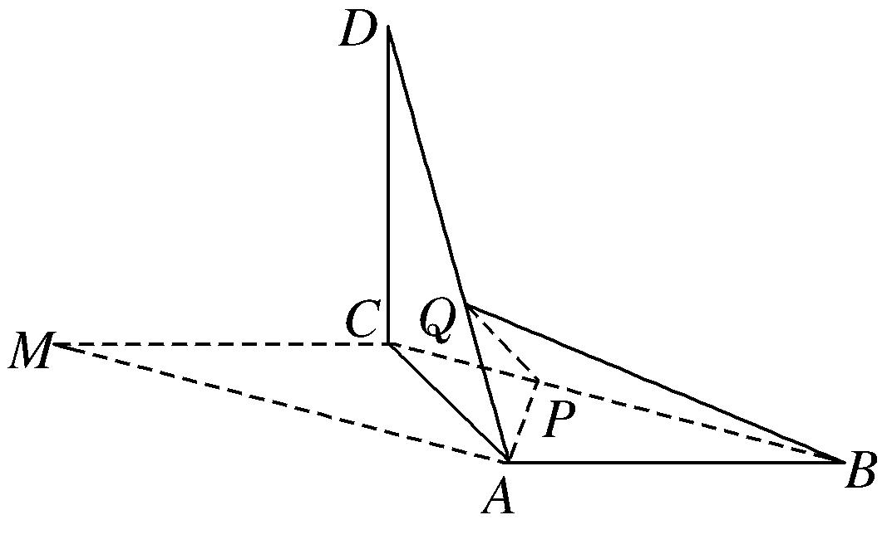
解析　（1）由已知可得，∠*BAC*＝90°，即*BA*⊥*AC*．
又因为*BA*⊥*AD*，*AC*∩*AD*＝*A*，所以*AB*⊥平面*ACD*．
因为*AB*⊂平面*ABC*，所以平面*ACD*⊥平面*ABC*．  
（2）由已知可得，*DC*＝*CM*＝*AB*＝3，*DA*＝3．又*BP*＝*D*Q＝*DA*，所以*BP*＝2．

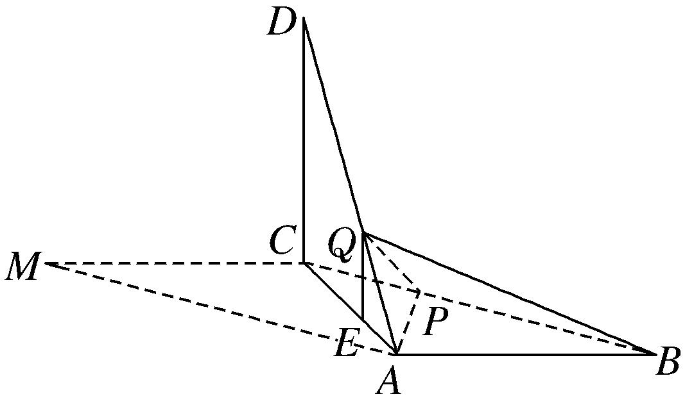

如图，过点*Q*作*QE*⊥*AC*，垂足为*E*，则*QEDC*．
由已知及（1）可得，*DC*⊥平面*ABC*，所以*QE*⊥平面*ABC*，*QE*＝1．
因此，三棱锥<em>Q－ABP</em>的体积为<em>VQ</em>­<em>ABP</em>＝×<em>S</em>△<em>ABP</em>×<em>QE</em>＝××3×2sin 45°×1＝1．

<strong>[例3]</strong>如图所示，<em>AB</em>为圆<em>O</em>的直径，点<em>E</em>，<em>F</em>在圆<em>O</em>上，<em>AB</em>∥<em>EF</em>，矩形<em>ABCD</em>所在平面和圆<em>O</em>所在平面垂直，已知<em>AB</em>＝2，<em>EF</em>＝1．  
（1）求证：平面*DAF*⊥平面*CBF*；  
（2）若*BC*＝1，求四棱锥*F*－*ABCD*的体积．

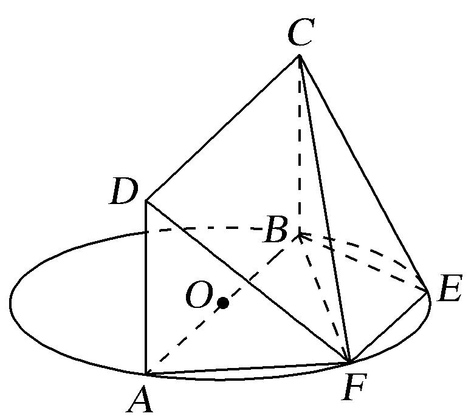
解析　（1）因为*AB*为圆*O*的直径，点*F*在圆*O*上，所以*AF*⊥*BF*．
又矩形*ABCD*所在平面和圆*O*所在平面垂直，且两平面的交线为*AB*，*CB*⊥*AB*，*CB*⊂平面*ABCD*，
所以*CB*⊥圆*O*所在平面，所以*AF*⊥*BC*．
又*BC*，*BF*为平面*CBF*内两条相交直线，所以*AF*⊥平面*CBF*．
又*AF*⊂平面*DAF*，所以平面*DAF*⊥平面*CBF*．  
（2）连接*OE*，*OF*，如图所示，

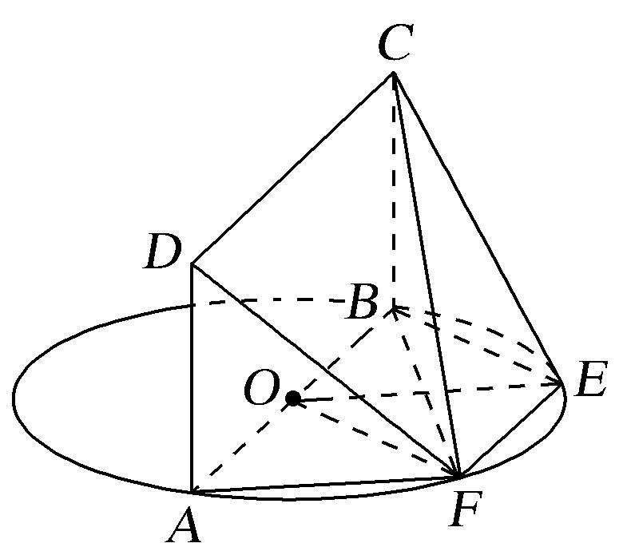
因为*AB*＝2，*EF*＝1，*AB*∥*EF*，则四边形*OEFA*为菱形，
所以*AF*＝*OE*＝*OA*＝1，所以*AF*＝*OA*＝*OF*＝1，则△*OAF*为等边三角形．
在等边三角形*OAF*中，点*F*到边*OA*的距离为．
又矩形*ABCD*所在平面和圆*O*所在平面垂直，且两平面的交线为*AB*，
所以点*F*到边*OA*的距离即四棱锥*F*－*ABCD*的高，所以四棱锥*F*－*ABCD*的高*h*＝．
又*BC*＝1，所以矩形*ABCD*的面积*S*＝*AB*×*BC*＝2×1＝2．
故<em>V</em>四棱锥<em>F</em>－<em>ABCD</em>＝×2×＝．

<strong>[例4]</strong>五边形<em>ANB</em>1<em>C</em>1<em>C</em>是由一个梯形<em>ANB</em>1<em>B</em>与一个矩形<em>BB</em>1<em>C</em>1<em>C</em>组成的，如图甲所示，<em>B</em>为<em>AC</em>的中点，<em>AC</em>＝<em>CC</em>1＝2<em>AN</em>＝8．沿虚线<em>BB</em>1将五边形<em>ANB</em>1<em>C</em>1<em>C</em>折成直二面角<em>A</em>—<em>BB</em>1—<em>C</em>，如图乙所示．  
（1）求证：平面<em>BNC</em>⊥平面<em>C</em>1<em>B</em>1<em>N</em>；  
（2）求图乙中的多面体的体积．

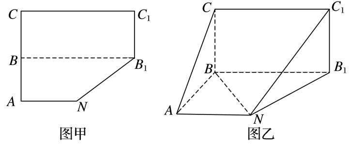
解析　（1）四边形<em>BB</em>1<em>C</em>1<em>C</em>为矩形，故<em>B</em>1<em>C</em>1⊥<em>BB</em>1，又由于二面角<em>A</em>—<em>BB</em>1—<em>C</em>为直二面角，
故<em>B</em>1<em>C</em>1⊥平面<em>BB</em>1<em>A</em>，又<em>BN</em>⊂平面<em>BB</em>1<em>A</em>，故<em>B</em>1<em>C</em>1⊥<em>BN</em>，
由线段<em>AC</em>＝<em>CC</em>1＝2<em>AN</em>＝8知，<em>BB</em>＝<em>NB</em>＋<em>BN</em>2，即<em>BN</em>⊥<em>NB</em>1，又<em>B</em>1<em>C</em>1∩<em>NB</em>1＝<em>B</em>1，

<em>B</em>1<em>C</em>1，<em>NB</em>1⊂平面<em>NB</em>1<em>C</em>1，所以<em>BN</em>⊥平面<em>C</em>1<em>B</em>1<em>N</em>，因为<em>BN</em>⊂平面<em>BNC</em>，所以平面<em>BNC</em>⊥平面<em>C</em>1<em>B</em>1<em>N</em>．

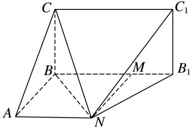  
（2）连接<em>CN</em>，过<em>N</em>作<em>NM</em>⊥<em>BB</em>1，垂足为<em>M</em>，<em>V</em>三棱锥<em>C</em>—<em>ABN</em>＝×<em>BC</em>·<em>S</em>△<em>ABN</em>＝×4××4×4＝，
又<em>B</em>1<em>C</em>1⊥平面<em>ABB</em>1<em>N</em>，所以平面<em>CBB</em>1<em>C</em>1⊥平面<em>ABB</em>1<em>N</em>，

且平面<em>CBB</em>1<em>C</em>1∩<em>ABB</em>1<em>N</em>＝<em>BB</em>1，<em>NM</em>⊥<em>BB</em>1，<em>NM</em>⊂平面<em>ABB</em>1<em>N</em>，所以<em>NM</em>⊥平面<em>B</em>1<em>C</em>1<em>CB</em>，

＝×4×4×8＝，

则此几何体的体积<em>V</em>＝<em>V</em>三棱锥<em>C</em>—<em>ABN</em>＋＝＋＝．

【对点训练】

1．如图，三棱锥*P*－*ABC*中，底面*ABC*是边长为2的正三角形，*PA*⊥*PC*，*PB*＝2．  
（1）求证：平面*PAC*⊥平面*ABC*；  
（2）若*PA*＝*PC*，求三棱锥*P*－*ABC*的体积．

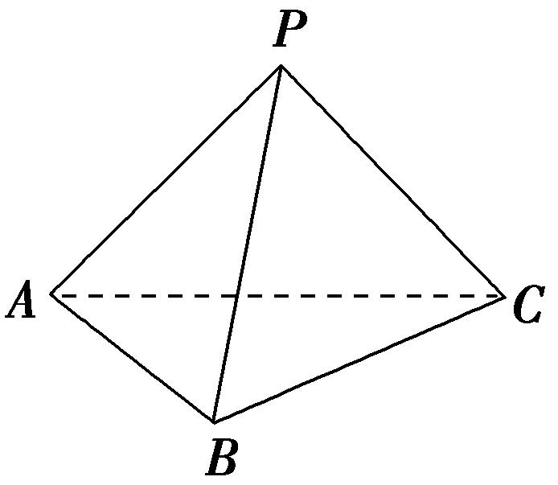

1．解析：（1）证明：如图，取*AC*的中点*O*，连接*BO*，*PO*．
因为△*ABC*是边长为2的正三角形，所以*BO*⊥*AC*，*BO*＝．
因为<em>PA</em>⊥<em>PC</em>，所以<em>PO</em>＝<em>AC</em>＝1．因为<em>PB</em>＝2，所以<em>OP</em>2＋<em>OB</em>2＝<em>PB</em>2，所以<em>PO</em>⊥<em>OB</em>．
因为*AC*∩*OP*＝*O*，所以*BO*⊥平面*PAC*．又*OB*⊂平面*ABC*，
所以平面*PAC*⊥平面*ABC*．

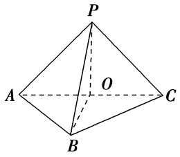  
（2）因为*PA*＝*PC*，*PA*⊥*PC*，*AC*＝2，所以*PA*＝*PC*＝．由（1）知*BO*⊥平面*PAC*，
所以<em>VP</em>­<em>ABC</em>＝<em>S</em>△<em>PAC</em>·<em>BO</em>＝××××＝．

2．已知四边形<em>ABCD</em>是矩形，<em>AB</em>＝1，<em>BC</em>＝，将△<em>ABC</em>沿着对角线<em>AC</em>折起来得到△<em>AB</em>1<em>C</em>且顶点<em>B</em>1
在平面*ACD*上的射影*O*恰落在边*AD*上，如图所示．  
（1）求证：平面<em>AB</em>1<em>C</em>⊥平面<em>B</em>1<em>CD</em>；  
（2）求三棱锥<em>B</em>1－<em>ABC</em>的体积<em>VB</em>1－<em>ABC</em>．

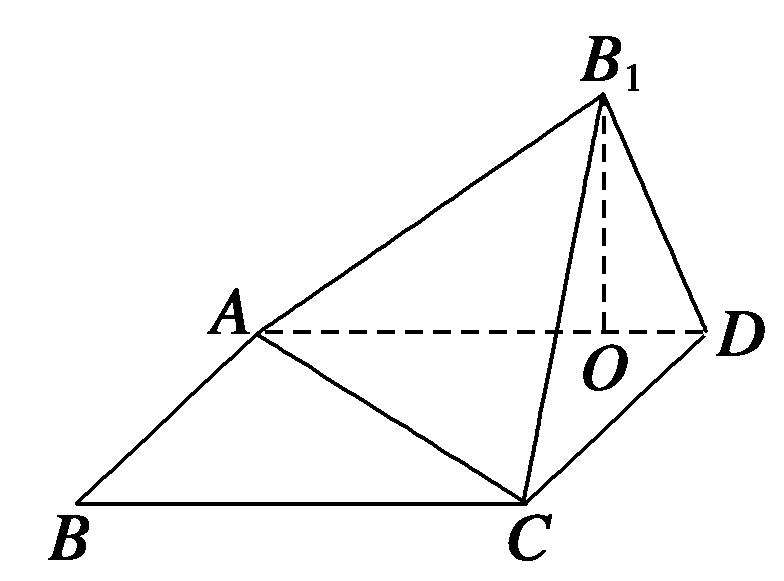

2．解析　（1）∵<em>B</em>1<em>O</em>⊥平面<em>ABCD</em>，<em>CD</em>⊂平面<em>ABCD</em>，∴<em>B</em>1<em>O</em>⊥<em>CD</em>，
又<em>CD</em>⊥<em>AD</em>，<em>AD</em>∩<em>B</em>1<em>O</em>＝<em>O</em>，∴<em>CD</em>⊥平面<em>AB</em>1<em>D</em>，又<em>AB</em>1⊂平面<em>AB</em>1<em>D</em>，∴<em>AB</em>1⊥<em>CD</em>，
又<em>AB</em>1⊥<em>B</em>1<em>C</em>，且<em>B</em>1<em>C</em>∩<em>CD</em>＝<em>C</em>，∴<em>AB</em>1⊥平面<em>B</em>1<em>CD</em>，又<em>AB</em>1⊂平面<em>AB</em>1<em>C</em>，∴平面<em>AB</em>1<em>C</em>⊥平面<em>B</em>1<em>CD</em>．  
（2）由于<em>AB</em>1⊥平面<em>B</em>1<em>CD</em>，<em>B</em>1<em>D</em>⊂平面<em>ABCD</em>，所以<em>AB</em>1⊥<em>B</em>1<em>D</em>，
在Rt△<em>AB</em>1<em>D</em>中，<em>B</em>1<em>D</em>＝＝，又由<em>B</em>1<em>O</em>·<em>AD</em>＝<em>AB</em>1·<em>B</em>1<em>D</em>得<em>B</em>1<em>O</em>＝＝，
所以<em>VB</em>1－<em>ABC</em>＝<em>S</em>△<em>ABC</em>·<em>B</em>1<em>O</em>＝××1××＝．

3．如图所示，在四棱锥*P*—*ABCD*中，平面*PAD*⊥平面*ABCD*，*AB*∥*DC*，△*PAD*是等边三角形，已知

*BD*＝2*AD*＝8，*AB*＝2*DC*＝4．  
（1）设*M*是*PC*上的一点，求证：平面*MBD*⊥平面*PAD*；  
（2）求四棱锥*P*—*ABCD*的体积．

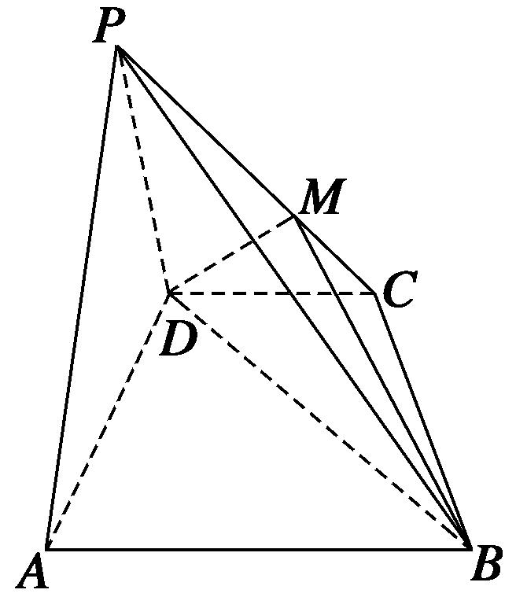

3．解析　（1）在△<em>ABD</em>中，∵<em>AD</em>＝4，<em>BD</em>＝8，<em>AB</em>＝4，∴<em>AD</em>2＋<em>BD</em>2＝<em>AB</em>2.∴<em>AD</em>⊥<em>BD</em>．
又∵平面*PAD*⊥平面*ABCD*，平面*PAD*∩平面*ABCD*＝*AD*，*BD*⊂平面*ABCD*，∴*BD*⊥平面*PAD*．
又*BD*⊂平面*MBD*，∴平面*MBD*⊥平面*PAD*．

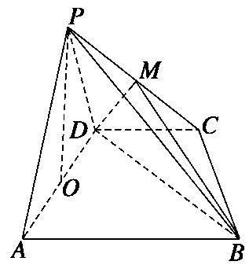  
（2）过*P*作*PO*⊥*AD*，∵平面*PAD*⊥平面*ABCD*，∴*PO*⊥平面*ABCD*，即*PO*为四棱锥*P*—*ABCD*的高．
又△*PAD*是边长为4的等边三角形，∴*PO*＝2．在底面四边形*ABCD*中，*AB*∥*DC*，*AB*＝2*DC*，
∴四边形*ABCD*为梯形．在Rt△*ADB*中，斜边*AB*边上的高为＝，此即为梯形的高．
∴<em>S</em>四边形<em>ABCD</em>＝×＝24．∴<em>VP</em>—<em>ABCD</em>＝×24×2＝16．

4．如图，已知在四棱锥*P*—*ABCD*中，底面*ABCD*是边长为4的正方形，△*PAD*是正三角形，平面*PAD*

⊥平面*ABCD*，*E*，*F*，*G*分别是*PD*，*PC*，*BC*的中点．  
（1）求证：平面*EFG*⊥平面*PAD*；  
（2）若*M*是线段*CD*上一点，求三棱锥*M*—*EFG*的体积．

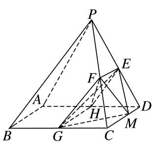

4．解析　（1）因为平面*PAD*⊥平面*ABCD*，平面*PAD*∩平面*ABCD*＝*AD*，*CD*⊂平面*ABCD*，且*CD*⊥*AD*，
所以*CD*⊥平面*PAD*．又因为在△*PCD*中，*E*，*F*分别是*PD*，*PC*的中点，所以*EF*∥*CD*，
所以*EF*⊥平面*PAD*．因为*EF*⊂平面*EFG*，所以平面*EFG*⊥平面*PAD*．

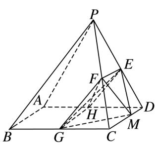  
（2）因为*EF*∥*CD*，*EF*⊂平面*EFG*，*CD*⊄平面*EFG*，所以*CD*∥平面*EFG*，
因此*CD*上的点*M*到平面*EFG*的距离等于点*D*到平面*EFG*的距离，
所以<em>V</em>三棱锥<em>M</em>—<em>EFG</em>＝<em>V</em>三棱锥<em>D</em>—<em>EFG</em>，

取*AD*的中点*H*，连接*GH*，*EH*，*FH*，则*EF*∥*GH*，
因为<em>EF</em>⊥平面<em>PAD</em>，<em>EH</em>⊂平面<em>PAD</em>，所以<em>EF</em>⊥<em>EH</em>．于是<em>S</em>△<em>EFH</em>＝<em>EF</em>×<em>EH</em>＝2＝<em>S</em>△<em>EFG</em>，
因为平面*EFG*⊥平面*PAD*，平面*EFG*∩平面*PAD*＝*EH*，

△*EHD*是正三角形，所以点*D*到平面*EFG*的距离等于正△*EHD*的高，即为．
所以三棱锥<em>M</em>—<em>EFG</em>的体积<em>V</em>三棱锥<em>M</em>—<em>EFG</em>＝<em>V</em>三棱锥<em>D</em>—<em>EFG</em>＝×<em>S</em>△<em>EFG</em>×＝．

5．如图，正方形*ABCD*的边长为2，以*AC*为折痕把△*ACD*折起，使点*D*到达点*P*的位置，且*PA*＝

*PB*．  
（1）证明：平面*PAC*⊥平面*ABC*；  
（2）若*M*是*PC*的中点，设＝*λ*(0<*λ*<1)，且三棱锥*A*－*BMN*的体积为，求*λ*的值．

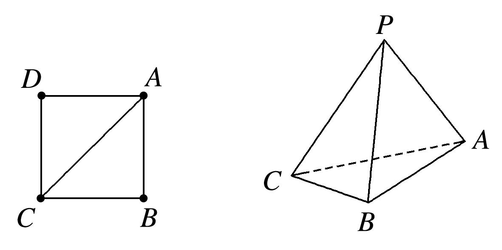

5．解析　（1）如图，取*AC*的中点*O*，连接*PO*，*BO*．

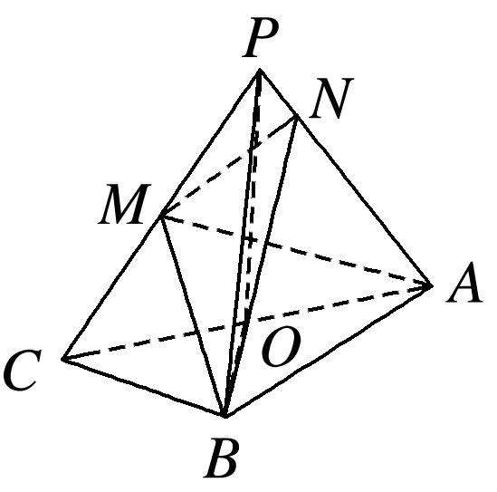
因为*PC*＝*PA*，所以*PO*⊥*AC*．
在△<em>POB</em>中，<em>PO</em>＝<em>OB</em>＝<em>AC</em>＝2，<em>PB</em>＝<em>PA</em>＝2，则<em>PB</em>2＝<em>PO</em>2＋<em>OB</em>2，所以<em>PO</em>⊥<em>OB</em>，
又*AC*∩*OB*＝*O*，且*AC*，*OB*⊂平面*ABC*，所以*PO*⊥平面*ABC*，
又*PO*⊂平面*PAC*，所以平面*PAC*⊥平面*ABC*．  
（2）因为平面*PAC*⊥平面*ABC*，又平面*PAC*∩平面*ABC*＝*AC*，且*BO*⊥*AC*，所以*OB*⊥平面*PAC*，
所以<em>VA</em>－<em>BMN</em>＝<em>VB</em>－<em>AMN</em>＝<em>S</em>△<em>AMN</em>·<em>BO</em>．又因为<em>OB</em>＝2，<em>VA</em>－<em>BMN</em>＝，所以<em>S</em>△<em>AMN</em>＝．因为＝<em>λ</em>，
所以<em>S</em>△<em>AMN</em>＝(1－<em>λ</em>)<em>S</em>△<em>APM</em>＝<em>S</em>△<em>PAC</em>．又<em>S</em>△<em>PAC</em>＝<em>PA</em>·<em>PC</em>＝4，所以×4＝，得<em>λ</em>＝．

5．平行＋垂直＋体积模型

【例题选讲】

<strong>[例1]</strong>(2017·北京)如图，在三棱锥<em>P</em>－<em>ABC</em>中，<em>PA</em>⊥<em>AB</em>，<em>PA</em>⊥<em>BC</em>，<em>AB</em>⊥<em>BC</em>，<em>PA</em>＝<em>AB</em>＝<em>BC</em>＝2，<em>D</em>为线段<em>AC</em>的中点，<em>E</em>为线段<em>PC</em>上一点．  
（1）求证：*PA*⊥*BD*；  
（2）求证：平面*BDE*⊥平面*PAC*；  
（3）当*PA*∥平面*BDE*时，求三棱锥*E*－*BCD*的体积．

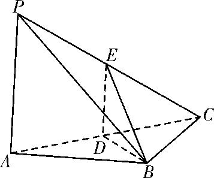
解析　（1）因为*PA*⊥*AB*，*PA*⊥*BC*，所以*PA*⊥平面*ABC*．
又因为*BD*⊂平面*ABC*，所以*PA*⊥*BD*．

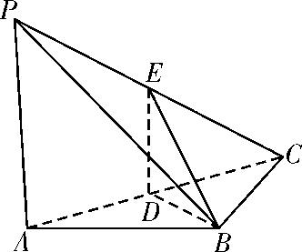  
（2）因为*AB*＝*BC*，*D*为*AC*的中点，所以*BD*⊥*AC*．
由（1）知*PA*⊥*BD*，所以*BD*⊥平面*PAC*．所以平面*BDE*⊥平面*PAC*．  
（3）因为*PA*∥平面*BDE*，平面*PAC*∩平面*BDE*＝*DE*，所以*PA*∥*DE*．
因为*D*为*AC*的中点，所以*DE*＝*PA*＝1，*BD*＝*DC*＝．
由（1）知*PA*⊥平面*ABC*，所以*DE*⊥平面*ABC*．所以三棱锥*E*－*BCD*的体积*V*＝*BD*·*DC*·*DE*＝．

<strong>[例2]</strong>如图①，在矩形<em>ABCD</em>中，<em>AB</em>＝3，<em>BC</em>＝4，<em>E</em>，<em>F</em>分别在线段<em>BC</em>，<em>AD</em>上，<em>EF</em>∥<em>AB</em>，将矩形<em>ABEF</em>沿<em>EF</em>折起，记折起后的矩形为<em>MNEF</em>，且平面<em>MNEF</em>⊥平面<em>ECDF</em>，如图②．

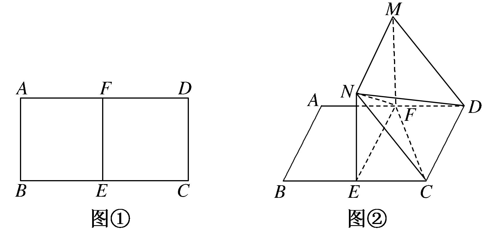  
（1）求证：*NC*∥平面*MFD*；  
（2）若*EC*＝3，求证：*ND*⊥*FC*；  
（3）求四面体*NEFD*体积的最大值．
解析　（1）∵四边形*MNEF*和四边形*EFDC*都是矩形，

∴*MN*∥*EF*，*EF*∥*CD*，*MN*＝*EF*＝*CD*，∴*MNCD*．
∴四边形*MNCD*是平行四边形，∴*NC*∥*MD*．
∵*NC*⊄平面*MFD*，*MD*⊂平面*MFD*，∴*NC*∥平面*MFD*．

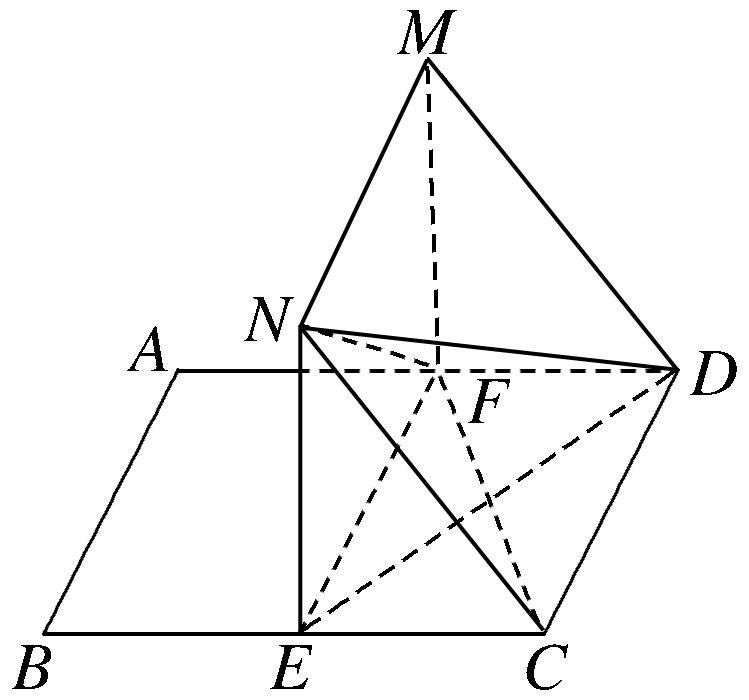  
（2）连接*ED*，∵平面*MNEF*⊥平面*ECDF*，且*NE*⊥*EF*，

平面*MNEF*∩平面*ECDF*＝*EF*，*NE*⊂平面*MNEF*，∴*NE*⊥平面*ECDF*．
∵*FC*⊂平面*ECDF*，∴*FC*⊥*NE*．
∵*EC*＝*CD*，∴四边形*ECDF*为正方形，∴*FC*⊥*ED*．
又∵*ED*∩*NE*＝*E*，*ED*，*NE*⊂平面*NED*，∴*FC*⊥平面*NED*．
∵*ND*⊂平面*NED*，∴*ND*⊥*FC*．  
（3）设*NE*＝*x*，则*FD*＝*EC*＝4－*x*，其中0<*x*<4，由（2）得*NE*⊥平面*FEC*，
∴四面体<em>NEFD</em>的体积为<em>VNEFD</em>＝<em>S</em>△<em>EFD</em>·<em>NE</em>＝<em>x</em>(4－<em>x</em>)．∴<em>V</em>四面体<em>NEFD</em>≤2＝2，
当且仅当*x*＝4－*x*，即*x*＝2时，四面体*NEFD*的体积最大，最大值为2．

<strong>[例3]</strong>如图，在四棱锥<em>P</em>－<em>ABCD</em>中，底面<em>ABCD</em>是菱形，<em>PA</em>＝<em>PD</em>，∠<em>BAD</em>＝60°，<em>E</em>是<em>AD</em>的中点，点<em>Q</em>在侧棱<em>PC</em>上．  
（1）求证：*AD*⊥平面*PBE*；  
（2）若*Q*是*PC*的中点，求证：*PA*∥平面*BDQ*；  
（3）若<em>VP</em>－<em>BCDE</em>＝2<em>VQ</em>－<em>ABCD</em>，试求的值．

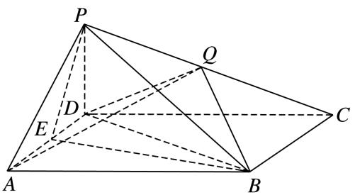
解析　（1）由*E*是*AD*的中点，*PA*＝*PD*可得*AD*⊥*PE*．
因为底面*ABCD*是菱形，∠*BAD*＝60°，所以*AB*＝*BD*，所以*AD*⊥*BE*，
又*PE*∩*BE*＝*E*，*PE*，*BE*⊂平面*PBE*，所以*AD*⊥平面*PBE*．  
（2）连接*AC*，交*BD*于点*O*，连接*OQ*．

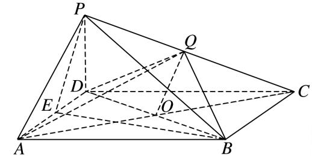
因为*O*是*AC*的中点，*Q*是*PC*的中点，所以*OQ*∥*PA*，
又*PA*⊄平面*BDQ*，*OQ*⊂平面*BDQ*，所以*PA*∥平面*BDQ*．  
（3）设四棱锥<em>P</em>－<em>BCDE</em>，<em>Q</em>－<em>ABCD</em>的高分别为<em>h</em>1，<em>h</em>2．所以<em>V</em>四棱锥<em>P</em>－<em>BCDE</em>＝<em>S</em>四边形<em>BCDEh</em>1，

<em>V</em>四棱锥<em>Q</em>－<em>ABCD</em>＝<em>S</em>四边形<em>ABCDh</em>2．又<em>VP</em>－<em>BCDE</em>＝2<em>VQ</em>－<em>ABCD</em>，且<em>S</em>四边形<em>BCDE</em>＝<em>S</em>四边形<em>ABCD</em>，所以＝＝．

【对点训练】

1．(2014·北京)如图，在三棱柱<em>ABC</em>－<em>A</em>1<em>B</em>1<em>C</em>1中，侧棱垂直于底面，<em>AB</em>⊥<em>BC</em>，<em>AA</em>1＝<em>AC</em>＝2，<em>BC</em>＝1，<em>E</em>，

<em>F</em>分别是<em>A</em>1<em>C</em>1，<em>BC</em>的中点．  
（1）求证：平面<em>ABE</em>⊥平面<em>B</em>1<em>BCC</em>1；  
（2）求证：<em>C</em>1<em>F</em>∥平面<em>ABE</em>；  
（3）求三棱锥*E*－*ABC*的体积．

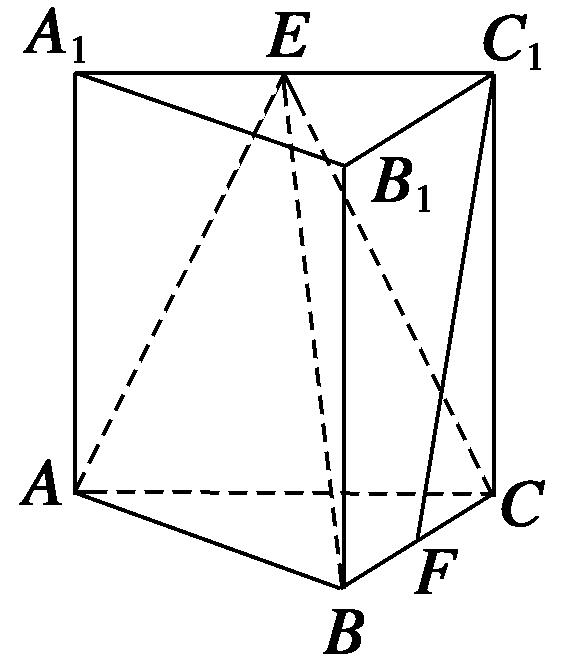

1．解析　（1）在三棱柱<em>ABC</em>－<em>A</em>1<em>B</em>1<em>C</em>1中，<em>BB</em>1⊥底面<em>ABC</em>，所以<em>BB</em>1⊥<em>AB</em>．
又因为<em>AB</em>⊥<em>BC</em>，所以<em>AB</em>⊥平面<em>B</em>1<em>BCC</em>1，又<em>AB</em>⊂平面<em>ABE</em>，所以平面<em>ABE</em>⊥平面<em>B</em>1<em>BCC</em>1．

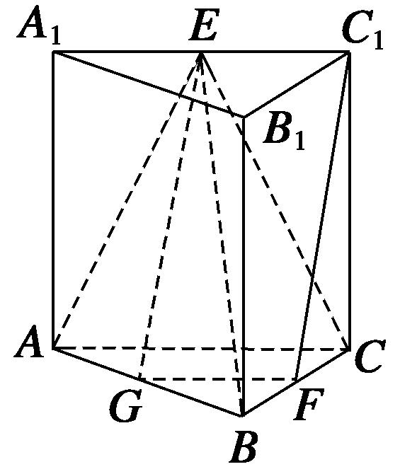  
（2）取<em>AB</em>的中点<em>G</em>，连接<em>EG</em>，<em>FG</em>．因为<em>E</em>，<em>F</em>分别是<em>A</em>1<em>C</em>1，<em>BC</em>的中点，
所以<em>FG</em>∥<em>AC</em>，且<em>FG</em>＝<em>AC</em>．因为<em>AC</em>∥<em>A</em>1<em>C</em>1，且<em>AC</em>＝<em>A</em>1<em>C</em>1，所以<em>FG</em>∥<em>EC</em>1，且<em>FG</em>＝<em>EC</em>1，
所以四边形<em>FGEC</em>1为平行四边形．所以<em>C</em>1<em>F</em>∥<em>EG</em>．又因为<em>EG</em>⊂平面<em>ABE</em>，<em>C</em>1<em>F</em>⊄平面<em>ABE</em>，
所以<em>C</em>1<em>F</em>∥平面<em>ABE</em>．  
（3）因为<em>AA</em>1＝<em>AC</em>＝2，<em>BC</em>＝1，<em>AB</em>⊥<em>BC</em>，所以<em>AB</em>＝＝．
所以三棱锥<em>E</em>－<em>ABC</em>的体积<em>V</em>＝<em>S</em>△<em>ABC</em>·<em>AA</em>1＝×××1×2＝．

2．如图，已知*AF*⊥平面*ABCD*，四边形*ABEF*为矩形，四边形*ABCD*为直角梯形，∠*DAB*＝90˚，*AB*∥

*CD*，*AD*＝*AF*＝*CD*＝2，*AB*＝4．  
（1）求证：*AF*∥平面*BCE*；  
（2）求证：*AC*⊥平面*BCE*；  
（3）求三棱锥*E*－*BCF*的体积．

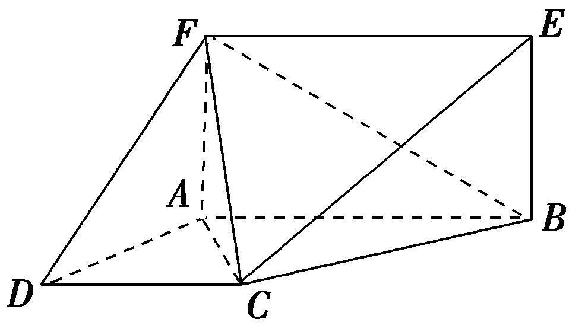

2．解析　（1）因为四边形*ABEF*为矩形，所以*AF*∥*BE*，
又*BE*⊂平面*BCE*，*AF*⊄平面*BCE*，所以*AF*∥平面*BCE*．  
（2）过*C*作*CM*⊥*AB*，垂足为*M*，因为*AD*⊥*DC*，所以四边形*ADCM*为矩形．
所以*AM*＝*MB*＝2，又*AD*＝2，*AB*＝4，所以*AC*＝2，*CM*＝2，*BC*＝2，
所以<em>AC</em>2＋<em>BC</em>2＝<em>AB</em>2，所以<em>AC</em>⊥<em>BC</em>．因为<em>AF</em>⊥平面<em>ABCD</em>，<em>AF</em>∥<em>BE</em>，
所以*BE*⊥平面*ABCD*，所以*BE*⊥*AC*．又*BE*⊂平面*BCE*，*BC*⊂平面*BCE*，*BE*∩*BC*＝*B*，
所以*AC*⊥平面*BCE*．  
（3）因为*AF*⊥平面*ABCD*，所以*AF*⊥*CM*．
又*CM*⊥*AB*，*AF*⊂平面*ABEF*，*AB*⊂平面*ABEF*，*AF*∩*AB*＝*A*，所以*CM*⊥平面*ABEF*．
故<em>VE</em>­<em>BCF</em>＝<em>VC</em>­<em>BEF</em>＝××<em>BE</em>×<em>EF</em>×<em>CM</em>＝×2×4×2＝．

3．如图，在三棱锥*V－ABC*中，平面*VAB*⊥平面*ABC*，△*VAB*为等边三角形，*AC*⊥*BC*且*AC*＝*BC*＝，

*O*，*M*分别为*AB*，*VA*的中点．  
（1）求证：*VB*∥平面*MOC*；  
（2）求证：平面*MOC*⊥平面*VAB*；  
（3）求三棱锥*V－ABC*的体积．

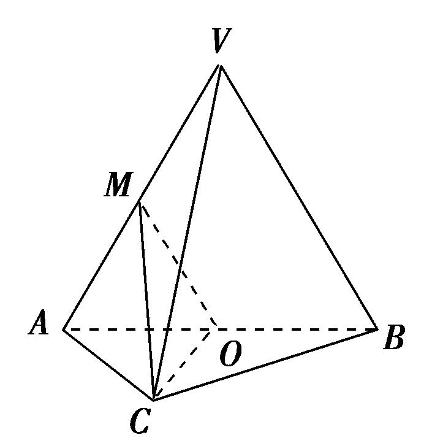

3．解析　（1）因为*O*，*M*分别为*AB*，*VA*的中点，所以*OM*∥*VB*．
又因为*VB*⊄平面*MOC*，所以*VB*∥平面*MOC*．  
（2）因为*AC*＝*BC*，*O*为*AB*的中点，所以*OC*⊥*AB*．
又因为平面*VAB*⊥平面*ABC*，且*OC*⊂平面*ABC*，所以*OC*⊥平面*VAB*．
所以平面*MOC*⊥平面*VAB*．  
（3）在等腰直角三角形*ACB*中，*AC*＝*BC*＝，所以*AB*＝2，*OC*＝1．
所以等边三角形<em>VAB</em>的面积<em>S</em>△<em>VAB</em>＝．又因为<em>OC</em>⊥平面<em>VAB</em>，
所以三棱锥<em>C－VAB</em>的体积等于<em>OC</em>·<em>S</em>△<em>VAB</em>＝．
又因为三棱锥*V－ABC*的体积与三棱锥*C－VAB*的体积相等，所以三棱锥*V－ABC*的体积为．

