# 专题11 利用空间向量计算二面角的问题

# 【方法总结】

#### 1. 二面角  
（1）如图①，AB，CD 是二面角 $\alpha - l - \beta$ 的两个面内与棱 l 垂直的直线，则二面角的大小 $\theta = <\overrightarrow{AB}, \overrightarrow{CD}>$ .

  
①

  
②

  
③  
（2）如图②③， $n_{1}$ ， $n_{2}$ 分别是二面角 $\alpha - l - \beta$ 的两个半平面 $\alpha$ ， $\beta$ 的法向量，则二面角的大小 $\theta$ 满足 $|\cos \theta| = |\cos < n_{1}, n_{2} >|$ ，二面角的平面角大小是向量 $n_{1}$ 与 $n_{2}$ 的夹角（或其补角）.

#### 2. 平面与平面的夹角
如图，平面 $\alpha$ 与平面 $\beta$ 相交，形成四个二面角，我们把四个二面角中不大于 $90^{\circ}$ 的二面角称为平面 $\alpha$ 与平面 $\beta$ 的夹角.

若平面 $\alpha$ ， $\beta$ 的法向量分别是 $n_1$ 和 $n_2$ ，则平面 $\alpha$ 与平面 $\beta$ 的夹角即为向量 $n_1$ 和 $n_2$ 的夹角或其补角．设平面 $\alpha$ 与平面 $\beta$ 的夹角为 $\theta$ ，则 $\cos \theta = |\cos < n_1, n_2 > | = \frac{|n_1 \cdot n_2|}{|n_1||n_2|}$ .

#### 3. 利用空间向量计算二面角大小的常用方法  
（1）找法向量：分别求出二面角的两个半平面所在平面的法向量，然后通过两个平面的法向量的夹角得到二面角的大小，但要注意结合实际图形判断所求角的大小；  
（2）找与棱垂直的方向向量：分别在二面角的两个半平面内找到与棱垂直且以垂足为起点的两个向量，则这两个向量的夹角的大小就是二面角的大小.

# 【例题选讲】

# 考点一 棱柱(台)模型

[例 1] (2021·全国甲)已知直三棱柱 $ABC-A_{1}B_{1}C_{1}$ 中，侧面 $AA_{1}B_{1}B$ 为正方形，AB=BC=2，E，F 分别为 AC 和 $CC_{1}$ 的中点，D 为棱 $A_{1}B_{1}$ 上的点， $BF\perp A_{1}B_{1}$ .  
（1）证明： $BF \perp DE;$   
（2）当 $B_{1}D$ 为何值时，面 $BB_{1}C_{1}C$ 与面 DFE 所成的二面角的正弦值最小？

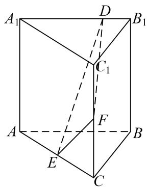

[例 2] (2021·北京)已知正方体 $ABCD-A_{1}B_{1}C_{1}D_{1}$ ，点 E 为 $A_{1}D_{1}$ 中点，直线 $B_{1}C_{1}$ 交平面 CDE 于点 F.  
（1）证明：点 F 为 $B_{1}C_{1}$ 的中点；  
（2）若点 $M$ 为棱 $A_{1}B_{1}$ 上一点，且二面角 $M - CF - E$ 的余弦值为 $\frac{\sqrt{5}}{3}$ ，求 $\frac{A_1M}{A_1B_1}$ 的值.

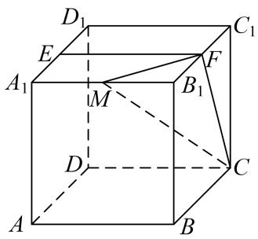

[例 3] (2020·全国Ⅲ改编)如图，在长方体 $ABCD-A_{1}B_{1}C_{1}D_{1}$ 中，点 E, F 分别在棱 $DD_{1}$ ， $BB_{1}$ 上，且 $2DE=ED_{1}$ ， $BF=2FB_{1}$ .  
（1）证明：点 $C_1$ 在平面 $AEF$ 内；  
（2）若 AB=2, AD=1, $AA_{1}=3$ ，求平面 AEF 与平面 $EFA_{1}$ 夹角的正弦值.

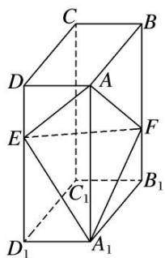

[例 4] 如图，在四棱台 $ABCD-A_{1}B_{1}C_{1}D_{1}$ 中，底面 ABCD 是菱形， $CC_{1}\perp$ 底面 ABCD，且 $\angle BAD=60^{\circ}$ ， $CD=CC_{1}=2C_{1}D_{1}=4$ ，E 是棱 $BB_{1}$ 的中点.  
（1）求证： $AA_{1} \perp BD;$  
（2）求二面角 $E-A_{1}C_{1}-C$ 的余弦值.

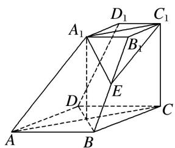

# 【对点训练】

1. (2019·全国III)图 1 是由矩形 ADEB，Rt△ABC 和菱形 BFGC 组成的一个平面图形，其中 AB=1，BE=BF=2，∠FBC=60°．将其沿 AB，BC 折起使得 BE 与 BF 重合，连接 DG，如图 2.  
（1）证明：图2中的A，C，G，D四点共面，且平面ABC⊥平面BCGE；  
（2）求图 2 中的二面角 B-CG-A 的大小.
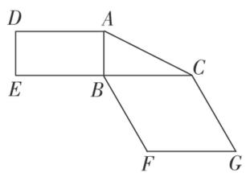

图1

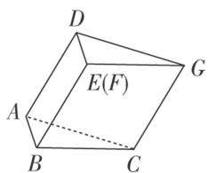

图2

2. 如图，在棱长为 2 的正方体 $ABCD - A_1B_1C_1D_1$ 中， $E$ 是 $BC$ 的中点， $F$ 是 $DD_1$ 的中点.  
（1）求证： $CF \parallel$ 平面 $A_{1}DE$ ;  
（2）求平面 $A_{1}DE$ 与平面 $A_{1}DA$ 夹角的余弦值.

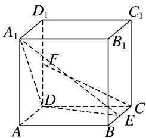

3. (2019·全国Ⅱ)如图，长方体 $ABCD-A_{1}B_{1}C_{1}D_{1}$ 的底面 ABCD 是正方形，点 E 在棱 $AA_{1}$ 上， $BE \perp EC_{1}$ .  
（1）证明： $BE \perp$ 平面 $EB_{1}C_{1}$ ;  
（2）若 $AE=A_{1}E$ ，求二面角 $B-EC-C_{1}$ 的正弦值.

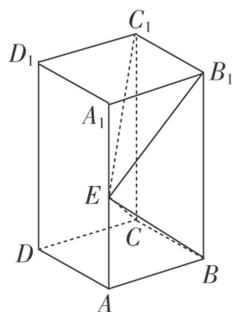

4. (2019·全国Ⅰ改编)如图，直四棱柱 $ABCD-A_{1}B_{1}C_{1}D_{1}$ 的底面是菱形， $AA_{1}=4,\ AB=2,\ \angle BAD=60^{\circ}, E, M, N$ 分别是 BC, $BB_{1}, A_{1}D$ 的中点.  
（1）证明： $MN \parallel$ 平面 $C_{1}DE$ ;  
（2）求平面 $AMA_{1}$ 与平面 $MA_{1}N$ 夹角的正弦值.

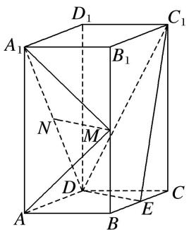

# 考点二 棱(圆)锥模型

[例 1] (2020·全国 I) 如图，D 为圆锥的顶点，O 是圆锥底面的圆心，AE 为底面直径，AE = AD. △ ABC 是底面的内接正三角形，P 为 DO 上一点， $PO = \frac{\sqrt{6}}{6}DO$ .  
（1）证明： $PA \perp$ 平面 PBC;  
（2）求二面角 B-PC-E 的余弦值.

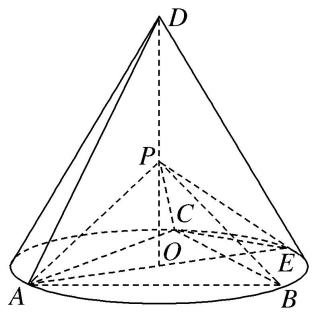

[例 2] (2021·全国新 I) 如图，在三棱锥 A-BCD 中，平面 $ABD \perp$ 平面 BCD，AB = AD，O 为 BD 的中点.  
（1）证明： $OA \perp CD$   
（2）若 $\triangle OCD$ 是边长为1的等边三角形，点 $E$ 在棱 $AD$ 上， $DE=2EA$ ，且二面角 $E-BC-D$ 的大小为 $45^{\circ}$ ，求三棱锥 $A-BCD$ 的体积.

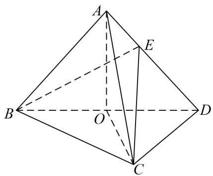

[例 3] (2021·全国新 II) 在四棱锥 Q-ABCD 中，底面 ABCD 是正方形，若 AD=2， $QD=QA=\sqrt{5}$ ，QC=3.  
（1）证明：平面 $QAD \perp$ 平面 ABCD;  
（2）求二面角 B-QD-A 的平面角的余弦值.

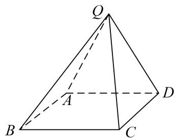

[例4] 如图，在几何体 $ABCDE$ 中，四边形 $ABCD$ 是矩形， $AB \perp$ 平面 $BEC$ ， $BE \perp EC$ ， $AB = BE = EC = 2$ ， $G$ ， $F$ 分别是线段 $BE$ ， $DC$ 的中点.  
（1）求证： $GF \parallel$ 平面 ADE;  
（2）求平面 AEF 与平面 BEC 夹角的余弦值.

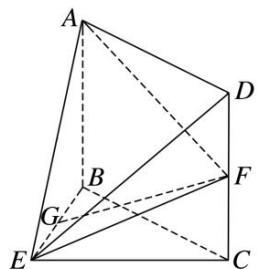

[例 5] 如图，在四棱锥 P-ABCD 中，底面 ABCD 是菱形， $\angle BAD=60^{\circ}$ ，Q 为 AD 的中点， $PQ\perp$ 平面 ABCD，PA=PD=AD=2，M 是棱 PC 上一点，且 $\frac{PM}{PC}=\frac{1}{3}$ .  
（1）证明： $PA \parallel$ 平面 BMQ;  
（2）求二面角 B-MQ-C 的余弦值.

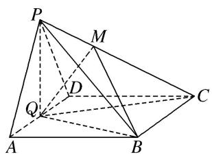

[例6] 如图，在 Rt△ABC 中，B 为直角，AB=2BC，E，F 分别为 AB，AC 的中点，将△AEF 沿 EF 折起，使点 A 到达点 D 的位置，连接 BD，CD，M 为 CD 的中点.  
（1）证明： $MF \perp$ 平面 BCD;  
（2）若 $DE \perp BE$ ，求平面 EMF 与平面 MFC 夹角的余弦值.

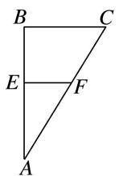

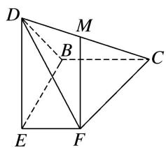

[例 7] 在 Rt△ABC 中，∠ABC=90°， $\tan\angle ACB=\frac{1}{2}$ . 已知 E，F 分别是 BC，AC 的中点．将△CEF 沿 EF 折起，使 C 到 C' 的位置且二面角 C'-EF-B 的大小是 60°．连接 C'B，C'A，如图：  
（1）求证：平面 $C'FA \perp$ 平面 $ABC'$ ;  
（2）求平面 $AFC'$ 与平面 $BEC'$ 所成二面角的大小.

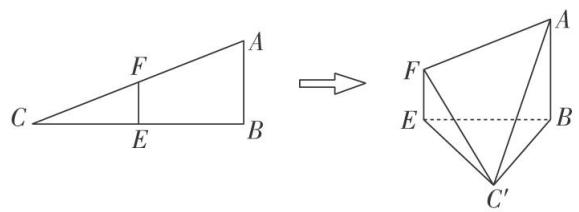

[例 8] 如图①， $\triangle PAD$ 是以 $AD$ 为斜边的直角三角形， $PA = 1$ ， $BC \parallel AD$ ， $CD \perp AD$ ， $AD = 2DC = 2$ ， $BC = \frac{1}{2}$ ，将 $\triangle PAD$ 沿 $AD$ 折起，如图②，使得 $PC = 2$ 。  
（1）证明：平面 PAD⊥平面 ABCD;  
（2）求二面角 A-PB-C 的余弦值.

图①

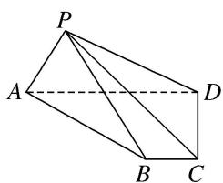

图②

[例 9] 如图, 在四棱锥 P-ABCD 中, 侧面 PAD⊥底面 ABCD, 底面 ABCD 为直角梯形, 其中 AB//CD, $\angle CDA=90^{\circ}$ , CD=2AB=2, AD=3, $PA=\sqrt{5}$ , $PD=2\sqrt{2}$ , 点 E 在棱 AD 上且 AE=1, 点 F 为棱 PD 的中点.  
（1）证明：平面 BEF⊥平面 PEC;  
（2）求二面角 A-BF-C 的余弦值.

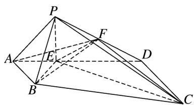

[例 10] 如图①，在矩形 ABCD 中，AB=2，BC=3，点 E 在线段 BC 上，BE=2EC．把 $\triangle BAE$ 沿 AE 翻折至 $\triangle B_{1}AE$ 的位置， $B_{1}\notin$ 平面 AECD，连接 $B_{1}D$ ，点 F 在线段 $DB_{1}$ 上， $DF=2FB_{1}$ ，如图②.  
（1）证明： $CF \parallel$ 平面 $B_{1}AE$ ;  
（2）当三棱锥 $B_{1}-ADE$ 的体积最大时，求二面角 $B_{1}-DE-C$ 的余弦值.

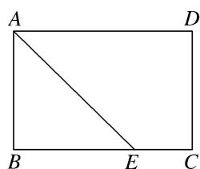

图①

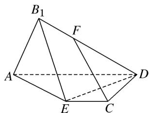

图②

# 【对点训练】

1. 已知三棱锥 $M - ABC$ ， $MA = MB = MC = AC = 2\sqrt{2}$ ， $AB = BC = 2$ ， $O$ 为 $AC$ 的中点，点 $N$ 在边 $BC$ 上，

且 $\overrightarrow{BN}=\frac{2}{3}\overrightarrow{BC}.$  
（1）求证： $BO \perp$ 平面 AMC;  
（2）求二面角 N-AM-C 的正弦值.

2. 如图所示，在四面体 ABCD 中， $AD \perp AB$ ，平面 $ABD \perp$ 平面 ABC， $AB = BC = \frac{\sqrt{2}}{2} AC$ ，且 $AD + BC = 4$ .  
（1）证明： $BC \perp$ 平面 ABD;  
（2）设 E 为棱 AC 的中点，当四面体 ABCD 的体积取得最大值时，求二面角 C-BD-E 的余弦值.

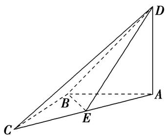

3. (2021·全国乙)如图，四棱锥 $P - ABCD$ 的底面是矩形， $PD \perp$ 底面 $ABCD$ ， $PD = DC = 1$ ， $M$ 为 $BC$ 的中点，且 $PB \perp AM$ .  
（1）求 $BC$ ;   
（2）求二面角 A-PM-B 的正弦值.

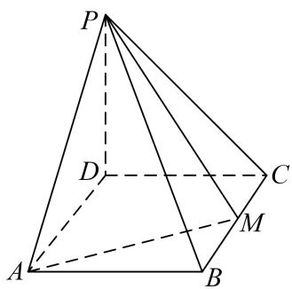

4. 如图，在四棱锥 P-ABCD 中，底面 ABCD 为菱形， $\angle BAD=60^{\circ}$ ， $\angle APD=90^{\circ}$ ，且 AD=PB.  
（1）求证：平面 PAD⊥平面 ABCD;  
（2）若 $AD \perp PB$ ，求二面角 D-PB-C 的余弦值.

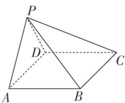

5. 如图, 在四棱锥 $P - ABCD$ 中, $PA \perp$ 底面 $ABCD$ , $AD \perp AB$ , $AB // DC$ , $AD = DC = AP = 2$ , $AB = 1$ , 点

E 为棱 PC 的中点.  
（1）求证： $BE \perp DC;$   
（2）若 F 为棱 PC 上一点，满足 $BF \perp AC$ ，求平面 FAB 与平面 ABP 夹角的余弦值.

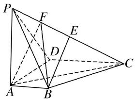

6. 如图，已知四棱锥 $P - ABCD$ ，底面 $ABCD$ 是直角梯形， $AD \parallel BC$ ， $\angle BCD = 90^{\circ}$ ， $PA \perp$ 底面 $ABCD$ ， $\triangle ABM$ 是边长为2的等边三角形， $PA = DM = 2\sqrt{3}$ .  
（1）求证：平面 $PAM \perp$ 平面 PDM;  
（2）若 E 为 PC 的中点，求二面角 P-MD-E 的余弦值.

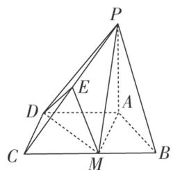

7. 已知矩形 ABCD 中，AB=2，AD=3，在 AD 上取一点 E 满足 2AE=ED。现将 $\triangle CDE$ 沿 CE 折起使点 D 移动至 P 点处，使得 PA=PB。  
（1）求证：平面 $PCE \perp$ 平面 ABCE;  
（2）求二面角 B-PA-E 的余弦值.

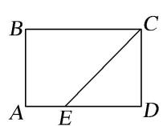

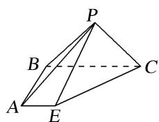

8. 如图, 已知 $\triangle ABC$ 为等边三角形, $\triangle ABD$ 为等腰直角三角形, $AB \perp BD$ . 平面 $ABC \perp$ 平面 $ABD$ , 点 $E$ 与点 $D$ 在平面 $ABC$ 的同侧, 且 $CE \parallel BD$ , $BD = 2CE$ . 点 $F$ 为 $AD$ 的中点, 连接 $EF$ .  
（1）求证： $EF \parallel$ 平面 ABC;  
（2）求二面角 C-AE-D 的余弦值.

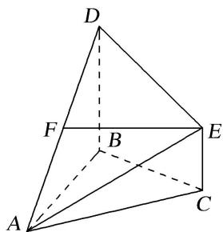

9. 如图，在四棱锥 $P - ABCD$ 中，底面 $ABCD$ 为直角梯形， $AD \parallel BC$ ， $\angle ADC = 90^\circ$ ，平面 $PAD \perp$ 底面 $ABCD$ ， $Q$ 为 $AD$ 的中点， $M$ 是棱 $PC$ 上的点， $PA = PD = 2$ ， $BC = \frac{1}{2} AD = 1$ ， $CD = \sqrt{3}$ .  
（1）求证：平面 $PBC \perp$ 平面 POB;  
（2）当 $PM$ 的长为何值时，平面 $OMB$ 与平面 $PDC$ 所成的锐二面角的大小为 $60^{\circ}$ ?

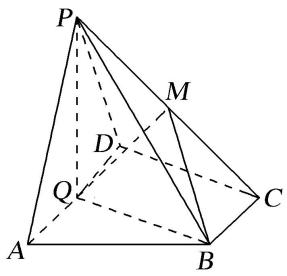

10. 请从下面三个条件中任选一个，补充在下面的横线上，并作答.

① $AB \perp BC$ ，②FC与平面ABCD所成的角为 $\frac{\pi}{6}$ ，③ $\angle ABC=\frac{\pi}{3}$ .
如图, 在四棱锥 $P - ABCD$ 中, 底面 $ABCD$ 是菱形, $PA \perp$ 平面 $ABCD$ , 且 $PA = AB = 2$ , $PD$ 的中点为 $F$ .  
（1）在线面 $AB$ 上是否存在一点 $G$ , 使得 $AF \parallel$ 平面 $PCG$ ? 若存在, 指出 $G$ 在 $AB$ 上的位置并给以证明; 若不存在, 请说明理由.  
（2）若，求二面角 $F - AC - D$ 的余弦值.

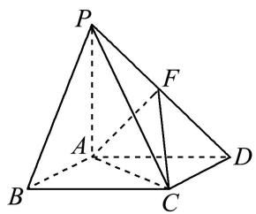

# 考点三 不规则几何体模型

[例 1] (2018·全国III)如图, 边长为2的正方形ABCD所在的平面与半圆弧 $\widehat{CD}$ 所在平面垂直, M是 $\widehat{CD}$ 上异于C, D的点.  
（1）证明：平面 $AMD \perp$ 平面 BMC;  
（2）当三棱锥 M-ABC 体积最大时，求面 MAB 与面 MCD 所成二面角的正弦值.

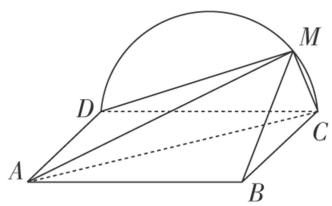

[例 2] 如图，四边形 ABCD 是菱形， $EA \perp$ 平面 ABCD， $EF \parallel AC$ ， $CF \parallel$ 平面 BDE，G 是 AB 的中点.  
（1）求证： $EG \parallel$ 平面 BCF:  
（2）若 $AE = AB$ ， $\angle BAD = 60^{\circ}$ ，求二面角 $A - BE - D$ 的余弦值.

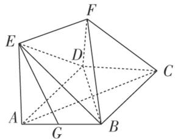

[例3] 如图，在梯形ABCD中， $AB\parallel CD$ ， $AD = DC = CB = 2$ ， $\angle ABC = 60^{\circ}$ ，平面ACEF⊥平面ABCD，四边形ACEF是菱形， $\angle CAF = 60^{\circ}$  
（1）求证： $BF \perp AE;$   
（2）求二面角 B-EF-D 的平面角的正切值.

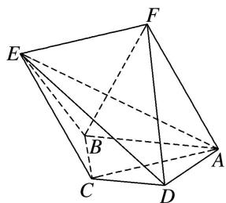

[例 4] 如图，在梯形 ABCD 中， $AB \parallel CD$ ，AD = DC = CB = 1， $\angle BCD = \frac{2\pi}{3}$ ，四边形 BFED 为矩形，平面 $BFED \perp$ 平面 ABCD，BF = 1.  
（1）求证： $AD \perp$ 平面BFED；  
（2）点 P 在线段 EF 上运动，设平面 PAB 与平面 ADE 所成锐二面角为 $\theta$ ，试求 $\theta$ 的最小值.

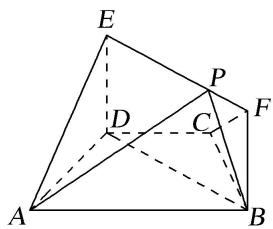

# 【对点训练】

1. 在如图所示的多面体中，四边形 $ABEG$ 是矩形，梯形 $DGEF$ 为直角梯形，平面 $DGEF \perp$ 平面 $ABEG$ ，且 $DG \perp GE$ ， $DF \parallel GE$ ， $AB = 2AG = 2DG = 2DF = 2$ .  
（1）求证： $FG \perp$ 平面 BEF.  
（2）求二面角 A-BF-E 的大小.

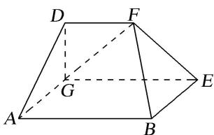

2. 如图，多面体 $ABCDEF$ 中， $ABCD$ 为正方形， $AB = 2$ ， $AE = 3$ ， $DE = \sqrt{5}$ ，二面角 $E - AD - C$ 的余弦值为 $\frac{\sqrt{5}}{5}$ ，且 $EF \parallel BD$ .  
（1）证明：平面 $ABCD \perp$ 平面 $EDC$ ;  
（2）求平面 AEF 与平面 EDC 所成锐二面角的余弦值.

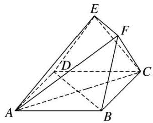

3. 如图，在五面体 $ABCDEF$ 中，底面 $ABCD$ 是直角梯形， $AB \parallel CD$ ， $AD \perp CD$ ，侧面 $CDEF$ 是菱形， $\angle DCF = 60^\circ$ ， $CD = 2AD = 2AB$ ， $AE = \sqrt{5} AD$ .  
（1）证明： $CE \perp AF;$  
（2）已知点 $P$ 在线段 $BC$ 上，且 $CP = \lambda CB$ ，若二面角 $A - DF - P$ 的大小为 $60^{\circ}$ ，求实数 $\lambda$ 的值.

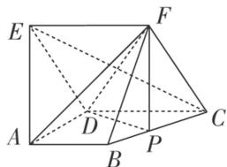

4. 如图所示，在梯形 $ABCD$ 中， $AB \parallel CD$ ， $\angle BCD = 120^{\circ}$ ，四边形 $ACFE$ 为矩形，且 $CF \perp$ 平面 $ABCD$ ， $AD = CD = BC = CF$ .  
（1）求证： $EF \perp$ 平面 BCF;  
（2）点 M 在线段 EF 上运动，设平面 MAB 与平面 FCB 的夹角为 $\theta$ ，试求 $\cos\theta$ 的取值范围.

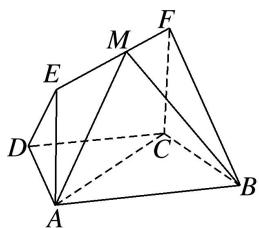

