# 专题11 利用空间向量计算二面角的问题

# 【方法总结】

#### 1. 二面角  
（1）如图①，AB，CD 是二面角 $\alpha - l - \beta$ 的两个面内与棱 l 垂直的直线，则二面角的大小 $\theta = <\overrightarrow{AB}, \overrightarrow{CD}>$ .

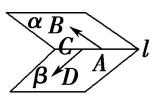  
①

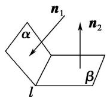  
②

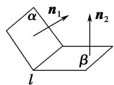  
③  
（2）如图②③， $n_{1}$ ， $n_{2}$ 分别是二面角 $\alpha - l - \beta$ 的两个半平面 $\alpha$ ， $\beta$ 的法向量，则二面角的大小 $\theta$ 满足 $|\cos \theta| = |\cos < n_{1}, n_{2}|$ ，二面角的平面角大小是向量 $n_{1}$ 与 $n_{2}$ 的夹角（或其补角）.

#### 2. 平面与平面的夹角
如图，平面 $\alpha$ 与平面 $\beta$ 相交，形成四个二面角，我们把四个二面角中不大于 $90^{\circ}$ 的二面角称为平面 $\alpha$ 与平面 $\beta$ 的夹角.

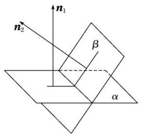
若平面 $\alpha$ ， $\beta$ 的法向量分别是 $n_1$ 和 $n_2$ ，则平面 $\alpha$ 与平面 $\beta$ 的夹角即为向量 $n_1$ 和 $n_2$ 的夹角或其补角．设平面 $\alpha$ 与平面 $\beta$ 的夹角为 $\theta$ ，则 $\cos \theta = |\cos < n_1, n_2 > | = \frac{|n_1 \cdot n_2|}{|n_1||n_2|}$ .

#### 3. 利用空间向量计算二面角大小的常用方法  
（1）找法向量：分别求出二面角的两个半平面所在平面的法向量，然后通过两个平面的法向量的夹角得到二面角的大小，但要注意结合实际图形判断所求角的大小；  
（2）找与棱垂直的方向向量：分别在二面角的两个半平面内找到与棱垂直且以垂足为起点的两个向量，则这两个向量的夹角的大小就是二面角的大小.

# 【例题选讲】

# 考点一 棱柱(台)模型

[例 1] (2021·全国甲)已知直三棱柱 $ABC-A_{1}B_{1}C_{1}$ 中，侧面 $AA_{1}B_{1}B$ 为正方形，AB=BC=2，E，F 分别为 AC 和 $CC_{1}$ 的中点，D 为棱 $A_{1}B_{1}$ 上的点， $BF\perp A_{1}B_{1}$ .  
（1）证明： $BF \perp DE;$   
（2）当 $B_{1}D$ 为何值时，面 $BB_{1}C_{1}C$ 与面 DFE 所成的二面角的正弦值最小？

解析 （1）连接 AF，∵E，F 分别为直三棱柱 $ABC-A_{1}B_{1}C_{1}$ 的棱 AC 和 $CC_{1}$ 的中点，且 AB=BC=2，
$\therefore C F = 1, B F = \sqrt {5}, \because B F \perp A _ {1} B _ {1}, A _ {1} B _ {1} / / A B, \therefore B F \perp A B,$
$\therefore AF = \sqrt{AB^2 + BF^2} = \sqrt{2^2 + (\sqrt{5})^2} = 3, AC = \sqrt{AF^2 - CF^2} = \sqrt{3^2 - 1^2} = 2\sqrt{2}, \therefore AB^2 + BC^2 = AC^2$ ，即 $BA \perp BC$ .
故以 B 为原点，BA，BC， $BB_{1}$ 所在直线分别为 x，y，z 轴建立如图所示的空间直角坐标系，
则 $A(2, 0, 0)$ ， $B(0, 0, 0)$ ， $C(0, 2, 0)$ ， $E(1, 1, 0)$ ， $F(0, 2, 1)$ ，设 $B_{1}D = m$ ，则 $D(m, 0, 2)$ ，
$\therefore\overrightarrow{BF}=(0,\ 2,\ 1),\ \overrightarrow{DE}=(1-m,\ 1,\ -2),\ \because\overrightarrow{BF}\cdot\overrightarrow{DE}=0,\ \therefore BF\perp DE.$

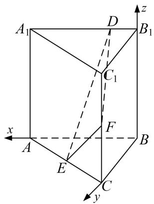  
（2）∵AB⊥平面BB1C1C，∴平面BB1C1C的一个法向量为m=(1,0,0),
由（1）知， $\overrightarrow{DE}=(1-m,1,-2)$ ， $\overrightarrow{BF}=(-1,1,1)$ ,
设平面 DFE 的法向量为 $\boldsymbol{n}=(x,y,z)$ ，则有 $\left\{\begin{aligned}\boldsymbol{n}\cdot\overrightarrow{DE}&=0,\\ \boldsymbol{n}\cdot\overrightarrow{EF}&=0,\end{aligned}\right.$ ，即 $\left\{\begin{aligned}(1-m)x+y-2z&=0,\\ -x+y+z&=0.\end{aligned}\right.$
令 x=3，则 $y=m+1,\quad z=2-m$ ，故 $n=(3,\quad m+1,\quad 2-m)$ ,
所以 $\cos<n,\quad m>=\frac{n\cdot m}{|n||m|}=\frac{3}{\sqrt{9+(m+1)^{2}+(2-m)^{2}}}=\frac{3}{\sqrt{2m^{2}-2m+14}}.$
所以当 $m=\frac{1}{2}$ 时，面 $BB_{1}C_{1}C$ 与面 DFE 所成的二面角的余弦值最大为 $\frac{\sqrt{6}}{3}$ ，此时正弦值最小为 $\frac{\sqrt{3}}{3}$ .

[例 2] (2021·北京)已知正方体 $ABCD-A_{1}B_{1}C_{1}D_{1}$ ，点 E 为 $A_{1}D_{1}$ 中点，直线 $B_{1}C_{1}$ 交平面 CDE 于点 F.  
（1）证明：点 F 为 $B_{1}C_{1}$ 的中点；  
（2）若点 M 为棱 $A_{1}B_{1}$ 上一点，且二面角 M-CF-E 的余弦值为 $\frac{\sqrt{5}}{3}$ ，求 $\frac{A_{1}M}{A_{1}B_{1}}$ 的值.

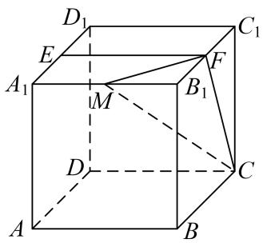

解析 如图所示，取 $B_{1}C_{1}$ 的中点 $F'$ ，连结 DE， $EF'$ ， $F'C$ ，
由于 $ABCD-A_{1}B_{1}C_{1}D_{1}$ 为正方体，E， $F'$ 为中点，故 $EF' \parallel CD$ ，
从而 E, $F'$ , C, D, 四点共面, 所以平面 CDE 即平面 CDEF',

据此可得，直线 $B_{1}C_{1}$ 交平面 CDE 于点 $F'$ ,
当直线与平面相交时只有唯一的交点，故点 F 与点 $F'$ 重合，即点 F 为 $B_{1}C_{1}$ 中点.

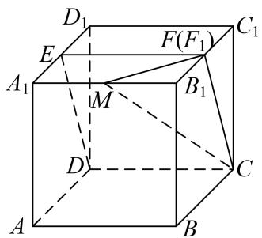  
（2）以点 $D$ 为坐标原点， $DA, DC, DD_{1}$ ，方向分别为 $x$ 轴， $y$ 轴， $z$ 轴正方形，建立空间直角坐标系 $Dxyz$ ，

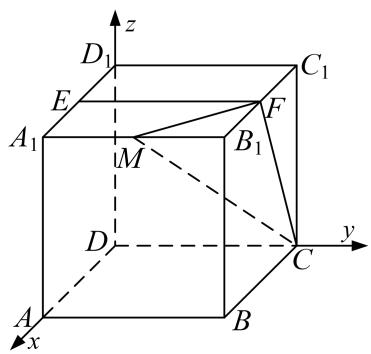
不妨设正方体的棱长为 2，设 $\frac{A_1M}{A_1B_1} = \lambda (0\leq \lambda \leq 1)$
则， $M(2, 2\lambda, 2)$ ， $C(0, 2, 0)$ ， $F(1, 2, 2)$ ， $E(1, 0, 2)$ ，
从而， $\overrightarrow{MC}=(-2,2-2\lambda,-2)$ ， $\overrightarrow{CF}=(1,0,2)$ ， $\overrightarrow{FE}=(0,-2,0)$
设平面 MCF 的法向量为 $\boldsymbol{m}=(x_{1},y_{1},z_{1})$ ，所以 $\left\{\begin{aligned}&m\cdot\overrightarrow{MC}=0,\\ &m\cdot\overrightarrow{CF}=0,\end{aligned}\right.$ 即 $\left\{\begin{aligned}-2x_{1}+(2-2\lambda)y_{1}-2z_{1}=0,\\ x_{1}+2z_{1}=0,\end{aligned}\right.$
令 $z_{1}=-1$ ，则平面 MCF 的一个法向量为 $m=(2,\frac{1}{1-\lambda},-1)$ .
设平面 CFE 的法向量为 $\boldsymbol{n}=(x_{2},y_{2},z_{2})$ ，所以 $\left\{\begin{aligned}&n\cdot\overrightarrow{FE}=0,\\ &n\cdot\overrightarrow{CF}=0,\end{aligned}\right.$ 即 $\left\{\begin{aligned}-2y_{2}=0,\\ x_{2}+2z_{2}=0,\end{aligned}\right.$
令 $z_{2}=-1$ ，则平面 CFE 的一个法向量为 $n=(2,0,-1)$ .
从而 $m \cdot n = 5,\quad |m| = \sqrt{5 + (\frac{1}{1 - \lambda})^{2}},\quad |n| = \sqrt{5},$
则， $\cos < n, m> = \frac{n \cdot m}{|n||m|} = \frac{5}{\sqrt{5 + (\frac{1}{1 - \lambda})^2 \times \sqrt{5}}} = \frac{\sqrt{5}}{3}$ .

整理可得： $(\lambda-1)^{2}=\frac{1}{4}$ ，故 $\lambda=\frac{1}{2}$ 或 $\frac{3}{2}$ (舍去).

[例 3] (2020·全国Ⅲ改编)如图，在长方体 $ABCD-A_{1}B_{1}C_{1}D_{1}$ 中，点 E，F 分别在棱 $DD_{1}$ ， $BB_{1}$ 上，且 $2DE=ED_{1}$ ， $BF=2FB_{1}$ .  
（1）证明：点 $C_{1}$ 在平面 AEF 内；  
（2）若 AB=2，AD=1， $AA_{1}=3$ ，求平面 AEF 与平面 $EFA_{1}$ 夹角的正弦值.

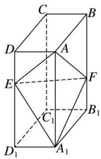

解析 （1） 设 AB = a, AD = b, $AA_{1} = c$ ，如图，
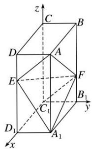

以 $C_{1}$ 为坐标原点， $\overrightarrow{C_{1}D_{1}}$ ， $\overrightarrow{C_{1}B_{1}}$ ， $\overrightarrow{C_{1}C}$ 的方向分别为 x 轴，y 轴，z 轴正方向，建立空间直角坐标系 $C_{1}xyz$ 。

连接 $C_{1}F$ ，则 $C_{1}(0,0,0)$ ， $A(a,b,c)$ ， $E\left(a,0,\frac{2}{3}c\right)$ ， $F\left(0,b,\frac{1}{3}c\right)$ ，
$\overrightarrow{EA}=\left(0,\ b,\ \frac{1}{3}c\right),\ \overrightarrow{C_{1}F}=\left(0,\ b,\ \frac{1}{3}c\right),\ \text{所以}\ \overrightarrow{EA}=\overrightarrow{C_{1}F},\ \text{所以}\ EA//C_{1}F,$
即 A, E, F, $C_{1}$ 四点共面，所以点 $C_{1}$ 在平面 AEF 内.  
（2）由已知得 $A(2, 1, 3)$ ， $E(2, 0, 2)$ ， $F(0, 1, 1)$ ， $A_{1}(2, 1, 0)$ ，
则 $\overrightarrow{AE} = (0, -1, -1)$ , $\overrightarrow{AF} = (-2, 0, -2)$ , $\overrightarrow{A_1E} = (0, -1, 2)$ , $\overrightarrow{A_1F} = (-2, 0, 1)$ .
设 $\boldsymbol{n}_{1}=(x_{1},y_{1},z_{1})$ 为平面 AEF 的法向量，则 $\left\{\begin{aligned}\boldsymbol{n}_{1}\cdot\overrightarrow{AE}&=0,\\ \boldsymbol{n}_{1}\cdot\overrightarrow{AF}&=0,\end{aligned}\right.$ 即 $\left\{\begin{aligned}-y_{1}-z_{1}&=0,\\ -2x_{1}-2z_{1}&=0,\end{aligned}\right.$

可取 $n_{1}=(-1,-1,1)$ .
设 $\boldsymbol{n}_{2}=(x_{2},y_{2},z_{2})$ 为平面 $A_{1}EF$ 的法向量，则 $\left\{\begin{aligned}\boldsymbol{n}_{2}\cdot\overrightarrow{A_{1}E}=0,\\ \boldsymbol{n}_{2}\cdot\overrightarrow{A_{1}F}=0,\end{aligned}\right.$ 即 $\left\{\begin{aligned}-y_{2}+2z_{2}=0,\\ -2x_{2}+z_{2}=0,\end{aligned}\right.$

同理可取 $n_{2}=\left(\frac{1}{2},\quad2,\quad1\right)$ .
因为 $\cos<n_{1},\quad n_{2}>\frac{n_{1}\cdot n_{2}}{|n_{1}|\cdot|n_{2}|}=-\frac{\sqrt{7}}{7},$
所以平面 AEF 与平面 $EFA_{1}$ 夹角的正弦值为 $\frac{\sqrt{42}}{7}$ .

[例 4] 如图，在四棱台 $ABCD-A_{1}B_{1}C_{1}D_{1}$ 中，底面 ABCD 是菱形， $CC_{1}\perp$ 底面 ABCD，且 $\angle BAD=60^{\circ}$ ， $CD=CC_{1}=2C_{1}D_{1}=4$ ，E 是棱 $BB_{1}$ 的中点.  
（1）求证： $AA_{1} \perp BD;$   
（2）求二面角 $E-A_{1}C_{1}-C$ 的余弦值.

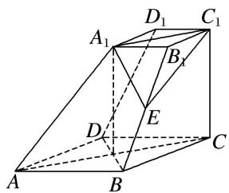

解析 （1）因为 $C_1C \perp$ 底面ABCD，所以 $C_1C \perp BD$ 。因为底面ABCD是菱形，所以 $BD \perp AC$ 。
又 $AC \cap CC_{1} = C$ ，AC， $CC_{1} \subset$ 平面 $ACC_{1}A_{1}$ ，所以 $BD \perp$ 平面 $ACC_{1}A_{1}$ .
又 $AA_{1} \subset$ 平面 $ACC_{1}A_{1}$ ，所以 $BD \perp AA_{1}$ .  
（2）如图，设 AC 交 BD 于点 O，依题意， $A_{1}C_{1}//OC$ 且 $A_{1}C_{1}=OC$

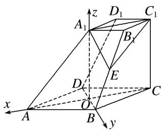
所以四边形 $A_{1}OCC_{1}$ 为平行四边形，所以 $A_{1}O \parallel CC_{1}$ ，且 $A_{1}O = CC_{1}$ 。所以 $A_{1}O \perp$ 底面 ABCD。

以 O 为原点，OA，OB， $OA_{1}$ 所在直线分别为 x 轴，y 轴，z 轴建立空间直角坐标系 O-xyz.
则 $A(2\sqrt{3}, 0, 0)$ ， $A_{1}(0, 0, 4)$ ， $C_{1}(-2\sqrt{3}, 0, 4)$ ， $B(0, 2, 0)$ ，
$\overrightarrow{AB} = (-2\sqrt{3}, 2, 0)$ . 由 $\overrightarrow{A_1B_1} = \frac{1}{2}\overrightarrow{AB}$ , 得 $B_1(-\sqrt{3}, 1, 4)$ .
因为 E 是棱 $BB_{1}$ 的中点，所以 $E\left(-\frac{\sqrt{3}}{2}, \frac{3}{2}, 2\right)$ ,
所以 $\vec{EA}_{1}=\left(\frac{\sqrt{3}}{2},-\frac{3}{2},2\right)$ ， $A_{1}\vec{C}_{1}=(-2\sqrt{3},0,0)$ .
设 $\boldsymbol{n}=(x,y,z)$ 为平面 $EA_{1}C_{1}$ 的法向量，则 $\left\{\begin{aligned}\boldsymbol{n}\cdot A_{1}\overrightarrow{C}_{1}&=-2\sqrt{3}x=0,\\ \boldsymbol{n}\cdot\overrightarrow{EA}_{1}&=\frac{\sqrt{3}}{2}x-\frac{3}{2}y+2z=0,\end{aligned}\right.$ 取 z=3，得 $\boldsymbol{n}=(0,4,3)$ ,

取平面 $A_{1}C_{1}C$ 的法向量 $\boldsymbol{m}=(0,1,0)$ ,
又由图可知，二面角 $E-A_{1}C_{1}-C$ 为锐二面角，
设二面角 $E-A_{1}C_{1}-C$ 的平面角为 $\theta$ ，则 $\cos\theta=\frac{|m\cdot n|}{|m||n|}=\frac{4}{5}$ ,
所以二面角 $E-A_{1}C_{1}-C$ 的余弦值为 $\frac{4}{5}$ .

# 【对点训练】

1. (2019·全国III)图 1 是由矩形 ADEB, Rt△ABC 和菱形 BFGC 组成的一个平面图形, 其中 AB=1, BE=BF=2, ∠FBC=60°. 将其沿 AB, BC 折起使得 BE 与 BF 重合, 连接 DG, 如图 2.  
（1）证明：图2中的A，C，G，D四点共面，且平面ABC⊥平面BCGE；  
（2）求图 2 中的二面角 B-CG-A 的大小.
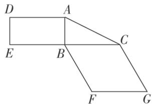

图1

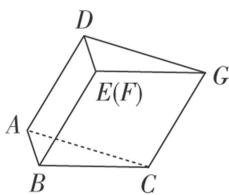

图2

1. 解析 （1）由已知得 $AD \parallel BE$ , $CG \parallel BE$ , 所以 $AD \parallel CG$ ,
所以 AD, CG 确定一个平面，从而 A, C, G, D 四点共面.
由已知得 $AB \perp BE$ ， $AB \perp BC$ ，且 $BE \cap BC = B$ ，所以 $AB \perp$ 平面 BCGE.
又因为 $AB \subset$ 平面 ABC，所以平面 $ABC \perp$ 平面 BCGE.  
（2）作 $EH \perp BC$ ，垂足为 $H$ 。因为 $EH \subset$ 平面 $BCGE$ ，平面 $BCGE \perp$ 平面 $ABC$ ，

平面 $BCGE \cap$ 平面 ABC = BC，所以 $EH \perp$ 平面 ABC.
由已知，菱形 BCGE 的边长为 2， $\angle EBC=60^{\circ}$ ，可求得 BH=1， $EH=\sqrt{3}$ .

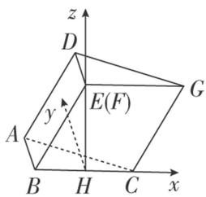

以 H 为坐标原点， $\overrightarrow{HC}$ 的方向为 x 轴的正方向，建立如图所示的空间直角坐标系 Hxyz,则 $A(-1, 1, 0), C(1, 0, 0), G(2, 0, \sqrt{3}), \vec{C}G = (1, 0, \sqrt{3}), \vec{A}C = (2, -1, 0)$ .
设平面 ACGD 的法向量为 $\boldsymbol{n}=(x,y,z)$ ，则 $\left\{\begin{aligned}\overrightarrow{CG}\cdot\boldsymbol{n}&=0,\\ \overrightarrow{AC}\cdot\boldsymbol{n}&=0,\end{aligned}\right.$ 即 $\left\{\begin{aligned}x+\sqrt{3}z&=0,\\ 2x-y&=0.\end{aligned}\right.$ 所以可取 $n=(3,6,-\sqrt{3})$ 。又平面 BCGE 的法向量可取 $m=(0,1,0)$
所以 $\cos<n,\quad m>=\frac{n\cdot m}{|n||m|}=\frac{\sqrt{3}}{2}$ . 因此二面角 B-CG-A 的大小为 $30^{\circ}$ .

2. 如图，在棱长为 2 的正方体 $ABCD - A_{1}B_{1}C_{1}D_{1}$ 中， $E$ 是 $BC$ 的中点， $F$ 是 $DD_{1}$ 的中点.  
（1）求证： $CF \parallel$ 平面 $A_{1}DE$ ;  
（2）求平面 $A_{1}DE$ 与平面 $A_{1}DA$ 夹角的余弦值.

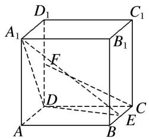

2. 解析 （1）分别以 $DA, DC, DD_{1}$ 所在直线为 $x$ 轴， $y$ 轴， $z$ 轴建立空间直角坐标系，

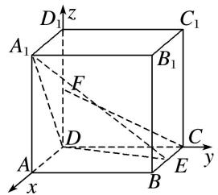
则 $A_{1}(2,0,2)$ ， $E(1,2,0)$ ， $D(0,0,0)$ ， $C(0,2,0)$ ， $F(0,0,1)$ ，
则 $\overrightarrow{DA_{1}}=(2,0,2)$ ， $\overrightarrow{DE}=(1,2,0)$ ， $\overrightarrow{CF}=(0,-2,1)$
设平面 $A_{1}DE$ 的法向量 $\boldsymbol{n}=(a, b, c)$ ，则 $\left\{\begin{aligned}\boldsymbol{n}\cdot\overrightarrow{DA_{1}}&=2a+2c=0,\\ \boldsymbol{n}\cdot\overrightarrow{DE}&=a+2b=0,\end{aligned}\right.$ 取 $\boldsymbol{n}=(-2,1,2)$ ,
∴ $\overrightarrow{CF} \cdot n = (0, -2, 1) \cdot (-2, 1, 2) = 0$ ，又 $CF \not\subset$ 平面 $A_{1}DE$ ，∴ $CF \parallel$ 平面 $A_{1}DE$ .  
（2） $\overrightarrow{DC}=(0,2,0)$ 是平面 $A_{1}DA$ 的法向量， $\therefore\cos<n,\quad\overrightarrow{DC}=\frac{(-2,1,2)\cdot(0,2,0)}{\sqrt{(-2)^{2}+1^{2}+2^{2}}\cdot\sqrt{0+2^{2}+0}}=\frac{1}{3},$ 即平面 $A_{1}DE$ 与平面 $A_{1}DA$ 夹角的余弦值为 $\frac{1}{3}$ .

3. (2019·全国Ⅱ)如图，长方体 $ABCD-A_{1}B_{1}C_{1}D_{1}$ 的底面 ABCD 是正方形，点 E 在棱 $AA_{1}$ 上， $BE \perp EC_{1}$ .  
（1）证明： $BE \perp$ 平面 $EB_{1}C_{1}$ ;  
（2）若 $AE=A_{1}E$ ，求二面角 $B-EC-C_{1}$ 的正弦值.

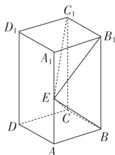

3. 解析 （1）由已知, 得 $B_{1}C_{1} \perp$ 平面 $ABB_{1}A_{1}$ , 由于 $BE \subset$ 平面 $ABB_{1}A_{1}$ ,
故 $B_{1}C_{1} \perp BE$ 。又 $BE \perp EC_{1}$ ， $B_{1}C_{1} \cap EC_{1} = C_{1}$ ，所以 $BE \perp$ 平面 $EB_{1}C_{1}$  
（2）由（1）知 $\angle BEB_{1}=90^{\circ}$ ．由题设知 Rt $\triangle ABE \cong$ Rt $\triangle A_{1}B_{1}E$ ，所以 $\angle AEB=45^{\circ}$ ，故 $AE=AB$ ， $AA_{1}=2AB$ ．

以 D 为坐标原点， $\overrightarrow{DA}$ 的方向为 x 轴正方向， $\overrightarrow{DC}$ 的方向为 y 轴正方向， $\overrightarrow{DD_{1}}$ 的方向为 z 轴正方向， $|\overrightarrow{DA}|$

为单位长度，建立如图所示的空间直角坐标系 Dxyz，

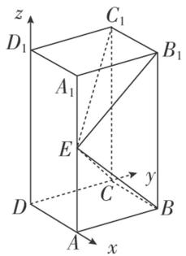
则 $C(0, 1, 0)$ ， $B(1, 1, 0)$ ， $C_{1}(0, 1, 2)$ ， $E(1, 0, 1)$ ，
所以 $\overrightarrow{CB}=(1,0,0)$ ， $\overrightarrow{CE}=(1,-1,1)$ ， $CC_{1}=(0,0,2)$ .
设平面 EBC 的法向量为 $\boldsymbol{n}=(x_{1},y_{1},z_{1})$ ，则 $\left\{\begin{aligned}\vec{CB}\cdot\boldsymbol{n}&=0,\\ \vec{CE}\cdot\boldsymbol{n}&=0,\end{aligned}\right.$ 即 $\left\{\begin{aligned}x_{1}&=0,\\ x_{1}-y_{1}&+z_{1}=0,\end{aligned}\right.$
所以可取 $n=(0,-1,-1)$ .
设平面 $ECC_{1}$ 的法向量为 $\boldsymbol{m}=(x_{2},y_{2},z_{2})$ ，则 $\left\{\begin{aligned}CC_{1}\cdot\boldsymbol{m}&=0,\\ \overrightarrow{CE}\cdot\boldsymbol{m}&=0,\end{aligned}\right.$ 即 $\left\{\begin{aligned}2z_{2}&=0,\\ x_{2}-y_{2}+z_{2}&=0,\end{aligned}\right.$
所以可取 $m=(1,1,0)$ . 于是 $\cos<n,\quad m>=\frac{n\cdot m}{|n||m|}=-\frac{1}{2}$ .
所以二面角 $B-EC-C_{1}$ 的正弦值为 $\frac{\sqrt{3}}{2}$ .

4. (2019·全国Ⅰ改编)如图, 直四棱柱 $ABCD - A_{1}B_{1}C_{1}D_{1}$ 的底面是菱形, $AA_{1} = 4$ , $AB = 2$ , $\angle BAD = 60^{\circ}$ , $E$ , $M$ , $N$ 分别是 $BC$ , $BB_{1}$ , $A_{1}D$ 的中点.  
（1）证明： $MN \parallel$ 平面 $C_{1}DE$ ;  
（2）求平面 $AMA_{1}$ 与平面 $MA_{1}N$ 夹角的正弦值.

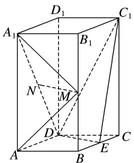

4. 解析 （1）如图, 连接 $B_{1} C$ , $M E$ . 因为 $M$ , $E$ 分别为 $B B_{1}$ , $B C$ 的中点,

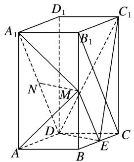
所以 $ME \parallel B_{1}C$ ，且 $ME = \frac{1}{2}B_{1}C$ 。又因为 N 为 $A_{1}D$ 的中点，所以 $ND = \frac{1}{2}A_{1}D$ 。
由题设知 $A_{1}B_{1} \parallel DC$ 且 $A_{1}B_{1}=DC$ ，可得 $B_{1}C \parallel A_{1}D$ 且 $B_{1}C=A_{1}D$ ，故 $ME \parallel ND$ 且 ME=ND，
因此四边形 MNDE 为平行四边形，MN//ED．又 MN⊂平面 $C_{1}DE$ ，ED⊂平面 $C_{1}DE$ ，
所以 $MN \parallel$ 平面 $C_{1}DE$ .  
（2）由已知可得 $DE \perp DA$ ，以 D 为坐标原点， $\overrightarrow{DA}$ 的方向为 x 轴正方向，建立如图所示的空间直角坐标系 Dxyz，

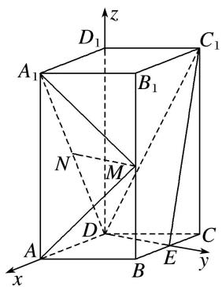
则 $A(2, 0, 0)$ ， $A_{1}(2, 0, 4)$ ， $M(1, \sqrt{3}, 2)$ ， $N(1, 0, 2)$ ， $\overrightarrow{A_{1}A} = (0, 0, -4)$ ， $\overrightarrow{A_{1}M} = (-1, \sqrt{3}, -2)$ ，
$\overrightarrow {A _ {1} N} = (- 1, 0, - 2), \overrightarrow {M N} = (0, - \sqrt {3}, 0).$
设 $\boldsymbol{m}=(x,y,z)$ 为平面 $A_{1}MA$ 的一个法向量，则 $\left\{\begin{aligned}\boldsymbol{m}\cdot\overrightarrow{A_{1}M}&=0,\\ \boldsymbol{m}\cdot\overrightarrow{A_{1}A}&=0,\end{aligned}\right.$
所以 $\left\{\begin{aligned}-x+\sqrt{3}y-2z=0,\\ -4z=0,\end{aligned}\right.$ 可得 $m=(\sqrt{3},1,0)$ .
设 $\boldsymbol{n}=(p,\quad q,\quad r)$ 为平面 $A_{1}MN$ 的一个法向量，则 $\left\{\begin{aligned}\boldsymbol{n}\cdot\overrightarrow{MN}&=0,\\\boldsymbol{n}\cdot\overrightarrow{A_{1}N}&=0,\end{aligned}\right.$
所以 $\left\{\begin{aligned}-\sqrt{3}q&=0,\\ -p&-2r=0,\end{aligned}\right.$ 可取n=(2,0,-1).
于是 $\cos<m,\quad n>=\frac{m\cdot n}{|m||n|}=\frac{2\sqrt{3}}{2\times\sqrt{5}}=\frac{\sqrt{15}}{5},$
所以平面 $AMA_{1}$ 与平面 $MA_{1}N$ 夹角的正弦值为 $\frac{\sqrt{10}}{5}$ .

# 考点二 棱(圆)锥模型

[例 1] (2020·全国 I) 如图，D 为圆锥的顶点，O 是圆锥底面的圆心，AE 为底面直径，AE = AD. △ ABC 是底面的内接正三角形，P 为 DO 上一点， $PO = \frac{\sqrt{6}}{6}DO$ .  
（1）证明： $PA \perp$ 平面 PBC;  
（2）求二面角 B-PC-E 的余弦值.

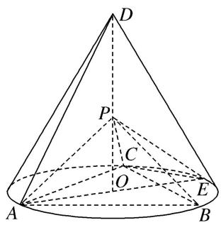

解析 （1） 设 DO=a，由题意可得 $PO=\frac{\sqrt{6}}{6}a$ ， $AO=\frac{\sqrt{3}}{3}a$ ，AB=a，PA=PB=PC= $\frac{\sqrt{2}}{2}a$ .
因此 $PA^{2}+PB^{2}=AB^{2}$ ，从而 $PA\perp PB$ 。又 $PA^{2}+PC^{2}=AC^{2}$ ，
故 $PA \perp PC$ 。又 $PB \cap PC = P$ ， $PB$ ， $PC \subset$ 平面 $PBC$ ，所以 $PA \perp$ 平面 $PBC$ 。

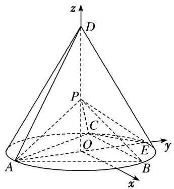  
（2）以 O 为坐标原点， $\overrightarrow{OE}$ 的方向为 y 轴正方向， $|\overrightarrow{OE}|$ 为单位长度，建立如图所示的空间直角坐标系 Oxyz. 由题设可得 $E(0, 1, 0)$ ， $A(0, -1, 0)$ ， $C\left(-\frac{\sqrt{3}}{2}, \frac{1}{2}, 0\right)$ ， $P\left(0, 0, \frac{\sqrt{2}}{2}\right)$ .
所以 $\overrightarrow{EC} = \left[-\frac{\sqrt{3}}{2}, -\frac{1}{2}, 0\right], \overrightarrow{EP} = \left[0, -1, \frac{\sqrt{2}}{2}\right].$
设 $m=(x,y,z)$ 是平面 PCE 的法向量，则 $\left\{\begin{aligned}m\cdot\overrightarrow{EP}&=0,\\ m\cdot\overrightarrow{EC}&=0,\end{aligned}\right.$ 即 $\left\{\begin{aligned}-y+\frac{\sqrt{2}}{2}z&=0,\\ -\frac{\sqrt{3}}{2}x-\frac{1}{2}y&=0.\end{aligned}\right.$

可取 $m=\left(-\frac{\sqrt{3}}{3},1,\sqrt{2}\right)$ .
由（1）知 $\overrightarrow{AP} = \left[0, 1, \frac{\sqrt{2}}{2}\right]$ 是平面 $PCB$ 的一个法向量，记 $n = \overrightarrow{AP}$ ，
则 $\cos < n$ ， $m > = \frac{n\cdot m}{|n|\cdot|m|} = \frac{2\sqrt{5}}{5}$ 所以二面角 $B - PC - E$ 的余弦值为 $\frac{2\sqrt{5}}{5}$

[例 2] (2021·全国新 I) 如图，在三棱锥 A-BCD 中，平面 $ABD \perp$ 平面 BCD，AB = AD，O 为 BD 的中点.  
（1）证明： $OA \perp CD$  
（2）若 $\triangle OCD$ 是边长为1的等边三角形，点 $E$ 在棱 $AD$ 上， $DE=2EA$ ，且二面角 $E-BC-D$ 的大小为 $45^{\circ}$ ，求三棱锥 $A-BCD$ 的体积.

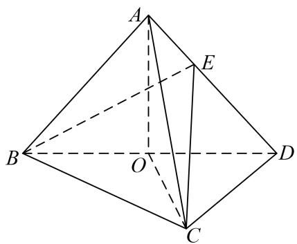

解析 （1）因为 AB=AD，O 为 BD 的中点，所以 $AO \perp BD$ ，
又平面 $ABD \perp$ 平面 BCD，平面 $ABD \cap$ 平面 BCD = BD，AO ⊂ 平面 BCD，
所以 $AO \perp$ 平面 BCD，又 $CD \subset$ 平面 BCD，所以 $OA \perp CD$ ;

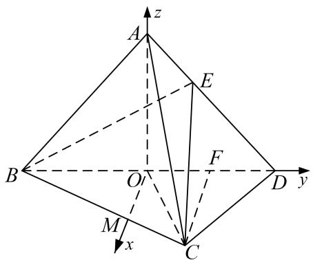  
（2）取 OD 的中点 F，因为 $\triangle OCD$ 为正三角形，所以 $CF \perp OD$ ，

过 O 作 OM//CF 与 BC 交于点 M，则 OM⊥OD，所以 OM，OD，OA 两两垂直，

以点 O 为坐标原点，分别以 OM, OD, OA 为 x 轴，y 轴，z 轴建立空间直角坐标系如图所示，则 $B(0, -1, 0)$ ， $C(\frac{\sqrt{3}}{2}, \frac{1}{2}, 0)$ ， $D(0, 1, 0)$ ，设 $A(0, 0, t)$ ，则 $E(0, \frac{1}{3}, \frac{2t}{3})$ ，
因为 $OA \perp$ 平面 BCD，故平面 BCD 的一个法向量为 $\overrightarrow{OA} = (0, 0, t)$ ,
设平面 BCE 的法向量为 $\boldsymbol{n}=(x,y,z)$ ，又 $\overrightarrow{BC}=(\frac{\sqrt{3}}{2},\frac{3}{2},0)$ ， $\overrightarrow{BE}=(0,\frac{4}{3},\frac{2t}{3})$
所以由 $\left\{ \begin{array}{l} n \cdot \overrightarrow{BC} = 0, \\ n \cdot \overrightarrow{BE} = 0, \end{array} \right.$ 得 $\left\{ \begin{array}{l} \frac{\sqrt{3}}{2} x - \frac{3}{2} y = 0, \\ \frac{4}{3} y + \frac{2t}{3} z = 0, \end{array} \right.$ 令 $x = \sqrt{3}$ ，则 $n = (\sqrt{3}, -1, \frac{2}{t})$ .
因为二面角 $E - BC - D$ 的大小为 $45^{\circ}$ ，所以 $\cos < n$ ， $\overrightarrow{OA} > = \frac{n \cdot \overrightarrow{OA}}{|n||\overrightarrow{OA}|} = \frac{2}{t \sqrt{4 + \frac{4}{t^2}}} = \frac{\sqrt{2}}{2}$ ，
解得 t=1，所以 OA=1，又 $S_{\triangle OCD}=\frac{1}{2}\times1\times1\times\frac{\sqrt{3}}{2}=\frac{\sqrt{3}}{4}$ ，所以 $S_{\triangle BCD}=\frac{\sqrt{3}}{2}$ ,
故 $V_{A - BCD} = \frac{1}{3}\times S_{\triangle BCD}\times OA = \frac{1}{3}\times \frac{\sqrt{3}}{2}\times 1 = \frac{\sqrt{3}}{6}.$

[例 3] (2021·全国新 II) 在四棱锥 Q-ABCD 中，底面 ABCD 是正方形，若 AD=2， $QD=QA=\sqrt{5}$ ，QC=3.  
（1）证明：平面 $QAD \perp$ 平面 ABCD;  
（2）求二面角 B-QD-A 的平面角的余弦值.

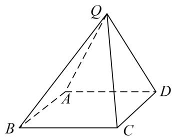

解析 （1）取 AD 的中点为 O，连接 QO，CO.
因为 $QD = QA$ ， $OD = OA$ ，则 $QO \perp AD$ ，而 $AD = 2$ ， $QA = \sqrt{5}$ ，故 $QO = \sqrt{5 - 1} = 2$
在正方形 ABCD 中，因为 AD=2，故 DO=1，故 $CO=\sqrt{5}$ ，
因为 QC=3，故 $QO^{2}+OC^{2}=QC^{2}$ ，故 $\triangle QOC$ 为直角三角形且 $QO\perp OC$ ，
因为 $OC \cap AD = O$ ，故 $QO \perp$ 底面 ABCD。因为 $QO \subset$ 平面 QAD，，故平面 $QAD \perp$ 底面 ABCD。  
（2）在平面 ABCD 内，过 O 作 OT//CD，交 BC 于 T，则 OT⊥AD，

结合（1）中的 $QO \perp$ 平面 ABCD，故可建如图所示的空间坐标系.

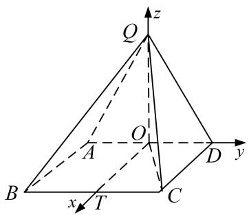
则 $D(0, 1, 0)$ , $Q(0, 0, 2)$ , $B(2, -1, 0)$ , 故 $\overrightarrow{BQ} = (-2, 1, 2)$ , $\overrightarrow{BD} = (-2, 2, 0)$ .
设平面 QBD 的法向量 $\boldsymbol{n}=(x,y,z)$ ，则 $\left\{\begin{aligned}\boldsymbol{n}\cdot\overrightarrow{BQ}&=0,\\ \boldsymbol{n}\cdot\overrightarrow{BD}&=0,\end{aligned}\right.$ 即 $\left\{\begin{aligned}-2x+y+2z&=0,\\ -2x+2y&=0.\end{aligned}\right.$
不妨设 x=1，可得 $n=(1,1,\frac{1}{2})$ .

而平面 QAD 的法向量为 $\boldsymbol{m}=(1,0,0)$ . 故 $\cos<m,\quad n>=\frac{\boldsymbol{m}\cdot\boldsymbol{n}}{|\boldsymbol{m}||\boldsymbol{n}|}=\frac{1}{1\times\frac{3}{2}}=\frac{2}{3}$ ,

二面角 B-QD-A 的平面角为锐角，故其余弦值为 $\frac{2}{3}$ .

[例 4] 如图，在几何体 ABCDE 中，四边形 ABCD 是矩形， $AB \perp$ 平面 BEC， $BE \perp EC$ ， $AB = BE = EC = 2$ ，G，F 分别是线段 BE，DC 的中点.  
（1）求证： $GF \parallel$ 平面 ADE;  
（2）求平面 AEF 与平面 BEC 夹角的余弦值.

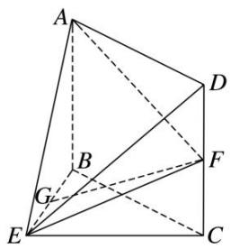

解析 方法一 （1）如图，取 AE 的中点 H，连接 HG，HD，
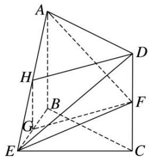
因为 G 是 BE 的中点，所以 $GH \parallel AB$ ，且 $GH = \frac{1}{2} AB$ 。又 F 是 CD 的中点，所以 $DF = \frac{1}{2} CD$ 。
由四边形 ABCD 是矩形，得 $AB \parallel CD$ ，AB = CD，所以 GH // DF，且 GH = DF，
从而四边形 HGFD 是平行四边形，所以 GF//DH.
又 $DH \subset$ 平面 ADE， $GF \not\subset$ 平面 ADE，所以 $GF \parallel$ 平面 ADE.  
（2）如图，在平面 BEC 内，

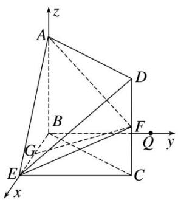

过 B 点作 $BQ \parallel EC$ 。因为 $BE \perp CE$ ，所以 $BQ \perp BE$ 。又因为 $AB \perp$ 平面 BEC ，所以 $AB \perp BE$ ， $AB \perp BQ$ 。

以 B 为原点，分别以 BE, BQ, BA 所在直线为 x 轴，y 轴，z 轴，建立空间直角坐标系 Bxyz,
则 $A(0, 0, 2)$ , $B(0, 0, 0)$ , $E(2, 0, 0)$ , $F(2, 2, 1)$ . 因为 $AB \perp$ 平面 $BEC$ ,
所以 $\overrightarrow{BA}=(0,0,2)$ 为平面BEC的法向量.
设 $n=(x, y, z)$ 为平面 AEF 的法向量．又 $\overrightarrow{AE}=(2, 0, -2)$ ， $\overrightarrow{AF}=(2, 2, -1)$ ，
由 $\left\{\begin{aligned}\boldsymbol{n}\cdot\overrightarrow{AE}&=0,\\ \boldsymbol{n}\cdot\overrightarrow{AF}&=0,\end{aligned}\right.$ 得 $\left\{\begin{aligned}2x-2z&=0,\\ 2x+2y-z&=0.\end{aligned}\right.$ 取 z=2，得 $\boldsymbol{n}=(2,-1,2)$ .
从而 $|\cos < n, \vec{BA} >| = \frac{|\boldsymbol{n} \cdot \vec{BA}|}{|\boldsymbol{n}||\vec{BA}|} = \frac{4}{2 \times 3} = \frac{2}{3}$ ，所以平面 $AEF$ 与平面 $BEC$ 夹角的余弦值为 $\frac{2}{3}$ .
方法二 （1）如图，取 AB 的中点 M，连接 MG，MF.

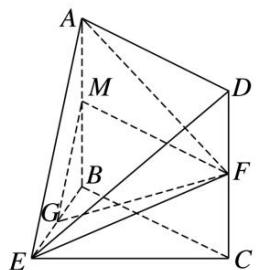
由 G 是 BE 的中点，可知 $GM \parallel AE$ 。又 $AE \subset$ 平面 ADE， $GM \not\subset$ 平面 ADE，所以 $GM \parallel$ 平面 ADE。
在矩形 ABCD 中，由 M, F 分别是 AB, CD 的中点得 $MF \parallel AD$ .
又 $AD \subset$ 平面 ADE， $MF \not\subset$ 平面 ADE。所以 $MF \parallel$ 平面 ADE。
又因为 $GM \cap MF = M$ ， $GM \subset$ 平面 GMF， $MF \subset$ 平面 GMF，所以平面 GMF // 平面 ADE.
因为 $GF \subset$ 平面 GMF，所以 $GF \parallel$ 平面 ADE.  
（2）同方法一.

[例 5] 如图，在四棱锥 P-ABCD 中，底面 ABCD 是菱形， $\angle BAD=60^{\circ}$ ，Q 为 AD 的中点， $PQ\perp$ 平面 ABCD，PA=PD=AD=2，M 是棱 PC 上一点，且 $\frac{PM}{PC}=\frac{1}{3}$ .  
（1）证明： $PA \parallel$ 平面 BMQ;  
（2）求二面角 B-MQ-C 的余弦值.

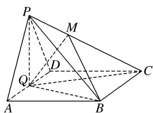

解析 （1）如图，连接 AC，交 BQ 于 N，连接 MN，∵底面 ABCD 是菱形，
$\therefore A Q / / B C, \therefore \triangle A N Q \sim \triangle C N B, \therefore \frac {A Q}{B C} = \frac {A N}{N C} = \frac {1}{2}, \therefore \frac {A N}{A C} = \frac {1}{3}, \text {又} \frac {P M}{P C} = \frac {1}{3}, \therefore \frac {P M}{P C} = \frac {A N}{A C} = \frac {1}{3},$
∴MN//PA，又MN⊂平面BMQ. PA∉平面BMQ，∴PA//平面BMQ.

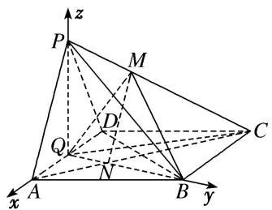  
（2）连接 BD，∵底面 ABCD 是菱形，且 $\angle BAD=60^{\circ}$ ，∴ $\triangle BAD$ 是等边三角形，
又 Q 为 AD 的中点，∴ $BQ \perp AD$ 。由 $PQ \perp$ 平面 ABCD ，得 $PQ \perp AD$ 。

以 Q 为坐标原点，QA，QB，QP 所在的直线分别为 x 轴，y 轴，z 轴建立空间直角坐标系，
则 $Q(0, 0, 0)$ ， $A(1, 0, 0)$ ， $B(0, \sqrt{3}, 0)$ ， $D(-1, 0, 0)$ ， $P(0, 0, \sqrt{3})$ ，
由 $\overrightarrow{AC} = \overrightarrow{AD} +\overrightarrow{AB} = (-2,0,0) + (-1,\sqrt{3},0) = (-3,\sqrt{3},0)$ ，可得点 $C(-2,\sqrt{3},0)$
设平面 PQC 的法向量为 $\boldsymbol{n}=(x,y,z)$ . 则 $\left\{\begin{aligned}n\cdot\overrightarrow{QP}&=0,\\ n\cdot\overrightarrow{QC}&=0,\end{aligned}\right.$ 即 $\left\{\begin{aligned}\sqrt{3}z&=0,\\ -2x+\sqrt{3}y&=0,\end{aligned}\right.$
令 x=3，得 $y=2\sqrt{3}$ ，z=0，∴ $n=(3,2\sqrt{3},0)$ ， $|n|=\sqrt{21}$ .
设平面 BMQ 的法向量为 $\boldsymbol{m}=(x_{1},y_{1},z_{1})$ ，则 $\left\{\begin{aligned}&m\cdot\overrightarrow{QB}=0,\\ &m\cdot\overrightarrow{MN}=0,\end{aligned}\right.$ $\because MN//PA,\therefore\left\{\begin{aligned}&m\cdot\overrightarrow{QB}=0,\\ &m\cdot\overrightarrow{PA}=0,\end{aligned}\right.$
即 $\left\{ \begin{array}{l} \sqrt{3} y_1 = 0, \\ x_1 - \sqrt{3} z_1 = 0, \end{array} \right.$ 令 $x_1 = \sqrt{3}$ ，则 $z_1 = 1$ ， $y_1 = 0$ ， $\therefore m = (\sqrt{3}, 0, 1)$ 是平面 $BMQ$ 的一个法向量.
设二面角 B-MQ-C 的平面角的大小为 $\theta$ ，则 $\cos\theta=\frac{m\cdot n}{|m||n|}=\frac{3\sqrt{7}}{14}$ ,
即二面角 B-MQ-C 的余弦值为 $\frac{3\sqrt{7}}{14}$ .

[例6] 如图，在 Rt△ABC 中，B 为直角，AB=2BC，E，F 分别为 AB，AC 的中点，将 △AEF 沿 EF 折起，使点 A 到达点 D 的位置，连接 BD，CD，M 为 CD 的中点.  
（1）证明： $MF \perp$ 平面 BCD;  
（2）若 $DE \perp BE$ ，求平面 $EMF$ 与平面 $MFC$ 夹角的余弦值.

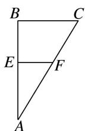

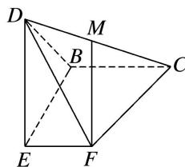

解析 （1）如图，取 $DB$ 的中点 $N$ ，连接 $MN$ ， $EN$
∵MN//BC, $MN=\frac{1}{2}BC$ , $EF//BC$ , $EF=\frac{1}{2}BC$ , ∴四边形EFMN是平行四边形,
∵ $EF \perp BE$ , $EF \perp DE$ , $BE \cap DE = E$ , BE, $DE \subset$ 平面 BDE,
∴EF⊥平面 BDE，∴EF⊥EN，∴MF⊥MN，
在 $\triangle DFC$ 中，DF=FC，又∵M为CD的中点，∴ $MF\perp CD$ ，
又∵CD∩MN=M，CD，MN⊂平面BCD，∴MF⊥平面BCD.  
（2）∵ $DE\perp BE$ ， $DE\perp EF$ ， $BE\cap EF=E$ ，BE， $EF\subset$ 平面 BEF，∴ $DE\perp$ 平面 BEF，

以 E 为原点，BE，EF，ED 所在直线分别为 x，y，z 轴，建立空间直角坐标系，设 BC=2，

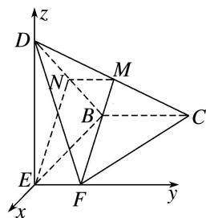
则 $E(0, 0, 0)$ ， $F(0, 1, 0)$ ， $C(-2, 2, 0)$ ， $M(-1, 1, 1)$ ，
$\therefore \overrightarrow{EF} = (0, 1, 0), \overrightarrow{FM} = (-1, 0, 1), \overrightarrow{CF} = (2, -1, 0),$
设平面 EMF 的一个法向量为 $\boldsymbol{m}=(x,y,z)$ ，则 $\left\{\begin{aligned}\boldsymbol{m}\cdot\overrightarrow{EF}=y=0,\\ \boldsymbol{m}\cdot\overrightarrow{FM}&=-x+z=0,\end{aligned}\right.$ 取 x=1，得 $\boldsymbol{m}=(1,0,1)$ ,

同理，得平面 CMF 的一个法向量为 $n=(1,2,1)$ ,
设平面 EMF 与平面 MFC 的夹角为 $\theta$ ，则 $\cos\theta=\frac{|m\cdot n|}{|m|\cdot|n|}=\frac{\sqrt{3}}{3}$ ,
∴平面 EMF 与平面 MFC 夹角的余弦值为 $\frac{\sqrt{3}}{3}$ .

[例 7] 在 Rt△ABC 中，∠ABC=90°， $\tan\angle ACB=\frac{1}{2}$ . 已知 E，F 分别是 BC，AC 的中点．将△CEF 沿 EF 折起，使 C 到 C' 的位置且二面角 C'-EF-B 的大小是 60°．连接 C'B，C'A，如图：  
（1）求证：平面 $C'FA \perp$ 平面 $ABC'$ ;  
（2）求平面 $AFC'$ 与平面 $BEC'$ 所成二面角的大小.

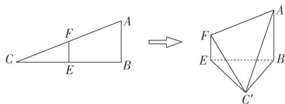

解析 （1）证法一: 如图, 设 $AC'$ 的中点为 $G$ , 连接 $FG$ .
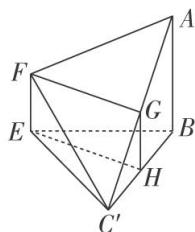
设 $BC'$ 的中点为 $H$ ，连接 $GH$ ， $EH$ 。\$\because E, F\$ 分别为 $BC, AC$ 的中点，
∴ $AF = FC'$ , $BE = EC'$ , $EF \parallel AB$ , $EF = \frac{1}{2} AB$ , 又 G, H 分别为 $AC'$ , $BC'$ 的中点,
$\therefore FG \perp AC'$ , $EH \perp BC'$ , $GH \parallel AB$ , $GH = \frac{1}{2} AB$ , $\therefore EF \parallel GH$ ,
∴四边形 EHGF 为平行四边形．∴ $FG \perp BC'$ ，又 $AC' \cap BC' = C'$ ，∴ $FG \perp$ 平面 $ABC'$ ，
又 $FG \subset$ 平面 $C'FA$ , $\therefore$ 平面 $C'FA \perp$ 平面 $ABC'$ .

证法二：如图，建立空间直角坐标系，设 AB=2，则 $A(0,0,2)$ ， $B(0,0,0)$ ， $F(2,0,1)$ ， $E(2,0,0)$ ， $C'(1,\sqrt{3},0)$ .

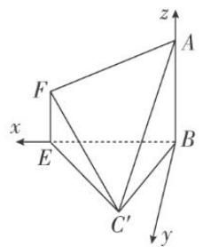
设平面 $ABC'$ 的法向量为 $\boldsymbol{a}=(x_{1}, y_{1}, z_{1})$ ,
$\because \overrightarrow{BA} = (0, 0, 2), \overrightarrow{BC}' = (1, \sqrt{3}, 0), \therefore \begin{cases} z_1 = 0, \\ x_1 + \sqrt{3}y_1 = 0, \end{cases}$ 令 $y_1 = 1$ ，则 $\boldsymbol{a} = (-\sqrt{3}, 1, 0)$ ，
设平面 $C'FA$ 的法向量为 $\boldsymbol{b}=(x_{2}, y_{2}, z_{2})$ ,
$\because \overrightarrow{AF} = (2, 0, -1), \overrightarrow{AC}' = (1, \sqrt{3}, -2), \therefore \begin{cases} 2x_2 - z_2 = 0, \\ x_2 + \sqrt{3}y_2 - 2z_2 = 0, \end{cases}$ 令 $y_2 = \sqrt{3}$ ，则 $b = (1, \sqrt{3}, 2)$ .
$\because a\cdot b=0,\quad\therefore$ 平面 $C'FA\perp$ 平面 $ABC'$ .  
（2）如图，建立空间直角坐标系，设 $AB = 2$ ，则 $A(0,0,2),B(0,0,0),F(2,0,1),E(2,0,0),C'(1,\sqrt{3},0)$ .显然平面 $BEC'$ 的法向量 $\pmb {m} = (0,0,1)$
设平面 $AFC'$ 的法向量 $\boldsymbol{n}=(x,y,z)$ ，∵ $\overrightarrow{AC}'=(1,\sqrt{3},-2)$ ， $\overrightarrow{AF}=(2,0,-1)$ ，
$\therefore \left\{ \begin{array}{l} 2x - z = 0, \\ x + \sqrt{3}y - 2z = 0, \end{array} \right.$ 令 $x = 1$ ，则 $n = (1, \sqrt{3}, 2)$ .
$\cos <   \boldsymbol {m}, \quad \boldsymbol {n} > = \frac {\boldsymbol {m} \cdot \boldsymbol {n}}{| \boldsymbol {m} | | \boldsymbol {n} |} = \frac {\sqrt {2}}{2},$

观察图形可知，平面 $AFC'$ 与平面 $BEC'$ 所成二面角的平面角为锐角.
∴平面 $AFC'$ 与平面 $BEC'$ 所成二面角的大小为 $45^{\circ}$ .

[例 8] 如图①， $\triangle PAD$ 是以 $AD$ 为斜边的直角三角形， $PA=1$ ， $BC \parallel AD$ ， $CD \perp AD$ ， $AD=2DC=2$ ， $BC=\frac{1}{2}$ ，将 $\triangle PAD$ 沿 $AD$ 折起，如图②，使得 $PC=2$ 。  
（1）证明：平面 PAD⊥平面 ABCD;  
（2）求二面角 A-PB-C 的余弦值.

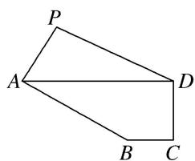

图①

图②
解析 （1） 法一: $\because DC=1, PC=2, PD=\sqrt{AD^{2}-PA^{2}}=\sqrt{3}, \therefore PD^{2}+CD^{2}=PC^{2}$ , 即 $CD\perp PD$ , 又 $CD\perp AD, PD\cap AD=D, \therefore CD\perp$ 平面 $PAD$ , 又 $CD\subset$ 平面 $ABCD, \therefore$ 平面 $PAD\perp$ 平面 $ABCD$ .
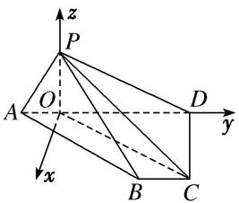

法二：如图，过 $P$ 作 $PO \perp AD$ ，①，垂足为 $O$ ，连接 $OC$ ， $\because PA = 1$ ， $\angle PAD = 60^{\circ}$ ， $\therefore AO = \frac{1}{2}$
$P O = \frac {\sqrt {3}}{2}, O C ^ {2} = O D ^ {2} + C D ^ {2} = \frac {1 3}{4}, O C ^ {2} + P O ^ {2} = \frac {1 3}{4} + \frac {3}{4} = P C ^ {2}, \therefore P O \perp O C, \textcircled {2}, \text {又} A D \cap O C = O, \textcircled {3}$
∴结合①②③知 $PO \perp$ 平面 ABCD，又 $PO \subset$ 平面 PAD，∴平面 $PAD \perp$ 平面 ABCD.  
（2）以 O 为坐标原点，垂直于 OD 的直线为 x 轴，OD 为 y 轴，OP 为 z 轴建立空间直角坐标系，
则 $A\left(0, -\frac{1}{2}, 0\right), B(1, 1, 0), C\left(1, \frac{3}{2}, 0\right), P\left(0, 0, \frac{\sqrt{3}}{2}\right)$ .
设平面 BPC 的法向量为 $\boldsymbol{m}=(x_{1},y_{1},z_{1})$ ，由 $\left\{\begin{aligned}&m\cdot\overrightarrow{BC}=0,\\ &m\cdot\overrightarrow{BP}=0,\end{aligned}\right.$ 得 $x_{1}=\frac{\sqrt{3}}{2}z_{1},y_{1}=0$ ，取 $\boldsymbol{m}=(\sqrt{3},0,2)$ .
设平面 PAB 的法向量为 $\boldsymbol{n}=(x_{2},y_{2},z_{2})$ ，由 $\left\{\begin{aligned}&n\cdot\overrightarrow{AB}=0,\\ &n\cdot\overrightarrow{BP}=0,\end{aligned}\right.$ 得 $x_{2}+\frac{3}{2}y_{2}=0,\quad-x_{2}-y_{2}+\frac{\sqrt{3}}{2}z_{2}=0,$

取 $n=\left(3,-2,\frac{2}{\sqrt{3}}\right)$ ,
∴ $\cos<m,\quad n>=\frac{m\cdot n}{|m|\cdot|n|}=\frac{13\sqrt{301}}{301}$ ，由图形可知二面角 A-PB-C 为钝角，
∴二面角 A-PB-C 的余弦值为 $-\frac{13\sqrt{301}}{301}$ .

[例 9] 如图, 在四棱锥 P-ABCD 中, 侧面 PAD⊥底面 ABCD, 底面 ABCD 为直角梯形, 其中 AB∥CD, ∠CDA=90°, CD=2AB=2, AD=3, PA= $\sqrt{5}$ , PD=2 $\sqrt{2}$ , 点 E 在棱 AD 上且 AE=1, 点 F 为棱 PD 的中点.  
（1）证明：平面 BEF⊥平面 PEC;  
（2）求二面角 A-BF-C 的余弦值.

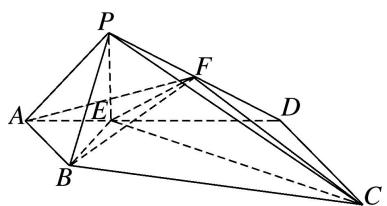

解析 （1） 在 Rt△ABE 中，由 AB = AE = 1，得 ∠AEB = 45°，

同理在 Rt△CDE 中，由 CD=DE=2，得 $\angle DEC=45^{\circ}$ ，所以 $\angle BEC=90^{\circ}$ ，即 $BE\perp EC$ .
在 $\triangle PAD$ 中， $\cos \angle PAD = \frac{PA^2 + AD^2 - PD^2}{2PA \cdot AD} = \frac{5 + 9 - 8}{2 \times 3 \times \sqrt{5}} = \frac{\sqrt{5}}{5}$ ，
在 $\triangle PAE$ 中， $PE^2 = PA^2 + AE^2 - 2PA \cdot AE \cdot \cos \angle PAE = 5 + 1 - 2 \times \sqrt{5} \times 1 \times \frac{\sqrt{5}}{5} = 4,$
所以 $PE^{2}+AE^{2}=PA^{2}$ ，即 $PE \perp AD$ .
又平面 $PAD \perp$ 平面 ABCD，平面 $PAD \cap$ 平面 ABCD = AD， $PE \subset$ 平面 PAD，
所以 $PE \perp$ 平面 ABCD，所以 $PE \perp BE$ .
又因为 $CE \cap PE = E$ ，CE， $PE \subset$ 平面 PEC，所以 $BE \perp$ 平面 PEC，
又 $BE \subset$ 平面 BEF，所以平面 $BEF \perp$ 平面 PEC.  
（2）由（1）知 $EB, EC, EP$ 两两垂直，故以 $E$ 为坐标原点，以射线 $EB, EC, EP$ 分别为 $x$ 轴、 $y$ 轴、 $z$ 轴的正半轴建立如图所示的空间直角坐标系，则

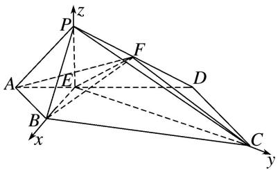
$B(\sqrt{2}, 0, 0), C(0, 2\sqrt{2}, 0), P(0, 0, 2), A\left[\frac{\sqrt{2}}{2}, -\frac{\sqrt{2}}{2}, 0\right], D(-\sqrt{2}, \sqrt{2}, 0), F\left[-\frac{\sqrt{2}}{2}, \frac{\sqrt{2}}{2}, 1\right],$
$\overrightarrow{AB} = \left[\frac{\sqrt{2}}{2}, \frac{\sqrt{2}}{2}, 0\right], \overrightarrow{BF} = \left[-\frac{3\sqrt{2}}{2}, \frac{\sqrt{2}}{2}, 1\right], \overrightarrow{BC} = (-\sqrt{2}, 2\sqrt{2}, 0),$
设平面 ABF 的法向量为 $\boldsymbol{m}=(x_{1},y_{1},z_{1})$ ，则 $\left\{\begin{aligned}\boldsymbol{m}\cdot\vec{AB}&=\frac{\sqrt{2}}{2}x_{1}+\frac{\sqrt{2}}{2}y_{1}=0,\\ \boldsymbol{m}\cdot\vec{BF}&=-\frac{3\sqrt{2}}{2}x_{1}+\frac{\sqrt{2}}{2}y_{1}+z_{1}=0,\end{aligned}\right.$
不妨设 $x_{1}=1$ ，则 $\boldsymbol{m}=(1,-1,2\sqrt{2})$ ,
设平面 BFC 的法向量为 $\boldsymbol{n}=(x_{2},y_{2},z_{2})$ ，则 $\left\{\begin{aligned}\boldsymbol{n}\cdot\overrightarrow{BC}&=-\sqrt{2}x_{2}+2\sqrt{2}y_{2}=0,\\ \boldsymbol{n}\cdot\overrightarrow{BF}&=-\frac{3\sqrt{2}}{2}x_{2}+\frac{\sqrt{2}}{2}y_{2}+z_{2}=0,\end{aligned}\right.$
不妨设 $y_{2}=2$ ，则 $n=(4,2,5\sqrt{2})$ ,

记二面角 A-BF-C 为 $\theta$ (由图知应为钝角)，则 $\cos\theta=-\frac{|m\cdot n|}{|m||n|}=-\frac{|4-2+20|}{\sqrt{10}\times\sqrt{70}}=-\frac{11\sqrt{7}}{35}$ ,
故二面角 A-BF-C 的余弦值为 $-\frac{11\sqrt{7}}{35}$ .

[例10] 如图①，在矩形ABCD中， $AB = 2$ ， $BC = 3$ ，点 $E$ 在线段 $BC$ 上， $BE = 2EC$ .把 $\triangle BAE$ 沿 $AE$ 翻折至 $\triangle B_{1}AE$ 的位置， $B_{1}\notin$ 平面AECD，连接 $B_{1}D$ ，点 $F$ 在线段 $DB_{1}$ 上， $DF = 2FB_{1}$ ，如图②.  
（1）证明： $CF \parallel$ 平面 $B_{1}AE$ ;  
（2）当三棱锥 $B_{1}-ADE$ 的体积最大时，求二面角 $B_{1}-DE-C$ 的余弦值.

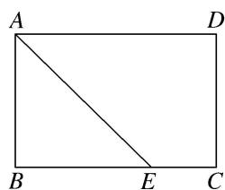

图①

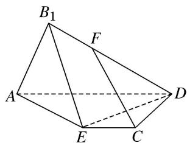

图②
解析 法一：（1）依题意得，在矩形 ABCD 中，AB=2，BC=3，BE=2EC，所以 AD=3，EC=1.
如图③，在线段 $B_{1}A$ 上取一点 M，满足 $AM=2MB_{1}$ ，连接 MF，ME，又 $DF=2FB_{1}$ ，
所以 $\frac{B_{1}M}{MA}=\frac{B_{1}F}{FD}$ ，故 $FM \parallel AD, FM=\frac{1}{3}AD.$ 又 $EC \parallel AD$ ，所以 $EC \parallel FM,$
因为 $FM=\frac{1}{3}AD=1$ ，所以 EC=FM，所以四边形 FMEC 为平行四边形，所以 CF//EM，
又 $CF \not\subset$ 平面 $B_{1}AE$ ， $EM \subset$ 平面 $B_{1}AE$ ，所以 $CF \parallel$ 平面 $B_{1}AE$ .

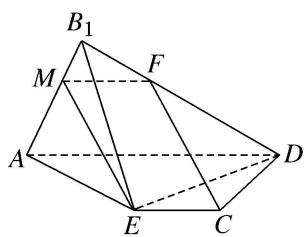

图③

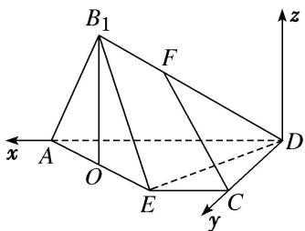

图④  
（2）设 $B_{1}$ 到平面 AECD 的距离为 h，则 $V_{B1-AED}=\frac{1}{3}\cdot S_{\triangle AED}\cdot h$ ，又 $S_{\triangle AED}=3$ ，
所以 $V_{B1-AED}=h$ ，故要使三棱锥 $B_{1}-AED$ 的体积取到最大值，须且仅需 h 取到最大值.
如图④，取 AE 的中点 O，连接 $B_{1}O$ ，依题意得 $B_{1}O \perp AE$ ，则 $h \leq B_{1}O = \sqrt{2}$ ，
因为平面 $B_{1}AE \cap$ 平面 AECD = AE, $B_{1}O \perp AE$ , $B_{1}O \subset$ 平面 $B_{1}AE$ ,
故当平面 $B_{1}AE \perp$ 平面 AECD 时， $B_{1}O \perp$ 平面 AECD， $h = B_{1}O$ .
即当且仅当平面 $B_{1}AE \perp$ 平面 AECD 时， $V_{B1-AED}$ 取得最大值，此时 $h = \sqrt{2}$ .

以 D 为坐标原点， $\overrightarrow{DA}$ ， $\overrightarrow{DC}$ 的方向分别为 x 轴，y 轴的正方向建立空间直角坐标系 D-xyz，则 $D(0,0,0)$ ， $E(1,2,0)$ ， $B_{1}(2,1,\sqrt{2})$ ， $\overrightarrow{DB_{1}}=(2,1,\sqrt{2})$ ， $\overrightarrow{DE}=(1,2,0)$ ，
设 $n=(x,y,z)$ 是平面 $B_{1}ED$ 的法向量，则 $\left\{\begin{aligned}n\cdot D\overrightarrow{B_{1}}&=0,\\ n\cdot\overrightarrow{DE}&=0,\end{aligned}\right.$
得 $\left\{\begin{aligned}&2x+y+\sqrt{2}z=0,\\ &x+2y=0,\end{aligned}\right.$ 令y=1，得 $n=\left(-2,1,\frac{3}{\sqrt{2}}\right)$
又平面 CDE 的一个法向量为 $m=(0,0,1)$ ,
所以 $\cos<m,\quad n>=\frac{m\cdot n}{|m|\cdot|n|}=\frac{\frac{3}{\sqrt{2}}}{\sqrt{4+1+\frac{9}{2}}}=\frac{3\sqrt{19}}{19}.$
因为 $B_{1}-DE-C$ 为钝角，所以其余弦值等于 $-\frac{3\sqrt{19}}{19}$ .

法二：（1）依题意，在线段 AD 上取一点 Q，使得 $DQ=\frac{2}{3}DA$ ，连接 FQ，CQ，如图⑤，
因为 $DF=2FB_{1}$ ，所以 $\frac{DQ}{DA}=\frac{DF}{DB_{1}}$ ，所以 $FQ\parallel B_{1}A$ ，
因为 $FQ \not\subset$ 平面 $B_{1}AE$ ， $B_{1}A \subset$ 平面 $B_{1}AE$ ，所以 $FQ \parallel$ 平面 $B_{1}AE$ ，在矩形 ABCD 中，AD=BC，BE=2EC，所以 $EC=\frac{1}{3}BC=\frac{1}{3}AD=AQ$ ，
又 $AQ \parallel EC$ ，所以四边形 QAEC 为平行四边形，故 $QC \parallel AE$ ，
又 $CQ \not\subset$ 平面 $B_{1}AE$ ， $AE \subset$ 平面 $B_{1}AE$ ，所以 $CQ \parallel$ 平面 $B_{1}AE$ .
又 $CQ \cap FQ = Q$ ，所以平面 $QCF \parallel$ 平面 $B_{1}AE$ ，又 $CF \subset$ 平面 QCF，所以 $CF \parallel$ 平面 $B_{1}AE$ .

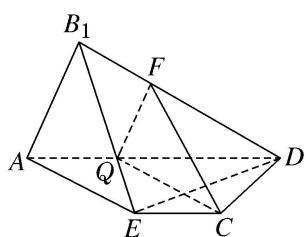

图⑤

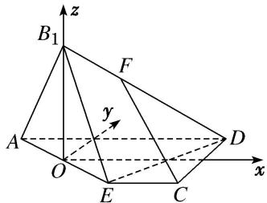

图⑥  
（2）设 $B_{1}$ 到平面AECD的距离为 $h$ ，则 $V_{B1 - AED} = \frac{1}{3}\cdot S_{\triangle AED}\cdot h$ ，又 $S_{\triangle AED} = 3$
所以 $V_{B1-AED}=h$ ，故要使三棱锥 $B_{1}-AED$ 的体积取到最大值，须且仅需 h 取到最大值.
如图⑥，取 AE 的中点 O，连接 $B_{1}O$ ，依题意得 $B_{1}O \perp AE$ ，则 $h \leq B_{1}O = \sqrt{2}$ .
因为平面 $B_{1}AE \cap$ 平面 AECD = AE, $B_{1}O \perp AE$ , $B_{1}O \subset$ 平面 $B_{1}AE$ ,
故当平面 $B_{1}AE \perp$ 平面 AECD 时， $B_{1}O \perp$ 平面 AECD， $h = B_{1}O$ .
即当且仅当平面 $B_{1}AE \perp$ 平面 AECD 时， $V_{B1-AED}$ 取得最大值，此时 $h = \sqrt{2}$ .

以 O 为坐标原点， $\overrightarrow{EC}$ ， $\overrightarrow{CD}$ 的方向分别为 x 轴，y 轴的正方向建立空间直角坐标系 O-xyz，则 $B_{1}(0,0,\sqrt{2})$ ， $D(2,1,0)$ ， $E(1,-1,0)$ ，所以 $\overrightarrow{EB_{1}}=(-1,1,\sqrt{2})$ ， $\overrightarrow{ED}=(1,2,0)$ ，
设 $\boldsymbol{n}=(x,y,z)$ 是平面 $B_{1}ED$ 的法向量，则 $\left\{\begin{aligned}&n\cdot\overrightarrow{EB_{1}}=0,\\ &n\cdot\overrightarrow{ED}=0,\end{aligned}\right.$
得 $\left\{\begin{aligned}-x+y+\sqrt{2}z&=0,\\ x+2y&=0,\end{aligned}\right.$ 令y=-1，得 $n=\left[\begin{aligned}2,&-1,\quad\frac{3}{\sqrt{2}}\end{aligned}\right]$
又平面 CDE 的一个法向量为 $m=(0,0,1)$ ,
所以 $\cos<m,\quad n>=\frac{m\cdot n}{|m|\cdot|n|}=\frac{\frac{3}{\sqrt{2}}}{\sqrt{4+1+\frac{9}{2}}}=\frac{3\sqrt{19}}{19}$ ,
因为 $B_{1}-DE-C$ 为钝角，所以其余弦值等于 $-\frac{3\sqrt{19}}{19}$ .

# 【对点训练】

1. 已知三棱锥 $M - ABC$ ， $MA = MB = MC = AC = 2\sqrt{2}$ ， $AB = BC = 2$ ， $O$ 为 $AC$ 的中点，点 $N$ 在边 $BC$ 上，且 $\overrightarrow{BN} = \frac{2}{3}\overrightarrow{BC}$ .  
（1）求证： $BO \perp$ 平面 AMC;  
（2）求二面角 N-AM-C 的正弦值.

1. 解析 （1）连接 $OM$ 。在 $\triangle ABC$ 中， $\because AB = BC = 2, AC = 2\sqrt{2}, \therefore \angle ABC = 90^\circ, BO = \sqrt{2}, OB \perp AC$ .
在 $\triangle MAC$ 中， $\because MA=MC=AC=2\sqrt{2}$ ，O为AC的中点， $\therefore OM\perp AC$ ，且 $OM=\sqrt{6}$ .
在 $\triangle MOB$ 中， $\because BO=\sqrt{2}$ ， $OM=\sqrt{6}$ ， $MB=2\sqrt{2}$ ， $\therefore BO^{2}+OM^{2}=MB^{2}$ ， $\therefore OB\perp OM$ .
∵ AC∩OM=O, AC⊂平面 AMC, OM⊂平面 AMC, ∴ OB⊥平面 AMC.  
（2）由（1）知 OB, OC, OM 两两垂直，以点 O 为坐标原点，分别以 OB, OC, OM 所在直线为 x 轴，y 轴，z 轴建立空间直角坐标系 O-xyz，如图.

$\because M A = M B = M C = A C = 2 \sqrt {2}, A B = B C = 2,$
$\therefore A (0, - \sqrt {2}, 0), B (\sqrt {2}, 0, 0), M (0, 0, \sqrt {6}), C (0, \sqrt {2}, 0). \because \overrightarrow {B N} = \frac {2}{3} \overrightarrow {B C}, \therefore N \left[ \frac {\sqrt {2}}{3}, \frac {2 \sqrt {2}}{3}, 0 \right],$
$\therefore \overrightarrow {A N} = \left[ \frac {\sqrt {2}}{3}, \frac {5 \sqrt {2}}{3}, 0 \right], \overrightarrow {A M} = (0, \sqrt {2}, \sqrt {6}), \overrightarrow {O B} = (\sqrt {2}, 0, 0).$
设平面 MAN 的法向量为 $\boldsymbol{n}=(x,y,z)$ ，则 $\left\{\begin{aligned}\overrightarrow{AN}\cdot\boldsymbol{n}&=\left(\frac{\sqrt{2}}{3},\frac{5\sqrt{2}}{3},0\right)\cdot(x,y,z)=\frac{\sqrt{2}}{3}x+\frac{5\sqrt{2}}{3}y=0,\\ \overrightarrow{AM}\cdot\boldsymbol{n}&=(0,\sqrt{2},\sqrt{6})\cdot(x,y,z)=\sqrt{2}y+\sqrt{6}z=0.\end{aligned}\right.$ 令 $y = \sqrt{3}$ ，则 $z = -1$ ， $x = -5\sqrt{3}$ ，得 $n = (-5\sqrt{3}, \sqrt{3}, -1)$ .
∵ BO⊥平面 AMC，∴ $\overrightarrow{OB}=(\sqrt{2},0,0)$ 为平面 AMC 的一个法向量.
$\therefore n = (-5\sqrt{3}, \sqrt{3}, -1)$ 与 $\overrightarrow{OB} = (\sqrt{2}, 0, 0)$ 所成角的余弦值 $\cos < n$ ， $\overrightarrow{OB} > = \frac{-5\sqrt{6}}{\sqrt{79} \times \sqrt{2}} = \frac{-5\sqrt{3}}{\sqrt{79}}$ .
∴所求二面角的正弦值为 $\sqrt{1-\left(\frac{-5\sqrt{3}}{\sqrt{79}}\right)^{2}}=\frac{2}{\sqrt{79}}=\frac{2\sqrt{79}}{79}$ .

2. 如图所示，在四面体 $ABCD$ 中， $AD \perp AB$ ，平面 $ABD \perp$ 平面 $ABC$ ， $AB = BC = \frac{\sqrt{2}}{2} AC$ ，且 $AD + BC = 4$ .  
（1）证明： $BC \perp$ 平面 ABD;  
（2）设 E 为棱 AC 的中点，当四面体 ABCD 的体积取得最大值时，求二面角 C-BD-E 的余弦值.

2. 解析 （1） 因为 $AD \perp AB$ , 平面 $ABD \perp$ 平面 $ABC$ , 平面 $ABD \cap$ 平面 $ABC = AB$ , $AD \subset$ 平面 $ABD$ , 所以 $AD \perp$ 平面 $ABC$ , 因为 $BC \subset$ 平面 $ABC$ , 所以 $AD \perp BC$ .
因为 $AB = BC = \frac{\sqrt{2}}{2} AC$ ，所以 $AB^{2} + BC^{2} = AC^{2}$ ，所以 $AB\bot BC$
因为 $AD \cap AB = A$ ，所以 $BC \perp$ 平面 ABD.

  
（2）设 $AD=x(0<x<4)$ ，则 AB=BC=4-x，四面体 ABCD 的体积
$V = f (x) = \frac {1}{3} x \times \frac {1}{2} (4 - x) ^ {2} = \frac {1}{6} \left(x ^ {3} - 8 x ^ {2} + 1 6 x\right) (0 <   x <   4).$
$f ^ {'} (x) = \frac {1}{6} \left(3 x ^ {2} - 1 6 x + 1 6\right) = \frac {1}{6} (x - 4) (3 x - 4),$
当 $0 < x < \frac{4}{3}$ 时， $f'(x) > 0$ ，V = f(x) 单调递增；当 $\frac{4}{3} < x < 4$ 时， $f'(x) < 0$ ，V = f(x) 单调递减.
故当 $AD=x=\frac{4}{3}$ 时，四面体 ABCD 的体积取得最大值.

以 B 为坐标原点，建立空间直角坐标系 B-xyz，
则 $B(0, 0, 0), A\left[0, \frac{8}{3}, 0\right], C\left[\frac{8}{3}, 0, 0\right], D\left[0, \frac{8}{3}, \frac{4}{3}\right], E\left[\frac{4}{3}, \frac{4}{3}, 0\right]$ .
设平面 BCD 的法向量为 $\boldsymbol{n}=(x,y,z)$ ，则 $\left\{\begin{aligned}\boldsymbol{n}\cdot\overrightarrow{BC}&=0,\\ \boldsymbol{n}\cdot\overrightarrow{BD}&=0,\end{aligned}\right.$ ，即 $\left\{\begin{aligned}\frac{8}{3}x&=0,\\ \frac{8}{3}y+\frac{4}{3}z&=0,\end{aligned}\right.$
令 z = -2，得 $n = (0, 1, -2)$ ,
同理可得平面 BDE 的一个法向量为 $m=(1,-1,2)$ ,
则 $\cos < m, n > = \frac{m \cdot n}{|m||n|} = \frac{-5}{\sqrt{5} \times \sqrt{6}} = -\frac{\sqrt{30}}{6}$ .
由图可知，二面角 C-BD-E 为锐角，故二面角 C-BD-E 的余弦值为 $\frac{\sqrt{30}}{6}$ .

3. (2021·全国乙)如图, 四棱锥 $P - ABCD$ 的底面是矩形, $PD \perp$ 底面 $ABCD$ , $PD = DC = 1$ , $M$ 为 $BC$ 的中点, 且 $PB \perp AM$ .  
（1）求 $BC$ ;   
（2）求二面角 A-PM-B 的正弦值.

3. 解析 （1）连结 $BD$ , 因为 $PD \perp$ 底面 $ABCD$ , 且 $AM \subset$ 平面 $ABCD$ ,
则 $AM \perp PD$ ，又 $AM \perp PB$ ， $PB \cap PD = P$ ，PB， $PD \subset$ 平面 PBD，
所以 $AM \perp$ 平面 PBD，又 $BD \subset$ 平面 PBD，则 $AM \perp BD$ ，
所以 $\angle ABD + \angle DAM = 90^{\circ}$ ，又 $\angle DAM + \angle MAB = 90^{\circ}$ ，
则有 $\angle ADB = \angle MAB$ ，所以 Rt△DAB ∼ Rt△ABM，
则 $\frac{AD}{AB}=\frac{BA}{BM}$ ，所以 $\frac{1}{2}BC^{2}=1$ ，解得 $BC=\sqrt{2}$ .

  
（2）因为 DA, DC, DP 两两垂直，故以点 D 位坐标原点建立空间直角坐标系如图所示，
则 $A(\sqrt{2}, 0, 0)$ ， $B(\sqrt{2}, 1, 0)$ ， $M(\frac{\sqrt{2}}{2}, 1, 0)$ ， $P(0, 0, 1)$ .
所以 $\overrightarrow{AP} = (-\sqrt{2}, 0, 1)$ , $\overrightarrow{AM} = (-\frac{\sqrt{2}}{2}, 1, 0)$ , $\overrightarrow{BM} = (-\frac{\sqrt{2}}{2}, 0, 0)$ . $\overrightarrow{BP} = (-\sqrt{2}, -1, 1)$
设平面 AMP 的法向量为 $\boldsymbol{n}=(x,y,z)$ ，则有 $\left\{\begin{aligned}\boldsymbol{n}\cdot\overrightarrow{AP}&=0,\\ \boldsymbol{n}\cdot\overrightarrow{AM}&=0,\end{aligned}\right.$ ，即 $\left\{\begin{aligned}-\sqrt{2}x+z&=0,\\ -\frac{\sqrt{2}}{2}x+y&=0.\end{aligned}\right.$
令 $x=\sqrt{2}$ ，则 y=1，z=2，故 $n=(\sqrt{2},1,2)$ ，
设平面 BMP 的法向量为 $\boldsymbol{m}=(p,q,r)$ ，则有 $\left\{\begin{aligned}\boldsymbol{m}\cdot\overrightarrow{BM}&=0,\\ \boldsymbol{m}\cdot\overrightarrow{BP}&=0,\end{aligned}\right.$ ，即 $\left\{\begin{aligned}-\frac{\sqrt{2}}{2}p&=0,\\ -\sqrt{2}p-q+r&=0.\end{aligned}\right.$
令 q=1，则 r=1，故 $m=(0,1,1)$ ,
所以 $\cos<n,\quad m>=\frac{n\cdot m}{|n||m|}=\frac{3}{\sqrt{7}\times\sqrt{2}}=\frac{3\sqrt{14}}{14}.$
设二面角 A-PM-B 的平面角为 $\alpha$ ，则 $\sin\alpha=\frac{\sqrt{70}}{14}$
所以二面角 A-PM-B 的正弦值为 $\frac{\sqrt{70}}{14}$ .

4. 如图，在四棱锥 $P - ABCD$ 中，底面 $ABCD$ 为菱形， $\angle BAD = 60^{\circ}$ ， $\angle APD = 90^{\circ}$ ，且 $AD = PB$ .  
（1）求证：平面 PAD⊥平面 ABCD;  
（2）若 $AD \perp PB$ ，求二面角 $D - PB - C$ 的余弦值.

4. 解析 （1）如图, 取 ${AD}$ 的中点 $O$ ,连接 ${OP},{OB},{BD}$ ,
因为底面 ABCD 为菱形， $\angle BAD=60^{\circ}$ ，所以 AD=AB=BD.
因为 O 为 AD 的中点，所以 OB⊥AD.
在 $\triangle APD$ 中， $\angle APD=90^{\circ}$ ，O为AD的中点，所以 $PO=\frac{1}{2}AD=AO$ .
设 AD=PB=2a，则 $OB=\sqrt{3}a,\quad PO=OA=a,$
因为 $PO^{2}+OB^{2}=a^{2}+3a^{2}=4a^{2}=PB^{2}$ ，所以 $OP\perp OB$ .
因为 $OP \cap AD = O$ ， $OP \subset$ 平面 $PAD$ ， $AD \subset$ 平面 $PAD$ ，所以 $OB \perp$ 平面 $PAD$ .
因为 $OB \subset$ 平面 ABCD，所以平面 PAD⊥平面 ABCD.

  
（2）因为 $AD \perp PB$ ， $AD \perp OB$ ， $OB \cap PB = B$ ， $PB \subset$ 平面 POB， $OB \subset$ 平面 POB，
所以 $AD \perp$ 平面 $POB$ 。所以 $PO \perp AD$ 。由（1）得 $PO \perp OB$ ， $AD \perp OB$ ，
所以 OA, OB, OP 所在的直线两两互相垂直.

以 O 为坐标原点，OA，OB，OP 所在直线分别为 x 轴、y 轴、z 轴建立如图所示的空间直角坐标系.

设 AD=2，则 $A(1,0,0)$ ， $D(-1,0,0)$ ， $B(0,\sqrt{3},0)$ ， $P(0,0,1)$ ，
所以 $\vec{P}\vec{D} = (-1,0, - 1),\vec{P}\vec{B} = (0,\sqrt{3}, - 1),\vec{B}\vec{C} = \vec{A}\vec{D} = (-2,0,0),$
设平面 PBD 的法向量为 $\boldsymbol{n}=(x_{1},y_{1},z_{1})$ ，则 $\left\{\begin{aligned}\boldsymbol{n}\cdot\overrightarrow{PD}&=-x_{1}-z_{1}=0,\\ \boldsymbol{n}\cdot\overrightarrow{PB}&=\sqrt{3}y_{1}-z_{1}=0,\end{aligned}\right.$
令 $y_{1}=1$ ，则 $x_{1}=-\sqrt{3}$ ， $z_{1}=\sqrt{3}$ ，所以 $n=(-\sqrt{3},1,\sqrt{3})$ .
设平面 PBC 的法向量为 $\boldsymbol{m}=(x_{2},y_{2},z_{2})$ ，则 $\left\{\begin{aligned}\boldsymbol{m}\cdot\vec{B}C&=-2x_{2}=0,\\ \boldsymbol{m}\cdot\vec{P}B&=\sqrt{3}y_{2}-z_{2}=0,\end{aligned}\right.$
令 $y_{2}=1$ ，则 $x_{2}=0,\quad z_{2}=\sqrt{3}$ ，所以 $m=(0,1,\sqrt{3})$ .
设二面角 D-PB-C 的大小为 $\theta$ ，由于 $\theta$ 为锐角，所以 $\cos\theta=|\cos<m,\quad n>|=\frac{4}{2\times\sqrt{7}}=\frac{2\sqrt{7}}{7}$ .
所以二面角 D-PB-C 的余弦值为 $\frac{2\sqrt{7}}{7}$ .

5. 如图, 在四棱锥 $P - ABCD$ 中, $PA \perp$ 底面 $ABCD$ , $AD \perp AB$ , $AB // DC$ , $AD = DC = AP = 2$ , $AB = 1$ , 点 $E$ 为棱 $PC$ 的中点.  
（1）求证： $BE \perp DC;$  
（2）若 F 为棱 PC 上一点，满足 $BF \perp AC$ ，求平面 FAB 与平面 ABP 夹角的余弦值.

5. 解析 （1）依题意, 以点 $A$ 为坐标原点建立空间直角坐标系(如图),
可得 $A(0, 0, 0)$ ， $B(1, 0, 0)$ ， $C(2, 2, 0)$ ， $D(0, 2, 0)$ ， $P(0, 0, 2)$ .
由 E 为棱 PC 的中点，得 $E(1, 1, 1)$ ，所以 $\overrightarrow{BE} = (0, 1, 1)$ ， $\overrightarrow{DC} = (2, 0, 0)$ ，
故 $\overrightarrow{BE}\cdot\overrightarrow{DC}=0$ ，所以 $BE\perp DC$ .

  
（2） $\overrightarrow{BC}=(1,2,0),\overrightarrow{CP}=(-2,-2,2),\overrightarrow{AC}=(2,2,0),\overrightarrow{AB}=(1,0,0).$
由点 F 在棱 PC 上，设 $\overrightarrow{CF} = \lambda \overrightarrow{CP} (0 \leqslant \lambda \leqslant 1)$ ,
故 $\overrightarrow{BF}=\overrightarrow{BC}+\overrightarrow{CF}=\overrightarrow{BC}+\lambda\overrightarrow{CP}=(1-2\lambda,\ 2-2\lambda,\ 2\lambda)$ . 由 $BF\perp AC$ ，得 $\overrightarrow{BF}\cdot\overrightarrow{AC}=0$ ,
因此 $2(1-2\lambda)+2(2-2\lambda)=0$ ，解得 $\lambda=\frac{3}{4}$ ，即 $\overrightarrow{BF}=\left(-\frac{1}{2},\frac{1}{2},\frac{3}{2}\right)$ .
设 $n_1 = (x, y, z)$ 为平面 $FAB$ 的法向量，则 $\left\{ \begin{array}{l} n_1 \cdot \overrightarrow{AB} = 0, \\ n_1 \cdot \overrightarrow{BF} = 0 \end{array} \right.$ 即 $\left\{ \begin{array}{l} x = 0, \\ -\frac{1}{2} x + \frac{1}{2} y + \frac{3}{2} z = 0. \end{array} \right.$
不妨令 z=1，可得 $n_{1}=(0,-3,1)$ 为平面 FAB 的一个法向量.

易知向量 $n_{2}=(0,1,0)$ 为平面 ABP 的一个法向量，
则 $\cos < n_1, n_2 > = \frac{n_1 \cdot n_2}{|n_1| \cdot |n_2|} = \frac{-3}{\sqrt{10} \times 1} = -\frac{3\sqrt{10}}{10}$ .
所以平面 FAB 与平面 ABP 夹角的余弦值为 $\frac{3\sqrt{10}}{10}$ .

6. 如图，已知四棱锥 $P - ABCD$ ，底面 $ABCD$ 是直角梯形， $AD \parallel BC$ ， $\angle BCD = 90^{\circ}$ ， $PA \perp$ 底面 $ABCD$ ， $\triangle ABM$ 是边长为2的等边三角形， $PA = DM = 2\sqrt{3}$ .  
（1）求证：平面 $PAM \perp$ 平面 PDM;  
（2）若 E 为 PC 的中点，求二面角 P-MD-E 的余弦值.

6. 解析 （1）∵△ABM 是边长为 2 的等边三角形，底面 ABCD 是直角梯形，∴CD= $\sqrt{3}$ ,
又 $DM=2\sqrt{3}$ ，∴CM=3，∴AD=3+1=4，∴ $AD^{2}=DM^{2}+AM^{2}$ ，∴ $DM\perp AM$ .
又 $PA \perp$ 底面 ABCD，∴ $DM \perp PA$ ，又 $AM \cap PA = A$ ，∴ $DM \perp$ 平面 PAM，
∵DM⊂平面PDM，∴平面PAM⊥平面PDM.  
（2）以 D 为坐标原点，DC 所在直线为 x 轴，DA 所在直线为 y 轴，过 D 且与 PA 平行的直线为 z 轴，建立空间直角坐标系 Dxyz，

则 $D(0, 0, 0)$ ， $C(\sqrt{3}, 0, 0)$ ， $M(\sqrt{3}, 3, 0)$ ， $P(0, 4, 2\sqrt{3})$ ，
$\vec {D M} = (\sqrt {3}, 3, 0), \vec {D P} = (0, 4, 2 \sqrt {3}),$
设平面 PMD 的法向量为 $\boldsymbol{n}_{1}=(x_{1},y_{1},z_{1})$ ，则 $\left\{\begin{aligned}\sqrt{3}x_{1}+3y_{1}&=0,\\4y_{1}+2\sqrt{3}z_{1}&=0,\end{aligned}\right.$ 取 $x_{1}=3,\therefore n_{1}=(3,-\sqrt{3},2)$ .
∵E为PC的中点，则 $E\left(\frac{\sqrt{3}}{2},2,\sqrt{3}\right)$ ， $\overrightarrow{DE}=\left(\frac{\sqrt{3}}{2},2,\sqrt{3}\right)$
设平面 MDE 的法向量为 $\boldsymbol{n}_{2}=(x_{2},y_{2},z_{2})$ ，则 $\left\{\begin{aligned}\sqrt{3}x_{2}+3y_{2}&=0,\\ \frac{\sqrt{3}}{2}x_{2}+2y_{2}+\sqrt{3}z_{2}&=0,\end{aligned}\right.$ 取 $x_{2}=3,\therefore n_{2}=\left[\begin{aligned}3,&-\sqrt{3},\frac{1}{2}\end{aligned}\right]$ .
设二面角 P-MD-E 的平面角为 $\theta$ ，由 $\cos\theta=\frac{n_{1}\cdot n_{2}}{|n_{1}||n_{2}|}=\frac{13}{14}$ ,
∴二面角 P-MD-E 的余弦值为 $\frac{13}{14}$ .

7. 已知矩形 $ABCD$ 中， $AB = 2$ ， $AD = 3$ ，在 $AD$ 上取一点 $E$ 满足 $2AE = ED$ 。现将 $\triangle CDE$ 沿 $CE$ 折起使点 $D$ 移动至 $P$ 点处，使得 $PA = PB$ 。  
（1）求证：平面 $PCE \perp$ 平面 ABCE;  
（2）求二面角 B-PA-E 的余弦值.

7. 解析 （1）依题意得: $PE = PC = 2$ , 分别取线段 $AB$ , $CE$ 的中点 $O$ , $M$ , 连接 $\triangle POM$ 的三边(如图).

则 $PM \perp CE$ ，由 PA = PB，得 $PO \perp AB$ ，①
又 OM 为梯形 ABCE 的中位线，∴ $OM \parallel BC$ ，由 $BC \perp AB$ ，得 $OM \perp AB$ ，②
又 $PO \cap OM = O$ ，从而 $AB \perp$ 平面 POM，则 $AB \perp PM$ .
在平面 ABCE 中，AB 与 CE 相交．∴ PM⊥平面 ABCE，故平面 PCE⊥平面 ABCE.  
（2）过点 O 作 PM 平行线为 z 轴，分别以 OA，OM 为 x，y 轴建立空间直角坐标系.
则 $A(1, 0, 0)$ ， $B(-1, 0, 0)$ ， $E(1, 1, 0)$ ， $P(0, 2, \sqrt{2})$ ，
$\therefore \overrightarrow {P A} = (1, - 2, - \sqrt {2}), \overrightarrow {B A} = (2, 0, 0), \overrightarrow {A E} = (0, 1, 0),$
设 $\boldsymbol{n}=(x,y,z)$ 为平面 PAB 的法向量，则 $\left\{\begin{aligned}\overrightarrow{PA}\cdot\boldsymbol{n}&=0,\\ \overrightarrow{BA}\cdot\boldsymbol{n}&=0,\end{aligned}\right.$ 即 $\left\{\begin{aligned}x-2y-\sqrt{2}z&=0,\\ 2x&=0,\end{aligned}\right.$ 令 y=1，得 $\boldsymbol{n}=(0,1,-\sqrt{2})$ ，同理：平面 PAE 的法向量 $\boldsymbol{m}=(\sqrt{2},0,1)$ ，
∴ $\cos<m,\quad n>=\frac{m\cdot n}{|m||n|}=-\frac{\sqrt{2}}{3}$ ，根据图形知二面角 B-PA-E 为钝角，
∴二面角 B-PA-E 的余弦值为 $-\frac{\sqrt{2}}{3}$ .

8. 如图, 已知 $\triangle ABC$ 为等边三角形, $\triangle ABD$ 为等腰直角三角形, $AB \perp BD$ . 平面 $ABC \perp$ 平面 $ABD$ , 点 $E$ 与点 $D$ 在平面 $ABC$ 的同侧, 且 $CE \parallel BD$ , $BD = 2CE$ . 点 $F$ 为 $AD$ 的中点, 连接 $EF$ .  
（1）求证： $EF \parallel$ 平面 ABC;  
（2）求二面角 C-AE-D 的余弦值.

8. 解析 （1）取 $AB$ 的中点为 $O$ , 连接 $OC, OF$ , 如图.

∵O，F分别为AB，AD的中点，∴OF∥BD且BD=2OF.
又 $CE \parallel BD$ 且 BD=2CE，∴ $CE \parallel OF$ 且 CE=OF，
∴OF $\parallel$ EC，则四边形 OCEF 为平行四边形，∴EF // OC.
又 OC⊂平面 ABC, EF∉平面 ABC, ∴EF∥平面 ABC.  
（2） $\because \triangle ABC$ 为等边三角形，O 为 AB 的中点， $\therefore OC \perp AB$ .
∵平面 $ABC \perp$ 平面 ABD，平面 $ABC \cap$ 平面 ABD = AB， $BD \perp AB$ ， $BD \subset$ 平面 ABD，
∴BD⊥平面ABC．又OF∥BD，∴OF⊥平面ABC.

以 O 为坐标原点，分别以 OA, OC, OF 所在的直线为 x 轴，y 轴，z 轴，

建立如图所示的空间直角坐标系．不妨令正三角形 ABC 的边长为 2，
则 $O(0, 0, 0)$ ， $A(1, 0, 0)$ ， $C(0, \sqrt{3}, 0)$ ， $E(0, \sqrt{3}, 1)$ ， $D(-1, 0, 2)$ ，
$\therefore \overrightarrow{AC} = (-1, \sqrt{3}, 0), \overrightarrow{AE} = (-1, \sqrt{3}, 1), \overrightarrow{AD} = (-2, 0, 2).$
设平面 AEC 的法向量为 $\boldsymbol{m}=(x_{1},y_{1},z_{1})$ ，则 $\left\{\begin{aligned}\overrightarrow{AC}\cdot\boldsymbol{m}&=-x_{1}+\sqrt{3}y_{1}=0,\\ \overrightarrow{AE}\cdot\boldsymbol{m}&=-x_{1}+\sqrt{3}y_{1}+z_{1}=0.\end{aligned}\right.$
不妨令 $y_{1}=\sqrt{3}$ ，则 $m=(3,\sqrt{3},0)$ .
设平面 AED 的法向量为 $\boldsymbol{n}=(x_{2},y_{2},z_{2})$ ，则 $\left\{\begin{aligned}\overrightarrow{AD}\cdot\boldsymbol{n}&=-2x_{2}+2z_{2}=0,\\ \overrightarrow{AE}\cdot\boldsymbol{n}&=-x_{2}+\sqrt{3}y_{2}+z_{2}=0.\end{aligned}\right.$
令 $z_{2}=1$ ，得 $n=(1,0,1)$ .
∴ $\cos<m,\quad n>=\frac{3}{2\sqrt{3}\times\sqrt{2}}=\frac{\sqrt{6}}{4}$ . 由图易知二面角 C-AE-D 为钝角，
∴二面角 C-AE-D 的余弦值为 $-\frac{\sqrt{6}}{4}$ .

9. 如图, 在四棱锥 $P-ABCD$ 中, 底面 $ABCD$ 为直角梯形, $AD \parallel BC$ , $\angle ADC = 90^\circ$ , 平面 $PAD \perp$ 底面 $ABCD$ ,

Q 为 AD 的中点，M 是棱 PC 上的点，PA = PD = 2， $BC = \frac{1}{2}AD = 1$ ， $CD = \sqrt{3}$ .  
（1）求证：平面 $PBC \perp$ 平面 PQB;  
（2）当 $PM$ 的长为何值时，平面 $QMB$ 与平面 $PDC$ 所成的锐二面角的大小为 $60^{\circ}$ ?

9. 解析 （1） $\because AD \parallel BC, Q$ 为 $AD$ 的中点, $BC = \frac{1}{2} AD$ , $\therefore BC \parallel QD, BC = QD$ ,
∴四边形 BCDQ 为平行四边形，∴BQ//CD. ∵∠ADC=90°，∴BC⊥BQ.
$\because P A = P D, A Q = Q D, \therefore P Q \perp A D.$
又∵平面 PAD⊥平面 ABCD，平面 PAD∩平面 ABCD=AD，
∴PQ⊥平面ABCD，∴PQ⊥BC．又∵PQ∩BQ=Q，∴BC⊥平面PQB.
∵BC⊂平面PBC，∴平面PBC⊥平面PQB.  
（2）由（1）可知 $PQ \perp$ 平面ABCD．如图，以 $Q$ 为原点，分别以 $QA$ ， $QB$ ， $QP$ 所在直线为 $x$ 轴、 $y$ 轴、 $z$ 轴，建立空间直角坐标系，则 $Q(0,0,0)$ ， $D(-1,0,0)$ ， $P(0,0,\sqrt{3})$ ， $B(0,\sqrt{3},0)$ ， $C(-1,\sqrt{3},0)$

$\therefore \overrightarrow {Q B} = (0, \sqrt {3}, 0), \overrightarrow {D C} = (0, \sqrt {3}, 0), \overrightarrow {D P} = (1, 0, \sqrt {3}), \overrightarrow {P C} = (- 1, \sqrt {3}, - \sqrt {3}).$
设 $\overrightarrow{PM}=\lambda\overrightarrow{PC}$ ，则 $\overrightarrow{PM}=(-\lambda,\sqrt{3}\lambda,-\sqrt{3}\lambda)$ ，且 $0\leq\lambda\leq1$ ，得 $M(-\lambda,\sqrt{3}\lambda,\sqrt{3}-\sqrt{3}\lambda)$
$\therefore \overrightarrow {Q M} = (- \lambda , \sqrt {3} \lambda , \sqrt {3} (1 - \lambda)).$
设平面 MBQ 的法向量为 $\boldsymbol{m}=(x,y,z)$ ，则 $\left\{\begin{aligned}\overrightarrow{QM}\cdot\boldsymbol{m}&=0,\\ \overrightarrow{QB}\cdot\boldsymbol{m}&=0,\end{aligned}\right.$ 即 $\left\{\begin{aligned}-\lambda x+\sqrt{3}\lambda y+\sqrt{3}(1-\lambda)z&=0,\\ \sqrt{3}y&=0.\end{aligned}\right.$
令 $x=\sqrt{3}$ ，则 y=0， $z=\frac{\lambda}{1-\lambda}$
∴平面 MBQ 的一个法向量为 $m=\left(\sqrt{3},0,\frac{\lambda}{1-\lambda}\right)$ .
设平面 PDC 的法向量为 $\boldsymbol{n}=(x', y', z')$ ，则 $\left\{\begin{aligned}\overrightarrow{DC}\cdot\boldsymbol{n}&=0,\\ \overrightarrow{DP}\cdot\boldsymbol{n}&=0,\end{aligned}\right.$ 即 $\left\{\begin{aligned}\sqrt{3}y'=0,\\ x'+\sqrt{3}z'=0.\end{aligned}\right.$
令 $x'=3$ ，则 $y'=0,\quad z'=-\sqrt{3}$ ，∴平面 PDC 的一个法向量为 $n=(3,0,-\sqrt{3})$ .
∴平面 QMB 与平面 PDC 所成的锐二面角的大小为 $60^{\circ}$ ,
$\therefore \cos 6 0 ^ {\circ} = \frac {| \boldsymbol {n} \cdot \boldsymbol {m} |}{| \boldsymbol {n} | | \boldsymbol {m} |} = \frac {\left| 3 \sqrt {3} - \sqrt {3} \cdot \frac {\lambda}{1 - \lambda} \right|}{\sqrt {1 2} \cdot \sqrt {3 + \left(\frac {\lambda}{1 - \lambda}\right) 2}} = \frac {1}{2}, \quad \therefore \lambda = \frac {1}{2}. \quad \therefore P M = \frac {1}{2} P C = \frac {\sqrt {7}}{2}.$

10. 请从下面三个条件中任选一个，补充在下面的横线上，并作答.

① $AB \perp BC$ ，②FC与平面ABCD所成的角为 $\frac{\pi}{6}$ ，③ $\angle ABC=\frac{\pi}{3}$ .
如图，在四棱锥 P-ABCD 中，底面 ABCD 是菱形， $PA \perp$ 平面 ABCD，且 PA=AB=2，PD 的中点为 F.  
（1）在线面 $AB$ 上是否存在一点 $G$ , 使得 $AF \parallel$ 平面 $PCG$ ? 若存在, 指出 $G$ 在 $AB$ 上的位置并给以证明; 若不存在, 请说明理由.  
（2）若\_\_\_\_，求二面角 F-AC-D 的余弦值.

10. 解析 （1）在线段 $AB$ 上存在点 $G$ , 使得 $AF \parallel$ 平面 $PCG$ , 且 $G$ 为 $AB$ 的中点.
证明如下：设 PC 的中点为 H，连接 FH，GH，如图，易证四边形 AGHF 为平行四边形，则 AF // GH.

又 $GH \subset$ 平面 PCG， $AF \nsubseteq$ 平面 PGC，所以 $AF \parallel$ 平面 PGC.  
（2）选择①.
因为 $PA \perp$ 平面 ABCD，所以 $PA \perp AB$ ， $PA \perp AD$ 。由题意可知，AB，AD，AP 两两垂直，
故以 A 为坐标原点， $\overrightarrow{AB}$ ， $\overrightarrow{AD}$ ， $\overrightarrow{AP}$ 的方向分别为 x, y, z 轴的正方向建立如图所示的空间直角坐标系.

因为 PA=AB=2，所以 $A(0,0,0)$ ， $C(2,2,0)$ ， $D(0,2,0)$ ， $P(0,0,2)$ ， $F(0,1,1)$ ，
所以 $\overrightarrow{AF}=(0,1,1)$ ， $\overrightarrow{CF}=(-2,-1,1)$ .
设平面 FAC 的法向量为 $\boldsymbol{u}=(x,y,z)$ ，则 $\left\{\begin{aligned}\boldsymbol{u}\cdot\overrightarrow{AF}&=0,\\ \boldsymbol{u}\cdot\overrightarrow{CF}&=0,\end{aligned}\right.$ 即 $\left\{\begin{aligned}y+z&=0,\\ -2x-y+z&=0.\end{aligned}\right.$
令 y=1，则 x=-1，z=-1，则 $u=(-1,1,-1)$ .

易知平面 ACD 的一个法向量为 $v=(0,0,2)$ ,
设二面角 F-AC-D 的平面角为 $\theta$ ，则 $\cos\theta=\frac{|u\cdot v|}{|u||v|}=\frac{\sqrt{3}}{3}$ ，即二面角 F-AC-D 的余弦值为 $\frac{\sqrt{3}}{3}$ .

选择②.
设 BC 中点 E，连接 AE，取 AD 的中点 M，连接 FM，CM，则 $FM \parallel PA$ ，且 FM = 1。
因为 $PA \perp$ 平面 ABCD，所以 $FM \perp$ 平面 ABCD，FC 与平面 ABCD 所成的角为 $\angle FCM$ ，
故 $\angle FCM = \frac{\pi}{6}$ . 在直角三角形 $FCM$ 中, $CM = \sqrt{3}$ . 又因为 $CM = AE$ , 所以 $AE^2 + BE^2 = AB^2$ ,
所以 $BC \perp AE$ ，所以 AE，AD，AP 两两垂直.
故以 $A$ 为坐标原点， $\overrightarrow{AE}$ ， $\overrightarrow{AD}$ ， $\overrightarrow{AP}$ 的方向分别为 $x, y, z$ 轴的正方向建立如图所示的空间直角坐标系.

因为 PA=AB=2，所以 $A(0,0,0)$ ， $C(\sqrt{3},1,0)$ ， $D(0,2,0)$ ， $P(0,0,2)$ ， $F(0,1,1)$ ，
所以 $\overrightarrow{AF}=(0,1,1)$ ， $\overrightarrow{CF}=(-\sqrt{3},0,1)$ .
设平面 FAC 的法向量为 $\boldsymbol{u}=(x,y,z)$ ，则 $\left\{\begin{aligned}\boldsymbol{u}\cdot\overrightarrow{AF}&=0,\\ \boldsymbol{u}\cdot\overrightarrow{CF}&=0,\end{aligned}\right.$ 即 $\left\{\begin{aligned}y+z&=0,\\ -\sqrt{3}x+z&=0.\end{aligned}\right.$
令 $x=\sqrt{3}$ ，则 y=-3，z=3，则 $u=(\sqrt{3}, -3, 3)$ .

易知平面 ACD 的一个法向量为 $\nu=(0,0,2)$ .
设二面角 $F - AC - D$ 的平面角为 $\theta$ ，则 $\cos \theta = \frac{|\boldsymbol{u} \cdot \boldsymbol{v}|}{|\boldsymbol{u}||\boldsymbol{v}|} = \frac{\sqrt{21}}{7}$ ，即二面角 $F - AC - D$ 的余弦值为 $\frac{\sqrt{21}}{7}$ .

选择③.
因为 $PA \perp$ 平面 ABCD，所以 $PA \perp BC$ 。取 BC 中点 E，连接 AE。
因为底面 ABCD 是菱形， $\angle ABC=\frac{\pi}{3}$ ，所以 $\triangle ABC$ 是正三角形.
又 E 是 BC 的中点，所以 $BC \perp AE$ ，所以 AE，AD，AP 两两垂直.
故以 A 为坐标原点， $\overrightarrow{AE}$ ， $\overrightarrow{AD}$ ， $\overrightarrow{AP}$ 的方向分别为 x, y, z 轴的正方向建立如图所示的空间直角坐标系.

因为 PA=AB=2，所以 $A(0,0,0)$ ， $C(\sqrt{3},1,0)$ ， $D(0,2,0)$ ， $P(0,0,2)$ ， $F(0,1,1)$ ，
所以 $\overrightarrow{AF}=(0,1,1)$ ， $\overrightarrow{CF}=(-\sqrt{3},0,1)$ .
设平面 FAC 的法向量为 $\boldsymbol{u}=(x,y,z)$ ，则 $\left\{\begin{aligned}\boldsymbol{u}\cdot\overrightarrow{AF}=0,\\ \boldsymbol{u}\cdot\overrightarrow{CF}=0,\end{aligned}\right.$ 即 $\left\{\begin{aligned}y+z=0,\\ -\sqrt{3}x+z=0.\end{aligned}\right.$
令 $x=\sqrt{3}$ ，则 y=-3，z=3，则 $u=(\sqrt{3}, -3, 3)$ .

易知平面 ACD 的一个法向量为 $\nu=(0,0,2)$ ,
设二面角 F-AC-D 的平面角为 $\theta$ ，则 $\cos\theta=\frac{|u\cdot v|}{|u||v|}=\frac{\sqrt{21}}{7}$ ，即二面角 F-AC-D 的余弦值为 $\frac{\sqrt{21}}{7}$ .

# 考点三 不规则几何体模型

[例 1] (2018·全国III)如图, 边长为 2 的正方形 ABCD 所在的平面与半圆弧 $\widehat{CD}$ 所在平面垂直, M 是 $\widehat{CD}$ 上异于 C, D 的点.  
（1）证明：平面 $AMD \perp$ 平面 BMC;  
（2）当三棱锥 M-ABC 体积最大时，求面 MAB 与面 MCD 所成二面角的正弦值.

解析 （1）由题设知，平面 $CMD \perp$ 平面 ABCD，交线为 CD.
因为 $BC \perp CD$ ， $BC \subset$ 平面 ABCD，所以 $BC \perp$ 平面 CMD，故 $BC \perp DM$ .
因为 M 为 $\widehat{CD}$ 上异于 C, D 的点，且 DC 为直径，所以 $DM \perp CM$ .
又 $BC \cap CM = C$ ，所以 $DM \perp$ 平面 BMC。而 $DM \subset$ 平面 AMD，故平面 $AMD \perp$ 平面 BMC。  
（2）以 D 为坐标原点， $\overrightarrow{DA}$ 的方向为 x 轴正方向， $\overrightarrow{DC}$ 的方向为 y 轴正方向，建立如图所示的空间直角坐标系 Dxyz.

当三棱锥 M-ABC 体积最大时，M 为 $\widehat{CD}$ 的中点.
由题设得 $D(0, 0, 0)$ ， $A(2, 0, 0)$ ， $B(2, 2, 0)$ ， $C(0, 2, 0)$ ， $M(0, 1, 1)$ ，
$\overrightarrow {A M} = (- 2, 1, 1), \overrightarrow {A B} = (0, 2, 0), \overrightarrow {D A} = (2, 0, 0).$
设 $\boldsymbol{n}=(x,y,z)$ 是平面 MAB 的法向量，则 $\left\{\begin{aligned}\boldsymbol{n}\cdot\overrightarrow{AM}&=0,\\ \boldsymbol{n}\cdot\overrightarrow{AB}&=0,\end{aligned}\right.$ 即 $\left\{\begin{aligned}-2x+y+z&=0,\\ 2y&=0.\end{aligned}\right.$ 可取 $\boldsymbol{n}=(1,0,2)$ .$\overrightarrow{DA}$ 是平面 $MCD$ 的一个法向量，因此， $\cos < n$ ， $\overrightarrow{DA} > = \frac{n\cdot\overrightarrow{DA}}{|n||\overrightarrow{DA}|} = \frac{\sqrt{5}}{5},\sin < n,\overrightarrow{DA} > = \frac{2\sqrt{5}}{5},$ 所以面 MAB 与面 MCD 所成二面角的正弦值是 $\frac{2\sqrt{5}}{5}$ .

[例 2] 如图，四边形 ABCD 是菱形， $EA \perp$ 平面 ABCD， $EF \parallel AC$ ， $CF \parallel$ 平面 BDE，G 是 AB 的中点.  
（1）求证： $EG \parallel$ 平面 BCF;  
（2）若 $AE = AB$ ， $\angle BAD = 60^{\circ}$ ，求二面角 $A - BE - D$ 的余弦值.

解析 （1） 设 $AC \cap BD = O$ ，连接 OE，OF，
∵CF∥平面BDE， $CF\subset$ 平面AEFC，平面 $AEFC\cap$ 平面BDE=OE，∴OE∥CF，
又 $EF \parallel AC$ ，∴四边形 EOCF 是平行四边形，∴EF = OC.
∵四边形 ABCD 是菱形，∴OA=OC，∴EF=OA=OC.
又 $EF \parallel AC$ ，∴ 四边形 $EFOA$ 是平行四边形，
∴OF//EA，∵EA⊥平面ABCD，∴OF⊥平面ABCD.
设 OA=a, OB=b, AE=c,

以 O 为坐标原点，OA，OB，OF 所在直线分别为 x 轴、y 轴、z 轴，建立空间直角坐标系，则 $E(a, 0, c)$ ， $G\left(\frac{a}{2}, \frac{b}{2}, 0\right)$ ， $B(0, b, 0)$ ， $C(-a, 0, 0)$ ， $F(0, 0, c)$ ，
$\vec {F B} = (0, b, - c), \vec {F C} = (- a, 0, - c), \vec {E G} = \left[ \begin{array}{c c c} - \frac {a}{2}, & \frac {b}{2}, & - c \end{array} \right],$
设平面 BCF 的法向量为 $\nu=(x,y,z)$ ，则 $\left\{\begin{aligned}\nu\vec{FB}&=by-cz=0,\\ \nu\vec{FC}&=-ax-cz=0,\end{aligned}\right.$ 取 z=b，得 $\nu=\left(-\frac{bc}{a},c,b\right)$ ,
$\because \nu \overrightarrow{EG} = \left(-\frac{a}{2}\right) \cdot \left(-\frac{bc}{a}\right) + \frac{b}{2} \cdot c + (-c) \cdot b = 0$ ，又 $EG \nmid$ 平面 $BCF$ ， $\therefore EG //$ 平面 $BCF$ .  
（2）设 AE=AB=2，∵∠BAD=60°，∴OB=1，OA= $\sqrt{3}$ ，由（1）中建立的空间直角坐标系，
可得 $A(\sqrt{3}, 0, 0)$ ， $B(0, 1, 0)$ ， $E(\sqrt{3}, 0, 2)$ ， $D(0, -1, 0)$ ，
$\therefore \overrightarrow {B E} = (\sqrt {3}, - 1, 2), \overrightarrow {B A} = (\sqrt {3}, - 1, 0), \overrightarrow {B D} = (0, - 2, 0),$
设平面 $ABE$ 的法向量 $\pmb {n} = (x_1, y_1, z_1)$ ，则 $\left\{ \begin{array}{l} \pmb{n} \cdot \overrightarrow{BA} = \sqrt{3} x_1 - y_1 = 0, \\ \pmb{n} \cdot \overrightarrow{BE} = \sqrt{3} x_1 - y_1 + 2z_1 = 0, \end{array} \right.$ 取 $x_1 = 1$ ，得 $\pmb{n} = (1, \sqrt{3}, 0)$ ，
设平面 BDE 的法向量 $\boldsymbol{m}=(x_{2},y_{2},z_{2})$ ，则 $\left\{\begin{aligned}\boldsymbol{m}\cdot\vec{B}E&=\sqrt{3}x_{2}-y_{2}+2z_{2}=0,\\ \boldsymbol{m}\cdot\vec{B}D&=-2y_{2}=0,\end{aligned}\right.$ 取 $x_{2}=2$ ，得 $\boldsymbol{m}=(2,0,-\sqrt{3})$ ,
设二面角 A-BE-D 的平面角为 $\theta$ ，则 $\cos\theta=\frac{|m\cdot n|}{|m||n|}=\frac{2}{\sqrt{7}\times\sqrt{4}}=\frac{\sqrt{7}}{7}$ .
∴二面角 A-BE-D 的余弦值为 $\frac{\sqrt{7}}{7}$ .

[例 3] 如图，在梯形 ABCD 中， $AB \parallel CD$ ，AD = DC = CB = 2， $\angle ABC = 60^{\circ}$ ，平面 ACEF ⊥ 平面 ABCD，四边形 ACEF 是菱形， $\angle CAF = 60^{\circ}$ .  
（1）求证： $BF \perp AE;$  
（2）求二面角 B-EF-D 的平面角的正切值.

解析 （1）依题意, 在等腰梯形 $ABCD$ 中, $AC = 2\sqrt{3}$ , $AB = 4$ , $\because BC = 2$ , $\therefore AC^2 + BC^2 = AB^2$ , 即 $BC \perp AC$ , 又 $\because$ 平面 $ACEF \perp$ 平面 $ABCD$ , 平面 $ACEF \cap$ 平面 $ABCD = AC$ , $BC \subset$ 平面 $ABCD$ ,
∴BC⊥平面ACEF，而AE⊂平面ACEF，∴AE⊥BC，

连接 CF，∵ 四边形 ACEF 为菱形，∴ AE⊥FC，

又∵ $BC\cap CF=C$ ，BC， $CF\subset$ 平面BCF，∴ $AE\perp$ 平面BCF，∵ $BF\subset$ 平面BCF，∴ $BF\perp AE$ .  
（2）取 EF 的中点 M，连接 MC，

∵四边形 ACEF 是菱形，且 $\angle CAF=60^{\circ}$ ，∴由平面几何易知 $MC \perp AC$ ，
又∵平面 $ACEF \perp$ 平面 ABCD，平面 $ACEF \cap$ 平面 ABCD = AC，CM ⊂ 平面 ACEF，∴ $MC \perp$ 平面 ABCD.

以 CA, CB, CM 所在直线分别为 x, y, z 轴建立空间直角坐标系，各点的坐标依次为 $C(0,0,0)$ ， $A(2\sqrt{3},0,0)$ ， $B(0,2,0)$ ， $D(\sqrt{3},-1,0)$ ， $E(-\sqrt{3},0,3)$ ， $F(\sqrt{3},0,3)$ ，
设平面 BEF 和平面 DEF 的一个法向量分别为 $\boldsymbol{n}_{1}=(a_{1}, b_{1}, c_{1})$ ， $\boldsymbol{n}_{2}=(a_{2}, b_{2}, c_{2})$
$\because \overrightarrow {B F} = (\sqrt {3}, - 2, 3), \overrightarrow {E F} = (2 \sqrt {3}, 0, 0),$
$\therefore \left\{ \begin{array}{l} \overrightarrow{BF} \cdot \boldsymbol{n}_1 = 0, \\ \overrightarrow{EF} \cdot \boldsymbol{n}_1 = 0, \end{array} \right.$ 即 $\left\{ \begin{array}{l} \sqrt{3} a_1 - 2b_1 + 3c_1 = 0, \\ 2\sqrt{3} a_1 = 0, \end{array} \right.$ 即 $\left\{ \begin{array}{l} a_1 = 0, \\ 2b_1 = 3c_1, \end{array} \right.$ 不妨令 $b_1 = 3$ ，则 $\boldsymbol{n}_1 = (0, 3, 2)$ ，

同理可求得 $n_{2}=(0,3,-1)$ ,
设二面角 B-EF-D 的大小为 $\theta$ ，由图易知 $\theta$ 为锐角，
$\therefore \cos \theta = | \cos <   n _ {1}, n _ {2} > | = \frac {| n _ {1} \cdot n _ {2} |}{| n _ {1} | \cdot | n _ {2} |} = \frac {7}{\sqrt {1 3 0}},$
故二面角 B-EF-D 的平面角的正切值为 $\frac{9}{7}$ .

[例 4] 如图，在梯形 ABCD 中， $AB \parallel CD$ ，AD = DC = CB = 1， $\angle BCD = \frac{2\pi}{3}$ ，四边形 BFED 为矩形，平面 $BFED \perp$ 平面 ABCD，BF = 1.  
（1）求证： $AD \perp$ 平面 BFED;  
（2）点 $P$ 在线段 $EF$ 上运动, 设平面 $PAB$ 与平面 $ADE$ 所成锐二面角为 $\theta$ , 试求 $\theta$ 的最小值.

解析 （1）在梯形ABCD中，∵AB∥CD，AD=DC=CB=1，∠BCD= $\frac{2\pi}{3}$ ,
$\therefore A B = 2, \quad \therefore B D ^ {2} = A B ^ {2} + A D ^ {2} - 2 A B \cdot A D \cdot \cos \frac {\pi}{3} = 3. \quad \therefore A B ^ {2} = A D ^ {2} + B D ^ {2}, \quad \therefore A D \perp B D.$
∵平面 BFED⊥平面 ABCD，平面 BFED∩平面 ABCD=BD，DE⊂平面 BFED，DE⊥DB，
∴DE⊥平面ABCD，∴DE⊥AD，又 $DE\cap BD=D$ ，∴AD⊥平面BFED.  
（2）由（1）可建立以点 D 为坐标原点，分别以直线 DA, DB, DE 为 x 轴，y 轴，z 轴的空间直角坐标系，如图所示.

令 $EP=\lambda(0\leq\lambda\leq\sqrt{3})$ ，则 $D(0,0,0,)$ ， $A(1,0,0)$ ， $B(0,\sqrt{3},0)$ ， $P(0,\lambda,1)$ ，
$\therefore \overrightarrow {A B} = (- 1, \sqrt {3}, 0), \overrightarrow {B P} = (0, \lambda - \sqrt {3}, 1).$
设 $n_{1}=(x,y,z)$ 为平面 PAB 的一个法向量，由 $\left\{\begin{aligned}&n_{1}\cdot\overrightarrow{AB}=0,\\ &n_{1}\cdot\overrightarrow{BP}=0,\end{aligned}\right.$ 得 $\left\{\begin{aligned}-x+\sqrt{3}y=0,\\ (\lambda-\sqrt{3})y+z=0,\end{aligned}\right.$ 取 y=1，得 $n_{1}=(\sqrt{3},\quad1,\quad\sqrt{3}-\lambda)$ ,
$\because n_{2}=(0,1,0)$ 是平面 ADE 的一个法向量，
$\therefore \cos \theta = \frac {\left| \boldsymbol {n} _ {1} \cdot \boldsymbol {n} _ {2} \right|}{\left| \boldsymbol {n} _ {1} \right| \left| \boldsymbol {n} _ {2} \right|} = \frac {1}{\sqrt {3 + 1 + (\sqrt {3} - \lambda) ^ {2}} \times 1} = \frac {1}{\sqrt {(\lambda - \sqrt {3}) ^ {2} + 4}}.$
$\because 0\leq\lambda\leq\sqrt{3},\quad\therefore$ 当 $\lambda=\sqrt{3}$ 时， $\cos\theta$ 有最大值 $\frac{1}{2}$ ，又 $\because\theta$ 为锐角， $\therefore\theta$ 的最小值为 $\frac{\pi}{3}$ .

# 【对点训练】

1. 在如图所示的多面体中，四边形 $ABEG$ 是矩形，梯形 $DGEF$ 为直角梯形，平面 $DGEF \perp$ 平面 $ABEG$ ，且 $DG \perp GE$ ， $DF \parallel GE$ ， $AB = 2AG = 2DG = 2DF = 2$ .  
（1）求证： $FG \perp$ 平面 BEF.  
（2）求二面角 A-BF-E 的大小.

1. 解析 （1）∵平面 $DGEF \perp$ 平面 ABEG，且 $BE \perp GE$ ，∴ $BE \perp$ 平面 DGEF.
又 $FG \subset$ 平面 $DGEF$ , $\therefore BE \perp FG$ . 由题意得 $FG = FE = \sqrt{2}$ , $\therefore FG^2 + FE^2 = GE^2$ , 则 $FE \perp FG$ . 又 $BE$ , $EF$ 是平面 $BEF$ 内的两条相交直线. 故 $FG \perp$ 平面 $BEF$ .  
（2）如图所示，建立空间直角坐标系，则 $A(1, 0, 0)$ ， $B(1, 2, 0)$ ， $E(0, 2, 0)$ ， $F(0, 1, 1)$ ，
$\overrightarrow {F A} = (1, - 1, - 1), \overrightarrow {F B} = (1, 1, - 1), \overrightarrow {F E} = (0, 1, - 1).$

设平面 $AFB$ 的法向量为 $\pmb {n} = (x_1, y_1, z_1)$ ，则 $\left\{ \begin{array}{l} \overrightarrow{FA} \cdot \pmb {n} = 0, \\ \overrightarrow{FB} \cdot \pmb {n} = 0 \end{array} \right. \Rightarrow \left\{ \begin{array}{l} x_1 - y_1 - z_1 = 0, \\ x_1 + y_1 - z_1 = 0 \end{array} \right. \Rightarrow \left\{ \begin{array}{l} x_1 = z_1, \\ y_1 = 0. \end{array} \right.$
令 $x_{1}=1,\quad n=(1,0,1)$ .
由（1）可知平面 EFB 的法向量为 $\boldsymbol{m}=\overrightarrow{GF}=(0,1,1)$ .
∴ $\cos <n,\quad m>=\frac{n\cdot m}{|n||m|}=\frac{1}{\sqrt{2}\times\sqrt{2}}=\frac{1}{2}$ ，因此两平面法向量的夹角为 $\frac{\pi}{3}$ ,
由图可知，二面角 A-BF-E 为钝二面角，所以二面角 A-BF-E 的大小为 $\frac{2\pi}{3}$ .

2. 如图，多面体 $ABCDEF$ 中， $ABCD$ 为正方形， $AB = 2$ ， $AE = 3$ ， $DE = \sqrt{5}$ ，二面角 $E - AD - C$ 的余弦值为 $\frac{\sqrt{5}}{5}$ ，且 $EF // BD$ .  
（1）证明：平面 $ABCD \perp$ 平面 $EDC$ ;  
（2）求平面 AEF 与平面 EDC 所成锐二面角的余弦值.

2. 解析 （1） $\because AB = AD = 2, AE = 3, DE = \sqrt{5}, \therefore AD^2 + DE^2 = AE^2, \therefore AD \perp DE,$
又正方形 ABCD 中， $AD \perp DC$ ，且 $DE \cap DC = D$ ，DE， $DC \subset$ 平面 EDC，
∴AD⊥平面 EDC，又∵AD⊂平面 ABCD，∴平面 ABCD⊥平面 EDC.  
（2）由（1）知， $\angle EDC$ 是二面角 $E - AD - C$ 的平面角，

作 $OE \perp CD$ 于 O，则 $OD = DE \cdot \cos \angle EDC = 1, OE = 2,$
又∵平面 $ABCD \perp$ 平面 EDC，平面 $ABCD \cap$ 平面 EDC = CD， $OE \subset$ 平面 EDC，∴ $OE \perp$ 平面 ABCD.

取 AB 中点 M，连接 OM，则 $OM \perp CD$ ，如图，以 O 为原点，分别以 OM，OC，OE 所在直线为 x 轴、y 轴、z 轴，建立空间直角坐标系，

则 $A(2, -1, 0)$ ， $B(2, 1, 0)$ ， $D(0, -1, 0)$ ， $E(0, 0, 2)$ ， $\therefore \overrightarrow{AE}=(-2, 1, 2)$ ， $\overrightarrow{BD}=(-2, -2, 0)$ ，又 $EF \parallel BD$ ，知 EF 的一个方向向量为 $(2, 2, 0)$ ，
设平面 AEF 的法向量为 $\boldsymbol{n}=(x,y,z)$ ，则 $\left\{\begin{aligned}\boldsymbol{n}\cdot\overrightarrow{AE}&=-2x+y+2z=0,\\ \boldsymbol{n}\cdot\overrightarrow{DB}&=2x+2y=0,\end{aligned}\right.$ 取 x=-2，得 $\boldsymbol{n}=(-2,2,-3)$ ,
又平面 EDC 的一个法向量为 $\boldsymbol{m}=(1,0,0)$ ,
$\therefore \cos <   n, m > = \frac {n \cdot m}{| n | \cdot | m |} = - \frac {2 \sqrt {1 7}}{1 7},$
设平面 AEF 与平面 EDC 所成的锐二面角为 $\theta$ ，则 $\cos\theta=|\cos<n,\ m>|=\frac{2\sqrt{17}}{17}$ .

3. 如图，在五面体 $ABCDEF$ 中，底面 $ABCD$ 是直角梯形， $AB \parallel CD$ ， $AD \perp CD$ ，侧面 $CDEF$ 是菱形， $\angle DCF = 60^\circ$ ， $CD = 2AD = 2AB$ ， $AE = \sqrt{5} AD$ .  
（1）证明： $CE \perp AF;$   
（2）已知点 P 在线段 BC 上，且 $CP=\lambda CB$ ，若二面角 A-DF-P 的大小为 $60^{\circ}$ ，求实数 $\lambda$ 的值.

3. 解析 （1）∵侧面 CDEF 是菱形，CD=2AD，∴DE=CD=2AD，CE⊥DF.
$\because A E = \sqrt {5} A D, \therefore A E ^ {2} = A D ^ {2} + D E ^ {2} = 5 A D ^ {2}, \therefore A D \perp D E.$
∵ $AD \perp CD$ , $CD \cap DE = D$ , ∴ $AD \perp$ 平面 CDEF, ∴ $AD \perp CE$ .
又 $DF \cap AD = D, \therefore CE \perp$ 平面 ADF, $\therefore CE \perp AF.$  
（2）以 D 为坐标原点，DA，DC 所在直线分别为 x 轴、y 轴，建立如图所示的空间直角坐标系 Dxyz，

设 DA=1，由题设可得 $D(0,0,0)$ ， $A(1,0,0)$ ， $B(1,1,0)$ ， $C(0,2,0)$ ， $E(0,-1,\sqrt{3})$
$F (0, 1, \sqrt {3}), \vec {D F} = (0, 1, \sqrt {3}), \vec {C B} = (1, - 1, 0).$
$\because \overrightarrow {C P} = \lambda \overrightarrow {C B} = (\lambda , - \lambda , 0), \therefore \overrightarrow {D P} = \overrightarrow {D C} + \overrightarrow {C P} = (\lambda , 2 - \lambda , 0).$
设 $\boldsymbol{m}=(x,y,z)$ 是平面 DFP 的法向量，则 $\left\{\begin{aligned}\boldsymbol{m}\cdot\overrightarrow{DF}=y+\sqrt{3}z=0,\\ \boldsymbol{m}\cdot\overrightarrow{DP}=\lambda x+(2-\lambda)y=0,\end{aligned}\right.$
令 z = -1，得 $m = \left( \sqrt{3} \left( 1 - \frac{2}{\lambda} \right), \sqrt{3}, -1 \right)$ ,
由（1）可知 $\overrightarrow{CE}=(0,-3,\sqrt{3})$ 是平面ADF的一个法向量，
∵二面角 A-DF-P 的大小为 $60^{\circ}$ ，∴ $\cos60^{\circ}=\frac{|m\cdot\overrightarrow{CE}|}{|m||\overrightarrow{CE}|}=\frac{|-4\sqrt{3}|}{2\sqrt{3}\times\sqrt{3\left(1-\frac{2}{\lambda}\right)^{2}+4}}=\frac{1}{2}$ ，解得 $\lambda=\frac{2}{3}$ .

4. 如图所示，在梯形 $ABCD$ 中， $AB \parallel CD$ ， $\angle BCD = 120^{\circ}$ ，四边形 $ACFE$ 为矩形，且 $CF \perp$ 平面 $ABCD$ ，
$A D = C D = B C = C F.$  
（1）求证： $EF \perp$ 平面 BCF;  
（2）点 M 在线段 EF 上运动，设平面 MAB 与平面 FCB 的夹角为 $\theta$ ，试求 $\cos\theta$ 的取值范围.

4. 解析 （1） 设 $AD = CD = BC = 1$ , $\because AB \parallel CD$ , $\angle BCD = 120^\circ$ , $\therefore AB = 2$ ,
$\therefore AC^{2} = AB^{2} + BC^{2} - 2AB\cdot BC\cdot \cos 60^{\circ} = 3,\therefore AB^{2} = AC^{2} + BC^{2}$ ，则 $BC\bot AC$
∵四边形 ACFE 为矩形，∴AC⊥CF，而 CF，BC⊂平面 BCF，且 CF∩BC=C，
∴AC⊥平面BCF. ∵EF∥AC, ∴EF⊥平面BCF.  
（2）以 C 为坐标原点，分别以直线 CA, CB, CF 为 x 轴，y 轴，z 轴建立如图所示的空间直角坐标系，

令 $FM=\lambda(0\leqslant\lambda\leqslant\sqrt{3})$ ，则 $C(0,0,0)$ ， $A(\sqrt{3},0,0)$ ， $B(0,1,0)$ ， $M(\lambda,0,1)$ ，
所以 $\overrightarrow{AB}=(-\sqrt{3},1,0)$ ， $\overrightarrow{BM}=(\lambda,-1,1)$ ,
设 $\boldsymbol{n}_{1}=(x,y,z)$ 为平面 MAB 的一个法向量，由 $\left\{\begin{aligned}\boldsymbol{n}_{1}\cdot\overrightarrow{AB}&=0,\\ \boldsymbol{n}_{1}\cdot\overrightarrow{BM}&=0\end{aligned}\right.$ 得 $\left\{\begin{aligned}-\sqrt{3}x+y&=0,\\ \lambda x-y+z&=0,\end{aligned}\right.$

取 x=1，所以 $n_{1}=(1,\sqrt{3},\sqrt{3}-\lambda)$ ,
因为 $n_{2}=(1,0,0)$ 是平面 FCB 的一个法向量.
所以 $\cos\theta=\frac{|n_{1}\cdot n_{2}|}{|n_{1}||n_{2}|}=\frac{1}{\sqrt{1+3+(\sqrt{3}-\lambda)^{2}}}=\frac{1}{\sqrt{(\lambda-\sqrt{3})^{2}+4}}.$
因为 $0 \leqslant \lambda \leqslant \sqrt{3}$ ，所以当 $\lambda = 0$ 时， $\cos \theta$ 有最小值 $\frac{\sqrt{7}}{7}$ ，当 $\lambda = \sqrt{3}$ 时， $\cos \theta$ 有最大值 $\frac{1}{2}$ ，
所以 $\cos\theta\in\left[\frac{\sqrt{7}}{7},\frac{1}{2}\right]$ .

