专题11　利用空间向量计算二面角的问题

【方法总结】

1．二面角  
（1）如图①，*AB*，*CD*是二面角*α－l－β*的两个面内与棱*l*垂直的直线，则二面角的大小*θ*＝＜，＞．

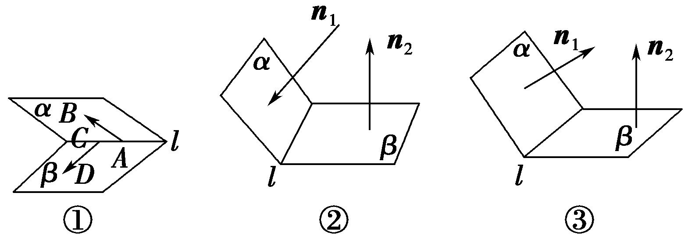  
（2）如图②③，<em><strong>n</strong></em>1，<em><strong>n</strong></em>2分别是二面角<em>α－l－β</em>的两个半平面<em>α</em>，<em>β</em>的法向量，则二面角的大小<em>θ</em>满足|cos <em>θ</em>|＝|cos＜<em><strong>n</strong></em>1，<em><strong>n</strong></em>2＞|，二面角的平面角大小是向量<em><strong>n</strong></em>1与<em><strong>n</strong></em>2的夹角(或其补角)．

2．平面与平面的夹角
如图，平面*α*与平面*β*相交，形成四个二面角，我们把四个二面角中不大于90°的二面角称为平面*α*与平面*β*的夹角．

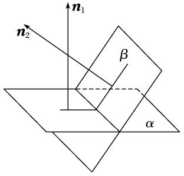
若平面<em>α</em>，<em>β</em>的法向量分别是<em><strong>n</strong></em>1和<em><strong>n</strong></em>2，则平面<em>α</em>与平面<em>β</em>的夹角即为向量<em><strong>n</strong></em>1和<em><strong>n</strong></em>2的夹角或其补角．设平面<em>α</em>与平面<em>β</em>的夹角为<em>θ</em>，则cos<em>θ</em>＝|cos＜<em><strong>n</strong></em>1，<em><strong>n</strong></em>2＞|＝．

3．利用空间向量计算二面角大小的常用方法  
（1）找法向量：分别求出二面角的两个半平面所在平面的法向量，然后通过两个平面的法向量的夹角得到二面角的大小，但要注意结合实际图形判断所求角的大小；  
（2）找与棱垂直的方向向量：分别在二面角的两个半平面内找到与棱垂直且以垂足为起点的两个向量，则这两个向量的夹角的大小就是二面角的大小．

【例题选讲】

考点一　棱柱(台)模型

<strong>[例1]</strong>　(2021·全国甲)已知直三棱柱<em>ABC</em>－<em>A</em>1<em>B</em>1<em>C</em>1中，侧面<em>AA</em>1<em>B</em>1<em>B</em>为正方形，<em>AB</em>＝<em>BC</em>＝2，<em>E</em>，<em>F</em>分别为<em>AC</em>和<em>CC</em>1的中点，<em>D</em>为棱<em>A</em>1<em>B</em>1上的点，<em>BF</em>⊥<em>A</em>1<em>B</em>1．  
（1）证明：*BF*⊥*DE*；  
（2）当<em>B</em>1<em>D</em>为何值时，面<em>BB</em>1<em>C</em>1<em>C</em>与面<em>DFE</em>所成的二面角的正弦值最小？

解析　（1）连接<em>AF</em>，∵<em>E</em>，<em>F</em>分别为直三棱柱<em>ABC</em>－<em>A</em>1<em>B</em>1<em>C</em>1的棱<em>AC</em>和<em>CC</em>1的中点，且<em>AB</em>＝<em>BC</em>＝2，
∴<em>CF</em>＝1，<em>BF</em>＝，∵<em>BF</em>⊥<em>A</em>1<em>B</em>1，<em>A</em>1<em>B</em>1∥<em>AB</em>，∴<em>BF</em>⊥<em>AB</em>，
∴<em>AF</em>＝＝＝3，<em>AC</em>＝＝＝2，∴<em>AB</em>2＋<em>BC</em>2＝<em>AC</em>2，即<em>BA</em>⊥<em>BC</em>．
故以<em>B</em>为原点，<em>BA</em>，<em>BC</em>，<em>BB</em>1所在直线分别为<em>x</em>，<em>y</em>，<em>z</em>轴建立如图所示的空间直角坐标系，
则<em>A</em>(2，0，0)，<em>B</em>(0，0，0)，<em>C</em>(0，2，0)，<em>E</em>(1，1，0)，<em>F</em>(0，2，1)，设<em>B</em>1<em>D</em>＝<em>m</em>，则<em>D</em>(<em>m</em>，0，2)，
∴＝(0，2，1)，＝(1－*m*，1，－2)，∵·＝0，∴*BF*⊥*DE*．

  
（2）∵<em>AB</em>⊥平面<em>BB</em>1<em>C</em>1<em>C</em>，∴平面<em>BB</em>1<em>C</em>1<em>C</em>的一个法向量为<em><strong>m</strong></em>＝(1，0，0)，
由（1）知，＝(1－*m*，1，－2)，＝(－1，1，1)，
设平面<em>DFE</em>的法向量为<em><strong>n</strong></em>＝(<em>x</em>，<em>y</em>，<em>z</em>)，则有，即
令<em>x</em>＝3，则<em>y</em>＝<em>m</em>＋1，<em>z</em>＝2－<em>m</em>，故<em><strong>n</strong></em>＝(3，<em>m</em>＋1，2－<em>m</em> )，
所以cos<*n*，*m*>＝＝＝．
所以当<em>m</em>＝时，面<em>BB</em>1<em>C</em>1<em>C</em>与面<em>DFE</em>所成的二面角的余弦值最大为，此时正弦值最小为．

<strong>[例2]</strong>　(2021·北京)已知正方体<em>ABCD</em>－<em>A</em>1<em>B</em>1<em>C</em>1<em>D</em>1，点<em>E</em>为<em>A</em>1<em>D</em>1中点，直线<em>B</em>1<em>C</em>1交平面<em>CDE</em>于点<em>F</em>．  
（1）证明：点<em>F</em>为<em>B</em>1<em>C</em>1的中点；  
（2）若点<em>M</em>为棱<em>A</em>1<em>B</em>1上一点，且二面角<em>M</em>－<em>CF</em>－<em>E</em>的余弦值为，求的值．

解析　如图所示，取<em>B</em>1<em>C</em>1的中点<em>F</em>′，连结<em>DE</em>，<em>EF</em>′，<em>F</em>′<em>C</em>，
由于<em>ABCD</em>－<em>A</em>1<em>B</em>1<em>C</em>1<em>D</em>1为正方体，<em>E</em>，<em>F</em>′为中点，故<em>EF</em>′∥<em>CD</em>，
从而*E*，*F*′，*C*，*D*，四点共面，所以平面*CDE*即平面*CDEF*′，

据此可得，直线<em>B</em>1<em>C</em>1交平面<em>CDE</em>于点<em>F</em>′，
当直线与平面相交时只有唯一的交点，故点<em>F</em>与点<em>F</em>′重合，即点<em>F</em>为<em>B</em>1<em>C</em>1中点．

  
（2）以点<em>D</em>为坐标原点，<em>DA</em>，<em>DC</em>，<em>DD</em>1，方向分别为<em>x</em>轴，<em>y</em>轴，<em>z</em>轴正方形，建立空间直角坐标系<em>Dxyz</em>，

不妨设正方体的棱长为2，设＝*λ*(0≤*λ*≤1)，
则，*M*(2，2*λ*，2)，*C*(0，2，0)，*F*(1，2，2)，*E*(1，0，2)，
从而，＝(－2，2－2*λ*，－2)，＝(1，0，2)，＝(0，－2，0)，
设平面<em>MCF</em>的法向量为<em><strong>m</strong></em>＝(<em>x</em>1，<em>y</em>1，<em>z</em>1)，所以即
令<em>z</em>1＝－1，则平面<em>MCF</em>的一个法向量为<em><strong>m</strong></em>＝(2，，－1)．
设平面<em>CFE</em>的法向量为<em><strong>n</strong></em>＝(<em>x</em>2，<em>y</em>2，<em>z</em>2)，所以即
令<em>z</em>2＝－1，则平面<em>CFE</em>的一个法向量为<em><strong>n</strong></em>＝(2，0，－1)．
从而*m*·*n*＝5，|*m|*＝，|*n|*＝，
则，cos<*n*，*m*>＝＝＝．

整理可得：(<em>λ</em>－1)2＝，故<em>λ</em>＝或(舍去）．

<strong>[例3]</strong>　(2020·全国Ⅲ改编)如图，在长方体<em>ABCD</em>－<em>A</em>1<em>B</em>1<em>C</em>1<em>D</em>1中，点<em>E</em>，<em>F</em>分别在棱<em>DD</em>1，<em>BB</em>1上，且2<em>DE</em>＝<em>ED</em>1，<em>BF</em>＝2<em>FB</em>1．  
（1）证明：点<em>C</em>1在平面<em>AEF</em>内；  
（2）若<em>AB</em>＝2，<em>AD</em>＝1，<em>AA</em>1＝3，求平面<em>AEF</em>与平面<em>EFA</em>1夹角的正弦值．

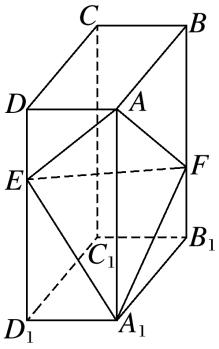
解析　（1）设<em>AB</em>＝<em>a</em>，<em>AD</em>＝<em>b</em>，<em>AA</em>1＝<em>c</em>，如图，

以<em>C</em>1为坐标原点，，，的方向分别为<em>x</em>轴，<em>y</em>轴，<em>z</em>轴正方向，建立空间直角坐标系<em>C</em>1<em>xyz</em>．

连接<em>C</em>1<em>F</em>，则<em>C</em>1(0，0，0)，<em>A</em>(<em>a</em>，<em>b</em>，<em>c</em>)，<em>E</em>，<em>F</em>，

＝，＝，所以＝，所以<em>EA</em>∥<em>C</em>1<em>F</em>，
即<em>A</em>，<em>E</em>，<em>F</em>，<em>C</em>1四点共面，所以点<em>C</em>1在平面<em>AEF</em>内．  
（2）由已知得<em>A</em>(2，1，3)，<em>E</em>(2，0，2)，<em>F</em>(0，1，1)，<em>A</em>1(2，1，0)，
则＝(0，－1，－1)，＝(－2，0，－2)，＝(0，－1，2)，＝(－2，0，1)．
设<em><strong>n</strong></em>1＝(<em>x</em>1，<em>y</em>1，<em>z</em>1)为平面<em>AEF</em>的法向量，则即

可取<em><strong>n</strong></em>1＝(－1，－1，1)．
设<em><strong>n</strong></em>2＝(<em>x</em>2，<em>y</em>2，<em>z</em>2)为平面<em>A</em>1<em>EF</em>的法向量，则即

同理可取<em><strong>n</strong></em>2＝．
因为cos&lt;<em><strong>n</strong></em>1，<em><strong>n</strong></em>2&gt;＝＝－，
所以平面<em>AEF</em>与平面<em>EFA</em>1夹角的正弦值为．

<strong>[例4]</strong>　如图，在四棱台<em>ABCD</em>－<em>A</em>1<em>B</em>1<em>C</em>1<em>D</em>1中，底面<em>ABCD</em>是菱形，<em>CC</em>1⊥底面<em>ABCD</em>，且∠<em>BAD</em>＝60°，<em>CD</em>＝<em>CC</em>1＝2<em>C</em>1<em>D</em>1＝4，<em>E</em>是棱<em>BB</em>1的中点．  
（1）求证：<em>AA</em>1⊥<em>BD</em>；  
（2）求二面角<em>E</em>－<em>A</em>1<em>C</em>1－<em>C</em>的余弦值．

解析　（1）因为<em>C</em>1<em>C</em>⊥底面<em>ABCD</em>，所以<em>C</em>1<em>C</em>⊥<em>BD</em>．因为底面<em>ABCD</em>是菱形，所以<em>BD</em>⊥<em>AC</em>．
又<em>AC</em>∩<em>CC</em>1＝<em>C</em>，<em>AC</em>，<em>CC</em>1⊂平面<em>ACC</em>1<em>A</em>1，所以<em>BD</em>⊥平面<em>ACC</em>1<em>A</em>1．
又<em>AA</em>1⊂平面<em>ACC</em>1<em>A</em>1，所以<em>BD</em>⊥<em>AA</em>1．  
（2）如图，设<em>AC</em>交<em>BD</em>于点<em>O</em>，依题意，<em>A</em>1<em>C</em>1∥<em>OC</em>且<em>A</em>1<em>C</em>1＝<em>OC</em>，

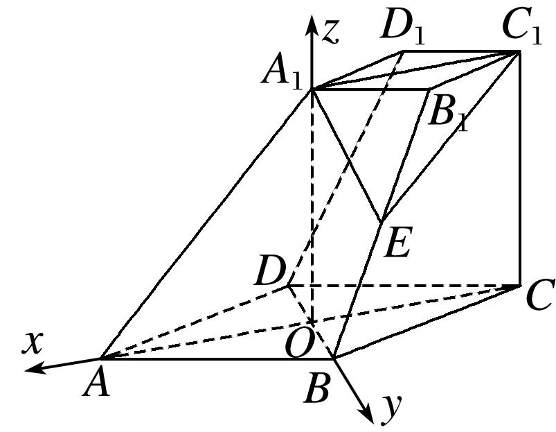
所以四边形<em>A</em>1<em>OCC</em>1为平行四边形，所以<em>A</em>1<em>O</em>∥<em>CC</em>1，且<em>A</em>1<em>O</em>＝<em>CC</em>1．所以<em>A</em>1<em>O</em>⊥底面<em>ABCD</em>．

以<em>O</em>为原点，<em>OA</em>，<em>OB</em>，<em>OA</em>1所在直线分别为<em>x</em>轴，<em>y</em>轴，<em>z</em>轴建立空间直角坐标系<em>O</em>－<em>xyz</em>．
则<em>A</em>(2，0，0)，<em>A</em>1(0，0，4)，<em>C</em>1(－2，0，4)，<em>B</em>(0，2，0)，

＝(－2，2，0)．由＝，得<em>B</em>1(－，1，4)．
因为<em>E</em>是棱<em>BB</em>1的中点，所以<em>E</em>，
所以＝，＝(－2，0，0)．
设<em><strong>n</strong></em>＝(<em>x</em>，<em>y</em>，<em>z</em>)为平面<em>EA</em>1<em>C</em>1的法向量，则取<em>z</em>＝3，得<em><strong>n</strong></em>＝(0，4，3)，

取平面<em>A</em>1<em>C</em>1<em>C</em>的法向量<em><strong>m</strong></em>＝(0，1，0)，
又由图可知，二面角<em>E</em>－<em>A</em>1<em>C</em>1－<em>C</em>为锐二面角，
设二面角<em>E</em>－<em>A</em>1<em>C</em>1－<em>C</em>的平面角为<em>θ</em>，则cos <em>θ</em>＝＝，
所以二面角<em>E</em>－<em>A</em>1<em>C</em>1－<em>C</em>的余弦值为．

【对点训练】

1．(2019·全国Ⅲ)图1是由矩形*ADEB*，Rt△*ABC*和菱形*BFGC*组成的一个平面图形，其中*AB*＝1，*BE*＝

*BF*＝2，∠*FBC*＝60°．将其沿*AB*，*BC*折起使得*BE*与*BF*重合，连接*DG*，如图2．  
（1）证明：图2中的*A*，*C*，*G*，*D*四点共面，且平面*ABC*⊥平面*BCGE*；  
（2）求图2中的二面角*B*－*CG*－*A*的大小．

1．解析　（1）由已知得*AD*∥*BE*，*CG*∥*BE*，所以*AD*∥*CG*，
所以*AD*，*CG*确定一个平面，从而*A*，*C*，*G*，*D*四点共面．
由已知得*AB*⊥*BE*，*AB*⊥*BC*，且*BE*∩*BC*＝*B*，所以*AB*⊥平面*BCGE*．
又因为*AB*⊂平面*ABC*，所以平面*ABC*⊥平面*BCGE*．  
（2）作*EH*⊥*BC*，垂足为*H*．因为*EH*⊂平面*BCGE*，平面*BCGE*⊥平面*ABC*，

平面*BCGE*∩平面*ABC*＝*BC*，所以*EH*⊥平面*ABC．*
由已知，菱形*BCGE*的边长为2，∠*EBC*＝60°，可求得*BH*＝1，*EH*＝．

以*H*为坐标原点，的方向为*x*轴的正方向，建立如图所示的空间直角坐标系*Hxyz*，
则*A*(－1，1，0)，*C*(1，0，0)，*G*(2，0，)，＝(1，0，)，＝(2，－1，0)．
设平面<em>ACGD</em>的法向量为<em><strong>n</strong></em>＝(<em>x</em>，<em>y</em>，<em>z</em>)，则即
所以可取<em><strong>n</strong></em>＝(3，6，－)．又平面<em>BCGE</em>的法向量可取<em><strong>m</strong></em>＝(0，1，0)，
所以cos&lt;<em><strong>n</strong></em>，<em><strong>m</strong></em>&gt;＝＝．因此二面角<em>B</em>－<em>CG</em>－<em>A</em>的大小为30°．

2．如图，在棱长为2的正方体<em>ABCD</em>－<em>A</em>1<em>B</em>1<em>C</em>1<em>D</em>1中，<em>E</em>是<em>BC</em>的中点，<em>F</em>是<em>DD</em>1的中点．  
（1）求证：<em>CF</em>∥平面<em>A</em>1<em>DE</em>；  
（2）求平面<em>A</em>1<em>DE</em>与平面<em>A</em>1<em>DA</em>夹角的余弦值．

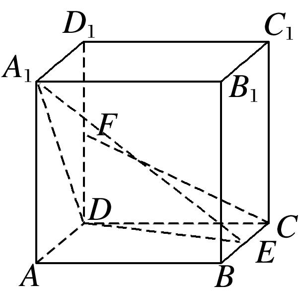

2．解析　（1）分别以<em>DA</em>，<em>DC</em>，<em>DD</em>1所在直线为<em>x</em>轴，<em>y</em>轴，<em>z</em>轴建立空间直角坐标系，

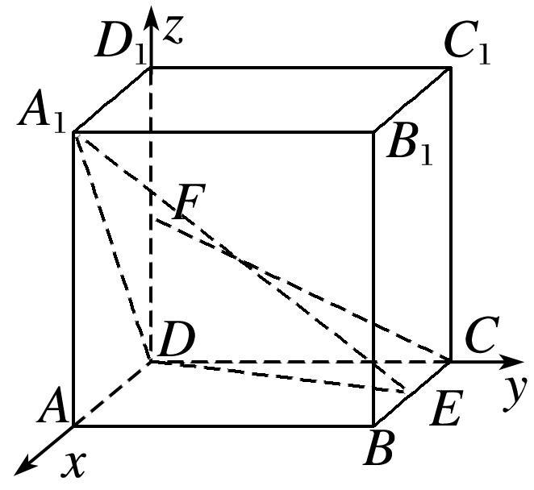
则 <em>A</em>1(2，0，2)，<em>E</em>(1，2，0)，<em>D</em>(0，0，0)，<em>C</em>(0，2，0)，<em>F</em>(0，0，1)，
则＝(2，0，2)，＝(1，2，0)，＝(0，－2，1)，
设平面<em>A</em>1<em>DE</em>的法向量<em><strong>n</strong></em>＝(<em>a</em>，<em>b</em>，<em>c</em>)，则取<em><strong>n</strong></em>＝(－2，1，2)，
∴·<em><strong>n</strong></em>＝(0，－2，1)·(－2，1，2)＝0，又<em>CF</em>⊄平面<em>A</em>1<em>DE</em>，∴<em>CF</em>∥平面<em>A</em>1<em>DE</em>．  
（2）＝(0，2，0)是平面<em>A</em>1<em>DA</em>的法向量，∴cos&lt;<em><strong>n</strong></em>，&gt;＝＝，
即平面<em>A</em>1<em>DE</em>与平面<em>A</em>1<em>DA</em>夹角的余弦值为．

3．(2019·全国Ⅱ)如图，长方体<em>ABCD</em>－<em>A</em>1<em>B</em>1<em>C</em>1<em>D</em>1的底面<em>ABCD</em>是正方形，点<em>E</em>在棱<em>AA</em>1上，<em>BE</em>⊥<em>EC</em>1．  
（1）证明：<em>BE</em>⊥平面<em>EB</em>1<em>C</em>1；  
（2）若<em>AE</em>＝<em>A</em>1<em>E</em>，求二面角<em>B</em>－<em>EC</em>－<em>C</em>1的正弦值．

3．解析　（1）由已知，得<em>B</em>1<em>C</em>1⊥平面<em>ABB</em>1<em>A</em>1，由于<em>BE</em>⊂平面<em>ABB</em>1<em>A</em>1，
故<em>B</em>1<em>C</em>1⊥<em>BE</em>．又<em>BE</em>⊥<em>EC</em>1，<em>B</em>1<em>C</em>1∩<em>EC</em>1＝<em>C</em>1，所以<em>BE</em>⊥平面<em>EB</em>1<em>C</em>1．  
（2）由（1）知∠<em>BEB</em>1＝90°．由题设知Rt△<em>ABE</em>≌Rt△<em>A</em>1<em>B</em>1<em>E</em>，所以∠<em>AEB</em>＝45°，故<em>AE</em>＝<em>AB</em>，<em>AA</em>1＝2<em>AB．</em>

以*D*为坐标原点，的方向为*x*轴正方向，的方向为*y*轴正方向，的方向为*z*轴正方向，||为单位长度，建立如图所示的空间直角坐标系*Dxyz*，

则<em>C</em>(0，1，0)，<em>B</em>(1，1，0)，<em>C</em>1(0，1，2)，<em>E</em>(1，0，1)，
所以＝(1，0，0)，＝(1，－1，1)，<em>CC</em>1＝(0，0，2)．
设平面<em>EBC</em>的法向量为<em><strong>n</strong></em>＝(<em>x</em>1，<em>y</em>1，<em>z</em>1)，则即
所以可取*n*＝(0，－1，－1)．
设平面<em>ECC</em>1的法向量为<em><strong>m</strong></em>＝(<em>x</em>2，<em>y</em>2，<em>z</em>2)，则即
所以可取*m*＝(1，1，0)．于是cos<*n*，*m*>＝＝－．
所以二面角<em>B</em>－<em>EC</em>－<em>C</em>1的正弦值为．

4．(2019·全国Ⅰ改编)如图，直四棱柱<em>ABCD</em>－<em>A</em>1<em>B</em>1<em>C</em>1<em>D</em>1的底面是菱形，<em>AA</em>1＝4，<em>AB</em>＝2，∠<em>BAD</em>＝60°，<em>E</em>，

<em>M</em>，<em>N</em>分别是<em>BC</em>，<em>BB</em>1，<em>A</em>1<em>D</em>的中点．  
（1）证明：<em>MN</em>∥平面<em>C</em>1<em>DE</em>；  
（2）求平面<em>AMA</em>1与平面<em>MA</em>1<em>N</em>夹角的正弦值．

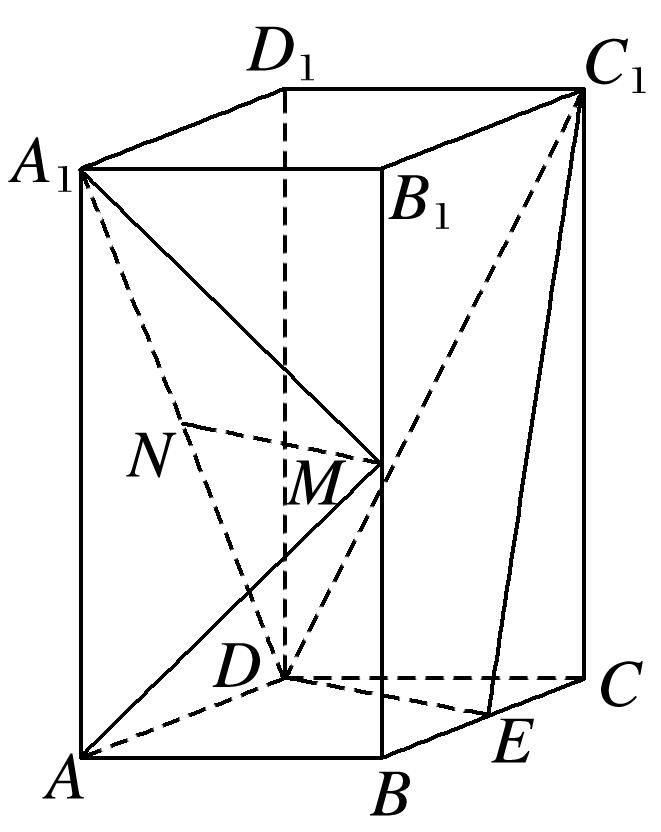

4．解析　（1）如图，连接<em>B</em>1<em>C</em>，<em>ME．</em>因为<em>M</em>，<em>E</em>分别为<em>BB</em>1，<em>BC</em>的中点，

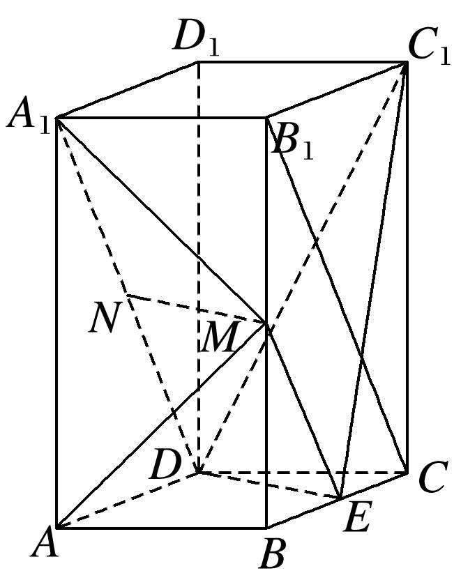
所以<em>ME</em>∥<em>B</em>1<em>C</em>，且<em>ME</em>＝<em>B</em>1<em>C．</em>又因为<em>N</em>为<em>A</em>1<em>D</em>的中点，所以<em>ND</em>＝<em>A</em>1<em>D．</em>
由题设知<em>A</em>1<em>B</em>1∥<em>DC</em>且<em>A</em>1<em>B</em>1＝<em>DC</em>，可得<em>B</em>1<em>C</em>∥<em>A</em>1<em>D</em>且<em>B</em>1<em>C</em>＝<em>A</em>1<em>D</em>，故<em>ME</em>∥<em>ND</em>且<em>ME</em>＝<em>ND</em>，
因此四边形<em>MNDE</em>为平行四边形，<em>MN</em>∥<em>ED．</em>又<em>MN</em>⊂平面<em>C</em>1<em>DE</em>，<em>ED</em>⊂平面<em>C</em>1<em>DE</em>，
所以<em>MN</em>∥平面<em>C</em>1<em>DE．</em>  
（2）由已知可得*DE*⊥*DA*，以*D*为坐标原点，的方向为*x*轴正方向，建立如图所示的空间直角坐标系*Dxyz*，

则<em>A</em>(2，0，0)，<em>A</em>1(2，0，4)，<em>M</em>(1，，2)，<em>N</em>(1,0,2)，＝(0，0，－4)，＝(－1，，－2)，

＝(－1，0，－2)，＝(0，－，0)．
设<em><strong>m</strong></em>＝(<em>x</em>，<em>y</em>，<em>z</em>)为平面<em>A</em>1<em>MA</em>的一个法向量，则
所以可得*m*＝(，1，0)．
设<em><strong>n</strong></em>＝(<em>p</em>，<em>q</em>，<em>r</em>)为平面<em>A</em>1<em>MN</em>的一个法向量，则
所以可取*n*＝(2，0，－1)．
于是cos<*m*，*n*>＝＝＝，
所以平面<em>AMA</em>1与平面<em>MA</em>1<em>N</em>夹角的正弦值为．

考点二　棱(圆)锥模型

<strong>[例1]</strong>　(2020·全国Ⅰ)如图，<em>D</em>为圆锥的顶点，<em>O</em>是圆锥底面的圆心，<em>AE</em>为底面直径，<em>AE</em>＝<em>AD．</em>△<em>ABC</em>是底面的内接正三角形，<em>P</em>为<em>DO</em>上一点，<em>PO</em>＝<em>DO</em>．  
（1）证明：*PA*⊥平面*PBC*；  
（2）求二面角*B*－*PC*－*E*的余弦值．

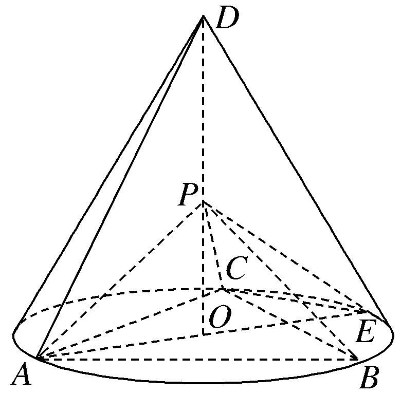
解析　（1）设*DO*＝*a*，由题意可得*PO*＝*a*，*AO*＝*a*，*AB*＝*a*，*PA*＝*PB*＝*PC*＝*a*．
因此<em>PA</em>2＋<em>PB</em>2＝<em>AB</em>2，从而<em>PA</em>⊥<em>PB</em>．又<em>PA</em>2＋<em>PC</em>2＝<em>AC</em>2，
故*PA*⊥*PC*．又*PB*∩*PC*＝*P*，*PB*，*PC*⊂平面*PBC*，所以*PA*⊥平面*PBC*．

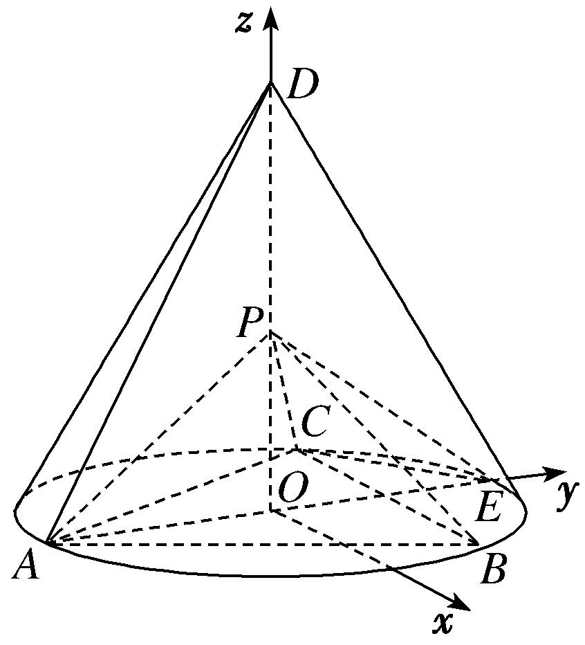  
（2）以*O*为坐标原点，的方向为*y*轴正方向，||为单位长度，建立如图所示的空间直角坐标系*Oxyz*．由题设可得*E*(0，1，0)，*A*(0，－1，0)，*C*，*P*．
所以＝，＝．
设*m*＝(*x*，*y*，*z*)是平面*PCE*的法向量，则即

可取*m*＝．
由（1）知＝是平面*PCB*的一个法向量，记*n*＝，
则cos<*n*，*m*>＝＝．所以二面角*B*－*PC*－*E*的余弦值为．

<strong>[例2]</strong>　(2021·全国新Ⅰ)如图，在三棱锥<em>A</em>－<em>BCD</em>中，平面<em>ABD</em>⊥平面<em>BCD</em>，<em>AB</em>＝<em>AD</em>，<em>O</em>为<em>BD</em>的中点．  
（1）证明：*OA*⊥*CD*；  
（2）若△*OCD*是边长为1的等边三角形，点*E*在棱*AD*上，*DE*＝2*EA*，且二面角*E*－*BC*－*D*的大小为45°，求三棱锥*A*－*BCD*的体积．

解析　（1）因为*AB*＝*AD*，*O*为*BD*的中点，所以*AO*⊥*BD*，
又平面*ABD*⊥平面*BCD*，平面*ABD*∩平面*BCD*＝*BD*，*AO*⊂平面*BCD*，
所以*AO*⊥平面*BCD*，又*CD*⊂平面*BCD*，所以*OA*⊥*CD*；
  
（2）取*OD*的中点*F*，因为△*OCD*为正三角形，所以*CF*⊥*OD*，

过*O*作*OM*∥*CF*与*BC*交于点*M*，则*OM*⊥*OD*，所以*OM*，*OD*，*OA*两两垂直，

以点*O*为坐标原点，分别以*OM*，*OD*，*OA*为*x*轴，*y*轴，*z*轴建立空间直角坐标系如图所示，则*B*(0，－1，0)，*C*(，，0)，*D*(0，1，0)，设*A*(0，0，*t*)，则*E*(0，，)，
因为*OA*⊥平面*BCD*，故平面*BCD*的一个法向量为＝(0，0，*t*)，
设平面<em>BCE</em>的法向量为<em><strong>n</strong></em>＝(<em>x</em>，<em>y</em>，<em>z</em>)，又＝(，，0)，＝(0，，)，
所以由得令<em>x</em>＝，则<em><strong>n</strong></em>＝(，－1，)．
因为二面角<em>E</em>－<em>BC</em>－<em>D</em>的大小为45°，所以cos&lt;<em><strong>n</strong></em>，&gt;＝＝＝，
解得<em>t</em>＝1，所以<em>OA</em>＝1，又<em>S</em>△<em>OCD</em>＝×1×1×＝，所以<em>S</em>△<em>BCD</em>＝，
故<em>VA</em>－<em>BCD</em>＝×<em>S</em>△<em>BCD</em>×<em>OA</em>＝××1＝．

<strong>[例3]</strong>　(2021·全国新Ⅱ)在四棱锥<em>Q</em>－<em>ABCD</em>中，底面<em>ABCD</em>是正方形，若<em>AD</em>＝2，<em>QD</em>＝<em>QA</em>＝，<em>QC</em>＝3．  
（1）证明：平面*QAD*⊥平面*ABCD*；  
（2）求二面角*B*－*QD*－*A*的平面角的余弦值．

解析　（1）取*AD*的中点为*O*，连接*QO*，*CO*．
因为*QD*＝*QA*，*OD*＝*OA*，则*QO*⊥*AD*，而*AD*＝2，*QA*＝，故*QO*＝＝2，
在正方形*ABCD*中，因为*AD*＝2，故*DO*＝1，故*CO*＝，
因为<em>QC</em>＝3，故<em>QO</em>2＋<em>OC</em>2＝<em>QC</em>2，故△<em>QOC</em>为直角三角形且<em>QO</em>⊥<em>OC</em>，
因为*OC*∩*AD*＝*O*，故*QO*⊥底面*ABCD*．因为*QO*⊂平面*QAD*，，故平面*QAD*⊥底面*ABCD*．  
（2）在平面*ABCD*内，过*O*作*OT*∥*CD*，交*BC*于*T*，则*OT*⊥*AD*，

结合（1）中的*QO*⊥平面*ABCD*，故可建如图所示的空间坐标系．

则*D*(0，1，0)，*Q*(0，0，2)，*B*(2，－1，0)，，故＝(－2，1，2)，＝(－2，2，0)．
设平面<em>QBD</em>的法向量<em><strong>n</strong></em>＝(<em>x</em>，<em>y</em>，<em>z</em>)，则即
不妨设<em>x</em>＝1，可得<em><strong>n</strong></em>＝(1，1，)．

而平面<em>QAD</em>的法向量为<em><strong>m</strong></em>＝(1，0，0)．故cos&lt;<em><strong>m</strong></em>，<em><strong>n</strong></em>&gt;＝＝＝，

二面角*B*－*QD*－*A*的平面角为锐角，故其余弦值为．

<strong>[例4]</strong>　如图，在几何体<em>ABCDE</em>中，四边形<em>ABCD</em>是矩形，<em>AB</em>⊥平面<em>BEC</em>，<em>BE</em>⊥<em>EC</em>，<em>AB</em>＝<em>BE</em>＝<em>EC</em>＝2，<em>G</em>，<em>F</em>分别是线段<em>BE</em>，<em>DC</em>的中点．  
（1）求证：*GF*∥平面*ADE*；  
（2）求平面*AEF*与平面*BEC*夹角的余弦值．

解析　方法一　（1）如图，取*AE*的中点*H*，连接*HG*，*HD*，
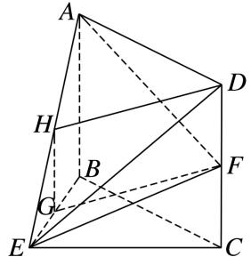
因为*G*是*BE*的中点，所以*GH*∥*AB*，且*GH*＝*AB*．又*F*是*CD*的中点，所以*DF*＝*CD*．
由四边形*ABCD*是矩形，得*AB*∥*CD*，*AB*＝*CD*，所以*GH*∥*DF*，且*GH*＝*DF*，
从而四边形*HGFD*是平行四边形，所以*GF*∥*DH*．
又*DH*⊂平面*ADE*，*GF*⊄平面*ADE*，所以*GF*∥平面*ADE*．  
（2）如图，在平面*BEC*内，

过*B*点作*BQ*∥*EC*．因为*BE*⊥*CE*，所以*BQ*⊥*BE*．又因为*AB*⊥平面*BEC*，所以*AB*⊥*BE*，*AB*⊥*BQ*．

以*B*为原点，分别以*BE*，*BQ*，*BA*所在直线为*x*轴，*y*轴，*z*轴，建立空间直角坐标系*Bxyz*，
则*A*(0，0，2)，*B*(0，0，0)，*E*(2，0，0)，*F*(2，2，1)．因为*AB*⊥平面*BEC*，
所以＝(0，0，2)为平面*BEC*的法向量．
设<em><strong>n</strong></em>＝(<em>x</em>，<em>y</em>，<em>z</em>)为平面<em>AEF</em>的法向量．又＝(2，0，－2)，＝(2，2，－1)，
由得取<em>z</em>＝2，得<em><strong>n</strong></em>＝(2，－1，2)．
从而|cos&lt;<em><strong>n</strong></em>，&gt;|＝＝＝，所以平面<em>AEF</em>与平面<em>BEC</em>夹角的余弦值为．
方法二　（1）如图，取*AB*的中点*M*，连接*MG*，*MF*．

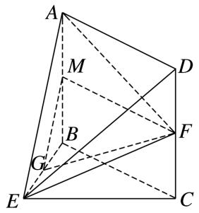
由*G*是*BE*的中点，可知*GM*∥*AE*．又*AE*⊂平面*ADE*，*GM*⊄平面*ADE*，所以*GM*∥平面*ADE*．
在矩形*ABCD*中，由*M*，*F*分别是*AB*，*CD*的中点得*MF*∥*AD*．
又*AD*⊂平面*ADE*，*MF*⊄平面*ADE*．所以*MF*∥平面*ADE*．
又因为*GM*∩*MF*＝*M*，*GM*⊂平面*GMF*，*MF*⊂平面*GMF*，所以平面*GMF*∥平面*ADE*．
因为*GF*⊂平面*GMF*，所以*GF*∥平面*ADE*．  
（2）同方法一．

<strong>[例5]</strong>　如图，在四棱锥<em>P</em>－<em>ABCD</em>中，底面<em>ABCD</em>是菱形，∠<em>BAD</em>＝60°，<em>Q</em>为<em>AD</em>的中点，<em>PQ</em>⊥平面<em>ABCD</em>，<em>PA</em>＝<em>PD</em>＝<em>AD</em>＝2，<em>M</em>是棱<em>PC</em>上一点，且＝．  
（1）证明：*PA*∥平面*BMQ*；  
（2）求二面角*B*－*MQ*－*C*的余弦值．

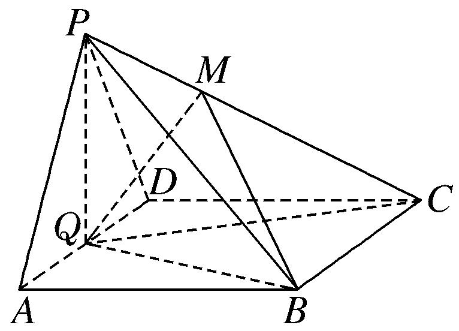
解析　（1）如图，连接*AC*，交*BQ*于*N*，连接*MN*，∵底面*ABCD*是菱形，
∴*AQ*∥*BC*，∴△*ANQ*∽△*CNB*，∴＝＝，∴＝，又＝，∴＝＝，
∴*MN*∥*PA*，又*MN*⊂平面*BMQ*．*PA*⊄平面*BMQ*，∴*PA*∥平面*BMQ*．

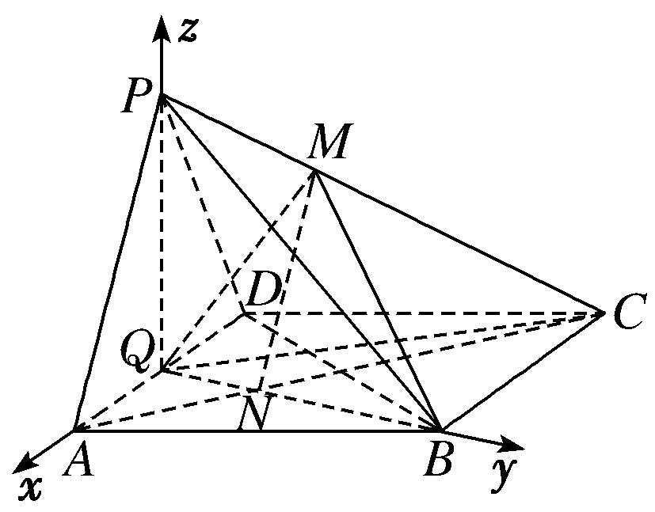  
（2）连接*BD*，∵底面*ABCD*是菱形，且∠*BAD*＝60°，∴△*BAD*是等边三角形，
又*Q*为*AD*的中点，∴*BQ*⊥*AD*．由*PQ*⊥平面*ABCD*，得*PQ*⊥*AD*．

以*Q*为坐标原点，*QA*，*QB*，*QP*所在的直线分别为*x*轴，*y*轴，*z*轴建立空间直角坐标系，
则*Q*(0，0，0)，*A*(1，0，0)，*B*(0，，0)，*D*(－1，0，0)，*P*(0，0，)，
由＝＋＝(－2，0，0)＋(－1，，0)＝(－3，，0)，可得点*C*(－2，，0)，
设平面<em>PQC</em>的法向量为<em><strong>n</strong></em>＝(<em>x</em>，<em>y</em>，<em>z</em>)．则即
令<em>x</em>＝3，得<em>y</em>＝2，<em>z</em>＝0，∴<em><strong>n</strong></em>＝(3，2，0)，|<em><strong>n</strong></em>|＝．
设平面<em>BMQ</em>的法向量为<em><strong>m</strong></em>＝(<em>x</em>1，<em>y</em>1，<em>z</em>1)，则∵<em>MN</em>∥<em>PA</em>，∴
即令<em>x</em>1＝，则<em>z</em>1＝1，<em>y</em>1＝0，∴<em><strong>m</strong></em>＝(，0，1)是平面<em>BMQ</em>的一个法向量．
设二面角*B－MQ－C*的平面角的大小为*θ*，则cos *θ*＝＝，
即二面角*B－MQ－C*的余弦值为．

<strong>[例6]</strong>　如图，在Rt△<em>ABC</em>中，<em>B</em>为直角，<em>AB</em>＝2<em>BC</em>，<em>E</em>，<em>F</em>分别为<em>AB</em>，<em>AC</em>的中点，将△<em>AEF</em>沿<em>EF</em>折起，使点<em>A</em>到达点<em>D</em>的位置，连接<em>BD</em>，<em>CD</em>，<em>M</em>为<em>CD</em>的中点．  
（1）证明：*MF*⊥平面*BCD*；  
（2）若*DE*⊥*BE*，求平面*EMF*与平面*MFC*夹角的余弦值．

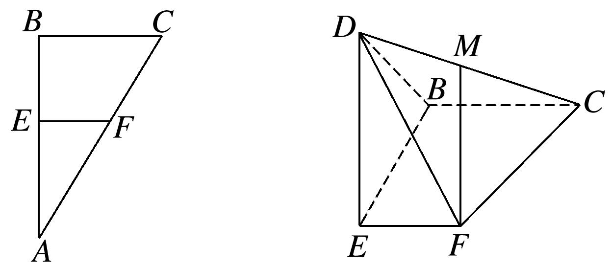
解析　（1）如图，取*DB*的中点*N*，连接*MN*，*EN*，
∵*MN*∥*BC*，*MN*＝*BC*，*EF*∥*BC*，*EF*＝*BC*，∴四边形*EFMN*是平行四边形，
∵*EF*⊥*BE*，*EF*⊥*DE*，*BE*∩*DE*＝*E*，*BE*，*DE*⊂平面*BDE*，
∴*EF*⊥平面*BDE*，∴*EF*⊥*EN*，∴*MF*⊥*MN*，
在△*DFC*中，*DF*＝*FC*，又∵*M*为*CD*的中点，∴*MF*⊥*CD*，
又∵*CD*∩*MN*＝*M*，*CD*，*MN*⊂平面*BCD*，∴*MF*⊥平面*BCD*．  
（2）∵*DE*⊥*BE*，*DE*⊥*EF*，*BE*∩*EF*＝*E*，*BE*，*EF*⊂平面*BEF*，∴*DE*⊥平面*BEF*，

以*E*为原点，*BE*，*EF*，*ED*所在直线分别为*x*，*y*，*z*轴，建立空间直角坐标系，设*BC*＝2，

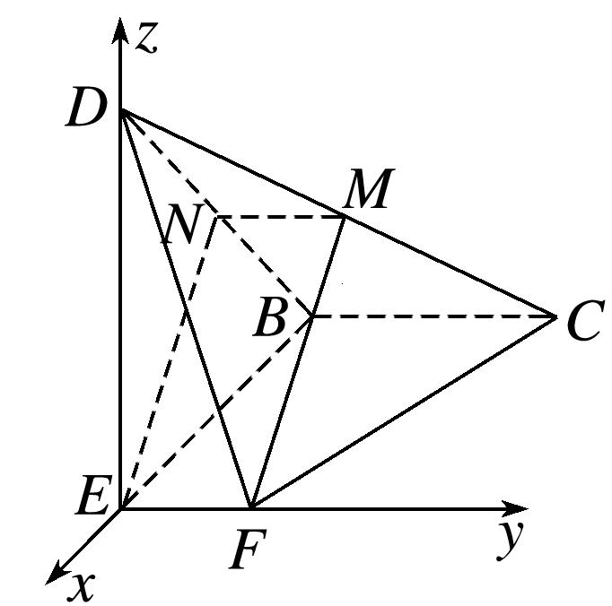
则*E*(0，0，0)，*F*(0，1，0)，*C*(－2，2，0)，*M*(－1，1，1)，
∴＝(0，1，0)，＝(－1，0，1)，＝(2，－1，0)，
设平面<em>EMF</em>的一个法向量为<em><strong>m</strong></em>＝(<em>x</em>，<em>y</em>，<em>z</em>)，则取<em>x</em>＝1，得<em><strong>m</strong></em>＝(1，0，1)，

同理，得平面<em>CMF</em>的一个法向量为<em><strong>n</strong></em>＝(1，2，1)，
设平面*EMF*与平面*MFC*的夹角为*θ*，则cos *θ*＝＝，
∴平面*EMF*与平面*MFC*夹角的余弦值为．

<strong>[例7]</strong>　在Rt△<em>ABC</em>中，∠<em>ABC</em>＝90°，tan∠<em>ACB</em>＝．已知<em>E</em>，<em>F</em>分别是<em>BC</em>，<em>AC</em>的中点．将△<em>CEF</em>沿<em>EF</em>折起，使<em>C</em>到<em>C</em>′的位置且二面角<em>C</em>′－<em>EF</em>－<em>B</em>的大小是60°．连接<em>C</em>′<em>B</em>，<em>C</em>′<em>A</em>，如图：  
（1）求证：平面*C*′*FA*⊥平面*ABC*′；  
（2）求平面*AFC*′与平面*BEC*′所成二面角的大小．

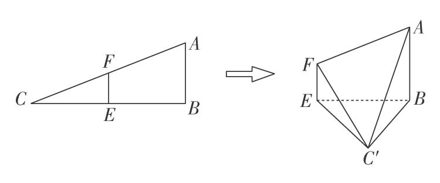
解析　（1）证法一：如图，设*AC*′的中点为*G*，连接*FG*．
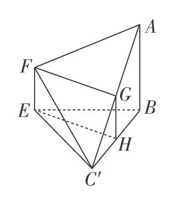
设*BC*′的中点为*H*，连接*GH*，*EH*．∵*E*，*F*分别为*BC*，*AC*的中点，
∴*AF*＝*FC*′，*BE*＝*EC*′，*EF*∥*AB*，*EF*＝*AB*，又*G*，*H*分别为*AC*′，*BC*′的中点，

∴*FG*⊥*AC*′，*EH*⊥*BC*′，*GH*∥*AB*，*GH*＝*AB*，∴*EFGH*，
∴四边形*EHGF*为平行四边形．∴*FG*⊥*BC*′，又*AC*′∩*BC*′＝*C*′，∴*FG*⊥平面*ABC*′，
又*FG*⊂平面*C*′*FA*，∴平面*C*′*FA*⊥平面*ABC*′．

证法二：如图，建立空间直角坐标系，设*AB*＝2，则*A*(0，0，2)，*B*(0，0，0)，*F*(2，0，1)，*E*(2，0，0)，*C*′(1，，0)．

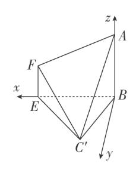
设平面<em>ABC</em>′的法向量为<em><strong>a</strong></em>＝(<em>x</em>1，<em>y</em>1，<em>z</em>1)，
∵＝(0，0，2)，＝(1，，0)，∴令<em>y</em>1＝1，则<em><strong>a</strong></em>＝(－，1，0)，
设平面<em>C</em>′<em>FA</em>的法向量为<em><strong>b</strong></em>＝(<em>x</em>2，<em>y</em>2，<em>z</em>2)，
∵＝(2，0，－1)，＝(1，，－2)，∴令<em>y</em>2＝，则<em><strong>b</strong></em>＝(1，，2)．
∵<em><strong>a·b</strong></em>＝0，∴平面<em>C</em>′<em>FA</em>⊥平面<em>ABC</em>′．  
（2）如图，建立空间直角坐标系，设<em>AB</em>＝2，则<em>A</em>(0，0，2)，<em>B</em>(0，0，0)，<em>F</em>(2，0，1)，<em>E</em>(2，0，0)，<em>C</em>′(1，，0)．显然平面<em>BEC</em>′的法向量<em><strong>m</strong></em>＝(0，0，1)，
设平面<em>AFC</em>′的法向量<em><strong>n</strong></em>＝(<em>x</em>，<em>y</em>，<em>z</em>)，∵＝(1，，－2)，＝(2，0，－1)，
∴令<em>x</em>＝1，则<em><strong>n</strong></em>＝(1，，2)．

cos<*m*，*n*>＝＝，

观察图形可知，平面*AFC*′与平面*BEC*′所成二面角的平面角为锐角．
∴平面*AFC*′与平面*BEC*′所成二面角的大小为45°．

<strong>[例8]</strong>　如图①，△<em>PAD</em>是以<em>AD</em>为斜边的直角三角形，<em>PA</em>＝1，<em>BC</em>∥<em>AD</em>，<em>CD</em>⊥<em>AD</em>，<em>AD</em>＝2<em>DC</em>＝2，<em>BC</em>＝，将△<em>PAD</em>沿<em>AD</em>折起，如图②，使得<em>PC</em>＝2．  
（1）证明：平面*PAD*⊥平面*ABCD*；  
（2）求二面角*A－PB－C*的余弦值．

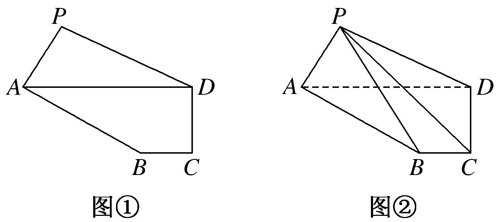
解析　（1）法一：∵<em>DC</em>＝1，<em>PC</em>＝2，<em>PD</em>＝＝，∴<em>PD</em>2＋<em>CD</em>2＝<em>PC</em>2，即<em>CD</em>⊥<em>PD</em>，
又*CD*⊥*AD*，*PD*∩*AD*＝*D*，∴*CD*⊥平面*PAD*，又*CD*⊂平面*ABCD*，∴平面*PAD*⊥平面*ABCD*．

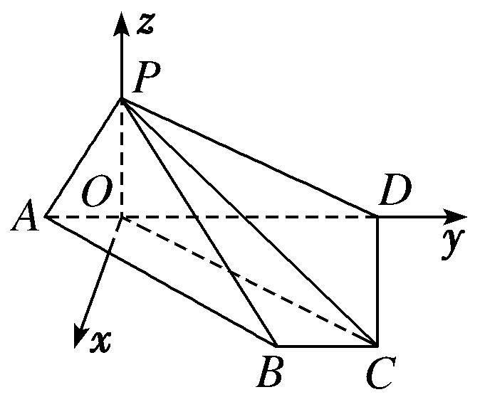

法二：如图，过*P*作*PO*⊥*AD*，①，垂足为*O*，连接*OC*，∵*PA*＝1，∠*PAD*＝60°，∴*AO*＝，

<em>PO</em>＝，<em>OC</em>2＝<em>OD</em>2＋<em>CD</em>2＝，<em>OC</em>2＋<em>PO</em>2＝＋＝<em>PC</em>2，∴<em>PO</em>⊥<em>OC</em>，②，又<em>AD</em>∩<em>OC</em>＝<em>O</em>，③
∴结合①②③知*PO*⊥平面*ABCD*，又*PO*⊂平面*PAD*，∴平面*PAD*⊥平面*ABCD*．  
（2）以*O*为坐标原点，垂直于*OD*的直线为*x*轴，*OD*为*y*轴，*OP*为*z*轴建立空间直角坐标系，
则*A*，*B*(1，1，0)，*C*，*P*．
设平面<em>BPC</em>的法向量为<em><strong>m</strong></em>＝(<em>x</em>1，<em>y</em>1，<em>z</em>1)，由得<em>x</em>1＝<em>z</em>1，<em>y</em>1＝0，取<em><strong>m</strong></em>＝(，0，2)．
设平面<em>PAB</em>的法向量为<em><strong>n</strong></em>＝(<em>x</em>2，<em>y</em>2，<em>z</em>2)，由得<em>x</em>2＋<em>y</em>2＝0，－<em>x</em>2－<em>y</em>2＋<em>z</em>2＝0，

取*n*＝，
∴cos<*m*，*n*>＝＝，由图形可知二面角*A*－*PB*－*C*为钝角，
∴二面角*A*－*PB*－*C*的余弦值为－．

<strong>[例9]</strong>　如图，在四棱锥<em>P</em>－<em>ABCD</em>中，侧面<em>PAD</em>⊥底面<em>ABCD</em>，底面<em>ABCD</em>为直角梯形，其中<em>AB</em>∥<em>CD</em>，∠<em>CDA</em>＝90°，<em>CD</em>＝2<em>AB</em>＝2，<em>AD</em>＝3，<em>PA</em>＝，<em>PD</em>＝2，点<em>E</em>在棱<em>AD</em>上且<em>AE</em>＝1，点<em>F</em>为棱<em>PD</em>的中点．  
（1）证明：平面*BEF*⊥平面*PEC*；  
（2）求二面角*A*－*BF*－*C*的余弦值．

解析　（1）在Rt△*ABE*中，由*AB*＝*AE*＝1，得∠*AEB*＝45°，

同理在Rt△*CDE*中，由*CD*＝*DE*＝2，得∠*DEC*＝45°，所以∠*BEC*＝90°，即*BE*⊥*EC*．
在△*PAD*中，cos∠*PAD*＝＝＝，
在△<em>PAE</em>中，<em>PE</em>2＝<em>PA</em>2＋<em>AE</em>2－2<em>PA</em>·<em>AE</em>·cos∠<em>PAE</em>＝5＋1－2××1×＝4，
所以<em>PE</em>2＋<em>AE</em>2＝<em>PA</em>2，即<em>PE</em>⊥<em>AD</em>．
又平面*PAD*⊥平面*ABCD*，平面*PAD*∩平面*ABCD*＝*AD*，*PE*⊂平面*PAD*，
所以*PE*⊥平面*ABCD*，所以*PE*⊥*BE*．
又因为*CE*∩*PE*＝*E*，*CE*，*PE*⊂平面*PEC*，所以*BE*⊥平面*PEC*，
又*BE*⊂平面*BEF*，所以平面*BEF*⊥平面*PEC*．  
（2）由（1）知*EB*，*EC*，*EP*两两垂直，故以*E*为坐标原点，以射线*EB*，*EC*，*EP*分别为*x*轴、*y*轴、*z*轴的正半轴建立如图所示的空间直角坐标系，则

*B*(，0，0)，*C*(0，2，0)，*P*(0，0，2)，*A*，*D*(－，，0)，*F*，

＝，＝，＝(－，2，0)，
设平面<em>ABF</em>的法向量为<em><strong>m</strong></em>＝(<em>x</em>1，<em>y</em>1，<em>z</em>1)，则
不妨设<em>x</em>1＝1，则<em><strong>m</strong></em>＝(1，－1，2)，
设平面<em>BFC</em>的法向量为<em><strong>n</strong></em>＝(<em>x</em>2，<em>y</em>2，<em>z</em>2)，则
不妨设<em>y</em>2＝2，则<em><strong>n</strong></em>＝(4，2，5)，

记二面角*A*－*BF*－*C*为*θ*(由图知应为钝角)，则cos *θ*＝－＝－＝－，
故二面角*A*－*BF*－*C*的余弦值为－．

<strong>[例10]</strong>　如图①，在矩形<em>ABCD</em>中，<em>AB</em>＝2，<em>BC</em>＝3，点<em>E</em>在线段<em>BC</em>上，<em>BE</em>＝2<em>EC</em>．把△<em>BAE</em>沿<em>AE</em>翻折至△<em>B</em>1<em>AE</em>的位置，<em>B</em>1∉平面<em>AECD</em>，连接<em>B</em>1<em>D</em>，点<em>F</em>在线段<em>DB</em>1上，<em>DF</em>＝2<em>FB</em>1，如图②．  
（1）证明：<em>CF</em>∥平面<em>B</em>1<em>AE</em>；  
（2）当三棱锥<em>B</em>1－<em>ADE</em>的体积最大时，求二面角<em>B</em>1－<em>DE</em>－<em>C</em>的余弦值．

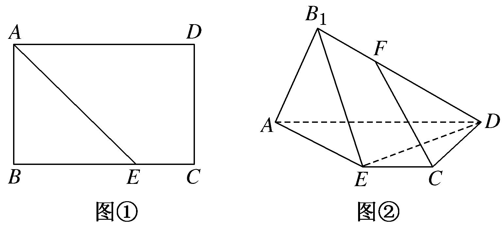
解析　法一：（1）依题意得，在矩形*ABCD*中，*AB*＝2，*BC*＝3，*BE*＝2*EC*，所以*AD*＝3，*EC*＝1．
如图③，在线段<em>B</em>1<em>A</em>上取一点<em>M</em>，满足<em>AM</em>＝2<em>MB</em>1，连接<em>MF</em>，<em>ME</em>，又<em>DF</em>＝2<em>FB</em>1，
所以＝，故*FM*∥*AD*，*FM*＝*AD*．又*EC*∥*AD*，所以*EC*∥*FM*，
因为*FM*＝*AD*＝1，所以*EC*＝*FM*，所以四边形*FMEC*为平行四边形，所以*CF*∥*EM*，
又<em>CF</em>⊄平面<em>B</em>1<em>AE</em>，<em>EM</em>⊂平面<em>B</em>1<em>AE</em>，所以<em>CF</em>∥平面<em>B</em>1<em>AE</em>．

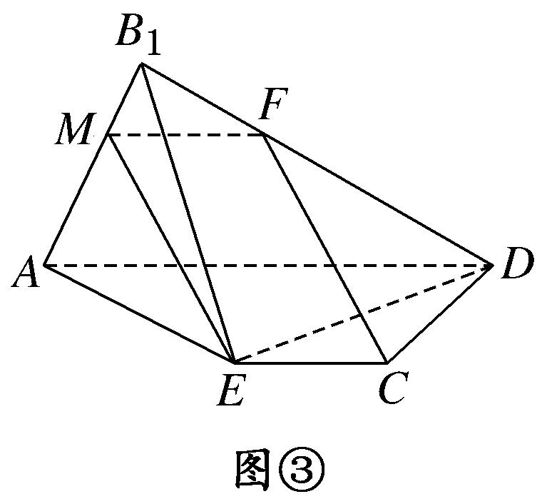

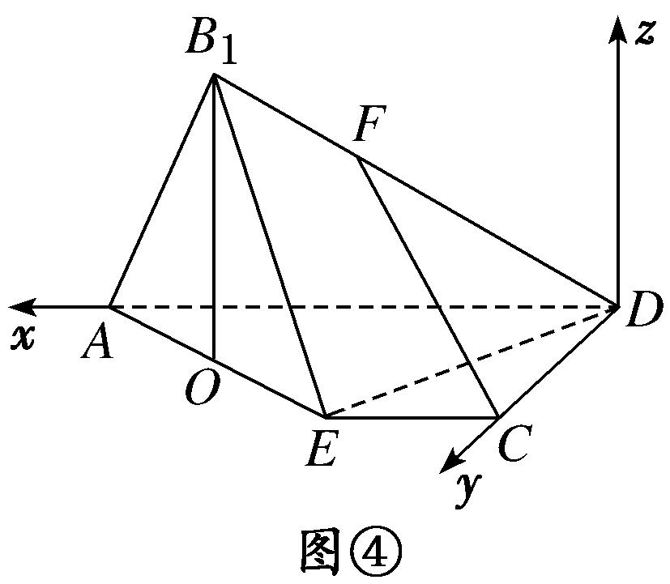  
（2）设<em>B</em>1到平面<em>AECD</em>的距离为 <em>h</em>，则<em>V</em>＝·<em>S</em>△<em>AED</em>·<em>h</em>，又<em>S</em>△<em>AED</em>＝3，
所以<em>V</em>＝<em>h</em>，故要使三棱锥<em>B</em>1－<em>AED</em>的体积取到最大值，须且仅需<em>h</em>取到最大值．
如图④，取<em>AE</em>的中点<em>O</em>，连接<em>B</em>1<em>O</em>，依题意得<em>B</em>1<em>O</em>⊥<em>AE</em>，则<em>h</em>≤<em>B</em>1<em>O</em>＝，
因为平面<em>B</em>1<em>AE</em>∩平面<em>AECD</em>＝<em>AE</em>，<em>B</em>1<em>O</em>⊥<em>AE</em>，<em>B</em>1<em>O</em>⊂平面<em>B</em>1<em>AE</em>，
故当平面<em>B</em>1<em>AE</em>⊥平面<em>AECD</em>时，<em>B</em>1<em>O</em>⊥平面<em>AECD</em>，<em>h</em>＝<em>B</em>1<em>O</em>．
即当且仅当平面<em>B</em>1<em>AE</em>⊥平面<em>AECD</em>时，<em>V</em>取得最大值，此时<em>h</em>＝．

以<em>D</em>为坐标原点，，的方向分别为<em>x</em>轴，<em>y</em>轴的正方向建立空间直角坐标系<em>D</em>－<em>xyz</em>，则<em>D</em>(0，0，0)，<em>E</em>(1，2，0)，<em>B</em>1(2，1，)，＝(2，1，)，＝(1，2，0)，
设<em><strong>n</strong></em>＝(<em>x</em>，<em>y</em>，<em>z</em>)是平面<em>B</em>1<em>ED</em>的法向量，则
得令<em>y</em>＝1，得<em><strong>n</strong></em>＝，
又平面<em>CDE</em>的一个法向量为<em><strong>m</strong></em>＝(0，0，1)，
所以cos<*m*，*n*>＝＝＝．
因为<em>B</em>1－<em>DE</em>－<em>C</em>为钝角，所以其余弦值等于－．

法二：（1）依题意，在线段*AD*上取一点*Q*，使得*DQ*＝*DA*，连接*FQ*，*CQ*，如图⑤，
因为<em>DF</em>＝2<em>FB</em>1，所以＝，所以<em>FQ</em>∥<em>B</em>1<em>A</em>，
因为<em>FQ</em>⊄平面<em>B</em>1<em>AE</em>，<em>B</em>1<em>A</em>⊂平面<em>B</em>1<em>AE</em>，所以<em>FQ</em>∥平面<em>B</em>1<em>AE</em>，
在矩形*ABCD*中，*AD*＝*BC*，*BE*＝2*EC*，所以*EC*＝*BC*＝*AD*＝*AQ*，
又*AQ*∥*EC*，所以四边形*QAEC*为平行四边形，故*QC*∥*AE*，
又<em>CQ</em>⊄平面<em>B</em>1<em>AE</em>，<em>AE</em>⊂平面<em>B</em>1<em>AE</em>，所以<em>CQ</em>∥平面<em>B</em>1<em>AE</em>．
又<em>CQ</em>∩<em>FQ</em>＝<em>Q</em>，所以平面<em>QCF</em>∥平面<em>B</em>1<em>AE</em>，又<em>CF</em>⊂平面<em>QCF</em>，所以<em>CF</em>∥平面<em>B</em>1<em>AE</em>．

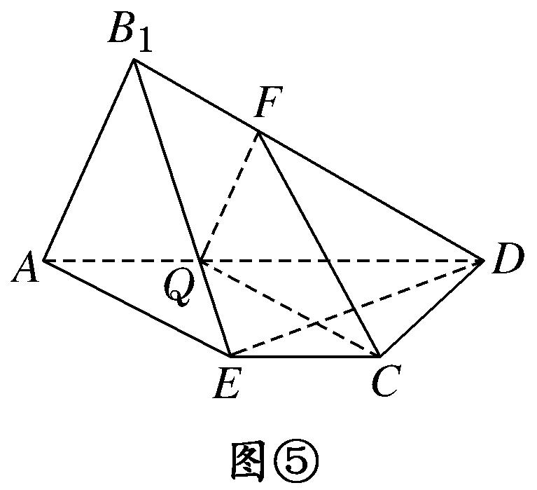

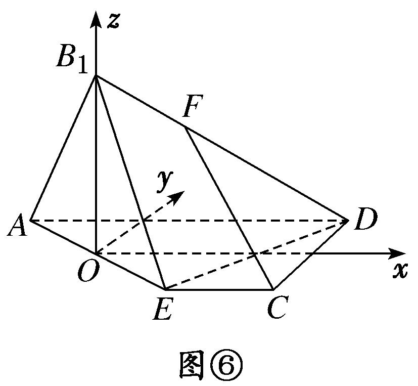  
（2）设<em>B</em>1到平面<em>AECD</em>的距离为<em>h</em>，则<em>V</em>＝·<em>S</em>△<em>AED</em>·<em>h</em>，又<em>S</em>△<em>AED</em>＝3．
所以<em>V</em>＝<em>h</em>，故要使三棱锥<em>B</em>1－<em>AED</em>的体积取到最大值，须且仅需<em>h</em>取到最大值．
如图⑥，取<em>AE</em>的中点<em>O</em>，连接<em>B</em>1<em>O</em>，依题意得<em>B</em>1<em>O</em>⊥<em>AE</em>，则<em>h</em>≤<em>B</em>1<em>O</em>＝．
因为平面<em>B</em>1<em>AE</em>∩平面<em>AECD</em>＝<em>AE</em>，<em>B</em>1<em>O</em>⊥<em>AE</em>，<em>B</em>1<em>O</em>⊂平面<em>B</em>1<em>AE</em>，
故当平面<em>B</em>1<em>AE</em>⊥平面<em>AECD</em>时，<em>B</em>1<em>O</em>⊥平面<em>AECD</em>，<em>h</em>＝<em>B</em>1<em>O</em>．
即当且仅当平面<em>B</em>1<em>AE</em>⊥平面<em>AECD</em>时，<em>V</em>取得最大值，此时<em>h</em>＝．

以<em>O</em>为坐标原点，，的方向分别为<em>x</em>轴，<em>y</em>轴的正方向建立空间直角坐标系<em>O</em>－<em>xyz</em>，则<em>B</em>1(0，0，)，<em>D</em>(2，1，0)，<em>E</em>(1，－1，0)，所以＝(－1，1，)，＝(1，2，0)，
设<em><strong>n</strong></em>＝(<em>x</em>，<em>y</em>，<em>z</em>)是平面<em>B</em>1<em>ED</em>的法向量，则
得令<em>y</em>＝－1，得<em><strong>n</strong></em>＝，
又平面<em>CDE</em>的一个法向量为<em><strong>m</strong></em>＝(0，0，1)，
所以cos<*m*，*n*>＝＝＝，
因为<em>B</em>1－<em>DE</em>－<em>C</em>为钝角，所以其余弦值等于－．

【对点训练】

1．已知三棱锥*M*－*ABC*，*MA*＝*MB*＝*MC*＝*AC*＝2，*AB*＝*BC*＝2，*O*为*AC*的中点，点*N*在边*BC*上，

且＝．  
（1）求证：*BO*⊥平面*AMC*；  
（2）求二面角*N*－*AM*－*C*的正弦值．

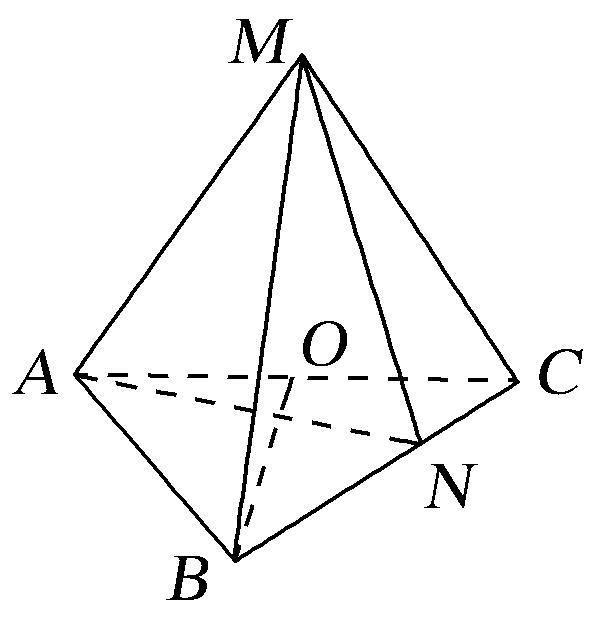

1．解析　（1）连接*OM*．在△*ABC*中，∵*AB*＝*BC*＝2，*AC*＝2，∴∠*ABC*＝90°，*BO*＝，*OB*⊥*AC*．
在△*MAC*中，∵*MA*＝*MC*＝*AC*＝2，*O*为*AC*的中点，∴*OM*⊥*AC*，且*OM*＝．
在△<em>MOB</em>中，∵<em>BO</em>＝，<em>OM</em>＝，<em>MB</em>＝2，∴<em>BO</em>2＋<em>OM</em>2＝<em>MB</em>2，∴<em>OB</em>⊥<em>OM</em>．
∵*AC*∩*OM*＝*O*，*AC*⊂平面*AMC*，*OM*⊂平面*AMC*，∴*OB*⊥平面*AMC*．  
（2）由（1）知*OB*，*OC*，*OM*两两垂直，以点*O*为坐标原点，分别以*OB*，*OC*，*OM*所在直线为*x*轴，*y*轴，*z*轴建立空间直角坐标系*O*－*xyz*，如图．

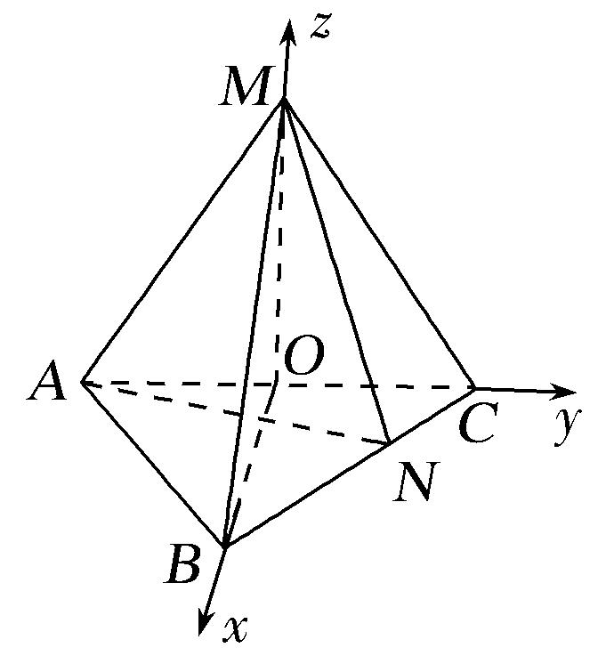
∵*MA*＝*MB*＝*MC*＝*AC*＝2，*AB*＝*BC*＝2，
∴*A*(0，－，0)，*B*(，0，0)，*M*(0，0，)，*C*(0，，0)．∵＝，∴*N*，
∴＝，＝(0，，)，＝(，0，0)．
设平面<em>MAN</em>的法向量为<em><strong>n</strong></em>＝(<em>x</em>，<em>y</em>，<em>z</em>)，则
令<em>y</em>＝，则<em>z</em>＝－1，<em>x</em>＝－5，得<em><strong>n</strong></em>＝(－5，，－1)．
∵*BO*⊥平面*AMC*，∴＝(，0，0)为平面*AMC*的一个法向量．
∴*n*＝(－5，，－1)与＝(，0，0)所成角的余弦值cos <*n*，>＝＝．
∴所求二面角的正弦值为＝＝．

2．如图所示，在四面体*ABCD*中，*AD*⊥*AB*，平面*ABD*⊥平面*ABC*，*AB*＝*BC*＝*AC*，且*AD*＋*BC*＝4．  
（1）证明：*BC*⊥平面*ABD*；  
（2）设*E*为棱*AC*的中点，当四面体*ABCD*的体积取得最大值时，求二面角*C*－*BD*－*E*的余弦值．

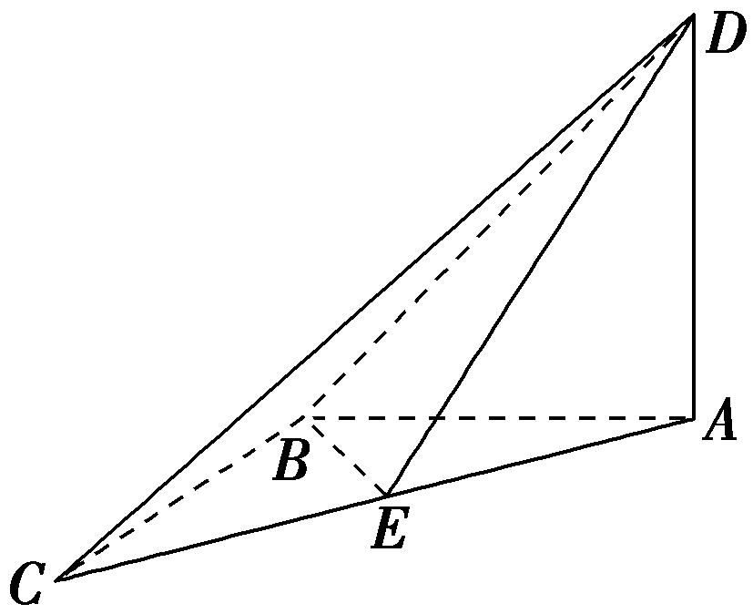

2．解析　（1）因为*AD*⊥*AB*，平面*ABD*⊥平面*ABC*，平面*ABD*∩平面*ABC*＝*AB*，*AD*⊂平面*ABD*，
所以*AD*⊥平面*ABC*，因为*BC*⊂平面*ABC*，所以*AD*⊥*BC*．
因为<em>AB</em>＝<em>BC</em>＝<em>AC</em>，所以<em>AB</em>2＋<em>BC</em>2＝<em>AC</em>2，所以<em>AB</em>⊥<em>BC</em>，
因为*AD*∩*AB*＝*A*，所以*BC*⊥平面*ABD*．

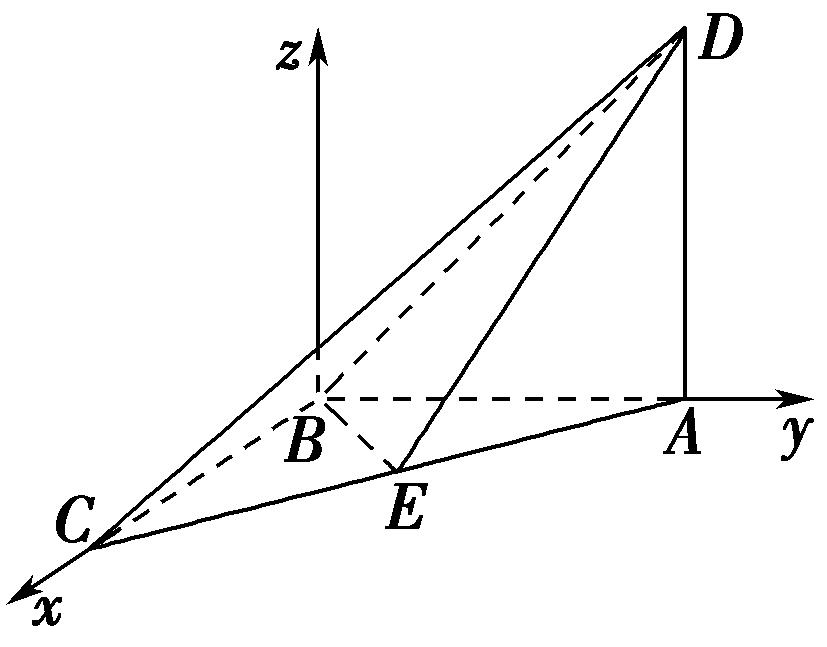  
（2）设*AD*＝*x*(0＜*x*＜4)，则*AB*＝*BC*＝4－*x*，四面体*ABCD*的体积

<em>V</em>＝<em>f</em>(<em>x</em>)＝<em>x</em>×(4－<em>x</em>)2＝(<em>x</em>3－8<em>x</em>2＋16<em>x</em>)(0＜<em>x</em>＜4)．

<em>f</em>′(<em>x</em>)＝(3<em>x</em>2－16<em>x</em>＋16)＝(<em>x</em>－4)(3<em>x</em>－4)，
当0＜*x*＜时，*f*′(*x*)＞0，*V*＝*f*(*x*)单调递增；当＜*x*＜4时，*f*′(*x*)＜0，*V*＝*f*(*x*)单调递减．
故当*AD*＝*x*＝时，四面体*ABCD*的体积取得最大值．

以*B*为坐标原点，建立空间直角坐标系*B*－*xyz*，
则*B*(0，0，0)，*A*，*C*，*D*，*E*．
设平面<em>BCD</em>的法向量为<em><strong>n</strong></em>＝(<em>x</em>，<em>y</em>，<em>z</em>)，则，即
令<em>z</em>＝－2，得<em><strong>n</strong></em>＝(0，1，－2)，
同理可得平面<em>BDE</em>的一个法向量为<em><strong>m</strong></em>＝(1，－1，2)，
则cos<*m*，*n*>＝＝＝－．
由图可知，二面角*C*－*BD*－*E*为锐角，故二面角*C*－*BD*－*E*的余弦值为．

3．(2021·全国乙)如图，四棱锥*P*—*ABCD*的底面是矩形，*PD*⊥底面*ABCD*，*PD*＝*DC*＝1，*M*为*BC*的

中点，且*PB*⊥*AM*．  
（1）求*BC*；  
（2）求二面角*A*－*PM*－*B*的正弦值．

3．解析　（1）连结*BD*，因为*PD*⊥底面*ABCD*，且*AM*⊂平面*ABCD*，
则*AM*⊥*PD*，又*AM*⊥*PB*，*PB*∩*PD*＝*P*，*PB*，*PD*⊂平面*PBD*，
所以*AM*⊥平面*PBD*，又*BD*⊂平面*PBD*，则*AM*⊥*BD*，
所以∠*ABD*＋∠*DAM*＝90°，又∠*DAM*＋∠*MAB*＝90°，
则有∠*ADB*＝∠*MAB*，所以Rt△*DAB*∽Rt△*ABM*，
则＝ ，所以<em>BC</em>2＝1，解得<em>BC</em>＝．

  
（2）因为*DA*，*DC*，*DP*两两垂直，故以点*D*位坐标原点建立空间直角坐标系如图所示，
则*A*(，0，0)，*B*(，1，0)，*M*(，1，0)，*P*(0，0，1)．
所以＝(－，0，1)，＝(－，1，0)，＝(－，0，0)．＝(－，－1，1)
设平面<em>AMP</em>的法向量为<em><strong>n</strong></em>＝(<em>x</em>，<em>y</em>，<em>z</em>)，则有，即
令<em>x</em>＝，则<em>y</em>＝1，<em>z</em>＝2，故<em><strong>n</strong></em>＝(，1，2)，
设平面<em>BMP</em>的法向量为<em><strong>m</strong></em>＝(<em>p</em>，<em>q</em>，<em>r</em>)，则有，即
令<em>q</em>＝1，则<em>r</em>＝1，故<em><strong>m</strong></em>＝(0，1，1)，
所以cos<*n*，*m*>＝＝＝．
设二面角*A*－*PM*－*B*的平面角为*α*，则sin*α*＝
所以二面角*A*－*PM*－*B*的正弦值为．

4．如图，在四棱锥*P*－*ABCD*中，底面*ABCD*为菱形，∠*BAD*＝60°，∠*APD*＝90°，且*AD*＝*PB．*  
（1）求证：平面*PAD*⊥平面*ABCD*；  
（2）若*AD*⊥*PB*，求二面角*D*－*PB*－*C*的余弦值．

4．解析　（1）如图，取*AD*的中点*O*，连接*OP*，*OB*，*BD*，
因为底面*ABCD*为菱形，∠*BAD*＝60°，所以*AD*＝*AB*＝*BD*．
因为*O*为*AD*的中点，所以*OB*⊥*AD*．
在△*APD*中，∠*APD*＝90°，*O*为*AD*的中点，所以*PO*＝*AD*＝*AO*．
设*AD*＝*PB*＝2*a*，则*OB*＝*a*，*PO*＝*OA*＝*a*，
因为<em>PO</em>2＋<em>OB</em>2＝<em>a</em>2＋3<em>a</em>2＝4<em>a</em>2＝<em>PB</em>2，所以<em>OP</em>⊥<em>OB．</em>
因为*OP*∩*AD*＝*O*，*OP*⊂平面*PAD*，*AD*⊂平面*PAD*，所以*OB*⊥平面*PAD*．
因为*OB*⊂平面*ABCD*，所以平面*PAD*⊥平面*ABCD*．

  
（2）因为*AD*⊥*PB*，*AD*⊥*OB*，*OB*∩*PB*＝*B*，*PB*⊂平面*POB*，*OB*⊂平面*POB*，
所以*AD*⊥平面*POB．* 所以*PO*⊥*AD*．由（1）得*PO*⊥*OB*，*AD*⊥*OB*，
所以*OA*，*OB*，*OP*所在的直线两两互相垂直．

以*O*为坐标原点，*OA*，*OB*，*OP*所在直线分别为*x*轴、*y*轴、*z*轴建立如图所示的空间直角坐标系．

设*AD*＝2，则*A*(1，0，0)，*D*(－1，0，0)，*B*(0，，0)，*P*(0，0，1)，
所以＝(－1，0，－1)，＝(0，，－1)，＝＝(－2，0，0)，
设平面<em>PBD</em>的法向量为<em><strong>n</strong></em>＝(<em>x</em>1，<em>y</em>1，<em>z</em>1)，则
令<em>y</em>1＝1，则<em>x</em>1＝－，<em>z</em>1＝，所以<em><strong>n</strong></em>＝(－，1，)．
设平面<em>PBC</em>的法向量为<em><strong>m</strong></em>＝(<em>x</em>2，<em>y</em>2，<em>z</em>2)，则
令<em>y</em>2＝1，则<em>x</em>2＝0，<em>z</em>2＝，所以<em><strong>m</strong></em>＝(0，1，)．
设二面角<em>D</em>－<em>PB</em>－<em>C</em>的大小为<em>θ</em>，由于<em>θ</em>为锐角，所以cos<em>θ</em>＝|cos&lt;<em><strong>m</strong></em>，<em><strong>n</strong></em>&gt;|＝＝．
所以二面角*D*－*PB*－*C*的余弦值为．

5．如图，在四棱锥*P*－*ABCD*中，*PA*⊥底面*ABCD*，*AD*⊥*AB*，*AB*∥*DC*，*AD*＝*DC*＝*AP*＝2，*AB*＝1，点

*E*为棱*PC*的中点．  
（1）求证：*BE*⊥*DC*；  
（2）若*F*为棱*PC*上一点，满足*BF*⊥*AC*，求平面*FAB*与平面*ABP*夹角的余弦值．

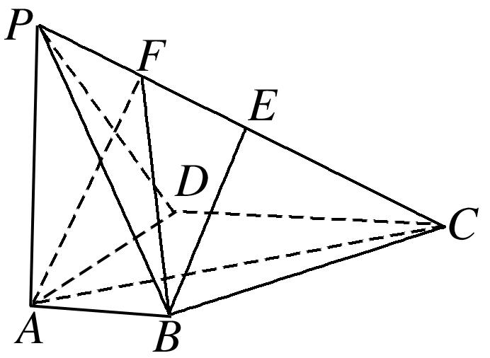

5．解析　（1）依题意，以点*A*为坐标原点建立空间直角坐标系(如图)，
可得*A*(0，0，0)，*B*(1，0，0)，*C*(2，2，0)，*D*(0，2，0)，*P*(0，0，2)．
由*E*为棱*PC*的中点，得*E*(1，1，1)，所以＝(0，1，1)，＝(2，0，0)，
故·＝0，所以*BE*⊥*DC*．

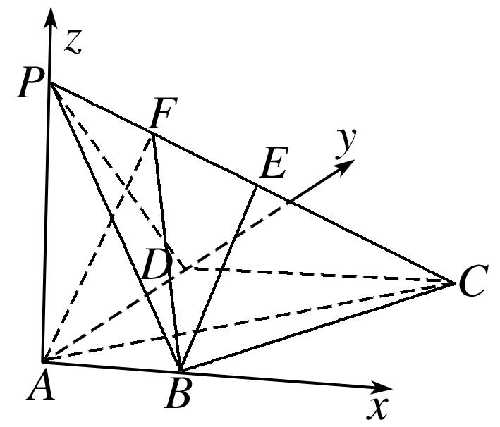  
（2）＝(1，2，0)，＝(－2，－2，2)，＝(2，2，0)，＝(1，0，0)．
由点*F*在棱*PC*上，设＝*λ*(0≤*λ*≤1)，
故＝＋＝＋*λ*＝(1－2*λ*，2－2*λ*，2*λ*)．由*BF*⊥*AC*，得·＝0，
因此2(1－2*λ*)＋2(2－2*λ*)＝0，解得*λ*＝，即＝．
设<em><strong>n</strong></em>1＝(<em>x</em>，<em>y</em>，<em>z</em>)为平面<em>FAB</em>的法向量，则即
不妨令<em>z</em>＝1，可得<em><strong>n</strong></em>1＝(0，－3，1)为平面<em>FAB</em>的一个法向量．

易知向量<em><strong>n</strong></em>2＝(0，1，0)为平面<em>ABP</em>的一个法向量，
则cos&lt;<em><strong>n</strong></em>1，<em><strong>n</strong></em>2&gt;＝＝＝－．
所以平面*FAB*与平面*ABP*夹角的余弦值为．

6．如图，已知四棱锥*P*－*ABCD*，底面*ABCD*是直角梯形，*AD*∥*BC*，∠*BCD*＝90°，*PA*⊥底面*ABCD*，△

*ABM*是边长为2的等边三角形，*PA*＝*DM*＝2．  
（1）求证：平面*PAM*⊥平面*PDM*；  
（2）若*E*为*PC*的中点，求二面角*P*－*MD*－*E*的余弦值．

6．解析　（1）∵△*ABM*是边长为2的等边三角形，底面*ABCD*是直角梯形，∴*CD*＝，
又<em>DM</em>＝2，∴<em>CM</em>＝3，∴<em>AD</em>＝3＋1＝4，∴<em>AD</em>2＝<em>DM</em>2＋<em>AM</em>2，∴<em>DM</em>⊥<em>AM</em>．
又*PA*⊥底面*ABCD*，∴*DM*⊥*PA*，又*AM*∩*PA*＝*A*，∴*DM*⊥平面*PAM*，
∵*DM*⊂平面*PDM*，∴平面*PAM*⊥平面*PDM*．  
（2）以*D*为坐标原点，*DC*所在直线为*x*轴，*DA*所在直线为*y*轴，过*D*且与*PA*平行的直线为*z*轴，建立空间直角坐标系*Dxyz*，

则*D*(0，0，0)，*C*(，0，0)，*M*(，3，0)，*P*(0，4，2)，

＝(，3，0)，＝(0，4，2)，
设平面<em>PMD</em>的法向量为<em><strong>n</strong></em>1＝(<em>x</em>1，<em>y</em>1，<em>z</em>1)，则取<em>x</em>1＝3，∴<em><strong>n</strong></em>1＝(3，－，2)．
∵*E*为*PC*的中点，则*E*，＝，
设平面<em>MDE</em>的法向量为<em><strong>n</strong></em>2＝(<em>x</em>2，<em>y</em>2，<em>z</em>2)，则取<em>x</em>2＝3，∴<em><strong>n</strong></em>2＝．
设二面角*P*－*MD*－*E*的平面角为*θ*，由cos*θ*＝＝，
∴二面角*P*－*MD*－*E*的余弦值为．

7．已知矩形*ABCD*中，*AB*＝2，*AD*＝3，在*AD*上取一点*E*满足2*AE*＝*ED*．现将△*CDE*沿*CE*折起使点

*D*移动至*P*点处，使得*PA*＝*PB*．  
（1）求证：平面*PCE*⊥平面*ABCE*；  
（2）求二面角*B*－*PA*－*E*的余弦值．

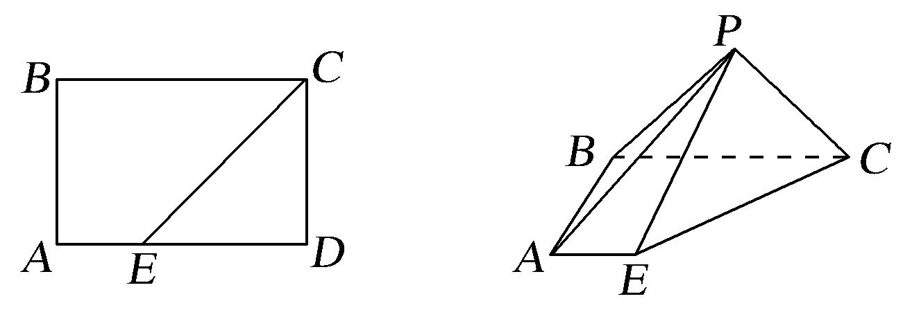

7．解析　（1）依题意得：*PE*＝*PC*＝2，分别取线段*AB*，*CE*的中点*O*，*M*，连接△*POM*的三边(如图)．

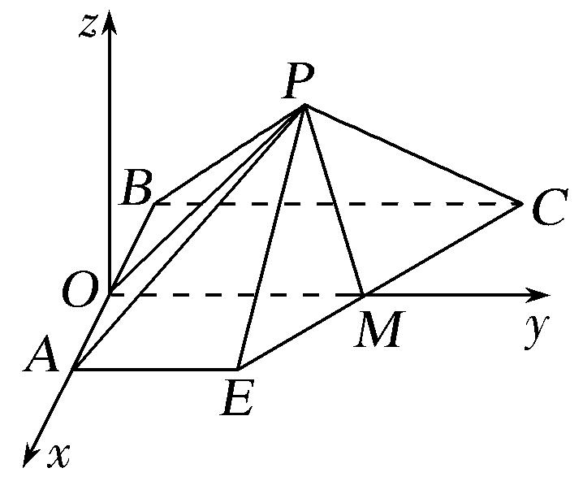
则*PM*⊥*CE*，由*PA*＝*PB*，得*PO*⊥*AB*，①
又*OM*为梯形*ABCE*的中位线，∴*OM*∥*BC*，由*BC*⊥*AB*，得*OM*⊥*AB*，②
又*PO*∩*OM*＝*O*，从而*AB*⊥平面*POM*，则*AB*⊥*PM*．
在平面*ABCE*中，*AB*与*CE*相交．∴*PM*⊥平面*ABCE*，故平面*PCE*⊥平面*ABCE*．  
（2）过点*O*作*PM*平行线为*z*轴，分别以*OA*，*OM*为*x*，*y*轴建立空间直角坐标系．
则*A*(1，0，0)，*B*(－1，0，0)，*E*(1，1，0)，*P*(0，2，)，
∴＝(1，－2，－)，＝(2，0，0)，＝(0，1，0)，
设<em><strong>n</strong></em>＝(<em>x</em>，<em>y</em>，<em>z</em>)为平面<em>PAB</em>的法向量，则即令<em>y</em>＝1，得<em><strong>n</strong></em>＝(0，1，－)，

同理：平面<em>PAE</em>的法向量<em><strong>m</strong></em>＝(，0，1)，
∴cos&lt;<em><strong>m</strong></em>，<em><strong>n</strong></em>&gt;＝＝－，根据图形知二面角<em>B</em>－<em>PA</em>－<em>E</em>为钝角，
∴二面角*B*－*PA*－*E*的余弦值为－．

8．如图，已知△*ABC*为等边三角形，△*ABD*为等腰直角三角形，*AB*⊥*BD*．平面*ABC*⊥平面*ABD*，点*E*

与点*D*在平面*ABC*的同侧，且*CE*∥*BD*，*BD*＝2*CE*．点*F*为*AD*的中点，连接*EF*．  
（1）求证：*EF*∥平面*ABC*；  
（2）求二面角*C*－*AE*－*D*的余弦值．

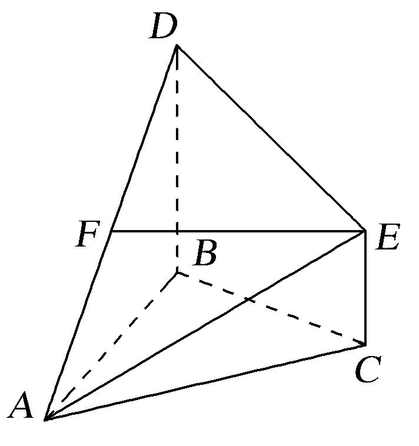

8．解析　（1）取*AB*的中点为*O*，连接*OC*，*OF*，如图．

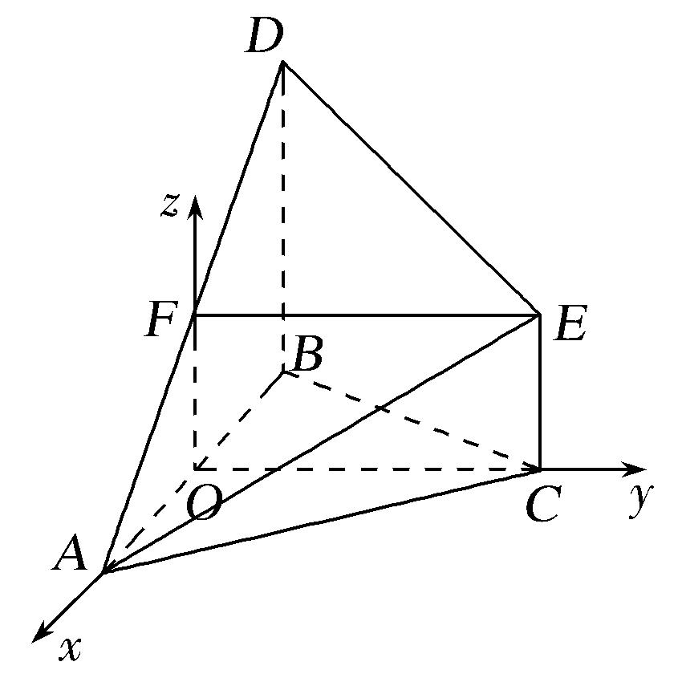
∵*O*，*F*分别为*AB*，*AD*的中点，∴*OF*∥*BD*且*BD*＝2*OF*．
又*CE*∥*BD*且*BD*＝2*CE*，∴*CE*∥*OF*且*CE*＝*OF*，

∴*OFEC*，则四边形*OCEF*为平行四边形，∴*EF*∥*OC*．
又*OC*⊂平面*ABC*，*EF*⊄平面*ABC*，∴*EF*∥平面*ABC*．  
（2）∵△*ABC*为等边三角形，*O*为*AB*的中点，∴*OC*⊥*AB*．
∵平面*ABC*⊥平面*ABD*，平面*ABC*∩平面*ABD*＝*AB*，*BD*⊥*AB*，*BD*⊂平面*ABD*，
∴*BD*⊥平面*ABC*．又*OF*∥*BD*，∴*OF*⊥平面*ABC*．

以*O*为坐标原点，分别以*OA*，*OC*，*OF*所在的直线为*x*轴，*y*轴，*z*轴，

建立如图所示的空间直角坐标系．不妨令正三角形*ABC*的边长为2，
则*O*(0，0，0)，*A*(1，0，0)，*C*(0，，0)，*E*(0，，1)，*D*(－1，0，2)，
∴＝(－1，，0)，＝(－1，，1)，＝(－2，0，2)．
设平面<em>AEC</em>的法向量为<em><strong>m</strong></em>＝(<em>x</em>1，<em>y</em>1，<em>z</em>1)，则
不妨令<em>y</em>1＝，则<em><strong>m</strong></em>＝(3，，0)．
设平面<em>AED</em>的法向量为<em><strong>n</strong></em>＝(<em>x</em>2，<em>y</em>2，<em>z</em>2)，则
令<em>z</em>2＝1，得<em><strong>n</strong></em>＝(1，0，1)．
∴cos&lt;<em><strong>m</strong></em>，<em><strong>n</strong></em>&gt;＝＝．由图易知二面角<em>C</em>－<em>AE</em>－<em>D</em>为钝角，
∴二面角*C*－*AE*－*D*的余弦值为－．

9．如图，在四棱锥*P*－*ABCD*中，底面*ABCD*为直角梯形，*AD*∥*BC*，∠*ADC*＝90°，平面*PAD*⊥底面*ABCD*，

*Q*为*AD*的中点，*M*是棱*PC*上的点，*PA*＝*PD*＝2，*BC*＝*AD*＝1，*CD*＝．  
（1）求证：平面*PBC*⊥平面*PQB*；  
（2）当*PM*的长为何值时，平面*QMB*与平面*PDC*所成的锐二面角的大小为60°？

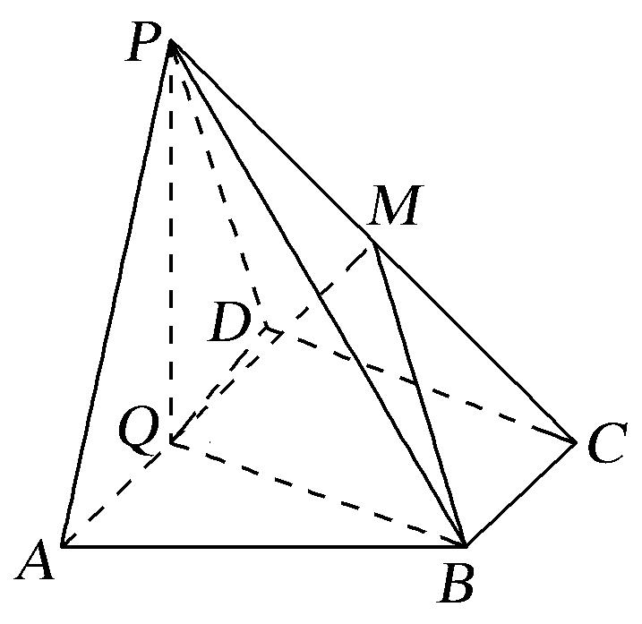

9．解析　（1）∵*AD*∥*BC*，*Q*为*AD*的中点，*BC*＝*AD*，∴*BC*∥*QD*，*BC*＝*QD*，
∴四边形*BCDQ*为平行四边形，∴*BQ*∥*CD*．∵∠*ADC*＝90°，∴*BC*⊥*BQ*．
∵*PA*＝*PD*，*AQ*＝*QD*，∴*PQ*⊥*AD*．
又∵平面*PAD*⊥平面*ABCD*，平面*PAD*∩平面*ABCD*＝*AD*，
∴*PQ*⊥平面*ABCD*，∴*PQ*⊥*BC*．又∵*PQ*∩*BQ*＝*Q*，∴*BC*⊥平面*PQB*．
∵*BC*⊂平面*PBC*，∴平面*PBC*⊥平面*PQB*．  
（2）由（1）可知*PQ*⊥平面*ABCD*．如图，以*Q*为原点，分别以*QA*，*QB*，*QP*所在直线为*x*轴、*y*轴、*z*轴，建立空间直角坐标系，则*Q*(0，0，0)，*D*(－1，0，0)，*P*(0，0，)，*B*(0，，0)，*C*(－1，，0)，

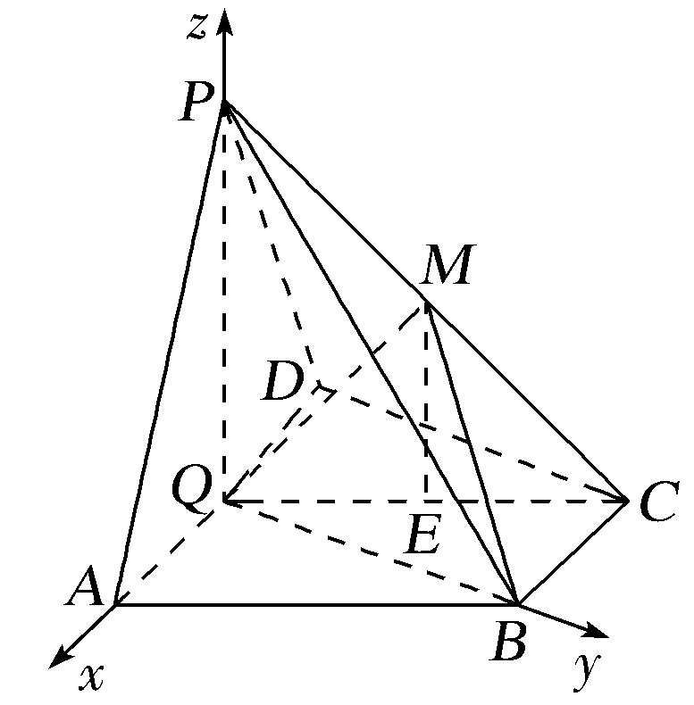
∴＝(0，，0)，＝(0，，0)，＝(1，0，)，＝(－1，，－)．
设＝*λ*，则＝(－*λ*，*λ*，－*λ*)，且0≤*λ*≤1，得*M*(－*λ*，*λ*，－*λ*)，
∴＝(－*λ*，*λ*，(1－*λ*))．
设平面<em>MBQ</em>的法向量为<em><strong>m</strong></em>＝(<em>x</em>，<em>y</em>，<em>z</em>)，则即
令*x*＝，则*y*＝0，*z*＝，
∴平面<em>MBQ</em>的一个法向量为<em><strong>m</strong></em>＝．
设平面<em>PDC</em>的法向量为<em><strong>n</strong></em>＝(<em>x</em>′，<em>y</em>′，<em>z</em>′)，则即
令<em>x</em>′＝3，则<em>y</em>′＝0，<em>z</em>′＝－，∴平面<em>PDC</em>的一个法向量为<em><strong>n</strong></em>＝(3，0，－)．
∴平面*QMB*与平面*PDC*所成的锐二面角的大小为60°，
∴cos 60°＝＝＝，∴*λ*＝．∴*PM*＝*PC*＝．

10．请从下面三个条件中任选一个，补充在下面的横线上，并作答．

①*AB*⊥*BC*，②*FC*与平面*ABCD*所成的角为，③∠*ABC*＝．
如图，在四棱锥*P－ABCD*中，底面*ABCD*是菱形，*PA*⊥平面*ABCD*，且*PA*＝*AB*＝2，*PD*的中点为

*F*．  
（1）在线面*AB*上是否存在一点*G*，使得*AF*∥平面*PCG*？若存在，指出*G*在*AB*上的位置并给以证明；若不存在，请说明理由．  
（2）若\_\_\_\_\_\_\_\_，求二面角*F－AC－D*的余弦值．

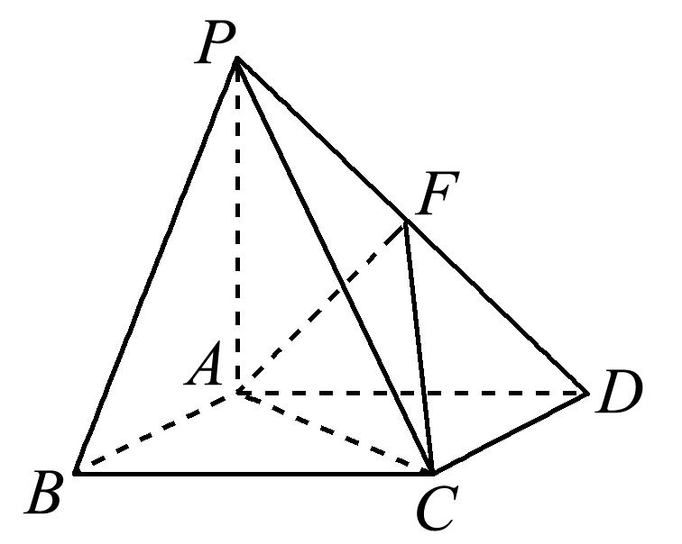

10．解析　（1）在线段*AB*上存在点*G*，使得*AF*∥平面*PCG*，且*G*为*AB*的中点．
证明如下：设*PC*的中点为*H*，连接*FH*，*GH*，如图，易证四边形*AGHF*为平行四边形，则*AF*∥*GH*．

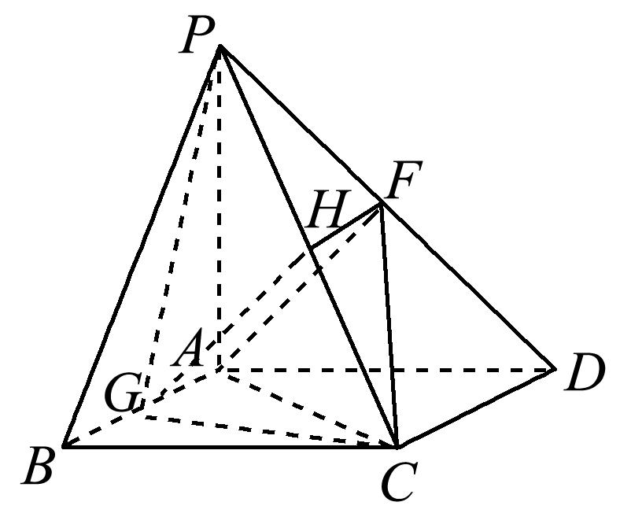
又*GH*⊂平面*PCG*，*AF*⊄平面*PGC*，所以*AF*∥平面*PGC．*  
（2）选择①．
因为*PA*⊥平面*ABCD*，所以*PA*⊥*AB*，*PA*⊥*AD．* 由题意可知，*AB*，*AD*，*AP*两两垂直，
故以*A*为坐标原点，，，的方向分别为*x*，*y*，*z*轴的正方向建立如图所示的空间直角坐标系．

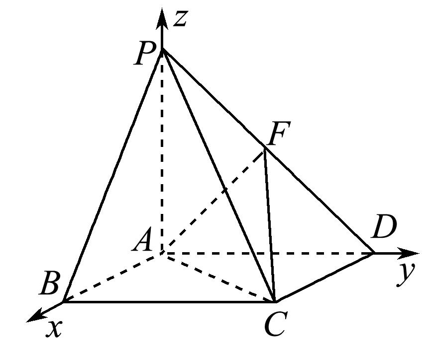
因为*PA*＝*AB*＝2，所以*A*(0，0，0)，*C*(2，2，0)，*D*(0，2，0)，*P*(0，0，2)，*F* (0，1，1)，
所以＝(0，1，1)，＝(－2，－1，1)．
设平面<em>FAC</em>的法向量为<em><strong>u</strong></em>＝(<em>x</em>，<em>y</em>，<em>z</em>)，则即
令<em>y</em>＝1，则<em>x</em>＝－1，<em>z</em>＝－1，则<em><strong>u</strong></em>＝(－1，1，－1)．

易知平面<em>ACD</em>的一个法向量为<em><strong>v</strong></em>＝(0，0，2)，
设二面角*F－AC－D*的平面角为*θ*，则cos *θ*＝＝，即二面角*F－AC－D*的余弦值为．

选择②．
设*BC*中点*E*，连接*AE*，取*AD*的中点*M*，连接*FM*，*CM*，则*FM*∥*PA*，且*FM*＝1．
因为*PA*⊥平面*ABCD*，所以*FM*⊥平面*ABCD*，*FC*与平面*ABCD*所成的角为∠*FCM*，
故∠<em>FCM</em>＝．在直角三角形<em>FCM</em>中，<em>CM</em>＝．又因为<em>CM</em>＝<em>AE</em>，所以<em>AE</em>2＋<em>BE</em>2＝<em>AB</em>2，
所以*BC*⊥*AE*，所以*AE*，*AD*，*AP*两两垂直．
故以*A*为坐标原点，，，的方向分别为*x*，*y*，*z*轴的正方向建立如图所示的空间直角坐标系．

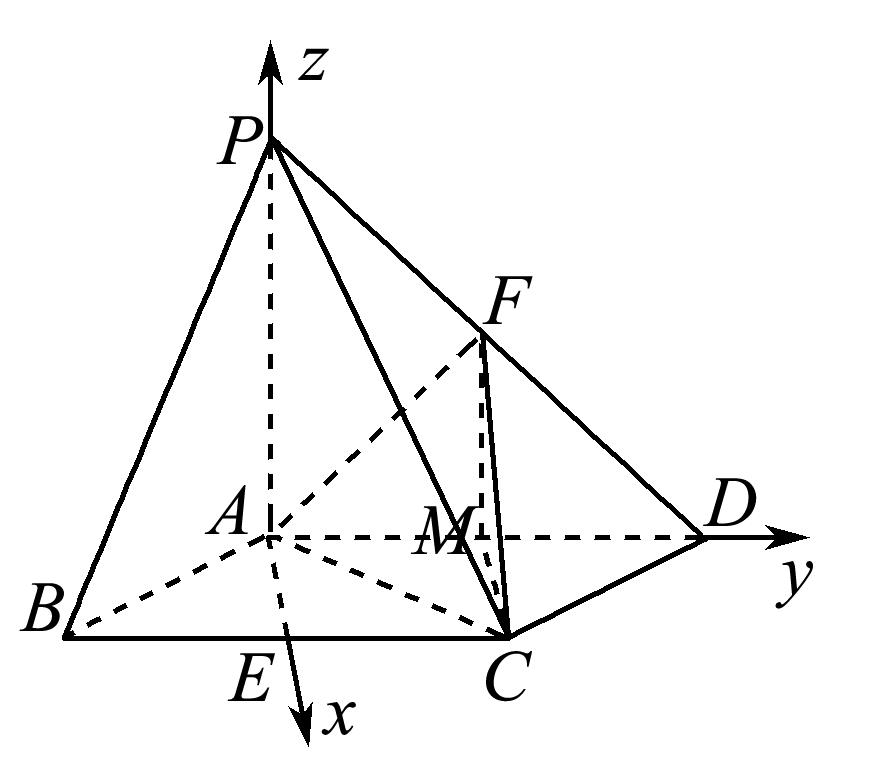
因为*PA*＝*AB*＝2，所以*A*(0，0，0)，*C*(，1，0)，*D*(0，2，0)，*P*(0，0，2)，*F*(0，1，1)，
所以＝(0，1，1)，＝(－，0，1)．
设平面<em>FAC</em>的法向量为<em><strong>u</strong></em>＝(<em>x</em>，<em>y</em>，<em>z</em>)，则即
令<em>x</em>＝，则<em>y</em>＝－3，<em>z</em>＝3，则<em><strong>u</strong></em>＝(，－3，3)．

易知平面<em>ACD</em>的一个法向量为<em><strong>v</strong></em>＝(0，0，2)．
设二面角*F－AC－D*的平面角为*θ*，则cos *θ*＝＝，即二面角*F－AC－D*的余弦值为．

选择③．
因为*PA*⊥平面*ABCD*，所以*PA*⊥*BC．* 取*BC*中点*E*，连接*AE*．
因为底面*ABCD*是菱形，∠*ABC*＝，所以△*ABC*是正三角形．
又*E*是*BC*的中点，所以*BC*⊥*AE*，所以*AE*，*AD*，*AP*两两垂直．
故以*A*为坐标原点，，，的方向分别为*x*，*y*，*z*轴的正方向建立如图所示的空间直角坐标系．

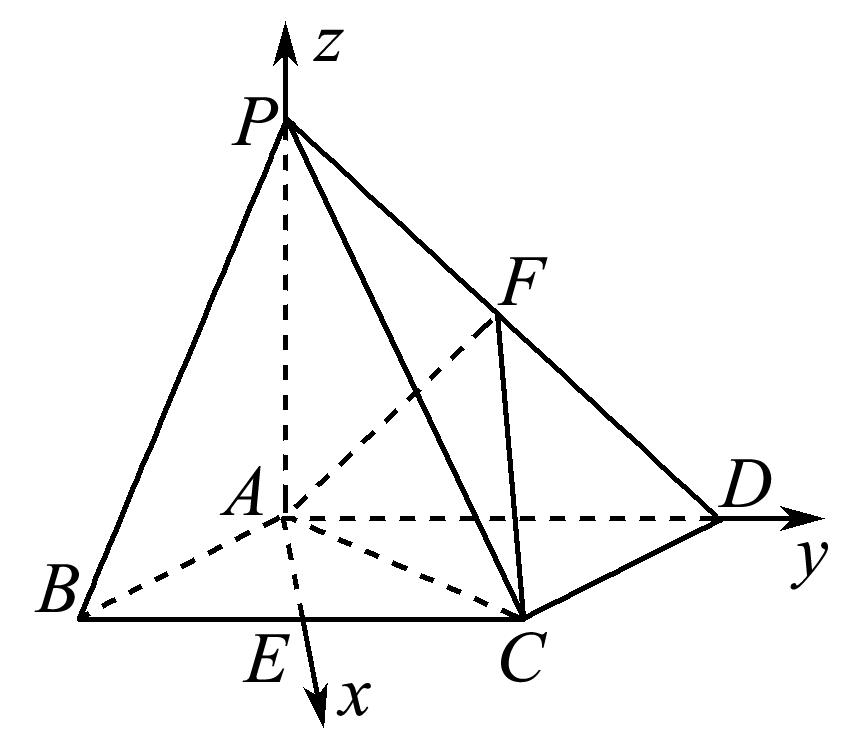
因为*PA*＝*AB*＝2，所以*A*(0，0，0)，*C*(，1，0)，*D*(0，2，0)，*P*(0，0，2)，*F*(0，1，1)，
所以＝(0，1，1)，＝(－，0，1)．
设平面<em>FAC</em>的法向量为<em><strong>u</strong></em>＝(<em>x</em>，<em>y</em>，<em>z</em>)，则即
令<em>x</em>＝，则<em>y</em>＝－3，<em>z</em>＝3，则<em><strong>u</strong></em>＝(，－3，3)．

易知平面<em>ACD</em>的一个法向量为<em><strong>v</strong></em>＝(0，0，2)，
设二面角*F－AC－D*的平面角为*θ*，则cos *θ*＝＝，即二面角*F－AC－D*的余弦值为．

考点三　不规则几何体模型

<strong>[例1]</strong>　(2018·全国Ⅲ)如图，边长为2的正方形<em>ABCD</em>所在的平面与半圆弧所在平面垂直，<em>M</em>是上异于<em>C</em>，<em>D</em>的点．  
（1）证明：平面*AMD*⊥平面*BMC*；  
（2）当三棱锥*M*－*ABC*体积最大时，求面*MAB*与面*MCD*所成二面角的正弦值．

解析　（1）由题设知，平面*CMD*⊥平面*ABCD*，交线为*CD*．
因为*BC*⊥*CD*，*BC*⊂平面*ABCD*，所以*BC*⊥平面*CMD*，故*BC*⊥*DM*．
因为*M*为上异于*C*，*D*的点，且*DC*为直径，所以*DM*⊥*CM*．
又*BC*∩*CM*＝*C*，所以*DM*⊥平面*BMC*．而*DM*⊂平面*AMD*，故平面*AMD*⊥平面*BMC*．  
（2）以*D*为坐标原点，的方向为*x*轴正方向，的方向为*y*轴正方向，建立如图所示的空间直角坐标系*Dxyz*．

当三棱锥*M*－*ABC*体积最大时，*M*为的中点．
由题设得*D*(0，0，0)，*A*(2，0，0)，*B*(2，2，0)，*C*(0，2，0)，*M*(0，1，1)，

＝(－2，1，1)，＝(0，2，0)，＝(2，0，0)．
设<em><strong>n</strong></em>＝(<em>x</em>，<em>y</em>，<em>z</em>)是平面<em>MAB</em>的法向量，则即可取<em><strong>n</strong></em>＝(1，0，2)．

是平面<em>MCD</em>的一个法向量，因此，cos&lt;<em><strong>n</strong></em>，&gt;＝＝，sin&lt;<em><strong>n</strong></em>，&gt;＝，
所以面*MAB*与面*MCD*所成二面角的正弦值是．

<strong>[例2]</strong>　如图，四边形<em>ABCD</em>是菱形，<em>EA</em>⊥平面<em>ABCD</em>，<em>EF</em>∥<em>AC</em>，<em>CF</em>∥平面<em>BDE</em>，<em>G</em>是<em>AB</em>的中点．  
（1）求证：*EG*∥平面*BCF*；  
（2）若*AE*＝*AB*，∠*BAD*＝60°，求二面角*A*－*BE*－*D*的余弦值．

解析　（1）设*AC*∩*BD*＝*O*，连接*OE*，*OF*，
∵*CF*∥平面*BDE*，*CF*⊂平面*AEFC*，平面*AEFC*∩平面*BDE*＝*OE*，∴*OE*∥*CF*，
又*EF*∥*AC*，∴四边形*EOCF*是平行四边形，∴*EF*＝*OC*．
∵四边形*ABCD*是菱形，∴*OA*＝*OC*，∴*EF*＝*OA*＝*OC*．
又*EF*∥*AC*，∴四边形*EFOA*是平行四边形，
∴*OF*∥*EA*，∵*EA*⊥平面*ABCD*，∴*OF*⊥平面*ABCD*．
设*OA*＝*a*，*OB*＝*b*，*AE*＝*c*，

以*O*为坐标原点，*OA*，*OB*，*OF*所在直线分别为*x*轴、*y*轴、*z*轴，建立空间直角坐标系，
则*E*(*a，* 0，*c*)，*G*，*B*(0，*b，* 0)，*C*(－*a，* 0，0)，*F*(0，0，*c*)，

＝(0，*b*，－*c*)，＝(－*a，* 0，－*c*)，＝，
设平面<em>BCF</em>的法向量为<em><strong>v</strong></em>＝(<em>x</em>，<em>y</em>，<em>z</em>)，则取<em>z</em>＝<em>b</em>，得<em><strong>v</strong></em>＝，
∵<em><strong>v</strong></em>·＝·＋·<em>c</em>＋(－<em>c</em>)·<em>b</em>＝0，又<em>EG</em>⊄平面<em>BCF</em>，∴<em>EG</em>∥平面<em>BCF</em>．  
（2）设*AE*＝*AB*＝2，∵∠*BAD*＝60°，∴*OB*＝1，*OA*＝，由（1）中建立的空间直角坐标系，
可得*A*(，0，0)，*B*(0，1，0)，*E*(，0，2)，*D*(0，－1，0)，
∴＝(，－1，2)，＝(，－1，0)，＝(0，－2，0)，
设平面<em>ABE</em>的法向量<em><strong>n</strong></em>＝(<em>x</em>1，<em>y</em>1，<em>z</em>1)，则取<em>x</em>1＝1，得<em><strong>n</strong></em>＝(1，，0)，
设平面<em>BDE</em>的法向量<em><strong>m</strong></em>＝(<em>x</em>2，<em>y</em>2，<em>z</em>2)，则取<em>x</em>2＝2，得<em><strong>m</strong></em>＝(2，0，－)，
设二面角*A*－*BE*－*D*的平面角为*θ*，则cos*θ*＝＝＝．
∴二面角*A*－*BE*－*D*的余弦值为．

<strong>[例3]</strong>　如图，在梯形<em>ABCD</em>中，<em>AB</em>∥<em>CD</em>，<em>AD</em>＝<em>DC</em>＝<em>CB</em>＝2，∠<em>ABC</em>＝60°，平面<em>ACEF</em>⊥平面<em>ABCD</em>，四边形<em>ACEF</em>是菱形，∠<em>CAF</em>＝60°．  
（1）求证：*BF*⊥*AE*；  
（2）求二面角*B*－*EF*－*D*的平面角的正切值．

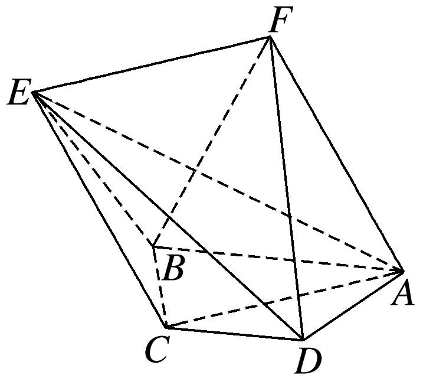
解析　（1）依题意，在等腰梯形<em>ABCD</em>中，<em>AC</em>＝2，<em>AB</em>＝4，∵<em>BC</em>＝2，∴<em>AC</em>2＋<em>BC</em>2＝<em>AB</em>2，即<em>BC</em>⊥<em>AC</em>，
又∵平面*ACEF*⊥平面*ABCD*，平面*ACEF*∩平面*ABCD*＝*AC*，*BC*⊂平面*ABCD*，
∴*BC*⊥平面*ACEF*，而*AE*⊂平面*ACEF*，∴*AE*⊥*BC*，

连接*CF*，∵四边形*ACEF*为菱形，∴*AE*⊥*FC*，

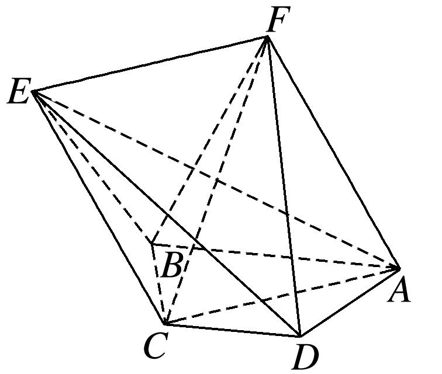
又∵*BC*∩*CF*＝*C*，*BC*，*CF*⊂平面*BCF*，∴*AE*⊥平面*BCF*，∵*BF*⊂平面*BCF*，∴*BF*⊥*AE*．  
（2）取*EF*的中点*M*，连接*MC*，

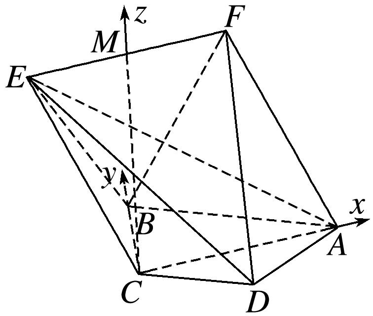
∵四边形*ACEF*是菱形，且∠*CAF*＝60°，∴由平面几何易知*MC*⊥*AC*，
又∵平面*ACEF*⊥平面*ABCD*，平面*ACEF*∩平面*ABCD*＝*AC*，*CM*⊂平面*ACEF*，∴*MC*⊥平面*ABCD*．

以*CA*，*CB*，*CM*所在直线分别为*x*，*y*，*z*轴建立空间直角坐标系，各点的坐标依次为*C*(0,0,0)，*A*(2，0，0)，*B*(0，2，0)，*D*(，－1，0)，*E*(－，0，3)，*F*(，0，3)，
设平面<em>BEF</em>和平面<em>DEF</em>的一个法向量分别为<em><strong>n</strong></em>1＝(<em>a</em>1，<em>b</em>1，<em>c</em>1)，<em><strong>n</strong></em>2＝(<em>a</em>2，<em>b</em>2，<em>c</em>2)，
∵＝(，－2，3)，＝(2，0，0)，
∴即即不妨令<em>b</em>1＝3，则<em><strong>n</strong></em>1＝(0，3，2)，

同理可求得<em><strong>n</strong></em>2＝(0，3，－1)，
设二面角*B*－*EF*－*D*的大小为*θ*，由图易知*θ*为锐角，
∴cos <em>θ</em>＝|cos&lt;<em><strong>n</strong></em>1，<em><strong>n</strong></em>2&gt;|＝＝，
故二面角*B*－*EF*－*D*的平面角的正切值为．

<strong>[例4]</strong>　如图，在梯形<em>ABCD</em>中，<em>AB</em>∥<em>CD</em>，<em>AD</em>＝<em>DC</em>＝<em>CB</em>＝1，∠<em>BCD</em>＝，四边形<em>BFED</em>为矩形，平面<em>BFED</em>⊥平面<em>ABCD</em>，<em>BF</em>＝1．  
（1）求证：*AD*⊥平面*BFED*；  
（2）点*P*在线段*EF*上运动，设平面*PAB*与平面*ADE*所成锐二面角为*θ*，试求*θ*的最小值．

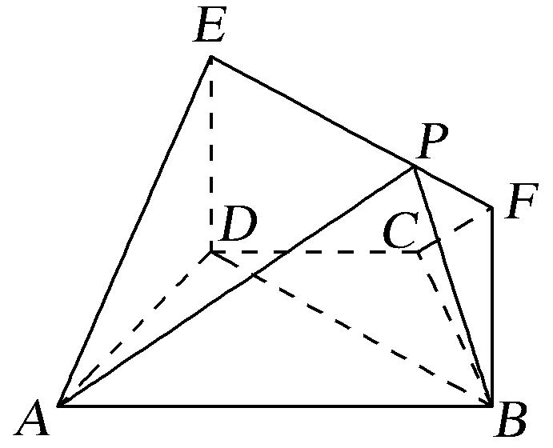
解析　（1）在梯形*ABCD*中，∵*AB*∥*CD*，*AD*＝*DC*＝*CB*＝1，∠*BCD*＝，
∴<em>AB</em>＝2，∴<em>BD</em>2＝<em>AB</em>2＋<em>AD</em>2－2<em>AB</em>·<em>AD</em>·cos ＝3．∴<em>AB</em>2＝<em>AD</em>2＋<em>BD</em>2，∴<em>AD</em>⊥<em>BD</em>．
∵平面*BFED*⊥平面*ABCD*，平面*BFED*∩平面*ABCD*＝*BD*，*DE*⊂平面*BFED*，*DE*⊥*DB*，
∴*DE*⊥平面*ABCD*，∴*DE*⊥*AD*，又*DE*∩*BD*＝*D*，∴*AD*⊥平面*BFED*．  
（2）由（1）可建立以点*D*为坐标原点，分别以直线*DA*，*DB*，*DE*为*x*轴，*y*轴，*z*轴的空间直角坐标系，如图所示．

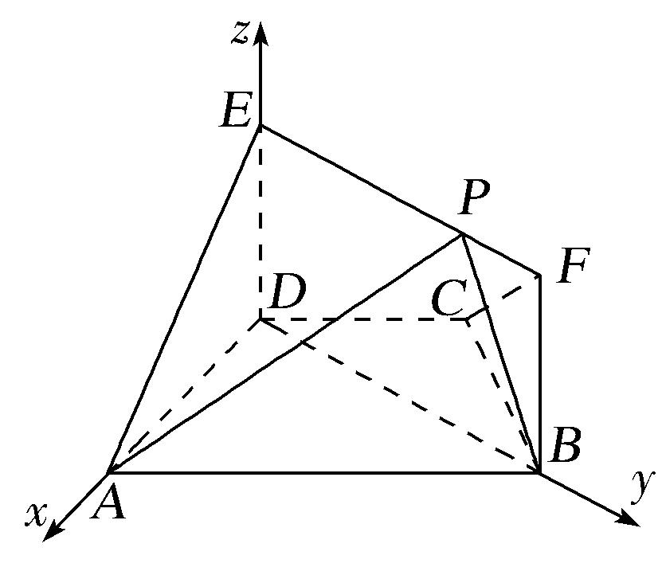
令*EP*＝*λ*(0≤*λ*≤)，则*D*(0，0，0，)，*A*(1，0，0)，*B*(0，，0)，*P*(0，*λ*，1)，
∴＝(－1，，0)，＝(0，*λ*－，1)．
设<em><strong>n</strong></em>1＝(<em>x</em>，<em>y</em>，<em>z</em>)为平面<em>PAB</em>的一个法向量，由得

取<em>y</em>＝1，得<em><strong>n</strong></em>1＝(，1，－<em>λ</em>)，
∵<em><strong>n</strong></em>2＝(0，1，0)是平面<em>ADE</em>的一个法向量，
∴cos *θ*＝＝＝．
∵0≤*λ*≤，∴当*λ*＝时，cos *θ*有最大值，又∵*θ*为锐角，∴*θ*的最小值为．

【对点训练】

1．在如图所示的多面体中，四边形*ABEG*是矩形，梯形*DGEF*为直角梯形，平面*DGEF*⊥平面*ABEG*，

且*DG*⊥*GE*，*DF*∥*GE*，*AB*＝2*AG*＝2*DG*＝2*DF*＝2．  
（1）求证：*FG*⊥平面*BEF*．  
（2）求二面角*A*－*BF*－*E*的大小．

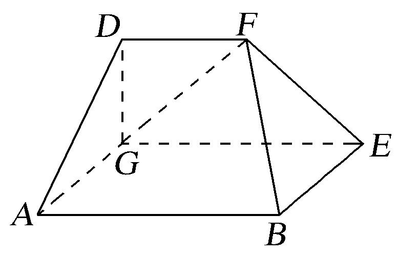

1．解析　（1）∵平面*DGEF*⊥平面*ABEG*，且*BE*⊥*GE*，∴*BE*⊥平面*DGEF*．
又<em>FG</em>⊂平面<em>DGEF</em>，∴<em>BE</em>⊥<em>FG</em>．由题意得<em>FG</em>＝<em>FE</em>＝，∴<em>FG</em>2＋<em>FE</em>2＝<em>GE</em>2，则<em>FE</em>⊥<em>FG</em>．
又*BE*，*EF*是平面*BEF*内的两条相交直线．故*FG*⊥平面*BEF*．  
（2）如图所示，建立空间直角坐标系，则*A*(1，0，0)，*B*(1，2，0)，*E*(0，2，0)，*F*(0，1，1)，

＝(1，－1，－1)，＝(1，1，－1)，＝(0，1，－1)．

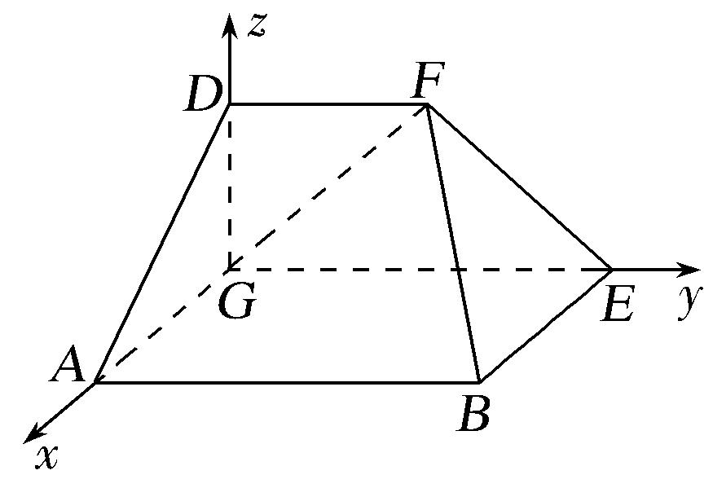
设平面<em>AFB</em>的法向量为<em><strong>n</strong></em>＝(<em>x</em>1，<em>y</em>1，<em>z</em>1)，则⇒⇒
令<em>x</em>1＝1，<em><strong>n</strong></em>＝(1，0，1)．
由（1）可知平面<em>EFB</em>的法向量为<em><strong>m</strong></em>＝＝(0，1，1)．
∴cos<*n*，*m*>＝＝＝，因此两平面法向量的夹角为，
由图可知，二面角*A*－*BF*－*E*为钝二面角，所以二面角*A*－*BF*－*E*的大小为．

2．如图，多面体*ABCDEF*中，*ABCD*为正方形，*AB*＝2，*AE*＝3，*DE*＝，二面角*E*－*AD*－*C*的余弦值

为，且*EF*∥*BD*．  
（1）证明：平面*ABCD*⊥平面*EDC*；  
（2）求平面*AEF*与平面*EDC*所成锐二面角的余弦值．

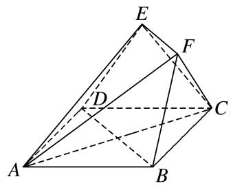

2．解析　（1）∵<em>AB</em>＝<em>AD</em>＝2，<em>AE</em>＝3，<em>DE</em>＝，∴<em>AD</em>2＋<em>DE</em>2＝<em>AE</em>2，∴<em>AD</em>⊥<em>DE</em>，
又正方形*ABCD*中，*AD*⊥*DC*，且*DE*∩*DC*＝*D*，*DE*，*DC*⊂平面*EDC*，
∴*AD*⊥平面*EDC*，又∵*AD*⊂平面*ABCD*，∴平面*ABCD*⊥平面*EDC*．  
（2）由（1）知，∠*EDC*是二面角*E*－*AD*－*C*的平面角，

作*OE*⊥*CD*于*O*，则*OD*＝*DE*·cos∠*EDC*＝1，*OE*＝2，
又∵平面*ABCD*⊥平面*EDC*，平面*ABCD*∩平面*EDC*＝*CD*，*OE*⊂平面*EDC*，∴*OE*⊥平面*ABCD*．

取*AB*中点*M*，连接*OM*，则*OM*⊥*CD*，如图，以*O*为原点，分别以*OM*，*OC*，*OE*所在直线为*x*轴、*y*轴、*z*轴，建立空间直角坐标系，

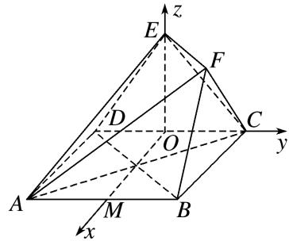
则*A*(2，－1，0)，*B*(2，1，0)，*D*(0，－1，0)，*E*(0，0，2)，∴＝(－2，1，2)，＝(－2，－2，0)，
又*EF*∥*BD*，知*EF*的一个方向向量为(2，2，0)，
设平面<em>AEF</em>的法向量为<em><strong>n</strong></em>＝(<em>x</em>，<em>y</em>，<em>z</em>)，则取<em>x</em>＝－2，得<em><strong>n</strong></em>＝(－2，2，－3)，
又平面<em>EDC</em>的一个法向量为<em><strong>m</strong></em>＝(1，0，0)，
∴cos<*n*，*m*>＝＝－，
设平面<em>AEF</em>与平面<em>EDC</em>所成的锐二面角为<em>θ</em>，则cos <em>θ</em>＝|cos&lt;<em><strong>n</strong></em>，<em><strong>m</strong></em>&gt;|＝．

3．如图，在五面体*ABCDEF*中，底面*ABCD*是直角梯形，*AB*∥*CD*，*AD*⊥*CD*，侧面*CDEF*是菱形，∠

*DCF*＝60°，*CD*＝2*AD*＝2*AB*，*AE*＝*AD．*  
（1）证明：*CE*⊥*AF*；  
（2）已知点*P*在线段*BC*上，且*CP*＝*λCB*，若二面角*A*－*DF*－*P*的大小为60°，求实数*λ*的值．

3．解析　（1）∵侧面*CDEF*是菱形，*CD*＝2*AD*，∴*DE*＝*CD*＝2*AD*，*CE*⊥*DF*．
∵<em>AE</em>＝<em>AD</em>，∴<em>AE</em>2＝<em>AD</em>2＋<em>DE</em>2＝5<em>AD</em>2，∴<em>AD</em>⊥<em>DE</em>．
∵*AD*⊥*CD*，*CD*∩*DE*＝*D*，∴*AD*⊥平面*CDEF*，∴*AD*⊥*CE*．
又*DF*∩*AD*＝*D*，∴*CE*⊥平面*ADF*，∴*CE*⊥*AF*．  
（2）以*D*为坐标原点，*DA*，*DC*所在直线分别为*x*轴、*y*轴，建立如图所示的空间直角坐标系*Dxyz*，

设*DA*＝1，由题设可得*D*(0，0，0)，*A*(1，0，0)，*B*(1，1，0)，*C*(0，2，0)，*E*(0，－1，)，

*F*(0，1，)，＝(0，1，)，＝(1，－1，0)．
∵＝*λ*＝(*λ*，－*λ*，0)，∴＝＋＝(*λ*，2－*λ*，0)．
设<em><strong>m</strong></em>＝(<em>x</em>，<em>y</em>，<em>z</em>)是平面<em>DFP</em>的法向量，则
令<em>z</em>＝－1，得<em><strong>m</strong></em>＝，
由（1）可知＝(0，－3，)是平面*ADF*的一个法向量，
∵二面角*A*－*DF*－*P*的大小为60°，∴cos60°＝＝＝，解得*λ*＝．

4．如图所示，在梯形*ABCD*中，*AB*∥*CD*，∠*BCD*＝120°，四边形*ACFE*为矩形，且*CF*⊥平面*ABCD*，

*AD*＝*CD*＝*BC*＝*CF*．  
（1）求证：*EF*⊥平面*BCF*；  
（2）点*M*在线段*EF*上运动，设平面*MAB*与平面*FCB*的夹角为*θ*，试求cos*θ*的取值范围．

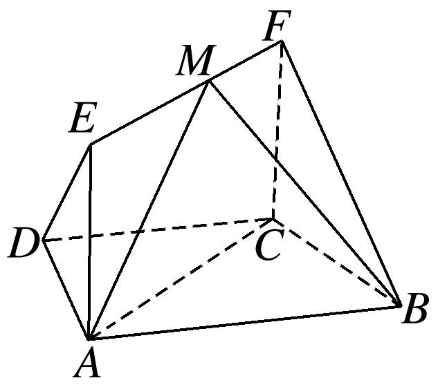

4．解析　（1）设*AD*＝*CD*＝*BC*＝1，∵*AB*∥*CD*，∠*BCD*＝120°，∴*AB*＝2，
∴<em>AC</em>2＝<em>AB</em>2＋<em>BC</em>2－2<em>AB</em>·<em>BC</em>·cos 60°＝3，∴<em>AB</em>2＝<em>AC</em>2＋<em>BC</em>2，则<em>BC</em>⊥<em>AC</em>．
∵四边形*ACFE*为矩形，∴*AC*⊥*CF*，而*CF*，*BC*⊂平面*BCF*，且*CF*∩*BC*＝*C*，
∴*AC*⊥平面*BCF*．∵*EF*∥*AC*，∴*EF*⊥平面*BCF*．  
（2）以*C*为坐标原点，分别以直线*CA*，*CB*，*CF*为*x*轴，*y*轴，*z*轴建立如图所示的空间直角坐标系，

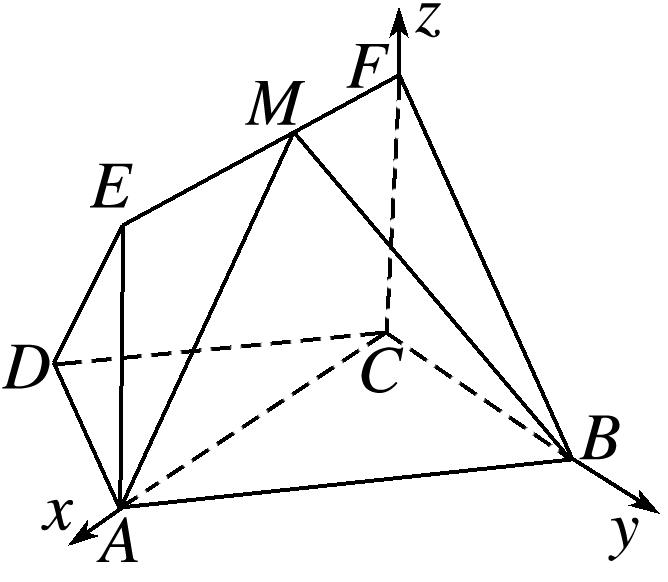
令*FM*＝*λ*，则*C*(0，0，0)，*A*，*B*(0，1，0)，*M*(*λ*，0，1)，
所以＝，＝(*λ*，－1，1)，
设<em><strong>n</strong></em>1＝(<em>x</em>，<em>y</em>，<em>z</em>)为平面<em>MAB</em>的一个法向量，由得

取<em>x</em>＝1，所以<em><strong>n</strong></em>1＝，
因为<em><strong>n</strong></em>2＝(1，0，0)是平面<em>FCB</em>的一个法向量．
所以cos *θ*＝＝＝．
因为0≤*λ*≤，所以当*λ*＝0时，cos *θ*有最小值，当*λ*＝时，cos *θ*有最大值，
所以cos *θ*∈．

