# 专题11 立体几何中的点面距离问题

# 【方法总结】

# 应用等体积转化法求解点到平面的距离

等体积转化法就是通过变换几何体的底面，利用几何体(主要是三棱锥)体积的不同表达形式构造方程来求解相关问题的方法，主要用于立体几何中求解点到面的距离。关键是准确把握三棱锥底面的特征，选择的底面应具备两个特征：一是底面的形状规则，即面积可求；二是底面上的高比较明显，即线面垂直关系比较直接。

# 【例题选讲】

[例 1](2019·全国I)如图，直四棱柱 $ABCD-A_{1}B_{1}C_{1}D_{1}$ 的底面是菱形， $AA_{1}=4,\ AB=2,\ \angle BAD=60^{\circ}, E, M, N$ 分别是 BC， $BB_{1}, A_{1}D$ 的中点.

(1)证明： $MN / /$ 平面 $C_1DE$   
(2)求点 C 到平面 $C_{1}DE$ 的距离.

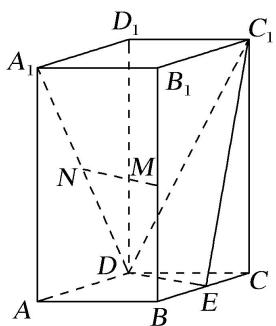

text_image

D₁
A₁
B₁
C₁
N
M
D
A
B
E
C

[例 2]如图，在四棱锥 P-ABCD 中，底面是边长为 2 的正方形， $PA=PD=\sqrt{17}$ ，E 为 PA 的中点，点 F 在 PD 上且 $EF\perp$ 平面 PCD，M 在 DC 延长线上， $FH\parallel DM$ ，交 PM 于点 H，且 FH=1。

(1)证明：EF//平面PBM;   
(2)求点 M 到平面 ABP 的距离.

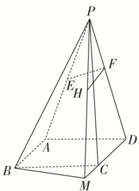

text_image

Geometric diagram of a pyramid with labeled vertices and internal points, used in spatial geometry problems.

[例3]如图，已知四棱锥 $P - ABCD$ 的底面ABCD为菱形，且 $\angle ABC = 60^{\circ}$ ， $AB = PC = 2$ ， $PA = PB = \sqrt{2}$

(1)求证：平面 $PAB \perp$ 平面 ABCD;  
(2)求点 D 到平面 APC 的距离.

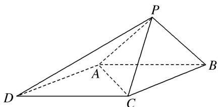

text_image

Geometric diagram of a pyramid with labeled vertices and internal points

[例 4]如图，在单位正方体 $ABCD-A_{1}B_{1}C_{1}D_{1}$ 中，E，F 分别是 AD， $BC_{1}$ 的中点.

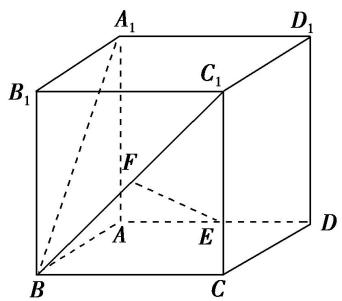

text_image

A₁
B₁
C₁
D₁
F
A
E
B
C
D

(1)求证： $EF \parallel$ 平面 $C_{1}CDD_{1}$ ;  
(2)在线段 $A_{1}B$ 上是否存在点 G，使 $EG \perp$ 平面 $A_{1}BC_{1}$ ？若存在，求点 G 到平面 $C_{1}DF$ 的距离；若不存在，请说明理由.

[例 5]如图 1，四边形 ABCD 为等腰梯形，AB=2，AD=DC=CB=1，将 $\triangle ADC$ 沿 AC 折起，使得平面 $ADC \perp$ 平面 ABC，E 为 AB 的中点，连接 DE，DB(如图 2).

(1)求证： $BC \perp AD;$   
(2)求点 E 到平面 BCD 的距离.

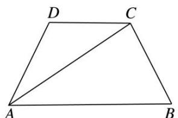

text_image

D
C
A
B

图1

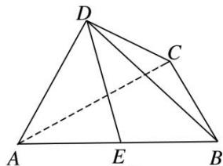

text_image

Geometric diagram of a tetrahedron with labeled vertices A, B, C, D and internal points E, showing solid and dashed edges.

图2

[例6]如图，高为1的等腰梯形ABCD中， $AM = CD = \frac{1}{3} AB = 1$ ，现将 $\triangle AMD$ 沿MD折起，使平面AMD⊥平面MBCD，连接 $AB$ ，AC.

(1)在 $AB$ 边上是否存在点 $P$ , 使 $AD \parallel$ 平面 MPC?  
(2)当点 P 为 AB 边的中点时，求点 B 到平面 MPC 的距离.

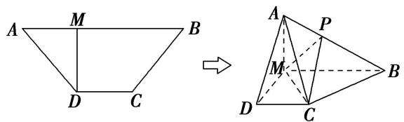

text_image

A M B
D C
→
A P
M
D C B

# 【对点训练】

1. (2018·全国II)如图，在三棱锥 $P - ABC$ 中， $AB = BC = 2\sqrt{2}$ ， $PA = PB = PC = AC = 4$ ， $O$ 为 $AC$ 的中点.

(1)证明： $PO \perp$ 平面 ABC;  
(2)若点 M 在棱 BC 上，且 MC=2MB，求点 C 到平面 POM 的距离.

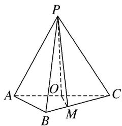

text_image

P
A
O
B
M
C

2. (2013·江西)如图，直四棱柱 $ABCD - A_{1}B_{1}C_{1}D_{1}$ 中， $AB \parallel CD$ ， $AD \perp AB$ ， $AB = 2$ ， $AD = \sqrt{2}$ ， $AA_{1} = 3$ ， $E$ 为 $CD$ 上一点， $DE = 1$ ， $EC = 3$ .

(1)证明： $BE \perp$ 平面 $BB_{1}C_{1}C;$   
(2)求点 $B_{1}$ 到平面 $EA_{1}C_{1}$ 的距离.

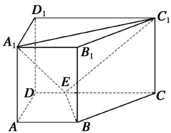

text_image

D₁
A₁
B₁
E
D
C
A
B
C₁

3. 如图，在三棱锥 $A - BCD$ 中， $\triangle ABC$ 是等腰直角三角形，且 $AC \perp BC, BC = 2, AD \perp$ 平面 $BCD, AD = 1$ .

(1)求证：平面 $ABC \perp$ 平面 ACD;  
(2)若 E 为 AB 的中点，求点 A 到平面 CED 的距离.

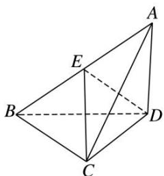

text_image

Geometric diagram of a tetrahedron with labeled vertices A, B, C, D, E and solid/dashed edges

4. 已知三棱锥 $P - ABC$ 中， $AC \perp BC$ ， $AC = BC = 2$ ， $PA = PB = PC = 3$ ， $O$ 是 $AB$ 的中点， $E$ 是 $PB$ 的中点.

(1)证明：平面 $PAB \perp$ 平面 ABC;  
(2)求点 B 到平面 OEC 的距离.

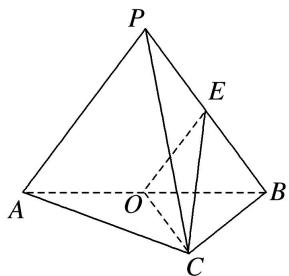

text_image

P
E
A
O
B
C

5. 在如图所示的几何体中，四边形 $ABCD$ 是直角梯形， $AD \parallel BC$ ， $AB \perp BC$ ， $AD = 2$ ， $AB = 3$ ， $BC = BE = 7$ ， $\triangle DCE$ 是边长为6的正三角形.

(1)求证：平面 $DEC \perp$ 平面 BDE;  
(2)求点 A 到平面 BDE 的距离.

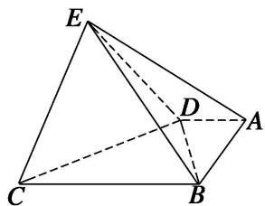

text_image

Geometric diagram of a tetrahedron with labeled vertices A, B, C, D, E and solid/dashed edges indicating 3D perspective.

6. 如图，在四棱锥 $P - ABCD$ 中，底面 $ABCD$ 是矩形，且 $AD = 2$ ， $AB = 1$ ， $PA \perp$ 平面 $ABCD$ ， $E$ ， $F$ 分别是线段 $AB$ ， $BC$ 的中点.

(1)证明： $PF \perp FD;$   
(2)若 PA=1，求点 E 到平面 PFD 的距离.

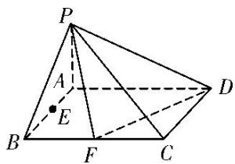

text_image

Geometric diagram of a pyramid with labeled vertices and internal points, used for spatial geometry problems.

7. 如图，四棱锥 $P - ABCD$ 中， $PA \perp$ 底面 $ABCD$ ，底面 $ABCD$ 为梯形， $AD \parallel BC$ ， $CD \perp BC$ ， $AD = 2$ ， $AB = BC = 3$ ， $PA = 4$ ， $M$ 为 $AD$ 的中点， $N$ 为 $PC$ 上一点，且 $PC = 3PN$ .

(1)求证：MN//平面PAB:   
(2)求点 M 到平面 PAN 的距离.

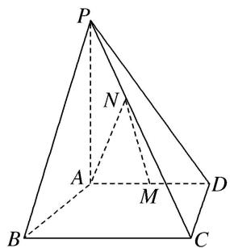

text_image

P
N
A
M
D
B
C

8. 如图，在四棱锥 $P - ABCD$ 中，侧面 $PAD$ 是边长为 2 的正三角形，且与底面垂直，底面 $ABCD$ 是 $\angle ABC = 60^{\circ}$ 的菱形， $M$ 为 $PC$ 的中点.

(1)求证： $PC \perp AD$ ;  
(2)求点 D 到平面 PAM 的距离.

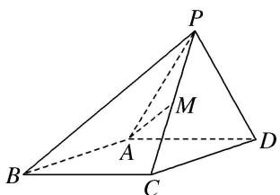

text_image

Geometric diagram of a pyramid with labeled vertices and internal points, including dashed lines indicating hidden edges.

9. 如图，在四棱锥 $P - ABCD$ 中， $PC \perp$ 平面 $ABCD$ ，底面 $ABCD$ 是平行四边形， $AB = BC = 2a$ ， $AC = 2\sqrt{3}a$ ， $E$ 是 $PA$ 的中点.

(1)求证：平面BED|平面PAC:   
(2)求点 E 到平面 PBC 的距离.

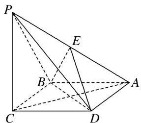

text_image

Geometric diagram of a pyramid with labeled vertices and internal points, used for spatial geometry problems.

10. 如图 1，在直角梯形 $ABCP$ 中， $CP \parallel AB$ ， $CP \perp BC$ ， $AB = BC = \frac{1}{2} CP$ ， $D$ 是 $CP$ 的中点，将 $\triangle PAD$ 沿 $AD$ 折起，使点 $P$ 到达点 $P'$ 的位置得到图 2，点 $M$ 为棱 $P'C$ 上的动点.

①当 M 在何处时，平面 $ADM \perp$ 平面 $P^{\prime}BC$ ，并证明：  
②若 AB=2， $\angle P^{\prime}DC=135^{\circ}$ ，证明：点 C 到平面 $P^{\prime}AD$ 的距离等于点 $P^{\prime}$ 到平面 ABCD 的距离，并求出该距离.

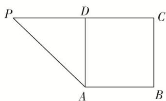

text_image

P
D
C
A
B

图1

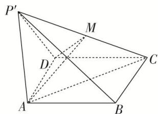

text_image

P'
M
D
C
A
B

图2

11. 如图 1，在矩形 ABCD 中，AB=12，AD=6，E，F 分别为 CD，AB 边上的点，且 DE=3，BF=4，将 $\triangle BCE$ 沿 BE 折起来至 $\triangle PBE$ 的位置(如图 2 所示)，连接 AP，PF，其中 $PF=2\sqrt{5}$ .

(1)求证： $PF \perp$ 平面 ABED;  
(2)求点 A 到平面 PBE 的距离.

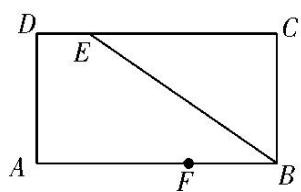

text_image

D
E
C
A
F
B

图1

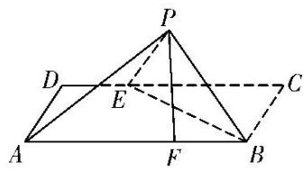

text_image

Geometric diagram of a pyramid with labeled vertices and internal points, including dashed lines for hidden edges.

图2

12. 如图，在直角梯形 $ABCD$ 中， $AD \parallel BC$ ， $AB \perp BC$ ， $BD \perp DC$ ，点 $E$ 是 $BC$ 边的中点，将 $\triangle ABD$ 沿 $BD$ 折起，使平面 $ABD \perp$ 平面 $BCD$ ，连接 $AE$ ， $AC$ ， $DE$ ，得到如图所示的空间几何体。

(1)求证： $AB \perp$ 平面 ADC;  
(2)若 $AD = 1$ ， $AB = \sqrt{2}$ ，求点 $B$ 到平面 $ADE$ 的距离.

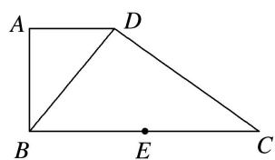

text_image

A
D
B
E
C

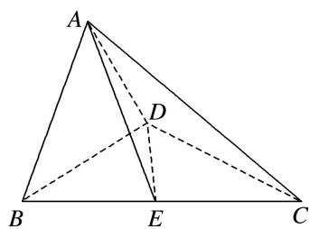

text_image

A
D
B
E
C

