# 专题11 立体几何中的点面距离问题

# 【方法总结】

# 应用等体积转化法求解点到平面的距离

等体积转化法就是通过变换几何体的底面，利用几何体(主要是三棱锥)体积的不同表达形式构造方程来求解相关问题的方法，主要用于立体几何中求解点到面的距离。关键是准确把握三棱锥底面的特征，选择的底面应具备两个特征：一是底面的形状规则，即面积可求；二是底面上的高比较明显，即线面垂直关系比较直接。

# 【例题选讲】

[例 1](2019·全国I)如图，直四棱柱 $ABCD-A_{1}B_{1}C_{1}D_{1}$ 的底面是菱形， $AA_{1}=4,\ AB=2,\ \angle BAD=60^{\circ}, E, M, N$ 分别是 BC, $BB_{1}, A_{1}D$ 的中点.  
（1）证明： $MN \parallel$ 平面 $C_{1}DE$ ;  
（2）求点 C 到平面 $C_{1}DE$ 的距离.

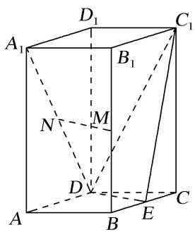

解析 （1）连接 $B_{1}C$ ，ME．因为 $M$ ， $E$ 分别为 $BB_{1}$ ， $BC$ 的中点，所以 $ME \parallel B_{1}C$ ，且 $ME = \frac{1}{2} B_{1}C$
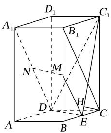
又因为 N 为 $A_{1}D$ 的中点，所以 $ND=\frac{1}{2}A_{1}D$ 。由题设知 $A_{1}B_{1}$ 統 DC ，可得 $B_{1}C\stackrel{\parallel}{=}A_{1}D$ ，故 $ME\stackrel{\parallel}{=}ND$ ，因此四边形 MNDE 为平行四边形，所以 $MN//ED$ 。
又 $MN \notin$ 平面 $C_{1}DE$ ， $ED \subset$ 平面 $C_{1}DE$ ，所以 $MN \parallel$ 平面 $C_{1}DE$ .  
（2）过点 C 作 $C_{1}E$ 的垂线，垂足为 H．由已知可得 $DE \perp BC$ ， $DE \perp C_{1}C$ ，
又 $BC \cap C_{1}C = C$ ，BC， $C_{1}C \subset$ 平面 $C_{1}CE$ ，所以 $DE \perp$ 平面 $C_{1}CE$ ，
故 $DE \perp CH$ 。又 $C_{1}E \cap DE = E$ ，所以 $CH \perp$ 平面 $C_{1}DE$ ，故 CH 的长即为点 C 到平面 $C_{1}DE$ 的距离。
由已知可得 CE=1， $C_{1}C=4$ ，所以 $C_{1}E=\sqrt{17}$ ，故 $CH=\frac{4\sqrt{17}}{17}$ 。从而点 C 到平面 $C_{1}DE$ 的距离为 $\frac{4\sqrt{17}}{17}$ 。

[例 2]如图，在四棱锥 P-ABCD 中，底面是边长为 2 的正方形， $PA=PD=\sqrt{17}$ ，E 为 PA 的中点，点 F 在 PD 上且 $EF\perp$ 平面 PCD，M 在 DC 延长线上， $FH\parallel DM$ ，交 PM 于点 H，且 FH=1。  
（1）证明： $EF \parallel$ 平面 PBM;  
（2）求点 M 到平面 ABP 的距离.

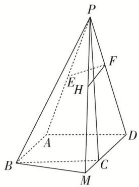

解析 （1）证明：取 $PB$ 的中点 $G$ ，连接 $EG$ ， $HG$ ，
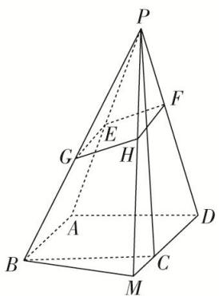
则 $EG \parallel AB$ ，且 $EG = 1$ ， $\because FH \parallel DM$ ，且 $FH = 1$ ，又 $AB \parallel DM$ ， $\therefore EG \parallel FH$ ， $EG = FH$
即四边形 EFHG 为平行四边形，∴EF//GH.
又 $EF \not\subset$ 平面 PBM, $GH \subset$ 平面 PBM, $\therefore EF \parallel$ 平面 PBM.  
（2）∵EF⊥平面PCD，CD⊂平面PCD，∴EF⊥CD.
∵ $AD \perp CD$ ，EF 和 AD 显然相交，EF， $AD \subset$ 平面 PAD，∴ $CD \perp$ 平面 PAD， $CD \subset$ 平面 ABCD，
∴平面 $ABCD \perp$ 平面 PAD. 取 AD 的中点 O, 连接 PO,

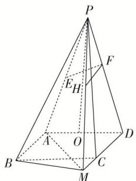
∵ PA = PD，∴ PO ⊥ AD．又平面 ABCD ∩ 平面 PAD = AD，PO ⊂ 平面 PAD，∴ PO ⊥ 平面 ABCD，
∵ AB // CD，∴ AB ⊥ 平面 PAD，∵ PA ⊂ 平面 PAD，∴ PA ⊥ AB，
在等腰三角形 PAD 中， $PO=\sqrt{PA^{2}-AO^{2}}=\sqrt{17-1}=4$ .
设点 M 到平面 ABP 的距离为 h，连接 AM，利用等体积可得 $V_{M-ABP}=V_{P-ABM}$ ，
即 $\frac{1}{3}\times\frac{1}{2}\times2\times\sqrt{17}\times h=\frac{1}{3}\times\frac{1}{2}\times2\times2\times4,\quad\therefore h=\frac{8}{\sqrt{17}}=\frac{8\sqrt{17}}{17},\quad\therefore$ 点M到平面PAB的距离为 $\frac{8\sqrt{17}}{17}$ .

[例 3]如图，已知四棱锥 P-ABCD 的底面 ABCD 为菱形，且 $\angle ABC=60^{\circ}$ ，AB=PC=2，PA=PB= $\sqrt{2}$ .  
（1）求证：平面 $PAB \perp$ 平面 ABCD;  
（2）求点 D 到平面 APC 的距离.

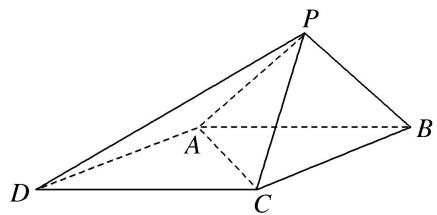

解析 （1）证明：取 $AB$ 的中点 $O$ ，连接 $PO, CO$ ，(图略)，
由 $PA=PB=\sqrt{2}$ ，AB=2 知 $\triangle PAB$ 为等腰直角三角形， $\therefore PO\perp AB$ ，PO=1，
由 $AB = BC = 2$ ， $\angle ABC = 60^{\circ}$ 知 $\triangle ABC$ 为等边三角形， $\therefore CO = \sqrt{3}$
又由 PC=2 得 $PO^{2}+CO^{2}=PC^{2}$ ，∴ $PO \perp CO$ ，又 $AB \cap CO = O$ ，∴ $PO \perp$ 平面 ABC，
又 $PO \subset$ 平面 PAB，∴平面 $PAB \perp$ 平面 ABCD.  
（2）由题知 $\triangle ADC$ 是边长为 2 的等边三角形, $\triangle PAC$ 为等腰三角形, 设点 $D$ 到平面 $APC$ 的距离为 $h$ ,
由 $V_{D-PAC}=V_{P-ADC}$ 得 $\frac{1}{3}S_{\triangle PAC}\cdot h=\frac{1}{3}S_{\triangle ADC}\cdot PO.$ $\because S_{\triangle ADC}=\frac{\sqrt{3}}{4}\times2^{2}=\sqrt{3},\quad S_{\triangle PAC}=\frac{1}{2}PA\cdot\sqrt{PC^{2}-\left(\frac{1}{2}PA\right)^{2}}=\frac{\sqrt{7}}{2},$
$\therefore h = \frac{S_{\triangle ADC} \cdot PO}{S_{\triangle PAC}} = \frac{\sqrt{3} \times 1}{\frac{\sqrt{7}}{2}} = \frac{2\sqrt{21}}{7}$ , 即点 $D$ 到平面 $APC$ 的距离为 $\frac{2\sqrt{21}}{7}$ .

[例 4]如图，在单位正方体 $ABCD-A_{1}B_{1}C_{1}D_{1}$ 中，E，F 分别是 AD， $BC_{1}$ 的中点.

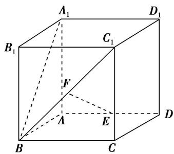  
（1）求证： $EF \parallel$ 平面 $C_{1}CDD_{1}$ ;  
（2）在线段 $A_{1}B$ 上是否存在点 G，使 $EG \perp$ 平面 $A_{1}BC_{1}$ ？若存在，求点 G 到平面 $C_{1}DF$ 的距离；若不存在，请说明理由.
解析 （1）证明：取 BC 的中点 M，连接 EM，FM，
∵E, F分别是AD, $BC_{1}$ 的中点，∴EM//DC, $FM//C_{1}C$ ,
$EM \subset$ 平面 $EFM$ , $FM \subset$ 平面 $EFM$ , $EM \cap FM = M$ ,
$DC \subset$ 平面 $C_{1} CDD_{1}$ , $C_{1} C \subset$ 平面 $C_{1} CDD_{1}$ , $DC \cap C_{1} C = C$ ,
∴平面 $EFM \parallel$ 平面 $C_{1}CDD_{1}$ ，而 $EF \subset$ 平面 EFM，∴ $EF \parallel$ 平面 $C_{1}CDD_{1}$ .

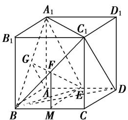  
（2）取 $A_{1}B$ 的中点 $G$ ，连接 $EG$ ， $EA_{1}$ ， $EB$ ，易知 $EA_{1} = EB$ ，而 $G$ 为中点， $\therefore EG\bot A_1B.$

连接 FG，则 $FG \parallel A_{1}C_{1}$ ，∵正方体棱长为 1，在 $\triangle A_{1}BC_{1}$ 中， $FG=\frac{1}{2}A_{1}C_{1}=\frac{\sqrt{2}}{2}$ .
在 Rt△FME 中， $EF=\frac{\sqrt{5}}{2}$ ，在 Rt△EAG 中， $EG=\frac{\sqrt{3}}{2}$ $\therefore FG^{2} + EG^{2} = FE^{2}$ ，即 $EG\bot FG$ ，故 $EG\bot A_1C_1$ ，又 $A_{1}B$ ， $A_{1}C_{1}\subset$ 平面 $A_{1}BC_{1}$ ， $A_{1}B\cap A_{1}C_{1} = A_{1},$
∴ $EG \perp$ 平面 $A_{1}BC_{1}$ . 点 G 到平面 $C_{1}DF$ 的距离就是点 G 到平面 $C_{1}DB$ 的距离.
∵ $GA \parallel C_{1}D$ ，∴ $GA \parallel$ 平面 $C_{1}DB$ ，∴ 点 G 到平面 $C_{1}DB$ 的距离就是点 A 到平面 $C_{1}DB$ 的距离.

易知 $S\triangle BDC_{1}=\frac{\sqrt{3}}{2}$ ， $S_{\triangle ABD}=\frac{1}{2}$ ，点 $C_{1}$ 到平面 ABD 的距离为 1，
设点 G 到平面 $C_{1}DF$ 的距离为 d，由 $V_{C1-ABD}=V_{A-BDC1}$ 得 $\frac{1}{3}\times1\times S_{\triangle ABD}=\frac{1}{3}\cdot d\cdot S_{\triangle BDC1}$
即 $\frac{1}{2}=d\cdot\frac{\sqrt{3}}{2},\quad\therefore d=\frac{\sqrt{3}}{3}$ ，即点G到平面 $C_{1}DF$ 的距离为 $\frac{\sqrt{3}}{3}$ .

[例 5]如图 1，四边形 ABCD 为等腰梯形，AB=2，AD=DC=CB=1，将 $\triangle ADC$ 沿 AC 折起，使得平面 $ADC \perp$ 平面 ABC，E 为 AB 的中点，连接 DE，DB(如图 2).  
（1）求证： $BC \perp AD;$   
（2）求点 E 到平面 BCD 的距离.
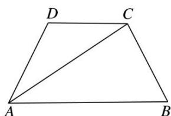

图1

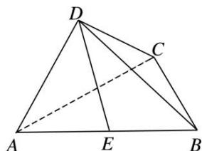

图2

解析 （1）作 $CH \perp AB$ 于点 H，则 $BH = \frac{1}{2}$ ， $AH = \frac{3}{2}$ ，又 BC = 1，∴ $CH = \frac{\sqrt{3}}{2}$ ，∴ $CA = \sqrt{3}$ ，
∴ $AC \perp BC$ ，∵ 平面 $ADC \perp$ 平面 ABC，且平面 $ADC \cap$ 平面 ABC = AC，BC ⊂ 平面 ABC，
∴BC⊥平面ADC，又AD⊂平面ADC，∴BC⊥AD.

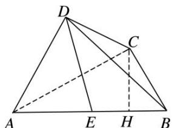

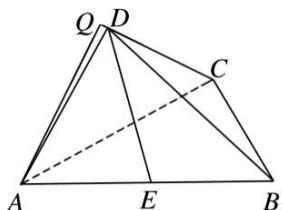  
（2）∵E为AB的中点，∴点E到平面BCD的距离等于点A到平面BCD距离的一半.

而平面 $ADC \perp$ 平面 BCD, ∴ 过 A 作 $AQ \perp CD$ 于 Q, 又 ∵ 平面 $ADC \cap$ 平面 BCD = CD, 且 $AQ \subset$ 平面 ADC, ∴ $AQ \perp$ 平面 BCD, AQ 就是点 A 到平面 BCD 的距离.
由（1）知 $AC=\sqrt{3}$ ，AD=DC=1，∴ $\cos\angle ADC=\frac{1^{2}+1^{2}-(\sqrt{3})^{2}}{2\times1\times1}=-\frac{1}{2}$
又 $0 < \angle ADC < \pi, \therefore \angle ADC = \frac{2\pi}{3}, \therefore$ 在 Rt△QAD 中， $\angle QDA = \frac{\pi}{3}, AD = 1,$
∴ $AQ = AD \cdot \sin \angle QDA = 1 \times \frac{\sqrt{3}}{2} = \frac{\sqrt{3}}{2}$ . ∴ 点 E 到平面 BCD 的距离为 $\frac{\sqrt{3}}{4}$ .

[例6]如图，高为1的等腰梯形ABCD中， $AM = CD = \frac{1}{3} AB = 1$ ，现将 $\triangle AMD$ 沿MD折起，使平面AMD⊥平面MBCD，连接 $AB$ ，AC.  
（1）在 $AB$ 边上是否存在点 $P$ , 使 $AD \parallel$ 平面 $MPC$ ?  
（2）当点 P 为 AB 边的中点时，求点 B 到平面 MPC 的距离.

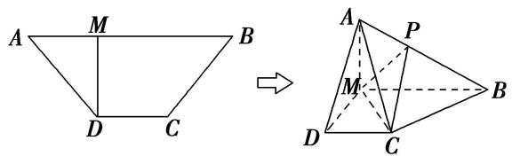

解析 （1） 当 $AP = \frac{1}{3} AB$ 时，有 $AD //$ 平面 MPC．理由如下：

连接 BD 交 MC 于点 N，连接 NP．在梯形 MBCD 中，DC // MB， $\frac{DN}{NB}=\frac{DC}{MB}=\frac{1}{2}$
在 $\triangle ADB$ 中， $\frac{AP}{PB}=\frac{1}{2}$ ， $\therefore AD \parallel PN$ 。 $\because AD \notin$ 平面 $MPC$ ， $PN \subset$ 平面 $MPC$ ， $\therefore AD \parallel$ 平面 $MPC$ 。

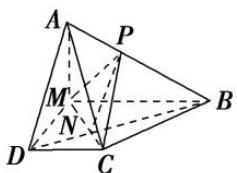  
（2）∵平面AMD⊥平面MBCD，平面AMD∩平面MBCD=DM，AM⊥DM，∴AM⊥平面MBCD.
$\therefore V_{P-MBC} = \frac{1}{3}\times S_{\triangle MBC}\times \frac{AM}{2} = \frac{1}{3}\times \frac{1}{2}\times 2\times 1\times \frac{1}{2} = \frac{1}{6}.$ 在 $\triangle MPC$ 中， $MP = \frac{1}{2} AB = \frac{\sqrt{5}}{2},MC = \sqrt{2},$
又 $PC = \sqrt{\left(\frac{1}{2}\right)^2 + 1^2} = \frac{\sqrt{5}}{2}, \therefore S_{\triangle MPC} = \frac{1}{2} \times \sqrt{2} \times \sqrt{\left(\frac{\sqrt{5}}{2}\right)^2 - \left(\frac{\sqrt{2}}{2}\right)^2} = \frac{\sqrt{6}}{4}.$
∴点 B 到平面 MPC 的距离为 $d=\frac{3V_{P-MBC}}{S_{\triangle MPC}}=\frac{3\times\frac{1}{6}}{\frac{\sqrt{6}}{4}}=\frac{\sqrt{6}}{3}$ .

# 【对点训练】

1. (2018·全国II)如图，在三棱锥 $P - ABC$ 中， $AB = BC = 2\sqrt{2}$ ， $PA = PB = PC = AC = 4$ ， $O$ 为 $AC$ 的中点.  
（1）证明： $PO \perp$ 平面 ABC;  
（2）若点 M 在棱 BC 上，且 MC=2MB，求点 C 到平面 POM 的距离.

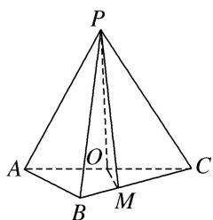

1. 解析 （1）证明：因为 $PA = PC = AC = 4$ ， $O$ 为 $AC$ 的中点，所以 $PO \perp AC$ ，且 $PO = 2\sqrt{3}$ 。连接 $OB$ 因为 $AB = BC = \frac{\sqrt{2}}{2} AC$ ，所以 $\triangle ABC$ 为等腰直角三角形，且 $OB \perp AC$ ， $OB = \frac{1}{2} AC = 2$ 所以 $PO^2 + OB^2 = PB^2$ ，所以 $PO \perp OB$ 。又因为 $AC \cap OB = O$ ，所以 $PO \perp$ 平面 $ABC$

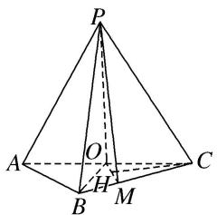  
（2）作 $CH \perp OM$ ，垂足为 $H$ ，又由（1）可得 $OP \perp CH$ ，所以 $CH \perp$ 平面 $POM$ .
故 CH 的长为点 C 到平面 POM 的距离.
由题设可知 $OC=\frac{1}{2}AC=2,\quad CM=\frac{2}{3}BC=\frac{4\sqrt{2}}{3},\quad \angle ACB=45^{\circ},$
所以 $OM = \frac{2\sqrt{5}}{3}$ , $CH = \frac{OC \cdot MC \cdot \sin \angle ACB}{OM} = \frac{4\sqrt{5}}{5}$ . 所以点 $C$ 到平面 $POM$ 的距离为 $\frac{4\sqrt{5}}{5}$ .

2. (2013·江西)如图，直四棱柱 $ABCD - A_1B_1C_1D_1$ 中， $AB \parallel CD$ ， $AD \perp AB$ ， $AB = 2$ ， $AD = \sqrt{2}$ ， $AA_1 = 3$ ， $E$ 为 $CD$ 上一点， $DE = 1$ ， $EC = 3$ .  
（1）证明： $BE \perp$ 平面 $BB_{1}C_{1}C;$  
（2）求点 $B_{1}$ 到平面 $EA_{1}C_{1}$ 的距离.

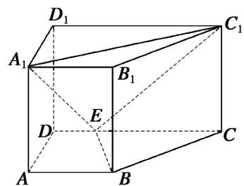

2. 解析 （1） 过 $B$ 作 $CD$ 的垂线交 $CD$ 于 $F$ , 则 $BF = AD = \sqrt{2}$ , $EF = AB - DE = 1$ , $FC = 2$ .
在 Rt△BFE 中， $BE=\sqrt{3}$ . 在 Rt△CFB 中， $BC=\sqrt{6}$ . 在△BEC 中，因为 $BE^{2}+BC^{2}=9=EC^{2}$ ，故 $BE\perp BC$ . 由 $BB_{1}\perp$ 平面 ABCD 得 $BE\perp BB_{1}$ ，又 $BB_{1}\cap BC=B$ ，所以 $BE\perp$ 平面 $BB_{1}C_{1}C$ .

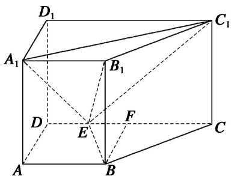  
（2）三棱锥 $E - A_{1}B_{1}C_{1}$ 的体积 $V = \frac{1}{3} AA_{1}\cdot S_{\triangle A_{1}B_{1}C_{1}} = \sqrt{2}$ 。在 Rt△A1D1C1 中， $A_{1}C_{1} = \sqrt{A_{1}D_{1}^{2} + D_{1}C_{1}^{2}} = 3\sqrt{2}$ .

同理， $EC_{1}=\sqrt{EC^{2}+CC_{1}^{2}}=3\sqrt{2}$ ， $A_{1}E=\sqrt{A_{1}A^{2}+AD^{2}+DE^{2}}=2\sqrt{3}$ 。故 $S_{\triangle A_{1}C_{1}E}=3\sqrt{5}$
设点 $B_{1}$ 到平面 $A_{1}C_{1}E$ 的距离为 d，则三棱锥 $B_{1}-A_{1}C_{1}E$ 的体积 $V=\frac{1}{3}\cdot d\cdot S_{\triangle A_{1}C_{1}E}=\sqrt{5}d$
从而 $\sqrt{5} d = \sqrt{2}$ ， $d = \frac{\sqrt{10}}{5}$ 即点 $B_{1}$ 到平面 $EA_{1}C_{1}$ 的距离为 $\frac{\sqrt{10}}{5}$

3. 如图，在三棱锥 $A - BCD$ 中， $\triangle ABC$ 是等腰直角三角形，且 $AC \perp BC, BC = 2, AD \perp$ 平面 $BCD, AD = 1$ .  
（1）求证：平面 $ABC \perp$ 平面 ACD;  
（2）若 E 为 AB 的中点，求点 A 到平面 CED 的距离.

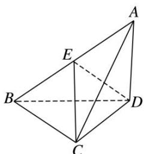

3. 解析 （1） 因为 $AD \perp$ 平面 BCD， $BC \subset$ 平面 BCD，所以 $AD \perp BC$ ，又 $AC \perp BC$ ， $AC \cap AD = A$ ，

AC, $AD \subset$ 平面 ABCD，所以 $BC \perp$ 平面 ACD，因为 $BC \subset$ 平面 ABC，所以平面 $ABC \perp$ 平面 AC
D.

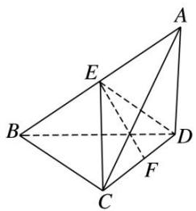  
（2）由已知可得 $CD=\sqrt{3}$ ，取 CD 的中点 F，连接 EF，因为 E 为 AB 的中点，所以 $ED=EC=\frac{1}{2}AB=\sqrt{2}$ ，所以 $\triangle ECD$ 为等腰三角形，从而 $EF=\frac{\sqrt{5}}{2}$ ，所以 $S_{\triangle ECD}=\frac{1}{2}\times\sqrt{3}\times\frac{\sqrt{5}}{2}=\frac{\sqrt{15}}{4}$ .
由（1）知 $BC \perp$ 平面 $ACD$ ，所以 $E$ 到平面 $ACD$ 的距离为 1， $S_{\triangle ACD} = \frac{1}{2} \times \sqrt{3} \times 1 = \frac{\sqrt{3}}{2}$ .
设点 A 到平面 CED 的距离为 d，则 $V_{三棱锥 A-ECD}=\frac{1}{3}\cdot S_{\triangle ECD}\cdot d=V_{三棱锥 E-ACD}=\frac{1}{3}\cdot S_{\triangle ACD}\cdot1$ ，解得 $d=\frac{2\sqrt{5}}{5}$ .

4. 已知三棱锥 $P - ABC$ 中， $AC \perp BC$ ， $AC = BC = 2$ ， $PA = PB = PC = 3$ ， $O$ 是 $AB$ 的中点， $E$ 是 $PB$ 的中点.  
（1）证明：平面 $PAB \perp$ 平面 ABC;  
（2）求点 B 到平面 OEC 的距离.

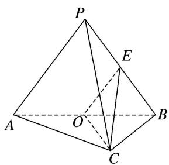

4. 解析 （1）连接 $PO$ ，在 $\triangle PAB$ 中， $PA = PB, O$ 是 $AB$ 中点， $\therefore PO \perp AB$ ，又 $\because AC = BC = 2, AC \perp BC$ ， $\therefore AB = 2\sqrt{2}, OB = OC = \sqrt{2}$ . $\because PA = PB = PC = 3, \therefore PO = \sqrt{7}, PC^2 = PO^2 + OC^2, \therefore PO \perp OC.$ 又 $AB \cap OC = O, AB \subset$ 平面 $ABC, OC \subset$ 平面 $ABC, \therefore PO \perp$ 平面 $ABC, \because PO \subset$ 平面 $PAB, \therefore$ 平面 $PAB \perp$ 平面 $ABC$ .

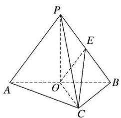  
（2）∵OE是△PAB的中位线，∴ $OE=\frac{3}{2}$ . ∵O是AB的中点，AC=BC，∴ $OC\perp AB$ .
又平面 $PAB \perp$ 平面 ABC，两平面的交线为 AB，∴OC⊥平面 PAB，∵OE⊂平面 PAB，∴OC⊥OE.
设点 B 到平面 OEC 的距离为 d，则 $V_{B-OEC}=V_{E-OBC}$ ，∴ $\frac{1}{3}\times S_{\triangle OEC}\cdot d=\frac{1}{3}\times S_{\triangle OBC}\times\frac{1}{2}OP$
$d = \frac {S _ {\triangle O B C} \cdot \frac {1}{2} O P}{S _ {\triangle O E C}} = \frac {\frac {1}{2} O B \cdot O C \cdot \frac {1}{2} O P}{\frac {1}{2} O E \cdot O C} = \frac {\sqrt {1 4}}{3}.$

5. 在如图所示的几何体中, 四边形 $ABCD$ 是直角梯形, $AD \parallel BC$ , $AB \perp BC$ , $AD = 2$ , $AB = 3$ , $BC = BE = 7$ , $\triangle DCE$ 是边长为 6 的正三角形.  
（1）求证：平面 $DEC \perp$ 平面 BDE;  
（2）求点 A 到平面 BDE 的距离.

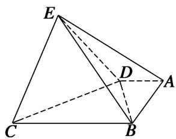

5. 解析 （1） 因为四边形 $ABCD$ 为直角梯形, $AD \parallel BC$ , $AB \perp BC$ , $AD = 2$ , $AB = 3$ , 所以 $BD = \sqrt{13}$ , 又因为 $BC = 7$ , $CD = 6$ , 所以根据勾股定理可得 $BD \perp CD$ , 因为 $BE = 7$ , $DE = 6$ , 同理可得 $BD \perp DE$ . 因为 $DE \cap CD = D$ , $DE \subset$ 平面 $DEC$ , $CD \subset$ 平面 $DEC$ , 所以 $BD \perp$ 平面 $DEC$ . 因为 $BD \subset$ 平面 $BDE$ , 所以平面 $DEC \perp$ 平面 $BDE$ .

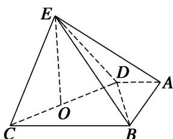  
（2）如图, 取 $CD$ 的中点 $O$ , 连接 $OE$ , 因为 $\triangle DCE$ 是边长为 6 的正三角形,
所以 $EO \perp CD, EO = 3\sqrt{3}$ ，由（1）易知 $EO \perp$ 平面 ABCD，则 $V_{E-ABD} = \frac{1}{3} \times \frac{1}{2} \times 2 \times 3 \times 3\sqrt{3} = 3\sqrt{3}$ ，又因为 Rt△BDE 的面积为 $\frac{1}{2} \times 6 \times \sqrt{13} = 3\sqrt{13}$ ，
设点 A 到平面 BDE 的距离为 h，则由 $V_{E-ABD}=V_{A-BDE}$ ，得 $\frac{1}{3}\times3\sqrt{13}h=3\sqrt{3}$ ，所以 $h=\frac{3\sqrt{39}}{13}$ ，所以点 A 到平面 BDE 的距离为 $\frac{3\sqrt{39}}{13}$ .

6. 如图, 在四棱锥 $P - ABCD$ 中, 底面 $ABCD$ 是矩形, 且 $AD = 2$ , $AB = 1$ , $PA \perp$ 平面 $ABCD$ , $E$ , $F$ 分别是线段 $AB$ , $BC$ 的中点.  
（1）证明： $PF \perp FD;$  
（2）若 PA=1，求点 E 到平面 PFD 的距离.

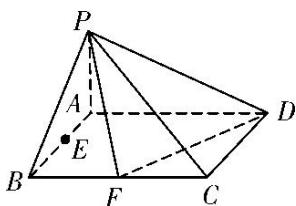

6. 解析 （1）证明：连接 $AF$ ，则 $AF = \sqrt{2}$ ，又 $DF = \sqrt{2}$ ， $AD = 2$ ，所以 $DF^2 + AF^2 = AD^2$ ，所以 $DF \perp AF$ .
因为 $PA \perp$ 平面ABCD，所以 $DF \perp PA$ ，又 $PA \cap AF = A$ ，所以 $DF \perp$ 平面 $PAF$ 又 $PF \subset$ 平面 $PAF$ ，所以 $DF \perp PF$ .

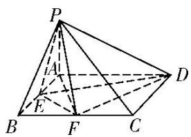  
（2）连接 EP, ED, EF. 因为 $S_{\triangle EFD}=S_{矩形ABCD}-S_{\triangle BEF}-S_{\triangle ADE}-S_{\triangle CDF}=2-\frac{5}{4}=\frac{3}{4}$ ,
所以 $V_{三棱锥 P-EFD}=\frac{1}{3}S_{\triangle EFD}\cdot PA=\frac{1}{3}\times\frac{3}{4}\times1=\frac{1}{4}.$
设点 E 到平面 PFD 的距离为 h，则由 $V_{三棱锥 E-PFD}=V_{三棱锥 P-EFD}$ 得
$\frac{1}{3}S_{\triangle PFD}\cdot h=\frac{1}{3}\times\frac{\sqrt{6}}{2}\cdot h=\frac{1}{4}$ ，解得 $h=\frac{\sqrt{6}}{4}$ ，即点E到平面PFD的距离为 $\frac{\sqrt{6}}{4}$ .

7. 如图，四棱锥 $P - ABCD$ 中， $PA \perp$ 底面 $ABCD$ ，底面 $ABCD$ 为梯形， $AD \parallel BC$ ， $CD \perp BC$ ， $AD = 2$ ， $AB = BC = 3$ ， $PA = 4$ ， $M$ 为 $AD$ 的中点， $N$ 为 $PC$ 上一点，且 $PC = 3PN$ .  
（1）求证：MN//平面PAB;  
（2）求点 M 到平面 PAN 的距离.

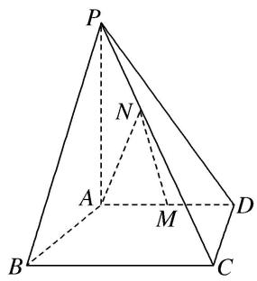

7. 解析 （1）证明: 在平面 $PBC$ 内作 $NH \parallel BC$ 交 $PB$ 于点 $H$ , 连接 $AH$ ,
在 $\triangle PBC$ 中， $NH//BC$ ，且 $NH=\frac{1}{3}BC=1$ ， $AM=\frac{1}{2}AD=1$ ，又 $AD//BC$ ， $\therefore NH//AM$ 且 $NH=AM$ ， $\therefore$ 四边形 $AMNH$ 为平行四边形， $\therefore MN//AH$ ，又 $AH\subset$ 平面 $PAB$ ， $MN\notin$ 平面 $PAB$ ， $\therefore MN//$ 平面 $PAB$ .

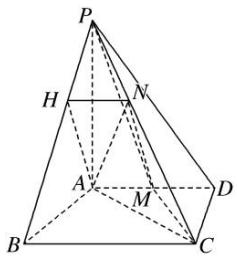  
（2）连接 AC, MC, PM, 平面 PAN 即为平面 PAC, 设点 M 到平面 PAC 的距离为 h.
由题意可得 $CD=2\sqrt{2}$ ， $AC=2\sqrt{3}$ ， $\therefore S_{\triangle PAC}=\frac{1}{2}PA\cdot AC=4\sqrt{3}$ ， $S_{\triangle AMC}=\frac{1}{2}AM\cdot CD=\sqrt{2}$ ，
由 $V_{M-PAC}=V_{P-AMC}$ ，得 $\frac{1}{3}S_{\triangle PAC}\cdot h=\frac{1}{3}S_{\triangle AMC}\cdot PA$ ，即 $4\sqrt{3}h=\sqrt{2}\times4,\quad\therefore h=\frac{\sqrt{6}}{3}$
∴点 M 到平面 PAN 的距离为 $\frac{\sqrt{6}}{3}$ .

8. 如图，在四棱锥 $P - ABCD$ 中，侧面 $PAD$ 是边长为 2 的正三角形，且与底面垂直，底面 $ABCD$ 是 $\angle ABC = 60^{\circ}$ 的菱形， $M$ 为 $PC$ 的中点.  
（1）求证： $PC \perp AD;$  
（2）求点 D 到平面 PAM 的距离.

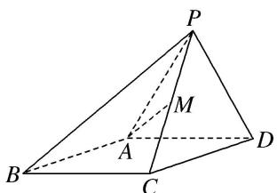

8. 解析 （1）证明：如图，取 $AD$ 的中点 $O$ ，连接 $OP$ ， $OC$ ， $AC$ ，由题意易知 $\triangle ACD$ 为正三角形。所以 $OC \perp AD$ ，又 $\triangle PAD$ 是正三角形， $O$ 为 $AD$ 的中点，所以 $OP \perp AD$ ，又 $OC \cap OP = O$ ，所以 $AD \perp$ 平面 $POC$ ，又 $PC \subset$ 平面 $POC$ ，所以 $PC \perp AD$ 。

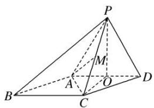  
（2）点 D 到平面 PAM 的距离即点 D 到平面 PAC 的距离，由（1）可知， $PO \perp AD$ ，
又平面 $PAD \perp$ 平面 ABCD，平面 $PAD \cap$ 平面 ABCD = AD， $PO \subset$ 平面 PAD，
所以 $PO \perp$ 平面 ABCD，即 PO 为三棱锥 P-ACD 的高.
在 Rt△POC 中， $PO=OC=\sqrt{3}$ ， $PC=\sqrt{6}$ ，
在 $\triangle PAC$ 中， $PA=AC=2$ ， $PC=\sqrt{6}$ ，边 $PC$ 上的高 $AM=\sqrt{PA^{2}-PM^{2}}=\sqrt{2^{2}-\left(\frac{\sqrt{6}}{2}\right)^{2}}=\frac{\sqrt{10}}{2}$ ，
所以 $S_{\triangle PAC}=\frac{1}{2}PC\cdot AM=\frac{1}{2}\times\sqrt{6}\times\frac{\sqrt{10}}{2}=\frac{\sqrt{15}}{2}.$
设点 D 到平面 PAC 的距离为 h，由 $V_{D-PAC}=V_{P-ACD}$ ，得 $\frac{1}{3}S_{\triangle PAC}\cdot h=\frac{1}{3}S_{\triangle ACD}\cdot PO$ ，
又 $S_{\triangle ACD} = \frac{1}{2}\times 2\times \sqrt{3} = \sqrt{3}$ ，所以 $\frac{1}{3}\times \frac{\sqrt{15}}{2}\cdot h = \frac{1}{3}\times \sqrt{3}\times \sqrt{3}$ ，解得 $h = \frac{2\sqrt{15}}{5}$
故点 D 到平面 PAM 的距离为 $\frac{2\sqrt{15}}{5}$ .

9. 如图，在四棱锥 $P - ABCD$ 中， $PC \perp$ 平面 $ABCD$ ，底面 $ABCD$ 是平行四边形， $AB = BC = 2a$ ， $AC = 2\sqrt{3}a$ ， $E$ 是 $PA$ 的中点.  
（1）求证：平面 $BED \perp$ 平面 $PAC$ ;  
（2）求点 E 到平面 PBC 的距离.

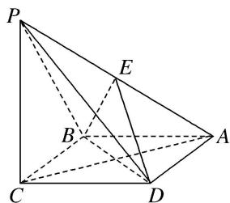

9. 解析 （1）证明：在平行四边形 ABCD 中，AB=BC，∴四边形 ABCD 是菱形，∴ $BD \perp AC$ .
∵PC⊥平面ABCD，BD⊂平面ABCD，∴PC⊥BD，又PC∩AC=C，∴BD⊥平面PAC，
∵BD⊂平面 BED，∴平面 BED⊥平面 PAC.

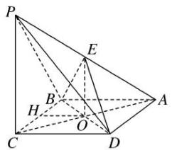  
（2）设 AC 交 BD 于点 O，连接 OE，如图．在 $\triangle PCA$ 中，易知 O 为 AC 的中点，又 E 为 PA 的中点，∴ EO // PC，∵ PC ⊂ 平面 PBC，EO ≠ 平面 PBC，∴ EO // 平面 PBC.
∴点 O 到平面 PBC 的距离就是点 E 到平面 PBC 的距离．∵PC⊥平面 ABCD，PC⊂平面 PBC，
∴平面 $PBC \perp$ 平面 ABCD，且两平面的交线为 BC。在平面 ABCD 内过点 O 作 $OH \perp BC$ 于点 H，
则 $OH \perp$ 平面 PBC，在 Rt△BOC 中， $BC = 2a, OC = \frac{1}{2}AC = \sqrt{3}a, \therefore OB = a.$ 由 $S_{\triangle BOC} = \frac{1}{2}OC \cdot OB = \frac{1}{2}BC \cdot OH,$ 得 $OH=\frac{OB\cdot OC}{BC}=\frac{a\cdot\sqrt{3}a}{2a}=\frac{\sqrt{3}}{2}a,\quad\therefore$ 点 E 到平面 PBC 的距离为 $\frac{\sqrt{3}}{2}a.$

10. 如图 1, 在直角梯形 $ABCP$ 中, $CP \parallel AB$ , $CP \perp BC$ , $AB = BC = \frac{1}{2} CP$ , $D$ 是 $CP$ 的中点, 将 $\triangle PAD$ 沿 $AD$ 折起, 使点 $P$ 到达点 $P'$ 的位置得到图 2, 点 $M$ 为棱 $P'C$ 上的动点.

①当 M 在何处时，平面 $ADM \perp$ 平面 $P'BC$ ，并证明；  
②若 AB=2， $\angle P'DC=135^{\circ}$ ，证明：点 C 到平面 $P'AD$ 的距离等于点 $P'$ 到平面 ABCD 的距离，并求出该距离.
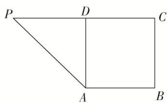

图1

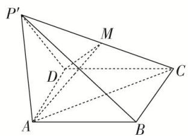

图2

10. 解析 ①当点 M 为 $P'C$ 的中点时，平面 ADM⊥平面 $P'BC$ ，证明如下：
$\because DP'=DC,\ M$ 为 $P'C$ 的中点， $\therefore P'C\perp DM,$
∵ $AD \perp DP'$ , $AD \perp DC$ , $DP' \cap DC = D$ , ∴ $AD \perp$ 平面 $DP'C$ , ∴ $AD \perp P'C$ ,
又 $DM \cap AD = D,\quad \therefore P'C \perp$ 平面 ADM，∴ 平面 ADM ⊥ 平面 $P'BC$ .

②在平面 $P'CD$ 上作 $P'H \perp CD$ 的延长线于点 H,

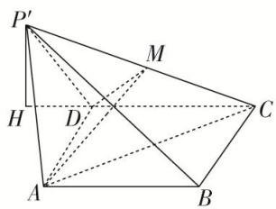
由①中 $AD \perp$ 平面 $DP'C$ ，可知平面 $P'CD \perp$ 平面 ABCD，
又平面 $P'CD \cap$ 平面 ABCD = CD， $P'H \subset$ 平面 $P'CD$ ， $P'H \perp CD$ ，∴ $P'H \perp$ 平面 ABCD，
由题意，得 $DP' = 2$ ， $\angle P'DH = 45^{\circ}$ ， $\therefore P'H = \sqrt{2}$ ，
又 $V_{P'-ADC}=V_{C-P'AD}$ ，设点 C 到平面 $P'AD$ 的距离为 h，即 $\frac{1}{3}S_{\triangle ADC}\times P'H=\frac{1}{3}S_{\triangle P'AD}\times h$
由题意，知 $\triangle ADC\cong\triangle ADP'$ ，则 $S_{\triangle ADC}=S_{\triangle P'AD}$ ．∴ $P'H=h$ ，
故点 C 到平面 $P'AD$ 的距离等于点 $P'$ 到平面 ABCD 的距离，且该距离为 $\sqrt{2}$ .

11. 如图 1, 在矩形 $ABCD$ 中, $AB = 12$ , $AD = 6$ , $E$ , $F$ 分别为 $CD$ , $AB$ 边上的点, 且 $DE = 3$ , $BF = 4$ , 将 $\triangle BCE$ 沿 $BE$ 折起来至 $\triangle PBE$ 的位置(如图 2 所示), 连接 $AP$ , $PF$ , 其中 $PF = 2\sqrt{5}$ .  
（1）求证： $PF \perp$ 平面 ABED;  
（2）求点 A 到平面 PBE 的距离.
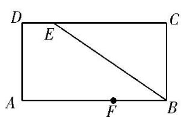

图1

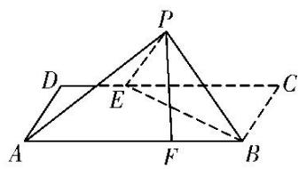

图2

11. 解析 （1） 在题图 2 中，连接 EF，由题意可知 PB=BC=AD=6，PE=CE=CD-DE=9，
在 $\triangle PBF$ 中， $PF^{2}+BF^{2}=20+16=36=PB^{2}$ ，所以 $PF\perp BF$ .
在题图 1 中，连接 EF，作 $EH \perp AB$ 于点 H，利用勾股定理，得 $EF = \sqrt{6^{2} + (12 - 3 - 4)^{2}} = \sqrt{61}$ ,
在 $\triangle PEF$ 中， $EF^{2}+PF^{2}=61+20=81=PE^{2}$ ，所以 $PF\perp EF$ ，
又因为 $BF \cap EF = F$ ， $BF \subset$ 平面 ABED， $EF \subset$ 平面 ABED，所以 $PF \perp$ 平面 ABED.  
（2）如图，连接 AE，由（1）知 $PF \perp$ 平面 ABED,

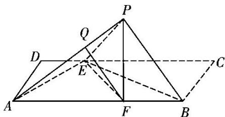
所以 PF 为三棱锥 P-ABE 的高．设点 A 到平面 PBE 的距离为 h，
因为 $V_{A-PBE}=V_{P-ABE}$ ，即 $\frac{1}{3}\times\frac{1}{2}\times6\times9\times h=\frac{1}{3}\times\frac{1}{2}\times12\times6\times2\sqrt{5}$ ，所以 $h=\frac{8\sqrt{5}}{3}$ ,
即点 A 到平面 PBE 的距离为 $\frac{8\sqrt{5}}{3}$ .

12. 如图，在直角梯形 $ABCD$ 中， $AD \parallel BC$ ， $AB \perp BC$ ， $BD \perp DC$ ，点 $E$ 是 $BC$ 边的中点，将 $\triangle ABD$ 沿 $BD$ 折起，使平面 $ABD \perp$ 平面 $BCD$ ，连接 $AE$ ， $AC$ ， $DE$ ，得到如图所示的空间几何体.  
（1）求证： $AB \perp$ 平面 ADC;  
（2）若 $AD = 1$ ， $AB = \sqrt{2}$ ，求点 $B$ 到平面 $ADE$ 的距离.

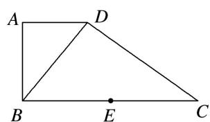

12. 解析 （1） 因为平面 $ABD \perp$ 平面 $BCD$ , 平面 $ABD \cap$ 平面 $BCD = BD$ ,
又 $BD \perp DC$ ，DC⊂平面 BCD，所以 $DC \perp$ 平面 ABD，因为 $AB \subset$ 平面 ABD，所以 $DC \perp AB$ .
又 $AD \perp AB$ ， $DC \cap AD = D$ ，AD， $DC \subset$ 平面 ADC，所以 $AB \perp$ 平面 ADC.  
（2）因为 $AB = \sqrt{2}$ , $AD = 1$ , 所以 $BD = \sqrt{3}$ . 依题意 $\triangle ABD \sim \triangle DCB$ , 所以 $\frac{AB}{AD} = \frac{CD}{BD}$ , 即 $\frac{\sqrt{2}}{1} = \frac{CD}{\sqrt{3}}$ .
所以 $CD=\sqrt{6}$ ，故 BC=3，由于 $AB\perp$ 平面 ADC， $AB\perp AC$ ，E 为 BC 的中点，所以 $AE=\frac{BC}{2}=\frac{3}{2}$ .

同理 $DE=\frac{BC}{2}=\frac{3}{2}$ ，所以 $S_{\triangle ADE}=\frac{1}{2}\times1\times\sqrt{\left(\frac{3}{2}\right)^{2}-\left(\frac{1}{2}\right)^{2}}=\frac{\sqrt{2}}{2}$ ，因为 DC⊥平面 ABD，
所以 $V_{A-BCD}=\frac{1}{3}CD\cdot S_{\triangle ABD}=\frac{\sqrt{3}}{3}$ ，设点 B 到平面 ADE 的距离为 d，
则 $\frac{1}{3} d\cdot S_{\triangle ADE} = V_{B - ADE} = V_{A - BDE} = \frac{1}{2} V_{A - BCD} = \frac{\sqrt{3}}{6}$ 所以 $d = \frac{\sqrt{6}}{2}$ 即点 $B$ 到平面 $ADE$ 的距离为 $\frac{\sqrt{6}}{2}$ .

