**专题11　立体几何中的点面距离问题**

【**方法总结**】

应用等体积转化法求解点到平面的距离

等体积转化法就是通过变换几何体的底面，利用几何体(主要是三棱锥)体积的不同表达形式构造方程来求解相关问题的方法，主要用于立体几何中求解点到面的距离．关键是准确把握三棱锥底面的特征，选择的底面应具备两个特征：一是底面的形状规则，即面积可求；二是底面上的高比较明显，即线面垂直关系比较直接．

**【例题选讲】**

<strong>[例1]</strong>(2019·全国Ⅰ)如图，直四棱柱<em>ABCD</em>－<em>A</em>1<em>B</em>1<em>C</em>1<em>D</em>1的底面是菱形，<em>AA</em>1＝4，<em>AB</em>＝2，∠<em>BAD</em>＝60°，<em>E</em>，<em>M</em>，<em>N</em>分别是<em>BC</em>，<em>BB</em>1，<em>A</em>1<em>D</em>的中点．

(1)证明：<em>MN</em>∥平面<em>C</em>1<em>DE</em>；

(2)求点<em>C</em>到平面<em>C</em>1<em>DE</em>的距离．

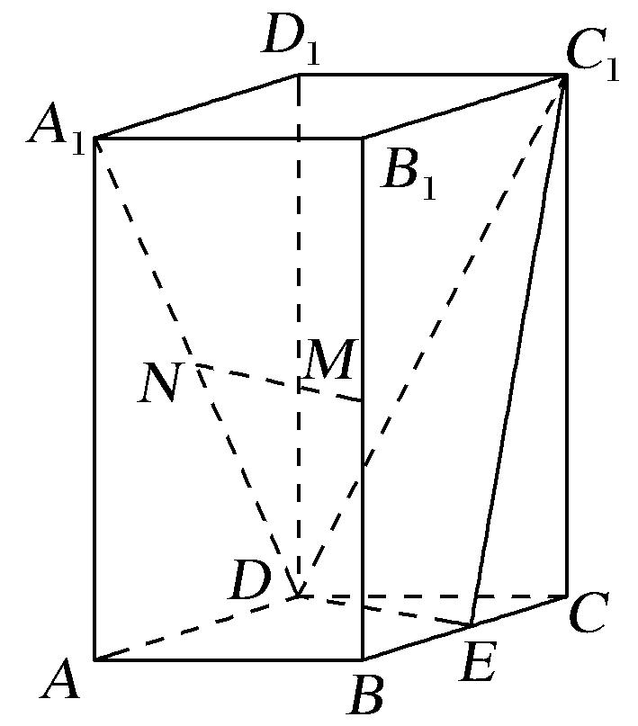

解析　(1)连接<em>B</em>1<em>C</em>，<em>ME</em>．因为<em>M</em>，<em>E</em>分别为<em>BB</em>1，<em>BC</em>的中点，所以<em>ME</em>∥<em>B</em>1<em>C</em>，且<em>ME</em>＝<em>B</em>1<em>C</em>．

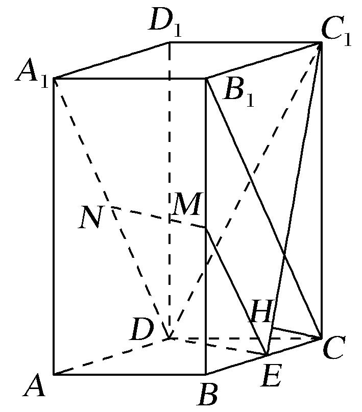

又因为<em>N</em>为<em>A</em>1<em>D</em>的中点，所以<em>ND</em>＝<em>A</em>1<em>D</em>．由题设知<em>A</em>1<em>B</em>1綊<em>DC</em>，可得<em>B</em>1<em>CA</em>1<em>D</em>，故<em>MEND</em>，

因此四边形*MNDE*为平行四边形，所以*MN*∥*ED*．

又<em>MN</em>⊄平面<em>C</em>1<em>DE</em>，<em>ED</em>⊂平面<em>C</em>1<em>DE</em>，所以<em>MN</em>∥平面<em>C</em>1<em>DE</em>．

(2)过点<em>C</em>作<em>C</em>1<em>E</em>的垂线，垂足为<em>H</em>．由已知可得<em>DE</em>⊥<em>BC</em>，<em>DE</em>⊥<em>C</em>1<em>C</em>，

又<em>BC</em>∩<em>C</em>1<em>C</em>＝<em>C</em>，<em>BC</em>，<em>C</em>1<em>C</em>⊂平面<em>C</em>1<em>CE</em>，所以<em>DE</em>⊥平面<em>C</em>1<em>CE</em>，

故<em>DE</em>⊥<em>CH</em>．又<em>C</em>1<em>E</em>∩<em>DE</em>＝<em>E</em>，所以<em>CH</em>⊥平面<em>C</em>1<em>DE</em>，故<em>CH</em>的长即为点<em>C</em>到平面<em>C</em>1<em>DE</em>的距离．

由已知可得<em>CE</em>＝1，<em>C</em>1<em>C</em>＝4，所以<em>C</em>1<em>E</em>＝，故<em>CH</em>＝．从而点<em>C</em>到平面<em>C</em>1<em>DE</em>的距离为．

<strong>[例2]</strong>如图，在四棱锥<em>P</em>－<em>ABCD</em>中，底面是边长为2的正方形，<em>PA</em>＝<em>PD</em>＝，<em>E</em>为<em>PA</em>的中点，点<em>F</em>在<em>PD</em>上且<em>EF</em>⊥平面<em>PCD</em>，<em>M</em>在<em>DC</em>延长线上，<em>FH</em>∥<em>DM</em>，交<em>PM</em>于点<em>H</em>，且<em>FH</em>＝1．

(1)证明：*EF*∥平面*PBM*；

(2)求点*M*到平面*ABP*的距离．

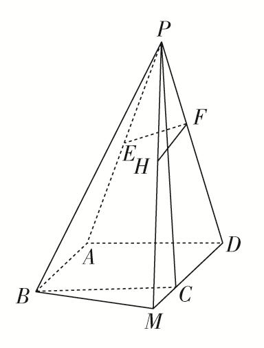

解析　(1)证明：取*PB*的中点*G*，连接*EG*，*HG*，

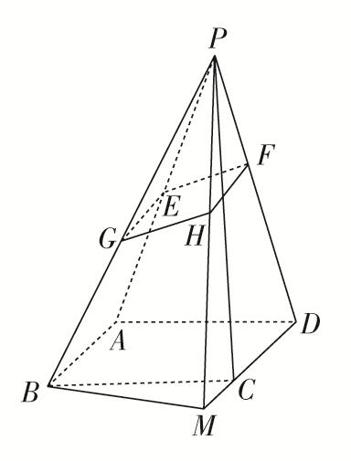

则*EG*∥*AB*，且*EG*＝1，∵*FH*∥*DM*，且*FH*＝1，又*AB*∥*DM*，∴*EG*∥*FH*，*EG*＝*FH*，

即四边形*EFHG*为平行四边形，∴*EF*∥*GH*．

又*EF*⊄平面*PBM*，*GH*⊂平面*PBM*，∴*EF*∥平面*PBM*．

(2)∵*EF*⊥平面*PCD*，*CD*⊂平面*PCD*，∴*EF*⊥*CD*．

∵*AD*⊥*CD*，*EF*和*AD*显然相交，*EF*，*AD*⊂平面*PAD*，∴*CD*⊥平面*PAD*，*CD*⊂平面*ABCD*，

∴平面*ABCD*⊥平面*PAD*．取*AD*的中点*O*，连接*PO*，

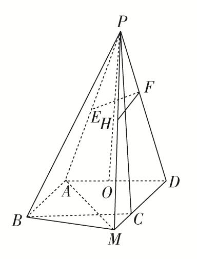

∵*PA*＝*PD*，∴*PO*⊥*AD*．又平面*ABCD*∩平面*PAD*＝*AD*，*PO*⊂平面*PAD*，∴*PO*⊥平面*ABCD*，

∵*AB*∥*CD*，∴*AB*⊥平面*PAD*，∵*PA*⊂平面*PAD*，∴*PA*⊥*AB*，

在等腰三角形*PAD*中，*PO*＝＝＝4．

设点<em>M</em>到平面<em>ABP</em>的距离为<em>h</em>，连接<em>AM</em>，利用等体积可得<em>VM</em>－<em>ABP</em>＝<em>VP</em>－<em>ABM</em>，

即××2××*h*＝××2×2×4，∴*h*＝＝，∴点*M*到平面*PAB*的距离为．

<strong>[例3]</strong>如图，已知四棱锥<em>P</em>－<em>ABCD</em>的底面<em>ABCD</em>为菱形，且∠<em>ABC</em>＝60°，<em>AB</em>＝<em>PC</em>＝2，<em>PA</em>＝<em>PB</em>＝．

(1)求证：平面*PAB*⊥平面*ABCD*；

(2)求点*D*到平面*APC*的距离．

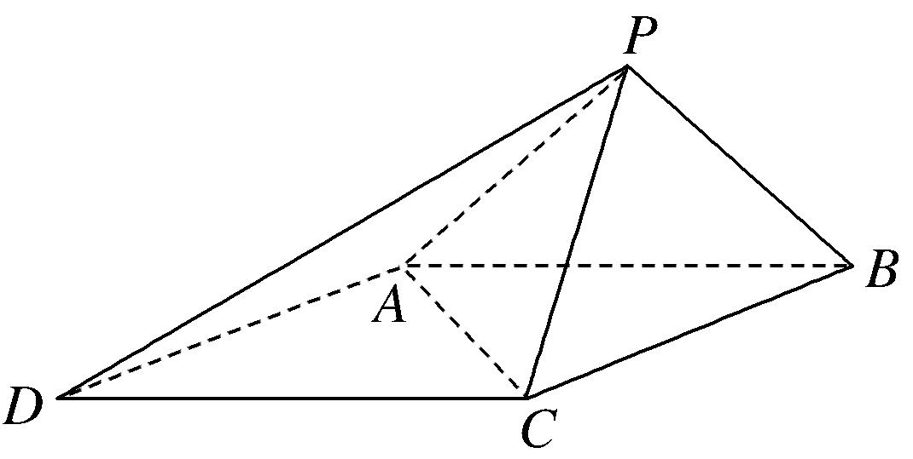

解析　(1)证明：取*AB*的中点*O*，连接*PO*，*CO*，(图略)，

由*PA*＝*PB*＝，*AB*＝2知△*PAB*为等腰直角三角形，∴*PO*⊥*AB*，*PO*＝1，

由*AB*＝*BC*＝2，∠*ABC*＝60°知△*ABC*为等边三角形，∴*CO*＝．

又由<em>PC</em>＝2得<em>PO</em>2＋<em>CO</em>2＝<em>PC</em>2，∴<em>PO</em>⊥<em>CO</em>，又<em>AB</em>∩<em>CO</em>＝<em>O</em>，∴<em>PO</em>⊥平面<em>ABC</em>，

又*PO*⊂平面*PAB*，∴平面*PAB*⊥平面*ABCD*．

(2)由题知△*ADC*是边长为2的等边三角形，△*PAC*为等腰三角形，设点*D*到平面*APC*的距离为*h*，

由<em>VD</em>­<em>PAC</em>＝<em>VP</em>­<em>ADC</em>得<em>S</em>△<em>PAC</em>·<em>h</em>＝<em>S</em>△<em>ADC</em>·<em>PO</em>．∵<em>S</em>△<em>ADC</em>＝×22＝，<em>S</em>△<em>PAC</em>＝<em>PA</em>·＝，

∴*h*＝＝＝，即点*D*到平面*APC*的距离为．

<strong>[例4]</strong>如图，在单位正方体<em>ABCD</em>­<em>A</em>1<em>B</em>1<em>C</em>1<em>D</em>1中，<em>E</em>，<em>F</em>分别是<em>AD</em>，<em>BC</em>1的中点．

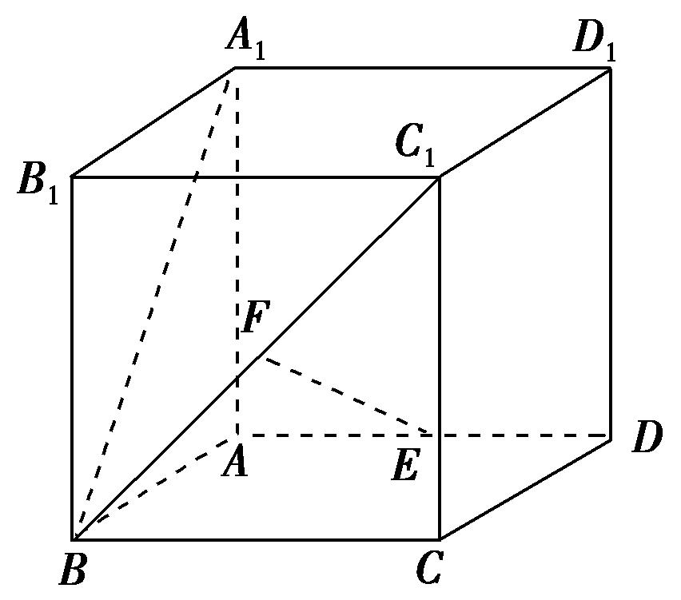

(1)求证：<em>EF</em>∥平面<em>C</em>1<em>CDD</em>1；

(2)在线段<em>A</em>1<em>B</em>上是否存在点<em>G</em>，使<em>EG</em>⊥平面<em>A</em>1<em>BC</em>1？若存在，求点<em>G</em>到平面<em>C</em>1<em>DF</em>的距离；若不存在，请说明理由．

解析　(1)证明：取*BC*的中点*M*，连接*EM*，*FM*，

∵<em>E</em>，<em>F</em>分别是<em>AD</em>，<em>BC</em>1的中点，∴<em>EM</em>∥<em>DC</em>，<em>FM</em>∥<em>C</em>1<em>C</em>，

*EM*⊂平面*EFM*，*FM*⊂平面*EFM*，*EM*∩*FM*＝*M*，

<em>DC</em>⊂平面<em>C</em>1<em>CDD</em>1，<em>C</em>1<em>C</em>⊂平面<em>C</em>1<em>CDD</em>1，<em>DC</em>∩<em>C</em>1<em>C</em>＝<em>C</em>，

∴平面<em>EFM</em>∥平面<em>C</em>1<em>CDD</em>1，而<em>EF</em>⊂平面<em>EFM</em>，∴<em>EF</em>∥平面<em>C</em>1<em>CDD</em>1．

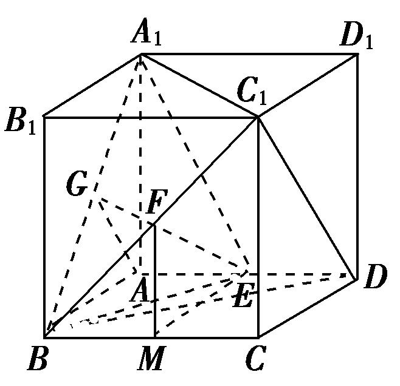

(2)取<em>A</em>1<em>B</em>的中点<em>G</em>，连接<em>EG</em>，<em>EA</em>1，<em>EB</em>，易知<em>EA</em>1＝<em>EB</em>，而<em>G</em>为中点，∴<em>EG</em>⊥<em>A</em>1<em>B</em>．

连接<em>FG</em>，则<em>FG</em>∥<em>A</em>1<em>C</em>1，∵正方体棱长为1，在△<em>A</em>1<em>BC</em>1中，<em>FG</em>＝<em>A</em>1<em>C</em>1＝．

在Rt△*FME*中，*EF*＝，在Rt△*EAG*中，*EG*＝，

∴<em>FG</em>2＋<em>EG</em>2＝<em>FE</em>2，即<em>EG</em>⊥<em>FG</em>，故<em>EG</em>⊥<em>A</em>1<em>C</em>1，又<em>A</em>1<em>B</em>，<em>A</em>1<em>C</em>1⊂平面<em>A</em>1<em>BC</em>1，<em>A</em>1<em>B</em>∩<em>A</em>1<em>C</em>1＝<em>A</em>1，

∴<em>EG</em>⊥平面<em>A</em>1<em>BC</em>1．点<em>G</em>到平面<em>C</em>1<em>DF</em>的距离就是点<em>G</em>到平面<em>C</em>1<em>DB</em>的距离．

∵<em>GA</em>∥<em>C</em>1<em>D</em>，∴<em>GA</em>∥平面<em>C</em>1<em>DB</em>，∴点<em>G</em>到平面<em>C</em>1<em>DB</em>的距离就是点<em>A</em>到平面<em>C</em>1<em>DB</em>的距离．

易知<em>S</em>△<em>BDC</em>1＝，<em>S</em>△<em>ABD</em>＝，点<em>C</em>1到平面<em>ABD</em>的距离为1，

设点<em>G</em>到平面<em>C</em>1<em>DF</em>的距离为<em>d</em>，由<em>VC</em>1­<em>ABD</em>＝<em>VA</em>­<em>BDC</em>1得×1×<em>S</em>△<em>ABD</em>＝·<em>d</em>·<em>S</em>△<em>BDC</em>1，

即＝<em>d</em>·，∴<em>d</em>＝，即点<em>G</em>到平面<em>C</em>1<em>DF</em>的距离为．

<strong>[例5]</strong>如图1，四边形<em>ABCD</em>为等腰梯形，<em>AB</em>＝2，<em>AD</em>＝<em>DC</em>＝<em>CB</em>＝1，将△<em>ADC</em>沿<em>AC</em>折起，使得平面<em>ADC</em>⊥平面<em>ABC</em>，<em>E</em>为<em>AB</em>的中点，连接<em>DE</em>，<em>DB</em>(如图2)．

(1)求证：*BC*⊥*AD*；

(2)求点*E*到平面*BCD*的距离．

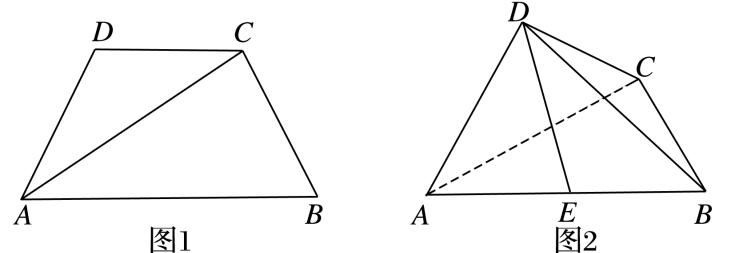

解析　(1)作*CH*⊥*AB*于点*H*，则*BH*＝，*AH*＝，又*BC*＝1，∴*CH*＝，∴*CA*＝，

∴*AC*⊥*BC*，∵平面*ADC*⊥平面*ABC*，且平面*ADC*∩平面*ABC*＝*AC*，*BC*⊂平面*ABC*，

∴*BC*⊥平面*ADC*，又*AD*⊂平面*ADC*，∴*BC*⊥*AD*．

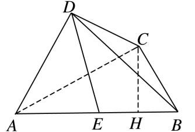

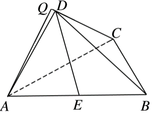

(2)∵*E*为*AB*的中点，∴点*E*到平面*BCD*的距离等于点*A*到平面*BCD*距离的一半．

而平面*ADC*⊥平面*BCD*，∴过*A*作*AQ*⊥*CD*于*Q*，又∵平面*ADC*∩平面*BCD*＝*CD*，且*AQ*⊂平面*ADC*，

∴*AQ*⊥平面*BCD*，*AQ*就是点*A*到平面*BCD*的距离．

由(1)知*AC*＝，*AD*＝*DC*＝1，∴cos∠*ADC*＝＝－，

又0<∠*ADC*<π，∴∠*ADC*＝，∴在Rt△*QAD*中，∠*QDA*＝，*AD*＝1，

∴*AQ*＝*AD*·sin∠*QDA*＝1×＝．∴点*E*到平面*BCD*的距离为．

<strong>[例6]</strong>如图，高为1的等腰梯形<em>ABCD</em>中，<em>AM</em>＝<em>CD</em>＝<em>AB</em>＝1．现将△<em>AMD</em>沿<em>MD</em>折起，使平面<em>AMD</em>⊥平面<em>MBCD</em>，连接<em>AB</em>，<em>AC</em>．

(1)在*AB*边上是否存在点*P*，使*AD*∥平面*MPC?*

(2)当点*P*为*AB*边的中点时，求点*B*到平面*MPC*的距离．

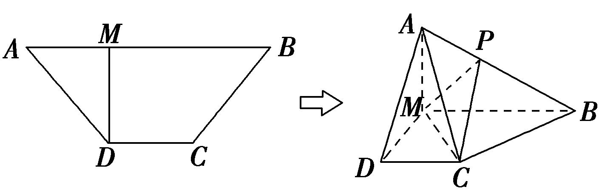

解析　(1)当*AP*＝*AB*时，有*AD*∥平面*MPC*．理由如下：

连接*BD*交*MC*于点*N*，连接*NP*．在梯形*MBCD*中，*DC*∥*MB*，＝＝，

在△*ADB*中，＝，∴*AD*∥*PN*．∵*AD*⊄平面*MPC*，*PN*⊂平面*MPC*，∴*AD*∥平面*MPC*．

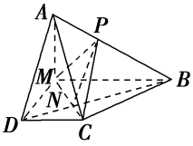

(2)∵平面*AMD*⊥平面*MBCD*，平面*AMD*∩平面*MBCD*＝D*M*，*AM*⊥*DM*，∴*AM*⊥平面*MBCD*．

∴<em>VP</em>­<em>MBC</em>＝×<em>S</em>△<em>MBC</em>×＝××2×1×＝．在△<em>MPC</em>中，<em>MP</em>＝<em>AB</em>＝，<em>MC</em>＝，

又<em>PC</em>＝＝，∴<em>S</em>△<em>MPC</em>＝×× ＝．

∴点*B*到平面*MPC*的距离为*d*＝＝＝．

【**对点训练**】

1．(2018·全国Ⅱ)如图，在三棱锥*P－ABC*中，*AB*＝*BC*＝2，*PA*＝*PB*＝*PC*＝*AC*＝4，*O*为*AC*的中点．

(1)证明：*PO*⊥平面*ABC*；

(2)若点*M*在棱*BC*上，且*MC*＝2*MB*，求点*C*到平面*POM*的距离．

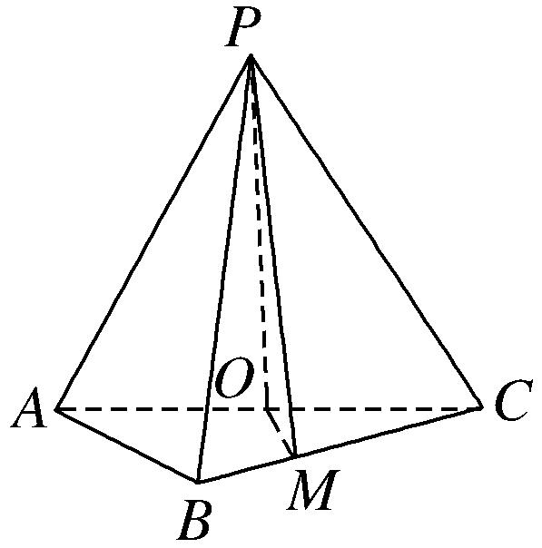

1．解析　(1)证明：因为*PA*＝*PC*＝*AC*＝4，*O*为*AC*的中点，所以*PO*⊥*AC*，且*PO*＝2．连接*OB*，

因为*AB*＝*BC*＝*AC*，所以△*ABC*为等腰直角三角形，且*OB*⊥*AC*，*OB*＝*AC*＝2．

所以<em>PO</em>2＋<em>OB</em>2＝<em>PB</em>2，所以<em>PO</em>⊥<em>OB</em>．又因为<em>AC</em>∩<em>OB</em>＝<em>O</em>，所以<em>PO</em>⊥平面<em>ABC</em>．

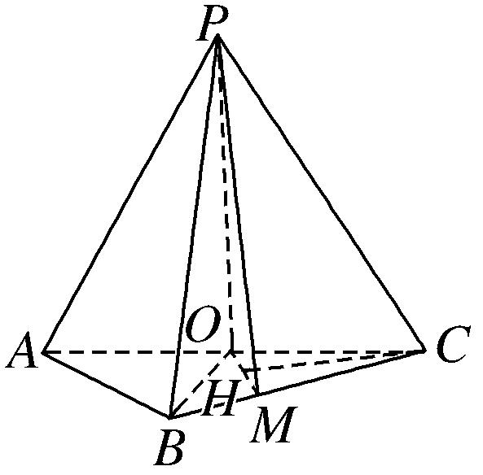

(2)作*CH*⊥*OM*，垂足为*H*，又由(1)可得*OP*⊥*CH*，所以*CH*⊥平面*POM*．

故*CH*的长为点*C*到平面*POM*的距离．

由题设可知*OC*＝*AC*＝2，*CM*＝*BC*＝，∠*ACB*＝45°，

所以*OM*＝，*CH*＝＝．所以点*C*到平面*POM*的距离为．

2．(2013·江西)如图，直四棱柱<em>ABCD</em>－<em>A</em>1<em>B</em>1<em>C</em>1<em>D</em>1中，<em>AB</em>∥<em>CD</em>，<em>AD</em>⊥<em>AB</em>，<em>AB</em>＝2，<em>AD</em>＝，<em>AA</em>1＝3，<em>E</em>

为*CD*上一点，*DE*＝1，*EC*＝3．

(1)证明：<em>BE</em>⊥平面<em>BB</em>1<em>C</em>1<em>C</em>；

(2)求点<em>B</em>1到平面<em>EA</em>1<em>C</em>1的距离．

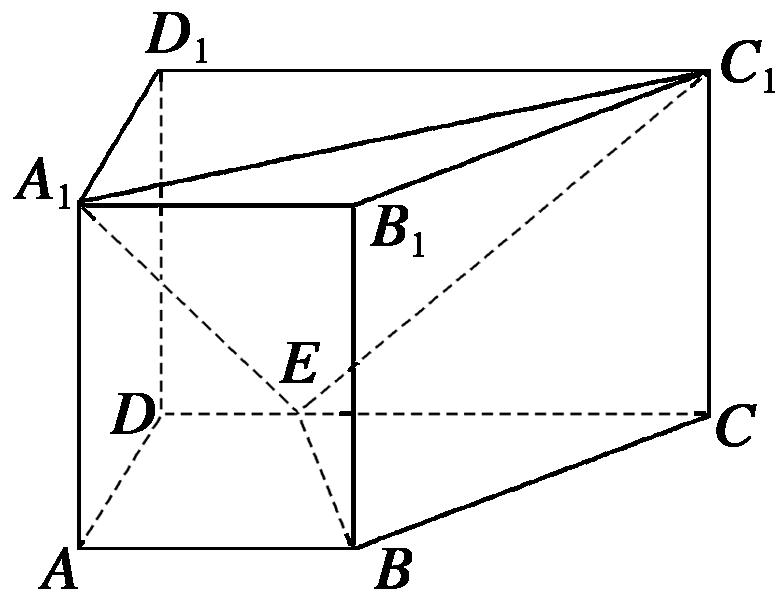

2．解析　(1)过*B*作*CD*的垂线交*CD*于*F*，则*BF*＝*AD*＝，*EF*＝*AB*－*DE*＝1，*FC*＝2．

在Rt△<em>BFE</em>中，<em>BE</em>＝．在Rt△<em>CFB</em>中，<em>BC</em>＝．在△<em>BEC</em>中，因为<em>BE</em>2＋<em>BC</em>2＝9＝<em>EC</em>2，故<em>BE</em>⊥<em>BC</em>．

由<em>BB</em>1⊥平面<em>ABCD</em>得<em>BE</em>⊥<em>BB</em>1，又<em>BB</em>1∩<em>BC</em>＝<em>B</em>，所以<em>BE</em>⊥平面<em>BB</em>1<em>C</em>1<em>C</em>．

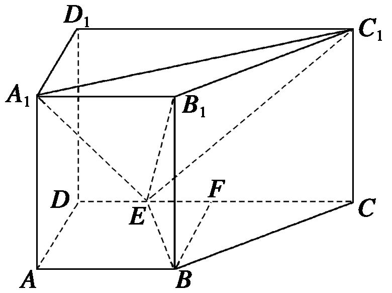

(2)三棱锥<em>E</em>－<em>A</em>1<em>B</em>1<em>C</em>1的体积<em>V</em>＝<em>AA</em>1·＝．在Rt△<em>A</em>1<em>D</em>1<em>C</em>1中，<em>A</em>1<em>C</em>1＝＝3．

同理，<em>EC</em>1＝＝3，<em>A</em>1<em>E</em>＝＝2．故＝3．

设点<em>B</em>1到平面<em>A</em>1<em>C</em>1<em>E</em>的距离为<em>d</em>，则三棱锥<em>B</em>1－<em>A</em>1<em>C</em>1<em>E</em>的体积<em>V</em>＝·<em>d</em>·＝<em>d</em>，

从而<em>d</em>＝，<em>d</em>＝．即点<em>B</em>1到平面<em>EA</em>1<em>C</em>1的距离为．

3．如图，在三棱锥*A*—*BCD*中，△*ABC*是等腰直角三角形，且*AC*⊥*BC*，*BC*＝2，*AD*⊥平面*BCD*，*AD*

＝1．

(1)求证：平面*ABC*⊥平面*ACD*；

(2)若*E*为*AB*的中点，求点*A*到平面*CED*的距离．

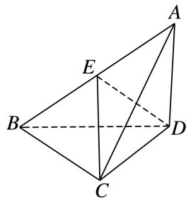

3．解析　(1)因为*AD*⊥平面*BCD*，*BC*⊂平面*BCD*，所以*AD*⊥*BC*，又*AC*⊥*BC*，*AC*∩*AD*＝*A*，

*AC*，*AD*⊂平面*ABCD*，所以*BC*⊥平面*ACD*，因为*BC*⊂平面*ABC*，所以平面*ABC*⊥平面*ACD*．

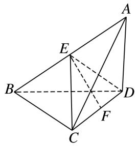

(2)由已知可得*CD*＝，取*CD*的中点*F*，连接*EF*，因为*E*为*AB*的中点，所以*ED*＝*EC*＝*AB*＝，

所以△<em>ECD</em>为等腰三角形，从而<em>EF</em>＝，所以<em>S</em>△<em>ECD</em>＝××＝．

由(1)知<em>BC</em>⊥平面<em>ACD</em>，所以<em>E</em>到平面<em>ACD</em>的距离为1，<em>S</em>△<em>ACD</em>＝××1＝．

设点<em>A</em>到平面<em>CED</em>的距离为<em>d</em>，则<em>V</em>三棱锥<em>A</em>—<em>ECD</em>＝·<em>S</em>△<em>ECD</em>·<em>d</em>＝<em>V</em>三棱锥<em>E</em>—<em>ACD</em>＝·<em>S</em>△<em>ACD</em>·1，解得<em>d</em>＝．

4．已知三棱锥*P*－*ABC*中，*AC*⊥*BC*，*AC*＝*BC*＝2，*PA*＝*PB*＝*PC*＝3，*O*是*AB*的中点， *E*是*PB*的中

点．

(1)证明：平面*PAB*⊥平面*ABC*；

(2)求点*B*到平面*OEC*的距离．

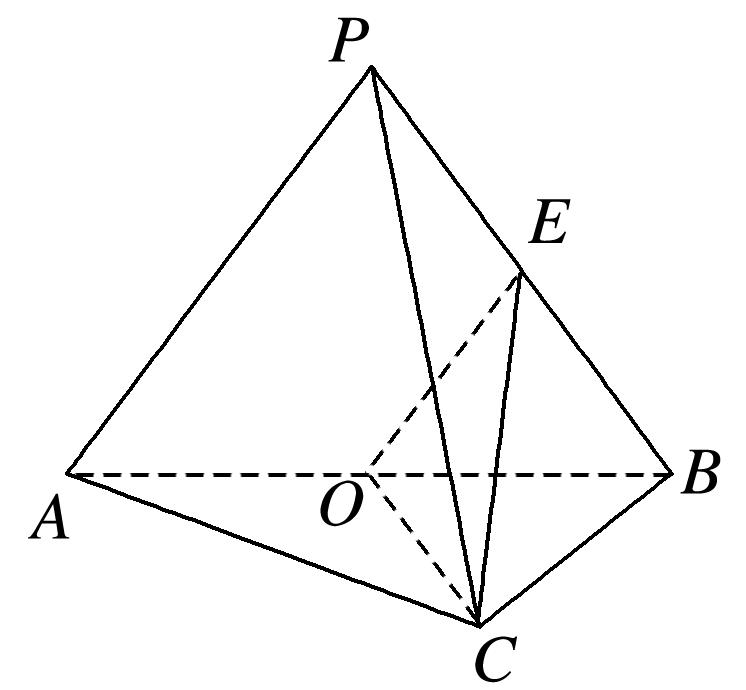

4．解析　(1)连接*PO*，在△*PAB*中， *PA*＝*PB, O*是*AB*中点，∴*PO*⊥*AB*，又∵*AC*＝*BC*＝2, *AC*⊥*BC*，

∴<em>AB</em>＝2，<em>OB</em>＝<em>OC</em>＝．∵<em>PA</em>＝<em>PB</em>＝<em>PC</em>＝3，∴<em>PO</em>＝，<em>PC</em>2＝<em>PO</em>2＋<em>OC</em>2，∴<em>PO</em>⊥<em>OC</em>．

又*AB*∩*OC*＝*O, AB*⊂平面*ABC, OC*⊂平面*ABC*，∴*PO*⊥平面*ABC*，∵*PO*⊂平面*PAB*，

∴平面*PAB*⊥平面*ABC*．

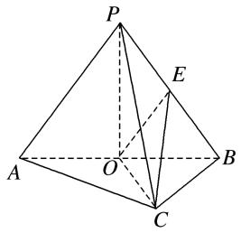

(2)∵*OE*是△*PAB*的中位线，∴*OE*＝．∵*O*是*AB*的中点， *AC*＝*BC*，∴*OC*⊥*AB*．

又平面*PAB*⊥平面*ABC*，两平面的交线为*AB*，∴*OC*⊥平面*PAB*，∵*OE*⊂平面*PAB*，∴*OC*⊥*OE*．

设点<em>B</em>到平面<em>OEC</em>的距离为<em>d</em>，则<em>VB</em>－<em>OEC</em>＝<em>VE</em>－<em>OBC</em>，∴×<em>S</em>△<em>OEC</em>·<em>d</em>＝×<em>S</em>△<em>OBC</em>×<em>OP</em>，

*d*＝＝＝．

5．在如图所示的几何体中，四边形*ABCD*是直角梯形，*AD*∥*BC*，*AB*⊥*BC*，*AD*＝2，*AB*＝3，*BC*＝*BE*＝7，△*DCE*是边长为6的正三角形．

(1)求证：平面*DEC*⊥平面*BDE*；

(2)求点*A*到平面*BDE*的距离．

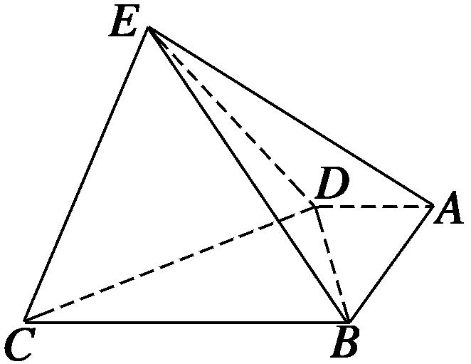

5．解析　(1)因为四边形*ABCD*为直角梯形，*AD*∥*BC*，*AB*⊥*BC*，*AD*＝2，*AB*＝3，所以*BD*＝，

又因为*BC*＝7，*CD*＝6，所以根据勾股定理可得*BD*⊥*CD*，因为*BE*＝7，*DE*＝6，同理可得*BD*⊥*DE*．

因为*DE*∩*CD*＝*D*，*DE*⊂平面*DEC*，*CD*⊂平面*DEC*，所以*BD*⊥平面*DEC*.因为*BD*⊂平面*BDE*，

所以平面*DEC*⊥平面*BDE*．

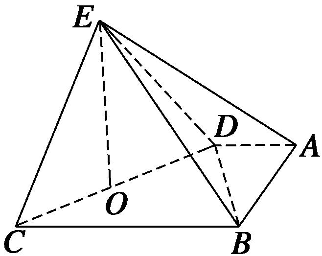

(2)如图，取*CD*的中点*O*，连接*OE*，因为△*DCE*是边长为6的正三角形，

所以<em>EO</em>⊥<em>CD</em>，<em>EO</em>＝3，由(1)易知<em>EO</em>⊥平面<em>ABCD</em>，则<em>VE</em>－<em>ABD</em>＝××2×3×3＝3，

又因为Rt△*BDE*的面积为×6×＝3，

设点<em>A</em>到平面<em>BDE</em>的距离为<em>h</em>，则由<em>VE</em>－<em>ABD</em>＝<em>VA</em>－<em>BDE</em>，得×3<em>h</em>＝3，所以<em>h</em>＝，

所以点*A*到平面*BDE*的距离为．

6．如图，在四棱锥*P*－*ABCD*中，底面*ABCD*是矩形，且*AD*＝2，*AB*＝1，*PA*⊥平面*ABCD*，*E*，*F*分别

是线段*AB*，*BC*的中点．

(1)证明：*PF*⊥*FD*；

(2)若*PA*＝1，求点*E*到平面*PFD*的距离．

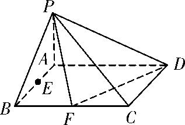

6．解析　(1)证明：连接*AF*，则*AF*＝，又*DF*＝，*AD*＝2，

所以<em>DF</em>2＋<em>AF</em>2＝<em>AD</em>2，所以<em>DF</em>⊥<em>AF</em>．

因为*PA*⊥平面*ABCD*，所以*DF*⊥*PA*，又*PA*∩*AF*＝*A*，所以*DF*⊥平面*PAF*，

又*PF*⊂平面*PAF*，所以*DF*⊥*PF*．

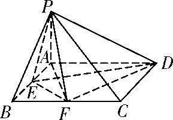

(2)连接<em>EP</em>，<em>ED</em>，<em>EF</em>．因为<em>S</em>△<em>EFD</em>＝<em>S</em>矩形<em>ABCD</em>－<em>S</em>△<em>BEF</em>－<em>S</em>△<em>ADE</em>－<em>S</em>△<em>CDF</em>＝2－＝，

所以<em>V</em>三棱锥<em>P</em>－<em>EFD</em>＝<em>S</em>△<em>EFD</em>·<em>PA</em>＝××1＝．

设点<em>E</em>到平面<em>PFD</em>的距离为<em>h</em>，则由<em>V</em>三棱锥<em>E</em>－<em>PFD</em>＝<em>V</em>三棱锥<em>P</em>－<em>EFD</em>得

<em>S</em>△<em>PFD</em>·<em>h</em>＝×·<em>h</em>＝，解得<em>h</em>＝，即点<em>E</em>到平面<em>PFD</em>的距离为．

7．如图，四棱锥*P*－*ABCD*中，*PA*⊥底面*ABCD*，底面*ABCD*为梯形，*AD*∥*BC*，*CD*⊥*BC*，*AD*＝2，*AB*

＝*BC*＝3，*PA*＝4，*M*为*AD*的中点，*N*为*PC*上一点，且*PC*＝3*PN*．

(1)求证：*MN*∥平面*PAB*；

(2)求点*M*到平面*PAN*的距离．

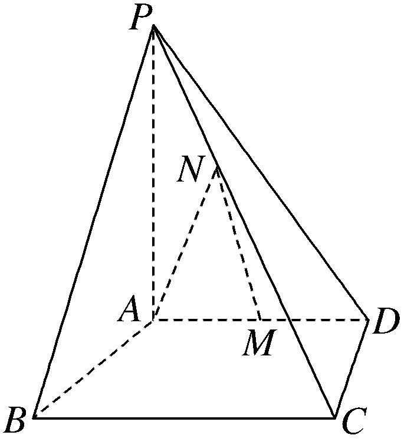

7．解析　(1)证明：在平面*PBC*内作*NH*∥*BC*交*PB*于点*H*，连接*AH*，

在△*PBC*中，*NH*∥*BC*，且*NH*＝*BC*＝1，*AM*＝*AD*＝1，又*AD*∥*BC*，∴*NH*∥*AM*且*NH*＝*AM*，

∴四边形*AMNH*为平行四边形，∴*MN*∥*AH*，又*AH*⊂平面*PAB*，*MN*⊄平面*PAB*，∴*MN*∥平面*PAB*．

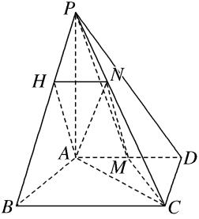

(2)连接*AC*，*MC*，*PM*，平面*PAN*即为平面*PAC*，设点*M*到平面*PAC*的距离为*h*．

由题意可得<em>CD</em>＝2，<em>AC</em>＝2，∴<em>S</em>△<em>PAC</em>＝<em>PA</em>·<em>AC</em>＝4，<em>S</em>△<em>AMC</em>＝<em>AM</em>·<em>CD</em>＝，

由<em>VM</em>­<em>PAC</em>＝<em>VP</em>­<em>AMC</em>，得<em>S</em>△<em>PAC</em>·<em>h</em>＝<em>S</em>△<em>AMC</em>·<em>PA</em>，即4<em>h</em>＝×4，∴<em>h</em>＝，

∴点*M*到平面*PAN*的距离为．

8．如图，在四棱锥*P*－*ABCD*中，侧面*PAD*是边长为2的正三角形，且与底面垂直，底面*ABCD*是∠*ABC*

＝60°的菱形，*M*为*PC*的中点．

(1)求证：*PC*⊥*AD*；

(2)求点*D*到平面*PAM*的距离．

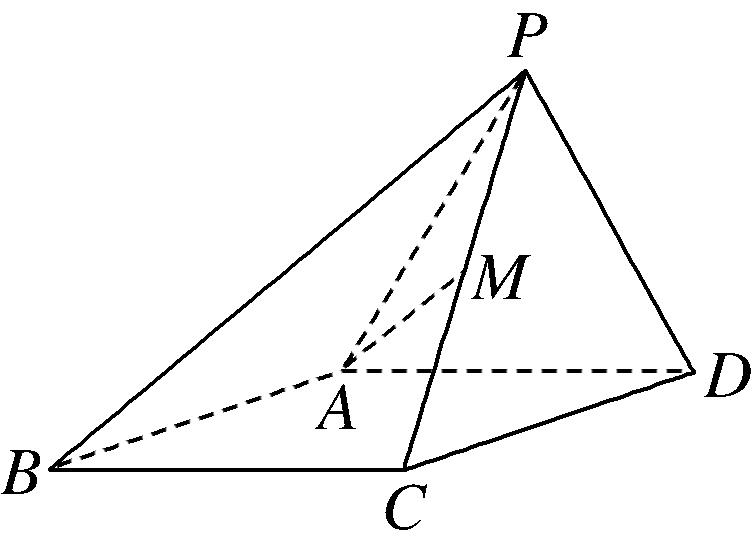

8．解析　(1)证明：如图，取*AD*的中点*O*，连接*OP*，*OC*，*AC*，由题意易知△*ACD*为正三角形．

所以*OC*⊥*AD*，又△*PAD*是正三角形，*O*为*AD*的中点，所以*OP*⊥*AD*，

又*OC*∩*OP*＝*O*，所以*AD*⊥平面*POC*，又*PC*⊂平面*POC*，所以*PC*⊥*AD*．

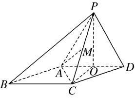

(2)点*D*到平面*PAM*的距离即点*D*到平面*PAC*的距离，由(1)可知，*PO*⊥*AD*，

又平面*PAD*⊥平面*ABCD*，平面*PAD*∩平面*ABCD*＝*AD*，*PO*⊂平面*PAD*，

所以*PO*⊥平面*ABCD*，即*PO*为三棱锥*P*－*ACD*的高．

在Rt△*POC*中，*PO*＝*OC*＝，*PC*＝，

在△*PAC*中，*PA*＝*AC*＝2，*PC*＝，边*PC*上的高*AM*＝＝＝，

所以<em>S</em>△<em>PAC</em>＝<em>PC</em>·<em>AM</em>＝××＝．

设点<em>D</em>到平面<em>PAC</em>的距离为<em>h</em>，由<em>VD</em>­<em>PAC</em>＝<em>VP</em>­<em>ACD</em>，得<em>S</em>△<em>PAC</em>·<em>h</em>＝<em>S</em>△<em>ACD</em>·<em>PO</em>，

又<em>S</em>△<em>ACD</em>＝×2×＝，所以×·<em>h</em>＝××，解得<em>h</em>＝．

故点*D*到平面*PAM*的距离为．

9．如图，在四棱锥*P*－*ABCD*中，*PC*⊥平面*ABCD*，底面*ABCD*是平行四边形，*AB*＝*BC*＝2*a*，*AC*＝2

*a*，*E*是*PA*的中点．

(1)求证：平面*BED*⊥平面*PAC*；

(2)求点*E*到平面*PBC*的距离．

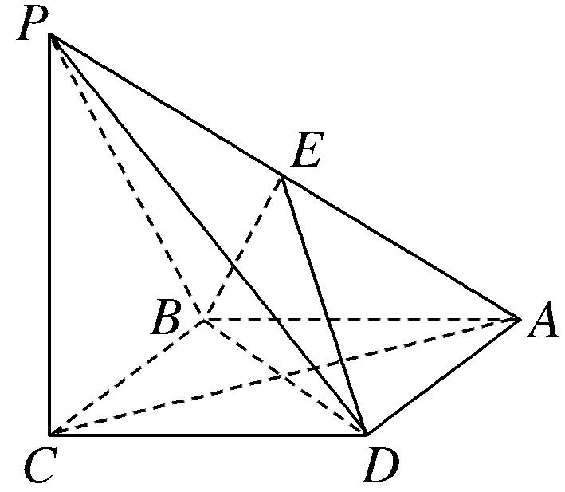

9．解析　(1)证明：在平行四边形*ABCD*中，*AB*＝*BC*，∴四边形*ABCD*是菱形，∴*BD*⊥*AC*．

∵*PC*⊥平面*ABCD*，*BD*⊂平面*ABCD*，∴*PC*⊥*BD*，又*PC*∩*AC*＝*C*，∴*BD*⊥平面*PAC*，

∵*BD*⊂平面*BED*，∴平面*BED*⊥平面*PAC*．

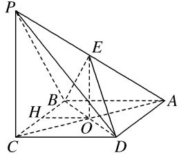

(2)设*AC*交*BD*于点*O*，连接*OE*，如图．在△*PCA*中，易知*O*为*AC*的中点，又*E*为*PA*的中点，

∴*EO*∥*PC*，∵*PC*⊂平面*PBC*，*EO*⊄平面*PBC*，∴*EO*∥平面*PBC*．

∴点*O*到平面*PBC*的距离就是点*E*到平面*PBC*的距离．∵*PC*⊥平面*ABCD*，*PC*⊂平面*PBC*，

∴平面*PBC*⊥平面*ABCD*，且两平面的交线为*BC*．在平面*ABCD*内过点*O*作*OH*⊥*BC*于点*H*，

则<em>OH</em>⊥平面<em>PBC</em>，在Rt△<em>BOC</em>中，<em>BC</em>＝2<em>a</em>，<em>OC</em>＝<em>AC</em>＝<em>a</em>，∴<em>OB</em> ＝<em>a</em>．由<em>S</em>△<em>BOC</em>＝<em>OC</em>·<em>OB</em>＝<em>BC</em>·<em>OH</em>，

得*OH*＝＝＝*a*，∴点*E*到平面*PBC*的距离为*a*．

10．如图1，在直角梯形*ABCP*中，*CP*∥*AB*，*CP*⊥*BC*，*AB*＝*BC*＝*CP*，*D*是*CP*的中点，将△*PAD*沿*AD*

折起，使点*P*到达点*P*′的位置得到图2，点*M*为棱*P*′*C*上的动点．

①当*M*在何处时，平面*ADM*⊥平面*P*′*BC*，并证明；

②若*AB*＝2，∠*P*′*DC*＝135°，证明：点*C*到平面*P*′*AD*的距离等于点*P*′到平面*ABCD*的距离，并求出该距离．

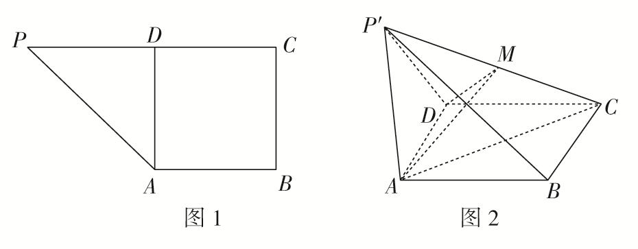

10．解析　①当点*M*为*P*′*C*的中点时，平面*ADM*⊥平面*P*′*BC*，证明如下：

∵*DP*′＝*DC*，*M*为*P*′*C*的中点，∴*P*′*C*⊥*DM*，

∵*AD*⊥*DP*′，*AD*⊥*DC*，*DP*′∩*DC*＝*D*，∴*AD*⊥平面*DP*′*C*，∴*AD*⊥*P*′*C*，

又*DM*∩*AD*＝*D*，∴*P*′*C*⊥平面*ADM*，∴平面*ADM*⊥平面*P*′*BC*．

②在平面*P*′*CD*上作*P*′*H*⊥*CD*的延长线于点*H*，

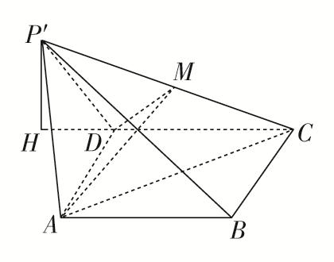

由①中*AD*⊥平面*DP*′*C*，可知平面*P*′*CD*⊥平面*ABCD*，

又平面*P*′*CD*∩平面*ABCD*＝*CD*，*P*′*H*⊂平面*P*′*CD*，*P*′*H*⊥*CD*，∴*P*′*H*⊥平面*ABCD*，

由题意，得*DP*′＝2，∠*P*′*DH*＝45°，∴*P*′*H*＝，

又<em>VP</em>′－<em>ADC</em>＝<em>VC</em>－<em>P</em>′<em>AD</em>，设点<em>C</em>到平面<em>P</em>′<em>AD</em>的距离为<em>h</em>，即<em>S</em>△<em>ADC</em>×<em>P</em>′<em>H</em>＝<em>S</em>△<em>P</em>′<em>AD</em>×<em>h</em>，

由题意，知△<em>ADC</em>≌△<em>ADP</em>′，则<em>S</em>△<em>ADC</em>＝<em>S</em>△<em>P</em>′<em>AD</em>．∴<em>P</em>′<em>H</em>＝<em>h</em>，

故点*C*到平面*P*′*AD*的距离等于点*P*′到平面*ABCD*的距离，且该距离为．

11．如图1，在矩形*ABCD*中，*AB*＝12，*AD*＝6，*E*，*F*分别为*CD*，*AB*边上的点，且 *DE*＝3，*BF*＝4，

将△*BCE*沿*BE*折起来至△*PBE*的位置(如图2所示)，连接*AP*，*PF*，其中*PF*＝2．

(1)求证：*PF*⊥平面*ABED*；

(2)求点*A*到平面*PBE*的距离．

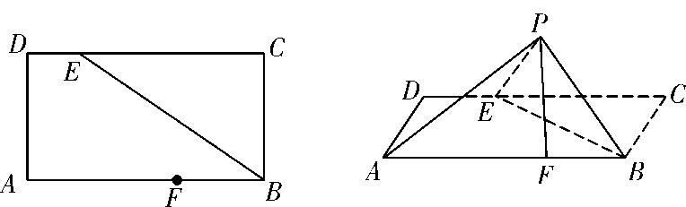  
图1　　　　　　　　　　　图2

11．解析　(1)在题图2中，连接*EF*，由题意可知*PB*＝*BC*＝*AD*＝6，*PE*＝*CE*＝*CD*－*DE*＝9，

在△<em>PBF</em>中，<em>PF</em>2＋<em>BF</em>2＝20＋16＝36＝<em>PB</em>2，所以<em>PF</em>⊥<em>BF</em>．

在题图1中，连接*EF*，作*EH*⊥*AB*于点*H*，利用勾股定理，得*EF*＝＝，

在△<em>PEF</em>中，<em>EF</em>2＋<em>PF</em>2＝61＋20＝81＝<em>PE</em>2，所以<em>PF</em>⊥<em>EF</em>，

又因为*BF*∩*EF*＝*F*，*BF*⊂平面*ABED*，*EF*⊂平面*ABED*，所以*PF*⊥平面*ABED*．

(2)如图，连接*AE*，由(1)知*PF*⊥平面*ABED*，

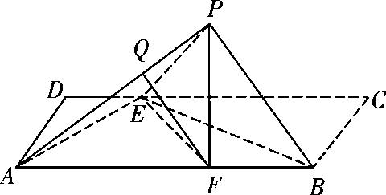

所以*PF*为三棱锥*P*－*ABE*的高．设点*A*到平面*PBE*的距离为*h*，

因为<em>VA</em>－<em>PBE</em>＝<em>VP</em>－<em>ABE</em>，即××6×9×<em>h</em>＝××12×6×2，所以<em>h</em>＝，

即点*A*到平面*PBE*的距离为．

12．如图，在直角梯形*ABCD*中，*AD*∥*BC*，*AB*⊥*BC*，*BD*⊥*DC*，点*E*是*BC*边的中点，将△*ABD*沿*BD*

折起，使平面*ABD*⊥平面*BCD*，连接*AE*，*AC*，*DE*，得到如图所示的空间几何体．

(1)求证：*AB*⊥平面*ADC*；

(2)若*AD*＝1，*AB*＝，求点*B*到平面*ADE*的距离．

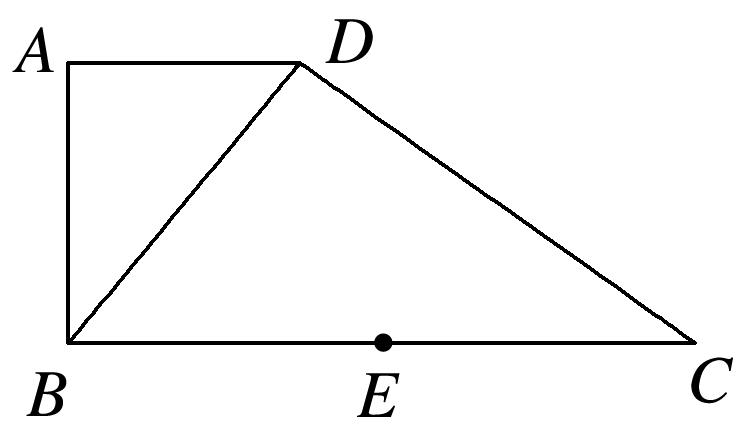

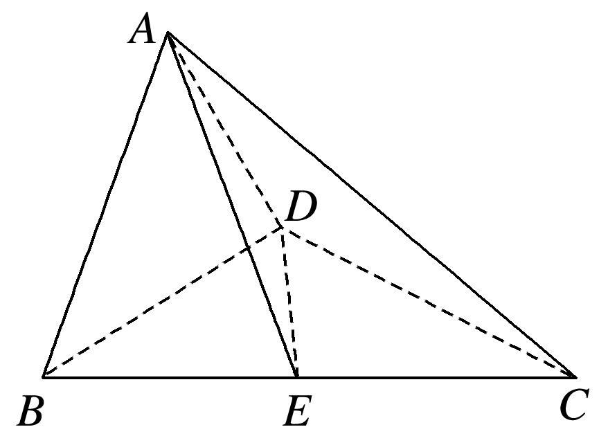

12．解析　(1)因为平面*ABD*⊥平面*BCD*，平面*ABD*∩平面*BCD*＝*BD*，

又*BD*⊥*DC*，*DC*⊂平面*BCD*，所以*DC*⊥平面*ABD*，因为*AB*⊂平面*ABD*，所以*DC*⊥*AB*．

又*AD*⊥*AB*，*DC*∩*AD*＝*D*，*AD*，*DC*⊂平面*ADC*，所以*AB*⊥平面*ADC*．

(2)因为*AB*＝，*AD*＝1，所以*BD*＝．依题意△*ABD*∽△*DCB*，所以＝，即＝．

所以*CD*＝，故*BC*＝3，由于*AB*⊥平面*ADC*，*AB*⊥*AC*，*E*为*BC*的中点，所以*AE*＝＝．

同理<em>DE</em>＝＝，所以<em>S</em>△<em>ADE</em>＝×1× ＝，因为<em>DC</em>⊥平面<em>ABD</em>，

所以<em>VA</em>—<em>BCD</em>＝<em>CD</em>·<em>S</em>△<em>ABD</em>＝，设点<em>B</em>到平面<em>ADE</em>的距离为<em>d</em>，

则<em>d</em>·<em>S</em>△<em>ADE</em>＝<em>VB</em>—<em>ADE</em>＝<em>VA</em>—<em>BDE</em>＝<em>VA</em>—<em>BCD</em>＝，所以<em>d</em>＝，即点<em>B</em>到平面<em>ADE</em>的距离为．

