# 专题12 利用空间向量计算空间角的综合问题

# 【例题选讲】

# 考点一 求两个空间角

[例1] (2018·江苏)如图，在正三棱柱 $ABC - A_{1}B_{1}C_{1}$ 中， $AB = AA_{1} = 2$ ，点 $P, Q$ 分别为 $A_{1}B_{1}, BC$ 的中点.  
（1）求异面直线 BP 与 $AC_{1}$ 所成角的余弦值;  
（2）求直线 $CC_{1}$ 与平面 $AQC_{1}$ 所成角的正弦值.

[例 2] (2020·江苏)在三棱锥 A-BCD 中，已知 $CB=CD=\sqrt{5}$ ，BD=2，O 为 BD 的中点， $AO \perp$ 平面 BCD，AO=2，E 为 AC 的中点.  
（1）求直线 AB 与 DE 所成角的余弦值;  
（2）若点 F 在 BC 上，满足 $BF=\frac{1}{4}BC$ ，设二面角 F-DE-C 的大小为 $\theta$ ，求 $\sin\theta$ 的值.

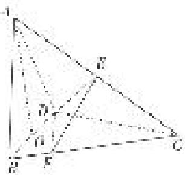

[例 3] (2020·天津)如图，在三棱柱 $ABC-A_{1}B_{1}C_{1}$ 中， $CC_{1}\perp$ 平面 ABC， $AC\perp BC$ ，AC=BC=2， $CC_{1}=3$ ，点 D，E 分别在棱 $AA_{1}$ 和棱 $CC_{1}$ 上，且 AD=1，CE=2，M 为棱 $A_{1}B_{1}$ 的中点.  
（1）求证： $C_{1}M \perp B_{1}D;$   
（2）求二面角 $B-B_{1}E-D$ 的正弦值;  
（3）求直线 AB 与平面 $DB_{1}E$ 所成角的正弦值.

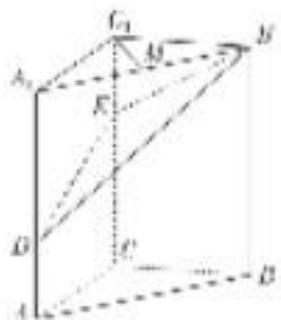

[例 4] (2019·天津)如图， $AE \perp$ 平面 ABCD， $CF \parallel AE$ ， $AD \parallel BC$ ， $AD \perp AB$ ，AB = AD = 1，AE = BC = 2.  
（1）求证： $BF \parallel$ 平面 ADE;  
（2）求直线 CE 与平面 BDE 所成角的正弦值;  
（3）若二面角 E-BD-F 的余弦值为 $\frac{1}{3}$ ，求线段 CF 的长.

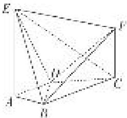

# 【对点训练】

1. 如图，在长方体 $AC_{1}$ 中， $AB = BC = 2$ ， $AA_{1} = \sqrt{2}$ ，点 $E$ ， $F$ 分别是平面 $A_{1}B_{1}C_{1}D_{1}$ ，平面 $BCC_{1}B_{1}$ 的中心。以 $D$ 为坐标原点， $DA$ ， $DC$ ， $DD_{1}$ 所在直线分别为 $x$ 轴， $y$ 轴， $z$ 轴建立空间直角坐标系。试用向量方法解决下列问题：  
（1）求异面直线 AF 和 BE 所成的角;  
（2）求直线 AF 和平面 BEC 所成角的正弦值.

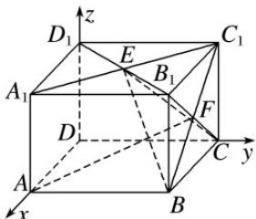

2. 如图，平面 $ABDE \perp$ 平面 $ABC$ ， $\triangle ABC$ 是等腰直角三角形， $AC = BC = 4$ ，四边形 $ABDE$ 是直角梯形， $BD // AE$ ， $BD \perp BA$ ， $BD = \frac{1}{2} AE = 2$ ， $O$ ， $M$ 分别为 $CE$ ， $AB$ 的中点.  
（1）求异面直线 AB 与 CE 所成角的大小;  
（2）求直线 CD 与平面 ODM 所成角的正弦值.

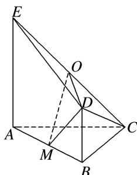

3. 如图，在以 $A, B, C, D, E, F$ 为顶点的五面体中，四边形 $ABEF$ 为正方形， $AF \perp DF$ ， $AF = 2\sqrt{2}FD$ ， $\angle DFE = \angle CEF = 45^\circ$ .  
（1）求异面直线 BC，DF 所成角的大小；  
（2）求平面 BDE 与平面 BEC 所成角的余弦值.

4. (2017·北京)如图，在四棱锥 $P - ABCD$ 中，底面 $ABCD$ 为正方形，平面 $PAD \perp$ 平面 $ABCD$ ，点 $M$ 在线段 $PB$ 上， $PD \parallel$ 平面 $MAC$ ， $PA = PD = \sqrt{6}$ ， $AB = 4$ .  
（1）求证： $M$ 为 $PB$ 的中点；  
（2）求平面 BPD 与平面 APD 的夹角;  
（3）求直线 MC 与平面 BDP 所成角的正弦值.

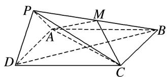

5. (2021·天津)如图，在棱长为2的正方体 $ABCD - A_{1}B_{1}C_{1}D_{1}$ 中， $E$ 为棱 $BC$ 的中点， $F$ 为棱 $CD$ 的中点.  
（1）求证： $D_{1}F \parallel$ 平面 $A_{1}EC_{1}$ ;  
（2）求直线 $AC_{1}$ 与平面 $A_{1}EC_{1}$ 所成的角的正弦值；  
（3）求二面角 $A - A_{1}C_{1} - E$ 的正弦值.

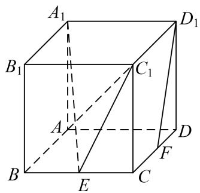

6. (2017·天津)如图, 在三棱锥 $P - ABC$ 中, $PA \perp$ 底面 $ABC$ , $\angle BAC = 90^{\circ}$ . 点 $D$ , $E$ , $N$ 分别为棱 $PA$ , $PC$ , $BC$ 的中点, $M$ 是线段 $AD$ 的中点, $PA = AC = 4$ , $AB = 2$ .  
（1）求证：MN//平面 BDE;  
（2）求二面角 C-EM-N 的正弦值;  
（3）已知点 H 在棱 PA 上，且直线 NH 与直线 BE 所成角的余弦值为 $\frac{\sqrt{7}}{21}$ ，求线段 AH 的长.

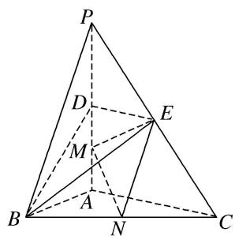

7. (2018·天津)如图, $AD \parallel BC$ 且 $AD = 2BC$ , $AD \perp CD$ , $EG \parallel AD$ 且 $EG = AD$ , $CD \parallel FG$ 且 $CD = 2FG$ , $DG \perp$ 平面 $ABCD$ , $DA = DC = DG = 2$ .  
（1）若 M 为 CF 的中点，N 为 EG 的中点，求证：MN// 平面 CDE;  
（2）求二面角 E-BC-F 的正弦值;  
（3）若点 P 在线段 DG 上，且直线 BP 与平面 ADGE 所成的角为 $60^{\circ}$ ，求线段 DP 的长.

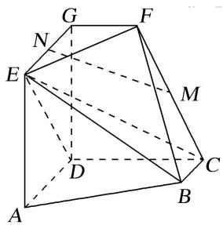

# 考点二 已知某一空间角求另一空间角

[例 1] (2017·全国 II) 如图，四棱锥 P-ABCD 中，侧面 PAD 为等边三角形且垂直于底面 ABCD，AB = BC = $\frac{1}{2}$ AD， $\angle BAD = \angle ABC = 90^{\circ}$ ，E 是 PD 的中点.  
（1）证明：直线 $CE \parallel$ 平面 $PAB$ ;  
（2）点 M 在棱 PC 上，且直线 BM 与底面 ABCD 所成角为 $45^{\circ}$ ，求二面角 M-AB-D 的余弦值.

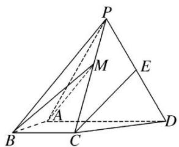

[例 2] 已知三棱锥 P-ABC(如图 1) 的平面展开图(如图 2) 中，四边形 ABCD 为边长等于 $\sqrt{2}$ 的正方形， $\triangle ABE$ 和 $\triangle BCF$ 均为正三角形．在三棱锥 P-ABC 中：  
（1）证明：平面 PAC⊥平面 ABC;  
（2）若点 M 在棱 PA 上运动，当直线 BM 与平面 PAC 所成的角最大时，求二面角 P-BC-M 的余弦值.
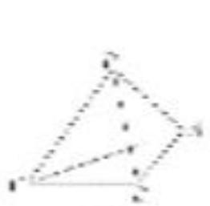

图1

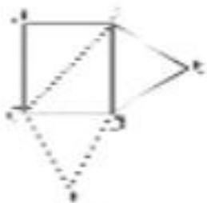

图：

[例 3] (2018·全国 II) 如图，在三棱锥 P-ABC 中， $AB=BC=2\sqrt{2}$ ，PA=PB=PC=AC=4，O 为 AC 的中点.  
（1）证明： $PO \perp$ 平面 ABC;  
（2）若点 M 在棱 BC 上，且二面角 M-PA-C 为 $30^{\circ}$ ，求 PC 与平面 PAM 所成角的正弦值.

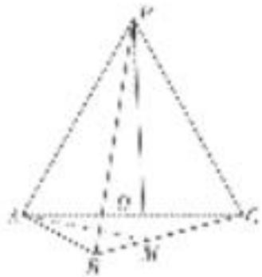

[例 4] 如图所示的几何体中，四边形 ABCD 是等腰梯形， $AB \parallel CD$ ， $\angle ABC = 60^{\circ}$ ，AB = 2BC = 2CD，四边形 DCEF 是正方形，N，G 分别是线段 AB，CE 的中点.  
（1）求证：NG//平面ADF;  
（2）设二面角 A-CD-F 的大小为 $\theta\left(\frac{\pi}{2}<\theta<\pi\right)$ ，当 $\theta$ 为何值时，二面角 A-BC-E 的余弦值为 $\frac{\sqrt{13}}{13}$ ?

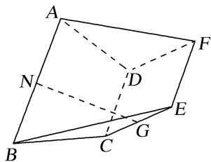

# 【对点训练】

1. 已知四棱锥 $P - ABCD$ ，底面 $ABCD$ 为菱形， $PD = PB$ ， $H$ 为 $PC$ 上的点，过 $AH$ 的平面分别交 $PB$ ， $PD$ 于点 $M$ ， $N$ ，且 $BD \parallel$ 平面 $AMHN$ .  
（1）证明： $MN \perp PC;$  
（2）当 H 为 PC 的中点， $PA=PC=\sqrt{3}AB$ ，PA 与平面 ABCD 所成的角为 $60^{\circ}$ ，求 AD 与平面 AMHN 所成角的正弦值.

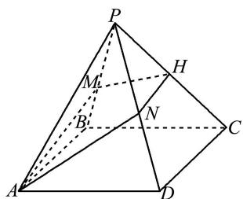

2. 如图，在三棱柱 $ABC - A_{1}B_{1}C_{1}$ 中， $BB_{1} \perp$ 平面 $ABC$ ， $AB \perp BC$ ， $AB = 2$ ， $BC = 1$ ， $BB_{1} = 3$ ， $D$ 是 $CC_{1}$ 的中点， $E$ 是 $AB$ 的中点.  
（1）证明： $DE \parallel$ 平面 $C_{1}BA_{1}$ ;  
（2） $F$ 是线段 $CC_{1}$ 上一点，且直线 $AF$ 与平面 $ABB_{1}A_{1}$ 所成角的正弦值为 $\frac{1}{3}$ ，求二面角 $F - BA_{1} - A$ 的余弦值.

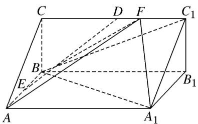

3. 已知在四棱锥 $P - ABCD$ 中，底面 $ABCD$ 为菱形， $PD = PB$ ， $H$ 为 $PC$ 上的点，过直线 $AH$ 的平面分别交 $PB$ ， $PD$ 于点 $M$ ， $N$ ，且 $BD \parallel$ 平面 $AMHN$ .  
（1）证明： $MN \perp PC;$  
（2）当 H 为 PC 的中点时， $PA=PC=\sqrt{3}AB$ ，PA 与平面 ABCD 所成的角为 $60^{\circ}$ ，求平面 PAB 与平面 AMHN 夹角的余弦值.

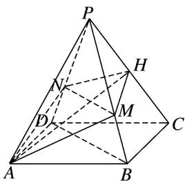

4. 如图，等腰梯形 $ABCD$ 中， $AB \parallel CD$ ， $AD = AB = BC = 1$ ， $CD = 2$ ， $E$ 为 $CD$ 的中点，以 $AE$ 为折痕把 $\triangle ADE$ 折起，使点 $D$ 到达点 $P$ 的位置 ( $P \notin$ 平面 $ABCE$ ).  
（1）证明： $AE \perp PB;$  
（2）若直线 $PB$ 与平面 $ABCE$ 所成的角为 $\frac{\pi}{4}$ ，求二面角 $A - PE - C$ 的余弦值.

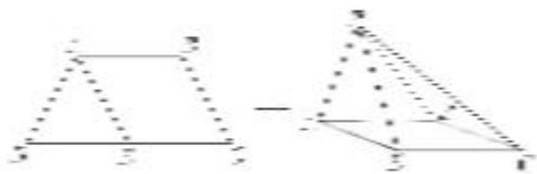

5. 如图，在四棱锥 $P - ABCD$ 中， $PA \perp$ 底面 $ABCD$ ，底面 $ABCD$ 是直角梯形， $\angle ADC = 90^{\circ}$ ， $AD \parallel BC$ ， $AB \perp AC$ ， $AB = AC = \sqrt{2}$ ，点 $E$ 在 $AD$ 上，且 $AE = 2ED$ .  
（1）已知点 F 在 BC 上，且 CF=2FB，求证：平面 $PEF \perp$ 平面 PAC;  
（2）当二面角 A—PB—E 的余弦值为多少时，直线 PC 与平面 PAB 所成的角为 $45^{\circ}$ ?

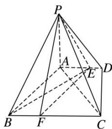

6. 如图，在四棱锥 $P - ABCD$ 中，底面 $ABCD$ 为边长为 2 的菱形， $\angle DAB = 60^{\circ}$ ， $\angle ADP = 90^{\circ}$ ，平面 $ADP \perp$ 平面 $ABCD$ ，点 $F$ 为棱 $PD$ 的中点.  
（1）在棱 $AB$ 上是否存在一点 $E$ , 使得 $AF \parallel$ 平面 $PCE$ ? 并说明理由;  
（2）当二面角 $D - FC - B$ 的余弦值为 $\frac{\sqrt{2}}{4}$ 时，求直线 $PB$ 与平面ABCD所成的角.

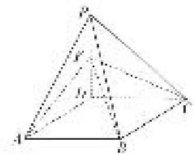

