# 专题12 利用空间向量计算空间角的综合问题

# 【例题选讲】

# 考点一 求两个空间角

[例1] (2018·江苏)如图，在正三棱柱 $ABC - A_{1}B_{1}C_{1}$ 中， $AB = AA_{1} = 2$ ，点 $P$ ， $Q$ 分别为 $A_{1}B_{1}$ ， $BC$ 的中点.  
（1）求异面直线 BP 与 $AC_{1}$ 所成角的余弦值;  
（2）求直线 $CC_{1}$ 与平面 $AQC_{1}$ 所成角的正弦值.

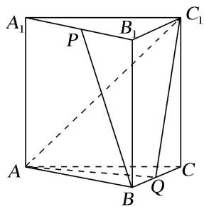

解析 如图，在正三棱柱 $ABC - A_{1}B_{1}C_{1}$ 中，设 $AC$ ， $A_{1}C_{1}$ 的中点分别为 $O$ ， $O_{1}$ ，连接 $OB$ ， $OO_{1}$ ，则 $OB\bot OC$ ， $OO_{1}\bot OC$ ， $OO_{1}\bot OB$ ，以 $\{\overrightarrow{OB},\overrightarrow{OC},\overrightarrow{OD}_1\}$ 为基底，建立如图所示的空间直角坐标系 $O - xyz.$
因为 $AB = AA_{1} = 2$ ，所以 $A(0, -1, 0)$ ， $B(\sqrt{3}, 0, 0)$ ， $C(0, 1, 0)$ ， $A_{1}(0, -1, 2)$ ， $B_{1}(\sqrt{3}, 0, 2)$ ， $C_{1}(0, 1, 2)$ .

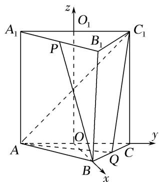  
（1）因为 P 为 $A_{1}B_{1}$ 的中点，所以 $P\left(\frac{\sqrt{3}}{2}, -\frac{1}{2}, 2\right)$ ，从而 $\overrightarrow{BP} = \left(-\frac{\sqrt{3}}{2}, -\frac{1}{2}, 2\right)$ ， $\overrightarrow{AC_{1}} = (0, 2, 2)$ ,
故 $|\cos < \overrightarrow{BP}, \overrightarrow{AC_1} > | = \frac{|\overrightarrow{BP} \cdot \overrightarrow{AC_1}|}{|\overrightarrow{BP}| \cdot |\overrightarrow{AC_1}|} = \frac{| - 1 + 4|}{\sqrt{5} \times 2\sqrt{2}} = \frac{3\sqrt{10}}{20}$ .
因此，异面直线 BP 与 $AC_{1}$ 所成角的余弦值为 $\frac{3\sqrt{10}}{20}$ .  
（2）因为 Q 为 BC 的中点，所以 $Q\left(\frac{\sqrt{3}}{2}, \frac{1}{2}, 0\right)$ ,
因此 $\overrightarrow{AQ} = \left[\frac{\sqrt{3}}{2},\frac{3}{2},0\right],\overrightarrow{AC_1} = (0,2,2),\overrightarrow{CC_1} = (0,0,2).$
设 $\boldsymbol{n}=(x,y,z)$ 为平面 $AQC_{1}$ 的一个法向量，则 $\left\{\begin{aligned}\overrightarrow{AQ}\cdot\boldsymbol{n}&=0,\\ \overrightarrow{AC_{1}}\cdot\boldsymbol{n}&=0,\end{aligned}\right.$ 即 $\left\{\begin{aligned}\frac{\sqrt{3}}{2}x+\frac{3}{2}y&=0,\\ 2y+2z&=0.\end{aligned}\right.$
不妨取 $n=(\sqrt{3}, -1, 1)$ .
设直线 $CC_{1}$ 与平面 $AQC_{1}$ 所成角为 $\theta$ ,
则 $\sin\theta=|\cos<\overrightarrow{C}C_{1},\quad n>|=\frac{|\overrightarrow{C}C_{1}\cdot n|}{|\overrightarrow{C}C_{1}|\cdot|n|}=\frac{2}{\sqrt{5}\times2}=\frac{\sqrt{5}}{5},$
所以直线 $CC_{1}$ 与平面 $AQC_{1}$ 所成角的正弦值为 $\frac{\sqrt{5}}{5}$ .

[例 2] (2020·江苏)在三棱锥 A-BCD 中，已知 $CB=CD=\sqrt{5}$ ，BD=2，O 为 BD 的中点， $AO \perp$ 平面 BCD，AO=2，E 为 AC 的中点.  
（1）求直线 AB 与 DE 所成角的余弦值;  
（2）若点 F 在 BC 上，满足 $BF=\frac{1}{4}BC$ ，设二面角 F-DE-C 的大小为 $\theta$ ，求 $\sin\theta$ 的值.

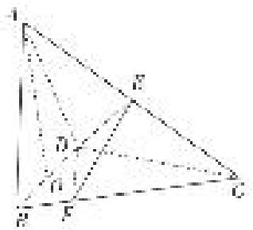

解析 （1）连接 $CO$ ， $\because CB=CD$ ， $BO=OD$ ， $\therefore CO \perp BD$ .
又 $AO \perp$ 平面 BCD，∴ AO，BO，CO 两两垂直.

以 O 为坐标原点，OB，OC，OA 所在直线分别为 x，y，z 轴建立空间直角坐标系，则 A(0, 0, 2)，B(1, 0, 0)，C(0, 2, 0)，D(-1, 0, 0)，∴ E(0, 1, 1).

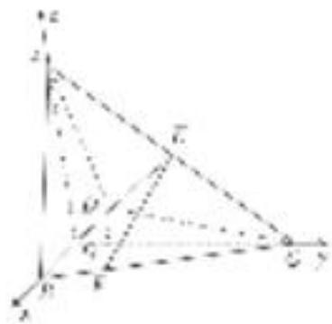
$\therefore \overrightarrow {A B} = (1, 0, - 2), \overrightarrow {D E} = (1, 1, 1), \therefore \cos <   \overrightarrow {A B}, \overrightarrow {D E} > = \frac {- 1}{\sqrt {5} \times \sqrt {3}} = - \frac {\sqrt {1 5}}{1 5}.$
∴直线 AB 与 DE 所成角的余弦值为 $\frac{\sqrt{15}}{15}$ .  
（2）设平面 $DEC$ 的法向量为 $\pmb{n}_{1} = (x,y,z)$ ， $\because \vec{DC} = (1,2,0),$ $\left\{ \begin{array}{l}\pmb {n}_1\cdot \vec{DC} = 0,\\ \pmb {n}_1\cdot \vec{DE} = 0, \end{array} \right.$ $\therefore \left\{ \begin{array}{l}x + 2y = 0,\\ x + y + z = 0, \end{array} \right.$
令 y=1，则 x=-2，z=1， $n_{1}=(-2,1,1)$ 。设平面 DEF 的法向量为 $n_{2}=(x_{1},y_{1},z_{1})$ ，
$\because \overrightarrow {D F} = \overrightarrow {D B} + \overrightarrow {B F} = \overrightarrow {D B} + \frac {1}{4} \overrightarrow {B C} = \left(\frac {7}{4}, \frac {1}{2}, 0\right), \quad \left\{ \begin{array}{l} n _ {2} \cdot \overrightarrow {D F} = 0, \\ n _ {2} \cdot \overrightarrow {D E} = 0, \end{array} \right. \quad \therefore \left\{ \begin{array}{l} \frac {7}{4} x _ {1} + \frac {1}{2} y _ {1} = 0, \\ x _ {1} + y _ {1} + z _ {1} = 0. \end{array} \right.$
令 $y_{1}=-7$ ，则 $x_{1}=2,\quad z_{1}=5,\quad n_{2}=(2,-7,5)$ .
$\therefore \cos <   n _ {1}, n _ {2} > = \frac {- 6}{\sqrt {6} \times \sqrt {7 8}} = - \frac {1}{\sqrt {1 3}}. \quad \therefore \sin \theta = \frac {\sqrt {1 2}}{\sqrt {1 3}} = \frac {2 \sqrt {3 9}}{1 3}.$

[例 3] (2020·天津)如图，在三棱柱 $ABC-A_{1}B_{1}C_{1}$ 中， $CC_{1}\perp$ 平面 ABC， $AC\perp BC$ ，AC=BC=2， $CC_{1}=3$ ，点 D，E 分别在棱 $AA_{1}$ 和棱 $CC_{1}$ 上，且 AD=1，CE=2，M 为棱 $A_{1}B_{1}$ 的中点.  
（1）求证： $C_{1}M \perp B_{1}D;$   
（2）求二面角 $B-B_{1}E-D$ 的正弦值；  
（3）求直线 AB 与平面 $DB_{1}E$ 所成角的正弦值.

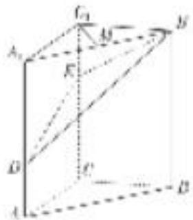

解析 解法一：依题意，以 C 为坐标原点，分别以 $\overrightarrow{CA}, \overrightarrow{CB}, \overrightarrow{CC_{1}}$ 的方向为 x 轴、y 轴、z 轴的正方向建立空间直角坐标系(如图)，
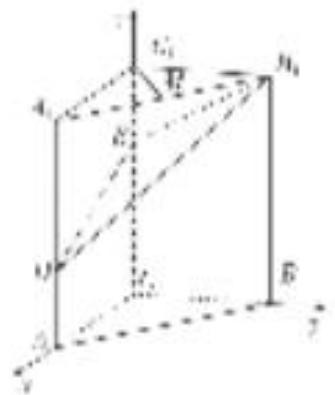
可得 $C(0, 0, 0)$ ， $A(2, 0, 0)$ ， $B(0, 2, 0)$ ， $C_{1}(0, 0, 3)$ ， $A_{1}(2, 0, 3)$ ， $B_{1}(0, 2, 3)$ ， $D(2, 0, 1)$ ， $E(0, 0, 2)$ ， $M(1, 1, 3)$ .  
（1）依题意， $\overrightarrow{C_{1}M}=(1,1,0)$ ， $\overrightarrow{B_{1}D}=(2,-2,-2)$ ，从而 $\overrightarrow{C_{1}M}\cdot\overrightarrow{B_{1}D}=2-2+0=0$ ，所以 $C_{1}M\perp B_{1}D$ .  
（2）依题意， $\overrightarrow{CA}=(2,0,0)$ 是平面 $BB_{1}E$ 的一个法向量， $\overrightarrow{EB_{1}}=(0,2,1)$ ， $\overrightarrow{ED}=(2,0,-1)$ .
设 $\boldsymbol{n}=(x,y,z)$ 为平面 $DB_{1}E$ 的一个法向量，则 $\left\{\begin{aligned}\boldsymbol{n}\cdot\vec{EB}_{1}&=0,\\ \boldsymbol{n}\cdot\vec{ED}&=0,\end{aligned}\right.$ 即 $\left\{\begin{aligned}2y+z&=0,\\ 2x-z&=0,\end{aligned}\right.$ 令 x=1，可得 $\boldsymbol{n}=(1,-1,2)$ .
$\cos <   \overrightarrow {C A}, n > = \frac {\overrightarrow {C A} \cdot n}{| \overrightarrow {C A} | | n |} = \frac {2}{2 \times \sqrt {6}} = \frac {\sqrt {6}}{6}, \sin <   \overrightarrow {C A}, n > = \sqrt {1 - \cos^ {2} \langle \overrightarrow {C A} , n \rangle} = \frac {\sqrt {3 0}}{6}.$
所以二面角 $B-B_{1}E-D$ 的正弦值为 $\frac{\sqrt{30}}{6}$ .  
（3） $\overrightarrow{AB}=(-2,2,0)$ ，由（2）知 $n=(1,-1,2)$ 为平面 $DB_{1}E$ 的一个法向量，
于是 $\cos<\overrightarrow{AB},\quad n>=\frac{\overrightarrow{AB}\cdot n}{|\overrightarrow{AB}||n|}=\frac{-4}{2\sqrt{2}\times\sqrt{6}}=-\frac{\sqrt{3}}{3}.$ 所以直线 AB 与平面 $DB_{1}E$ 所成角的正弦值为 $\frac{\sqrt{3}}{3}.$

[例 4] (2019·天津)如图， $AE \perp$ 平面 ABCD， $CF \parallel AE$ ， $AD \parallel BC$ ， $AD \perp AB$ ，AB = AD = 1，AE = BC = 2.  
（1）求证： $BF \parallel$ 平面 ADE;  
（2）求直线 CE 与平面 BDE 所成角的正弦值;  
（3）若二面角 E-BD-F 的余弦值为 $\frac{1}{3}$ ，求线段 CF 的长.

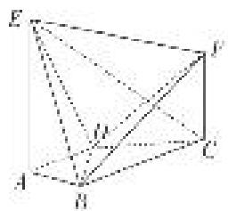

解析 （1）以 $A$ 为坐标原点， $AB$ 所在的直线为 $x$ 轴， $AD$ 所在的直线为 $y$ 轴， $AE$ 所在的直线为 $z$ 轴，建立如图所示的空间直角坐标系．则 $A(0,0,0), B(1,0,0)$ ，设 $F(1,2,h)$ .
依题意， $\overrightarrow{AB}=(1,0,0)$ 是平面ADE的一个法向量，又 $\overrightarrow{BF}=(0,2,h)$ ，可得 $\overrightarrow{BF}\cdot\overrightarrow{AB}=0$ ，
又因为直线 $BF \nmid$ 平面 $ADE$ ，所以 $BF \parallel$ 平面 $ADE$ .

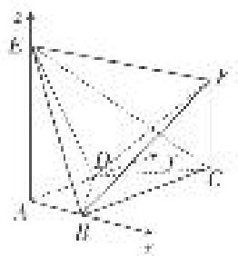  
（2）依题意， $D(0, 1, 0)$ ， $E(0, 0, 2)$ ， $C(1, 2, 0)$ ，则 $\overrightarrow{BD}=(-1, 1, 0)$ ， $\overrightarrow{BE}=(-1, 0, 2)$ ， $\overrightarrow{CE}=(-1, -2, 2)$ .
设 $\boldsymbol{n}=(x,y,z)$ 为平面 BDE 的法向量，则 $\left\{\begin{aligned}\boldsymbol{n}\cdot\overrightarrow{BD}&=0,\\ \boldsymbol{n}\cdot\overrightarrow{BE}&=0,\end{aligned}\right.$ 即 $\left\{\begin{aligned}-x+y&=0,\\ -x+2z&=0,\end{aligned}\right.$ 不妨令 z=1，可得 $\boldsymbol{n}=(2,2,1)$ .
因此有 $\cos<\overrightarrow{CE},\quad n>=\frac{\overrightarrow{CE}\cdot n}{|\overrightarrow{CE}||n|}=-\frac{4}{9}$ . 所以直线 CE 与平面 BDE 所成角的正弦值为 $\frac{4}{9}$ .  
（3）设 $\boldsymbol{m}=(x_{1},y_{1},z_{1})$ 为平面 BDF 的法向量，则 $\left\{\begin{aligned}&\boldsymbol{m}\cdot\overrightarrow{BD}=0,\\ &\boldsymbol{m}\cdot\overrightarrow{BF}=0,\end{aligned}\right.$ 即 $\left\{\begin{aligned}-x_{1}+y_{1}=0,\\2y_{1}+hz_{1}=0,\end{aligned}\right.$
不妨令 $y_{1} = 1$ ，可得 $\pmb {m} = \left( \begin{array}{ll},1, & -\frac{2}{h} \end{array} \right)$ .由题意，有 $|\cos <   m,n > | = \frac{|m\cdot n|}{|m||n|} = \frac{\left|4 - \frac{2}{h}\right|}{3\sqrt{2 + \frac{4}{h^2}}} = \frac{1}{3},$
解得 $h=\frac{8}{7}$ . 经检验，符合题意. 所以线段 CF 的长为 $\frac{8}{7}$ .

# 【对点训练】

1. 如图，在长方体 $AC_{1}$ 中， $AB = BC = 2$ ， $AA_{1} = \sqrt{2}$ ，点 $E$ ， $F$ 分别是平面 $A_{1}B_{1}C_{1}D_{1}$ ，平面 $BCC_{1}B_{1}$ 的中心。以 $D$ 为坐标原点， $DA$ ， $DC$ ， $DD_{1}$ 所在直线分别为 $x$ 轴， $y$ 轴， $z$ 轴建立空间直角坐标系。试用向量方法解决下列问题：  
（1）求异面直线 AF 和 BE 所成的角;  
（2）求直线 AF 和平面 BEC 所成角的正弦值.

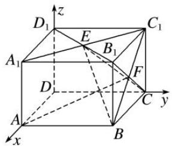

1. 解析 （1）由题意得 $A(2, 0, 0)$ , $F\left(1, 2, \frac{\sqrt{2}}{2}\right)$ , $B(2, 2, 0)$ , $E(1, 1, \sqrt{2})$ , $C(0, 2, 0)$ .
$\therefore \overrightarrow {A F} = \left[ - 1, 2, \frac {\sqrt {2}}{2} \right], \overrightarrow {B E} = (- 1, - 1, \sqrt {2}),$
$\therefore \overrightarrow{AF} \cdot \overrightarrow{BE} = 1 - 2 + 1 = 0.$ ∴直线 $AF$ 和 $BE$ 所成的角为 $90^{\circ}$ .  
（2）设平面 BEC 的法向量为 $\boldsymbol{n}=(x,\ y,\ z)$ ，又 $\overrightarrow{BC}=(-2,\ 0,\ 0)$ ， $\overrightarrow{BE}=(-1,\ -1,\ \sqrt{2})$ ,
则 $n \cdot \overrightarrow{BC} = -2x = 0,\quad n \cdot \overrightarrow{BE} = -x - y + \sqrt{2}z = 0,\quad \therefore x = 0,$ 取 z = 1，则 $y = \sqrt{2},$
∴平面 BEC 的一个法向量为 $\boldsymbol{n}=(0,\sqrt{2},1)$ . ∴ $\cos<\overrightarrow{AF},\quad\boldsymbol{n}>\frac{\overrightarrow{AF}\cdot\boldsymbol{n}}{|\overrightarrow{AF}|\cdot|\boldsymbol{n}|}=\frac{\frac{5\sqrt{2}}{2}}{\frac{\sqrt{22}}{2}\times\sqrt{3}}=\frac{5\sqrt{33}}{33}$ .
设直线 $AF$ 和平面 $BEC$ 所成的角为 $\theta$ ，则 $\sin \theta = \frac{5\sqrt{33}}{33}$ ，即直线 $AF$ 和平面 $BEC$ 所成角的正弦值为 $\frac{5\sqrt{33}}{33}$ .

2. 如图，平面 $ABDE \perp$ 平面 $ABC$ ， $\triangle ABC$ 是等腰直角三角形， $AC = BC = 4$ ，四边形 $ABDE$ 是直角梯形， $BD // AE$ ， $BD \perp BA$ ， $BD = \frac{1}{2} AE = 2$ ， $O$ ， $M$ 分别为 $CE$ ， $AB$ 的中点.  
（1）求异面直线 AB 与 CE 所成角的大小;  
（2）求直线 CD 与平面 ODM 所成角的正弦值.

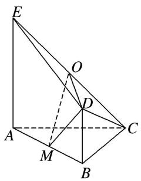

2. 解析 （1） $\because DB \perp BA$ , 平面 $ABDE \perp$ 平面 $ABC$ , 平面 $ABDE \cap$ 平面 $ABC = AB$ , $DB \subset$ 平面 $ABDE$ ,
∴DB⊥平面ABC. ∵BD∥AE, ∴EA⊥平面ABC.
如图所示，以 C 为坐标原点，分别以 CA, CB 所在直线为 x, y 轴，以过点 C 且与 EA 平行的直线为 z 轴，建立空间直角坐标系.

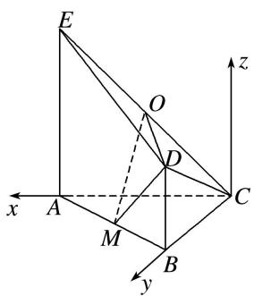
$\because A C = B C = 4, \therefore C (0, 0, 0), A (4, 0, 0), B (0, 4, 0), E (4, 0, 4),$
$\therefore \overrightarrow {A B} = (- 4, 4, 0), \overrightarrow {C E} = (4, 0, 4). \quad \therefore \cos <   \overrightarrow {A B}, \overrightarrow {C E} > = \frac {- 1 6}{4 \sqrt {2} \times 4 \sqrt {2}} = - \frac {1}{2},$
∴异面直线 AB 与 CE 所成角的大小为 $\frac{\pi}{3}$ .  
（2）由（1）知 $O(2,0,2)$ , $D(0,4,2)$ , $M(2,2,0)$ ,
$\therefore \overrightarrow {C D} = (0, 4, 2), \overrightarrow {O D} = (- 2, 4, 0), \overrightarrow {M D} = (- 2, 2, 2).$
设平面 ODM 的法向量为 $\boldsymbol{n}=(x,y,z)$ ,
则由 $\left\{\begin{aligned}n\perp\overrightarrow{OD},\\ n\perp\overrightarrow{MD},\end{aligned}\right.$ 可得 $\left\{\begin{aligned}-2x+4y=0,\\ -2x+2y+2z=0,\end{aligned}\right.$ 令 x=2，则 y=1，z=1，∴n=(2，1，1).
设直线 $CD$ 与平面 $ODM$ 所成的角为 $\theta$ ，则 $\sin \theta = |\cos < n, \vec{CD} >| = \left|\frac{n \cdot \vec{CD}}{|n||\vec{CD}|}\right| = \frac{\sqrt{30}}{10}$ ,
∴直线 CD 与平面 ODM 所成角的正弦值为 $\frac{\sqrt{30}}{10}$ .

3. 如图，在以 $A, B, C, D, E, F$ 为顶点的五面体中，四边形 $ABEF$ 为正方形， $AF \perp DF$ ， $AF = 2\sqrt{2} FD$ ， $\angle DFE = \angle CEF = 45^\circ$ .  
（1）求异面直线 BC，DF 所成角的大小；  
（2）求平面 BDE 与平面 BEC 所成角的余弦值.

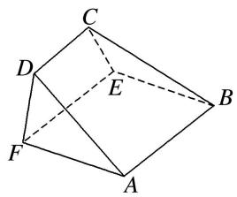

3. 解析 因为四边形 $ABEF$ 为正方形, $AF \perp DF$ , 所以 $AF \perp$ 平面 $DCEF$ .

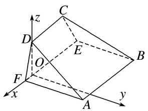
又 $\angle DFE = \angle CEF = 45^{\circ}$ ，所以，在平面 DCEF 内作 $DO \perp EF$ ，垂足为点 O，

以 O 为坐标原点，OF 所在的直线为 x 轴，OD 所在的直线为 z 轴建立空间直角坐标系(如图所示).
设 OF=a，因为 $AF=2\sqrt{2}FD$ ，所以 $DF=\sqrt{2}a$ ，AF=4a，CD=2a。  
（1） $\therefore D(0, 0, a)$ , $F(a, 0, 0)$ , $B(-3a, 4a, 0)$ , $C(-2a, 0, a)$ .
则 $\overrightarrow{BC}=(a,-4a,a),\overrightarrow{DF}=(a,0,-a)$ ,
设向量 $\overrightarrow{BC}$ ， $\overrightarrow{DF}$ 的夹角为 $\theta$ ，则 $\cos\theta=\frac{\overrightarrow{BC}\cdot\overrightarrow{DF}}{|\overrightarrow{BC}|\cdot|\overrightarrow{DF}|}=0$ ，所以异面直线BC，DF所成角为 $\frac{\pi}{2}$ .  
（2） $\because E(-3a, 0, 0), \vec{BC}=(a, -4a, a), \vec{BE}=(0, -4a, 0), \vec{DE}=(-3a, 0, -a),$
设平面 DBE 的法向量为 $\boldsymbol{n}_{1}=(x_{1},y_{1},z_{1})$ ,
由 $\left\{\begin{aligned}n_{1}\cdot\overrightarrow{DE}&=0,\\ n_{1}\cdot\overrightarrow{BE}&=0,\end{aligned}\right.$ 得 $\left\{\begin{aligned}3x_{1}+z_{1}&=0,\\ 4y_{1}&=0,\end{aligned}\right.$ 取 $x_{1}=1$ 得平面 DBE 的一个法向量为 $n_{1}=(1,0,-3)$ ,
设平面 CBE 的法向量为 $n_{2}=(x_{2}, y_{2}, z_{2})$ ,
由 $\left\{\begin{aligned}n_{2}\cdot\overrightarrow{BC}&=0,\\ n_{2}\cdot\overrightarrow{BE}&=0,\end{aligned}\right.$ 得 $\left\{\begin{aligned}x_{2}-4y_{2}+z_{2}&=0,\\ 4y_{2}&=0,\end{aligned}\right.$ 取 $x_{2}=1$ 得平面 CBE 的一个法向量为 $n_{2}=(1,0,-1)$ ,
设平面 BDE 与平面 BEC 的夹角为 $\theta$ ，则 $\cos\theta=\frac{|n_{1}\cdot n_{2}|}{|n_{1}|\cdot|n_{2}|}=\frac{2\sqrt{5}}{5}$ ,
所以平面 BDE 与平面 BEC 所成角的余弦值为 $\frac{2\sqrt{5}}{5}$ .

4. (2017·北京)如图, 在四棱锥 $P - ABCD$ 中, 底面 $ABCD$ 为正方形, 平面 $PAD \perp$ 平面 $ABCD$ , 点 $M$ 在线段 $PB$ 上, $PD //$ 平面 $MAC$ , $PA = PD = \sqrt{6}$ , $AB = 4$ .  
（1）求证：M 为 PB 的中点；  
（2）求平面 BPD 与平面 APD 的夹角;  
（3）求直线 MC 与平面 BDP 所成角的正弦值.

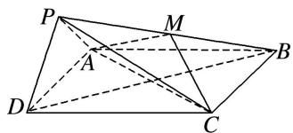

4. 解析 （1）如图, 设 $AC$ , $BD$ 的交点为 $E$ , 连接 $ME$ .

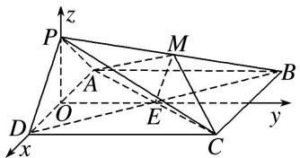
∵PD∥平面MAC，PD⊂平面PDB，平面MAC∩平面PDB=ME，
∴PD//ME. ∵四边形ABCD是正方形，∴E为BD的中点．∴M为PB的中点.  
（2）取 AD 的中点 O，连接 OP，OE. $\because PA=PD,\therefore OP\perp AD.$
又∵平面 PAD⊥平面 ABCD，平面 PAD∩平面 ABCD=AD，OP⊂平面 PAD，∴OP⊥平面 ABCD.
∵OE⊂平面ABCD，∴OP⊥OE. ∵底面ABCD是正方形，∴OE⊥AD.

以 O 为原点，分别以 $\overrightarrow{OD}, \overrightarrow{OE}, \overrightarrow{OP}$ 为 x 轴，y 轴，z 轴的正方向建立如图所示的空间直角坐标系 Oxyz,则 $P(0, 0, \sqrt{2})$ ， $D(2, 0, 0)$ ， $B(-2, 4, 0)$ ， $\overrightarrow{BD} = (4, -4, 0)$ ， $\overrightarrow{PD} = (2, 0, -\sqrt{2})$ 。
设平面 BDP 的一个法向量为 $\boldsymbol{n}=(x,y,z)$ ,
则 $\left\{ \begin{array}{l} n \cdot \overrightarrow{BD} = 0, \\ n \cdot \overrightarrow{PD} = 0, \end{array} \right.$ 即 $\left\{ \begin{array}{l} 4x - 4y = 0, \\ 2x - \sqrt{2}z = 0. \end{array} \right.$ 令 $x = 1$ ，得 $y = 1$ ， $z = \sqrt{2}$ 。于是 $n = (1, 1, \sqrt{2})$
又平面 PAD 的一个法向量为 $p=(0,1,0)$ ,
∴ $\cos <n,\ p>=\frac{n\cdot p}{|n||p|}=\frac{1}{2}.$ ∴ 平面 BPD 与平面 APD 的夹角为 $60^{\circ}.$  
（3）由（1）（2）知 $M\left[-1, 2, \frac{\sqrt{2}}{2}\right]$ , $C(2, 4, 0)$ , 则 $\vec{MC} = \left[3, 2, -\frac{\sqrt{2}}{2}\right]$ .
设直线 $MC$ 与平面 $BDP$ 所成角为 $\alpha$ ，则 $\sin \alpha = |\cos < n, \vec{MC} >| = \frac{|\boldsymbol{n} \cdot \vec{MC}|}{|\boldsymbol{n}||\vec{MC}|} = \frac{2\sqrt{6}}{9}$ .
∴直线 MC 与平面 BDP 所成角的正弦值为 $\frac{2\sqrt{6}}{9}$ .

5. (2021·天津)如图，在棱长为 2 的正方体 $ABCD - A_1B_1C_1D_1$ 中， $E$ 为棱 $BC$ 的中点， $F$ 为棱 $CD$ 的中点.  
（1）求证： $D_{1}F \parallel$ 平面 $A_{1}EC_{1}$ ;  
（2）求直线 $AC_{1}$ 与平面 $A_{1}EC_{1}$ 所成的角的正弦值；  
（3）求二面角 $A-A_{1}C_{1}-E$ 的正弦值.

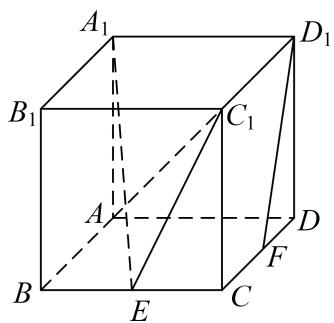

5. 解析 （1）如图所示, 连接 $A_{1}C_{1}$ , $B_{1}D_{1}$ 相交于 $O$ , 连接 $OE$ , $EF$ ,
因为 E 为棱 BC 的中点，F 为棱 CD 的中点，所以 $EF \parallel B_{1}D_{1}$ 且 $EF = \frac{1}{2}B_{1}D_{1}$ .
根据正方体有 $OD_{1}=\frac{1}{2}B_{1}D_{1}$ ，所以 $EF=OD_{1}$ .
所以四边形 $OEFD_{1}$ 为平行四边形，所以 $OE \parallel D_{1}F$ ，
又因为 $OE \subset$ 平面 $A_{1}EC_{1}$ ， $D_{1}F \not\subset$ 平面 $A_{1}EC_{1}$ ，所以 $D_{1}F \parallel$ 平面 $A_{1}EC_{1}$ .

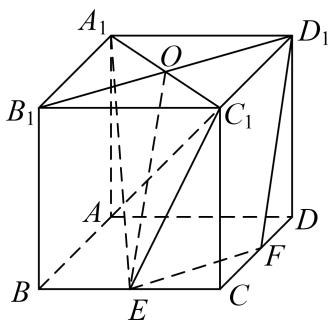  
（2） 以 $A$ 为坐标原点, $AB$ , $AD$ , $AA_{1}$ 为坐标轴建立空间直角坐标系, 如图所示则 $A(0, 0, 0)$ , $C_{1}(2, 2, 2)$ , $E(2, 1, 0)$ , $A_{1}(0, 0, 2)$ ,
则 $\overrightarrow{A_{1}E}=(2,1,-2)$ ， $\overrightarrow{E C_{1}}=(0,1,2)$ ， $\overrightarrow{A C_{1}}=(2,2,2)$ .
设平面 $A_{1}EC_{1}$ 的法向量 $\boldsymbol{n}_{1}=(x_{1},y_{1},z_{1})$ ，则 $\left\{\begin{aligned}\boldsymbol{n}_{1}\cdot\overrightarrow{A_{1}}E=0,\\ \boldsymbol{n}_{1}\cdot\overrightarrow{EC_{1}}=0,\end{aligned}\right.$ 即 $\left\{\begin{aligned}2x_{1}+y_{1}-2z_{1}=0,\\ y_{1}+2z_{1}=0.\end{aligned}\right.$
令 $z_{1}=1$ ，可得 $n_{1}=(2,-2,1)$ .
设直线 $AC_{1}$ 与平面 $A_{1}EC_{1}$ 所成的角为 $\theta$ ，则 $\sin\theta=|\cos<n_{1},\quad\overrightarrow{AC_{1}}>|=\frac{|n_{1}\cdot\overrightarrow{AC_{1}}|}{|n_{1}|\cdot|\overrightarrow{AC_{1}}|}=\frac{\sqrt{3}}{9}.$

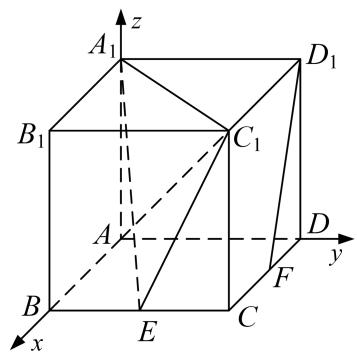  
（3）在（2）建立的空间直角坐标系中，设平面设平面 $A_{1}AC_{1}$ 的法向量 $\boldsymbol{n}_{2}=(x_{2},y_{2},z_{2})$ ,
则 $\left\{ \begin{array}{l} n_{2} \cdot \overrightarrow{A A_{1}} = 0, \\ n_{2} \cdot \overrightarrow{A C_{1}} = 0, \end{array} \right.$ 即 $\left\{ \begin{array}{l} 2z_{2} = 0, \\ 2x_{2} + 2y_{2} + 2z_{2} = 0. \end{array} \right.$ 令 $y_{2} = 1$ ，可得 $n_{2} = (-1, 1, 0)$ .
设直线 $AC_{1}$ 与平面 $A_{1}EC_{1}$ 所成的角为 $\theta$ ，则 $\sin\theta=|\cos<n_{1},\quad\overrightarrow{AC_{1}}>|=\frac{|n_{1}\cdot\overrightarrow{AC_{1}}|}{|n_{1}|\cdot|\overrightarrow{AC_{1}}|}=\frac{\sqrt{3}}{9}.$
设二面角 $A-A_{1}C_{1}-E$ 为 $\alpha$ ，根据（2）有 $\cos\alpha=\frac{|n_{1}\cdot n_{2}|}{|n_{1}|\cdot|n_{2}|}=-\frac{2\sqrt{2}}{3}$ ，所以 $\sin\alpha=\frac{1}{3}$ .

6. (2017·天津)如图，在三棱锥 $P - ABC$ 中， $PA \perp$ 底面 $ABC$ ， $\angle BAC = 90^\circ$ 。点 $D, E, N$ 分别为棱 $PA, PC, BC$ 的中点， $M$ 是线段 $AD$ 的中点， $PA = AC = 4, AB = 2$ .  
（1）求证： $MN \parallel$ 平面 BDE;  
（2）求二面角 C-EM-N 的正弦值;  
（3）已知点 $H$ 在棱 $PA$ 上，且直线 $NH$ 与直线 $BE$ 所成角的余弦值为 $\frac{\sqrt{7}}{21}$ ，求线段 $AH$ 的长.

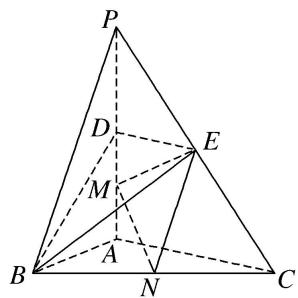

6. 解析 （1）如图，以 $A$ 为原点，分别以 $AB, AC, AP$ 所在直线为 $x$ 轴， $y$ 轴， $z$ 轴，建立空间直角坐标系。由题意，可得 $A(0, 0, 0), B(2, 0, 0), C(0, 4, 0), P(0, 0, 4), D(0, 0, 2), E(0, 2, 2), M(0, 0, 1), N(1, 2, 0)$ . $\overrightarrow{DE} = (0, 2, 0), \overrightarrow{DB} = (2, 0, -2)$ .
设 $\boldsymbol{n}=(x,y,z)$ 为平面 BDE 的一个法向量，则 $\left\{\begin{aligned}\boldsymbol{n}\cdot\overrightarrow{DE}&=0,\\ \boldsymbol{n}\cdot\overrightarrow{DB}&=0,\end{aligned}\right.$ 即 $\left\{\begin{aligned}2y&=0,\\ 2x-2z&=0.\end{aligned}\right.$ 不妨设 z=1，
可得 $\boldsymbol{n}=(1,0,1)$ . 又 $\overrightarrow{MN}=(1,2,-1)$ ，可得 $\overrightarrow{MN}\cdot n=0$ .
因为 $MN \notin$ 平面 BDE，所以 $MN \parallel$ 平面 BDE.

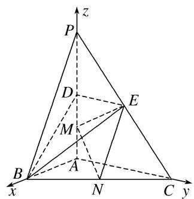  
（2）易知 $n_{1}=(1,0,0)$ 为平面 CEM 的一个法向量.
设 $\boldsymbol{n}_{2}=(x_{1},y_{1},z_{1})$ 为平面 EMN 的一个法向量，则 $\left\{\begin{aligned}\boldsymbol{n}_{2}\cdot\overrightarrow{EM}&=0,\\ \boldsymbol{n}_{2}\cdot\overrightarrow{MN}&=0,\end{aligned}\right.$
因为 $\overrightarrow{EM} = (0, -2, -1)$ , $\overrightarrow{MN} = (1, 2, -1)$ , 所以 $\left\{ \begin{array}{l} -2y_1 - z_1 = 0, \\ x_1 + 2y_1 - z_1 = 0. \end{array} \right.$
不妨设 $y_{1}=1$ ，可得 $n_{2}=(-4,1,-2)$ .
因此 $\cos<n_{1},\quad n_{2}>\frac{n_{1}\cdot n_{2}}{|n_{1}||n_{2}|}=-\frac{4}{\sqrt{21}}$ ，于是 $\sin<n_{1},\quad n_{2}>=\frac{\sqrt{105}}{21}$ .
所以二面角 C-EM-N 的正弦值为 $\frac{\sqrt{105}}{21}$ .  
（3）由题意，设 $AH=h(0\leq h\leq4)$ ，则 $H(0,0,h)$ ，进而可得 $\overrightarrow{NH}=(-1,-2,h)$ ， $\overrightarrow{BE}=(-2,2,2)$ .
由已知，得 $|\cos < \overrightarrow{NH}, \overrightarrow{BE} >| = \frac{|\overrightarrow{NH} \cdot \overrightarrow{BE}|}{|\overrightarrow{NH}| |\overrightarrow{BE}|} = \frac{|2h - 2|}{\sqrt{h^2 + 5} \times 2\sqrt{3}} = \frac{\sqrt{7}}{21}$ ,
整理得 $10h^{2}-21h+8=0$ ，解得 $h=\frac{8}{5}$ 或 $h=\frac{1}{2}$ 。所以线段 AH 的长为 $\frac{8}{5}$ 或 $\frac{1}{2}$ 。

7. (2018·天津)如图， $AD \parallel BC$ 且 $AD = 2BC$ ， $AD \perp CD$ ， $EG \parallel AD$ 且 $EG = AD$ ， $CD \parallel FG$ 且 $CD = 2FG$ ， $DG \perp$ 平面 ABCD, DA=DC=DG=2.  
（1）若 $M$ 为 $CF$ 的中点， $N$ 为 $EG$ 的中点，求证： $MN//$ 平面 $CDE$ ;  
（2）求二面角 E-BC-F 的正弦值;  
（3）若点 $P$ 在线段 $DG$ 上，且直线 $BP$ 与平面 $ADGE$ 所成的角为 $60^{\circ}$ ，求线段 $DP$ 的长.

7. 解析 依题意，可以建立以 D 为原点，分别以 $\overrightarrow{DA}, \overrightarrow{DC}, \overrightarrow{DG}$ 的方向为 x 轴，y 轴，z 轴的正方向的空间直角坐标系(如图)，可得 $D(0, 0, 0)$ ， $A(2, 0, 0)$ ， $B(1, 2, 0)$ ， $C(0, 2, 0)$ ， $E(2, 0, 2)$ ， $F(0, 1, 2)$ ， $G(0, 0, 2)$ ， $M\left\{0, \frac{3}{2}, 1\right\}$ ， $N(1, 0, 2)$ .

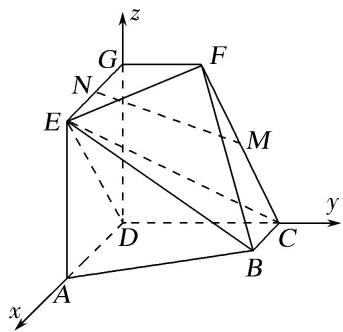  
（1）依题意 $\overrightarrow{DC}=(0,2,0)$ ， $\overrightarrow{DE}=(2,0,2)$ .设 $n_{0}=(x,y,z)$ 为平面CDE的法向量，则 $\left\{ \begin{array}{l} n_0 \cdot \overrightarrow{DC} = 0 \\ n_0 \cdot \overrightarrow{DE} = 0, \end{array} \right.$ 即 $\left\{ \begin{array}{l} 2y = 0, \\ 2x + 2z = 0, \end{array} \right.$ 不妨令 $z = -1$ ，可得 $n_0 = (1, 0, -1)$ .
又 $\overrightarrow{MN}=\left(1,-\frac{3}{2},1\right)$ ，可得 $\overrightarrow{MN}\cdot n_{0}=0$ ，又因为直线 $MN\notin$ 平面CDE，所以 $MN\parallel$ 平面CDE.  
（2）依题意，可得 $\overrightarrow{BC}=(-1,0,0)$ ， $\overrightarrow{BE}=(1,-2,2)$ ， $\overrightarrow{CF}=(0,-1,2)$ .
设 $\boldsymbol{n}=(x,y,z)$ 为平面 BCE 的法向量，则 $\left\{\begin{aligned}\boldsymbol{n}\cdot\overrightarrow{BC}&=0,\\ \boldsymbol{n}\cdot\overrightarrow{BE}&=0,\end{aligned}\right.$ 即 $\left\{\begin{aligned}-x&=0,\\ x&-2y+2z&=0,\end{aligned}\right.$
不妨令 z=1，可得 $n=(0,1,1)$ .
设 $\boldsymbol{m}=(x,y,z)$ 为平面 BCF 的法向量，则 $\left\{\begin{aligned}\boldsymbol{m}\cdot\overrightarrow{BC}&=0,\\ \boldsymbol{m}\cdot\overrightarrow{CF}&=0,\end{aligned}\right.$ 即 $\left\{\begin{aligned}-x&=0,\\ -y&+2z&=0,\end{aligned}\right.$
不妨令 z=1，可得 $m=(0,2,1)$ .
因此有 $\cos<m,\quad n>=\frac{m\cdot n}{|m||n|}=\frac{3\sqrt{10}}{10}$ ，于是 $\sin<m,\quad n>=\frac{\sqrt{10}}{10}$ .
所以，二面角 E-BC-F 的正弦值为 $\frac{\sqrt{10}}{10}$ .  
（3）设线段 DP 的长为 $h(h \in [0, 2])$ ，则点 P 的坐标为 $(0, 0, h)$ ，可得 $\overrightarrow{BP}=(-1, -2, h)$ .

易知， $\overrightarrow{DC} = (0, 2, 0)$ 为平面 $ADGE$ 的一个法向量，故 $\left|\cos < \overrightarrow{BP}, \overrightarrow{DC}\right| = \frac{\left|\overrightarrow{BP} \cdot \overrightarrow{DC}\right|}{\left|\overrightarrow{BP}\right|\left|\overrightarrow{DC}\right|} = \frac{2}{\sqrt{h^2 + 5}}$
由题意，可得 $\frac{2}{\sqrt{h^2 + 5}} = \sin 60^\circ = \frac{\sqrt{3}}{2}$ ，解得 $h = \frac{\sqrt{3}}{3} \in [0, 2]$ 。所以，线段 $DP$ 的长为 $\frac{\sqrt{3}}{3}$ 。

# 考点二 已知某一空间角求另一空间角

[例 1] (2017·全国Ⅱ)如图，四棱锥 P-ABCD 中，侧面 PAD 为等边三角形且垂直于底面 ABCD，AB = BC = $\frac{1}{2}$ AD， $\angle BAD = \angle ABC = 90^{\circ}$ ，E 是 PD 的中点.  
（1）证明：直线 $CE \parallel$ 平面 $PAB$ ;  
（2）点 M 在棱 PC 上，且直线 BM 与底面 ABCD 所成角为 $45^{\circ}$ ，求二面角 M-AB-D 的余弦值.

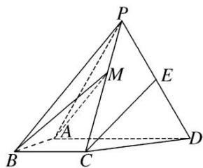

解析 （1）取 $PA$ 的中点 $F$ , 连接 $EF$ , $BF$ . 因为 $E$ 是 $PD$ 的中点, 所以 $EF \parallel AD$ , $EF = \frac{1}{2} AD$ .
由 $\angle BAD = \angle ABC = 90^{\circ}$ ，得 $BC / / AD$ ，又 $BC = \frac{1}{2} AD$
所以 $EF \parallel BC$ ，四边形 BCEF 是平行四边形， $CE \parallel BF$ ，
又 $BF \subset$ 平面 PAB， $CE \notin$ 平面 PAB，故 $CE \parallel$ 平面 PAB.

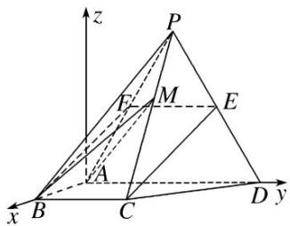  
（2）由已知得 $BA \perp AD$ ，以 $A$ 为坐标原点， $AB$ ， $AD$ 所在直线分别为 $x$ 轴， $y$ 轴， $|\overrightarrow{AB}|$ 为单位长度，建立如图所示的空间直角坐标系 $Axyz$ ，则 $A(0, 0, 0)$ ， $B(1, 0, 0)$ ， $C(1, 1, 0)$ ， $P(0, 1, \sqrt{3})$ ， $\overrightarrow{PC} = (1, 0, -\sqrt{3})$ ， $\overrightarrow{AB} = (1, 0, 0)$ .
设 $M(x, y, z)(0<x<1)$ ，则 $\overrightarrow{BM}=(x-1, y, z)$ ， $\overrightarrow{PM}=(x, y-1, z-\sqrt{3})$ .
因为 BM 与底面 ABCD 所成的角为 $45^{\circ}$ ，而 $n=(0,0,1)$ 是底面 ABCD 的法向量，
所以 $|\cos < \overrightarrow{BM}, n >| = \sin 45^\circ \frac{|z|}{\sqrt{(x - 1)^2 + y^2 + z^2}} = \frac{\sqrt{2}}{2}$ ，即 $(x - 1)^2 + y^2 - z^2 = 0$ 。①
又 M 在棱 PC 上，设 $\overrightarrow{PM} = \lambda \overrightarrow{PC}$ ，则 $x = \lambda, y = 1, z = \sqrt{3} - \sqrt{3}\lambda.$ ②
由①②解得 $\left\{\begin{aligned}x&=1+\frac{\sqrt{2}}{2},\\ y&=1,\\ z&=-\frac{\sqrt{6}}{2}\end{aligned}\right.$ (舍去)或 $\left\{\begin{aligned}x&=1-\frac{\sqrt{2}}{2},\\ y&=1,\\ z&=\frac{\sqrt{6}}{2},\end{aligned}\right.$
所以 $M\left(1 - \frac{\sqrt{2}}{2}, 1, \frac{\sqrt{6}}{2}\right)$ ，从而 $\overrightarrow{AM} = \left(1 - \frac{\sqrt{2}}{2}, 1, \frac{\sqrt{6}}{2}\right)$ .
设 $\boldsymbol{m}=(x_{0},y_{0},z_{0})$ 是平面 ABM 的法向量，则 $\left\{\begin{aligned}\boldsymbol{m}\cdot\overrightarrow{AM}&=0,\\ \boldsymbol{m}\cdot\overrightarrow{AB}&=0,\end{aligned}\right.$ 即 $\left\{\begin{aligned}(2-\sqrt{2})x_{0}+2y_{0}+\sqrt{6}z_{0}&=0,\\ x_{0}&=0,\end{aligned}\right.$
所以可取 $m=(0,-\sqrt{6},2)$ . 于是 $\cos<m,n>=\frac{m\cdot n}{|m||n|}=\frac{\sqrt{10}}{5}$ .
由图可知二面角 M—AB—D 是锐角，所以二面角 M—AB—D 的余弦值为 $\frac{\sqrt{10}}{5}$ .

[例 2] 已知三棱锥 P-ABC(如图 1) 的平面展开图(如图 2) 中，四边形 ABCD 为边长等于 $\sqrt{2}$ 的正方形， $\triangle ABE$ 和 $\triangle BCF$ 均为正三角形．在三棱锥 P-ABC 中：  
（1）证明：平面 PAC⊥平面 ABC;  
（2）若点 M 在棱 PA 上运动，当直线 BM 与平面 PAC 所成的角最大时，求二面角 P-BC-M 的余弦值.

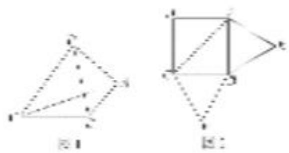

解析 （1）如图, 设 $AC$ 的中点为 $O$ , 连接 $OB$ , $OP$ .
由题意，得 PA=PB=PC= $\sqrt{2}$ ，OP=OB=1。
因为在 $\triangle POB$ 中， $OP^{2}+OB^{2}=PB^{2}$ ，所以 $OP\perp OB$ .
因为在 $\triangle PAC$ 中，PA=PC，O为AC的中点，所以 $OP\perp AC$ .
因为 $AC \cap OB = O$ ， $AC \subset$ 平面 ABC， $OB \subset$ 平面 ABC，所以 $OP \perp$ 平面 ABC.
因为 $OP \subset$ 平面 PAC，所以平面 $PAC \perp$ 平面 ABC.

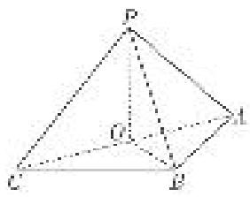  
（2）由（1）知， $OB \perp OP$ ，由题意可得 $OB \perp AC$ ，所以 $OB \perp$ 平面 PAC，
所以 $\angle BMO$ 是直线 BM 与平面 PAC 所成的角，且 $\tan\angle BMO=\frac{OB}{OM}=\frac{1}{OM}$ ，
所以当线段 OM 最短，即 M 是 PA 的中点时， $\angle BMO$ 最大.

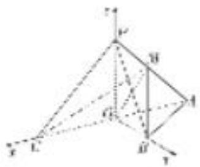
由 $OP \perp$ 平面 ABC， $OB \perp AC$ ，得 $OP \perp OB$ ， $OP \perp OC$ ， $OB \perp OC$ ，以 O 为坐标原点，OC，OB，OP 所在的直线分别为 x 轴、y 轴、z 轴，建立如图所示的空间直角坐标系，
则 $O(0, 0, 0)$ ， $C(1, 0, 0)$ ， $B(0, 1, 0)$ ， $A(-1, 0, 0)$ ， $P(0, 0, 1)$ ， $M\left(-\frac{1}{2}, 0, \frac{1}{2}\right)$
$\overrightarrow{B}\overrightarrow{C} = (1, -1, 0), \overrightarrow{P}\overrightarrow{C} = (1, 0, -1), \overrightarrow{M}\overrightarrow{C} = \left(\frac{3}{2}, 0, -\frac{1}{2}\right)$ .
设平面 MBC 的法向量为 $\boldsymbol{m}=(x_{1},y_{1},z_{1})$ ，由 $\left\{\begin{aligned}\boldsymbol{m}\cdot\overrightarrow{BC}&=0,\\ \boldsymbol{m}\cdot\overrightarrow{MC}&=0,\end{aligned}\right.$ 得 $\left\{\begin{aligned}x_{1}-y_{1}&=0,\\ 3x_{1}-z_{1}&=0,\end{aligned}\right.$
令 $x_{1}=1$ ，得 $y_{1}=1,\quad z_{1}=3$ ，即 $m=(1,1,3)$ 是平面 MBC 的一个法向量.
设平面 PBC 的法向量为 $\boldsymbol{n}=(x_{2},y_{2},z_{2})$ ，由 $\left\{\begin{aligned}\boldsymbol{n}\cdot\overrightarrow{BC}&=0,\\ \boldsymbol{n}\cdot\overrightarrow{PC}&=0,\end{aligned}\right.$ 得 $\left\{\begin{aligned}x_{2}-y_{2}&=0,\\ x_{2}-z_{2}&=0,\end{aligned}\right.$
令 $x_{2}=1$ ，得 $y_{2}=1,\quad z_{2}=1$ ，即 $n=(1,1,1)$ 是平面 PBC 的一个法向量.
所以 $\cos<m,\quad n>=\frac{m\cdot n}{|m||n|}=\frac{5}{\sqrt{33}}=\frac{5\sqrt{33}}{33}.$

结合图可知，二面角 P-BC-M 的余弦值为 $\frac{5\sqrt{33}}{33}$ .

[例 3] (2018·全国Ⅱ)如图，在三棱锥 P-ABC 中， $AB=BC=2\sqrt{2}$ ，PA=PB=PC=AC=4，O 为 AC 的中点.  
（1）证明： $PO \perp$ 平面 ABC;  
（2）若点 M 在棱 BC 上，且二面角 M-PA-C 为 $30^{\circ}$ ，求 PC 与平面 PAM 所成角的正弦值.

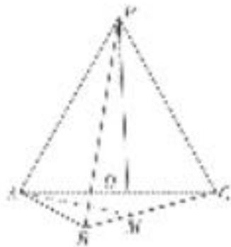

解析 （1）因为 PA=PC=AC=4，O 为 AC 的中点，所以 $PO \perp AC$ ，且 $PO=2\sqrt{3}$ .

连接 OB．因为 $AB=BC=\frac{\sqrt{2}}{2}AC$ ，所以 $\triangle ABC$ 为等腰直角三角形，且 $OB\perp AC$ ， $OB=\frac{1}{2}AC=2$ .
由 $PO^{2}+OB^{2}=PB^{2}$ ，知 $PO\perp OB$ .
由 $PO \perp OB$ ， $PO \perp AC$ ， $AC \cap OB = O$ ，知 $PO \perp$ 平面 ABC.

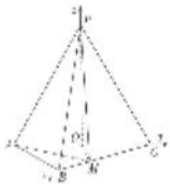  
（2）如图，以 O 为坐标原点， $\overrightarrow{OB},\overrightarrow{OC},\overrightarrow{OP}$ 的方向分别为 x 轴、y 轴、z 轴正方向，

建立如图所示的空间直角坐标系 Oxyz.
由已知得 $O(0, 0, 0)$ ， $B(2, 0, 0)$ ， $A(0, -2, 0)$ ， $C(0, 2, 0)$ ， $P(0, 0, 2\sqrt{3})$ ，
则 $\overrightarrow{AP} = (0, 2, 2\sqrt{3})$ ，取平面 $PAC$ 的一个法向量 $\overrightarrow{OB} = (2, 0, 0)$ .
设 $M(a, 2-a, 0)(0<a\leqslant2)$ ，则 $\overrightarrow{AM}=(a, 4-a, 0)$ .
设平面 PAM 的法向量为 $\boldsymbol{n}=(x,y,z)$ .
由 $\left\{\begin{aligned}\overrightarrow{AP}\cdot n&=0,\\ \overrightarrow{AM}\cdot n&=0,\end{aligned}\right.$ 得 $\left\{\begin{aligned}2y+2\sqrt{3}z&=0,\\ ax+(4-a)y&=0,\end{aligned}\right.$ 可取 $n=(\sqrt{3}(a-4),\sqrt{3}a,-a),$
所以 $\cos<\overrightarrow{OB}, n>=\frac{2\sqrt{3}(a-4)}{2\sqrt{3(a-4)^{2}+3a^{2}+a^{2}}}$ .
由已知得 $|\cos < \overrightarrow{OB}, n >| = \frac{\sqrt{3}}{2}$ . 所以 $\frac{2\sqrt{3}|a - 4|}{2\sqrt{3(a - 4)^2 + 3a^2 + a^2}} = \frac{\sqrt{3}}{2}$ .
解得 $a = -4$ (舍去) 或 $a = \frac{4}{3}$ . 所以 $n = \left(-\frac{8\sqrt{3}}{3}, \frac{4\sqrt{3}}{3}, -\frac{4}{3}\right)$ .
又 $\overrightarrow{PC} = (0, 2, -2\sqrt{3})$ ，所以 $\cos < \overrightarrow{PC}$ ， $n > = \frac{\sqrt{3}}{4}$ .
所以 PC 与平面 PAM 所成角的正弦值为 $\frac{\sqrt{3}}{4}$ .

[例 4] 如图所示的几何体中，四边形 ABCD 是等腰梯形， $AB \parallel CD$ ， $\angle ABC = 60^{\circ}$ ，AB = 2BC = 2CD，四边形 DCEF 是正方形，N，G 分别是线段 AB，CE 的中点.  
（1）求证：NG//平面ADF;  
（2）设二面角 $A - CD - F$ 的大小为 $\theta \left(\frac{\pi}{2} < \theta < \pi\right)$ ，当 $\theta$ 为何值时，二面角 $A - BC - E$ 的余弦值为 $\frac{\sqrt{13}}{13}$ ?

解析 （1）法一 如图，设 $DF$ 的中点为 $M$ ，连接 $AM$ ， $GM$

因为四边形 DCEF 是正方形，所以 $MG \parallel CD$ ，
又四边形 ABCD 是梯形，且 AB=2CD， $AB \parallel CD$ ，点 N 是 AB 的中点，
所以 $AN \parallel DC$ ，所以 $MG \parallel AN$ ，所以四边形 ANGM 是平行四边形，所以 $NG \parallel AM$ .
又 $AM \subset$ 平面 ADF， $NG \notin$ 平面 ADF，所以 $NG \parallel$ 平面 ADF.

法二 如图，连接 NC, NE,

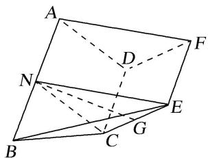
因为 N 是 AB 的中点，四边形 ABCD 是梯形，AB = 2CD， $AB \parallel CD$ ，
所以 AN 繣 CD，所以四边形 ANCD 是平行四边形，所以 NC // AD，
因为 $AD \subset$ 平面 ADF， $NC \notin$ 平面 ADF，所以 $NC \parallel$ 平面 ADF，
同理可得 $NE \parallel$ 平面 ADF，又 $NC \cap NE = N$ ，所以平面 $NCE \parallel$ 平面 ADF，
因为 $NG \subset$ 平面 NCE，所以 $NG \parallel$ 平面 ADF.  
（2）设 $CD$ 的中点为 $O$ , $EF$ 的中点为 $P$ , 连接 $NO$ , $OP$ , 易得 $NO \perp CD$ , 以点 $O$ 为原点, 以 $OC$ 所在直线为 $x$ 轴, 以 $NO$ 所在直线为 $y$ 轴, 以过点 $O$ 且与平面 $ABCD$ 垂直的直线为 $z$ 轴建立如图所示的空间直角坐标系.

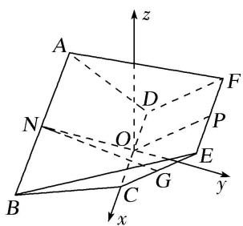
因为 $NO \perp CD$ ， $OP \perp CD$ ，所以 $\angle NOP$ 是二面角 A - CD - F 的平面角，
则 $\angle NOP = \theta$ ，所以 $\angle POy = \pi - \theta$ ，设 AB = 4，则 BC = CD = 2，
则 $P(0, 2\cos(\pi-\theta), 2\sin(\pi-\theta))$ , $E(1, 2\cos(\pi-\theta), 2\sin(\pi-\theta))$ , $C(1, 0, 0)$ , $B(2, -\sqrt{3}, 0)$ ,
$\overrightarrow {C E} = (0, 2 \cos (\pi - \theta), 2 \sin (\pi - \theta)), \overrightarrow {C B} = (1, - \sqrt {3}, 0),$
设平面 BCE 的法向量为 $\boldsymbol{n}=(x,y,z)$ ，则 $\left\{\begin{aligned}\boldsymbol{n}\cdot\overrightarrow{CB}&=0,\\ \boldsymbol{n}\cdot\overrightarrow{CE}&=0,\end{aligned}\right.$ 即 $\left\{\begin{aligned}x-\sqrt{3}y&=0,\\ 2y\cos(\pi-\theta)+2z\sin(\pi-\theta)&=0,\end{aligned}\right.$
因为 $\theta\in\left(\frac{\pi}{2},\quad\pi\right)$ ，所以 $\cos(\pi-\theta)\neq0$ ，令 z=1，则 $y=-\tan(\pi-\theta)$ ， $x=-\sqrt{3}\tan(\pi-\theta)$ ，
所以 $n=(-\sqrt{3}\tan(\pi-\theta), -\tan(\pi-\theta), 1)$ 为平面 BCE 的一个法向量，
又易知平面 ACD 的一个法向量为 $m=(0,0,1)$ ,
所以 $\cos<m,\quad n>=\frac{m\cdot n}{|m|\cdot|n|}=\frac{1}{\sqrt{4\tan^{2}(\pi-\theta)+1}}$
由图可知二面角 A-BC-E 为锐角，所以 $\frac{1}{\sqrt{4\tan^{2}(\pi-\theta)+1}}=\frac{\sqrt{13}}{13}$ ,
解得 $\tan^{2}(\pi-\theta)=3$ ，又 $\frac{\pi}{2}<\theta<\pi$ ，所以 $\tan(\pi-\theta)=\sqrt{3}$ ，即 $\pi-\theta=\frac{\pi}{3}$ ，得 $\theta=\frac{2\pi}{3}$ ，
所以当二面角 A-CD-F 的大小为 $\frac{2\pi}{3}$ 时，二面角 A-BC-E 的余弦值为 $\frac{\sqrt{13}}{13}$ .

# 【对点训练】

1. 已知四棱锥 $P - ABCD$ ，底面 $ABCD$ 为菱形， $PD = PB$ ， $H$ 为 $PC$ 上的点，过 $AH$ 的平面分别交 $PB$ ， $PD$ 于点 $M$ ， $N$ ，且 $BD //$ 平面 $AMHN$ .  
（1）证明： $MN \perp PC;$   
（2）当 H 为 PC 的中点， $PA=PC=\sqrt{3}AB$ ，PA 与平面 ABCD 所成的角为 $60^{\circ}$ ，求 AD 与平面 AMHN 所成角的正弦值.

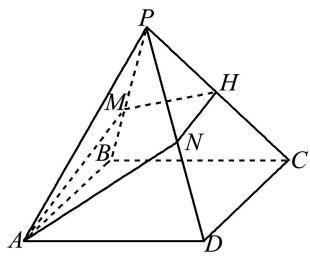

1. 解析 （1） 连接 AC, BD 且 $AC \cap BD = O$ ，连接 PO.

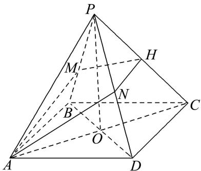
因为 ABCD 为菱形，所以 $BD \perp AC$ 。因为 PD = PB ，所以 $PO \perp BD$ 。
因为 $AC \cap PO = O$ ，且 AC，PO ⊂ 平面 PAC，所以 BD ⊥ 平面 PAC.
因为 $PC \subset$ 平面 $PAC$ , 所以 $BD \perp PC$ . 因为 $BD \parallel$ 平面 $AMHN$ ,

且平面 $AMHN \cap$ 平面 PBD = MN，所以 BD // MN， $MN \perp$ 平面 PAC，所以 $MN \perp PC$ .  
（2）由（1）知 $BD \perp AC$ 且 $PO \perp BD$ 。因为 PA = PC ，且 O 为 AC 的中点，
所以 $PO \perp AC$ ，所以 $PO \perp$ 平面 ABCD，所以 PA 与平面 ABCD 所成的角为 $\angle PAO$ ，
所以 $\angle PAO = 60^{\circ}$ ，所以 $AO = \frac{1}{2} PA$ ， $PO = \frac{\sqrt{3}}{2} PA$ 因为 $PA = \sqrt{3} AB$ ，所以 $BO = \frac{\sqrt{3}}{6} PA$

以 O 为原点，OA，OD，OP 分别为 x 轴、y 轴、z 轴建立如图所示空间直角坐标系.

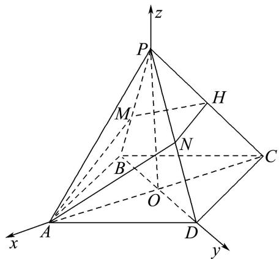
设 PA=2，所以 $O(0,0,0)$ ， $A(1,0,0)$ ， $B\left(0,-\frac{\sqrt{3}}{3},0\right)$ ， $C(-1,0,0)$ ， $D\left(0,\frac{\sqrt{3}}{3},0\right)$ ， $P(0,0,\sqrt{3})$
$H \left(- \frac {1}{2}, 0, \frac {\sqrt {3}}{2}\right),$
所以 $\overrightarrow{BD} = \left(0, \frac{2\sqrt{3}}{3}, 0\right)$ , $\overrightarrow{AH} = \left(-\frac{3}{2}, 0, \frac{\sqrt{3}}{2}\right)$ , $\overrightarrow{AD} = \left(-1, \frac{\sqrt{3}}{3}, 0\right)$ .
设平面 AMHN 的法向量为 $\boldsymbol{n}=(x,y,z)$ ，所以 $\left\{\begin{aligned}\boldsymbol{n}\cdot\overrightarrow{BD}&=0,\\ \boldsymbol{n}\cdot\overrightarrow{AH}&=0,\end{aligned}\right.$ 即 $\left\{\begin{aligned}\frac{2\sqrt{3}}{3}y&=0,\\ -\frac{3}{2}x+\frac{\sqrt{3}}{2}z&=0.\end{aligned}\right.$
令 x=2，则 $y=0,\quad z=2\sqrt{3}$ ，所以 $n=(2,0,2\sqrt{3})$ 为平面 AMHN 的一个法向量.
设 AD 与平面 AMHN 所成角为 $\theta$ ，所以 $\sin\theta=|\cos<n,\quad\overrightarrow{AD}>|=\left|\frac{n\cdot\overrightarrow{AD}}{|n||\overrightarrow{AD}|}\right|=\frac{\sqrt{3}}{4}$ .
所以 AD 与平面 AMHN 所成角的正弦值为 $\frac{\sqrt{3}}{4}$ .

2. 如图，在三棱柱 $ABC - A_{1}B_{1}C_{1}$ 中， $BB_{1} \perp$ 平面 $ABC$ ， $AB \perp BC$ ， $AB = 2$ ， $BC = 1$ ， $BB_{1} = 3$ ， $D$ 是 $CC_{1}$ 的中点， $E$ 是 $AB$ 的中点.  
（1）证明： $DE \parallel$ 平面 $C_{1}BA_{1}$ ;  
（2） $F$ 是线段 $CC_{1}$ 上一点，且直线 $AF$ 与平面 $ABB_{1}A_{1}$ 所成角的正弦值为 $\frac{1}{3}$ ，求二面角 $F - BA_{1} - A$ 的余弦值.

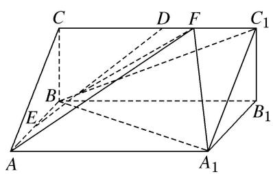

2. 解析 （1）如图, 连接 $AB_{1}$ 交 $A_{1}B$ 于点 $O$ , 连接 $EO$ , $OC_{1}$ .
$\because OA=OB_{1},\ AE=EB,\ \therefore OE=\frac{1}{2}BB_{1},\ OE\parallel BB_{1},\ \text{又 }DC_{1}=\frac{1}{2}BB_{1},\ DC_{1}\parallel BB_{1},$
∴OE 綫 $DC_{1}$ ，因此，四边形 $DEOC_{1}$ 为平行四边形，∴ $ED \parallel OC_{1}$ .
$\because OC_{1}\subset$ 平面 $C_{1}BA_{1}$ , $ED\not\subset$ 平面 $C_{1}BA_{1}$ , $\therefore DE//$ 平面 $C_{1}BA_{1}$ .

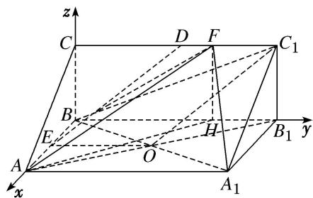  
（2）易知 AB, $BB_{1}$ , BC 两两垂直,
所以以 BA, $BB_{1}$ , BC 所在直线分别为 x 轴, y 轴, z 轴建立如图所示的空间直角坐标系 B-xyz, 过点 F 作 $FH \perp BB_{1}$ , 交 $BB_{1}$ 于点 H, 连接 AH.
$\because BB_{1}\perp$ 平面 ABC, $AB\subset$ 平面 ABC, $\therefore AB\perp BB_{1}$ .
∵AB⊥BC，BC∩BB1=B，∴AB⊥平面CBB1C1.
∵ $AB \subset$ 平面 $BAA_{1}B_{1}$ ，∴ 平面 $BAA_{1}B_{1} \perp$ 平面 $CBB_{1}C_{1}$ .
∵FH⊂平面 $CBB_{1}C_{1}$ ， $FH\perp BB_{1}$ ，平面 $BAA_{1}B_{1}\cap$ 平面 $CBB_{1}C_{1}=BB_{1}$ ，∴FH⊥平面 $BAA_{1}B_{1}$
∴ $\angle FAH$ 为直线 AF 与平面 $ABB_{1}A_{1}$ 所成的角，记为 $\theta$ ，则 $\sin\theta=\frac{FH}{AF}=\frac{1}{3}$ ，∴ AF=3，
在 Rt△ACF 中， $5=AC^{2}=AF^{2}-CF^{2}=9-CF^{2}$ ，∴CF=2，∴ $F(0,2,1)$ ， $A_{1}(2,3,0)$
$\therefore \overrightarrow {B F} = (0, 2, 1), \overrightarrow {B A _ {1}} = (2, 3, 0),$
设平面 $BFA_{1}$ 的法向量为 $m=(x, y, z)$ ，则 $\left\{\begin{aligned}&m\cdot\overrightarrow{BF}=2y+z=0,\\ &m\cdot\overrightarrow{BA_{1}}=2x+3y=0,\end{aligned}\right.$ 取 y=2，得 x=-3，z=-4，
$\therefore m = (-3, 2, -4)$ 为平面 $BFA_{1}$ 的一个法向量．易知平面 $BAA_{1}$ 的一个法向量为 $n = (0, 0, 1)$ ，则 $|\cos < m, n > | = \frac{4}{\sqrt{29} \times 1} = \frac{4}{29}\sqrt{29}$ . 又二面角 $F - BA_{1} - A$ 为钝二面角，
因此，二面角 $F - BA_{1} - A$ 的余弦值为 $-\frac{4}{29}\sqrt{29}$

3. 已知在四棱锥 $P - ABCD$ 中，底面 $ABCD$ 为菱形， $PD = PB$ ， $H$ 为 $PC$ 上的点，过直线 $AH$ 的平面分别交 $PB$ ， $PD$ 于点 $M$ ， $N$ ，且 $BD \parallel$ 平面 $AMHN$ .  
（1）证明： $MN \perp PC;$  
（2）当 H 为 PC 的中点时， $PA=PC=\sqrt{3}AB$ ，PA 与平面 ABCD 所成的角为 $60^{\circ}$ ，求平面 PAB 与平面 AMHN 夹角的余弦值.

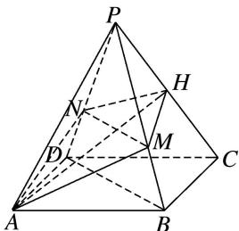

3. 解析 （1）如图, 连接 $AC$ 交 $BD$ 于点 $O$ , 连接 $PO$ . 因为四边形 $ABCD$ 为菱形,
所以 $BD \perp AC$ ，且 $O$ 为 $AC$ ， $BD$ 的中点，因为 $PD = PB$ ，所以 $PO \perp BD$ ，
因为 $AC \cap PO = O$ 且 AC， $PO \subset$ 平面 PAC，所以 $BD \perp$ 平面 PAC，
因为 $PC \subset$ 平面 $PAC$ , 所以 $BD \perp PC$ . 因为 $BD \parallel$ 平面 $AMHN$ , $BD \subset$ 平面 $PBD$ ,

且平面 $AMHN \cap$ 平面 PBD = MN，所以 BD // MN，所以 $MN \perp PC$ .  
（2）由（1）知 $BD \perp AC$ 且 $PO \perp BD$ , 因为 $PA = PC$ , 且 $O$ 为 $AC$ 的中点,
所以 $PO \perp AC$ ，所以 $PO \perp$ 平面ABCD，所以 $PA$ 与平面ABCD所成的角为 $\angle PAO$
所以 $AO=\frac{1}{2}PA,\quad PO=\frac{\sqrt{3}}{2}PA$ ，因为 $PA=\sqrt{3}AB$ ，所以 $BO=\frac{\sqrt{3}}{6}PA$ .
分别以 $\overrightarrow{OA},\overrightarrow{OB},\overrightarrow{OP}$ 为x轴，y轴，z轴的正方向，

建立如图所示的空间直角坐标系，设 PA=2，则

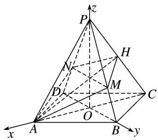
$O(0, 0, 0), A(1, 0, 0), B\left[0, \frac{\sqrt{3}}{3}, 0\right], C(-1, 0, 0), D\left[0, -\frac{\sqrt{3}}{3}, 0\right], P(0, 0, \sqrt{3}), H\left[-\frac{1}{2}, 0, \frac{\sqrt{3}}{2}\right]$ ,
所以 $\overrightarrow{DB} = \left(0, \frac{2\sqrt{3}}{3}, 0\right)$ , $\overrightarrow{AH} = \left(-\frac{3}{2}, 0, \frac{\sqrt{3}}{2}\right)$ , $\overrightarrow{AB} = \left(-1, \frac{\sqrt{3}}{3}, 0\right)$ , $\overrightarrow{AP} = (-1, 0, \sqrt{3})$ .

记平面 AMHN 的一个法向量为 $\boldsymbol{n}_{1}=(x_{1},y_{1},z_{1})$ ,
则 $\left\{ \begin{array}{l} n_{1} \cdot \overrightarrow{DB} = \frac{2\sqrt{3}}{3} y_{1} = 0, \\ n_{1} \cdot \overrightarrow{AH} = -\frac{3}{2} x_{1} + \frac{\sqrt{3}}{2} z_{1} = 0, \end{array} \right.$ 令 $x_{1} = 1$ ，则 $y_{1} = 0$ ， $z_{1} = \sqrt{3}$ ，所以 $n_{1} = (1, 0, \sqrt{3})$

记平面 PAB 的一个法向量为 $\boldsymbol{n}_{2}=(x_{2},y_{2},z_{2})$ ,
则 $\left\{ \begin{array}{l} n_{2} \cdot \overrightarrow{AB} = -x_{2} + \frac{\sqrt{3}}{3} y_{2} = 0, \\ n_{2} \cdot \overrightarrow{AP} = -x_{2} + \sqrt{3} z_{2} = 0, \end{array} \right.$ 令 $x_{2} = 1$ ，则 $y_{2} = \sqrt{3}$ ， $z_{2} = \frac{\sqrt{3}}{3}$ ，所以 $n_{2} = \left(1, \sqrt{3}, \frac{\sqrt{3}}{3}\right)$ ，

记平面 PAB 与平面 AMHN 的夹角为 $\theta$ ，则 $\cos\theta=|\cos<n_{1},\quad n_{2}>|=\frac{n_{1}\cdot n_{2}}{|n_{1}|\cdot|n_{2}|}=\frac{\sqrt{39}}{13}$ .
所以平面 PAB 与平面 AMHN 的夹角的余弦值为 $\frac{\sqrt{39}}{13}$ .

4. 如图，等腰梯形 $ABCD$ 中， $AB \parallel CD$ ， $AD = AB = BC = 1$ ， $CD = 2$ ， $E$ 为 $CD$ 的中点，以 $AE$ 为折痕把 $\triangle ADE$ 折起，使点 $D$ 到达点 $P$ 的位置 ( $P \notin$ 平面 $ABCE$ ).  
（1）证明： $AE \perp PB;$   
（2）若直线 $PB$ 与平面 $ABCE$ 所成的角为 $\frac{\pi}{4}$ , 求二面角 $A - PE - C$ 的余弦值.

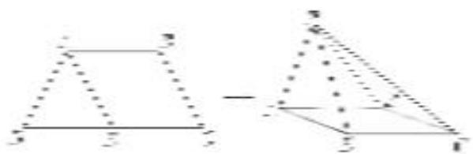

4. 解析 （1）如图, 连接 $BD$ , $BE$ , 设 $AE$ 的中点为 $O$ ,

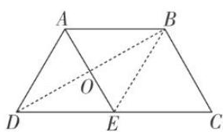
∵ AB // CE, $AB = CE = \frac{1}{2}CD$ , ∴ 四边形 ABCE 为平行四边形,
$\therefore AE = BC = AD = DE, \therefore \triangle ADE, \triangle ABE$ 为等边三角形，
$\therefore OD \perp AE, OB \perp AE, \text{折叠后 } OP \perp AE, OB \perp AE,$
又 $OP \cap OB = O$ ， $\therefore AE \perp$ 平面 $POB$ ，又 $PB \subset$ 平面 $POB$ ， $\therefore AE \perp PB$ .  
（2）在平面 $POB$ 内作 $PO \perp$ 平面 $ABCE$ , 垂足为 $O$ , 则 $O$ 在直线 $OB$ 上,
∴直线 PB 与平面 ABCE 所成的角为 $\angle PBO = \frac{\pi}{4}$ ，又 OP = OB，∴ $OP \perp OB$ ，
∴O，O两点重合，即PO⊥平面ABCE.

以 $O$ 为坐标原点， $OE$ ， $OB$ ， $OP$ 所在直线分别为 $x$ 轴、 $y$ 轴、 $z$ 轴，建立如图所示的空间直角坐标系，

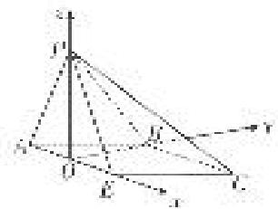
则 $P\left(0, 0, \frac{\sqrt{3}}{2}\right), E\left(\frac{1}{2}, 0, 0\right), C\left(1, \frac{\sqrt{3}}{2}, 0\right), \therefore \overrightarrow{PE} = \left(\frac{1}{2}, 0, -\frac{\sqrt{3}}{2}\right), \overrightarrow{EC} = \left(\frac{1}{2}, \frac{\sqrt{3}}{2}, 0\right)$ ,
设平面 PCE 的法向量为 $\boldsymbol{n}_{1}=(x,y,z)$ ，则 $\left\{\begin{aligned}\boldsymbol{n}_{1}\cdot\overrightarrow{PE}&=0,\\ \boldsymbol{n}_{1}\cdot\overrightarrow{EC}&=0,\end{aligned}\right.$ 即 $\left\{\begin{aligned}\frac{1}{2}x-\frac{\sqrt{3}}{2}z&=0,\\ \frac{1}{2}x+\frac{\sqrt{3}}{2}y&=0,\end{aligned}\right.$
令 $x=\sqrt{3}$ 得 $n_{1}=(\sqrt{3}, -1, 1)$ ,
又 $OB \perp$ 平面 $PAE, \therefore n_2 = (0, 1, 0)$ 为平面 $PAE$ 的一个法向量，
设二面角 A-PE-C 的大小为 $\alpha$ ，则 $|\cos\alpha|=|\cos<n_{1}, n_{2}>|=\frac{|n_{1}\cdot n_{2}|}{|n_{1}||n_{2}|}=\frac{1}{\sqrt{5}}=\frac{\sqrt{5}}{5}$
由图可知二面角 A-PE-C 为钝角，∴ $\cos\alpha=-\frac{\sqrt{5}}{5}$ .

5. 如图, 在四棱锥 $P - ABCD$ 中, $PA \perp$ 底面 $ABCD$ , 底面 $ABCD$ 是直角梯形, $\angle ADC = 90^{\circ}$ , $AD \parallel BC$ , $AB \perp AC$ , $AB = AC = \sqrt{2}$ , 点 $E$ 在 $AD$ 上, 且 $AE = 2ED$ .  
（1）已知点 F 在 BC 上，且 CF=2FB，求证：平面 PEF⊥平面 PAC;  
（2）当二面角 A—PB—E 的余弦值为多少时，直线 PC 与平面 PAB 所成的角为 $45^{\circ}$ ?

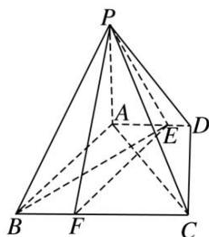

5. 解析 （1） $\because AB \perp AC, AB = AC, \therefore \angle ACB = 45^{\circ}, \because$ 底面 $ABCD$ 是直角梯形, $\angle ADC = 90^{\circ}, AD \parallel BC$ , $\therefore \angle ACD = 45^{\circ}$ , 即 $AD = CD, AC = \sqrt{2}AD$ , 又 $AB \perp AC, \therefore BC = \sqrt{2}AC = 2AD$ ,
∵AE=2ED, CF=2FB, ∴AE=BF= $\frac{2}{3}$ AD, 又∵AE//BF,
∴四边形 ABFE 是平行四边形，∴AB∥EF，∴AC⊥EF，
∵ PA⊥底面 ABCD，∴ PA⊥EF，∵ PA∩AC=A，PA，AC⊂平面 PAC，∴ EF⊥平面 PAC，
又 $EF \subset$ 平面 PEF，∴平面 $PEF \perp$ 平面 PAC.  
（2） $\because PA\perp AC,\ AC\perp AB,\ PA\cap AB=A,\ PA,\ AB\subset$ 平面PAB,
∴ AC⊥平面 PAB，则 $\angle APC$ 为 PC 与平面 PAB 所成的角，若 PC 与平面 PAB 所成的角为 $45^{\circ}$ ，
则 $\tan\angle APC=\frac{AC}{PA}=1$ ，即 $PA=AC=\sqrt{2}$ ，

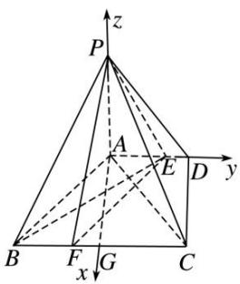

取 BC 的中点 G，连接 AG，则 $AG \perp BC$ ，以 A 为坐标原点，

AG, AD, AP 所在直线分别为 x 轴, y 轴, z 轴, 建立如图所示的空间直角坐标系 Axyz,
则 $A(0, 0, 0)$ , $B(1, -1, 0)$ , $C(1, 1, 0)$ , $E\left[0, \frac{2}{3}, 0\right]$ , $P(0, 0, \sqrt{2})$ ,
$\therefore \overrightarrow {E B} = \left(1, - \frac {5}{3}, 0\right), \overrightarrow {E P} = \left(0, - \frac {2}{3}, \sqrt {2}\right),$
设平面 PBE 的法向量为 $\boldsymbol{n}=(x,y,z)$ ，则 $\left\{\begin{aligned}\boldsymbol{n}\cdot\overrightarrow{EB}&=0,\\ \boldsymbol{n}\cdot\overrightarrow{EP}&=0,\end{aligned}\right.$ 即 $\left\{\begin{aligned}x-\frac{5}{3}y&=0,\\ -\frac{2}{3}y+\sqrt{2}z&=0,\end{aligned}\right.$
令 y=3，则 $x=5,\quad z=\sqrt{2},\quad \therefore n=(5,3,\sqrt{2}).\quad \because \overrightarrow{AC}=(1,1,0)$ 是平面 PAB 的一个法向量，
$\cos <   n, \overrightarrow {A C} > = \frac {5 + 3}{\sqrt {2} \times 6} = \frac {2 \sqrt {2}}{3},$
即当二面角 A—PB—E 的余弦值为 $\frac{2\sqrt{2}}{3}$ 时，直线 PC 与平面 PAB 所成的角为 $45^{\circ}$ .

6. 如图, 在四棱锥 $P - ABCD$ 中, 底面 $ABCD$ 为边长为 2 的菱形, $\angle DAB = 60^{\circ}$ , $\angle ADP = 90^{\circ}$ , 平面 $ADP \perp$ 平面 $ABCD$ , 点 $F$ 为棱 $PD$ 的中点.  
（1）在棱 $AB$ 上是否存在一点 $E$ , 使得 $AF \parallel$ 平面 $PCE$ ? 并说明理由;  
（2）当二面角 D-FC-B 的余弦值为 $\frac{\sqrt{2}}{4}$ 时，求直线 PB 与平面 ABCD 所成的角.

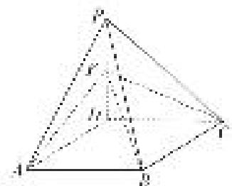

6. 解析 （1）在棱 $AB$ 上存在点 $E$ , 使得 $AF \parallel$ 平面 $PCE$ , 点 $E$ 为棱 $AB$ 的中点. 理由如下:取 PC 的中点 Q，连接 EQ，FQ，
由题意， $FQ \parallel DC$ 且 $FQ = \frac{1}{2} CD$ ， $AE \parallel CD$ 且 $AE = \frac{1}{2} CD$ ，则 $AE \parallel FQ$ 且 AE = FQ。
所以四边形 AEQF 为平行四边形．所以 AF//EQ，又 EQ⊂平面 PCE，AF∉平面 PCE，所以 AF// 平面 PCE.  
（2）由题意，知 $\triangle ABD$ 为正三角形，所以 $ED\perp AB$ ，亦即 $ED\perp CD$ ，
又 $\angle ADP=90^{\circ}$ ，所以 $PD\perp AD$ ，且平面 $ADP\perp$ 平面 $ABCD$ ，平面 $ADP\cap$ 平面 $ABCD=AD$ ，

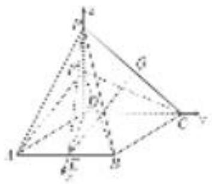
所以 $PD \perp$ 平面 ABCD，故以 D 为坐标原点建立如图所示的空间直角坐标系，设 $FD=a(a>0)$ ，则由题意知 $D(0,0,0)$ ， $F(0,0,a)$ ， $C(0,2,0)$ ， $B(\sqrt{3},1,0)$ ，
$\vec {F C} = (0, 2, - a), \vec {C B} = (\sqrt {3}, - 1, 0),$
设平面 FBC 的法向量为 $\boldsymbol{m}=(x,y,z)$ ，则由 $\left\{\begin{aligned}\boldsymbol{m}\cdot\overrightarrow{FC}&=0,\\ \boldsymbol{m}\cdot\overrightarrow{CB}&=0,\end{aligned}\right.$ 得 $\left\{\begin{aligned}2y-az&=0,\\\sqrt{3}x-y&=0,\end{aligned}\right.$
令 x=1，则 $y=\sqrt{3}$ ， $z=\frac{2\sqrt{3}}{a}$ ，所以取 $m=\left(1,\sqrt{3},\frac{2\sqrt{3}}{a}\right)$ ,
显然可取平面 DFC 的法向量 $n=(1,0,0)$ ,
由题意知 $\frac{\sqrt{2}}{4} = |\cos < m, n > | = \frac{1}{\sqrt{1 + 3 + \frac{12}{a^2}}}$ ，所以 $a = \sqrt{3}$ .
由于 $PD \perp$ 平面 ABCD，所以 PB 在平面 ABCD 内的射影为 BD，所以 $\angle PBD$ 为直线 PB 与平面 ABCD 所成的角，

易知在 Rt△PBD 中， $\tan\angle PBD=\frac{PD}{BD}=a=\sqrt{3}$ ，从而 $\angle PBD=60^{\circ}$
所以直线 PB 与平面 ABCD 所成的角为 $60^{\circ}$ .

