**专题12　利用空间向量计算空间角的综合问题**

**【例题选讲】**

**考点一　求两个空间角**

<strong>[例1]</strong>　(2018·江苏)如图，在正三棱柱<em>ABC</em>－<em>A</em>1<em>B</em>1<em>C</em>1中，<em>AB</em>＝<em>AA</em>1＝2，点<em>P</em>，<em>Q</em>分别为<em>A</em>1<em>B</em>1，<em>BC</em>的中点．

(1)求异面直线<em>BP</em>与<em>AC</em>1所成角的余弦值；

(2)求直线<em>CC</em>1与平面<em>AQC</em>1所成角的正弦值．

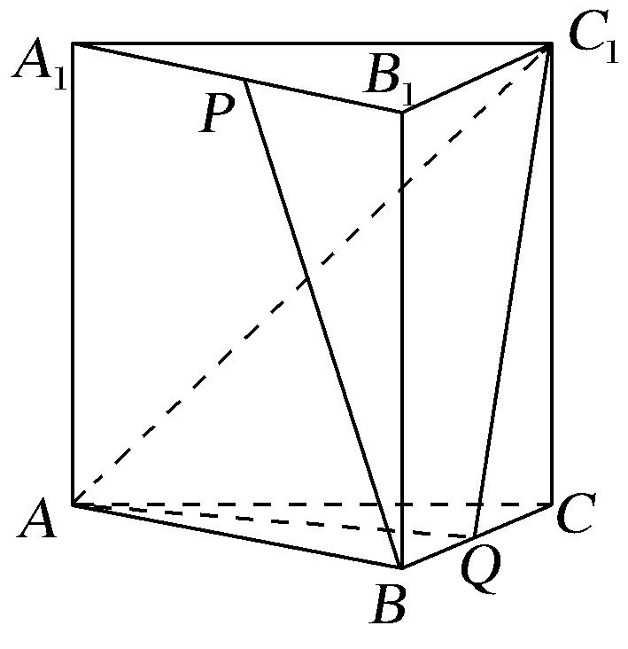

解析　如图，在正三棱柱<em>ABC</em>－<em>A</em>1<em>B</em>1<em>C</em>1中，设<em>AC</em>，<em>A</em>1<em>C</em>1 的中点分别为<em>O</em>，<em>O</em>1，连接<em>OB</em>，<em>OO</em>1，则<em>OB</em>⊥<em>OC</em>，<em>OO</em>1⊥<em>OC</em>，<em>OO</em>1⊥<em>OB</em>，以{，，}为基底，建立如图所示的空间直角坐标系<em>O</em>－<em>xyz．</em>

因为<em>AB</em>＝<em>AA</em>1＝2，所以<em>A</em>(0，－1，0)，<em>B</em>(，0，0)，<em>C</em>(0，1，0)，<em>A</em>1(0，－1，2)，<em>B</em>1(，0，2)，<em>C</em>1(0，1，2)．

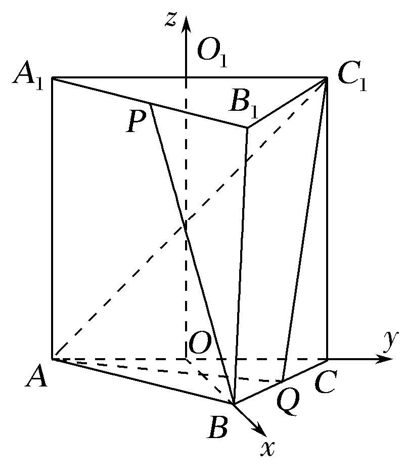

(1)因为<em>P</em>为<em>A</em>1<em>B</em>1的中点，所以<em>P</em>，从而＝，＝(0，2，2)，

故|cos＜，*＞*|＝＝＝．

因此，异面直线<em>BP</em>与<em>AC</em>1所成角的余弦值为．

(2)因为*Q*为*BC*的中点，所以*Q*，

因此＝，＝(0，2，2)，＝(0，0，2).

设<em><strong>n</strong></em>＝(<em>x</em>，<em>y</em>，<em>z</em>)为平面<em>AQC</em>1的一个法向量，则即

不妨取***n***＝(，－1，1)．

设直线<em>CC</em>1与平面<em>AQC</em>1所成角为<em>θ</em>，

则sin <em>θ</em>＝|cos&lt;，<em><strong>n</strong></em>&gt;|＝＝＝，

所以直线<em>CC</em>1与平面<em>AQC</em>1所成角的正弦值为．

<strong>[例2]</strong>　(2020·江苏)在三棱锥<em>A</em>－<em>BCD</em>中，已知<em>CB</em>＝<em>CD</em>＝，<em>BD</em>＝2，<em>O</em>为<em>BD</em>的中点，<em>AO</em>⊥平面<em>BCD</em>，<em>AO</em>＝2，<em>E</em>为<em>AC</em>的中点．

(1)求直线*AB*与*DE*所成角的余弦值；

(2)若点*F*在*BC*上，满足*BF*＝*BC*，设二面角*F*－*DE*－*C*的大小为*θ*，求sin*θ*的值．

解析　(1)连接*CO*，∵*CB*＝*CD*，*BO*＝*OD*，∴*CO*⊥*BD*．

又*AO*⊥平面*BCD*，∴*AO*，*BO*，*CO*两两垂直．

以*O*为坐标原点，*OB*，*OC*，*OA*所在直线分别为*x*，*y*，*z*轴建立空间直角坐标系，

则*A*(0，0，2)，*B*(1，0，0)，*C*(0，2，0)，*D*(－1，0，0)，∴*E*(0，1，1)．

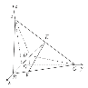

∴＝(1，0，－2)，＝(1，1，1)，∴cos＜，＞＝＝－．

∴直线*AB*与*DE*所成角的余弦值为．

(2)设平面<em>DEC</em>的法向量为<em><strong>n</strong></em>1＝(<em>x</em>，<em>y</em>，<em>z</em>)，∵＝(1，2，0)，∴

令<em>y</em>＝1，则<em>x</em>＝－2，<em>z</em>＝1，<em><strong>n</strong></em>1＝(－2，1，1)．设平面<em>DEF</em>的法向量为<em><strong>n</strong></em>2＝(<em>x</em>1，<em>y</em>1，<em>z</em>1)，

∵＝＋＝＋＝，∴

令<em>y</em>1＝－7，则<em>x</em>1＝2，<em>z</em>1＝5，<em><strong>n</strong></em>2＝(2，－7，5)．

∴cos＜<em><strong>n</strong></em>1，<em><strong>n</strong></em>2＞＝＝－．∴sin<em>θ</em>＝＝．

<strong>[例3]</strong>　(2020·天津)如图，在三棱柱<em>ABC</em>－<em>A</em>1<em>B</em>1<em>C</em>1中，<em>CC</em>1⊥平面<em>ABC</em>，<em>AC</em>⊥<em>BC</em>，<em>AC</em>＝<em>BC</em>＝2，<em>CC</em>1＝3，点<em>D</em>，<em>E</em>分别在棱<em>AA</em>1和棱<em>CC</em>1上，且<em>AD</em>＝1，<em>CE</em>＝2，<em>M</em>为棱<em>A</em>1<em>B</em>1的中点．

(1)求证：<em>C</em>1<em>M</em>⊥<em>B</em>1<em>D</em>；

(2)求二面角<em>B</em>－<em>B</em>1<em>E</em>－<em>D</em>的正弦值；

(3)求直线<em>AB</em>与平面<em>DB</em>1<em>E</em>所成角的正弦值．

解析　解法一：依题意，以*C*为坐标原点，分别以，，的方向为*x*轴、*y*轴、*z*轴的正方向建立空间直角坐标系(如图)，

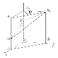

可得<em>C</em>(0，0，0)，<em>A</em>(2，0，0)，<em>B</em>(0，2，0)，<em>C</em>1(0，0，3)，<em>A</em>1(2，0，3)，<em>B</em>1(0，2，3)，<em>D</em>(2，0，1)，<em>E</em>(0，0，2)，<em>M</em>(1，1，3)．

(1)依题意，＝(1，1，0)，＝(2，－2，－2)，从而·＝2－2＋0＝0，所以<em>C</em>1<em>M</em>⊥<em>B</em>1<em>D．</em>

(2)依题意，＝(2，0，0)是平面<em>BB</em>1<em>E</em>的一个法向量，＝(0，2，1)，＝(2，0，－1)．

设<em><strong>n</strong></em>＝(<em>x</em>，<em>y</em>，<em>z</em>)为平面<em>DB</em>1<em>E</em>的一个法向量，则即令<em>x</em>＝1，可得<em><strong>n</strong></em>＝(1，－1，2)．

cos＜，***n***＞＝＝＝，sin＜，***n***＞＝＝．

所以二面角<em>B</em>－<em>B</em>1<em>E</em>－<em>D</em>的正弦值为．

(3)＝(－2，2，0)，由(2)知<em><strong>n</strong></em>＝(1，－1,2)为平面<em>DB</em>1<em>E</em>的一个法向量，

于是cos＜，<em><strong>n</strong></em>＞＝＝＝－．所以直线<em>AB</em>与平面<em>DB</em>1<em>E</em>所成角的正弦值为．

<strong>[例4]</strong>　(2019·天津)如图，<em>AE</em>⊥平面<em>ABCD</em>，<em>CF</em>∥<em>AE</em>，<em>AD</em>∥<em>BC</em>，<em>AD</em>⊥<em>AB</em>，<em>AB</em>＝<em>AD</em>＝1，<em>AE</em>＝<em>BC</em>＝2．

(1)求证：*BF*∥平面*ADE*；

(2)求直线*CE*与平面*BDE*所成角的正弦值；

(3)若二面角*E*－*BD*－*F*的余弦值为，求线段*CF*的长．

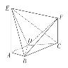

解析　(1)以*A*为坐标原点，*AB*所在的直线为*x*轴，*AD*所在的直线为*y*轴，*AE*所在的直线为*z*轴，建立如图所示的空间直角坐标系．则*A*(0，0，0)，*B*(1，0，0)，设*F*(1，2，*h*)．

依题意，＝(1，0，0)是平面*ADE*的一个法向量，又＝(0，2，*h*)，可得·＝0，

又因为直线*BF*⊄平面*ADE*，所以*BF*∥平面*ADE*．

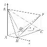

(2)依题意，*D*(0，1，0)，*E*(0，0，2)，*C*(1，2，0)，则＝(－1，1，0)，＝(－1，0，2)，＝(－1，－2，2)．

设<em><strong>n</strong></em>＝(<em>x</em>，<em>y</em>，<em>z</em>)为平面<em>BDE</em>的法向量，则即不妨令<em>z</em>＝1，可得<em><strong>n</strong></em>＝(2，2，1)．

因此有cos＜，<em><strong>n</strong></em>＞＝＝－．所以直线<em>CE</em>与平面<em>BDE</em>所成角的正弦值为．

(3)设<em><strong>m</strong></em>＝(<em>x</em>1，<em>y</em>1，<em>z</em>1)为平面<em>BDF</em>的法向量，则即

不妨令<em>y</em>1＝1，可得<em><strong>m</strong></em>＝．由题意，有|cos＜<em><strong>m</strong></em>，<em><strong>n</strong></em>＞|＝＝＝，

解得*h*＝．经检验，符合题意．所以线段*CF*的长为．

【**对点训练**】

1．如图，在长方体<em>AC</em>1中，<em>AB</em>＝<em>BC</em>＝2，<em>AA</em>1＝，点<em>E</em>，<em>F</em>分别是平面<em>A</em>1<em>B</em>1<em>C</em>1<em>D</em>1，平面<em>BCC</em>1<em>B</em>1的中心．以

<em>D</em>为坐标原点，<em>DA</em>，<em>DC</em>，<em>DD</em>1所在直线分别为<em>x</em>轴，<em>y</em>轴，<em>z</em>轴建立空间直角坐标系．试用向量方法解决下列问题：

(1)求异面直线*AF*和*BE*所成的角；

(2)求直线*AF*和平面*BEC*所成角的正弦值．

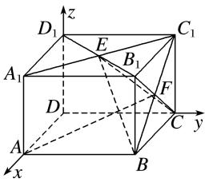

1．解析　(1)由题意得*A*(2，0，0)，*F*，*B*(2，2，0)，*E*(1，1，)，*C*(0，2，0)．

∴＝，＝(－1，－1，)，

∴·＝1－2＋1＝0．∴直线*AF*和*BE*所成的角为90°．

(2)设平面<em>BEC</em>的法向量为<em><strong>n</strong></em>＝(<em>x</em>，<em>y</em>，<em>z</em>)，又＝(－2，0，0)，＝(－1，－1，)，

则<em><strong>n</strong></em>·＝－2<em>x</em>＝0，<em><strong>n</strong></em>·＝－<em>x</em>－<em>y</em>＋<em>z</em>＝0，∴<em>x</em>＝0，取<em>z</em>＝1，则<em>y</em>＝，

∴平面<em>BEC</em>的一个法向量为<em><strong>n</strong></em>＝(0，，1)．∴cos＜，<em><strong>n</strong></em>＞＝＝＝．

设直线*AF*和平面*BEC*所成的角为*θ*，则sin *θ*＝，即直线*AF*和平面*BEC*所成角的正弦值为．

2．如图，平面*ABDE*⊥平面*ABC*，△*ABC*是等腰直角三角形，*AC*＝*BC*＝4，四边形*ABDE*是直角梯形，

*BD*∥*AE*，*BD*⊥*BA*，*BD*＝*AE*＝2，*O*，*M*分别为*CE*，*AB*的中点．

(1)求异面直线*AB*与*CE*所成角的大小；

(2)求直线*CD*与平面*ODM*所成角的正弦值．

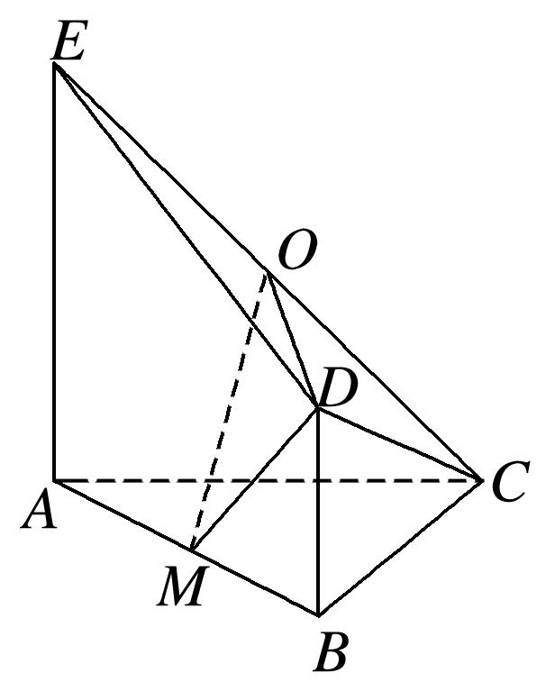

2．解析　(1)∵*DB*⊥*BA*，平面*ABDE*⊥平面*ABC*，平面*ABDE*∩平面*ABC*＝*AB*，*DB*⊂平面*ABDE*，

∴*DB*⊥平面*ABC*．∵*BD*∥*AE*，∴*EA*⊥平面*ABC*．

如图所示，以*C*为坐标原点，分别以*CA*，*CB*所在直线为*x*，*y*轴，以过点*C*且与*EA*平行的直线为*z*轴，建立空间直角坐标系．

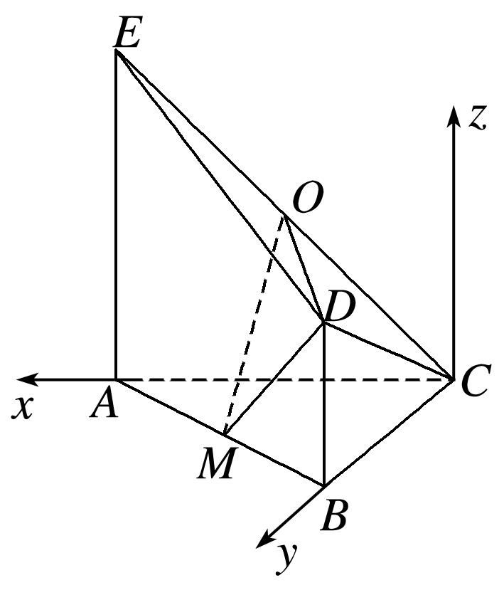

∵*AC*＝*BC*＝4，∴*C*(0，0，0)，*A*(4，0，0)，*B*(0，4，0)，*E*(4，0，4)，

∴＝(－4，4，0)，＝(4，0，4)．∴cos＜，＞＝＝－，

∴异面直线*AB*与*CE*所成角的大小为．

(2)由(1)知*O*(2，0，2)，*D*(0，4，2)，*M*(2，2，0)，

∴＝(0，4，2)，＝(－2，4，0)，＝(－2，2，2)．

设平面<em>ODM</em>的法向量为<em><strong>n</strong></em>＝(<em>x</em>，<em>y</em>，<em>z</em>)，

则由可得令<em>x</em>＝2，则<em>y</em>＝1，<em>z</em>＝1，∴<em><strong>n</strong></em>＝(2，1，1)．

设直线<em>CD</em>与平面<em>ODM</em>所成的角为<em>θ</em>，则sin <em>θ</em>＝|cos＜<em><strong>n</strong></em>，＞|＝＝，

∴直线*CD*与平面*ODM*所成角的正弦值为．

3．如图，在以*A*，*B*，*C*，*D*，*E*，*F*为顶点的五面体中，四边形*ABEF*为正方形，*AF*⊥*DF*，*AF*＝2*FD*，

∠*DFE*＝∠*CEF*＝45°．

(1)求异面直线*BC*，*DF*所成角的大小；

(2)求平面*BDE*与平面*BEC*所成角的余弦值．

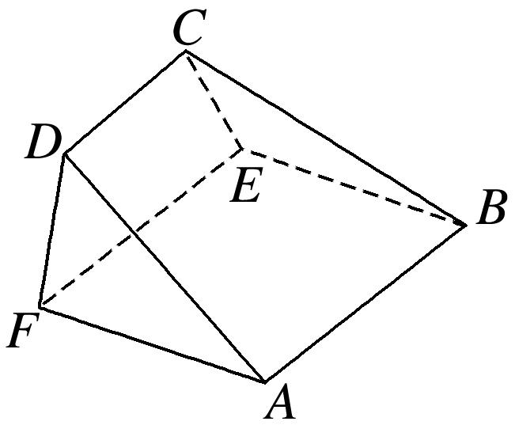

3．解析　因为四边形*ABEF*为正方形，*AF*⊥*DF*，所以*AF*⊥平面*DCEF*．

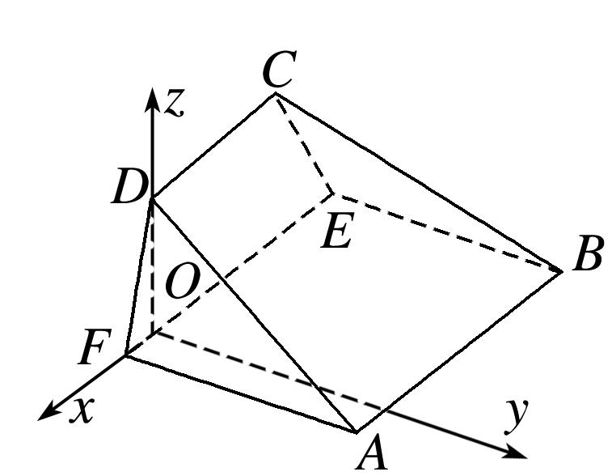

又∠*DFE*＝∠*CEF*＝45°，所以，在平面*DCEF*内作*DO*⊥*EF*，垂足为点*O*，

以*O*为坐标原点，*OF*所在的直线为*x*轴，*OD*所在的直线为*z*轴建立空间直角坐标系(如图所示)．

设*OF*＝*a*，因为*AF*＝2*FD*，所以*DF*＝*a*，*AF*＝4*a*，*CD*＝2*a*．

(1)∴*D*(0，0，*a*)，*F*(*a，* 0，0)，*B*(－3*a，* 4*a，* 0)，*C*(－2*a，* 0，*a*)．

则＝(*a*，－4*a*，*a*)，＝(*a，* 0，－*a*)，

设向量，的夹角为*θ*，则cos *θ*＝＝0，所以异面直线*BC*，*DF*所成角为．

(2)∵*E*(－3*a*，0，0)，＝(*a*，－4*a*，*a*)，＝(0，－4*a*，0)，＝(－3*a*，0，－*a*)，

设平面<em>DBE</em>的法向量为<em><strong>n</strong></em>1＝(<em>x</em>1，<em>y</em>1，<em>z</em>1)，

由得取<em>x</em>1＝1得平面<em>DBE</em>的一个法向量为<em><strong>n</strong></em>1＝(1，0，－3)，

设平面<em>CBE</em>的法向量为<em><strong>n</strong></em>2＝(<em>x</em>2，<em>y</em>2，<em>z</em>2)，

由得取<em>x</em>2＝1得平面<em>CBE</em>的一个法向量为<em><strong>n</strong></em>2＝(1，0，－1)，

设平面*BDE*与平面*BEC*的夹角为*θ*，则cos *θ*＝＝，

所以平面*BDE*与平面*BEC*所成角的余弦值为．

4．(2017·北京)如图，在四棱锥*P*－*ABCD*中，底面*ABCD*为正方形，平面*PAD*⊥平面*ABCD*，点*M*在线

段*PB*上，*PD*∥平面*MAC*，*PA*＝*PD*＝，*AB*＝4．

(1)求证：*M*为*PB*的中点；

(2)求平面*BPD*与平面*APD*的夹角；

(3)求直线*MC*与平面*BDP*所成角的正弦值．

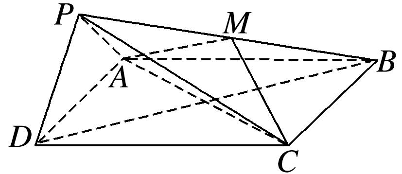

4．解析　(1)如图，设*AC*，*BD*的交点为*E*，连接*ME*．

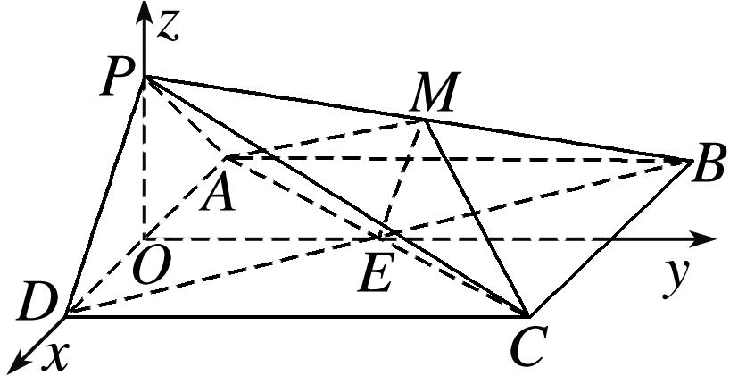

∵*PD*∥平面*MAC*，*PD*⊂平面*PDB*，平面*MAC*∩平面*PDB*＝*ME*，

∴*PD*∥*ME*．∵四边形*ABCD*是正方形，∴*E*为*BD*的中点．∴*M*为*PB*的中点．

(2)取*AD*的中点*O*，连接*OP*，*OE*．∵*PA*＝*PD*，∴*OP*⊥*AD*．

又∵平面*PAD*⊥平面*ABCD*，平面*PAD*∩平面*ABCD*＝*AD*，*OP*⊂平面*PAD*，∴*OP*⊥平面*ABCD*．

∵*OE*⊂平面*ABCD*，∴*OP*⊥*OE*．∵底面*ABCD*是正方形，∴*OE*⊥*AD*．

以*O*为原点，分别以，，为*x*轴，*y*轴，*z*轴的正方向建立如图所示的空间直角坐标系*Oxyz*，则*P*(0，0，)，*D*(2，0，0)，*B*(－2，4，0)，＝(4，－4，0)，＝(2，0，－)．

设平面<em>BDP</em>的一个法向量为<em><strong>n</strong></em>＝(<em>x</em>，<em>y</em>，<em>z</em>)，

则即令<em>x</em>＝1，得<em>y</em>＝1，<em>z</em>＝．于是<em><strong>n</strong></em>＝(1，1，)．

又平面<em>PAD</em>的一个法向量为<em><strong>p</strong></em>＝(0，1，0)，

∴cos＜<em><strong>n</strong></em>，<em><strong>p</strong></em>＞＝＝．∴平面<em>BPD</em>与平面<em>APD</em>的夹角为60°．

(3)由(1)(2)知*M*，*C*(2，4，0)，则＝．

设直线<em>MC</em>与平面<em>BDP</em>所成角为<em>α</em>，则sin <em>α</em>＝|cos＜<em><strong>n</strong></em>，＞|＝＝．

∴直线*MC*与平面*BDP*所成角的正弦值为．

5．(2021·天津)如图，在棱长为2的正方体<em>ABCD</em>－<em>A</em>1<em>B</em>1<em>C</em>1<em>D</em>1中，<em>E</em>为棱<em>BC</em>的中点，<em>F</em>为棱<em>CD</em>的中点．

(1)求证：<em>D</em>1<em>F</em>∥平面<em>A</em>1<em>EC</em>1；

(2)求直线<em>AC</em>1与平面<em>A</em>1<em>EC</em>1所成的角的正弦值；

(3)求二面角<em>A</em>－<em>A</em>1<em>C</em>1－<em>E</em>的正弦值．

5．解析　(1)如图所示，连接<em>A</em>1<em>C</em>1，<em>B</em>1<em>D</em>1相交于<em>O，</em>连接<em>OE，EF</em>，

因为<em>E</em>为棱<em>BC</em>的中点，<em>F</em>为棱<em>CD</em>的中点，所以<em>EF</em>∥<em>B</em>1<em>D</em>1且<em>EF</em>＝<em>B</em>1<em>D</em>1．

根据正方体有<em>OD</em>1＝<em>B</em>1<em>D</em>1，所以<em>EF</em>＝<em>OD</em>1．

所以四边形<em>OEFD</em>1为平行四边形，所以<em>OE</em>∥<em>D</em>1<em>F</em>，

又因为<em>OE</em>⊂平面<em>A</em>1<em>EC</em>1，<em>D</em>1<em>F</em>⊄平面<em>A</em>1<em>EC</em>1，所以<em>D</em>1<em>F</em>∥平面<em>A</em>1<em>EC</em>1．

(2) 以<em>A</em>为坐标原点，<em>AB</em>，<em>AD</em>，<em>AA</em>1为坐标轴建立空间直角坐标系，如图所示

则<em>A</em>(0，0，0)，<em>C</em>1(2，2，2)，<em>E</em>(2，1，0)，<em>A</em>1(0，0，2)，

则＝(2，1，－2)，＝(0，1，2)，＝(2，2，2)．

设平面<em>A</em>1<em>EC</em>1的法向量<em><strong>n</strong></em>1＝(<em>x</em>1，<em>y</em>1，<em>z</em>1)，则即

令<em>z</em>1＝1，可得<em><strong>n</strong></em>1＝(2，－2，1)．

设直线<em>AC</em>1与平面<em>A</em>1<em>EC</em>1所成的角为<em>θ</em>，则sin <em>θ</em>＝|cos&lt;<em><strong>n</strong></em>1，&gt;|＝＝．

(3)在(2)建立的空间直角坐标系中，设平面设平面<em>A</em>1<em>AC</em>1的法向量<em><strong>n</strong></em>2＝(<em>x</em>2，<em>y</em>2，<em>z</em>2)，

则即令<em>y</em>2＝1，可得<em><strong>n</strong></em>2＝(－1，1，0)．

设直线<em>AC</em>1与平面<em>A</em>1<em>EC</em>1所成的角为<em>θ</em>，则sin <em>θ</em>＝|cos&lt;<em><strong>n</strong></em>1，&gt;|＝＝．

设二面角<em>A</em>－<em>A</em>1<em>C</em>1－<em>E</em>为<em>α</em>，根据(2)有cos<em>α</em>＝＝－，所以sin<em>α</em>＝．

6．(2017·天津)如图，在三棱锥*P－ABC*中，*PA*⊥底面*ABC*，∠*BAC*＝90°．点*D*，*E*，*N*分别为棱*PA*，*PC*，

*BC*的中点，*M*是线段*AD*的中点，*PA*＝*AC*＝4，*AB*＝2．

(1)求证：*MN*∥平面*BDE*；

(2)求二面角*C－EM－N*的正弦值；

(3)已知点*H*在棱*PA*上，且直线*NH*与直线*BE*所成角的余弦值为，求线段*AH*的长．

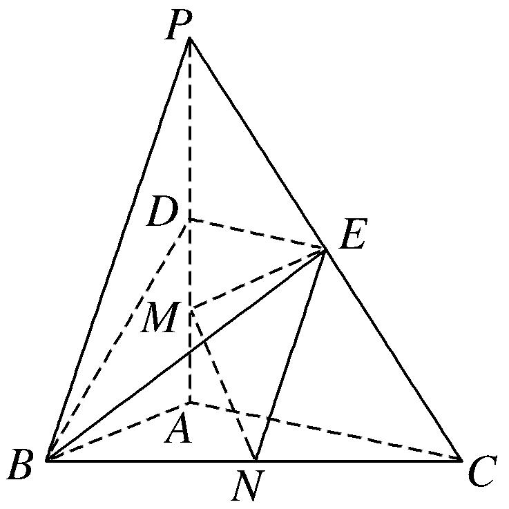

6．解析　(1)如图，以*A*为原点，分别以*AB*，*AC*，*AP*所在直线为*x*轴，*y*轴，*z*轴，建立空间直角坐标系．

由题意，可得*A*(0，0，0)，*B*(2，0，0)，*C*(0，4，0)，*P*(0，0，4)，*D*(0，0，2)，*E*(0，2，2)，*M*(0，0，1)，*N*(1，2，0)．＝(0，2，0)，＝(2，0，－2)．

设<em><strong>n</strong></em>＝(<em>x</em>，<em>y</em>，<em>z</em>)为平面<em>BDE</em>的一个法向量，则即不妨设<em>z</em>＝1，

可得***n***＝(1，0，1)．又＝(1，2，－1)，可得·***n***＝0．

因为*MN*⊄平面*BDE*，所以*MN*∥平面*BDE*．

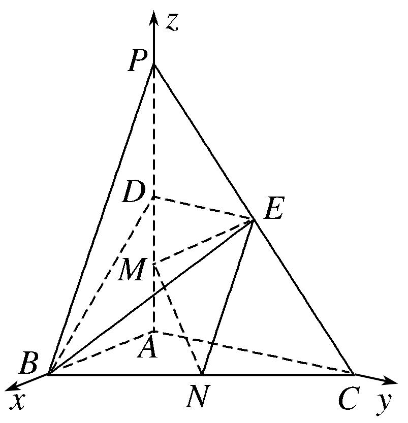

(2)易知<em><strong>n</strong></em>1＝(1，0，0)为平面<em>CEM</em>的一个法向量．

设<em><strong>n</strong></em>2＝(<em>x</em>1，<em>y</em>1，<em>z</em>1)为平面<em>EMN</em>的一个法向量，则

因为＝(0，－2，－1)，＝(1，2，－1)，所以

不妨设<em>y</em>1＝1，可得<em><strong>n</strong></em>2＝(－4，1，－2)．

因此cos&lt;<em><strong>n</strong></em>1，<em><strong>n</strong></em>2&gt;＝＝－，于是sin&lt;<em><strong>n</strong></em>1，<em><strong>n</strong></em>2&gt;＝．

所以二面角*C－EM－N*的正弦值为．

(3)由题意，设*AH*＝*h*(0≤*h*≤4)，则*H*(0，0，*h*)，进而可得＝(－1，－2，*h*)，＝(－2，2，2)．

由已知，得|cos<，>|＝＝＝，

整理得10<em>h</em>2－21<em>h</em>＋8＝0，解得<em>h</em>＝或<em>h</em>＝．所以线段<em>AH</em>的长为或．

7．(2018·天津)如图，*AD*∥*BC*且*AD*＝2*BC*，*AD*⊥*CD*，*EG*∥*AD*且*EG*＝*AD*，*CD*∥*FG*且*CD*＝2*FG*，*DG*⊥

平面*ABCD*，*DA*＝*DC*＝*DG*＝2.

(1)若*M*为*CF*的中点，*N*为*EG*的中点，求证：*MN*∥平面*CDE*；

(2)求二面角*E*－*BC*－*F*的正弦值；

(3)若点*P*在线段*DG*上，且直线*BP*与平面*ADGE*所成的角为60°，求线段*DP*的长．

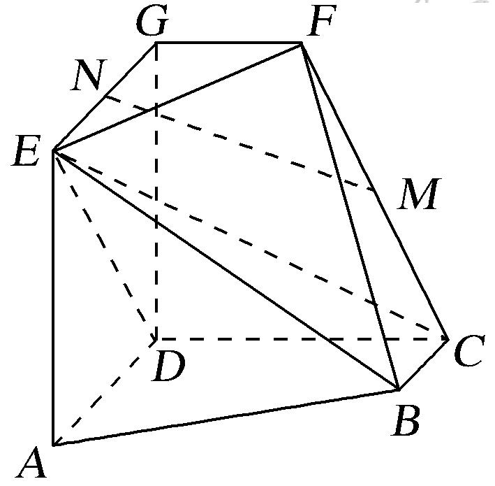

7．解析　依题意，可以建立以*D*为原点，分别以，，的方向为*x*轴，*y*轴，*z*轴的正方向的空间

直角坐标系(如图)，可得*D*(0，0，0)，*A*(2，0，0)，*B*(1，2，0)，*C*(0，2，0)，*E*(2，0，2)，*F*(0，1，2)，*G*(0，0，2)，*M*，*N*(1，0，2)．

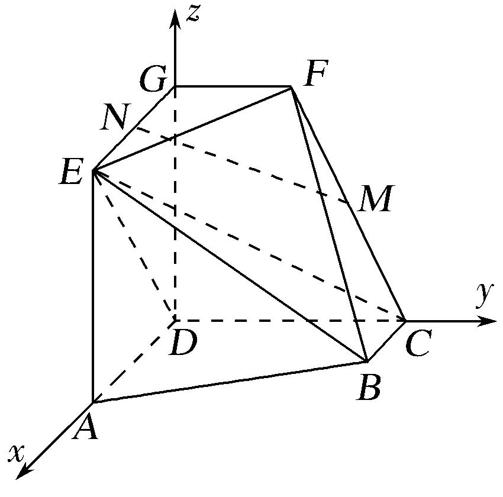

(1)依题意＝(0，2，0)，＝(2，0，2).设<em><strong>n</strong></em>0＝(<em>x</em>，<em>y</em>，<em>z</em>)为平面<em>CDE</em>的法向量，

则即不妨令<em>z</em>＝－1，可得<em><strong>n</strong></em>0＝(1，0，－1)．

又＝，可得·<em><strong>n</strong></em>0＝0，又因为直线<em>MN</em>⊄平面<em>CDE</em>，所以<em>MN</em>∥平面<em>CDE</em>．

(2)依题意，可得＝(－1，0，0)，＝(1，－2，2)，＝(0，－1，2).

设<em><strong>n</strong></em>＝(<em>x</em>，<em>y</em>，<em>z</em>)为平面<em>BCE</em>的法向量，则即

不妨令<em>z</em>＝1，可得<em><strong>n</strong></em>＝(0，1，1)．

设<em><strong>m</strong></em>＝(<em>x</em>，<em>y</em>，<em>z</em>)为平面<em>BCF</em>的法向量，则即

不妨令<em>z</em>＝1，可得<em><strong>m</strong></em>＝(0，2，1)．

因此有cos＜***m***，***n＞***＝＝，于是sin＜***m***，***n＞***＝．

所以，二面角*E*－*BC*－*F*的正弦值为．

(3)设线段*DP*的长为*h*(*h*∈[0，2])，则点*P*的坐标为(0，0，*h*)，可得＝(－1，－2，*h*)．

易知，＝(0，2，0)为平面*ADGE*的一个法向量，故|cos＜，*＞*|＝＝，

由题意，可得＝sin 60°＝，解得*h*＝∈[0，2]．所以，线段*DP*的长为．

**考点二　已知某一空间角求另一空间角**

<strong>[例1]</strong>　(2017·全国Ⅱ)如图，四棱锥<em>P－ABCD</em>中，侧面<em>PAD</em>为等边三角形且垂直于底面<em>ABCD</em>，<em>AB</em>＝<em>BC</em>＝<em>AD</em>，∠<em>BAD</em>＝∠<em>ABC</em>＝90°，<em>E</em>是<em>PD</em>的中点．

(1)证明：直线*CE*∥平面*PAB*；

(2)点*M*在棱*PC*上，且直线*BM*与底面*ABCD*所成角为45°，求二面角*M－AB－D*的余弦值．

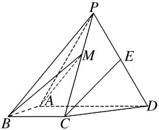

解析　(1)取*PA*的中点*F*，连接*EF*，*BF*．因为*E*是*PD*的中点，所以*EF*∥*AD*，*EF*＝*AD*．

由∠*BAD*＝∠*ABC*＝90°，得*BC*∥*AD*，又*BC*＝*AD*，

所以*EFBC*，四边形*BCEF*是平行四边形，*CE*∥*BF*，

又*BF*⊂平面*PAB*，*CE*⊄平面*PAB*，故*CE*∥平面*PAB*．

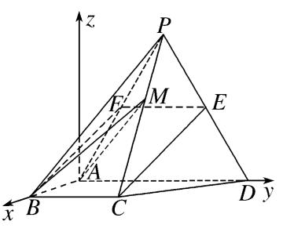

(2)由已知得*BA*⊥*AD*，以*A*为坐标原点，*AB*，*AD*所在直线分别为*x*轴，*y*轴，||为单位长度，

建立如图所示的空间直角坐标系*Axyz*，则*A*(0，0，0)，*B*(1，0，0)，*C*(1，1，0)，*P*(0，1，)，

＝(1，0，－)，＝(1，0，0)．

设*M*(*x*，*y*，*z*)(0<*x*<1)，则＝(*x*－1，*y*，*z*)，＝(*x*，*y*－1，*z*－)．

因为<em>BM</em>与底面<em>ABCD</em>所成的角为45°，而<em><strong>n</strong></em>＝(0，0，1)是底面<em>ABCD</em>的法向量，

所以|cos＜，<em><strong>n＞</strong></em>|＝sin 45°＝，即(<em>x</em>－1)2＋<em>y</em>2－<em>z</em>2＝0．①

又*M*在棱*PC*上，设＝*λ*，则*x*＝*λ*，*y*＝1，*z*＝－*λ*．②

由①②解得(舍去)或

所以*M*，从而＝．

设<em><strong>m</strong></em>＝(<em>x</em>0，<em>y</em>0，<em>z</em>0)是平面<em>ABM</em>的法向量，则即

所以可取***m***＝(0，－，2)．于是cos<***m***，***n***>＝＝．

由图可知二面角*M*—*AB*—*D*是锐角，所以二面角*M－AB－D*的余弦值为．

<strong>[例2]</strong>　已知三棱锥<em>P</em>－<em>ABC</em>(如图1)的平面展开图(如图2)中，四边形<em>ABCD</em>为边长等于的正方形，△<em>ABE</em>和△<em>BCF</em>均为正三角形．在三棱锥<em>P</em>－<em>ABC</em>中：

(1)证明：平面*PAC*⊥平面*ABC*；

(2)若点*M*在棱*PA*上运动，当直线*BM*与平面*PAC*所成的角最大时，求二面角*P*－*BC*－*M*的余弦值．

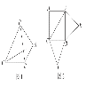

解析　(1)如图，设*AC*的中点为*O*，连接*OB*，*OP*．

由题意，得*PA*＝*PB*＝*PC*＝，*OP*＝*OB*＝1．

因为在△<em>POB</em>中，<em>OP</em>2＋<em>OB</em>2＝<em>PB</em>2，所以<em>OP</em>⊥<em>OB．</em>

因为在△*PAC*中，*PA*＝*PC*，*O*为*AC*的中点，所以*OP*⊥*AC．*

因为*AC*∩*OB*＝*O*，*AC*⊂平面*ABC*，*OB*⊂平面*ABC*，所以*OP*⊥平面*ABC．*

因为*OP*⊂平面*PAC*，所以平面*PAC*⊥平面*ABC．*

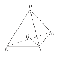

(2)由(1)知，*OB*⊥*OP*，由题意可得*OB*⊥*AC*，所以*OB*⊥平面*PAC*，

所以∠*BMO*是直线*BM*与平面*PAC*所成的角，且tan∠*BMO*＝＝，

所以当线段*OM*最短，即*M*是*PA*的中点时，∠*BMO*最大．

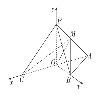

由*OP*⊥平面*ABC*，*OB*⊥*AC*，得*OP*⊥*OB*，*OP*⊥*OC*，*OB*⊥*OC*，以*O*为坐标原点，*OC*，*OB*，*OP*所在的直线分别为*x*轴、*y*轴、*z*轴，建立如图所示的空间直角坐标系，

则*O*(0，0，0)，*C*(1，0，0)，*B*(0，1，0)，*A*(－1，0，0)，*P*(0，0，1)，*M*，

＝(1，－1，0)，＝(1，0，－1)，＝．

设平面<em>MBC</em>的法向量为<em><strong>m</strong></em>＝(<em>x</em>1，<em>y</em>1，<em>z</em>1)，由得

令<em>x</em>1＝1，得<em>y</em>1＝1，<em>z</em>1＝3，即<em><strong>m</strong></em>＝(1，1，3)是平面<em>MBC</em>的一个法向量．

设平面<em>PBC</em>的法向量为<em><strong>n</strong></em>＝(<em>x</em>2，<em>y</em>2，<em>z</em>2)，由得

令<em>x</em>2＝1，得<em>y</em>2＝1，<em>z</em>2＝1，即<em><strong>n</strong></em>＝(1，1，1)是平面<em>PBC</em>的一个法向量．

所以cos＜***m***，***n***＞＝＝＝．

结合图可知，二面角*P*－*BC*－*M*的余弦值为．

<strong>[例3]</strong>　(2018·全国Ⅱ)如图，在三棱锥<em>P</em>－<em>ABC</em>中，<em>AB</em>＝<em>BC</em>＝2，<em>PA</em>＝<em>PB</em>＝<em>PC</em>＝<em>AC</em>＝4，<em>O</em>为<em>AC</em>的中点．

(1)证明：*PO*⊥平面*ABC*；

(2)若点*M*在棱*BC*上，且二面角*M*－*PA*－*C*为30°，求*PC*与平面*PAM*所成角的正弦值．

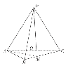

解析　(1)因为*PA*＝*PC*＝*AC*＝4，*O*为*AC*的中点，所以*PO*⊥*AC*，且*PO*＝2．

连接*OB．* 因为*AB*＝*BC*＝*AC*，所以△*ABC*为等腰直角三角形，且*OB*⊥*AC*，*OB*＝*AC*＝2．

由<em>PO</em>2＋<em>OB</em>2＝<em>PB</em>2，知<em>PO</em>⊥<em>OB．</em>

由*PO*⊥*OB*，*PO*⊥*AC*，*AC*∩*OB*＝*O*，知*PO*⊥平面*ABC*．

(2)如图，以*O*为坐标原点，，，的方向分别为*x*轴、*y*轴、*z*轴正方向，

建立如图所示的空间直角坐标系*Oxyz*．

由已知得*O*(0，0，0)，*B*(2，0，0)，*A*(0，－2，0)，*C*(0，2，0)，*P*(0，0，2)，

则＝(0，2，2)，取平面*PAC*的一个法向量＝(2，0，0)．

设*M*(*a，* 2－*a，* 0)(0＜*a*≤2)，则＝(*a，* 4－*a，* 0)．

设平面<em>PAM</em>的法向量为<em><strong>n</strong></em>＝(<em>x</em>，<em>y</em>，<em>z</em>)．

由得可取<em><strong>n</strong></em>＝((<em>a</em>－4)，<em>a</em>，－<em>a</em>)，

所以cos＜，***n***＞＝．

由已知得|cos＜，***n***＞|＝．所以＝．

解得<em>a</em>＝－4(舍去)或<em>a</em>＝．所以<em><strong>n</strong></em>＝．

又＝(0，2，－2)，所以cos＜，***n***＞＝．

所以*PC*与平面*PAM*所成角的正弦值为．

<strong>[例4]</strong>　如图所示的几何体中，四边形<em>ABCD</em>是等腰梯形，<em>AB</em>∥<em>CD</em>，∠<em>ABC</em>＝60°，<em>AB</em>＝2<em>BC</em>＝2<em>CD</em>，四边形<em>DCEF</em>是正方形，<em>N</em>，<em>G</em>分别是线段<em>AB</em>，<em>CE</em>的中点．

(1)求证：*NG*∥平面*ADF*；

(2)设二面角*A*－*CD*－*F*的大小为*θ*，当*θ*为何值时，二面角*A*－*BC*－*E*的余弦值为？

解析　(1)法一　如图，设*DF*的中点为*M*，连接*AM*，*GM*，

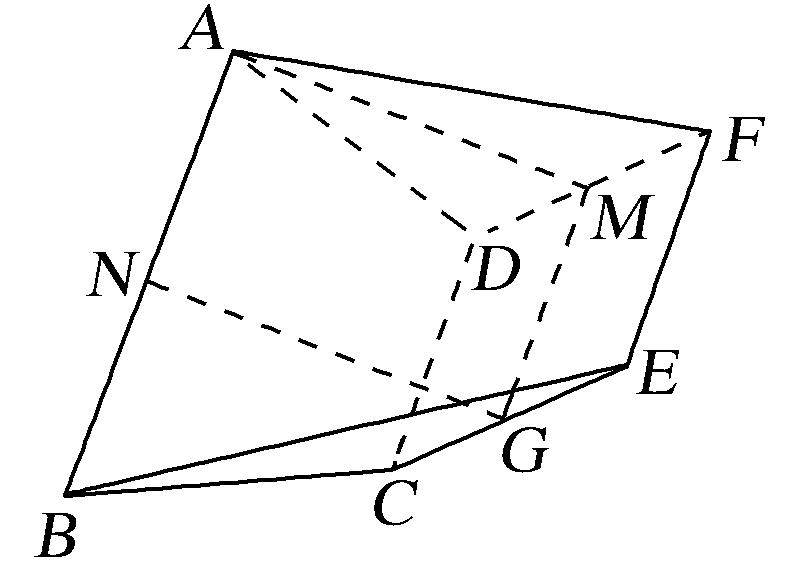

因为四边形*DCEF*是正方形，所以*MGCD*，

又四边形*ABCD*是梯形，且*AB*＝2*CD*，*AB*∥*CD*，点*N*是*AB*的中点，

所以*ANDC*，所以*MGAN*，所以四边形*ANGM*是平行四边形，所以*NG*∥*AM*.

又*AM*⊂平面*ADF*，*NG*⊄平面*ADF*，所以*NG*∥平面*ADF*.

法二　如图，连接*NC*，*NE*，

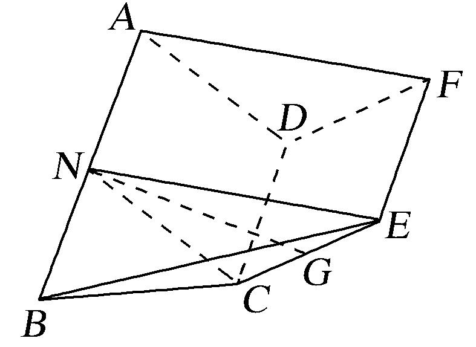

因为*N*是*AB*的中点，四边形*ABCD*是梯形，*AB*＝2*CD*，*AB*∥*CD*，

所以*AN*綉*CD*，所以四边形*ANCD*是平行四边形，所以*NC*∥*AD*，

因为*AD*⊂平面*ADF*，*NC*⊄平面*ADF*，所以*NC*∥平面*ADF*，

同理可得*NE*∥平面*ADF*，又*NC*∩*NE*＝*N*，所以平面*NCE*∥平面*ADF*，

因为*NG*⊂平面*NCE*，所以*NG*∥平面*ADF*.

(2)设*CD*的中点为*O*，*EF*的中点为*P*，连接*NO*，*OP*，易得*NO*⊥*CD*，以点*O*为原点，以*OC*所在直线为*x*轴，以*NO*所在直线为*y*轴，以过点*O*且与平面*ABCD*垂直的直线为*z*轴建立如图所示的空间直角坐标系.

因为*NO*⊥*CD*，*OP*⊥*CD*，所以∠*NOP*是二面角*A*－*CD*－*F*的平面角，

则∠*NOP*＝*θ*，所以∠*POy*＝π－*θ*，设*AB*＝4，则*BC*＝*CD*＝2，

则*P*(0，2cos(π－*θ*)，2sin(π－*θ*))，*E*(1，2cos(π－*θ*)，2sin(π－*θ*))，*C*(1，0，0)，*B*(2，－，0)，

＝(0，2cos(π－*θ*)，2sin(π－*θ*))，＝(1，－，0)，

设平面<em>BCE</em>的法向量为<em><strong>n</strong></em>＝(<em>x</em>，<em>y</em>，<em>z</em>)，则即

因为*θ*∈，所以cos(π－*θ*)≠0，令*z*＝1，则*y*＝－tan(π－*θ*)，*x*＝－tan(π－*θ*)，

所以<em><strong>n</strong></em>＝(－tan(π－<em>θ</em>)，－tan(π－<em>θ</em>)，1)为平面<em>BCE</em>的一个法向量，

又易知平面<em>ACD</em>的一个法向量为<em><strong>m</strong></em>＝(0，0，1)，

所以cos<***m***，***n***>＝＝，

由图可知二面角*A*－*BC*－*E*为锐角，所以＝，

解得tan2(π－<em>θ</em>)＝3，又&lt;<em>θ</em>&lt;π，所以tan(π－<em>θ</em>)＝，即π－<em>θ</em>＝，得<em>θ</em>＝，

所以当二面角*A*－*CD*－*F*的大小为时，二面角*A*－*BC*－*E*的余弦值为．

【**对点训练**】

1．已知四棱锥*P*-*ABCD*，底面*ABCD*为菱形，*PD*＝*PB*，*H*为*PC*上的点，过*AH*的平面分别交*PB*，*PD*

于点*M*，*N*，且*BD*∥平面*AMHN*．

(1)证明：*MN*⊥*PC*；

(2)当*H*为*PC*的中点，*PA*＝*PC*＝*AB*，*PA*与平面*ABCD*所成的角为60°，求*AD*与平面*AMHN*所成角的正弦值．

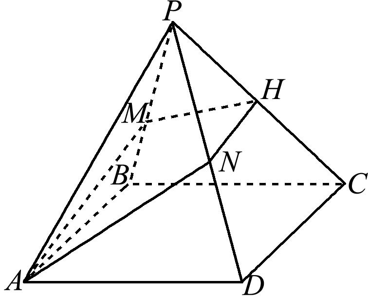

1．解析　(1)连接*AC*，*BD*且*AC*∩*BD*＝*O*，连接*PO*．

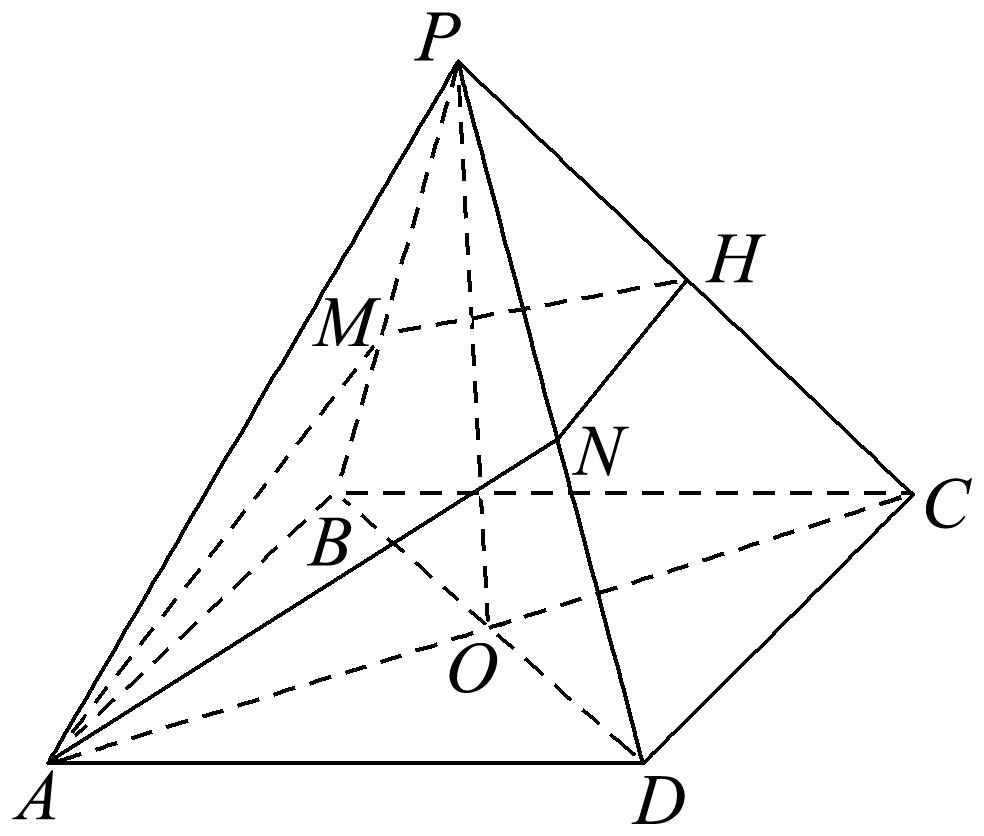

因为*ABCD*为菱形，所以*BD*⊥*AC．* 因为*PD*＝*PB*，所以*PO*⊥*BD．*

因为*AC*∩*PO*＝*O*，且*AC*，*PO*⊂平面*PAC*，所以*BD*⊥平面*PAC．*

因为*PC*⊂平面*PAC*，所以*BD*⊥*PC．* 因为*BD*∥平面*AMHN*，

且平面*AMHN*∩平面*PBD*＝*MN*，所以*BD*∥*MN*，*MN*⊥平面*PAC*，所以*MN*⊥*PC．*

(2)由(1)知*BD*⊥*AC*且*PO*⊥*BD．* 因为*PA*＝*PC*，且*O*为*AC*的中点，

所以*PO*⊥*AC*，所以*PO*⊥平面*ABCD*，所以*PA*与平面*ABCD*所成的角为∠*PAO*，

所以∠*PAO*＝60°，所以*AO*＝*PA*，*PO*＝*PA．* 因为*PA*＝*AB*，所以*BO*＝*PA．*

以*O*为原点，*OA*，*OD*，*OP*分别为*x*轴、*y*轴、*z*轴建立如图所示空间直角坐标系．

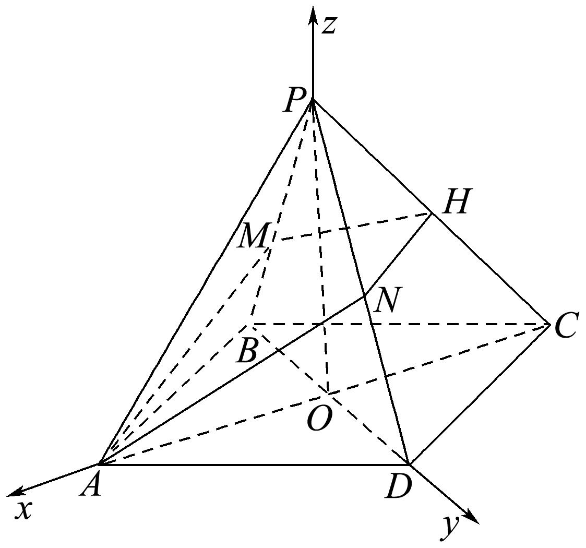

设*PA*＝2，所以*O*(0，0，0)，*A*(1，0，0)，*B*，*C*(－1，0，0)，*D*，*P*(0，0，)，*H*，

所以＝，＝，＝．

设平面<em>AMHN</em>的法向量为<em><strong>n</strong></em>＝(<em>x</em>，<em>y</em>，<em>z</em>)，所以即

令<em>x</em>＝2，则<em>y</em>＝0，<em>z</em>＝2，所以<em><strong>n</strong></em>＝(2，0，2)为平面<em>AMHN</em>的一个法向量．

设<em>AD</em>与平面<em>AMHN</em>所成角为<em>θ</em>，所以sin <em>θ</em>＝|cos&lt;<em><strong>n</strong></em>，&gt;|＝＝．

所以*AD*与平面*AMHN*所成角的正弦值为．

2．如图，在三棱柱<em>ABC－A</em>1<em>B</em>1<em>C</em>1中，<em>BB</em>1⊥平面<em>ABC</em>，<em>AB</em>⊥<em>BC</em>，<em>AB</em>＝2，<em>BC</em>＝1，<em>BB</em>1＝3，<em>D</em>是<em>CC</em>1的

中点，*E*是*AB*的中点．

(1)证明：<em>DE</em>∥平面<em>C</em>1<em>BA</em>1；

(2)<em>F</em>是线段<em>CC</em>1上一点，且直线<em>AF</em>与平面<em>ABB</em>1<em>A</em>1所成角的正弦值为，求二面角<em>F－BA</em>1－<em>A</em>的余弦值．

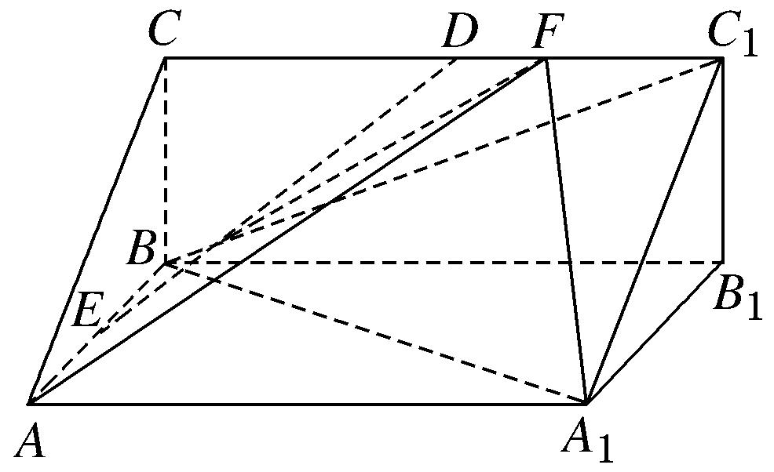

2．解析　(1)如图，连接<em>AB</em>1交<em>A</em>1<em>B</em>于点<em>O</em>，连接<em>EO</em>，<em>OC</em>1．

∵<em>OA</em>＝<em>OB</em>1，<em>AE</em>＝<em>EB</em>，∴<em>OE</em>＝<em>BB</em>1，<em>OE</em>∥<em>BB</em>1，又<em>DC</em>1＝<em>BB</em>1，<em>DC</em>1∥<em>BB</em>1，

∴<em>OE</em>綊<em>DC</em>1，因此，四边形<em>DEOC</em>1为平行四边形，∴<em>ED</em>∥<em>OC</em>1．

∵<em>OC</em>1⊂平面<em>C</em>1<em>BA</em>1，<em>ED</em>⊄平面<em>C</em>1<em>BA</em>1，∴<em>DE</em>∥平面<em>C</em>1<em>BA</em>1．

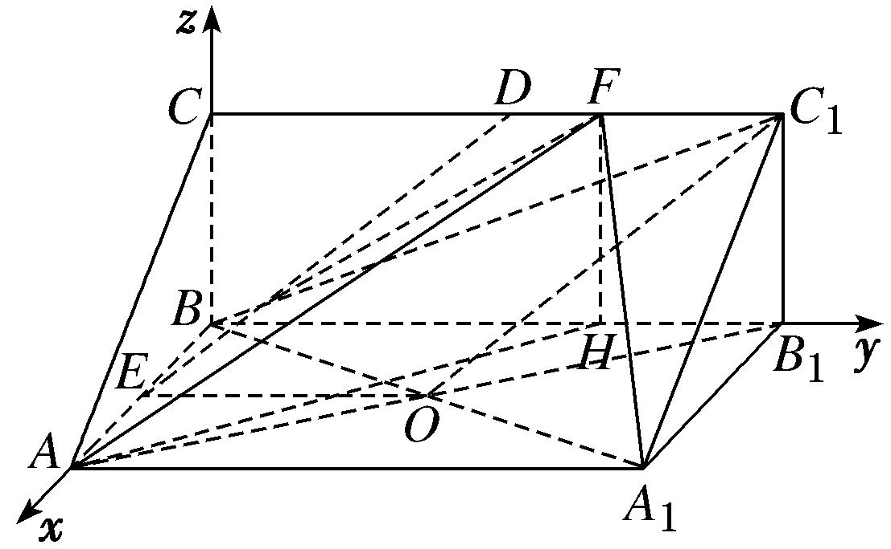

(2)易知<em>AB</em>，<em>BB</em>1，<em>BC</em>两两垂直，

所以以<em>BA</em>，<em>BB</em>1，<em>BC</em>所在直线分别为<em>x</em>轴，<em>y</em>轴，<em>z</em>轴建立如图所示的空间直角坐标系<em>B－xyz</em>，

过点<em>F</em>作<em>FH</em>⊥<em>BB</em>1，交<em>BB</em>1于点<em>H</em>，连接<em>AH</em>．

∵<em>BB</em>1⊥平面<em>ABC</em>，<em>AB</em>⊂平面<em>ABC</em>，∴<em>AB</em>⊥<em>BB</em>1．

∵<em>AB</em>⊥<em>BC</em>，<em>BC</em>∩<em>BB</em>1＝<em>B</em>，∴<em>AB</em>⊥平面<em>CBB</em>1<em>C</em>1．

∵<em>AB</em>⊂平面<em>BAA</em>1<em>B</em>1，∴平面<em>BAA</em>1<em>B</em>1⊥平面<em>CBB</em>1<em>C</em>1．

∵<em>FH</em>⊂平面<em>CBB</em>1<em>C</em>1，<em>FH</em>⊥<em>BB</em>1，平面<em>BAA</em>1<em>B</em>1∩平面<em>CBB</em>1<em>C</em>1＝<em>BB</em>1，∴<em>FH</em>⊥平面<em>BAA</em>1<em>B</em>1，

∴∠<em>FAH</em>为直线<em>AF</em>与平面<em>ABB</em>1<em>A</em>1所成的角，记为<em>θ</em>，则sin <em>θ</em>＝＝，∴<em>AF</em>＝3，

在Rt△<em>ACF</em>中，5＝<em>AC</em>2＝<em>AF</em>2－<em>CF</em>2＝9－<em>CF</em>2，∴<em>CF</em>＝2，∴<em>F</em>(0，2，1)，<em>A</em>1(2，3，0)，

∴＝(0，2，1)，＝(2，3，0)，

设平面<em>BFA</em>1的法向量为<em>m</em>＝(<em>x</em>，<em>y</em>，<em>z</em>)，则取<em>y</em>＝2，得<em>x</em>＝－3，<em>z</em>＝－4，

∴<em>m</em>＝(－3，2，－4)为平面<em>BFA</em>1的一个法向量．易知平面<em>BAA</em>1的一个法向量为<em>n</em>＝(0，0，1)，

则|cos＜<em>m</em>，<em>n</em>＞|＝＝．又二面角<em>F－BA</em>1－<em>A</em>为钝二面角，

因此，二面角<em>F－BA</em>1－<em>A</em>的余弦值为－．

3．已知在四棱锥*P*－*ABCD*中，底面*ABCD*为菱形， *PD*＝*PB*，*H*为*PC*上的点，过直线*AH*的平面分别

交*PB*，*PD*于点*M*，*N*，且*BD*∥平面*AMHN*．

(1)证明：*MN*⊥*PC*；

(2)当*H*为*PC*的中点时， *PA*＝*PC*＝*AB*，*PA*与平面*ABCD*所成的角为60°，求平面*PAB*与平面*AMHN*夹角的余弦值．

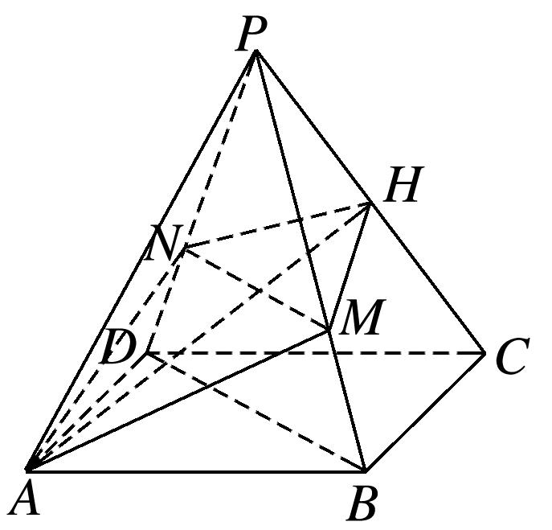

3．解析　(1)如图，连接*AC*交*BD*于点*O*，连接*PO*．因为四边形*ABCD*为菱形，

所以*BD*⊥*AC*，且*O*为*AC*，*BD*的中点，因为*PD*＝*PB*，所以*PO*⊥*BD*，

因为*AC*∩*PO*＝*O*且*AC*，*PO*⊂平面*PAC*，所以*BD*⊥平面*PAC*，

因为*PC*⊂平面*PAC*，所以*BD*⊥*PC*．因为*BD*∥平面*AMHN*，*BD*⊂平面*PBD*，

且平面*AMHN*∩平面*PBD*＝*MN*，所以*BD*∥*MN*，所以*MN*⊥*PC*．

(2)由(1)知*BD*⊥*AC*且*PO*⊥*BD*，因为*PA*＝*PC*，且*O*为*AC*的中点，

所以*PO*⊥*AC*，所以*PO*⊥平面*ABCD*，所以*PA*与平面*ABCD*所成的角为∠*PAO*，

所以*AO*＝*PA*，*PO*＝*PA*，因为*PA*＝*AB*，所以*BO*＝*PA*．

分别以，，为*x*轴，*y*轴，*z*轴的正方向，

建立如图所示的空间直角坐标系，设*PA*＝2，则

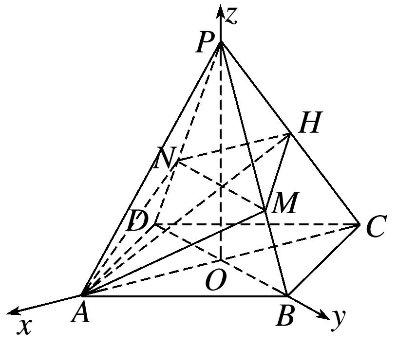

*O*(0，0，0)，*A*(1，0，0)，*B*，*C*(－1，0，0)，*D*，*P*(0，0，)，*H*，

所以＝，＝，＝，＝(－1，0，)．

记平面<em>AMHN</em>的一个法向量为<em><strong>n</strong></em>1＝(<em>x</em>1，<em>y</em>1，<em>z</em>1)，

则令<em>x</em>1＝1，则<em>y</em>1＝0，<em>z</em>1＝，所以<em><strong>n</strong></em>1＝(1，0，)，

记平面<em>PAB</em>的一个法向量为<em><strong>n</strong></em>2＝(<em>x</em>2，<em>y</em>2，<em>z</em>2)，

则令<em>x</em>2＝1，则<em>y</em>2＝，<em>z</em>2＝，所以<em><strong>n</strong></em>2＝，

记平面<em>PAB</em>与平面<em>AMHN</em>的夹角为<em>θ</em>，则cos <em>θ</em>＝|cos＜<em><strong>n</strong></em>1，<em><strong>n</strong></em>2＞|＝＝．

所以平面*PAB*与平面*AMHN*的夹角的余弦值为．

4．如图，等腰梯形*ABCD*中，*AB*∥*CD*，*AD*＝*AB*＝*BC*＝1，*CD*＝2，*E*为*CD*的中点，以*AE*为折痕把△

*ADE*折起，使点*D*到达点*P*的位置(*P*∉平面*ABCE*)．

(1)证明：*AE*⊥*PB*；

(2)若直线*PB*与平面*ABCE*所成的角为，求二面角*A*－*PE*－*C*的余弦值．

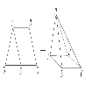

4．解析　(1)如图，连接*BD*，*BE*，设*AE*的中点为*O*，

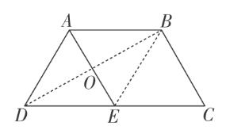

∵*AB*∥*CE*，*AB*＝*CE*＝*CD*，∴四边形*ABCE*为平行四边形，

∴*AE*＝*BC*＝*AD*＝*DE*，∴△*ADE*，△*ABE*为等边三角形，

∴*OD*⊥*AE*，*OB*⊥*AE*，折叠后*OP*⊥*AE*，*OB*⊥*AE*，

又*OP*∩*OB*＝*O*，∴*AE*⊥平面*POB*，又*PB*⊂平面*POB*，∴*AE*⊥*PB．*

(2)在平面*POB*内作*PQ*⊥平面*ABCE*，垂足为*Q*，则*Q*在直线*OB*上，

∴直线*PB*与平面*ABCE*所成的角为∠*PBO*＝，又*OP*＝*OB*，∴*OP*⊥*OB*，

∴*O*，*Q*两点重合，即*PO*⊥平面*ABCE*．

以*O*为坐标原点，*OE*，*OB*，*OP*所在直线分别为*x*轴、*y*轴、*z*轴，建立如图所示的空间直角坐标系，

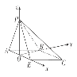

则*P*，*E*，*C*，∴＝，＝，

设平面<em>PCE</em>的法向量为<em><strong>n</strong></em>1＝(<em>x</em>，<em>y</em>，<em>z</em>)，则即

令<em>x</em>＝得<em><strong>n</strong></em>1＝(，－1，1)，

又<em>OB</em>⊥平面<em>PAE</em>，∴<em><strong>n</strong></em>2＝(0，1，0)为平面<em>PAE</em>的一个法向量，

设二面角<em>A</em>－<em>PE</em>－<em>C</em>的大小为<em>α</em>，则|cos<em>α</em>|＝|cos＜<em><strong>n</strong></em>1，<em><strong>n</strong></em>2＞|＝＝＝，

由图可知二面角*A*－*PE*－*C*为钝角，∴cos*α*＝－．

5．如图，在四棱锥*P*—*ABCD*中，*PA*⊥底面*ABCD*，底面*ABCD*是直角梯形，∠*ADC*＝90°，*AD*∥*BC*，

*AB*⊥*AC*，*AB*＝*AC*＝，点*E*在*AD*上，且*AE*＝2*ED*．

(1)已知点*F*在*BC*上，且*CF*＝2*FB*，求证：平面*PEF*⊥平面*PAC*；

(2)当二面角*A*—*PB*—*E*的余弦值为多少时，直线*PC*与平面*PAB*所成的角为45°？

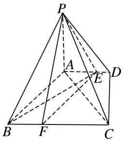

5．解析　(1)∵*AB*⊥*AC*，*AB*＝*AC*，∴∠*ACB*＝45°，∵底面*ABCD*是直角梯形，∠*ADC*＝90°，*AD*∥*BC*，

∴∠*ACD*＝45°，即*AD*＝*CD*，*AC*＝*AD*，又*AB*⊥*AC*，∴*BC*＝*AC*＝2*AD*，

∵*AE*＝2*ED*，*CF*＝2*FB*，∴*AE*＝*BF*＝*AD*，又∵*AE*∥*BF*，

∴四边形*ABFE*是平行四边形，∴*AB*∥*EF*，∴*AC*⊥*EF*，

∵*PA*⊥底面*ABCD*，∴*PA*⊥*EF*，∵*PA*∩*AC*＝*A*，*PA*，*AC*⊂平面*PAC*，∴*EF*⊥平面*PAC*，

又*EF*⊂平面*PEF*，∴平面*PEF*⊥平面*PAC*．

(2)∵*PA*⊥*AC*，*AC*⊥*AB*，*PA*∩*AB*＝*A*，*PA*，*AB*⊂平面*PAB*，

∴*AC*⊥平面*PAB*，则∠*APC*为*PC*与平面*PAB*所成的角，若*PC*与平面*PAB*所成的角为45°，

则tan∠*APC*＝＝1，即*PA*＝*AC*＝，

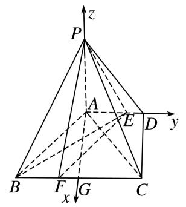

取*BC*的中点*G*，连接*AG*，则*AG*⊥*BC*，以*A*为坐标原点，

*AG*，*AD*，*AP*所在直线分别为*x*轴，*y*轴，*z*轴，建立如图所示的空间直角坐标系*Axyz*，

则*A*(0，0，0)，*B*(1，－1，0)，*C*(1，1，0)，*E*，*P*(0，0，)，

∴＝，＝，

设平面<em>PBE</em>的法向量为<em><strong>n</strong></em>＝(<em>x</em>，<em>y</em>，<em>z</em>)，则即

令<em>y</em>＝3，则<em>x</em>＝5，<em>z</em>＝，∴<em><strong>n</strong></em>＝(5，3，)．∵＝(1，1，0)是平面<em>PAB</em>的一个法向量，

cos<***n***，>＝＝，

即当二面角*A*—*PB*—*E*的余弦值为时，直线*PC*与平面*PAB*所成的角为45°．

6．如图，在四棱锥*P*－*ABCD*中，底面*ABCD*为边长为2的菱形，∠*DAB*＝60°，∠*ADP*＝90°，平面*ADP*

⊥平面*ABCD*，点*F*为棱*PD*的中点．

(1)在棱*AB*上是否存在一点*E*，使得*AF*∥平面*PCE*？并说明理由；

(2)当二面角*D*－*FC*－*B*的余弦值为时，求直线*PB*与平面*ABCD*所成的角．

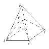

6．解析　(1)在棱*AB*上存在点*E*，使得*AF*∥平面*PCE*，点*E*为棱*AB*的中点．理由如下：

取*PC*的中点*Q*，连接*EQ*，*FQ*，

由题意，*FQ*∥*DC*且*FQ*＝*CD*，*AE*∥*CD*且*AE*＝*CD*，则*AE*∥*FQ*且*AE*＝*FQ*．

所以四边形*AEQF*为平行四边形．所以*AF*∥*EQ*，又*EQ*⊂平面*PCE*，*AF*⊄平面*PCE*，

所以*AF*∥平面*PCE*．

(2)由题意，知△*ABD*为正三角形，所以*ED*⊥*AB*，亦即*ED*⊥*CD*，

又∠*ADP*＝90°，所以*PD*⊥*AD*，且平面*ADP*⊥平面*ABCD*，平面*ADP*∩平面*ABCD*＝*AD*，

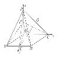

所以*PD*⊥平面*ABCD*，故以*D*为坐标原点建立如图所示的空间直角坐标系，

设*FD*＝*a*(*a*＞0)，则由题意知*D*(0，0，0)，*F*(0，0，*a*)，*C*(0，2，0)，*B*(，1，0)，

＝(0，2，－*a*)，＝(，－1，0)，

设平面<em>FBC</em>的法向量为<em><strong>m</strong></em>＝(<em>x</em>，<em>y</em>，<em>z</em>)，则由得

令<em>x</em>＝1，则<em>y</em>＝，<em>z</em>＝，所以取<em><strong>m</strong></em>＝，

显然可取平面<em>DFC</em>的法向量<em><strong>n</strong></em>＝(1，0，0)，

由题意知＝|cos＜<em><strong>m</strong></em>，<em><strong>n</strong></em>＞|＝，所以<em>a</em>＝．

由于*PD*⊥平面*ABCD*，所以*PB*在平面*ABCD*内的射影为*BD*，

所以∠*PBD*为直线*PB*与平面*ABCD*所成的角，

易知在Rt△*PBD*中，tan∠*PBD*＝＝*a*＝，从而∠*PBD*＝60°，

所以直线*PB*与平面*ABCD*所成的角为60°．

