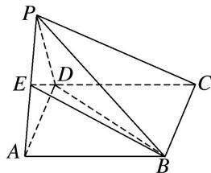
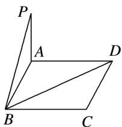
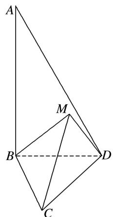
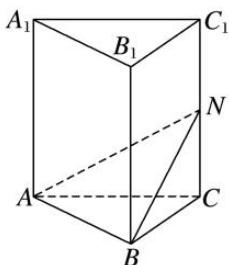
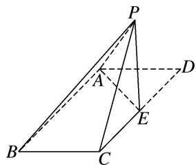
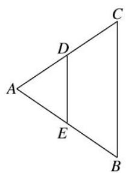
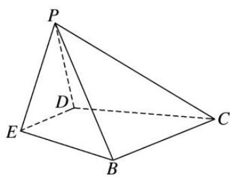

# 专题13 利用空间向量计算距离的问题

# 【方法总结】

#### 1. 点 $P$ 到直线 $l$ 的距离
设 $\overrightarrow{AP} = \boldsymbol{a}$ , $\boldsymbol{m}$ 是直线 $l$ 的单位方向向量, 则向量 $\overrightarrow{AP}$ 在直线 $l$ 上的投影向量 $\overrightarrow{AQ} = (\boldsymbol{a} \cdot \boldsymbol{m})\boldsymbol{m}$ . 在 Rt△APQ 中, 由勾股定理, 得 $PQ = \sqrt{|\overrightarrow{AP}|^2 - |\overrightarrow{AQ}|^2} = \sqrt{\boldsymbol{a}^2 - (\boldsymbol{a} \cdot \boldsymbol{m})^2}$ .

#### 2. 用向量法求点到直线距离的一般步骤  
（1）建系：建立恰当的空间直角坐标系.   
（2）求点坐标：写出(求出)相关点的坐标.   
（3）求向量：求出相关向量的坐标 $(\overrightarrow{AP}$ ，直线AP的单位方向向量m).  
（4）求距离 $d = \sqrt{\overrightarrow{AP}^2 - (\overrightarrow{AP}\cdot\boldsymbol{m})^2}$ .

#### 3. 点 $P$ 到平面 $\alpha$ 的距离
若平面 $\alpha$ 的法向量为 $n$ ，平面 $\alpha$ 内一点为 $A$ ，则平面 $\alpha$ 外一点 $P$ 到平面 $\alpha$ 的距离 $d = \left|\frac{\vec{AP} \cdot \boldsymbol{n}}{|\boldsymbol{n}|}\right| = \frac{|\vec{AP} \cdot \boldsymbol{n}|}{|\boldsymbol{n}|}$ ，如图所示.

#### 4. 用向量法求点到平面距离的一般步骤  
（1）建系：建立恰当的空间直角坐标系.   
（2）求点坐标: 写出(求出)相关点的坐标.   
（3）求向量：求出相关向量的坐标 $(\overrightarrow{AP},\alpha$ 内两不共线向量，平面 $\alpha$ 的法向量n).  
（4）求距离 $d=\frac{|\vec{A}P\cdot n|}{|n|}$ .

#### 5. 用向量法求线面距离、面面距离  
（1）如果一条直线 $l$ 与一个平面 $\alpha$ 平行，可在直线 $l$ 上任取一点 $P$ ，将线面距离转化为点 $P$ 到平面 $\alpha$ 的距离求解.  
（2）如果两个平面 $\alpha$ ， $\beta$ 互相平行，在其中一个平面 $\alpha$ 内任取一点 $P$ ，可将两个平行平面的距离转化为点 $P$ 到平面 $\beta$ 的距离求解.

#### 6. 求点到平面的距离的常用方法  
（1）直接法: 过 $P$ 点作平面 $\alpha$ 的垂线, 垂足为 $Q$ , 把 $PQ$ 放在某个三角形中, 解三角形求出 $PQ$ 的长度就是点 $P$ 到平面 $\alpha$ 的距离.  
（2）间接法：利用等体积法、特殊值法等转化求解.  
（3）转化法：若点 $P$ 所在的直线 $l$ 平行于平面 $\alpha$ ，则转化为直线 $l$ 上某一个点到平面 $\alpha$ 的距离来求.  
（4）向量法：设平面 $\alpha$ 的一个法向量为 $n$ ， $A$ 是 $\alpha$ 内任意点，则点 $P$ 到 $\alpha$ 的距离为 $d = \frac{|\vec{PA} \cdot n|}{|n|}$ .

# 【例题选讲】

[例 1] 在长方体 $OABC-O_{1}A_{1}B_{1}C_{1}$ 中，OA=2，AB=3， $AA_{1}=2$ ，求 $O_{1}$ 到直线 AC 的距离.

[例 2] 已知四边形 ABCD 是边长为 4 的正方形，E，F 分别是边 AB，AD 的中点，CG 垂直于正方形 ABCD 所在的平面，且 CG=2，求点 B 到平面 EFG 的距离.

[例 3] 在三棱柱 $ABC-A_{1}B_{1}C_{1}$ 中，底面 ABC 为正三角形，且侧棱 $AA_{1}\perp$ 底面 ABC，且底面边长与侧棱长都等于 2，O， $O_{1}$ 分别为 AC， $A_{1}C_{1}$ 的中点，求平面 $AB_{1}O_{1}$ 与平面 $BC_{1}O$ 间的距离.

[例 4] 在直三棱柱 $ABC-A_{1}B_{1}C_{1}$ 中， $AB=AC=AA_{1}=2,\quad\angle BAC=90^{\circ},\quad M$ 为 $BB_{1}$ 的中点，N 为 BC 的中点.  
（1）求点 M 到直线 $AC_{1}$ 的距离;  
（2）求点 N 到平面 $MA_{1}C_{1}$ 的距离.

[例 5] 如图，在四棱锥 P-ABCD 中，底面 ABCD 为矩形，点 E 在线段 PA 上，PC // 平面 BDE.  
（1）请确定点 E 的位置，并说明理由；  
（2）若 $\triangle PAD$ 是等边三角形， $AB=2AD$ ，平面 $PAD\perp$ 平面 $ABCD$ ，四棱锥 $P-ABCD$ 的体积为 $9\sqrt{3}$ ，求点 $E$ 到平面 $PCD$ 的距离.

# 【对点训练】

1. 如图， $P$ 为矩形 $ABCD$ 所在平面外一点， $PA \perp$ 平面 $ABCD$ ，若已知 $AB = 3$ ， $AD = 4$ ， $PA = 1$ ，求点 $P$ 到 $BD$ 的距离.

2. 在四棱锥 $P - ABCD$ 中，底面 $ABCD$ 为矩形， $PA \perp$ 平面 $ABCD$ ， $AD = 2AB = 4$ ，且 $PD$ 与底面 $ABCD$ 所成的角为 $45^{\circ}$ 。求点 $B$ 到直线 $PD$ 的距离。  
3. 如图, $\triangle BCD$ 与 $\triangle MCD$ 都是边长为 2 的正三角形, 平面 $MCD \perp$ 平面 $BCD$ , $AB \perp$ 平面 $BCD$ , $AB = 2\sqrt{3}$ , 求点 $A$ 到平面 $MBC$ 的距离.

4. 在三棱锥 $B - ACD$ 中，平面 $ABD \perp$ 平面 $ACD$ ，若棱长 $AC = CD = AD = AB = 1$ ，且 $\angle BAD = 30^{\circ}$ ，求点 $D$ 到平面 $ABC$ 的距离.

5. 如图，在正三棱柱 $ABC-A_{1}B_{1}C_{1}$ 中，各棱长均为 4，N 是 $CC_{1}$ 的中点.  
（1）求点 N 到直线 AB 的距离;  
（2）求点 $C_{1}$ 到平面 ABN 的距离.

6. 已知正方形 ABCD 的边长为 1， $PD \perp$ 平面 ABCD，且 PD = 1，E，F 分别为 AB，BC 的中点.  
（1）求点 D 到平面 PEF 的距离;  
（2）求直线 AC 到平面 PEF 的距离.

7. 如图所示，在平行四边形 $ABCD$ 中， $AB = 4$ ， $BC = 2\sqrt{2}$ ， $\angle ABC = 45^\circ$ ，点 $E$ 是 $CD$ 边的中点，将 $\triangle DAE$ 沿 $AE$ 折起，使点 $D$ 到达点 $P$ 的位置，且 $PB = 2\sqrt{6}$ .  
（1）求证：平面 $PAE \perp$ 平面 ABCE;  
（2）求点 E 到平面 PAB 的距离.

8. 如图, 已知 $\triangle ABC$ 为等边三角形, $D$ , $E$ 分别为 $AC$ , $AB$ 边的中点, 把 $\triangle ADE$ 沿 $DE$ 折起, 使点 $A$ 到达点 $P$ , 平面 $PDE \perp$ 平面 $BCDE$ , 若 $BC = 4$ .  
（1）求 PB 与平面 BCDE 所成角的正弦值;  
（2）求直线 DE 到平面 PBC 的距离.

