# 专题13 利用空间向量计算距离的问题

# 【方法总结】

#### 1. 点 $P$ 到直线 $l$ 的距离
设 $\overrightarrow{AP} = \boldsymbol{a}$ , $\boldsymbol{m}$ 是直线 $l$ 的单位方向向量, 则向量 $\overrightarrow{AP}$ 在直线 $l$ 上的投影向量 $\overrightarrow{AQ} = (\boldsymbol{a} \cdot \boldsymbol{m})\boldsymbol{m}$ . 在 Rt△APQ 中, 由勾股定理, 得 $PQ = \sqrt{|\overrightarrow{AP}|^2 - |\overrightarrow{AQ}|^2} = \sqrt{\boldsymbol{a}^2 - (\boldsymbol{a} \cdot \boldsymbol{m})^2}$ .

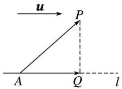

#### 2. 用向量法求点到直线距离的一般步骤  
（1）建系：建立恰当的空间直角坐标系.   
（2）求点坐标：写出(求出)相关点的坐标.   
（3）求向量：求出相关向量的坐标 $(\overrightarrow{AP}$ ，直线AP的单位方向向量m).  
（4）求距离 $d = \sqrt{\overrightarrow{AP}^2 - (\overrightarrow{AP}\cdot\boldsymbol{m})^2}$ .

#### 3. 点 $P$ 到平面 $\alpha$ 的距离
若平面 $\alpha$ 的法向量为 $n$ ，平面 $\alpha$ 内一点为 $A$ ，则平面 $\alpha$ 外一点 $P$ 到平面 $\alpha$ 的距离 $d = \left|\frac{\vec{AP} \cdot \boldsymbol{n}}{|\boldsymbol{n}|}\right| = \frac{|\vec{AP} \cdot \boldsymbol{n}|}{|\boldsymbol{n}|}$ ，如图所示.

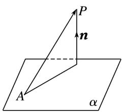

#### 4. 用向量法求点到平面距离的一般步骤  
（1）建系：建立恰当的空间直角坐标系.   
（2）求点坐标：写出(求出)相关点的坐标.   
（3）求向量：求出相关向量的坐标 $(\overrightarrow{AP}, \alpha$ 内两不共线向量，平面 $\alpha$ 的法向量n).  
（4）求距离 $d=\frac{|\vec{A}P\cdot n|}{|n|}$ .

#### 5. 用向量法求线面距离、面面距离  
（1）如果一条直线 $l$ 与一个平面 $\alpha$ 平行，可在直线 $l$ 上任取一点 $P$ ，将线面距离转化为点 $P$ 到平面 $\alpha$ 的距离求解.  
（2）如果两个平面 $\alpha$ ， $\beta$ 互相平行，在其中一个平面 $\alpha$ 内任取一点 $P$ ，可将两个平行平面的距离转化为点 $P$ 到平面 $\beta$ 的距离求解.

#### 6. 求点到平面的距离的常用方法  
（1）直接法：过 $P$ 点作平面 $\alpha$ 的垂线，垂足为 $Q$ ，把 $PQ$ 放在某个三角形中，解三角形求出 $PQ$ 的长度就是点 $P$ 到平面 $\alpha$ 的距离.  
（2）间接法：利用等体积法、特殊值法等转化求解.  
（3）转化法: 若点 $P$ 所在的直线 $l$ 平行于平面 $\alpha$ , 则转化为直线 $l$ 上某一个点到平面 $\alpha$ 的距离来求.  
（4）向量法：设平面 $\alpha$ 的一个法向量为 $n$ ， $A$ 是 $\alpha$ 内任意点，则点 $P$ 到 $\alpha$ 的距离为 $d = \frac{|\vec{PA} \cdot n|}{|n|}$ .

# 【例题选讲】

[例 1] 在长方体 $OABC-O_{1}A_{1}B_{1}C_{1}$ 中，OA=2，AB=3， $AA_{1}=2$ ，求 $O_{1}$ 到直线 AC 的距离.
解析 方法一 连接 $AO_{1}$ ，建立如图所示的空间直角坐标系，
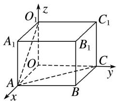
则 $A(2, 0, 0)$ ， $O_{1}(0, 0, 2)$ ， $C(0, 3, 0)$ ， $\therefore \overrightarrow{AO}_{1}=(-2, 0, 2)$ ， $\overrightarrow{AC}=(-2, 3, 0)$ ，
$\therefore \boldsymbol {a} = \overrightarrow {A O} _ {1} = (- 2, 0, 2), \quad \boldsymbol {a} ^ {2} = 8, \quad \boldsymbol {u} = \frac {\overrightarrow {A C}}{| \overrightarrow {A C} |} = \left[ \frac {- 2}{\sqrt {1 3}}, \frac {3}{\sqrt {1 3}}, 0 \right], \quad \boldsymbol {a} \boldsymbol {u} = \frac {4}{\sqrt {1 3}}.$
∴ $O_{1}$ 到直线 AC 的距离 $d=\sqrt{a^{2}-(a\cdot u)^{2}}=\frac{2\sqrt{286}}{13}$ .
方法二 建立如图所示的空间直角坐标系，则 $A(2, 0, 0)$ ， $O_{1}(0, 0, 2)$ ， $C(0, 3, 0)$ ，

过 $O_{1}$ 作 $O_{1}D \perp AC$ 于点 D，设 $D(x, y, 0)$ ，则 $\overrightarrow{O_{1}D} = (x, y, -2)$ ， $\overrightarrow{AD} = (x - 2, y, 0)$ .

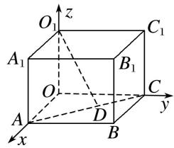
$\because \overrightarrow {A C} = (- 2, 3, 0), \overrightarrow {O _ {1} D} \perp \overrightarrow {A C}, \overrightarrow {A D} / / \overrightarrow {A C}, \therefore \left\{ \begin{array}{l l} - 2 x + 3 y = 0, \\ \frac {x - 2}{- 2} = \frac {y}{3}, \end{array} \right. \quad \text {解得} \left\{ \begin{array}{l l} x = \frac {1 8}{1 3}, \\ y = \frac {1 2}{1 3}, \end{array} \right. \quad \therefore D \left(\frac {1 8}{1 3}, \frac {1 2}{1 3}, 0\right),$
$\therefore |\overrightarrow{O_1D}| = \sqrt{\left(\frac{18}{13}\right)^2 + \left(\frac{12}{13}\right)^2 + (-2)^2} = \frac{2\sqrt{286}}{13}$ . 即 $O_1$ 到直线 $AC$ 的距离为 $\frac{2\sqrt{286}}{13}$ .

[例2] 已知四边形 $ABCD$ 是边长为4的正方形， $E, F$ 分别是边 $AB, AD$ 的中点， $CG$ 垂直于正方形 $ABCD$ 所在的平面，且 $CG = 2$ ，求点 $B$ 到平面 $EFG$ 的距离.
解析 建立如图所示的空间直角坐标系 Cxyz，则 $G(0, 0, 2)$ ， $E(4, -2, 0)$ ， $F(2, -4, 0)$ ， $B(4, 0, 0)$ ， $\therefore \vec{GE} = (4, -2, -2)$ ， $\vec{GF} = (2, -4, -2)$ ， $\vec{BE} = (0, -2, 0)$ .
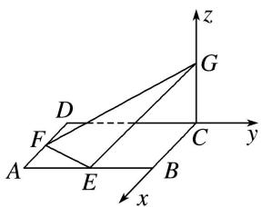
设平面 EFG 的法向量为 $\boldsymbol{n}=(x,y,z)$ . 由 $\left\{\begin{aligned}\vec{GE}\cdot\boldsymbol{n}&=0,\\ \vec{GF}\cdot\boldsymbol{n}&=0,\end{aligned}\right.$ 得 $\left\{\begin{aligned}2x-y-z&=0,\\ x-2y-z&=0,\end{aligned}\right.$
∴x=-y, z=-3y. 取 y=1，则 $n=(-1,1,-3)$ .
∴点 B 到平面 EFG 的距离 $d=\frac{|\overrightarrow{BE}\cdot\boldsymbol{n}|}{|\boldsymbol{n}|}=\frac{2}{\sqrt{11}}=\frac{2\sqrt{11}}{11}$ .

[例 3] 在三棱柱 $ABC-A_{1}B_{1}C_{1}$ 中，底面 ABC 为正三角形，且侧棱 $AA_{1}\perp$ 底面 ABC，且底面边长与侧棱长都等于 2，O， $O_{1}$ 分别为 AC， $A_{1}C_{1}$ 的中点，求平面 $AB_{1}O_{1}$ 与平面 $BC_{1}O$ 间的距离.
解析 如图，连接 $OO_{1}$ ，根据题意， $OO_{1} \perp$ 底面 ABC，
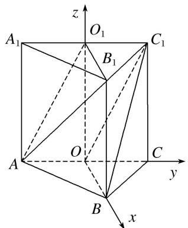
则以 O 为原点，分别以 OB, OC, $OO_{1}$ 所在的直线为 x, y, z 轴建立空间直角坐标系.
∵ $AO_{1} \parallel OC_{1}$ ， $OB \parallel O_{1}B_{1}$ ， $AO_{1} \cap O_{1}B_{1} = O_{1}$ ， $OC_{1} \cap OB = O$ ，∴ 平面 $AB_{1}O_{1} \parallel$ 平面 $BC_{1}O$ .
∴平面 $AB_{1}O_{1}$ 与平面 $BC_{1}O$ 间的距离即为点 $O_{1}$ 到平面 $BC_{1}O$ 的距离.
$\because O(0, 0, 0), B(\sqrt{3}, 0, 0), C_{1}(0, 1, 2), O_{1}(0, 0, 2),$
$\therefore \overrightarrow{OB} = (\sqrt{3}, 0, 0), \overrightarrow{OC_1} = (0, 1, 2), \overrightarrow{OO_1} = (0, 0, 2),$
设 $\boldsymbol{n}=(x,y,z)$ 为平面 $BC_{1}O$ 的法向量，则 $\left\{\begin{aligned}\boldsymbol{n}\cdot\overrightarrow{OB}&=0,\\ \boldsymbol{n}\cdot\overrightarrow{OC}_{1}&=0,\end{aligned}\right.$ 即 $\left\{\begin{aligned}x&=0,\\ y&+2z=0,\end{aligned}\right.$ $\therefore$ 可取 $\boldsymbol{n}=(0,2,-1)$ .点 $O_{1}$ 到平面 $BC_{1}O$ 的距离记为 $d$ ，则 $d = \frac{|\boldsymbol{n} \cdot \overrightarrow{OO_1}|}{|\boldsymbol{n}|} = \frac{2}{\sqrt{5}} = \frac{2\sqrt{5}}{5}$ .
∴平面 $AB_{1}O_{1}$ 与平面 $BC_{1}O$ 间的距离为 $\frac{2\sqrt{5}}{5}$ .

[例 4] 在直三棱柱 $ABC-A_{1}B_{1}C_{1}$ 中， $AB=AC=AA_{1}=2,\quad\angle BAC=90^{\circ},\quad M$ 为 $BB_{1}$ 的中点，N 为 BC 的中点.  
（1）求点 M 到直线 $AC_{1}$ 的距离;  
（2）求点 N 到平面 $MA_{1}C_{1}$ 的距离.
解析 （1）建立如图所示的空间直角坐标系，
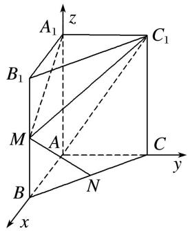
则 $A(0, 0, 0)$ ， $A_{1}(0, 0, 2)$ ， $M(2, 0, 1)$ ， $C_{1}(0, 2, 2)$ ，

直线 $AC_{1}$ 的一个单位方向向量为 $s_{0}=\left(0,\frac{\sqrt{2}}{2},\frac{\sqrt{2}}{2}\right)$ ， $\overrightarrow{AM}=(2,0,1)$ ,
故点 $M$ 到直线 $AC_{1}$ 的距离 $d = \sqrt{|\overrightarrow{AM}|^{2} - |\overrightarrow{AM}\cdot s_{0}|^{2}} = \sqrt{5 - \frac{1}{2}} = \frac{3\sqrt{2}}{2}.$  
（2）设平面 $MA_{1}C_{1}$ 的一个法向量为 $\boldsymbol{n}=(x,y,z)$ ，则 $\left\{\begin{aligned}\boldsymbol{n}\cdot\overrightarrow{A_{1}C_{1}}=0,\\ \boldsymbol{n}\cdot\overrightarrow{A_{1}M}=0,\end{aligned}\right.$ 即 $\left\{\begin{aligned}2y=0,\\ 2x-z=0,\end{aligned}\right.$ 取 x=1，得 z=2，
故 $n=(1,0,2)$ 为平面 $MA_{1}C_{1}$ 的一个法向量，因为 $N(1,1,0)$ ，所以 $\overrightarrow{MN}=(-1,1,-1)$ ，
故 N 到平面 $MA_{1}C_{1}$ 的距离 $d=\frac{|\overrightarrow{MN}\cdot\boldsymbol{n}|}{|\boldsymbol{n}|}=\frac{3}{\sqrt{5}}=\frac{3\sqrt{5}}{5}$ .

[例 5] 如图，在四棱锥 P-ABCD 中，底面 ABCD 为矩形，点 E 在线段 PA 上，PC// 平面 BDE.  
（1）请确定点 E 的位置，并说明理由；  
（2）若 $\triangle PAD$ 是等边三角形， $AB = 2AD$ ，平面 $PAD\bot$ 平面 $ABCD$ ，四棱锥 $P - ABCD$ 的体积为 $9\sqrt{3}$ ，求点 $E$ 到平面 $PCD$ 的距离.

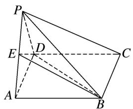

解析 （1）连接 AC 交 BD 于 M，连接 EM，如图，当 E 为 AP 的中点时，点 M 为 AC 的中点.
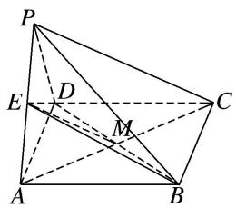
∴在△APC中， $EM \parallel PC$ ， $EM \subset$ 平面BDE， $PC \not\subset$ 平面BDE．∴PC//平面BDE.  
（2） $\because \triangle PAD$ 是等边三角形，AB=2AD，平面PAD⊥平面ABCD，
∴以 AD 的中点 O 为原点，OA 为 x 轴，在矩形 ABCD 中，过点 O 作 AB 的平行线为 y 轴，以 OP 为 z 轴，建立空间直角坐标系，设 AD = x，

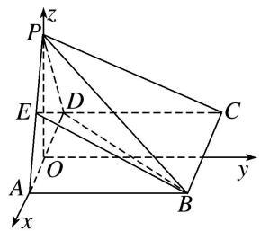
∵四棱锥 P-ABCD 的体积为 $9\sqrt{3}$ ，∴ $\frac{1}{3}x \cdot 2x \cdot \sqrt{x^{2} - \left(\frac{x}{2}\right)^{2}} = 9\sqrt{3}$ ，解得 x = 3，
$\therefore A \left(\frac {3}{2}, 0, 0\right), P \left(0, 0, \frac {3 \sqrt {3}}{2}\right), E \left(\frac {3}{4}, 0, \frac {3 \sqrt {3}}{4}\right), D \left(- \frac {3}{2}, 0, 0\right), C \left(- \frac {3}{2}, 6, 0\right). \overrightarrow {P E} = \left(\frac {3}{4}, 0, - \frac {3 \sqrt {3}}{4}\right),$
$\vec {P C} = \left[ - \frac {3}{2}, 6, - \frac {3 \sqrt {3}}{2} \right], \vec {P D} = \left[ - \frac {3}{2}, 0, - \frac {3 \sqrt {3}}{2} \right],$
设平面 PCD 的一个法向量为 $\boldsymbol{n}=(x,y,z)$ ，则 $\left\{\begin{aligned}\boldsymbol{n}\cdot\overrightarrow{PC}&=-\frac{3}{2}x+6y-\frac{3\sqrt{3}}{2}z=0,\\ \boldsymbol{n}\cdot\overrightarrow{PD}&=-\frac{3}{2}x-\frac{3\sqrt{3}}{2}z=0,\end{aligned}\right.$ 取 $x=\sqrt{3}$ ,
得 $n = (\sqrt{3}, 0, -1)$ , $\therefore E$ 到平面 $PCD$ 的距离 $d = \frac{|\vec{PE} \cdot n|}{|n|} = \frac{\frac{3\sqrt{3}}{2}}{2} = \frac{3\sqrt{3}}{4}$ .

# 【对点训练】

1. 如图， $P$ 为矩形 $ABCD$ 所在平面外一点， $PA \perp$ 平面 $ABCD$ ，若已知 $AB = 3$ ， $AD = 4$ ， $PA = 1$ ，求点 $P$ 到 $BD$ 的距离.

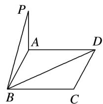

1. 解析 如图，分别以 AB, AD, AP 所在直线为 x, y, z 轴建立空间直角坐标系，
则 $P(0, 0, 1)$ ， $B(3, 0, 0)$ ， $D(0, 4, 0)$ ，

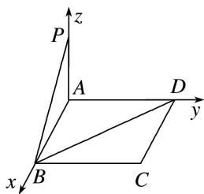
$\therefore \overrightarrow{PB} = (3, 0, -1), \overrightarrow{BD} = (-3, 4, 0)$ ，取 $a = \overrightarrow{PB} = (3, 0, -1)$ ， $m = \frac{\overrightarrow{BD}}{|\overrightarrow{BD}|} = \left(-\frac{3}{5}, \frac{4}{5}, 0\right)$ ，
则 $a^{2}=10,\quad a\cdot m=-\frac{9}{5}$ ，所以点 P 到 BD 的距离为 $\sqrt{a^{2}-(a\cdot m)^{2}}=\sqrt{10-\frac{81}{25}}=\frac{13}{5}$ .

2. 在四棱锥 $P - ABCD$ 中，底面 $ABCD$ 为矩形， $PA \perp$ 平面 $ABCD$ ， $AD = 2AB = 4$ ，且 $PD$ 与底面 $ABCD$ 所成的角为 $45^{\circ}$ 。求点 $B$ 到直线 $PD$ 的距离。

2. 解析 $\because PA \perp$ 平面 ABCD, $\therefore \angle PDA$ 即为 PD 与平面 ABCD 所成的角, $\therefore \angle PDA = 45^{\circ}$ ,
$\therefore P A = A D = 4, \quad A B = 2.$

以 A 为原点，AB，AD，AP 所在直线分别为 x 轴，y 轴，z 轴建立空间直角坐标系，如图所示.

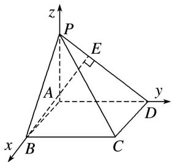
$\therefore A(0, 0, 0), B(2, 0, 0), P(0, 0, 4), D(0, 4, 0), \overrightarrow{DP} = (0, -4, 4).$
方法一 设存在点 E，使 $\overrightarrow{DE} = \lambda \overrightarrow{DP}$ ，且 $BE \perp DP$ ，设 $E(x, y, z)$ ,
$\therefore (x, y - 4, z) = \lambda (0, - 4, 4), \therefore x = 0, y = 4 - 4 \lambda , z = 4 \lambda ,$
∴ 点 $E(0, 4-4\lambda, 4\lambda)$ ， $\vec{BE}=(-2, 4-4\lambda, 4\lambda)$ .
$\because BE\perp DP,\quad\therefore\overrightarrow{BE}\cdot\overrightarrow{DP}=-4(4-4\lambda)+4\times4\lambda=0,$ 解得 $\lambda=\frac{1}{2}.$
$\therefore \overrightarrow{BE} = (-2, 2, 2), \therefore |\overrightarrow{BE}| = \sqrt{4 + 4 + 4} = 2\sqrt{3}$ ，故点 $B$ 到直线 $PD$ 的距离为 $2\sqrt{3}$ .
方法二 $\vec{BP}=(-2,0,4)$ ， $\vec{DP}=(0,-4,4)$ ，∴ $\vec{BP}\cdot\vec{DP}=16$
∴ $\overrightarrow{BP}$ 在 $\overrightarrow{DP}$ 上的投影向量的长度为 $\frac{|\overrightarrow{BP}\cdot\overrightarrow{DP}|}{|\overrightarrow{DP}|}=\frac{16}{\sqrt{16+16}}=2\sqrt{2}.$
所以点 B 到直线 PD 的距离为 $d=\sqrt{|\vec{B}P|^{2}-(2\sqrt{2})^{2}}=\sqrt{20-8}=2\sqrt{3}$ .

3. 如图， $\triangle BCD$ 与 $\triangle MCD$ 都是边长为 2 的正三角形，平面 $MCD \perp$ 平面 $BCD$ ， $AB \perp$ 平面 $BCD$ ， $AB = 2\sqrt{3}$ ，求点 $A$ 到平面 $MBC$ 的距离.

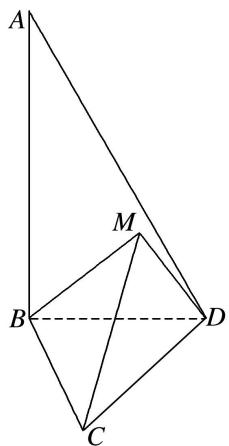

3. 解析 如图，取 CD 的中点 O，连接 OB，OM，

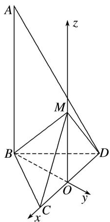
因为 $\triangle BCD$ 与 $\triangle MCD$ 均为正三角形，所以 $OB \perp CD, OM \perp CD,$
又平面 $MCD \perp$ 平面 $BCD$ ，平面 $MCD \cap$ 平面 $BCD = CD$ ， $OM \subset$ 平面 $MCD$ ，所以 $MO \perp$ 平面 $BCD$ .

以 O 为坐标原点，直线 OC，BO，OM 分别为 x 轴，y 轴，z 轴，建立空间直角坐标系 Oxyz.
因为 $\triangle BCD$ 与 $\triangle MCD$ 都是边长为2的正三角形，所以 $OB = OM = \sqrt{3}$
则 $O(0, 0, 0)$ , $C(1, 0, 0)$ , $M(0, 0, \sqrt{3})$ , $B(0, -\sqrt{3}, 0)$ , $A(0, -\sqrt{3}, 2\sqrt{3})$ ,
所以 $\overrightarrow{BC} = (1, \sqrt{3}, 0)$ . $\overrightarrow{BM} = (0, \sqrt{3}, \sqrt{3})$ .
设平面 MBC 的法向量为 $\boldsymbol{n}=(x,y,z)$ ，由 $\left\{\begin{aligned}\boldsymbol{n}\perp\vec{B}C,\\ \boldsymbol{n}\perp\vec{BM},\end{aligned}\right.$ 得 $\left\{\begin{aligned}\boldsymbol{n}\cdot\vec{B}C=0,\\ \boldsymbol{n}\cdot\vec{BM}=0,\end{aligned}\right.$ 即 $\left\{\begin{aligned}x+\sqrt{3}y=0,\\ \sqrt{3}y+\sqrt{3}z=0,\end{aligned}\right.$

取 $x = \sqrt{3}$ ，可得平面MBC的一个法向量为 $\pmb {n} = (\sqrt{3}, - 1, 1)$ 。又 $\vec{BA} = (0, 0, 2\sqrt{3})$
所以所求距离为 $d=\frac{|\overrightarrow{BA}\cdot n|}{|n|}=\frac{2\sqrt{15}}{5}$ .

4. 在三棱锥 B-ACD 中，平面 ABD⊥平面 ACD，若棱长 AC=CD=AD=AB=1，且 $\angle BAD=30^{\circ}$ ，求点 D 到平面 ABC 的距离.

4. 解析 如图所示, 以 $AD$ 的中点 $O$ 为原点, 以 $OD$ , $OC$ 所在直线为 $x$ 轴、 $y$ 轴, 过 $O$ 作 $OM \perp$ 平面 $ACD$ 交 $AB$ 于 $M$ , 以直线 $OM$ 为 $z$ 轴建立空间直角坐标系,

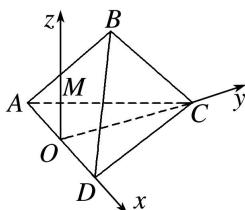
则 $A\left(-\frac{1}{2}, 0, 0\right), B\left(\frac{\sqrt{3}-1}{2}, 0, \frac{1}{2}\right), C\left(0, \frac{\sqrt{3}}{2}, 0\right), D\left(\frac{1}{2}, 0, 0\right)$ ,
$\therefore \overrightarrow {A C} = \left(\frac {1}{2}, \frac {\sqrt {3}}{2}, 0\right), \overrightarrow {A B} = \left(\frac {\sqrt {3}}{2}, 0, \frac {1}{2}\right), \overrightarrow {D C} = \left(- \frac {1}{2}, \frac {\sqrt {3}}{2}, 0\right),$
设 $\boldsymbol{n}=(x,y,z)$ 为平面 ABC 的一个法向量，则 $\left\{\begin{aligned}\boldsymbol{n}\cdot\overrightarrow{AB}&=\frac{\sqrt{3}}{2}x+\frac{1}{2}z=0,\\ \boldsymbol{n}\cdot\overrightarrow{AC}&=\frac{1}{2}x+\frac{\sqrt{3}}{2}y=0,\end{aligned}\right.$
$\therefore y = -\frac{\sqrt{3}}{3} x, z = -\sqrt{3} x$ ，可取 $n = (-\sqrt{3}, 1, 3)$ ，代入 $d = \frac{|\vec{DC} \cdot n|}{|n|}$ ，得 $d = \frac{\frac{\sqrt{3}}{2} + \frac{\sqrt{3}}{2}}{\sqrt{13}} = \frac{\sqrt{39}}{13}$ ，
即点 D 到平面 ABC 的距离是 $\frac{\sqrt{39}}{13}$ .

5. 如图，在正三棱柱 $ABC - A_{1}B_{1}C_{1}$ 中，各棱长均为 4， $N$ 是 $CC_{1}$ 的中点.  
（1）求点 N 到直线 AB 的距离;  
（2）求点 $C_{1}$ 到平面 ABN 的距离.

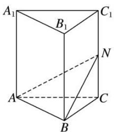

5. 解析 建立如图所示的空间直角坐标系，则 $A(0, 0, 0)$ , $B(2\sqrt{3}, 2, 0)$ , $C(0, 4, 0)$ , $C_1(0, 4, 4)$ ,

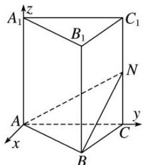
∵N是 $CC_{1}$ 的中点，∴ $N(0,4,2)$ .  
（1） $\overrightarrow{AN}=(0,4,2)$ ， $\overrightarrow{AB}=(2\sqrt{3},2,0)$ ，则 $|\overrightarrow{AN}|=2\sqrt{5}$ ， $|\overrightarrow{AB}|=4$ 。设点N到直线AB的距离为 $d_{1}$ ，
则 $d_{1} = \sqrt{|\overrightarrow{AN}|^{2} - \left(\frac{\overrightarrow{AN}\cdot\overrightarrow{AB}}{|\overrightarrow{AB}|}\right)^{2}} = \sqrt{20 - 4} = 4.$  
（2）设平面 ABN 的一个法向量为 $\boldsymbol{n}=(x,y,z)$ ，则由 $n\perp\overrightarrow{AB}, n\perp\overrightarrow{AN}$ ,
得 $\left\{ \begin{array}{l} n \cdot \overrightarrow{AB} = 2\sqrt{3} x + 2y = 0, \\ n \cdot \overrightarrow{AN} = 4y + 2z = 0, \end{array} \right.$ 令 $z = 2$ ，则 $y = -1$ ， $x = \frac{\sqrt{3}}{3}$ ，即 $n = \left[\frac{\sqrt{3}}{3}, -1, 2\right]$ .

易知 $\overrightarrow{C_1N} = (0, 0, -2)$ ，设点 $C_1$ 到平面 $ABN$ 的距离为 $d_2$ ，则 $d_2 = \left|\frac{\overrightarrow{C_1N}\cdot n}{|n|}\right| = \left|\frac{-4}{\frac{4\sqrt{3}}{3}}\right| = \sqrt{3}$ .

6. 已知正方形 ABCD 的边长为 1， $PD \perp$ 平面 ABCD，且 PD = 1，E，F 分别为 AB，BC 的中点.  
（1）求点 D 到平面 PEF 的距离;  
（2）求直线 AC 到平面 PEF 的距离.

6. 解析 建立如图所示的空间直角坐标系，则 $P(0, 0, 1)$ , $A(1, 0, 0)$ , $C(0, 1, 0)$ , $E\left(1, \frac{1}{2}, 0\right)$ , $F\left(\frac{1}{2}, 1, 0\right)$ .

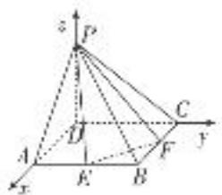  
（1）设 $DH \perp$ 平面 $PEF$ ，垂足为 $H$ ，则 $\overrightarrow{DH} = x\overrightarrow{DE} + y\overrightarrow{DF} + z\overrightarrow{DP} = \begin{bmatrix} x + \frac{1}{2}y, & \frac{1}{2}x + y, & z \end{bmatrix}$ ，其中 $x + y + z = 1$ .
因为 $\vec{PE} = \left(1, \frac{1}{2}, -1\right)$ , $\vec{PF} = \left(\frac{1}{2}, 1, -1\right)$ ,
所以 $\overrightarrow{DH} \cdot \overrightarrow{PE} = x + \frac{1}{2} y + \frac{1}{2}\left(\frac{1}{2} x + y\right) - z = \frac{5}{4} x + y - z = 0.$

同理， $x+\frac{5}{4}y-z=0$ 。又 $x+y+z=1$ ，由此解得 $x=y=\frac{4}{17}$ ， $z=\frac{9}{17}$ 。
所以 $\overrightarrow{DH} = \left[\frac{6}{17},\frac{6}{17},\frac{9}{17}\right] = \frac{3}{17}(2,2,3)$ 所以 $|\overrightarrow{DH}| = \frac{3\sqrt{17}}{17}$
即点 D 到平面 PEF 的距离为 $\frac{3\sqrt{17}}{17}$ .  
（2）设 $AH' \perp$ 平面 PEF，垂足为 $H'$ ，则 $\overrightarrow{AH}' // \overrightarrow{DH}$ .
设 $\overrightarrow{AH'}=\lambda(2,2,3)=(2\lambda,2\lambda,3\lambda)(\lambda\neq0)$ ，则
$\overrightarrow {E H ^ {'}} = \overrightarrow {E A} + A \overrightarrow {H ^ {'}} = \left(0, - \frac {1}{2}, 0\right) + (2 \lambda , 2 \lambda , 3 \lambda) = \left(2 \lambda , 2 \lambda - \frac {1}{2}, 3 \lambda\right).$
所以 $\overrightarrow{AH}\cdot\overrightarrow{EH}=4\lambda^{2}+4\lambda^{2}-\lambda+9\lambda^{2}=0$ ，即 $\lambda=\frac{1}{17}$ .
所以 $\overrightarrow{AH'}=\left(\frac{2}{17},\quad\frac{2}{17},\quad\frac{3}{17}\right)=\frac{1}{17}(2,\quad2,\quad3)$ ，所以 $|\overrightarrow{AH'}|=\frac{\sqrt{17}}{17}$ .

而直线 $AC \parallel$ 平面 $PEF$ ，所以直线 $AC$ 到平面 $PEF$ 的距离为 $\frac{\sqrt{17}}{17}$ .

7. 如图所示，在平行四边形 $ABCD$ 中， $AB = 4$ ， $BC = 2\sqrt{2}$ ， $\angle ABC = 45^\circ$ ，点 $E$ 是 $CD$ 边的中点，将 $\triangle DAE$ 沿 $AE$ 折起，使点 $D$ 到达点 $P$ 的位置，且 $PB = 2\sqrt{6}$ .  
（1）求证：平面 PAE⊥平面 ABCE;  
（2）求点 E 到平面 PAB 的距离.

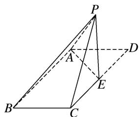

7. 解析 （1）∵在平行四边形ABCD中，AB=4， $BC=2\sqrt{2}$ ， $\angle ABC=45^{\circ}$

点 E 是 CD 边的中点，将 $\triangle DAE$ 沿 AE 折起，使点 D 到达点 P 的位置，且 $PB = 2\sqrt{6}$ .
$\therefore A E = \sqrt {(2 \sqrt {2}) ^ {2} + 2 ^ {2} - 2 \times 2 \sqrt {2} \times 2 \times \cos 4 5 ^ {\circ}} = 2, \quad \therefore A E \perp A B,$
$\because AB^{2}+PA^{2}=PB^{2},\quad\therefore AB\perp PA,\quad\because AE\cap PA=A,AE,PA\subset\text{平面}PAE,\quad\therefore AB\perp\text{平面}PAE,$
∵AB⊂平面ABCE，∴平面PAE⊥平面ABCE.  
（2） $\because AE=2,\ DE=2,\ PA=2\sqrt{2},\ \therefore PA^{2}=AE^{2}+PE^{2},\ \therefore AE\perp PE,\ \because AB\perp$ 平面PAE, $AB\parallel CE,$
∴ CE ⊥ 平面 PAE, ∴ EA, EC, EP 两两垂直，以 E 为原点，EA, EC, EP 为 x 轴，y 轴，z 轴，建立空间直角坐标系，则 $E(0, 0, 0)$ , $A(2, 0, 0)$ , $B(2, 4, 0)$ , $P(0, 0, 2)$ ,

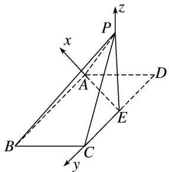
$\vec{PE} = (0, 0, -2)$ , $\vec{PA} = (2, 0, -2)$ , $\vec{PB} = (2, 4, -2)$ .
设平面 PAB 的一个法向量为 $\boldsymbol{n}=(x,y,z)$ ，则 $\left\{\begin{aligned}\boldsymbol{n}\cdot\overrightarrow{PA}&=2x-2z=0,\\ \boldsymbol{n}\cdot\overrightarrow{PB}&=2x+4y-2z=0,\end{aligned}\right.$ 取 x=1，得 $\boldsymbol{n}=(1,0,1)$ ,∴点 E 到平面 PAB 的距离 $d=\frac{|\overrightarrow{PE}\cdot\boldsymbol{n}|}{|\boldsymbol{n}|}=\frac{2}{\sqrt{2}}=\sqrt{2}$ .

8. 如图，已知 $\triangle ABC$ 为等边三角形， $D, E$ 分别为 $AC, AB$ 边的中点，把 $\triangle ADE$ 沿 $DE$ 折起，使点 $A$ 到达点 $P$ ，平面 $PDE \perp$ 平面 $BCDE$ ，若 $BC = 4$ .  
（1）求 PB 与平面 BCDE 所成角的正弦值;  
（2）求直线 DE 到平面 PBC 的距离.

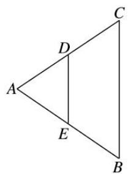

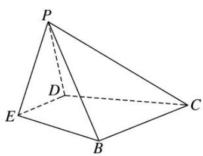

8. 解析 （1）如图所示, 设 $DE$ 的中点为 $O$ , $BC$ 的中点为 $F$ , 连接 $OP$ , $OF$ , $OB$ , 则 $OP \perp DE$ .

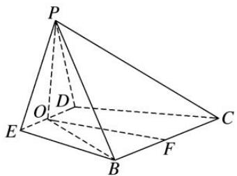
因为平面 $PDE \perp$ 平面 BCDE，平面 $PDE \cap$ 平面 $BCDE = DE$ ， $OP \subset$ 平面 PDE，所以 $OP \perp$ 平面 BCDE。因为 $OB \subset$ 平面 BCDE，所以 $OP \perp OB$ ，所以 $\angle OBP$ 即为直线 PB 与平面 BCDE 所成的角。因为 BC=4，则 $DE=\frac{1}{2}BC=2$ ，所以 $OP=OF=\sqrt{3}$ .
在 Rt△OBF 中， $BF=2,\ OF\perp BF$ ，所以 $OB=\sqrt{7}$ .
在 Rt△OBP 中， $PB=\sqrt{OP^{2}+OB^{2}}=\sqrt{3+7}=\sqrt{10}$
所以 $\sin\angle OBP=\frac{OP}{PB}=\frac{\sqrt{3}}{\sqrt{10}}=\frac{\sqrt{30}}{10}.$  
（2）方法一 因为点 D, E 分别为 AC, AB 边的中点，所以 DE // BC.
因为 $DE \not\subset$ 平面 PBC， $BC \subset$ 平面 PBC，所以 $DE \parallel$ 平面 PBC.
由（1）知， $OP \perp$ 平面 BCDE，又 $OF \perp DE$ ，
所以以点 O 为坐标原点，OE，OF，OP 所在直线为 x 轴，y 轴，z 轴建立如图所示的空间直角坐标系，

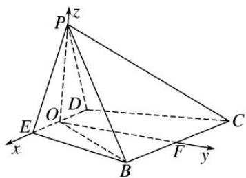
则 $O(0, 0, 0)$ ， $P(0, 0, \sqrt{3})$ ， $B(2, \sqrt{3}, 0)$ ， $C(-2, \sqrt{3}, 0)$ ， $F(0, \sqrt{3}, 0)$ ，
所以 $\vec{PB} = (2, \sqrt{3}, -\sqrt{3})$ ， $\vec{CB} = (4, 0, 0)$ .
设平面 PBC 的一个法向量为 $\boldsymbol{n}=(x,y,z)$ ，由 $\left\{\begin{aligned}\boldsymbol{n}\cdot\overrightarrow{PB}&=2x+\sqrt{3}y-\sqrt{3}z=0,\\ \boldsymbol{n}\cdot\overrightarrow{CB}&=4x=0,\end{aligned}\right.$ 得 $\left\{\begin{aligned}x=0,\\ y=z,\end{aligned}\right.$
令 y=z=1，所以 $n=(0,1,1)$ .
因为 $\overrightarrow{OF}=(0,\sqrt{3},0)$ ，设点 O 到平面 PBC 的距离为 d，
则 $d = \frac{|\overrightarrow{OF} \cdot \boldsymbol{n}|}{|\boldsymbol{n}|} = \frac{\sqrt{3}}{\sqrt{2}} = \frac{\sqrt{6}}{2}$ . 因为点 $O$ 在直线 $DE$ 上，所以直线 $DE$ 到平面 $PBC$ 的距离等于 $\frac{\sqrt{6}}{2}$ .
方法二 如图，连接 PF，因为点 D，E 分别为 AC，AB 边的中点，所以 DE // BC.

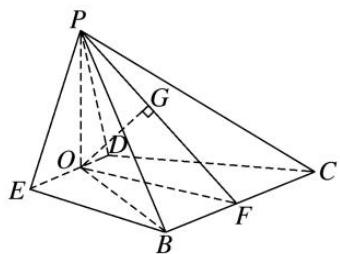
因为 $DE \not\subset$ 平面 PBC， $BC \subset$ 平面 PBC，所以 $DE \parallel$ 平面 PBC.
因为 $OP \perp$ 平面 BCDE， $BC \subset$ 平面 BCDE，所以 $OP \perp BC$ .
又 $OF \perp BC$ ， $OP \cap OF = O$ ，OP， $OF \subset$ 平面 OPF，所以 $BC \perp$ 平面 OPF.
因为 $BC \subset$ 平面 PBC，所以平面 $PBC \perp$ 平面 OPF.
因为平面 $PBC \cap$ 平面 OPF = PF，作 $OG \perp PF$ 交 PF 于点 G，则 $OG \perp$ 平面 PBC.
在 Rt△OPF 中， $OP=OF=\sqrt{3}$ ，所以 $PF=\sqrt{6}$ ， $OG=\frac{OP\cdot OF}{PF}=\frac{\sqrt{6}}{2}$ .
因为点 O 在直线 DE 上，所以直线 DE 到平面 PBC 的距离等于 $\frac{\sqrt{6}}{2}$ .

