专题13　利用空间向量计算距离的问题

【方法总结】

<strong>1．点</strong><em><strong>P</strong></em><strong>到直线</strong><em><strong>l</strong></em><strong>的距离</strong>
设＝<em><strong>a</strong></em>，<em><strong>m</strong></em>是直线<em>l</em>的单位方向向量，则向量在直线<em>l</em>上的投影向量＝(<em><strong>a·m</strong></em>)<em><strong>m</strong></em>．在Rt△<em>APQ</em>中，由勾股定理，得<em>PQ</em>＝＝．

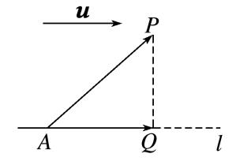

2．用向量法求点到直线距离的一般步骤  
（1）建系：建立恰当的空间直角坐标系．  
（2）求点坐标：写出(求出)相关点的坐标．  
（3）求向量：求出相关向量的坐标(，直线<em>AP</em>的单位方向向量<em><strong>m</strong></em>)．  
（4）求距离*d*＝．

<strong>3．点</strong><em><strong>P</strong></em><strong>到平面</strong><em><strong>α</strong></em><strong>的距离</strong>
若平面<em>α</em>的法向量为<em><strong>n</strong></em>，平面<em>α</em>内一点为<em>A</em>，则平面<em>α</em>外一点<em>P</em>到平面<em>α</em>的距离<em>d</em>＝＝，如图所示．

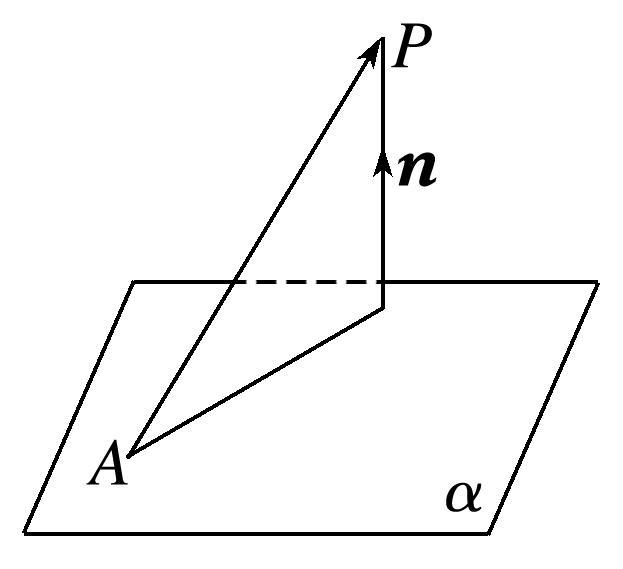

4．用向量法求点到平面距离的一般步骤  
（1）建系：建立恰当的空间直角坐标系．  
（2）求点坐标：写出(求出)相关点的坐标．  
（3）求向量：求出相关向量的坐标(，<em>α</em>内两不共线向量，平面<em>α</em>的法向量<em><strong>n</strong></em>)．  
（4）求距离*d*＝．

5．用向量法求线面距离、面面距离  
（1）如果一条直线*l*与一个平面*α*平行，可在直线*l*上任取一点*P*，将线面距离转化为点*P*到平面*α*的距离求解．  
（2）如果两个平面*α*，*β*互相平行，在其中一个平面*α*内任取一点*P*，可将两个平行平面的距离转化为点*P*到平面*β*的距离求解．

6．求点到平面的距离的常用方法  
（1）直接法：过*P*点作平面*α*的垂线，垂足为*Q*，把*PQ*放在某个三角形中，解三角形求出*PQ*的长度就是点*P*到平面*α*的距离．  
（2）间接法：利用等体积法、特殊值法等转化求解．  
（3）转化法：若点*P*所在的直线*l*平行于平面*α*，则转化为直线*l*上某一个点到平面*α*的距离来求．  
（4）向量法：设平面*α*的一个法向量为*n*，*A*是*α*内任意点，则点*P*到*α*的距离为*d*＝．

【例题选讲】

<strong>[例1]</strong>　在长方体<em>OABC</em>－<em>O</em>1<em>A</em>1<em>B</em>1<em>C</em>1中，<em>OA</em>＝2，<em>AB</em>＝3，<em>AA</em>1＝2，求<em>O</em>1到直线<em>AC</em>的距离．
解析　方法一　连接<em>AO</em>1，建立如图所示的空间直角坐标系，
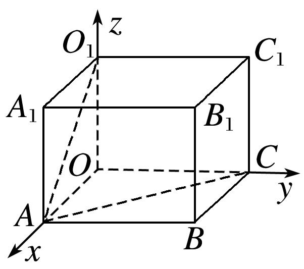
则<em>A</em>(2，0，0)，<em>O</em>1(0，0，2)，<em>C</em>(0，3，0)，∴＝(－2，0，2)，＝(－2，3，0)，
∴<em><strong>a</strong></em>＝＝(－2，0，2)，<em><strong>a</strong></em>2＝8，<em><strong>u</strong></em>＝＝，<em><strong>a u</strong></em>＝．
∴<em>O</em>1到直线<em>AC</em>的距离<em>d</em>＝＝．
方法二　建立如图所示的空间直角坐标系，则<em>A</em>(2，0，0)，<em>O</em>1(0，0，2)，<em>C</em>(0，3，0)，

过<em>O</em>1作<em>O</em>1<em>D</em>⊥<em>AC</em>于点<em>D</em>，设<em>D</em>(<em>x</em>，<em>y，</em>0)，则＝(<em>x</em>，<em>y</em>，－2)，＝(<em>x</em>－2，<em>y，</em>0)．

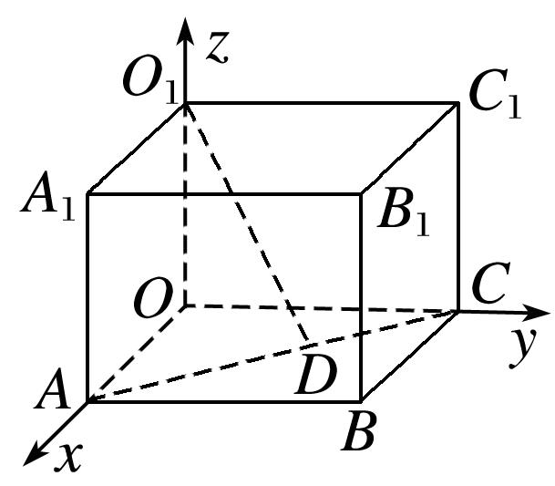
∵＝(－2，3，0)，⊥，∥，∴解得∴*D*，
∴||＝＝．即<em>O</em>1到直线<em>AC</em>的距离为．

<strong>[例2]</strong>　已知四边形<em>ABCD</em>是边长为4的正方形，<em>E</em>，<em>F</em>分别是边<em>AB</em>，<em>AD</em>的中点，<em>CG</em>垂直于正方形<em>ABCD</em>所在的平面，且<em>CG</em>＝2，求点<em>B</em>到平面<em>EFG</em>的距离．
解析　建立如图所示的空间直角坐标系*Cxyz*，则*G*(0，0，2)，*E*(4，－2，0)，*F*(2，－4，0)，*B*(4，0，0)，∴＝(4，－2，－2)，＝(2，－4，－2)，＝(0，－2，0)．
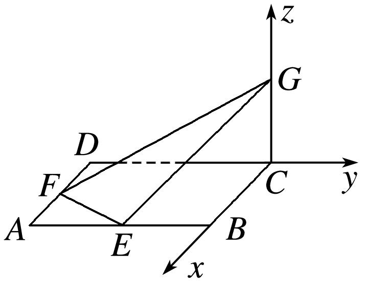
设平面<em>EFG</em>的法向量为<em><strong>n</strong></em>＝(<em>x</em>，<em>y</em>，<em>z</em>)．由得
∴<em>x</em>＝－<em>y</em>，<em>z</em>＝－3<em>y</em>．取<em>y</em>＝1，则<em><strong>n</strong></em>＝(－1，1，－3)．
∴点*B*到平面*EFG*的距离*d*＝＝＝．

<strong>[例3]</strong>　在三棱柱<em>ABC</em>－<em>A</em>1<em>B</em>1<em>C</em>1中，底面<em>ABC</em>为正三角形，且侧棱<em>AA</em>1⊥底面<em>ABC</em>，且底面边长与侧棱长都等于2，<em>O</em>，<em>O</em>1分别为<em>AC</em>，<em>A</em>1<em>C</em>1的中点，求平面<em>AB</em>1<em>O</em>1与平面<em>BC</em>1<em>O</em>间的距离．
解析　如图，连接<em>OO</em>1，根据题意，<em>OO</em>1⊥底面<em>ABC</em>，
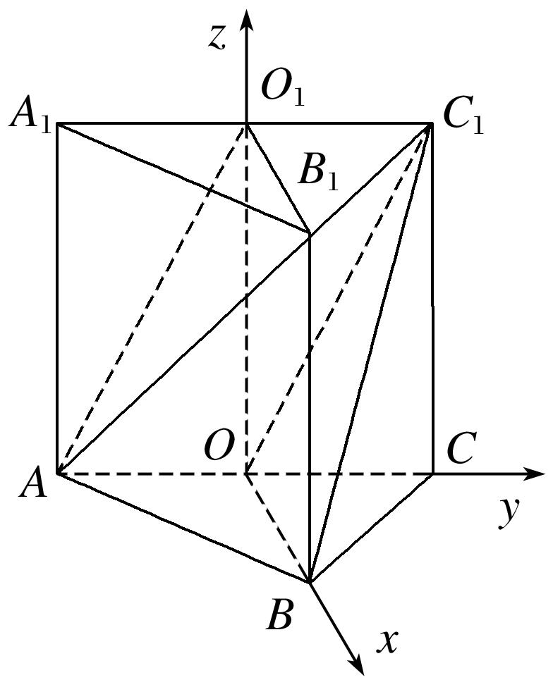
则以<em>O</em>为原点，分别以<em>OB</em>，<em>OC</em>，<em>OO</em>1所在的直线为<em>x</em>，<em>y</em>，<em>z</em>轴建立空间直角坐标系．
∵<em>AO</em>1∥<em>OC</em>1，<em>OB</em>∥<em>O</em>1<em>B</em>1，<em>AO</em>1∩<em>O</em>1<em>B</em>1＝<em>O</em>1，<em>OC</em>1∩<em>OB</em>＝<em>O</em>，∴平面<em>AB</em>1<em>O</em>1∥平面<em>BC</em>1<em>O</em>．
∴平面<em>AB</em>1<em>O</em>1与平面<em>BC</em>1<em>O</em>间的距离即为点<em>O</em>1到平面<em>BC</em>1<em>O</em>的距离．
∵<em>O</em>(0，0，0)，<em>B</em>(，0，0)，<em>C</em>1(0，1，2)，<em>O</em>1(0，0，2)，
∴＝(，0，0)，＝(0，1，2)，＝(0，0，2)，
设<em><strong>n</strong></em>＝(<em>x</em>，<em>y</em>，<em>z</em>)为平面<em>BC</em>1<em>O</em>的法向量，则即∴可取<em><strong>n</strong></em>＝(0，2，－1)．

点<em>O</em>1到平面<em>BC</em>1<em>O</em>的距离记为<em>d</em>，则<em>d</em>＝＝＝．
∴平面<em>AB</em>1<em>O</em>1与平面<em>BC</em>1<em>O</em>间的距离为．

<strong>[例4]</strong>　在直三棱柱<em>ABC</em>－<em>A</em>1<em>B</em>1<em>C</em>1中，<em>AB</em>＝<em>AC</em>＝<em>AA</em>1＝2，∠<em>BAC</em>＝90°，<em>M</em>为<em>BB</em>1的中点，<em>N</em>为<em>BC</em>的中点．  
（1）求点<em>M</em>到直线<em>AC</em>1的距离；  
（2）求点<em>N</em>到平面<em>MA</em>1<em>C</em>1的距离．
解析　（1）建立如图所示的空间直角坐标系，
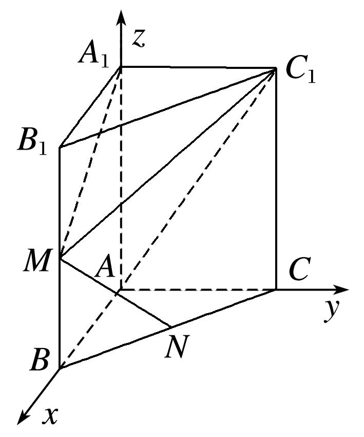
则<em>A</em>(0，0，0)，<em>A</em>1(0，0，2)，<em>M</em>(2，0，1)，<em>C</em>1(0，2，2)，

直线<em>AC</em>1的一个单位方向向量为<em><strong>s</strong></em>0＝，＝(2，0，1)，
故点<em>M</em>到直线<em>AC</em>1的距离<em>d</em>＝＝＝．  
（2）设平面<em>MA</em>1<em>C</em>1的一个法向量为<em><strong>n</strong></em>＝(<em>x</em>，<em>y</em>，<em>z</em>)，则即取<em>x</em>＝1，得<em>z</em>＝2，
故<em><strong>n</strong></em>＝(1，0，2)为平面<em>MA</em>1<em>C</em>1的一个法向量，因为<em>N</em>(1，1，0)，所以＝(－1，1，－1)，
故<em>N</em>到平面<em>MA</em>1<em>C</em>1的距离<em>d</em>＝＝＝．

<strong>[例5]</strong>　如图，在四棱锥<em>P</em>－<em>ABCD</em>中，底面<em>ABCD</em>为矩形，点<em>E</em>在线段<em>PA</em>上，<em>PC</em>∥平面<em>BDE</em>．  
（1）请确定点*E*的位置，并说明理由；  
（2）若△*PAD*是等边三角形，*AB*＝2*AD*，平面*PAD*⊥平面*ABCD*，四棱锥*P*－*ABCD*的体积为9，求点*E*到平面*PCD*的距离．

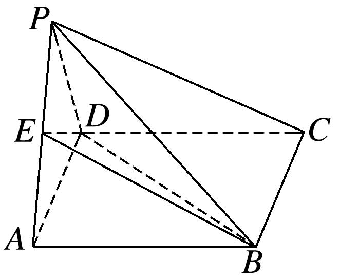
解析　（1）连接*AC*交*BD*于*M*，连接*EM*，如图，当*E*为*AP*的中点时，点*M*为*AC*的中点．
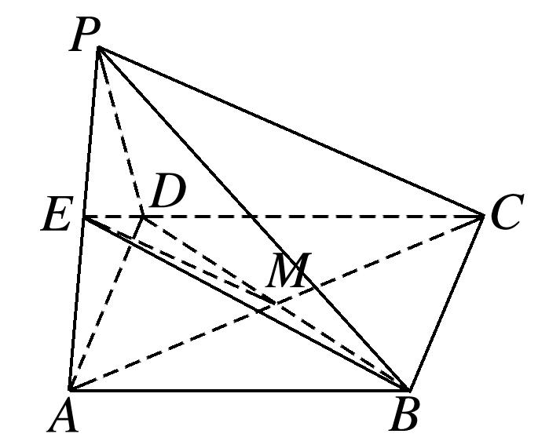
∴在△*APC*中，*EM*∥*PC*，*EM*⊂平面*BDE*，*PC*⊄平面*BDE*．∴*PC*∥平面*BDE*．  
（2）∵△*PAD*是等边三角形，*AB*＝2*AD*，平面*PAD*⊥平面*ABCD*，
∴以*AD*的中点*O*为原点，*OA*为*x*轴，在矩形*ABCD*中，过点*O*作*AB*的平行线为*y*轴，以*OP*为*z*轴，建立空间直角坐标系，设*AD*＝*x*，

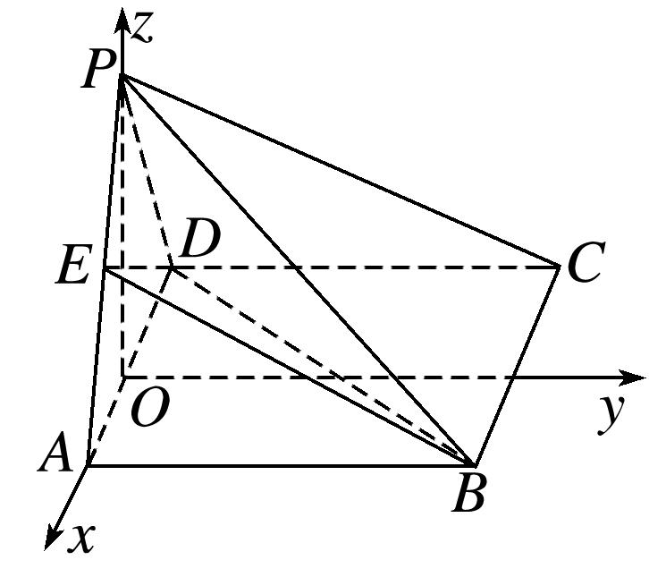
∵四棱锥*P*－*ABCD*的体积为9，∴*x*·2*x*·＝9，解得*x*＝3，
∴*A*，*P*，*E*，*D*，*C*．＝，＝，＝，
设平面<em>PCD</em>的一个法向量为<em><strong>n</strong></em>＝(<em>x</em>，<em>y</em>，<em>z</em>)，则取<em>x</em>＝，
得<em><strong>n</strong></em>＝(，0，－1)，∴<em>E</em>到平面<em>PCD</em>的距离<em>d</em>＝＝＝．

【对点训练】

1．如图，*P*为矩形*ABCD*所在平面外一点，*PA*⊥平面*ABCD*，若已知*AB*＝3，*AD*＝4，*PA*＝1，求点*P*到

*BD*的距离．

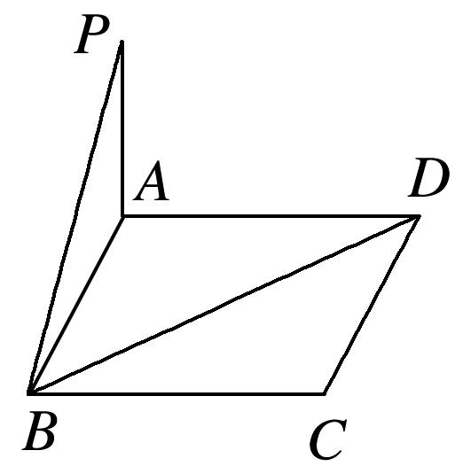

1．解析　如图，分别以*AB*，*AD*，*AP*所在直线为*x*，*y*，*z*轴建立空间直角坐标系，
则*P*(0，0，1)，*B*(3，0，0)，*D*(0，4，0)，

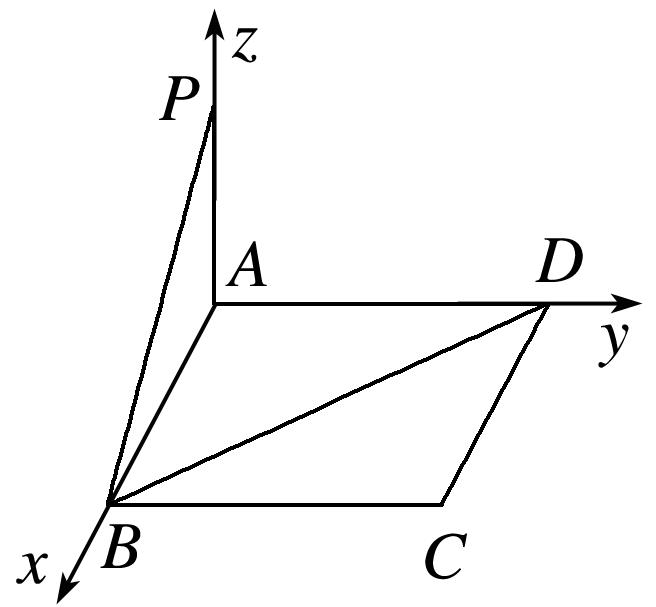
∴＝(3，0，－1)，＝(－3，4，0)，取*a*＝＝(3，0，－1)，*m*＝＝，
则<em><strong>a</strong></em>2＝10，<em><strong>a</strong></em>·<em><strong>m</strong></em>＝－，所以点<em>P</em>到<em>BD</em>的距离为＝＝．

2．在四棱锥*P*－*ABCD*中，底面*ABCD*为矩形，*PA*⊥平面*ABCD*，*AD*＝2*AB*＝4，且*PD*与底面*ABCD*所

成的角为45°．求点*B*到直线*PD*的距离．

2．解析　∵*PA*⊥平面*ABCD*，∴∠*PDA*即为*PD*与平面*ABCD*所成的角，∴∠*PDA*＝45°，
∴*PA*＝*AD*＝4，*AB*＝2．

以*A*为原点，*AB*，*AD*，*AP*所在直线分别为*x*轴，*y*轴，*z*轴建立空间直角坐标系，如图所示．

∴*A*(0，0，0)，*B*(2，0，0)，*P*(0，0，4)，*D*(0，4，0)，＝(0，－4，4)．
方法一　设存在点*E*，使＝*λ*，且*BE*⊥*DP*，设*E*(*x*，*y*，*z*)，
∴(*x*，*y*－4，*z*)＝*λ*(0，－4，4)，∴*x*＝0，*y*＝4－4*λ*，*z*＝4*λ*，
∴点*E*(0，4－4*λ*，4*λ*)，＝(－2，4－4*λ*，4*λ*)．
∵*BE*⊥*DP*，∴·＝－4(4－4*λ*)＋4×4*λ*＝0，解得*λ*＝．
∴＝(－2，2，2)，∴||＝＝2，故点*B*到直线*PD*的距离为2．
方法二　＝(－2，0，4)，＝(0，－4，4)，∴·＝16，
∴在上的投影向量的长度为＝＝2．
所以点*B*到直线*PD*的距离为*d*＝＝＝2．

3．如图，△*BCD*与△*MCD*都是边长为2的正三角形，平面*MCD*⊥平面*BCD*，*AB*⊥平面*BCD*，*AB*＝2，

求点*A*到平面*MBC*的距离．

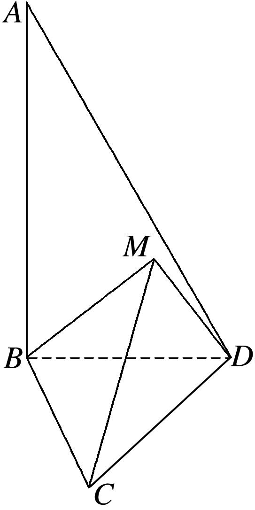

3．解析　如图，取*CD*的中点*O*，连接*OB*，*OM*，

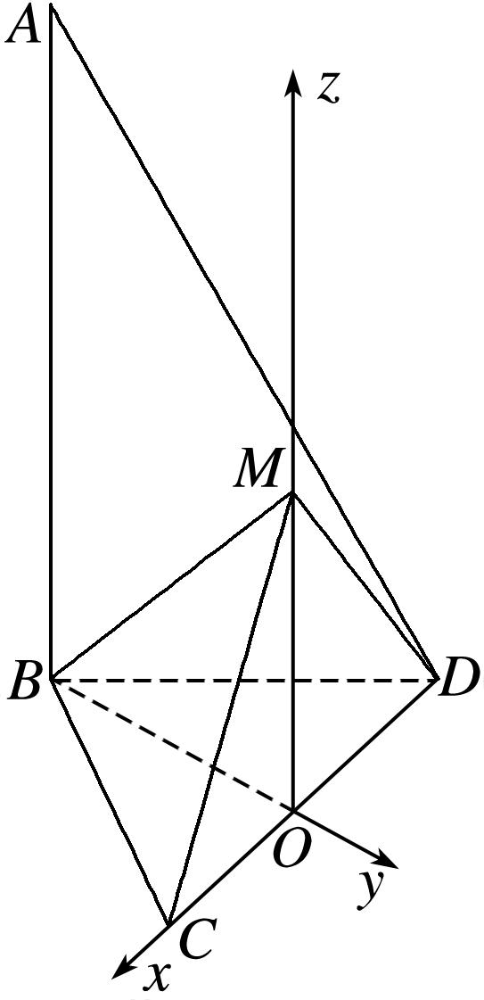
因为△*BCD*与△*MCD*均为正三角形，所以*OB*⊥*CD*，*OM*⊥*CD*，
又平面*MCD*⊥平面*BCD*，平面*MCD*∩平面*BCD*＝*CD*，*OM*⊂平面*MCD*，所以*MO*⊥平面*BCD*．

以*O*为坐标原点，直线*OC*，*BO*，*OM*分别为*x*轴，*y*轴，*z*轴，建立空间直角坐标系*Oxyz*．
因为△*BCD*与△*MCD*都是边长为2的正三角形，所以*OB*＝*OM*＝，
则*O*(0，0，0)，*C*(1，0，0)，*M*(0，0，)，*B*(0，－，0)，*A*(0，－，2)，
所以＝(1，，0)．＝(0，，)．
设平面<em>MBC</em>的法向量为<em><strong>n</strong></em>＝(<em>x</em>，<em>y</em>，<em>z</em>)，由得即

取<em>x</em>＝，可得平面<em>MBC</em>的一个法向量为<em><strong>n</strong></em>＝(，－1，1)．又＝(0，0，2)，
所以所求距离为*d*＝＝．

4．在三棱锥*B*－*ACD*中，平面*ABD*⊥平面*ACD*，若棱长*AC*＝*CD*＝*AD*＝*AB*＝1，且∠*BAD*＝30°，求点

*D*到平面*ABC*的距离．

4．解析　如图所示，以*AD*的中点*O*为原点，以*OD*，*OC*所在直线为*x*轴、*y*轴，过*O*作*OM*⊥平面*ACD*

交*AB*于*M*，以直线*OM*为*z*轴建立空间直角坐标系，

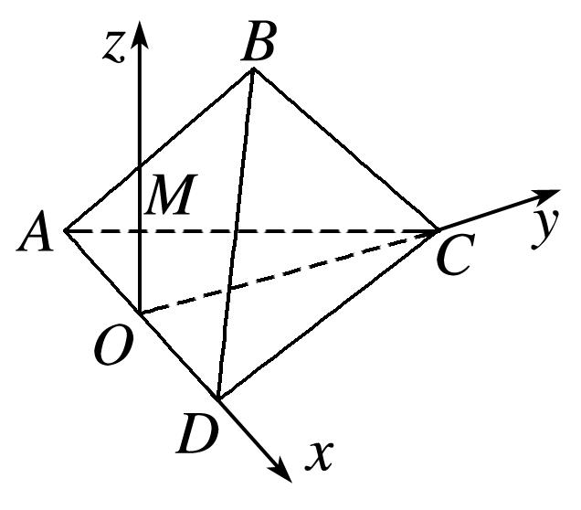
则*A*，*B*，*C*，*D*，
∴ ＝， ＝，＝，
设<em><strong>n</strong></em>＝(<em>x</em>，<em>y</em>，<em>z</em>)为平面<em>ABC</em>的一个法向量，则
∴<em>y</em>＝－<em>x</em>，<em>z</em>＝－<em>x</em>，可取<em><strong>n</strong></em>＝(－，1，3)，代入<em>d</em>＝ ，得<em>d</em>＝＝，
即点*D*到平面*ABC*的距离是．

5．如图，在正三棱柱<em>ABC</em>－<em>A</em>1<em>B</em>1<em>C</em>1中，各棱长均为4，<em>N</em>是<em>CC</em>1的中点．  
（1）求点*N*到直线*AB*的距离；  
（2）求点<em>C</em>1到平面<em>ABN</em>的距离．

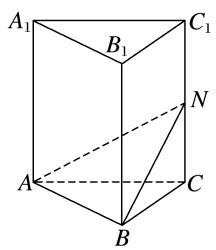

5．解析　建立如图所示的空间直角坐标系，则<em>A</em>(0，0，0)，<em>B</em>(2，2，0)，<em>C</em>(0，4，0)，<em>C</em>1(0，4，4)，

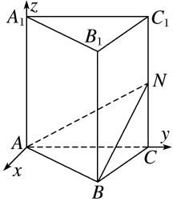
∵<em>N</em>是<em>CC</em>1的中点，∴<em>N</em>(0，4，2)．  
（1）＝(0，4，2)，＝(2，2，0)，则||＝2，||＝4．设点<em>N</em>到直线<em>AB</em>的距离为<em>d</em>1，
则<em>d</em>1＝＝＝4．  
（2）设平面<em>ABN</em>的一个法向量为<em><strong>n</strong></em>＝(<em>x</em>，<em>y</em>，<em>z</em>)，则由<em><strong>n</strong></em>⊥，<em><strong>n</strong></em>⊥，
得令<em>z</em>＝2，则<em>y</em>＝－1，<em>x</em>＝，即<em><strong>n</strong></em>＝．

易知＝(0，0，－2)，设点<em>C</em>1到平面<em>ABN</em>的距离为<em>d</em>2，则<em>d</em>2＝＝＝．

6．已知正方形*ABCD*的边长为1，*PD*⊥平面*ABCD*，且*PD*＝1，*E*，*F*分别为*AB*，*BC*的中点．  
（1）求点*D*到平面*PEF*的距离；  
（2）求直线*AC*到平面*PEF*的距离．

6．解析　建立如图所示的空间直角坐标系，则*P*(0，0，1)，*A*(1，0，0)，*C*(0，1，0)，*E*，*F*．

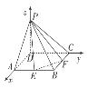  
（1）设*DH*⊥平面*PEF*，垂足为*H*，则＝*x*＋*y*＋*z*＝，其中*x*＋*y*＋*z*＝1．
因为＝，＝，
所以·＝*x*＋*y*＋－*z*＝*x*＋*y*－*z*＝0．

同理，*x*＋*y*－*z*＝0．又*x*＋*y*＋*z*＝1，由此解得*x*＝*y*＝，*z*＝．
所以＝＝(2，2，3)．所以||＝．
即点*D*到平面*PEF*的距离为．  
（2）设*AH*′⊥平面*PEF*，垂足为*H*′，则∥．
设＝*λ*(2，2，3)＝(2*λ*，2*λ*，3*λ*)(*λ*≠0)，则

＝＋＝＋(2*λ*，2*λ*，3*λ*)＝．
所以·＝4<em>λ</em>2＋4<em>λ</em>2－<em>λ</em>＋9<em>λ</em>2＝0，即<em>λ</em>＝．
所以＝＝(2，2，3)，所以||＝．

而直线*AC*∥平面*PEF*，所以直线*AC*到平面*PEF*的距离为．

7．如图所示，在平行四边形*ABCD*中，*AB*＝4，*BC*＝2，∠*ABC*＝45°，点*E*是*CD*边的中点，将△*DAE*

沿*AE*折起，使点*D*到达点*P*的位置，且*PB*＝2．  
（1）求证：平面*PAE*⊥平面*ABCE*；  
（2）求点*E*到平面*PAB*的距离．

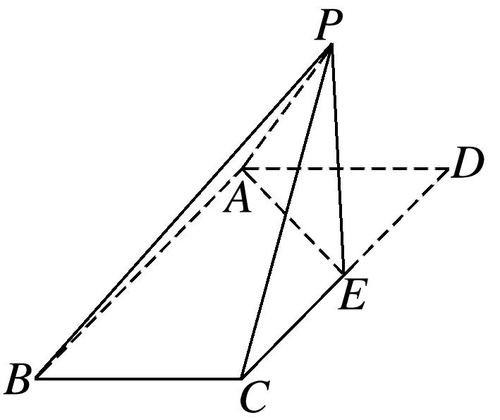

7．解析　（1）∵在平行四边形*ABCD*中，*AB*＝4，*BC*＝2，∠*ABC*＝45°，

点*E*是*CD*边的中点，将△*DAE*沿*AE*折起，使点*D*到达点*P*的位置，且*PB*＝2．
∴*AE*＝＝2，∴*AE*⊥*AB*，
∵<em>AB</em>2＋<em>PA</em>2＝<em>PB</em>2，∴<em>AB</em>⊥<em>PA</em>，∵<em>AE</em>∩<em>PA</em>＝<em>A</em>，<em>AE</em>，<em>PA</em>⊂平面<em>PAE</em>，∴<em>AB</em>⊥平面<em>PAE</em>，
∵*AB*⊂平面*ABCE*，∴平面*PAE*⊥平面*ABCE*．  
（2）∵<em>AE</em>＝2，<em>DE</em>＝2，<em>PA</em>＝2，∴<em>PA</em>2＝<em>AE</em>2＋<em>PE</em>2，∴<em>AE</em>⊥<em>PE</em>，∵<em>AB</em>⊥平面<em>PAE</em>，<em>AB</em>∥<em>CE</em>，
∴*CE*⊥平面*PAE*，∴*EA*，*EC*，*EP*两两垂直，以*E*为原点，*EA*，*EC*，*EP*为*x*轴，*y*轴，*z*轴，建立空间直角坐标系，则*E*(0，0，0)，*A*(2，0，0)，*B*(2，4，0)，*P*(0，0，2)，

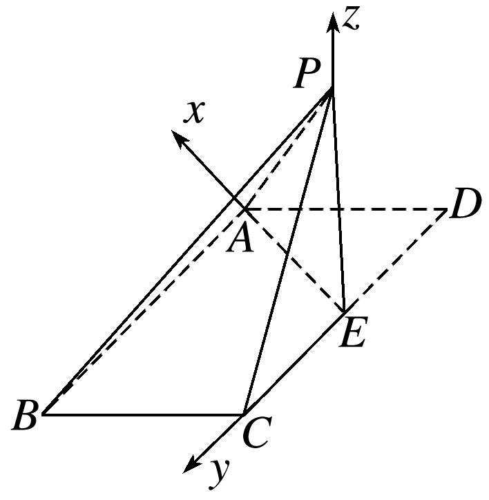

＝(0，0，－2)，＝(2，0，－2)，＝(2，4，－2)．
设平面<em>PAB</em>的一个法向量为<em><strong>n</strong></em>＝(<em>x</em>，<em>y</em>，<em>z</em>)，则取<em>x</em>＝1，得<em><strong>n</strong></em>＝(1，0，1)，
∴点*E*到平面*PAB*的距离*d*＝＝＝．

8．如图，已知△*ABC*为等边三角形，*D*，*E*分别为*AC*，*AB*边的中点，把△*ADE*沿*DE*折起，使点*A*到

达点*P*，平面*PDE*⊥平面*BCDE*，若*BC*＝4．  
（1）求*PB*与平面*BCDE*所成角的正弦值；  
（2）求直线*DE*到平面*PBC*的距离．

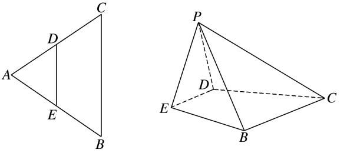

8．解析　（1）如图所示，设*DE*的中点为*O*，*BC*的中点为*F*，连接*OP*，*OF*，*OB*，则*OP*⊥*DE*．

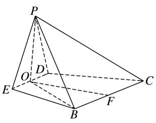
因为平面*PDE*⊥平面*BCDE*，平面*PDE*∩平面*BCDE*＝*DE*，*OP*⊂平面*PDE*，所以*OP*⊥平面*BCDE*．
因为*OB*⊂平面*BCDE*，所以*OP*⊥*OB*，所以∠*OBP*即为直线*PB*与平面*BCDE*所成的角．
因为*BC*＝4，则*DE*＝*BC*＝2，所以*OP*＝*OF*＝．
在Rt△*OBF*中，*BF*＝2，*OF*⊥*BF*，所以*OB*＝．
在Rt△*OBP*中，*PB*＝＝＝，
所以sin∠*OBP*＝＝＝．  
（2）方法一　因为点*D*，*E*分别为*AC*，*AB*边的中点，所以*DE*∥*BC*．
因为*DE*⊄平面*PBC*，*BC*⊂平面*PBC*，所以*DE*∥平面*PBC*．
由（1）知，*OP*⊥平面*BCDE*，又*OF*⊥*DE*，
所以以点*O*为坐标原点，*OE*，*OF*，*OP*所在直线为*x*轴，*y*轴，*z*轴建立如图所示的空间直角坐标系，

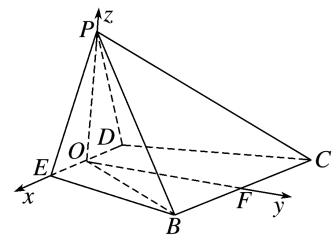
则*O*(0，0，0)，*P*，*B*，*C*，*F*，
所以＝，＝(4，0，0)．
设平面<em>PBC</em>的一个法向量为<em><strong>n</strong></em>＝(<em>x</em>，<em>y</em>，<em>z</em>)，由得
令<em>y</em>＝<em>z</em>＝1，所以<em><strong>n</strong></em>＝(0，1，1)．
因为＝(0，，0)，设点*O*到平面*PBC*的距离为*d*，
则*d*＝＝＝．因为点*O*在直线*DE*上，所以直线*DE*到平面*PBC*的距离等于．
方法二　如图，连接*PF*，因为点*D*，*E*分别为*AC*，*AB*边的中点，所以*DE*∥*BC*．

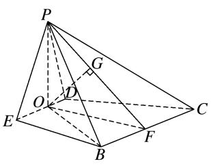
因为*DE*⊄平面*PBC*，*BC*⊂平面*PBC*，所以*DE*∥平面*PBC*．
因为*OP*⊥平面*BCDE*，*BC*⊂平面*BCDE*，所以*OP*⊥*BC*．
又*OF*⊥*BC*，*OP*∩*OF*＝*O*，*OP*，*OF*⊂平面*OPF*，所以*BC*⊥平面*OPF*．
因为*BC*⊂平面*PBC*，所以平面*PBC*⊥平面*OPF*．
因为平面*PBC*∩平面*OPF*＝*PF*，作*OG*⊥*PF*交*PF*于点*G*，则*OG*⊥平面*PBC*．
在Rt△*OPF*中，*OP*＝*OF*＝，所以*PF*＝，*OG*＝＝．
因为点*O*在直线*DE*上，所以直线*DE*到平面*PBC*的距离等于．

