# 专题14 利用空间向量解决立体几何中的探索性问题

# 【方法总结】

与空间向量有关的探究性问题主要有两类：一类是探究线面的位置关系的存在性问题，即线面的平行与垂直；另一类是探究线面的数量关系的存在性问题，即线面角或二面角满足特定要求时的存在性问题。
利用空间向量法解决立体几何中的探索性问题的思路: （1）根据题设条件中的垂直关系, 建立适当的空间直角坐标系, 将相关点、相关向量用坐标表示. （2）假设所求的点或参数存在, 并用相关参数表示相关点的坐标, 根据线、面满足位置关系、数量关系, 构建方程(组)求解, 若能求出参数的值且符合该限定的范围, 则存在, 否则不存在.

注意：在棱上探寻一点满足各种条件时，要明确思路，设点坐标，应用共线向量定理 $a = \lambda b (b \neq 0)$ ，利用向量相等，所求点坐标用 $\lambda$ 表示，再根据条件代入，注意 $\lambda$ 的范围.

# 【例题选讲】

# 考点一 探究线面的位置关系

[例 1] 在直三棱柱 $ABC-A_{1}B_{1}C_{1}$ 中，AC=3，BC=4，AB=5， $AA_{1}=4$ .  
（1）求证： $AC \perp BC_{1}$ ;  
（2）请说明在 AB 上是否存在点 E，使得 $AC_{1} \parallel$ 平面 $CEB_{1}$ .

[例 2] 如图，棱柱 $ABCD-A_{1}B_{1}C_{1}D_{1}$ 的所有棱长都等于 2， $\angle ABC$ 和 $\angle A_{1}AC$ 均为 $60^{\circ}$ ，平面 $AA_{1}C_{1}C \perp$ 平面 ABCD.  
（1）求证： $BD \perp AA_{1}$ ;  
（2）在直线 $CC_1$ 上是否存在点 $P$ ，使 $BP \parallel$ 平面 $DA_1C_1$ ，若存在，求出点 $P$ 的位置；若不存在，请说明理由.

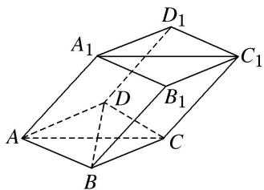

[例3] 如图所示，在四棱锥 $P - ABCD$ 中，平面 $PAD \perp$ 平面 $ABCD$ ， $PA \perp PD$ ， $PA = PD$ ， $AB \perp AD$ ， $AB = 1$ ， $AD = 2$ ， $AC = CD = \sqrt{5}$  
（1）求证： $PD \perp$ 平面 PAB;  
（2）求直线 PB 与平面 PCD 所成角的正弦值;  
（3）在棱 $PA$ 上是否存在点 $M$ , 使得 $BM \parallel$ 平面 $PCD$ ? 若存在, 求 $\frac{AM}{AP}$ 的值; 若不存在, 说明理由.

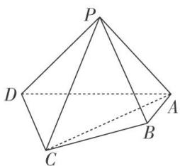

[例4] 在四棱锥 $P - ABCD$ 中， $PD \perp$ 底面 $ABCD$ ，底面 $ABCD$ 为正方形， $PD = DC$ ， $E$ ， $F$ 分别是 $AB$ ， $PB$ 的中点.  
（1）求证： $EF \perp CD;$  
（2）在平面 PAD 内是否存在一点 G，使 $GF \perp$ 平面 PCB？若存在，求出点 G 坐标；若不存在，试说明理由.

[例 5] 如图，正三角形 ABC 的边长为 4，CD 为 AB 边上的高，E，F 分别是 AC 和 BC 边的中点，现将 $\triangle ABC$ 沿 CD 翻折成直二面角 A-DC-B.  
（1）试判断直线 $AB$ 与平面 $DEF$ 的位置关系，并说明理由；  
（2）在线段 BC 上是否存在一点 P，使 $AP \perp DE$ ？如果存在，求出 $\frac{BP}{BC}$ 的值；如果不存在，请说明理由.

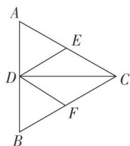

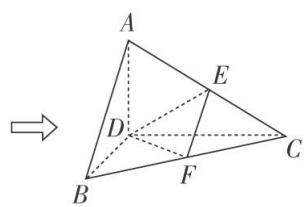

[例 6] (2019·北京)如图，在四棱锥 P-ABCD 中， $PA \perp$ 平面 ABCD， $AD \perp CD$ ， $AD \parallel BC$ ， $PA = AD = CD = 2$ ，BC = 3。E 为 PD 的中点，点 F 在 PC 上，且 $\frac{PF}{PC} = \frac{1}{3}$ 。  
（1）求证： $CD \perp$ 平面 PAD;  
（2）求二面角 F-AE-P 的余弦值;  
（3）设点 G 在 PB 上，且 $\frac{PG}{PB} = \frac{2}{3}$ . 判断直线 AG 是否在平面 AEF 内，说明理由.

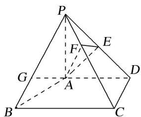

# 【对点训练】

1. 如图，在长方体 $ABCD - A_{1}B_{1}C_{1}D_{1}$ 中， $AA_{1} = AD = 1$ ， $E$ 为 $CD$ 的中点.  
（1）求证： $B_{1}E \perp AD_{1}$ ;  
（2）在棱 $AA_{1}$ 上是否存在一点P，使得DP//平面 $B_{1}AE$ ？若存在，求AP的长；若不存在，说明理由.

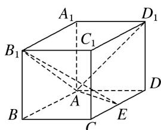

2. 如图，在各棱长均为 2 的三棱柱 $ABC - A_{1}B_{1}C_{1}$ 中，侧面 $A_{1}ACC_{1} \perp$ 底面 $ABC$ ， $\angle A_{1}AC = 60^{\circ}$ .  
（1）求侧棱 $AA_{1}$ 与平面 $AB_{1}C$ 所成角的正弦值的大小;  
（2）已知点 D 满足 $\overrightarrow{BD} = \overrightarrow{BA} + \overrightarrow{BC}$ ，在直线 $AA_{1}$ 上是否存在点 P，使 DP // 平面 $AB_{1}C$ ? 若存在，请确定点 P 的位置；若不存在，请说明理由.

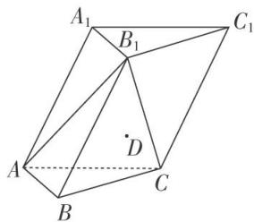

3. 如图所示, 四棱锥 $S - ABCD$ 的底面是正方形, 每条侧棱的长都是底面边长的 $\sqrt{2}$ 倍, 点 $P$ 为侧棱 $SD$ 上的点.  
（1）求证： $AC \perp SD;$  
（2）若 $SD \perp$ 平面 $PAC$ , 则侧棱 $SC$ 上是否存在一点 $E$ , 使得 $BE \parallel$ 平面 $PAC$ . 若存在, 求 $SE:EC$ 的值; 若不存在, 试说明理由.

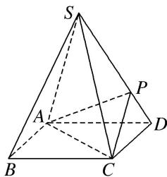

4. 如图所示，在四棱柱 $ABCD - A_{1}B_{1}C_{1}D_{1}$ 中，侧棱 $A_{1}A \perp$ 底面 $ABCD$ ， $AB \perp AC$ ， $AB = 1$ ， $AC = AA_{1} = 2$ ， $AD = CD = \sqrt{5}$ ， $E$ 为棱 $AA_{1}$ 上的点，且 $AE = \frac{1}{2}$ .  
（1）求证： $BE \perp$ 平面 $ACB_{1}$ ;  
（2）求二面角 $D_{1} - AC - B_{1}$ 的余弦值；  
（3）在棱 $A_{1}B_{1}$ 上是否存在点 $F$ ，使得直线 $DF \parallel$ 平面 $ACB_{1}$ ? 若存在，求 $A_{1}F$ 的长；若不存在，请说明理由.

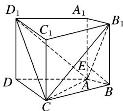

5. 在四棱锥 $P - ABCD$ 中， $AB \perp AD$ ， $CD \perp AD$ ， $PA \perp$ 底面 $ABCD$ ， $PA = AD = CD = 2AB = 2$ ， $M$ 为 $PC$ 的中点.  
（1）求证： $BM \parallel$ 平面 PAD;  
（2）平面 PAD 内是否存在一点 N，使 $MN \perp$ 平面 PBD？若存在，确定 N 的位置；若不存在，说明理由.

6. 如图所示，在正方体 $ABCD-A_{1}B_{1}C_{1}D_{1}$ 中，点 O 是 AC 与 BD 的交点，点 E 是线段 $OD_{1}$ 上的一点.  
（1）若点 $E$ 为 $OD_{1}$ 的中点，求直线 $OD_{1}$ 与平面 $CDE$ 所成角的正弦值；  
（2）是否存在点 $E$ ，使得平面 $CDE \perp$ 平面 $CD_{1}O$ ？若存在，请指出点 $E$ 的位置，并加以证明：若不存在，

请说明理由.

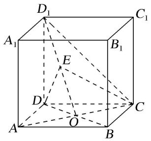

# 考点二 探究线面的数量关系

[例 1] 如图所示, 在四棱锥 P-ABCD 中, 侧面 PAD⊥底面 ABCD, 底面 ABCD 是平行四边形, $\angle ABC = 45^{\circ}$ , AD = AP = 2, $AB = DP = 2\sqrt{2}$ , E 为 CD 的中点, 点 F 在线段 PB 上.  
（1）求证： $AD \perp PC;$   
（2）试确定点 F 的位置，使得直线 EF 与平面 PDC 所成的角和直线 EF 与平面 ABCD 所成的角相等.

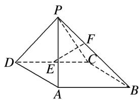

[例 2] 在 Rt△ABC 中，∠C=90°，AC=4，BC=2，E 是 AC 的中点，F 是线段 AB 上一个动点，且 $\overrightarrow{AF} = \lambda \overrightarrow{AB} (0 < \lambda < 1)$ ，如图所示，沿 BE 将 △CEB 翻折至 △DEB 的位置，使得平面 DEB ⊥ 平面 ABE.  
（1）当 $\lambda=\frac{1}{3}$ 时，证明： $BD\perp$ 平面DEF；  
（2）是否存在 $\lambda$ ，使得 $DF$ 与平面 $ADE$ 所成角的正弦值是 $\frac{\sqrt{2}}{3}$ ？若存在，求出 $\lambda$ 的值；若不存在，请说明理由.

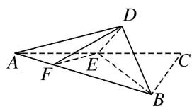

[例3] 如图，正三角形 $ABE$ 与菱形 $ABCD$ 所在的平面互相垂直， $AB = 2$ ， $\angle ABC = 60^{\circ}$ ， $M$ 是 $AB$ 的中点.  
（1）求证： $EM \perp AD;$   
（2）求二面角 A-BE-C 的余弦值;  
（3）在线段 $EC$ 上是否存在点 $P$ , 使得直线 $AP$ 与平面 $ABE$ 所成的角为 $45^{\circ}$ , 若存在, 求出 $\frac{EP}{EC}$ 的值; 若不存在, 说明理由.

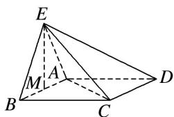

[例4] 如图，在直三棱柱 $ABC - A_{1}B_{1}C_{1}$ 中， $\triangle ABC$ 是等腰直角三角形， $\angle ACB = 90^{\circ}$ ， $AB = 4\sqrt{2}$ ， $M$ 是 $AB$ 的中点，且 $A_{1}M \perp B_{1}C$ .  
（1）求 $A_{1}A$ 的长;  
（2）已知点 $N$ 在棱 $CC_{1}$ 上，若平面 $B_{1}AN$ 与平面 $BCC_{1}B_{1}$ 夹角的余弦值为 $\frac{\sqrt{10}}{10}$ ，试确定点 $N$ 的位置.

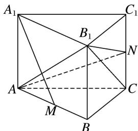

[例 5] 如图所示，在梯形 ABCD 中， $AB \parallel CD$ ， $AD = DC = CB = 1$ ， $\angle BCD = 120^{\circ}$ ，四边形 BFED 是以 BD 为直角腰的直角梯形，DE = 2BF = 2，平面 BFED ⊥ 平面 ABCD.  
（1）求证： $AD \perp$ 平面BFED；  
（2）在线段 EF 上是否存在一点 P, 使得平面 PAB 与平面 ADE 所成的锐二面角的余弦值为 $\frac{5\sqrt{7}}{28}$ ? 若存在, 求出点 P 的位置; 若不存在, 说明理由.

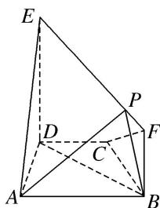

[例 6] 如图所示，在梯形 ABCD 中， $AB \parallel CD$ ， $\angle BCD = 120^{\circ}$ ，四边形 ACFE 为矩形，且 $CF \perp$ 平面 ABCD，AD = CD = BC = CF.  
（1）求证： $EF \perp$ 平面 BCF:  
（2）点 M 在线段 EF 上运动, 当点 M 在什么位置时, 平面 MAB 与平面 FCB 所成的锐二面角最大, 并求此时二面角的余弦值.

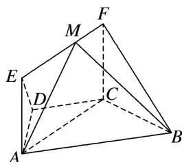

[例 7] 如图，在四棱锥 P-ABCD 中， $PA \perp$ 平面 ABCD， $AD \parallel BC$ ， $AD \perp CD$ ，且 $AD = CD = \sqrt{2}$ ， $BC = 2\sqrt{2}$ ，PA = 2.  
（1）取 $PC$ 的中点 $N$ , 求证: $DN \parallel$ 平面 $PAB$ ;  
（2）求直线 $AC$ 与 $PD$ 所成角的余弦值；  
（3）在线段 $PD$ 上, 是否存在一点 $M$ , 使得平面 $MAC$ 与平面 $ACD$ 的夹角为 $45^{\circ}$ ? 如果存在, 求出 $BM$ 与平面 $MAC$ 所成角的大小; 如果不存在, 请说明理由.

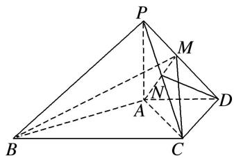

[例8] 如图所示，正方形 $AA_{1}D_{1}D$ 与矩形ABCD所在平面互相垂直， $AB = 2AD = 2$ ，点 $E$ 为 $AB$ 的中点.  
（1）求证： $BD_{1} \parallel$ 平面 $A_{1}DE;$  
（2）设在线段 $AB$ 上存在点 $M$ ，使二面角 $D_{1} - MC - D$ 的大小为 $\frac{\pi}{6}$ ，求此时 $AM$ 的长及点 $E$ 到平面 $D_{1}MC$ 的距离.

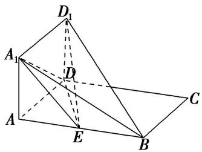

# 【对点训练】

1. 如图，已知在长方体 $ABCD - A_{1}B_{1}C_{1}D_{1}$ 中， $AD = AA_{1} = 1$ ， $AB = 2$ ，点 $E$ 在棱 $AB$ 上移动.  
（1）求证： $D_{1}E \perp A_{1}D;$  
（2）在棱 $AB$ 上是否存在点 $E$ 使得 $AD_{1}$ 与平面 $D_{1}EC$ 所成的角为 $\frac{\pi}{6}$ ? 若存在, 求出 $AE$ 的长, 若不存在,说明理由.

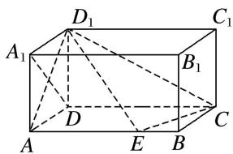

2. 等边 $\triangle ABC$ 的边长为 3，点 $D, E$ 分别是 $AB, AC$ 上的点，且满足 $\frac{AD}{DB} = \frac{CE}{EA} = \frac{1}{2}$ (如图①)，将 $\triangle ADE$ 沿 $DE$ 折起到 $\triangle A_{1}DE$ 的位置，使二面角 $A_{1} - DE - B$ 成直二面角，连接 $A_{1}B, A_{1}C$ (如图②).  
（1）求证： $A_{1}D \perp$ 平面 BCED;  
（2）在线段 BC 上是否存在点 P，使直线 $PA_{1}$ 与平面 $A_{1}BD$ 所成的角为 $60^{\circ}$ ？若存在，求出 PB 的长；若不存在，请说明理由.

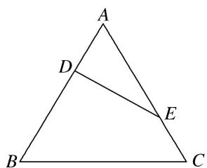

图①

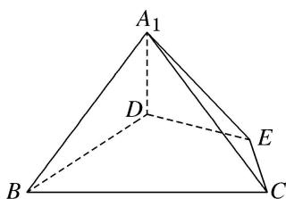

图②

3. 如图，在四棱锥 P-ABCD 中，底面 ABCD 是平行四边形， $AB=AC=2,\quad AD=2\sqrt{2},\quad PB=\sqrt{2},\quad PB\perp AC.$  
（1）求证：平面 $PAB \perp$ 平面 PAC;  
（2）若 $\angle PBA=45^{\circ}$ , 试判断棱 $PA$ 上是否存在与点 $P$ , $A$ 不重合的点 $E$ , 使得直线 $CE$ 与平面 $PBC$ 所成角的正弦值为 $\frac{\sqrt{6}}{9}$ ? 若存在, 求出 $\frac{AE}{AP}$ 的值; 若不存在, 请说明理由.

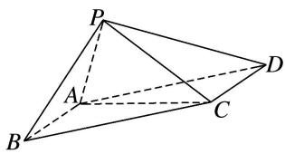

4. 如图，在四棱锥 $P - ABCD$ 中，底面 $ABCD$ 是边长为 4 的正方形， $\triangle PAD$ 是正三角形， $CD \perp$ 平面 $PAD$ ， $E, F, G, O$ 分别是 $PC, PD, BC, AD$ 的中点.  
（1）求证： $PO \perp$ 平面 ABCD;  
（2）求平面 EFG 与平面 ABCD 所成锐二面角的大小;  
（3）在线段 $PA$ 上是否存在点 $M$ , 使得直线 $GM$ 与平面 $EFG$ 所成角为 $\frac{\pi}{6}$ , 若存在, 求线段 $PM$ 的长度; 若不存在, 说明理由.

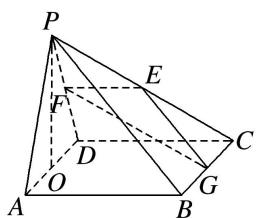

5. 如图，已知直三棱柱 $ABC - A_{1}B_{1}C_{1}$ 中， $AA_{1} = AB = AC = 1$ ， $AB \perp AC$ ， $M$ ， $N$ ， $Q$ 分别是 $CC_{1}$ ， $BC$ ， $AC$ 的中点，点 $P$ 在直线 $A_{1}B_{1}$ 上运动，且 $\vec{A_{1}P} = \lambda \vec{A_{1}B_{1}} (\lambda \in [0, 1])$ .  
（1）证明：无论 $\lambda$ 取何值，总有 $AM\perp$ 平面PNO;  
（2）是否存在点 P，使得平面 PMN 与平面 ABC 的夹角为 $60^{\circ}$ ? 若存在，试确定点 P 的位置，若不存在，请说明理由.

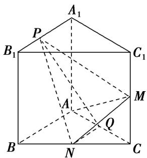

6. 如图所示的几何体由平面 PECF 截棱长为 2 的正方体得到, 其中 $P$ , $C$ 为原正方体的顶点, $E$ , $F$ 为原正方体侧棱长的中点, 正方形 ABCD 为原正方体的底面, $G$ 为棱 BC 上的动点.  
（1）求证：平面 $APC \perp$ 平面 PECF;  
（2）设 $\overrightarrow{BG}=\lambda\overrightarrow{BC}(0\leq\lambda\leq1)$ ，当 $\lambda$ 为何值时，平面EFG与平面ABCD所成的角为 $\frac{\pi}{3}$ ?

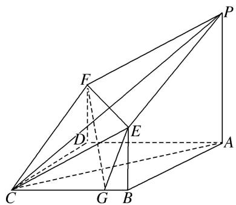

7. 如图，在四棱锥 $P - ABCD$ 中， $AB \parallel DC$ ， $\angle ADC = \frac{\pi}{2}$ ， $AB = AD = \frac{1}{2} CD = 2$ ， $PD = PB = \sqrt{6}$ ， $PD \perp BC$ .  
（1）求证：平面PBD|平面PBC:  
（2）在线段 $PC$ 上是否存在点 $M$ , 使得平面 $ABM$ 与平面 $PBD$ 的夹角为 $\frac{\pi}{3}$ ? 若存在, 求出 $\frac{CM}{CP}$ 的值; 若不存在, 请说明理由.

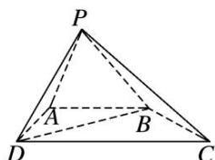

8. 已知在四棱锥 $P - ABCD$ 中, 平面 $PDC \perp$ 平面 $ABCD$ , $AD \perp DC$ , $AB \parallel CD$ , $AB = 2$ , $DC = 4$ , $E$ 为 $PC$ 的中点, $PD = PC$ , $BC = 2\sqrt{2}$ .  
（1）求证：BE//平面 PAD:  
（2）若 $PB$ 与平面 $ABCD$ 所成角为 $45^{\circ}$ , 点 $P$ 在平面 $ABCD$ 上的射影为 $O$ , 问: $BC$ 上是否存在一点 $F$ , 使平面 $POF$ 与平面 $PAB$ 所成的角为 $60^{\circ}$ ? 若存在, 试求点 $F$ 的位置; 若不存在, 请说明理由.

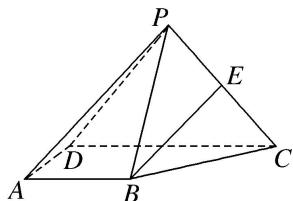

9. 如图，在四棱锥 $P - ABCD$ 中， $PA \perp$ 平面 $ABCD$ ， $AD \parallel BC$ ， $AD \perp CD$ ，且 $AD = CD = 2\sqrt{2}$ ， $BC = 4\sqrt{2}$ ， $PA = 2$ .  
（1）求证： $AB \perp PC$ ;  
（2）在线段 $PD$ 上, 是否存在一点 $M$ , 使得二面角 $M - AC - D$ 的大小为 $45^{\circ}$ , 如果存在, 求 $BM$ 与平面 $MAC$ 所成角的正弦值, 如果不存在, 请说明理由.

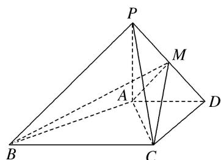

10. 如图所示，在四棱锥 $P - ABCD$ 中，侧面 $PAD \perp$ 底面 $ABCD$ ，侧棱 $PA = PD = \sqrt{2}$ ， $PA \perp PD$ ，底面 $ABCD$ 为直角梯形，其中 $BC \parallel AD$ ， $AB \perp AD$ ， $AB = BC = 1$ ， $O$ 为 $AD$ 的中点.  
（1）求直线 $PB$ 与平面 $POC$ 所成角的余弦值;  
（2）求 B 点到平面 PCD 的距离;  
（3）线段 PD 上是否存在一点 Q，使得二面角 Q-AC-D 的余弦值为 $\frac{\sqrt{6}}{3}$ ？若存在，求出 $\frac{PQ}{QD}$ 的值；若不存在，请说明理由.

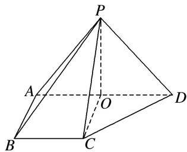

