# 专题14 利用空间向量解决立体几何中的探索性问题

# 【方法总结】

与空间向量有关的探究性问题主要有两类：一类是探究线面的位置关系的存在性问题，即线面的平行与垂直；另一类是探究线面的数量关系的存在性问题，即线面角或二面角满足特定要求时的存在性问题。
利用空间向量法解决立体几何中的探索性问题的思路：（1）根据题设条件中的垂直关系，建立适当的空间直角坐标系，将相关点、相关向量用坐标表示。（2）假设所求的点或参数存在，并用相关参数表示相关点的坐标，根据线、面满足位置关系、数量关系，构建方程(组)求解，若能求出参数的值且符合该限定的范围，则存在，否则不存在.

注意：在棱上探寻一点满足各种条件时，要明确思路，设点坐标，应用共线向量定理 $a = \lambda b (b \neq 0)$ ，利用向量相等，所求点坐标用 $\lambda$ 表示，再根据条件代入，注意 $\lambda$ 的范围.

# 【例题选讲】

# 考点一 探究线面的位置关系

[例1] 在直三棱柱 $ABC - A_{1}B_{1}C_{1}$ 中， $AC = 3$ ， $BC = 4$ ， $AB = 5$ ， $AA_{1} = 4$  
（1）求证： $AC \perp BC_{1}$ ;  
（2）请说明在 AB 上是否存在点 E，使得 $AC_{1} \parallel$ 平面 $CEB_{1}$ .
解析 （1）在直三棱柱 $ABC - A_{1}B_{1}C_{1}$ 中，因为 $AC = 3$ ， $BC = 4$ ， $AB = 5$ ，所以 $AC$ ， $BC$ ， $CC_{1}$ 两两垂直，以 $C$ 为坐标原点，直线 $CA$ ， $CB$ ， $CC_{1}$ 分别为 $x$ 轴， $y$ 轴， $z$ 轴建立如图所示的空间直角坐标系.
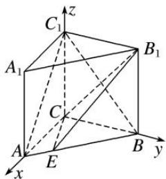
则 $C(0, 0, 0)$ ， $A(3, 0, 0)$ ， $C_{1}(0, 0, 4)$ ， $B(0, 4, 0)$ ， $B_{1}(0, 4, 4)$ .
因为 $\overrightarrow{AC}=(-3,0,0)$ ， $\overrightarrow{BC_{1}}=(0,-4,4)$ ，所以 $\overrightarrow{AC}\cdot\overrightarrow{BC_{1}}=0$ ，所以 $\overrightarrow{AC}\perp\overrightarrow{BC_{1}}$ ，即 $AC\perp BC_{1}$ .  
（2）假设在 $AB$ 上存在点 $E$ ，使得 $AC_1 //$ 平面 $CEB_1$ ，设 $\overrightarrow{AE} = t\overrightarrow{AB} = (-3t, 4t, 0)$ ，其中 $0 \leqslant t \leqslant 1$ .
则 $E(3-3t, 4t, 0)$ ， $\overrightarrow{B_{1}E}=(3-3t, 4t-4, -4)$ ， $\overrightarrow{B_{1}C}=(0, -4, -4)$ .
又因为 $\overrightarrow{AC_{1}}=m\overrightarrow{B_{1}E}+n\overrightarrow{B_{1}C}$ 成立，所以 $m(3-3t)=-3,\quad m(4t-4)-4n=0,\quad-4m-4n=4$ ，解得 $t=\frac{1}{2}$ .
所以在 AB 上存在点 E，使得 $AC_{1} \parallel$ 平面 $CEB_{1}$ ，这时点 E 为 AB 的中点.

[例 2] 如图，棱柱 $ABCD-A_{1}B_{1}C_{1}D_{1}$ 的所有棱长都等于 2， $\angle ABC$ 和 $\angle A_{1}AC$ 均为 $60^{\circ}$ ，平面 $AA_{1}C_{1}C \perp$ 平面 ABCD.  
（1）求证： $BD \perp AA_{1}$ ;  
（2）在直线 $CC_1$ 上是否存在点 $P$ ，使 $BP \parallel$ 平面 $DA_1C_1$ ，若存在，求出点 $P$ 的位置；若不存在，请说明理由.

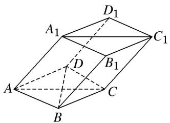

解析 （1）设 BD 与 AC 交于点 O，则 $BD \perp AC$ ，连接 $A_{1}O$ ，
在 $\triangle AA_{1}O$ 中， $AA_{1}=2,\quad AO=1,\quad\angle A_{1}AO=60^{\circ},\quad\therefore A_{1}O^{2}=AA_{1}^{2}+AO^{2}-2AA_{1}\cdot AO\cos60^{\circ}=3,$
$\therefore A O ^ {2} + A _ {1} O ^ {2} = A A _ {1} ^ {2}, \quad \therefore A _ {1} O \perp A O.$
由于平面 $AA_{1}C_{1}C \perp$ 平面 ABCD，且平面 $AA_{1}C_{1}C \cap$ 平面 ABCD = AC， $A_{1}O \subset$ 平面 $AA_{1}C_{1}C$ ，
$\therefore A_{1}O \perp$ 平面 $ABCD$ 。以 $OB, OC, OA_{1}$ 所在直线分别为 $x$ 轴， $y$ 轴， $z$ 轴，建立如图所示的空间直角坐标系，则 $A(0, -1, 0), B(\sqrt{3}, 0, 0), C(0, 1, 0), D(-\sqrt{3}, 0, 0), A_{1}(0, 0, \sqrt{3}), C_{1}(0, 2, \sqrt{3})$ 。
由于 $\overrightarrow{BD} = (-2\sqrt{3}, 0, 0)$ , $\overrightarrow{AA_1} = (0, 1, \sqrt{3})$ , $\overrightarrow{AA_1} \cdot \overrightarrow{BD} = 0 \times (-2\sqrt{3}) + 1 \times 0 + \sqrt{3} \times 0 = 0$ ,
$\therefore\overrightarrow{BD}\perp\overrightarrow{AA_{1}}$ ，即 $BD\perp AA_{1}$ .

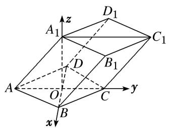  
（2）假设在直线 $CC_{1}$ 上存在点 P，使 $BP \parallel$ 平面 $DA_{1}C_{1}$ ,
设 $\overrightarrow{CP} = \lambda \overrightarrow{CC_1}$ ， $P(x,y,z)$ ，则 $(x,y - 1,z) = \lambda (0,1,\sqrt{3})$
从而有 $P(0, 1 + \lambda, \sqrt{3}\lambda)$ ， $\overrightarrow{BP}=(-\sqrt{3}, 1 + \lambda, \sqrt{3}\lambda)$ .
设平面 $DA_{1}C_{1}$ 的法向量为 $n_{3}=(x_{3}, y_{3}, z_{3})$ ，则 $\left\{\begin{aligned}n_{3}\perp A_{1}\overrightarrow{C_{1}},\\ n_{3}\perp\overrightarrow{DA_{1}},\end{aligned}\right.$
又 $\overrightarrow{A_{1}C_{1}}=(0,2,0)$ ， $\overrightarrow{DA_{1}}=(\sqrt{3},0,\sqrt{3})$ ，则 $\left\{\begin{aligned}&2y_{3}=0,\\&\sqrt{3}x_{3}+\sqrt{3}z_{3}=0,\end{aligned}\right.$

取 $n_{3}=(1,0,-1)$ ，因为 $BP \parallel$ 平面 $DA_{1}C_{1}$ ，则 $n_{3} \perp \overrightarrow{BP}$ ，即 $n_{3} \cdot \overrightarrow{BP} = -\sqrt{3} - \sqrt{3}\lambda = 0$ ，得 $\lambda = -1$ ，
即点 P 在 $C_{1}C$ 的延长线上，且 $C_{1}C = CP$ .

[例 3] 如图所示，在四棱锥 P-ABCD 中，平面 PAD⊥平面 ABCD，PA⊥PD，PA=PD，AB⊥AD，AB=1，AD=2，AC=CD= $\sqrt{5}$ .  
（1）求证： $PD \perp$ 平面 PAB;  
（2）求直线 PB 与平面 PCD 所成角的正弦值;  
（3）在棱 $PA$ 上是否存在点 $M$ , 使得 $BM \parallel$ 平面 $PCD$ ? 若存在, 求 $\frac{AM}{AP}$ 的值; 若不存在, 说明理由.

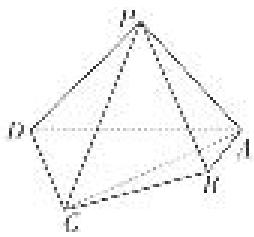

解析 （1）因为平面 $PAD \perp$ 平面ABCD，平面 $PAD \cap$ 平面ABCD=AD， $AB \perp AD$ ，
所以 $AB \perp$ 平面 PAD，所以 $AB \perp PD$ 。又因为 $PA \perp PD$ ， $PA \cap AB = A$ ，所以 $PD \perp$ 平面 PAB。  
（2）取 AD 的中点 O，连接 PO，CO．因为 PA=PD，所以 $PO \perp AD$ ．又因为 $PO \subset$ 平面 PAD，

平面 $PAD \perp$ 平面 ABCD，平面 $PAD \cap$ 平面 ABCD = AD，所以 $PO \perp$ 平面 ABCD.
因为 $CO \subset$ 平面ABCD，所以 $PO \perp CO$ 。因为 $AC = CD$ ，所以 $CO \perp AD$ 。
如图，建立空间直角坐标系 Oxyz.

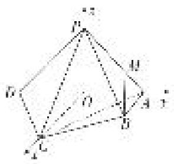
由题意得， $A(0, 1, 0)$ ， $B(1, 1, 0)$ ， $C(2, 0, 0)$ ， $D(0, -1, 0)$ ， $P(0, 0, 1)$ .
则 $P\vec{D}=(0,-1,-1)$ ， $P\vec{C}=(2,0,-1)$ .
设平面 PCD 的法向量为 $\boldsymbol{n}=(x,y,z)$ ，则 $\left\{\begin{aligned}\boldsymbol{n}\cdot\vec{P}\vec{D}&=0,\\ \boldsymbol{n}\cdot\vec{P}\vec{C}&=0,\end{aligned}\right.$ 即 $\left\{\begin{aligned}-y-z&=0,\\ 2x-z&=0.\end{aligned}\right.$
令 z=2，则 x=1，y=-2，所以 $n=(1,-2,2)$ .
又 $\overrightarrow{PB} = (1, 1, -1)$ ，所以 $\cos < n$ ， $\overrightarrow{PB} > = \frac{n \cdot \overrightarrow{PB}}{|n||\overrightarrow{PB}|} = -\frac{\sqrt{3}}{3}$ ，
所以直线 $PB$ 与平面 $PCD$ 所成角的正弦值为 $\frac{\sqrt{3}}{3}$ .  
（3）设棱 PA 上存在点 M，使得 $BM \parallel$ 平面 PCD，则存在 $\lambda \in [0, 1]$ 使得 $\overrightarrow{AM} = \lambda \overrightarrow{AP}$ .
因此点 $M(0, 1 - \lambda, \lambda)$ ， $\overrightarrow{BM} = (-1, -\lambda, \lambda)$ 。因为 $BM \parallel$ 平面 PCD，
所以 $\overrightarrow{BM}\cdot n=0$ ，即 $(-1,-\lambda,\lambda)\cdot(1,-2,2)=0$ ，解得 $\lambda=\frac{1}{4}$ .
所以在棱 PA 上存在点 M 使得 BM // 平面 PCD，此时 $\frac{AM}{AP} = \frac{1}{4}$ .

[例 4] 在四棱锥 P-ABCD 中， $PD \perp$ 底面 ABCD，底面 ABCD 为正方形，PD=DC，E，F 分别是 AB，PB 的中点.  
（1）求证： $EF \perp CD;$  
（2）在平面 PAD 内是否存在一点 G，使 $GF \perp$ 平面 PCB？若存在，求出点 G 坐标；若不存在，试说明理由.
解析 （1）由题意知，DA, DC, DP 两两垂直．如图，以 DA, DC, DP 所在直线分别为 x 轴，y 轴，z 轴建立空间直角坐标系，设 AD=a，则 D(0, 0, 0)，A(a, 0, 0)，B(a, a, 0)，C(0, a, 0)， $E\left[a, \frac{a}{2}, 0\right]$ ， $P(0, 0, a)$ ， $F\left(\frac{a}{2}, \frac{a}{2}, \frac{a}{2}\right)$ 。 $\overrightarrow{EF}=\left(-\frac{a}{2}, 0, \frac{a}{2}\right)$ ， $\overrightarrow{DC}=(0, a, 0)$ 。 $\because \overrightarrow{EF} \cdot \overrightarrow{DC}=0$ ， $\therefore \overrightarrow{EF} \perp \overrightarrow{DC}$ ，从而得 $EF \perp CD$ 。
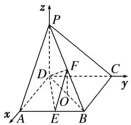  
（2）假设存在满足条件的点 $G$ ，设 $G(x,0,z)$ ，则 $\overrightarrow{FG} = \left(x - \frac{a}{2}, - \frac{a}{2},z - \frac{a}{2}\right),$
若使 $GF \perp$ 平面 PCB，则由 $\overrightarrow{FG} \cdot \overrightarrow{CB} = \left( x - \frac{a}{2}, -\frac{a}{2}, z - \frac{a}{2} \right) \cdot (a, 0, 0) = a \left( x - \frac{a}{2} \right) = 0$ ，得 $x = \frac{a}{2}$ ;
由 $\overrightarrow{FG} \cdot \overrightarrow{CP} = \left[ x - \frac{a}{2}, -\frac{a}{2}, z - \frac{a}{2} \right] \cdot (0, -a, a) = \frac{a^2}{2} + a \left[ z - \frac{a}{2} \right] = 0$ ，得 $z = 0$ .
∴ G 点坐标为 $\left[\frac{a}{2}, 0, 0\right]$ ，故存在满足条件的点 G，且点 G 为 AD 的中点.

[例 5] 如图，正三角形 ABC 的边长为 4，CD 为 AB 边上的高，E，F 分别是 AC 和 BC 边的中点，现将 $\triangle ABC$ 沿 CD 翻折成直二面角 A-DC-B.  
（1）试判断直线 AB 与平面 DEF 的位置关系，并说明理由；  
（2）在线段 BC 上是否存在一点 P，使 $AP \perp DE$ ？如果存在，求出 $\frac{BP}{BC}$ 的值；如果不存在，请说明理由.

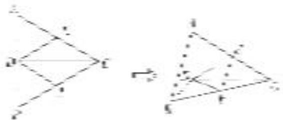

解析 （1） $AB \parallel$ 平面 $DEF$ . 理由如下:
在 $\triangle ABC$ 中，由 $E$ ， $F$ 分别是 $AC$ ， $BC$ 的中点，得 $EF//AB$ .
又因为 $AB \not\subset$ 平面 DEF， $EF \subset$ 平面 DEF，所以 $AB \parallel$ 平面 DEF.

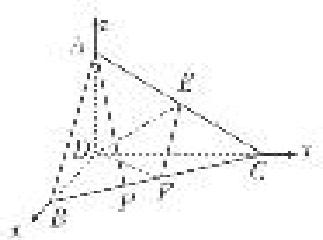  
（2）以点 D 为坐标原点，直线 DB, DC, DA 分别为 x 轴、y 轴、z 轴，建立空间直角坐标系(如图所示)，则 $D(0, 0, 0)$ ， $A(0, 0, 2)$ ， $B(2, 0, 0)$ ， $C(0, 2\sqrt{3}, 0)$ ， $E(0, \sqrt{3}, 1)$ ，故 $\overrightarrow{DE} = (0, \sqrt{3}, 1)$ .
假设存在点 $P(x, y, 0)$ 满足条件，则 $\overrightarrow{AP} = (x, y, -2)$ ， $\overrightarrow{AP} \cdot \overrightarrow{DE} = \sqrt{3}y - 2 = 0$ ，所以 $y = \frac{2\sqrt{3}}{3}$ .
又 $\vec{BP} = (x - 2, y, 0)$ , $\vec{PC} = (-x, 2\sqrt{3} - y, 0)$ , $\vec{BP} // \vec{PC}$ ,
所以 $(x-2)(2\sqrt{3}-y)=-xy$ ，所以 $\sqrt{3}x+y=2\sqrt{3}$ 。把 $y=\frac{2\sqrt{3}}{3}$ 代入上式得 $x=\frac{4}{3}$ ，所以 $\overrightarrow{BP}=\frac{1}{3}\overrightarrow{BC}$ ，
所以在线段 BC 上存在点 P 使 $AP \perp DE$ ，此时 $\frac{BP}{BC} = \frac{1}{3}$ .

[例 6] (2019·北京)如图，在四棱锥 P-ABCD 中，PA⊥平面 ABCD，AD⊥CD，AD∥BC，PA=AD=CD=2，BC=3。E 为 PD 的中点，点 F 在 PC 上，且 $\frac{PF}{PC}=\frac{1}{3}$ .  
（1）求证： $CD \perp$ 平面 PAD;  
（2）求二面角 F-AE-P 的余弦值;  
（3）设点 G 在 PB 上，且 $\frac{PG}{PB} = \frac{2}{3}$ . 判断直线 AG 是否在平面 AEF 内，说明理由.

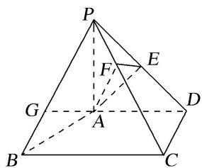

解析 （1）因为 $PA \perp$ 平面ABCD， $CD \subset$ 平面ABCD，所以 $PA \perp CD$ .
又因为 $AD \perp CD$ ， $PA \cap AD = A$ ，PA， $AD \subset$ 平面 PAD，所以 $CD \perp$ 平面 PAD.  
（2）过点 A 作 AD 的垂线交 BC 于点 M. 因为 PA⊥平面 ABCD, AM, AD⊂平面 ABCD,
所以 $PA \perp AM$ ， $PA \perp AD$ 。建立如图所示的空间直角坐标系 A-xyz，
则 $A(0, 0, 0)$ ， $B(2, -1, 0)$ ， $C(2, 2, 0)$ ， $D(0, 2, 0)$ ， $P(0, 0, 2)$ .

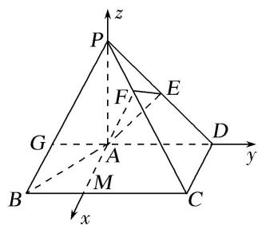
因为 E 为 PD 的中点，所以 $E(0, 1, 1)$ 。所以 $\overrightarrow{AE} = (0, 1, 1)$ ， $\overrightarrow{PC} = (2, 2, -2)$ ， $\overrightarrow{AP} = (0, 0, 2)$ 。
所以 $\overrightarrow{PF}=\frac{1}{3}\overrightarrow{PC}=\left(\frac{2}{3},\frac{2}{3},-\frac{2}{3}\right)$ ，所以 $\overrightarrow{AF}=\overrightarrow{AP}+\overrightarrow{PF}=\left(\frac{2}{3},\frac{2}{3},\frac{4}{3}\right)$ .
设平面 AEF 的法向量为 $\boldsymbol{n}=(x,y,z)$ ，则 $\left\{\begin{aligned}\boldsymbol{n}\cdot\overrightarrow{AE}=0,\\ \boldsymbol{n}\cdot\overrightarrow{AF}=0,\end{aligned}\right.$ 即 $\left\{\begin{aligned}y+z=0,\\ \frac{2}{3}x+\frac{2}{3}y+\frac{4}{3}z=0.\end{aligned}\right.$ 令 z=1，则 y=-1，x=-1.
于是 $n=(-1,-1,1)$ . 又因为平面 PAD 的一个法向量为 $p=(1,0,0)$ ,
所以 $\cos < n, p > = \frac{n \cdot p}{|n||p|} = -\frac{\sqrt{3}}{3}$ . 由题知，二面角 $F - AE - P$ 为锐角，所以其余弦值为 $\frac{\sqrt{3}}{3}$ .  
（3）直线 AG 在平面 AEF 内，理由如下：
因为点 G 在 PB 上，且 $\frac{PG}{PB} = \frac{2}{3}$ ， $\overrightarrow{PB} = (2, -1, -2)$ ，所以 $\overrightarrow{PG} = \frac{2}{3}\overrightarrow{PB} = \left(\frac{4}{3}, -\frac{2}{3}, -\frac{4}{3}\right)$ ,
所以 $\overrightarrow{AG} = \overrightarrow{AP} + \overrightarrow{PG} = \left(\frac{4}{3}, -\frac{2}{3}, \frac{2}{3}\right)$ . 由（2）知，平面 AEF 的一个法向量 $n = (-1, -1, 1)$ ，所以 $\overrightarrow{AG} \cdot n = -\frac{4}{3} + \frac{2}{3} + \frac{2}{3} = 0$ . 又点 $A \in$ 平面 AEF，所以直线 AG 在平面 AEF 内.

# 【对点训练】

1. 如图，在长方体 $ABCD - A_{1}B_{1}C_{1}D_{1}$ 中， $AA_{1} = AD = 1$ ， $E$ 为 $CD$ 的中点.  
（1）求证： $B_{1}E \perp AD_{1}$ ;  
（2）在棱 $AA_{1}$ 上是否存在一点P，使得DP//平面 $B_{1}AE$ ？若存在，求AP的长；若不存在，说明理由.

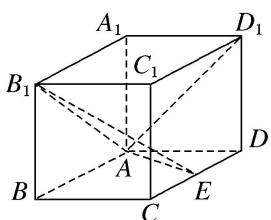

1. 解析 以 A 为原点, $\overrightarrow{AB}$ , $\overrightarrow{AD}$ , $\overrightarrow{AA_{1}}$ 的方向分别为 x 轴, y 轴, z 轴的正方向建立如图所示的空间直角坐标系. 设 AB = a.

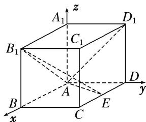  
（1） $A(0,0,0)$ , $D(0,1,0)$ , $D_{1}(0,1,1)$ , $E\left(\frac{a}{2},1,0\right)$ , $B_{1}(a,0,1)$ , 故 $\overrightarrow{AD_{1}}=(0,1,1)$ , $\overrightarrow{B_{1}E}=\left(-\frac{a}{2},1,-1\right)$ ,
因为 $\overrightarrow{B_{1}E}\cdot\overrightarrow{AD_{1}}=-\frac{a}{2}\times0+1\times1+(-1)\times1=0$ ，所以 $B_{1}E\perp AD_{1}$ .  
（2）假设在棱 $AA_{1}$ 上存在一点 $P(0, 0, z_{0})$ ，使得 $DP \parallel$ 平面 $B_{1}AE$ ，此时 $\overrightarrow{DP} = (0, -1, z_{0})$ ，再设平面 $B_{1}AE$ 的一个法向量为 $n = (x, y, z)$ ， $\overrightarrow{AB_{1}} = (a, 0, 1)$ ， $\overrightarrow{AE} = \begin{pmatrix} a \\ 2 \end{pmatrix}$ ， $1, 0$ 。因为 $n \perp$ 平面 $B_{1}AE$ ，所以 $n \perp \overrightarrow{AB_{1}}$ ，
$n \perp \overrightarrow{AE}$ ，得 $\left\{\begin{aligned} ax + z &= 0, \\ \frac{ax}{2} + y &= 0, \end{aligned}\right.$ 取 x = 1，得 $y = -\frac{a}{2}, z = -a$ ，得平面 $B_{1}AE$ 的一个法向量 $n = \begin{pmatrix} 1, & -\frac{a}{2}, & -a \end{pmatrix}$ 。要使 DP // 平面 $B_{1}AE$ ，只要 $n \perp \overrightarrow{DP}$ ，有 $\frac{a}{2} - az_{0} = 0$ ，解得 $z_{0} = \frac{1}{2}$ 。又 DP ∉ 平面 $B_{1}AE$ ，所以存在点 P，满足 DP // 平面 $B_{1}AE$ ，此时 $AP = \frac{1}{2}$ 。

2. 如图，在各棱长均为 2 的三棱柱 $ABC - A_{1}B_{1}C_{1}$ 中，侧面 $A_{1}ACC_{1} \perp$ 底面 $ABC$ ， $\angle A_{1}AC = 60^{\circ}$ .  
（1）求侧棱 $AA_{1}$ 与平面 $AB_{1}C$ 所成角的正弦值的大小;  
（2）已知点 D 满足 $\overrightarrow{BD} = \overrightarrow{BA} + \overrightarrow{BC}$ ，在直线 $AA_{1}$ 上是否存在点 P，使 DP // 平面 $AB_{1}C$ ? 若存在，请确定点 P 的位置；若不存在，请说明理由.

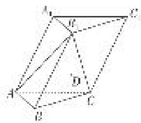

2. 解析 （1） 因为侧面 $A_{1}ACC_{1} \perp$ 底面 $ABC$ ，作 $A_{1}O \perp AC$ 于点 $O$ ，所以 $A_{1}O \perp$ 平面 $ABC$ ，所以 $A_{1}O \perp BO$ . 又 $\angle A_{1}AC = 60^{\circ}$ ，且各棱长均为 2，所以 $AO = 1$ ， $OA_{1} = OB = \sqrt{3}$ ， $BO \perp AC$ .
故以 O 为坐标原点，建立如图所示的空间直角坐标系 Oxyz,

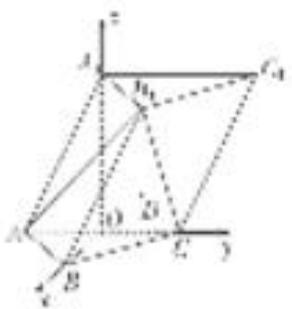
则 $A(0, -1, 0)$ ， $B(\sqrt{3}, 0, 0)$ ， $A_{1}(0, 0, \sqrt{3})$ ， $C(0, 1, 0)$ ， $B_{1}(\sqrt{3}, 1, \sqrt{3})$
所以 $\overrightarrow{AA_1} = (0, 1, \sqrt{3})$ , $\overrightarrow{AB_1} = (\sqrt{3}, 2, \sqrt{3})$ , $\overrightarrow{AC} = (0, 2, 0)$ .
设平面 $AB_{1}C$ 的一个法向量为 $\boldsymbol{n}=(x,y,1)$ ，则 $\left\{\begin{aligned}\boldsymbol{n}\cdot\overrightarrow{AB_{1}}&=\sqrt{3}x+2y+\sqrt{3}=0,\\ \boldsymbol{n}\cdot A\overrightarrow{C}&=2y=0,\end{aligned}\right.$ 解得 $\boldsymbol{n}=(-1,0,1)$ .
所以 $\cos<\overrightarrow{AA_{1}}$ ， $n>=\frac{\overrightarrow{AA_{1}}\cdot n}{|\overrightarrow{AA_{1}}||n|}=\frac{\sqrt{3}}{2\sqrt{2}}=\frac{\sqrt{6}}{4}.$
所以侧棱 $AA_{1}$ 与平面 $AB_{1}C$ 所成角的正弦值的大小为 $\frac{\sqrt{6}}{4}$ .  
（2）因为 $B\overrightarrow{D} = B\overrightarrow{A} + B\overrightarrow{C}$ ，而 $B\overrightarrow{A} = (-\sqrt{3}, -1, 0)$ ， $B\overrightarrow{C} = (-\sqrt{3}, 1, 0)$ ，所以 $B\overrightarrow{D} = (-2\sqrt{3}, 0, 0)$ .
又因为 $B(\sqrt{3}, 0, 0)$ ，所以点 D 的坐标为 $(- \sqrt{3}, 0, 0)$ .
假设存在点 P 符合题意，则其坐标可设为 $P(0, y, z)$ ，所以 $D \vec{P} = (\sqrt{3}, y, z)$ .
因为 $DP \parallel$ 平面 $AB_{1}C, n = (-1, 0, 1)$ 为平面 $AB_{1}C$ 的一个法向量，所以 $D\vec{P} \cdot n = 0$ ，即 $z = \sqrt{3}$ .
因为 $A\overrightarrow{P} = (0, y + 1, z)$ ，则由 $A\overrightarrow{P} = \lambda A\overrightarrow{A_1}$ 得 $\begin{cases} y + 1 = \lambda, \\ \sqrt{3} = \lambda \sqrt{3}, \end{cases}$ 所以 $y = 0$ .
又 DP $\nmid$ 平面 $AB_{1}C$ ，故存在点 P，使 DP // 平面 $AB_{1}C$ ，其坐标为 $(0, 0, \sqrt{3})$ ，即恰好为点 $A_{1}$ .

3. 如图所示, 四棱锥 $S - ABCD$ 的底面是正方形, 每条侧棱的长都是底面边长的 $\sqrt{2}$ 倍, 点 $P$ 为侧棱 $SD$ 上的点.  
（1）求证： $AC \perp SD;$  
（2）若 $SD \perp$ 平面 $PAC$ , 则侧棱 $SC$ 上是否存在一点 $E$ , 使得 $BE \parallel$ 平面 $PAC$ . 若存在, 求 $SE:EC$ 的值; 若不存在, 试说明理由.

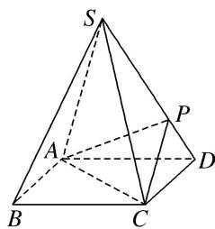

3. 解析 （1）连接 $BD$ ，设 $AC$ 交 $BD$ 于点 $O$ ，则 $AC \perp BD$ 。连接 $SO$ ，由题意知 $SO \perp$ 平面 $ABCD$ 。

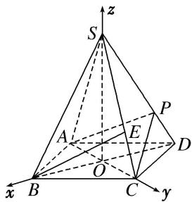

以 O 为坐标原点， $\overrightarrow{OB},\overrightarrow{OC},\overrightarrow{OS}$ 所在直线分别为 x 轴，y 轴，z 轴，建立空间直角坐标系，如图.

底面边长为 a，则高 $SO=\frac{\sqrt{6}}{2}a$ ，于是 $S\left(0,0,\frac{\sqrt{6}}{2}a\right)$ ， $D\left[-\frac{\sqrt{2}}{2}a,0,0\right)$ ， $B\left(\frac{\sqrt{2}}{2}a,0,0\right)$ ， $C\left(0,\frac{\sqrt{2}}{2}a,0\right)$ ，$\overrightarrow{OC} = \left(0, \frac{\sqrt{2}}{2} a, 0\right), \overrightarrow{SD} = \left(-\frac{\sqrt{2}}{2} a, 0, -\frac{\sqrt{6}}{2} a\right)$ ，则 $\overrightarrow{OC} \cdot \overrightarrow{SD} = 0$ 。故 $OC \perp SD$ 。从而 $AC \perp SD$ 。  
（2）棱 SC 上存在一点 E，使 BE// 平面 PAC. 理由如下：
由已知条件知 $\overrightarrow{DS}$ 是平面 $PAC$ 的一个法向量，且 $\overrightarrow{DS} = \left[\frac{\sqrt{2}}{2} a, 0, \frac{\sqrt{6}}{2} a\right]$ ， $\overrightarrow{CS} = \left[0, -\frac{\sqrt{2}}{2} a, \frac{\sqrt{6}}{2} a\right]$ ,$\overrightarrow{BC} = \left(-\frac{\sqrt{2}}{2} a, \frac{\sqrt{2}}{2} a, 0\right)$ . 设 $\overrightarrow{CE} = t\overrightarrow{CS}$ , 则 $\overrightarrow{BE} = \overrightarrow{BC} + \overrightarrow{CE} = \overrightarrow{BC} + t\overrightarrow{CS}$
$= \left[-\frac{\sqrt{2}}{2} a, \frac{\sqrt{2}}{2} a, 1 - t, \frac{\sqrt{6}}{2} at\right]$ , 而 $\overrightarrow{BE} \cdot \overrightarrow{DS} = 0 \Rightarrow t = \frac{1}{3}$ .
即当 $SE:EC = 2:1$ 时， $\overrightarrow{BE}\bot \overrightarrow{DS}$ .而 $BE\notin$ 平面PAC，故 $BE / /$ 平面PAC.

4. 如图所示，在四棱柱 $ABCD - A_{1}B_{1}C_{1}D_{1}$ 中，侧棱 $A_{1}A \perp$ 底面 $ABCD, AB \perp AC, AB = 1, AC = AA_{1} = 2,$ $AD = CD = \sqrt{5}, E$ 为棱 $AA_{1}$ 上的点，且 $AE = \frac{1}{2}$ .  
（1）求证： $BE \perp$ 平面 $ACB_{1}$ ;  
（2）求二面角 $D_{1} - AC - B_{1}$ 的余弦值；  
（3）在棱 $A_{1}B_{1}$ 上是否存在点 $F$ ，使得直线 $DF \parallel$ 平面 $ACB_{1}$ ？若存在，求 $A_{1}F$ 的长；若不存在，请说明理由.

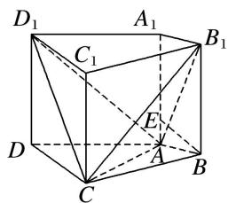

4. 解析 （1） 因为 $A_{1} A \perp$ 底面 $ABCD$ , 所以 $A_{1} A \perp AC$ .
又因为 $AB \perp AC, AA_{1} \cap AB = A$ ，且 $AA_{1}, AB \subset$ 平面 $ABB_{1}A_{1}$ ，所以 $AC \perp$ 平面 $ABB_{1}A_{1}$ ，
又因为 $BE \subset$ 平面 $ABB_{1}A_{1}$ ，所以 $AC \perp BE$ .
因为 $\frac{AE}{AB}=\frac{1}{2}=\frac{AB}{BB_{1}}$ ，所以 $\angle ABE=\angle AB_{1}B$ .
因为 $\angle BAB_{1} + \angle AB_{1}B = 90^{\circ}$ ，所以 $\angle BAB_{1} + \angle ABE = 90^{\circ}$ ，所以 $BE \perp AB_{1}$ .
又 $AB_{1} \cap AC = A$ ，且 $AB_{1}$ ， $AC \subset$ 平面 $ACB_{1}$ ，所以 $BE \perp$ 平面 $ACB_{1}$ .  
（2）如图，以 A 为原点建立空间直角坐标系 A-xyz，依题意可得 $A(0, 0, 0)$ ， $B(0, 1, 0)$ ， $C(2, 0, 0)$ ， $D(1, -2, 0)$ ， $D_{1}(1, -2, 2)$ ， $E\left[0, 0, \frac{1}{2}\right]$ 。由（1）知， $\vec{EB}=\left[0, 1, -\frac{1}{2}\right]$ 为平面 $ACB_{1}$ 的一个法向量。

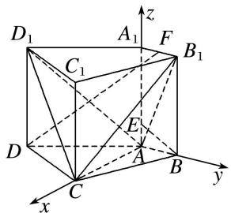
设 $n=(x, y, z)$ 为平面 $ACD_{1}$ 的法向量．因为 $\overrightarrow{AD_{1}}=(1, -2, 2)$ ， $\overrightarrow{AC}=(2, 0, 0)$ ，
所以 $\left\{ \begin{array}{l} n \cdot \overrightarrow{AD_1} = 0, \\ n \cdot \overrightarrow{AC} = 0, \end{array} \right.$ 即 $\left\{ \begin{array}{l} x - 2y + 2z = 0, \\ 2x = 0. \end{array} \right.$ 不妨设 $z = 1$ ，可得 $n = (0, 1, 1)$ .
因此 $\cos<n,\quad\overrightarrow{EB}=\frac{\boldsymbol{n}\cdot\overrightarrow{EB}}{|\boldsymbol{n}|\cdot|\overrightarrow{EB}|}=\frac{\sqrt{10}}{10}.$
由图可知二面角 $D_{1}-AC-B_{1}$ 为锐角，所以二面角 $D_{1}-AC-B_{1}$ 的余弦值为 $\frac{\sqrt{10}}{10}$ .  
（3）假设存在满足题意的点 F. 设 $A_{1}F = a (a > 0)$ ，则由（2）得 $F(0, a, 2)$ ， $\overrightarrow{DF} = (-1, a + 2, 2)$ .
由题意可知 $\overrightarrow{DF}\cdot\overrightarrow{EB}=(-1,a+2,2)\cdot\left(0,1,-\frac{1}{2}\right)=a+2-1=0$ ，解得a=-1(舍去)，
即直线 DF 的方向向量与平面 $ACB_{1}$ 的法向量不垂直.
所以，在棱 $A_{1}B_{1}$ 上不存在点 F，使得直线 $DF \parallel$ 平面 $ACB_{1}$ .

5. 在四棱锥 $P - ABCD$ 中, $AB \perp AD$ , $CD \perp AD$ , $PA \perp$ 底面 $ABCD$ , $PA = AD = CD = 2AB = 2$ , $M$ 为 $PC$ 的中点.  
（1）求证： $BM \parallel$ 平面 PAD;  
（2）平面 PAD 内是否存在一点 N，使 $MN \perp$ 平面 PBD？若存在，确定 N 的位置；若不存在，说明理由.

5. 解析 （1）以 $A$ 为原点, 以 $AB$ , $AD$ , $AP$ 所在直线分别为 $x$ 轴、 $y$ 轴、 $z$ 轴建立空间直角坐标系, 则 $B(1,0,0)$ , $D(0,2,0)$ , $P(0,0,2)$ , $C(2,2,0)$ , $M(1,1,1)$ ,

∵ $\overrightarrow{BM}=(0,1,1)$ ，平面 PAD 的一个法向量为 $n=(1,0,0)$ ，∴ $\overrightarrow{BM}\cdot n=0$ ，即 $\overrightarrow{BM}\perp n$ ，又 BM∉平面 PAD，∴BM∥平面 PAD.  
（2）由（1）知， $\vec{BD}=(-1,2,0)$ ， $\vec{PB}=(1,0,-2)$ ，假设平面PAD内存在一点N，使 $MN\perp$ 平面PBD.
设 $N(0, y, z)$ ，则 $\vec{MN}=(-1, y-1, z-1)$ ，从而 $MN\perp BD$ ， $MN\perp PB$ ，
$\therefore \left\{ \begin{array}{l} {\overrightarrow {M N} \cdot \overrightarrow {B D} = 0,} \\ {\overrightarrow {M N} \cdot \overrightarrow {P B} = 0,} \end{array} \right. \quad \text {即} \left\{ \begin{array}{l} {1 + 2 (y - 1) = 0,} \\ {- 1 - 2 (z - 1) = 0,} \end{array} \right. \quad \therefore \left\{ \begin{array}{l} {y = \frac {1}{2},} \\ {z = \frac {1}{2},} \end{array} \right. \quad \therefore N \Big (0,   \frac {1}{2},   \frac {1}{2} \Big),$
∴在平面 PAD 内存在一点 $N\left(0, \frac{1}{2}, \frac{1}{2}\right)$ ，使 $MN \perp$ 平面 PBD.

6. 如图所示，在正方体 $ABCD - A_{1}B_{1}C_{1}D_{1}$ 中，点 $O$ 是 $AC$ 与 $BD$ 的交点，点 $E$ 是线段 $OD_{1}$ 上的一点.  
（1）若点 E 为 $OD_{1}$ 的中点，求直线 $OD_{1}$ 与平面 CDE 所成角的正弦值；  
（2）是否存在点 E，使得平面 $CDE \perp$ 平面 $CD_{1}O$ ？若存在，请指出点 E 的位置，并加以证明；若不存在，请说明理由.

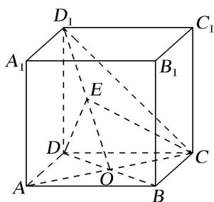

6. 解析 （1）不妨设正方体的棱长为 2. 以 $D$ 为坐标原点, 分别以 $DA$ , $DC$ , $DD_{1}$ 所在直线分别为 $x$ 轴, $y$ 轴, $z$ 轴, 建立如图所示的空间直角坐标系 $D - xyz$ ,

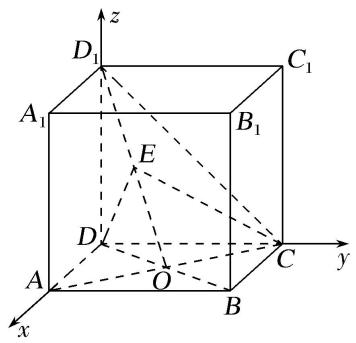
则 $D(0, 0, 0)$ ， $D_{1}(0, 0, 2)$ ， $C(0, 2, 0)$ ， $O(1, 1, 0)$ 。因为 E 为 $OD_{1}$ 的中点，所以 $E\left(\frac{1}{2}, \frac{1}{2}, 1\right)$ 。则 $\overrightarrow{OD_1} = (-1, -1, 2)$ , $\overrightarrow{DE} = \begin{bmatrix} \frac{1}{2}, & \frac{1}{2}, & 1 \end{bmatrix}$ , $\overrightarrow{DC} = (0, 2, 0)$ .
设 $p=(x_{0}, y_{0}, z_{0})$ 是平面 CDE 的法向量，则 $\left\{\begin{aligned}p\cdot\overrightarrow{DE}&=0,\\ p\cdot\overrightarrow{DC}&=0,\end{aligned}\right.$ 即 $\left\{\begin{aligned}\frac{1}{2}x_{0}+\frac{1}{2}y_{0}+z_{0}&=0,\\ 2y_{0}&=0,\end{aligned}\right.$

取 $x_{0}=2$ ，则 $y_{0}=0,\quad z_{0}=-1$ ，所以 $p=(2,0,-1)$ 为平面 CDE 的一个法向量.
设直线 $OD_{1}$ 与平面 CDE 所成角为 $\theta$ ,
所以 $\sin\theta=|\cos<\overrightarrow{OD_{1}},\quad p>|=\frac{|\overrightarrow{OD_{1}}\cdot p|}{|\overrightarrow{OD_{1}}||p|}=\frac{|-1\times2+(-1)\times0+2\times(-1)|}{\sqrt{(-1)^{2}+(-1)^{2}+2^{2}}\times\sqrt{2^{2}+(-1)^{2}}}=\frac{2\sqrt{30}}{15},$
即直线 $OD_{1}$ 与平面 CDE 所成角的正弦值为 $\frac{2\sqrt{30}}{15}$ .  
（2）存在，且点 E 为线段 $OD_{1}$ 上靠近点 O 的三等分点．理由如下.
假设存在点 E，使得平面 $CDE \perp$ 平面 $CD_{1}O$ 。同第（1）问建立空间直角坐标系，易知点 E 不与点 O 重合，设 $\overrightarrow{D_{1}E} = \lambda \overrightarrow{E} \overrightarrow{O}, \lambda \in [0, +\infty), \overrightarrow{OC} = (-1, 1, 0), \overrightarrow{OD_{1}} = (-1, -1, 2)$ .
设 $\boldsymbol{m}=(x_{1},y_{1},z_{1})$ 是平面 $CD_{1}O$ 的法向量，则 $\left\{\begin{aligned}&\boldsymbol{m}\cdot\overrightarrow{OC}=0,\\ &\boldsymbol{m}\cdot\overrightarrow{OD}_{1}=0,\end{aligned}\right.$ 即 $\left\{\begin{aligned}-x_{1}+y_{1}=0,\\ -x_{1}-y_{1}+2z_{1}=0,\end{aligned}\right.$

取 $x_{1}=1$ ，则 $y_{1}=1,\quad z_{1}=1$ ，所以 $m=(1,1,1)$ 为平面 $CD_{1}O$ 的一个法向量.
因为 $\overrightarrow{D_{1}E}=\lambda\overrightarrow{EO}$ ，所以点E的坐标为 $\left(\frac{\lambda}{1+\lambda},\frac{\lambda}{1+\lambda},\frac{2}{1+\lambda}\right)$ ，所以 $\overrightarrow{DE}=\left(\frac{\lambda}{1+\lambda},\frac{\lambda}{1+\lambda},\frac{2}{1+\lambda}\right)$ .
设 $\boldsymbol{n}=(x_{2},y_{2},z_{2})$ 是平面 CDE 的法向量，则 $\left\{\begin{aligned}\boldsymbol{n}\cdot\overrightarrow{DE}&=0,\\ \boldsymbol{n}\cdot\overrightarrow{DC}&=0,\end{aligned}\right.$ 即 $\left\{\begin{aligned}\frac{\lambda}{1+\lambda}x_{2}+\frac{\lambda}{1+\lambda}y_{2}+\frac{2}{1+\lambda}z_{2}&=0,\\ 2y_{2}&=0,\end{aligned}\right.$

取 $x_{2} = 1$ ，则 $y_{2} = 0$ ， $z_{2} = -\frac{\lambda}{2}$ ，所以 $\pmb {n} = \left(1,0, - \frac{\lambda}{2}\right)$ 为平面CDE的一个法向量.
因为平面 $CDE \perp$ 平面 $CD_{1}O$ ，所以 $m \perp n$ 。则 $m \cdot n = 0$ ，所以 $1 - \frac{\lambda}{2} = 0$ ，解得 $\lambda = 2$ 。
所以当 $\frac{\overrightarrow{D_{1}E}}{\overrightarrow{EO}}=2$ ，即点E为线段 $OD_{1}$ 上靠近点O的三等分点时，平面 $CDE\perp$ 平面 $CD_{1}O$ .

# 考点二 探究线面的数量关系

[例 1] 如图所示, 在四棱锥 P-ABCD 中, 侧面 PAD⊥底面 ABCD, 底面 ABCD 是平行四边形, $\angle ABC = 45^{\circ}$ , AD = AP = 2, $AB = DP = 2\sqrt{2}$ , E 为 CD 的中点, 点 F 在线段 PB 上.  
（1）求证： $AD \perp PC;$   
（2）试确定点 F 的位置，使得直线 EF 与平面 PDC 所成的角和直线 EF 与平面 ABCD 所成的角相等.

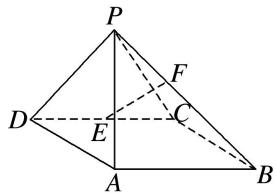

解析 （1）如图所示，在平行四边形ABCD中，连接AC，
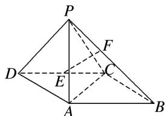
因为 $AB=2\sqrt{2}$ ，BC=2， $\angle ABC=45^{\circ}$ ，由余弦定理得， $AC^{2}=AB^{2}+BC^{2}-2\cdot AB\cdot BC\cdot\cos45^{\circ}=4$ ，得 AC=2，所以 $\angle ACB=90^{\circ}$ ，即 $BC\perp AC$ .
又 $AD \parallel BC$ ，所以 $AD \perp AC$ 。因为 $AD = AP = 2$ ， $DP = 2\sqrt{2}$ ，所以 $PA \perp AD$ ，
又 $AP \cap AC = A$ ，AP， $AC \subset$ 平面 PAC，所以 $AD \perp$ 平面 PAC，又 $PC \subset$ 平面 PAC，所以 $AD \perp PC$ .  
（2）因为侧面 $PAD \perp$ 底面 ABCD， $PA \perp AD$ ，侧面 $PAD \cap$ 底面 ABCD = AD， $PA \subset$ 侧面 PAD，

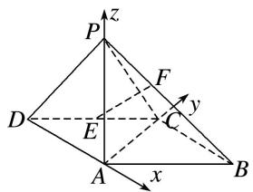
所以 $PA \perp$ 底面 ABCD，所以直线 AC，AD，AP 两两垂直，以 A 为原点，直线 AD，AC，AP 为坐标轴，建立如图所示的空间直角坐标系 A-xyz，
则 $A(0, 0, 0)$ ， $D(-2, 0, 0)$ ， $C(0, 2, 0)$ ， $B(2, 2, 0)$ ， $E(-1, 1, 0)$ ， $P(0, 0, 2)$ ，
所以 $\overrightarrow{PC}=(0,2,-2)$ ， $\overrightarrow{PD}=(-2,0,-2)$ ， $\overrightarrow{PB}=(2,2,-2)$ .
设 $\frac{PF}{PB}=\lambda(\lambda\in[0,1])$ ，则 $\overrightarrow{PF}=(2\lambda,2\lambda,-2\lambda)$ ， $F(2\lambda,2\lambda,-2\lambda+2)$ ,
所以 $\overrightarrow{EF}=(2\lambda+1,\quad2\lambda-1,\quad-2\lambda+2)$ . 易得平面ABCD的一个法向量为 $m=(0,\quad0,\quad1)$ .
设平面 PDC 的法向量为 $\boldsymbol{n}=(x,y,z)$ ，由 $\left\{\begin{aligned}\boldsymbol{n}\cdot\overrightarrow{PC}&=0,\\ \boldsymbol{n}\cdot\overrightarrow{PD}&=0,\end{aligned}\right.$ 得 $\left\{\begin{aligned}2y-2z&=0,\\ -2x-2z&=0,\end{aligned}\right.$
令 x=1，得 $n=(1,-1,-1)$ .
因为直线 EF 与平面 PDC 所成的角和直线 EF 与平面 ABCD 所成的角相等，
所以 $|\cos < \overrightarrow{EF}, m > | = |\cos < \overrightarrow{EF}, n > |$ ，即 $\frac{|\overrightarrow{EF} \cdot m|}{|\overrightarrow{EF}| |m|} = \frac{|\overrightarrow{EF} \cdot n|}{|\overrightarrow{EF}| |n|}$ ，所以 $|-2\lambda + 2| = \frac{|2\lambda|}{\sqrt{3}}$
即 $\sqrt{3}|\lambda-1|=|\lambda|(\lambda\in[0,1])$ ，解得 $\lambda=\frac{3-\sqrt{3}}{2}$ ，所以 $\frac{PF}{PB}=\frac{3-\sqrt{3}}{2}$
即当 $\frac{PF}{PB}=\frac{3-\sqrt{3}}{2}$ 时，直线EF与平面PDC所成的角和直线EF与平面ABCD所成的角相等.

[例 2] 在 Rt△ABC 中，∠C=90°，AC=4，BC=2，E 是 AC 的中点，F 是线段 AB 上一个动点，且 $\overrightarrow{AF} = \lambda \overrightarrow{AB} (0 < \lambda < 1)$ ，如图所示，沿 BE 将 △CEB 翻折至 △DEB 的位置，使得平面 DEB ⊥ 平面 ABE.  
（1）当 $\lambda=\frac{1}{3}$ 时，证明： $BD\perp$ 平面DEF;  
（2）是否存在 $\lambda$ ，使得 $DF$ 与平面 $ADE$ 所成角的正弦值是 $\frac{\sqrt{2}}{3}$ ？若存在，求出 $\lambda$ 的值；若不存在，请说明理由.

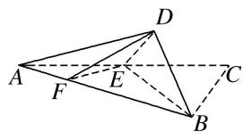

解析 （1）在 $\triangle ABC$ 中， $\angle C=90^{\circ}$ ，即 $AC\perp BC$ ，则 $BD\perp DE$ ，取 $BF$ 的中点 $N$ ，连接 $CN$ 交 $BE$ 于点 $M$ ，
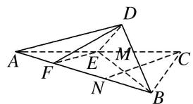
当 $\lambda=\frac{1}{3}$ 时，F是AN的中点，而E是AC的中点，∴EF是△ANC的中位线，∴EF//CN.
在 $\triangle BEF$ 中，N是BF的中点，∴M是BE的中点，
在 Rt△BCE 中，EC=BC=2，∴CM⊥BE，则 EF⊥BE.
又平面 $DEB \perp$ 平面 ABE，平面 $DEB \cap$ 平面 ABE = BE， $EF \subset$ 平面 ABE，∴ $EF \perp$ 平面 DEB.
又 $BD \subset$ 平面 BDE，∴ $EF \perp BD$ 。而 $EF \cap DE = E$ ，EF， $DE \subset$ 平面 DEF，∴ $BD \perp$ 平面 DEF。  
（2）存在 $\lambda=\frac{1}{2}$ ，使得DF与平面ADE所成角的正弦值是 $\frac{\sqrt{2}}{3}$ .

以 C 为坐标原点，CA 所在直线为 x 轴，CB 所在直线为 y 轴，建立如图所示的空间直角坐标系.

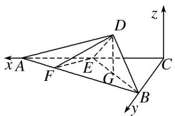
则 $C(0, 0, 0)$ ， $A(4, 0, 0)$ ， $B(0, 2, 0)$ ， $E(2, 0, 0)$
$\therefore\overrightarrow{AB}=(-4,2,0),\overrightarrow{AE}=(-2,0,0)$ ，取BE的中点G，连接DG，
则 $DG \perp BE$ ，而平面 $DEB \perp$ 平面 ABC，
∴ $DG \perp$ 平面 ABC，则 $D(1, 1, \sqrt{2})$ ，则 $\overrightarrow{AD}=(-3, 1, \sqrt{2})$ .
由 $\overrightarrow{AF}=\lambda\overrightarrow{AB}$ ，可得 $F(4-4\lambda,2\lambda,0)$ ，则 $\overrightarrow{DF}=(3-4\lambda,2\lambda-1,-\sqrt{2})$ .
设平面 $ADE$ 的法向量为 $\pmb {n} = (x,y,z)$ ，则 $\left\{ \begin{array}{l}\pmb {n}\cdot \overrightarrow{AE} = 0,\\ \pmb {n}\cdot \overrightarrow{AD} = 0, \end{array} \right.$ 即 $\left\{ \begin{array}{l} - 2x = 0,\\ -3x + y + \sqrt{2} z = 0. \end{array} \right.$
令 z = -1，则 $x = 0,\ y = \sqrt{2}$ ，所以 $\boldsymbol{n} = (0, \sqrt{2}, -1)$
设 $DF$ 与平面 $ADE$ 所成的角为 $\theta$ ，则
$\sin \theta = |\cos < \overrightarrow{DF}, n > | = \frac{|\overrightarrow{DF} \cdot n|}{|\overrightarrow{DF}| |n|} = \frac{|\sqrt{2}(2\lambda - 1) + \sqrt{2}|}{\sqrt{3} \cdot \sqrt{(3 - 4\lambda)^2 + (2\lambda - 1)^2 + (-\sqrt{2})^2}} = \frac{\sqrt{2}}{3}$ ，解得 $\lambda = \frac{1}{2}$ 或 $\lambda = 3$ （舍去）.

综上，存在 $\lambda=\frac{1}{2}$ ，使得DF与平面ADE所成的角的正弦值为 $\frac{\sqrt{2}}{3}$ .

[例3] 如图，正三角形 $ABE$ 与菱形 $ABCD$ 所在的平面互相垂直， $AB = 2$ ， $\angle ABC = 60^{\circ}$ ， $M$ 是 $AB$ 的中点.  
（1）求证： $EM \perp AD;$  
（2）求二面角 A-BE-C 的余弦值;  
（3）在线段 $EC$ 上是否存在点 $P$ ，使得直线 $AP$ 与平面 $ABE$ 所成的角为 $45^{\circ}$ ，若存在，求出 $\frac{EP}{EC}$ 的值；若不存在，说明理由.

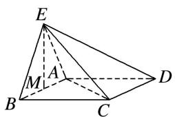

解析 （1）∵EA=EB，M是AB的中点，∴EM⊥AB，
∵平面 $ABE \perp$ 平面 ABCD，平面 $ABE \cap$ 平面 ABCD = AB，EM ⊂ 平面 ABE，
∴EM⊥平面ABCD，AD⊂平面ABCD，∴EM⊥AD.  
（2）连接 MC，∵ EM⊥平面 ABCD，∴ EM⊥MC，
∵△ABC 是正三角形，∴MC⊥AB，∴MB，MC，ME 两两垂直.

建立如图所示空间直角坐标系 M-xyz.

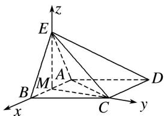
则 $M(0, 0, 0)$ ， $A(-1, 0, 0)$ ， $B(1, 0, 0)$ ， $C(0, \sqrt{3}, 0)$ ， $E(0, 0, \sqrt{3})$ ，
$\vec {B C} = (- 1, \sqrt {3}, 0), \vec {B E} = (- 1, 0, \sqrt {3}),$
设 $\boldsymbol{m}=(x,y,z)$ 是平面 BCE 的一个法向量，则 $\left\{\begin{aligned}\boldsymbol{m}\cdot\overrightarrow{BC}&=-x+\sqrt{3}y=0,\\ \boldsymbol{m}\cdot\overrightarrow{BE}&=-x+\sqrt{3}z=0,\end{aligned}\right.$ 令 $z=1,\quad\boldsymbol{m}=(\sqrt{3},1,1)$ ,
∵y轴所在直线与平面ABE垂直，∴ $n=(0,1,0)$ 是平面ABE的一个法向量.
$\cos < m, n > = \frac{m \cdot n}{|m||n|} = \frac{1}{\sqrt{5} \times 1} = \frac{\sqrt{5}}{5}, \therefore$ 二面角 $A - BE - C$ 的余弦值为 $\frac{\sqrt{5}}{5}$ .  
（3）假设在线段 EC 上存在点 P，使得直线 AP 与平面 ABE 所成的角为 $45^{\circ}$ ，
$\vec {A E} = (1, 0, \sqrt {3}), \vec {E C} = (0, \sqrt {3}, - \sqrt {3}),$
设 $\overrightarrow{EP} = \lambda \overrightarrow{EC} = (0, \sqrt{3}\lambda, -\sqrt{3}\lambda)$ ， $0 < \lambda \leqslant 1$ ，则 $\overrightarrow{AP} = \overrightarrow{AE} + \overrightarrow{EP} = (1, \sqrt{3}\lambda, \sqrt{3} - \sqrt{3}\lambda)$ ，
∵直线 AP 与平面 ABE 所成的角为 $45^{\circ}$ ,
$\therefore \sin 45^{\circ} = |\cos < \overrightarrow{AP}, n > | = \frac{|\overrightarrow{AP} \cdot n|}{|\overrightarrow{AP}||n|} = \frac{|\sqrt{3}\lambda|}{\sqrt{1 + 3\lambda^{2} + 3 - 6\lambda + 3\lambda^{2}} \times 1} = \frac{\sqrt{2}}{2},$ 由 $0 \leqslant \lambda \leqslant 1$ ，解得 $\lambda = \frac{2}{3}$
∴在线段 EC 上存在点 P，使得直线 AP 与平面 ABE 所成的角为 $45^{\circ}$ ，且 $\frac{EP}{EC} = \frac{2}{3}$ .

[例4] 如图，在直三棱柱 $ABC - A_{1}B_{1}C_{1}$ 中， $\triangle ABC$ 是等腰直角三角形， $\angle ACB = 90^{\circ}$ ， $AB = 4\sqrt{2}$ ， $M$ 是 $AB$ 的中点，且 $A_{1}M \perp B_{1}C$ .  
（1）求 $A_{1}A$ 的长;  
（2）已知点 N 在棱 $CC_{1}$ 上，若平面 $B_{1}AN$ 与平面 $BCC_{1}B_{1}$ 夹角的余弦值为 $\frac{\sqrt{10}}{10}$ ，试确定点 N 的位置.

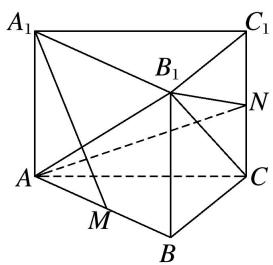

解析 （1）建立如图所示的空间直角坐标系．设 $A_{1}A = a$ ．由 $AB = 4\sqrt{2}$ ，得 $AC = BC = 4$
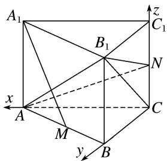
则 $A(4, 0, 0)$ ， $C(0, 0, 0)$ ， $A_{1}(4, 0, a)$ ， $B_{1}(0, 4, a)$ ， $M(2, 2, 0)$ ，
所以 $\overrightarrow{A_{1}M}=(-2,2,-a)$ ， $\overrightarrow{B_{1}C}=(0,-4,-a)$ .
因为 $A_{1}M \perp B_{1}C$ ，所以 $(-2) \times 0 + 2 \times (-4) + (-a) \times (-a) = 0$ ，解得 $a = 2\sqrt{2}$ ，即 $A_{1}A$ 的长为 $2\sqrt{2}$ .  
（2）由（1）知 $C_{1}(0, 0, 2\sqrt{2})$ . 设 $N(0, 0, \lambda)(0 \leqslant \lambda \leqslant 2\sqrt{2})$ ,
所以 $\overrightarrow{B_{1}A}=(4,-4,-2\sqrt{2}),\quad\overrightarrow{B_{1}N}=(0,-4,\lambda-2\sqrt{2}).$
设平面 $B_{1}AN$ 的一个法向量为 $\boldsymbol{n}_{1}=(x_{1},y_{1},z_{1})$ . 由 $\left\{\begin{aligned}\boldsymbol{n}_{1}\perp\overrightarrow{B_{1}A}\\ \boldsymbol{n}_{1}\perp\overrightarrow{B_{1}N},\end{aligned}\right.$ 得 $\left\{\begin{aligned}4x_{1}-4y_{1}-2\sqrt{2}z_{1}=0,\\ -4y_{1}+(\lambda-2\sqrt{2})z_{1}=0,\end{aligned}\right.$

取 $n_{1}=\left(1,1-\frac{2\sqrt{2}}{\lambda},\frac{4}{\lambda}\right)$ . 易知平面 $BCC_{1}B_{1}$ 的一个法向量为 $n_{2}=(1,0,0)$ ,
设平面 $B_{1}AN$ 与平面 $BCC_{1}B_{1}$ 的夹角为 $\theta$ ,
$\cos \theta = | \cos <   n _ {1}, n _ {2} > | = \frac {| n _ {1} \cdot n _ {2} |}{| n _ {1} | | n _ {2} |} = \frac {1}{\sqrt {1 + \left(1 - \frac {2 \sqrt {2}}{\lambda}\right) ^ {2} + \left(\frac {4}{\lambda}\right) ^ {2}}} = \frac {\sqrt {1 0}}{1 0}.$
解得 $\lambda = \sqrt{2}$ 或 $\lambda = -\frac{3\sqrt{2}}{2}$ (舍去)，所以 $N$ 在棱 $CC_{1}$ 的中点处.

[例 5] 如图所示，在梯形 ABCD 中， $AB \parallel CD$ ， $AD = DC = CB = 1$ ， $\angle BCD = 120^{\circ}$ ，四边形 BFED 是以 BD 为直角腰的直角梯形，DE = 2BF = 2，平面 BFED ⊥ 平面 ABCD.  
（1）求证： $AD \perp$ 平面 BFED;  
（2）在线段 EF 上是否存在一点 P, 使得平面 PAB 与平面 ADE 所成的锐二面角的余弦值为 $\frac{5\sqrt{7}}{28}$ ? 若存在, 求出点 P 的位置; 若不存在, 说明理由.

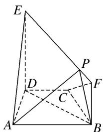

解析 （1）在梯形 ABCD 中，因为 $AB \parallel CD$ ，AD = DC = CB = 1， $\angle BCD = 120^{\circ}$ ，
所以 $\angle CDB=30^{\circ}$ ，所以 $\angle ADB=90^{\circ}$ ，所以 $BD\perp AD$ .
因为平面 $BFED \perp$ 平面 $ABCD$ , 平面 $BFED \cap$ 平面 $ABCD = BD$ , $AD \subset$ 平面 $ABCD$ , 所以 $AD \perp$ 平面 $BFED$ .

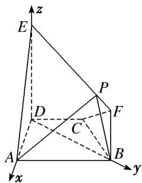  
（2）因为 $AD \perp$ 平面 BFED，所以 $AD \perp DE$ .

以 D 为原点，分别以 DA, DB, DE 所在直线为 x 轴，y 轴，z 轴建立如图所示的空间直角坐标系，在 $\triangle BCD$ 中，DC=BC=1， $\angle BCD=120^{\circ}$ ，由余弦定理得 $BD=\sqrt{3}$ ，
则 $A(1, 0, 0)$ ， $B(0, \sqrt{3}, 0)$ ，由题意，设 $P\left(0, \lambda, 2 - \frac{\sqrt{3}}{3}\lambda\right) (0 \leq \lambda \leq 3)$ ,
所以 $\overrightarrow{AB}=(-1,\sqrt{3},0)$ ， $\overrightarrow{BP}=\left(0,\lambda-\sqrt{3},2-\frac{\sqrt{3}}{3}\lambda\right)$ .

易知平面 EAD 的一个法向量为 $m=(0,1,0)$ ,
设平面 PAB 的法向量为 $n=(x, y, z)$ ，由 $\left\{\begin{aligned}\overrightarrow{AB} \cdot n=0, \\ \overrightarrow{BP} \cdot n=0,\end{aligned}\right.$ 得 $\left\{\begin{aligned}-x+\sqrt{3}y=0,\\ \lambda-\sqrt{3}y+\left(2-\frac{\sqrt{3}}{3}\lambda\right)z=0,\end{aligned}\right.$

取 y=1，可得 $n=\left(\sqrt{3},\quad1,\quad\frac{\sqrt{3}-\lambda}{2-\frac{\sqrt{3}}{3}\lambda}\right)$ .
因为平面 PAB 与平面 ADE 所成的锐二面角的余弦值为 $\frac{5\sqrt{7}}{28}$ ,
所以 $|\cos < m, n > | = \frac{|m \cdot n|}{|m||n|} = \sqrt{\frac{1}{3 + 1 + \left(\frac{\sqrt{3} - \lambda}{2 - \frac{\sqrt{3}}{3}\lambda}\right)_2}} = \frac{5\sqrt{7}}{28},$
解得 $\lambda=\frac{\sqrt{3}}{3}$ ，∴线段EF上存在满足题意的点P，此时， $\frac{EP}{EF}=\frac{\lambda}{\sqrt{3}}=\frac{1}{3}$
即 P 为线段 EF 上靠近点 E 的三等分点.

[例 6] 如图所示，在梯形 ABCD 中， $AB \parallel CD$ ， $\angle BCD = 120^{\circ}$ ，四边形 ACFE 为矩形，且 $CF \perp$ 平面 ABCD，AD = CD = BC = CF.  
（1）求证： $EF \perp$ 平面 BCF;  
（2）点 $M$ 在线段 $EF$ 上运动，当点 $M$ 在什么位置时，平面 $MAB$ 与平面 $FCB$ 所成的锐二面角最大，并求此时二面角的余弦值.

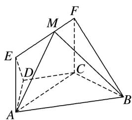

解析 （1） 设 $AD = CD = BC = 1$ , $\because AB \parallel CD$ , $\angle BCD = 120^{\circ}$ , $\therefore AB = 2$ ,
$\therefore AC^{2} = AB^{2} + BC^{2} - 2AB\cdot BC\cdot \cos 60^{\circ} = 3,\therefore AB^{2} = AC^{2} + BC^{2}$ ，则 $BC\bot AC$
∵CF⊥平面ABCD，AC⊂平面ABCD，∴AC⊥CF，而CF∩BC=C，CF，BC⊂平面BCF，
∴AC⊥平面BCF. ∵EF∥AC, ∴EF⊥平面BCF.  
（2）以 C 为坐标原点，分别以直线 CA, CB, CF 为 x 轴、y 轴、z 轴建立如图所示的空间直角坐标系，

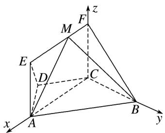
设 $FM = \lambda (0\leqslant \lambda \leqslant \sqrt{3})$ ，则 $C(0,0,0),A(\sqrt{3},0,0),B(0,1,0),M(\lambda ,0,1),$
$\therefore \overrightarrow {A B} = (- \sqrt {3}, 1, 0), \overrightarrow {B M} = (\lambda , - 1, 1).$
设 $\boldsymbol{n}=(x,y,z)$ 为平面 MAB 的法向量，由 $\left\{\begin{aligned}\boldsymbol{n}\cdot\overrightarrow{AB}&=0,\\ \boldsymbol{n}\cdot\overrightarrow{BM}&=0,\end{aligned}\right.$ 得 $\left\{\begin{aligned}-\sqrt{3}x+y&=0,\\ \lambda x-y+z&=0,\end{aligned}\right.$

取 x=1，则 $n=(1,\sqrt{3},\sqrt{3}-\lambda)$ .

易知 $m=(1,0,0)$ 是平面 FCB 的一个法向量，
$\therefore \cos <   n, m > = \frac {n \cdot m}{| n | | m |} = \frac {1}{\sqrt {1 + 3 + (\sqrt {3} - \lambda) ^ {2}} \times 1} = \frac {1}{\sqrt {(\lambda - \sqrt {3}) ^ {2} + 4}}.$
$\because 0 \leqslant \lambda \leqslant \sqrt{3}, \therefore$ 当 $\lambda = 0$ 时， $\cos < n, m >$ 取得最小值 $\frac{\sqrt{7}}{7}$ ,
∴当点 M 与点 F 重合时，平面 MAB 与平面 FCB 所成的锐二面角最大，此时二面角的余弦值为 $\frac{\sqrt{7}}{7}$ .

[例 7] 如图，在四棱锥 P-ABCD 中， $PA \perp$ 平面 ABCD， $AD \parallel BC$ ， $AD \perp CD$ ，且 $AD = CD = \sqrt{2}$ ， $BC = 2\sqrt{2}$ ，PA = 2.  
（1）取 PC 的中点 N，求证：DN// 平面 PAB;  
（2）求直线 AC 与 PD 所成角的余弦值;  
（3）在线段 $PD$ 上, 是否存在一点 $M$ , 使得平面 $MAC$ 与平面 $ACD$ 的夹角为 $45^{\circ}$ ? 如果存在, 求出 $BM$ 与平面 $MAC$ 所成角的大小; 如果不存在, 请说明理由.

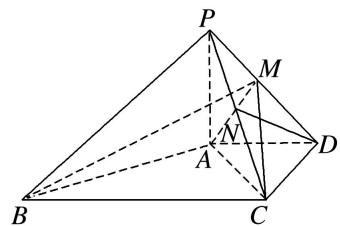

解析 （1）取 BC 的中点 E，连接 DE，交 AC 于点 O，连接 ON，建立如图所示的空间直角坐标系，
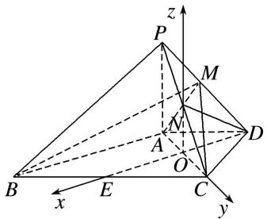
则 $A(0, -1, 0)$ ， $B(2, -1, 0)$ ， $C(0, 1, 0)$ ， $D(-1, 0, 0)$ ， $P(0, -1, 2)$ .
∵点N为PC的中点，∴ $N(0,0,1)$ ，∴ $\overrightarrow{DN}=(1,0,1)$ .
设平面 PAB 的一个法向量为 $\boldsymbol{n}=(x,y,z)$ ，由 $\overrightarrow{AP}=(0,0,2)$ ， $\overrightarrow{AB}=(2,0,0)$ ，可得 $\boldsymbol{n}=(0,1,0)$ ， $\therefore\overrightarrow{DN}\cdot n=0$ ．又∵DN∉平面PAB，∴DN//平面PAB.  
（2）由（1）知， $\overrightarrow{AC}=(0,2,0)$ ， $\overrightarrow{PD}=(-1,1,-2)$ .
设直线 $AC$ 与 $PD$ 所成的角为 $\theta$ ，则 $\cos \theta = \frac{|\overrightarrow{AC} \cdot \overrightarrow{PD}|}{|\overrightarrow{AC}||\overrightarrow{PD}|} = \left|\frac{2}{2 \times \sqrt{6}}\right| = \frac{\sqrt{6}}{6}$ .  
（3）存在．设 $M(x, y, z)$ ，且 $\overrightarrow{PM} = \lambda \overrightarrow{PD}, 0 \leqslant \lambda \leqslant 1, \therefore \begin{cases} x = -\lambda, \\ y + 1 = \lambda, \\ z - 2 = -2\lambda, \end{cases}$ $\therefore M(-\lambda, \lambda - 1, 2 - 2\lambda).$
设平面 ACM 的一个法向量为 $\boldsymbol{m}=(a, b, c)$ ，由 $\overrightarrow{AC}=(0, 2, 0)$ ， $\overrightarrow{AM}=(-\lambda, \lambda, 2-2\lambda)$ ，
可得 $m=(2-2\lambda,0,\lambda)$ ，由图知平面 ACD 的一个法向量为 $u=(0,0,1)$ ,
$\therefore |\cos < m, u > | = \frac{\lambda}{1 \cdot \sqrt{\lambda^2 + (2 - 2\lambda)^2}} = \frac{\sqrt{2}}{2}$ , 解得 $\lambda = \frac{2}{3}$ 或 $\lambda = 2$ (舍去).
$\therefore M \left[ - \frac {2}{3}, - \frac {1}{3}, \frac {2}{3} \right], m = \left[ \frac {2}{3}, 0, \frac {2}{3} \right]. \therefore \overrightarrow {B M} = \left[ - \frac {8}{3}, \frac {2}{3}, \frac {2}{3} \right],$
设 BM 与平面 MAC 所成的角为 $\varphi$ ，则 $\sin \varphi = |\cos < \overrightarrow{BM}, m > | = \left| \frac{\frac{12}{9}}{\frac{2\sqrt{2}}{3} \times 2\sqrt{2}} \right| = \frac{1}{2}, \therefore \varphi = 30^{\circ}.$
故存在点 M，使得平面 MAC 与平面 ACD 的夹角为 $45^{\circ}$ ，此时 BM 与平面 MAC 所成的角为 $30^{\circ}$ .

[例8] 如图所示，正方形 $AA_{1}D_{1}D$ 与矩形ABCD所在平面互相垂直， $AB = 2AD = 2$ ，点 $E$ 为 $AB$ 的中点.  
（1）求证： $BD_{1}$ // 平面 $A_{1}DE;$  
（2）设在线段 $AB$ 上存在点 $M$ ，使二面角 $D_{1} - MC - D$ 的大小为 $\frac{\pi}{6}$ ，求此时 $AM$ 的长及点 $E$ 到平面 $D_{1}MC$ 的距离.

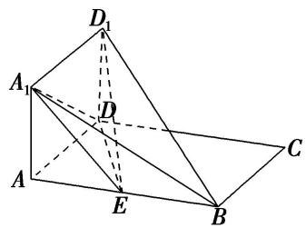

解析 （1）连接 $AD_{1}$ ，交 $A_{1}D$ 于点 O，∵ 四边形 $AA_{1}D_{1}D$ 为正方形，
∴ O 是 $AD_{1}$ 的中点，∵ 点 E 为 AB 的中点，连接 OE.
∴EO 为 $\triangle ABD_{1}$ 的中位线，∴ $EO \parallel BD_{1}$ .
又∵ $BD_{1}\notin$ 平面 $A_{1}DE$ ， $OE\subset$ 平面 $A_{1}DE$ ，∴ $BD_{1}//$ 平面 $A_{1}DE$ .

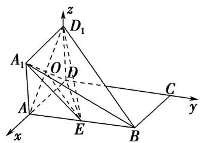  
（2）由题意可得 $D_{1}D \perp$ 平面 ABCD，以点 D 为原点，DA, DC, $DD_{1}$ 所在直线分别为 x 轴、y 轴、z 轴，建立如图所示的空间直角坐标系，则 $D(0, 0, 0)$ ， $C(0, 2, 0)$ ， $A_{1}(1, 0, 1)$ ， $D_{1}(0, 0, 1)$ ， $B(1, 2, 0)$ ， $E(1, 1, 0)$ ，
设 $M(1, y_{0}, 0)(0 \leq y_{0} \leq 2)$ ，∵ $\overrightarrow{MC}=(-1, 2-y_{0}, 0)$ ， $\overrightarrow{D_{1}C}=(0, 2, -1)$ ，
设平面 $D_{1}MC$ 的一个法向量为 $\boldsymbol{n}_{1}=(x,y,z)$ ，则 $\left\{\begin{aligned}\boldsymbol{n}_{1}\cdot\overrightarrow{MC}&=0,\\ \boldsymbol{n}_{1}\cdot\overrightarrow{D_{1}C}&=0,\end{aligned}\right.$ 即 $\left\{\begin{aligned}-x+y&2-y_{0}&=0,\\ 2y-z&=0,\end{aligned}\right.$
令 y=1，有 $n_{1}=(2-y_{0},1,2)$ 。而平面 MCD 的一个法向量为 $n_{2}=(0,0,1)$ 。

要使二面角 $D_{1}-MC-D$ 的大小为 $\frac{\pi}{6}$ ,
则 $\cos\frac{\pi}{6}=|\cos<n_{1},\quad n_{2}>|=\frac{|n_{1}\cdot n_{2}|}{|n_{1}|\cdot|n_{2}|}=\frac{2}{\sqrt{2-y_{0}-^{2}+1^{2}+2^{2}}}=\frac{\sqrt{3}}{2},$
解得 $y_{0}=2-\frac{\sqrt{3}}{3}(0\leq y_{0}\leq2)$ ，故 $AM=2-\frac{\sqrt{3}}{3}$ ，此时 $n_{1}=\left(\frac{\sqrt{3}}{3},1,2\right)$ ， $\overrightarrow{D_{1}E}=(1,1,-1)$ .
故点 E 到平面 $D_{1}MC$ 的距离为 $d=\frac{|n_{1}\cdot\overrightarrow{D_{1}E}|}{|n_{1}|}=\frac{1-\frac{\sqrt{3}}{3}}{\frac{4\sqrt{3}}{3}}=\frac{\sqrt{3}-1}{4}$ .

# 【对点训练】

1. 如图，已知在长方体 $ABCD - A_{1}B_{1}C_{1}D_{1}$ 中， $AD = AA_{1} = 1$ ， $AB = 2$ ，点 $E$ 在棱 $AB$ 上移动.  
（1）求证： $D_{1}E \perp A_{1}D;$   
（2）在棱 $AB$ 上是否存在点 $E$ 使得 $AD_{1}$ 与平面 $D_{1}EC$ 所成的角为 $\frac{\pi}{6}$ ? 若存在, 求出 $AE$ 的长, 若不存在,说明理由.

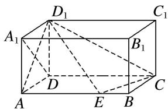

1. 解析 （1）∵AE⊥平面 $AA_{1}D_{1}D$ ， $A_{1}D\subset$ 平面 $AA_{1}D_{1}D$ ，∴AE⊥ $A_{1}D$ .
∵在长方体 $ABCD-A_{1}B_{1}C_{1}D_{1}$ 中， $AD=AA_{1}=1,\therefore A_{1}D\perp AD_{1}$
$\because AE \cap AD_{1} = A, \therefore A_{1}D \perp$ 平面 $AED_{1}$ . $\because D_{1}E \subset$ 平面 $AED_{1}, \therefore D_{1}E \perp A_{1}D$ .  
（2）以 D 为坐标原点，DA，DC， $DD_{1}$ 所在直线分别为 x，y，z 轴，建立空间直角坐标系，如图所示.

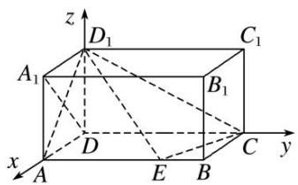
设棱 AB 上存在点 $E(1, t, 0) (0 \leqslant t \leqslant 2)$ ，使得 $AD_{1}$ 与平面 $D_{1}EC$ 所成的角为 $\frac{\pi}{6}$ ,
$A(1, 0, 0), D_1(0, 0, 1), C(0, 2, 0), \overrightarrow{AD}_1 = (-1, 0, 1), \overrightarrow{CD}_1 = (0, -2, 1), \overrightarrow{CE} = (1, t-2, 0),$ 设平面 $D_{1}EC$ 的法向量为 $\boldsymbol{n}=(x,y,z)$ ，则 $\left\{\begin{aligned}\boldsymbol{n}\cdot\overrightarrow{CD}_{1}&=-2y+z=0,\\ \boldsymbol{n}\cdot\overrightarrow{CE}&=x+(t-2)y=0,\end{aligned}\right.$ 取 y=1，得 $\boldsymbol{n}=(2-t,1,2)$ ,
∴ $\sin\frac{\pi}{6}=\frac{|\overrightarrow{AD_{1}}\cdot\boldsymbol{n}|}{|\overrightarrow{AD_{1}}||\boldsymbol{n}|}=\frac{|t-2+2|}{\sqrt{2}\times\sqrt{(t-2)^{2}+5}}$ ，整理，得 $t^{2}+4t-9=0$ ，解得 $t=\sqrt{13}-2$ 或 $t=-2-\sqrt{13}$ （舍去），
∴在棱 AB 上存在点 E 使得 $AD_{1}$ 与平面 $D_{1}EC$ 所成的角为 $\frac{\pi}{6}$ ，此时 $AE=\sqrt{13}-2$ .

2. 等边 $\triangle ABC$ 的边长为 3，点 $D, E$ 分别是 $AB, AC$ 上的点，且满足 $\frac{AD}{DB} = \frac{CE}{EA} = \frac{1}{2}$ (如图①)，将 $\triangle ADE$ 沿 $DE$ 折起到 $\triangle A_{1}DE$ 的位置，使二面角 $A_{1} - DE - B$ 成直二面角，连接 $A_{1}B, A_{1}C$ (如图②).  
（1）求证： $A_{1}D \perp$ 平面 BCED;  
（2）在线段 $BC$ 上是否存在点 $P$ , 使直线 $PA_{1}$ 与平面 $A_{1}BD$ 所成的角为 $60^{\circ}$ ? 若存在, 求出 $PB$ 的长; 若不存在, 请说明理由.

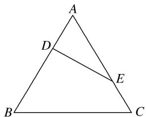

图①

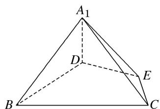

图②

2. 解析 （1）题图①中, 由已知可得: $AE = 2$ , $AD = 1$ , $A = 60^{\circ}$ .
从而 $DE=\sqrt{1^{2}+2^{2}-2\times1\times2\times\cos60^{\circ}}=\sqrt{3}$ . 故得 $AD^{2}+DE^{2}=AE^{2}$ ,
所以 $AD \perp DE$ ， $BD \perp DE$ ．所以题图②中， $A_{1}D \perp DE$ ，
又平面 $ADE \cap$ 平面 BCED = DE, $A_{1}D \perp DE$ , $A_{1}D \subset$ 平面 $A_{1}DE$ ，所以 $A_{1}D \perp$ 平面 BCED.  
（2）存在．由（1）知 $ED \perp DB$ ， $A_{1}D \perp$ 平面 BCED．以 D 为坐标原点，以射线 DB，DE， $DA_{1}$ 分别为 x 轴，y 轴，z 轴的正半轴建立空间直角坐标系 D-xyz，如图，

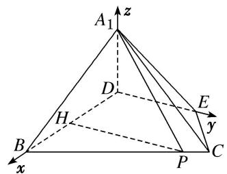

过 P 作 $PH \parallel DE$ 交 BD 于点 H，设 $PB = 2a (0 \leq 2a \leq 3)$ ，则 BH = a， $PH = \sqrt{3}a$ ，DH = 2 - a，

易知 $A_{1}(0, 0, 1)$ ， $P(2-a, \sqrt{3}a, 0)$ ， $E(0, \sqrt{3}, 0)$ ，所以 $\overrightarrow{PA_{1}} = (a - 2, -\sqrt{3}a, 1)$ .
因为 $ED \perp$ 平面 $A_{1}BD$ ，所以平面 $A_{1}BD$ 的一个法向量为 $\overrightarrow{DE} = (0, \sqrt{3}, 0)$ ,
因为直线 $PA_{1}$ 与平面 $A_{1}BD$ 所成的角为 $60^{\circ}$ ,
所以 $\sin60^{\circ}=\frac{|\overrightarrow{PA_{1}}\cdot\overrightarrow{DE}|}{|\overrightarrow{PA_{1}}||\overrightarrow{DE}|}=\frac{3a}{\sqrt{4a^{2}-4a+5}\times\sqrt{3}}=\frac{\sqrt{3}}{2}$ ，解得 $a=\frac{5}{4}$ .
所以 $PB=2a=\frac{5}{2}$ ，满足 $0\leq2a\leq3$ ，符合题意.
所以在线段 BC 上存在点 P，使直线 $PA_{1}$ 与平面 $A_{1}BD$ 所成的角为 $60^{\circ}$ ，此时 $PB=\frac{5}{2}$ .

3. 如图，在四棱锥 $P - ABCD$ 中，底面 $ABCD$ 是平行四边形， $AB = AC = 2$ ， $AD = 2\sqrt{2}$ ， $PB = \sqrt{2}$ ， $PB \perp AC$ .  
（1）求证：平面 $PAB \perp$ 平面 PAC;  
（2）若 $\angle PBA=45^{\circ}$ ，试判断棱 $PA$ 上是否存在与点 $P$ ， $A$ 不重合的点 $E$ ，使得直线 $CE$ 与平面 $PBC$ 所成角的正弦值为 $\frac{\sqrt{6}}{9}$ ？若存在，求出 $\frac{AE}{AP}$ 的值；若不存在，请说明理由.

3. 解析 （1） 因为四边形 ABCD 是平行四边形, $AD = 2\sqrt{2}$ , 所以 $BC = AD = 2\sqrt{2}$ ,
又 AB=AC=2，所以 $AB^{2}+AC^{2}=BC^{2}$ ，所以 $AC\perp AB$ ，
又 $PB \perp AC, AB \cap PB = B, AB, PB \subset$ 平面 PAB，所以 $AC \perp$ 平面 PAB.
又因为 $AC \subset$ 平面 PAC，所以平面 $PAB \perp$ 平面 PAC.  
（2）由（1）知 $AC \perp AB$ ， $AC \perp$ 平面 PAB，分别以 AB，AC 所在直线为 x 轴，y 轴，

平面 PAB 内过点 A 且与直线 AB 垂直的直线为 z 轴，建立空间直角坐标系 Axyz，

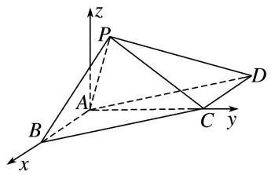
则 $A(0, 0, 0)$ ， $B(2, 0, 0)$ ， $C(0, 2, 0)$ ， $\overrightarrow{AC}=(0, 2, 0)$ ， $\overrightarrow{BC}=(-2, 2, 0)$ ，
由 $\angle PBA = 45^{\circ}$ ， $PB = \sqrt{2}$ ，可得 $P(1,0,1)$ ，所以 $\overrightarrow{AP} = (1,0,1),\overrightarrow{BP} = (-1,0,1),$ 假设棱 PA 上存在点 E，使得直线 CE 与平面 PBC 所成角的正弦值为 $\frac{\sqrt{6}}{9}$ ,
设 $\frac{AE}{AP}=\lambda(0<\lambda<1)$ ，则 $\overrightarrow{AE}=\lambda\overrightarrow{AP}=(\lambda,\quad0,\quad\lambda)$ ， $\overrightarrow{CE}=\overrightarrow{AE}-\overrightarrow{AC}=(\lambda,-2,\quad\lambda)$
设平面 PBC 的法向量 $\boldsymbol{n}=(x,y,z)$ ，则 $\left\{\begin{aligned}\boldsymbol{n}\cdot\overrightarrow{BC}&=0,\\ \boldsymbol{n}\cdot\overrightarrow{BP}&=0,\end{aligned}\right.$ 即 $\left\{\begin{aligned}-2x+2y&=0,\\ -x+z&=0,\end{aligned}\right.$
令 z=1，可得 x=y=1，所以平面 PBC 的一个法向量 $n=(1,1,1)$ ,
设直线 CE 与平面 PBC 所成的角为 $\theta$ ，则
$\sin \theta = |\cos < n, \vec{CE} >| = \frac{|\lambda - 2 + \lambda|}{\sqrt{3} \cdot \sqrt{\lambda^2 + (-2)^2 + \lambda^2}} = \frac{|2\lambda - 2|}{\sqrt{3} \cdot \sqrt{2\lambda^2 + 4}} = \frac{\sqrt{6}}{9}$ , 解得 $\lambda = \frac{1}{2}$ 或 $\lambda = \frac{7}{4}$ (舍).
所以在棱 PA 上存在点 E，且 $\frac{AE}{AP} = \frac{1}{2}$ ，使得直线 CE 与平面 PBC 所成角的正弦值为 $\frac{\sqrt{6}}{9}$ .

4. 如图，在四棱锥 $P - ABCD$ 中，底面 $ABCD$ 是边长为 4 的正方形， $\triangle PAD$ 是正三角形， $CD \perp$ 平面 $PAD$ ， $E, F, G, O$ 分别是 $PC, PD, BC, AD$ 的中点.  
（1）求证： $PO \perp$ 平面 ABCD;  
（2）求平面 EFG 与平面 ABCD 所成锐二面角的大小;  
（3）在线段 $PA$ 上是否存在点 $M$ , 使得直线 $GM$ 与平面 $EFG$ 所成角为 $\frac{\pi}{6}$ , 若存在, 求线段 $PM$ 的长度; 若不存在, 说明理由.

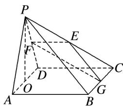

4. 解析 （1）因为 $\triangle PAD$ 是正三角形, $O$ 是 $AD$ 的中点, 所以 $PO \perp AD$ .
又因为 $CD \perp$ 平面 PAD， $PO \subset$ 平面 PAD，所以 $PO \perp CD$ .
又 $AD \cap CD = D$ ，AD， $CD \subset$ 平面 ABCD，所以 $PO \perp$ 平面 ABCD.  
（2）如图，以 O 点为原点，分别以 OA, OG, OP 所在直线为 x 轴、y 轴、z 轴建立空间直角坐标系 O-xyz. 则 $O(0, 0, 0)$ , $A(2, 0, 0)$ , $B(2, 4, 0)$ , $C(-2, 4, 0)$ , $D(-2, 0, 0)$ , $G(0, 4, 0)$ , $P(0, 0, 2\sqrt{3})$ , $E(-1, 2, \sqrt{3})$ , $F(-1, 0, \sqrt{3})$ , $\vec{EF} = (0, -2, 0)$ , $\vec{EG} = (1, 2, -\sqrt{3})$ ,

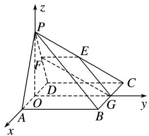
设平面 EFG 的法向量为 $\boldsymbol{m}=(x,y,z)$ ，则 $\left\{\begin{aligned}\overrightarrow{EF}\cdot\boldsymbol{m}&=0,\\ \overrightarrow{EG}\cdot\boldsymbol{m}&=0,\end{aligned}\right.$ 即 $\left\{\begin{aligned}-2y&=0,\\ x+2y-\sqrt{3}z&=0,\end{aligned}\right.$
令 z=1，则 $m=(\sqrt{3},0,1)$ ，又平面 ABCD 的法向量 $n=(0,0,1)$ ,
设平面 $EFG$ 与平面 $ABCD$ 所成锐二面角为 $\theta$ ，所以 $\cos \theta = \frac{|\pmb{m} \cdot \pmb{n}|}{|\pmb{m}||\pmb{n}|} = \frac{1}{\sqrt{(\sqrt{3})^2 + 1^2} \times 1} = \frac{1}{2}$ .
所以平面 EFG 与平面 ABCD 所成锐二面角为 $\frac{\pi}{3}$ .  
（3）假设在线段 PA 上存在点 M，使得直线 GM 与平面 EFG 所成角为 $\frac{\pi}{6}$ ,
即直线 GM 的方向向量与平面 EFG 法向量 m 所成的锐角为 $\frac{\pi}{3}$ ,
设 $\overrightarrow{PM} = \lambda \overrightarrow{PA}$ ， $\lambda \in [0,1]$ ， $\overrightarrow{GM} = \overrightarrow{GP} +\overrightarrow{PM} = \overrightarrow{GP} +\lambda \overrightarrow{PA}$ ，所以 $\overrightarrow{GM} = (2\lambda , - 4,2\sqrt{3} -2\sqrt{3}\lambda),$
所以 $\cos\frac{\pi}{3}=|\cos<\overrightarrow{GM},\quad m>|=\frac{\sqrt{3}}{2\sqrt{4\lambda^{2}-6\lambda+7}}$ ，整理得 $2\lambda^{2}-3\lambda+2=0$ ，
$\Delta<0$ ，方程无解，所以，不存在这样的点 M.

5. 如图，已知直三棱柱 $ABC - A_{1}B_{1}C_{1}$ 中， $AA_{1} = AB = AC = 1$ ， $AB \perp AC$ ， $M$ ， $N$ ， $Q$ 分别是 $CC_{1}$ ， $BC$ ， $AC$ 的中点，点 $P$ 在直线 $A_{1}B_{1}$ 上运动，且 $\vec{A_1P} = \lambda \vec{A_1B_1} (\lambda \in [0, 1])$ .  
（1）证明：无论 $\lambda$ 取何值，总有 $AM\perp$ 平面PNQ;  
（2）是否存在点 P，使得平面 PMN 与平面 ABC 的夹角为 $60^{\circ}$ ？若存在，试确定点 P 的位置，若不存在，请说明理由.

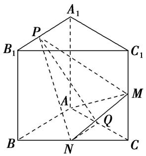

5. 解析 （1）如图, 以 $A$ 为坐标原点, $AB$ , $AC$ , $AA_{1}$ 所在的直线分别为 $x$ 轴、 $y$ 轴、 $z$ 轴建立空间直角坐

标系，则 $A(0, 0, 0)$ ， $A_{1}(0, 0, 1)$ ， $B_{1}(1, 0, 1)$ ， $M\left\{0, 1, \frac{1}{2}\right\}$ ， $N\left(\frac{1}{2}, \frac{1}{2}, 0\right)$ ， $Q\left\{0, \frac{1}{2}, 0\right\}$
由 $\overrightarrow{A_{1}P}=\lambda\overrightarrow{A_{1}B_{1}}=\lambda(1,0,0)=(\lambda,0,0)$ ，可得点 $P(\lambda,0,1)$ ，所以 $\overrightarrow{PN}=\left(\frac{1}{2}-\lambda,\frac{1}{2},-1\right)$ ， $\overrightarrow{PQ}=\left(-\lambda,\frac{1}{2},-1\right)$ .又 $\overrightarrow{AM}=\left(0,\quad1,\quad\frac{1}{2}\right)$ ，所以 $\overrightarrow{AM}\cdot\overrightarrow{PN}=0+\frac{1}{2}-\frac{1}{2}=0,\quad\overrightarrow{AM}\cdot\overrightarrow{PQ}=0+\frac{1}{2}-\frac{1}{2}=0,$
所以 $\overrightarrow{AM}\perp\overrightarrow{PN},\quad\overrightarrow{AM}\perp\overrightarrow{PQ}$ ，即 $AM\perp PN,\quad AM\perp PQ,$
又 $PN \cap PQ = P$ ，所以 $AM \perp$ 平面 PNQ，所以无论 $\lambda$ 取何值，总有 $AM \perp$ 平面 PNQ.

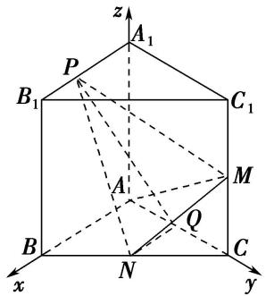  
（2）设 $\boldsymbol{n}=(x,y,z)$ 是平面 PMN 的法向量， $\overrightarrow{NM}=\left(-\frac{1}{2},\frac{1}{2},\frac{1}{2}\right)$ ， $\overrightarrow{PN}=\left(\frac{1}{2}-\lambda,\frac{1}{2},-1\right)$ ,
则 $\left\{ \begin{array}{l} n \cdot \overrightarrow{NM} = 0, \\ n \cdot \overrightarrow{PN} = 0, \end{array} \right.$ 即 $\left\{ \begin{array}{l} -\frac{1}{2} x + \frac{1}{2} y + \frac{1}{2} z = 0, \\ \left( \frac{1}{2} - \lambda \right)x + \frac{1}{2} y - z = 0, \end{array} \right.$ 得 $\left\{ \begin{array}{l} y = \frac{1 + 2\lambda}{3} x, \\ z = \frac{2 - 2\lambda}{3} x, \end{array} \right.$
令 x=3，所以 $n=(3,1+2\lambda,2-2\lambda)$ 是平面 PMN 的一个法向量.

取平面 ABC 的一个法向量为 $m=(0,0,1)$ .
假设存在符合条件的点 P，则 $\left|\cos<m,\quad n>\right|=\frac{\left|2-2\lambda\right|}{\sqrt{9+\quad1+2\lambda\quad^{2}+\quad2-2\lambda\quad^{2}}}=\frac{1}{2}$
化简得 $4\lambda^{2}-14\lambda+1=0$ ，解得 $\lambda=\frac{7-3\sqrt{5}}{4}$ 或 $\lambda=\frac{7+3\sqrt{5}}{4}$ (舍去).

综上，存在点 P，且当 $A_{1}P=\frac{7-3\sqrt{5}}{4}$ 时，满足平面 PMN 与平面 ABC 的夹角为 $60^{\circ}$ .

6. 如图所示的几何体由平面 $PECF$ 截棱长为 2 的正方体得到, 其中 $P, C$ 为原正方体的顶点, $E, F$ 为原正方体侧棱长的中点, 正方形 $ABCD$ 为原正方体的底面, $G$ 为棱 $BC$ 上的动点.  
（1）求证：平面 $APC \perp$ 平面 PECF;  
（2）设 $\overrightarrow{BG}=\lambda\overrightarrow{BC}(0\leq\lambda\leq1)$ ，当 $\lambda$ 为何值时，平面EFG与平面ABCD所成的角为 $\frac{\pi}{3}$ ?

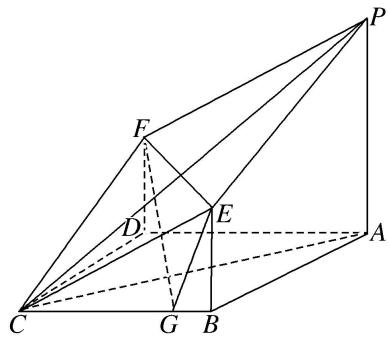

6. 解析 （1）由已知可知, $EB \parallel FD$ , 且 $EB = FD$ , 如图, 连接 $BD$ , 则四边形 $EFDB$ 是平行四边形,
∴EF//BD. ∵底面ABCD为正方形，∴BD⊥AC. ∵AP⊥底面ABCD，∴BD⊥AP.
又 $AC \cap AP = A, \therefore BD \perp$ 平面 APC, $\therefore EF \perp$ 平面 APC.
∵EF⊂平面 PECF，∴平面 APC⊥平面 PECF.

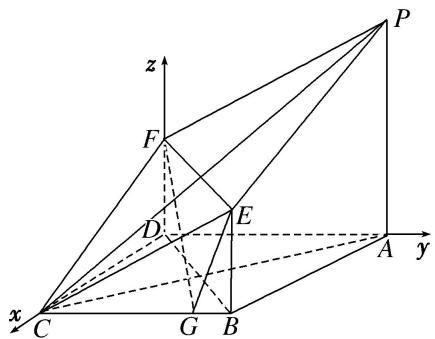  
（2）以 D 为原点建立如图所示的空间直角坐标系 D-xyz,
则 $B(2, 2, 0)$ ， $F(0, 0, 1)$ ， $E(2, 2, 1)$ ， $G(2, 2-2\lambda, 0)$ ， $\overrightarrow{FE}=(2, 2, 0)$ ， $\overrightarrow{GE}=(0, 2\lambda, 1)$ ，
设 $\boldsymbol{m}=(x,y,z)$ 是平面 EFG 的法向量，故 $\left\{\begin{aligned}\mathrm{m}\cdot\overrightarrow{FE}&=0,\\ m\cdot\overrightarrow{GE}&=0,\end{aligned}\right.$ 即 $\left\{\begin{aligned}x&=-y,\\ z&=-2\lambda y,\end{aligned}\right.$
令 y = -1，可得 $m = (1, -1, 2\lambda)$ 为平面 EFG 的一个法向量，

而平面 ABCD 的一个法向量为 $\boldsymbol{n}=(0,0,1)$ .
于是 $\cos \frac{\pi}{3} = |\cos < m, n > | = \frac{|2\lambda|}{\sqrt{2 + 4\lambda^2}}$ ，解得 $\lambda = \pm \frac{\sqrt{6}}{6}$ ，又 $0 \leq \lambda \leq 1$ ， $\therefore \lambda = \frac{\sqrt{6}}{6}$ .

7. 如图，在四棱锥 $P - ABCD$ 中， $AB // DC$ ， $\angle ADC = \frac{\pi}{2}$ ， $AB = AD = \frac{1}{2} CD = 2$ ， $PD = PB = \sqrt{6}$ ， $PD \perp BC$ .  
（1）求证：平面 $PBD \perp$ 平面 PBC;  
（2）在线段 PC 上是否存在点 M，使得平面 ABM 与平面 PBD 的夹角为 $\frac{\pi}{3}$ ? 若存在，求出 $\frac{CM}{CP}$ 的值；若不存在，请说明理由.

7. 解析 （1）因为四边形 $ABCD$ 为直角梯形，且 $AB \parallel DC$ ， $AB = AD = 2$ ， $\angle ADC = \frac{\pi}{2}$ ，所以 $BD = 2\sqrt{2}$ ，又因为 $CD = 4$ ， $\angle BDC = \frac{\pi}{4}$ . 根据余弦定理得 $BC = 2\sqrt{2}$ ，所以 $CD^2 = BD^2 + BC^2$ ，故 $BC \perp BD$ .
又因为 $BC \perp PD, PD \cap BD = D$ ，且 BD， $PD \subset$ 平面 PBD，所以 $BC \perp$ 平面 PBD，
又因为 $BC \subset$ 平面 PBC，所以平面 $PBC \perp$ 平面 PBD.  
（2）由（1）得平面 $ABCD \perp$ 平面 PBD，设 E 为 BD 的中点，连接 PE，
因为 $PB = PD = \sqrt{6}$ ，所以 $PE \perp BD$ ，PE = 2，
又平面 $ABCD \perp$ 平面 PBD，平面 $ABCD \cap$ 平面 PBD = BD， $PE \subset$ 平面 PBD，所以 $PE \perp$ 平面 ABCD.
如图，以 A 为原点，分别以 $\overrightarrow{AD}$ ， $\overrightarrow{AB}$ 和垂直平面 ABCD 的方向为 x，y，z 轴正方向，建立空间直角坐标系，

则 $A(0, 0, 0)$ ， $B(0, 2, 0)$ ， $C(2, 4, 0)$ ， $D(2, 0, 0)$ ， $P(1, 1, 2)$ ，
假设存在 $M(a, b, c)$ 满足要求，设 $\frac{CM}{CP} = \lambda (0 \leqslant \lambda \leqslant 1)$ ，即 $\overrightarrow{CM} = \lambda \overrightarrow{CP}$ ,
所以 $M(2-\lambda, 4-3\lambda, 2\lambda)$ ，易得平面 PBD 的一个法向量为 $\overrightarrow{BC}=(2, 2, 0)$ .
设 $n=(x, y, z)$ 为平面 ABM 的一个法向量， $\overrightarrow{AB}=(0, 2, 0)$ ， $\overrightarrow{AM}=(2-\lambda, 4-3\lambda, 2\lambda)$ .
由 $\left\{\begin{aligned}n\cdot\overrightarrow{AB}&=0,\\ n\cdot\overrightarrow{AM}&=0,\end{aligned}\right.$
得 $\left\{\begin{aligned}&2y=0,\\ &(2-\lambda)x+(4-3\lambda)y+2\lambda z=0,\end{aligned}\right.$
不妨取 $\boldsymbol{n}=(2\lambda,\quad0,\quad\lambda-2)$ .
因为平面 PBD 与平面 ABM 的夹角为 $\frac{\pi}{3}$ ，所以 $\frac{|4\lambda|}{2\sqrt{2}\sqrt{4\lambda^{2}+(\lambda-2)^{2}}}=\frac{1}{2}$ ,
解得 $\lambda=\frac{2}{3}$ ， $\lambda=-2$ （不合题意舍去）。故存在 M 点满足条件，且 $\frac{CM}{CP}=\frac{2}{3}$ .

8. 已知在四棱锥 $P - ABCD$ 中，平面 $PDC \perp$ 平面 $ABCD, AD \perp DC, AB \parallel CD, AB = 2, DC = 4, E$ 为 $PC$ 的中点， $PD = PC, BC = 2\sqrt{2}$ .  
（1）求证：BE//平面 PAD;  
（2）若 $PB$ 与平面 $ABCD$ 所成角为 $45^{\circ}$ , 点 $P$ 在平面 $ABCD$ 上的射影为 $O$ , 问: $BC$ 上是否存在一点 $F$ , 使平面 $POF$ 与平面 $PAB$ 所成的角为 $60^{\circ}$ ? 若存在, 试求点 $F$ 的位置; 若不存在, 请说明理由.

8. 解析 （1）取 $PD$ 的中点 $H$ , 连接 $AH$ , $EH$ , 则 $EH \parallel CD$ , $EH = \frac{1}{2} CD$ ,
又 $AB \parallel CD,\ AB = \frac{1}{2}CD = 2,\ \therefore EH \parallel AB,$ 且 EH = AB,
∴四边形 ABEH 为平行四边形，故 BE // HA．又 BE ≠ 平面 PAD，HA ⊂ 平面 PAD，∴ BE // 平面 PAD.

  
（2）存在，点 $F$ 为 $BC$ 的中点．理由：∵平面 $PDC \perp$ 平面 $ABCD, PD = PC$ ，作 $PO \perp DC$ ，交 $DC$ 于点 $O$ 连接 $OB$ ，可知 $O$ 为点 $P$ 在平面 $ABCD$ 上的射影，则 $\angle PBO = 45^{\circ}$ ．由题可知 $OB, OC, OP$ 两两垂直，以 $O$ 为坐标原点，分别以 $OB, OC, OP$ 所在直线为 $x$ 轴， $y$ 轴， $z$ 轴建立空间直角坐标系 $O - xyz$ 由题知 $OC = 2, BC = 2\sqrt{2}, \therefore OB = 2$ ，由 $\angle PBO = 45^{\circ}$ ，可知 $OP = OB = 2$
$\therefore P (0, 0, 2), A (2, - 2, 0), B (2, 0, 0), C (0, 2, 0).$
设 $F(x, y, z)$ ， $\overrightarrow{BF} = \lambda \overrightarrow{BC}$ ，则 $(x - 2, y, z) = \lambda (-2, 2, 0)$ ，解得 $x = 2 - 2\lambda, y = 2\lambda, z = 0$ ，可知 $F(2 - 2\lambda, 2\lambda, 0)$ ，
设平面 PAB 的一个法向量为 $m=(x_{1}, y_{1}, z_{1})$ ，∵ $\overrightarrow{PA}=(2, -2, -2)$ ， $\overrightarrow{AB}=(0, 2, 0)$ ，
∴ $\left\{\begin{aligned}m\cdot\overrightarrow{PA}&=0,\\ m\cdot\overrightarrow{AB}&=0,\end{aligned}\right.$ 得 $\left\{\begin{aligned}2x_{1}-2y_{1}-2z_{1}&=0,\\ 2y_{1}&=0,\end{aligned}\right.$ 令 $z_{1}=1$ ，得 $m=(1,0,1)$ .
设平面 POF 的一个法向量为 $n=(x_{2}, y_{2}, z_{2})$ ，∵ $\overrightarrow{OP}=(0, 0, 2)$ ， $\overrightarrow{OF}=(2-2\lambda, 2\lambda, 0)$ ，
$\therefore \left\{ \begin{array}{l} n \cdot \overrightarrow{OP} = 0, \\ n \cdot \overrightarrow{OF} = 0, \end{array} \right.$ 得 $\left\{ \begin{array}{ll} 2z_2 = 0, \\ 2 - 2\lambda & x_2 + 2\lambda y_2 = 0, \end{array} \right.$ 令 $y_2 = 1$ ，得 $n = \left( \frac{\lambda}{\lambda - 1}, 1, 0 \right)$ .
$\therefore \cos 60^{\circ} = \frac{|m \cdot n|}{|m||n|} = \frac{\left|\frac{\lambda}{\lambda - 1}\right|}{\sqrt{1 + 1} \cdot \sqrt{\left(\frac{\lambda}{\lambda - 1}\right)^{2} + 1}}$ ，解得 $\lambda = \frac{1}{2}$ ，
可知当 F 为 BC 的中点时，两平面所成的角为 $60^{\circ}$ .

9. 如图，在四棱锥 $P - ABCD$ 中， $PA \perp$ 平面 $ABCD$ ， $AD \parallel BC$ ， $AD \perp CD$ ，且 $AD = CD = 2\sqrt{2}$ ， $BC = 4\sqrt{2}$ ， $PA = 2$ .  
（1）求证： $AB \perp PC;$   
（2）在线段 $PD$ 上, 是否存在一点 $M$ , 使得二面角 $M - AC - D$ 的大小为 $45^{\circ}$ , 如果存在, 求 $BM$ 与平面 $MAC$ 所成角的正弦值, 如果不存在, 请说明理由.

9. 解析 （1）如图，由已知得四边形 ABCD 是直角梯形，由 $AD = CD = 2\sqrt{2}$ ， $BC = 4\sqrt{2}$ ，可得 $\triangle ABC$ 是等腰直角三角形，即 $AB \perp AC$ ，因为 $PA \perp$ 平面 ABCD，所以 $PA \perp AB$ ，又 $PA \cap AC = A$ ，所以 $AB \perp$ 平面 PAC，所以 $AB \perp PC$ .

  
（2）法一(几何法): 过点 $M$ 作 $MN \perp AD$ 交 $AD$ 于点 $N$ , 则 $MN \parallel PA$ , 因为 $PA \perp$ 平面 $ABCD$ ,

所以 $MN \perp$ 平面 ABCD. 过点 M 作 $MG \perp AC$ 交 AC 于点 G, 连接 NG,
则 $\angle MGN$ 是二面角 $M - AC - D$ 的平面角．若 $\angle MGN = 45^{\circ}$ ，则 $NG = MN$
又 $AN=\sqrt{2}NG=\sqrt{2}MN$ ，所以 MN=1，所以 MN 納 $\frac{1}{2}PA$ ，所以 M 是 PD 的中点.
在三棱锥 M-ABC 中，可得 $V_{M-ABC}=\frac{1}{3}S_{\triangle ABC}\cdot MN$ ,
设点 B 到平面 MAC 的距离是 h，则 $V_{B-MAC}=\frac{1}{3}S_{\triangle MAC}\cdot h$ ，所以 $S_{\triangle ABC}\cdot MN=S_{\triangle MAC}\cdot h$ ，解得 $h=2\sqrt{2}$ .
在 Rt△BMN 中，可得 $BM=3\sqrt{3}$ 。设 BM 与平面 MAC 所成的角为 $\theta$ ，则 $\sin\theta=\frac{h}{BM}=\frac{2\sqrt{6}}{9}$

法二(向量法): 建立如图所示的空间直角坐标系, 则 $A(0, 0, 0)$ , $C(2\sqrt{2}, 2\sqrt{2}, 0)$ , $D(0, 2\sqrt{2}, 0)$ , $P(0, 0, 2)$ , $B(2\sqrt{2}, -2\sqrt{2}, 0)$ , $\overrightarrow{PD} = (0, 2\sqrt{2}, -2)$ , $\overrightarrow{AC} = (2\sqrt{2}, 2\sqrt{2}, 0)$ .

设 $\overrightarrow{PM}=t\overrightarrow{PD}(0<t<1)$ ，则点M的坐标为 $(0,2\sqrt{2}t,2-2t)$ ，所以 $\overrightarrow{AM}=(0,2\sqrt{2}t,2-2t)$ .
设平面 $MAC$ 的法向量是 $\pmb {n} = (x,y,z)$ ，则 $\left\{ \begin{array}{l}\mathrm{n}\cdot \overrightarrow{AC} = 0,\\ \overrightarrow{n}\cdot \overrightarrow{AM} = 0, \end{array} \right.$ 得 $\left\{ \begin{array}{ll}2\sqrt{2} x + 2\sqrt{2} y = 0,\\ 2\sqrt{2} ty + 2 - 2t\quad z = 0, \end{array} \right.$
则可取 $n = \left(1, -1, \frac{\sqrt{2}t}{1 - t}\right)$ . 又 $m = (0, 0, 1)$ 是平面 $ACD$ 的一个法向量，
所以 $|\cos < m, n > | = \frac{|m \cdot n|}{|m||n|} = \frac{\left|\frac{\sqrt{2}t}{t - 1}\right|}{\sqrt{2 + \left(\frac{\sqrt{2}t}{t - 1}\right)^2}} = \cos 45^\circ = \frac{\sqrt{2}}{2}$ ，解得 $t = \frac{1}{2}$
即点 M 是线段 PD 的中点．此时平面 MAC 的一个法向量可取 $\boldsymbol{n}_{0}=(1,-1,\sqrt{2})$ ,
$\overrightarrow{BM} = (-2\sqrt{2}, 3\sqrt{2}, 1)$ . 设 $BM$ 与平面 $MAC$ 所成的角为 $\theta$ , 则 $\sin \theta = |\cos < n_0, \overrightarrow{BM} >| = \frac{2\sqrt{6}}{9}$ .

10. 如图所示，在四棱锥 $P - ABCD$ 中，侧面 $PAD \perp$ 底面 $ABCD$ ，侧棱 $PA = PD = \sqrt{2}$ ， $PA \perp PD$ ，底面 $ABCD$ 为直角梯形，其中 $BC \parallel AD$ ， $AB \perp AD$ ， $AB = BC = 1$ ， $O$ 为 $AD$ 的中点.  
（1）求直线 PB 与平面 POC 所成角的余弦值;  
（2）求 B 点到平面 PCD 的距离;  
（3）线段 $PD$ 上是否存在一点 $Q$ , 使得二面角 $Q - AC - D$ 的余弦值为 $\frac{\sqrt{6}}{3}$ ? 若存在, 求出 $\frac{PQ}{QD}$ 的值; 若不存在, 请说明理由.

10. 解析 （1） 在 $\triangle PAD$ 中，PA = PD，O 为 AD 的中点，∴ $PO \perp AD$ .
又∵侧面 PAD⊥底面 ABCD，平面 PAD∩平面 ABCD=AD，PO⊂平面 PAD，∴PO⊥平面 ABCD.
在 $\triangle PAD$ 中， $PA \perp PD$ ， $PA = PD = \sqrt{2}$ ， $\therefore AD = 2$ .
在直角梯形 ABCD 中，O 为 AD 的中点，∴ OA = BC = 1，∴ OC ⊥ AD.

以 O 为坐标原点，OC 所在直线为 x 轴，OD 所在直线为 y 轴，OP 所在直线为 z 轴建立空间直角坐标系，如图所示，则 $P(0, 0, 1)$ ， $A(0, -1, 0)$ ， $B(1, -1, 0)$ ， $C(1, 0, 0)$ ， $D(0, 1, 0)$ ，
$\therefore \overrightarrow{PB} = (1, -1, -1)$ . $\because OA \perp OP, OA \perp OC, OP \cap OC = O, \therefore OA \perp$ 平面 $POC$ .
$\therefore \overrightarrow{OA} = (0, -1, 0)$ 为平面 $POC$ 的法向量， $\cos < \overrightarrow{PB}, \overrightarrow{OA} > = \frac{\overrightarrow{PB} \cdot \overrightarrow{OA}}{|\overrightarrow{PB}| |\overrightarrow{OA}|} = \frac{\sqrt{3}}{3}$ ，
∴PB 与平面 POC 所成角的余弦值为 $\frac{\sqrt{6}}{3}$ .  
（2） $\because\overrightarrow{PB}=(1,-1,-1)$ ，设平面PCD的法向量为 $u=(x,y,z)$ ，则 $\left\{\begin{aligned}&u\cdot\overrightarrow{CP}=-x+z=0,\\ &u\cdot\overrightarrow{PD}=y-z=0.\end{aligned}\right.$

取 z=1，得 $\boldsymbol{u}=(1,1,1)$ 。则 B 点到平面 PCD 的距离 $d=\frac{|\overrightarrow{PB}\cdot\boldsymbol{u}|}{|\boldsymbol{u}|}=\frac{\sqrt{3}}{3}$ .  
（3）假设存在，且设 $\overrightarrow{PQ}=\lambda\overrightarrow{PD}(0\leq\lambda\leq1)$ .
$\because \overrightarrow {P D} = (0, 1, - 1), \therefore \overrightarrow {O Q} - \overrightarrow {O P} = \overrightarrow {P Q} = (0, \lambda , - \lambda), \therefore \overrightarrow {O Q} = (0, \lambda , 1 - \lambda), \therefore Q (0, \lambda , 1 - \lambda).$
设平面 CAQ 的法向量为 $\boldsymbol{m}=(x_{1},y_{1},z_{1})$ ，则 $\left\{\begin{aligned}\boldsymbol{m}\cdot\overrightarrow{AC}&=x_{1}+y_{1}=0,\\ \boldsymbol{m}\cdot\overrightarrow{AQ}&=\lambda+1\quad y_{1}+\quad1-\lambda\quad z_{1}=0.\end{aligned}\right.$

取 $z_{1}=1+\lambda$ ，得 $m=(1-\lambda,\lambda-1,\lambda+1)$ 。平面 CAD 的一个法向量为 $n=(0,0,1)$ ,
∵二面角 Q-AC-D 的余弦值为 $\frac{\sqrt{6}}{3}$ ,
$\therefore | \cos <   m, n > | = \frac {| m \cdot n |}{| m | | n |} = \frac {| \lambda + 1 |}{\sqrt {(1 - \lambda) ^ {2} + (\lambda - 1) ^ {2} + (\lambda + 1) ^ {2}} \times 1} = \frac {\sqrt {6}}{3},$

整理化简，得 $3\lambda^{2}-10\lambda+3=0$ 。解得 $\lambda=\frac{1}{3}$ 或 $\lambda=3$ (舍去)，
∴线段 PD 上存在满足题意的点 Q，且 $\frac{PQ}{QD} = \frac{1}{2}$ .

