专题14　利用空间向量解决立体几何中的探索性问题

【方法总结】

与空间向量有关的探究性问题主要有两类：一类是探究线面的位置关系的存在性问题，即线面的平行与垂直；另一类是探究线面的数量关系的存在性问题，即线面角或二面角满足特定要求时的存在性问题．
利用空间向量法解决立体几何中的探索性问题的思路：（1）根据题设条件中的垂直关系，建立适当的空间直角坐标系，将相关点、相关向量用坐标表示．（2）假设所求的点或参数存在，并用相关参数表示相关点的坐标，根据线、面满足位置关系、数量关系，构建方程(组)求解，若能求出参数的值且符合该限定的范围，则存在，否则不存在．

注意：在棱上探寻一点满足各种条件时，要明确思路，设点坐标，应用共线向量定理<em><strong>a</strong></em>＝<em>λ<strong>b</strong></em>(<em><strong>b</strong></em>≠<strong>0</strong>)，利用向量相等，所求点坐标用<em>λ</em>表示，再根据条件代入，注意<em>λ</em>的范围．

【例题选讲】

考点一　探究线面的位置关系

<strong>[例1]</strong>　在直三棱柱<em>ABC</em>－<em>A</em>1<em>B</em>1<em>C</em>1中，<em>AC</em>＝3，<em>BC</em>＝4，<em>AB</em>＝5，<em>AA</em>1＝4．  
（1）求证：<em>AC</em>⊥<em>BC</em>1；  
（2）请说明在<em>AB</em>上是否存在点<em>E</em>，使得<em>AC</em>1∥平面<em>CEB</em>1．
解析　（1）在直三棱柱<em>ABC</em>－<em>A</em>1<em>B</em>1<em>C</em>1 中，因为<em>AC</em>＝3，<em>BC</em>＝4，<em>AB</em>＝5，所以<em>AC</em>，<em>BC</em>，<em>CC</em>1两两垂直，

以<em>C</em>为坐标原点，直线<em>CA</em>，<em>CB</em>，<em>CC</em>1分别为<em>x</em>轴，<em>y</em>轴，<em>z</em>轴建立如图所示的空间直角坐标系．

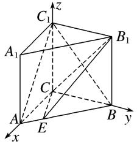
则<em>C</em>(0，0，0)，<em>A</em>(3，0，0)，<em>C</em>1(0，0，4)，<em>B</em>(0，4，0)，<em>B</em>1(0，4，4)．
因为＝(－3，0，0)，＝(0，－4，4)，所以·＝0，所以⊥，即<em>AC</em>⊥<em>BC</em>1．  
（2）假设在<em>AB</em>上存在点<em>E</em>，使得<em>AC</em>1∥平面<em>CEB</em>1，设＝<em>t</em>＝(－3<em>t，</em>4<em>t，</em>0)，其中0≤<em>t</em>≤1．
则*E*(3－3*t，* 4*t，* 0)，＝(3－3*t，* 4*t*－4，－4)，＝(0，－4，－4)．
又因为＝*m*＋*n*成立，所以*m*(3－3*t*)＝－3，*m*(4*t*－4)－4*n*＝0，－4*m*－4*n*＝4，解得*t*＝．
所以在<em>AB</em>上存在点<em>E</em>，使得<em>AC</em>1∥平面<em>CEB</em>1，这时点<em>E</em>为<em>AB</em>的中点．

<strong>[例2]</strong>　如图，棱柱<em>ABCD－A</em>1<em>B</em>1<em>C</em>1<em>D</em>1的所有棱长都等于2，∠<em>ABC</em>和∠<em>A</em>1<em>AC</em>均为60°，平面<em>AA</em>1<em>C</em>1<em>C</em>⊥平面<em>ABCD</em>．  
（1）求证：<em>BD</em>⊥<em>AA</em>1；  
（2）在直线<em>CC</em>1上是否存在点<em>P</em>，使<em>BP</em>∥平面<em>DA</em>1<em>C</em>1，若存在，求出点<em>P</em>的位置；若不存在，请说明理由．

解析　（1）设<em>BD</em>与<em>AC</em>交于点<em>O</em>，则<em>BD</em>⊥<em>AC</em>，连接<em>A</em>1<em>O</em>，
在△<em>AA</em>1<em>O</em>中，<em>AA</em>1＝2，<em>AO</em>＝1，∠<em>A</em>1<em>AO</em>＝60°，∴<em>A</em>1<em>O</em>2＝<em>AA</em>＋<em>AO</em>2－2<em>AA</em>1·<em>AO</em>cos 60°＝3，
∴<em>AO</em>2＋<em>A</em>1<em>O</em>2＝<em>AA</em>，∴<em>A</em>1<em>O</em>⊥<em>AO</em>．
由于平面<em>AA</em>1<em>C</em>1<em>C</em>⊥平面<em>ABCD</em>，且平面<em>AA</em>1<em>C</em>1<em>C</em>∩平面<em>ABCD</em>＝<em>AC</em>，<em>A</em>1<em>O</em>⊂平面<em>AA</em>1<em>C</em>1<em>C</em>，
∴<em>A</em>1<em>O</em>⊥平面<em>ABCD</em>．以<em>OB</em>，<em>OC</em>，<em>OA</em>1所在直线分别为<em>x</em>轴，<em>y</em>轴，<em>z</em>轴，建立如图所示的空间直角坐标系，则<em>A</em>(0，－1，0)，<em>B</em>(，0，0)，<em>C</em>(0，1，0)，<em>D</em>(－，0，0)，<em>A</em>1(0，0，)，<em>C</em>1(0，2，)．
由于＝(－2，0，0)，＝(0，1，)，·＝0×(－2)＋1×0＋×0＝0，
∴⊥，即<em>BD</em>⊥<em>AA</em>1．

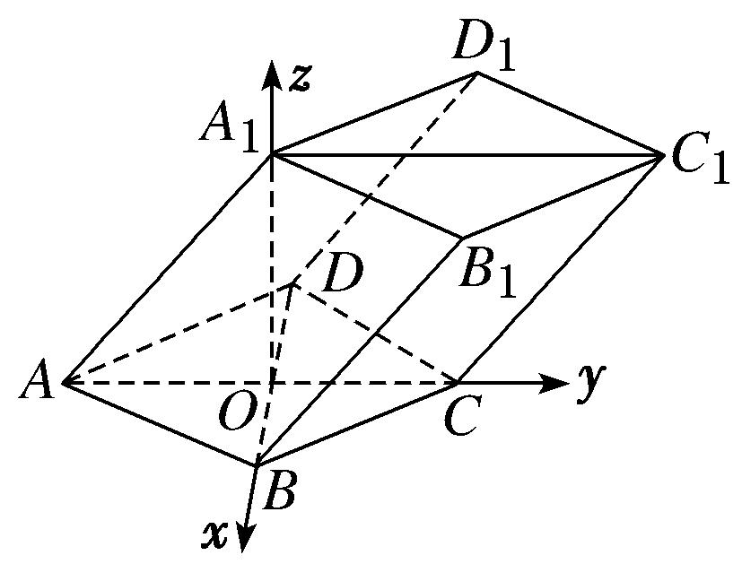  
（2）假设在直线<em>CC</em>1上存在点<em>P</em>，使<em>BP</em>∥平面<em>DA</em>1<em>C</em>1，
设＝*λ*，*P*(*x*，*y*，*z*)，则(*x*，*y*－1，*z*)＝*λ*(0，1，)．
从而有*P*(0，1＋*λ*，*λ*)，＝(－，1＋*λ*，*λ*)．
设平面<em>DA</em>1<em>C</em>1的法向量为<em>n</em>3＝(<em>x</em>3，<em>y</em>3，<em>z</em>3)，则
又＝(0，2，0)，＝(，0，)，则

取<em>n</em>3＝(1，0，－1)，因为<em>BP</em>∥平面<em>DA</em>1<em>C</em>1，则<em>n</em>3⊥，即<em>n</em>3·＝－－<em>λ</em>＝0，得<em>λ</em>＝－1，
即点<em>P</em>在<em>C</em>1<em>C</em>的延长线上，且<em>C</em>1<em>C</em>＝<em>CP</em>．

<strong>[例3]</strong>　如图所示，在四棱锥<em>P</em>－<em>ABCD</em>中，平面<em>PAD</em>⊥平面<em>ABCD</em>，<em>PA</em>⊥<em>PD</em>，<em>PA</em>＝<em>PD</em>，<em>AB</em>⊥<em>AD</em>，<em>AB</em>＝1，<em>AD</em>＝2，<em>AC</em>＝<em>CD</em>＝．  
（1）求证：*PD*⊥平面*PAB*；  
（2）求直线*PB*与平面*PCD*所成角的正弦值；  
（3）在棱*PA*上是否存在点*M*，使得*BM*∥平面*PCD*？若存在，求的值；若不存在，说明理由．

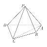
解析　（1）因为平面*PAD*⊥平面*ABCD*，平面*PAD*∩平面*ABCD*＝*AD*，*AB*⊥*AD*，
所以*AB*⊥平面*PAD*，所以*AB*⊥*PD．* 又因为*PA*⊥*PD*，*PA*∩*AB*＝*A*，所以*PD*⊥平面*PAB．*  
（2）取*AD*的中点*O*，连接*PO*，*CO*．因为*PA*＝*PD*，所以*PO*⊥*AD．* 又因为*PO*⊂平面*PAD*，

平面*PAD*⊥平面*ABCD*，平面*PAD*∩平面*ABCD*＝*AD*，所以*PO*⊥平面*ABCD．*
因为*CO*⊂平面*ABCD*，所以*PO*⊥*CO*．因为*AC*＝*CD*，所以*CO*⊥*AD．*
如图，建立空间直角坐标系*Oxyz*．

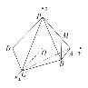
由题意得，*A*(0，1，0)，*B*(1，1，0)，*C*(2，0，0)，*D*(0，－1，0)，*P*(0，0，1)．
则*P*＝(0，－1，－1)，*P*＝(2，0，－1)．
设平面<em>PCD</em>的法向量为<em><strong>n</strong></em>＝(<em>x</em>，<em>y</em>，<em>z</em>)，则即
令<em>z</em>＝2，则<em>x</em>＝1，<em>y</em>＝－2，所以<em><strong>n</strong></em>＝(1，－2，2)．
又＝(1，1，－1)，所以cos＜*n*，＞＝＝－，
所以直线*PB*与平面*PCD*所成角的正弦值为．  
（3）设棱*PA*上存在点*M*，使得*BM*∥平面*PCD*，则存在*λ*∈[0，1]使得＝*λ*．
因此点*M*(0，1－*λ*，*λ*)，＝(－1，－*λ*，*λ*)．因为*BM*∥平面*PCD*，
所以·<em><strong>n</strong></em>＝0，即(－1，－<em>λ</em>，<em>λ</em>)·(1，－2，2)＝0，解得<em>λ</em>＝．
所以在棱*PA*上存在点*M*使得*BM*∥平面*PCD*，此时＝．

<strong>[例4]</strong>　在四棱锥<em>P</em>－<em>ABCD</em>中，<em>PD</em>⊥底面<em>ABCD</em>，底面<em>ABCD</em>为正方形，<em>PD</em>＝<em>DC</em>，<em>E</em>，<em>F</em>分别是<em>AB</em>，<em>PB</em>的中点．  
（1）求证：*EF*⊥*CD*；  
（2）在平面*PAD*内是否存在一点*G*，使*GF*⊥平面*PCB*？若存在，求出点*G*坐标；若不存在，试说明理由．
解析　（1）由题意知，*DA*，*DC*，*DP*两两垂直．如图，以*DA*，*DC*，*DP*所在直线分别为*x*轴，*y*轴，*z*轴建立空间直角坐标系，设*AD*＝*a*，则*D*(0，0，0)，*A*(*a，* 0，0)，*B*(*a*，*a，* 0)，*C*(0，*a，* 0)，*E*，*P*(0，0，a)，*F*．＝，＝(0，*a，* 0)．∵·＝0，∴⊥，从而得*EF*⊥*CD*．
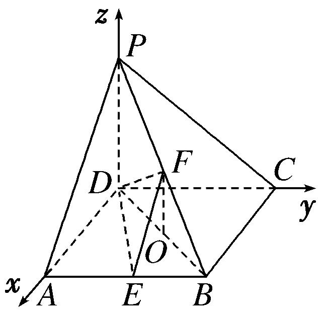  
（2）假设存在满足条件的点*G*，设*G*(*x，* 0，*z*)，则＝，
若使*GF*⊥平面*PCB*，则由·＝·(*a，* 0，0)＝*a*＝0，得*x*＝；
由·＝·(0，－*a*，*a*)＝＋a＝0，得*z*＝0．
∴*G*点坐标为，故存在满足条件的点*G*，且点*G*为*AD*的中点．

<strong>[例5]</strong>　如图，正三角形<em>ABC</em>的边长为4，<em>CD</em>为<em>AB</em>边上的高，<em>E</em>，<em>F</em>分别是<em>AC</em>和<em>BC</em>边的中点，现将△<em>ABC</em>沿<em>CD</em>翻折成直二面角<em>A</em>－<em>DC</em>－<em>B．</em>  
（1）试判断直线*AB*与平面*DEF*的位置关系，并说明理由；  
（2）在线段*BC*上是否存在一点*P*，使*AP*⊥*DE*？如果存在，求出的值；如果不存在，请说明理由．

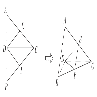
解析　（1）*AB*∥平面*DEF*．理由如下：
在△*ABC*中，由*E*，*F*分别是*AC*，*BC*的中点，得*EF*∥*AB．*
又因为*AB*⊄平面*DEF*，*EF*⊂平面*DEF*，所以*AB*∥平面*DEF*．

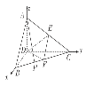  
（2）以点*D*为坐标原点，直线*DB*，*DC*，*DA*分别为*x*轴、*y*轴、*z*轴，建立空间直角坐标系(如图所示)，
则*D*(0，0，0)，*A*(0，0，2)，*B*(2，0，0)，*C*(0，2，0)，*E*(0，，1)，故＝(0，，1)．
假设存在点*P*(*x*，*y，* 0)满足条件，则＝(*x*，*y*，－2)，·＝*y*－2＝0，所以*y*＝．
又＝(*x*－2，*y，* 0)，＝(－*x，* 2－*y，* 0)，∥，
所以(*x*－2)(2－*y*)＝－*xy*，所以*x*＋*y*＝2．把*y*＝代入上式得*x*＝，所以＝，
所以在线段*BC*上存在点*P*使*AP*⊥*DE*，此时＝．

<strong>[例6]</strong>　(2019·北京)如图，在四棱锥<em>P</em>－<em>ABCD</em>中，<em>PA</em>⊥平面<em>ABCD</em>，<em>AD</em>⊥<em>CD</em>，<em>AD</em>∥<em>BC</em>，<em>PA</em>＝<em>AD</em>＝<em>CD</em>＝2，<em>BC</em>＝3．<em>E</em>为<em>PD</em>的中点，点<em>F</em>在<em>PC</em>上，且＝．  
（1）求证：*CD*⊥平面*PAD*；  
（2）求二面角*F*－*AE*－*P*的余弦值；  
（3）设点*G*在*PB*上，且＝．判断直线*AG*是否在平面*AEF*内，说明理由．

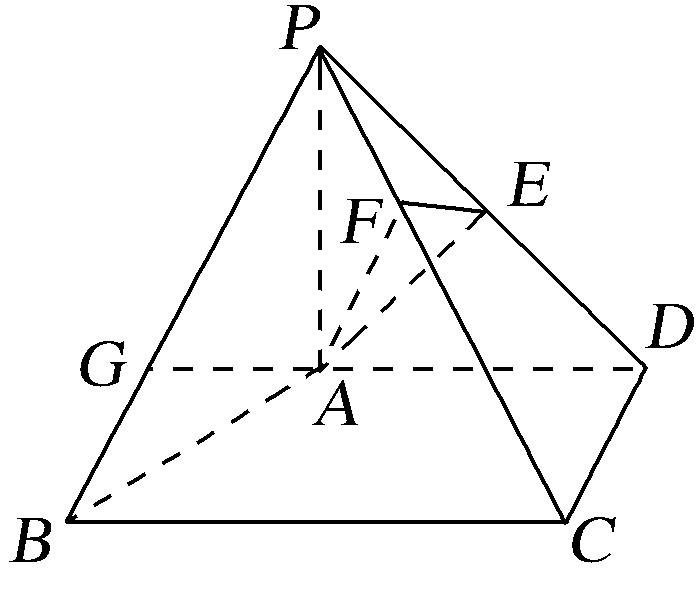
解析　（1）因为*PA*⊥平面*ABCD*，*CD*⊂平面*ABCD*，所以*PA*⊥*CD*．
又因为*AD*⊥*CD*，*PA*∩*AD*＝*A*，*PA*，*AD*⊂平面*PAD*，所以*CD*⊥平面*PAD*．  
（2）过点*A*作*AD*的垂线交*BC*于点*M*．因为*PA*⊥平面*ABCD*，*AM*，*AD*⊂平面*ABCD*，
所以*PA*⊥*AM*，*PA*⊥*AD*．建立如图所示的空间直角坐标系*A*－*xyz*，
则*A*(0，0，0)，*B*(2，－1，0)，*C*(2，2，0)，*D*(0，2，0)，*P*(0，0，2)．

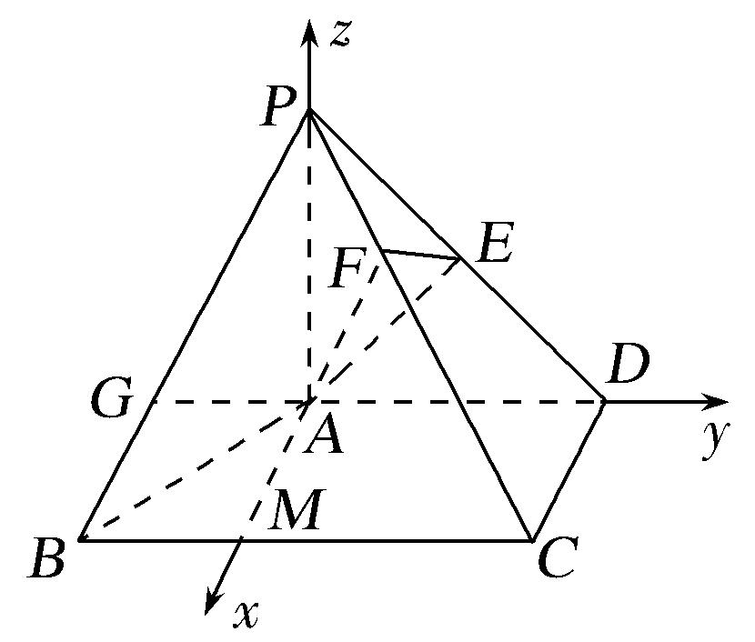
因为*E*为*PD*的中点，所以*E*(0，1，1)．所以＝(0，1，1)，＝(2，2，－2)，＝(0，0，2)．
所以＝＝，所以＝＋＝．
设平面<em>AEF</em>的法向量为<em><strong>n</strong></em>＝(<em>x</em>，<em>y</em>，<em>z</em>)，则即令<em>z</em>＝1，则<em>y</em>＝－1，<em>x</em>＝－1．
于是<em><strong>n</strong></em>＝(－1，－1，1)．又因为平面<em>PAD</em>的一个法向量为<em><strong>p</strong></em>＝(1，0，0)，
所以cos＜<em><strong>n</strong></em>，<em><strong>p</strong></em>＞＝＝－．由题知，二面角<em>F</em>－<em>AE</em>－<em>P</em>为锐角，所以其余弦值为．  
（3）直线*AG*在平面*AEF*内，理由如下：
因为点*G*在*PB*上，且＝，＝(2，－1，－2)，所以＝＝，
所以＝＋＝．由（2）知，平面<em>AEF</em>的一个法向量<em><strong>n</strong></em>＝(－1，－1，1)，
所以·<em><strong>n</strong></em>＝－＋＋＝0．又点<em>A</em>∈平面<em>AEF</em>，所以直线<em>AG</em>在平面<em>AEF</em>内．

【对点训练】

1．如图，在长方体<em>ABCD</em>－<em>A</em>1<em>B</em>1<em>C</em>1<em>D</em>1中，<em>AA</em>1＝<em>AD</em>＝1，<em>E</em>为<em>CD</em>的中点．  
（1）求证：<em>B</em>1<em>E</em>⊥<em>AD</em>1；  
（2）在棱<em>AA</em>1上是否存在一点<em>P</em>，使得<em>DP</em>∥平面<em>B</em>1<em>AE</em>？若存在，求<em>AP</em>的长；若不存在，说明理由．

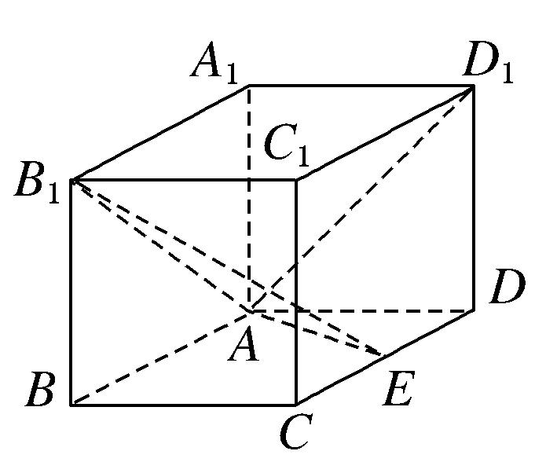

1．解析　以*A*为原点，，，的方向分别为*x*轴，*y*轴，*z*轴的正方向建立如图所示的空间直角

坐标系．设*AB*＝*a*．

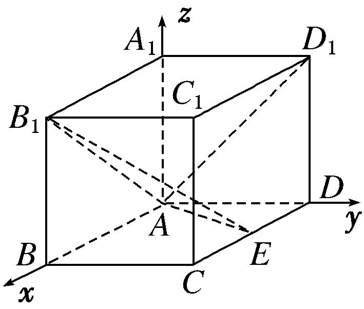  
（1）<em>A</em>(0，0，0)，<em>D</em>(0，1，0)，<em>D</em>1(0，1，1)，<em>E</em>，<em>B</em>1(<em>a，</em>0，1)，故＝(0，1，1)，＝，因为·＝－×0＋1×1＋(－1)×1＝0，所以<em>B</em>1<em>E</em>⊥<em>AD</em>1．  
（2）假设在棱<em>AA</em>1上存在一点<em>P</em>(0，0，<em>z</em>0)，使得<em>DP</em>∥平面<em>B</em>1<em>AE</em>，此时＝(0，－1，<em>z</em>0)，再设平面<em>B</em>1<em>AE</em>的一个法向量为<em>n</em>＝(<em>x</em>，<em>y</em>，<em>z</em>)，＝(<em>a，</em>0，1)，＝．因为<em><strong>n</strong></em>⊥平面<em>B</em>1<em>AE</em>，所以<em><strong>n</strong></em>⊥，n⊥，得取<em>x</em>＝1，得<em>y</em>＝－，<em>z</em>＝－<em>a</em>，得平面<em>B</em>1<em>AE</em>的一个法向量<em><strong>n</strong></em>＝．要使<em>DP</em>∥平面<em>B</em>1<em>AE</em>，只要<em><strong>n</strong></em>⊥，有－<em>az</em>0＝0，解得<em>z</em>0＝．又<em>DP</em>⊄平面<em>B</em>1<em>AE</em>，所以存在点<em>P</em>，满足<em>DP</em>∥平面<em>B</em>1<em>AE</em>，此时<em>AP</em>＝．

2．如图，在各棱长均为2的三棱柱<em>ABC</em>－<em>A</em>1<em>B</em>1<em>C</em>1中，侧面<em>A</em>1<em>ACC</em>1⊥底面<em>ABC</em>，∠<em>A</em>1<em>AC</em>＝60°．  
（1）求侧棱<em>AA</em>1与平面<em>AB</em>1<em>C</em>所成角的正弦值的大小；  
（2）已知点<em>D</em>满足＝＋，在直线<em>AA</em>1上是否存在点<em>P</em>，使<em>DP</em>∥平面<em>AB</em>1<em>C</em>?若存在，请确定点<em>P</em>的位置；若不存在，请说明理由．

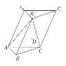

2．解析　（1）因为侧面<em>A</em>1<em>ACC</em>1⊥底面<em>ABC</em>，作<em>A</em>1<em>O</em>⊥<em>AC</em>于点<em>O</em>，所以<em>A</em>1<em>O</em>⊥平面<em>ABC</em>，所以<em>A</em>1<em>O</em>⊥<em>BO</em>．
又∠<em>A</em>1<em>AC</em>＝60°，且各棱长均为2，所以<em>AO</em>＝1，<em>OA</em>1＝<em>OB</em>＝，<em>BO</em>⊥<em>AC</em>．
故以*O*为坐标原点，建立如图所示的空间直角坐标系*Oxyz*，

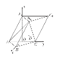
则<em>A</em>(0，－1，0)，<em>B</em>(，0，0)，<em>A</em>1(0，0，)，<em>C</em>(0，1，0)，<em>B</em>1(，1，)，
所以＝(0，1，)，＝(，2，)，＝(0，2，0)．
设平面<em>AB</em>1<em>C</em>的一个法向量为<em><strong>n</strong></em>＝(<em>x</em>，<em>y，</em>1)，则解得<em><strong>n</strong></em>＝(－1，0，1)．
所以cos＜，*n*＞＝＝＝．
所以侧棱<em>AA</em>1与平面<em>AB</em>1<em>C</em>所成角的正弦值的大小为．  
（2）因为*B*＝*B*＋*B*，而*B*＝(－，－1，0)，*B*＝(－，1，0)，所以*B*＝(－2，0，0)．
又因为*B*(，0，0)，所以点*D*的坐标为(－，0，0)．
假设存在点*P*符合题意，则其坐标可设为*P*(0，*y*，*z*)，所以*D*＝(，*y*，*z*)．
因为<em>DP</em>∥平面<em>AB</em>1<em>C</em>，<em><strong>n</strong></em>＝(－1，0，1)为平面<em>AB</em>1<em>C</em>的一个法向量，所以<em>D</em>·<em><strong>n</strong></em>＝0，即<em>z</em>＝．
因为*A*＝(0，*y*＋1，*z*)，则由*A*＝*λ*得所以*y*＝0．
又<em>DP</em>⊄平面<em>AB</em>1<em>C</em>，故存在点<em>P</em>，使<em>DP</em>∥平面<em>AB</em>1<em>C</em>，其坐标为(0，0，)，即恰好为点<em>A</em>1．

3．如图所示，四棱锥*S*－*ABCD*的底面是正方形，每条侧棱的长都是底面边长的倍，点*P*为侧棱*SD*上

的点．  
（1）求证：*AC*⊥*SD*；  
（2）若*SD*⊥平面*PAC*，则侧棱*SC*上是否存在一点*E*，使得*BE*∥平面*PAC*．若存在，求*SE*∶*EC*的值；若不存在，试说明理由．

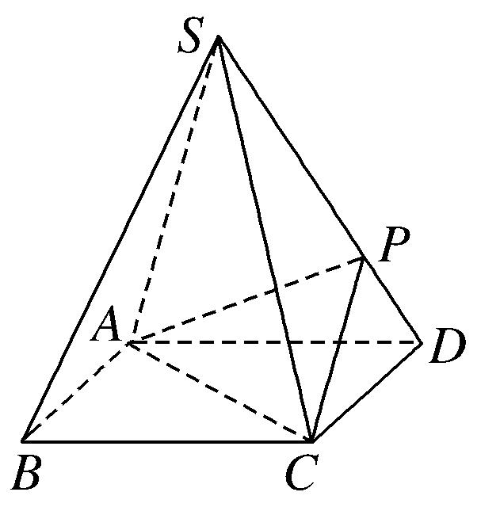

3．解析　（1）连接*BD*，设*AC*交*BD*于点*O*，则*AC*⊥*BD*．连接*SO*，由题意知*SO*⊥平面*ABCD*．

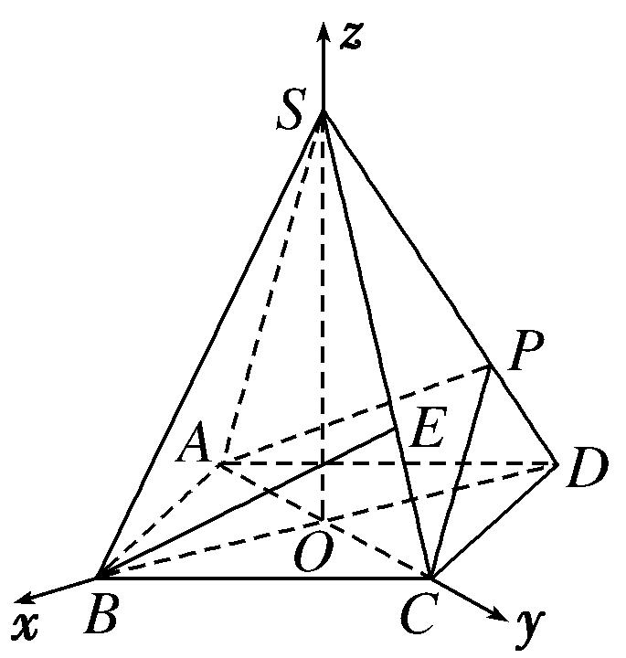

以*O*为坐标原点，，，所在直线分别为*x*轴，*y*轴，*z*轴，建立空间直角坐标系，如图．

底面边长为*a*，则高*SO*＝*a*，于是*S*，*D*，*B*，*C*，

＝，＝，则·＝0．故*OC*⊥*SD*．从而*AC*⊥*SD*．  
（2）棱*SC*上存在一点*E*，使*BE*∥平面*PAC*．理由如下：
由已知条件知是平面*PAC*的一个法向量，且＝， ＝，

＝．设＝*t*，则＝＋＝＋*t*

＝，而·＝0⇒*t*＝．
即当*SE*∶*EC*＝2∶1时，⊥．而*BE*⊄平面*PAC*，故*BE*∥平面*PAC*．

4．如图所示，在四棱柱<em>ABCD</em>－<em>A</em>1<em>B</em>1<em>C</em>1<em>D</em>1中，侧棱<em>A</em>1<em>A</em>⊥底面<em>ABCD</em>，<em>AB</em>⊥<em>AC</em>，<em>AB</em>＝1，<em>AC</em>＝<em>AA</em>1＝2，

<em>AD</em>＝<em>CD</em>＝，<em>E</em>为棱<em>AA</em>1上的点，且<em>AE</em>＝．  
（1）求证：<em>BE</em>⊥平面<em>ACB</em>1；  
（2）求二面角<em>D</em>1－<em>AC</em>－<em>B</em>1的余弦值；  
（3）在棱<em>A</em>1<em>B</em>1上是否存在点<em>F</em>，使得直线<em>DF</em>∥平面<em>ACB</em>1？若存在，求<em>A</em>1<em>F</em>的长；若不存在，请说明理由．

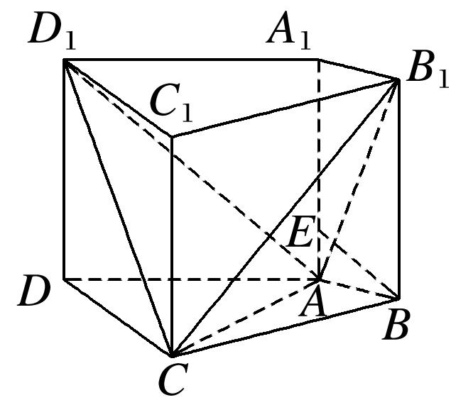

4．解析　（1）因为<em>A</em>1<em>A</em>⊥底面<em>ABCD</em>，所以<em>A</em>1<em>A</em>⊥<em>AC</em>．
又因为<em>AB</em>⊥<em>AC</em>，<em>AA</em>1∩<em>AB</em>＝<em>A</em>，且<em>AA</em>1，<em>AB</em>⊂平面<em>ABB</em>1<em>A</em>1，所以<em>AC</em>⊥平面<em>ABB</em>1<em>A</em>1，
又因为<em>BE</em>⊂平面<em>ABB</em>1<em>A</em>1，所以<em>AC</em>⊥<em>BE</em>．
因为＝＝，所以∠<em>ABE</em>＝∠<em>AB</em>1<em>B</em>．
因为∠<em>BAB</em>1＋∠<em>AB</em>1<em>B</em>＝90°，所以∠<em>BAB</em>1＋∠<em>ABE</em>＝90°，所以<em>BE</em>⊥<em>AB</em>1．
又<em>AB</em>1∩<em>AC</em>＝<em>A</em>，且<em>AB</em>1，<em>AC</em>⊂平面<em>ACB</em>1，所以<em>BE</em>⊥平面<em>ACB</em>1．  
（2）如图，以<em>A</em>为原点建立空间直角坐标系<em>A</em>－<em>xyz</em>，依题意可得<em>A</em>(0，0，0)，<em>B</em>(0，1，0)，<em>C</em>(2，0，0)，<em>D</em>(1，－2，0)，<em>D</em>1(1，－2，2)，<em>E</em>．由（1）知，＝为平面<em>ACB</em>1的一个法向量．

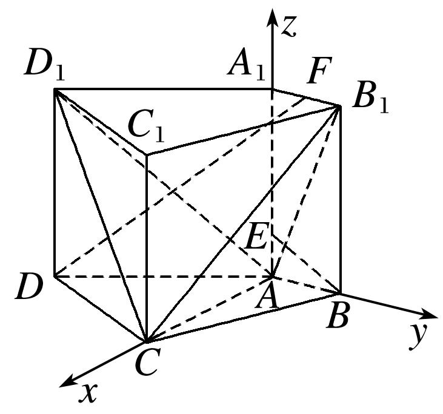
设<em><strong>n</strong></em>＝(<em>x</em>，<em>y</em>，<em>z</em>)为平面<em>ACD</em>1的法向量．因为＝(1，－2，2)，＝(2，0，0)，
所以即不妨设<em>z</em>＝1，可得<em><strong>n</strong></em>＝(0，1，1)．
因此cos＜*n*，＞＝＝．
由图可知二面角<em>D</em>1－<em>AC</em>－<em>B</em>1为锐角，所以二面角<em>D</em>1－<em>AC</em>－<em>B</em>1的余弦值为．  
（3）假设存在满足题意的点<em>F</em>．设<em>A</em>1<em>F</em>＝<em>a</em>(<em>a</em>&gt;0)，则由（2）得<em>F</em>(0，<em>a，</em>2)，＝(－1，<em>a</em>＋2，2)．
由题意可知·＝(－1，*a*＋2，2)·＝*a*＋2－1＝0，解得*a*＝－1(舍去)，
即直线<em>DF</em>的方向向量与平面<em>ACB</em>1的法向量不垂直．
所以，在棱<em>A</em>1<em>B</em>1上不存在点<em>F</em>，使得直线<em>DF</em>∥平面<em>ACB</em>1．

5．在四棱锥*P*－*ABCD*中，*AB*⊥*AD*，*CD*⊥*AD*，*PA*⊥底面*ABCD*，*PA*＝*AD*＝*CD*＝2*AB*＝2，*M*为*PC*的中

点．  
（1）求证：*BM*∥平面*PAD*；  
（2）平面*PAD*内是否存在一点*N*，使*MN*⊥平面*PBD*？若存在，确定*N*的位置；若不存在，说明理由．

5．解析　（1）以*A*为原点，以*AB*，*AD*，*AP*所在直线分别为*x*轴、*y*轴、*z*轴建立空间直角坐标系，
则*B*(1，0，0)，*D*(0，2，0)，*P*(0，0，2)，*C*(2，2，0)，*M*(1，1，1)，

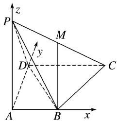
∵＝(0，1，1)，平面<em>PAD</em>的一个法向量为<em><strong>n</strong></em>＝(1，0，0)，∴·<em><strong>n</strong></em>＝0，即⊥<em><strong>n</strong></em>，
又*BM*⊄平面*PAD*，∴*BM*∥平面*PAD*．  
（2）由（1）知，＝(－1，2，0)，＝(1，0，－2)，假设平面*PAD*内存在一点*N*，使*MN*⊥平面*PBD*．
设*N*(0，*y*，*z*)，则＝(－1，*y*－1，*z*－1)，从而*MN*⊥*BD*，*MN*⊥*PB*，
∴即∴∴*N*，
∴在平面*PAD*内存在一点*N*，使*MN*⊥平面*PBD*．

6．如图所示，在正方体<em>ABCD</em>－<em>A</em>1<em>B</em>1<em>C</em>1<em>D</em>1中，点<em>O</em>是<em>AC</em>与<em>BD</em>的交点，点<em>E</em>是线段<em>OD</em>1上的一点．  
（1）若点<em>E</em>为<em>OD</em>1的中点，求直线<em>OD</em>1与平面<em>CDE</em>所成角的正弦值；  
（2）是否存在点<em>E</em>，使得平面<em>CDE</em>⊥平面<em>CD</em>1<em>O</em>？若存在，请指出点<em>E</em>的位置，并加以证明；若不存在，请说明理由．

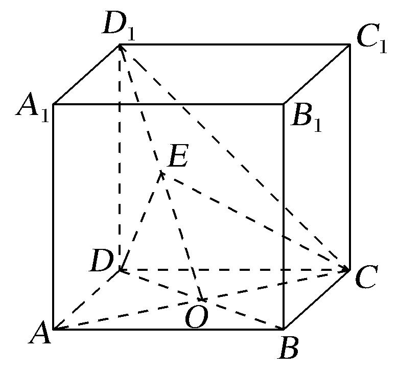

6．解析　（1）不妨设正方体的棱长为2．以<em>D</em>为坐标原点，分别以<em>DA</em>，<em>DC</em>，<em>DD</em>1所在直线分别为<em>x</em>轴，

*y*轴，*z*轴，建立如图所示的空间直角坐标系*D*－*xyz*，

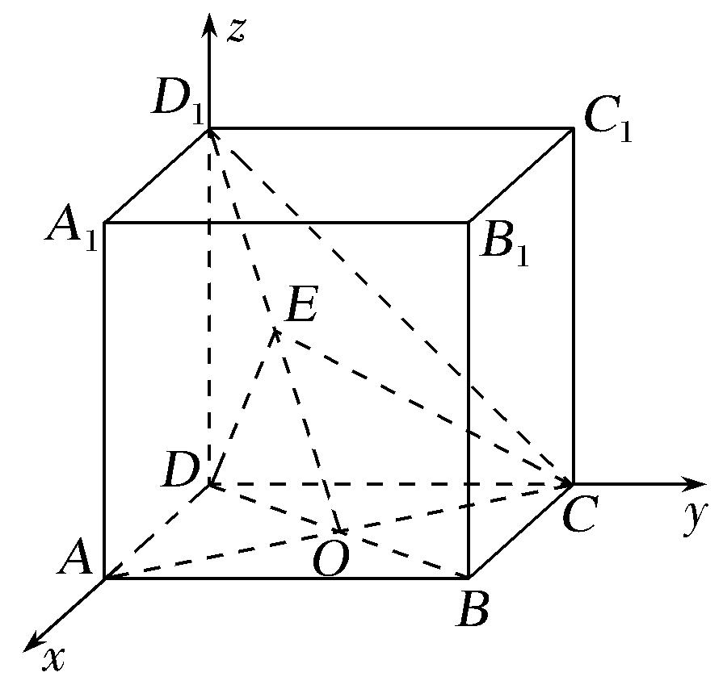
则<em>D</em>(0，0，0)，<em>D</em>1(0，0，2)，<em>C</em>(0，2，0)，<em>O</em>(1，1，0)．因为<em>E</em>为<em>OD</em>1的中点，所以<em>E</em>．
则＝(－1，－1，2)，＝，＝(0，2，0)．
设<em><strong>p</strong></em>＝(<em>x</em>0，<em>y</em>0，<em>z</em>0)是平面<em>CDE</em>的法向量，则即

取<em>x</em>0＝2，则<em>y</em>0＝0，<em>z</em>0＝－1，所以<em><strong>p</strong></em>＝(2，0，－1)为平面<em>CDE</em>的一个法向量．
设直线<em>OD</em>1与平面<em>CDE</em>所成角为<em>θ</em>，
所以sin <em>θ</em>＝|cos＜，<em><strong>p</strong></em>＞|＝＝＝，
即直线<em>OD</em>1与平面<em>CDE</em>所成角的正弦值为．  
（2）存在，且点<em>E</em>为线段<em>OD</em>1上靠近点<em>O</em>的三等分点．理由如下．
假设存在点<em>E</em>，使得平面<em>CDE</em>⊥平面<em>CD</em>1<em>O</em>．同第（1）问建立空间直角坐标系，易知点<em>E</em>不与点<em>O</em>重合，
设＝*λ*，*λ*∈[0，＋∞)，＝(－1，1，0)，＝(－1，－1，2)．
设<em><strong>m</strong></em>＝(<em>x</em>1，<em>y</em>1，<em>z</em>1)是平面<em>CD</em>1<em>O</em>的法向量，则即

取<em>x</em>1＝1，则<em>y</em>1＝1，<em>z</em>1＝1，所以<em><strong>m</strong></em>＝(1，1，1)为平面<em>CD</em>1<em>O</em>的一个法向量．
因为＝*λ*，所以点*E*的坐标为，所以＝．
设<em><strong>n</strong></em>＝(<em>x</em>2，<em>y</em>2，<em>z</em>2)是平面<em>CDE</em>的法向量，则即

取<em>x</em>2＝1，则<em>y</em>2＝0，<em>z</em>2＝－，所以<em><strong>n</strong></em>＝为平面<em>CDE</em>的一个法向量．
因为平面<em>CDE</em>⊥平面<em>CD</em>1<em>O</em>，所以<em><strong>m</strong></em>⊥<em><strong>n</strong></em>．则<em><strong>m</strong></em>·<em><strong>n</strong></em>＝0，所以1－＝0，解得<em>λ</em>＝2．
所以当＝2，即点<em>E</em>为线段<em>OD</em>1上靠近点<em>O</em>的三等分点时，平面<em>CDE</em>⊥平面<em>CD</em>1<em>O</em>．

考点二　探究线面的数量关系

<strong>[例1]</strong>　如图所示，在四棱锥<em>P</em>－<em>ABCD</em>中，侧面<em>PAD</em>⊥底面<em>ABCD</em>，底面<em>ABCD</em>是平行四边形，∠<em>ABC</em>＝45°，<em>AD</em>＝<em>AP</em>＝2，<em>AB</em>＝<em>DP</em>＝2，<em>E</em>为<em>CD</em>的中点，点<em>F</em>在线段<em>PB</em>上．  
（1）求证：*AD*⊥*PC*；  
（2）试确定点*F*的位置，使得直线*EF*与平面*PDC*所成的角和直线*EF*与平面*ABCD*所成的角相等．

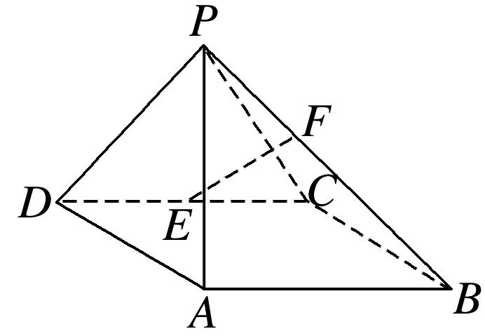
解析　（1）如图所示，在平行四边形*ABCD*中，连接*AC*，
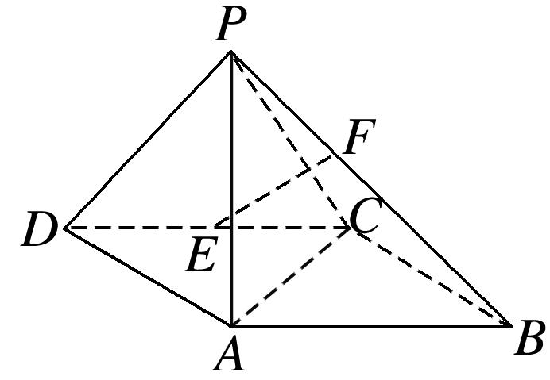
因为<em>AB</em>＝2，<em>BC</em>＝2，∠<em>ABC</em>＝45°，由余弦定理得，<em>AC</em>2＝<em>AB</em>2＋<em>BC</em>2－2·<em>AB</em>·<em>BC</em>·cos 45°＝4，
得*AC*＝2，所以∠*ACB*＝90°，即*BC*⊥*AC*．
又*AD*∥*BC*，所以*AD*⊥*AC*．因为*AD*＝*AP*＝2，*DP*＝2，所以*PA*⊥*AD*，
又*AP*∩*AC*＝*A*，*AP*，*AC*⊂平面*PAC*，所以*AD*⊥平面*PAC*，又*PC*⊂平面*PAC*，所以*AD*⊥*PC*．  
（2）因为侧面*PAD*⊥底面*ABCD*，*PA*⊥*AD*，侧面*PAD*∩底面*ABCD*＝*AD*，*PA*⊂侧面*PAD*，

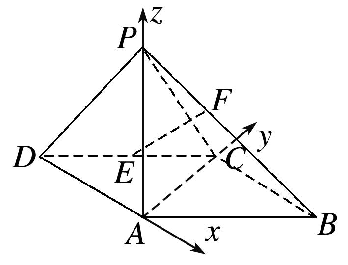
所以*PA*⊥底面*ABCD*，所以直线*AC*，*AD*，*AP*两两垂直，以*A*为原点，直线*AD*，*AC*，*AP*为坐标轴，

建立如图所示的空间直角坐标系*A*－*xyz*，
则*A*(0，0，0)，*D*(－2，0，0)，*C*(0，2，0)，*B*(2，2，0)，*E*(－1，1，0)，*P*(0，0，2)，
所以＝(0，2，－2)，＝(－2，0，－2)，＝(2，2，－2)．
设＝*λ*(*λ*∈[0，1])，则＝(2*λ*，2*λ*，－2*λ*)，*F*(2*λ*，2*λ*，－2*λ*＋2)，
所以＝(2<em>λ</em>＋1，2<em>λ</em>－1，－2<em>λ</em>＋2)．易得平面<em>ABCD</em>的一个法向量为<em><strong>m</strong></em>＝(0，0，1)．
设平面<em>PDC</em>的法向量为<em><strong>n</strong></em>＝(<em>x</em>，<em>y</em>，<em>z</em>)，由得
令<em>x</em>＝1，得<em><strong>n</strong></em>＝(1，－1，－1)．
因为直线*EF*与平面*PDC*所成的角和直线*EF*与平面*ABCD*所成的角相等，
所以|cos＜，<em><strong>m</strong></em>＞|＝|cos＜，<em><strong>n</strong></em>＞|，即＝，所以|－2<em>λ</em>＋2|＝，
即|*λ*－1|＝|*λ*|(*λ*∈[0，1])，解得*λ*＝，所以＝，
即当＝时，直线*EF*与平面*PDC*所成的角和直线*EF*与平面*ABCD*所成的角相等．

<strong>[例2]</strong>　在Rt△<em>ABC</em>中，∠<em>C</em>＝90°，<em>AC</em>＝4，<em>BC</em>＝2，<em>E</em>是<em>AC</em>的中点，<em>F</em>是线段<em>AB</em>上一个动点，且＝<em>λ</em>(0&lt;<em>λ</em>&lt;1)，如图所示，沿<em>BE</em>将△<em>CEB</em>翻折至△<em>DEB</em>的位置，使得平面<em>DEB</em>⊥平面<em>ABE</em>．  
（1）当*λ*＝时，证明：*BD*⊥平面*DEF*；  
（2）是否存在*λ*，使得*DF*与平面*ADE*所成角的正弦值是？若存在，求出*λ*的值；若不存在，请说明理由．

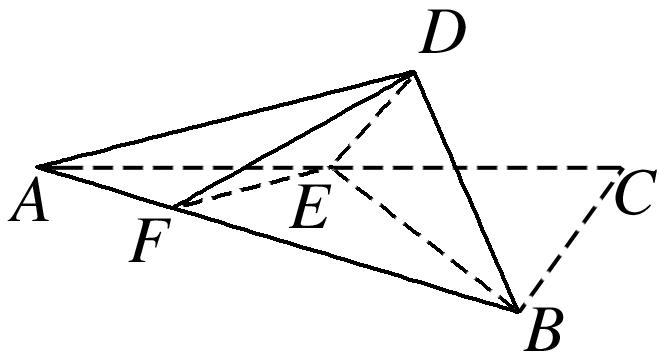
解析　（1）在△*ABC*中，∠*C*＝90°，即*AC*⊥*BC*，则*BD*⊥*DE*，取*BF*的中点*N*，连接*CN*交*BE*于点*M*，
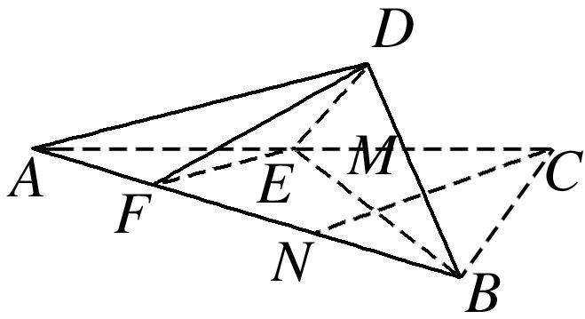
当*λ*＝时，*F*是*AN*的中点，而*E*是*AC*的中点，∴*EF*是△*ANC*的中位线，∴*EF*∥*CN*．
在△*BEF*中，*N*是*BF*的中点，∴*M*是*BE*的中点，
在Rt△*BCE*中，*EC*＝*BC*＝2，∴*CM*⊥*BE*，则*EF*⊥*BE*．
又平面*DEB*⊥平面*ABE*，平面*DEB*∩平面*ABE*＝*BE*，*EF*⊂平面*ABE*，∴*EF*⊥平面*DEB*．
又*BD*⊂平面*BDE*，∴*EF*⊥*BD*．而*EF*∩*DE*＝*E*，*EF*，*DE*⊂平面*DEF*，∴*BD*⊥平面*DEF*．  
（2）存在*λ*＝，使得*DF*与平面*ADE*所成角的正弦值是．

以*C*为坐标原点，*CA*所在直线为*x*轴，*CB*所在直线为*y*轴，建立如图所示的空间直角坐标系．

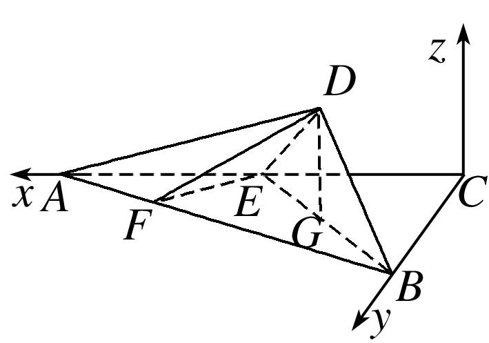
则*C*(0，0，0)，*A*(4，0，0)，*B*(0，2，0)，*E*(2，0，0)
∴＝(－4，2，0)，＝(－2，0，0)，取*BE*的中点*G*，连接*DG*，
则*DG*⊥*BE*，而平面*DEB*⊥平面*ABC*，
∴*DG*⊥平面*ABC*，则*D*(1，1，)，则＝(－3，1，)．
由＝*λ*，可得*F*(4－4*λ*，2*λ*，0)，则＝(3－4*λ*，2*λ*－1，－)．
设平面<em>ADE</em>的法向量为<em><strong>n</strong></em>＝(<em>x</em>，<em>y</em>，<em>z</em>)，则即
令<em>z</em>＝－1，则<em>x</em>＝0，<em>y</em>＝，所以<em><strong>n</strong></em>＝(0，，－1)
设*DF*与平面*ADE*所成的角为*θ*，则

sin <em>θ</em>＝|cos＜，<em><strong>n</strong></em>＞|＝＝＝，解得<em>λ</em>＝或<em>λ</em>＝3(舍去)．

综上，存在*λ*＝，使得*DF*与平面*ADE*所成的角的正弦值为．

<strong>[例3]</strong>　如图，正三角形<em>ABE</em>与菱形<em>ABCD</em>所在的平面互相垂直，<em>AB</em>＝2，∠<em>ABC</em>＝60°，<em>M</em>是<em>AB</em>的中点．  
（1）求证：*EM*⊥*AD*；  
（2）求二面角*A*－*BE*－*C*的余弦值；  
（3）在线段*EC*上是否存在点*P*，使得直线*AP*与平面*ABE*所成的角为45°，若存在，求出的值；若不存在，说明理由．

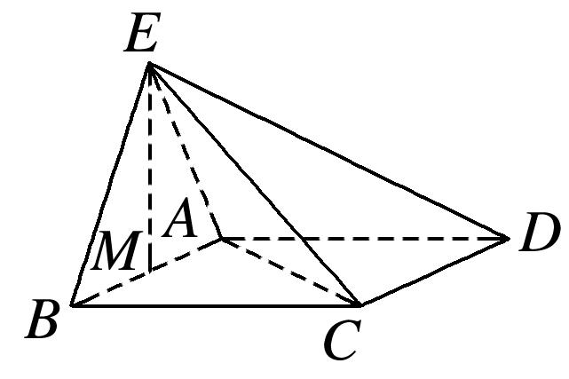
解析　（1）∵*EA*＝*EB*，*M*是*AB*的中点，∴*EM*⊥*AB*，
∵平面*ABE*⊥平面*ABCD*，平面*ABE*∩平面*ABCD*＝*AB*，*EM*⊂平面*ABE*，
∴*EM*⊥平面*ABCD*，*AD*⊂平面*ABCD*，∴*EM*⊥*AD*．  
（2）连接*MC*，∵*EM*⊥平面*ABCD*，∴*EM*⊥*MC*，
∵△*ABC*是正三角形，∴*MC*⊥*AB*，∴*MB*，*MC*，*ME*两两垂直．

建立如图所示空间直角坐标系*M*－*xyz*．

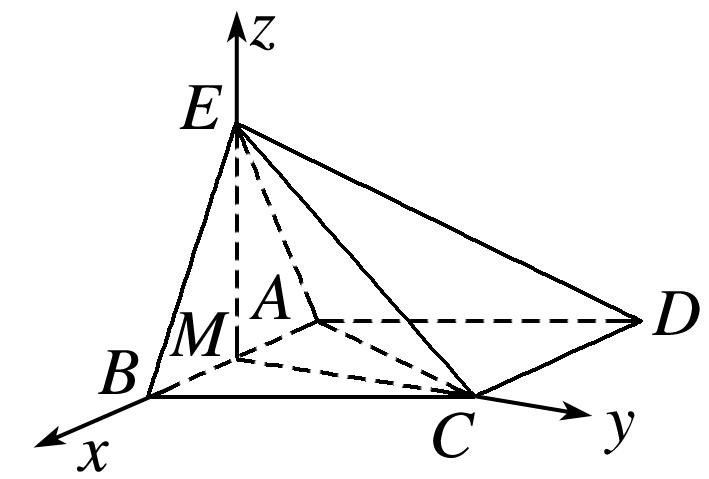
则*M*(0，0，0)，*A*(－1，0，0)，*B*(1，0，0)，*C*(0，，0)，*E*(0，0，)，

＝(－1，，0)，＝(－1，0，)，
设<em><strong>m</strong></em>＝(<em>x</em>，<em>y</em>，<em>z</em>)是平面<em>BCE</em>的一个法向量，则令<em>z</em>＝1，<em><strong>m</strong></em>＝(，1，1)，
∵<em>y</em>轴所在直线与平面<em>ABE</em>垂直，∴<em><strong>n</strong></em>＝(0，1，0)是平面<em>ABE</em>的一个法向量．

cos＜<em><strong>m</strong></em>，<em><strong>n</strong></em>＞＝＝＝，∴二面角<em>A</em>－<em>BE</em>－<em>C</em>的余弦值为．  
（3）假设在线段*EC*上存在点*P*，使得直线*AP*与平面*ABE*所成的角为45°，

＝(1，0，)，＝(0，，－)，
设＝*λ*＝(0，*λ*，－*λ*)，0<*λ*≤1，则＝＋＝(1，*λ*，－*λ*)，
∵直线*AP*与平面*ABE*所成的角为45°，
∴sin 45°＝|cos＜，<em><strong>n</strong></em>＞|＝＝＝，由0≤<em>λ</em>≤1，解得<em>λ</em>＝，
∴在线段*EC*上存在点*P*，使得直线*AP*与平面*ABE*所成的角为45°，且＝．

<strong>[例4]</strong>　如图，在直三棱柱<em>ABC</em>－<em>A</em>1<em>B</em>1<em>C</em>1中，△<em>ABC</em>是等腰直角三角形，∠<em>ACB</em>＝90°，<em>AB</em>＝4，<em>M</em>是<em>AB</em>的中点，且<em>A</em>1<em>M</em>⊥<em>B</em>1<em>C</em>．  
（1）求<em>A</em>1<em>A</em>的长；  
（2）已知点<em>N</em>在棱<em>CC</em>1上，若平面<em>B</em>1<em>AN</em>与平面<em>BCC</em>1<em>B</em>1夹角的余弦值为，试确定点<em>N</em>的位置．

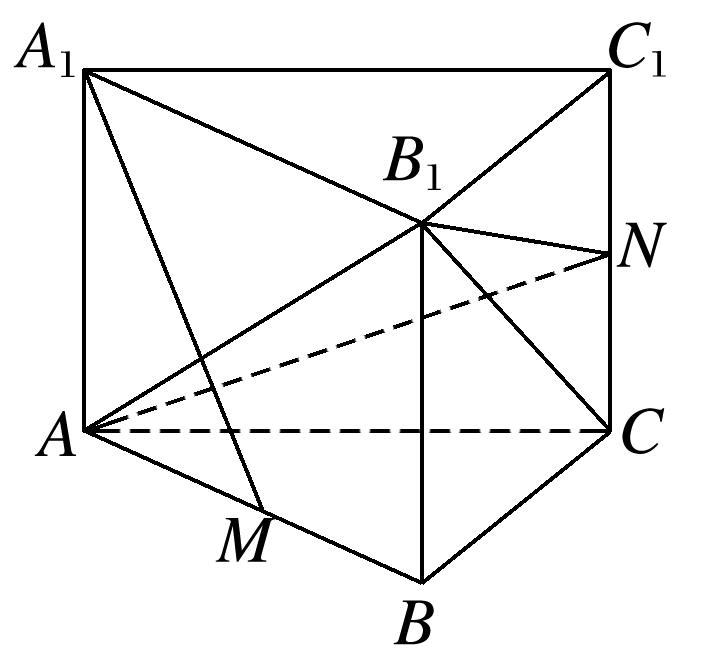
解析　（1）建立如图所示的空间直角坐标系．设<em>A</em>1<em>A</em>＝<em>a</em>．由<em>AB</em>＝4，得<em>AC</em>＝<em>BC</em>＝4，
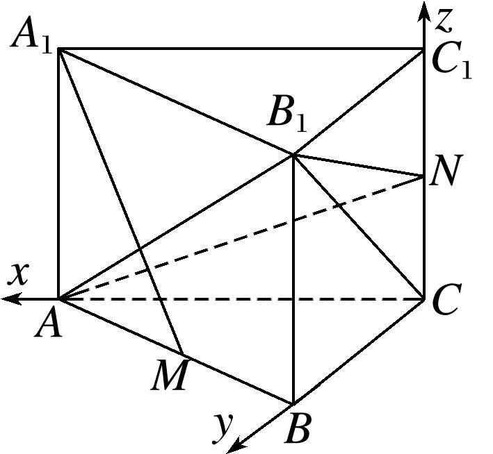
则<em>A</em>(4，0，0)，<em>C</em>(0，0，0)，<em>A</em>1(4，0，<em>a</em>)，<em>B</em>1(0，4，<em>a</em>)，<em>M</em>(2，2，0)，
所以＝(－2，2，－*a*)，＝(0，－4，－*a*)．
因为<em>A</em>1<em>M</em>⊥<em>B</em>1<em>C</em>，所以(－2)×0＋2×(－4)＋(－<em>a</em>)×(－<em>a</em>)＝0，解得<em>a</em>＝2，即<em>A</em>1<em>A</em>的长为2．  
（2）由（1）知<em>C</em>1(0，0，2)．设<em>N</em>(0，0，<em>λ</em>)(0≤<em>λ</em>≤2)，
所以＝(4，－4，－2)，＝(0，－4，*λ*－2)．
设平面<em>B</em>1<em>AN</em>的一个法向量为<em><strong>n</strong></em>1＝(<em>x</em>1，<em>y</em>1，<em>z</em>1)．由得

取<em><strong>n</strong></em>1＝．易知平面<em>BCC</em>1<em>B</em>1的一个法向量为<em><strong>n</strong></em>2＝(1，0，0)，
设平面<em>B</em>1<em>AN</em>与平面<em>BCC</em>1<em>B</em>1的夹角为<em>θ</em>，

cos <em>θ</em>＝|cos＜<em><strong>n</strong></em>1，<em><strong>n</strong></em>2＞|＝＝＝．
解得<em>λ</em>＝或<em>λ</em>＝－(舍去)，所以<em>N</em>在棱<em>CC</em>1的中点处．

<strong>[例5]</strong>　如图所示，在梯形<em>ABCD</em>中，<em>AB</em>∥<em>CD</em>，<em>AD</em>＝<em>DC</em>＝<em>CB</em>＝1，∠<em>BCD</em>＝120°，四边形<em>BFED</em>是以<em>BD</em>为直角腰的直角梯形，<em>DE</em>＝2<em>BF</em>＝2，平面<em>BFED</em>⊥平面<em>ABCD</em>．  
（1）求证：*AD*⊥平面*BFED*；  
（2）在线段*EF*上是否存在一点*P*，使得平面*PAB*与平面*ADE*所成的锐二面角的余弦值为？若存在，求出点*P*的位置；若不存在，说明理由．

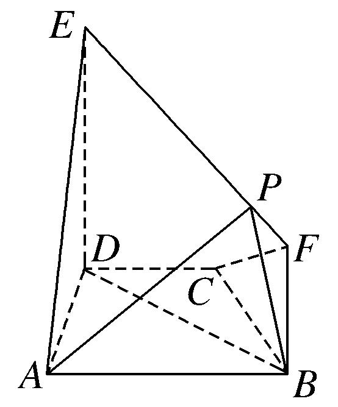
解析　（1）在梯形*ABCD*中，因为*AB*∥*CD*，*AD*＝*DC*＝*CB*＝1，∠*BCD*＝120°，
所以∠*CDB*＝30°，所以∠*ADB*＝90°，所以*BD*⊥*AD*．
因为平面*BFED*⊥平面*ABCD*，平面*BFED*∩平面*ABCD*＝*BD*，*AD*⊂平面*ABCD*，所以*AD*⊥平面*BFED*．

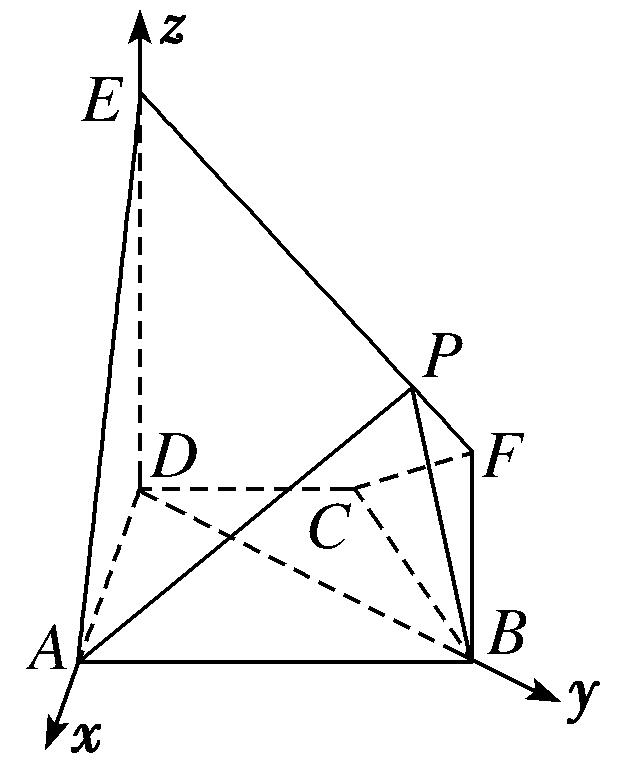  
（2）因为*AD*⊥平面*BFED*，所以*AD*⊥*DE*．

以*D*为原点，分别以*DA*，*DB*，*DE*所在直线为*x*轴，*y*轴，*z*轴建立如图所示的空间直角坐标系，
在△*BCD*中，*DC*＝*BC*＝1，∠*BCD*＝120°，由余弦定理得*BD*＝，
则*A*(1，0，0)，*B*(0，，0)，由题意，设*P*(0≤*λ*≤3)，
所以＝(－1，，0)，＝．

易知平面*EAD*的一个法向量为*m*＝(0，1，0)，
设平面*PAB*的法向量为*n*＝(*x*，*y*，*z*)，由得

取*y*＝1，可得*n*＝．
因为平面*PAB*与平面*ADE*所成的锐二面角的余弦值为，
所以|cos＜*m*，*n*＞|＝＝＝，
解得*λ*＝，∴线段*EF*上存在满足题意的点*P*，此时，＝＝，
即*P*为线段*EF*上靠近点*E*的三等分点．

<strong>[例6]</strong>　如图所示，在梯形<em>ABCD</em>中，<em>AB</em>∥<em>CD</em>，∠<em>BCD</em>＝120°，四边形<em>ACFE</em>为矩形，且<em>CF</em>⊥平面<em>ABCD</em>，<em>AD</em>＝<em>CD</em>＝<em>BC</em>＝<em>CF</em>．  
（1）求证：*EF*⊥平面*BCF*；  
（2）点*M*在线段*EF*上运动，当点*M*在什么位置时，平面*MAB*与平面*FCB*所成的锐二面角最大，并求此时二面角的余弦值．

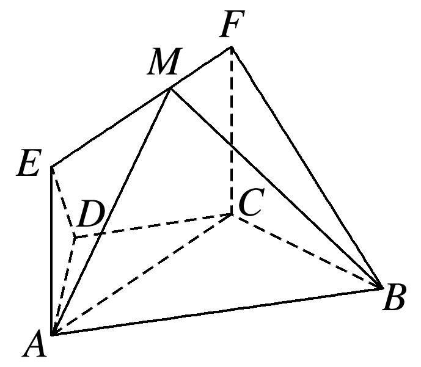
解析　（1）设*AD*＝*CD*＝*BC*＝1，∵*AB*∥*CD*，∠*BCD*＝120°，∴*AB*＝2，
∴<em>AC</em>2＝<em>AB</em>2＋<em>BC</em>2－2<em>AB</em>·<em>BC</em>·cos 60°＝3，∴<em>AB</em>2＝<em>AC</em>2＋<em>BC</em>2，则<em>BC</em>⊥<em>AC</em>．
∵*CF*⊥平面*ABCD*，*AC*⊂平面*ABCD*，∴*AC*⊥*CF*，而*CF*∩*BC*＝*C*，*CF*，*BC*⊂平面*BCF*，
∴*AC*⊥平面*BCF*．∵*EF*∥*AC*，∴*EF*⊥平面*BCF*．  
（2）以*C*为坐标原点，分别以直线*CA*，*CB*，*CF*为*x*轴、*y*轴、*z*轴建立如图所示的空间直角坐标系，

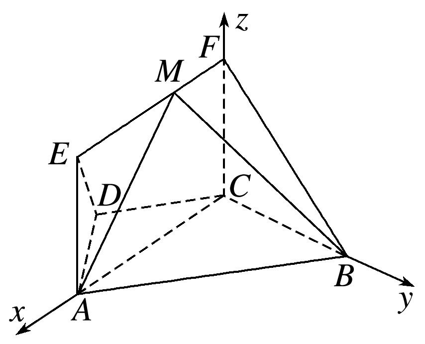
设*FM*＝*λ*(0≤*λ*≤)，则*C*(0，0，0)，*A*(，0，0)，*B*(0，1，0)，*M*(*λ*，0，1)，
∴＝(－，1，0)，＝(*λ*，－1，1)．
设<em><strong>n</strong></em>＝(<em>x</em>，<em>y</em>，<em>z</em>)为平面<em>MAB</em>的法向量，由得

取<em>x</em>＝1，则<em><strong>n</strong></em>＝(1，，－<em>λ</em>)．

易知<em><strong>m</strong></em>＝(1，0，0)是平面<em>FCB</em>的一个法向量，
∴cos<*n*，*m*>＝＝＝ ．
∵0≤<em>λ</em>≤，∴当<em>λ</em>＝0时，cos&lt;<em><strong>n</strong></em>，<em><strong>m</strong></em>&gt;取得最小值，
∴当点*M*与点*F*重合时，平面*MAB*与平面*FCB*所成的锐二面角最大，此时二面角的余弦值为．

<strong>[例7]</strong>　如图，在四棱锥<em>P</em>－<em>ABCD</em>中，<em>PA</em>⊥平面<em>ABCD</em>，<em>AD</em>∥<em>BC</em>，<em>AD</em>⊥<em>CD</em>，且<em>AD</em>＝<em>CD</em>＝，<em>BC</em>＝2，<em>PA</em>＝2．  
（1）取*PC*的中点*N*，求证：*DN*∥平面*PAB*；  
（2）求直线*AC*与*PD*所成角的余弦值；  
（3）在线段*PD*上，是否存在一点*M*，使得平面*MAC*与平面*ACD*的夹角为45°？如果存在，求出*BM*与平面*MAC*所成角的大小；如果不存在，请说明理由．

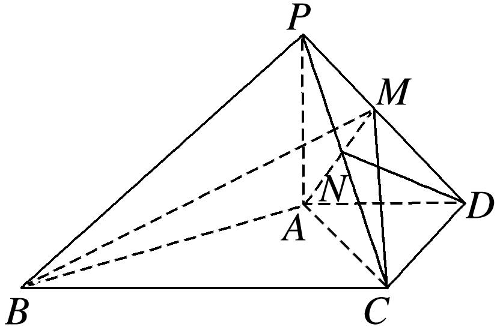
解析　（1）取*BC*的中点*E*，连接*DE*，交*AC*于点*O*，连接*ON*，建立如图所示的空间直角坐标系，
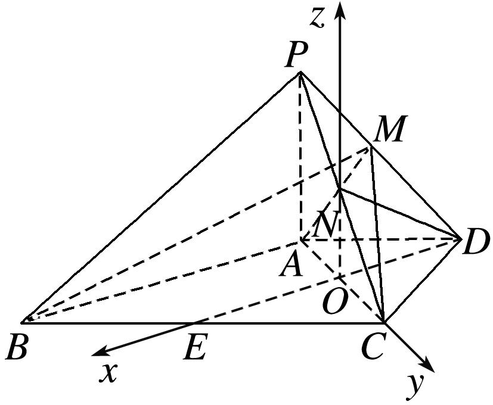
则*A*(0，－1，0)，*B*(2，－1，0)，*C*(0，1，0)，*D*(－1，0，0)，*P*(0，－1，2)．
∵点*N*为*PC*的中点，∴*N*(0，0，1)，∴＝(1，0，1)．
设平面<em>PAB</em>的一个法向量为<em><strong>n</strong></em>＝(<em>x</em>，<em>y</em>，<em>z</em>)，由＝(0，0，2)，＝(2，0，0)，可得<em><strong>n</strong></em>＝(0，1，0)，
∴·<em><strong>n</strong></em>＝0．又∵<em>DN</em>⊄平面<em>PAB</em>，∴<em>DN</em>∥平面<em>PAB</em>．  
（2）由（1）知，＝ (0，2，0)，＝(－1，1，－2)．
设直线*AC*与*PD*所成的角为*θ*，则cos *θ*＝＝＝．  
（3）存在．设*M*(*x*，*y*，*z*)，且＝*λ*，0≤*λ*≤1，∴∴*M*(－*λ*，*λ*－1，2－2*λ*)．
设平面<em>ACM</em>的一个法向量为<em><strong>m</strong></em>＝(<em>a</em>，<em>b</em>，<em>c</em>)，由＝(0，2，0)，＝(－<em>λ</em>，<em>λ</em>，2－2<em>λ</em>)，
可得<em><strong>m</strong></em>＝(2－2<em>λ</em>，0，<em>λ</em>)，由图知平面<em>ACD</em>的一个法向量为<em><strong>u</strong></em>＝(0，0，1)，
∴|cos＜<em><strong>m</strong></em>，<em><strong>u</strong></em>＞|＝＝，解得<em>λ</em>＝或<em>λ</em>＝2(舍去)．
∴<em>M</em>，<em><strong>m</strong></em>＝．∴＝，
设<em>BM</em>与平面<em>MAC</em>所成的角为<em>φ</em>，则sin <em>φ</em>＝|cos＜，<em><strong>m</strong></em>＞|＝＝，∴<em>φ</em>＝30°．
故存在点*M*，使得平面*MAC*与平面*ACD*的夹角为45°，此时*BM*与平面*MAC*所成的角为30°．

<strong>[例8]</strong>　如图所示，正方形<em>AA</em>1<em>D</em>1<em>D</em>与矩形<em>ABCD</em>所在平面互相垂直，<em>AB</em>＝2<em>AD</em>＝2，点<em>E</em>为<em>AB</em>的中点．  
（1）求证：<em>BD</em>1∥平面<em>A</em>1<em>DE</em>；  
（2）设在线段<em>AB</em>上存在点<em>M</em>，使二面角<em>D</em>1－<em>MC－D</em>的大小为，求此时<em>AM</em>的长及点<em>E</em>到平面<em>D</em>1<em>MC</em>的距离．

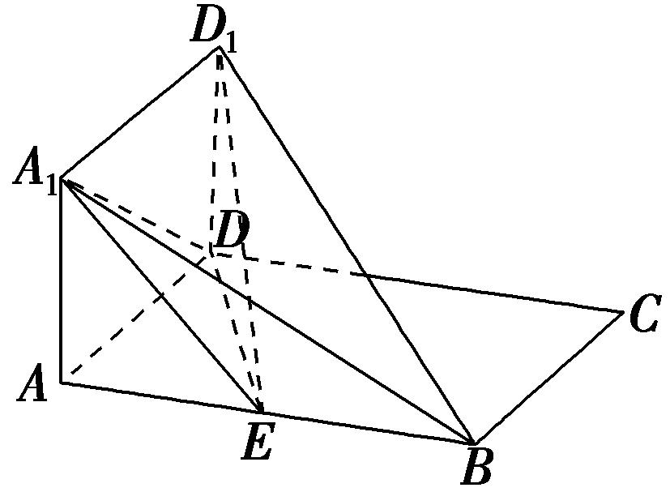
解析　（1）连接<em>AD</em>1，交<em>A</em>1<em>D</em>于点<em>O</em>，∵四边形<em>AA</em>1<em>D</em>1<em>D</em>为正方形，
∴<em>O</em>是<em>AD</em>1的中点，∵点<em>E</em>为<em>AB</em>的中点，连接<em>OE</em>．
∴<em>EO</em>为△<em>ABD</em>1的中位线，∴<em>EO</em>∥<em>BD</em>1．
又∵<em>BD</em>1⊄平面<em>A</em>1<em>DE</em>，<em>OE</em>⊂平面<em>A</em>1<em>DE</em>，∴<em>BD</em>1∥平面<em>A</em>1<em>DE</em>．

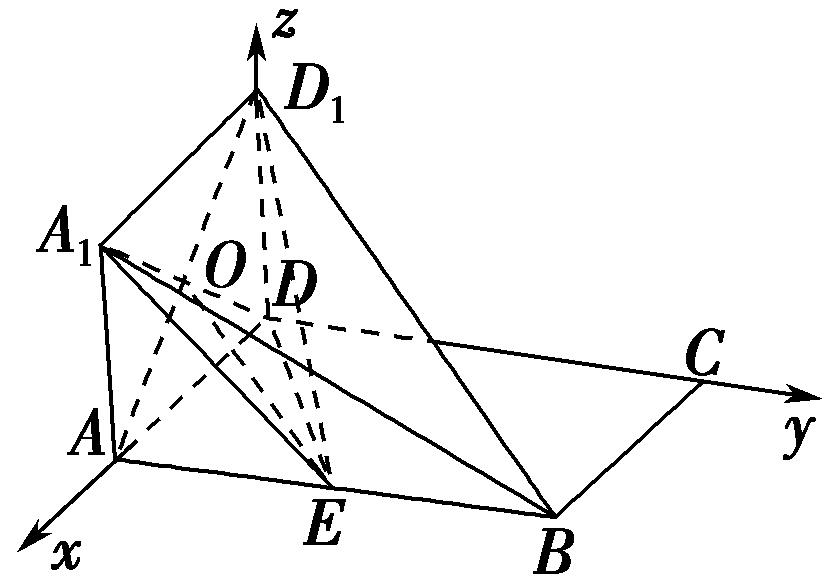  
（2）由题意可得<em>D</em>1<em>D</em>⊥平面<em>ABCD</em>，以点<em>D</em>为原点，<em>DA</em>，<em>DC</em>，<em>DD</em>1所在直线分别为<em>x</em>轴、<em>y</em>轴、<em>z</em>轴，建立如图所示的空间直角坐标系，则<em>D</em>(0，0，0)，<em>C</em>(0，2，0)，<em>A</em>1(1，0，1)，<em>D</em>1(0，0，1)，<em>B</em>(1，2，0)，<em>E</em>(1，1，0)，
设<em>M</em>(1，<em>y</em>0，0)(0≤<em>y</em>0≤2)，∵＝(－1，2－<em>y</em>0，0)，＝(0，2，－1)，
设平面<em>D</em>1<em>MC</em>的一个法向量为<em><strong>n</strong></em>1＝(<em>x</em>，<em>y</em>，<em>z</em>)，则即
令<em>y</em>＝1，有<em><strong>n</strong></em>1＝(2－<em>y</em>0，1，2)．而平面<em>MCD</em>的一个法向量为<em><strong>n</strong></em>2＝(0，0，1)．

要使二面角<em>D</em>1－<em>MC－D</em>的大小为，
则cos ＝|cos＜<em><strong>n</strong></em>1，<em><strong>n</strong></em>2＞|＝＝＝，
解得<em>y</em>0＝2－(0≤<em>y</em>0≤2)，故<em>AM</em>＝2－，此时<em><strong>n</strong></em>1＝，＝(1，1，－1)．
故点<em>E</em>到平面<em>D</em>1<em>MC</em>的距离为<em>d</em>＝＝＝．

【对点训练】

1．如图，已知在长方体<em>ABCD</em>－<em>A</em>1<em>B</em>1<em>C</em>1<em>D</em>1中，<em>AD</em>＝<em>AA</em>1＝1，<em>AB</em>＝2，点<em>E</em>在棱<em>AB</em>上移动．  
（1）求证：<em>D</em>1<em>E</em>⊥<em>A</em>1<em>D</em>；  
（2）在棱<em>AB</em>上是否存在点<em>E</em>使得<em>AD</em>1与平面<em>D</em>1<em>EC</em>所成的角为？若存在，求出<em>AE</em>的长，若不存在，说明理由．

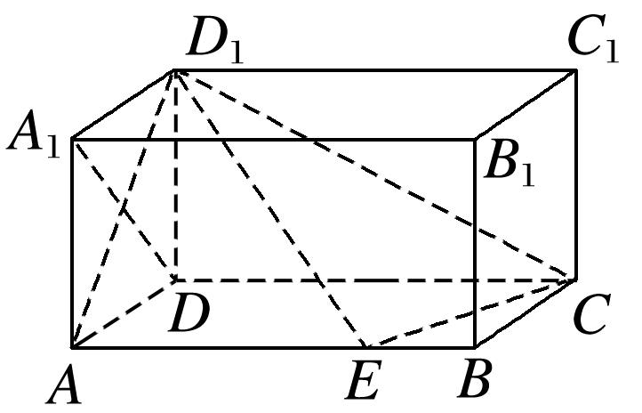

1．解析　（1）∵<em>AE</em>⊥平面<em>AA</em>1<em>D</em>1<em>D</em>，<em>A</em>1<em>D</em>⊂平面<em>AA</em>1<em>D</em>1<em>D</em>，∴<em>AE</em>⊥<em>A</em>1<em>D</em>．
∵在长方体<em>ABCD</em>－<em>A</em>1<em>B</em>1<em>C</em>1<em>D</em>1中，<em>AD</em>＝<em>AA</em>1＝1，∴<em>A</em>1<em>D</em>⊥<em>AD</em>1．
∵<em>AE</em>∩<em>AD</em>1＝<em>A</em>，∴<em>A</em>1<em>D</em>⊥平面<em>AED</em>1．∵<em>D</em>1<em>E</em>⊂平面<em>AED</em>1，∴<em>D</em>1<em>E</em>⊥<em>A</em>1<em>D</em>．  
（2）以<em>D</em>为坐标原点，<em>DA</em>，<em>DC</em>，<em>DD</em>1所在直线分别为<em>x</em>，<em>y</em>，<em>z</em>轴，建立空间直角坐标系，如图所示．

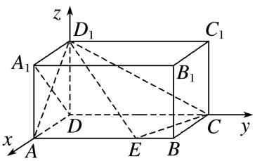
设棱<em>AB</em>上存在点<em>E</em>(1，<em>t，</em>0)(0≤<em>t</em>≤2)，使得<em>AD</em>1与平面<em>D</em>1<em>EC</em>所成的角为，

<em>A</em>(1，0，0)，<em>D</em>1(0，0，1)，<em>C</em>(0，2，0)，＝(－1，0，1)，＝(0，－2，1)，＝(1，<em>t</em>－2，0)，
设平面<em>D</em>1<em>EC</em>的法向量为<em><strong>n</strong></em>＝(<em>x</em>，<em>y</em>，<em>z</em>)，则取<em>y</em>＝1，得<em><strong>n</strong></em>＝(2－<em>t，</em>1，2)，
∴sin＝＝，整理，得<em>t</em>2＋4<em>t</em>－9＝0，解得<em>t</em>＝－2或<em>t</em>＝－2－(舍去)，
∴在棱<em>AB</em>上存在点<em>E</em>使得<em>AD</em>1与平面<em>D</em>1<em>EC</em>所成的角为，此时<em>AE</em>＝－2．

2．等边△*ABC*的边长为3，点*D*，*E*分别是*AB*，*AC*上的点，且满足＝＝(如图①)，将△*ADE*沿

<em>DE</em>折起到△<em>A</em>1<em>DE</em>的位置，使二面角<em>A</em>1－<em>DE－B</em>成直二面角，连接<em>A</em>1<em>B</em>，<em>A</em>1<em>C</em>(如图②)．  
（1）求证：<em>A</em>1<em>D</em>⊥平面<em>BCED</em>；  
（2）在线段<em>BC</em>上是否存在点<em>P</em>，使直线<em>PA</em>1与平面<em>A</em>1<em>BD</em>所成的角为60°？若存在，求出<em>PB</em>的长；若不存在，请说明理由．

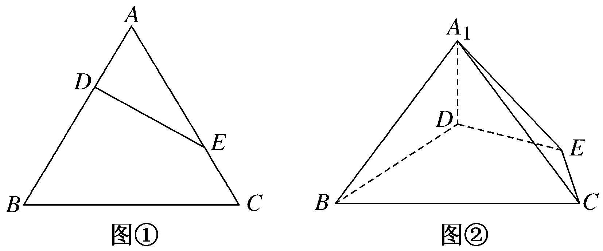

2．解析　（1）题图①中，由已知可得：*AE*＝2，*AD*＝1，*A*＝60°．
从而<em>DE</em>＝＝．故得<em>AD</em>2＋<em>DE</em>2＝<em>AE</em>2，
所以<em>AD</em>⊥<em>DE</em>，<em>BD</em>⊥<em>DE</em>．所以题图②中，<em>A</em>1<em>D</em>⊥<em>DE</em>，
又平面<em>ADE</em>∩平面<em>BCED</em>＝<em>DE</em>，<em>A</em>1<em>D</em>⊥<em>DE</em>，<em>A</em>1<em>D</em>⊂平面<em>A</em>1<em>DE</em>，所以<em>A</em>1<em>D</em>⊥平面<em>BCED</em>．  
（2）存在．由（1）知<em>ED</em>⊥<em>DB</em>，<em>A</em>1<em>D</em>⊥平面<em>BCED</em>．以<em>D</em>为坐标原点，以射线<em>DB</em>，<em>DE</em>，<em>DA</em>1分别为<em>x</em>轴，<em>y</em>轴，<em>z</em>轴的正半轴建立空间直角坐标系<em>D－xyz</em>，如图，

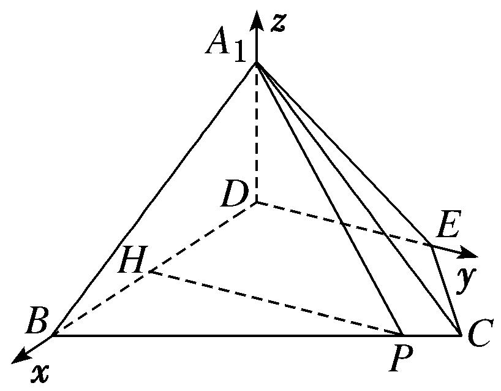

过*P*作*PH*∥*DE*交*BD*于点*H*，设*PB*＝2*a*(0≤2*a*≤3)，则*BH*＝*a*，*PH*＝*a*，*DH*＝2－*a*，

易知<em>A</em>1(0，0，1)，<em>P</em>(2－<em>a</em>，<em>a，</em>0)，<em>E</em>(0，，0)，所以＝(<em>a</em>－2，－<em>a，</em>1)．
因为<em>ED</em>⊥平面<em>A</em>1<em>BD</em>，所以平面<em>A</em>1<em>BD</em>的一个法向量为＝(0，，0)，
因为直线<em>PA</em>1与平面<em>A</em>1<em>BD</em>所成的角为60°，
所以sin 60°＝＝＝，解得*a*＝．
所以*PB*＝2*a*＝，满足0≤2*a*≤3，符合题意．
所以在线段<em>BC</em>上存在点<em>P</em>，使直线<em>PA</em>1与平面<em>A</em>1<em>BD</em>所成的角为60°，此时<em>PB</em>＝．

3．如图，在四棱锥*P*－*ABCD*中，底面*ABCD*是平行四边形，*AB*＝*AC*＝2，*AD*＝2，*PB*＝，*PB*⊥*AC*．  
（1）求证：平面*PAB*⊥平面*PAC*；  
（2）若∠*PBA*＝45°，试判断棱*PA*上是否存在与点*P*，*A*不重合的点*E*，使得直线*CE*与平面*PBC*所成角的正弦值为？若存在，求出的值；若不存在，请说明理由．

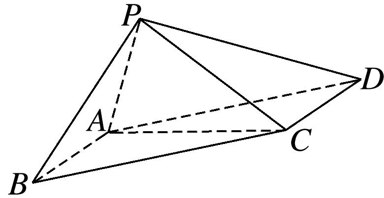

3．解析　（1）因为四边形*ABCD*是平行四边形，*AD*＝2，所以*BC*＝*AD*＝2，
又<em>AB</em>＝<em>AC</em>＝2，所以<em>AB</em>2＋<em>AC</em>2＝<em>BC</em>2，所以<em>AC</em>⊥<em>AB</em>，
又*PB*⊥*AC*，*AB*∩*PB*＝*B*，*AB*，*PB*⊂平面*PAB*，所以*AC*⊥平面*PAB*．
又因为*AC*⊂平面*PAC*，所以平面*PAB*⊥平面*PAC*．  
（2）由（1）知*AC*⊥*AB*，*AC*⊥平面*PAB*，分别以*AB*，*AC*所在直线为*x*轴，*y*轴，

平面*PAB*内过点*A*且与直线*AB*垂直的直线为*z*轴，建立空间直角坐标系*Axyz*，

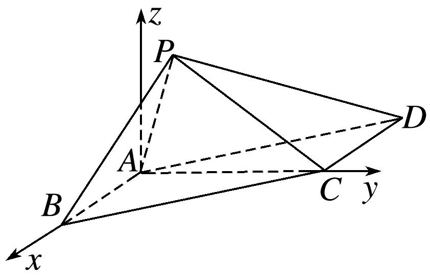
则*A*(0，0，0)，*B*(2，0，0)，*C*(0，2，0)，＝(0，2，0)，＝(－2，2，0)，
由∠*PBA*＝45°，*PB*＝，可得*P*(1，0，1)，所以＝(1，0，1)，＝(－1，0，1)，
假设棱*PA*上存在点*E*，使得直线*CE*与平面*PBC*所成角的正弦值为，
设＝*λ*(0<*λ*<1)，则＝*λ*＝(*λ*，0，*λ*)，＝－＝(*λ*，－2，*λ*)，
设平面<em>PBC</em>的法向量<em><strong>n</strong></em>＝(<em>x</em>，<em>y</em>，<em>z</em>)，则即
令<em>z</em>＝1，可得<em>x</em>＝<em>y</em>＝1，所以平面<em>PBC</em>的一个法向量<em><strong>n</strong></em>＝(1，1，1)，
设直线*CE*与平面*PBC*所成的角为*θ*，则

sin <em>θ</em>＝ |cos&lt;<em><strong>n</strong></em>，&gt;| ＝ ＝＝，解得<em>λ</em>＝或<em>λ</em>＝(舍)．
所以在棱*PA*上存在点*E*，且＝，使得直线*CE*与平面*PBC*所成角的正弦值为．

4．如图，在四棱锥*P*－*ABCD*中，底面*ABCD*是边长为4的正方形，△*PAD*是正三角形，*CD*⊥平面*PAD*，

*E*，*F*，*G*，*O*分别是*PC*，*PD*，*BC*，*AD*的中点．  
（1）求证：*PO*⊥平面*ABCD*；  
（2）求平面*EFG*与平面*ABCD*所成锐二面角的大小；  
（3）在线段*PA*上是否存在点*M*，使得直线*GM*与平面*EFG*所成角为，若存在，求线段*PM*的长度；若不存在，说明理由．

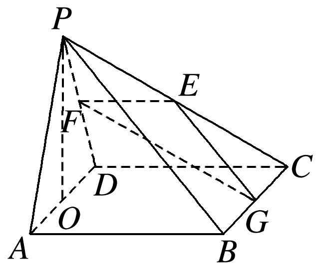

4．解析　（1）因为△*PAD*是正三角形，*O*是*AD*的中点，所以*PO*⊥*AD*．
又因为*CD*⊥平面*PAD*，*PO*⊂平面*PAD*，所以*PO*⊥*CD*．
又*AD*∩*CD*＝*D*，*AD*，*CD*⊂平面*ABCD*，所以*PO*⊥平面*ABCD*．  
（2）如图，以*O*点为原点，分别以*OA*，*OG*，*OP*所在直线为*x*轴、*y*轴、*z*轴建立空间直角坐标系*O*－*xyz*．则*O*(0，0，0)，*A*(2，0，0)，*B*(2，4，0)，*C*(－2，4，0)，*D*(－2，0，0)，*G*(0，4，0)，*P*(0，0，2)，*E*(－1，2，)，*F*(－1，0，)，＝(0，－2，0)，＝(1，2，－)，

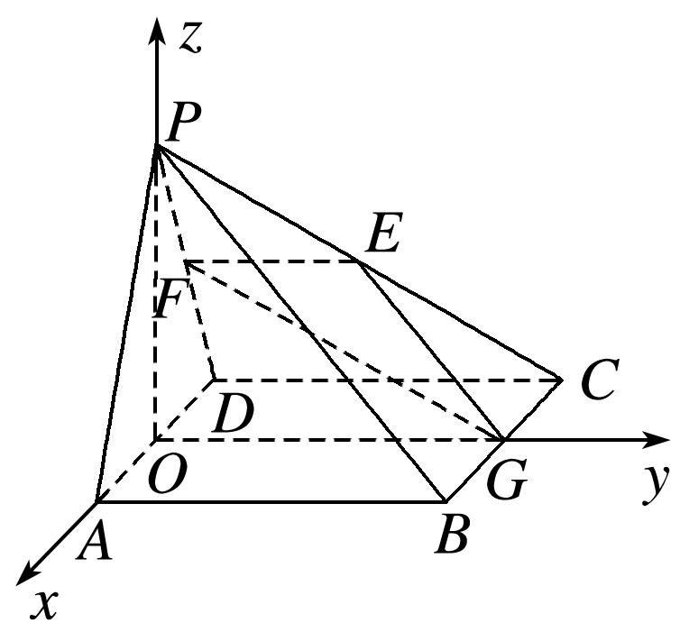
设平面<em>EFG</em>的法向量为<em><strong>m</strong></em>＝(<em>x</em>，<em>y</em>，<em>z</em>)，则即
令<em>z</em>＝1，则<em><strong>m</strong></em>＝(，0，1)，又平面<em>ABCD</em>的法向量<em><strong>n</strong></em>＝(0，0，1)，
设平面*EFG*与平面*ABCD*所成锐二面角为*θ*，所以cos *θ*＝＝＝．
所以平面*EFG*与平面*ABCD*所成锐二面角为．  
（3）假设在线段*PA*上存在点*M*，使得直线*GM*与平面*EFG*所成角为，
即直线<em>GM</em>的方向向量与平面<em>EFG</em>法向量<em><strong>m</strong></em>所成的锐角为，
设＝*λ*，*λ*∈[0，1]，＝＋＝＋*λ*，所以＝(2*λ*，－4，2－2*λ*)，
所以cos ＝|cos＜，<em><strong>m</strong></em>＞|＝，整理得2<em>λ</em>2－3<em>λ</em>＋2＝0，

*Δ*<0，方程无解，所以，不存在这样的点*M*．

5．如图，已知直三棱柱<em>ABC－A</em>1<em>B</em>1<em>C</em>1中，<em>AA</em>1＝<em>AB</em>＝<em>AC</em>＝1，<em>AB</em>⊥<em>AC</em>，<em>M</em>，<em>N</em>，<em>Q</em>分别是<em>CC</em>1，<em>BC</em>，<em>AC</em>

的中点，点<em>P</em>在直线<em>A</em>1<em>B</em>1上运动，且＝<em>λ</em>(<em>λ</em>∈[0，1])．  
（1）证明：无论*λ*取何值，总有*AM*⊥平面*PNQ*；  
（2）是否存在点*P*，使得平面*PMN*与平面*ABC*的夹角为60°？若存在，试确定点*P*的位置，若不存在，请说明理由．

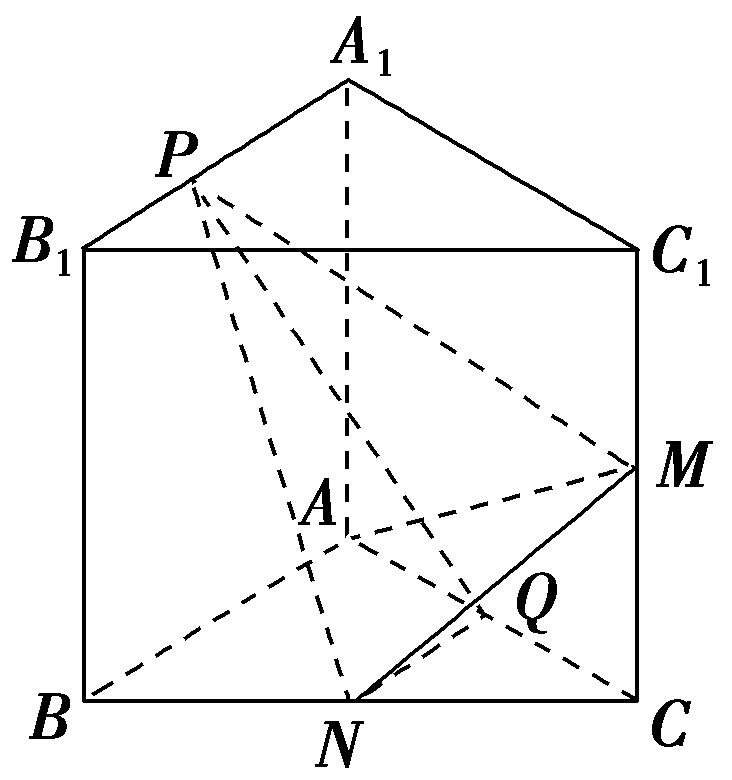

5．解析　（1）如图，以<em>A</em>为坐标原点，<em>AB</em>，<em>AC</em>，<em>AA</em>1所在的直线分别为<em>x</em>轴、<em>y</em>轴、<em>z</em>轴建立空间直角坐

标系，则<em>A</em>(0，0，0)，<em>A</em>1(0，0，1)，<em>B</em>1(1，0，1)，<em>M</em>，<em>N</em>，<em>Q</em>，
由＝*λ*＝*λ*(1，0，0)＝(*λ*，0，0)，可得点*P*(*λ*，0，1)，所以＝，＝．
又＝，所以·＝0＋－＝0，·＝0＋－＝0，
所以⊥，⊥，即*AM*⊥*PN*，*AM*⊥*PQ*，
又*PN*∩*PQ*＝*P*，所以*AM*⊥平面*PNQ*，所以无论*λ*取何值，总有*AM*⊥平面*PNQ*．

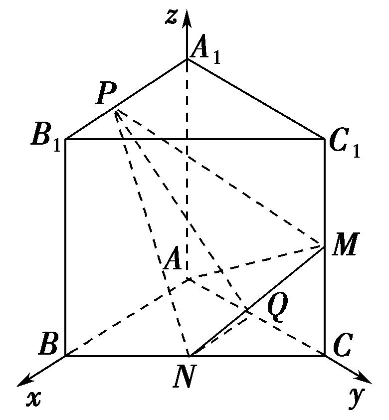  
（2）设<em><strong>n</strong></em>＝(<em>x</em>，<em>y</em>，<em>z</em>)是平面<em>PMN</em>的法向量，＝，＝，
则即得
令<em>x</em>＝3，所以<em><strong>n</strong></em>＝(3，1＋2<em>λ</em>，2－2<em>λ</em>)是平面<em>PMN</em>的一个法向量．

取平面<em>ABC</em>的一个法向量为<em><strong>m</strong></em>＝(0，0，1)．
假设存在符合条件的点<em>P</em>，则|cos＜<em><strong>m</strong></em>，<em><strong>n</strong></em>＞|＝＝，
化简得4<em>λ</em>2－14<em>λ</em>＋1＝0，解得<em>λ</em>＝或<em>λ</em>＝(舍去)．

综上，存在点<em>P</em>，且当<em>A</em>1<em>P</em>＝时，满足平面<em>PMN</em>与平面<em>ABC</em>的夹角为60°．

6．如图所示的几何体由平面*PECF*截棱长为2的正方体得到，其中*P*，*C*为原正方体的顶点，*E*，*F*为原

正方体侧棱长的中点，正方形*ABCD*为原正方体的底面，*G*为棱*BC*上的动点．  
（1）求证：平面*APC*⊥平面*PECF*；  
（2）设＝*λ* (0≤*λ*≤1)，当*λ*为何值时，平面*EFG*与平面*ABCD*所成的角为？

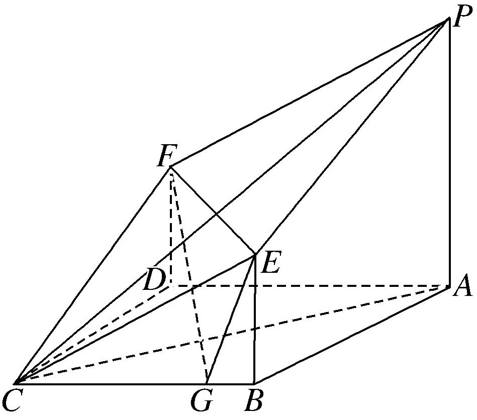

6．解析　（1）由已知可知，*EB*∥*FD*，且*EB*＝*FD*，如图，连接*BD*，则四边形*EFDB*是平行四边形，
∴*EF*∥*BD*．∵底面*ABCD*为正方形，∴*BD*⊥*AC*．∵*AP*⊥底面*ABCD*，∴*BD*⊥*AP*．
又*AC*∩*AP*＝*A*，∴*BD*⊥平面*APC*，∴*EF*⊥平面*APC*．
∵*EF*⊂平面*PECF*，∴平面*APC*⊥平面*PECF*．

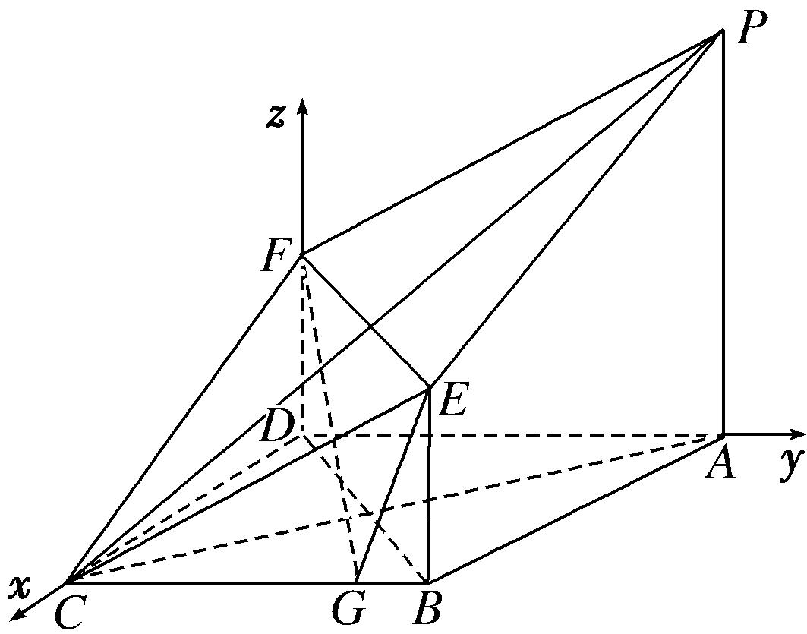  
（2）以*D*为原点建立如图所示的空间直角坐标系*D*－*xyz*，
则*B*(2，2，0)，*F*(0，0，1)，*E*(2，2，1)，*G*(2，2－2*λ*，0)，＝(2，2，0)， ＝(0，2*λ*，1)，
设<em><strong>m</strong></em>＝(<em>x</em>，<em>y</em>，<em>z</em>)是平面<em>EFG</em>的法向量，故即
令<em>y</em>＝－1，可得<em><strong>m</strong></em>＝(1，－1，2<em>λ</em>)为平面<em>EFG</em>的一个法向量，

而平面<em>ABCD</em>的一个法向量为<em><strong>n</strong></em>＝(0，0，1)．
于是cos＝|cos＜<em><strong>m</strong></em>，<em><strong>n</strong></em>＞|＝，解得<em>λ</em>＝±，又0≤<em>λ</em>≤1，∴<em>λ</em>＝．

7．如图，在四棱锥*P*－*ABCD*中，*AB*∥*DC*，∠*ADC*＝，*AB*＝*AD*＝*CD*＝2，*PD*＝*PB*＝，*PD*⊥*BC*．  
（1）求证：平面*PBD*⊥平面*PBC*；  
（2）在线段*PC*上是否存在点*M*，使得平面*ABM*与平面*PBD*的夹角为？若存在，求出的值；若不存在，请说明理由．

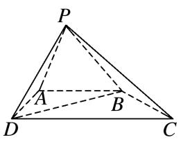

7．解析　（1）因为四边形*ABCD*为直角梯形，且*AB*∥*DC*，*AB*＝*AD*＝2，∠*ADC*＝，所以*BD*＝2，
又因为<em>CD</em>＝4，∠<em>BDC</em>＝．根据余弦定理得<em>BC</em>＝2，所以<em>CD</em>2＝<em>BD</em>2＋<em>BC</em>2，故<em>BC</em>⊥<em>BD</em>．
又因为*BC*⊥*PD*，*PD*∩*BD*＝*D*，且*BD*，*PD*⊂平面*PBD*，所以*BC*⊥平面*PBD*，
又因为*BC*⊂平面*PBC*，所以平面*PBC*⊥平面*PBD*．  
（2）由（1）得平面*ABCD*⊥平面*PBD*，设*E*为*BD*的中点，连接*PE*，
因为*PB*＝*PD*＝，所以*PE*⊥*BD*，*PE*＝2，
又平面*ABCD*⊥平面*PBD*，平面*ABCD*∩平面*PBD*＝*BD*，*PE*⊂平面*PBD*，所以*PE*⊥平面*ABCD*．
如图，以*A*为原点，分别以，和垂直平面*ABCD*的方向为*x*，*y*，*z*轴正方向，建立空间直角坐标系，

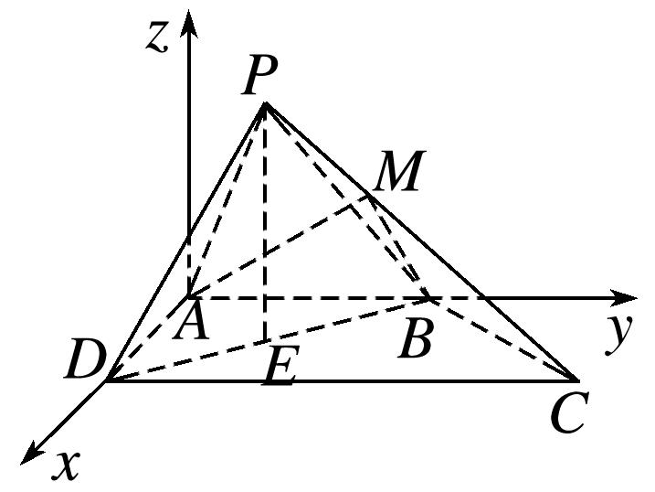
则*A*(0，0，0)，*B*(0，2，0)，*C*(2，4，0)，*D*(2，0，0)，*P*(1，1，2)，
假设存在*M*(*a*，*b*，*c*)满足要求，设＝*λ*(0≤*λ*≤1)，即＝*λ*，
所以*M*(2－*λ*，4－3*λ*，2*λ*)，易得平面*PBD*的一个法向量为＝(2，2，0)．
设<em><strong>n</strong></em>＝(<em>x</em>，<em>y</em>，<em>z</em>)为平面<em>ABM</em>的一个法向量，＝(0，2，0)，＝(2－<em>λ</em>，4－3<em>λ</em>，2<em>λ</em>)．
由得不妨取<em><strong>n</strong></em>＝(2<em>λ</em>，0，<em>λ</em>－2)．
因为平面*PBD*与平面*ABM*的夹角为，所以＝，
解得*λ*＝，*λ*＝－2(不合题意舍去)．故存在*M*点满足条件，且＝．

8．已知在四棱锥*P*－*ABCD*中，平面*PDC*⊥平面*ABCD*，*AD*⊥*DC*，*AB*∥*CD*，*AB*＝2，*DC*＝4，*E*为*PC*

的中点，*PD*＝*PC*，*BC*＝2．  
（1）求证：*BE*∥平面*PAD*；  
（2）若*PB*与平面*ABCD*所成角为45°，点*P*在平面*ABCD*上的射影为*O*，问：*BC*上是否存在一点*F*，使平面*POF*与平面*PAB*所成的角为60°？若存在，试求点*F*的位置；若不存在，请说明理由．

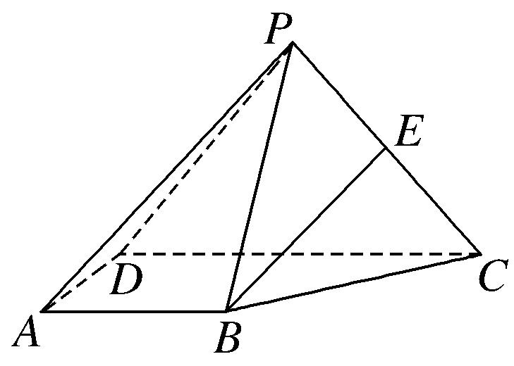

8．解析　（1）取*PD*的中点*H*，连接*AH*，*EH*，则*EH*∥*CD*，*EH*＝*CD*，
又*AB*∥*CD*，*AB*＝*CD*＝2，∴*EH*∥*AB*，且*EH*＝*AB*，
∴四边形*ABEH*为平行四边形，故*BE*∥*HA*．又*BE*⊄平面*PAD*，*HA*⊂平面*PAD*，∴*BE*∥平面*PAD*．

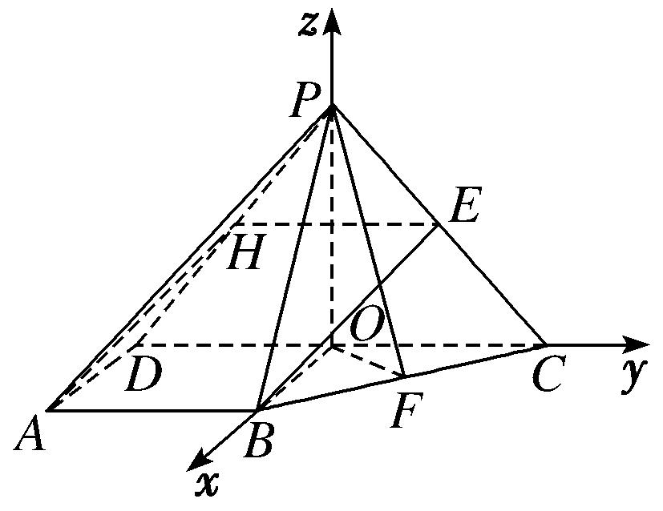  
（2）存在，点*F*为*BC*的中点．理由：∵平面*PDC*⊥平面*ABCD*，*PD*＝*PC*，作*PO*⊥*DC*，交*DC*于点*O*，连接*OB*，可知*O*为点*P*在平面*ABCD*上的射影，则∠*PBO*＝45°．由题可知*OB*，*OC*，*OP*两两垂直，以*O*为坐标原点，分别以*OB*，*OC*，*OP*所在直线为*x*轴，*y*轴，*z*轴建立空间直角坐标系*O－xyz*，
由题知*OC*＝2，*BC*＝2，∴*OB*＝2，由∠*PBO*＝45°，可知*OP*＝*OB*＝2，
∴*P*(0，0，2)，*A*(2，－2，0)，*B*(2，0，0)，*C*(0，2，0)．
设*F*(*x*，*y*，*z*)，＝*λ*，则(*x*－2，*y*，*z*)＝*λ*(－2，2，0)，解得*x*＝2－2*λ*，*y*＝2*λ*，*z*＝0，
可知*F*(2－2*λ*，2*λ*，0)，
设平面<em>PAB</em>的一个法向量为<em>m</em>＝(<em>x</em>1，<em>y</em>1，<em>z</em>1)，∵＝(2，－2，－2)，＝(0，2，0)，
∴得令<em>z</em>1＝1，得<em>m</em>＝(1，0，1)．
设平面<em>POF</em>的一个法向量为<em>n</em>＝(<em>x</em>2，<em>y</em>2，<em>z</em>2)，∵＝(0，0，2)，＝(2－2<em>λ</em>，2<em>λ</em>，0)，
∴得令<em>y</em>2＝1，得<em>n</em>＝．
∴cos 60°＝＝，解得*λ*＝，
可知当*F*为*BC*的中点时，两平面所成的角为60°．

9．如图，在四棱锥*P*－*ABCD*中，*PA*⊥平面*ABCD*，*AD*∥*BC*，*AD*⊥*CD*，且*AD*＝*CD*＝2，*BC*＝4，

*PA*＝2．  
（1）求证：*AB*⊥*PC*；  
（2）在线段*PD*上，是否存在一点*M*，使得二面角*M*－*AC*－*D*的大小为45°，如果存在，求*BM*与平面*MAC*所成角的正弦值，如果不存在，请说明理由．

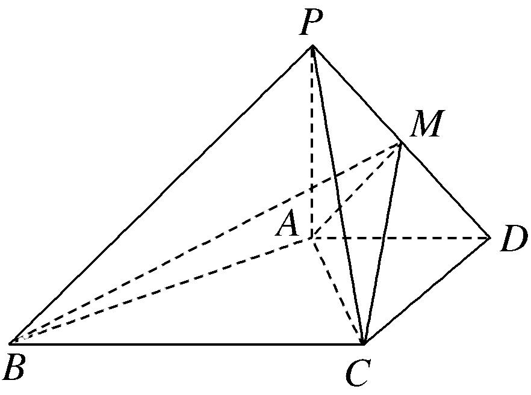

9．解析　（1）如图，由已知得四边形*ABCD*是直角梯形，由*AD*＝*CD*＝2，*BC*＝4，
可得△*ABC*是等腰直角三角形，即*AB*⊥*AC*，因为*PA*⊥平面*ABCD*，所以*PA*⊥*AB*，
又*PA*∩*AC*＝*A*，所以*AB*⊥平面*PAC*，所以*AB*⊥*PC*．

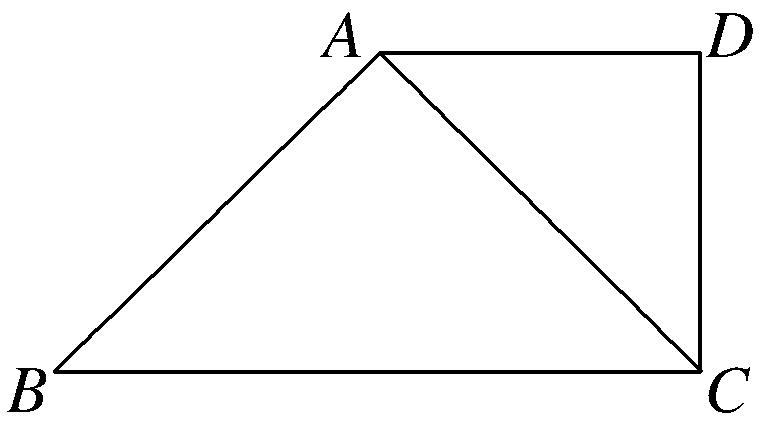  
（2）法一(几何法)：过点*M*作*MN*⊥*AD*交*AD*于点*N*，则*MN*∥*PA*，因为*PA*⊥平面*ABCD*，

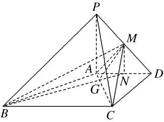
所以*MN*⊥平面*ABCD*．过点*M*作*MG*⊥*AC*交*AC*于点*G*，连接*NG*，
则∠*MGN*是二面角*M－AC－D*的平面角．若∠*MGN*＝45°，则*NG*＝*MN*，
又*AN*＝*NG*＝*MN*，所以*MN*＝1，所以*MN*綊*PA*，所以*M*是*PD*的中点．
在三棱锥<em>M</em>－<em>ABC</em>中，可得<em>VM</em> ­<em>ABC</em>＝<em>S</em>△<em>ABC</em>·<em>MN</em>，
设点<em>B</em>到平面<em>MAC</em>的距离是<em>h</em>，则<em>VB</em> ­<em>MAC</em>＝<em>S</em>△<em>MAC</em>·<em>h</em>，所以<em>S</em>△<em>ABC</em>·<em>MN</em>＝<em>S</em>△<em>MAC</em>·<em>h</em>，解得<em>h</em>＝2．
在Rt△*BMN*中，可得*BM*＝3．设*BM*与平面*MAC*所成的角为*θ*，则sin *θ*＝＝．

法二(向量法)：建立如图所示的空间直角坐标系，则*A*(0，0，0)，*C*(2，2，0)，*D*(0，2，0)，*P*(0，0，2)，*B*(2，－2，0)，＝(0，2，－2)，＝(2，2，0)．

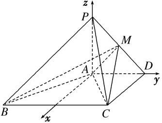
设＝*t* (0<*t*<1)，则点*M*的坐标为(0，2*t，* 2－2*t*)，所以＝(0，2*t，* 2－2*t*)．
设平面<em>MAC</em>的法向量是<em><strong>n</strong></em>＝(<em>x</em>，<em>y</em>，<em>z</em>)，则得
则可取<em><strong>n</strong></em>＝．又<em><strong>m</strong></em>＝(0，0，1)是平面<em>ACD</em>的一个法向量，
所以|cos＜<em><strong>m</strong></em>，<em><strong>n</strong></em>＞|＝＝＝cos 45°＝，解得<em>t</em>＝，
即点<em>M</em>是线段<em>PD</em>的中点．此时平面<em>MAC</em>的一个法向量可取<em><strong>n</strong></em>0＝(1，－1，)，

＝(－2，3，1)．设<em>BM</em>与平面<em>MAC</em>所成的角为<em>θ</em>，则sin <em>θ</em>＝|cos＜<em><strong>n</strong></em>0，＞|＝．

10．如图所示，在四棱锥*P*－*ABCD*中，侧面*PAD*⊥底面*ABCD*，侧棱*PA*＝*PD*＝，*PA*⊥*PD*，底面*ABCD*

为直角梯形，其中*BC*∥*AD*，*AB*⊥*AD*，*AB*＝*BC*＝1，*O*为*AD*的中点．  
（1）求直线*PB*与平面*POC*所成角的余弦值；  
（2）求*B*点到平面*PCD*的距离；  
（3）线段*PD*上是否存在一点*Q*，使得二面角*Q*－*AC*－*D*的余弦值为？若存在，求出的值；若不存在，请说明理由．

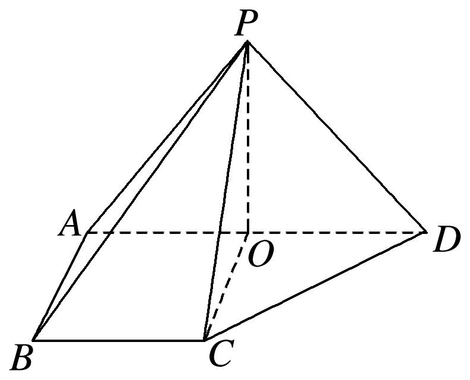

10．解析　（1）在△*PAD*中，*PA*＝*PD*，*O*为*AD*的中点，∴*PO*⊥*AD*．
又∵侧面*PAD*⊥底面*ABCD*，平面*PAD*∩平面*ABCD*＝*AD*，*PO*⊂平面*PAD*，∴*PO*⊥平面*ABCD*．
在△*PAD*中，*PA*⊥*PD*，*PA*＝*PD*＝，∴*AD*＝2．
在直角梯形*ABCD*中，*O*为*AD*的中点，∴*OA*＝*BC*＝1，∴*OC*⊥*AD*．

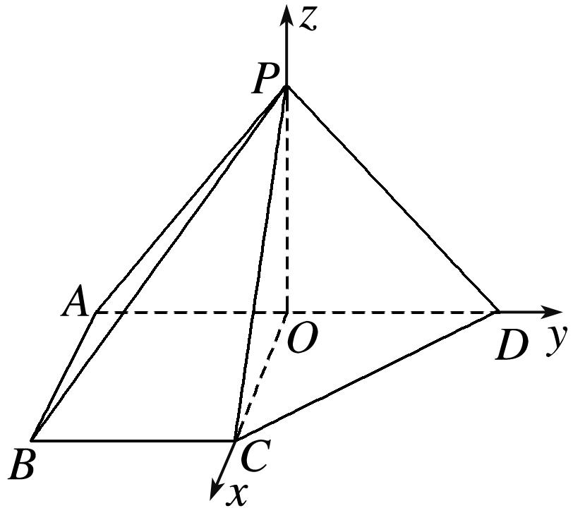

以*O*为坐标原点，*OC*所在直线为*x*轴，*OD*所在直线为*y*轴，*OP*所在直线为*z*轴建立空间直角坐标系，如图所示，则*P*(0，0，1)，*A*(0，－1，0)，*B*(1，－1，0)，*C*(1，0，0)，*D*(0，1，0)，
∴＝(1，－1，－1)．∵*OA*⊥*OP*，*OA*⊥*OC*，*OP*∩*OC*＝*O*，∴*OA*⊥平面*POC*．
∴＝(0，－1，0)为平面*POC*的法向量，cos＜，＞＝＝，
∴*PB*与平面*POC*所成角的余弦值为．  
（2）∵＝(1，－1，－1)，设平面<em>PCD</em>的法向量为<em><strong>u</strong></em>＝(<em>x</em>，<em>y</em>，<em>z</em>)，则

取<em>z</em>＝1，得<em><strong>u</strong></em>＝(1，1，1)．则<em>B</em>点到平面<em>PCD</em>的距离<em>d</em>＝＝．  
（3）假设存在，且设＝*λ*(0≤*λ*≤1)．
∵＝(0，1，－1)，∴－＝＝(0，*λ*，－*λ*)，∴＝(0，*λ*，1－*λ*)，∴*Q*(0，*λ*，1－*λ*)．
设平面<em>CAQ</em>的法向量为<em><strong>m</strong></em>＝(<em>x</em>1，<em>y</em>1，<em>z</em>1)，则

取<em>z</em>1＝1＋<em>λ</em>，得<em><strong>m</strong></em>＝(1－<em>λ</em>，<em>λ</em>－1，<em>λ</em>＋1)．平面<em>CAD</em>的一个法向量为<em><strong>n</strong></em>＝(0，0，1)，
∵二面角*Q*－*AC*－*D*的余弦值为，
∴|cos＜*m*，*n*＞|＝＝＝，

整理化简，得3<em>λ</em>2－10<em>λ</em>＋3＝0．解得<em>λ</em>＝或<em>λ</em>＝3(舍去)，
∴线段*PD*上存在满足题意的点*Q*，且＝．

