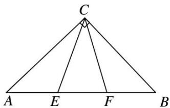
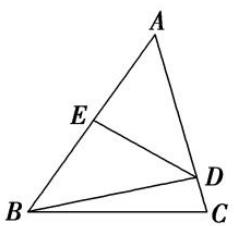
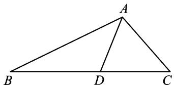
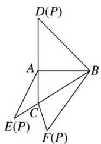
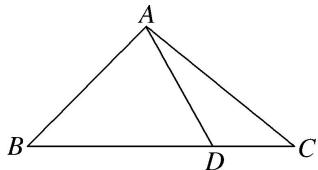
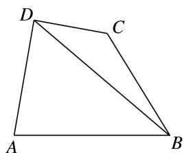
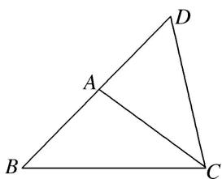
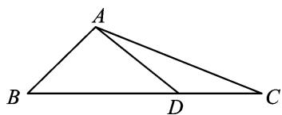
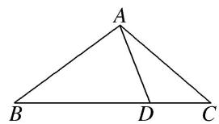

# 专题一 三角形中基本量的计算问题

#### 1. 正、余弦定理
在 $\triangle ABC$ 中，若角 $A, B, C$ 所对的边分别是 $a, b, c, R$ 为 $\triangle ABC$ 外接圆半径，则

<table><tr><td>定理</td><td>正弦定理</td><td>余弦定理</td></tr><tr><td>内容</td><td> $\frac{a}{\sin A} = \frac{b}{\sin B} = \frac{c}{\sin C} = 2R$ </td><td> $a^{2} = b^{2} + c^{2} - 2bc\cos A$ ; $b^{2} = c^{2} + a^{2} - 2cac\cos B$ ; $c^{2} = a^{2} + b^{2} - 2ab\cos C$ .</td></tr><tr><td>变形</td><td>（1）  $a = \frac{b\sin A}{\sin B}$ ,  $b = \frac{a\sin B}{\sin A}$ ,  $c = \frac{a\sin C}{\sin A}$ ;（2）  $\sin A = \frac{a\sin B}{b}$ ,  $\sin B = \frac{b\sin A}{a}$ ,  $\sin C = \frac{c\sin A}{a}$ ;（3）  $a = 2R\sin A$ ,  $b = 2R\sin B$ ,  $c = 2R\sin C$ ;（4）  $\sin A = \frac{a}{2R}$ ,  $\sin B = \frac{b}{2R}$ ,  $\sin C = \frac{c}{2R}$ ;（5）  $a : b : c = \sin A : \sin B : \sin C$ ;（6）  $\frac{a + b + c}{\sin A + \sin B + \sin C} = 2R$ .</td><td> $\cos A = \frac{b^{2} + c^{2} - a^{2}}{2bc}$ ; $\cos B = \frac{c^{2} + a^{2} - b^{2}}{2ac}$ ; $\cos C = \frac{a^{2} + b^{2} - c^{2}}{2ab}$ .</td></tr></table>

#### 2. 三角形面积公式
$S_{\triangle ABC}=\frac{1}{2}ab\sin C=\frac{1}{2}bc\sin A=\frac{1}{2}ac\sin B=\frac{abc}{4R}=\frac{1}{2}(a+b+c)\cdot r(r, R$ 为别是 $\triangle ABC$ 内切圆半径和外接圆半径），并可由此计算 R、r.

#### 3. 解三角形有关的二级结论  
（1）三角形内角和定理
在 $\triangle ABC$ 中， $A+B+C=\pi$ ；变形： $\frac{A+B}{2}=\frac{\pi}{2}-\frac{C}{2}$ .  
（2）三角形中的三角函数关系

① $\sin(A+B)=\sin C$ ; ② $\cos(A+B)=-\cos C$ ; ③ $\tan(A+B)=-\tan C(C\neq\frac{\pi}{2})$ ; ④ $\sin\frac{A+B}{2}=\cos\frac{C}{2}$ ; ⑤ $\cos\frac{A+B}{2}=\sin\frac{C}{2}$ . ⑥在非Rt△ABC中， $\tan A+\tan B+\tan C=\tan A\cdot\tan B\cdot\tan C(A,B,C\neq\frac{\pi}{2})$ .  
（3）三角形中的不等关系

①在三角形中大边对大角，大角对大边.   
② $A>B\Leftrightarrow a>b\Leftrightarrow\sin A>\sin B\Leftrightarrow\cos A<\cos B.$   
③若 $\triangle ABC$ 为锐角三角形, 则 $A+B>\frac{\pi}{2}$ , $\sin A>\cos B$ , $\cos A<\sin B$ , $a^{2}+b^{2}>c^{2}$ . 若 $\triangle ABC$ 为钝角三角形(假如 $C$ 为钝角), 则 $A+B<\frac{\pi}{2}$ , $\sin A<\cos B$ , $\cos A>\sin B$ .

④ $c^{2}=a^{2}+b^{2}\Leftrightarrow C$ 为直角； $c^{2}>a^{2}+b^{2}\Leftrightarrow C$ 为钝角； $c^{2}<a^{2}+b^{2}\Leftrightarrow C$ 为锐角.  
⑤ $a+b>c,\quad b+c>a,\quad c+a>b.$

⑥若 $x \in \left(0, \frac{\pi}{2}\right)$ ，则 $\sin x < x < \tan x$ 。若 $x \in \left(0, \frac{\pi}{2}\right)$ ，则 $1 < \sin x + \cos x \leq \sqrt{2}$ 。  
（4）三角形中的射影定理
在 $\triangle ABC$ 中， $a=b\cos C+c\cos B;\quad b=a\cos C+c\cos A;\quad c=b\cos A+a\cos B.$
在处理三角形中的边角关系时，一般全部化为角的关系，或全部化为边的关系。若出现边的一次式一般采用到正弦定理，出现边的二次式一般采用到余弦定理。若已知条件同时含有边和角，但不能直接使用正弦定理或余弦定理得到答案，要选择“边化角”或“角化边”，变换原则如下：

①若式子中含有正弦的齐次式，优先考虑正弦定理“角化边”，然后进行代数式变形；  
②若式子中含有 a, b, c 的齐次式，优先考虑正弦定理 “边化角”，然后进行三角恒等变换；  
③若式子中含有余弦的齐次式，优先考虑余弦定理“角化边”，然后进行代数式变形；  
④含有面积公式的问题，要考虑结合余弦定理求解；  
⑤同时出现两个自由角（或三个自由角）时，要用到三角形的内角和定理.

# 考点一 计算三角形中的角或角的三角函数值

# 【方法总结】

# 计算三角形中的角或角的三角函数值的解题技巧

此类问题主要考查正弦定理、余弦定理及三角形面积公式，最简单的问题是只用正弦定理或余弦定理即可解决。中等难度的问题要结合三角恒等变换再用正弦定理或余弦定理即可解决。难度较大的问题要结合三角恒等变换并同时用正弦定理、余弦定理和面积公式才能解决。

# 【例题选讲】

[例 1]（1）(2013·湖南)在锐角 $\triangle ABC$ 中，角 A, B 所对的边长分别为 a, b，若 $2a\sin B=\sqrt{3}b$ ，则角 A 等于()

A. $\frac{\pi}{12}$

B. $\frac{\pi}{6}$

C. $\frac{\pi}{4}$

D. $\frac{\pi}{3}$  
（2）(2017·全国III)△ABC 的内角 A, B, C 的对边分别为 a, b, c. 已知 $C=60^{\circ}$ , $b=\sqrt{6}$ , c=3，则 A= \_\_\_\_.  
（3）在 $\triangle ABC$ 中，角 $A$ ， $B$ ， $C$ 所对的边分别是 $a$ ， $b$ ， $c$ ．已知 $8b=5c$ ， $C=2B$ ，则 $\cos C$ 等于（）

A. $\frac{7}{25}$

B. $-\frac{7}{25}$

C. $\pm\frac{7}{25}$

D. $\frac{24}{25}$  
（4） (2017·全国 I )△ABC 的内角 A, B, C 的对边分别为 a, b, c. 已知 $\sin B + \sin A (\sin C - \cos C) = 0$ , a = 2, $c = \sqrt{2}$ , 则 $C = (\quad)$

A. $\frac{\pi}{12}$

B. $\frac{\pi}{6}$

C. $\frac{\pi}{4}$

D. $\frac{\pi}{3}$  
（5） (2018·全国III)△ABC 的内角 A, B, C 的对边分别为 a, b, c，若△ABC 的面积为 $\frac{a^{2}+b^{2}-c^{2}}{4}$ ，则 $C=(\quad)$

A. $\frac{\pi}{2}$

B. $\frac{\pi}{3}$

C. $\frac{\pi}{4}$

D. $\frac{\pi}{6}$  
（6） (2016·山东)△ABC 中，角 A, B, C 的对边分别是 a, b, c，已知 b=c, $a^{2}=2b^{2}(1-\sin A)$ ，则 A 等

于( )

A. $\frac{3\pi}{4}$

B. $\frac{\pi}{3}$

C. $\frac{\pi}{4}$

D. $\frac{\pi}{6}$  
（7） $E, F$ 是等腰直角三角形 $ABC$ 斜边 $AB$ 上的三等分点，则 $\tan \angle ECF =$ \_\_\_\_.

  
（8）(2014·天津)在 $\triangle ABC$ 中，内角 $A$ ， $B$ ， $C$ 所对的边分别是 $a$ ， $b$ ， $c$ .已知 $b-c=\frac{1}{4}a$ ， $2\sin B=3\sin C$ ，则 $\cos A$ 的值为\_\_\_\_.   
（9）在 $\triangle ABC$ 中，角 $A, B, C$ 所对的边长分别为 $a, b, c, \sin A, \sin B, \sin C$ 成等比数列，且 $c=2a$ ，则 $\cos B$ 的值为( )

A. $\frac{1}{4}$

B. $\frac{3}{4}$

C. $\frac{\sqrt{2}}{4}$

D. $\frac{\sqrt{2}}{3}$  
（10）在锐角三角形 ABC 中，角 A, B, C 的对边分别为 a, b, c. 若 $\frac{b}{a} + \frac{a}{b} = 6\cos C$ ，则 $\frac{\tan C}{\tan A} + \frac{\tan C}{\tan B}$ 的值是 \_\_\_\_.

# 【对点训练】

1. 在 $\triangle ABC$ 中，角 $A, B, C$ 所对的边分别为 $a, b, c$ ，若 $\frac{b}{\sqrt{3}\cos B} = \frac{a}{\sin A}$ ，则 $\cos B$ 等于（）

A. $-\frac{1}{2}$

B. $\frac{1}{2}$

C. $-\frac{\sqrt{3}}{2}$

D. $\frac{\sqrt{3}}{2}$

2. 在 $\triangle ABC$ 中，已知 $(b+c):(a+c):(a+b)=4:5:6$ ，则 $\sin A:\sin B:\sin C$ 等于\_\_\_\_。  
3. 在 $\triangle ABC$ 中，角 $A, B, C$ 的对边分别是 $a, b, c$ ，若 $a = \frac{\sqrt{5}}{2} b, A = 2B$ ，则 $\cos B = (\quad)$

A. $\frac{\sqrt{5}}{3}$

B. $\frac{\sqrt{5}}{4}$

C. $\frac{\sqrt{5}}{5}$

D. $\frac{\sqrt{5}}{6}$

4. 已知 $a, b, c$ 为 $\triangle ABC$ 的三个内角 $A, B, C$ 所对的边，若 $3b\cos C = c(1 - 3\cos B)$ ，则 $\sin C: \sin A = (\quad)$

A. 2:3

B. 4:3

C. 3:1

D. 3:2

5. (2013·辽宁)在 $\triangle ABC$ 中，内角 $A$ ， $B$ ， $C$ 的对边分别为 $a$ ， $b$ ， $c$ 。若 $a\sin B\cos C + c\sin B\cos A = \frac{1}{2}b$ ，且 $a > b$ ，则 $B$ 等于( )

A. $\frac{\pi}{6}$

B. $\frac{\pi}{3}$

C. $\frac{2\pi}{3}$

D. $\frac{5\pi}{6}$

6. 如图，在 $\triangle ABC$ 中， $\angle C = \frac{\pi}{3}$ ， $BC = 4$ ，点 $D$ 在边 $AC$ 上， $AD = DB$ ， $DE \perp AB$ ， $E$ 为垂足。若 $DE = 2\sqrt{2}$ ，则 $\cos A$ 等于（）

A. $\frac{2\sqrt{2}}{3}$

B. $\frac{\sqrt{2}}{4}$

C. $\frac{\sqrt{6}}{4}$

D. $\frac{\sqrt{6}}{3}$

7. 在 $\triangle ABC$ 中， $\sin A: \sin B: \sin C=3:2:3$ ，则 $\cos C$ 的值为\_\_\_\_。

8. 在 $\triangle ABC$ 中，若 $b = 1$ ， $c = \sqrt{3}$ ， $A = \frac{\pi}{6}$ ，则 $\cos 5B = (\quad)$

A. $-\frac{\sqrt{3}}{2}$

B. $\frac{1}{2}$

C. $\frac{1}{2}$ 或-1

D. $-\frac{\sqrt{3}}{2}$ 或 0

9. 已知在 $\triangle ABC$ 中, 内角 $A, B, C$ 的对边分别为 $a, b, c$ , 若 $2b^{2} - 2a^{2} = ac + 2c^{2}$ , 则 $\sin B$ 等于 \_\_\_\_.

10. 在 $\triangle ABC$ 中，角 $A, B, C$ 所对的边分别为 $a, b, c$ ，若 $(a^2 + c^2 - b^2)\tan B = \sqrt{3}ac$ ，则角 $B$ 的大小为（ ）

A. $\frac{\pi}{6}$

B. $\frac{\pi}{3}$

C. $\frac{\pi}{6}$ 或 $\frac{5\pi}{6}$

D. $\frac{\pi}{3}$ 或 $\frac{2\pi}{3}$

11. 如图, 在 $\triangle ABC$ 中, $AB = 3$ , $AC = 2$ , $BC = 4$ , 点 $D$ 在边 $BC$ 上, $\angle BAD = 45^{\circ}$ , 则 $\tan \angle CAD$ 的值为 \_\_\_\_.

12. (2020·全国III)在 $\triangle ABC$ 中， $\cos C=\frac{2}{3}$ ， $AC=4$ ， $BC=3$ ，则 $\cos B$ 等于( )

A. $\frac{1}{9}$

B. $\frac{1}{3}$

C. $\frac{1}{2}$

D. $\frac{2}{3}$

13. 已知 $\triangle ABC$ 中, 角 $A, B, C$ 的对边分别为 $a, b, c, C = 120^{\circ}$ , $a = 2b$ , 则 $\tan A = \_$ .

14. 在 $\triangle ABC$ 中， $B=60^{\circ}$ ，最大边与最小边之比为 $(\sqrt{3}+1):2$ ，则最大角为\_\_\_\_。

15. (2020·全国 I) 如图，在三棱锥 $P-ABC$ 的平面展开图中， $AC=1$ ， $AB=AD=\sqrt{3}$ ， $AB \perp AC$ ， $AB \perp AD$ ， $\angle CAE=30^{\circ}$ ，则 $\cos \angle FCB=$ \_\_\_\_.

16. 在 $\triangle ABC$ 中，内角 $A, B, C$ 的对边分别为 $a, b, c$ ，若 $\triangle ABC$ 的面积为 $S$ ，且 $2S = (a + b)^2 - c^2$ ，则 $\tan C = (\quad)$

A. $\frac{3}{4}$

B. $\frac{4}{3}$

C. $-\frac{4}{3}$

D. $-\frac{3}{4}$

17. 在 $\triangle ABC$ 中, 内角 $A$ , $B$ , $C$ 的对边分别为 $a$ , $b$ , $c$ , 若 $b = 2$ , $\triangle ABC$ 面积的最大值为 $\sqrt{3}$ , 则角 $B$ 的值为( )

A. $\frac{2\pi}{3}$

B. $\frac{\pi}{3}$

C. $\frac{\pi}{6}$

D. $\frac{\pi}{4}$

18. 在 $\triangle ABC$ 中，角 $A, B, C$ 的对边分别为 $a, b, c$ ，若 $a^2 = 3b^2 + 3c^2 - 2\sqrt{3}bc\sin A$ ，则 $C =$ \_\_\_\_.

19. $\triangle ABC$ 的内角 $A, B, C$ 的对边分别为 $a, b, c, a\sin A + c\sin C - \sqrt{2} a\sin C = b\sin B$ ，则角 $B =$ \_\_\_\_.

20. 在 $\triangle ABC$ 中, 内角 $A, B, C$ 所对的边分别为 $a, b, c$ , 且 $2a\sin A = (2\sin B + \sin C)b + (2c + b)\sin C$ , 则 $A = (\quad)$

A. $60^{\circ}$

B. $120^{\circ}$

C. $30^{\circ}$

D. $150^{\circ}$

21. 已知 $\triangle ABC$ 的内角 $A, B, C$ 的对边分别为 $a, b, c$ , 若 $(a + b)(\sin A - \sin B) = (c - b)\sin C$ , 则 $A = (\quad)$

A. $\frac{\pi}{6}$

B. $\frac{\pi}{3}$

C. $\frac{5\pi}{6}$

D. $\frac{2\pi}{3}$

22. $\triangle ABC$ 的内角 $A, B, C$ 所对的边分别为 $a, b, c$ , 若 $\frac{\sin B - \sin A}{\sin C} = \frac{\sqrt{3}a + c}{a + b}$ , 则角 $B =$ \_\_\_\_.

23. 在 $\triangle ABC$ 中， $a, b, c$ 分别是内角 $A, B, C$ 的对边，且 $\frac{b+a}{\sin C}=\frac{2a\sin B-c}{\sin B-\sin A}$ ，则 $A=$ \_\_\_\_.

24. 在 $\triangle ABC$ 中, 内角 $A, B, C$ 所对的边分别是 $a, b, c$ , 若 $a^2 - b^2 = \sqrt{3}bc$ , $\sin C = 2\sqrt{3}\sin B$ , 则角 $A$ 为 ( )

A. $30^{\circ}$

B. $60^{\circ}$

C. $120^{\circ}$

D. $150^{\circ}$

25. 设 $\triangle ABC$ 的内角 $A, B, C$ 所对边的长分别为 $a, b, c$ . 若 $b+c=2a, 3\sin A=5\sin B$ , 则角 $C=$ \_\_\_\_.

26. $\triangle ABC$ 中, 内角 $A, B, C$ 对应的边分别为 $a, b, c, c = 2a$ , $b\sin B - a\sin A = \frac{1}{2} a\sin C$ , 则 $\sin B$ 的值为 ( )

A. $\frac{2\sqrt{2}}{3}$

B. $\frac{3}{4}$

C. $\frac{\sqrt{7}}{4}$

D. $\frac{1}{3}$

27. 在 $\triangle ABC$ 中，内角 $A, B, C$ 所对的边分别为 $a, b, c$ 。若 $a=4, b=5, c=6$ ，则 $\frac{\sin 2A}{\sin C}$ 等于\_\_\_\_。

# 考点二 计算三角形中的边或周长

# 【方法总结】

# 计算三角形中的边长的解题技巧

此类问题主要考查正弦定理、余弦定理及三角形面积公式，最简单的问题是只用正弦定理或余弦定理即可解决。中等难度的问题要结合三角恒等变换再用正弦定理或余弦定理即可解决。难度较大的问题要结合三角恒等变换并同时用正弦定理、余弦定理和面积公式才能解决。

# 【例题选讲】

[例 2]（1）在 $\triangle ABC$ 中，若 $A=60^{\circ}$ ， $a=2\sqrt{3}$ ，则 $\frac{a+b+c}{\sin A+\sin B+\sin C}$ 等于\_\_\_\_.  
（2）(2016·全国Ⅱ)△ABC 的内角 A, B, C 的对边分别为 a, b, c，若 $\cos A=\frac{4}{5}$ ， $\cos C=\frac{5}{13}$ ，a=1，则 b= \_\_\_\_.  
（3）在 $\triangle ABC$ 中， $C=\frac{2\pi}{3}$ ， $AB=3$ ，则 $\triangle ABC$ 的周长为()

A. $6\sin\left(A+\frac{\pi}{3}\right)+3$

B. $6\sin \left(\frac{A + \frac{\pi}{6}}{6}\right) + 3$

C. $2\sqrt{3}\sin \left(\frac{A + \frac{\pi}{3}}{3}\right) + 3$

D. $2\sqrt{3}\sin \left(\frac{A + \frac{\pi}{6}}{6}\right) + 3$  
（4）(2016·全国 I )△ABC 的内角 A, B, C 的对边分别为 a, b, c. 已知 $a=\sqrt{5}$ , c=2, $\cos A=\frac{2}{3}$ ，则 b=( )

A. $\sqrt{2}$

B. $\sqrt{3}$

C. 2

D. 3  
（5）(2018·全国Ⅱ)在△ABC中， $\cos\frac{C}{2}=\frac{\sqrt{5}}{5}$ ，BC=1，AC=5，则AB=( )

A. $4 \sqrt{2}$

B. $\sqrt{30}$

C. $\sqrt{29}$

D. $2\sqrt{5}$  
（6） $\triangle ABC$ 的内角 $A, B, C$ 所对的边分别为 $a, b, c$ , 且 $a, b, c$ 成等比数列. 若 $\sin B = \frac{5}{13}, \cos B = \frac{12}{ac}$ , 则 $a + c$ 的值为 \_\_\_\_.  
（7）如图, 在 $\triangle ABC$ 中, $\angle B = 45^{\circ}$ , $D$ 是 $BC$ 边上的一点, $AD = 5$ , $AC = 7$ , $DC = 3$ , 则 $AB$ 的长为 \_\_\_\_.
> 

> 
> |  |  |
> | --- | --- |
> | （8）如图所示, 在四边形 $ABCD$ 中, $AD \perp CD$ , $AD = 10$ , $AB = 14$ , $\angle BDA = 60^{\circ}$ , $\angle BCD = 135^{\circ}$ , 则 $BC$ 的长为 \_\_\_\_. | （9）在 $\triangle ABC$ 中，三个内角 $A$ ， $B$ ， $C$ 所对的边分别为 $a$ ， $b$ ， $c$ ，若 $S_{\triangle ABC}=2\sqrt{3}$ ， $a+b=6$ ， $\frac{a\cos B+b\cos A}{c}$ =2 $\cos C$ ，则 $c$ 等于（） |
> 

A. $2 \sqrt{7}$

B. 4

C. $2\sqrt{3}$

D. $3\sqrt{3}$  
（10）已知 $\triangle ABC$ 中， $AC = \sqrt{2}$ ， $BC = \sqrt{6}$ ， $\triangle ABC$ 的面积为 $\frac{\sqrt{3}}{2}$ . 若线段 $BA$ 的延长线上存在点 $D$ ，使 $\angle BDC = \frac{\pi}{4}$ ，则 $CD =$ \_\_\_\_.

# 【对点训练】

1. 在 $\triangle ABC$ 中， $A: B = 1: 2$ ， $\sin C = 1$ ，则 $a: b: c$ 等于（）

A. $1:2:3$

B. 3:2:1

C. $1:\sqrt{3}:2$

D. $2:\sqrt{3}:1$

2. 在 $\triangle ABC$ 中，若 $b=5$ ， $B=\frac{\pi}{4}$ ， $\tan A=2$ ，则 $a=$ \_\_\_\_.

3. 设 $\triangle ABC$ 的内角 $A, B, C$ 的对边分别为 $a, b, c$ . 若 $a = \sqrt{3}$ , $\sin B = \frac{1}{2}$ , $C = \frac{\pi}{6}$ , 则 $b =$ \_\_\_\_.

4. $\triangle ABC$ 的三个内角 $A, B, C$ 所对的边分别为 $a, b, c, a\sin A\sin B + b\cos^2 A = \sqrt{2} a$ ，则 $\frac{b}{a}$ 等于（ ）

A. $2 \sqrt{3}$

B. $2\sqrt{2}$

C. $\sqrt{3}$

D. $\sqrt{2}$

5. (2019 浙江) 在 $\triangle ABC$ 中, $\angle ABC = 90^{\circ}$ , $AB = 4$ , $BC = 3$ , 点 $D$ 在线段 $AC$ 上, 若 $\angle BDC = 45^{\circ}$ , 则 $BD = \_\_\_\_$ , $\cos \angle ABD = \_\_\_\_$ .

6. 设 $\triangle ABC$ 的内角 $A, B, C$ 的对边分别为 $a, b, c$ , 且 $\cos A=\frac{3}{5}$ , $\cos B=\frac{5}{13}$ , $b=3$ , 则 $c=$ \_\_\_\_.

7. $\triangle ABC$ 的内角 $A, B, C$ 的对边分别为 $a, b, c$ , 若 $\cos A = \frac{4}{5}, \cos C = \frac{5}{13}, a = 1$ , 则 $b = (\quad)$

A. $\frac{21}{13}$

B. $\frac{7}{5}$

C. $\frac{12}{13}$

D. $\frac{23}{12}$

8. (2017·山东)在 $\triangle ABC$ 中，角 $A, B, C$ 的对边分别为 $a, b, c$ . 若 $\triangle ABC$ 为锐角三角形，且满足 $\sin B(1 + 2\cos C) = 2\sin A\cos C + \cos A\sin C$ ，则下列等式成立的是()

A. $a = 2b$

B. b=2a

C. A=2B

D. $B = 2A$

9. 在 $\triangle ABC$ 中，内角 $A, B, C$ 的对边分别为 $a, b, c$ ，且 $b = 2$ ， $\frac{\sin 2C}{1 - \cos 2C} = 1$ ， $B = \frac{\pi}{6}$ ，则 $a$ 的值为（）

A. $\sqrt{3} - 1$

B. $2\sqrt{3}+2$

C. $2 \sqrt{3} - 2$

D. $\sqrt{2} +\sqrt{6}$

10. 在 $\triangle ABC$ 中，若 $AB = \sqrt{13}$ ， $BC = 3$ ， $\angle C = 120^{\circ}$ ，则 $AC = (\quad)$

A. 1

B. 2

C. 3

D. 4

11. $\triangle ABC$ 的角 $A, B, C$ 的对边分别为 $a, b, c$ , 若 $\cos A = \frac{7}{8}, c - a = 2, b = 3$ , 则 $a = (\quad)$

A. 2

B. $\frac{5}{2}$

C. 3

D. $\frac{7}{2}$

12. (2013·福建)在 $\triangle ABC$ 中，已知点 $D$ 在 $BC$ 边上， $AD\perp AC$ ， $\sin\angle BAC=\frac{2\sqrt{2}}{3}$ ， $AB=3\sqrt{2}$ ， $AD=3$ ，则 $BD$ 的长为( )

A. 3

B. $\sqrt{3}$

C. 2

D. $\sqrt{2}$

13. (2014·广东)在 $\triangle ABC$ 中, 角 $A, B, C$ 所对应的边分别为 $a, b, c$ , 已知 $b \cos C + c \cos B = 2b$ , 则 $\frac{a}{b} = \_$ .

14. (2014·全国Ⅱ)钝角三角形 ABC 的面积是 $\frac{1}{2}$ ，AB=1， $BC=\sqrt{2}$ ，则 AC 等于()

A. 5

B. $\sqrt{5}$

C. 2

D. 1

15. 在 $\triangle ABC$ 中，角 $A, B, C$ 的对边分别为 $a, b, c$ ，若 $A = \frac{\pi}{3}$ ， $\frac{3\sin^2C}{\cos C} = 2\sin A\sin B$ ，且 $b = 6$ ，则 $c = (\quad)$

A. 2

B. 3

C. 4

D. 6

16. 已知 $\triangle ABC$ 中，角 $A, B, C$ 的对边分别为 $a, b, c$ ，且满足 $2\cos^2 A + \sqrt{3}\sin 2A = 2, b = 1, S_{\triangle ABC} = \frac{\sqrt{3}}{2}$ ，则 $A =$ \_\_\_\_， $\frac{b + c}{\sin B + \sin C} =$ \_\_\_\_.

17. 在 $\triangle ABC$ 中，角 $A, B, C$ 的对边分别为 $a, b, c, a\cos B + b\cos A = 2c\cos C, c = \sqrt{7}$ ，且 $\triangle ABC$ 的面积为 $\frac{3\sqrt{3}}{2}$ ，则 $\triangle ABC$ 的周长为（）

A. $1 + \sqrt{7}$

B. $2 + \sqrt{7}$

C. $4 + \sqrt{7}$

D. $5 + \sqrt{7}$

18. 在 $\triangle ABC$ 中，角 $A, B, C$ 的对边分别为 $a, b, c$ . 已知 $a = 4, b = 2\sqrt{6}, \sin 2A = \sin B$ ，则边 $c$ 的长为（）

A. 2

B. 3

C. 4

D. 2 或 4

19. 已知 $a, b, c$ 分别为 $\triangle ABC$ 内角 $A, B, C$ 的对边， $\sin^2 B = 2\sin A\sin C$ ，且 $a > c$ ， $\cos B = \frac{1}{4}$ ，则 $\frac{a}{c} = (\quad)$

A. 2

B. $\frac{3}{2}$

C. 3

D. 4

20. 若 $\triangle ABC$ 的内角 $A, B, C$ 所对的边分别为 $a, b, c$ , 已知 $2b\sin 2A = a\sin B$ , 且 $c = 2b$ , 则 $\frac{a}{b} = (\quad)$

A. 2

B. 3

C. $\sqrt{2}$

D. $\sqrt{3}$

21. (2019·全国 I )△ABC 的内角 A, B, C 的对边分别为 a, b, c, 已知 $a\sin A - b\sin B = 4c\sin C$ , $\cos A = -\frac{1}{4}$ , 则 $\frac{b}{c} = (\quad)$

A. 6

B. 5

C. 4

D. 3

22. 在 $\triangle ABC$ 中，已知 $B=\frac{\pi}{4}$ ， $D$ 是 $BC$ 边上一点， $AD=10$ ， $AC=14$ ， $DC=6$ ，则 $AB$ 的长为\_\_\_\_。

23. 在 $\triangle ABC$ 中， $A, B, C$ 的对边分别为 $a, b, c$ 。若 $2\cos^{2}\frac{A+B}{2}-\cos 2C=1$ ， $4\sin B=3\sin A$ ， $a-b=1$ ，则 $c$ 的值为( )

A. $\sqrt{13}$

B. $\sqrt{7}$

C. $\sqrt{37}$

D. 6

24. 在 $\triangle ABC$ 中， $B=60^{\circ}$ ， $C=45^{\circ}$ ， $BC=8$ ， $D$ 是 $BC$ 上的一点，且 $\overrightarrow{BD}=\frac{\sqrt{3}-1}{2}\overrightarrow{BC}$ ，则 $AD$ 的长为\_\_\_\_。

25. 如图，在 $\triangle ABC$ 中， $D$ 是 $BC$ 上的一点。已知 $\angle B = 60^{\circ}$ ， $AD = 2$ ， $AC = \sqrt{10}$ ， $DC = \sqrt{2}$ ，则 $AB =$ \_\_\_\_。

26. 如图, 在 $\triangle ABC$ 中, $AB = \sqrt{2}$ , 点 $D$ 在边 $BC$ 上, $BD = 2DC$ , $\cos \angle DAC = \frac{3\sqrt{10}}{10}$ , $\cos \angle C = \frac{2\sqrt{5}}{5}$ , 则 $AC =$ \_\_\_\_.

27. 已知 $AB \perp BD$ , $AC \perp CD$ , $AC = 1$ , $AB = 2$ , $\angle BAC = 120^{\circ}$ , 则 $BD$ 的长等于 \_\_\_\_.

28. 在四边形 ABCD 中，BC=a，DC=2a，且 A:∠ABC:C:∠ADC=3:7:4:10，则 AB 的长为 \_\_\_\_.

29. 在 $\triangle ABC$ 中， $a, b, c$ 分别是内角 $A, B, C$ 的对边，且 $B$ 为锐角，若 $\frac{\sin A}{\sin B}=\frac{5c}{2b}$ ， $\sin B=\frac{\sqrt{7}}{4}$ ， $S_{\triangle ABC}=\frac{5\sqrt{7}}{4}$ ，则 $b$ 的值为\_\_\_\_。

30. 在 $\triangle ABC$ 中，内角 $A, B, C$ 所对的边分别为 $a, b, c$ 。已知 $A=\frac{\pi}{4}, b=\sqrt{6}$ ， $\triangle ABC$ 的面积为 $\frac{3+\sqrt{3}}{2}$ ，则 $c=$ \_\_\_\_， $B=$ \_\_\_\_。

31. 在 $\triangle ABC$ 中，内角 $A, B, C$ 的对边分别为 $a, b, c$ ，已知 $B=30^{\circ}$ ， $\triangle ABC$ 的面积为 $\frac{3}{2}$ ，且 $\sin A+\sin C=2\sin B$ ，则 $b$ 的值为\_\_\_\_。

32. 在 $\triangle ABC$ 中, $B = 30^{\circ}$ , $AC = 2\sqrt{5}$ , $D$ 是 $AB$ 边上的一点, $CD = 2$ , 若 $\angle ACD$ 为锐角, $\triangle ACD$ 的面积为 4, 则 $BC =$ \_\_\_\_.

33. 已知 $\triangle ABC$ 中, $AC = \sqrt{2}$ , $BC = \sqrt{6}$ , $\triangle ABC$ 的面积为 $\frac{\sqrt{3}}{2}$ . 若线段 $BA$ 的延长线上存在点 $D$ , 使 $\angle BDC = \frac{\pi}{4}$ , 则 $CD =$ \_\_\_\_.

34. 在 $\triangle ABC$ 中， $A=60^{\circ}$ ， $BC=\sqrt{10}$ ， $D$ 是 $AB$ 边上不同于 $A$ ， $B$ 的任意一点， $CD=\sqrt{2}$ ， $\triangle BCD$ 的面积为1，则 $AC$ 的长为( )

A. $2 \sqrt{3}$

B. $\sqrt{3}$

C. $\frac{\sqrt{3}}{3}$

D. $\frac{2\sqrt{3}}{3}$

