# 专题一 三角形中基本量的计算问题

# 1. 正、余弦定理

在 $\triangle ABC$ 中，若角 $A, B, C$ 所对的边分别是 $a, b, c, R$ 为 $\triangle ABC$ 外接圆半径，则

<table><tr><td>定理</td><td>正弦定理</td><td>余弦定理</td></tr><tr><td>内容</td><td> $\frac{a}{\sin A} = \frac{b}{\sin B} = \frac{c}{\sin C} = 2R$ </td><td> $a^{2} = b^{2} + c^{2} - 2bc\cos A$ ; $b^{2} = c^{2} + a^{2} - 2cac\cos B$ ; $c^{2} = a^{2} + b^{2} - 2ab\cos C$ .</td></tr><tr><td>变形</td><td>(1)  $a = \frac{b\sin A}{\sin B}$ ,  $b = \frac{a\sin B}{\sin A}$ ,  $c = \frac{a\sin C}{\sin A}$ ;(2)  $\sin A = \frac{a\sin B}{b}$ ,  $\sin B = \frac{b\sin A}{a}$ ,  $\sin C = \frac{c\sin A}{a}$ ;(3)  $a = 2R\sin A$ ,  $b = 2R\sin B$ ,  $c = 2R\sin C$ ;(4)  $\sin A = \frac{a}{2R}$ ,  $\sin B = \frac{b}{2R}$ ,  $\sin C = \frac{c}{2R}$ ;(5)  $a:b:c = \sin A:\sin B:\sin C$ ;(6)  $\frac{a+b+c}{\sin A + \sin B + \sin C} = 2R$ .</td><td> $\cos A = \frac{b^{2} + c^{2} - a^{2}}{2bc}$ ; $\cos B = \frac{c^{2} + a^{2} - b^{2}}{2ac}$ ; $\cos C = \frac{a^{2} + b^{2} - c^{2}}{2ab}$ .</td></tr></table>

# 2. 三角形面积公式

$S_{\triangle ABC}=\frac{1}{2}ab\sin C=\frac{1}{2}bc\sin A=\frac{1}{2}ac\sin B=\frac{abc}{4R}=\frac{1}{2}(a+b+c)\cdot r(r, R$ 为别是 $\triangle ABC$ 内切圆半径和外接圆半径），并可由此计算 R、r.

# 3. 解三角形有关的二级结论

(1)三角形内角和定理

在 $\triangle ABC$ 中， $A+B+C=\pi$ ；变形： $\frac{A+B}{2}=\frac{\pi}{2}-\frac{C}{2}$ .

(2)三角形中的三角函数关系

① $\sin(A+B)=\sin C$ ; ② $\cos(A+B)=-\cos C$ ; ③ $\tan(A+B)=-\tan C(C\neq\frac{\pi}{2})$ ; ④ $\sin\frac{A+B}{2}=\cos\frac{C}{2}$ ; ⑤ $\cos\frac{A+B}{2}=\sin\frac{C}{2}$ . ⑥在非Rt△ABC中， $\tan A+\tan B+\tan C=\tan A\cdot\tan B\cdot\tan C(A,B,C\neq\frac{\pi}{2})$ .

(3)三角形中的不等关系

①在三角形中大边对大角，大角对大边.   
② $A>B\Leftrightarrow a>b\Leftrightarrow\sin A>\sin B\Leftrightarrow\cos A<\cos B.$   
③若 $\triangle ABC$ 为锐角三角形, 则 $A+B>\frac{\pi}{2}$ , $\sin A>\cos B$ , $\cos A<\sin B$ , $a^{2}+b^{2}>c^{2}$ . 若 $\triangle ABC$ 为钝角三角形(假如 $C$ 为钝角), 则 $A+B<\frac{\pi}{2}$ , $\sin A<\cos B$ , $\cos A>\sin B$ .

④ $c^{2}=a^{2}+b^{2}\Leftrightarrow C$ 为直角； $c^{2}>a^{2}+b^{2}\Leftrightarrow C$ 为钝角； $c^{2}<a^{2}+b^{2}\Leftrightarrow C$ 为锐角.  
⑤ $a+b>c,\quad b+c>a,\quad c+a>b.$

⑥若 $x \in \left(0, \frac{\pi}{2}\right)$ ，则 $\sin x < x < \tan x$ 。若 $x \in \left(0, \frac{\pi}{2}\right)$ ，则 $1 < \sin x + \cos x \leq \sqrt{2}$ 。

(4)三角形中的射影定理

在 $\triangle ABC$ 中， $a=b\cos C+c\cos B;\quad b=a\cos C+c\cos A;\quad c=b\cos A+a\cos B.$

在处理三角形中的边角关系时，一般全部化为角的关系，或全部化为边的关系。若出现边的一次式一般采用到正弦定理，出现边的二次式一般采用到余弦定理。若已知条件同时含有边和角，但不能直接使用正弦定理或余弦定理得到答案，要选择“边化角”或“角化边”，变换原则如下：

①若式子中含有正弦的齐次式，优先考虑正弦定理“角化边”，然后进行代数式变形；  
②若式子中含有 a, b, c 的齐次式，优先考虑正弦定理 “边化角”，然后进行三角恒等变换；  
③若式子中含有余弦的齐次式，优先考虑余弦定理“角化边”，然后进行代数式变形；  
④含有面积公式的问题，要考虑结合余弦定理求解；  
⑤同时出现两个自由角（或三个自由角）时，要用到三角形的内角和定理.

# 考点一 计算三角形中的角或角的三角函数值

# 【方法总结】

# 计算三角形中的角或角的三角函数值的解题技巧

此类问题主要考查正弦定理、余弦定理及三角形面积公式，最简单的问题是只用正弦定理或余弦定理即可解决。中等难度的问题要结合三角恒等变换再用正弦定理或余弦定理即可解决。难度较大的问题要结合三角恒等变换并同时用正弦定理、余弦定理和面积公式才能解决。

# 【例题选讲】

[例 1](1) (2013·湖南) 在锐角 $\triangle ABC$ 中，角 $A, B$ 所对的边长分别为 $a, b$ ，若 $2a\sin B = \sqrt{3}b$ ，则角 $A$ 等于（）

A. $\frac{\pi}{12}$

B. $\frac{\pi}{6}$

C. $\frac{\pi}{4}$

D. $\frac{\pi}{3}$

答案 D 解析 在 $\triangle ABC$ 中，利用正弦定理得， $2\sin A\sin B = \sqrt{3}\sin B$ ， $\therefore \sin A = \frac{\sqrt{3}}{2}$ 。又 $A$ 为锐角， $\therefore A = \frac{\pi}{3}$ 。

(2)(2017·全国III)△ABC 的内角 A, B, C 的对边分别为 a, b, c. 已知 $C=60^{\circ}$ , $b=\sqrt{6}$ , c=3，则 A= \_\_\_\_.

答案 (1) $75^{\circ}$ 解析 由正弦定理，得 $\sin B = \frac{b\sin C}{c} = \frac{\sqrt{6} \times \frac{\sqrt{3}}{2}}{3} = \frac{\sqrt{2}}{2}$ ，结合 $b < c$ 得 $B = 45^{\circ}$ ，则 $A = 180^{\circ} - B - C = 75^{\circ}$ .

(3)在 $\triangle ABC$ 中，角 $A$ ， $B$ ， $C$ 所对的边分别是 $a$ ， $b$ ， $c$ ．已知 $8b=5c$ ， $C=2B$ ，则 $\cos C$ 等于( )

A. $\frac{7}{25}$

B. $-\frac{7}{25}$

C. $\pm\frac{7}{25}$

D. $\frac{24}{25}$

答案 A 解析 $\because 8b=5c, \therefore$ 由正弦定理，得 $8\sin B=5\sin C.$ 又 $\because C=2B, \therefore 8\sin B=5\sin 2B, \therefore 8\sin B$

$$
= 1 0 \sin B \cos B. \because \sin B \neq 0, \therefore \cos B = \frac {4}{5}, \therefore \cos C = \cos 2 B = 2 \cos^ {2} B - 1 = \frac {7}{2 5}.
$$

(4) (2017·全国 I )△ABC 的内角 A, B, C 的对边分别为 a, b, c. 已知 $\sin B + \sin A (\sin C - \cos C) = 0$ , a = 2, $c = \sqrt{2}$ , 则 $C = (\quad)$

A. $\frac{\pi}{12}$

B. $\frac{\pi}{6}$

C. $\frac{\pi}{4}$

D. $\frac{\pi}{3}$

答案 B 解析 由题意得 $\sin (A + C) + \sin A(\sin C - \cos C) = 0$ ， $\therefore \sin A\cos C + \cos A\sin C + \sin A\sin C - \sin A\cos C = 0$ ，则 $\sin C(\sin A + \cos A) = \sqrt{2}\sin C\sin \left(A + \frac{\pi}{4}\right) = 0$ ，因为 $C \in (0, \pi)$ ，所以 $\sin C \neq 0$ ，所以 $\sin \left(A + \frac{\pi}{4}\right) = 0$ ，又因为 $A \in (0, \pi)$ ，所以 $A + \frac{\pi}{4} = \pi$ ，所以 $A = \frac{3\pi}{4}$ 。由正弦定理 $\frac{a}{\sin A} = \frac{c}{\sin C}$ ，得 $\frac{2}{\sin \frac{3\pi}{4}} = \frac{\sqrt{2}}{\sin C}$ ，则 $\sin C = \frac{1}{2}$ ，又 $C \in (0, \pi)$ ，得 $C = \frac{\pi}{6}$ 。

(5) (2018·全国III)△ABC 的内角 A, B, C 的对边分别为 a, b, c，若△ABC 的面积为 $\frac{a^{2}+b^{2}-c^{2}}{4}$ ，则 C =()

A. $\frac{\pi}{2}$

B. $\frac{\pi}{3}$

C. $\frac{\pi}{4}$

D. $\frac{\pi}{6}$

答案 C 解析 因为 $a^{2}+b^{2}-c^{2}=2ab\cos C$ ，且 $S_{\triangle ABC}=\frac{a^{2}+b^{2}-c^{2}}{4}$ ，所以 $S_{\triangle ABC}=\frac{2ab\cos C}{4}=\frac{1}{2}ab\sin C$ ，所以 $\tan C=1$ 。又 $C\in(0,\pi)$ ，故 $C=\frac{\pi}{4}$ 。

(6) (2016·山东) $\triangle ABC$ 中，角 $A, B, C$ 的对边分别是 $a, b, c$ ，已知 $b = c$ ， $a^2 = 2b^2(1 - \sin A)$ ，则 $A$ 等于（）

A. $\frac{3\pi}{4}$

B. $\frac{\pi}{3}$

C. $\frac{\pi}{4}$

D. $\frac{\pi}{6}$

答案 C 解析 在 $\triangle ABC$ 中，由余弦定理得 $a^{2}=b^{2}+c^{2}-2bc\cos A,\quad\because b=c,\quad\therefore a^{2}=2b^{2}(1-\cos A)$ ，又 $\because a^{2}=2b^{2}(1-\sin A),\quad\therefore\cos A=\sin A,\quad\therefore\tan A=1,\quad\because A\in(0,\pi),\quad\therefore A=\frac{\pi}{4}$ ，故选C.

(7)E, F 是等腰直角三角形 ABC 斜边 AB 上的三等分点，则 $\tan\angle ECF=$ \_\_\_\_.

答案 $\frac{3}{4}$ 解析 如图，设 $AB = 6$ ，则 $AE = EF = FB = 2$ 。因为 $\triangle ABC$ 为等腰直角三角形，所以 $AC = BC = 3\sqrt{2}$ 。在 $\triangle ACE$ 中， $A = 45^{\circ}$ ， $AE = 2$ ， $AC = 3\sqrt{2}$ ，由余弦定理可得 $CE = \sqrt{10}$ 。同理，在 $\triangle BCF$ 中可得 $CF = \sqrt{10}$ 。在 $\triangle CEF$ 中，由余弦定理得 $\cos \angle ECF = \frac{10 + 10 - 4}{2 \times \sqrt{10} \times \sqrt{10}} = \frac{4}{5}$ ，所以 $\tan \angle ECF = \frac{3}{4}$ 。

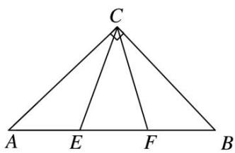

text_image

C
A E F B

(8)(2014·天津)在 $\triangle ABC$ 中，内角 $A$ ， $B$ ， $C$ 所对的边分别是 $a$ ， $b$ ， $c$ .已知 $b-c=\frac{1}{4}a$ ， $2\sin B=3\sin C$ ，

则 $\cos A$ 的值为 \_\_\_\_.

答案 $-\frac{1}{4}$ 解析 由 $2\sin B = 3\sin C$ 及正弦定理得 $2b = 3c$ ，即 $b = \frac{3}{2} c$ 。又 $b - c = \frac{1}{4} a$ ， $\therefore \frac{1}{2} c = \frac{1}{4} a$ ，即 $a = 2c$ 。由余弦定理得 $\cos A = \frac{b^2 + c^2 - a^2}{2bc} = \frac{\frac{9}{4}c^2 + c^2 - 4c^2}{2 \times \frac{3}{2}c^2} = \frac{-\frac{3}{4}c^2}{3c^2} = -\frac{1}{4}$ 。

(9)在 $\triangle ABC$ 中，角 $A$ ， $B$ ， $C$ 所对的边长分别为 $a$ ， $b$ ， $c$ ， $\sin A$ ， $\sin B$ ， $\sin C$ 成等比数列，且 $c=2a$ ，则 $\cos B$ 的值为（）

A. $\frac{1}{4}$

B. $\frac{3}{4}$

C. $\frac{\sqrt{2}}{4}$

D. $\frac{\sqrt{2}}{3}$

答案 B 解析 因为 $\sin A$ ， $\sin B$ ， $\sin C$ 成等比数列，所以 $\sin^{2}B = \sin A \sin C$ ，由正弦定理得 $b^{2} = ac$ ，又 c = 2a，故 $\cos B = \frac{a^{2} + c^{2} - b^{2}}{2ac} = \frac{a^{2} + 4a^{2} - 2a^{2}}{4a^{2}} = \frac{3}{4}$ .

(10)在锐角三角形 $ABC$ 中，角 $A, B, C$ 的对边分别为 $a, b, c$ . 若 $\frac{b}{a} + \frac{a}{b} = 6\cos C$ ，则 $\frac{\tan C}{\tan A} + \frac{\tan C}{\tan B}$ 的值是 \_\_\_\_.

答案 4 解析 由 $\frac{b}{a}+\frac{a}{b}=6\cos C$ 及余弦定理，得 $\frac{b}{a}+\frac{a}{b}=6\times\frac{a^{2}+b^{2}-c^{2}}{2ab}$ ，化简得 $a^{2}+b^{2}=\frac{3}{2}c^{2}$ 。又 $\frac{b}{a}+\frac{a}{b}=6\cos C$ 及正弦定理，得 $\frac{\sin B}{\sin A}+\frac{\sin A}{\sin B}=6\cos C$ ，故 $\sin A\sin B\cos C=\frac{1}{6}(\sin^{2}B+\sin^{2}A)$ 。又 $\frac{\tan C}{\tan A}+\frac{\tan C}{\tan B}=$ $\frac{\sin C\left(\frac{\cos A}{\sin A}+\frac{\cos B}{\sin B}\right)}{\cos C\sin A\sin B}=\frac{\sin^{2}C}{\cos C\sin A\sin B}$ ，所以 $\frac{\tan C}{\tan A}+\frac{\tan C}{\tan B}=\frac{6\sin^{2}C}{\sin^{2}B+\sin^{2}A}=\frac{6c^{2}}{a^{2}+b^{2}}=4.$

# 【对点训练】

1. 在 $\triangle ABC$ 中，角 $A, B, C$ 所对的边分别为 $a, b, c$ ，若 $\frac{b}{\sqrt{3}\cos B} = \frac{a}{\sin A}$ ，则 $\cos B$ 等于（）

A. $-\frac{1}{2}$

B. $\frac{1}{2}$

C. $-\frac{\sqrt{3}}{2}$

D. $\frac{\sqrt{3}}{2}$

1. 答案 B 解析 由正弦定理知 $\frac{\sin B}{\sqrt{3}\cos B} = \frac{\sin A}{\sin A} = 1$ ，即 $\tan B = \sqrt{3}$ ，由 $B \in (0, \pi)$ ，所以 $B = \frac{\pi}{3}$ ，所以 $\cos B = \cos \frac{\pi}{3} = \frac{1}{2}$ ，故选 B.

2. 在 $\triangle ABC$ 中，已知 $(b+c):(a+c):(a+b)=4:5:6$ ，则 $\sin A:\sin B:\sin C$ 等于\_\_\_\_。

2. 答案 7:5:3 解析 $\because (b + c):(c + a):(a + b) = 4:5:6, \therefore \frac{b + c}{4} = \frac{c + a}{5} = \frac{a + b}{6}$ . 令 $\frac{b + c}{4} = \frac{c + a}{5} =$

$\frac{a+b}{6}=k(k>0)$ ，则 $\left\{\begin{aligned}b+c=4k\\ c+a=5k\\ a+b=6k\end{aligned}\right.$ ，解得 $\left\{\begin{aligned}a=\frac{7}{2}k,\\ b=\frac{5}{2}k,\\ c=\frac{3}{2}k,\end{aligned}\right.$ $\therefore\sin A:\sin B:\sin C=a:b:c=7:5:3.$

3. 在 $\triangle ABC$ 中，角 $A, B, C$ 的对边分别是 $a, b, c$ ，若 $a = \frac{\sqrt{5}}{2} b, A = 2B$ ，则 $\cos B = (\quad)$

A. $\frac{\sqrt{5}}{3}$

B. $\frac{\sqrt{5}}{4}$

C. $\frac{\sqrt{5}}{5}$

D. $\frac{\sqrt{5}}{6}$

3. 答案 B 解析 由正弦定理，得 $\sin A = \frac{\sqrt{5}}{2}\sin B$ ，又 $A = 2B$ ，所以 $\sin A = \sin 2B = 2\sin B\cos B$ ，所以 $\cos B = \frac{\sqrt{5}}{4}$ .

4. 已知 $a, b, c$ 为 $\triangle ABC$ 的三个内角 $A, B, C$ 所对的边，若 $3b\cos C = c(1 - 3\cos B)$ ，则 $\sin C: \sin A = (\quad)$

A. 2:3

B. 4:3

C. 3:1

D. 3:2

4. 答案 C 解析 由正弦定理得 $3\sin B\cos C = \sin C - 3\sin C\cos B$ ， $3\sin (B + C) = \sin C$ ，因为 $A + B + C = \pi$ ，所以 $B + C = \pi - A$ ，所以 $3\sin A = \sin C$ ，所以 $\sin C: \sin A = 3:1$ ，故选 C.

5. (2013·辽宁)在 $\triangle ABC$ 中，内角 $A$ ， $B$ ， $C$ 的对边分别为 $a$ ， $b$ ， $c$ 。若 $a\sin B\cos C + c\sin B\cos A = \frac{1}{2}b$ ，且 $a > b$ ，则 $B$ 等于( )

A. $\frac{\pi}{6}$

B. $\frac{\pi}{3}$

C. $\frac{2\pi}{3}$

D. $\frac{5\pi}{6}$

5. 答案 A 解析 由条件得 $\frac{a}{b}\sin B\cos C + \frac{c}{b}\sin B\cos A = \frac{1}{2}$ , 由正弦定理, 得 $\sin A\cos C + \sin C\cos A = \frac{1}{2}$ , $\therefore \sin (A + C) = \frac{1}{2}$ , 从而 $\sin B = \frac{1}{2}$ , 又 $a > b$ , 且 $B \in (0, \pi)$ , 因此 $B = \frac{\pi}{6}$ .

另解 由射影定理可知 $a\cos C + c\cos A = b$ ，则 $(a\cos C + c\cos A)\sin B = b\sin B$ ，又 $a\sin B\cos C + c\sin B\cos A = \frac{1}{2} b$ ，则有 $b\sin B = \frac{1}{2} b$ ， $\sin B = \frac{1}{2}$ 。又 $a > b$ ，所以 $A > B$ ，则 $B \in \left(0, \frac{\pi}{2}\right)$ ，故 $B = \frac{\pi}{6}$ 。

6. 如图，在 $\triangle ABC$ 中， $\angle C = \frac{\pi}{3}$ ， $BC = 4$ ，点 $D$ 在边 $AC$ 上， $AD = DB$ ， $DE \perp AB$ ， $E$ 为垂足。若 $DE = 2\sqrt{2}$ ，则 $\cos A$ 等于（）

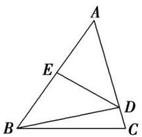

text_image

A
E
B
C
D

A. $\frac{2\sqrt{2}}{3}$

B. $\frac{\sqrt{2}}{4}$

C. $\frac{\sqrt{6}}{4}$

D. $\frac{\sqrt{6}}{3}$

6. 答案 C 解析 依题意得， $BD = AD = \frac{DE}{\sin A} = \frac{2\sqrt{2}}{\sin A}$ ， $\angle BDC = \angle ABD + \angle A = 2\angle A$ 。在 $\triangle BCD$ 中， $\frac{BC}{\sin\angle BDC}=\frac{BD}{\sin C},\quad\frac{4}{\sin 2A}=\frac{2\sqrt{2}}{\sin A}\times\frac{2}{\sqrt{3}}=\frac{4\sqrt{2}}{\sqrt{3}\sin A}$ ，即 $\frac{4}{2\sin A\cos A}=\frac{4\sqrt{2}}{\sqrt{3}\sin A}$ ，由此解得 $\cos A=\frac{\sqrt{6}}{4}$ .

7. 在 $\triangle ABC$ 中， $\sin A: \sin B: \sin C=3:2:3$ ，则 $\cos C$ 的值为\_\_\_\_。

7. 答案 $\frac{1}{3}$ 解析 由 $\sin A: \sin B: \sin C = 3:2:3$ ，可得 $a:b:c = 3:2:3$ 。不妨设 $a = 3k, b = 2k, c = 3k (k > 0)$ ，则 $\cos C = \frac{(3k)^2 + (2k)^2 - (3k)^2}{2 \times 3k \times 2k} = \frac{1}{3}$ .

8. 在 $\triangle ABC$ 中，若 $b = 1$ ， $c = \sqrt{3}$ ， $A = \frac{\pi}{6}$ ，则 $\cos 5B = (\quad)$

A. $-\frac{\sqrt{3}}{2}$

B. $\frac{1}{2}$

C. $\frac{1}{2}$ 或 $-1$

D. $-\frac{\sqrt{3}}{2}$ 或 0

8. 答案 A 解析 由 $b = 1$ , $c = \sqrt{3}$ , $A = \frac{\pi}{6}$ , 结合余弦定理得 $a^2 = b^2 + c^2 - 2bc\cos A$ , 即 $a^2 = 1 + 3 - 2 \times 1 \times \sqrt{3} \times \frac{\sqrt{3}}{2} = 1$ , 得 $a = 1$ . 由此 $a = b$ , 则 $B = A = \frac{\pi}{6}$ , 因此 $\cos 5B = \cos \frac{5\pi}{6} = -\frac{\sqrt{3}}{2}$ , 故选 A.

9. 已知在 $\triangle ABC$ 中, 内角 $A, B, C$ 的对边分别为 $a, b, c$ , 若 $2b^{2} - 2a^{2} = ac + 2c^{2}$ , 则 $\sin B$ 等于 \_\_\_\_.

9. 答案 $\frac{\sqrt{15}}{4}$ 解析 由 $2b^{2} - 2a^{2} = ac + 2c^{2}$ , 得 $2(a^{2} + c^{2} - b^{2}) + ac = 0$ . 由余弦定理, 得 $a^{2} + c^{2} - b^{2} = 2ac\cos B$ , $\therefore 4ac\cos B + ac = 0$ . $\because ac \neq 0$ , $\therefore 4\cos B + 1 = 0$ , $\cos B = -\frac{1}{4}$ , 又 $B \in (0, \pi)$ , $\therefore \sin B = \sqrt{1 - \cos^2 B} = \frac{\sqrt{15}}{4}$ .

10. 在 $\triangle ABC$ 中，角 $A, B, C$ 所对的边分别为 $a, b, c$ ，若 $(a^2 + c^2 - b^2)\tan B = \sqrt{3} ac$ ，则角 $B$ 的大小为（ ）

A. $\frac{\pi}{6}$

B. $\frac{\pi}{3}$

C. $\frac{\pi}{6}$ 或 $\frac{5\pi}{6}$

D. $\frac{\pi}{3}$ 或 $\frac{2\pi}{3}$

10. 答案 D 解析 由余弦定理 $a^2 + c^2 - b^2 = 2ac\cos B$ ，得 $2ac\sin B = \sqrt{3}ac$ ，因为 $ac \neq 0$ ，所以 $\sin B = \frac{\sqrt{3}}{2}$ ，所以 $B = \frac{\pi}{3}$ 或 $\frac{2\pi}{3}$ .

11. 如图, 在 $\triangle ABC$ 中, $AB = 3$ , $AC = 2$ , $BC = 4$ , 点 $D$ 在边 $BC$ 上, $\angle BAD = 45^{\circ}$ , 则 $\tan \angle CAD$ 的值为 \_\_\_\_.

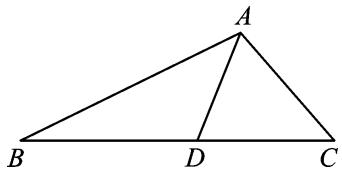

text_image

A
B D C

11. 答案 $\frac{8 + \sqrt{15}}{7}$ 解析 从构造角的角度观察分析，可以从差的角度 $(\angle CAD = \angle A - 45^{\circ})$ ，也可以从和的角度 $(\angle A = \angle CAD + 45^{\circ})$ ，所以只需从余弦定理入手求出 $\angle A$ 的正切值，问题就迎刃而解了.

解法1 在 $\triangle ABC$ 中， $AB = 3$ ， $AC = 2$ ， $BC = 4$ ，由余弦定理可得 $\cos A = \frac{3^2 + 2^2 - 4^2}{2 \times 3 \times 2} = -\frac{1}{4}$ ，所以 $\tan A = -\sqrt{15}$ ，于是 $\tan \angle CAD = \tan (A - 45^\circ) = \frac{\tan A - \tan 45^\circ}{1 + \tan A \tan 45^\circ} = \frac{8 + \sqrt{15}}{7}$ .

解法2 由解法1得 $\tan A = -\sqrt{15}$ 。由 $\tan (45^{\circ} + \angle CAD) = -\sqrt{15}$ 得 $\frac{\tan 45^{\circ} + \tan \angle CAD}{1 - \tan 45^{\circ} \tan \angle CAD} = -\sqrt{15}$ ，即 $\frac{1 + \tan \angle CAD}{1 - \tan \angle CAD} = -\sqrt{15}$ ，解得 $\tan \angle CAD = \frac{8 + \sqrt{15}}{7}$ 。

12. (2020·全国III)在 $\triangle ABC$ 中， $\cos C=\frac{2}{3}$ ， $AC=4$ ， $BC=3$ ，则 $\cos B$ 等于( )

A. $\frac{1}{9}$

B. $\frac{1}{3}$

C. $\frac{1}{2}$

D. $\frac{2}{3}$

12. 答案 A 解析 由余弦定理得 $AB^{2} = AC^{2} + BC^{2} - 2AC \cdot BC\cos C = 4^{2} + 3^{2} - 2 \times 4 \times 3 \times \frac{2}{3} = 9$ ，所以 $AB = 3$ ，所以 $\cos B = \frac{AB^2 + BC^2 - AC^2}{2AB \cdot BC} = \frac{9 + 9 - 16}{2 \times 3 \times 3} = \frac{1}{9}$ .

13. 已知 $\triangle ABC$ 中, 角 $A, B, C$ 的对边分别为 $a, b, c, C = 120^{\circ}$ , $a = 2b$ , 则 $\tan A =$ \_\_\_\_.

13. 答案 $\frac{\sqrt{3}}{2}$ 解析 $c^2 = a^2 + b^2 - 2ab\cos C = 4b^2 + b^2 - 2 \times 2b \times b \times \left(-\frac{1}{2}\right) = 7b^2, \therefore c = \sqrt{7}b, \cos A =$

$$
\frac {b ^ {2} + c ^ {2} - a ^ {2}}{2 b c} = \frac {b ^ {2} + 7 b ^ {2} - 4 b ^ {2}}{2 \times b \times \sqrt {7} b} = \frac {2}{\sqrt {7}}, \therefore \sin A = \sqrt {1 - \cos^ {2} A} = \sqrt {1 - \frac {4}{7}} = \frac {\sqrt {3}}{\sqrt {7}}, \therefore \tan A = \frac {\sin A}{\cos A} = \frac {\sqrt {3}}{2}.
$$

14. 在 $\triangle ABC$ 中， $B=60^{\circ}$ ，最大边与最小边之比为 $(\sqrt{3}+1):2$ ，则最大角为\_\_\_\_。

14. 答案 $75^{\circ}$ 解析 由题意可知 c<b<a，或 a<b<c，不妨设 c=2x，则 $a=(\sqrt{3}+1)x,\therefore\cos B=\frac{a^{2}+c^{2}-b^{2}}{2ac}$ ，即 $\frac{1}{2}=\frac{(\sqrt{3}+1)^{2}x^{2}+4x^{2}-b^{2}}{2\cdot(\sqrt{3}+1)x\cdot2x},\therefore b^{2}=6x^{2},\therefore\cos C=\frac{a^{2}+b^{2}-c^{2}}{2ab}=\frac{(\sqrt{3}+1)^{2}x^{2}+6x^{2}-4x^{2}}{2(\sqrt{3}+1)x\cdot\sqrt{6}x}=\frac{\sqrt{2}}{2},\therefore C=45^{\circ},\therefore A=180^{\circ}-60^{\circ}-45^{\circ}=75^{\circ}.$

15. (2020·全国 I)如图, 在三棱锥 $P-ABC$ 的平面展开图中, $AC=1$ , $AB=AD=\sqrt{3}$ , $AB \perp AC$ , $AB \perp AD$ , $\angle CAE=30^{\circ}$ , 则 $\cos\angle FCB=$ \_\_\_\_.

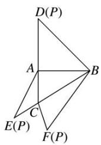

text_image

D(P)
A
B
C
E(P)
F(P)

15. 答案 $-\frac{1}{4}$ 解析 在 $\triangle ABD$ 中， $\because AB \perp AD, AB = AD = \sqrt{3}, \therefore BD = \sqrt{6}, \therefore FB = BD = \sqrt{6}$ . 在 $\triangle ACE$ 中， $\because AE = AD = \sqrt{3}, AC = 1, \angle CAE = 30^\circ, \therefore EC = \sqrt{(\sqrt{3})^2 + 1^2 - 2 \times \sqrt{3} \times 1 \times \cos 30^\circ} = 1, \therefore CF = CE = 1$ . 又 $\because BC = \sqrt{AC^2 + AB^2} = \sqrt{1^2 + (\sqrt{3})^2} = 2, \therefore$ 在 $\triangle FCB$ 中，由余弦定理得 $\cos \angle FCB = \frac{CF^2 + BC^2 - FB^2}{2 \times CF \times BC} = \frac{1^2 + 2^2 - (\sqrt{6})^2}{2 \times 1 \times 2} = -\frac{1}{4}$ .

16. 在 $\triangle ABC$ 中，内角 $A, B, C$ 的对边分别为 $a, b, c$ ，若 $\triangle ABC$ 的面积为 $S$ ，且 $2S = (a + b)^2 - c^2$ ，则 $\tan C = (\quad)$

A. $\frac{3}{4}$

B. $\frac{4}{3}$

C. $-\frac{4}{3}$

D. $-\frac{3}{4}$

16. 答案 C 解析 因为 $2S = (a + b)^{2} - c^{2} = a^{2} + b^{2} - c^{2} + 2ab$ ，结合面积公式与余弦定理，得 $ab\sin C = 2ab\cos C + 2ab$ ，即 $\sin C - 2\cos C = 2$ ，所以 $(\sin C - 2\cos C)^{2} = 4$ ，即 $\frac{\sin^{2}C - 4\sin C\cos C + 4\cos^{2}C}{\sin^{2}C + \cos^{2}C} = 4$ ，所以 $\frac{\tan^{2}C - 4\tan C + 4}{\tan^{2}C + 1} = 4$ ，解得 $\tan C = -\frac{4}{3}$ 或 $\tan C = 0$ （舍去），故选 C.

17. 在 $\triangle ABC$ 中, 内角 $A$ , $B$ , $C$ 的对边分别为 $a$ , $b$ , $c$ , 若 $b = 2$ , $\triangle ABC$ 面积的最大值为 $\sqrt{3}$ , 则角 $B$ 的值为( )

A. $\frac{2\pi}{3}$

B. $\frac{\pi}{3}$

C. $\frac{\pi}{6}$

D. $\frac{\pi}{4}$

17. 答案 B 解析 由余弦定理得 $4 = a^2 + c^2 - 2ac\cos B \geq 2ac - 2ac\cos B = 2ac(1 - \cos B)$ ，当且仅当 $a = c$ 时取等号，所以 $ac \leq \frac{2}{1 - \cos B}$ ， $S_{\triangle ABC} = \frac{1}{2} ac\sin B \leq \frac{1}{2} \times \frac{2\sin B}{1 - \cos B} = \frac{1}{\tan \frac{B}{2}}$ ，即 $\frac{1}{\tan \frac{B}{2}} = \sqrt{3}$ ，所以 $B$ 为 $\frac{\pi}{3}$ .

18. 在 $\triangle ABC$ 中，角 $A, B, C$ 的对边分别为 $a, b, c$ ，若 $a^{2}=3b^{2}+3c^{2}-2\sqrt{3}bc\sin A$ ，则 $C=$ \_\_\_\_.

18. 答案 $\frac{\pi}{6}$ 解析 由余弦定理，得 $a^2 = b^2 + c^2 - 2bc\cos A$ ，所以 $b^2 + c^2 - 2bc\cos A = 3b^2 + 3c^2 - 2\sqrt{3}bc\sin A$ ， $\sqrt{3}\sin A - \cos A = \frac{b^2 + c^2}{bc}, b, c > 0, 2\sin \left(A - \frac{\pi}{6}\right) = \frac{b^2 + c^2}{bc} = \frac{c}{b} + \frac{b}{c} \geqslant 2$ ，当且仅当 $b = c$ 时，等号成立，因此 $b = c, A - \frac{\pi}{6} = \frac{\pi}{2}$ ，所以 $A = \frac{2\pi}{3}$ ，所以 $C = \frac{\pi - \frac{2\pi}{3}}{2} = \frac{\pi}{6}$ .

19. $\triangle ABC$ 的内角 $A, B, C$ 的对边分别为 $a, b, c, a\sin A + c\sin C - \sqrt{2} a\sin C = b\sin B$ ，则角 $B =$ \_\_\_\_.

19. 答案 $45^{\circ}$ 解析 由正弦定理，得 $a^{2}+c^{2}-\sqrt{2}ac=b^{2}$ ，由余弦定理，得 $b^{2}=a^{2}+c^{2}-2ac\cos B$ ，故 $\cos B=\frac{\sqrt{2}}{2}$ 。又因为 B 为三角形的内角，所以 $B=45^{\circ}$ 。

20. 在 $\triangle ABC$ 中, 内角 $A, B, C$ 所对的边分别为 $a, b, c$ , 且 $2a\sin A = (2\sin B + \sin C)b + (2c + b)\sin C$ , 则 $A = (\quad)$

A. $60^{\circ}$

B. $120^{\circ}$

C. $30^{\circ}$

D. $150^{\circ}$

20. 答案 B 解析 由已知，根据正弦定理得 $2a^{2} = (2b + c)b + (2c + b)c$ ，即 $a^{2} = b^{2} + c^{2} + bc$ 。由余弦定理 $a^{2} = b^{2} + c^{2} - 2bc\cos A$ ，得 $\cos A = -\frac{1}{2}$ ，又 $A$ 为三角形的内角，故 $A = 120^{\circ}$ 。

21. 已知 $\triangle ABC$ 的内角 $A, B, C$ 的对边分别为 $a, b, c$ , 若 $(a + b)(\sin A - \sin B) = (c - b)\sin C$ , 则 $A = (\quad)$

A. $\frac{\pi}{6}$

B. $\frac{\pi}{3}$

C. $\frac{5\pi}{6}$

D. $\frac{2\pi}{3}$

21. 答案 B 解析 $\because(a+b)(\sin A-\sin B)=(c-b)\sin C,\quad\therefore$ 由正弦定理得 $(a+b)(a-b)=c(c-b)$ ，即 $b^{2}+c^{2}-a^{2}=bc$ 。所以 $\cos A=\frac{b^{2}+c^{2}-a^{2}}{2bc}=\frac{1}{2}$ ，又 $A\in(0,\pi)$ ，所以 $A=\frac{\pi}{3}$ .

22. $\triangle ABC$ 的内角 $A, B, C$ 所对的边分别为 $a, b, c$ , 若 $\frac{\sin B - \sin A}{\sin C} = \frac{\sqrt{3}a + c}{a + b}$ , 则角 $B = \_$ .

22. 答案 $\frac{5\pi}{6}$ 解析 由 $\frac{\sin B - \sin A}{\sin C} = \frac{\sqrt{3}a + c}{a + b}$ 及正弦定理知 $\frac{b - a}{c} = \frac{\sqrt{3}a + c}{a + b}$ ，整理得 $b^2 - a^2 = \sqrt{3}ac + c^2$ ，即 $b^2 = a^2 + c^2 + \sqrt{3}ac$ ，根据余弦定理可知 $\cos B = -\frac{\sqrt{3}}{2}$ ，又 $B \in (0, \pi)$ ，所以 $B = \frac{5\pi}{6}$ .

23. 在 $\triangle ABC$ 中， $a, b, c$ 分别是内角 $A, B, C$ 的对边，且 $\frac{b+a}{\sin C}=\frac{2a\sin B-c}{\sin B-\sin A}$ ，则 $A=$ \_\_\_\_.

23. 答案 $\frac{\pi}{4}$ 解析 由正弦定理 $\frac{a}{\sin A} = \frac{b}{\sin B} = \frac{c}{\sin C}$ , 得 $\frac{b + a}{c} = \frac{2a\sin B - c}{b - a}$ , 整理得 $b^2 - a^2 = 2ac\sin B - c^2$ , 即 $b^2 + c^2 - a^2 = 2ac\sin B = 2bc\sin A$ , 由余弦定理得, $b^2 + c^2 - a^2 = 2bc\cos A$ , $\therefore 2bc\cos A = 2bc\sin A$ , 即 $\cos A = \sin A$ , $\therefore \tan A = 1$ , $\therefore A = \frac{\pi}{4}$ .

24. 在 $\triangle ABC$ 中, 内角 $A, B, C$ 所对的边分别是 $a, b, c$ , 若 $a^2 - b^2 = \sqrt{3}bc$ , $\sin C = 2\sqrt{3}\sin B$ , 则角 $A$ 为 ( )

A. $30^{\circ}$

B. $60^{\circ}$

C. $120^{\circ}$

D. $150^{\circ}$

24. 答案 A 解析 由 $\sin C = 2\sqrt{3}\sin B$ ，得 $c = 2\sqrt{3} b$ ， $\therefore c^2 = 2\sqrt{3} bc$ ， $\therefore \cos A = \frac{b^2 + c^2 - a^2}{2bc} = \frac{-\sqrt{3}bc + 2\sqrt{3}bc}{2bc}$

$$
= \frac {\sqrt {3}}{2}, \text {又} 0 ^ {\circ} <   A <   1 8 0 ^ {\circ}, \therefore A = 3 0 ^ {\circ}.
$$

25. 设 $\triangle ABC$ 的内角 $A, B, C$ 所对边的长分别为 $a, b, c$ . 若 $b + c = 2a, 3\sin A = 5\sin B$ , 则角 $C =$ \_\_\_\_.

25. 答案 $\frac{2\pi}{3}$ 解析 由 $3\sin A = 5\sin B$ ，得 $3a = 5b$ 。又因为 $b + c = 2a$ ，所以 $a = \frac{5}{3} b$ ， $c = \frac{7}{3} b$ ，所以 $\cos C = \frac{a^2 + b^2 - c^2}{2ab} = \frac{\left(\frac{5}{3}b\right)^2 + b^2 - \left(\frac{7}{3}b\right)^2}{2 \times \frac{5}{3}b \times b} = -\frac{1}{2}$ 。因为 $C \in (0, \pi)$ ，所以 $C = \frac{2\pi}{3}$ 。

26. $\triangle ABC$ 中, 内角 $A, B, C$ 对应的边分别为 $a, b, c, c = 2a$ , $b\sin B - a\sin A = \frac{1}{2} a\sin C$ , 则 $\sin B$ 的值为 ( )

A. $\frac{2\sqrt{2}}{3}$

B. $\frac{3}{4}$

C. $\frac{\sqrt{7}}{4}$

D. $\frac{1}{3}$

26. 答案 C 解析 由正弦定理，得 $b^{2} - a^{2} = \frac{1}{2} ac$ ，又 $c = 2a$ ，所以 $b^{2} = 2a^{2}$ ，所以 $\cos B = \frac{a^2 + c^2 - b^2}{2ac} = \frac{3}{4}$ ，所以 $\sin B = \frac{\sqrt{7}}{4}$ .

27. 在 $\triangle ABC$ 中，内角 $A, B, C$ 所对的边分别为 $a, b, c$ 。若 $a=4, b=5, c=6$ ，则 $\frac{\sin 2A}{\sin C}$ 等于\_\_\_\_。

27. 答案 1 解析 由余弦定理得 $\cos A = \frac{b^2 + c^2 - a^2}{2bc} = \frac{25 + 36 - 16}{2 \times 5 \times 6} = \frac{3}{4}$ , 所以 $\frac{\sin 2A}{\sin C} = \frac{2\sin A\cos A}{\sin C} = \frac{2a\cos A}{c} = \frac{4\cos A}{3} = 1$ .

# 考点二 计算三角形中的边或周长

# 【方法总结】

# 计算三角形中的边长的解题技巧

此类问题主要考查正弦定理、余弦定理及三角形面积公式，最简单的问题是只用正弦定理或余弦定理即可解决。中等难度的问题要结合三角恒等变换再用正弦定理或余弦定理即可解决。难度较大的问题要结合三角恒等变换并同时用正弦定理、余弦定理和面积公式才能解决。

# 【例题选讲】

[例 2](1)在 $\triangle ABC$ 中，若 $A=60^{\circ}$ ， $a=2\sqrt{3}$ ，则 $\frac{a+b+c}{\sin A+\sin B+\sin C}$ 等于\_\_\_\_.

答案 4 解析 $\frac{a}{\sin A} = \frac{b}{\sin B} = \frac{c}{\sin C} = \frac{2\sqrt{3}}{\sin 60^\circ} = 4$ ，所以 $a = 4\sin A, b = 4\sin B, c = 4\sin C$ ，所以 $\frac{a + b + c}{\sin A + \sin B + \sin C} = \frac{4(\sin A + \sin B + \sin C)}{\sin A + \sin B + \sin C} = 4.$

(2)(2016·全国Ⅱ)△ABC 的内角 A, B, C 的对边分别为 a, b, c，若 $\cos A=\frac{4}{5}$ ， $\cos C=\frac{5}{13}$ ，a=1，则 b= \_\_\_\_.

答案 $\frac{21}{13}$ 解析 因为 $A, C$ 为 $\triangle ABC$ 的内角，且 $\cos A = \frac{4}{5}, \cos C = \frac{5}{13}$ ，所以 $\sin A = \frac{3}{5}, \sin C = \frac{12}{13}$ ，所以 $\sin B = \sin (\pi - A - C) = \sin (A + C) = \sin A\cos C + \cos A\sin C = \frac{3}{5} \times \frac{5}{13} + \frac{4}{5} \times \frac{12}{13} = \frac{63}{65}$ . 又 $a = 1$ ，所以由正弦定理得 $b = \frac{a\sin B}{\sin A} = \frac{63}{65} \times \frac{5}{3} = \frac{21}{13}$ .

(3)在 $\triangle ABC$ 中， $C=\frac{2\pi}{3}$ ， $AB=3$ ，则 $\triangle ABC$ 的周长为()

A. $6\sin \left( \frac{A + \frac{\pi}{3}}{3} \right) + 3$

B. $6\sin \left(\frac{A + \frac{\pi}{6}}{6}\right) + 3$

C. $2\sqrt{3}\sin \left(\frac{A + \pi}{3}\right) + 3$

D. $2\sqrt{3}\sin \left(\frac{A + \frac{\pi}{6}}{6}\right) + 3$

答案 C 解析 设 $\triangle ABC$ 的外接圆半径为 $R$ ，则 $2R = \frac{3}{\sin\frac{2\pi}{3}} = 2\sqrt{3}$ ，于是 $BC = 2R\sin A = 2\sqrt{3}\sin A$ ， $AC = 2R\sin B = 2\sqrt{3}\sin \left(\frac{\pi}{3} - A\right)$ 。于是 $\triangle ABC$ 的周长为 $2\sqrt{3}\left[\sin A + \sin \left(\frac{\pi}{3} - A\right)\right] + 3 = 2\sqrt{3}\sin \left(A + \frac{\pi}{3}\right) + 3$ 。

(4)(2016·全国 I )△ABC 的内角 A, B, C 的对边分别为 a, b, c. 已知 $a=\sqrt{5}$ , c=2, $\cos A=\frac{2}{3}$ ，则 $b=(\quad)$

A. $\sqrt{2}$

B. $\sqrt{3}$

C. 2

D. 3

答案 D 解析 由余弦定理，得 $5 = b^{2} + 2^{2} - 2 \times b \times 2 \times \frac{2}{3}$ ，解得 $b = 3\left(b = -\frac{1}{3}\right)$ 舍去。

(5)(2018·全国Ⅱ)在△ABC中， $\cos\frac{C}{2}=\frac{\sqrt{5}}{5}$ ，BC=1，AC=5，则AB=( )

A. $4 \sqrt{2}$

B. $\sqrt{30}$

C. $\sqrt{29}$

D. $2\sqrt{5}$

答案 A 解析 由题意得 $\cos C = 2\cos^2\frac{C}{2} - 1 = 2 \times \left(\frac{\sqrt{5}}{5}\right)^2 - 1 = -\frac{3}{5}$ . 在 $\triangle ABC$ 中，由余弦定理得 $AB^2 = AC^2 + BC^2 - 2AC \times BC \times \cos C = 5^2 + 1^2 - 2 \times 5 \times 1 \times \left(-\frac{3}{5}\right) = 32$ ，所以 $AB = 4\sqrt{2}$ .

(6) $\triangle ABC$ 的内角 $A, B, C$ 所对的边分别为 $a, b, c$ , 且 $a, b, c$ 成等比数列. 若 $\sin B = \frac{5}{13}, \cos B = \frac{12}{ac}$ , 则 $a + c$ 的值为 \_\_\_\_.

答案 $3\sqrt{7}$ 解析 因为 $a, b, c$ 成等比数列，所以 $b^{2} = ac$ 。因为 $\sin B = \frac{5}{13}, \cos B = \frac{12}{ac}$ ，所以 $ac = 13$ ，因为 $b^{2} = a^{2} + c^{2} - 2ac\cos B$ ，所以 $a^{2} + c^{2} = 37$ ，所以 $(a + c)^{2} = 63$ ，所以 $a + c = 3\sqrt{7}$ 。

(7)如图, 在 $\triangle ABC$ 中, $\angle B = 45^{\circ}$ , $D$ 是 $BC$ 边上的一点, $AD = 5$ , $AC = 7$ , $DC = 3$ , 则 $AB$ 的长为 \_\_\_\_.

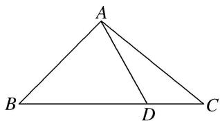

text_image

A
B
D
C

答案 $\frac{5\sqrt{6}}{2}$ 解析 在 $\triangle ADC$ 中， $AD = 5, AC = 7, DC = 3$ ，由余弦定理得 $\cos \angle ADC = \frac{AD^2 + DC^2 - AC^2}{2AD \cdot DC} = -\frac{1}{2}, \therefore \angle ADC = 120^\circ, \angle ADB = 60^\circ$ ，在 $\triangle ABD$ 中， $AD = 5, \angle B = 45^\circ, \angle ADB = 60^\circ$ ，由正弦定理得 $\frac{AB}{\sin \angle ADB}$

$$
= \frac {A D}{\sin B}, \therefore A B = \frac {5 \sqrt {6}}{2}.
$$

(8)如图所示，在四边形 ABCD 中， $AD \perp CD$ ，AD = 10，AB = 14， $\angle BDA = 60^{\circ}$ ， $\angle BCD = 135^{\circ}$ ，则 BC 的长为 \_\_\_\_.

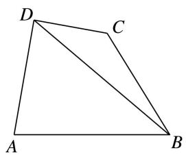

natural_image

Geometric diagram of a quadrilateral ABCD with diagonal BD, no text or symbols present

答案 $8\sqrt{2}$ 解析 在 $\triangle ABD$ 中，由余弦定理，得 $AB^{2} = AD^{2} + BD^{2} - 2AD\cdot BD\cdot \cos \angle ADB$ ，设 $BD = x$ 则有 $14^{2} = 10^{2} + x^{2} - 2\times 10x\cos 60^{\circ}$ ， $\therefore x^{2} - 10x - 96 = 0$ ， $\therefore x_{1} = 16$ ， $x_{2} = -6$ （舍去）， $\therefore BD = 16$ 。在 $\triangle BCD$ 中，由正弦定理知， $\frac{BC}{\sin\angle CDB} = \frac{BD}{\sin\angle BCD}$ ， $\therefore BC = \frac{16}{\sin 135^\circ}\cdot \sin 30^\circ = 8\sqrt{2}$

(9)在 $\triangle ABC$ 中，三个内角 $A, B, C$ 所对的边分别为 $a, b, c$ ，若 $S_{\triangle ABC} = 2\sqrt{3}, a + b = 6, \frac{a\cos B + b\cos A}{c} = 2\cos C$ ，则 $c$ 等于（）

A. $2 \sqrt{7}$

B. 4

C. $2\sqrt{3}$

D. $3\sqrt{3}$

答案 C 解析 $\because \frac{a\cos B + b\cos A}{c} = 2\cos C$ ，由正弦定理，得 $\sin A\cos B + \cos A\sin B = 2\sin C\cos C$ ， $\therefore \sin (A + B) = \sin C = 2\sin C\cos C$ ，由于 $0 < C < \pi$ ， $\sin C \neq 0$ ， $\therefore \cos C = \frac{1}{2}$ ， $\therefore C = \frac{\pi}{3}$ ， $\because S_{\triangle ABC} = 2\sqrt{3} = \frac{1}{2} a b \sin C = \frac{\sqrt{3}}{4} a b$ ， $\therefore a b = 8$ ，又 $a + b = 6$ ，解得 $\left\{ \begin{array}{l} a = 2, \\ b = 4 \end{array} \right.$ 或 $\left\{ \begin{array}{l} a = 4, \\ b = 2, \end{array} \right.$ ， $c^2 = a^2 + b^2 - 2ab\cos C = 4 + 16 - 8 = 12$ ， $\therefore c = 2\sqrt{3}$ ，故选 C.

(10)已知 $\triangle ABC$ 中， $AC = \sqrt{2}$ ， $BC = \sqrt{6}$ ， $\triangle ABC$ 的面积为 $\frac{\sqrt{3}}{2}$ . 若线段 $BA$ 的延长线上存在点 $D$ ，使 $\angle BDC = \frac{\pi}{4}$ ，则 $CD =$ \_\_\_\_.

答案 $\sqrt{3}$ 解析 因为 $S_{\triangle ABC} = \frac{1}{2} AC \cdot BC \cdot \sin \angle BCA$ ，即 $\frac{\sqrt{3}}{2} = \frac{1}{2} \times \sqrt{2} \times \sqrt{6} \times \sin \angle BCA$ ，所以 $\sin \angle BCA = \frac{1}{2}$ . 因为 $\angle BAC > \angle BDC = \frac{\pi}{4}$ ，所以 $\angle DAC < \frac{3\pi}{4}$ ，又 $\angle DAC = \angle ABC + \angle ACB$ ，所以 $\angle ACB < \frac{3\pi}{4}$ ，则 $\angle BCA = \frac{\pi}{6}$ ，所以 $\cos \angle BCA = \frac{\sqrt{3}}{2}$ . 在 $\triangle ABC$ 中， $AB^2 = AC^2 + BC^2 - 2AC \cdot BC \cdot \cos \angle BCA = 2 + 6 - 2 \times \sqrt{2} \times \sqrt{6} \times \frac{\sqrt{3}}{2} = 2$ ，所以 $AB = \sqrt{2} = AC$ ，所以 $\angle ABC = \angle ACB = \frac{\pi}{6}$ ，在 $\triangle BCD$ 中， $\frac{BC}{\sin \angle BDC} = \frac{CD}{\sin \angle DBC}$ ，即 $\frac{\sqrt{6}}{\frac{\sqrt{2}}{2}} = \frac{CD}{\frac{1}{2}}$ ，解得 $CD = \sqrt{3}$ .

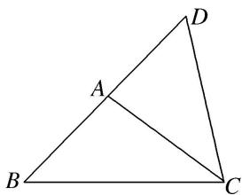

text_image

Geometric diagram of triangle ABC with point D on side AD and line segment AC drawn

【对点训练】

1. 在 $\triangle ABC$ 中， $A: B = 1: 2$ ， $\sin C = 1$ ，则 $a: b: c$ 等于（）

A. $1:2:3$

B. 3:2:1

C. $1:\sqrt{3}:2$

D. $2:\sqrt{3}:1$

1. 答案 C 解析 由 $\sin C = 1, \therefore C = \frac{\pi}{2}$ , 由 $A: B = 1: 2$ , 故 $A + B = 3A = \frac{\pi}{2}$ , 得 $A = \frac{\pi}{6}, B = \frac{\pi}{3}$ , 由正弦定理得, $a: b: c = \sin A: \sin B: \sin C = \frac{1}{2}: \frac{\sqrt{3}}{2}: \frac{2}{2} = 1: \sqrt{3}: 2$ .

2. 在 $\triangle ABC$ 中，若 $b=5$ ， $B=\frac{\pi}{4}$ ， $\tan A=2$ ，则 $a=$ \_\_\_\_.

2. 答案 $2\sqrt{10}$ 解析 由 $\tan A = 2$ 得 $\sin A = 2\cos A$ 。又 $\sin^2 A + \cos^2 A = 1$ 得 $\sin A = \frac{2\sqrt{5}}{5}$ 。 $\because b = 5, B = \frac{\pi}{4}$ ，根据正弦定理，有 $\frac{a}{\sin A} = \frac{b}{\sin B}, \therefore a = \frac{b\sin A}{\sin B} = \frac{2\sqrt{5}}{\frac{\sqrt{2}}{2}} = 2\sqrt{10}$ .

3. 设 $\triangle ABC$ 的内角 $A, B, C$ 的对边分别为 $a, b, c$ . 若 $a = \sqrt{3}$ , $\sin B = \frac{1}{2}$ , $C = \frac{\pi}{6}$ , 则 $b =$ \_\_\_\_.

3. 答案 1 解析 因为 $\sin B = \frac{1}{2}$ 且 $B \in (0, \pi)$ ，所以 $B = \frac{\pi}{6}$ 或 $B = \frac{5\pi}{6}$ . 又 $C = \frac{\pi}{6}$ ， $B + C < \pi$ ，所以 $B = \frac{\pi}{6}$ ， $A = \pi - B - C = \frac{2\pi}{3}$ . 又 $a = \sqrt{3}$ ，由正弦定理得 $\frac{a}{\sin A} = \frac{b}{\sin B}$ ，即 $\frac{\sqrt{3}}{\sin \frac{2\pi}{3}} = \frac{b}{\sin \frac{\pi}{6}}$ ，解得 $b = 1$ .

4. $\triangle ABC$ 的三个内角 $A, B, C$ 所对的边分别为 $a, b, c, a\sin A\sin B + b\cos^2 A = \sqrt{2} a$ ，则 $\frac{b}{a}$ 等于（ ）

A. $2 \sqrt{3}$

B. $2\sqrt{2}$

C. $\sqrt{3}$

D. $\sqrt{2}$

4. 答案 D 解析 $\because a\sin A\sin B + b\cos^2 A = \sqrt{2} a, \therefore \sin A\sin A\sin B + \sin B\cos^2 A = \sqrt{2}\sin A, \therefore \sin B = \sqrt{2}\sin A,$ $\therefore \frac{b}{a} = \frac{\sin B}{\sin A} = \sqrt{2}.$

5. (2019 浙江) 在 $\triangle ABC$ 中, $\angle ABC = 90^{\circ}$ , $AB = 4$ , $BC = 3$ , 点 $D$ 在线段 $AC$ 上, 若 $\angle BDC = 45^{\circ}$ , 则 $BD = \_\_\_\_$ , $\cos \angle ABD = \_\_\_\_$ .

5. 答案 $\frac{12\sqrt{2}}{5}$ , $\frac{7\sqrt{2}}{10}$ 解析 如图, 在 $\triangle ABD$ 中, 由正弦定理有: $\frac{AB}{\sin\angle ADB} = \frac{BD}{\sin\angle BAC}$ , 而 $AB = 4$ , $\angle ADB = \frac{3\pi}{4}$ , $AC = \sqrt{AB^2 + BC^2} = 5$ , $\sin\angle BAC = \frac{BC}{AC} = \frac{3}{5}$ , $\cos\angle BAC = \frac{AB}{AC} = \frac{4}{5}$ , 所以 $BD = \frac{12\sqrt{2}}{5}$ . $\cos\angle ABD = \cos(\angle BDC - \angle BAC) = \cos\frac{\pi}{4}\cos\angle BAC + \sin\frac{\pi}{4}\sin\angle BAC = \frac{7\sqrt{2}}{10}$

6. 设 $\triangle ABC$ 的内角 $A, B, C$ 的对边分别为 $a, b, c$ , 且 $\cos A=\frac{3}{5}$ , $\cos B=\frac{5}{13}$ , $b=3$ , 则 $c=$ \_\_\_\_.

6. 答案 $\frac{14}{5}$ 解析 在 $\triangle ABC$ 中， $\because \cos A = \frac{3}{5} > 0, \therefore \sin A = \frac{4}{5}.$ $\because \cos B = \frac{5}{13} > 0, \therefore \sin B = \frac{12}{13}.$ $\therefore \sin C = \sin [\pi - (A + B)] = \sin (A + B) = \sin A \cos B + \cos A \sin B = \frac{4}{5} \times \frac{5}{13} + \frac{3}{5} \times \frac{12}{13} = \frac{56}{65}$ . 由正弦定理知 $\frac{b}{\sin B} = \frac{c}{\sin C}, \therefore c = \frac{b \sin C}{\sin B} = \frac{3 \times \frac{56}{65}}{\frac{12}{13}} = \frac{14}{5}$ .

7. $\triangle ABC$ 的内角 $A, B, C$ 的对边分别为 $a, b, c$ , 若 $\cos A = \frac{4}{5}, \cos C = \frac{5}{13}, a = 1$ , 则 $b = (\quad)$

A. $\frac{21}{13}$

B. $\frac{7}{5}$

C. $\frac{12}{13}$

D. $\frac{23}{12}$

7. 答案 A 解析 因为 $A, C$ 为 $\triangle ABC$ 的内角，且 $\cos A = \frac{4}{5}, \cos C = \frac{5}{13}$ ，所以 $\sin A = \frac{3}{5}, \sin C = \frac{12}{13}$ ，所以 $\sin B = \sin (\pi - A - C) = \sin (A + C) = \sin A\cos C + \cos A\sin C = \frac{3}{5} \times \frac{5}{13} + \frac{4}{5} \times \frac{12}{13} = \frac{63}{65}$ . 又 $a = 1$ ，所以由正弦定理得 $b = \frac{a\sin B}{\sin A} = \frac{63}{65} \times \frac{5}{3} = \frac{21}{13}$ .

8. (2017·山东)在 $\triangle ABC$ 中，角 $A, B, C$ 的对边分别为 $a, b, c$ . 若 $\triangle ABC$ 为锐角三角形，且满足 $\sin B(1 + 2\cos C) = 2\sin A\cos C + \cos A\sin C$ ，则下列等式成立的是()

A. $a = 2b$

B. $b = 2a$

C. A=2B

D. $B = 2A$

8. 答案 A 解析 $\because$ 等式右边 $= \sin A\cos C + (\sin A\cos C + \cos A\sin C) = \sin A\cos C + \sin (A + C) = \sin A\cos C + \sin B$ ，等式左边 $= \sin B + 2\sin B\cos C$ ， $\therefore \sin B + 2\sin B\cos C = \sin A\cos C + \sin B$ 。由 $\cos C > 0$ ，得 $\sin A = 2\sin B$ 。根据正弦定理，得 $a = 2b$ 。

9. 在 $\triangle ABC$ 中，内角 $A, B, C$ 的对边分别为 $a, b, c$ ，且 $b = 2$ ， $\frac{\sin 2C}{1 - \cos 2C} = 1$ ， $B = \frac{\pi}{6}$ ，则 $a$ 的值为（）

A. $\sqrt{3} - 1$

B. $2 \sqrt{3} + 2$

C. $2 \sqrt{3} - 2$

D. $\sqrt{2} +\sqrt{6}$

9. 答案 D 解析 在 $\triangle ABC$ 中，内角 $A, B, C$ 的对边分别为 $a, b, c$ ，且 $b = 2$ ， $\frac{\sin 2C}{1 - \cos 2C} = 1$ ，所以 $\frac{2\sin C\cos C}{2\sin^2 C} = 1$ ，所以 $\tan C = 1$ ， $C = \frac{\pi}{4}$ 。因为 $B = \frac{\pi}{6}$ ，所以 $A = \pi - B - C = \frac{7\pi}{12}$ ，所以 $\sin A = \sin \left(\frac{\pi}{4} + \frac{\pi}{3}\right) = \sin \frac{\pi}{4} \cos \frac{\pi}{3} + \cos \frac{\pi}{4} \sin \frac{\pi}{3} = \frac{\sqrt{2} + \sqrt{6}}{4}$ 。由正弦定理可得 $\frac{a}{\frac{\sqrt{2} + \sqrt{6}}{4}} = \frac{2}{\sin \frac{\pi}{6}}$ ，则 $a = \sqrt{2} + \sqrt{6}$ 。

10. 在 $\triangle ABC$ 中，若 $AB=\sqrt{13}$ ， $BC=3$ ， $\angle C=120^{\circ}$ ，则 $AC=(\quad)$

A. 1

B. 2

C. 3

D. 4

10. 答案 A 解析 由余弦定理得 $AB^{2} = AC^{2} + BC^{2} - 2AC \cdot BC \cdot \cos C$ ，即 $13 = AC^{2} + 9 - 2AC \times 3 \times \cos 120^{\circ}$ ，化简得 $AC^{2} + 3AC - 4 = 0$ ，解得 $AC = 1$ 或 $AC = -4$ （舍去）。故选 A.

11. $\triangle ABC$ 的角 $A, B, C$ 的对边分别为 $a, b, c$ , 若 $\cos A = \frac{7}{8}, c - a = 2, b = 3$ , 则 $a = (\quad)$

A. 2

B. $\frac{5}{2}$

C. 3

D. $\frac{7}{2}$

11. 答案 A 解析 由题意可得 $c = a + 2, b = 3, \cos A = \frac{7}{8}$ , 由余弦定理, 得 $\cos A = \frac{1}{2} \cdot \frac{b^2 + c^2 - a^2}{bc}$ , 代入数据, 得 $\frac{7}{8} = \frac{9 + (a + 2)^2 - a^2}{2 \times 3(a + 2)}$ , 解方程可得 $a = 2$ .

12. (2013·福建)在 $\triangle ABC$ 中，已知点 $D$ 在 $BC$ 边上， $AD\perp AC$ ， $\sin\angle BAC=\frac{2\sqrt{2}}{3}$ ， $AB=3\sqrt{2}$ ， $AD=3$ ，则 $BD$ 的长为( )

A. 3

B. $\sqrt{3}$

C. 2

D. $\sqrt{2}$

12. 答案 B 解析 $\sin \angle BAC = \sin (\frac{\pi}{2} + \angle BAD) = \cos \angle BAD, \therefore \cos \angle BAD = \frac{2}{3}\sqrt{2}, BD^2 = AB^2 + AD^2 - 2AB \cdot AD\cos \angle BAD = (3\sqrt{2})^2 + 3^2 - 2 \times 3\sqrt{2} \times 3 \times \frac{2}{3}\sqrt{2}$ , 即 $BD^2 = 3, BD = \sqrt{3}$ .

13. (2014·广东)在 $\triangle ABC$ 中, 角 $A, B, C$ 所对应的边分别为 $a, b, c$ , 已知 $b \cos C + c \cos B = 2b$ , 则 $\frac{a}{b} = \_$ .

13. 答案 2 解析 方法一 因为 $b \cos C + c \cos B = 2b$ ，所以 $b \cdot \frac{a^2 + b^2 - c^2}{2ab} + c \cdot \frac{a^2 + c^2 - b^2}{2ac} = 2b$ ，化简可得 $\frac{a}{b} = 2$ 。方法二 因为 $b \cos C + c \cos B = 2b$ ，所以 $\sin B \cos C + \sin C \cos B = 2 \sin B$ ，故 $\sin (B + C) = 2 \sin B$ ，故 $\sin A = 2 \sin B$ ，则 $a = 2b$ ，即 $\frac{a}{b} = 2$ 。

14. (2014·全国Ⅱ)钝角三角形 ABC 的面积是 $\frac{1}{2}$ ，AB = 1， $BC = \sqrt{2}$ ，则 AC 等于()

A. 5

B. $\sqrt{5}$

C. 2

D. 1

14. 答案 B 解析 $\because S = \frac{1}{2} AB \cdot BC \sin B = \frac{1}{2} \times 1 \times \sqrt{2} \sin B = \frac{1}{2}, \therefore \sin B = \frac{\sqrt{2}}{2}, \therefore B = \frac{\pi}{4}$ 或 $\frac{3\pi}{4}$ . 当 $B = \frac{3\pi}{4}$ 时, 根据余弦定理有 $AC^2 = AB^2 + BC^2 - 2AB \cdot BC \cos B = 1 + 2 + 2 = 5, \therefore AC = \sqrt{5}$ , 此时 $\triangle ABC$ 为钝角三角形, 符合题意; 当 $B = \frac{\pi}{4}$ 时, 根据余弦定理有 $AC^2 = AB^2 + BC^2 - 2AB \cdot BC \cos B = 1 + 2 - 2 = 1, \therefore AC = 1$ , 此时 $AB^2 + AC^2 = BC^2$ , $\triangle ABC$ 为直角三角形, 不符合题意. 故 $AC = \sqrt{5}$ .

15. 在 $\triangle ABC$ 中，角 $A, B, C$ 的对边分别为 $a, b, c$ ，若 $A=\frac{\pi}{3}$ ， $\frac{3\sin^{2}C}{\cos C}=2\sin A\sin B$ ，且 $b=6$ ，则 $c=(\quad)$

A. 2

B. 3

C. 4

D. 6

15. 答案 C 解析 在 $\triangle ABC$ 中, $A = \frac{\pi}{3}$ , $b = 6$ , $\therefore a^2 = b^2 + c^2 - 2bc\cos A$ , 即 $a^2 = 36 + c^2 - 6c$ , ①, 又 $\frac{3\sin^2C}{\cos C} = 2\sin A\sin B$ , $\therefore \frac{3c^2}{\cos C} = 2ab$ , 即 $\cos C = \frac{3c^2}{2ab} = \frac{a^2 + b^2 - c^2}{2ab}$ , $\therefore a^2 + 36 = 4c^2$ , ②, 由①②解得 $c = 4$ 或 $c = -6$ (不合题意, 舍去). 因此 $c = 4$ .

16. 已知 $\triangle ABC$ 中，角 $A, B, C$ 的对边分别为 $a, b, c$ ，且满足 $2\cos^2 A + \sqrt{3}\sin 2A = 2, b = 1, S_{\triangle ABC} = \frac{\sqrt{3}}{2}$ ，则 $A =$ \_\_\_\_， $\frac{b + c}{\sin B + \sin C} =$ \_\_\_\_.

16. 答案 $\frac{\pi}{3}$ 2 解析 $\because 2\cos^2 A + \sqrt{3}\sin 2A = 2, \therefore \cos 2A + \sqrt{3}\sin 2A = 1, \therefore \sin \left(2A + \frac{\pi}{6}\right) = \frac{1}{2}, \because 0 < A < \pi,$

$$
\therefore 2 A + \frac {\pi}{6} \in \left(\frac {\pi}{6}, \frac {1 3 \pi}{6}\right), \therefore 2 A + \frac {\pi}{6} = \frac {5 \pi}{6}, \therefore A = \frac {\pi}{3}. \because b = 1, S _ {\triangle A B C} = \frac {\sqrt {3}}{2} = \frac {1}{2} b c \sin A = \frac {1}{2} \times 1 \times c \times \frac {\sqrt {3}}{2}, \therefore c = 2, \therefore
$$

由余弦定理可得， $a = \sqrt{b^2 + c^2 - 2bc\cos A} = \sqrt{1^2 + 2^2 - 2\times 1\times 2\times \frac{1}{2}} = \sqrt{3},\therefore \frac{b + c}{\sin B + \sin C} = \frac{a}{\sin A} = \frac{\sqrt{3}}{\frac{\sqrt{3}}{2}} = 2.$

17. 在 $\triangle ABC$ 中，角 $A, B, C$ 的对边分别为 $a, b, c, a\cos B + b\cos A = 2c\cos C, c = \sqrt{7}$ ，且 $\triangle ABC$ 的面

积为 $\frac{3\sqrt{3}}{2}$ ，则 $\triangle ABC$ 的周长为()

A. $1 + \sqrt{7}$

B. $2+\sqrt{7}$

C. $4 + \sqrt{7}$

D. $5 + \sqrt{7}$

17. 答案 D 解析 在 $\triangle ABC$ 中， $a\cos B + b\cos A = 2c\cos C$ ，则 $\sin A\cos B + \sin B\cos A = 2\sin C\cos C$ ，即 $\sin (A + B) = 2\sin C\cos C$ ， $\because \sin (A + B) = \sin C \neq 0$ ， $\therefore \cos C = \frac{1}{2}$ ， $\therefore C = \frac{\pi}{3}$ ，由余弦定理可得， $a^2 + b^2 - c^2 = ab$ ，即 $(a + b)^2 - 3ab = c^2 = 7$ ，又 $S = \frac{1}{2} a b\sin C = \frac{\sqrt{3}}{4} ab = \frac{3\sqrt{3}}{2}$ ， $\therefore ab = 6$ ， $\therefore (a + b)^2 = 7 + 3ab = 25$ ，即 $a + b = 5$ ， $\therefore \triangle ABC$ 的周长为 $a + b + c = 5 + \sqrt{7}$ .

18. 在 $\triangle ABC$ 中, 角 $A, B, C$ 的对边分别为 $a, b, c$ . 已知 $a = 4, b = 2\sqrt{6}, \sin 2A = \sin B$ , 则边 $c$ 的长为 ( )

A. 2

B. 3

C. 4

D. 2 或 4

18. 答案 D 解析 由 $\sin 2A = \sin B$ ，得 $2\sin A\cos A = \sin B$ ，由正弦定理得 $2\times 4\cos A = 2\sqrt{6}$ ，所以 $\cos A = \frac{\sqrt{6}}{4}$ 。再由余弦定理得 $\cos A = \frac{b^2 + c^2 - a^2}{2bc}$ ，解得 $c = 2$ 或 $c = 4$ 。故选 D.

19. 已知 $a, b, c$ 分别为 $\triangle ABC$ 内角 $A, B, C$ 的对边， $\sin^2 B = 2\sin A\sin C$ ，且 $a > c$ ， $\cos B = \frac{1}{4}$ ，则 $\frac{a}{c} = (\quad)$

A. 2

B. $\frac{3}{2}$

C. 3

D. 4

19. 答案 A 解析 由正弦定理可得 $b^{2} = 2ac$ ，故 $\cos B = \frac{a^2 + c^2 - b^2}{2ac} = \frac{a^2 + c^2 - 2ac}{2ac} = \frac{1}{4}$ ，化简得 $(2a - c)(a - 2c) = 0$ ，又 $a > c$ ，故 $a = 2c$ ， $\frac{a}{c} = 2$ ，故选 A.

20. 若 $\triangle ABC$ 的内角 $A, B, C$ 所对的边分别为 $a, b, c$ , 已知 $2b\sin 2A = a\sin B$ , 且 $c = 2b$ , 则 $\frac{a}{b} = (\quad)$

A. 2

B. 3

C. $\sqrt{2}$

D. $\sqrt{3}$

20. 答案 A 解析 由 $2b\sin 2A = a\sin B$ ，得 $4b\sin A \cdot \cos A = a\sin B$ ，由正弦定理得 $4\sin B \cdot \sin A \cdot \cos A = \sin A\sin B$ ， $\because \sin A \neq 0$ ，且 $\sin B \neq 0$ ， $\therefore \cos A = \frac{1}{4}$ ，由余弦定理得 $a^2 = b^2 + 4b^2 - b^2$ ， $\therefore a^2 = 4b^2$ ， $\therefore \frac{a}{b} = 2$ 。故选 A.

21. (2019·全国 I) $\triangle ABC$ 的内角 $A, B, C$ 的对边分别为 $a, b, c$ , 已知 $a \sin A - b \sin B = 4c \sin C$ , $\cos A = -\frac{1}{4}$ , 则 $\frac{b}{c} = (\quad)$

A. 6

B. 5

C. 4

D. 3

21. 答案 A 解析 由正弦定理得， $a\sin A - b\sin B = 4c\sin C \Rightarrow a^2 - b^2 = 4c^2$ ，即 $a^2 = 4c^2 + b^2$ ，又 $\cos A = \frac{b^2 + c^2 - a^2}{2bc} = -\frac{1}{4}$ ，于是可得到 $\frac{b}{c} = 6$ 。故选 A.

22. 在 $\triangle ABC$ 中，已知 $B=\frac{\pi}{4}$ ， $D$ 是 $BC$ 边上一点， $AD=10$ ， $AC=14$ ， $DC=6$ ，则 $AB$ 的长为\_\_\_\_。

22. 答案 $5 \sqrt{6}$ 解析 在 $\triangle ADC$ 中， $\because AD = 10, AC = 14, DC = 6, \therefore \cos \angle ADC = \frac{AD^2 + DC^2 - AC^2}{2AD \cdot DC} =$

$\frac{10^2 + 6^2 - 14^2}{2 \times 10 \times 6} = -\frac{1}{2}$ . 又 $\because \angle ADC \in (0, \pi)$ , $\therefore \angle ADC = \frac{2\pi}{3}$ , $\therefore \angle ADB = \frac{\pi}{3}$ . 在 $\triangle ABD$ 中, 由正弦定理得 $\frac{AB}{\sin \angle ADB} = \frac{AD}{\sin B}$ , $\therefore AB = \frac{AD \cdot \sin \angle ADB}{\sin B} = \frac{10 \times \frac{\sqrt{3}}{2}}{\frac{\sqrt{2}}{2}} = 5\sqrt{6}$ .

23. 在 $\triangle ABC$ 中， $A, B, C$ 的对边分别为 $a, b, c$ . 若 $2\cos^2\frac{A + B}{2} - \cos 2C = 1, 4\sin B = 3\sin A, a - b = 1$ 则 $c$ 的值为（）

A. $\sqrt{13}$

B. $\sqrt{7}$

C. $\sqrt{37}$

D. 6

23. 答案 C 解析 由 $2\cos^2\frac{A + B}{2} - \cos 2C = 1$ ，可得 $2\cos^2\frac{A + B}{2} - 1 - \cos 2C = 0$ ，则有 $\cos 2C + \cos C = 0$ ，即 $2\cos^2 C + \cos C - 1 = 0$ ，解得 $\cos C = \frac{1}{2}$ 或 $\cos C = -1$ （舍），由 $4\sin B = 3\sin A$ ，得 $4b = 3a$ ，①，又 $a - b = 1$ ，②，联立①，②得 $a = 4$ ， $b = 3$ ，所以 $c^2 = a^2 + b^2 - 2ab\cos C = 16 + 9 - 12 = 13$ ，则 $c = \sqrt{13}$ .

24. 在 $\triangle ABC$ 中， $B=60^{\circ}$ ， $C=45^{\circ}$ ， $BC=8$ ， $D$ 是 $BC$ 上的一点，且 $\overrightarrow{BD}=\frac{\sqrt{3}-1}{2}\overrightarrow{BC}$ ，则 $AD$ 的长为\_\_\_\_。

24. 答案 $4(3 - \sqrt{3})$ 解析 $\because \overrightarrow{BD} = \frac{\sqrt{3} - 1}{2}\overrightarrow{BC}, BC = 8, \therefore BD = 4(\sqrt{3} - 1)$ . 又 $\because \frac{AB}{\sin C} = \frac{BC}{\sin A}, \therefore \frac{AB}{\sin 45^\circ} = \frac{BC}{\sin 75^\circ}, \therefore AB = \frac{\sin 45^\circ}{\sin 75^\circ} \times BC = \frac{\frac{\sqrt{2}}{2}}{\frac{\sqrt{6} + \sqrt{2}}{4}} \times 8 = 8(\sqrt{3} - 1)$ . 在 $\triangle ABD$ 中，由余弦定理得 $AD^2 = AB^2 + BD^2 - 2AB \cdot BD \cdot \cos B = [8(\sqrt{3} - 1)]^2 + [4(\sqrt{3} - 1)]^2 - 2 \times 8(\sqrt{3} - 1) \times 4(\sqrt{3} - 1) \times \cos 60^\circ = 48(\sqrt{3} - 1)^2, \therefore AD = 4(3 - \sqrt{3})$ .

25. 如图，在 $\triangle ABC$ 中， $D$ 是 $BC$ 上的一点。已知 $\angle B = 60^{\circ}$ ， $AD = 2$ ， $AC = \sqrt{10}$ ， $DC = \sqrt{2}$ ，则 $AB =$ \_\_\_\_。

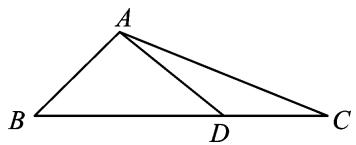

text_image

A
B
D
C

25. 答案 $\frac{2\sqrt{6}}{3}$ 解析 在 $\triangle ACD$ 中，因为 $AD = 2, AC = \sqrt{10}, DC = \sqrt{2}$ ，所以 $\cos \angle ADC = \frac{2 + 4 - 10}{2 \times 2 \times \sqrt{2}} = -\frac{\sqrt{2}}{2}$ ，从而 $\angle ADC = 135^{\circ}$ ，所以 $\angle ADB = 45^{\circ}$ 。在 $\triangle ADB$ 中， $\frac{AB}{\sin 45^{\circ}} = \frac{2}{\sin 60^{\circ}}$ ，所以 $AB = \frac{2 \times \frac{\sqrt{2}}{2}}{\frac{\sqrt{3}}{2}} = \frac{2\sqrt{6}}{3}$ .

26. 如图, 在 $\triangle ABC$ 中, $AB = \sqrt{2}$ , 点 $D$ 在边 $BC$ 上, $BD = 2DC$ , $\cos \angle DAC = \frac{3\sqrt{10}}{10}$ , $\cos \angle C = \frac{2\sqrt{5}}{5}$ , 则 $AC =$ \_\_\_\_.

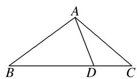

text_image

A
B D C

26. 答案 $\sqrt{5}$ 解析 因为 $BD = 2DC$ ，设 $CD = x$ ， $AD = y$ ，则 $BD = 2x$ ，因为 $\cos \angle DAC = \frac{3\sqrt{10}}{10}$ ， $\cos \angle C$

$= \frac{2\sqrt{5}}{5}$ ，所以 $\sin \angle DAC = \frac{\sqrt{10}}{10},\sin \angle C = \frac{\sqrt{5}}{5}$ ，在△ACD中，由正弦定理可得 $\frac{AD}{\sin\angle C} = \frac{CD}{\sin\angle DAC}$ 即 $\frac{y}{\frac{\sqrt{5}}{5}} =$ $\frac{x}{\frac{\sqrt{10}}{10}}$ ，即 $y = \sqrt{2} x.$ 又 $\cos \angle ADB = \cos (\angle DAC + \angle C) = \frac{3\sqrt{10}}{10}\times \frac{2\sqrt{5}}{5} -\frac{\sqrt{10}}{10}\times \frac{\sqrt{5}}{5} = \frac{\sqrt{2}}{2}$ 则 $\angle ADB = \frac{\pi}{4}.$ 在△ABD中， $AB^{2} = BD^{2} + AD^{2} - 2BD\times AD\cos \frac{\pi}{4}$ 即 $2 = 4x^{2} + 2x^{2} - 2\times 2x\times \sqrt{2} x\times \frac{\sqrt{2}}{2}$ 即 $x^{2} = 1$ ，所以 $x = 1$ ，即 $BD = 2$ $DC = 1$ ， $AD = \sqrt{2}$ ，在△ACD中， $AC^2 = CD^2 +AD^2 -2CD\times AD\cos \frac{3\pi}{4} = 5$ ，得 $AC = \sqrt{5}.$

27. 已知 $AB \perp BD$ , $AC \perp CD$ , $AC = 1$ , $AB = 2$ , $\angle BAC = 120^{\circ}$ , 则 $BD$ 的长等于 \_\_\_\_.

27. 答案 $\frac{4\sqrt{3}}{3}$ 解析 如图，连接 $BC, BC = \sqrt{2^2 + 1^2 - 2 \times 2 \times 1 \times \cos 120^\circ} = \sqrt{7}$ ，在 $\triangle ABC$ ，由正弦定理知， $\frac{2}{\sin \angle ACB} = \frac{\sqrt{7}}{\sin 120^\circ}, \therefore \sin \angle ACB = \frac{\sqrt{21}}{7}$ . 又 $\because \angle ACD = 90^\circ, \therefore \cos \angle BCD = \frac{\sqrt{21}}{7}, \sin \angle BCD = \frac{2\sqrt{7}}{7}$ ，由 $AB \perp BD, AC \perp CD, \angle BAC = 120^\circ$ ，得 $\angle BDC = 60^\circ$ . 由正弦定理，得 $BD = \frac{BC \cdot \sin \angle BCD}{\sin 60^\circ} = \frac{\sqrt{7} \times \frac{2\sqrt{7}}{7}}{\frac{\sqrt{3}}{2}} = \frac{4\sqrt{3}}{3}$ .

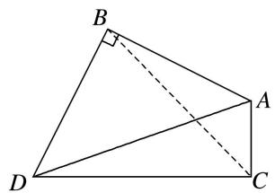

text_image

Geometric diagram of quadrilateral ABCD with right angle at B and diagonal AC, labeled with vertices A, B, C, D and a right angle marker.

28. 在四边形 $ABCD$ 中, $BC = a$ , $DC = 2a$ , 且 $A: \angle ABC: C: \angle ADC = 3:7:4:10$ , 则 $AB$ 的长为 \_\_\_\_.

28. 答案 $\frac{3\sqrt{2}}{2} a$ 解析 如图所示，连接 $BD$ . $\because A + \angle ABC + C + \angle ADC = 360^{\circ}$ , $\therefore A = 45^{\circ}$ , $\angle ABC = 105^{\circ}$ , $C = 60^{\circ}$ , $\angle ADC = 150^{\circ}$ ，在 $\triangle BCD$ 中，由余弦定理，得 $BD^{2} = BC^{2} + CD^{2} - 2BC \cdot CD \cos C = a^{2} + 4a^{2} - 2a \cdot 2a \cdot \cos 60^{\circ} = 3a^{2}$ , $\therefore BD = \sqrt{3} A$ . $\therefore BD^{2} + BC^{2} = CD^{2}$ , $\therefore \angle CBD = 90^{\circ}$ , $\therefore \angle ABD = 15^{\circ}$ , $\therefore \angle BDA = 120^{\circ}$ . 在 $\triangle ABD$ 中，由 $\frac{AB}{\sin \angle BDA} = \frac{BD}{\sin A}$ ，得 $AB = \frac{BD \cdot \sin \angle BDA}{\sin A} = \frac{\sqrt{3} a \sin 120^{\circ}}{\sin 45^{\circ}} = \frac{3\sqrt{2}}{2} a$ .

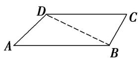

29. 在 $\triangle ABC$ 中， $a, b, c$ 分别是内角 $A, B, C$ 的对边，且 $B$ 为锐角，若 $\frac{\sin A}{\sin B}=\frac{5c}{2b}$ ， $\sin B=\frac{\sqrt{7}}{4}$ ， $S_{\triangle ABC}=\frac{5\sqrt{7}}{4}$ ，则 $b$ 的值为\_\_\_\_。

29. 答案 $\sqrt{14}$ 解析 由 $\frac{\sin A}{\sin B} = \frac{5c}{2b} \Rightarrow \frac{a}{b} = \frac{5c}{2b} \Rightarrow a = \frac{5}{2}c$ ，①，由 $S_{\triangle ABC} = \frac{1}{2}ac\sin B = \frac{5\sqrt{7}}{4}$ 且 $\sin B = \frac{\sqrt{7}}{4}$ 得 $\frac{1}{2}ac = 5$ ，②，联立①，②得 $a = 5$ ，且 $c = 2$ 。由 $\sin B = \frac{\sqrt{7}}{4}$ 且 $B$ 为锐角知 $\cos B = \frac{3}{4}$ ，由余弦定理知 $b^2 = 25 + 4 - 2 \times 5 \times 2 \times \frac{3}{4} = 14$ ， $b = \sqrt{14}$ 。

30. 在 $\triangle ABC$ 中，内角 $A, B, C$ 所对的边分别为 $a, b, c$ . 已知 $A = \frac{\pi}{4}, b = \sqrt{6}$ , $\triangle ABC$ 的面积为 $\frac{3 + \sqrt{3}}{2}$ , 则 $c = \_\_\_\_$ , $B = \_\_\_\_$ .

30. 答案： $1+\sqrt{3}\quad\frac{\pi}{3}$ 解析 由 $S_{\triangle ABC}=\frac{1}{2}bc\sin A=\frac{1}{2}\times\sqrt{6}\times c\times\frac{\sqrt{2}}{2}=\frac{3+\sqrt{3}}{2}$ ，得 $c=1+\sqrt{3}$ 。在 $\triangle ABC$ 中，由余弦定理得 $a^{2}=b^{2}+c^{2}-2bc\cos A=6+(4+2\sqrt{3})-2\sqrt{6}\times(\sqrt{3}+1)\times\frac{\sqrt{2}}{2}=4$ ，则 a=2。由正弦定理 $\frac{a}{\sin A}=\frac{b}{\sin B}$ ，可得 $\sin B=\frac{\sqrt{3}}{2}$ ，因为 b<c，所以 B 为锐角，所以 $B=\frac{\pi}{3}$ 。

31. 在 $\triangle ABC$ 中，内角 $A, B, C$ 的对边分别为 $a, b, c$ ，已知 $B=30^{\circ}$ ， $\triangle ABC$ 的面积为 $\frac{3}{2}$ ，且 $\sin A+\sin C=2\sin B$ ，则 $b$ 的值为\_\_\_\_。

31. 答案 $1 + \sqrt{3}$ 解析 由已知可得 $\frac{1}{2} ac\sin 30^{\circ} = \frac{3}{2}$ ，解得 $ac = 6$ 。因为 $\sin A + \sin C = 2\sin B$ ，所以由正弦定理可得 $a + c = 2b$ 。由余弦定理知 $b^{2} = a^{2} + c^{2} - 2ac\cos B = (a + c)^{2} - 2ac - \sqrt{3}ac = 4b^{2} - 12 - 6\sqrt{3}$ ，解得 $b^{2} = 4 + 2\sqrt{3}$ ， $\therefore b = 1 + \sqrt{3}$ 或 $b = -1 - \sqrt{3}$ (舍去).

32. 在 $\triangle ABC$ 中， $B=30^{\circ}$ ， $AC=2\sqrt{5}$ ， $D$ 是 $AB$ 边上的一点， $CD=2$ ，若 $\angle ACD$ 为锐角， $\triangle ACD$ 的面积为4，则 $BC=$ \_\_\_\_.

32. 答案 4 解析 依题意得 $S_{\triangle ACD} = \frac{1}{2} CD \cdot AC \cdot \sin \angle ACD = 2\sqrt{5} \cdot \sin \angle ACD = 4, \sin \angle ACD = \frac{2\sqrt{5}}{5}$ . 又 $\angle ACD$ 是锐角，因此 $\cos \angle ACD = \sqrt{1 - \sin^2 \angle ACD} = \frac{\sqrt{5}}{5}$ . 在 $\triangle ACD$ 中， $AD = \sqrt{CD^2 + AC^2 - 2CD \cdot AC \cdot \cos \angle ACD} = 4, \frac{AD}{\sin \angle ACD} = \frac{CD}{\sin A}$ ，则 $\sin A = \frac{CD \cdot \sin \angle ACD}{AD} = \frac{\sqrt{5}}{5}$ . 在 $\triangle ABC$ 中， $\frac{AC}{\sin B} = \frac{BC}{\sin A}$ ，则 $BC = \frac{AC \cdot \sin A}{\sin B} = 4$ .

33. 已知 $\triangle ABC$ 中, $AC = \sqrt{2}$ , $BC = \sqrt{6}$ , $\triangle ABC$ 的面积为 $\frac{\sqrt{3}}{2}$ . 若线段 $BA$ 的延长线上存在点 $D$ , 使 $\angle BDC = \frac{\pi}{4}$ , 则 $CD =$ \_\_\_\_.

33. 答案 $\sqrt{3}$ 解析 因为 $S_{\triangle ABC} = \frac{1}{2} AC \cdot BC \cdot \sin \angle BCA$ ，即 $\frac{\sqrt{3}}{2} = \frac{1}{2} \times \sqrt{2} \times \sqrt{6} \times \sin \angle BCA$ ，所以 $\sin \angle BCA = \frac{1}{2}$ 。因为 $\angle BAC > \angle BDC = \frac{\pi}{4}$ ，所以 $\angle BCA = \frac{\pi}{6}$ ，所以 $\cos \angle BCA = \frac{\sqrt{3}}{2}$ 。在 $\triangle ABC$ 中， $AB^2 = AC^2 + BC^2 - 2AC \cdot BC \cdot \cos \angle BCA = 2 + 6 - 2 \times \sqrt{2} \times \sqrt{6} \times \frac{\sqrt{3}}{2} = 2$ ，所以 $AB = \sqrt{2}$ ，所以 $\angle ABC = \frac{\pi}{6}$ ，在 $\triangle BCD$ 中， $\frac{BC}{\sin \angle BDC} = \frac{CD}{\sin \angle DBC}$ ，即 $\frac{\sqrt{6}}{\frac{\sqrt{2}}{2}} = \frac{CD}{\frac{1}{2}}$ ，解得 $CD = \sqrt{3}$ 。

34. 在 $\triangle ABC$ 中, $A = 60^{\circ}$ , $BC = \sqrt{10}$ , $D$ 是 $AB$ 边上不同于 $A$ , $B$ 的任意一点, $CD = \sqrt{2}$ , $\triangle BCD$ 的面积为 1, 则 $AC$ 的长为( )

A. $2 \sqrt{3}$

B. $\sqrt{3}$

C. $\frac{\sqrt{3}}{3}$

D. $\frac{2\sqrt{3}}{3}$

34. 答案 D 解析 由 $S_{\triangle BCD} = 1$ ，可得 $\frac{1}{2} \times CD \times BC \times \sin \angle DCB = 1$ ，即 $\sin \angle DCB = \frac{\sqrt{5}}{5}$ ，所以 $\cos \angle DCB =$

$\frac{2\sqrt{5}}{5}$ 或 $\cos \angle DCB = -\frac{2\sqrt{5}}{5}$ ，又 $\angle DCB < \angle ACB = 180^{\circ} - A - B = 120^{\circ} - B < 120^{\circ}$ ，所以 $\cos \angle DCB > = -\frac{1}{2}$ ，所以 $\cos \angle DCB = \frac{2\sqrt{5}}{5}$ 。在 $\triangle BCD$ 中， $\cos \angle DCB = \frac{CD^2 + BC^2 - BD^2}{2CD \cdot BC} = \frac{2\sqrt{5}}{5}$ ，解得 $BD = 2$ ，所以 $\cos \angle DBC = \frac{BD^2 + BC^2 - CD^2}{2BD \cdot BC} = \frac{3\sqrt{10}}{10}$ ，所以 $\sin \angle DBC = \frac{\sqrt{10}}{10}$ 。在 $\triangle ABC$ 中，由正弦定理可得 $AC = \frac{BC\sin B}{\sin A} = \frac{2\sqrt{3}}{3}$ ，故选D.

