专题一　三角形中基本量的计算问题

1．正、余弦定理
在△*ABC*中，若角*A*，*B*，*C*所对的边分别是*a*，*b*，*c*，*R*为△*ABC*外接圆半径，则

<table><tr><td>
定理
</td><td>
正弦定理
</td><td>
余弦定理
</td></tr><tr><td>
内容
</td><td>
＝＝＝2<em>R</em>
</td><td>
<em>a</em>2＝<em>b</em>2＋<em>c</em>2－2<em>bc</em>cos<em>A</em>；

<em>b</em>2＝<em>c</em>2＋<em>a</em>2－2<em>ca</em>cos<em>B</em>；

<em>c</em>2＝<em>a</em>2＋<em>b</em>2－2<em>ab</em>cos<em>C</em>．
</td></tr><tr><td>
变形
</td><td>
（1）<em> a</em>＝，<em>b</em>＝，<em>c</em>＝；

（2） sin <em>A</em>＝，sin <em>B</em>＝，sin <em>C</em>＝；

（3）<em>a</em>＝2<em>R</em>sin<em>A</em>，<em>b</em>＝2<em>R</em>sin<em>B</em>，<em>c</em>＝2<em>R</em>sin<em>C</em>；

（4）sin<em>A</em>＝，sin<em>B</em>＝，sin<em>C</em>＝；

（5）<em>a</em>∶<em>b</em>∶<em>c</em>＝sin<em>A</em>∶sin<em>B</em>∶sin<em>C</em>；

（6）＝2<em>R</em>．
</td><td>
cos<em>A</em>＝；

cos<em>B</em>＝；

cos<em>C</em>＝．
</td></tr></table>

2．三角形面积公式

<em>S</em>△<em>ABC</em>＝<em>ab</em>sin<em>C</em>＝<em>bc</em>sin<em>A</em>＝<em>ac</em>sin<em>B</em>＝＝(<em>a</em>＋<em>b</em>＋<em>c</em>)·<em>r</em>(<em>r</em>，<em>R</em>为别是△<em>ABC</em>内切圆半径和外接圆半径)，并可由此计算<em>R</em>、<em>r</em>．

3．解三角形有关的二级结论  
（1）三角形内角和定理
在△*ABC*中，*A*＋*B*＋*C*＝π；变形：＝－．  
（2）三角形中的三角函数关系

①sin(*A*＋*B*)＝sin*C*；②cos(*A*＋*B*)＝－cos*C*；③tan(*A*＋*B*)＝－tan*C*(*C*≠)；④sin＝cos；⑤cos＝sin．⑥在非Rt△*ABC*中，tan*A*＋tan*B*＋tan*C*＝tan*A*·tan*B*·tan*C*(*A*，*B*，*C*≠)．  
（3）三角形中的不等关系

①在三角形中大边对大角，大角对大边．

②*A*>*B*⇔*a*>*b*⇔sin*A*>sin*B*⇔cos*A*<cos*B．*

③若△<em>ABC</em>为锐角三角形，则<em>A</em>＋<em>B</em>&gt;，sin<em>A</em>&gt;cos<em>B</em>，cos<em>A</em>&lt;sin<em>B</em>，<em>a</em>2＋<em>b</em>2&gt;<em>c</em>2．若△<em>ABC</em>为钝角三角形(假如<em>C</em>为钝角)，则<em>A</em>＋<em>B</em>&lt;，sin<em>A</em>&lt;cos<em>B</em>，cos<em>A</em>&gt;sin<em>B</em>．

④<em>c</em>2＝<em>a</em>2＋<em>b</em>2⇔<em>C</em>为直角；<em>c</em>2&gt;<em>a</em>2＋<em>b</em>2⇔<em>C</em>为钝角；<em>c</em>2&lt;<em>a</em>2＋<em>b</em>2⇔<em>C</em>为锐角．

⑤*a*＋*b*＞*c*，*b*＋*c*＞*a*，*c*＋*a*＞*b*．

⑥若*x*∈，则sin *x*＜*x*＜tan *x*．若*x*∈，则1＜sin *x*＋cos *x*≤．  
（4）三角形中的射影定理
在△*ABC*中，*a*＝*b*cos*C*＋*c*cos*B*；*b*＝*a*cos*C*＋*c*cos*A*；*c*＝*b*cos*A*＋*a*cos*B*．
在处理三角形中的边角关系时，一般全部化为角的关系，或全部化为边的关系．若出现边的一次式一般采用到正弦定理，出现边的二次式一般采用到余弦定理．若已知条件同时含有边和角，但不能直接使用正弦定理或余弦定理得到答案，要选择“边化角”或“角化边”，变换原则如下：

①若式子中含有正弦的齐次式，优先考虑正弦定理“角化边”，然后进行代数式变形；
②若式子中含有*a*，*b*，*c*的齐次式，优先考虑正弦定理“边化角”，然后进行三角恒等变换；
③若式子中含有余弦的齐次式，优先考虑余弦定理“角化边”，然后进行代数式变形；
④含有面积公式的问题，要考虑结合余弦定理求解；
⑤同时出现两个自由角（或三个自由角）时，要用到三角形的内角和定理．

考点一　计算三角形中的角或角的三角函数值

【方法总结】

计算三角形中的角或角的三角函数值的解题技巧

此类问题主要考查正弦定理、余弦定理及三角形面积公式，最简单的问题是只用正弦定理或余弦定理即可解决．中等难度的问题要结合三角恒等变换再用正弦定理或余弦定理即可解决．难度较大的问题要结合三角恒等变换并同时用正弦定理、余弦定理和面积公式才能解决．

【例题选讲】

<strong>[例1]</strong>（1） (2013·湖南)在锐角△<em>ABC</em>中，角<em>A</em>，<em>B</em>所对的边长分别为<em>a</em>，<em>b</em>，若2<em>a</em>sin<em>B</em>＝<em>b</em>，则角<em>A</em>等于(　　)

A．　　　　　　　　　
B．　　　　　　　　　
C．　　　　　　　　　
D．
答案　D　解析　在△*ABC*中，利用正弦定理得，2sin*A*sin*B*＝sin*B*，∴sin*A*＝．又*A*为锐角，∴*A*＝．  
（2）(2017·全国Ⅲ)△*ABC*的内角*A*，*B*，*C*的对边分别为*a*，*b*，*c*．已知*C*＝60°，*b*＝，*c*＝3，则*A*＝\_\_\_\_\_\_\_\_．
答案　（1）75°　解析　由正弦定理，得sin*B*＝＝＝，结合*b*<*c*得*B*＝45°，则*A*＝180°－*B*－*C*＝75°．  
（3）在△*ABC*中，角*A*，*B*，*C*所对的边分别是*a*，*b*，*c*．已知8*b*＝5*c*，*C*＝2*B*，则cos*C*等于(　　)

A．　　　　　　　　
B．－　　　　　　　　
C．±　　　　　　　　
D．
答案　A　解析　∵8<em>b</em>＝5<em>c</em>，∴由正弦定理，得8sin <em>B</em>＝5sin <em>C</em>．又∵<em>C</em>＝2<em>B</em>，∴8sin <em>B</em>＝5sin 2<em>B</em>，∴8sin<em>B</em>＝10sin <em>B</em>cos <em>B</em>．∵sin <em>B</em>≠0，∴cos <em>B</em>＝，∴cos <em>C</em>＝cos 2<em>B</em>＝2cos2<em>B</em>－1＝．  
（4） (2017·全国Ⅰ)△*ABC*的内角*A*，*B*，*C*的对边分别为*a*，*b*，*c*．已知sin*B*＋sin*A*(sin*C*－cos*C*)＝0，*a*＝2，*c*＝，则*C*＝(　　)

A．　　　　　　　　
B．　　　　　　　　
C．　　　　　　　　
D．
答案　B　解析　由题意得sin(*A*＋*C*)＋sin*A*(sin*C*－cos*C*)＝0，∴sin*A*cos*C*＋cos*A*sin*C*＋sin*A*sin*C*－sin*A*cos*C*＝0，则sin*C*(sin*A*＋cos*A*)＝sin*C*sin＝0，因为*C*∈(0，π)，所以sin*C*≠0，所以sin＝0，又因为*A*∈(0，π)，所以*A*＋＝π，所以*A*＝．由正弦定理＝，得＝，则sin*C*＝，又*C*∈(0，π)，得*C*＝．  
（5） (2018·全国Ⅲ)△*ABC*的内角*A*，*B*，*C*的对边分别为*a*，*b*，*c*，若△*ABC*的面积为，则*C*＝(　　)

A．　　　　　　　　
B．　　　　　　　　
C．　　　　　　　　
D．
答案　C　解析　因为<em>a</em>2＋<em>b</em>2－<em>c</em>2＝2<em>ab</em>cos <em>C</em>，且<em>S</em>△<em>ABC</em>＝，所以<em>S</em>△<em>ABC</em>＝＝<em>ab</em>sin <em>C</em>，所以tan <em>C</em>＝1．又<em>C</em>∈(0，π)，故<em>C</em>＝．  
（6） (2016·山东)△<em>ABC</em>中，角<em>A</em>，<em>B</em>，<em>C</em>的对边分别是<em>a</em>，<em>b</em>，<em>c</em>，已知<em>b</em>＝<em>c</em>，<em>a</em>2＝2<em>b</em>2(1－sin <em>A</em>)，则<em>A</em>等于(　　)

A．　　　　　　　　
B．　　　　　　　　
C．　　　　　　　　
D．
答案　C　解析　在△<em>ABC</em>中，由余弦定理得<em>a</em>2＝<em>b</em>2＋<em>c</em>2－2<em>bc</em>cos<em>A</em>，∵<em>b</em>＝<em>c</em>，∴<em>a</em>2＝2<em>b</em>2(1－cos<em>A</em>)，又∵<em>a</em>2＝2<em>b</em>2(1－sin<em>A</em>)，∴cos<em>A</em>＝sin<em>A</em>，∴tan<em>A</em>＝1，∵<em>A</em>∈(0，π)，∴<em>A</em>＝，故选C．  
（7）*E*，*F*是等腰直角三角形*ABC*斜边*AB*上的三等分点，则tan∠*ECF*＝\_\_\_\_\_\_\_\_．
答案　　解析　如图，设*AB*＝6，则*AE*＝*EF*＝*FB*＝2．因为△*ABC*为等腰直角三角形，所以*AC*＝*BC*＝3．在△*ACE*中，*A*＝45°，*AE*＝2，*AC*＝3，由余弦定理可得*CE*＝．同理，在△*BCF*中可得*CF*＝．在△*CEF*中，由余弦定理得cos∠*ECF*＝＝，所以tan∠*ECF*＝．

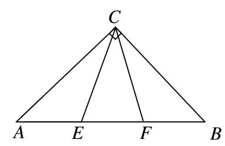  
（8）(2014·天津)在△*ABC*中，内角*A*，*B*，*C*所对的边分别是*a*，*b*，*c*.已知*b*－*c*＝*a*，2sin*B*＝3sin*C*，则cos*A*的值为\_\_\_\_\_\_\_\_．
答案　－　解析　由2sin*B*＝3sin*C*及正弦定理得2*b*＝3*c*，即*b*＝*c*．又*b*－*c*＝*a*，∴*c*＝*a*，即*a*＝2*c*．由余弦定理得cos*A*＝＝＝＝－．  
（9）在△*ABC*中，角*A*，*B*，*C*所对的边长分别为*a*，*b*，*c*，sin*A*，sin*B*，sin*C*成等比数列，且*c*＝2*a*，则cos *B*的值为(　　)

A．　　　　　　　　
B．　　　　　　　　
C．　　　　　　　　
D．
答案　B　解析　因为sin<em>A</em>，sin<em>B</em>，sin<em>C</em>成等比数列，所以sin2<em>B</em>＝sin<em>A</em>sin<em>C</em>，由正弦定理得<em>b</em>2＝<em>ac</em>，又<em>c</em>＝2<em>a</em>，故cos <em>B</em>＝＝＝．  
（10）在锐角三角形*ABC*中，角*A*，*B*，*C*的对边分别为*a*，*b*，*c*．若＋＝6cos*C*，则＋的值是\_\_\_\_\_\_\_\_．
答案　4　解析　由＋＝6cos<em>C</em>及余弦定理，得＋＝6×，化简得<em>a</em>2＋<em>b</em>2＝<em>c</em>2．又＋＝6cos<em>C</em>及正弦定理，得＋＝6cos<em>C</em>，故sin<em>A</em>sin<em>B</em>cos<em>C</em>＝(sin2<em>B</em>＋sin2<em>A</em>)．又＋＝＝，所以＋＝＝＝4．

【对点训练】

1．在△*ABC*中，角*A*，*B*，*C*所对的边分别为*a*，*b*，*c*，若＝，则cos*B*等于(　　)

A．－　　　　　　　　
B．　　　　　　　　
C．－　　　　　　　　
D．

1．答案　B　解析　由正弦定理知＝＝1，即tan*B*＝，由*B*∈(0，π)，所以*B*＝，所以cos

*B*＝cos＝，故选B．

2．在△*ABC*中，已知(*b*＋*c*)∶(*a*＋*c*)∶(*a*＋*b*)＝4∶5∶6，则sin *A*∶sin *B*∶sin *C*等于\_\_\_\_\_\_\_\_．

2．答案　7∶5∶3　解析　∵(*b*＋*c*)∶(*c*＋*a*)∶(*a*＋*b*)＝4∶5∶6，∴＝＝．令＝＝

＝*k*(*k*>0)，则，解得∴sin *A*∶sin *B*∶sin *C*＝*a*∶*b*∶*c*＝7∶5∶3．

3．在△*ABC*中，角*A*，*B*，*C*的对边分别是*a*，*b*，*c*，若*a*＝*b*，*A*＝2*B*，则cos*B*＝(　　)

A．　　　　　　　　
B．　　　　　　　　
C．　　　　　　　　
D．

3．答案　B　解析　由正弦定理，得sin*A*＝sin*B*，又*A*＝2*B*，所以sin*A*＝sin2*B*＝2sin*B*cos*B*，所以

cos*B*＝．

4．已知*a*，*b*，*c*为△*ABC*的三个内角*A*，*B*，*C*所对的边，若3*b*cos*C*＝*c*(1－3cos*B*)，则sin*C*∶sin*A*＝(　　)

A．2∶3　　　　　　　　
B．4∶3　　　　　　　　
C．3∶1　　　　　　　　
D．3∶2

4．答案　C　解析　由正弦定理得3sin *B*cos *C*＝sin *C*－3sin *C*cos *B*，3sin(*B*＋*C*)＝sin *C*，因为*A*＋*B*＋*C*

＝π，所以*B*＋*C*＝π－*A*，所以3sin *A*＝sin *C*，所以sin *C*∶sin *A*＝3∶1，故选C．

5．(2013·辽宁)在△*ABC*中，内角*A*，*B*，*C*的对边分别为*a*，*b*，*c．* 若*a*sin*B*cos*C*＋*c*sin*B*cos*A*＝*b*，且*a*＞*b*，则*B*等于(　　)

A．　　　　　　　　
B．　　　　　　　　
C．　　　　　　　　
D．

5．答案　A　解析　由条件得sin*B*cos*C*＋sin*B*cos*A*＝，由正弦定理，得sin*A*cos*C*＋sin*C*cos*A*＝，∴sin(*A*

＋*C*)＝，从而sin *B*＝，又*a*＞*b*，且*B*∈(0，π)，因此*B*＝．

另解　由射影定理可知*a*cos *C*＋*c*cos *A*＝*b*，则(*a*cos *C*＋*c*cos *A*)sin *B*＝*b*sin *B*，又*a*sin *B*cos *C*＋*c*sin *B*cos *A*＝*b*，则有*b*sin *B*＝*b*，sin *B*＝．又*a*>*b*，所以*A*>*B*，则*B*∈，故*B*＝．

6．如图，在△*ABC*中，∠*C*＝，*BC*＝4，点*D*在边*AC*上，*AD*＝*DB*，*DE*⊥*AB*，*E*为垂足．若*DE*＝2，
则cos*A*等于(　　)

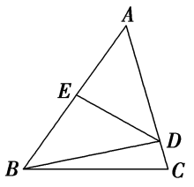

A．　　　　　　　　
B．　　　　　　　　
C．　　　　　　　　
D．

6．答案　C　解析　依题意得，*BD*＝*AD*＝＝，∠*BDC*＝∠*ABD*＋∠*A*＝2∠*A*．在△*BCD*中，

＝，＝×＝，即＝，由此解得cos *A*＝．

7．在△*ABC*中，sin *A*∶sin *B*∶sin *C*＝3∶2∶3，则cos*C*的值为\_\_\_\_\_\_\_\_．

7．答案　　解析　由sin *A*∶sin *B*∶sin *C*＝3∶2∶3，可得*a*∶*b*∶*c*＝3∶2∶3．不妨设*a*＝3*k*，*b*＝2*k*，*c*

＝3*k*(*k*＞0)，则cos *C*＝＝．

8．在△*ABC*中，若*b*＝1，*c*＝，*A*＝，则cos5*B*＝(　　)

A．－　　　　　　　　
B．　　　　　　　　
C．或－1　　　　　　　　
D．－或0

8．答案　A　解析　由<em>b</em>＝1，<em>c</em>＝，<em>A</em>＝，结合余弦定理得<em>a</em>2＝<em>b</em>2＋<em>c</em>2－2<em>bc</em>cos <em>A</em>，即<em>a</em>2＝1＋3－2×1×

×＝1，得*a*＝1．由此*a*＝*b*，则*B*＝*A*＝，因此cos 5*B*＝cos ＝－，故选A．

9．已知在△<em>ABC</em>中，内角<em>A</em>，<em>B</em>，<em>C</em>的对边分别为<em>a</em>，<em>b</em>，<em>c</em>，若2<em>b</em>2－2<em>a</em>2＝<em>ac</em>＋2<em>c</em>2，则sin<em>B</em>等于\_\_\_\_\_\_\_\_．

9．答案　　解析　由2<em>b</em>2－2<em>a</em>2＝<em>ac</em>＋2<em>c</em>2，得2(<em>a</em>2＋<em>c</em>2－<em>b</em>2)＋<em>ac</em>＝0．由余弦定理，得<em>a</em>2＋<em>c</em>2－<em>b</em>2＝2<em>ac</em>cos

*B*，∴4*ac*cos*B*＋*ac*＝0．∵*ac*≠0，∴4cos*B*＋1＝0，cos*B*＝－，又*B*∈(0，π)，∴sin*B*＝＝．

10．在△<em>ABC</em>中，角<em>A</em>，<em>B</em>，<em>C</em>所对的边分别为<em>a</em>，<em>b</em>，<em>c</em>，若(<em>a</em>2＋<em>c</em>2－<em>b</em>2)tan<em>B</em>＝<em>ac</em>，则角<em>B</em>的大小为(　　)

A．　　　　　　　　
B．　　　　　　　　
C．或　　　　　　　　
D．或

10．答案　D　解析　由余弦定理<em>a</em>2＋<em>c</em>2－<em>b</em>2＝2<em>ac</em>cos<em>B</em>，得2<em>ac</em>sin<em>B</em>＝<em>ac</em>，因为<em>ac</em>≠0，所以sin<em>B</em>＝，
所以*B*＝或．

11．如图，在△*ABC*中，*AB*＝3，*AC*＝2，*BC*＝4，点*D*在边*BC*上，∠*BAD*＝45°，则tan∠*CAD*的值为\_\_\_\_\_\_\_\_．

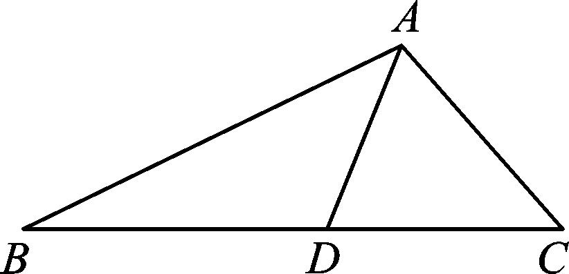

11．答案　　解析　从构造角的角度观察分析，可以从差的角度(∠*CAD*＝∠*A*－45°)，也可以从和

的角度(∠*A*＝∠*CAD*＋45°)，所以只需从余弦定理入手求出∠*A*的正切值，问题就迎刃而解了．
解法1　在△*ABC*中，*AB*＝3，*AC*＝2，*BC*＝4，由余弦定理可得cos*A*＝＝－，所以tan*A*＝－，于是tan∠*CAD*＝tan(*A*－45°)＝＝．
解法2　由解法1得tan*A*＝－．由tan(45°＋∠*CAD*)＝－得＝－，即＝－，解得tan∠*CAD*＝．

12．(2020·全国Ⅲ)在△*ABC*中，cos*C*＝，*AC*＝4，*BC*＝3，则cos*B*等于(　　)

A．　　　　　　　　
B．　　　　　　　　
C．　　　　　　　　
D．

12．答案　A　解析　由余弦定理得<em>AB</em>2＝<em>AC</em>2＋<em>BC</em>2－2<em>AC</em>·<em>BC</em>cos <em>C</em>＝42＋32－2×4×3×＝9，所以<em>AB</em>＝

3，所以cos *B*＝＝＝．

13．已知△*ABC*中，角*A*，*B*，*C*的对边分别为*a*，*b*，*c*，*C*＝120°，*a*＝2*b*，则tan*A*＝\_\_\_\_\_\_\_\_．

13．答案　　解析　<em>c</em>2＝<em>a</em>2＋<em>b</em>2－2<em>ab</em>cos <em>C</em>＝4<em>b</em>2＋<em>b</em>2－2×2<em>b</em>×<em>b</em>×＝7<em>b</em>2，∴<em>c</em>＝<em>b</em>，cos <em>A</em>＝

＝＝，∴sin *A*＝＝＝，∴tan *A* ＝＝．

14．在△*ABC*中，*B*＝60°，最大边与最小边之比为(＋1)∶2，则最大角为\_\_\_\_\_\_\_\_．

14．答案　75°　解析　由题意可知*c*<*b*<*a*，或*a*<*b*<*c*，不妨设*c*＝2*x*，则*a*＝(＋1)*x*，∴cos*B*＝，
即＝，∴<em>b</em>2＝6<em>x</em>2，∴cos<em>C</em>＝＝＝，∴<em>C</em>＝45°，∴<em>A</em>＝180°－60°－45°＝75°．

15．(2020·全国Ⅰ)如图，在三棱锥*P*－*ABC*的平面展开图中，*AC*＝1，*AB*＝*AD*＝，*AB*⊥*AC*，*AB*⊥*AD*，

∠*CAE*＝30°，则cos∠*FCB*＝\_\_\_\_\_\_\_\_．

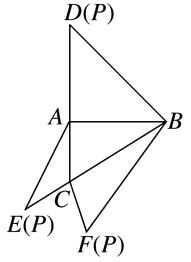

15．答案　－　解析　在△*ABD*中，∵*AB*⊥*AD*，*AB*＝*AD*＝，∴*BD*＝，∴*FB*＝*BD*＝．在△*ACE*

中，∵*AE*＝*AD*＝，*AC*＝1，∠*CAE*＝30°，∴*EC*＝＝1，∴*CF*＝*CE*＝1．又∵*BC*＝＝＝2，∴在△*FCB*中，由余弦定理得cos∠*FCB*＝＝＝－．

16．在△<em>ABC</em>中，内角<em>A</em>，<em>B</em>，<em>C</em>的对边分别为<em>a</em>，<em>b</em>，<em>c</em>，若△<em>ABC</em>的面积为<em>S</em>，且2<em>S</em>＝(<em>a</em>＋<em>b</em>)2－<em>c</em>2，则tan

*C*＝(　　)

A．　　　　　　　　
B．　　　　　　　　
C．－　　　　　　　　
D．－

16．答案　C　解析　因为2<em>S</em>＝(<em>a</em>＋<em>b</em>)2－<em>c</em>2＝<em>a</em>2＋<em>b</em>2－<em>c</em>2＋2<em>ab</em>，结合面积公式与余弦定理，得<em>ab</em>sin <em>C</em>＝

2<em>ab</em>cos<em>C</em>＋2<em>ab</em>，即sin <em>C</em>－2cos <em>C</em>＝2，所以(sin <em>C</em>－2cos <em>C</em>)2＝4，即＝4，所以＝4，解得tan <em>C</em>＝－或tan <em>C</em>＝0(舍去)，故选C．

17．在△*ABC*中，内角*A*，*B*，*C*的对边分别为*a*，*b*，*c*，若*b*＝2，△*ABC*面积的最大值为，则角*B*的

值为(　　)

A．　　　　　　　　
B．　　　　　　　　
C．　　　　　　　　
D．

17．答案　B　解析　由余弦定理得4＝<em>a</em>2＋<em>c</em>2－2<em>ac</em>cos <em>B</em>≥2<em>ac</em>－2<em>ac</em>cos <em>B</em>＝2<em>ac</em>(1－cos <em>B</em>)，当且仅当<em>a</em>＝<em>c</em>

时取等号，所以<em>ac</em>≤，<em>S</em>△<em>ABC</em>＝<em>ac</em>sin <em>B</em>≤×＝，即＝，所以<em>B</em>为．

18．在△<em>ABC</em>中，角<em>A</em>，<em>B</em>，<em>C</em>的对边分别为<em>a</em>，<em>b</em>，<em>c</em>，若<em>a</em>2＝3<em>b</em>2＋3<em>c</em>2－2<em>bc</em>sin<em>A</em>，则<em>C</em>＝\_\_\_\_\_\_\_\_．

18．答案　　解析　由余弦定理，得<em>a</em>2＝<em>b</em>2＋<em>c</em>2－2<em>bc</em>cos<em>A</em>，所以<em>b</em>2＋<em>c</em>2－2<em>bc</em>cos<em>A</em>＝3<em>b</em>2＋3<em>c</em>2－2<em>bc</em>sin<em>A</em>，

sin*A*－cos*A*＝，*b*，*c*>0，2sin＝＝＋≥2，当且仅当*b*＝*c*时，等号成立，因此*b*＝*c*，*A*－＝，所以*A*＝，所以*C*＝＝．

19．△*ABC*的内角*A*，*B*，*C*的对边分别为*a*，*b*，*c*，*a*sin*A*＋*c*sin*C*－*a*sin*C*＝*b*sin*B*，则角*B*＝\_\_\_\_\_\_\_\_．

19．答案　45°　解析　由正弦定理，得<em>a</em>2＋<em>c</em>2－<em>ac</em>＝<em>b</em>2，由余弦定理，得<em>b</em>2＝<em>a</em>2＋<em>c</em>2－2<em>ac</em>cos<em>B</em>，故cos<em>B</em>

＝．又因为*B*为三角形的内角，所以*B*＝45°．

20．在△*ABC*中，内角*A*，*B*，*C*所对的边分别为*a*，*b*，*c*，且2*a*sin *A*＝(2sin *B*＋sin *C*)*b*＋(2*c*＋*b*)sin *C*，则

*A*＝(　　)

A．60°　　　　　　　　
B．120°　　　　　　　　
C．30°　　　　　　　　
D．150°

20．答案　B　解析　由已知，根据正弦定理得2<em>a</em>2＝(2<em>b</em>＋<em>c</em>)<em>b</em>＋(2<em>c</em>＋<em>b</em>)<em>c</em>，即<em>a</em>2＝<em>b</em>2＋<em>c</em>2＋<em>bc</em>．由余弦定理

<em>a</em>2＝<em>b</em>2＋<em>c</em>2－2<em>bc</em>cos <em>A</em>，得cos <em>A</em>＝－，又<em>A</em>为三角形的内角，故<em>A</em>＝120°．

21．已知△*ABC*的内角*A*，*B*，*C*的对边分别为*a*，*b*，*c*，若(*a*＋*b*)(sin *A*－sin *B*)＝(*c*－*b*)sin *C*，则*A*＝(　　)

A．　　　　　　　　
B．　　　　　　　　
C．　　　　　　　　
D．

21．答案　B　解析　∵(<em>a</em>＋<em>b</em>)(sin <em>A</em>－sin <em>B</em>)＝(<em>c</em>－<em>b</em>)sin <em>C</em>，∴由正弦定理得(<em>a</em>＋<em>b</em>)(<em>a</em>－<em>b</em>)＝<em>c</em>(<em>c</em>－<em>b</em>)，即<em>b</em>2

＋<em>c</em>2－<em>a</em>2＝<em>bc</em>．所以cos<em>A</em>＝＝，又<em>A</em>∈(0，π)，所以<em>A</em>＝．

22．△*ABC*的内角*A*，*B*，*C*所对的边分别为*a*，*b*，*c*，若＝，则角*B*＝\_\_\_\_\_\_\_．

22．答案　　解析　由＝及正弦定理知＝，整理得<em>b</em>2－<em>a</em>2＝<em>ac</em>＋<em>c</em>2，即

<em>b</em>2＝<em>a</em>2＋<em>c</em>2＋<em>ac</em>，根据余弦定理可知cos <em>B</em>＝－，又<em>B</em>∈(0，π)，所以<em>B</em>＝．

23．在△*ABC*中，*a*，*b*，*c*分别是内角*A*，*B*，*C*的对边，且＝，则*A*＝\_\_\_\_\_\_\_\_．

23．答案　　解析　由正弦定理＝＝，得＝，整理得<em>b</em>2－<em>a</em>2＝2<em>ac</em>sin <em>B</em>－<em>c</em>2，
即<em>b</em>2＋<em>c</em>2－<em>a</em>2＝2<em>ac</em>sin <em>B</em>＝2<em>bc</em>sin <em>A</em>，由余弦定理得，<em>b</em>2＋<em>c</em>2－<em>a</em>2＝2<em>bc</em>cos <em>A</em>，∴2<em>bc</em>cos <em>A</em>＝2<em>bc</em>sin <em>A</em>，即cos <em>A</em>＝sin <em>A</em>，∴tan <em>A</em>＝1，∴<em>A</em>＝．

24．在△<em>ABC</em>中，内角<em>A</em>，<em>B</em>，<em>C</em>所对的边分别是<em>a</em>，<em>b</em>，<em>c</em>，若<em>a</em>2－<em>b</em>2＝<em>bc</em>，sin<em>C</em>＝2sin<em>B</em>，则角<em>A</em>为(　　)

A．30°　　　　　　　　
B．60°　　　　　　　　
C．120°　　　　　　　　
D．150°

24．答案　A　解析　由sin <em>C</em>＝2sin <em>B</em>，得<em>c</em>＝2<em>b</em>，∴<em>c</em>2＝2<em>bc</em>，∴cos <em>A</em>＝＝

＝，又0°<*A*<180°，∴*A*＝30°．

25．设△*ABC*的内角*A*，*B*，*C*所对边的长分别为*a*，*b*，*c*．若*b*＋*c*＝2*a*，3sin*A*＝5sin*B*，则角*C*＝\_\_\_\_\_\_\_\_．

25．答案　　解析　由3sin*A*＝5sin*B*，得3*a*＝5*b*．又因为*b*＋*c*＝2*a*，所以*a*＝*b*，*c*＝*b*，所以cos*C*＝

＝＝－．因为*C*∈(0，π)，所以*C*＝．

26．△*ABC*中，内角*A*，*B*，*C*对应的边分别为*a*，*b*，*c*，*c*＝2*a*，*b*sin*B*－*a*sin*A*＝*a*sin*C*，则sin*B*的值为(　　)

A．　　　　　　　　
B．　　　　　　　　
C．　　　　　　　　
D．

26．答案　C　解析　由正弦定理，得<em>b</em>2－<em>a</em>2＝<em>ac</em>，又<em>c</em>＝2<em>a</em>，所以<em>b</em>2＝2<em>a</em>2，所以cos<em>B</em>＝＝，
所以sin*B*＝．

27．在△*ABC*中，内角*A*，*B*，*C*所对的边分别为*a*，*b*，*c*．若*a*＝4，*b*＝5，*c*＝6，则等于\_\_\_\_\_\_\_\_．

27．答案　1　解析　由余弦定理得cos*A*＝＝＝，所以＝＝

＝＝1．

考点二　计算三角形中的边或周长

【方法总结】

计算三角形中的边长的解题技巧

此类问题主要考查正弦定理、余弦定理及三角形面积公式，最简单的问题是只用正弦定理或余弦定理即可解决．中等难度的问题要结合三角恒等变换再用正弦定理或余弦定理即可解决．难度较大的问题要结合三角恒等变换并同时用正弦定理、余弦定理和面积公式才能解决．

【例题选讲】

<strong>[例2]</strong>（1）在△<em>ABC</em>中，若<em>A</em>＝60°，<em>a</em>＝2，则等于\_\_\_\_\_\_\_\_．
答案　4　解析　＝＝＝＝4，所以*a*＝4sin*A*，*b*＝4sin*B*，*c*＝4sin*C*，所以＝＝4．  
（2）(2016·全国Ⅱ)△*ABC*的内角*A*，*B*，*C*的对边分别为*a*，*b*，*c*，若cos*A*＝，cos*C*＝，*a*＝1，则*b*＝\_\_\_\_\_\_\_\_．
答案　　解析　因为*A*，*C*为△*ABC*的内角，且cos*A*＝，cos*C*＝，所以sin*A*＝，sin*C*＝，所以sin*B*＝sin(π－*A*－*C*)＝sin(*A*＋*C*)＝sin*A*cos*C*＋cos*A*sin*C*＝×＋×＝．又*a*＝1，所以由正弦定理得*b*＝＝×＝．  
（3）在△*ABC*中，*C*＝，*AB*＝3，则△*ABC*的周长为(　　)

A．6sin＋3　　　
B．6sin＋3　　　
C．2sin＋3　　　
D．2sin＋3
答案　C　解析　设△*ABC*的外接圆半径为*R*，则2*R*＝＝2，于是*BC*＝2*R*sin*A*＝2sin*A*，*AC*＝2*R*sin*B*＝2sin．于是△*ABC*的周长为2＋3＝2sin＋3．  
（4）(2016·全国Ⅰ)△*ABC*的内角*A*，*B*，*C*的对边分别为*a*，*b*，*c*．已知*a*＝，*c*＝2，cos*A*＝，则*b*＝(　　)

A．　　　　　　　　
B．　　　　　　　　
C．2　　　　　　　　
D．3
答案　D　解析　由余弦定理，得5＝<em>b</em>2＋22－2×<em>b</em>×2×，解得<em>b</em>＝3．  
（5）(2018·全国Ⅱ)在△*ABC*中，cos＝，*BC*＝1，*AC*＝5，则*AB*＝(　　)

A．4 　　　　　　　　
B．　　　　　　　　
C．　　　　　　　　
D．2
答案　A　解析　由题意得cos<em>C</em>＝2cos2－1＝2×－1＝－．在△<em>ABC</em>中，由余弦定理得<em>AB</em>2＝<em>AC</em>2＋<em>BC</em>2－2<em>AC</em>×<em>BC</em>×cos<em>C</em>＝52＋12－2×5×1×＝32，所以<em>AB</em>＝4．  
（6）△*ABC*的内角*A*，*B*，*C*所对的边分别为*a*，*b*，*c*，且*a*，*b*，*c*成等比数列．若sin*B*＝，cos*B*＝，则*a*＋*c*的值为\_\_\_\_\_\_\_\_．
答案　3　解析　因为<em>a</em>，<em>b</em>，<em>c</em>成等比数列，所以<em>b</em>2＝<em>ac</em>．因为sin<em>B</em>＝，cos<em>B</em>＝，所以<em>ac</em>＝13，因为<em>b</em>2＝<em>a</em>2＋<em>c</em>2－2<em>ac</em>cos<em>B</em>，所以<em>a</em>2＋<em>c</em>2＝37，所以(<em>a</em>＋<em>c</em>)2＝63，所以<em>a</em>＋<em>c</em>＝3．  
（7）如图，在△*ABC*中，∠*B*＝45°，*D*是*BC*边上的一点，*AD*＝5，*AC*＝7，*DC*＝3，则*AB*的长为\_\_\_\_\_．

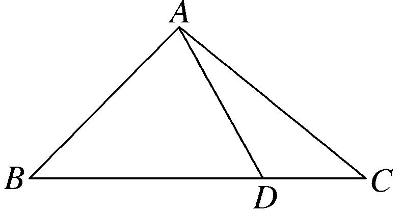
答案　　解析　在△*ADC*中，*AD*＝5，*AC*＝7，*DC*＝3，由余弦定理得cos∠*ADC*＝＝－，∴∠*ADC*＝120°，∠*ADB*＝60°，在△*ABD*中，*AD*＝5，∠*B*＝45°，∠*ADB*＝60°，由正弦定理得＝，∴*AB*＝．  
（8）如图所示，在四边形*ABCD*中，*AD*⊥*CD*，*AD*＝10，*AB*＝14，∠*BDA*＝60°，∠*BCD*＝135°，则*BC*的长为\_\_\_\_\_\_\_\_．

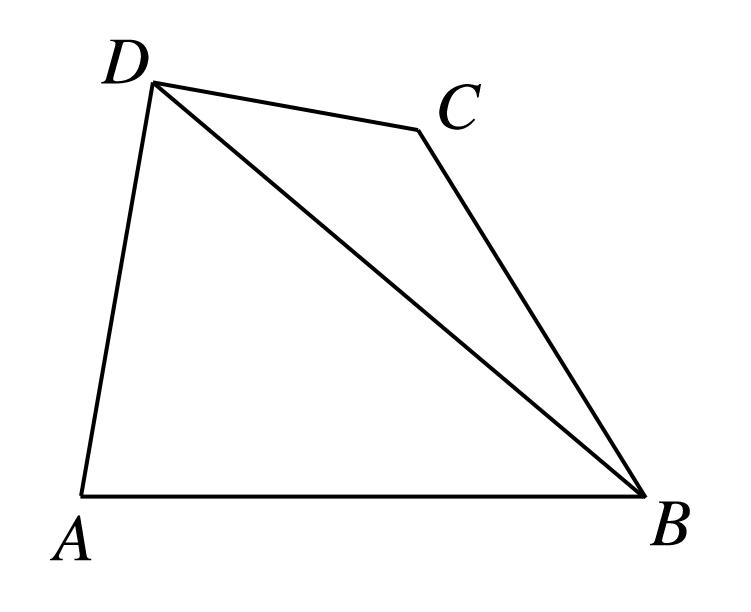
答案　8　解析　在△<em>ABD</em>中，由余弦定理，得<em>AB</em>2＝<em>AD</em>2＋<em>BD</em>2－2<em>AD</em>·<em>BD</em>·cos∠<em>ADB</em>，设<em>BD</em>＝<em>x</em>，则有142＝102＋<em>x</em>2－2×10<em>x</em>cos 60°，∴<em>x</em>2－10<em>x</em>－96＝0，∴<em>x</em>1＝16，<em>x</em>2＝－6(舍去)，∴<em>BD</em>＝16．在△<em>BCD</em>中，由正弦定理知，＝，∴<em>BC</em>＝·sin 30°＝8．  
（9）在△<em>ABC</em>中，三个内角<em>A</em>，<em>B</em>，<em>C</em>所对的边分别为<em>a</em>，<em>b</em>，<em>c</em>，若<em>S</em>△<em>ABC</em>＝2，<em>a</em>＋<em>b</em>＝6，＝2cos<em>C</em>，则<em>c</em>等于(　　)

A．2　　　　　　　　
B．4　　　　　　　　
C．2　　　　　　　　
D．3
答案　C　解析　∵＝2cos <em>C</em>，由正弦定理，得sin<em>A</em>cos<em>B</em>＋cos<em>A</em>sin<em>B</em>＝2sin<em>C</em>cos<em>C</em>，∴sin(<em>A</em>＋<em>B</em>)＝sin<em>C</em>＝2sin<em>C</em>cos<em>C</em>，由于0&lt;<em>C</em>&lt;π，sin<em>C</em>≠0，∴cos<em>C</em>＝，∴<em>C</em>＝，∵<em>S</em>△<em>ABC</em>＝2＝<em>ab</em>sin<em>C</em>＝<em>ab</em>，∴<em>ab</em>＝8，又<em>a</em>＋<em>b</em>＝6，解得或<em>c</em>2＝<em>a</em>2＋<em>b</em>2－2<em>ab</em>cos<em>C</em>＝4＋16－8＝12，∴<em>c</em>＝2，故选C．  
（10）已知△*ABC*中，*AC*＝，*BC*＝，△*ABC*的面积为．若线段*BA*的延长线上存在点*D*，使∠*BDC*＝，则*CD*＝\_\_\_\_\_\_\_\_．
答案　　解析　因为<em>S</em>△<em>ABC</em>＝<em>AC</em>·<em>BC</em>·sin∠<em>BCA</em>，即＝×××sin∠<em>BCA</em>，所以sin∠<em>BCA</em>＝．因为∠<em>BAC</em>&gt;∠<em>BDC</em>＝，所以∠<em>DAC</em>&lt;，又∠<em>DAC</em>＝∠<em>ABC</em>＋∠<em>ACB</em>，所以∠<em>ACB</em>&lt;，则∠<em>BCA</em>＝，所以cos∠<em>BCA</em>＝．在△<em>ABC</em>中，<em>AB</em>2＝<em>AC</em>2＋<em>BC</em>2－2<em>AC</em>·<em>BC</em>·cos∠<em>BCA</em>＝2＋6－2×××＝2，所以<em>AB</em>＝＝<em>AC</em>，所以∠<em>ABC</em>＝∠<em>ACB</em>＝，在△<em>BCD</em>中，＝，即＝，解得<em>CD</em>＝．

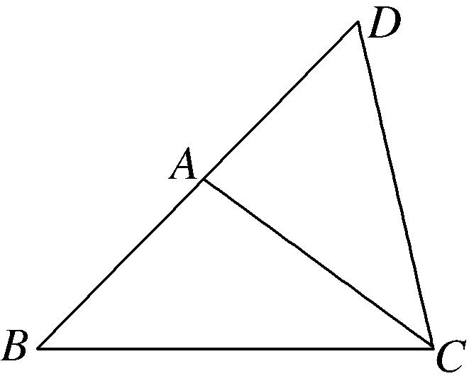

【对点训练】

1．在△*ABC*中，*A*∶*B*＝1∶2，sin*C*＝1，则*a*∶*b*∶*c*等于(　　)

A．1∶2∶3　　　　　
B．3∶2∶1　　　　　
C．1∶∶2　　　　　
D．2∶∶1

1．答案　C　解析　由sin*C*＝1，∴*C*＝，由*A*∶*B*＝1∶2，故*A*＋*B*＝3*A*＝，得*A*＝，*B*＝，由正弦定

理得，*a*∶*b*∶*c*＝sin*A*∶sin*B*∶sin*C*＝∶∶＝1∶∶2．

2．在△*ABC*中，若*b*＝5，*B*＝，tan*A*＝2，则*a*＝\_\_\_\_\_\_\_\_．

2．答案　2　解析　由tan<em>A</em>＝2得sin<em>A</em>＝2cos<em>A</em>．又sin2<em>A</em>＋cos2<em>A</em>＝1得sin <em>A</em>＝．∵<em>b</em>＝5，<em>B</em>＝，
根据正弦定理，有＝，∴*a*＝＝＝2．

3．设△*ABC*的内角*A*，*B*，*C*的对边分别为*a*，*b*，*c*．若*a*＝，sin*B*＝，*C*＝，则*b*＝\_\_\_\_\_\_\_\_．

3．答案　1　解析　因为sin*B*＝且*B*∈(0，π)，所以*B*＝或*B*＝．又*C*＝，*B*＋*C*<π，所以*B*＝，*A*

＝π－*B*－*C*＝．又*a*＝，由正弦定理得＝，即＝，解得*b*＝1．

4．△<em>ABC</em>的三个内角<em>A</em>，<em>B</em>，<em>C</em>所对的边分别为<em>a</em>，<em>b</em>，<em>c</em>，<em>a</em>sin<em>A</em>sin<em>B</em>＋<em>b</em>cos2<em>A</em>＝<em>a</em>，则等于(　　)

A．2　　　　　　　　
B．2　　　　　　　　　
C．　　　　　　　　
D．

4．答案　D　解析　∵<em>a</em>sin<em>A</em>sin<em>B</em>＋<em>b</em>cos2<em>A</em>＝<em>a</em>，∴sin<em>A</em>sin<em>A</em>sin<em>B</em>＋sin<em>B</em>cos2<em>A</em>＝sin<em>A</em>，∴sin<em>B</em>＝sin<em>A</em>，
∴＝＝．

5．(2019浙江)在中，，，，点在线段上，若，则

\_\_\_\_\_\_\_\_\_\_\_，\_\_\_\_\_\_\_\_\_\_\_．

5．答案　，　解析　如图，在中，由正弦定理有：，而

，，，所以

．

6．设△*ABC*的内角*A*，*B*，*C*的对边分别为*a*，*b*，*c*，且cos*A*＝，cos*B*＝，*b*＝3，则*c*＝\_\_\_\_\_\_\_\_．

6．答案　　解析　在△*ABC*中，∵cos*A*＝>0，∴sin*A*＝．∵cos*B*＝>0，∴sin*B*＝．∴sin *C*＝sin[π

－(*A*＋*B*)]＝sin(*A*＋*B*)＝sin*A*cos*B*＋cos*A*sin*B*＝×＋×＝．由正弦定理知＝，∴*c*＝＝＝．

7．△*ABC*的内角*A*，*B*，*C*的对边分别为*a*，*b*，*c*，若cos*A*＝，cos*C*＝，*a*＝1，则*b*＝(　　)

A．　　　　　　　　
B．　　　　　　　　
C．　　　　　　　　
D．

7．答案　A　解析　因为*A*，*C*为△*ABC*的内角，且cos *A*＝，cos *C*＝，所以sin*A*＝，sin*C*＝，
所以sin *B*＝sin(π－*A*－*C*)＝sin(*A*＋*C*)＝sin *A*cos *C*＋cos *A*sin *C*＝×＋×＝．又*a*＝1，所以由正弦定理得*b*＝＝×＝．

8．(2017·山东)在△*ABC*中，角*A*，*B*，*C*的对边分别为*a*，*b*，*c*．若△*ABC*为锐角三角形，且满足sin*B*(1

＋2cos*C*)＝2sin*A*cos*C*＋cos*A*sin*C*，则下列等式成立的是(　　)

A．*a*＝2*b*　　　　　　
B．*b*＝2*a*　　　　　　
C．*A*＝2*B*　　　　　　
D．*B*＝2*A*

8．答案　A　解析　∵等式右边＝sin*A*cos*C*＋(sin*A*cos*C*＋cos*A*sin*C*)＝sin*A*co *C*＋sin(*A*＋*C*)＝sin*A*cos

*C*＋sin*B*，等式左边＝sin*B*＋2sin*B*cos*C*，∴sin*B*＋2sin*B*cos*C*＝sin*A*cos*C*＋sin*B*．由cos*C*＞0，得sin*A*＝2sin*B*．根据正弦定理，得*a*＝2*b*．

9．在△*ABC*中，内角*A*，*B*，*C*的对边分别为*a*，*b*，*c*，且*b*＝2，＝1，*B*＝，则*a*的值为(　　)

A．－1 　　　　　　
B．2＋2　　　　　　
C．2－2　　　　　　
D．＋

9．答案　D　解析　在△*ABC*中，内角*A*，*B*，*C*的对边分别为*a*，*b*，*c*，且*b*＝2，＝1，所以

＝1，所以tan*C*＝1，*C*＝．因为*B*＝，所以*A*＝π－*B*－*C*＝，所以sin*A*＝sin＝sincos＋cossin＝．由正弦定理可得＝，则*a*＝＋．

10．在△*ABC*中，若*AB*＝，*BC*＝3，∠*C*＝120°，则*AC*＝(　　)

A．1　　　　　　　　
B．2　　　　　　　　
C．3　　　　　　　　
D．4

10．答案　A　解析　由余弦定理得<em>AB</em>2＝<em>AC</em>2＋<em>BC</em>2－2<em>AC</em>·<em>BC</em>·cos<em>C</em>，即13＝<em>AC</em>2＋9－2<em>AC</em>×3×cos120°，
化简得<em>AC</em>2＋3<em>AC</em>－4＝0，解得<em>AC</em>＝1或<em>AC</em>＝－4(舍去)．故选A．

11．△*ABC*的角*A*，*B*，*C*的对边分别为*a*，*b*，*c*，若cos*A*＝，*c*－*a*＝2，*b*＝3，则*a*＝(　　)

A．2　　　　　　　　
B．　　　　　　　　
C．3　　　　　　　　
D．

11．答案　A　解析　由题意可得*c*＝*a*＋2，*b*＝3，cos*A*＝，由余弦定理，得cos*A*＝·，代入数

据，得＝，解方程可得*a*＝2．

12．(2013·福建)在△*ABC*中，已知点*D*在*BC*边上，*AD*⊥*AC*，sin∠*BAC*＝，*AB*＝3，*AD*＝3，则*BD*的长为(　　)

A．3　　　　　　　　
B．　　　　　　　　
C．2　　　　　　　　
D．

12．答案　B　解析　sin∠<em>BAC</em>＝sin(＋∠<em>BAD</em>)＝cos∠<em>BAD</em>，∴cos∠<em>BAD</em>＝．<em>BD</em>2＝<em>AB</em>2＋<em>AD</em>2－

2<em>AB</em>·<em>AD</em>cos∠<em>BAD</em>＝（3）2＋32－2×3×3×，即<em>BD</em>2＝3，<em>BD</em>＝．

13．(2014·广东)在△*ABC*中，角*A*，*B*，*C*所对应的边分别为*a*，*b*，*c*，已知*b*cos*C*＋*c*cos*B*＝2*b*，则＝\_\_\_\_．

13．答案　2　解析　方法一　因为*b*cos*C*＋*c*cos*B*＝2*b*，所以*b*·＋*c*·＝2*b*，化简可得＝

2．
方法二　因为*b*cos*C*＋*c*cos*B*＝2*b*，所以sin*B*cos*C*＋sin*C*cos*B*＝2sin*B*，故sin(*B*＋*C*)＝2sin*B*，故sin*A*＝2sin*B*，则*a*＝2*b*，即＝2．

14．(2014·全国Ⅱ)钝角三角形*ABC*的面积是，*AB*＝1，*BC*＝，则*AC*等于(　　)

A．5　　　　　　　　
B．　　　　　　　　
C．2　　　　　　　　
D．1

14．答案　B　解析　∵*S*＝*AB*·*BC*sin*B*＝×1×sin*B*＝，∴sin*B*＝，∴*B*＝或．当*B*＝时，根

据余弦定理有<em>AC</em>2＝<em>AB</em>2＋<em>BC</em>2－2<em>AB</em>·<em>BC</em>cos<em>B</em>＝1＋2＋2＝5，∴<em>AC</em>＝，此时△<em>ABC</em>为钝角三角形，符合题意；当<em>B</em>＝时，根据余弦定理有<em>AC</em>2＝<em>AB</em>2＋<em>BC</em>2－2<em>AB</em>·<em>BC</em>cos<em>B</em>＝1＋2－2＝1，∴<em>AC</em>＝1，此时<em>AB</em>2＋<em>AC</em>2＝<em>BC</em>2，△<em>ABC</em>为直角三角形，不符合题意．故<em>AC</em>＝．

15．在△*ABC*中，角*A*，*B*，*C*的对边分别为*a*，*b*，*c*，若*A*＝，＝2sin*A*sin*B*，且*b*＝6，则*c*＝(　　)

A．2　　　　　　　　
B．3　　　　　　　　
C．4　　　　　　　　
D．6

15．答案　C　解析　在△<em>ABC</em>中，<em>A</em>＝，<em>b</em>＝6，∴<em>a</em>2＝<em>b</em>2＋<em>c</em>2－2<em>bc</em>cos<em>A</em>，即<em>a</em>2＝36＋<em>c</em>2－6<em>c</em>，①，又

＝2sin<em>A</em>sin<em>B</em>，∴＝2<em>ab</em>，即cos<em>C</em>＝＝，∴<em>a</em>2＋36＝4<em>c</em>2，②，由①②解得<em>c</em>＝4或<em>c</em>＝－6(不合题意，舍去)．因此<em>c</em>＝4．

16．已知△<em>ABC</em>中，角<em>A</em>，<em>B</em>，<em>C</em>的对边分别为<em>a</em>，<em>b</em>，<em>c</em>，且满足2cos2<em>A</em>＋sin2<em>A</em>＝2，<em>b</em>＝1，<em>S</em>△<em>ABC</em>＝，
则*A*＝\_\_\_\_\_\_\_\_，＝\_\_\_\_\_\_\_\_．

16．答案　　2　解析　∵2cos2<em>A</em>＋sin2<em>A</em>＝2，∴cos2<em>A</em>＋sin2<em>A</em>＝1，∴sin＝，∵0&lt;<em>A</em>&lt;π，
∴2<em>A</em>＋∈，∴2<em>A</em>＋＝，∴<em>A</em>＝．∵<em>b</em>＝1，<em>S</em>△<em>ABC</em>＝＝<em>bc</em>sin<em>A</em>＝×1×<em>c</em>×，∴<em>c</em>＝2，∴由余弦定理可得，<em>a</em>＝＝＝，∴＝＝＝2．

17．在△*ABC*中，角*A*，*B*，*C*的对边分别为*a*，*b*，*c*，*a*cos*B*＋*b*cos*A*＝2*c*cos*C*，*c*＝，且△*ABC*的面

积为，则△*ABC*的周长为(　　)

A．1＋　　　　　
B．2＋　　　　　
C．4＋　　　　　
D．5＋

17．答案　D　解析　在△*ABC*中，*a*cos*B*＋*b*cos*A*＝2*c*cos*C*，则sin*A*cos*B*＋sin*B*cos*A*＝2sin*C*cos*C*，即

sin(<em>A</em>＋<em>B</em>)＝2sin<em>C</em>cos<em>C</em>，∵sin(<em>A</em>＋<em>B</em>)＝sin<em>C</em>≠0，∴cos<em>C</em>＝，∴<em>C</em>＝，由余弦定理可得，<em>a</em>2＋<em>b</em>2－<em>c</em>2＝<em>ab</em>，即(<em>a</em>＋<em>b</em>)2－3<em>ab</em>＝<em>c</em>2＝7，又<em>S</em>＝<em>ab</em>sin<em>C</em>＝<em>ab</em>＝，∴<em>ab</em>＝6，∴(<em>a</em>＋<em>b</em>)2＝7＋3<em>ab</em>＝25，即<em>a</em>＋<em>b</em>＝5，∴△<em>ABC</em>的周长为<em>a</em>＋<em>b</em>＋<em>c</em>＝5＋．

18．在△*ABC*中，角*A*，*B*，*C*的对边分别为*a*，*b*，*c*．已知*a*＝4，*b*＝2，sin2*A*＝sin*B*，则边*c*的长为(　　)

A．2　　　　　　　　
B．3　　　　　　　　
C．4　　　　　　　　
D．2或4

18．答案　D　解析　由sin 2*A*＝sin*B*，得2sin*A*cos*A*＝sin*B*，由正弦定理得2×4cos*A*＝2，所以cos*A*

＝．再由余弦定理得cos*A*＝，解得*c*＝2或*c*＝4．故选D．

19．已知<em>a</em>，<em>b</em>，<em>c</em>分别为△<em>ABC</em>内角<em>A</em>，<em>B</em>，<em>C</em>的对边，sin2<em>B</em>＝2sin<em>A</em>sin<em>C</em>，且<em>a</em>&gt;<em>c</em>，cos<em>B</em>＝，则＝(　　)

A．2　　　　　　　　
B．　　　　　　　　
C．3　　　　　　　　
D．4

19．答案　A　解析　由正弦定理可得<em>b</em>2＝2<em>ac</em>，故cos <em>B</em>＝＝＝，化简得(2<em>a</em>－<em>c</em>)(<em>a</em>

－2*c*)＝0，又*a*>*c*，故*a*＝2*c*，＝2，故选A．

20．若△*ABC*的内角*A*，*B*，*C*所对的边分别为*a*，*b*，*c*，已知2*b*sin2*A*＝*a*sin*B*，且*c*＝2*b*，则＝(　　)

A．2　　　　　　　　
B．3　　　　　　　　
C．　　　　　　　　
D．

20．答案　A　解析　由2*b*sin2*A*＝*a*sin*B*，得4*b*sin*A*·cos*A*＝*a*sin*B*，由正弦定理得4sin*B*·sin*A*·cos*A*＝sin

<em>A</em>sin<em>B</em>，∵sin<em>A</em>≠0，且sin<em>B</em>≠0，∴cos<em>A</em>＝，由余弦定理得<em>a</em>2＝<em>b</em>2＋4<em>b</em>2－<em>b</em>2，∴<em>a</em>2＝4<em>b</em>2，∴＝2．故选A．

21．(2019·全国Ⅰ)△*ABC*的内角*A*，*B*，*C*的对边分别为*a*，*b*，*c*，已知*a*sin *A*－*b*sin *B*＝4*c*sin *C*，cos *A*＝

－，则＝(　　)

A．6　　　　　　　　
B．5　　　　　　　　
C．4　　　　　　　　
D．3

21．答案　A　解析　由正弦定理得，<em>a</em>sin <em>A</em>－<em>b</em>sin <em>B</em>＝4<em>c</em>sin <em>C</em>⇒<em>a</em>2－<em>b</em>2＝4<em>c</em>2，即<em>a</em>2＝4<em>c</em>2＋<em>b</em>2，又cos<em>A</em>＝

＝－，于是可得到＝6．故选A．

22．在△*ABC*中，已知*B*＝，*D*是*BC*边上一点，*AD*＝10，*AC*＝14，*DC*＝6，则*AB*的长为\_\_\_\_\_\_\_\_．

22．答案　5　解析　在△*ADC*中，∵*AD*＝10，*AC*＝14，*DC*＝6，∴cos∠*ADC*＝＝

＝－．又∵∠*ADC*∈(0，π)，∴∠*ADC*＝，∴∠*ADB*＝．在△*ABD*中，由正弦定理得＝，∴*AB*＝＝＝5．

23．在△<em>ABC</em>中，<em>A</em>，<em>B</em>，<em>C</em>的对边分别为<em>a</em>，<em>b</em>，<em>c</em>．若2cos2－cos2<em>C</em>＝1，4sin<em>B</em>＝3sin<em>A</em>，<em>a</em>－<em>b</em>＝1，
则*c*的值为(　　)

A．　　　　　　　　
B．　　　　　　　　
C．　　　　　　　　
D．6

23．答案　C　解析　由2cos2－cos2<em>C</em>＝1，可得2cos2－1－cos2<em>C</em>＝0，则有cos2<em>C</em>＋cos<em>C</em>＝0，
即2cos2<em>C</em>＋cos<em>C</em>－1＝0，解得cos<em>C</em>＝或cos<em>C</em>＝－1(舍)，由4sin<em>B</em>＝3sin<em>A</em>，得4<em>b</em>＝3<em>a</em>，①，又<em>a</em>－<em>b</em>＝1，②，联立①，②得<em>a</em>＝4，<em>b</em>＝3，所以<em>c</em>2＝<em>a</em>2＋<em>b</em>2－2<em>ab</em>cos<em>C</em>＝16＋9－12＝13，则<em>c</em>＝．

24．在△*ABC*中，*B*＝60°，*C*＝45°，*BC*＝8，*D*是*BC*上的一点，且＝，则*AD*的长为\_\_\_\_\_\_\_．

24．答案　4(3－)　解析　∵＝，*BC*＝8，∴*BD*＝4(－1)．又∵＝，∴＝

，∴<em>AB</em>＝×<em>BC</em>＝×8＝8(－1)．在△<em>ABD</em>中，由余弦定理得<em>AD</em>2＝<em>AB</em>2＋<em>BD</em>2－2<em>AB</em>·<em>BD</em>·cos <em>B</em>＝[8(－1)]2＋[4(－1)]2－2×8(－1)×4(－1)×cos 60°＝48(－1)2，∴<em>AD</em>＝4(3－)．

25．如图，在△*ABC*中，*D*是*BC*上的一点．已知∠*B*＝60°，*AD*＝2，*AC*＝，*DC*＝，则*AB*＝\_\_\_\_\_\_\_\_．

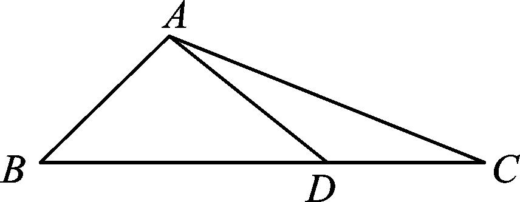

25．答案　　解析　在△*ACD*中，因为*AD*＝2，*AC*＝，*DC*＝，所以cos∠*ADC*＝＝－

，从而∠*ADC*＝135°，所以∠*ADB*＝45°．在△*ADB*中，＝，所以*AB*＝＝．

26．如图，在△*ABC*中，*AB*＝，点*D*在边*BC*上，*BD*＝2*DC*，cos∠*DAC*＝，cos∠*C*＝，则*AC*

＝\_\_\_\_\_\_\_\_．

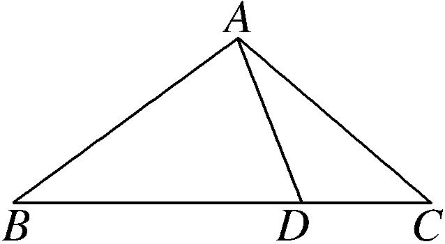

26．答案　　解析　因为*BD*＝2*DC*，设*CD*＝*x*，*AD*＝*y*，则*BD*＝2*x*，因为cos∠*DAC*＝，cos∠*C*

＝，所以sin∠<em>DAC</em>＝，sin∠<em>C</em>＝，在△<em>ACD</em>中，由正弦定理可得＝，即＝，即<em>y</em>＝<em>x</em>．又cos∠<em>ADB</em>＝cos(∠<em>DAC</em>＋∠<em>C</em>)＝×－×＝，则∠<em>ADB</em>＝．在△<em>ABD</em>中，<em>AB</em>2＝<em>BD</em>2＋<em>AD</em>2－2<em>BD</em>×<em>AD</em>cos，即2＝4<em>x</em>2＋2<em>x</em>2－2×2<em>x</em>×<em>x</em>×，即<em>x</em>2＝1，所以<em>x</em>＝1，即<em>BD</em>＝2，<em>DC</em>＝1，<em>AD</em>＝，在△<em>ACD</em>中，<em>AC</em>2＝<em>CD</em>2＋<em>AD</em>2－2<em>CD</em>×<em>AD</em>cos＝5，得<em>AC</em>＝．

27．已知*AB*⊥*BD*，*AC*⊥*CD*，*AC*＝1，*AB*＝2，∠*BAC*＝120°，则*BD*的长等于\_\_\_\_\_\_\_\_．

27．答案　　解析　如图，连接*BC*，*BC*＝＝，在△*ABC*，由正弦定理

知，＝，∴sin∠*ACB*＝．又∵∠*ACD*＝90°，∴cos∠*BCD*＝，sin∠*BCD*＝，由*AB*⊥*BD*，*AC*⊥*CD*，∠*BAC*＝120°，得∠*BDC*＝60°．由正弦定理，得*BD*＝＝＝．

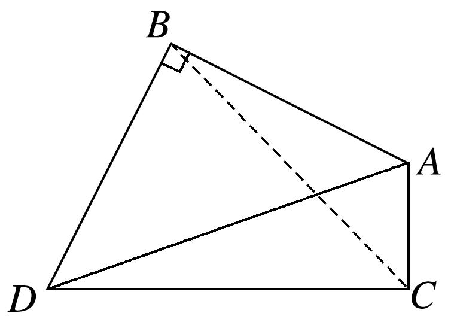

28．在四边形*ABCD*中，*BC*＝*a*，*DC*＝2*a*，且*A*∶∠*ABC*∶*C*∶∠*ADC*＝3∶7∶4∶10，则*AB*的长为\_\_\_\_\_\_．

28．答案　*a*　解析　如图所示，连接*BD．*∵*A*＋∠*ABC*＋*C*＋∠*ADC*＝360°，∴*A*＝45°，∠*ABC*＝105°，

<em>C</em>＝60°，∠<em>ADC</em>＝150°，在△<em>BCD</em>中，由余弦定理，得<em>BD</em>2＝<em>BC</em>2＋<em>CD</em>2－2<em>BC</em>·<em>CD</em>cos <em>C</em>＝<em>a</em>2＋4<em>a</em>2－2<em>a</em>·2<em>a</em>·cos 60°＝3<em>a</em>2，∴<em>BD</em>＝<em>A．</em>∴<em>BD</em>2＋<em>BC</em>2＝<em>CD</em>2，∴∠<em>CBD</em>＝90°，∴∠<em>ABD</em>＝15°，∴∠<em>BDA</em>＝120°．在△<em>ABD</em>中，由＝，得<em>AB</em>＝＝＝<em>a．</em>

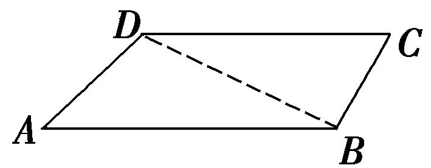

29．在△<em>ABC</em>中，<em>a</em>，<em>b</em>，<em>c</em>分别是内角<em>A</em>，<em>B</em>，<em>C</em>的对边，且<em>B</em>为锐角，若＝，sin <em>B</em>＝，<em>S</em>△<em>ABC</em>＝，
则*b*的值为\_\_\_\_\_\_\_\_．

29．答案　　解析　由＝⇒＝⇒<em>a</em>＝<em>c</em>，①，由<em>S</em>△<em>ABC</em>＝<em>ac</em>sin <em>B</em>＝且sin <em>B</em>＝得<em>ac</em>＝5，

②，联立①，②得<em>a</em>＝5，且<em>c</em>＝2．由sin<em>B</em>＝且<em>B</em>为锐角知cos<em>B</em>＝，由余弦定理知<em>b</em>2＝25＋4－2×5×2×＝14，<em>b</em>＝．

30．在△*ABC*中，内角*A*，*B*，*C*所对的边分别为*a*，*b*，*c*．已知*A*＝，*b*＝，△*ABC*的面积为，
则*c*＝\_\_\_\_\_\_\_\_，*B*＝\_\_\_\_\_\_\_\_．

30．答案：1＋　　解析　由<em>S</em>△<em>ABC</em>＝<em>bc</em>sin <em>A</em>＝××<em>c</em>×＝，得<em>c</em>＝1＋．在△<em>ABC</em>中，由

余弦定理得<em>a</em>2＝<em>b</em>2＋<em>c</em>2－2<em>bc</em>cos <em>A</em>＝6＋(4＋2)－2×(＋1)×＝4，则<em>a</em>＝2．由正弦定理＝，可得sin <em>B</em>＝，因为<em>b</em>&lt;<em>c</em>，所以<em>B</em>为锐角，所以<em>B</em>＝．

31．在△*ABC*中，内角*A*，*B*，*C*的对边分别为*a*，*b*，*c*，已知*B*＝30°，△*ABC*的面积为，且sin*A*＋sin*C*

＝2sin*B*，则*b*的值为\_\_\_\_\_\_\_\_．

31．答案　1＋　解析　由已知可得*ac*sin 30°＝，解得*ac*＝6．因为sin *A*＋sin *C*＝2sin *B*，所以由正弦

定理可得<em>a</em>＋<em>c</em>＝2<em>b</em>．由余弦定理知<em>b</em>2＝<em>a</em>2＋<em>c</em>2－2<em>ac</em>cos <em>B</em>＝(<em>a</em>＋<em>c</em>)2－2<em>ac</em>－<em>ac</em>＝4<em>b</em>2－12－6，解得<em>b</em>2＝4＋2，∴<em>b</em>＝1＋或<em>b</em>＝－1－(舍去)．

32．在△*ABC*中，*B*＝30°，*AC*＝2，*D*是*AB*边上的一点，*CD*＝2，若∠*ACD*为锐角，△*ACD*的面积为

4，则*BC*＝\_\_\_\_\_\_\_\_．

32．答案　4　解析　依题意得<em>S</em>△<em>ACD</em>＝<em>CD</em>·<em>AC</em>·sin∠<em>ACD</em>＝2·sin∠<em>ACD</em>＝4，sin∠<em>ACD</em>＝．又∠<em>ACD</em>

是锐角，因此cos∠*ACD*＝ ＝．在△*ACD*中，*AD*＝＝4，＝，则sin *A*＝＝．在△*ABC*中，＝，则*BC*＝＝4．

33．已知△*ABC*中，*AC*＝，*BC*＝，△*ABC*的面积为．若线段*BA*的延长线上存在点*D*，使∠*BDC*

＝，则*CD*＝\_\_\_\_\_\_\_\_．

33．答案　　解析　因为<em>S</em>△<em>ABC</em>＝<em>AC</em>·<em>BC</em>·sin∠<em>BCA</em>，即＝×××sin∠<em>BCA</em>，所以sin∠<em>BCA</em>＝

．因为∠<em>BAC</em>&gt;∠<em>BDC</em>＝，所以∠<em>BCA</em>＝，所以cos∠<em>BCA</em>＝．在△<em>ABC</em>中，<em>AB</em>2＝<em>AC</em>2＋<em>BC</em>2－2<em>AC</em>·<em>BC</em>·cos∠<em>BCA</em>＝2＋6－2×××＝2，所以<em>AB</em>＝，所以∠<em>ABC</em>＝，在△<em>BCD</em>中，＝，即＝，解得<em>CD</em>＝．

34．在△*ABC*中，*A*＝60°，*BC*＝，*D*是*AB*边上不同于*A*，*B*的任意一点，*CD*＝，△*BCD*的面积为

1，则*AC*的长为(　　)

A．2　　　　　　　　
B．　　　　　　　　　
C．　　　　　　　　
D．

34．答案　D　解析　由<em>S</em>△<em>BCD</em>＝1，可得×<em>CD</em>×<em>BC</em>×sin∠<em>DCB</em>＝1，即sin∠<em>DCB</em>＝，所以cos∠<em>DCB</em>＝

或cos∠*DCB*＝－，又∠*DCB*<∠*ACB*＝180°－*A*－*B*＝120°－*B*<120°，所以cos∠*DCB*>＝－，所以cos∠*DCB*＝．在△*BCD*中，cos∠*DCB*＝＝，解得*BD*＝2，所以cos∠*DBC*＝＝，所以sin∠*DBC*＝．在△*ABC*中，由正弦定理可得*AC*＝＝，故选D．

