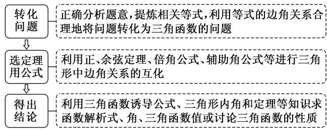
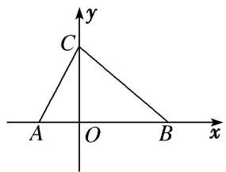

# 专题十 解三角形综合问题

# 考点一 正、余弦定理与三角函数结合的问题

# 【方法总结】

# 解三角形与三角函数交汇问题一般步骤

# 【例题选讲】

[例1]已知函数 $f(x) = \cos \left(2x + \frac{\pi}{3}\right) + \sqrt{3} (\sin x + \cos x)^2$ .  
（1）求函数 $f(x)$ 的最大值和最小正周期;  
（2）设 $\triangle ABC$ 的三边 $a, b, c$ 所对的角分别为 $A, B, C$ , 若 $a=2, c=\sqrt{7}, f\left(\frac{\pi}{4}+\frac{C}{2}\right)=\sqrt{3}$ , 求 $b$ 的值.   
[例 2] 已知 $f(x)=\cos x \sin \left(\frac{x-\frac{\pi}{6}}{6}\right)+1$ .  
（1）求 $f(x)$ 在 $[0,\pi]$ 上的单调递增区间；  
（2）在 $\triangle ABC$ 中，若角 $A, B, C$ 的对边分别是 $a, b, c$ ，且 $f(B)=\frac{5}{4}$ ， $\sin A\sin C=\sin^{2}B$ ，求 $a-c$ 的值.   
[例 3]已知函数 $f(x)=\sin^{2}x-\cos^{2}x+2\sqrt{3}\sin x\cos x(x\in\mathbf{R})$ .  
（1）求 $f(x)$ 的最小正周期;  
（2）在 $\triangle ABC$ 中，角 $A$ ， $B$ ， $C$ 的对边分别为 $a$ ， $b$ ， $c$ ，若 $f(A)=2$ ， $c=5$ ， $\cos B=\frac{1}{7}$ ，求 $\triangle ABC$ 中线 $AD$ 的长.   
[例 4] 已知函数 $f(x)=\cos^{2}x+\sqrt{3}\sin(\pi-x)\cos(\pi+x)-\frac{1}{2}$ .  
（1）求函数 $f(x)$ 在 $[0, \pi]$ 上的单调递减区间；  
（2）在锐角 $\triangle ABC$ 中，内角 $A, B, C$ 的对边分别为 $a, b, c$ ，已知 $f(A) = -1, a = 2, b\sin C = a\sin A$ ，求 $\triangle ABC$ 的面积.

[例 5] 已知 $f(x)=12\sin\left(x+\frac{\pi}{6}\right)\cos x-3,\quad x\in\left[0,\quad\frac{\pi}{4}\right]$ .  
（1）求 $f(x)$ 的最大值、最小值；  
（2） $CD$ 为 $\triangle ABC$ 的内角平分线，已知 $AC = f(x)_{\max}$ ， $BC = f(x)_{\min}$ ， $CD = 2\sqrt{2}$ ，求 $C$ .

[例6]已知函数 $f(x) = \sin^2\omega x - \sin^2\left(\omega x - \frac{\pi}{6}\right)\left(x \in \mathbf{R}, \omega \text{为常数且} \frac{1}{2} < \omega < 1\right)$ ，函数 $f(x)$ 的图象关于直线 $x = \pi$ 对称.  
（1）求函数 $f(x)$ 的最小正周期;  
（2）在 $\triangle ABC$ 中，角 $A$ ， $B$ ， $C$ 的对边分别为 $a$ ， $b$ ， $c$ ，若 $a=1$ ， $f\left(\frac{3}{5}A\right)=\frac{1}{4}$ ，求 $\triangle ABC$ 面积的最大值.

# 【对点训练】

1. 已知函数 $f(x)=\sqrt{3}\sin2x+2\cos^{2}x-1,\quad x\in\mathbb{R}.$  
（1）求函数 $f(x)$ 的最小正周期和单调递减区间;  
（2）在 $\triangle ABC$ 中， $A$ ， $B$ ， $C$ 的对边分别为 $a$ ， $b$ ， $c$ ，已知 $c=\sqrt{3}$ ， $f(C)=1$ ， $\sin B=2\sin A$ ，求 $a$ ， $b$ 的值.

2. 已知函数 $f(x)=\cos x(\cos x+\sqrt{3}\sin x)$ .  
（1）求 $f(x)$ 的最小值;  
（2）在 $\triangle ABC$ 中，角 $A$ ， $B$ ， $C$ 的对边分别是 $a$ ， $b$ ， $c$ ，若 $f(C)=1$ ， $S_{\triangle ABC}=\frac{3\sqrt{3}}{4}$ ， $c=\sqrt{7}$ ，求 $\triangle ABC$ 的周长.

3. 已知函数 $f(x) = \sqrt{3}\sin (2018\pi - x)\sin \left(\frac{3\pi}{2} + x\right) - \cos^2 x + 1$ .  
（1）求函数 $f(x)$ 的递增区间；  
（2）若 $\triangle ABC$ 的角 $A, B, C$ 所对的边为 $a, b, c$ , 角 $A$ 的平分线交 $BC$ 于 $D, f(A)=\frac{3}{2}, AD=\sqrt{2}BD=2$ , 求 $\cos C$ .

4. 已知 $\triangle ABC$ 的三个内角 $A, B, C$ 成等差数列，角 $B$ 所对的边 $b = \sqrt{3}$ ，且函数 $f(x) = 2\sqrt{3}\sin^2 x + 2\sin x\cos x - \sqrt{3}$ 在 $x = A$ 处取得最大值.  
（1）求 $f(x)$ 的值域及周期;  
（2）求 $\triangle ABC$ 的面积.

5. 如图, 在 $\triangle ABC$ 中, 三个内角 $B$ , $A$ , $C$ 成等差数列, 且 $AC = 10$ , $BC = 15$ .  
（1）求 $\triangle ABC$ 的面积;  
（2）已知平面直角坐标系 $xOy$ 中点 $D(10, 0)$ ，若函数 $f(x) = M\sin(\omega x + \varphi)M > 0$ ， $\omega > 0$ ， $|\varphi| < \frac{\pi}{2}$ 的图象经过 $A$ ， $C$ ， $D$ 三点，且 $A$ ， $D$ 为 $f(x)$ 的图象与 $x$ 轴相邻的两个交点，求 $f(x)$ 的解析式.

6. 已知 $f(x) = \sin (\omega x + \varphi)\left(\omega > 0, |\varphi| < \frac{\pi}{2}\right)$ 满足 $f\left(x + \frac{\pi}{2}\right) = -f(x)$ ，若其图象向左平移 $\frac{\pi}{6}$ 个单位长度后得到的函数为奇函数.  
（1）求 $f(x)$ 的解析式;  
（2）在锐角 $\triangle ABC$ 中，角 $A, B, C$ 的对边分别为 $a, b, c$ ，且满足 $(2c - a)\cos B = b\cos A$ ，求 $f(A)$ 的取值范围.

7. 在 $\triangle ABC$ 中， $a, b, c$ 分别是角 $A, B, C$ 的对边， $(2a - c)\cos B - b\cos C = 0$ .  
（1）求角 B 的大小;  
（2）设函数 $f(x)=2\sin x\cos x\cos B-\frac{\sqrt{3}}{2}\cos 2x$ ，求函数 $f(x)$ 的最大值及当 $f(x)$ 取得最大值时x的值.

8. 设 $f(x)=\sin x \cos x - \cos^{2}\left(x+\frac{\pi}{4}\right)$ .  
（1）求 $f(x)$ 的单调区间；  
（2）在锐角 $\triangle ABC$ 中，角 $A, B, C$ 的对边分别为 $a, b, c$ . 若 $f\left(\frac{A}{2}\right)=0, a=1$ ，求 $\triangle ABC$ 面积的最大值.

9. 已知函数 $f(x) = \sqrt{3}\sin \omega x\cos \omega x - \sin^2\omega x + 1(\omega > 0)$ 的图象中相邻两条对称轴之间的距离为 $\frac{\pi}{2}$ .  
（1）求 $\omega$ 的值及函数 $f(x)$ 的单调递减区间；  
（2）已知 $a, b, c$ 分别为 $\triangle ABC$ 中角 $A, B, C$ 的对边，且满足 $a = \sqrt{3}, f(A) = 1$ ，求 $\triangle ABC$ 面积 $S$ 的最大值.

# 考点二 正、余弦定理与与向量结合的问题

# 【方法总结】

# 解三角形与向量交汇问题一般步骤

破解平面向量与“三角”相交汇题的常用方法是“化简转化法”，即先活用诱导公式、同角三角函数的基本关系式、和角差角公式、倍角公式、辅助角公式等对三角函数进行巧“化简”；然后把以向量的数量积、向量共线、向量垂直形式出现的条件转化为“对应坐标乘积之间的关系”；再活用正、余弦定理，对三角形的边、角进行互化。这种问题求解的关键是利用向量的知识将条件“脱去向量外衣”，转化为三角函数的相关知识进行求解。

# 【例题选讲】

[例 1]已知向量 $m=(2\sin\omega x,\cos^{2}\omega x-\sin^{2}\omega x)$ ， $n=(\sqrt{3}\cos\omega x,1)$ ，其中 $\omega>0,\quad x\in R$ 。若函数 $f(x)=m\cdot n$ 的最小正周期为 $\pi$ 。  
（1）求 $\omega$ 的值;  
（2）在 $\triangle ABC$ 中，若 $f(B)=-2$ ， $BC=\sqrt{3}$ ， $\sin B=\sqrt{3}\sin A$ ，求 $\overrightarrow{BA}\cdot\overrightarrow{BC}$ 的值.

[例 2] 已知函数 $f(x)=a \cdot b$ ，其中 $a=(2\cos x, -\sqrt{3}\sin 2x)$ ， $b=(\cos x, 1)$ ， $x \in R$ .  
（1）求函数 $y=f(x)$ 的单调递减区间；  
（2）在 $\triangle ABC$ 中，角 $A$ ， $B$ ， $C$ 所对的边分别为 $a$ ， $b$ ， $c$ ， $f(A)=-1$ ， $a=\sqrt{7}$ ，且向量 $m=(3,\sin B)$ 与 $n=(2,\sin C)$ 共线，求边长 $b$ 和 $c$ 的值.

[例 3] 已知向量 $a=\left(\sin x,\ \frac{3}{4}\right)$ ， $b=(\cos x, -1)$ .  
（1）当 $a \parallel b$ 时，求 $\cos^2 x - \sin 2x$ 的值；  
（2）设函数 $f(x)=2(a+b)\cdot b$ ，已知在△ABC中，内角A，B，C的对边分别为a，b，c．若 $a=\sqrt{3}$ ，b=2， $\sin B=\frac{\sqrt{6}}{3}$ ，求 $f(x)+4\cos\left(2A+\frac{\pi}{6}\right)\left(x\in\left[0,\frac{\pi}{3}\right]\right)$ 的取值范围.

[例 4]已知 $\triangle ABC$ 的三内角 A, B, C 所对的边分别是 a, b, c，向量 $m=(\cos B, \cos C)$ ， $n=(2a+c, b)$ ，且 $m \perp n$ .  
（1）求角 B 的大小;  
（2）若 $b=\sqrt{3}$ ，求 $a+c$ 的取值范围.

[例 5]在 $\triangle ABC$ 中，内角 A, B, C 的对边分别是 a, b, c，已知 $2b\cos C=2a-\sqrt{3}c$ .  
（1）求 B 的大小;  
（2）若 $\overrightarrow{CA} +\overrightarrow{CB} = 2\overrightarrow{CM}$ ，且 $|\overrightarrow{CM}| = 1$ ，求△ABC面积的最大值.

[例 6] 已知向量 $a=\left(\cos\left(\frac{\pi}{2}+x\right),\sin\left(\frac{\pi}{2}+x\right)\right)$ ， $b=(-\sin x,\sqrt{3}\sin x)$ ， $f(x)=a\cdot b$ .  
（1）求函数 $f(x)$ 的最小正周期及 $f(x)$ 的最大值；  
（2）在锐角 $\triangle ABC$ 中，角 $A, B, C$ 的对边分别为 $a, b, c$ ，若 $f\left(\frac{A}{2}\right)=1$ ， $a=2\sqrt{3}$ ，求 $\triangle ABC$ 面积的最大值并说明此时 $\triangle ABC$ 的形状.

# 【对点训练】

1. 已知函数 $f(x) = 2\cos^2 x + \sin \left(\frac{7\pi}{6} - 2x\right) - 1 (x \in \mathbf{R})$ .  
（1）求函数 $f(x)$ 的最小正周期及单调递增区间;  
（2）在 $\triangle ABC$ 中，内角 $A$ ， $B$ ， $C$ 的对边分别为 $a$ ， $b$ ， $c$ ，已知 $f(A)=\frac{1}{2}$ ，若 $b+c=2a$ ，且 $\overrightarrow{AB} \cdot \overrightarrow{AC}=6$ ，求 $a$ 的值.

2. $\triangle ABC$ 的内角 $A, B, C$ 的对边分别为 $a, b, c$ , 已知向量 $m = (c - a, \sin B)$ , $n = (b - a, \sin A + \sin C)$ , 且 $m // n$ .  
（1）求 C;  
（2）若 $\sqrt{6}c+3b=3a$ ，求 $\sin A$ .

3. 在 $\triangle ABC$ 中，内角 $A, B, C$ 的对边分别为 $a, b, c$ ，已知向量 $m=(\cos A-2\cos C, 2c-a)$ ， $n=(\cos B, b)$ 平行.  
（1）求 $\frac{\sin C}{\sin A}$ 的值;  
（2）若 $b\cos C + c\cos B = 1$ ， $\triangle ABC$ 的周长为 5，求 b 的长.

4. 已知函数 $f(x) = \sqrt{3}\sin \omega x\cos \omega x - \cos^2\omega x + \frac{1}{2} (\omega >0)$ ，与 $f(x)$ 图象的对称轴 $x = \frac{\pi}{3}$ 相邻的 $f(x)$ 的零点为 $x = \frac{\pi}{12}$ .  
（1）讨论函数 $f(x)$ 在区间 $\left[-\frac{\pi}{12}, \frac{5\pi}{12}\right]$ 上的单调性；  
（2）设 $\triangle ABC$ 的内角 $A, B, C$ 的对应边分别为 $a, b, c$ 且 $c=\sqrt{3}, f(C)=1$ ，若向量 $m=(1, \sin A)$ 与向量 $n=(2, \sin B)$ 共线，求 $a, b$ 的值.

5. 已知向量 $\boldsymbol{m}=(\sqrt{3}\sin\frac{x}{4},1)$ ， $\boldsymbol{n}=(\cos\frac{x}{4},\cos^{2}\frac{x}{4})$ ，函数 $f(x)=\boldsymbol{m}\cdot\boldsymbol{n}$ .  
（1）若 $f(x)=1$ ，求 $\cos(\frac{2\pi}{3}-x)$ 的值；  
（2）在 $\triangle ABC$ 中，角 $A$ ， $B$ ， $C$ 的对边分别是 $a$ ， $b$ ， $c$ ，且满足 $a\cos C+\frac{1}{2}c=b$ ，求 $f(B)$ 的取值范围.

6. 已知 $m=(2\cos x+2\sqrt{3}\sin x,1)$ ， $n=(\cos x,-y)$ ，且满足 $m\cdot n=0$ .  
（1） 将 $v$ 表示为 $x$ 的函数 $f(x)$ ，并求 $f(x)$ 的最小正周期；  
（2）已知 a, b, c 分别为 $\triangle ABC$ 的三个内角 A, B, C 对应的边长， $f(x)(x \in \mathbb{R})$ 的最大值是 $f\left(\frac{A}{2}\right)$ ，且 a = 2，求 $b + c$ 的取值范围.

7. 已知点 $P(\sqrt{3}, 1)$ , $Q(\cos x, \sin x)$ , $O$ 为坐标原点, 函数 $f(x) = \overrightarrow{OP} \cdot \overrightarrow{QP}$ .  
（1）求函数 $f(x)$ 的最小正周期;  
（2）若 $A$ 为 $\triangle ABC$ 的内角， $f(A)=4$ ， $BC=3$ ，求 $\triangle ABC$ 周长的最大值.

8. 已知 $\triangle ABC$ 中内角 $A, B, C$ 的对边分别为 $a, b, c$ , 向量 $m = (2\sin B, -\sqrt{3})$ , $n = (\cos 2B, 2\cos^2\frac{B}{2} - 1)$ , $B$ 为锐角且 $m // n$ .  
（1）求角 B 的大小:  
（2）如果 b=2，求 $S_{\triangle ABC}$ 的最大值.

9. 在 $\triangle ABC$ 中，角 $A, B, C$ 的对边分别为 $a, b, c$ ，向量 $m=(a+b, \sin A-\sin C)$ ，向量 $n=(c, \sin A-\sin B)$ ，且 $m // n$ .  
（1）求角 B 的大小;  
（2）设 BC 的中点为 D，且 $AD=\sqrt{3}$ ，求 $a+2c$ 的最大值及此时 $\triangle ABC$ 的面积.

10. 在 $\triangle ABC$ 中，内角 $A, B, C$ 的对边分别为 $a, b, c$ ，且 $m=(2a-c, \cos C)$ ， $n=(b, \cos B)$ ， $m // n$ .  
（1）求角 B 的大小;  
（2）若 b=1，当 $\triangle ABC$ 的面积取得最大值时，求 $\triangle ABC$ 内切圆的半径.

