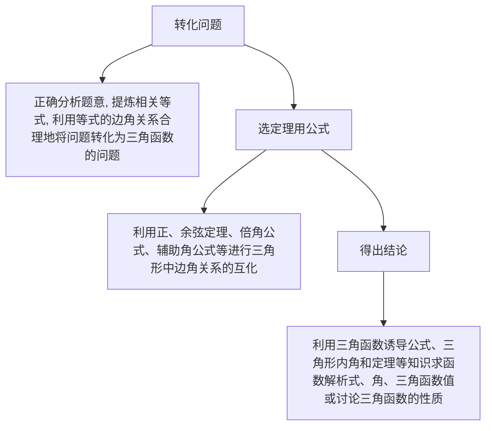
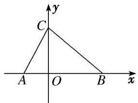

# 专题十 解三角形综合问题

# 考点一 正、余弦定理与三角函数结合的问题

# 【方法总结】

# 解三角形与三角函数交汇问题一般步骤

flowchart

# 【例题选讲】

[例1]已知函数 $f(x) = \cos \left(2x + \frac{\pi}{3}\right) + \sqrt{3} (\sin x + \cos x)^2$ .

(1)求函数 $f(x)$ 的最大值和最小正周期;

(2)设 $\triangle ABC$ 的三边 $a, b, c$ 所对的角分别为 $A, B, C$ , 若 $a=2, c=\sqrt{7}, f\left(\frac{\pi}{4}+\frac{C}{2}\right)=\sqrt{3}$ , 求 $b$ 的值.

解析 (1) $f(x)=\frac{1}{2}\cos 2x-\frac{\sqrt{3}}{2}\sin 2x+\sqrt{3}(1+\sin 2x)=\sin\left(2x+\frac{\pi}{6}\right)+\sqrt{3}$

所以 $f(x)$ 的最大值为 $1 + \sqrt{3}$ ，最小正周期 $T = \pi$ .

(2)因为 $f\left(\frac{\pi}{4}+\frac{C}{2}\right)=\sin\left(\frac{\pi}{2}+C+\frac{\pi}{6}\right)+\sqrt{3}=\cos\left(C+\frac{\pi}{6}\right)+\sqrt{3}=\sqrt{3},$

所以 $\cos\left(C+\frac{\pi}{6}\right)=0$ ，因为 $0<C<\pi$ ，所以 $C=\frac{\pi}{3}$ .

由余弦定理 $c^{2}=a^{2}+b^{2}-2ab\cos C$ ，可得 $b^{2}-2b-3=0$ ，因为 b>0，所以 b=3。

[例 2] 已知 $f(x)=\cos x \sin \left(\frac{x-\frac{\pi}{6}}{6}\right)+1$ .

(1)求 $f(x)$ 在 $[0, \pi]$ 上的单调递增区间；

(2)在 $\triangle ABC$ 中，若角 $A, B, C$ 的对边分别是 $a, b, c$ ，且 $f(B)=\frac{5}{4}$ ， $\sin A\sin C=\sin^{2}B$ ，求 $a-c$ 的值.

解析 $f(x) = \cos x\sin \left(x - \frac{\pi}{6}\right) + 1 = \cos x\left(\frac{\sqrt{3}}{2}\sin x - \frac{1}{2}\cos x\right) + 1$

$$
= \frac {\sqrt {3}}{4} \sin 2 x - \frac {1}{2} \times \frac {1 + \cos 2 x}{2} + 1 = \frac {\sqrt {3}}{4} \sin 2 x - \frac {1}{4} \cos 2 x + \frac {3}{4} = \frac {1}{2} \sin \left(2 x - \frac {\pi}{6}\right) + \frac {3}{4}.
$$

(1)由 $2k\pi - \frac{\pi}{2} \leq 2x - \frac{\pi}{6} \leq 2k\pi + \frac{\pi}{2}, k \in \mathbf{Z}$ ，得 $k\pi - \frac{\pi}{6} \leq x \leq k\pi + \frac{\pi}{3}, k \in \mathbf{Z}$ ，又 $x \in [0, \pi]$ ，

$\therefore f(x)$ 在 $[0, \pi]$ 上的单调递增区间是 $\left[0, \frac{\pi}{3}\right]$ 和 $\left[\frac{5\pi}{6}, \pi\right]$ .

(2)由 $f(B)=\frac{1}{2}\sin\left(2B-\frac{\pi}{6}\right)+\frac{3}{4}=\frac{5}{4}$ ，得 $\sin\left(2B-\frac{\pi}{6}\right)=1$ 。又 B 是△ABC 的内角， $\therefore 2B-\frac{\pi}{6}=\frac{\pi}{2}$ ，得 $B=\frac{\pi}{3}$ 。由 $\sin A\sin C=\sin^{2}B$ 及正弦定理可得 $ac=b^{2}$ 。在△ABC 中，由余弦定理 $b^{2}=a^{2}+c^{2}-2ac\cos B$ ，得 $ac=(a-c)^{2}+2ac-ac$ ，则 a-c=0。

[例 3]已知函数 $f(x)=\sin^{2}x-\cos^{2}x+2\sqrt{3}\sin x\cos x(x\in\mathbf{R})$ .

(1)求 $f(x)$ 的最小正周期;

(2)在 $\triangle ABC$ 中，角 $A$ ， $B$ ， $C$ 的对边分别为 $a$ ， $b$ ， $c$ ，若 $f(A)=2$ ， $c=5$ ， $\cos B=\frac{1}{7}$ ，求 $\triangle ABC$ 中线 $AD$ 的长.

解析 (1) $f(x)=-\cos2x+\sqrt{3}\sin2x=2\sin\left(2x-\frac{\pi}{6}\right).$ $\therefore T=\frac{2\pi}{2}=\pi.$ $\therefore$ 函数 $f(x)$ 的最小正周期为 $\pi.$

(2)由(1)知 $f(x)=2\sin\left(2x-\frac{\pi}{6}\right)$ ，∵在△ABC中 $f(A)=2$ ，∴ $\sin\left(2A-\frac{\pi}{6}\right)=1$ ，

$\therefore 2A - \frac{\pi}{6} = \frac{\pi}{2}, \therefore A = \frac{\pi}{3}$ . 又 $\cos B = \frac{1}{7}$ 且 $B \in (0, \pi)$ , $\therefore \sin B = \frac{4\sqrt{3}}{7}$ ,

$$
\therefore \sin C = \sin (A + B) = \frac {\sqrt {3}}{2} \times \frac {1}{7} + \frac {1}{2} \times \frac {4 \sqrt {3}}{7} = \frac {5 \sqrt {3}}{1 4},
$$

在 $\triangle ABC$ 中，由正弦定理 $\frac{c}{\sin C} = \frac{a}{\sin A}$ ，得 $\frac{5}{\frac{5\sqrt{3}}{14}} = \frac{a}{\frac{\sqrt{3}}{2}}$ ， $\therefore a = 7$ ， $\therefore BD = \frac{7}{2}$ .

在 $\triangle ABD$ 中，由余弦定理得， $AD^{2}=AB^{2}+BD^{2}-2AB\cdot BD\cos B=5^{2}+\left(\frac{7}{2}\right)^{2}-2\times5\times\frac{7}{2}\times\frac{1}{7}=\frac{129}{4}$ ，因此 $\triangle ABC$ 的中线 $AD=\frac{\sqrt{129}}{2}$ .

[例 4] 已知函数 $f(x)=\cos^{2}x+\sqrt{3}\sin(\pi-x)\cos(\pi+x)-\frac{1}{2}$ .

(1)求函数 $f(x)$ 在 $[0, \pi]$ 上的单调递减区间；

(2)在锐角 $\triangle ABC$ 中，内角 $A, B, C$ 的对边分别为 $a, b, c$ ，已知 $f(A) = -1, a = 2, b\sin C = a\sin A$ ，求 $\triangle ABC$ 的面积.

解析 (1) $f(x)=\cos^{2}x-\sqrt{3}\sin x\cos x-\frac{1}{2}=\frac{1+\cos 2x}{2}-\frac{\sqrt{3}}{2}\sin 2x-\frac{1}{2}=-\sin\left(2x-\frac{\pi}{6}\right)$ ,

令 $2k\pi - \frac{\pi}{2} \leq 2x - \frac{\pi}{6} \leq 2k\pi + \frac{\pi}{2}, k \in \mathbb{Z}$ , 得 $k\pi - \frac{\pi}{6} \leq x \leq k\pi + \frac{\pi}{3}, k \in \mathbb{Z}$ , 又 $\because x \in [0, \pi]$ ,

∴函数 $f(x)$ 在 $[0, \pi]$ 上的单调递减区间为 $\left[0, \frac{\pi}{3}\right]$ 和 $\left[\frac{5\pi}{6}, \pi\right]$ .

(2)由(1)知 $f(x)=-\sin\left(2x-\frac{\pi}{6}\right)$ ，∴ $f(A)=-\sin\left(2A-\frac{\pi}{6}\right)=-1$ ,

∵△ABC为锐角三角形，∴0<A< $\frac{\pi}{2}$ ，∴ $-\frac{\pi}{6}<2A-\frac{\pi}{6}<\frac{5\pi}{6}$ ，∴ $2A-\frac{\pi}{6}=\frac{\pi}{2}$ ，即 $A=\frac{\pi}{3}$ .

又∵ $b\sin C=a\sin A,\quad\therefore bc=a^{2}=4,\quad\therefore S_{\triangle ABC}=\frac{1}{2}bc\sin A=\sqrt{3}.$

[例 5] 已知 $f(x)=12\sin\left(x+\frac{\pi}{6}\right)\cos x-3,\quad x\in\left[0,\quad\frac{\pi}{4}\right]$ .

(1)求 $f(x)$ 的最大值、最小值；

(2) $CD$ 为 $\triangle ABC$ 的内角平分线，已知 $AC = f(x)_{\max}$ ， $BC = f(x)_{\min}$ ， $CD = 2\sqrt{2}$ ，求 $C$ .

解析 (1) $f(x)=12\sin\left(x+\frac{\pi}{6}\right)\cos x-3=12\left(\sin x\cos\frac{\pi}{6}+\cos x\sin\frac{\pi}{6}\right)\cos x-3$

$$
= 6 \sqrt {3} \sin x \cos x + 6 \cos^ {2} x - 3 = 3 \sqrt {3} \sin 2 x + 3 \cos 2 x = 6 \sin \left(2 x + \frac {\pi}{6}\right),
$$

$\because f(x)$ 在 $\left[0, \frac{\pi}{6}\right]$ 上是增函数，在 $\left[\frac{\pi}{6}, \frac{\pi}{4}\right]$ 上是减函数，又 $f(0)=3$ ， $f\left[\frac{\pi}{4}\right]=3\sqrt{3}$ .

$$
\therefore f (x) _ {\max} = f \left(\frac {\pi}{6}\right) = 6, f (x) _ {\min} = 3.
$$

(2)在 $\triangle ADC$ 中， $\frac{AD}{\sin \frac{C}{2}} = \frac{AC}{\sin \angle ADC}$ ，在 $\triangle BDC$ 中， $\frac{BD}{\sin \frac{C}{2}} = \frac{BC}{\sin \angle BDC}$ ，

$$
\because \sin \angle A D C = \sin \angle B D C, A C = 6, B C = 3,
$$

$\therefore AD = 2BD$ 。在 $\triangle BCD$ 中， $BD^{2} = CD^{2} + BC^{2} - 2CD \cdot BC \cdot \cos \frac{C}{2} = 17 - 12\sqrt{2}\cos \frac{C}{2}$ ，

在 $\triangle ACD$ 中， $AD^{2} = AC^{2} + CD^{2} - 2AC\cdot CD\cdot \cos \frac{C}{2} = 44 - 24\sqrt{2}\cos \frac{C}{2},$

又 $AD^{2} = 4BD^{2}$ ， $\therefore 44 - 24\sqrt{2}\cos \frac{C}{2} = 68 - 48\sqrt{2}\cos \frac{C}{2},\quad \therefore \cos \frac{C}{2} = \frac{\sqrt{2}}{2},\quad \because C\in (0,\pi),\quad \therefore C = \frac{\pi}{2}.$

[例6]已知函数 $f(x) = \sin^2\omega x - \sin^2\left(\omega x - \frac{\pi}{6}\right)\left(x \in \mathbf{R}, \omega \text{为常数且} \frac{1}{2} < \omega < 1\right)$ ，函数 $f(x)$ 的图象关于直线 $x = \pi$ 对称.

(1)求函数 $f(x)$ 的最小正周期；

(2)在 $\triangle ABC$ 中，角 $A$ ， $B$ ， $C$ 的对边分别为 $a$ ， $b$ ， $c$ ，若 $a=1$ ， $f\left(\frac{3}{5}A\right)=\frac{1}{4}$ ，求 $\triangle ABC$ 面积的最大值.

解析 (1) $f(x)=\frac{1}{2}-\frac{1}{2}\cos2\omega x-\left[\frac{1}{2}-\frac{1}{2}\cos\left(2\omega x-\frac{\pi}{3}\right)\right]=\frac{1}{2}\cos\left(2\omega x-\frac{\pi}{3}\right)-\frac{1}{2}\cos2\omega x$

$$
= - \frac {1}{4} \cos 2 \omega x + \frac {\sqrt {3}}{4} \sin 2 \omega x = \frac {1}{2} \sin \left(2 \omega x - \frac {\pi}{6}\right).
$$

令 $2\omega x - \frac{\pi}{6} = \frac{\pi}{2} + k\pi, k \in \mathbf{Z}$ ，解得 $x = \frac{\pi}{3\omega} + \frac{k\pi}{2\omega}, k \in \mathbf{Z}$ . $\therefore f(x)$ 的对称轴为 $x = \frac{\pi}{3\omega} + \frac{k\pi}{2\omega}, k \in \mathbf{Z}$ .

令 $\frac{\pi}{3\omega} +\frac{k\pi}{2\omega} = \pi ,k\in \mathbf{Z}$ ，解得 $\omega = \frac{2 + 3k}{6},k\in \mathbf{Z}.\because \frac{1}{2} <  \omega <  1,\therefore$ 取 $k = 1,\omega = \frac{5}{6},\therefore f(x) = \frac{1}{2}\sin \left(\frac{5}{3} x - \frac{\pi}{6}\right).$

∴ $f(x)$ 的最小正周期 $T=\frac{2\pi}{\frac{5}{3}}=\frac{6\pi}{5}$ .

(2) $\because f\left(\frac{3}{5}A\right)=\frac{1}{2}\sin\left(A-\frac{\pi}{6}\right)=\frac{1}{4},\quad\therefore\sin\left(A-\frac{\pi}{6}\right)=\frac{1}{2}.$ 又 $0<A<\pi,\quad\therefore A=\frac{\pi}{3}.$

由余弦定理得， $\cos A = \frac{b^2 + c^2 - a^2}{2bc} = \frac{b^2 + c^2 - 1}{2bc} = \frac{1}{2},$

$\therefore b^{2} + c^{2} = bc + 1 \geqslant 2bc$ ，当且仅当 $b = c$ 时，等号成立。 $\therefore bc \leqslant 1$

$\therefore S_{\triangle ABC} = \frac{1}{2} bc\sin A = \frac{\sqrt{3}}{4} bc \leqslant \frac{\sqrt{3}}{4}, \therefore \triangle ABC$ 面积的最大值是 $\frac{\sqrt{3}}{4}$ .

# 【对点训练】

1. 已知函数 $f(x) = \sqrt{3}\sin 2x + 2\cos^2 x - 1, x \in \mathbb{R}$ .

(1)求函数 $f(x)$ 的最小正周期和单调递减区间；  
(2)在 $\triangle ABC$ 中， $A$ ， $B$ ， $C$ 的对边分别为 $a$ ， $b$ ， $c$ ，已知 $c=\sqrt{3}$ ， $f(C)=1$ ， $\sin B=2\sin A$ ，求 $a$ ， $b$ 的值.

1. 解析 (1) $f(x)=\sqrt{3}\sin 2x+\cos 2x=2\sin\left(2x+\frac{\pi}{6}\right)$ ，所以函数 $f(x)$ 的最小正周期 $T=\frac{2\pi}{2}=\pi$

令 $\frac{\pi}{2} + 2k\pi \leq 2x + \frac{\pi}{6} \leq \frac{3\pi}{2} + 2k\pi (k \in \mathbb{Z})$ ，得 $\frac{\pi}{6} + k\pi \leq x \leq \frac{2\pi}{3} + k\pi (k \in \mathbb{Z})$

所以函数 $f(x)$ 的单调递减区间为 $\left[\frac{\pi}{6}+k\pi,\quad\frac{2\pi}{3}+k\pi\right](k\in\mathbb{Z})$ .

(2)因为 $f(C) = 2\sin \left(2C + \frac{\pi}{6}\right) = 1$ ，所以 $C = \frac{\pi}{3}$ ，所以 $(\sqrt{3})^2 = a^2 + b^2 - 2ab\cos \frac{\pi}{3}$ ， $a^2 + b^2 - ab = 3$ ，

又因为 $\sin B=2\sin A$ ，所以 b=2a，解得 a=1，b=2，所以 a，b 的值分别为 1，2.

2. 已知函数 $f(x)=\cos x(\cos x+\sqrt{3}\sin x)$ .

(1)求 $f(x)$ 的最小值;

(2)在 $\triangle ABC$ 中，角 $A$ ， $B$ ， $C$ 的对边分别是 $a$ ， $b$ ， $c$ ，若 $f(C)=1$ ， $S_{\triangle ABC}=\frac{3\sqrt{3}}{4}$ ， $c=\sqrt{7}$ ，求 $\triangle ABC$ 的周长.

2. 解析 (1) $f(x)=\cos x(\cos x+\sqrt{3}\sin x)=\cos^{2}x+\sqrt{3}\sin x\cos x=\frac{1+\cos 2x}{2}+\frac{\sqrt{3}}{2}\sin 2x=\frac{1}{2}+\sin\left(2x+\frac{\pi}{6}\right)$

当 $\sin\left(2x+\frac{\pi}{6}\right)=-1$ 时， $f(x)$ 取得最小值 $-\frac{1}{2}$ .

$$
(2) f (C) = \frac {1}{2} + \sin \left[ 2 C + \frac {\pi}{6} \right] = 1, \therefore \sin \left[ 2 C + \frac {\pi}{6} \right] = \frac {1}{2},
$$

$$
\because C \in (0, \pi), 2 C + \frac {\pi}{6} \in \left[ \frac {\pi}{6}, \frac {1 3 \pi}{6} \right], \therefore 2 C + \frac {\pi}{6} = \frac {5 \pi}{6}, \therefore C = \frac {\pi}{3}.
$$

$$
\because S _ {\triangle A B C} = \frac {1}{2} a b \sin C = \frac {3 \sqrt {3}}{4}, \therefore a b = 3. \text {又} (a + b) ^ {2} - 2 a b \cos \frac {\pi}{3} = 7 + 2 a b,
$$

$$
\therefore (a + b) ^ {2} = 1 6 \text {, 即} a + b = 4 \text {,} \therefore a + b + c = 4 + \sqrt {7} \text {, 故} \triangle A B C \text {的周长为} 4 + \sqrt {7}.
$$

3. 已知函数 $f(x) = \sqrt{3}\sin (2018\pi - x)\sin \left(\frac{3\pi}{2} + x\right) - \cos^2 x + 1$ .

(1)求函数 $f(x)$ 的递增区间；

(2)若 $\triangle ABC$ 的角 $A, B, C$ 所对的边为 $a, b, c$ , 角 $A$ 的平分线交 $BC$ 于 $D, f(A)=\frac{3}{2}, AD=\sqrt{2}BD=2$ , 求 $\cos C$ .

3. 解析 解 $(1)f(x) = \sqrt{3}\sin x\cos x - \cos^2 x + 1 = \frac{\sqrt{3}}{2}\sin 2x - \frac{1}{2}(1 + \cos 2x) + 1$

$$
= \frac {\sqrt {3}}{2} \sin 2 x - \frac {1}{2} \cos 2 x + \frac {1}{2} = \sin \left(2 x - \frac {\pi}{6}\right) + \frac {1}{2}.
$$

令 $2k\pi - \frac{\pi}{2} \leqslant 2x - \frac{\pi}{6} \leqslant 2k\pi + \frac{\pi}{2}, k \in \mathbf{Z}$ ，解得 $k\pi - \frac{\pi}{6} \leqslant x \leqslant k\pi + \frac{\pi}{3}, k \in \mathbf{Z}$ 。所以递增区间是 $\left[k\pi - \frac{\pi}{6}, k\pi + \frac{\pi}{3}\right](k \in \mathbf{Z})$ 。

(2) $f(A)=\frac{3}{2}\Rightarrow\sin\left(2A-\frac{\pi}{6}\right)=1$ ，得到 $2A-\frac{\pi}{6}=2k\pi+\frac{\pi}{2}\Rightarrow A=k\pi+\frac{\pi}{3}$ ， $k\in Z$

由 $0<A<\pi$ 得到 $A=\frac{\pi}{3}$ ，所以 $\angle BAD=\frac{\pi}{6}$ .

由正弦定理得 $\frac{BD}{\sin\angle BAD}=\frac{AD}{\sin B}\Rightarrow\sin B=\frac{\sqrt{2}}{2},\quad B=\frac{\pi}{4}$ 或 $B=\frac{3\pi}{4}$ (舍去),

所以 $\cos C = -\cos(A + B) = \sin\frac{\pi}{3}\sin\frac{\pi}{4} - \cos\frac{\pi}{3}\cos\frac{\pi}{4} = \frac{\sqrt{6} - \sqrt{2}}{4}.$

4. 已知 $\triangle ABC$ 的三个内角 $A, B, C$ 成等差数列，角 $B$ 所对的边 $b = \sqrt{3}$ ，且函数 $f(x) = 2\sqrt{3}\sin^2 x + 2\sin x\cos x - \sqrt{3}$ 在 $x = A$ 处取得最大值.

(1)求 $f(x)$ 的值域及周期;

(2)求 $\triangle ABC$ 的面积.

4. 解析 (1) 因为 $A, B, C$ 成等差数列，所以 $2B = A + C$ ，又 $A + B + C = \pi$ ，所以 $B = \frac{\pi}{3}$ ，即 $A + C = \frac{2\pi}{3}$ .

因为 $f(x)=2\sqrt{3}\sin^{2}x+2\sin x\cos x-\sqrt{3}=\sqrt{3}(2\sin^{2}x-1)+\sin2x=\sin2x-\sqrt{3}\cos2x=2\sin\left(2x-\frac{\pi}{3}\right)$ ,

所以 $T=\frac{2\pi}{2}=\pi$ 。又因为 $\sin\left(2x-\frac{\pi}{3}\right)\in[-1,1]$ ，所以 $f(x)$ 的值域为 $[-2,2]$ .

(2)因为 $f(x)$ 在 x=A 处取得最大值，所以 $\sin\left(2A-\frac{\pi}{3}\right)=1$ .

因为 $0 < A < \frac{2}{3}\pi$ ，所以 $-\frac{\pi}{3} < 2A - \frac{\pi}{3} < \pi$ ，故当 $2A - \frac{\pi}{3} = \frac{\pi}{2}$ 时， $f(x)$ 取到最大值，所以 $A = \frac{5}{12}\pi$ ，所以 $C = \frac{\pi}{4}$ .

由正弦定理，知 $\frac{\sqrt{3}}{\sin\frac{\pi}{3}} = \frac{c}{\sin\frac{\pi}{4}}\Rightarrow c = \sqrt{2}$ 。又因为 $\sin A = \sin \left(\frac{\pi}{4} +\frac{\pi}{6}\right) = \frac{\sqrt{2} + \sqrt{6}}{4}$ ，所以 $S_{\triangle ABC} = \frac{1}{2} bc\sin A = \frac{3 + \sqrt{3}}{4}$ 。

5. 如图，在 $\triangle ABC$ 中，三个内角 $B, A, C$ 成等差数列，且 $AC = 10, BC = 15$ .

(1)求 $\triangle ABC$ 的面积;

(2)已知平面直角坐标系 $xOy$ 中点 $D(10, 0)$ , 若函数 $f(x) = M \sin(\omega x + \varphi) M > 0$ , $\omega > 0$ , $|\varphi| < \frac{\pi}{2}$ 的图象经过 $A$ , $C$ , $D$ 三点, 且 $A$ , $D$ 为 $f(x)$ 的图象与 $x$ 轴相邻的两个交点, 求 $f(x)$ 的解析式.

text_image

y
C
A O B x

5. 解析 (1) 在 $\triangle ABC$ 中, 由角 $B$ , $A$ , $C$ 成等差数列, 得 $B + C = 2A$ , 又 $A + B + C = \pi$ , 所以 $A = \frac{\pi}{3}$ .

设角 A, B, C 的对边分别为 a, b, c，由余弦定理可知 $a^{2}=b^{2}+c^{2}-2bc\cos\frac{\pi}{3}$ ,

所以 $c^2 - 10c - 125 = 0$ ，解得 $c = AB = 5 + 5\sqrt{6}$ 。因为 $CO = 10 \times \sin \frac{\pi}{3} = 5\sqrt{3}$ ，

所以 $S_{\triangle ABC}=\frac{1}{2}\times(5+5\sqrt{6})\times5\sqrt{3}=\frac{25}{2}(3\sqrt{2}+\sqrt{3}).$

(2)因为 $AO=10\times\cos\frac{\pi}{3}=5$ ，所以函数 $f(x)$ 的最小正周期 $T=2\times(10+5)=30$ ，故 $\omega=\frac{\pi}{15}$ .

因为 $f(-5)=M\sin\left[\frac{\pi}{15}\times(-5)+\varphi\right]=0$ ，所以 $\sin\left(-\frac{\pi}{3}+\varphi\right)=0$ ，所以 $-\frac{\pi}{3}+\varphi=k\pi,\quad k\in\mathbf{Z}.$

因为 $|\varphi|<\frac{\pi}{2}$ ，所以 $\varphi=\frac{\pi}{3}$ 。因为 $f(0)=M\sin\frac{\pi}{3}=5\sqrt{3}$ ，所以M=10，

所以 $f(x)=10\sin\left(\frac{\pi}{15}x+\frac{\pi}{3}\right)$ .

6. 已知 $f(x) = \sin (\omega x + \varphi)\left[\omega > 0, |\varphi| < \frac{\pi}{2}\right]$ 满足 $f\left[x + \frac{\pi}{2}\right] = -f(x)$ ，若其图象向左平移 $\frac{\pi}{6}$ 个单位长度后得到的函数为奇函数.

(1)求 $f(x)$ 的解析式;

(2)在锐角 $\triangle ABC$ 中，角 $A$ ， $B$ ， $C$ 的对边分别为 $a$ ， $b$ ， $c$ ，且满足 $(2c-a)\cos B=b\cos A$ ，求 $f(A)$ 的取值范围.

6. 解析 (1) $\because f\left(x + \frac{\pi}{2}\right) = -f(x), \therefore f(x + \pi) = -f\left(x + \frac{\pi}{2}\right) = f(x), \therefore T = \pi, \therefore \omega = 2,$

则 $f(x)$ 的图象向左平移 $\frac{\pi}{6}$ 个单位长度后得到的函数为 $g(x)=\sin\left(2x+\frac{\pi}{3}+\varphi\right)$ ，而 $g(x)$ 为奇函数，则有 $\frac{\pi}{3}+\varphi=k\pi, k\in Z$ ，而 $|\varphi|<\frac{\pi}{2}$ ，则有 $\varphi=-\frac{\pi}{3}$ ，从而 $f(x)=\sin\left(2x-\frac{\pi}{3}\right)$ .

(2) $\because(2c-a)\cos B=b\cos A$ ，由正弦定理得 $2\sin C\cos B=\sin(A+B)=\sin C,$

又 $C\in \left(0,\frac{\pi}{2}\right),\therefore \sin C\neq 0,\therefore \cos B = \frac{1}{2},\therefore B = \frac{\pi}{3}.$

∵△ABC 是锐角三角形， $C=\frac{2\pi}{3}-A<\frac{\pi}{2}$ ，∴ $\frac{\pi}{6}<A<\frac{\pi}{2}$ ，∴0<2A- $\frac{\pi}{3}<\frac{2\pi}{3}$

$$
\therefore \sin \left(2 A - \frac {\pi}{3}\right) \in (0, 1 ], \quad \therefore f (A) = \sin \left(2 A - \frac {\pi}{3}\right) \in (0, 1 ].
$$

7. 在 $\triangle ABC$ 中， $a, b, c$ 分别是角 $A, B, C$ 的对边， $(2a - c)\cos B - b\cos C = 0$ .

(1)求角 B 的大小;

(2)设函数 $f(x) = 2\sin x\cos x\cos B - \frac{\sqrt{3}}{2}\cos 2x$ ，求函数 $f(x)$ 的最大值及当 $f(x)$ 取得最大值时 $x$ 的值.

7. 解析 (1) 因为 $(2a-c)\cos B-b\cos C=0$ ，所以 $2a\cos B-c\cos B-b\cos C=0$ ，

由正弦定理得 $2\sin A\cos B - \sin C\cos B - \cos C\sin B = 0$ ，即 $2\sin A\cos B - \sin(C + B) = 0$ ，

又 $C+B=\pi-A$ ，所以 $\sin(C+B)=\sin A$ 。所以 $\sin A(2\cos B-1)=0$ 。

在 $\triangle ABC$ 中， $\sin A\neq0$ ，所以 $\cos B=\frac{1}{2}$ ，又 $B\in(0,\pi)$ ，所以 $B=\frac{\pi}{3}$ .

(2)因为 $B=\frac{\pi}{3}$ ，所以 $f(x)=\frac{1}{2}\sin2x-\frac{\sqrt{3}}{2}\cos2x=\sin\left(2x-\frac{\pi}{3}\right)$ ,

令 $2x - \frac{\pi}{3} = 2k\pi +\frac{\pi}{2} (k\in \mathbf{Z})$ ，得 $x = k\pi +\frac{5\pi}{12} (k\in \mathbf{Z})$ ，即当 $x = k\pi +\frac{5\pi}{12} (k\in \mathbf{Z})$ 时， $f(x)$ 取得最大值1.

8. 设 $f(x)=\sin x \cos x - \cos^{2}\left(\frac{x+\frac{\pi}{4}}{4}\right)$ .

(1)求 $f(x)$ 的单调区间；

(2)在锐角 $\triangle ABC$ 中，角 $A, B, C$ 的对边分别为 $a, b, c$ . 若 $f\left(\frac{A}{2}\right)=0, a=1$ ，求 $\triangle ABC$ 面积的最大值.

8. 解析 (1)由题意知 $f(x) = \frac{\sin 2x}{2} - \frac{1 + \cos\left(2x + \frac{\pi}{2}\right)}{2} = \frac{\sin 2x}{2} - \frac{1 - \sin 2x}{2} = \sin 2x - \frac{1}{2}$ .

由 $-\frac{\pi}{2} + 2k\pi \leqslant 2x \leqslant \frac{\pi}{2} + 2k\pi, k \in \mathbf{Z}$ ，可得 $-\frac{\pi}{4} + k\pi \leqslant x \leqslant \frac{\pi}{4} + k\pi, k \in \mathbf{Z}$ ;

由 $\frac{\pi}{2}+2k\pi\leqslant2x\leqslant\frac{3\pi}{2}+2k\pi,\quad k\in\mathbf{Z},$ 可得 $\frac{\pi}{4}+k\pi\leqslant x\leqslant\frac{3\pi}{4}+k\pi,\quad k\in\mathbf{Z}.$

所以 $f(x)$ 的单调递增区间是 $\left[-\frac{\pi}{4} + k\pi, \frac{\pi}{4} + k\pi\right](k \in \mathbf{Z})$ ；单调递减区间是 $\left[\frac{\pi}{4} + k\pi, \frac{3\pi}{4} + k\pi\right](k \in \mathbf{Z})$ .

(2)由 $f\left(\frac{A}{2}\right)=\sin A-\frac{1}{2}=0$ ，得 $\sin A=\frac{1}{2}$ ，由题意知A为锐角，所以 $\cos A=\frac{\sqrt{3}}{2}$ .

由余弦定理 $a^{2}=b^{2}+c^{2}-2bc\cos A$ ，可得 $1+\sqrt{3}bc=b^{2}+c^{2}\geqslant2bc$ ，

即 $bc \leqslant 2 + \sqrt{3}$ ，当且仅当 b = c 时等号成立．因此 $\frac{1}{2}bc\sin A \leqslant \frac{2 + \sqrt{3}}{4}$ .

所以 $\triangle ABC$ 面积的最大值为 $\frac{2+\sqrt{3}}{4}$ .

9. 已知函数 $f(x)=\sqrt{3}\sin\omega x\cos\omega x-\sin^{2}\omega x+1(\omega>0)$ 的图象中相邻两条对称轴之间的距离为 $\frac{\pi}{2}$ .

(1)求 $\omega$ 的值及函数 $f(x)$ 的单调递减区间；

(2)已知 $a, b, c$ 分别为 $\triangle ABC$ 中角 $A, B, C$ 的对边，且满足 $a = \sqrt{3}, f(A) = 1$ ，求 $\triangle ABC$ 面积 $S$ 的最大值.

9. 解析 (1) $f(x)=\frac{\sqrt{3}}{2}\sin2\omega x-\frac{1-\cos2\omega x}{2}+1=\sin\left(2\omega x+\frac{\pi}{6}\right)+\frac{1}{2}.$

因为函数 $f(x)$ 的图象中相邻两条对称轴之间的距离为 $\frac{\pi}{2}$ ，所以 $T=\pi$ ，即 $\frac{2\pi}{2\omega}=\pi$ ，所以 $\omega=1$ 。

所以 $f(x)=\sin\left(2x+\frac{\pi}{6}\right)+\frac{1}{2}.$

令 $\frac{\pi}{2}+2k\pi\leq2x+\frac{\pi}{6}\leq\frac{3\pi}{2}+2k\pi(k\in\mathbb{Z})$ ，解得 $\frac{\pi}{6}+k\pi\leq x\leq\frac{2\pi}{3}+k\pi(k\in\mathbb{Z})$ .

所以函数 $f(x)$ 的单调递减区间为 $\left[\frac{\pi}{6}+k\pi,\quad\frac{2\pi}{3}+k\pi\right](k\in\mathbb{Z})$ .

(2)由 $f(A)=1$ ，得 $\sin\left(\frac{2A+\frac{\pi}{6}}{6}\right)=\frac{1}{2}$ . 因为 $2A+\frac{\pi}{6}\in\left(\frac{\pi}{6},\frac{13\pi}{6}\right)$ ，所以 $2A+\frac{\pi}{6}=\frac{5\pi}{6}$ ，得 $A=\frac{\pi}{3}$ .

由余弦定理得 $a^2 = b^2 + c^2 - 2bc\cos A$ ，即 $(\sqrt{3})^2 = b^2 + c^2 - 2bc\cos \frac{\pi}{3}$ ，所以 $bc + 3 = b^2 + c^2 \geq 2bc$

解得 $bc \leq 3$ ，当且仅当 b = c 时等号成立．所以 $S_{\triangle ABC} = \frac{1}{2} bc \sin A \leq \frac{1}{2} \times 3 \times \frac{\sqrt{3}}{2} = \frac{3\sqrt{3}}{4}$ ,

所以 $\triangle ABC$ 面积S的最大值为 $\frac{3\sqrt{3}}{4}$ .

# 考点二 正、余弦定理与与向量结合的问题

# 【方法总结】

# 解三角形与向量交汇问题一般步骤

破解平面向量与 “三角” 相交汇题的常用方法是 “化简转化法”，即先活用诱导公式、同角三角函数的基本关系式、和角差角公式、倍角公式、辅助角公式等对三角函数进行巧 “化简”；然后把以向量的数量积、向量共线、向量垂直形式出现的条件转化为“对应坐标乘积之间的关系”；再活用正、余弦定理，对三角形的边、角进行互化．这种问题求解的关键是利用向量的知识将条件“脱去向量外衣”，转化为三角函数的相关知识进行求解.

# 【例题选讲】

[例1]已知向量 $m = (2\sin \omega x, \cos^2\omega x - \sin^2\omega x)$ ， $n = (\sqrt{3}\cos \omega x, 1)$ ，其中 $\omega > 0$ ， $x \in \mathbf{R}$ 。若函数 $f(x) = m \cdot n$ 的最小正周期为 $\pi$ 。

(1)求 $\omega$ 的值;  
(2)在 $\triangle ABC$ 中，若 $f(B) = -2$ ， $BC = \sqrt{3}$ ， $\sin B = \sqrt{3}\sin A$ ，求 $\overrightarrow{BA} \cdot \overrightarrow{BC}$ 的值.

解析 (1) $f(x)=m\cdot n=2\sqrt{3}\sin\omega x\cos\omega x+\cos^{2}\omega x-\sin^{2}\omega x=\sqrt{3}\sin2\omega x+\cos2\omega x=2\sin\left(2\omega x+\frac{\pi}{6}\right).$

因为 $f(x)$ 的最小正周期为 $\pi$ ，所以 $T=\frac{2\pi}{2|\omega|}=\pi$ 。又 $\omega>0$ ，所以 $\omega=1$ 。

(2)由(1)知 $f(x)=2\sin\left(2x+\frac{\pi}{6}\right)$ . 设 $\triangle ABC$ 中角 A, B, C 所对的边分别是 a, b, c.

因为 $f(B)=-2$ ，所以 $2\sin\left(2B+\frac{\pi}{6}\right)=-2$ ，即 $\sin\left(2B+\frac{\pi}{6}\right)=-1$ ，由于 $0<B<\pi$ ，解得 $B=\frac{2\pi}{3}$ .

因为 $BC=\sqrt{3}$ ，即 $a=\sqrt{3}$ ，又 $\sin B=\sqrt{3}\sin A$ ，所以 $b=\sqrt{3}a$ ，故 b=3。

由正弦定理，有 $\frac{\sqrt{3}}{\sin A} = \frac{3}{\sin \frac{2\pi}{3}}$ ，解得 $\sin A = \frac{1}{2}$ 由于 $0 < A < \frac{\pi}{3}$ ，解得 $A = \frac{\pi}{6}$ 所以 $C = \frac{\pi}{6}$ ，所以 $c = a = \sqrt{3}$

所以 $\overrightarrow{BA}\cdot\overrightarrow{BC}=c a\cos B=\sqrt{3}\times\sqrt{3}\times\cos\frac{2\pi}{3}=-\frac{3}{2}.$

[例 2] 已知函数 $f(x)=a \cdot b$ ，其中 $a=(2\cos x, -\sqrt{3}\sin 2x)$ ， $b=(\cos x, 1)$ ， $x \in R$ .

(1)求函数 $y=f(x)$ 的单调递减区间;  
(2)在 $\triangle ABC$ 中，角 $A$ ， $B$ ， $C$ 所对的边分别为 $a$ ， $b$ ， $c$ ， $f(A)=-1$ ， $a=\sqrt{7}$ ，且向量 $m=(3,\sin B)$ 与 $n=(2,\sin C)$ 共线，求边长 $b$ 和 $c$ 的值.

解析 (1) $f(x)=2\cos^{2}x-\sqrt{3}\sin2x=1+\cos2x-\sqrt{3}\sin2x=1+2\cos\left(2x+\frac{\pi}{3}\right)$ ,

令 $2k\pi \leqslant 2x + \frac{\pi}{3} \leqslant 2k\pi + \pi (k \in \mathbf{Z})$ ，解得 $k\pi - \frac{\pi}{6} \leqslant x \leqslant k\pi + \frac{\pi}{3} (k \in \mathbf{Z})$

∴函数 $y=f(x)$ 的单调递减区间为 $\left[k\pi-\frac{\pi}{6}, k\pi+\frac{\pi}{3}\right](k\in\mathbf{Z})$ .

(2) $\because f(A)=1+2\cos\left(2A+\frac{\pi}{3}\right)=-1,\quad\therefore\cos\left(2A+\frac{\pi}{3}\right)=-1,$ 又 $\frac{\pi}{3}<2A+\frac{\pi}{3}<\frac{7\pi}{3},\quad\therefore2A+\frac{\pi}{3}=\pi,$ 即 $A=\frac{\pi}{3}.$

$\because a=\sqrt{7},\therefore$ 由余弦定理得 $a^{2}=b^{2}+c^{2}-2bc\cos A=(b+c)^{2}-3bc=7.$ ①

∵ 向量 $m=(3, \sin B)$ 与 $n=(2, \sin C)$ 共线，∴ $2\sin B=3\sin C$ ，由正弦定理得 2b=3c，②

由①②得 b=3，c=2。

[例 3] 已知向量 $a=\left(\sin x,\ \frac{3}{4}\right)$ ， $b=(\cos x, -1)$ .

(1)当 $a \parallel b$ 时，求 $\cos^{2}x - \sin2x$ 的值；

(2)设函数 $f(x)=2(a+b)\cdot b$ ，已知在△ABC中，内角A，B，C的对边分别为a，b，c．若 $a=\sqrt{3}$ ，b=2， $\sin B=\frac{\sqrt{6}}{3}$ ，求 $f(x)+4\cos\left(2A+\frac{\pi}{6}\right)\left[x\in\left[0,\frac{\pi}{3}\right]\right]$ 的取值范围.

解析 (1)因为 $a // b$ ，所以 $\frac{3}{4} \cos x + \sin x = 0$ ，所以 $\tan x = -\frac{3}{4}$ .

$$
\cos^ {2} x - \sin 2 x = \frac {\cos^ {2} x - 2 \sin x \cos x}{\sin^ {2} x + \cos^ {2} x} = \frac {1 - 2 \tan x}{1 + \tan^ {2} x} = \frac {8}{5}.
$$

$$
(2) f (x) = 2 (\boldsymbol {a} + \boldsymbol {b}) \cdot \boldsymbol {b} = 2 \left[ \sin x + \cos x, - \frac {1}{4} \right] \cdot (\cos x, - 1) = \sin 2 x + \cos 2 x + \frac {3}{2} = \sqrt {2} \sin \left(2 x + \frac {\pi}{4}\right) + \frac {3}{2}.
$$

由正弦定理 $\frac{a}{\sin A} = \frac{b}{\sin B}$ ，得 $\sin A = \frac{a\sin B}{b} = \frac{\sqrt{3} \times \frac{\sqrt{6}}{3}}{2} = \frac{\sqrt{2}}{2}$ ，所以 $A = \frac{\pi}{4}$ 或 $A = \frac{3\pi}{4}$ 。因为 $b > a$ ，所以 $A = \frac{\pi}{4}$ 。所以 $f(x) + 4\cos \left(2A + \frac{\pi}{6}\right) = \sqrt{2}\sin \left(2x + \frac{\pi}{4}\right) - \frac{1}{2}$ ，

因为 $x \in \left[0, \frac{\pi}{3}\right]$ ，所以 $2x + \frac{\pi}{4} \in \left[\frac{\pi}{4}, \frac{11\pi}{12}\right]$ ，所以 $\frac{\sqrt{3}}{2} - 1 \leqslant f(x) + 4\cos \left(2A + \frac{\pi}{6}\right) \leqslant \sqrt{2} - \frac{1}{2}$ .

所以 $f(x) + 4\cos \left(2A + \frac{\pi}{6}\right)\left(x\in \left[0,\frac{\pi}{3}\right]\right)$ 的取值范围是 $\left[\frac{\sqrt{3}}{2} -1,\sqrt{2} -\frac{1}{2}\right].$

[例 4]已知 $\triangle ABC$ 的三内角 A, B, C 所对的边分别是 a, b, c，向量 $m=(\cos B, \cos C)$ ， $n=(2a+c, b)$ ，且 $m \perp n$ .

(1)求角 B 的大小;  
(2)若 $b=\sqrt{3}$ ，求 $a+c$ 的取值范围.

解析 (1) $\because m = (\cos B, \cos C)$ , $n = (2a + c, b)$ , 且 $m \perp n$ , $\therefore (2a + c)\cos B + b\cos C = 0$ ,

由正弦定理，得 $\cos B(2\sin A + \sin C) + \sin B\cos C = 0,\quad \therefore 2\cos B\sin A + \cos B\sin C + \sin B\cos C = 0,$

即 $2\cos B\sin A = -\sin(B + C) = -\sin A.$ $\because A \in (0, \pi), \therefore \sin A \neq 0, \therefore \cos B = -\frac{1}{2}.$ $\because 0 < B < \pi, \therefore B = \frac{2\pi}{3}.$

(2)由余弦定理，得 $b^{2} = 3 = a^{2} + c^{2} - 2ac\cos \frac{2\pi}{3} = a^{2} + c^{2} + ac = (a + c)^{2} - ac \geqslant (a + c)^{2} - \left(\frac{a + c}{2}\right)^{2} = \frac{3}{4}(a + c)^{2}$ ，当且仅当 $a = c$ 时取等号。 $\therefore (a + c)^{2} \leqslant 4$ ，故 $a + c \leqslant 2$ 。 $\therefore a + c$ 的取值范围是 $(\sqrt{3}, 2]$ 。

[例 5]在 $\triangle ABC$ 中，内角 A, B, C 的对边分别是 a, b, c，已知 $2b\cos C=2a-\sqrt{3}c$ .

(1)求 B 的大小;  
(2)若 $\overrightarrow{CA} +\overrightarrow{CB} = 2\overrightarrow{CM}$ ，且 $|\overrightarrow{CM}| = 1$ ，求△ABC面积的最大值.

解析 (1)由 $2b\cos C = 2a - \sqrt{3} c$ 及正弦定理，得 $2\sin B\cos C = 2\sin A - \sqrt{3}\sin C,$

即 $2\sin B\cos C=2\sin(B+C)-\sqrt{3}\sin C,\quad\therefore2\sin C\cos B=\sqrt{3}\sin C,$

$\because C\in(0,\pi),\quad\therefore\sin C\neq0,\quad\therefore\cos B=\frac{\sqrt{3}}{2},\quad 又 B\in(0,\pi),\quad\therefore B=\frac{\pi}{6}.$

(2)由条件知，M 为 AB 的中点，∴ 在 $\triangle BCM$ 中，由余弦定理可得 $\cos B = \frac{BM^{2} + BC^{2} - 1}{2BM \cdot BC} = \frac{\sqrt{3}}{2}$ ,

$\therefore BM^{2} + BC^{2} = 1 + \sqrt{3} BM\cdot BC\geqslant 2BM\cdot BC,\therefore BM\cdot BC\leqslant 2 + \sqrt{3}$ ，当且仅当 $BM = BC$ 时等号成立.

又 $S_{\triangle ABC}=\frac{1}{2}BC\cdot BA\sin\frac{\pi}{6}=\frac{1}{2}BC\cdot BM\leqslant1+\frac{\sqrt{3}}{2},\quad\therefore\triangle ABC$ 面积的最大值是 $1+\frac{\sqrt{3}}{2}.$

[例 6] 已知向量 $a=\left(\cos\left(\frac{\pi}{2}+x\right),\sin\left(\frac{\pi}{2}+x\right)\right)$ ， $b=(-\sin x,\sqrt{3}\sin x)$ ， $f(x)=a\cdot b$ .

(1)求函数 $f(x)$ 的最小正周期及 $f(x)$ 的最大值；

(2)在锐角 $\triangle ABC$ 中，角 $A, B, C$ 的对边分别为 $a, b, c$ ，若 $f\left(\frac{A}{2}\right)=1$ ， $a=2\sqrt{3}$ ，求 $\triangle ABC$ 面积的最大值并说明此时 $\triangle ABC$ 的形状.

解析 (1)由已知得 $a=(-\sin x, \cos x)$ ，又 $b=(-\sin x, \sqrt{3}\sin x)$ ,

则 $f(x) = a \cdot b = \sin^2 x + \sqrt{3} \sin x \cos x = \frac{1}{2} (1 - \cos 2x) + \frac{\sqrt{3}}{2} \sin 2x = \sin \left(2x - \frac{\pi}{6}\right) + \frac{1}{2},$

∴ $f(x)$ 的最小正周期 $T=\frac{2\pi}{2}=\pi,$

当 $2x-\frac{\pi}{6}=\frac{\pi}{2}+2k\pi(k\in\mathbf{Z})$ ，即 $x=\frac{\pi}{3}+k\pi(k\in\mathbf{Z})$ 时， $f(x)$ 取得最大值 $\frac{3}{2}$ .

(2)锐角 $\triangle ABC$ 中，因为 $f\left(\frac{A}{2}\right)=\sin\left(A-\frac{\pi}{6}\right)+\frac{1}{2}=1,\quad\therefore\sin\left(A-\frac{\pi}{6}\right)=\frac{1}{2},\quad\therefore A=\frac{\pi}{3}.$

因为 $a^{2}=b^{2}+c^{2}-2bc\cos A$ ，所以 $12=b^{2}+c^{2}-bc$ ，所以 $b^{2}+c^{2}=bc+12\geqslant2bc$ ，

所以 $bc \leqslant 12$ (当且仅当 $b = c = 2\sqrt{3}$ 时等号成立)，此时 $\triangle ABC$ 为等边三角形.

$S_{\triangle ABC}=\frac{1}{2}bc\sin A=\frac{\sqrt{3}}{4}bc\leqslant3\sqrt{3}$ . 所以当 $\triangle ABC$ 为等边三角形时面积取最大值 $3\sqrt{3}$ .

# 【对点训练】

1. 已知函数 $f(x) = 2\cos^2 x + \sin \left(\frac{7\pi}{6} - 2x\right) - 1 (x \in \mathbf{R})$ .

(1)求函数 $f(x)$ 的最小正周期及单调递增区间；

(2)在 $\triangle ABC$ 中，内角 $A$ ， $B$ ， $C$ 的对边分别为 $a$ ， $b$ ， $c$ ，已知 $f(A)=\frac{1}{2}$ ，若 $b+c=2a$ ，且 $\overrightarrow{AB} \cdot \overrightarrow{AC}=6$ ，求 $a$ 的值.

1. 解析 (1) $f(x)=\sin\left(\frac{7\pi}{6}-2x\right)+2\cos^{2}x-1=-\frac{1}{2}\cos 2x+\frac{\sqrt{3}}{2}\sin 2x+\cos 2x=\frac{1}{2}\cos 2x+\frac{\sqrt{3}}{2}\sin 2x=\sin\left(2x+\frac{\pi}{6}\right).$

∴函数 $f(x)$ 的最小正周期 $T=\frac{2\pi}{2}=\pi$ .

由 $2k\pi - \frac{\pi}{2} \leqslant 2x + \frac{\pi}{6} \leqslant 2k\pi + \frac{\pi}{2}(k \in \mathbf{Z})$ ，可解得 $k\pi - \frac{\pi}{3} \leqslant x \leqslant k\pi + \frac{\pi}{6}(k \in \mathbf{Z})$ .

∴ $f(x)$ 的单调递增区间为 $\left[k\pi - \frac{\pi}{3}, k\pi + \frac{\pi}{6}\right] (k \in \mathbf{Z})$ .

(2)由 $f(A)=\sin\left(2A+\frac{\pi}{6}\right)=\frac{1}{2}$ ，可得 $2A+\frac{\pi}{6}=\frac{\pi}{6}+2k\pi$ 或 $2A+\frac{\pi}{6}=\frac{5\pi}{6}+2k\pi(k\in\mathbf{Z})$ 。∵ $A\in(0,\pi)$ ，∴ $A=\frac{\pi}{3}$

$\because\overrightarrow{AB}\cdot\overrightarrow{AC}=bc\cos A=\frac{1}{2}bc=6,\quad\therefore bc=12,$ 又 $\because2a=b+c,$

$\therefore \cos A = \frac{1}{2} = \frac{(b + c)^2 - a^2}{2bc} - 1 = \frac{4a^2 - a^2}{24} - 1 = \frac{a^2}{8} - 1, \therefore a = 2\sqrt{3}.$

2. $\triangle ABC$ 的内角 $A, B, C$ 的对边分别为 $a, b, c$ , 已知向量 $\boldsymbol{m} = (c - a, \sin B)$ , $\boldsymbol{n} = (b - a, \sin A + \sin C)$ , 且 $\boldsymbol{m} // \boldsymbol{n}$ .

(1)求 C;

(2)若 $\sqrt{6} c + 3b = 3a$ ，求 $\sin A$

2. 解 (1) 因为 $m \parallel n$ ，所以 $(c - a)(\sin A + \sin C) = (b - a)\sin B$ .

由正弦定理得 $(c-a)(a+c)=(b-a)b$ ，所以 $a^{2}+b^{2}-c^{2}=ab$ ，所以 $\cos C=\frac{a^{2}+b^{2}-c^{2}}{2ab}=\frac{ab}{2ab}=\frac{1}{2}$ .
因为 $C \in (0, \pi)$ ，所以 $C = \frac{\pi}{3}$ .

(2)由(1)知 $B = \frac{2\pi}{3} - A$ 。由题设及正弦定理得 $\sqrt{6}\sin C + 3\sin \left(\frac{2\pi}{3} - A\right) = 3\sin A,$

即 $\frac{\sqrt{2}}{2} +\frac{\sqrt{3}}{2}\cos A + \frac{1}{2}\sin A = \sin A$ ，可得 $\sin \left(A - \frac{\pi}{3}\right) = \frac{\sqrt{2}}{2}$ 由于 $0 <   A <   \frac{2\pi}{3}$ 因此 $-\frac{\pi}{3} <  A - \frac{\pi}{3} <  \frac{\pi}{3},$

所以 $\cos \left(A - \frac{\pi}{3}\right) = \frac{\sqrt{2}}{2}$ . 故 $\sin A = \sin \left(A - \frac{\pi}{3} + \frac{\pi}{3}\right) = \sin \left(A - \frac{\pi}{3}\right)\cos \frac{\pi}{3} + \cos \left(A - \frac{\pi}{3}\right) \cdot \sin \frac{\pi}{3} = \frac{\sqrt{6} + \sqrt{2}}{4}$ .

3. 在 $\triangle ABC$ 中，内角 $A, B, C$ 的对边分别为 $a, b, c$ ，已知向量 $m=(\cos A-2\cos C, 2c-a)$ ， $n=(\cos B, b)$ 平行.

(1)求 $\frac{\sin C}{\sin A}$ 的值;

(2)若 $b\cos C + c\cos B = 1$ ， $\triangle ABC$ 的周长为 5，求 b 的长.

3. 解析 (1)由已知得 $b(\cos A - 2\cos C) = (2c - a)\cos B$ ,

由正弦定理，可设 $\frac{a}{\sin A}=\frac{b}{\sin B}=\frac{c}{\sin C}=k\neq0,$

则 $(\cos A - 2\cos C)k\sin B = (2k\sin C - k\sin A)\cos B$ ，即 $(\cos A - 2\cos C)\sin B = (2\sin C - \sin A)\cos B,$

化简可得 $\sin (A + B) = 2\sin (B + C)$ ，又 $A + B + C = \pi$ ，所以 $\sin C = 2\sin A$ ，因此 $\frac{\sin C}{\sin A} = 2$ .

(2)由余弦定理可知， $b\cos C + c\cos B = b \cdot \frac{a^2 + b^2 - c^2}{2ab} + c \cdot \frac{a^2 + c^2 - b^2}{2ac} = \frac{2a^2}{2a} = a = 1$

由(1)知 $\frac{c}{a}=\frac{\sin C}{\sin A}=2$ ，则c=2，由周长 $a+b+c=5$ ，得b=2。

4. 已知函数 $f(x) = \sqrt{3}\sin \omega x\cos \omega x - \cos^2\omega x + \frac{1}{2} (\omega >0)$ ，与 $f(x)$ 图象的对称轴 $x = \frac{\pi}{3}$ 相邻的 $f(x)$ 的零点为 $x = \frac{\pi}{12}$ .

(1)讨论函数 $f(x)$ 在区间 $\left[-\frac{\pi}{12}, \frac{5\pi}{12}\right]$ 上的单调性；

(2)设 $\triangle ABC$ 的内角 $A, B, C$ 的对应边分别为 $a, b, c$ 且 $c=\sqrt{3}, f(C)=1$ ，若向量 $m=(1, \sin A)$ 与向量 $n=(2, \sin B)$ 共线，求 $a, b$ 的值.

4. 解 (1) $f(x)=\frac{\sqrt{3}}{2}\sin 2\omega x-\frac{1+\cos 2\omega x}{2}+\frac{1}{2}=\frac{\sqrt{3}}{2}\sin 2\omega x-\frac{1}{2}\cos 2\omega x=\sin\left(2\omega x-\frac{\pi}{6}\right)$ .

由与 $f(x)$ 图象的对称轴 $x=\frac{\pi}{3}$ 相邻的零点为 $x=\frac{\pi}{12}$ ，得 $\frac{1}{4}\cdot\frac{2\pi}{2\omega}=\frac{\pi}{3}-\frac{\pi}{12}=\frac{\pi}{4}$

所以 $\omega = 1$ ，即 $f(x) = \sin \left(2x - \frac{\pi}{6}\right)$ ，令 $z = 2x - \frac{\pi}{6}$

函数 $y=\sin z$ 的单调递增区间是 $\left[-\frac{\pi}{2}+2k\pi,\quad\frac{\pi}{2}+2k\pi\right]$ ， $k\in Z$

由 $-\frac{\pi}{2} + 2k\pi \leqslant 2x - \frac{\pi}{6} \leqslant \frac{\pi}{2} + 2k\pi, k \in \mathbf{Z}$ , 得 $-\frac{\pi}{6} + k\pi \leqslant x \leqslant \frac{\pi}{3} + k\pi, k \in \mathbf{Z}$ ,

设 $A=\left[-\frac{\pi}{12},\frac{5\pi}{12}\right]$ ， $B=\left\{x\mid-\frac{\pi}{6}+k\pi\leqslant x\leqslant\frac{\pi}{3}+k\pi,\quad k\in\mathbf{Z}\right\}$ ，易知 $A\cap B=\left[-\frac{\pi}{12},\frac{\pi}{3}\right]$

所以当 $x \in \left[-\frac{\pi}{12}, \frac{5\pi}{12}\right]$ 时， $f(x)$ 在区间 $\left[-\frac{\pi}{12}, \frac{\pi}{3}\right]$ 上单调递增，在区间 $\left[\frac{\pi}{3}, \frac{5\pi}{12}\right]$ 上单调递减.

(2) $f(C)=\sin\left(2C-\frac{\pi}{6}\right)-1=0$ ，则 $\sin\left(2C-\frac{\pi}{6}\right)=1$

因为 $0 < C < \pi$ ，所以 $-\frac{\pi}{6} < 2C - \frac{\pi}{6} < \frac{11\pi}{6}$ ，所以 $2C - \frac{\pi}{6} = \frac{\pi}{2}$ ，解得 $C = \frac{\pi}{3}$ .

因为 $m=(1,\sin A)$ 与向量 $n=(2,\sin B)$ 共线，所以 $\sin B=2\sin A$ ，由正弦定理得，b=2a. ①

由余弦定理，得 $c^{2}=a^{2}+b^{2}-2ab\cos\frac{\pi}{3}$ ，即 $a^{2}+b^{2}-ab=3$ 。②

由①②解得 a=1, b=2.

5. 已知向量 $\boldsymbol{m}=(\sqrt{3}\sin\frac{x}{4},1)$ ， $\boldsymbol{n}=(\cos\frac{x}{4},\cos^{2}\frac{x}{4})$ ，函数 $f(x)=\boldsymbol{m}\cdot\boldsymbol{n}$ .

(1)若 $f(x)=1$ ，求 $\cos(\frac{2\pi}{3}-x)$ 的值；

(2)在 $\triangle ABC$ 中，角 $A$ ， $B$ ， $C$ 的对边分别是 $a$ ， $b$ ， $c$ ，且满足 $a\cos C+\frac{1}{2}c=b$ ，求 $f(B)$ 的取值范围.

5. 解析 由题意得， $f(x)=\sqrt{3}\sin\frac{x}{4}\cos\frac{x}{4}+\cos^{2}\frac{x}{4}=\frac{\sqrt{3}}{2}\sin\frac{x}{2}+\frac{1}{2}\cos\frac{x}{2}+\frac{1}{2}=\sin(\frac{x}{2}+\frac{\pi}{6})+\frac{1}{2}.$

(1)由 $f(x)=1$ ，可得 $\sin(\frac{x}{2}+\frac{\pi}{6})=\frac{1}{2}$ ，则 $\cos(\frac{2\pi}{3}-x)=2\cos^{2}(\frac{\pi}{3}-\frac{x}{2})-1=2\sin^{2}(\frac{x}{2}+\frac{\pi}{6})-1=-\frac{1}{2}$ .  
(2)已知 $a\cos C + \frac{1}{2} c = b$ ，由余弦定理，可得 $a\cdot \frac{a^2 + b^2 - c^2}{2ab} +\frac{1}{2} c = b$ ，即 $b^{2} + c^{2} - a^{2} = bc,$

则 $\cos A=\frac{b^{2}+c^{2}-a^{2}}{2bc}=\frac{1}{2}$ ，又 A 为三角形的内角，所以 $A=\frac{\pi}{3}$ ，从而 $B+C=\frac{2\pi}{3}$ ，易知 $0<B<\frac{2\pi}{3}$ ， $0<\frac{B}{2}<\frac{\pi}{3}$ ，则 $\frac{\pi}{6}<\frac{B}{2}+\frac{\pi}{6}<\frac{\pi}{2}$ ，所以 $1<\sin(\frac{B}{2}+\frac{\pi}{6})+\frac{1}{2}<\frac{3}{2}$ ，故 $f(B)$ 的取值范围为 $(1,\frac{3}{2})$ .

6. 已知 $\boldsymbol{m}=(2\cos x+2\sqrt{3}\sin x,\quad1)$ ， $\boldsymbol{n}=(\cos x,\quad-y)$ ，且满足 $m\cdot n=0$ .

(1)将 y 表示为 x 的函数 $f(x)$ ，并求 $f(x)$ 的最小正周期；

(2)已知 $a, b, c$ 分别为 $\triangle ABC$ 的三个内角 $A, B, C$ 对应的边长， $f(x)(x \in \mathbf{R})$ 的最大值是 $f\left(\frac{A}{2}\right)$ ，且 $a = 2$ 求 $b + c$ 的取值范围.

6. 解析 (1) 由 $m \cdot n = 0$ ，得 $2\cos^2 x + 2\sqrt{3}\sin x\cos x - y = 0$

即 $y=2\cos^{2}x+2\sqrt{3}\sin x\cos x=\cos2x+\sqrt{3}\sin2x+1=2\sin\left(2x+\frac{\pi}{6}\right)+1$

所以 $f(x)=2\sin\left(2x+\frac{\pi}{6}\right)+1$ ，其最小正周期为 $\pi$ .

(2)由题意得 $f\left(\frac{A}{2}\right)=3$ ，所以 $A+\frac{\pi}{6}=2k\pi+\frac{\pi}{2}(k\in\mathbf{Z})$ ，因为 $0<A<\pi$ ，所以 $A=\frac{\pi}{3}$ .

由正弦定理，得 $b=\frac{4}{3}\sqrt{3}\sin B,\quad c=\frac{4}{3}\sqrt{3}\sin C,$

则 $b+c=\frac{4\sqrt{3}}{3}\sin B+\frac{4\sqrt{3}}{3}\sin C=\frac{4\sqrt{3}}{3}\sin B+\frac{4\sqrt{3}}{3}\sin\left(\frac{2\pi}{3}-B\right)=4\sin\left(B+\frac{\pi}{6}\right)$ ，又因为 $B\in\left(0,\frac{2\pi}{3}\right)$ ,

所以 $\sin\left(B+\frac{\pi}{6}\right)\in\left(\frac{1}{2},\quad1\right]$ ，所以 $b+c\in(2,4]$ ，所以 $b+c$ 的取值范围是 $(2,4]$ .

7. 已知点 $P(\sqrt{3}, 1)$ , $Q(\cos x, \sin x)$ , $O$ 为坐标原点, 函数 $f(x) = \overrightarrow{OP} \cdot \overrightarrow{QP}$ .

(1)求函数 $f(x)$ 的最小正周期;

(2)若 A 为 $\triangle ABC$ 的内角， $f(A)=4,\quad BC=3$ ，求 $\triangle ABC$ 周长的最大值.

7. 解析 (1)由已知，得 $\vec{OP} = (\sqrt{3}, 1)$ ， $\vec{QP} = (\sqrt{3} - \cos x, 1 - \sin x)$ ，

所以 $f(x)=\overrightarrow{OP}\cdot\overrightarrow{QP}=3-\sqrt{3}\cos x+1-\sin x=4-2\sin\left(x+\frac{\pi}{3}\right)$ ,

所以函数 $f(x)$ 的最小正周期为 $2\pi$ .

(2)因为 $f(A)=4$ ，所以 $\sin\left(A+\frac{\pi}{3}\right)=0$ ，又 $0<A<\pi$ ，所以 $\frac{\pi}{3}<A+\frac{\pi}{3}<\frac{4\pi}{3}$ ， $A=\frac{2\pi}{3}$ 。因为 BC=3，

所以由正弦定理，得 $AC=2\sqrt{3}\sin B,\quad AB=2\sqrt{3}\sin C,$

所以 $\triangle ABC$ 的周长为 $3 + 2\sqrt{3}\sin B + 2\sqrt{3}\sin C = 3 + 2\sqrt{3}\sin B + 2\sqrt{3}\sin \left(\frac{\pi}{3} -B\right) = 3 + 2\sqrt{3}\sin \left(B + \frac{\pi}{3}\right).$

因为 $0 < B < \frac{\pi}{3}$ ，所以 $\frac{\pi}{3} < B + \frac{\pi}{3} < \frac{2\pi}{3}$ ，所以当 $B + \frac{\pi}{3} = \frac{\pi}{2}$ ，即 $B = \frac{\pi}{6}$ 时，

$\triangle ABC$ 的周长取得最大值，最大值为 $3+2\sqrt{3}$ .

8. 已知 $\triangle ABC$ 中内角 $A, B, C$ 的对边分别为 $a, b, c$ , 向量 $m = (2\sin B, -\sqrt{3})$ , $n = (\cos 2B, 2\cos^2\frac{B}{2} - 1)$ , $B$ 为锐角且 $m // n$ .

(1)求角 B 的大小;

(2)如果 b=2，求 $S_{\triangle ABC}$ 的最大值.

8. 解析 (1) $\because m // n, \therefore 2\sin B\left(2\cos^2\frac{B}{2} - 1\right) = -\sqrt{3}\cos 2B, \therefore \sin 2B = -\sqrt{3}\cos 2B$ ，即 $\tan 2B = -\sqrt{3}$ .

又∵B为锐角，∴ $2B\in(0,\pi)$ ，∴ $2B=\frac{2\pi}{3}$ ，∴ $B=\frac{\pi}{3}$ .

(2) $\because B=\frac{\pi}{3},\quad b=2$ ，由余弦定理 $b^{2}=a^{2}+c^{2}-2ac\cos B$ ，得 $a^{2}+c^{2}-ac-4=0$ .

又 $a^{2}+c^{2}\geqslant2ac$ ，代入上式，得 $ac\leqslant4$ ，故 $S_{\triangle ABC}=\frac{1}{2}ac\sin B=\frac{\sqrt{3}}{4}ac\leqslant\sqrt{3}$

当且仅当 a=c=2 时等号成立，即 $S_{\triangle ABC}$ 的最大值为 $\sqrt{3}$ .

9. 在 $\triangle ABC$ 中，角 $A, B, C$ 的对边分别为 $a, b, c$ ，向量 $m = (a + b, \sin A - \sin C)$ ，向量 $n = (c, \sin A - \sin B)$ ，且 $m // n$ .

(1)求角 B 的大小;

(2)设 BC 的中点为 D，且 $AD=\sqrt{3}$ ，求 $a+2c$ 的最大值及此时 $\triangle ABC$ 的面积.

9. 解析 (1) 因为 $m \parallel n$ ，所以 $(a + b)(\sin A - \sin B) - c(\sin A - \sin C) = 0$ ，

由正弦定理，可得 $(a+b)(a-b)-c(a-c)=0$ ，即 $a^{2}+c^{2}-b^{2}=ac$ .

由余弦定理可知， $\cos B=\frac{a^{2}+c^{2}-b^{2}}{2ac}=\frac{ac}{2ac}=\frac{1}{2}$ . 因为 $B\in(0,\pi)$ ，所以 $B=\frac{\pi}{3}$ .

(2)设 $\angle BAD = \theta$ ，则在 $\triangle BAD$ 中，由 $B = \frac{\pi}{3}$ 可知， $\theta \in \left[0,\frac{2\pi}{3}\right].$

由正弦定理及 $AD=\sqrt{3}$ ，有 $\frac{BD}{\sin\theta}=\frac{AB}{\sin\left(\frac{2\pi}{3}-\theta\right)}=\frac{\sqrt{3}}{\sin\frac{\pi}{3}}=2$ ，

所以 $BD=2\sin\theta,\quad AB=2\sin\left(\frac{2\pi}{3}-\theta\right)=\sqrt{3}\cos\theta+\sin\theta,$

所以 $a=2BD=4\sin\theta,\quad c=AB=\sqrt{3}\cos\theta+\sin\theta,$

从而 $a + 2c = 2\sqrt{3}\cos \theta +6\sin \theta = 4\sqrt{3}\sin \left(\theta +\frac{\pi}{6}\right)$ 由 $\theta \in \left(0,\frac{2\pi}{3}\right)$ 可知， $\theta +\frac{\pi}{6}\in \left(\frac{\pi}{6},\frac{5\pi}{6}\right),$

所以当 $\theta+\frac{\pi}{6}=\frac{\pi}{2}$ ，即 $\theta=\frac{\pi}{3}$ 时， $a+2c$ 取得最大值 $4\sqrt{3}$ .

此时 $a=2\sqrt{3}$ ， $c=\sqrt{3}$ ，所以 $S_{\triangle ABC}=\frac{1}{2}ac\sin B=\frac{3\sqrt{3}}{2}$ .

10. 在 $\triangle ABC$ 中，内角 $A$ ， $B$ ， $C$ 的对边分别为 $a$ ， $b$ ， $c$ ，且 $m=(2a-c, \cos C)$ ， $n=(b, \cos B)$ ， $m//n$ 。

(1)求角 B 的大小;

(2)若 b=1，当 $\triangle ABC$ 的面积取得最大值时，求 $\triangle ABC$ 内切圆的半径.

10. 解 (1)由已知可得 $(2a - c)\cos B = b\cos C$ ，结合正弦定理可得 $(2\sin A - \sin C)\cos B = \sin B\cos C,$

即 $2\sin A\cos B=\sin(B+C)$ ，又 $\sin A=\sin(B+C)>0$ ，所以 $\cos B=\frac{1}{2}$ ，又 $0<B<\pi$ ，所以 $B=\frac{\pi}{3}$ .

(2)由(1)得 $B=\frac{\pi}{3}$ ，又 b=1，在 $\triangle ABC$ 中， $b^{2}=a^{2}+c^{2}-2ac\cos B$ ，

所以 $1^{2}=a^{2}+c^{2}-ac$ ，即 $1+3ac=(a+c)^{2}$ 。又 $(a+c)^{2}\geqslant4ac$ ，

所以 $1+3ac \geqslant 4ac$ ，即 $ac \leqslant 1$ ，当且仅当 a=c=1 时取等号.

从而 $S_{\triangle ABC}=\frac{1}{2}ac\sin B=\frac{\sqrt{3}}{4}ac\leqslant\frac{\sqrt{3}}{4}$ ，当且仅当 a=c=1 时， $S_{\triangle ABC}$ 取得最大值 $\frac{\sqrt{3}}{4}$ .

设 $\triangle ABC$ 内切圆的半径为 r，由 $S_{\triangle ABC}=\frac{1}{2}(a+b+c)r$ ，得 $r=\frac{\sqrt{3}}{6}$ .

