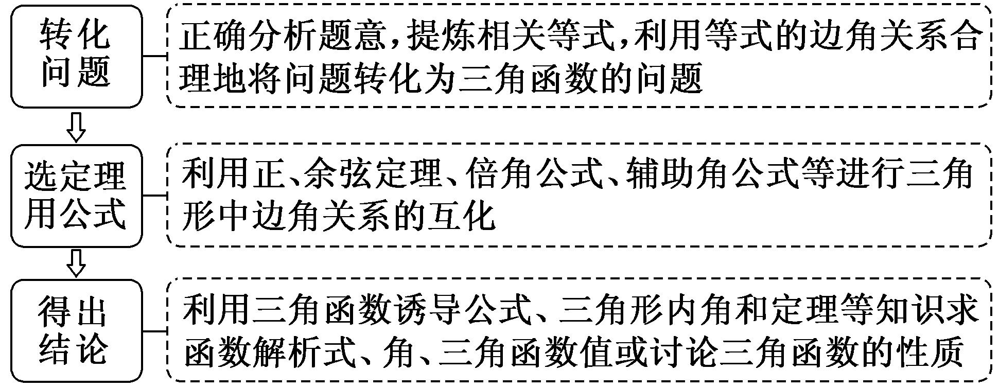
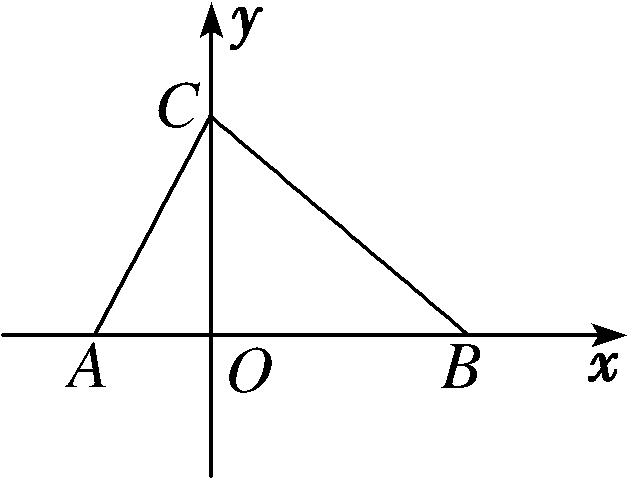

专题十　解三角形综合问题

考点一　正、余弦定理与三角函数结合的问题

【方法总结】
解三角形与三角函数交汇问题一般步骤

【例题选讲】

<strong>[例1]</strong>已知函数<em>f</em>(<em>x</em>)＝cos＋(sin<em>x</em>＋cos<em>x</em>)2．  
（1）求函数*f*(*x*)的最大值和最小正周期；  
（2）设△*ABC*的三边*a*，*b*，*c*所对的角分别为*A*，*B*，*C*，若*a*＝2，*c*＝，*f*＝，求*b*的值．
解析　（1）*f*(*x*)＝cos 2*x*－sin 2*x*＋(1＋sin 2*x*)＝sin＋，
所以*f*(*x*)的最大值为1＋，最小正周期*T*＝π．  
（2）因为*f*＝sin＋＝cos＋＝，
所以cos＝0，因为0<*C*<π，所以*C*＝．
由余弦定理<em>c</em>2＝<em>a</em>2＋<em>b</em>2－2<em>ab</em>cos <em>C</em>，可得<em>b</em>2－2<em>b</em>－3＝0，因为<em>b</em>&gt;0，所以<em>b</em>＝3．

<strong>[例2]</strong>已知<em>f</em>(<em>x</em>)＝cos<em>x</em>sin＋1．  
（1）求*f*(*x*)在[0，π]上的单调递增区间；  
（2）在△<em>ABC</em>中，若角<em>A</em>，<em>B</em>，<em>C</em>的对边分别是<em>a</em>，<em>b</em>，<em>c</em>，且<em>f</em>(<em>B</em>)＝，sin<em>A</em>sin<em>C</em>＝sin2<em>B</em>，求<em>a</em>－<em>c</em>的值．
解析　*f*(*x*)＝cos *x*sin＋1＝cos *x*＋1

＝sin 2*x*－×＋1＝sin 2*x*－cos 2*x*＋＝sin＋．  
（1）由2<em>k</em>π－≤2<em>x</em>－≤2<em>k</em>π＋，<em>k</em>∈<strong>Z</strong>，得<em>k</em>π－≤<em>x</em>≤<em>k</em>π＋，<em>k</em>∈<strong>Z</strong>，又<em>x</em>∈[0，π]，
∴*f*(*x*)在[0，π]上的单调递增区间是和．  
（2）由*f*(*B*)＝sin＋＝，得sin＝1．又*B*是△*ABC*的内角，∴2*B*－＝，得*B*＝．
由sin <em>A</em>sin <em>C</em>＝sin2<em>B</em>及正弦定理可得<em>ac</em>＝<em>b</em>2．在△<em>ABC</em>中，由余弦定理<em>b</em>2＝<em>a</em>2＋<em>c</em>2－2<em>ac</em>cos <em>B</em>，
得<em>ac</em>＝(<em>a</em>－<em>c</em>)2＋2<em>ac</em>－<em>ac</em>，则<em>a</em>－<em>c</em>＝0．

<strong>[例3]</strong>已知函数<em>f</em>(<em>x</em>)＝sin2<em>x</em>－cos2<em>x</em>＋2sin<em>x</em>cos<em>x</em>(<em>x</em>∈<strong>R</strong>)．  
（1）求*f*(*x*)的最小正周期；  
（2）在△*ABC*中，角*A*，*B*，*C*的对边分别为*a*，*b*，*c*，若*f*(*A*)＝2，*c*＝5，cos*B*＝，求△*ABC*中线*AD*的长．
解析　（1）*f*(*x*)＝－cos2*x*＋sin2*x*＝2sin．∴*T*＝＝π．∴函数*f*(*x*)的最小正周期为π．  
（2）由（1）知*f*(*x*)＝2sin，∵在△*ABC*中*f*(*A*)＝2，∴sin＝1，
∴2*A*－＝，∴*A*＝．又cos *B*＝且*B*∈(0，π)，∴sin *B*＝，
∴sin *C*＝sin(*A*＋*B*)＝×＋×＝，
在△*ABC*中，由正弦定理＝，得＝，∴*a*＝7，∴*BD*＝．
在△<em>ABD</em>中，由余弦定理得，<em>AD</em>2＝<em>AB</em>2＋<em>BD</em>2－2<em>AB</em>·<em>BD</em>cos <em>B</em>＝52＋－2×5××＝，
因此△*ABC*的中线*AD*＝．

<strong>[例4]</strong>已知函数<em>f</em>(<em>x</em>)＝<em>c</em>os2<em>x</em>＋sin(π－<em>x</em>)<em>c</em>os(π＋<em>x</em>)－．  
（1）求函数*f*(*x*)在[0，π]上的单调递减区间；  
（2）在锐角△*ABC*中，内角*A*，*B*，*C*的对边分别为*a*，*b*，*c*，已知*f*(*A*)＝－1，*a*＝2，*b*sin*C*＝*a*sin*A*，求△*ABC*的面积．
解析　（1）<em>f</em>(<em>x</em>)＝<em>c</em>os2<em>x</em>－sin<em>x</em>cos<em>x</em>－＝－sin2<em>x</em>－＝－sin，
令2*k*π－≤2*x*－≤2*k*π＋，*k*∈Z，得*k*π－≤*x*≤*k*π＋，*k*∈Z，又∵*x*∈[0，π]，
∴函数*f*(*x*)在[0，π]上的单调递减区间为和．  
（2）由（1）知*f*(*x*)＝－sin，∴*f*(*A*)＝－sin＝－1，
∵△*ABC*为锐角三角形，∴0<*A*<，∴－<2*A*－<，∴2*A*－＝，即*A*＝．
又∵<em>b</em>sin <em>C</em>＝<em>a</em>sin <em>A</em>，∴<em>bc</em>＝<em>a</em>2＝4，∴<em>S</em>△<em>ABC</em>＝<em>bc</em>sin <em>A</em>＝．

<strong>[例5]</strong>已知<em>f</em>(<em>x</em>)＝12sincos<em>x</em>－3，<em>x</em>∈．  
（1）求*f*(*x*)的最大值、最小值；  
（2）<em>CD</em>为△<em>ABC</em>的内角平分线，已知<em>AC</em>＝<em>f</em>(<em>x</em>)max，<em>BC</em>＝<em>f</em>(<em>x</em>)min，<em>CD</em>＝2，求<em>C</em>．
解析　（1）*f*(*x*)＝12sincos *x*－3＝12cos *x*－3

＝6sin <em>x</em>cos <em>x</em>＋6cos2<em>x</em>－3＝3sin 2<em>x</em>＋3cos 2<em>x</em>＝6sin，
∵*f*(*x*)在上是增函数，在上是减函数，又*f*（0）＝3，*f* ＝3．
∴<em>f</em>(<em>x</em>)max＝<em>f</em> ＝6，<em>f</em>(<em>x</em>)min＝3．  
（2）在△*ADC*中，＝，在△*BDC*中，＝，
∵sin∠*ADC*＝sin∠*BDC*，*AC*＝6，*BC*＝3，
∴<em>AD</em>＝2<em>BD</em>．在△<em>BCD</em>中，<em>BD</em>2＝<em>CD</em>2＋<em>BC</em>2－2<em>CD</em>·<em>BC</em>·cos＝17－12cos，
在△<em>ACD</em>中，<em>AD</em>2＝<em>AC</em>2＋<em>CD</em>2－2<em>AC</em>·<em>CD</em>·cos ＝44－24cos，
又<em>AD</em>2＝4<em>BD</em>2，∴44－24cos＝68－48cos，∴cos＝，∵<em>C</em>∈(0，π)，∴<em>C</em>＝．

<strong>[例6]</strong>已知函数<em>f</em>(<em>x</em>)＝sin2<em>ωx</em>－sin2，函数<em>f</em>(<em>x</em>)的图象关于直线<em>x</em>＝π对称．  
（1）求函数*f*(*x*)的最小正周期；  
（2）在△*ABC*中，角*A*，*B*，*C*的对边分别为*a*，*b*，*c*，若*a*＝1，*f* ＝，求△*ABC*面积的最大值．
解析　（1）*f*(*x*)＝－cos2*ωx*－＝cos－cos2*ωx*

＝－cos2*ωx*＋sin2*ωx*＝sin．
令2<em>ωx</em>－＝＋<em>k</em>π，<em>k</em>∈<strong>Z</strong>，解得<em>x</em>＝＋，<em>k</em>∈<strong>Z</strong>．∴<em>f</em>(<em>x</em>)的对称轴为<em>x</em>＝＋，<em>k</em>∈<strong>Z</strong>．
令＋＝π，<em>k</em>∈<strong>Z</strong>，解得<em>ω</em>＝，<em>k</em>∈<strong>Z</strong>．∵＜<em>ω</em>＜1，∴取<em>k</em>＝1，<em>ω</em>＝，∴<em>f</em>(<em>x</em>)＝sin．
∴*f*(*x*)的最小正周期*T*＝＝．  
（2）∵*f* ＝sin＝，∴sin＝．又0<*A*<π，∴*A*＝．
由余弦定理得，cos*A*＝＝＝，
∴<em>b</em>2＋<em>c</em>2＝<em>bc</em>＋1≥2<em>bc</em>，当且仅当<em>b</em>＝<em>c</em>时，等号成立．∴<em>bc</em>≤1．
∴<em>S</em>△<em>ABC</em>＝<em>bc</em>sin<em>A</em>＝<em>bc</em>≤，∴△<em>ABC</em>面积的最大值是．

【对点训练】

1．已知函数<em>f</em>(<em>x</em>)＝sin2<em>x</em>＋2cos2<em>x</em>－1，<em>x</em>∈R．  
（1）求函数*f*(*x*)的最小正周期和单调递减区间；  
（2）在△*ABC*中，*A*，*B*，*C*的对边分别为*a*，*b*，*c*，已知*c*＝，*f*(*C*)＝1，sin*B*＝2sin*A*，求*a*，*b*的值．

1．解析　（1）*f*(*x*)＝sin 2*x*＋cos 2*x*＝2sin，所以函数*f*(*x*)的最小正周期*T*＝＝π，
令＋2*k*π≤2*x*＋≤＋2*k*π(*k*∈Z)，得＋*k*π≤*x*≤＋*k*π(*k*∈Z)，
所以函数*f*(*x*)的单调递减区间为(*k*∈Z)．  
（2）因为<em>f</em>(<em>C</em>)＝2sin＝1，所以<em>C</em>＝，所以()2＝<em>a</em>2＋<em>b</em>2－2<em>ab</em>cos，<em>a</em>2＋<em>b</em>2－<em>ab</em>＝3，
又因为sin *B*＝2sin *A*，所以*b*＝2*a*，解得*a*＝1，*b*＝2，所以*a*，*b*的值分别为1，2．

2．已知函数*f*(*x*)＝cos*x*(cos*x*＋sin*x*)．  
（1）求*f*(*x*)的最小值；  
（2）在△<em>ABC</em>中，角<em>A</em>，<em>B</em>，<em>C</em>的对边分别是<em>a</em>，<em>b</em>，<em>c</em>，若<em>f</em>(<em>C</em>)＝1，<em>S</em>△<em>ABC</em>＝，<em>c</em>＝，求△<em>ABC</em>的周长．

2．解析　（1）<em>f</em>(<em>x</em>)＝cos<em>x</em>(cos<em>x</em>＋sin<em>x</em>)＝cos2<em>x</em>＋sin<em>x</em>cos<em>x</em>＝＋sin2<em>x</em>＝＋sin．
当sin＝－1时，*f*(*x*)取得最小值－．  
（2）*f*(*C*)＝＋sin＝1，∴sin＝，
∵*C*∈(0，π)，2*C*＋∈，∴2*C*＋＝，∴*C*＝．
∵<em>S</em>△<em>ABC</em>＝<em>ab</em>sin <em>C</em>＝，∴<em>ab</em>＝3．又(<em>a</em>＋<em>b</em>)2－2<em>ab</em>cos＝7＋2<em>ab</em>，
∴(<em>a</em>＋<em>b</em>)2＝16，即<em>a</em>＋<em>b</em>＝4，∴<em>a</em>＋<em>b</em>＋<em>c</em>＝4＋，故△<em>ABC</em>的周长为4＋．

3．已知函数<em>f</em>(<em>x</em>)＝sin(2 018π－<em>x</em>)sin－cos2<em>x</em>＋1．  
（1）求函数*f*(*x*)的递增区间；  
（2）若△*ABC*的角*A*，*B*，*C*所对的边为*a*，*b*，*c*，角*A*的平分线交*BC*于*D*，*f*(*A*)＝，*AD*＝*BD*＝2，求cos*C*．

3．解析　解　（1）<em>f</em>(<em>x</em>)＝sin <em>x</em>cos <em>x</em>－cos2<em>x</em>＋1＝sin 2<em>x</em>－(1＋cos 2<em>x</em>)＋1

＝sin 2*x*－cos 2*x*＋＝sin＋．
令2<em>k</em>π－≤2<em>x</em>－≤2<em>k</em>π＋，<em>k</em>∈<strong>Z</strong>，解得<em>k</em>π－≤<em>x</em>≤<em>k</em>π＋，<em>k</em>∈<strong>Z</strong>．所以递增区间是(<em>k</em>∈<strong>Z</strong>)．  
（2）<em>f</em>(<em>A</em>)＝⇒sin＝1，得到2<em>A</em>－＝2<em>k</em>π＋⇒<em>A</em>＝<em>k</em>π＋，<em>k</em>∈<strong>Z</strong>，
由0<*A*<π得到*A*＝，所以∠*BAD*＝．
由正弦定理得＝⇒sin *B*＝，*B*＝或*B*＝(舍去)，
所以cos*C*＝－cos(*A*＋*B*)＝sinsin－coscos＝．

4．已知△<em>ABC</em>的三个内角<em>A</em>，<em>B</em>，<em>C</em>成等差数列，角<em>B</em>所对的边<em>b</em>＝，且函数<em>f</em>(<em>x</em>)＝2sin2<em>x</em>＋2sin<em>x</em>cos

*x*－在*x*＝*A*处取得最大值．  
（1）求*f*(*x*)的值域及周期；  
（2）求△*ABC*的面积．

4．解析　（1）因为*A*，*B*，*C*成等差数列，所以2*B*＝*A*＋*C*，又*A*＋*B*＋*C*＝π，所以*B*＝，即*A*＋*C*＝．
因为<em>f</em>(<em>x</em>)＝2sin2<em>x</em>＋2sin<em>x</em>cos<em>x</em>－＝(2sin2<em>x</em>－1)＋sin2<em>x</em>＝sin2<em>x</em>－cos2<em>x</em>＝2sin，
所以*T*＝＝π．又因为sin∈[－1，1]，所以*f*(*x*)的值域为[－2，2]．  
（2）因为*f*(*x*)在*x*＝*A*处取得最大值，所以sin＝1．
因为0<*A*<π，所以－<2*A*－<π，故当2*A*－＝时，*f*(*x*)取到最大值，所以*A*＝π，所以*C*＝．
由正弦定理，知＝⇒<em>c</em>＝．又因为sin<em>A</em>＝sin＝，所以<em>S</em>△<em>ABC</em>＝<em>bc</em>sin<em>A</em>＝．

5．如图，在△*ABC*中，三个内角*B*，*A*，*C*成等差数列，且*AC*＝10，*BC*＝15．  
（1）求△*ABC*的面积；  
（2）已知平面直角坐标系*xOy*中点*D*(10，0)，若函数*f*(*x*)＝*M*sin(*ωx*＋*φ*)*M*>0，*ω*>0，|*φ*|<的图象经过*A*，*C*，*D*三点，且*A*，*D*为*f*(*x*)的图象与*x*轴相邻的两个交点，求*f*(*x*)的解析式．

5．解析　（1）在△*ABC*中，由角*B*，*A*，*C*成等差数列，得*B*＋*C*＝2*A*，又*A*＋*B*＋*C*＝π，所以*A*＝．
设角<em>A</em>，<em>B</em>，<em>C</em>的对边分别为<em>a</em>，<em>b</em>，<em>c</em>，由余弦定理可知<em>a</em>2＝<em>b</em>2＋<em>c</em>2－2<em>bc</em>cos ，
所以<em>c</em>2－10<em>c</em>－125＝0，解得<em>c</em>＝<em>AB</em>＝5＋5．因为<em>CO</em>＝10×sin ＝5，
所以<em>S</em>△<em>ABC</em>＝×(5＋5)×5＝(3＋)．  
（2）因为*AO*＝10×cos ＝5，所以函数*f*(*x*)的最小正周期*T*＝2×(10＋5)＝30，故*ω*＝．
因为<em>f</em>(－5)＝<em>M</em>sin＝0，所以sin＝0，所以－＋<em>φ</em>＝<em>k</em>π，<em>k</em>∈<strong>Z</strong>．
因为|*φ*|<，所以*φ*＝．因为*f*（0）＝*M*sin ＝5，所以*M*＝10，
所以*f*(*x*)＝10sin．

6．已知*f*(*x*)＝sin(*ωx*＋*φ*)满足*f*＝－*f*(*x*)，若其图象向左平移个单位长度后得到的函

数为奇函数．  
（1）求*f*(*x*)的解析式；  
（2）在锐角△*ABC*中，角*A*，*B*，*C*的对边分别为*a*，*b*，*c*，且满足(2*c*－*a*)cos*B*＝*b*cos*A*，求*f*(*A*)的取值范围．

6．解析　（1）∵*f* ＝－*f*(*x*)，∴*f*(*x*＋π)＝－*f* ＝*f*(*x*)，∴*T*＝π，∴*ω*＝2，
则<em>f</em>(<em>x</em>)的图象向左平移个单位长度后得到的函数为<em>g</em>(<em>x</em>)＝sin，而<em>g</em>(<em>x</em>)为奇函数，则有＋<em>φ</em>＝<em>k</em>π，<em>k</em>∈<strong>Z</strong>，而|<em>φ</em>|&lt;，则有<em>φ</em>＝－，从而<em>f</em>(<em>x</em>)＝sin．  
（2）∵(2*c*－*a*)cos*B*＝*b*cos*A*，由正弦定理得2sin*C*cos*B*＝sin(*A*＋*B*)＝sin*C*，
又*C*∈，∴sin*C*≠0，∴cos*B*＝，∴*B*＝．
∵△*ABC*是锐角三角形，*C*＝－*A*<，∴<*A*<，∴0<2*A*－<，
∴sin∈(0，1]，∴*f*(*A*)＝sin∈(0，1]．

7．在△*ABC*中，*a*，*b*，*c*分别是角*A*，*B*，*C*的对边，(2*a*－*c*)cos*B*－*b*cos*C*＝0．  
（1）求角*B*的大小；  
（2）设函数*f*(*x*)＝2sin*x*cos*x*cos*B*－cos2*x*，求函数*f*(*x*)的最大值及当*f*(*x*)取得最大值时*x*的值．

7．解析　（1）因为(2*a*－*c*)cos *B*－*b*cos *C*＝0，所以2*a*cos *B*－*c*cos *B*－*b*cos *C*＝0，
由正弦定理得2sin *A*cos *B*－sin *C*cos *B*－cos *C*sin *B*＝0，即2sin *A*cos *B*－sin(*C*＋*B*)＝0，
又*C*＋*B*＝π－*A*，所以sin(*C*＋*B*)＝sin *A*．所以sin *A*(2cos *B*－1)＝0．
在△*ABC*中，sin *A*≠0，所以cos *B*＝，又*B*∈(0，π)，所以*B*＝．  
（2）因为*B*＝，所以*f*(*x*)＝sin 2*x*－cos 2*x*＝sin，
令2<em>x</em>－＝2<em>k</em>π＋(<em>k</em>∈<strong>Z</strong>)，得<em>x</em>＝<em>k</em>π＋(<em>k</em>∈<strong>Z</strong>)，即当<em>x</em>＝<em>k</em>π＋(<em>k</em>∈<strong>Z</strong>)时，<em>f</em>(<em>x</em>)取得最大值1．

8．设<em>f</em>(<em>x</em>)＝sin<em>x</em>cos<em>x</em>－cos2．  
（1）求*f*(*x*)的单调区间；  
（2）在锐角△*ABC*中，角*A*，*B*，*C*的对边分别为*a*，*b*，*c*．若*f*＝0，*a*＝1，求△*ABC*面积的最大值．

8．解析　（1）由题意知*f*(*x*)＝－＝－＝sin 2*x*－．
由－＋2<em>k</em>π≤2<em>x</em>≤＋2<em>k</em>π，<em>k</em>∈<strong>Z，</strong>可得－＋<em>k</em>π≤<em>x</em>≤＋<em>k</em>π，<em>k</em>∈<strong>Z</strong>；
由＋2<em>k</em>π≤2<em>x</em>≤＋2<em>k</em>π，<em>k</em>∈<strong>Z，</strong>可得＋<em>k</em>π≤<em>x</em>≤＋<em>k</em>π，<em>k</em>∈<strong>Z</strong>．
所以<em>f</em>(<em>x</em>)的单调递增区间是(<em>k</em>∈<strong>Z</strong>)；单调递减区间是(<em>k</em>∈<strong>Z</strong>)．  
（2）由*f*＝sin *A*－＝0，得sin*A*＝，由题意知*A*为锐角，所以cos*A*＝．
由余弦定理<em>a</em>2＝<em>b</em>2＋<em>c</em>2－2<em>bc</em>cos<em>A</em>，可得1＋<em>bc</em>＝<em>b</em>2＋<em>c</em>2≥2<em>bc</em>，
即*bc*≤2＋，当且仅当*b*＝*c*时等号成立．因此*bc*sin*A*≤．
所以△*ABC*面积的最大值为．

9．已知函数<em>f</em>(<em>x</em>)＝sin<em>ωx</em>cos<em>ωx</em>－sin2<em>ωx</em>＋1(<em>ω</em>＞0)的图象中相邻两条对称轴之间的距离为．  
（1）求*ω*的值及函数*f*(*x*)的单调递减区间；  
（2）已知*a*，*b*，*c*分别为△*ABC*中角*A*，*B*，*C*的对边，且满足*a*＝，*f*(*A*)＝1，求△*ABC*面积*S*的最大值．

9．解析　（1）*f*(*x*)＝sin2*ωx*－＋1＝sin＋．
因为函数*f*(*x*)的图象中相邻两条对称轴之间的距离为，所以*T*＝π，即＝π，所以*ω*＝1．
所以*f*(*x*)＝sin＋．
令＋2*k*π≤2*x*＋≤＋2*k*π(*k*∈Z)，解得＋*k*π≤*x*≤＋*k*π(*k*∈Z)．
所以函数*f*(*x*)的单调递减区间为(*k*∈Z)．  
（2）由*f*(*A*)＝1，得sin＝．因为2*A*＋∈，所以2*A*＋＝，得*A*＝．
由余弦定理得<em>a</em>2＝<em>b</em>2＋<em>c</em>2－2<em>bc</em>cos <em>A</em>，即()2＝<em>b</em>2＋<em>c</em>2－2<em>bc</em>cos ，所以<em>bc</em>＋3＝<em>b</em>2＋<em>c</em>2≥2<em>bc</em>，
解得<em>bc</em>≤3，当且仅当<em>b</em>＝<em>c</em>时等号成立．所以<em>S</em>△<em>ABC</em>＝<em>bc</em>sin <em>A</em>≤×3×＝，
所以△*ABC*面积*S*的最大值为．

考点二　正、余弦定理与与向量结合的问题

【方法总结】
解三角形与向量交汇问题一般步骤

破解平面向量与“三角”相交汇题的常用方法是“化简转化法”，即先活用诱导公式、同角三角函数的基本关系式、和角差角公式、倍角公式、辅助角公式等对三角函数进行巧“化简”；然后把以向量的数量积、向量共线、向量垂直形式出现的条件转化为“对应坐标乘积之间的关系”；再活用正、余弦定理，对三角形的边、角进行互化．这种问题求解的关键是利用向量的知识将条件“脱去向量外衣”，转化为三角函数的相关知识进行求解．

【例题选讲】

<strong>[例1]</strong>已知向量<em><strong>m</strong></em>＝(2sin<em>ωx</em>，cos2<em>ωx</em>－sin2<em>ωx</em>)，<em><strong>n</strong></em>＝(cos<em>ωx</em>，1)，其中<em>ω</em>＞0，<em>x</em>∈<strong>R</strong>．若函数<em>f</em>(<em>x</em>)＝<em><strong>m</strong></em>·<em><strong>n</strong></em>的最小正周期为π．  
（1）求*ω*的值；  
（2）在△*ABC*中，若*f*(*B*)＝－2，*BC*＝，sin*B*＝sin*A*，求·的值．
解析　（1）<em>f</em>(<em>x</em>)＝<em><strong>m</strong></em>·<em><strong>n</strong></em>＝2sin<em>ωx</em>cos<em>ωx</em>＋cos2<em>ωx</em>－sin2<em>ωx</em>＝sin2<em>ωx</em>＋cos2<em>ωx</em>＝2sin．
因为*f*(*x*)的最小正周期为π，所以*T*＝＝π．又*ω*＞0，所以*ω*＝1．  
（2）由（1）知*f*(*x*)＝2sin．设△*ABC*中角*A*，*B*，*C*所对的边分别是*a*，*b*，*c*．
因为*f*(*B*)＝－2，所以2sin＝－2，即sin＝－1，由于0<*B*<π，解得*B*＝．
因为*BC*＝，即*a*＝，又sin*B*＝sin*A*，所以*b*＝*a*，故*b*＝3．
由正弦定理，有＝，解得sin*A*＝．由于0＜*A*＜，解得*A*＝．所以*C*＝，所以*c*＝*a*＝．
所以·＝*ca*cos *B*＝××cos ＝－．

<strong>[例2]</strong>已知函数<em>f</em>(<em>x</em>)＝<em><strong>a</strong></em>·<em><strong>b</strong></em>，其中<em><strong>a</strong></em>＝(2cos<em>x</em>，－sin2<em>x</em>)，<em><strong>b</strong></em>＝(cos<em>x</em>，1)，<em>x</em>∈<strong>R</strong>．  
（1）求函数*y*＝*f*(*x*)的单调递减区间；  
（2）在△<em>ABC</em>中，角<em>A</em>，<em>B</em>，<em>C</em>所对的边分别为<em>a</em>，<em>b</em>，<em>c</em>，<em>f</em>(<em>A</em>)＝－1，<em>a</em>＝，且向量<em><strong>m</strong></em>＝(3，sin<em>B</em>)与<em><strong>n</strong></em>＝(2，sin<em>C</em>)共线，求边长<em>b</em>和<em>c</em>的值．
解析　（1）<em>f</em>(<em>x</em>)＝2 cos2<em>x</em>－sin 2<em>x</em>＝1＋cos 2<em>x</em>－sin 2<em>x</em>＝1＋2cos，
令2<em>k</em>π≤2<em>x</em>＋≤2<em>k</em>π＋π(<em>k</em>∈<strong>Z</strong>)，解得<em>k</em>π－≤<em>x</em>≤<em>k</em>π＋(<em>k</em>∈<strong>Z</strong>)，
∴函数<em>y</em>＝<em>f</em>(<em>x</em>)的单调递减区间为(<em>k</em>∈<strong>Z</strong>)．  
（2）∵*f*(*A*)＝1＋2cos＝－1，∴cos＝－1，又＜2*A*＋＜，∴2*A*＋＝π，即*A*＝．
∵<em>a</em>＝，∴由余弦定理得<em>a</em>2＝<em>b</em>2＋<em>c</em>2－2<em>bc</em>cos <em>A</em>＝(<em>b</em>＋<em>c</em>)2－3<em>bc</em>＝7．①
∵向量<em><strong>m</strong></em>＝(3，sin <em>B</em>)与<em><strong>n</strong></em>＝(2，sin <em>C</em>)共线，∴2sin <em>B</em>＝3sin <em>C</em>，由正弦定理得2<em>b</em>＝3<em>c</em>，②
由①②得*b*＝3，*c*＝2．

<strong>[例3]</strong>已知向量<em><strong>a</strong></em>＝，<em><strong>b</strong></em>＝(cos<em>x</em>，－1)．  
（1）当<em><strong>a</strong></em>∥<em><strong>b</strong></em>时，求cos2<em>x</em>－sin2<em>x</em>的值；  
（2）设函数<em>f</em>(<em>x</em>)＝2(<em><strong>a</strong></em>＋<em><strong>b</strong></em>)·<em><strong>b</strong></em>，已知在△<em>ABC</em>中，内角<em>A</em>，<em>B</em>，<em>C</em>的对边分别为<em>a</em>，<em>b</em>，<em>c</em>．若<em>a</em>＝，<em>b</em>＝2，sin <em>B</em>＝，求<em>f</em>(<em>x</em>)＋4cos的取值范围．
解析　（1）因为<em><strong>a</strong></em>∥<em><strong>b</strong></em>，所以cos <em>x</em>＋sin <em>x</em>＝0，所以tan <em>x</em>＝－．

cos2<em>x</em>－sin 2<em>x</em>＝＝＝．  
（2）<em>f</em>(<em>x</em>)＝2(<em><strong>a</strong></em>＋<em><strong>b</strong></em>)·<em><strong>b</strong></em>＝2·(cos <em>x</em>，－1)＝sin 2<em>x</em>＋cos 2<em>x</em>＋＝sin＋．
由正弦定理＝，得sin *A*＝＝＝，所以*A*＝或*A*＝．因为*b*＞*a*，所以*A*＝．
所以*f*(*x*)＋4cos＝sin－，
因为*x*∈，所以2*x*＋∈，所以－1≤*f*(*x*)＋4cos≤－．
所以*f*(*x*)＋4cos的取值范围是．

<strong>[例4]</strong>已知△<em>ABC</em>的三内角<em>A</em>，<em>B</em>，<em>C</em>所对的边分别是<em>a</em>，<em>b</em>，<em>c</em>，向量<em><strong>m</strong></em>＝(cos<em>B</em>，cos<em>C</em>)，<em><strong>n</strong></em>＝(2<em>a</em>＋<em>c</em>，<em>b</em>)，且<em><strong>m</strong></em>⊥<em><strong>n</strong></em>．  
（1）求角*B*的大小；  
（2）若*b*＝，求*a*＋*c*的取值范围．
解析　（1）∵<em><strong>m</strong></em>＝(cos <em>B</em>，cos <em>C</em>)，<em><strong>n</strong></em>＝(2<em>a</em>＋<em>c</em>，<em>b</em>)，且<em><strong>m</strong></em>⊥<em><strong>n</strong></em>，∴(2<em>a</em>＋<em>c</em>)cos <em>B</em>＋<em>b</em>cos <em>C</em>＝0，
由正弦定理，得cos *B*(2sin *A*＋sin *C*)＋sin *B*cos *C*＝0，∴2cos *B*sin *A*＋cos *B*sin *C*＋sin *B*cos *C*＝0，
即2cos *B*sin *A*＝－sin(*B*＋*C*)＝－sin *A*．∵*A*∈(0，π)，∴sin *A*≠0，∴cos *B*＝－．∵0<*B*<π，∴*B*＝．  
（2）由余弦定理，得<em>b</em>2＝3＝<em>a</em>2＋<em>c</em>2－2<em>ac</em>cos ＝<em>a</em>2＋<em>c</em>2＋<em>ac</em>＝(<em>a</em>＋<em>c</em>)2－<em>ac</em>≥(<em>a</em>＋<em>c</em>)2－2＝(<em>a</em>＋<em>c</em>)2，
当且仅当<em>a</em>＝<em>c</em>时取等号．∴(<em>a</em>＋<em>c</em>)2≤4，故<em>a</em>＋<em>c</em>≤2．∴<em>a</em>＋<em>c</em>的取值范围是(，2]．

<strong>[例5]</strong>在△<em>ABC</em>中，内角<em>A</em>，<em>B</em>，<em>C</em>的对边分别是<em>a</em>，<em>b</em>，<em>c</em>，已知2<em>b</em>cos<em>C</em>＝2<em>a</em>－<em>c</em>．  
（1）求*B*的大小；  
（2）若＋＝2，且||＝1，求△*ABC*面积的最大值．
解析　（1）由2*b*cos*C*＝2*a*－*c*及正弦定理，得2sin*B*cos*C*＝2sin*A*－sin*C*，
即2sin*B*cos*C*＝2sin(*B*＋*C*)－sin*C*，∴2sin*C*cos*B*＝sin*C*，
∵*C*∈(0，π)，∴sin*C*≠0，∴cos*B*＝，又*B*∈(0，π)，∴*B*＝．  
（2）由条件知，*M*为*AB*的中点，∴在△*BCM*中，由余弦定理可得cos*B*＝＝，
∴<em>BM</em>2＋<em>BC</em>2＝1＋<em>BM</em>·<em>BC</em>≥2<em>BM</em>·<em>BC</em>，∴<em>BM</em>·<em>BC</em>≤2＋，当且仅当<em>BM</em>＝<em>BC</em>时等号成立．
又<em>S</em>△<em>ABC</em>＝<em>BC</em>·<em>BA</em>sin ＝<em>BC</em>·<em>BM</em>≤1＋，∴△<em>ABC</em>面积的最大值是1＋．

<strong>[例6]</strong>已知向量<em><strong>a</strong></em>＝，<em><strong>b</strong></em>＝(－sin<em>x</em>，sin<em>x</em>)，<em>f</em>(<em>x</em>)＝<em><strong>a</strong></em>·<em><strong>b</strong></em>．  
（1）求函数*f*(*x*)的最小正周期及*f*(*x*)的最大值；  
（2）在锐角△*ABC*中，角*A*，*B*，*C*的对边分别为*a*，*b*，*c*，若*f*＝1，*a*＝2，求△*ABC*面积的最大值并说明此时△*ABC*的形状．
解析　（1）由已知得<em><strong>a</strong></em>＝(－sin <em>x</em>，cos <em>x</em>)，又<em><strong>b</strong></em>＝(－sin <em>x</em>，sin <em>x</em>)，
则<em>f</em>(<em>x</em>)＝<em><strong>a</strong></em>·<em><strong>b</strong></em>＝sin2<em>x</em>＋sin <em>x</em>cos <em>x</em>＝(1－cos 2<em>x</em>)＋sin 2<em>x</em>＝sin＋，
∴*f*(*x*)的最小正周期*T*＝＝π，
当2<em>x</em>－＝＋2<em>k</em>π(<em>k</em>∈<strong>Z</strong>)，即<em>x</em>＝＋<em>k</em>π(<em>k</em>∈<strong>Z</strong>)时，<em>f</em>(<em>x</em>)取得最大值．  
（2）锐角△*ABC*中，因为*f*＝sin＋＝1，∴sin＝，∴*A*＝．
因为<em>a</em>2＝<em>b</em>2＋<em>c</em>2－2<em>bc</em>cos <em>A</em>，所以12＝<em>b</em>2＋<em>c</em>2－<em>bc</em>，所以<em>b</em>2＋<em>c</em>2＝<em>bc</em>＋12≥2<em>bc</em>，
所以*bc*≤12(当且仅当*b*＝*c*＝2时等号成立)，此时△*ABC*为等边三角形．

<em>S</em>△<em>ABC</em>＝<em>bc</em>sin <em>A</em>＝<em>bc</em>≤3．所以当△<em>ABC</em>为等边三角形时面积取最大值3．

【对点训练】

1．已知函数<em>f</em>(<em>x</em>)＝2cos2<em>x</em>＋sin－1(<em>x</em>∈<strong>R</strong>)．  
（1）求函数*f*(*x*)的最小正周期及单调递增区间；  
（2）在△*ABC*中，内角*A*，*B*，*C*的对边分别为*a*，*b*，*c*，已知*f*(*A*)＝，若*b*＋*c*＝2*a*，且·＝6，求*a*的值．

1．解析　（1）<em>f</em>(<em>x</em>)＝sin＋2cos2<em>x</em>－1＝－cos 2<em>x</em>＋sin 2<em>x</em>＋cos 2<em>x</em>＝cos 2<em>x</em>＋sin 2<em>x</em>＝sin．
∴函数*f*(*x*)的最小正周期*T*＝＝π．
由2<em>k</em>π－≤2<em>x</em>＋≤2<em>k</em>π＋(<em>k</em>∈<strong>Z</strong>)，可解得<em>k</em>π－≤<em>x</em>≤<em>k</em>π＋(<em>k</em>∈<strong>Z</strong>)．
∴<em>f</em>(<em>x</em>)的单调递增区间为(<em>k</em>∈<strong>Z</strong>)．  
（2）由<em>f</em>(<em>A</em>)＝sin＝，可得2<em>A</em>＋＝＋2<em>k</em>π或2<em>A</em>＋＝＋2<em>k</em>π(<em>k</em>∈<strong>Z</strong>)．∵<em>A</em>∈(0，π)，∴<em>A</em>＝，
∵·＝*bc*cos *A*＝*bc*＝6，∴*bc*＝12，又∵2*a*＝*b*＋*c*，
∴cos *A*＝＝－1＝－1＝－1，∴*a*＝2．

2．△<em>ABC</em>的内角<em>A</em>，<em>B</em>，<em>C</em>的对边分别为<em>a</em>，<em>b</em>，<em>c</em>，已知向量<em><strong>m</strong></em>＝(<em>c</em>－<em>a</em>，sin<em>B</em>)，<em><strong>n</strong></em>＝(<em>b</em>－<em>a</em>，sin<em>A</em>＋sin<em>C</em>)，

且*m*∥*n*．  
（1）求*C*；  
（2）若*c*＋3*b*＝3*a*，求sin*A*．

2．解　（1）因为<em><strong>m</strong></em>∥<em><strong>n</strong></em>，所以(<em>c</em>－<em>a</em>)(sin <em>A</em>＋sin <em>C</em>)＝(<em>b</em>－<em>a</em>)sin <em>B</em>．
由正弦定理得(<em>c</em>－<em>a</em>)(<em>a</em>＋<em>c</em>)＝(<em>b</em>－<em>a</em>)<em>b</em>，所以<em>a</em>2＋<em>b</em>2－<em>c</em>2＝<em>ab</em>，所以cos <em>C</em>＝＝＝．
因为*C*∈(0，π)，所以*C*＝．  
（2）由（1）知*B*＝－*A*．由题设及正弦定理得sin *C*＋3sin＝3sin *A*，
即＋cos *A*＋sin *A*＝sin *A*，可得sin＝．由于0<*A*<，因此－<*A*－<，
所以cos＝．故sin *A*＝sin＝sincos ＋cos·sin ＝．

3．在△<em>ABC</em>中，内角<em>A</em>，<em>B</em>，<em>C</em>的对边分别为<em>a</em>，<em>b</em>，<em>c</em>，已知向量<em><strong>m</strong></em>＝(cos<em>A</em>－2cos<em>C</em>，2<em>c</em>－<em>a</em>)，<em><strong>n</strong></em>＝(cos<em>B</em>，

*b*)平行．  
（1）求的值；  
（2）若*b*cos *C*＋*c*cos *B*＝1，△*ABC*的周长为5，求*b*的长．

3．解析　（1）由已知得*b*(cos *A*－2cos *C*)＝(2*c*－*a*)cos *B*，
由正弦定理，可设＝＝＝*k*≠0，
则(cos *A*－2cos *C*)*k*sin *B*＝(2*k*sin *C*－*k*sin *A*)cos *B*，即(cos *A*－2cos *C*)sin *B*＝(2sin *C*－sin *A*)cos *B*，

化简可得sin(*A*＋*B*)＝2sin(*B*＋*C*)，又*A*＋*B*＋*C*＝π，所以sin *C*＝2sin *A*，因此＝2．  
（2）由余弦定理可知，*b*cos *C*＋*c*cos *B*＝*b*·＋*c*·＝＝*a*＝1，
由（1）知＝＝2，则*c*＝2，由周长*a*＋*b*＋*c*＝5，得*b*＝2．

4．已知函数<em>f</em>(<em>x</em>)＝sin<em>ωx</em>cos<em>ωx</em>－cos2<em>ωx</em>＋(<em>ω</em>&gt;0)，与<em>f</em>(<em>x</em>)图象的对称轴<em>x</em>＝相邻的<em>f</em>(<em>x</em>)的零点为<em>x</em>＝．  
（1）讨论函数*f*(*x*)在区间上的单调性；  
（2）设△<em>ABC</em>的内角<em>A</em>，<em>B</em>，<em>C</em>的对应边分别为<em>a</em>，<em>b</em>，<em>c</em>且<em>c</em>＝，<em>f</em>(<em>C</em>)＝1，若向量<em><strong>m</strong></em>＝(1，sin<em>A</em>)与向量<em><strong>n</strong></em>＝(2，sin<em>B</em>)共线，求<em>a</em>，<em>b</em>的值．

4．解　（1）*f*(*x*)＝sin 2*ωx*－＋＝sin 2*ωx*－cos 2*ωx*＝sin．
由与*f*(*x*)图象的对称轴*x*＝相邻的零点为*x*＝，得·＝－＝，
所以*ω*＝1，即*f*(*x*)＝sin，令*z*＝2*x*－，

函数<em>y</em>＝sin <em>z</em>的单调递增区间是，<em>k</em>∈<strong>Z</strong>，
由－＋2<em>k</em>π≤2<em>x</em>－≤＋2<em>k</em>π，<em>k</em>∈<strong>Z</strong>，得－＋<em>k</em>π≤<em>x</em>≤＋<em>k</em>π，<em>k</em>∈<strong>Z</strong>，
设*A*＝，*B*＝，易知*A*∩*B*＝，
所以当*x*∈时，*f*(*x*)在区间上单调递增，在区间上单调递减．  
（2）*f*(*C*)＝sin－1＝0，则sin＝1，
因为0<*C*<π，所以－<2*C*－<，所以2*C*－＝，解得*C*＝．
因为<em><strong>m</strong></em>＝(1，sin <em>A</em>)与向量<em><strong>n</strong></em>＝(2，sin <em>B</em>)共线，所以sin <em>B</em>＝2sin <em>A</em>，由正弦定理得，<em>b</em>＝2<em>a</em>．①
由余弦定理，得<em>c</em>2＝<em>a</em>2＋<em>b</em>2－2<em>ab</em>cos ，即<em>a</em>2＋<em>b</em>2－<em>ab</em>＝3．②
由①②解得*a*＝1，*b*＝2．

5．已知向量<em><strong>m</strong></em>＝(sin，1)，<em><strong>n</strong></em>＝(cos，cos2)，函数<em>f</em>(<em>x</em>)＝<em><strong>m</strong></em>·<em><strong>n</strong></em>．  
（1）若*f*(*x*)＝1，求cos(－*x*)的值；  
（2）在△*ABC*中，角*A*，*B*，*C*的对边分别是*a*，*b*，*c*，且满足*a*cos*C*＋*c*＝*b*，求*f*(*B*)的取值范围．

5．解析　由题意得，<em>f</em>(<em>x</em>)＝sincos＋cos2＝sin＋cos＋＝sin(＋)＋．  
（1）由<em>f</em>(<em>x</em>)＝1，可得sin(＋)＝，则cos(－<em>x</em>)＝2cos2(－)－1＝2sin2(＋)－1＝－．  
（2）已知<em>a</em>cos<em>C</em>＋<em>c</em>＝<em>b</em>，由余弦定理，可得<em>a</em>·＋<em>c</em>＝<em>b</em>，即<em>b</em>2＋<em>c</em>2－<em>a</em>2＝<em>bc</em>，
则cos*A*＝＝，又*A*为三角形的内角，所以*A*＝，从而*B*＋*C*＝，易知0<*B*<，0<<，
则<＋<，所以1<sin(＋)＋<，故*f*(*B*)的取值范围为(1，)．

6．已知<em><strong>m</strong></em>＝(2cos<em>x</em>＋2sin<em>x</em>，1)，<em><strong>n</strong></em>＝(cos<em>x</em>，－<em>y</em>)，且满足<em><strong>m</strong></em>·<em><strong>n</strong></em>＝0．  
（1）将*y*表示为*x*的函数*f*(*x*)，并求*f*(*x*)的最小正周期；  
（2）已知<em>a</em>，<em>b</em>，<em>c</em>分别为△<em>ABC</em>的三个内角<em>A</em>，<em>B</em>，<em>C</em>对应的边长，<em>f</em>(<em>x</em>)(<em>x</em>∈<strong>R</strong>)的最大值是<em>f</em>，且<em>a</em>＝2，求<em>b</em>＋<em>c</em>的取值范围．

6．解析　（1）由<em><strong>m</strong></em>·<em><strong>n</strong></em>＝0，得2cos2 <em>x</em>＋2sin <em>x</em>cos <em>x</em>－<em>y</em>＝0，
即<em>y</em>＝2cos2 <em>x</em>＋2sin <em>x</em>cos <em>x</em>＝cos 2<em>x</em>＋sin 2<em>x</em>＋1＝2sin＋1，
所以*f*(*x*)＝2sin＋1，其最小正周期为π．  
（2）由题意得<em>f</em>＝3，所以<em>A</em>＋＝2<em>k</em>π＋(<em>k</em>∈<strong>Z</strong>)，因为0＜<em>A</em>＜π，所以<em>A</em>＝．
由正弦定理，得*b*＝sin *B*，*c*＝ sin *C*，
则*b*＋*c*＝sin *B*＋sin *C*＝sin *B*＋sin＝4sin，又因为*B*∈，
所以sin∈，所以*b*＋*c*∈(2，4]，所以*b*＋*c*的取值范围是(2，4]．

7．已知点*P*(，1)，*Q*(cos*x*，sin*x*)，*O*为坐标原点，函数*f*(*x*)＝·．  
（1）求函数*f*(*x*)的最小正周期；  
（2）若*A*为△*ABC*的内角，*f*(*A*)＝4，*BC*＝3，求△*ABC*周长的最大值．

7．解析　（1）由已知，得＝(，1)，＝(－cos *x，* 1－sin *x*)，
所以*f*(*x*)＝·＝3－cos *x*＋1－sin *x*＝4－2sin，
所以函数*f*(*x*)的最小正周期为2π．  
（2）因为*f*(*A*)＝4，所以sin＝0，又0<*A*<π，所以<*A*＋<，*A*＝．因为*BC*＝3，
所以由正弦定理，得*AC*＝2sin *B*，*AB*＝2sin *C*，
所以△*ABC*的周长为3＋2sin *B*＋2sin *C*＝3＋2sin *B*＋2sin＝3＋2sin．
因为0<*B*<，所以<*B*＋<，所以当*B*＋＝，即*B*＝时，

△*ABC*的周长取得最大值，最大值为3＋2．

8．已知△<em>ABC</em>中内角<em>A</em>，<em>B</em>，<em>C</em>的对边分别为<em>a</em>，<em>b</em>，<em>c</em>，向量<em><strong>m</strong></em>＝(2sin<em>B</em>，－)，<em><strong>n</strong></em>＝(cos2<em>B</em>，2cos2－

1)，<em>B</em>为锐角且<em><strong>m</strong></em>∥<em><strong>n</strong></em>．  
（1）求角*B*的大小；  
（2）如果<em>b</em>＝2，求<em>S</em>△<em>ABC</em>的最大值．

8．解析　（1）∵<em><strong>m</strong></em>∥<em><strong>n</strong></em>，∴2sin <em>B</em>＝－cos2<em>B</em>，∴sin2<em>B</em>＝－cos2<em>B</em>，即tan2<em>B</em>＝－．
又∵*B*为锐角，∴2*B*∈(0，π)，∴2*B*＝，∴*B*＝．  
（2）∵<em>B</em>＝，<em>b</em>＝2，由余弦定理<em>b</em>2＝<em>a</em>2＋<em>c</em>2－2<em>ac</em>cos <em>B</em>，得<em>a</em>2＋<em>c</em>2－<em>ac</em>－4＝0．
又<em>a</em>2＋<em>c</em>2≥2<em>ac</em>，代入上式，得<em>ac</em>≤4，故<em>S</em>△<em>ABC</em>＝<em>ac</em>sin <em>B</em>＝<em>ac</em>≤，
当且仅当<em>a</em>＝<em>c</em>＝2时等号成立，即<em>S</em>△<em>ABC</em>的最大值为．

9．在△<em>ABC</em>中，角<em>A</em>，<em>B</em>，<em>C</em>的对边分别为<em>a</em>，<em>b</em>，<em>c</em>，向量<em><strong>m</strong></em>＝(<em>a</em>＋<em>b</em>，sin<em>A</em>－sin<em>C</em>)，向量<em><strong>n</strong></em>＝(<em>c</em>，sin<em>A</em>

－sin<em>B</em>)，且<em><strong>m</strong></em>∥<em><strong>n</strong></em>．  
（1）求角*B*的大小；  
（2）设*BC*的中点为*D*，且*AD*＝，求*a*＋2*c*的最大值及此时△*ABC*的面积．

9．解析　（1）因为<em><strong>m</strong></em>∥<em><strong>n</strong></em>，所以(<em>a</em>＋<em>b</em>)(sin <em>A</em>－sin <em>B</em>)－<em>c</em>(sin <em>A</em>－sin <em>C</em>)＝0，
由正弦定理，可得(<em>a</em>＋<em>b</em>)(<em>a</em>－<em>b</em>)－<em>c</em>(<em>a</em>－<em>c</em>)＝0，即<em>a</em>2＋<em>c</em>2－<em>b</em>2＝<em>ac</em>．
由余弦定理可知，cos *B*＝＝＝．因为*B*∈(0，π)，所以*B*＝．  
（2）设∠*BAD*＝*θ*，则在△*BAD*中，由*B*＝可知，*θ*∈．
由正弦定理及*AD*＝，有＝＝＝2，
所以*BD*＝2sin *θ*，*AB*＝2sin＝cos *θ*＋sin *θ*，
所以*a*＝2*BD*＝4sin *θ*，*c*＝*AB*＝cos *θ*＋sin *θ*，
从而*a*＋2*c*＝2cos *θ*＋6sin *θ*＝4sin．由*θ*∈可知，*θ*＋∈，
所以当*θ*＋＝，即*θ*＝时，*a*＋2*c*取得最大值4．
此时<em>a</em>＝2，<em>c</em>＝，所以<em>S</em>△<em>ABC</em>＝<em>ac</em>sin <em>B</em>＝．

10．在△<em>ABC</em>中，内角<em>A</em>，<em>B</em>，<em>C</em>的对边分别为<em>a</em>，<em>b</em>，<em>c</em>，且<em><strong>m</strong></em>＝(2<em>a</em>－<em>c</em>，cos<em>C</em>)，<em><strong>n</strong></em>＝(<em>b</em>，cos<em>B</em>)，<em><strong>m</strong></em>∥<em><strong>n</strong></em>．  
（1）求角*B*的大小；  
（2）若*b*＝1，当△*ABC*的面积取得最大值时，求△*ABC*内切圆的半径．

10．解　（1）由已知可得(2*a*－*c*)cos *B*＝*b*cos *C*，结合正弦定理可得(2sin *A*－sin *C*)cos *B*＝sin *B*cos *C*，
即2sin *A*cos *B*＝sin(*B*＋*C*)，又sin *A*＝sin(*B*＋*C*)＞0，所以cos *B*＝，又0<*B*<π，所以*B*＝．  
（2）由（1）得<em>B</em>＝，又<em>b</em>＝1，在△<em>ABC</em>中，<em>b</em>2＝<em>a</em>2＋<em>c</em>2－2<em>ac</em>cos <em>B</em>，
所以12＝<em>a</em>2＋<em>c</em>2－<em>ac</em>，即1＋3<em>ac</em>＝(<em>a</em>＋<em>c</em>)2．又(<em>a</em>＋<em>c</em>)2≥4<em>ac</em>，
所以1＋3*ac*≥4*ac*，即*ac*≤1，当且仅当*a*＝*c*＝1时取等号．
从而<em>S</em>△<em>ABC</em>＝<em>ac</em>sin <em>B</em>＝<em>ac</em>≤，当且仅当<em>a</em>＝<em>c</em>＝1时，<em>S</em>△<em>ABC</em>取得最大值．
设△<em>ABC</em>内切圆的半径为<em>r</em>，由<em>S</em>△<em>ABC</em>＝(<em>a</em>＋<em>b</em>＋<em>c</em>)<em>r</em>，得<em>r</em>＝．

