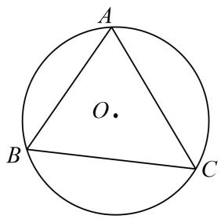
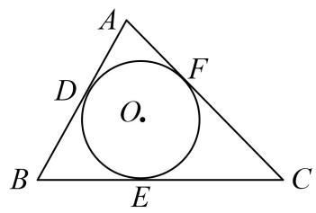
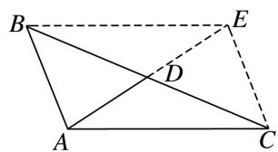
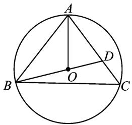
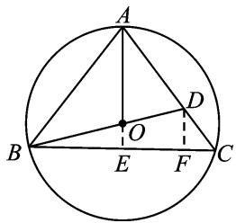
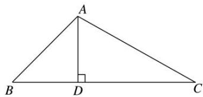
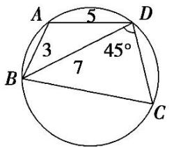
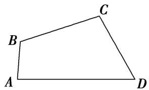
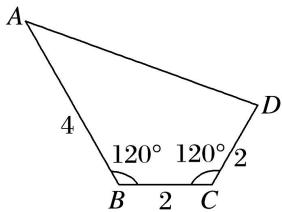

# 专题二 三角形的三线两圆及面积问题

# 一．中线

中线定理：一条中线两侧所对边的平方和等于底边平方的一半与该边中线平方的2倍.

即：如图，在 $\Delta ABC$ 中， $D$ 为 $BC$ 中点，则 $AB^{2} + AC^{2} = \frac{1}{2} BC^{2} + 2AD^{2}$

text_image

A
B
D
C

证明 在 $\Delta ABD$ 中， $\cos B = \frac{AB^2 + BD^2 - AD^2}{2AB \cdot BD}$ ，在 $\Delta ABC$ 中， $\cos B = \frac{AB^2 + BC^2 - AC^2}{2AB \cdot BC}$ .

$$
\therefore A B ^ {2} + A C ^ {2} = \frac {1}{2} B C ^ {2} + 2 A D ^ {2}.
$$

另外已知两边及其夹角也可表述为： $4AD^{2}=AB^{2}+AC^{2}+2AB\cdot AC\cdot\cos A$

证明 由 $\overrightarrow{AD} = \frac{1}{2} (\overrightarrow{AB} +\overrightarrow{AC})$ ， $\Rightarrow \overrightarrow{AD}^2 = \frac{1}{4} (\overrightarrow{AB} +\overrightarrow{AC})^2 = \frac{1}{4}\overrightarrow{AB}^2 +\frac{1}{4}\overrightarrow{AC}^2 +\frac{1}{2}\left|\overrightarrow{AB}\right|\left|\overrightarrow{AC}\right|\cos A$

$$
\therefore 4 A D ^ {2} = A B ^ {2} + A C ^ {2} + 2 A B \cdot A C \cdot \cos A.
$$

# 二．角平分线

角平分线定理：如图，在 $\Delta ABC$ 中， $AD$ 是 $\angle BAC$ 的平分线，则 $\frac{AB}{AC} = \frac{BD}{CD}$

text_image

A
B D C

证法1 在 $\Delta ABD$ 中， $\frac{AB}{\sin \angle ADB} = \frac{BD}{\sin \angle BAD}$ ，在 $\Delta ACD$ 中， $\frac{AC}{\sin \angle ADC} = \frac{CD}{\sin \angle CAD}$ ， $\therefore \frac{AB}{AC} = \frac{BD}{CD}$ .

证法2 该结论可以由两三角形面积之比得证，即 $\frac{S_{\triangle ABD}}{S_{\triangle ACD}} = \frac{AB}{AC} = \frac{BD}{CD}$ .

# 三．高

高的性质： $h_{1}$ ， $h_{2}$ ， $h_{3}$ 分别为 $\Delta ABC$ 边 a，b，c 上的高，则 $h_{1}:h_{2}:h_{3}=\frac{1}{a}:\frac{1}{b}:\frac{1}{c}=\frac{1}{\sin A}:\frac{1}{\sin B}:\frac{1}{\sin C}$ 求高一般采用等面积法，即求某边上的高，需要求出面积和底边长度.

# 四．外接圆

过三角形三个顶点的圆叫三角形的外接圆．其圆心叫做三角形的外心.

外接圆半径的计算： $R=\frac{a}{2\sin A}=\frac{b}{2\sin B}=\frac{c}{2\sin C}$ .

外接圆半径与三角形面积的关系： $S_{\triangle ABC}=\frac{abc}{4R}=(R$ 为 $\triangle ABC$ 外接圆半径).

text_image

A
O.
B
C

text_image

A
D
F
O.
B
E
C

# 五．内切圆

与三角形三边都相切的圆叫三角形的内切圆．其圆心叫做三角形的内心.

内切圆半径与三角形面积的关系： $S_{\triangle ABC}=\frac{1}{2}(a+b+c)\cdot r$ (r 为 $\triangle ABC$ 内切圆半径)，并可由此计算 r.

# 考点一 三角形的三线两圆问题

# 【例题选讲】

[例 1] (1) $\triangle ABC$ 中， $AC=\sqrt{7}$ ，BC=2， $B=60^{\circ}$ ，则 BC 边上的高等于()

A. $\frac{\sqrt{3}}{2}$

B. $\frac{3\sqrt{3}}{2}$

C. $\frac{\sqrt{3}+\sqrt{6}}{2}$

D. $\frac{\sqrt{3}+\sqrt{39}}{4}$

(2)在 $\triangle ABC$ 中，若 $AB=4$ ， $AC=7$ ， $BC$ 边的中线 $AD=\frac{7}{2}$ ，则 $BC=$ \_\_\_\_.

text_image

Geometric diagram of a parallelogram ABCD with diagonals and extended lines, labeled with points A, B, C, D, E.

(3)在 $\triangle ABC$ 中， $B=120^{\circ}$ ， $AB=\sqrt{2}$ ， $A$ 的角平分线 $AD=\sqrt{3}$ ，则 $AC=$ \_\_\_\_.

(4)在 $\triangle ABC$ 中，内角 $A$ ， $B$ ， $C$ 所对的边分别为 $a$ ， $b$ ， $c$ ，若 $\tan C=\frac{12}{5}$ ， $a=b=\sqrt{13}$ ， $BC$ 边上的中点为 $D$ ，则 $\sin\angle BAC=$ \_\_\_\_， $AD=$ \_\_\_\_。

(5)已知 $\triangle ABC$ 的内角 $A, B, C$ 所对的边分别为 $a, b, c, BC$ 边上的中线长为 $2\sqrt{2}$ ，高线长为 $\sqrt{3}$ ，且 $b\tan A=(2c-b)\tan B$ ，则 $bc$ 的值为\_\_\_\_.

(6)已知等腰三角形的底边长为 6，一腰长为 12，则它的内切圆面积为 \_\_\_\_.

(7)在 $\triangle ABC$ 中，内角 $A$ ， $B$ ， $C$ 的对边分别为 $a$ ， $b$ ， $c$ ．若 $\triangle ABC$ 的面积为 $S$ ，且 $a=1$ ， $4S=b^{2}+c^{2}-1$ ，则 $\triangle ABC$ 外接圆的面积为（）

A. $4\pi$

B. $2\pi$

C. $\pi$

D. $\frac{\pi}{2}$

(8)设 $\triangle ABC$ 内切圆与外接圆的半径分别为 $r$ 与 $R$ ,且 $\sin A:\sin B:\sin C=2:3:4$ ,则 $\cos C=$ \_\_\_\_;当 $BC=1$ 时, $\triangle ABC$ 的面积为\_\_\_\_.

(9)在 $\triangle ABC$ 中， $D$ 为边 $AC$ 上一点， $AB=AC=6$ ， $AD=4$ ，若 $\triangle ABC$ 的外心恰在线段 $BD$ 上，则 $BC=$ \_\_\_\_.

text_image

A
B
O
C
D

图1

text_image

Geometric diagram of triangle ABC with internal points D, E, F and intersection point O, labeled for mathematical analysis.

图2

text_image

A
B
O
E
F
C
D

图3

(10)已知 $\triangle ABC$ 的外接圆半径为 $R$ ，且满足 $2R(\sin^2 A - \sin^2 C) = (\sqrt{2} a - b) \cdot \sin B$ ，则 $\triangle ABC$ 面积的最大值为 \_\_\_\_.

# 【对点训练】

1. 在 $\triangle ABC$ 中， $AB=3$ ， $BC=\sqrt{13}$ ， $AC=4$ ，则 $AC$ 边上的高为\_\_\_\_。  
2. 如图所示, 在 $\triangle ABC$ 中, 已知 $BC = 15$ , $AB:AC = 7:8$ , $\sin B = \frac{4\sqrt{3}}{7}$ , 则 $BC$ 边上的高 $AD$ 的长为 \_\_\_\_.

text_image

A
B D C

3. (2016·全国III)在 $\triangle ABC$ 中， $B=\frac{\pi}{4}$ ， $BC$ 边上的高等于 $\frac{1}{3}BC$ ，则 $\cos A=(\quad)$

A. $\frac{3\sqrt{10}}{10}$

B. $\frac{\sqrt{10}}{10}$

C. $-\frac{\sqrt{10}}{10}$

D. $-\frac{3\sqrt{10}}{10}$

4. 在锐角 $\triangle ABC$ 中, 内角, 所对的边分别为 $a, b, c, b = 4, c = 6$ 且 $a\sin B = 2\sqrt{3}, D$ 为 $BC$ 的中点, 则 $AD$ 的长为 \_\_\_\_.  
5. 在 $\triangle ABC$ 中， $AB=7$ ， $AC=6$ ， $M$ 是 $BC$ 的中点， $AM=4$ ，则 $BC$ 等于\_\_\_\_。  
6. 在 $\triangle ABC$ 中， $AD$ 为边 $BC$ 上的中线， $AB=1$ ， $AD=5$ ， $\angle ABC=45^{\circ}$ ，则 $\sin\angle ADC=$ \_\_\_\_， $AC=$ \_\_\_\_.  
7. 在 $\triangle ABC$ 中，已知 $AB=\frac{4\sqrt{6}}{3}$ ， $\cos\angle ABC=\frac{\sqrt{6}}{6}$ ， $AC$ 边上的中线 $BD=\sqrt{5}$ ，则 $\sin A$ 的值\_\_\_\_。  
8．在△ABC中， $A=105^{\circ}$ ， $B=30^{\circ}$ ， $a=\frac{\sqrt{6}}{2}$ ，则B的角平分线的长是\_\_\_\_。  
9. 已知 $\triangle ABC$ 的内角 $A, B, C$ 的对边分别为 $a, b, c, A = 60^{\circ}, b = 3c$ , 角 $A$ 的平分线交 $BC$ 于点 $D$ , 且 $BD = \sqrt{7}$ , 则 $\cos \angle ADB$ 的值为 ( )

A. $-\frac{\sqrt{21}}{7}$

B. $\frac{\sqrt{21}}{7}$

C. $\frac{2\sqrt{7}}{7}$

D. $\pm\frac{\sqrt{21}}{7}$

10. 在 $\triangle ABC$ 中，角 $A, B, C$ 的对边分别是 $a, b, c$ ，已知 $A=\frac{\pi}{3}, b=1$ ， $\triangle ABC$ 的外接圆半径为1，则 $\triangle ABC$ 的面积 $S=$ \_\_\_\_.  
11. 在 $\triangle ABC$ 中，内角 $A$ ， $B$ ， $C$ 所对的边分别为 $a$ ， $b$ ， $c$ ， $a=1$ ， $B=45^{\circ}$ ， $S_{\triangle ABC}=2$ ，则 $\triangle ABC$ 的外接圆直径为\_\_\_\_。  
12. $\triangle ABC$ 的两边长分别为 2, 3, 其夹角的余弦值为 $\frac{1}{3}$ , 则其外接圆的直径为 \_\_\_\_.  
13. 已知三角形两边长分别为 1 和 $\sqrt{3}$ , 第三边上的中线长为 1, 则三角形的外接圆半径为 \_\_\_\_.

14. $\triangle ABC$ 的内角 $A, B, C$ 的对边分别为 $a, b, c$ , 若 $\cos C = \frac{2\sqrt{2}}{3}, b\cos A + a\cos B = 2$ , 则 $\triangle ABC$ 的外接圆面积为( )

A. $4\pi$

B. $8\pi$

C. $9\pi$

D. $36\pi$

15. 已知圆的半径为 4, a, b, c 为该圆的内接三角形的三边，若 $abc = 16\sqrt{2}$ ，则三角形的面积为 \_\_\_\_.

16. 如图所示, 已知圆内接四边形 $ABCD$ 中 $AB = 3$ , $AD = 5$ , $BD = 7$ , $\angle BDC = 45^{\circ}$ , 则 $BC =$ \_\_\_\_.

text_image

A
5
D
3
45°
B
7
C

17. 在外接圆半径为 $\frac{1}{2}$ 的 $\triangle ABC$ 中， $a, b, c$ 分别为内角 $A, B, C$ 的对边，且 $2a\sin A = (2b + c)\sin B + (2c + b)\sin C$ ，则 $b + c$ 的最大值是（）

A. 1

B. $\frac{1}{2}$

C. 3

D. $\frac{\sqrt{3}}{2}$

18. 在 $\triangle ABC$ 中, $a$ , $b$ , $c$ 分别为三个内角 $A$ , $B$ , $C$ 的对边, 且 $BC$ 边上的高为 $\frac{\sqrt{3}}{6} a$ , 则 $\frac{c}{b} + \frac{b}{c}$ 取得最大值时, 内角 $A$ 的值为( )

A. $\frac{\pi}{2}$

B. $\frac{\pi}{6}$

C. $\frac{2\pi}{3}$

D. $\frac{\pi}{3}$

# 考点二 计算三角形的面积

# 【方法总结】

# 三角形面积问题的题型及解题策略

三角形的面积是与解三角形息息相关的内容，经常出现在高考题中，难度不大．解题的前提条件是熟练掌握三角形面积公式，具体的题型及解题策略为：

(1)利用正弦定理、余弦定理解三角形，求出三角形的有关元素之后，直接求三角形的面积，或求出两边之积及夹角正弦，再求解.  
(2)把面积作为已知条件之一，与正弦定理、余弦定理结合求出三角形的其他各量．面积公式中涉及面积、两边及两边夹角正弦四个量，结合已知条件列方程求解.

# 【例题选讲】

[例 2](1)(2014·福建)在 $\triangle ABC$ 中， $A=60^{\circ}$ ，AC=4， $BC=2\sqrt{3}$ ，则 $\triangle ABC$ 的面积等于\_\_\_\_.

(2)(2019·全国II)△ABC 的内角内角 A, B, C 所对的边分别是 a, b, c. 若 b=6, a=2c, $B=\frac{\pi}{3}$ ，则 △BDC 的面积是 \_\_\_\_.  
(3)(2018·全国 I) 在 $\triangle ABC$ 中，内角 $A, B, C$ 所对的边分别是 $a, b, c$ ，已知 $b\sin C + c\sin B = 4a\sin B\sin C$ ， $b^2 + c^2 - a^2 = 8$ ，则 $\triangle ABC$ 的面积为 \_\_\_\_.  
(4)(2017·浙江)已知 $\triangle ABC$ ， $AB=AC=4$ ， $BC=2$ 。点 $D$ 为 $AB$ 延长线上一点， $BD=2$ ，连接 $CD$ ，则 $\triangle BDC$ 的面积是 $\_$ ， $\cos\angle BDC=\_$ 。

(5) $\triangle ABC$ 的内角 A, B, C 的对边分别为 a, b, c，若 $\cos A = \frac{4}{5}$ ， $\cos C = \frac{5}{13}$ ，a = 1，则 $\triangle ABC$ 的面积 S = \_\_\_\_.

(6)在 $\triangle ABC$ 中， $A, B, C$ 的对边分别为 $a, b, c$ ，且 $b\cos C=3a\cos B-c\cos B$ ， $\vec{BA}\cdot\vec{BC}=2$ ，则 $\triangle ABC$ 的面积为\_\_\_\_.

(7) $\triangle ABC$ 的内角 A, B, C 的对边分别为 a, b, c. 已知 $\sin(B+A)+\sin(B-A)=2\sin2A$ ，且 $c=\sqrt{6}$ ， $C=\frac{\pi}{3}$ ，则 $\triangle ABC$ 的面积是()

A. $\sqrt{3}$

B. $3 \sqrt{3}$

C. $\sqrt{3}$ 或 1

D. $\sqrt{3}$ 或 $3\sqrt{3}$

(8)已知四边形 ABCD 中，AB=2，BC=CD=4，DA=6，且 $D=60^{\circ}$ ，试求四边形 ABCD 的面积.

natural_image

Simple geometric diagram of a quadrilateral labeled ABCD with no additional text or symbols

# 【对点训练】

1. 我国南宋著名数学家秦九韶发现了从三角形三边求三角形面积的“三斜公式”，设 $\triangle ABC$ 三个内角 $A, B,$ $C$ 所对的边分别为 $a, b, c$ ，面积为 $S$ ，则“三斜求积”公式为 $S = \sqrt{\frac{1}{4}\left[a^2c^2 - \left(\frac{a^2 + c^2 - b^2}{2}\right)^2\right]}$ . 若 $a^2\sin C = 4\sin A, (a + c)^2 = 12 + b^2$ ，则用“三斜求积”公式求得 $\triangle ABC$ 的面积为（）

A. $\sqrt{3}$

B. 2

C. 3

D. $\sqrt{6}$

2. 在 $\triangle ABC$ 中，内角 $A, B, C$ 对应的边分别为 $a, b, c$ ，已知 $a = 2, c = 2\sqrt{2}$ ，且 $C = \frac{\pi}{4}$ ，则 $\triangle ABC$ 的面积为（）

A. $\sqrt{3} + 1$

B. $\sqrt{3} - 1$

C. 4

D. 2

3. (2013·全国Ⅱ)△ABC 的内角 A, B, C 的对边分别为 a, b, c, 已知 $b=2$ , $B=\frac{\pi}{6}$ , $C=\frac{\pi}{4}$ , 则 △ABC 的面积为( )

A. $2 \sqrt{3} + 2$

B. $\sqrt{3}+1$

C. $2\sqrt{3}-2$

D. $\sqrt{3}-1$

4. 已知在 $\triangle ABC$ 中，内角 $A, B, C$ 所对的边分别为 $a, b, c$ 。若 $a=2b\cos A, B=\frac{\pi}{3}, c=1$ ，则 $\triangle ABC$ 的面积为\_\_\_\_。

5. 在 $\triangle ABC$ 中，内角 $A, B, C$ 的对边分别为 $a, b, c$ 。已知 $\cos A=\frac{2}{3}$ ， $\sin B=\sqrt{5}\cos C$ ，并且 $a=\sqrt{2}$ ，则 $\triangle ABC$ 的面积为\_\_\_\_。

6. 在 $\triangle ABC$ 中，角 $A, B, C$ 所对的边分别为 $a, b, c$ ，且 $(2b - a)\cos C = c\cos A, c = 3, \sin A + \sin B = 2\sqrt{6}$ $\sin A\sin B$ ，则 $\triangle ABC$ 的面积为（）

A. $\frac{3\sqrt{3}}{8}$

B. 2

C. $\frac{\sqrt{3}}{2}$

D. $\frac{3\sqrt{3}}{4}$

7. 在 $\triangle ABC$ 中， $c=2\sqrt{2}$ ， $a>b$ ， $\tan A+\tan B=5$ ， $\tan A\tan B=6$ ，则 $\triangle ABC$ 的面积为\_\_\_\_。

8. 在 $\triangle ABC$ 中, 内角 $A, B, C$ 的对边分别为 $a, b, c$ , 已知 $a = 1, 2b - \sqrt{3}c = 2a\cos C, \sin C = \frac{\sqrt{3}}{2}$ , 则 $\triangle ABC$ 的面积为 ( )

A. $\frac{\sqrt{3}}{2}$

B. $\frac{\sqrt{3}}{4}$

C. $\frac{\sqrt{3}}{2}$ 或 $\frac{\sqrt{3}}{4}$

D. $\sqrt{3}$ 或 $\frac{\sqrt{3}}{2}$

9. 在 $\triangle ABC$ 中，若 $a=7, b=3, c=8$ ，则其面积等于 \_\_\_\_.

10. (2014·江西)在 $\triangle ABC$ 中, 内角 $A, B, C$ 所对的边分别是 $a, b, c$ . 若 $c^{2}=(a-b)^{2}+6, C=\frac{\pi}{3}$ , 则 $\triangle ABC$ 的面积是( )

A. 3

B. $\frac{9\sqrt{3}}{2}$

C. $\frac{3\sqrt{3}}{2}$

D. $3\sqrt{3}$

11. 设 $\triangle ABC$ 的内角 $A, B, C$ 的对边分别为 $a, b, c$ , 已知 $a = 2\sqrt{2}, \cos A = \frac{3}{4}, \sin B = 2\sin C$ , 则 $\triangle ABC$ 的面积是 \_\_\_\_.

12. 在 $\triangle ABC$ 中，内角 $A, B, C$ 的对边分别为 $a, b, c$ ，若 $a=1, b=2, \cos B=\frac{1}{4}$ ，则 $c=$ \_\_\_\_； $\triangle ABC$ 的面积 $S=$ \_\_\_\_.

13. 在 $\triangle ABC$ 中，角 $A, B, C$ 的对边分别为 $a, b, c$ ，若 $b=5, a=3, \cos(B-A)=\frac{7}{9}$ ，则 $\triangle ABC$ 的面积为（）

A. $\frac{15}{2}$

B. $\frac{5\sqrt{2}}{3}$

C. $5\sqrt{2}$

D. $2\sqrt{2}$

14. 如图, 在四边形 $ABCD$ 中, $B = C = 120^{\circ}$ , $AB = 4$ , $BC = CD = 2$ , 则该四边形的面积等于

text_image

A
4
120° 120° 2
B 2 C
D

