# 专题二 三角形的三线两圆及面积问题

# 一．中线

中线定理：一条中线两侧所对边的平方和等于底边平方的一半与该边中线平方的2倍.
即：如图，在 $\Delta ABC$ 中， $D$ 为 $BC$ 中点，则 $AB^{2} + AC^{2} = \frac{1}{2} BC^{2} + 2AD^{2}$

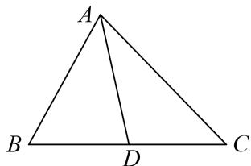
证明 在 $\Delta ABD$ 中， $\cos B = \frac{AB^2 + BD^2 - AD^2}{2AB \cdot BD}$ ，在 $\Delta ABC$ 中， $\cos B = \frac{AB^2 + BC^2 - AC^2}{2AB \cdot BC}$ .
$\therefore A B ^ {2} + A C ^ {2} = \frac {1}{2} B C ^ {2} + 2 A D ^ {2}.$

另外已知两边及其夹角也可表述为： $4AD^{2}=AB^{2}+AC^{2}+2AB\cdot AC\cdot\cos A$
证明 由 $\overrightarrow{AD} = \frac{1}{2} (\overrightarrow{AB} +\overrightarrow{AC})$ ， $\Rightarrow \overrightarrow{AD}^2 = \frac{1}{4} (\overrightarrow{AB} +\overrightarrow{AC})^2 = \frac{1}{4}\overrightarrow{AB}^2 +\frac{1}{4}\overrightarrow{AC}^2 +\frac{1}{2}\left|\overrightarrow{AB}\right|\left|\overrightarrow{AC}\right|\cos A$
$\therefore 4 A D ^ {2} = A B ^ {2} + A C ^ {2} + 2 A B \cdot A C \cdot \cos A.$

# 二．角平分线

角平分线定理：如图，在 $\Delta ABC$ 中， $AD$ 是 $\angle BAC$ 的平分线，则 $\frac{AB}{AC} = \frac{BD}{CD}$

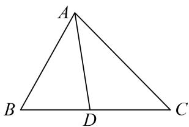

证法1 在 $\Delta ABD$ 中， $\frac{AB}{\sin \angle ADB} = \frac{BD}{\sin \angle BAD}$ ，在 $\Delta ACD$ 中， $\frac{AC}{\sin \angle ADC} = \frac{CD}{\sin \angle CAD}$ ， $\therefore \frac{AB}{AC} = \frac{BD}{CD}$ .

证法2 该结论可以由两三角形面积之比得证，即 $\frac{S_{\triangle ABD}}{S_{\triangle ACD}} = \frac{AB}{AC} = \frac{BD}{CD}$ .

# 三．高

高的性质： $h_{1}$ ， $h_{2}$ ， $h_{3}$ 分别为 $\Delta ABC$ 边 a，b，c 上的高，则 $h_{1}:h_{2}:h_{3}=\frac{1}{a}:\frac{1}{b}:\frac{1}{c}=\frac{1}{\sin A}:\frac{1}{\sin B}:\frac{1}{\sin C}$ 求高一般采用等面积法，即求某边上的高，需要求出面积和底边长度.

# 四．外接圆

过三角形三个顶点的圆叫三角形的外接圆．其圆心叫做三角形的外心.

外接圆半径的计算： $R=\frac{a}{2\sin A}=\frac{b}{2\sin B}=\frac{c}{2\sin C}.$

外接圆半径与三角形面积的关系： $S_{\triangle ABC}=\frac{abc}{4R}=(R$ 为 $\triangle ABC$ 外接圆半径).

# 五．内切圆

与三角形三边都相切的圆叫三角形的内切圆．其圆心叫做三角形的内心.

内切圆半径与三角形面积的关系： $S_{\triangle ABC}=\frac{1}{2}(a+b+c)\cdot r$ (r 为 $\triangle ABC$ 内切圆半径)，并可由此计算 r.

# 考点一 三角形的三线两圆问题

# 【例题选讲】

[例 1] （1） $\triangle ABC$ 中， $AC=\sqrt{7}$ ，BC=2， $B=60^{\circ}$ ，则 BC 边上的高等于()

A. $\frac{\sqrt{3}}{2}$

B. $\frac{3\sqrt{3}}{2}$

C. $\frac{\sqrt{3} + \sqrt{6}}{2}$

D. $\frac{\sqrt{3} + \sqrt{39}}{4}$
答案 B 解析 设 AB=a，则由 $AC^{2}=AB^{2}+BC^{2}-2AB\cdot BC\cdot\cos B$ 知 $7=a^{2}+4-2a$ ，即 $a^{2}-2a-3=0$ ，∴ a=3（负值舍去）。∴ BC 边上的高为 $AB\cdot\sin B=3\times\frac{\sqrt{3}}{2}=\frac{3\sqrt{3}}{2}$ .  
（2）在 $\triangle ABC$ 中，若 $AB=4$ ， $AC=7$ ， $BC$ 边的中线 $AD=\frac{7}{2}$ ，则 $BC=$ \_\_\_\_.
答案 9 解析 如图所示，延长 AD 到 E，使 DE=AD，连接 BE，EC。因为 AD 是 BC 边上的中线，所以 AE 与 BC 互相平分，所以四边形 ACEB 是平行四边形，所以 BE=AC=7。又 AB=4，AE=2AD=7，所以在 $\triangle ABE$ 中，由余弦定理得， $AE^{2}=49=AB^{2}+BE^{2}-2AB\cdot BE\cdot\cos\angle ABE=AB^{2}+AC^{2}-2AB\cdot AC\cdot\cos\angle ABE$ 。在 $\triangle ABC$ 中，由余弦定理得， $BC^{2}=AB^{2}+AC^{2}-2AB\cdot AC\cdot\cos(\pi-\angle ABE)$ ，∴ $49+BC^{2}=2(AB^{2}+AC^{2})=2(16+49)$ ，∴ $BC^{2}=81$ ，∴ BC=9。

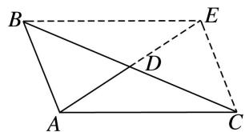  
（3）在 $\triangle ABC$ 中， $B=120^{\circ}$ ， $AB=\sqrt{2}$ ， $A$ 的角平分线 $AD=\sqrt{3}$ ，则 $AC=$ \_\_\_\_.
答案 $\sqrt{6}$ 解析 如图，在 $\triangle ABD$ 中，由正弦定理，得 $\frac{AD}{\sin B}=\frac{AB}{\sin\angle ADB},\therefore\sin\angle ADB=\frac{\sqrt{2}}{2}.$

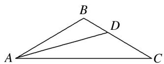
由题意知 $0^{\circ} < \angle ADB < 60^{\circ}$ , $\therefore \angle ADB = 45^{\circ}$ , $\therefore \angle BAD = 180^{\circ} - 45^{\circ} - 120^{\circ} = 15^{\circ}$ . $\therefore \angle BAC = 30^{\circ}$ , $C = 30^{\circ}$ , $\therefore BC = AB = \sqrt{2}$ . 在 $\triangle ABC$ 中, 由正弦定理, 得 $\frac{AC}{\sin B} = \frac{BC}{\sin \angle BAC}$ , $\therefore AC = \sqrt{6}$ .  
（4）在 $\triangle ABC$ 中，内角 $A$ ， $B$ ， $C$ 所对的边分别为 $a$ ， $b$ ， $c$ ，若 $\tan C=\frac{12}{5}$ ， $a=b=\sqrt{13}$ ， $BC$ 边上的中点为 $D$ ，则 $\sin \angle BAC=$ \_\_\_\_， $AD=$ \_\_\_\_。
答案 $\frac{3\sqrt{13}}{13}$ $\frac{3\sqrt{5}}{2}$ 解析 因为 $\tan C = \frac{12}{5}$ ，所以 $\sin C = \frac{12}{13}$ ， $\cos C = \frac{5}{13}$ ，又 $a = b = \sqrt{13}$ ，所以 $c^2 = a^2 + b^2 - 2ab\cos C = 13 + 13 - 2\times \sqrt{13}\times \sqrt{13}\times \frac{5}{13} = 16$ ，所以 $c = 4$ 。由 $\frac{a}{\sin\angle BAC} = \frac{c}{\sin C}$ ，得 $\frac{\sqrt{13}}{\sin\angle BAC} = \frac{4}{\frac{12}{13}}$ ，解得 $\sin \angle BAC = \frac{3\sqrt{13}}{13}$ 。因为 $BC$ 边上的中点为 $D$ ，所以 $CD = \frac{a}{2}$ ，所以在 $\triangle ACD$ 中， $AD^2 = b^2 + \left(\frac{a}{2}\right)^2 - 2\times b\times \frac{a}{2}\times \cos C = \frac{45}{4}$ ，所以 $AD = \frac{3\sqrt{5}}{2}$ 。  
（5）已知 $\triangle ABC$ 的内角 $A, B, C$ 所对的边分别为 $a, b, c, BC$ 边上的中线长为 $2\sqrt{2}$ ，高线长为 $\sqrt{3}$ ，且 $b\tan A=(2c-b)\tan B$ ，则 $bc$ 的值为\_\_\_\_.
答案 8 解析 因为 $b \tan A = (2c - b) \tan B$ ，所以 $\frac{\tan A}{\tan B} = \frac{2c}{b} - 1$ ，所以 $1 + \frac{\tan A}{\tan B} = \frac{2c}{b}$ ，根据正弦定理，得 $1 + \frac{\sin A \cos B}{\sin B \cos A} = \frac{2 \sin C}{\sin B}$ ，即 $\frac{\sin A + B}{\sin B \cos A} = \frac{2 \sin C}{\sin B}$ 。因为 $\sin(A + B) = \sin C \neq 0, \sin B \neq 0$ ，所以 $\cos A = \frac{1}{2}$ ，所以 $A = \frac{\pi}{3}$ 。设 $BC$ 边上的中线为 $AM$ ，则 $AM = 2\sqrt{2}$ ，因为 $M$ 是 $BC$ 的中点，所以 $\overrightarrow{AM} = \frac{1}{2} (\overrightarrow{AB} + \overrightarrow{AC})$ ，即 $\overrightarrow{AM^2} = \frac{1}{4} (\overrightarrow{AB^2} + \overrightarrow{AC^2} + 2\overrightarrow{AB}\cdot \overrightarrow{AC})$ ，所以 $c^2 + b^2 + bc = 32$ ①。设 $BC$ 边上的高线为 $AH$ ，由 $S_{\triangle ABC} = \frac{1}{2} AH\cdot BC = \frac{1}{2} bc\cdot \sin A$ ，得 $\frac{\sqrt{3}}{4} bc = \frac{\sqrt{3}a}{2}$ ，即 $bc = 2a$ ②，根据余弦定理，得 $a^2 = c^2 + b^2 - bc$ ③，联立①②③得 $\left(\frac{bc}{2}\right)^2 = 32 - 2bc$ ，解得 $bc = 8$ 或 $bc = -16$ （舍去）。  
（6）已知等腰三角形的底边长为 6，一腰长为 12，则它的内切圆面积为 \_\_\_\_.
答案 $\frac{27\pi}{5}$ 解析 不妨设 $a = 6, b = c = 12$ ，由余弦定理得 $\cos A = \frac{b^2 + c^2 - a^2}{2bc} = \frac{12^2 + 12^2 - 6^2}{2\times 12\times 12} = \frac{7}{8}, \therefore \sin A = \sqrt{1 - \left(\frac{7}{8}\right)^2} = \frac{\sqrt{15}}{8}$ . 由 $\frac{1}{2}(a + b + c)r = \frac{1}{2} bc\sin A$ ，得 $r = \frac{3\sqrt{15}}{5}$ . $\therefore S_{\text{内切圆}} = \pi r^2 = \frac{27\pi}{5}$ .  
（7）在 $\triangle ABC$ 中，内角 $A$ ， $B$ ， $C$ 的对边分别为 $a$ ， $b$ ， $c$ ．若 $\triangle ABC$ 的面积为 $S$ ，且 $a=1$ ， $4S=b^{2}+c^{2}-1$ ，则 $\triangle ABC$ 外接圆的面积为（）

A. $4\pi$

B. $2\pi$

C. $\pi$

D. $\frac{\pi}{2}$
答案 D 解析 由余弦定理得, $b^{2}+c^{2}-a^{2}=2bc\cos A,a=1$ ,所以 $b^{2}+c^{2}-1=2bc\cos A$ ,又 $S=\frac{1}{2}bc\sin A$ , $4S=b^{2}+c^{2}-1$ ,所以 $4\times\frac{1}{2}bc\sin A=2bc\cos A$ ,即 $\sin A=\cos A$ ,所以 $A=\frac{\pi}{4}$ ,由正弦定理得, $\frac{1}{\sin\frac{\pi}{4}}=2R$ ,得 $R=\frac{\sqrt{2}}{2}$ ,所以 $\triangle ABC$ 外接圆的面积为 $\frac{\pi}{2}$ .  
（8）设 $\triangle ABC$ 内切圆与外接圆的半径分别为 $r$ 与 $R$ ,且 $\sin A:\sin B:\sin C=2:3:4$ ,则 $\cos C=$ \_\_\_\_;当 $BC=1$ 时, $\triangle ABC$ 的面积为\_\_\_\_.
答案 $-\frac{1}{4} \frac{3\sqrt{15}}{16}$ 解析 $\because \sin A: \sin B: \sin C = 2:3:4, \therefore$ 由正弦定理得 $a:b:c=2:3:4$ . 令 $a = 2t, b=3t, c=4t$ , 则 $\cos C = \frac{4t^2 + 9t^2 - 16t^2}{12t^2} = -\frac{1}{4}, \therefore \sin C = \frac{\sqrt{15}}{4}$ . 当 $BC=1$ 时, $AC=\frac{3}{2}, \therefore S_{\triangle ABC} = \frac{1}{2} \times 1 \times \frac{3}{2} \times \frac{\sqrt{15}}{4} = \frac{3\sqrt{15}}{16}$ .  
（9）在 $\triangle ABC$ 中， $D$ 为边 $AC$ 上一点， $AB=AC=6$ ， $AD=4$ ，若 $\triangle ABC$ 的外心恰在线段 $BD$ 上，则 $BC=$ \_\_\_\_.
答案 $3\sqrt{6}$ 解析 解法1 如图1，设 $\triangle ABC$ 的外心为 $O$ ，连结 $AO$ ，则 $AO$ 是 $\angle BAC$ 的平分线，所以 $\frac{BO}{OD} = \frac{AB}{AD} = \frac{3}{2}$ ，所以 $\overrightarrow{AO} = \overrightarrow{AB} +\overrightarrow{BO} = \overrightarrow{AB} +\frac{3}{5}\overrightarrow{BD} = \overrightarrow{AB} +\frac{3}{5} (\overrightarrow{AD} -\overrightarrow{AB})$ ，即 $\overrightarrow{AO} = \frac{2}{5}\overrightarrow{AB} +\frac{3}{5}\overrightarrow{AD}$ ，两边同时点乘 $\overrightarrow{AB}$ 得 $\overrightarrow{AO}\cdot \overrightarrow{AB} = \frac{2}{5} (\overrightarrow{AB})^2 +\frac{3}{5}\overrightarrow{AB}\cdot \overrightarrow{AD}$ ，即 $18 = \frac{2}{5}\times 36 + \frac{3}{5}\times 6\times 4\cos \angle BAC$ ，所以 $\cos \angle BAC = \frac{1}{4}$ 则 $BC = \sqrt{36 + 36 - 2\times 6^2\times\frac{1}{4}}$ $= 3\sqrt{6}$ .（说明：两边同时点乘 $\overrightarrow{AD}$ 也是一样的）
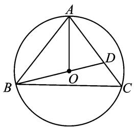

图1

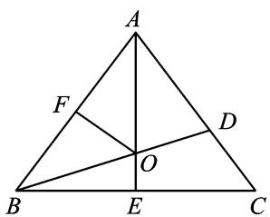

图2

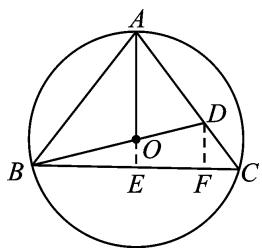

图3

解法2 如图2，设 $\angle BAC = 2\alpha$ ，外接圆的半径为 $R$ ，由 $S_{\triangle ABO} + S_{\triangle ADO} = S_{\triangle ABD}$ ，得 $\frac{1}{2}\cdot 6R\sin \alpha +\frac{1}{2}\cdot 4R\sin \alpha$ $= \frac{1}{2}\cdot 6\cdot 4\sin 2\alpha$ ，化简得 $24\cos \alpha = 5R$ 。在 Rt△AFO 中， $R\cos \alpha = 3$ ，联立解得 $R = \frac{6}{5}\sqrt{10},\cos \alpha = \sqrt{\frac{5}{8}}$ ，所以 $\sin \alpha$ $= \sqrt{\frac{3}{8}}$ ，所以 $BC = 2BE = 2AB\sin \alpha = 12\times \sqrt{\frac{3}{8}} = 3\sqrt{6}.$
解法3 如图3，延长 $AO$ 交 $BC$ 于点 $E$ ，过点 $D$ 作 $BC$ 的垂线，垂足为 $F$ ，则 $\frac{BO}{OD} = \frac{AB}{AD} = \frac{3}{2},\frac{OE}{DF} = \frac{BO}{BD} = \frac{3}{5}$ 又 $DF / / AE$ ，则 $\frac{DF}{AE} = \frac{CD}{CA} = \frac{1}{3}$ 所以 $\frac{OE}{AE} = \frac{1}{5}$ 设 $OE = x$ ，则 $AE = 5x$ ，所以 $OB = OA = 4x$ ，所以 $BE = \sqrt{15} x.$ 又因为 $25x^{2} + 15x^{2} = 36$ ，所以 $x = 3\sqrt{\frac{1}{10}}$ ，所以 $BC = 2BE = 3\sqrt{6}$  
（10）已知 $\triangle ABC$ 的外接圆半径为 $R$ ，且满足 $2R(\sin^2 A - \sin^2 C) = (\sqrt{2} a - b) \cdot \sin B$ ，则 $\triangle ABC$ 面积的最大值为 \_\_\_\_.
答案 $\frac{\sqrt{2} + 1}{2} R^2$ 解析 由正弦定理得 $a^2 - c^2 = (\sqrt{2} a - b)b$ ，即 $a^2 + b^2 - c^2 = \sqrt{2} ab$ 。由余弦定理得 $\cos C = \frac{a^2 + b^2 - c^2}{2ab} = \frac{\sqrt{2}ab}{2ab} = \frac{\sqrt{2}}{2}$ ， $\because C \in (0, \pi)$ ， $\therefore C = \frac{\pi}{4}$ 。 $\therefore S = \frac{1}{2} ab\sin C = \frac{1}{2} \times 2R\sin A \cdot 2R\sin B \cdot \frac{\sqrt{2}}{2} = \sqrt{2}R^2\sin A\sin B$ $= \sqrt{2}R^2\sin A\sin\left(\frac{3\pi}{4} - A\right) = \sqrt{2}R^2\sin A\left(\frac{\sqrt{2}}{2}\cos A + \frac{\sqrt{2}}{2}\sin A\right) = R^2(\sin A\cos A + \sin^2A) = R^2\left(\frac{1}{2}\sin 2A + \frac{1 - \cos 2A}{2}\right) =$
$R ^ {2} \left[ \frac {\sqrt {2}}{2} \sin \left(2 A - \frac {\pi}{4}\right) + \frac {1}{2} \right], \because A \in \left(0, \frac {3 \pi}{4}\right), \therefore 2 A - \frac {\pi}{4} \in \left(- \frac {\pi}{4}, \frac {5 \pi}{4}\right), \therefore \sin \left(2 A - \frac {\pi}{4}\right) \in \left(- \frac {\sqrt {2}}{2}, 1 \right], \therefore S \in \left(0, \frac {\sqrt {2} + 1}{2} R ^ {2} \right],$
∴面积 S 的最大值为 $\frac{\sqrt{2}+1}{2}R^{2}$ .

# 【对点训练】

1. 在 $\triangle ABC$ 中， $AB=3$ ， $BC=\sqrt{13}$ ， $AC=4$ ，则 $AC$ 边上的高为\_\_\_\_。

1. 答案 $\frac{3\sqrt{3}}{2}$ 解析 由余弦定理可知 $13 = 9 + 16 - 2 \times 3 \times 4 \times \cos A$ ，得 $\cos A = \frac{1}{2}$ ，又 $A$ 为三角形的内角， $\therefore A = \frac{\pi}{3}, \therefore h = AB \cdot \sin A = \frac{3\sqrt{3}}{2}$ .

2. 如图所示, 在 $\triangle ABC$ 中, 已知 $BC = 15$ , $AB:AC = 7:8$ , $\sin B = \frac{4\sqrt{3}}{7}$ , 则 $BC$ 边上的高 $AD$ 的长为 \_\_\_\_.

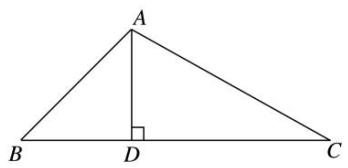

2. 答案 $12\sqrt{3}$ 或 $20\sqrt{3}$ 解析 在 $\triangle ABC$ 中，由已知设 $AB = 7x$ ， $AC = 8x$ ， $x > 0$ ，由正弦定理，得 $\frac{7x}{\sin C} = \frac{8x}{\sin B}$ ， $\therefore \sin C = \frac{7x \cdot \sin B}{8x} = \frac{7}{8} \times \frac{4\sqrt{3}}{7} = \frac{\sqrt{3}}{2}$ . 又 $\because 0^\circ < C < 180^\circ$ ， $\therefore C = 60^\circ$ 或 $120^\circ$ 。若 $C = 120^\circ$ ，由 $8x > 7x$ ，知 $B$ 也为钝角，不合题意，故 $C \neq 120^\circ$ 。 $\therefore C = 60^\circ$ 。由余弦定理，得 $(7x)^2 = (8x)^2 + 15^2 - 2 \times 8x \times 15\cos 60^\circ$ ， $\therefore x^2 - 8x + 15 = 0$ ，解得 $x = 3$ 或 $x = 5$ 。 $\therefore AB = 21$ 或 $AB = 35$ 。在 Rt $\triangle ADB$ 中， $AD = AB\sin B = \frac{4\sqrt{3}}{7} AB$ ， $\therefore AD = 12\sqrt{3}$ 或 $20\sqrt{3}$ 。

3. (2016·全国III)在 $\triangle ABC$ 中， $B=\frac{\pi}{4}$ ， $BC$ 边上的高等于 $\frac{1}{3}BC$ ，则 $\cos A=(\quad)$

A. $\frac{3\sqrt{10}}{10}$

B. $\frac{\sqrt{10}}{10}$

C. $-\frac{\sqrt{10}}{10}$

D. $-\frac{3\sqrt{10}}{10}$

3. 答案 C 解析 设 $\triangle ABC$ 中角 $A, B, C$ 所对的边分别为 $a, b, c$ , 则由题意得 $S_{\triangle ABC} = \frac{1}{2} a \cdot \frac{1}{3} a = \frac{1}{2} ac \sin B$ , 又 $B = \frac{\pi}{4}$ , 所以 $c = \frac{\sqrt{2}}{3} a$ . 由余弦定理得 $b^2 = a^2 + c^2 - 2ac \cos B = a^2 + \frac{2}{9} a^2 - 2 \times a \times \frac{\sqrt{2}}{3} a \times \frac{\sqrt{2}}{2} = \frac{5}{9} a^2$ , 所以 $b = \frac{\sqrt{5}}{3} a$ . 所以 $\cos A = \frac{b^2 + c^2 - a^2}{2bc} = \frac{\frac{5}{9} a^2 + \frac{2}{9} a^2 - a^2}{2 \times \frac{\sqrt{5}}{3} a \times \frac{\sqrt{2}}{3} a} = -\frac{\sqrt{10}}{10}$ .

另解 设 BC 边上的高 AD 交 BC 于点 D，由题意知 $B=\frac{\pi}{4}$ ， $BD=\frac{1}{3}BC$ ， $DC=\frac{2}{3}BC$ ， $\tan\angle BAD=1$ ， $\tan\angle CAD=2$ ， $\tan A=\frac{1+2}{1-1\times2}=-3$ ，所以 $\cos A=-\frac{\sqrt{10}}{10}$ .

4. 在锐角 $\triangle ABC$ 中, 内角, 所对的边分别为 $a, b, c, b = 4, c = 6$ 且 $a\sin B = 2\sqrt{3}, D$ 为 $BC$ 的中点, 则 $AD$ 的长为 \_\_\_\_.

4. 答案 $\sqrt{19}$ 解析 方法1 由正弦定理 $\frac{a}{\sin A} = \frac{b}{\sin B}$ 可得 $b\sin A = a\sin B = 2\sqrt{3}$ ，又由 $b = 4$ ，可得
$\sin A = \frac{\sqrt{3}}{2}$ ，又由锐角 $\triangle ABC$ ，可得 $A = \frac{\pi}{3}$ ，由 $D$ 为 $BC$ 的中点可得 $\overrightarrow{AD} = \frac{1}{2} (\overrightarrow{AB} + \overrightarrow{AC})$ ，两边平方可得 $AD^2 = \frac{1}{4} (AB^2 + AC^2 + 2AB \cdot AC \cos A) = 19$ ，即 $AD = \sqrt{19}$ .
方法2 由正弦定理 $\frac{a}{\sin A} = \frac{b}{\sin B}$ 可得 $b\sin A = a\sin B = 2\sqrt{3}$ ，又由 $b = 4$ ，可得 $\sin A = \frac{\sqrt{3}}{2}$ ，又由锐角 $\triangle ABC$ ，可得 $A = \frac{\pi}{3}$ ，在 $\triangle ABC$ 中，由余弦定理可得 $BC^2 = AB^2 + AC^2 - 2AB \cdot AC \cos A = 28$ ，即 $BC = 2\sqrt{7}$ ， $\cos B = \frac{AB^2 + BC^2 - AB^2}{2AB \cdot BC} = \frac{2}{\sqrt{7}}$ ，所以在 $\triangle ABD$ 中，由余弦定理可得 $AD^2 = AB^2 + BD^2 - 2AB \cdot BD \cos B = 19$ ，即 $AD = \sqrt{19}$ 。

5. 在 $\triangle ABC$ 中， $AB=7$ ， $AC=6$ ， $M$ 是 $BC$ 的中点， $AM=4$ ，则 $BC$ 等于\_\_\_\_。  
5. 答案 $\sqrt{106}$ 解析 设 $BC = a$ ，则 $BM = CM = \frac{a}{2}$ . 在 $\triangle ABM$ 中， $AB^2 = BM^2 + AM^2 - 2BM \cdot AM\cos \angle AMB$ 即 $7^2 = \frac{a^2}{4} + 4^2 - 2 \times \frac{a}{2} \times 4 \cdot \cos \angle AMB$ . ①，在 $\triangle ACM$ 中， $AC^2 = AM^2 + CM^2 - 2AM \cdot CM \cdot \cos \angle AMC$ ，即 $6^2 = 4^2 + \frac{a^2}{4} + 2 \times 4 \times \frac{a}{2} \cdot \cos \angle AMB$ . ②，①+②得 $7^2 + 6^2 = 4^2 + 4^2 + \frac{a^2}{2}$ ， $\therefore a = \sqrt{106}$ .  
6. 在 $\triangle ABC$ 中， $AD$ 为边 $BC$ 上的中线， $AB=1$ ， $AD=5$ ， $\angle ABC=45^{\circ}$ ，则 $\sin\angle ADC=$ \_\_\_\_， $AC=$ \_\_\_\_.  
6. 答案 $\frac{\sqrt{2}}{10} \sqrt{113}$ 解析 在 $\triangle ABD$ 中，由正弦定理，得 $\frac{AD}{\sin \angle ABC} = \frac{AB}{\sin \angle ADB}$ ，所以 $\sin \angle ADB = \frac{AB}{AD} \times \sin \angle ABC = \frac{1}{5} \times \sin 45^{\circ} = \frac{\sqrt{2}}{10}$ ，所以 $\sin \angle ADC = \sin (180^{\circ} - \angle ADB) = \sin \angle ADB = \frac{\sqrt{2}}{10}$ . 由余弦定理，得 $AD^{2} = AB^{2} + BD^{2} - 2AB \cdot BD\cos \angle ABD$ ，所以 $5^{2} = 1^{2} + BD^{2} - 2BD\cos 45^{\circ}$ ，得 $BD = 4\sqrt{2}$ ，因为 $AD$ 为 $\triangle ABC$ 的边 $BC$ 上的中线，所以 $BC = 2BD = 8\sqrt{2}$ . 在 $\triangle ABC$ 中，由余弦定理，得 $AC^{2} = AB^{2} + BC^{2} - 2AB \cdot BC\cos \angle ABC = 1^{2} + (8\sqrt{2})^{2} - 2 \times 1 \times 8\sqrt{2} \times \cos 45^{\circ} = 113$ ，所以 $AC = \sqrt{113}$ .  
7. 在 $\triangle ABC$ 中，已知 $AB=\frac{4\sqrt{6}}{3}$ ， $\cos\angle ABC=\frac{\sqrt{6}}{6}$ ， $AC$ 边上的中线 $BD=\sqrt{5}$ ，则 $\sin A$ 的值\_\_\_\_。  
7. 答案 $\frac{\sqrt{70}}{14}$ 解析 如图所示，取 $BC$ 的中点 $E$ ，连接 $DE$ ，则 $DE \parallel AB$ ，且 $DE = \frac{1}{2} AB = \frac{2\sqrt{6}}{3}$ .

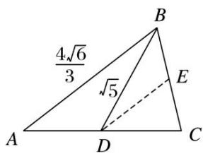
$\because \cos \angle ABC = \frac{\sqrt{6}}{6}, \therefore \cos \angle BED = -\frac{\sqrt{6}}{6}$ . 设 $BE = x$ ，在 $\triangle BDE$ 中，利用余弦定理，可得 $BD^2 = BE^2 + ED^2 - 2BE \cdot ED \cdot \cos \angle BED$ ，即 $5 = x^2 + \frac{8}{3} + 2 \times \frac{2\sqrt{6}}{3} \times \frac{\sqrt{6}}{6}x$ . 解得 $x = 1$ 或 $x = -\frac{7}{3}$ (舍去)，故 $BC = 2$ 。在 $\triangle ABC$ 中，利用余弦定理，可得 $AC^2 = AB^2 + BC^2 - 2AB \cdot BC \cdot \cos \angle ABC = \frac{28}{3}$ ，即 $AC = \frac{2\sqrt{21}}{3}$ . 又 $\sin \angle ABC =$
$\sqrt {1 - \cos^ {2} \angle A B C} = \frac {\sqrt {3 0}}{6}, \therefore \frac {2}{\sin A} = \frac {\frac {2 \sqrt {2 1}}{3}}{\frac {\sqrt {3 0}}{6}}, \therefore \sin A = \frac {\sqrt {7 0}}{1 4}.$

8．在△ABC中， $A=105^{\circ}$ ， $B=30^{\circ}$ ， $a=\frac{\sqrt{6}}{2}$ ，则B的角平分线的长是\_\_\_\_。

8．答案 1 解析 设 B 的角平分线的长为 BD．易知 $\angle ACB = 180^{\circ} - 105^{\circ} - 30^{\circ} = 45^{\circ}$ ， $\angle BDC = 180^{\circ} - 15^{\circ} - 45^{\circ} = 120^{\circ}$ ．在 $\triangle CBD$ 中，有 $\frac{BD}{\sin 45^{\circ}} = \frac{BC}{\sin 120^{\circ}}$ ，可得 BD = 1.

9. 已知 $\triangle ABC$ 的内角 $A, B, C$ 的对边分别为 $a, b, c, A = 60^{\circ}, b = 3c$ , 角 $A$ 的平分线交 $BC$ 于点 $D$ , 且 $BD = \sqrt{7}$ , 则 $\cos \angle ADB$ 的值为 ( )

A. $-\frac{\sqrt{21}}{7}$

B. $\frac{\sqrt{21}}{7}$

C. $\frac{2\sqrt{7}}{7}$

D. $\pm\frac{\sqrt{21}}{7}$

9. 答案 B 解析 法一 如图, 因为 $\angle BAC = 60^{\circ}$ , $AD$ 为 $\angle BAC$ 的平分线, 所以 $\angle CAD = \angle BAD = 30^{\circ}$ . 又 $b = 3c$ ,

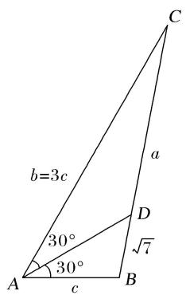
所以 $\frac{CD}{BD} = \frac{S_{\triangle CAD}}{S_{\triangle DAB}} = \frac{\frac{1}{2}b\cdot AD\cdot \sin 30^\circ}{\frac{1}{2}AD\cdot c\sin 30^\circ} = \frac{b}{c} = 3$ 。因为 $BD = \sqrt{7}$ ，所以 $CD = 3\sqrt{7}$ ，所以 $a = CB = 4\sqrt{7}$ 。因为 $a^2 = b^2 + c^2 - 2bc\cos \angle CAB$ ，所以 $16 \times 7 = 9c^2 + c^2 - 2\cdot 3c\cdot c\cdot \frac{1}{2}$ ，解得 $c = 4$ 。在 $\triangle ABD$ 中，由正弦定理，知 $\frac{BD}{\sin \angle BAD} = \frac{c}{\sin \angle ADB}$ ，即 $\frac{\sqrt{7}}{\frac{1}{2}} = \frac{4}{\sin \angle ADB}$ ，所以 $\sin \angle ADB = \frac{2}{\sqrt{7}}$ 。因为 $b = 3c > c$ ，所以 $B > C$ 。因为 $\angle ADB = 30^\circ + C$ ， $\angle ADC = 30^\circ + B$ ，所以 $\angle ADB < \angle ADC$ ，又 $\angle ADB + \angle ADC = 180^\circ$ ，所以 $\angle ADB$ 为锐角，所以 $\cos \angle ADB = \sqrt{1 - \sin^2\angle ADB} = \sqrt{1 - \frac{4}{7}} = \sqrt{\frac{3}{7}} = \frac{\sqrt{21}}{7}$ 。故选 B.

法二 因为 $\angle BAC = 60^{\circ}$ , $AD$ 为 $\angle BAC$ 的平分线, 所以 $\angle CAD = \angle BAD = 30^{\circ}$ . 又 $b = 3c$ , 所以 $\frac{CD}{BD} = \frac{S_{\triangle CAD}}{S_{\triangle DAB}} = \frac{\frac{1}{2}b \cdot AD \cdot \sin 30^{\circ}}{\frac{1}{2}AD \cdot c \sin 30^{\circ}} = \frac{b}{c} = 3$ . 因为 $BD = \sqrt{7}$ , 所以 $CD = 3\sqrt{7}$ , 所以 $a = CB = 4\sqrt{7}$ . 因为 $a^{2} = b^{2} + c^{2} - 2bc \cos$
$\angle BAC$ ，所以 $16\times 7 = 9c^{2} + c^{2} - 2\cdot 3c\cdot c\cdot \frac{1}{2}$ ，解得 $c = 4$ 。由余弦定理，得 $\cos \angle BAD = \frac{AD^2 + c^2 - BD^2}{2AD\cdot c}$ ，即
$\frac{\sqrt{3}}{2} = \frac{AD^2 + 16 - 7}{8AD}$ , 所以 $AD^2 - 4\sqrt{3} AD + 9 = 0$ , 所以 $(AD - \sqrt{3})(AD - 3\sqrt{3}) = 0$ . 所以 $AD = 3\sqrt{3}$ 或 $AD = \sqrt{3}$ . 因为 $b = 3c > c$ , 所以 $B > C$ . 又 $B + C = 120^\circ$ , 所以 $B > 60^\circ > \angle BAD$ , 所以 $AD > BD = \sqrt{7}$ , 所以 $AD = 3\sqrt{3}$ , 所以 $\cos \angle ADB = \frac{DA^2 + DB^2 - AB^2}{2DA \cdot DB} = \frac{27 + 7 - 16}{2 \times 3\sqrt{3} \times \sqrt{7}} = \frac{\sqrt{21}}{7}$ . 故选 B.

10. 在 $\triangle ABC$ 中，角 $A, B, C$ 的对边分别是 $a, b, c$ ，已知 $A=\frac{\pi}{3}$ ， $b=1$ ， $\triangle ABC$ 的外接圆半径为1，则 $\triangle ABC$ 的面积 $S=$ \_\_\_\_.

10. 答案 $\frac{\sqrt{3}}{2}$ 解析 由正弦定理 $\frac{a}{\sin A} = \frac{b}{\sin B} = 2R$ ，得 $a = \sqrt{3}$ ， $\sin B = \frac{1}{2}$ ， $\because a > b$ ， $\therefore A > B$ ， $\therefore B = \frac{\pi}{6}$ ， $C = \frac{\pi}{2}$ ， $\therefore S_{\triangle ABC} = \frac{1}{2} \times \sqrt{3} \times 1 = \frac{\sqrt{3}}{2}$ .

11. 在 $\triangle ABC$ 中，内角 $A$ ， $B$ ， $C$ 所对的边分别为 $a$ ， $b$ ， $c$ ， $a=1$ ， $B=45^{\circ}$ ， $S_{\triangle ABC}=2$ ，则 $\triangle ABC$ 的外接圆直径为\_\_\_\_。

11. 答案 $5\sqrt{2}$ 解析 $\because S_{\triangle ABC} = \frac{1}{2} ac \cdot \sin B = \frac{1}{2} c \cdot \sin 45^{\circ} = \frac{\sqrt{2}}{4} c = 2, \therefore c = 4\sqrt{2}, \therefore b^{2} = a^{2} + c^{2} - 2ac\cos 45^{\circ} = 25, \therefore b = 5, \therefore \triangle ABC$ 的外接圆直径为 $\frac{b}{\sin B} = 5\sqrt{2}$ .

12. $\triangle ABC$ 的两边长分别为 2, 3, 其夹角的余弦值为 $\frac{1}{3}$ , 则其外接圆的直径为 \_\_\_\_.

12. 答案 $\frac{9\sqrt{2}}{4}$ 解析 设另一条边的边长为 $x$ ，则 $x^{2} = 2^{2} + 3^{2} - 2 \times 2 \times 3 \times \frac{1}{3}$ ， $\therefore x^{2} = 9$ ， $\therefore x = 3$ 。设 $\cos \theta = \frac{1}{3}$ ，则 $\sin \theta = \frac{2\sqrt{2}}{3}$ ， $\therefore 2R = \frac{3}{\sin \theta} = \frac{3}{\frac{2\sqrt{2}}{3}} = \frac{9\sqrt{2}}{4}$ .

13. 已知三角形两边长分别为 1 和 $\sqrt{3}$ , 第三边上的中线长为 1, 则三角形的外接圆半径为 \_\_\_\_.

13. 答案 1 解析 如图, $AB = 1$ , $BD = 1$ , $BC = \sqrt{3}$ , 设 $AD = DC = x$ , 在 $\triangle ABD$ 中, $\cos \angle ADB = \frac{x^2 + 1 - 1}{2x} = \frac{x}{2}$ , 在 $\triangle BDC$ 中, $\cos \angle BDC = \frac{x^2 + 1 - 3}{2x} = \frac{x^2 - 2}{2x}$ , $\because \angle ADB$ 与 $\angle BDC$ 互补, $\therefore \cos \angle ADB = -\cos \angle BDC$ , $\therefore \frac{x}{2} = -\frac{x^2 - 2}{2x}$ , $\therefore x = 1$ , $\therefore \angle A = 60^\circ$ , 由 $\frac{\sqrt{3}}{\sin 60^\circ} = 2R$ , 得 $R = 1$ .

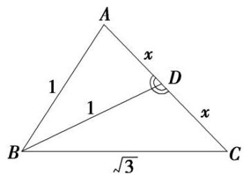

14. $\triangle ABC$ 的内角 $A, B, C$ 的对边分别为 $a, b, c$ , 若 $\cos C = \frac{2\sqrt{2}}{3}, b\cos A + a\cos B = 2$ , 则 $\triangle ABC$ 的外接圆面积为( )

A. $4\pi$

B. $8\pi$

C. $9\pi$

D. $36\pi$

14. 答案 C 解析 由题意及正弦定理得 $2R\sin B\cos A + 2R\sin A\cos B = 2R\sin (A + B) = 2(R$ 为 $\triangle ABC$ 的外
接圆半径). 即 $2R\sin C = 2$ . 又 $\cos C = \frac{2\sqrt{2}}{3}$ 及 $C \in (0, \pi)$ , 知 $\sin C = \frac{1}{3}$ . $\therefore 2R = \frac{2}{\sin C} = 6, R = 3$ . 故 $\triangle ABC$ 外接圆面积 $S = \pi R^2 = 9\pi$ .

15. 已知圆的半径为 4, a, b, c 为该圆的内接三角形的三边，若 $abc = 16\sqrt{2}$ ，则三角形的面积为 \_\_\_\_.  
15. 答案 $\sqrt{2}$ 解析 $\because \frac{a}{\sin A} = \frac{b}{\sin B} = \frac{c}{\sin C} = 2R = 8, \therefore \sin C = \frac{c}{8}, \therefore S_{\triangle ABC} = \frac{1}{2} ab\sin C = \frac{abc}{16} = \frac{16\sqrt{2}}{16} = \sqrt{2}$   
16. 如图所示, 已知圆内接四边形 $ABCD$ 中 $AB = 3$ , $AD = 5$ , $BD = 7$ , $\angle BDC = 45^{\circ}$ , 则 $BC =$ \_\_\_\_.

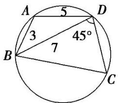

16. 答案 $\frac{7\sqrt{6}}{3}$ 解析 $\cos A = \frac{3^2 + 5^2 - 7^2}{2 \times 3 \times 5} = -\frac{1}{2}, \therefore A = 120^\circ, \therefore C = 60^\circ.$ 从而 $\frac{BC}{\sin 45^\circ} = \frac{7}{\sin 60^\circ}, \therefore BC = \frac{7\sin 45^\circ}{\sin 60^\circ} = \frac{7\sqrt{2}}{\sqrt{3}} = \frac{7\sqrt{6}}{3}.$   
17. 在外接圆半径为 $\frac{1}{2}$ 的 $\triangle ABC$ 中， $a, b, c$ 分别为内角 $A, B, C$ 的对边，且 $2a\sin A = (2b + c)\sin B + (2c + b)\sin C$ ，则 $b + c$ 的最大值是（）

A. 1

B. $\frac{1}{2}$

C. 3

D. $\frac{\sqrt{3}}{2}$

17. 答案 A 解析 根据正弦定理得 $2a^{2} = (2b + c)b + (2c + b)c$ ，即 $a^{2} = b^{2} + c^{2} + bc$ ，又 $a^{2} = b^{2} + c^{2} - 2bc\cos A$ ，所以 $\cos A = -\frac{1}{2}$ ， $A = 120^{\circ}$ 。因为 $\triangle ABC$ 外接圆半径为 $\frac{1}{2}$ ，所以由正弦定理得 $b + c = \sin B \cdot 2R + \sin C \cdot 2R = \sin B + \sin (60^{\circ} - B) = \frac{1}{2}\sin B + \frac{\sqrt{3}}{2}\cos B = \sin (B + 60^{\circ})$ ，故当 $B = 30^{\circ}$ 时， $b + c$ 取得最大值 1。  
18. 在 $\triangle ABC$ 中， $a, b, c$ 分别为三个内角 $A, B, C$ 的对边，且 $BC$ 边上的高为 $\frac{\sqrt{3}}{6}a$ ，则 $\frac{c}{b}+\frac{b}{c}$ 取得最大值时，内角 $A$ 的值为( )

A. $\frac{\pi}{2}$

B. $\frac{\pi}{6}$

C. $\frac{2\pi}{3}$

D. $\frac{\pi}{3}$

18. 答案 D 解析 利用等面积法可得， $\frac{1}{2}\cdot a\cdot\frac{\sqrt{3}}{6}a=\frac{1}{2}\cdot b\cdot c\cdot\sin A$ ，整理得 $a^{2}=2\sqrt{3}bc\sin A$ 。 $\therefore\frac{c}{b}+\frac{b}{c}=\frac{c^{2}+b^{2}}{bc}=\frac{a^{2}+2bc\cos A}{bc}=2\sqrt{3}\sin A+2\cos A=4\sin\left(A+\frac{\pi}{6}\right)$ ，当 $A+\frac{\pi}{6}=\frac{\pi}{2}$ 时， $\frac{c}{b}+\frac{b}{c}$ 取得最大值，此时 $A=\frac{\pi}{3}$ .

# 考点二 计算三角形的面积

# 【方法总结】

# 三角形面积问题的题型及解题策略

三角形的面积是与解三角形息息相关的内容，经常出现在高考题中，难度不大．解题的前提条件是熟练掌握三角形面积公式，具体的题型及解题策略为：  
（1）利用正弦定理、余弦定理解三角形，求出三角形的有关元素之后，直接求三角形的面积，或求出两

边之积及夹角正弦，再求解.  
（2）把面积作为已知条件之一，与正弦定理、余弦定理结合求出三角形的其他各量．面积公式中涉及面积、两边及两边夹角正弦四个量，结合已知条件列方程求解.

# 【例题选讲】

[例 2]（1）(2014·福建)在 $\triangle ABC$ 中， $A=60^{\circ}$ ，AC=4， $BC=2\sqrt{3}$ ，则 $\triangle ABC$ 的面积等于 \_\_\_\_.
答案 $2\sqrt{3}$ 解析 在 $\triangle ABC$ 中，由正弦定理得 $\frac{2\sqrt{3}}{\sin 60^{\circ}} = \frac{4}{\sin B}$ ，解得 $\sin B = 1$ ，所以 $B = 90^{\circ}$ ，所以 $S_{\triangle ABC} = \frac{1}{2} \times AB \times 2\sqrt{3} = \frac{1}{2} \times \sqrt{4^{2} - (2\sqrt{3})^{2}} \times 2\sqrt{3} = 2\sqrt{3}$ .  
（2）(2019·全国II)△ABC 的内角内角 A, B, C 所对的边分别是 a, b, c. 若 b=6, a=2c, $B=\frac{\pi}{3}$ ，则 △BDC 的面积是 \_\_\_\_.
答案 $6\sqrt{3}$ 解析 由余弦定理得 $b^{2} = a^{2} + c^{2} - 2ac\cos B$ ，所以 $(2c)^{2} + c^{2} - 2\times 2c\times c\times \frac{1}{2} = 6^{2}$ ，即 $c^2 = 12$ ，解得 $c = 2\sqrt{3},c = -2\sqrt{3}$ （舍去），所以 $a = 2c = 4\sqrt{3}$ ， $S_{\triangle ABC} = \frac{1}{2} ac\sin B = \frac{1}{2}\times 4\sqrt{3}\times 2\sqrt{3}\times \frac{\sqrt{3}}{2} = 6\sqrt{3}$ ：  
（3）(2018·全国Ⅰ)在 $\triangle ABC$ 中，内角 $A, B, C$ 所对的边分别是 $a, b, c$ ，已知 $b\sin C + c\sin B = 4a\sin B\sin C$ ， $b^{2} + c^{2} - a^{2} = 8$ ，则 $\triangle ABC$ 的面积为\_\_\_\_.
答案 $\frac{2\sqrt{3}}{3}$ 解析 已知 $b\sin C + c\sin B = 4a\sin B\sin C \Rightarrow 2\sin B\sin C = 4\sin A \cdot \sin B\sin C$ ，所以 $\sin A = \frac{1}{2}$ ，由 $b^2 + c^2 - a^2 = 8 > 0$ 知 $A$ 为锐角，所以 $\cos A = \frac{\sqrt{3}}{2}$ ，所以 $\frac{\sqrt{3}}{2} = \frac{b^2 + c^2 - a^2}{2bc} = \frac{4}{bc}$ ，所以 $bc = \frac{8}{\sqrt{3}} = \frac{8\sqrt{3}}{3}$ ，所以 $S_{\triangle ABC} = \frac{1}{2} bc\sin A = \frac{1}{2} \times \frac{8\sqrt{3}}{3} \times \frac{1}{2} = \frac{2\sqrt{3}}{3}$ .  
（4）(2017·浙江)已知 $\triangle ABC$ ， $AB=AC=4$ ， $BC=2$ 。点 $D$ 为 $AB$ 延长线上一点， $BD=2$ ，连接 $CD$ ，则 $\triangle BDC$ 的面积是 \_\_\_\_， $\cos\angle BDC=$ \_\_\_\_。
答案 $\frac{\sqrt{15}}{2}$ $\frac{\sqrt{10}}{4}$ 解析 在 $\triangle ABC$ 中， $AB = AC = 4, BC = 2$ ，由余弦定理得 $\cos \angle ABC = \frac{AB^2 + BC^2 - AC^2}{2AB \cdot BC} = \frac{4^2 + 2^2 - 4^2}{2 \times 4 \times 2} = \frac{1}{4}$ ，则 $\sin \angle ABC = \sin \angle CBD = \frac{\sqrt{15}}{4}$ ，所以 $S_{\triangle BDC} = \frac{1}{2} BD \cdot BC \sin \angle CBD = \frac{\sqrt{15}}{2}$ . 因为 $BD = BC = 2$ ，所以 $\angle BDC = \frac{1}{2} \angle ABC$ ，则 $\cos \angle BDC = \sqrt{\frac{\cos \angle ABC + 1}{2}} = \frac{\sqrt{10}}{4}$ .  
（5） $\triangle ABC$ 的内角 $A, B, C$ 的对边分别为 $a, b, c$ , 若 $\cos A = \frac{4}{5}, \cos C = \frac{5}{13}, a = 1$ , 则 $\triangle ABC$ 的面积 $S = \_$ .
答案 $\frac{126}{169}$ 解析 在 $\triangle ABC$ 中，由 $\cos A = \frac{4}{5}, \cos C = \frac{5}{13}$ ，可得 $\sin A = \frac{3}{5}, \sin C = \frac{12}{13}, \sin B = \sin (A + C) = \sin A\cos C + \cos A \cdot \sin C = \frac{63}{65}$ ，又 $a = 1$ ，由正弦定理得 $b = \frac{a\sin B}{\sin A} = \frac{21}{13}$ . 所以 $S = \frac{1}{2} ab\sin C = \frac{1}{2} \times 1 \times \frac{21}{13} \times \frac{12}{13} = \frac{126}{169}$ .  
（6）在 $\triangle ABC$ 中， $A, B, C$ 的对边分别为 $a, b, c$ ，且 $b\cos C=3a\cos B-c\cos B$ ， $\vec{BA}\cdot\vec{BC}=2$ ，则 $\triangle ABC$ 的面积为\_\_\_\_.
答案 $2\sqrt{2}$ 解析 因为 $b\cos C=3a\cos B-c\cos B$ ，由正弦定理得 $\sin B\cos C=3\sin A\cos B-\sin C\cos B$ ，即$\sin B\cos C + \sin C\cos B = 3\sin A\cos B$ ，所以 $\sin (B + C) = 3\sin A\cos B$ 。又 $\sin (B + C) = \sin (\pi -A) = \sin A$ ，所以 $\sin A$ $= 3\sin A\cos B$ ，又 $\sin A\neq 0$ ，解得 $\cos B = \frac{1}{3}$ ，所以 $\sin B = \sqrt{1 - \cos^2B} = \sqrt{1 - \frac{1}{9}} = \frac{2\sqrt{2}}{3}$ 由 $\overrightarrow{BA}\cdot \overrightarrow{BC} = 2$ ，可得 $c a\cos B$ $= 2$ ，解得 $ac = 6$ 。所以 $S_{\triangle ABC} = \frac{1}{2} ac\cdot \sin B = \frac{1}{2}\cdot 6\cdot \frac{2\sqrt{2}}{3} = 2\sqrt{2}$  
（7） $\triangle ABC$ 的内角 $A, B, C$ 的对边分别为 $a, b, c$ . 已知 $\sin (B + A) + \sin (B - A) = 2\sin 2A$ ，且 $c = \sqrt{6}, C = \frac{\pi}{3}$ ，则 $\triangle ABC$ 的面积是（）

A. $\sqrt{3}$

B. $3\sqrt{3}$

C. $\sqrt{3}$ 或 1

D. $\sqrt{3}$ 或 $3\sqrt{3}$
答案 A 解析 ∵ 在△ABC 中， $C=\frac{\pi}{3}$ ，∴ $B=\frac{2\pi}{3}-A$ ， $B-A=\frac{2\pi}{3}-2A$ ，∵ $\sin(B+A)+\sin(B-A)=2\sin2A$ ，
∴ $\sin C + \sin\left(\frac{2\pi}{3} - 2A\right) = 2\sin 2A$ ，即 $\sin C + \frac{\sqrt{3}}{2}\cos 2A + \frac{1}{2}\sin 2A = 2\sin 2A$ ，整理得 $\sqrt{3}\sin\left(2A-\frac{\pi}{6}\right)=\sin C=\frac{\sqrt{3}}{2}$ ，
∴ $\sin\left(2A-\frac{\pi}{6}\right)=\frac{1}{2}$ . 又 $A\in\left(0,\frac{2\pi}{3}\right)$ ，∴ $2A-\frac{\pi}{6}=\frac{\pi}{6}$ 或 $\frac{5\pi}{6}$ ，解得 $A=\frac{\pi}{6}$ 或 $\frac{\pi}{2}$ . 当 $A=\frac{\pi}{6}$ 时， $B=\frac{\pi}{2}$ ， $\tan C=\frac{c}{a}=\frac{\sqrt{6}}{a}=\sqrt{3}$ ，解得 $a=\sqrt{2}$ ，∴ $S_{\triangle ABC}=\frac{1}{2}ac\sin B=\sqrt{3}$ ; 当 $A=\frac{\pi}{2}$ 时， $B=\frac{\pi}{6}$ ， $\tan C=\frac{c}{b}=\frac{\sqrt{6}}{b}=\sqrt{3}$ ，解得 $b=\sqrt{2}$ ，∴ $S_{\triangle ABC}=\frac{1}{2}bc=\sqrt{3}$ . 综上，△ABC 的面积是 $\sqrt{3}$ .  
（8）已知四边形 ABCD 中，AB=2，BC=CD=4，DA=6，且 $D=60^{\circ}$ ，试求四边形 ABCD 的面积.

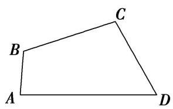
答案 $8\sqrt{3}$ 解析 连接 $AC$ ，在 $\triangle ACD$ 中，由 $AD = 6$ ， $CD = 4$ ， $D = 60^{\circ}$ ，可得 $AC^{2} = AD^{2} + DC^{2} - 2AD \cdot DC \cos D = 6^{2} + 4^{2} - 2 \times 4 \times 6 \cos 60^{\circ} = 28$ ，在 $\triangle ABC$ 中，由 $AB = 2$ ， $BC = 4$ ， $AC^{2} = 28$ ，可得 $\cos B = \frac{AB^{2} + BC^{2} - AC^{2}}{2AB \cdot BC} = \frac{2^{2} + 4^{2} - 28}{2 \times 2 \times 4} = -\frac{1}{2}$ . 又 $0^{\circ} < B < 180^{\circ}$ ，故 $B = 120^{\circ}$ . 所以四边形 $ABCD$ 的面积 $S = S_{\triangle ACD} + S_{\triangle ABC}$ $= \frac{1}{2} AD \cdot CD \sin D + \frac{1}{2} AB \cdot BC \sin B = \frac{1}{2} \times 4 \times 6 \sin 60^{\circ} + \frac{1}{2} \times 2 \times 4 \sin 120^{\circ} = 8\sqrt{3}$ .

# 【对点训练】

1. 我国南宋著名数学家秦九韶发现了从三角形三边求三角形面积的“三斜公式”，设 $\triangle ABC$ 三个内角 $A, B,$ $C$ 所对的边分别为 $a, b, c$ ，面积为 $S$ ，则“三斜求积”公式为 $S = \sqrt{\frac{1}{4}\left[a^2c^2 - \left(\frac{a^2 + c^2 - b^2}{2}\right)^2\right]}$ . 若 $a^2\sin C = 4\sin A, (a + c)^2 = 12 + b^2$ ，则用“三斜求积”公式求得 $\triangle ABC$ 的面积为（）

A. $\sqrt{3}$

B. 2

C. 3

D. $\sqrt{6}$

1. 答案 A 解析 由正弦定理得 $a^2 c = 4a$ ，所以 $ac = 4$ ，且 $a^2 + c^2 - b^2 = 12 - 2ac = 4$ ，代入面积公式得 $\sqrt{\frac{1}{4} \times (16 - 2^2)} = \sqrt{3}$ .

2. 在 $\triangle ABC$ 中，内角 $A, B, C$ 对应的边分别为 $a, b, c$ ，已知 $a = 2, c = 2\sqrt{2}$ ，且 $C = \frac{\pi}{4}$ ，则 $\triangle ABC$ 的面积为（）

A. $\sqrt{3} + 1$

B. $\sqrt{3} - 1$

C. 4

D. 2

2. 答案 A 解析 由正弦定理 $\frac{a}{\sin A} = \frac{b}{\sin B} = \frac{c}{\sin C}$ , 得 $\frac{2}{\sin A} = \frac{2\sqrt{2}}{\frac{\sqrt{2}}{2}}$ , 所以 $\sin A = \frac{1}{2}$ , 又 $a < c$ , 所以 $A = \frac{\pi}{6}$ , $\sin B = \sin (A + C) = \sin A\cos C + \cos A\sin C = \frac{\sqrt{2} + \sqrt{6}}{4}$ , 所以 $S_{\triangle ABC} = \frac{1}{2} ac\sin B = \frac{1}{2} \times 2 \times 2\sqrt{2} \times \frac{\sqrt{2} + \sqrt{6}}{4} = \sqrt{3} + 1$ .

3. (2013·全国Ⅱ)△ABC 的内角 A, B, C 的对边分别为 a, b, c，已知 $b=2,\quad B=\frac{\pi}{6},\quad C=\frac{\pi}{4}$ ，则 △ABC 的面积为( )

A. $2 \sqrt{3} + 2$

B. $\sqrt{3} + 1$

C. $2 \sqrt{3} - 2$

D. $\sqrt{3} - 1$

3. 答案 B 解析 因为 $B = \frac{\pi}{6}$ , $C = \frac{\pi}{4}$ , 所以 $A = \frac{7\pi}{12}$ . 由正弦定理得 $\frac{b}{\sin \frac{\pi}{6}} = \frac{c}{\sin \frac{\pi}{4}}$ , 解得 $c = 2\sqrt{2}$ . 所以三角形的面积为 $\frac{1}{2} bc\sin A = \frac{1}{2} \times 2 \times 2\sqrt{2}\sin \frac{7\pi}{12}$ . 因为 $\sin \frac{7\pi}{12} = \sin \left(\frac{\pi}{3} + \frac{\pi}{4}\right) = \frac{\sqrt{3}}{2} \times \frac{\sqrt{2}}{2} + \frac{\sqrt{2}}{2} \times \frac{1}{2} = \frac{\sqrt{2}}{2} \left(\frac{\sqrt{3}}{2} + \frac{1}{2}\right)$ , 所以 $\frac{1}{2} bc\sin A = 2\sqrt{2} \times \frac{\sqrt{2}}{2} \left(\frac{\sqrt{3}}{2} + \frac{1}{2}\right) = \sqrt{3} + 1$ , 故选 B.

4. 已知在 $\triangle ABC$ 中，内角 $A, B, C$ 所对的边分别为 $a, b, c$ 。若 $a=2b\cos A, B=\frac{\pi}{3}, c=1$ ，则 $\triangle ABC$ 的面积为\_\_\_\_。

4. 答案 $\frac{\sqrt{3}}{4}$ 解析 $\because a = 2b\cos A, \therefore$ 由正弦定理可得 $\sin A = 2\sin B \cdot \cos A.$ $\because B = \frac{\pi}{3}, \therefore \sin A = \sqrt{3}\cos A,$ $\therefore \tan A = \sqrt{3}.$ 又 $\because A$ 为 $\triangle ABC$ 的内角， $\therefore A = \frac{\pi}{3}$ . 又 $B = \frac{\pi}{3}, \therefore C = \pi - A - B = \frac{\pi}{3}, \therefore \triangle ABC$ 为等边三角形， $\therefore S_{\triangle ABC} = \frac{1}{2} ac\sin B = \frac{1}{2} \times 1 \times 1 \times \frac{\sqrt{3}}{2} = \frac{\sqrt{3}}{4}.$

5. 在 $\triangle ABC$ 中，内角 $A, B, C$ 的对边分别为 $a, b, c$ . 已知 $\cos A = \frac{2}{3}$ , $\sin B = \sqrt{5} \cos C$ ，并且 $a = \sqrt{2}$ ，则 $\triangle ABC$ 的面积为 \_\_\_\_.

5. 答案 $\frac{\sqrt{5}}{2}$ 解析 因为 $0 < A < \pi, \cos A = \frac{2}{3}$ , 所以 $\sin A = \sqrt{1 - \cos^2 A} = \frac{\sqrt{5}}{3}$ . 又由 $\sqrt{5} \cos C = \sin B = \sin (A + C) = \sin A \cos C + \cos A \sin C = \frac{\sqrt{5}}{3} \cos C + \frac{2}{3} \sin C$ 知, $\cos C > 0$ , 并结合 $\sin^2 C + \cos^2 C = 1$ , 得 $\sin C = \frac{\sqrt{5}}{\sqrt{6}}, \cos C = \frac{1}{\sqrt{6}}$ . 于是 $\sin B = \sqrt{5} \cos C = \frac{\sqrt{5}}{\sqrt{6}}$ . 由 $a = \sqrt{2}$ 及正弦定理 $\frac{a}{\sin A} = \frac{c}{\sin C}$ , 得 $c = \sqrt{3}$ . 故 $\triangle ABC$ 的面积 $S = \frac{1}{2} a c \sin B = \frac{\sqrt{5}}{2}$ .

6. 在 $\triangle ABC$ 中，角 $A, B, C$ 所对的边分别为 $a, b, c$ ，且 $(2b - a)\cos C = c\cos A, c = 3, \sin A + \sin B = 2\sqrt{6}$ $\sin A\sin B$ ，则 $\triangle ABC$ 的面积为（）

A. $\frac{3\sqrt{3}}{8}$

B. 2

C. $\frac{\sqrt{3}}{2}$

D. $\frac{3\sqrt{3}}{4}$

6. 答案 D 解析 因为 $(2b-a)\cos C=c\cos A$ ，由正弦定理得， $(2\sin B-\sin A)\cos C=\sin C\cos A$ ，化简得 $2\sin B\cos C=\sin B$ ，又 $\sin B\neq0$ ，因为 $C\in(0,\pi)$ ，所以 $\cos C=\frac{1}{2}$ ，所以 $C=\frac{\pi}{3}$ 。又由 $\sin A+\sin B=2\sqrt{6}\sin A\sin B$ ，可得 $(\sin A+\sin B)\cdot\sin C=3\sqrt{2}\sin A\sin B$ ，由正弦定理可得 $(a+b)c=3\sqrt{2}ab$ ，所以 $a+b=\sqrt{2}ab$ 。因为 $c^{2}=a^{2}+b^{2}-2ab\cos C$ ，所以 $2(ab)^{2}-3ab-9=0$ ，所以 ab=3（负值舍去），所以 $S_{\triangle ABC}=\frac{1}{2}ab\sin C=\frac{3\sqrt{3}}{4}$ 。

7. 在 $\triangle ABC$ 中， $c=2\sqrt{2}$ ， $a>b$ ， $\tan A+\tan B=5$ ， $\tan A\tan B=6$ ，则 $\triangle ABC$ 的面积为\_\_\_\_。

7. 答案 $\frac{24}{5}$ 解析 $\because \tan A + \tan B = 5, \tan A \tan B = 6$ ，且 $a > b$ ， $\therefore \tan A = 3, \tan B = 2, A, B$ 都是锐角。 $\therefore \sin A = \frac{3\sqrt{10}}{10}, \cos A = \frac{\sqrt{10}}{10}, \sin B = \frac{2\sqrt{5}}{5}, \cos B = \frac{\sqrt{5}}{5}, \sin C = \sin (A + B) = \sin A \cos B + \cos A \sin B = \frac{\sqrt{2}}{2}$ . 由正弦定理 $\frac{a}{\sin A} = \frac{b}{\sin B} = \frac{c}{\sin C}$ ，得 $a = \frac{6\sqrt{10}}{5}, b = \frac{8\sqrt{5}}{5}$ . $\therefore S_{\triangle ABC} = \frac{1}{2} ab \sin C = \frac{1}{2} \times \frac{6\sqrt{10}}{5} \times \frac{8\sqrt{5}}{5} \times \frac{\sqrt{2}}{2} = \frac{24}{5}$ .

8. 在 $\triangle ABC$ 中，内角 $A, B, C$ 的对边分别为 $a, b, c$ ，已知 $a = 1, 2b - \sqrt{3}c = 2a\cos C, \sin C = \frac{\sqrt{3}}{2}$ ，则 $\triangle ABC$ 的面积为（）

A. $\frac{\sqrt{3}}{2}$

B. $\frac{\sqrt{3}}{4}$

C. $\frac{\sqrt{3}}{2}$ 或 $\frac{\sqrt{3}}{4}$

D. $\sqrt{3}$ 或 $\frac{\sqrt{3}}{2}$

8. 答案 C 解析 因为 $2b - \sqrt{3}c = 2a\cos C$ ，所以由正弦定理可得 $2\sin B - \sqrt{3}\sin C = 2\sin A\cos C$ ，所以 $2\sin(A + C) - \sqrt{3}\sin C = 2\sin A\cos C$ 。所以 $2\cos A\sin C = \sqrt{3}\sin C$ ，又 $\sin C \neq 0$ ，所以 $\cos A = \frac{\sqrt{3}}{2}$ ，因为 $A \in (0^\circ, 180^\circ)$ ，所以 $A = 30^\circ$ ，因为 $\sin C = \frac{\sqrt{3}}{2}$ ，所以 $C = 60^\circ$ 或 $120^\circ$ 。当 $C = 60^\circ$ 时， $A = 30^\circ$ ，所以 $B = 90^\circ$ ，又 a = 1，所以 $\triangle ABC$ 的面积为 $\frac{1}{2} \times 1 \times 2 \times \frac{\sqrt{3}}{2} = \frac{\sqrt{3}}{2}$ ；当 $C = 120^\circ$ 时， $A = 30^\circ$ ，所以 $B = 30^\circ$ ，又 a = 1，所以 $\triangle ABC$ 的面积为 $\frac{1}{2} \times 1 \times 1 \times \frac{\sqrt{3}}{2} = \frac{\sqrt{3}}{4}$ ，故选 C。

9. 在 $\triangle ABC$ 中，若 $a=7, b=3, c=8$ ，则其面积等于 \_\_\_\_.

9. 答案 $6\sqrt{3}$ 解析 由余弦定理的推论，得 $\cos A = \frac{b^2 + c^2 - a^2}{2bc} = \frac{9 + 64 - 49}{2\times 3\times 8} = \frac{1}{2}$ ，故 $A = 60^{\circ}$ . $\therefore S_{\triangle ABC} = \frac{1}{2}$ $bcsin A = \frac{1}{2}\times 3\times 8\times \frac{\sqrt{3}}{2} = 6\sqrt{3}$ .

10. (2014·江西)在 $\triangle ABC$ 中, 内角 $A, B, C$ 所对的边分别是 $a, b, c$ . 若 $c^{2}=(a-b)^{2}+6, C=\frac{\pi}{3}$ , 则 $\triangle ABC$ 的面积是( )

A. 3

B. $\frac{9\sqrt{3}}{2}$

C. $\frac{3\sqrt{3}}{2}$

D. $3\sqrt{3}$

10. 答案 C 解析 $\because c^{2}=(a-b)^{2}+6,\quad\therefore c^{2}=a^{2}+b^{2}-2ab+6,$ ①. $\because C=\frac{\pi}{3},\quad\therefore c^{2}=a^{2}+b^{2}-2ab\cos\frac{\pi}{3}=a^{2}+b^{2}-ab,$ ②. 由①②得 $-ab+6=0$ ，即 ab=6. $\therefore S_{\triangle ABC}=\frac{1}{2}absinC=\frac{1}{2}\times6\times\frac{\sqrt{3}}{2}=\frac{3\sqrt{3}}{2}.$

11. 设 $\triangle ABC$ 的内角 $A, B, C$ 的对边分别为 $a, b, c$ , 已知 $a = 2\sqrt{2}$ , $\cos A = \frac{3}{4}$ , $\sin B = 2\sin C$ , 则 $\triangle ABC$

的面积是\_\_\_\_。

11. 答案 $\sqrt{7}$ 解析 由 $\sin B = 2\sin C, \cos A = \frac{3}{4}, A$ 为 $\triangle ABC$ 一内角，可得 $b = 2c, \sin A = \sqrt{1 - \cos^2 A} = \frac{\sqrt{7}}{4}$ ， $\therefore$ 由 $a^2 = b^2 + c^2 - 2bc\cos A$ ，可得 $8 = 4c^2 + c^2 - 3c^2$ ，解得 $c = 2$ （舍负），则 $b = 4$ 。 $\therefore S_{\triangle ABC} = \frac{1}{2} bc\sin A = \frac{1}{2} \times 2 \times 4 \times \frac{\sqrt{7}}{4} = \sqrt{7}$ .

12. 在 $\triangle ABC$ 中，内角 $A, B, C$ 的对边分别为 $a, b, c$ ，若 $a=1, b=2, \cos B=\frac{1}{4}$ ，则 $c=$ \_\_\_\_； $\triangle ABC$ 的面积 $S=$ \_\_\_\_.

12. 答案 2 $\frac{\sqrt{15}}{4}$ 解析 $\because a = 1, b = 2, \cos B = \frac{1}{4}, \therefore$ 由余弦定理 $b^{2} = a^{2} + c^{2} - 2ac\cos B$ ，可得 $2^{2} = 1^{2} + c^{2} - 2\times 1\times c\times \frac{1}{4}$ ，整理得 $2c^{2} - c - 6 = 0$ ，解得 $c = 2$ （负值舍去），又 $\because \sin B = \sqrt{1 - \cos^2B} = \frac{\sqrt{15}}{4}, \therefore S_{\triangle ABC} = \frac{1}{2} ac\sin B = \frac{1}{2}\times 1\times 2\times \frac{\sqrt{15}}{4} = \frac{\sqrt{15}}{4}$ .

13. 在 $\triangle ABC$ 中，角 $A, B, C$ 的对边分别为 $a, b, c$ ，若 $b = 5, a = 3, \cos(B - A) = \frac{7}{9}$ ，则 $\triangle ABC$ 的面积为（）

A. $\frac{15}{2}$

B. $\frac{5\sqrt{2}}{3}$

C. $5\sqrt{2}$

D. $2\sqrt{2}$

13. 答案 C 解析 在边 AC 上取点 D 使 $\angle A = \angle ABD$ ，则 $\cos\angle DBC = \cos(\angle ABC - \angle A) = \frac{7}{9}$ ，设 AD = DB = x，在 $\triangle BCD$ 中，由余弦定理得， $(5 - x)^{2} = 9 + x^{2} - 2 \times 3x \times \frac{7}{9}$ ，解得 x = 3。故 BD = BC，在等腰三角形 BCD 中，DC 边上的高为 $2\sqrt{2}$ ，所以 $S_{\triangle ABC} = \frac{1}{2} \times 5 \times 2\sqrt{2} = 5\sqrt{2}$ ，故选 C.

14. 如图, 在四边形 $ABCD$ 中, $B = C = 120^{\circ}$ , $AB = 4$ , $BC = CD = 2$ , 则该四边形的面积等于

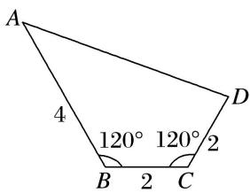

14. 答案 $5\sqrt{3}$ 解析 连接 BD，四边形面积可分为 $\triangle ABD$ 与 $\triangle BCD$ 两部分的和，由余弦定理得 $BD=2\sqrt{3}$ ， $S_{\triangle BCD}=\frac{1}{2}BC\cdot CD\sin120^{\circ}=\sqrt{3}$ ， $\angle ABD=120^{\circ}-30^{\circ}=90^{\circ}$ ， $\therefore S_{\triangle ABD}=\frac{1}{2}AB\cdot BD=4\sqrt{3}$ ， $\therefore S_{四边形ABCD}=\sqrt{3}+4\sqrt{3}=5\sqrt{3}$ .

