专题二　三角形的三线两圆及面积问题

一．中线

中线定理：一条中线两侧所对边的平方和等于底边平方的一半与该边中线平方的2倍．

即：如图，在中，为中点，则．

证明　在中，，在中，．

．

另外已知两边及其夹角也可表述为：．

证明　由，，

．

二．角平分线

角平分线定理：如图，在中，是的平分线，则．

证法1　在中，，在中，，．

证法2　该结论可以由两三角形面积之比得证，即．

三．高

高的性质：分别为边上的高，则

求高一般采用等面积法，即求某边上的高，需要求出面积和底边长度．

四．外接圆

过三角形三个顶点的圆叫三角形的外接圆．其圆心叫做三角形的外心．

外接圆半径的计算：*R*＝＝＝．

外接圆半径与三角形面积的关系：<em>S</em>△<em>ABC</em>＝＝(<em>R</em>为△<em>ABC</em>外接圆半径)．

五．内切圆

与三角形三边都相切的圆叫三角形的内切圆．其圆心叫做三角形的内心．

内切圆半径与三角形面积的关系：<em>S</em>△<em>ABC</em>＝(<em>a</em>＋<em>b</em>＋<em>c</em>)·<em>r</em>(<em>r</em>为△<em>ABC</em>内切圆半径)，并可由此计算<em>r</em>．

考点一　三角形的三线两圆问题

【例题选讲】

<strong>[例1]</strong> （1）△<em>ABC</em>中，<em>AC</em>＝，<em>BC</em>＝2，<em>B</em>＝60°，则<em>BC</em>边上的高等于(　　)

A．　　　　　　　　
B．　　　　　　　　
C．　　　　　　　　
D．
答案　B　解析　设<em>AB</em>＝<em>a</em>，则由<em>AC</em>2＝<em>AB</em>2＋<em>BC</em>2－2<em>AB</em>·<em>BC</em>·cos<em>B</em>知7＝<em>a</em>2＋4－2<em>a</em>，即<em>a</em>2－2<em>a</em>－3＝0，∴<em>a</em>＝3(负值舍去)．∴<em>BC</em>边上的高为<em>AB</em>·sin<em>B</em>＝3×＝．  
（2）在△*ABC*中，若*AB*＝4，*AC*＝7，*BC*边的中线*AD*＝，则*BC*＝\_\_\_\_\_\_\_\_．
答案　9　解析　如图所示，延长<em>AD</em>到<em>E</em>，使<em>DE</em>＝<em>AD</em>，连接<em>BE</em>，<em>EC</em>．因为<em>AD</em>是<em>BC</em>边上的中线，所以<em>AE</em>与<em>BC</em>互相平分，所以四边形<em>ACEB</em>是平行四边形，所以<em>BE</em>＝<em>AC</em>＝7．又<em>AB</em>＝4，<em>AE</em>＝2<em>AD</em>＝7，所以在△<em>ABE</em>中，由余弦定理得，<em>AE</em>2＝49＝<em>AB</em>2＋<em>BE</em>2－2<em>AB</em>·<em>BE</em>·cos∠<em>ABE</em>＝<em>AB</em>2＋<em>AC</em>2－2<em>AB</em>·<em>AC</em>·cos∠<em>ABE</em>．在△<em>ABC</em>中，由余弦定理得，<em>BC</em>2＝<em>AB</em>2＋<em>AC</em>2－2<em>AB</em>·<em>AC</em>·cos(π－∠<em>ABE</em>)，∴49＋<em>BC</em>2＝2(<em>AB</em>2＋<em>AC</em>2)＝2(16＋49)，∴<em>BC</em>2＝81，∴<em>BC</em>＝9．

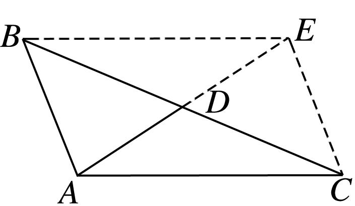  
（3）在△*ABC*中，*B*＝120°，*AB*＝，*A*的角平分线*AD*＝，则*AC*＝\_\_\_\_\_\_\_\_．
答案　　解析　如图，在△*ABD*中，由正弦定理，得＝，∴sin∠*ADB*＝.

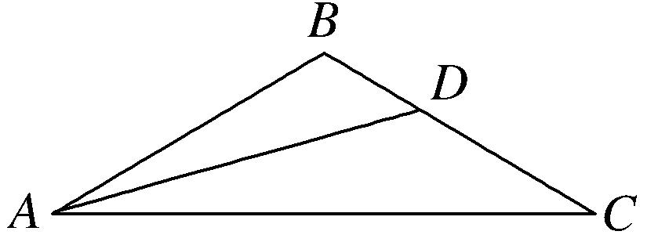
由题意知0°<∠*ADB*<60°，∴∠*ADB*＝45°，∴∠*BAD*＝180°－45°－120°＝15°．∴∠*BAC*＝30°，*C*＝30°，∴*BC*＝*AB*＝.在△*ABC*中，由正弦定理，得＝，∴*AC*＝．  
（4）在△*ABC*中，内角*A*，*B*，*C*所对的边分别为*a*，*b*，*c*，若tan*C*＝，*a*＝*b*＝，*BC*边上的中点为*D*，则sin∠*BAC*＝\_\_\_\_\_\_\_\_，*AD*＝\_\_\_\_\_\_\_\_．
答案　　　解析　因为tan <em>C</em>＝，所以sin <em>C</em>＝，cos <em>C</em>＝，又<em>a</em>＝<em>b</em>＝，所以<em>c</em>2＝<em>a</em>2＋<em>b</em>2－2<em>ab</em>cos <em>C</em>＝13＋13－2×××＝16，所以<em>c</em>＝4．由＝，得＝，解得sin∠<em>BAC</em>＝．因为<em>BC</em>边上的中点为<em>D</em>，所以<em>CD</em>＝，所以在△<em>ACD</em>中，<em>AD</em>2＝<em>b</em>2＋2－2×<em>b</em>××cos <em>C</em>＝，所以<em>AD</em>＝．  
（5）已知△*ABC*的内角*A*，*B*，*C*所对的边分别为*a*，*b*，*c*，*BC*边上的中线长为2，高线长为，且*b*tan*A*＝(2*c*－*b*)tan *B*，则*bc*的值为\_\_\_\_\_\_\_\_．
答案　8　解析　因为<em>b</em>tan <em>A</em>＝(2<em>c</em>－<em>b</em>)tan <em>B</em>，所以＝－1，所以1＋＝，根据正弦定理，得1＋＝，即＝．因为sin(<em>A</em>＋<em>B</em>)＝sin <em>C</em>≠0，sin <em>B</em>≠0，所以cos <em>A</em>＝，所以<em>A</em>＝．设<em>BC</em>边上的中线为<em>AM</em>，则<em>AM</em>＝2，因为<em>M</em>是<em>BC</em>的中点，所以＝(＋)，即2＝(2＋2＋2·)，所以<em>c</em>2＋<em>b</em>2＋<em>bc</em>＝32　①．设<em>BC</em>边上的高线为<em>AH</em>，由<em>S</em>△<em>ABC</em>＝<em>AH</em>·<em>BC</em>＝<em>bc</em>·sin <em>A</em>，得<em>bc</em>＝，即<em>bc</em>＝2<em>a</em>　②，根据余弦定理，得<em>a</em>2＝<em>c</em>2＋<em>b</em>2－<em>bc</em>　③，联立①②③得2＝32－2<em>bc</em>，解得<em>bc</em>＝8或<em>bc</em>＝－16(舍去)．  
（6）已知等腰三角形的底边长为6，一腰长为12，则它的内切圆面积为\_\_\_\_\_\_\_\_．
答案　　解析　不妨设<em>a</em>＝6，<em>b</em>＝<em>c</em>＝12，由余弦定理得cos <em>A</em>＝＝＝，∴sin<em>A</em>＝＝．由(<em>a</em>＋<em>b</em>＋<em>c</em>)<em>r</em>＝<em>bc</em>sin <em>A</em>，得<em>r</em>＝．∴<em>S</em>内切圆＝π<em>r</em>2＝．  
（7）在△<em>ABC</em>中，内角<em>A</em>，<em>B</em>，<em>C</em>的对边分别为<em>a</em>，<em>b</em>，<em>c</em>．若△<em>ABC</em>的面积为<em>S</em>，且<em>a</em>＝1，4<em>S</em>＝<em>b</em>2＋<em>c</em>2－1，则△<em>ABC</em>外接圆的面积为(　　)

A．4π　　　　　　　　
B．2π　　　　　　　　
C．π　　　　　　　　
D．
答案　D　解析　由余弦定理得，<em>b</em>2＋<em>c</em>2－<em>a</em>2＝2<em>bc</em>cos <em>A</em>，<em>a</em>＝1，所以<em>b</em>2＋<em>c</em>2－1＝2<em>bc</em>cos<em>A</em>，又<em>S</em>＝<em>bc</em>sin<em>A，</em>4<em>S</em>＝<em>b</em>2＋<em>c</em>2－1，所以4×<em>bc</em>sin<em>A</em>＝2<em>bc</em>cos<em>A</em>，即sin<em>A</em>＝cos<em>A</em>，所以<em>A</em>＝，由正弦定理得，＝2<em>R</em>，得<em>R</em>＝，所以△<em>ABC</em>外接圆的面积为．  
（8）设△*ABC*内切圆与外接圆的半径分别为*r*与*R*，且sin *A*∶sin *B*∶sin *C*＝2∶3∶4，则cos *C*＝\_\_\_\_\_\_\_\_；当*BC*＝1时，△*ABC*的面积为\_\_\_\_\_\_\_\_．
答案　－　　解析　∵sin <em>A</em>∶sin <em>B</em>∶sin <em>C</em>＝2∶3∶4，∴由正弦定理得<em>a</em>∶<em>b</em>∶<em>c</em>＝2∶3∶4．令<em>a</em>＝2<em>t</em>，<em>b</em>＝3<em>t</em>，<em>c</em>＝4<em>t</em>，则cos <em>C</em>＝＝－，∴sin <em>C</em>＝．当<em>BC</em>＝1时，<em>AC</em>＝，∴<em>S</em>△<em>ABC</em>＝×1××＝．  
（9）在△*ABC*中，*D*为边*AC*上一点，*AB*＝*AC*＝6，*AD*＝4，若△*ABC*的外心恰在线段*BD*上，则*BC*＝\_\_\_\_\_．
答案　3　解析　解法1　如图1，设△<em>ABC</em>的外心为<em>O</em>，连结<em>AO</em>，则<em>AO</em>是∠<em>BAC</em>的平分线，所以＝＝，所以＝＋＝＋＝＋(－)，即＝＋，两边同时点乘得·＝()2＋·，即18＝×36＋×6×4cos∠<em>BAC</em>，所以cos∠<em>BAC</em>＝，则<em>BC</em>＝＝3．(说明：两边同时点乘也是一样的)

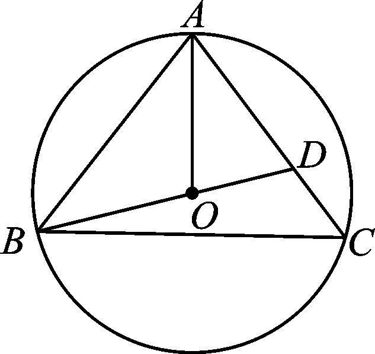

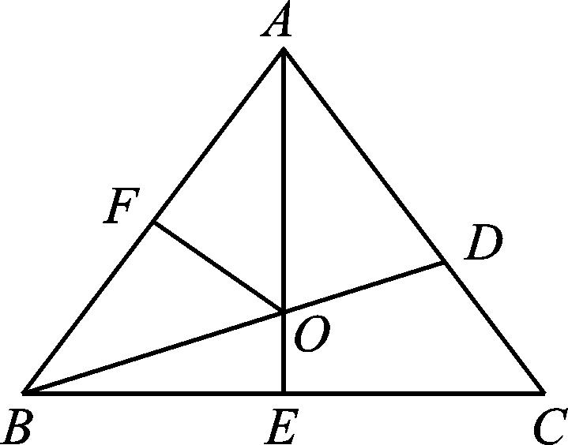

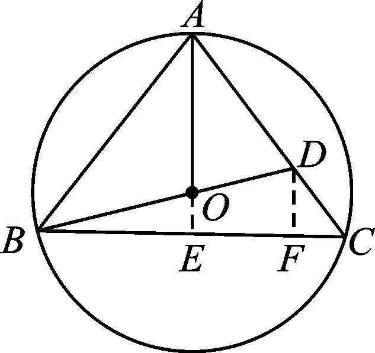  
图1　　　　　　　　　　　图2　　　　　　　　　　　　图3
解法2　如图2，设∠<em>BAC</em>＝2<em>α</em>，外接圆的半径为<em>R</em>，由<em>S</em>△<em>ABO</em>＋<em>S</em>△<em>ADO</em>＝<em>S</em>△<em>ABD</em>，得·6<em>R</em>sin<em>α</em>＋·4<em>R</em>sin<em>α</em>＝·6·4sin2<em>α</em>，化简得24cos<em>α</em>＝5<em>R．</em>在Rt△<em>AFO</em>中，<em>R</em>cos<em>α</em>＝3，联立解得<em>R</em>＝，cos<em>α</em>＝，所以sin<em>α</em>＝，所以<em>BC</em>＝2<em>BE</em>＝2<em>AB</em>sin<em>α</em>＝12×＝3．
解法3　如图3，延长<em>AO</em>交<em>BC</em>于点<em>E</em>，过点<em>D</em>作<em>BC</em>的垂线，垂足为<em>F</em>，则＝＝，＝＝．又<em>DF</em>∥<em>AE</em>，则＝＝，所以＝．设<em>OE</em>＝<em>x</em>，则<em>AE</em>＝5<em>x</em>，所以<em>OB</em>＝<em>OA</em>＝4<em>x</em>，所以<em>BE</em>＝<em>x．</em>又因为25<em>x</em>2＋15<em>x</em>2＝36，所以<em>x</em>＝3，所以<em>BC</em>＝2<em>BE</em>＝3．  
（10）已知△<em>ABC</em>的外接圆半径为<em>R</em>，且满足2<em>R</em>(sin2<em>A</em>－sin2<em>C</em>)＝(<em>a</em>－<em>b</em>)·sin<em>B</em>，则△<em>ABC</em>面积的最大值为\_\_\_\_\_\_\_\_．
答案　<em>R</em>2　解析　由正弦定理得<em>a</em>2－<em>c</em>2＝(<em>a</em>－<em>b</em>)<em>b</em>，即<em>a</em>2＋<em>b</em>2－<em>c</em>2＝<em>ab</em>．由余弦定理得cos <em>C</em>＝＝＝，∵<em>C</em>∈(0，π)，∴<em>C</em>＝．∴<em>S</em>＝<em>ab</em>sin <em>C</em>＝×2<em>R</em>sin <em>A</em>·2<em>R</em>sin <em>B</em>·＝<em>R</em>2sin <em>A</em>sin <em>B</em>＝<em>R</em>2sin <em>A</em>sin＝<em>R</em>2sin <em>A</em>＝<em>R</em>2(sin <em>A</em>cos <em>A</em>＋sin2<em>A</em>)＝<em>R</em>2＝<em>R</em>2，∵<em>A</em>∈，∴2<em>A</em>－∈，∴sin∈，∴<em>S</em>∈，∴面积<em>S</em>的最大值为<em>R</em>2．

【对点训练】

1．在△*ABC*中，*AB*＝3，*BC*＝，*AC*＝4，则*AC*边上的高为\_\_\_\_\_\_\_\_．

1．答案　　解析　由余弦定理可知13＝9＋16－2×3×4×cos *A*，得cos *A*＝，又*A*为三角形的内角，
∴*A*＝，∴*h*＝*AB*·sin *A*＝．

2．如图所示，在△*ABC*中，已知*BC*＝15，*AB*∶*AC*＝7∶8，sin *B*＝，则*BC*边上的高*AD*的长为\_\_\_\_\_．

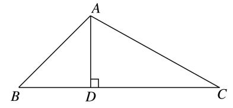

2．答案　12或20　解析　在△*ABC*中，由已知设*AB*＝7*x*，*AC*＝8*x*，*x*>0，由正弦定理，得＝

，∴sin <em>C</em>＝＝×＝．又∵0°&lt;<em>C</em>&lt;180°，∴<em>C</em>＝60°或120°．若<em>C</em>＝120°，由8<em>x</em>&gt;7<em>x</em>，知<em>B</em>也为钝角，不合题意，故<em>C</em>≠120°．∴<em>C</em>＝60°．由余弦定理，得(7<em>x</em>)2＝(8<em>x</em>) 2＋152－2×8<em>x</em>×15cos 60°，∴<em>x</em>2－8<em>x</em>＋15＝0，解得<em>x</em>＝3或<em>x</em>＝5．∴<em>AB</em>＝21或<em>AB</em>＝35．在Rt△<em>ADB</em>中，<em>AD</em>＝<em>AB</em>sin <em>B</em>＝<em>AB</em>，∴<em>AD</em>＝12或20．

3．(2016·全国Ⅲ)在△*ABC*中，*B*＝，*BC*边上的高等于*BC*，则cos*A*＝(　　)

A．　　　　　　　　
B．　　　　　　　　
C．－　　　　　　　　
D．－

3．答案　C　解析　设△<em>ABC</em>中角<em>A</em>，<em>B</em>，<em>C</em>所对的边分别为<em>a</em>，<em>b</em>，<em>c</em>，则由题意得<em>S</em>△<em>ABC</em>＝<em>a</em>·<em>a</em>＝<em>ac</em>sin<em>B</em>，
又<em>B</em>＝，所以<em>c</em>＝<em>a</em>．由余弦定理得<em>b</em>2＝<em>a</em>2＋<em>c</em>2－2<em>ac</em>cos<em>B</em>＝<em>a</em>2＋<em>a</em>2－2×<em>a</em>×<em>a</em>×＝<em>a</em>2，所以<em>b</em>＝<em>a</em>．所以cos<em>A</em>＝＝＝－．

另解　设*BC*边上的高*AD*交*BC*于点*D*，由题意知*B*＝，*BD*＝*BC*，*DC*＝*BC*，tan∠*BAD*

＝1，tan∠*CAD*＝2，tan *A*＝＝－3，所以cos*A*＝－．

4．在锐角△*ABC*中，内角，所对的边分别为*a*，*b*，*c*，*b*＝4，*c*＝6且*a*sin*B*＝2，*D*为*BC*的中点，则

*AD*的长为\_\_\_\_\_\_\_\_．

4．答案　　解析　方法1　由正弦定理可得，又由，可得

，又由锐角△，可得，由为的中点可得，两边平方可得，即．

方法2　由正弦定理可得，又由，可得，又由锐角

△，可得，在△中, 由余弦定理可得，即

，，所以在△中，由余弦定理可得

，即．

5．在△*ABC*中，*AB*＝7，*AC*＝6，*M*是*BC*的中点，*AM*＝4，则*BC*等于\_\_\_\_\_\_\_\_．

5．答案　　解析　设<em>BC</em>＝<em>a</em>，则<em>BM</em>＝<em>CM</em>＝．在△<em>ABM</em>中，<em>AB</em>2＝<em>BM</em>2＋<em>AM</em>2－2<em>BM</em>·<em>AM</em>cos∠<em>AMB</em>，
即72＝＋42－2××4·cos∠<em>AMB</em>．①，在△<em>ACM</em>中，<em>AC</em>2＝<em>AM</em> 2＋<em>CM</em> 2－2<em>AM</em>·<em>CM</em>·cos∠<em>AMC，</em>即62＝42＋＋2×4×·cos∠<em>AMB</em>．②，①＋②得72＋62＝42＋42＋，∴<em>a</em>＝．

6．在△*ABC*中，*AD*为边*BC*上的中线，*AB*＝1，*AD*＝5，∠*ABC*＝45°，则sin∠*ADC*＝\_\_\_\_\_\_\_\_，*AC*＝

\_\_\_\_\_\_\_\_．

6．答案　　　解析　在△*ABD*中，由正弦定理，得＝，所以sin∠*ADB*＝×sin

∠<em>ABC</em>＝×sin 45°＝，所以sin∠<em>ADC</em>＝sin(180°－∠<em>ADB</em>)＝sin∠<em>ADB</em>＝．由余弦定理，得<em>AD</em>2＝<em>AB</em>2＋<em>BD</em>2－2<em>AB</em>·<em>BD</em>cos∠<em>ABD</em>，所以52＝12＋<em>BD</em>2－2<em>BD</em>cos45°，得<em>BD</em>＝4，因为<em>AD</em>为△<em>ABC</em>的边<em>BC</em>上的中线，所以<em>BC</em>＝2<em>BD</em>＝8．在△<em>ABC</em>中，由余弦定理，得<em>AC</em>2＝<em>AB</em>2＋<em>BC</em>2－2<em>AB</em>·<em>BC</em>cos∠<em>ABC</em>＝12＋（8）2－2×1×8×cos 45°＝113，所以<em>AC</em>＝．

7．在△*ABC*中，已知*AB*＝，cos∠*ABC*＝，*AC*边上的中线*BD*＝，则sin*A*的值\_\_\_\_\_\_\_\_．

7．答案　　解析　如图所示，取*BC*的中点*E*，连接*DE*，则*DE*∥*AB*，且*DE*＝*AB*＝．

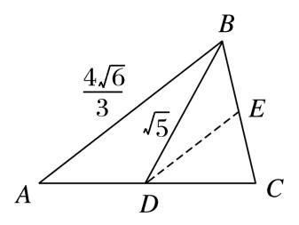
∵cos∠<em>ABC</em>＝，∴cos∠<em>BED</em>＝－．设<em>BE</em>＝<em>x</em>，在△<em>BDE</em>中，利用余弦定理，可得<em>BD</em>2＝<em>BE</em>2＋<em>ED</em>2－2<em>BE</em>·<em>ED</em>·cos∠<em>BED</em>，即5＝<em>x</em>2＋＋2××<em>x</em>．解得<em>x</em>＝1或<em>x</em>＝－(舍去)，故<em>BC</em>＝2．在△<em>ABC</em>中，利用余弦定理，可得<em>AC</em>2＝<em>AB</em>2＋<em>BC</em>2－2<em>AB</em>·<em>BC</em>·cos∠<em>ABC</em>＝，即<em>AC</em>＝．又sin∠<em>ABC</em>＝＝，∴＝，∴sin <em>A</em>＝．

８．在△*ABC*中，*A*＝105°，*B*＝30°，*a*＝，则*B*的角平分线的长是\_\_\_\_\_\_\_\_．

８．答案　1　解析　设*B*的角平分线的长为*BD*．易知∠*ACB*＝180°－105°－30°＝45°，∠*BDC*＝180°－

15°－45°＝120°．在△*CBD*中，有＝，可得*BD*＝1．

9．已知△*ABC*的内角*A*，*B*，*C*的对边分别为*a*，*b*，*c*，*A*＝60°，*b*＝3*c*，角*A*的平分线交*BC*于点*D*，且

*BD*＝，则cos ∠*ADB*的值为(　　)

A．－　　　　　　　　
B．　　　　　　　　
C．　　　　　　　　
D．±

9．答案　B　解析　法一　如图，因为∠*BAC*＝60°，*AD*为∠*BAC*的平分线，所以∠*CAD*＝∠*BAD*＝30°．又

*b*＝3*c*，

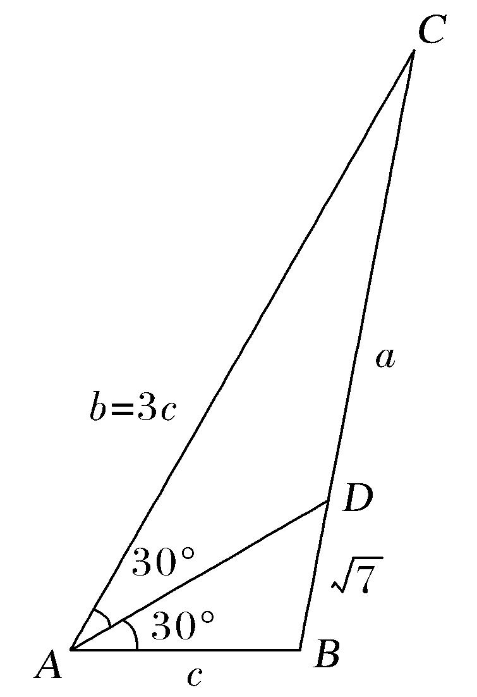
所以＝＝＝＝3．因为<em>BD</em>＝，所以<em>CD</em>＝3，所以<em>a</em>＝<em>CB</em>＝4．因为<em>a</em>2＝<em>b</em>2＋<em>c</em>2－2<em>bc</em>cos ∠<em>CAB</em>，所以16×7＝9<em>c</em>2＋<em>c</em>2－2·3<em>c</em>·<em>c</em>·，解得<em>c</em>＝4．在△<em>ABD</em>中，由正弦定理，知＝，即＝，所以sin ∠<em>ADB</em>＝．因为<em>b</em>＝3<em>c</em>&gt;<em>c</em>，所以<em>B</em>&gt;<em>C</em>．因为∠<em>ADB</em>＝30°＋<em>C</em>，∠<em>ADC</em>＝30°＋<em>B</em>，所以∠<em>ADB</em>&lt;∠<em>ADC</em>，又∠<em>ADB</em>＋∠<em>ADC</em>＝180°，所以∠<em>ADB</em>为锐角，所以cos ∠<em>ADB</em>＝＝＝＝．故选B．

法二　因为∠<em>BAC</em>＝60°，<em>AD</em>为∠<em>BAC</em>的平分线，所以∠<em>CAD</em>＝∠<em>BAD</em>＝30°．又<em>b</em>＝3<em>c</em>，所以＝＝＝＝3．因为<em>BD</em>＝，所以<em>CD</em>＝3，所以<em>a</em>＝<em>CB</em>＝4．因为<em>a</em>2＝<em>b</em>2＋<em>c</em>2－2<em>bc</em>cos ∠<em>BAC</em>，所以16×7＝9<em>c</em>2＋<em>c</em>2－2·3<em>c</em>·<em>c</em>·，解得<em>c</em>＝4．由余弦定理，得cos ∠<em>BAD</em>＝，即＝，所以<em>AD</em>2－4<em>AD</em>＋9＝0，所以(<em>AD</em>－)(<em>AD</em>－3)＝0．所以<em>AD</em>＝3或<em>AD</em>＝．因为<em>b</em>＝3<em>c</em>&gt;<em>c</em>，所以<em>B</em>&gt;<em>C</em>．又<em>B</em>＋<em>C</em>＝120°，所以<em>B</em>&gt;60°&gt;∠<em>BAD</em>，所以<em>AD</em>&gt;<em>BD</em>＝，所以<em>AD</em>＝3，所以cos ∠<em>ADB</em>＝＝＝．故选B．

10．在△*ABC*中，角*A*，*B*，*C*的对边分别是*a*，*b*，*c*，已知*A*＝，*b*＝1，△*ABC*的外接圆半径为1，则

△*ABC*的面积*S*＝\_\_\_\_\_\_\_\_．

10．答案　　解析　由正弦定理＝＝2*R*，得*a*＝，sin*B*＝，∵*a*>*b*，∴*A*>*B*，∴*B*＝，*C*＝，
∴<em>S</em>△<em>ABC</em>＝××1＝．

11．在△<em>ABC</em>中，内角<em>A</em>，<em>B</em>，<em>C</em>所对的边分别为<em>a</em>，<em>b</em>，<em>c</em>，<em>a</em>＝1，<em>B</em>＝45°，<em>S</em>△<em>ABC</em>＝2，则△<em>ABC</em>的外接圆

直径为\_\_\_\_\_\_\_\_．

11．答案　5　解析　∵<em>S</em>△<em>ABC</em>＝<em>ac</em>·sin <em>B</em>＝<em>c</em>·sin 45°＝<em>c</em>＝2，∴<em>c</em>＝4，∴<em>b</em>2＝<em>a</em>2＋<em>c</em>2－2<em>ac</em>cos 45°

＝25，∴*b*＝5，∴△*ABC*的外接圆直径为＝5．

12．△*ABC*的两边长分别为2，3，其夹角的余弦值为，则其外接圆的直径为\_\_\_\_\_\_\_\_．

12．答案　　解析　设另一条边的边长为<em>x</em>，则<em>x</em>2＝22＋32－2×2×3×，∴<em>x</em>2＝9，∴<em>x</em>＝3．设cos<em>θ</em>

＝，则sin *θ*＝，∴2*R*＝＝＝．

13．已知三角形两边长分别为1和，第三边上的中线长为1，则三角形的外接圆半径为\_\_\_\_\_\_\_\_．

13．答案　1　解析　如图，*AB*＝1，*BD*＝1，*BC*＝，设*AD*＝*DC*＝*x*，在△*ABD*中，cos∠*ADB*＝

＝，在△*BDC*中，cos∠*BDC*＝＝，∵∠*ADB*与∠*BDC*互补，∴cos∠*ADB*＝－cos∠*BDC*，∴＝－，∴*x*＝1，∴∠*A*＝60°，由＝2*R*，得*R*＝1．

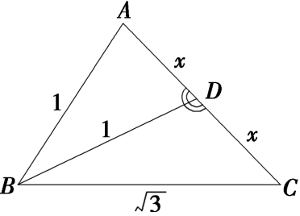

14．△*ABC*的内角*A*，*B*，*C*的对边分别为*a*，*b*，*c*，若cos*C*＝，*b*cos*A*＋*a*cos*B*＝2，则△*ABC*的外接

圆面积为(　　)

A．4π　　　　　　　　
B．8π　　　　　　　　
C．9π　　　　　　　　
D．36π

14．答案　C　解析　由题意及正弦定理得2*R*sin *B*cos *A*＋2*R*sin *A*cos *B*＝2*R*sin(*A*＋*B*)＝2(*R*为△*ABC*的外
接圆半径)．即2<em>R</em>sin <em>C</em>＝2．又cos <em>C</em>＝及<em>C</em>∈(0，π)，知sin <em>C</em>＝．∴2<em>R</em>＝＝6，<em>R</em>＝3．故△<em>ABC</em>外接圆面积<em>S</em>＝π<em>R</em>2＝9π．

15．已知圆的半径为4，*a*，*b*，*c*为该圆的内接三角形的三边，若*abc*＝16，则三角形的面积为\_\_\_\_\_\_\_\_．

15．答案　　解析　∵＝＝＝2<em>R</em>＝8，∴sin <em>C</em>＝，∴<em>S</em>△<em>ABC</em>＝<em>ab</em>sin <em>C</em>＝＝＝

16．如图所示，已知圆内接四边形*ABCD*中*AB*＝3，*AD*＝5，*BD*＝7，∠*BDC*＝45°，则*BC*＝\_\_\_\_\_\_\_\_．

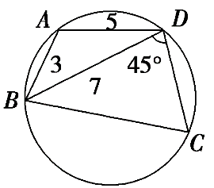

16．答案　　解析　cos *A*＝＝－，∴*A*＝120°，∴*C*＝60°．从而＝，∴*BC*＝

＝＝．

17．在外接圆半径为的△*ABC*中，*a*，*b*，*c*分别为内角*A*，*B*，*C*的对边，且2*a*sin *A*＝(2*b*＋*c*)sin *B*＋(2*c*

＋*b*)sin *C*，则*b*＋*c*的最大值是(　　)

A．1　　　　　　　　
B．　　　　　　　　
C．3　　　　　　　　
D．

17．答案　A　解析　根据正弦定理得2<em>a</em>2＝(2<em>b</em>＋<em>c</em>)<em>b</em>＋(2<em>c</em>＋<em>b</em>)<em>c</em>，即<em>a</em>2＝<em>b</em>2＋<em>c</em>2＋<em>bc</em>，又<em>a</em>2＝<em>b</em>2＋<em>c</em>2－2<em>bc</em>cos

*A*，所以cos *A*＝－，*A*＝120°．因为△*ABC*外接圆半径为，所以由正弦定理得*b*＋*c*＝sin *B*·2*R*＋sin *C*·2*R*＝sin *B*＋sin(60°－*B*)＝sin *B*＋cos *B*＝sin(*B*＋60°)，故当*B*＝30°时，*b*＋*c*取得最大值1．

18．在△*ABC*中，*a*，*b*，*c*分别为三个内角*A*，*B*，*C*的对边，且*BC*边上的高为*a*，则＋取得最大值

时，内角*A*的值为(　　)

A．　　　　　　　　
B．　　　　　　　　
C．　　　　　　　　
D．

18．答案　D　解析　利用等面积法可得，·<em>a</em>·<em>a</em>＝·<em>b</em>·<em>c</em>·sin<em>A</em>，整理得<em>a</em>2＝2<em>bc</em>sin<em>A</em>．∴＋＝

＝＝2sin*A*＋2cos*A*＝4sin，当*A*＋＝时，＋取得最大值，此时*A*＝．

考点二　计算三角形的面积

【方法总结】

三角形面积问题的题型及解题策略

三角形的面积是与解三角形息息相关的内容，经常出现在高考题中，难度不大．解题的前提条件是熟练掌握三角形面积公式，具体的题型及解题策略为：  
（1）利用正弦定理、余弦定理解三角形，求出三角形的有关元素之后，直接求三角形的面积，或求出两边之积及夹角正弦，再求解．  
（2）把面积作为已知条件之一，与正弦定理、余弦定理结合求出三角形的其他各量．面积公式中涉及面积、两边及两边夹角正弦四个量，结合已知条件列方程求解．

【例题选讲】

<strong>[例2]</strong>（1）(2014·福建)在△<em>ABC</em>中，<em>A</em>＝60°，<em>AC</em>＝4，<em>BC</em>＝2，则△<em>ABC</em>的面积等于\_\_\_\_\_\_\_\_．
答案　2　解析　在△<em>ABC</em>中，由正弦定理得＝，解得sin<em>B</em>＝1，所以<em>B</em>＝90°，所以<em>S</em>△<em>ABC</em>＝×<em>AB</em>×2＝××2＝2．  
（2）(2019·全国Ⅱ)△*ABC*的内角内角*A*，*B*，*C*所对的边分别是*a*，*b*，*c*．若*b*＝6，*a*＝2*c*，*B*＝，则△*BDC*的面积是\_\_\_\_\_\_\_\_．

答案　　解析　由余弦定理得，所以，即，解得（舍去），所以，．  
（3）(2018·全国Ⅰ)在△<em>ABC</em>中，内角<em>A</em>，<em>B</em>，<em>C</em>所对的边分别是<em>a</em>，<em>b</em>，<em>c</em>，已知<em>b</em>sin<em>C</em>＋<em>c</em>sin<em>B</em>＝4<em>a</em>sin<em>B</em>sin<em>C</em>，<em>b</em>2＋<em>c</em>2－<em>a</em>2＝8，则△<em>ABC</em>的面积为\_\_\_\_\_\_\_\_\_\_．
答案　　解析　已知<em>b</em>sin<em>C</em>＋<em>c</em>sin<em>B</em>＝4<em>a</em>sin<em>B</em>sin<em>C</em>⇒2sin<em>B</em>sin<em>C</em>＝4sin<em>A</em>·sin<em>B</em>sin<em>C</em>，所以sin<em>A</em>＝，由<em>b</em>2＋<em>c</em>2－<em>a</em>2＝8&gt;0知<em>A</em>为锐角，所以cos <em>A</em>＝，所以＝＝，所以<em>bc</em>＝＝，所以<em>S</em>△<em>ABC</em>＝<em>bc</em>sin<em>A</em>＝××＝．  
（4）(2017·浙江)已知△*ABC*，*AB*＝*AC*＝4，*BC*＝2．点*D*为*AB*延长线上一点，*BD*＝2，连接*CD*，则△*BDC*的面积是\_\_\_\_\_\_\_\_，cos∠*BDC*＝\_\_\_\_\_\_\_\_．
答案　　　解析　在△<em>ABC</em>中，<em>AB</em>＝<em>AC</em>＝4，<em>BC</em>＝2，由余弦定理得cos∠<em>ABC</em>＝＝＝，则sin∠<em>ABC</em>＝sin∠<em>CBD</em>＝，所以<em>S</em>△<em>BDC</em>＝<em>BD</em>·<em>BC</em>sin∠<em>CBD</em>＝．因为<em>BD</em>＝<em>BC</em>＝2，所以∠<em>BDC</em>＝∠<em>ABC</em>，则cos∠<em>BDC</em>＝＝．  
（5）△*ABC*的内角*A*，*B*，*C*的对边分别为*a*，*b*，*c*，若cos*A*＝，cos*C*＝，*a*＝1，则△*ABC*的面积*S*＝\_\_\_\_\_\_\_\_．
答案　　解析　在△*ABC*中，由cos*A*＝，cos*C*＝，可得sin*A*＝，sin*C*＝，sin*B*＝sin(*A*＋*C*)＝sin*A*cos*C*＋cos*A*·sin*C*＝，又*a*＝1，由正弦定理得*b*＝＝．所以*S*＝*ab*sin*C*＝×1××＝．  
（6）在△*ABC*中，*A*，*B*，*C*的对边分别为*a*，*b*，*c*，且*b*cos*C*＝3*a*cos*B*－*c*cos*B*，·＝2，则△*ABC*的面积为\_\_\_\_\_\_\_\_．
答案　2　解析　因为<em>b</em>cos<em>C</em>＝3<em>a</em>cos<em>B</em>－<em>c</em>cos<em>B</em>，由正弦定理得sin<em>B</em>cos<em>C</em>＝3sin<em>A</em>cos<em>B</em>－sin<em>C</em>cos<em>B</em>，即sin<em>B</em>cos<em>C</em>＋sin<em>C</em>cos<em>B</em>＝3sin<em>A</em>cos<em>B</em>，所以sin(<em>B</em>＋<em>C</em>)＝3sin<em>A</em>cos<em>B</em>．又sin(<em>B</em>＋<em>C</em>)＝sin(π－<em>A</em>)＝sin<em>A</em>，所以sin<em>A</em>＝3sin<em>A</em>cos<em>B</em>，又sin<em>A</em>≠0，解得cos<em>B</em>＝，所以sin<em>B</em>＝＝＝．由·＝2，可得<em>ca</em>cos<em>B</em>＝2，解得<em>ac</em>＝6．所以<em>S</em>△<em>ABC</em>＝<em>ac</em>·sin<em>B</em>＝·6·＝2．  
（7）△*ABC*的内角*A*，*B*，*C*的对边分别为*a*，*b*，*c*．已知sin(*B*＋*A*)＋sin(*B*－*A*)＝2sin2*A*，且*c*＝，*C*＝，则△*ABC*的面积是(　　)

A．　　　　　　　　
B．3　　　　　　　　
C．或1　　　　　　　　
D．或3
答案　A　解析　∵在△<em>ABC</em>中，<em>C</em>＝，∴<em>B</em>＝－<em>A</em>，<em>B</em>－<em>A</em>＝－2<em>A</em>，∵sin(<em>B</em>＋<em>A</em>)＋sin(<em>B</em>－<em>A</em>)＝2sin2<em>A</em>，∴sin <em>C</em>＋sin＝2sin 2<em>A</em>，即sin <em>C</em>＋cos 2<em>A</em>＋sin 2<em>A</em>＝2sin 2<em>A</em>，整理得sin＝sin<em>C</em>＝，∴sin＝．又<em>A</em>∈，∴2<em>A</em>－＝或，解得<em>A</em>＝或．当<em>A</em>＝时，<em>B</em>＝，tan<em>C</em>＝＝＝，解得<em>a</em>＝，∴<em>S</em>△<em>ABC</em>＝<em>ac</em>sin<em>B</em>＝；当<em>A</em>＝时，<em>B</em>＝，tan<em>C</em>＝＝＝，解得<em>b</em>＝，∴<em>S</em>△<em>ABC</em>＝<em>bc</em>＝．综上，△<em>ABC</em>的面积是．  
（8）已知四边形*ABCD*中，*AB*＝2，*BC*＝*CD*＝4，*DA*＝6，且*D*＝60°，试求四边形*ABCD*的面积．

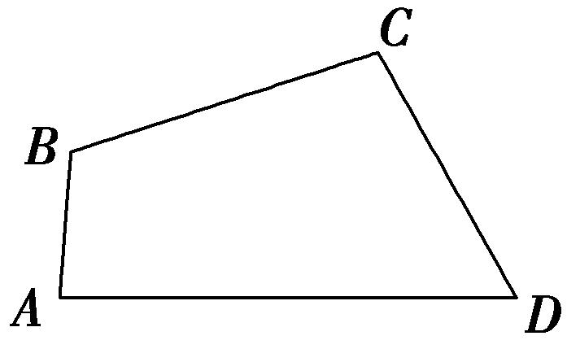
答案　8　解析　连接<em>AC</em>，在△<em>ACD</em>中，由<em>AD</em>＝6，<em>CD</em>＝4，<em>D</em>＝60°，可得<em>AC</em>2＝<em>AD</em>2＋<em>DC</em>2－2<em>AD</em>·<em>DC</em>cos <em>D</em>＝62＋42－2×4×6cos 60°＝28，在△<em>ABC</em>中，由<em>AB</em>＝2，<em>BC</em>＝4，<em>AC</em>2＝28，可得cos <em>B</em>＝＝＝－．又0°&lt;<em>B</em>&lt;180°，故<em>B</em>＝120°．所以四边形<em>ABCD</em>的面积<em>S</em>＝<em>S</em>△<em>ACD</em>＋<em>S</em>△<em>ABC</em>＝<em>AD</em>·<em>CD</em>sin <em>D</em>＋<em>AB</em>·<em>BC</em>sin <em>B</em>＝×4×6sin 60°＋×2×4sin 120°＝8．

【对点训练】

1．我国南宋著名数学家秦九韶发现了从三角形三边求三角形面积的“三斜公式”，设△*ABC*三个内角*A*，*B*，

<em>C</em>所对的边分别为<em>a</em>，<em>b</em>，<em>c</em>，面积为<em>S</em>，则“三斜求积”公式为<em>S</em>＝．若<em>a</em>2sin<em>C</em>＝4sin<em>A</em>，(<em>a</em>＋<em>c</em>)2＝12＋<em>b</em>2，则用“三斜求积”公式求得△<em>ABC</em>的面积为(　　)

A．　　　　　　　　
B．2　　　　　　　　
C．3　　　　　　　　
D．

1．答案　A　解析　由正弦定理得<em>a</em>2<em>c</em>＝4<em>a</em>，所以<em>ac</em>＝4，且<em>a</em>2＋<em>c</em>2－<em>b</em>2＝12－2<em>ac</em>＝4，代入面积公式得

＝．

2．在△*ABC*中，内角*A*，*B*，*C*对应的边分别为*a*，*b*，*c*，已知*a*＝2，*c*＝2，且*C*＝，则△*ABC*的面积

为(　　)

A．＋1　　　　　　　
B．－1　　　　　　　
C．4　　　　　　　
D．2

2．答案　A　解析　由正弦定理＝＝，得＝，所以sin*A*＝，又*a*<*c*，所以*A*＝，

sin<em>B</em>＝sin(<em>A</em>＋<em>C</em>)＝sin<em>A</em>cos<em>C</em>＋cos<em>A</em>sin<em>C</em>＝，所以<em>S</em>△<em>ABC</em>＝<em>ac</em>sin <em>B</em>＝×2×2×＝＋1．

3．(2013·全国Ⅱ)△*ABC*的内角*A*，*B*，*C*的对边分别为*a*，*b*，*c*，已知*b*＝2，*B*＝，*C*＝，则△*ABC*的

面积为(　　)

A．2＋2　　　　　　　
B．＋1　　　　　　　
C．2－2　　　　　　　
D．－1

3．答案　B　解析　因为*B*＝，*C*＝，所以*A*＝．由正弦定理得＝，解得*c*＝2．所以三角

形的面积为*bc*sin*A*＝×2×2sin．因为sin＝sin＝×＋×＝，所以*bc*sin*A*＝2×＝＋1，故选B．

4．已知在△*ABC*中，内角*A*，*B*，*C*所对的边分别为*a*，*b*，*c*．若*a*＝2*b*cos*A*，*B*＝，*c*＝1，则△*ABC*

的面积为\_\_\_\_\_\_\_\_．

4．答案　　解析　∵*a*＝2*b*cos*A*，∴由正弦定理可得sin*A*＝2sin*B*·cos*A*．∵*B*＝，∴sin*A*＝cos*A*，
∴tan<em>A</em>＝．又∵<em>A</em>为△<em>ABC</em>的内角，∴<em>A</em>＝．又<em>B</em>＝，∴<em>C</em>＝π－<em>A</em>－<em>B</em>＝，∴△<em>ABC</em>为等边三角形，∴<em>S</em>△<em>ABC</em>＝<em>ac</em>sin <em>B</em>＝×1×1×＝．

5．在△*ABC*中，内角*A*，*B*，*C*的对边分别为*a*，*b*，*c*．已知cos*A*＝，sin*B*＝cos*C*，并且*a*＝，则

△*ABC*的面积为\_\_\_\_\_\_\_\_．

5．答案　　解析　因为0<*A*<π，cos*A*＝，所以sin*A*＝＝．又由cos*C*＝sin*B*＝sin(*A*

＋<em>C</em>)＝sin<em>A</em>cos<em>C</em>＋cos<em>A</em>sin<em>C</em>＝cos<em>C</em>＋sin<em>C</em>知，cos<em>C</em>&gt;0，并结合sin2<em>C</em>＋cos2<em>C</em>＝1，得sin<em>C</em>＝，cos<em>C</em>＝．于是sin<em>B</em>＝cos<em>C</em>＝．由<em>a</em>＝及正弦定理＝，得<em>c</em>＝．故△<em>ABC</em>的面积<em>S</em>＝<em>ac</em>sin<em>B</em>＝．

6．在△*ABC*中，角*A*，*B*，*C*所对的边分别为*a*，*b*，*c*，且(2*b*－*a*)cos*C*＝*c*cos*A*，*c*＝3，sin*A*＋sin*B*＝2

sin*A*sin*B*，则△*ABC*的面积为(　　)

A．　　　　　　　　
B．2　　　　　　　　　
C．　　　　　　　　
D．

6．答案　D　解析　因为(2*b*－*a*)cos*C*＝*c*cos*A*，由正弦定理得，(2sin*B*－sin*A*)cos*C*＝sin*C*cos*A*，化简
得2sin<em>B</em>cos<em>C</em>＝sin<em>B</em>，又sin<em>B</em>≠0，因为<em>C</em>∈(0，π)，所以cos<em>C</em>＝，所以<em>C</em>＝．又由sin<em>A</em>＋sin<em>B</em>＝2sin<em>A</em>sin<em>B</em>，可得(sin<em>A</em>＋sin<em>B</em>)·sin<em>C</em>＝3sin<em>A</em>sin<em>B</em>，由正弦定理可得(<em>a</em>＋<em>b</em>)<em>c</em>＝3<em>ab</em>，所以<em>a</em>＋<em>b</em>＝<em>ab</em>．因为<em>c</em>2＝<em>a</em>2＋<em>b</em>2－2<em>ab</em>cos<em>C</em>，所以2(<em>ab</em>)2－3<em>ab</em>－9＝0，所以<em>ab</em>＝3(负值舍去)，所以<em>S</em>△<em>ABC</em>＝<em>ab</em>sin<em>C</em>＝．

7．在△*ABC*中，*c*＝2，*a*>*b*，tan*A*＋tan*B*＝5，tan*A*tan*B*＝6，则△*ABC*的面积为\_\_\_\_\_\_\_\_．

7．答案　　解析　∵tan*A*＋tan*B*＝5，tan*A*tan*B*＝6，且*a*>*b*，∴tan*A*＝3，tan*B*＝2，*A*，*B*都是锐角．∴

sin<em>A</em>＝，cos<em>A</em>＝，sin<em>B</em>＝，cos<em>B</em>＝，sin<em>C</em>＝sin(<em>A</em>＋<em>B</em>)＝sin<em>A</em>cos<em>B</em>＋cos<em>A</em>sin<em>B</em>＝．由正弦定理＝＝，得<em>a</em>＝，<em>b</em>＝．∴<em>S</em>△<em>ABC</em>＝<em>ab</em>sin<em>C</em>＝×××＝．

8．在△*ABC*中，内角*A*，*B*，*C*的对边分别为*a*，*b*，*c*，已知*a*＝1，2*b*－*c*＝2*a*cos*C*，sin*C*＝，则

△*ABC*的面积为(　　)

A．　　　　　　　　
B．　　　　　　　　
C．或　　　　　　　　
D．或

8．答案　C　解析　因为2*b*－*c*＝2*a*cos*C*，所以由正弦定理可得2sin*B*－sin*C*＝2sin*A*cos*C*，所以

2sin(*A*＋*C*)－sin*C*＝2sin*A*cos*C*．所以2cos*A*sin*C*＝sin*C*，又sin*C*≠0，所以cos*A*＝，因为*A*∈(0°，180°)，所以*A*＝30°，因为sin*C*＝，所以*C*＝60°或120°．当*C*＝60°时，*A*＝30°，所以*B*＝90°，又*a*＝1，所以△*ABC*的面积为×1×2×＝；当*C*＝120°时，*A*＝30°，所以*B*＝30°，又*a*＝1，所以△*ABC*的面积为×1×1×＝，故选C．

9．在△*ABC*中，若*a*＝7，*b*＝3，*c*＝8，则其面积等于\_\_\_\_\_\_\_\_．

9．答案　6　解析　由余弦定理的推论，得cos<em>A</em>＝＝＝，故<em>A</em>＝60°．∴<em>S</em>△<em>ABC</em>＝

*bc*sin *A*＝×3×8×＝6．

10．(2014·江西)在△<em>ABC</em>中，内角<em>A</em>，<em>B</em>，<em>C</em>所对的边分别是<em>a</em>，<em>b</em>，<em>c</em>．若<em>c</em>2＝(<em>a</em>－<em>b</em>)2＋6，<em>C</em>＝，则△<em>ABC</em>的面积是(　　)

A．3　　　　　　　　　
B．　　　　　　　　　
C．　　　　　　　　　
D．3

10．答案　C　解析　∵<em>c</em>2＝(<em>a</em>－<em>b</em>)2＋6，∴<em>c</em>2＝<em>a</em>2＋<em>b</em>2－2<em>ab</em>＋6，①.∵<em>C</em>＝，∴<em>c</em>2＝<em>a</em>2＋<em>b</em>2－2<em>ab</em>cos＝<em>a</em>2

＋<em>b</em>2－<em>ab</em>，②．由①②得－<em>ab</em>＋6＝0，即<em>ab</em>＝6．∴<em>S</em>△<em>ABC</em>＝<em>ab</em>sin<em>C</em>＝×6×＝．

11．设△*ABC*的内角*A*，*B*，*C*的对边分别为*a*，*b*，*c*，已知*a*＝2，cos*A*＝，sin*B*＝2sin*C*，则△*ABC*

的面积是\_\_\_\_\_\_\_\_．

11．答案　　解析　由sin*B*＝2sin*C*，cos*A*＝，*A*为△*ABC*一内角，可得*b*＝2*c*，sin*A*＝＝，
∴由<em>a</em>2＝<em>b</em>2＋<em>c</em>2－2<em>bc</em>cos<em>A</em>，可得8＝4<em>c</em>2＋<em>c</em>2－3<em>c</em>2，解得<em>c</em>＝2(舍负)，则<em>b</em>＝4．∴<em>S</em>△<em>ABC</em>＝<em>bc</em>sin<em>A</em>＝×2×4×＝．

12．在△*ABC*中，内角*A*，*B*，*C*的对边分别为*a*，*b*，*c*，若*a*＝1，*b*＝2，cos*B*＝，则*c*＝\_\_\_\_\_\_\_\_；△*ABC*

的面积*S*＝\_\_\_\_\_\_\_\_．

12．答案　2　　解析　∵<em>a</em>＝1，<em>b</em>＝2，cos <em>B</em>＝，∴由余弦定理<em>b</em>2＝<em>a</em>2＋<em>c</em>2－2<em>ac</em>cos <em>B</em>，可得22＝12

＋<em>c</em>2－2×1×<em>c</em>×，整理得2<em>c</em>2－<em>c</em>－6＝0，解得<em>c</em>＝2(负值舍去)，又∵sin<em>B</em>＝＝，∴<em>S</em>△<em>ABC</em>＝<em>ac</em>sin <em>B</em>＝×1×2×＝．

13．在△*ABC*中，角*A*，*B*，*C*的对边分别为*a*，*b*，*c*，若*b*＝5，*a*＝3，cos(*B*－*A*)＝，则△*ABC*的面积为

(　　)

A．　　　　　　　　
B．　　　　　　　　
C．5　　　　　　　　
D．2

13．答案　C　解析　在边*AC*上取点*D*使∠*A*＝∠*ABD*，则cos∠*DBC*＝cos(∠*ABC*－∠*A*)＝，设*AD*＝

<em>DB</em>＝<em>x</em>，在△<em>BCD</em>中，由余弦定理得，(5－<em>x</em>)2＝9＋<em>x</em>2－2×3<em>x</em>×，解得<em>x</em>＝3．故<em>BD</em>＝<em>BC</em>，在等腰三角形<em>BCD</em>中，<em>DC</em>边上的高为2，所以<em>S</em>△<em>ABC</em>＝×5×2＝5，故选C．

14．如图，在四边形*ABCD*中，*B*＝*C*＝120°，*AB*＝4，*BC*＝*CD*＝2，则该四边形的面积等于\_\_\_\_\_\_\_\_．

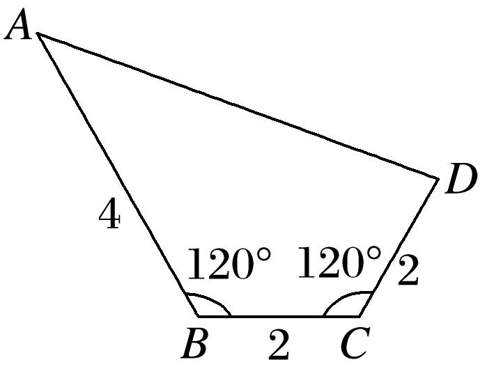

14．答案　5　解析　连接*BD*，四边形面积可分为△*ABD*与△*BCD*两部分的和，由余弦定理得*BD*＝2，

<em>S</em>△<em>BCD</em>＝<em>BC</em>·<em>CD</em>sin 120°＝，∠<em>ABD</em>＝120°－30°＝90°，∴<em>S</em>△<em>ABD</em>＝<em>AB</em>·<em>BD</em>＝4，∴<em>S</em>四边形<em>ABCD</em>＝＋4＝5．

