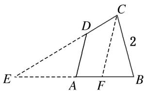
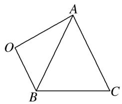

# 专题四 三角形中的最值(范围)问题

# 三角形中最值(范围)问题的解题思路

任何最值(范围)问题，其本质都是函数问题，三角形中的范围(最值)问题也不例外。三角形中的范围(最值)问题的解法主要有两种：一是用函数求解，二是利用基本不等式求解。一般求最值用基本不等式，求范围用函数。由于三角形中的最值(范围)问题一般是以角为自变量的三角函数问题，所以，除遵循函数问题的基本要求外，还有自己独特的解法。

要建立所求量(式子)与已知角或边的关系，然后把角或边作为自变量，所求量(式子)的值作为函数值，转化为函数关系，将原问题转化为求函数的值域问题。这里要利用条件中的范围限制，以及三角形自身范围限制，要尽量把角或边的范围(也就是函数的定义域)找完善，避免结果的范围过大。

# 考点一 三角形中与角或角的函数有关的最值(范围)

# 【例题选讲】

[例 1](1)在 $\triangle ABC$ 中，角 $A$ ， $B$ ， $C$ 的对边分别是 $a$ ， $b$ ， $c$ ，且 $a>b>c$ ， $a^{2}<b^{2}+c^{2}$ ，则角 $A$ 的取值范围是（）

A. $\left(\frac{\pi}{2},\pi\right)$

B. $\left(\frac{\pi}{4},\frac{\pi}{2}\right)$

C. $\left(\frac{\pi}{3},\frac{\pi}{2}\right)$

D. $\begin{pmatrix}0,\frac{\pi}{2}\end{pmatrix}$

(2)在 $\triangle ABC$ 中，若 $AB=1$ ， $BC=2$ ，则角 $C$ 的取值范围是()

A. $\left[0,\frac{\pi}{6}\right]$

B. $\left(0,\frac{\pi}{2}\right)$

C. $\left(\frac{\pi}{6},\frac{\pi}{2}\right)$

D. $\left(\frac{\pi}{6},\frac{\pi}{2}\right]$

(3)在 $\triangle ABC$ 中，内角 $A$ ， $B$ ， $C$ 对应的边分别为 $a$ ， $b$ ， $c$ ， $A \neq \frac{\pi}{2}$ ， $\sin C + \sin(B - A) = \sqrt{2} \sin 2A$ ，则角 $A$ 的取值范围为（）

A. $\left\{0,\frac{\pi}{6}\right]$

B. $\left\{0,\frac{\pi}{4}\right]$

C. $\left[\frac{\pi}{6},\frac{\pi}{4}\right]$

D. $\left[\frac{\pi}{6},\frac{\pi}{3}\right]$

答案 B 解析 法一: 在 $\triangle ABC$ 中, $C=\pi-(A+B)$ , 所以 $\sin(A+B)+\sin(B-A)=\sqrt{2}\sin2A$ , 即 $2\sin B\cos A=2\sqrt{2}\sin A\cos A$ , 因为 $A\neq\frac{\pi}{2}$ , 所以 $\cos A\neq0$ , 所以 $\sin B=\sqrt{2}\sin A$ , 由正弦定理得, $b=\sqrt{2}a$ , 所以 A 为锐角, 又 $\sin B=\sqrt{2}\sin A\in(0,1]$ , 所以 $\sin A\in\left[0,\frac{\sqrt{2}}{2}\right]$ , 所以 $A\in\left[0,\frac{\pi}{4}\right]$ .

法二: 在 $\triangle ABC$ 中, $C=\pi-(A+B)$ , 所以 $\sin(A+B)+\sin(B-A)=\sqrt{2}\sin 2A$ , 即 $2\sin B\cos A=2\sqrt{2}\sin A\cos A$ , 因为 $A\neq\frac{\pi}{2}$ , 所以 $\cos A\neq0$ , 所以 $\sin B=\sqrt{2}\sin A$ , 由正弦定理, 得 $b=\sqrt{2}a$ , 由余弦定理得 $\cos A=\frac{b^{2}+c^{2}-a^{2}}{2bc}=(4)(2014\cdot江苏)$ 若 $\triangle ABC$ 的内角满足 $\sin A+\sqrt{2}\sin B=2\sin C$ , 则 $\cos C$ 的最小值是\_\_\_\_.

(5)设 $\triangle ABC$ 的三边 $a, b, c$ 所对的角分别为 $A, B, C$ , 已知 $a^{2}+2b^{2}=c^{2}$ , 则 $\frac{\tan C}{\tan A}=$ \_\_\_\_; $\tan B$ 的最大值为\_\_\_\_.

(6)在锐角 $\triangle ABC$ 中，角 $A, B, C$ 的对边分别为 $a, b, c$ . 若 $a = 2b\sin C$ ，则 $\tan A + \tan B + \tan C$ 的最小值是（）

A. 4

B. $3\sqrt{3}$

C. 8

D. $6\sqrt{3}$

# 【对点训练】

1. 在不等边三角形 $ABC$ 中, 角 $A, B, C$ 所对的边分别为 $a, b, c$ , 其中 $a$ 为最大边, 如果 $\sin^2 (B + C) < \sin^2 B$

$+\sin^{2}C$ ，则角 A 的取值范围为()

A. $\left(0,\frac{\pi}{2}\right)$

B. $\left(\frac{\pi}{4},\frac{\pi}{2}\right)$

C. $\left(\frac{\pi}{6},\frac{\pi}{3}\right)$

D. $\left(\frac{\pi}{3},\frac{\pi}{2}\right)$

2. 已知 $\triangle ABC$ 的三个内角 $A, B, C$ 所对的边分别为 $a, b, c, a\sin A\sin B + b\cos^2 A = 2a$ ，则角 $A$ 的取值范围是（）

A. $\left(\frac{\pi}{6},\frac{2\pi}{3}\right]$

B. $\left[\frac{\pi}{6},\frac{\pi}{4}\right]$

C. $\left(0,\frac{\pi}{6}\right]$

D. $\left[\frac{\pi}{6},\frac{\pi}{3}\right]$

3. 已知 $a, b, c$ 分别是 $\triangle ABC$ 内角 $A, B, C$ 的对边，满足 $\cos A \sin B \sin C + \cos B \sin A \sin C = 2 \cos C \sin A \sin B$ ，则 $C$ 的最大值为 \_\_\_\_.

4. 在 $\triangle ABC$ 中，角 $A, B, C$ 所对的边分别是 $a, b, c$ ，若 $b^{2}+c^{2}=2a^{2}$ ，则 $\cos A$ 的最小值为\_\_\_\_。

5. 已知 $\triangle ABC$ 的内角 $A, B, C$ 的对边分别为 $a, b, c$ , 且 $\cos 2A + \cos 2B = 2\cos 2C$ , 则 $\cos C$ 的最小值为 ( )

A. $\frac{\sqrt{3}}{2}$

B. $\frac{\sqrt{2}}{2}$

C. $\frac{1}{2}$

D. $-\frac{1}{2}$

6. 在钝角 $\triangle ABC$ 中, 角 $A, B, C$ 所对的边分别为 $a, b, c, B$ 为钝角, 若 $a\cos A = b\sin A$ , 则 $\sin A + \sin C$ 的最大值为 ( )

A. $\sqrt{2}$

B. $\frac{9}{8}$

C. 1

D. $\frac{7}{8}$

7. 在 $\triangle ABC$ 中，角 $A, B, C$ 所对的边分别为 $a, b, c$ ，且 $a\cos B - b\cos A = \frac{1}{2}c$ ，当 $\tan(A - B)$ 取最大值时，角 $B$ 的值为\_\_\_\_。

8. 在 $\triangle ABC$ 中，内角 $A, B, C$ 所对的边分别为 $a, b, c, a\sin A + b\sin B = c\sin C - \sqrt{2}a\sin B$ ，则 $\sin 2A\tan^{2}B$ 的最大值是\_\_\_\_.

9. 在 $\triangle ABC$ 中，若 $\sin C=2\cos A\cos B$ ，则 $\cos^{2}A+\cos^{2}B$ 的最大值为 \_\_\_\_.

10. 在 $\triangle ABC$ 中，角 $A, B, C$ 的对边分别为 $a, b, c$ ，若 $3a\cos C+b=0$ ，则 $\tan B$ 的最大值是\_\_\_\_。

11. (2016 江苏)在锐角三角形 ABC 中，若 $\sin A = 2\sin B\sin C$ ，则 $\tan A\tan B\tan C$ 的最小值是 \_\_\_\_.

12. 在 $\triangle ABC$ 中，角 $A, B, C$ 所对的边分别为 $a, b, c$ ，若 $\triangle ABC$ 为锐角三角形，且满足 $b^{2}-a^{2}=ac$ ，则 $\frac{1}{\tan A}-\frac{1}{\tan B}$ 的取值范围是\_\_\_\_。

13. 在锐角三角形 $ABC$ 中, 已知 $2 \sin^2 A + \sin^2 B = 2 \sin^2 C$ , 则 $\frac{1}{\tan A} + \frac{1}{\tan B} + \frac{1}{\tan C}$ 的最小值为 \_\_\_\_.

# 考点二 三角形中与边或周长有关的最值(范围)

# 【例题选讲】

[例 2](1)已知 $\triangle ABC$ 中，角 A, $\frac{3}{2}B$ , C 成等差数列，且 $\triangle ABC$ 的面积为 $1+\sqrt{2}$ ，则 AC 边的长的最小值是 \_\_\_\_.

(2)(2015·全国Ⅰ)在平面四边形ABCD中， $\angle A=\angle B=\angle C=75^{\circ},BC=2$ ，则AB的取值范围是\_\_\_\_。

text_image

C
D
2
E
A
F
B

(3)在 $\triangle ABC$ 中，若 $C=2B$ ，则 $\frac{c}{b}$ 的取值范围为\_\_\_\_.

(4) (2018·北京) 若 $\triangle ABC$ 的面积为 $\frac{\sqrt{3}}{4} (a^2 + c^2 - b^2)$ ，且 $\angle C$ 为钝角，则 $\angle B =$ \_\_\_\_； $\frac{c}{a}$ 的取值范围是 \_\_\_\_.

(5)在 $\triangle ABC$ 中，角 $A, B, C$ 所对的边分别为 $a, b, c$ ，且满足 $\sin A\sin(B-C)=\sin B\sin C\cos A$ ，则 $\frac{ab}{c^{2}}$ 的最大值为\_\_\_\_.

(6)在 $\triangle ABC$ 中，若 $C=60^{\circ}$ ， $c=2$ ，则 $a+b$ 的取值范围为\_\_\_\_。

(7)在 $\triangle ABC$ 中，角 $A$ ， $B$ ， $C$ 所对的边分别为 $a$ ， $b$ ， $c$ ，且满足 $b^{2}+c^{2}-a^{2}=bc$ ， $\overrightarrow{AB}\cdot\overrightarrow{BC}>0$ ， $a=\frac{\sqrt{3}}{2}$ ，则 $b+c$ 的取值范围是（）

A. $\left(1,\frac{3}{2}\right)$

B. $\left(\frac{\sqrt{3}}{2},\frac{3}{2}\right)$

C. $\left(\frac{1}{2},\frac{3}{2}\right)$

D. $\left(\frac{1}{2},\frac{3}{2}\right]$

(8) (2018·江苏)在 $\triangle ABC$ 中，角 $A, B, C$ 所对的边分别为 $a, b, c, \angle ABC=120^{\circ}$ ， $\angle ABC$ 的平分线交 $AC$ 于点 $D$ ，且 $BD=1$ ，则 $4a+c$ 的最小值为\_\_\_\_.

答案 9 解析 因为 $\angle ABC = 120^{\circ}$ ， $\angle ABC$ 的平分线交 $AC$ 于点 $D$ ，所以 $\angle ABD = \angle CBD = 60^{\circ}$ ，由三角形的面积公式可得 $\frac{1}{2} ac\sin 120^{\circ} = \frac{1}{2} a \times 1 \times \sin 60^{\circ} + \frac{1}{2} c \times 1 \times \sin 60^{\circ}$ ，化简得 $ac = a + c$ ，又 $a > 0$ ， $c > 0$ ，所以 $\frac{1}{a} + \frac{1}{c} = 1$ ，则 $4a + c = (4a + c) \cdot \left(\frac{1}{a} + \frac{1}{c}\right) = 5 + \frac{c}{a} + \frac{4a}{c} \geqslant 5 + 2\sqrt{\frac{c}{a} \cdot \frac{4a}{c}} = 9$ ，当且仅当 $c = 2a$ 时取等号，故 $4a + c$ 的最小值为 9.

(9)在 $\triangle ABC$ 中，角 $A$ ， $B$ ， $C$ 所对的边分别为 $a$ ， $b$ ， $c$ ，且满足 $a\sin B=\sqrt{3}b\cos A$ ．若 $a=4$ ，则 $\triangle ABC$ 周长的最大值为\_\_\_\_．

(10)在 $\triangle ABC$ 中， $\angle ACB=60^{\circ}$ ， $BC>1$ ， $AC=AB+\frac{1}{2}$ ，当 $\triangle ABC$ 的周长最短时， $BC$ 的长是\_\_\_\_.

# 【对点训练】

1. 已知 $\triangle ABC$ 的内角 $A, B, C$ 的对边分别为 $a, b, c$ . 若 $a = b\cos C + c\sin B$ ，且 $\triangle ABC$ 的面积为 $1 + \sqrt{2}$ ，则 $b$ 的最小值为（）

A. 2

B. 3

C. $\sqrt{2}$

D. $\sqrt{3}$

2. 已知 $\triangle ABC$ 中, $AB + \sqrt{2} AC = 6$ , $BC = 4$ , $D$ 为 $BC$ 的中点, 则当 $AD$ 最小时, $\triangle ABC$ 的面积为 \_\_\_\_.

3. 在 $\triangle ABC$ 中, 内角 $A, B, C$ 的对边分别为 $a, b, c$ , 且 $A=2B, C$ 为钝角, 则 $\frac{c}{b}$ 的取值范围是\_\_\_\_.

4. 在 $\triangle ABC$ 中，角 $A, B, C$ 所对的边分别为 $a, b, c$ ，若 $A=3B$ ，则 $\frac{a}{b}$ 的取值范围是( )

A. $(0, 3)$

B. $(1, 3)$

C. $(0, 1]$

D. $(1, 2]$

5. 已知 $a, b, c$ 分别为 $\triangle ABC$ 的内角 $A, B, C$ 所对的边，其面积满足 $S_{\triangle ABC} = \frac{1}{4} a^2$ ，则 $\frac{c}{b}$ 的最大值为（ ）

A. $\sqrt{2} - 1$

B. $\sqrt{2}$

C. $\sqrt{2}+1$

D. $\sqrt{2}+2$

6. 在 $\triangle ABC$ 中，已知 $c=2$ ，若 $\sin^{2}A+\sin^{2}B-\sin A\sin B=\sin^{2}C$ ，则 $a+b$ 的取值范围为 \_\_\_\_.

7. 在外接圆半径为 $\frac{1}{2}$ 的 $\triangle ABC$ 中， $a, b, c$ 分别为内角 $A, B, C$ 的对边，且 $2a\sin A = (2b + c)\sin B + (2c + b)\sin C$ ，则 $b + c$ 的最大值是（）

A. 1

B. $\frac{1}{2}$

C. 3

D. $\frac{\sqrt{3}}{2}$

8. 在 $\triangle ABC$ 中， $B=60^{\circ}$ ， $AC=\sqrt{3}$ ，则 $2a+c$ 的最大值为\_\_\_\_。

9. 在 $\triangle ABC$ 中， $AB = 2$ ， $C = \frac{\pi}{6}$ ，则 $\sqrt{3} a + b$ 的最大值为（）

A. $\sqrt{7}$

B. $2 \sqrt{7}$

C. $3\sqrt{7}$

D. $4 \sqrt{7}$

10. 在 $\triangle ABC$ 中， $A, B, C$ 的对边分别是 $a, b, c$ 。若 $A=120^{\circ}$ ， $a=1$ ，则 $2b+3c$ 的最大值为( )

A. 3

B. $\frac{2\sqrt{21}}{3}$

C. $3\sqrt{2}$

D. $\frac{3\sqrt{5}}{2}$

11. 在 $\triangle ABC$ 中， $a, b, c$ 分别为三个内角 $A, B, C$ 的对边，且 $BC$ 边上的高为 $\frac{\sqrt{3}}{6} a$ ，则 $\frac{c}{b} + \frac{b}{c}$ 取得最大值时，内角 $A$ 的值为（ ）

A. $\frac{\pi}{2}$

B. $\frac{\pi}{6}$

C. $\frac{2\pi}{3}$

D. $\frac{\pi}{3}$

12. 在锐角 $\triangle ABC$ 中，内角 $A, B, C$ 的对边分别为 $a, b, c$ ，且满足 $(a - b)(\sin A + \sin B) = (c - b) \cdot \sin C$ 。若 $a = \sqrt{3}$ ，则 $b^2 + c^2$ 的取值范围是（）

A. (5, 6]

B. $(3, 5)$

C. (3, 6]

D. $[5, 6]$

13. 在 $\triangle ABC$ 中， $B=60^{\circ}$ ， $AC=\sqrt{3}$ ，则 $\triangle ABC$ 的周长的最大值为\_\_\_\_。

14. 凸函数是一类重要的函数，其具有如下性质：若定义在 $(a, b)$ 上的函数 $f(x)$ 是凸函数，则对任意的 $x_{i} \in (a, b)(i = 1, 2, \ldots, n)$ ，必有 $f\left(\frac{x_1 + x_2 + \ldots + x_n}{n}\right) \geq \frac{f(x_1) + f(x_2) + \ldots + f(x_n)}{n}$ 成立。已知 $y = \sin x$ 是 $(0, \pi)$ 上的凸函数，利用凸函数的性质，当 $\triangle ABC$ 的外接圆半径为 $R$ 时，其周长的最大值为 \_\_\_\_.

# 考点三 三角形中与面积有关的最值(范围)

# 【例题选讲】

[例 3](1)已知 $\triangle ABC$ 的内角 A, B, C 所对的边分别为 a, b, c, $\tan A=\frac{4}{3}$ , a=4，则 $\triangle ABC$ 的面积的最大值为()

A. 4

B. 6

C. 8

D. 12

(2)在 $\triangle ABC$ 中，三个内角 $A, B, C$ 的对边分别为 $a, b, c$ ，若 $\left(\frac{1}{2}b-\sin C\right)\cos A=\sin A\cos C$ ，且 $a=2\sqrt{3}$ ，则 $\triangle ABC$ 面积的最大值为\_\_\_\_.

(3)已知 $\triangle ABC$ 的三个内角 $A, B, C$ 的对边分别为 $a, b, c$ , 面积为 $S$ , 且满足 $4S=a^{2}-(b-c)^{2}, b+c=8$ , 则 $S$ 的最大值为\_\_\_\_.

(4)若 $\triangle ABC$ 的三边长分别为 $a, b, c$ , 面积为 $S$ , 且 $S=c^{2}-(a-b)^{2}, a+b=2$ , 则 $\triangle ABC$ 面积的最大值为\_\_\_\_.  
(5)已知 $\triangle ABC$ 的外接圆半径为 $R$ , 且满足 $2R(\sin^2 A - \sin^2 C) = (\sqrt{2} a - b) \cdot \sin B$ , 则 $\triangle ABC$ 面积的最大值为 \_\_\_\_.  
(6)在 $\triangle ABC$ 中，内角 $A$ ， $B$ ， $C$ 的对边分别为 $a$ ， $b$ ， $c$ ，且满足 $b=c$ ， $\frac{b}{a}=\frac{1-\cos B}{\cos A}$ ．若点 $O$ 是 $\triangle ABC$ 外一点， $\angle AOB=\theta(0<\theta<\pi)$ ， $OA=2$ ， $OB=1$ ，如图所示，则四边形 $OACB$ 面积的最大值是（）

text_image

A
O
B
C

A. $\frac{4 + 5\sqrt{3}}{4}$

B. $\frac{8 + 5\sqrt{3}}{4}$

C. 3

D. $\frac{4+\sqrt{5}}{2}$

# 【对点训练】

1. (2014·全国 I) 已知 $a, b, c$ 分别为 $\triangle ABC$ 的三个内角 $A, B, C$ 的对边， $a = 2$ ，且 $(2 + b)(\sin A - \sin B) = (c - b)\sin C$ ，则 $\triangle ABC$ 面积的最大值为 \_\_\_\_.  
2. 在 $\triangle ABC$ 中, 若 $AB = 2$ , $AC^2 + BC^2 = 8$ , 则 $\triangle ABC$ 面积的最大值为( )

A. $\sqrt{2}$

B. 2

C. $\sqrt{3}$

D. 3

3. 在 $\triangle ABC$ 中， $\overrightarrow{AC} \cdot \overrightarrow{AB} = |\overrightarrow{AC} - \overrightarrow{AB}| = 3$ ，则 $\triangle ABC$ 的面积的最大值为（）

A. $\sqrt{21}$

B. $\frac{3\sqrt{21}}{4}$

C. $\frac{\sqrt{21}}{2}$

D. $3 \sqrt{21}$

4. 已知 $\triangle ABC$ 的内角 $A, B, C$ 的对边分别为 $a, b, c$ , 若 $\triangle ABC$ 的面积 $S = a^2 - (b - c)^2$ , 且 $b + c = 8$ , 则 $S$ 的最大值为 \_\_\_\_.

5. 若 AB=2， $AC=\sqrt{2}BC$ ，则 $S_{\triangle ABC}$ 的最大值为()

A. $2 \sqrt{2}$

B. $\frac{\sqrt{3}}{2}$

C. $\frac{\sqrt{2}}{3}$

D. $3\sqrt{2}$

6. 在 $\triangle ABC$ 中，内角 $A, B, C$ 所对的边分别为 $a, b, c$ . 已知 $\sin A - \sin B = \frac{1}{3}\sin C, 3b = 2a, 2 \leqslant a^2 + ac \leqslant 18$ ，设 $\triangle ABC$ 的面积为 $S, p = \sqrt{2}a - S$ ，则 $p$ 的最大值是（）

A. $\frac{5\sqrt{2}}{9}$

B. $\frac{7\sqrt{2}}{9}$

C. $\sqrt{2}$

D. $\frac{9\sqrt{2}}{8}$

7. 在 $\triangle ABC$ 中，设角 $A, B, C$ 对应的边分别为 $a, b, c$ ，记 $\triangle ABC$ 的面积为 $S$ ，且 $4a^{2}=b^{2}+2c^{2}$ ，则 $\frac{S}{a^{2}}$ 的最大值为\_\_\_\_。

